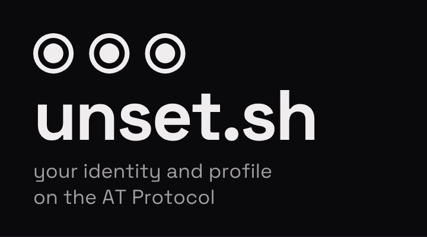

<p align="center">
  <picture>
    <source media="(max-width: 600px) and (prefers-color-scheme: dark)" srcset="docs/human/assets/readme-banner-phone-dark.png">
    <source media="(max-width: 600px)" srcset="docs/human/assets/readme-banner-phone-light.png">
    <source media="(prefers-color-scheme: dark)" srcset="docs/human/assets/readme-banner-dark.svg">
    <source media="(prefers-color-scheme: light)" srcset="docs/human/assets/readme-banner-light.svg">
    
  </picture>
</p>

<p align="center">
  <a href="#status">Status</a> ·
  <a href="#how-it-is-built">How it is built</a> ·
  <a href="#development">Development</a> ·
  <a href="#security">Security</a> ·
  <a href="#licence">Licence</a>
</p>

unset.sh is an identity and profile app for the [AT Protocol](https://atproto.com). Your profile is a set of
records in your own repository on the network, edited and rendered in the app, and you can sign in with any atproto
account or take a hosted one on our own PDS. Short video, follows and chat come later, on the same identity.

It is a rebuild of the 0x40 prototype around a small core that one person can read and audit end to end.

## What we care about

- **Security and privacy first.** Every request is checked against who is asking and fails closed. We collect the
  least data we can, logs never carry a handle, a DID, an IP address or a token, and anything personal can be
  exported and erased.
- **Your identity stays yours.** Handles are checked against their DID in both directions, and your profile lives in
  your repository, so you can take it elsewhere.
- **Small and auditable.** Each running process has its own folder, container, database role and network, and the
  boundaries between them are checked in CI rather than left to memory.
- **Open source and self-hosted.** No per-user analytics, and the app, the PDS and chat all run on
  servers we operate.

## Status

Not usable yet. The project is being built in phases, one small reviewed step per pull request:

| Phase | What it delivers | |
| --- | --- | --- |
| 0 | Repository, CI and guard rails | done |
| 1 | Platform and the first slice: sign in with an atproto account and see your own profile | in progress |
| 2 | Sign-up, sessions and the profile editor | in progress |
| 3 | Indexer, public profiles, directory and moderation | |
| 4 | Social: short video, follows and likes | |
| 5 | Production hosting, backups and the production PDS | |
| 6 | Chat, on Matrix | |

There is no public launch, invite-only included, until all six phases are done. The full plan is
[`docs/ai/PLAN.md`](docs/ai/PLAN.md) and the step-by-step build order is [`docs/ai/book/`](docs/ai/book/).

## How it is built

TypeScript on Node: server-rendered React on [Hono](https://hono.dev) with a few small islands, Postgres for everything
the app decides, and the AT Protocol for everything the user owns. A request travels one way:

```text
apps/web  →  interfaces/http  →  domains/identity  →  infrastructure/pds  →  your PDS
  screens     the door: auth,      product rules        external systems
              CSRF, limits                              behind small contracts
```

| Path | What lives there |
| --- | --- |
| `apps/` | Screens, islands and styles only: `web`, `admin`, and `chat` later |
| `interfaces/` | Entry points, one process and container each: `http`, `admin`, `api`, `indexer`, `media`, `review`, and more as their phase arrives |
| `domains/` | Product rules in product words: `identity`, `content`, `social`, `feed`, `messaging`, `moderation`, `privacy` |
| `infrastructure/` | External systems behind small contracts, plus `net-guard` (the one egress check), `seal` and `audit` |
| `shared/` | Generic code with no product meaning, MIT licensed: `lexicons`, `ui`, `http`, `config`, `errors`, `log` |
| `deployment/`, `tests/` | Compose, edge, backup and preflight; integration and end-to-end tests |
| `docs/` | `human/` for guides, decisions and the engineering guidelines; `ai/` for the plan and step book |
| `scripts/` | Repository tooling: CI guards, budgets, the dev seed |

Folders appear with their first code. Where something belongs and why is in
[`docs/human/architecture.md`](docs/human/architecture.md); every decision that is expensive to reverse has an ADR in
[`docs/human/decisions/`](docs/human/decisions/).

## Development

Requires Node 26 (see `.nvmrc`) and Docker.

```sh
npm ci
git config core.hooksPath scripts/githooks   # secret scan + guards before each commit
npm run check                                # typecheck, lint, guards, tests
```

`npm run check` needs Docker: the Postgres tests start the pinned image themselves and fail, rather than skip, without
it.

Changes land through pull requests, one step each and kept small; the template in
[`.github/pull_request_template.md`](.github/pull_request_template.md) says what a PR must show. The rules every change
follows are in [`CLAUDE.md`](CLAUDE.md) and [`docs/human/engineering/`](docs/human/engineering/).

## Security

Please report vulnerabilities privately to **security@unset.sh**, not in a public issue. What is in scope and how we
respond is in [`.github/SECURITY.md`](.github/SECURITY.md).

## Licence

Everything is [AGPL-3.0-only](LICENSE) except `shared/` (the `sh.unset.*` lexicons, the UI kit and the generic
helpers), which is [MIT](LICENSE-MIT) so other atproto apps can reuse the record types and helpers freely
([ADR 0012](docs/human/decisions/0012-licence.md)).
