# Step outline (build order)

Every step of the book, in build order, as the phase files stand after the editor pass (2026-10-03) and the decision-34
pass (2026-10-04: slice 1 first, see "Slice 1"; decision 35 and English first, see "i18n slice"). The phase files
own the steps; this file only lists them. Where a row and its step disagree, the step wins and this row is the defect.
"Deps" lists direct dependencies only, copied from each step's `Depends on:` line, plus the outline-only rows that
the phase files' Notes ask for. Tags are explained in `00-README.md`.

How to read it:
- **Build order** is the row order. It follows the phase file's order except where a step depends on one written
  after it; there the outline moves the step down (see "Dependency check" at the end).
- **Depth.** Phases 0, 1 and 2 are **build-ready**. Phases 3 to 6 and the launch gate are **detail by risk**: the
  expensive-to-reverse parts are in full, the algorithms are a reviewed hypothesis, and each phase's `.00 Refine`
  step re-reads the phase against what was built and is reviewed before any other step of that phase (README
  "Depth of detail").
- **Outline-only rows** (*no body yet*) are steps the Notes ask for that have no step text in a phase file:
  P4.00 and P4.14a (P4.00 writes P4.14a; P4.28 already depends on it).
- `P4.00\*`: phase-4.md does not list P4.00 in its headers; the outline adds it to every Phase 4 step with no other
  Phase 4 dependency, because the Refine step comes before every other step of the phase.
- **Diagrams**: one per phase, drawing only dependencies between steps of that phase. An edge already implied through
  another drawn edge is left out to keep the graph readable; dependencies on earlier phases are in the table only.

## Phase 0 — Repository and guard rails

Depth: **build-ready**. 29 steps (P0.09a retired, P0.09d added; editor pass 2026-10-04 evening; P0.09f, P0.09g, P0.09h, P0.09i, P0.09j, P0.09k, P0.09l, P0.11a and P0.13a added 2026-10-05; P0.07a and P0.09m added 2026-10-06).

| Id | Step | Tags | Deps | Owner file |
|---|---|---|---|---|
| P0.01 | Create the empty private repository and grant the Claude GitHub app access | [ALEX] | — | `phase-0.md` |
| P0.02 | Push the bootstrap bundle tip and reconcile it with the revised plan | — | P0.01 | `phase-0.md` |
| P0.03 | Ruleset on `main` (applied 2026-10-06, ADR 0017; deferred before that, decision 41), repository Actions settings, CODEOWNERS with security-review paths | [ALEX] [SEC] | P0.02 (its push, step 5; not the reconcile PR) | `phase-0.md` |
| P0.04 | Toolchain: TypeScript 7, Node 26, Vitest only, `.npmrc`, "discovered equals executed" | — | P0.03 | `phase-0.md` |
| P0.05 | Lint stack: Biome CSS rules, dependency-cruiser on the swc parser, file-size and line-budget warnings | — | P0.04 | `phase-0.md` |
| P0.06 | Repo guards as Vitest tests, each with a planted failing fixture (includes the `pds-admin` file exemption and the `ip-columns` check) | [SEC] | P0.05 | `phase-0.md` |
| P0.07 | CI workflow: pinned images and actions, full gate set, secrets and OIDC bound to `main` | [SEC] [ALEX] (tail: required checks) | P0.06 | `phase-0.md` |
| P0.08 | Renovate replaces Dependabot; exact pins; lockfile and workspace-link guard | [SEC] [ALEX] (tail: app install) | P0.07 | `phase-0.md` |
| P0.09 | Repository docs: slim CLAUDE.md/AGENTS.md, SECURITY.md, licence line, ADR index, the book | — | P0.03 | `phase-0.md` |
| P0.09a | ~~Carried-over notes from the prototype~~ **Retired** (plan §8 Phase 0: no old note carried wholesale; `.00` steps port what they need) | — | P0.09 | `phase-0.md` |
| P0.09b | Severity definitions, labels, bug template and triage form | [ALEX] | P0.03, P0.07 | `phase-0.md` |
| P0.09e | Classify grant changes for the trusted base (split from P0.09c) | [SEC] | P0.03 | `phase-0.md` |
| P0.09c | Change-shape checks: commit messages and PR title, PR size, PR template headings (added, decision 35) | [ALEX] (tail: required check) | P0.07, P0.08, P0.09, P0.09b, P0.09e | `phase-0.md` |
| P0.09f | Let the root lockfile ride with a trusted package's dependency change (SE-6 ruling 2026-10-05 02:50Z) | [SEC] | P0.09c | `phase-0.md` |
| P0.09g | Repo-root tidy (config files out of the root) | — | P0.09f, P0.13 | `phase-0.md` |
| P0.09h | Size guard counts a pure rename once | — | P0.09g, P0.09i | `phase-0.md` |
| P0.09i | pr-shape skips template headings for Renovate only | — | P0.09g | `phase-0.md` |
| P0.09l | Checks skip draft PRs | — | P0.09i | `phase-0.md` |
| P0.07a | Secrets job: per-PR range, public-key exception | [SEC] [ALEX] | P0.07, P0.09l | `phase-0.md` |
| P0.09j | Guard fixtures isolate git from the caller's environment | — | P0.09g | `phase-0.md` |
| P0.09k | Case-collision guard | — | P0.09j | `phase-0.md` |
| P0.09m | Grant parser classifies one-part schema names (waits for Alex's typed word: a loosening) | [SEC] [ALEX] | P0.09e | `phase-0.md` |
| P0.09d | AI notes vault and the notes guard (added, Alex 2026-10-04 22:11Z) | — **parallel-safe** (touches only `scripts/guards/` and `docs/ai/`) | P0.06 | `phase-0.md` |
| P0.10 | Secret scanning, push protection, hardware-key 2FA and offline codes, allowed-signers file | [ALEX] [SEC] | P0.03; runbook PR: P0.07 | `phase-0.md` |
| P0.11a | Reserved-label list and registrar checklist (agent part of P0.11) | — | P0.04, P0.07 | `phase-0.md` |
| P0.11 | Domains: registration, DNSSEC, CAA and parked records, HSTS plan, reserved-label list | [ALEX] | Alex part: —; agent PR: P0.04, P0.07, P0.11a | `phase-0.md` |
| P0.12 | Offline key ceremony and the key inventory | [ALEX] [SEC] | ceremony: P0.10; agent PR: P0.04, P0.07 | `phase-0.md` |
| P0.13 | Licence decision gates the first public commit (answered: AGPL-3.0 apps, MIT building blocks and lexicons; per-package licence files) | [STOP] (answered) | the question: —; ADR PR: P0.04, P0.07 | `phase-0.md` |
| P0.13a | Licence check stays inside the test timeout | — | P0.13 | `phase-0.md` |
| P0.14 | Phase 0 exit: planted faults are blocked; protection drills run once the ruleset is applied (GitHub Pro, 2026-10-06; no merge attempts) | [ALEX] (tail: applies the ruleset) | P0.03, P0.07, P0.08, P0.10 | `phase-0.md` |

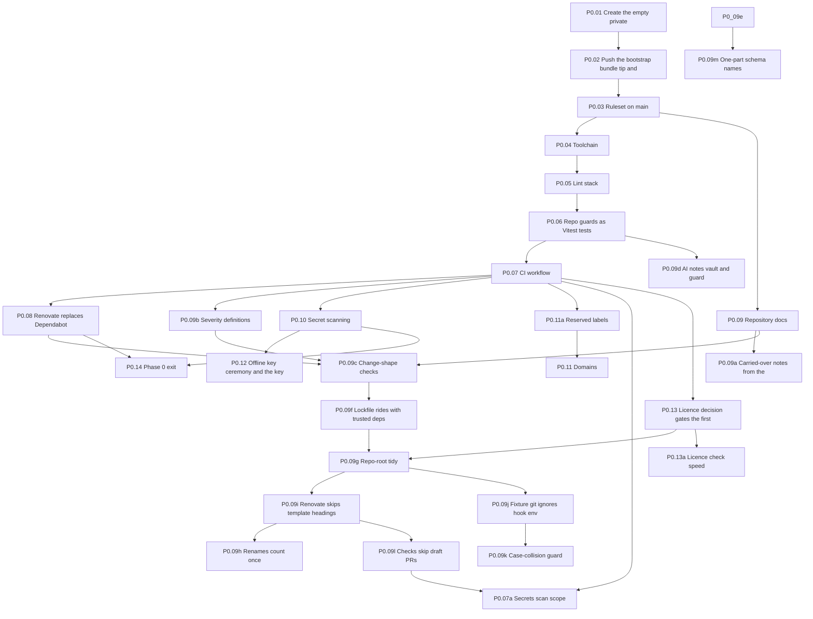

## Slice 1 — Sign in with an atproto account and see your own profile (decision 34)

Depth: **build-ready**. 94 steps: 76 from `phase-1.md`, 18 from `phase-2.md` (including the
added exit step P2.13a). **English only** (Alex, 2026-10-04 12:58Z): P1.19 moved to the "i18n slice" below; slice-1 screens
keep their English text in one `messages.ts` per feature. Built first after Phase 0 (plan §8 Phase 1 "First slice", guideline §12): `apps/web →
interfaces/http → domains/identity → infrastructure/pds →` the `local` development PDS (P1.29). The reasons each
non-obvious step is here (seal for the OAuth tokens, audit for P2.12's age-gate row, limits for login, the UI shell, the edge in front of the PDS, the set JSON for the scope strings, the onboarding and email gates)
are in `phase-1.md`, "Slices". Slice 2 starts only after P2.13a is merged.

| Id | Step | Tags | Deps | Owner file |
|---|---|---|---|---|
| P1.01 | Workspace skeleton | — | P0.05 | `phase-1.md` |
| P1.01s | Semgrep custom rules: computed imports and floating promises (parallel-safe) | [SEC] | P1.01, P0.07 | `phase-1.md` |
| P1.02 | Typed config loader per entrypoint | [SEC] | P1.01 | `phase-1.md` |
| P1.03 | Error model, error-code catalog, structured logger with a field allowlist | — | P1.02 | `phase-1.md` |
| P1.03w | Fixed-word string fields in `shared/log` (SE-7 ruling) | [SEC] | P1.03 | `phase-1.md` |
| P1.04l | Name the HTTP server kit's log events (split from P1.04k, SE-6) | — | P1.03 | `phase-1.md` |
| P1.04q | Route registration guard (split from P1.04k, SE-6) | — | P0.09c | `phase-1.md` |
| P1.04k | HTTP server kit in `shared/http/` (split from P1.04, SE-6) | — | P1.03, P1.04l | `phase-1.md` |
| P1.04c | Composition root guard (split from P1.04, SE-6) | — | P0.09c | `phase-1.md` |
| P1.04m | Route table lists every route option (split from P1.04, SE-6) | — | P1.04k | `phase-1.md` |
| P1.04 | HTTP server skeleton per entrypoint | — | P1.04k, P1.04q, P1.04c, P1.04m, P0.13a | `phase-1.md` |
| P1.05e | Trusted proxy keys in the entrypoint test envs (split from P1.05, SE-6) | — | P1.04 | `phase-1.md` |
| P1.05 | Trusted proxy: the client IP from one configured header only | [SEC] | P1.04, P1.05e | `phase-1.md` |
| P1.06e | Name the rate limiter's log events (split from P1.06, SE-6) | — | P1.05e | `phase-1.md` |
| P1.06 | Body limits and the rate-limit primitive | [SEC] | P1.05, P1.06e | `phase-1.md` |
| P1.06q | Route policy guard (split from P1.06p, SE-6) | — | P0.09c | `phase-1.md` |
| P1.06p | Per-interface rate-limit policy tables and the every-route-has-a-policy check | [SEC] | P1.06, P1.06q, P1.04 | `phase-1.md` |
| P1.07e | Name the CSRF log event (split from P1.07, SE-6) | — | P1.03 | `phase-1.md` |
| P1.07 | CSRF gate | [SEC] | P1.04, P1.07e | `phase-1.md` |
| P1.08e | Seed the CSP config key and name the CSP log event (split from P1.08, SE-6) | — | P1.04, P1.03 | `phase-1.md` |
| P1.08 | CSP builder and security headers | [SEC] | P1.04, P1.08e | `phase-1.md` |
| P1.08i | `inline-style` guard (split from P1.08, SE-6) | — | P1.08 | `phase-1.md` |
| P1.09 | Return-path validator, fuzz-tested | [SEC] | P1.01 | `phase-1.md` |
| P1.10 | Island props serialiser, fuzz-tested | [SEC] | P1.01 | `phase-1.md` |
| P1.11h | Postgres test helper (prelude to P1.11g, SE-6) | [SEC] | P1.02 | `phase-1.md` |
| P1.11g | Postgres bootstrap script: `migrator`, `tap`, the `PUBLIC` revokes (split from P1.11, SE-6) | [SEC] | P1.02, P1.11h | `phase-1.md` |
| P1.11e | Migration log events and the busy error (prelude to P1.11, SE-6) | — | P1.03 | `phase-1.md` |
| P1.11q | Transactions and pool-access Semgrep rules (split from P1.11, SE-6) | — | P1.01s | `phase-1.md` |
| P1.11 | Postgres and the migration runner as the `migrator` role | — | P1.11e, P1.11g, P1.11q, P1.02 | `phase-1.md` |
| P1.11p | Pool, transactions and the connection budget (split from P1.11) | — | P1.11 | `phase-1.md` |
| P1.11t | Postgres integration setup and the query budget test (split from P1.11) | — | P1.11p, P1.11v | `phase-1.md` |
| P1.11v | Gated integration `globalSetup` in `vitest.config.ts` (split from P1.11t, SE-6) | — | P1.11p | `phase-1.md` |
| P1.11w | Make the integration `globalSetup` unconditional | — | P1.11t, P1.11v | `phase-1.md` |
| P1.12 | Roles and grants, the role roster, default privileges, grant-matrix test | [SEC] | P1.11p, P1.11w | `phase-1.md` |
| P1.12t | Tests connect as the process roles (split from P1.12) | — | P1.12 | `phase-1.md` |
| P1.12p | Role password sync (split from P1.12, SE-6) | [SEC] | P1.12, P0.09 (`roles.ts` in the trusted base) | `phase-1.md` |
| P1.12x | Export `syncRolePasswords` and test role logins (split from P1.12p) | [SEC] | P1.12p, P1.12t | `phase-1.md` |
| P1.13 | DID-column registry test reading `pg_catalog` | — | P1.12t | `phase-1.md` |
| P1.14q | New trusted workspace may carry its root reference and lockfile entries (check part of P1.14; SE-6 `q`) | [SEC] | P0.09 | `phase-1.md` |
| P1.14 | Seal: AES-256-GCM envelope encryption with key ids, bound contexts and rotation | [SEC] | P1.14q, P1.02, P1.12 | `phase-1.md` |
| P1.14d | Sealed type and column registry (split from P1.14; P1.14m first if pr-shape classes the migration trusted) | [SEC] | P1.14, P1.13 | `phase-1.md` |
| P1.15 | Audit: append-only `audit.append()`, two hash-chained lanes, side tables, chain verifier | [SEC] | P1.12, P1.13 | `phase-1.md` |
| P1.16g | Retention's USAGE on schema `app` (trusted, split from P1.16) | [SEC] | P1.12 | `phase-1.md` |
| P1.16 | Durable single-use nonce and ticket store | [SEC] | P1.16g, P1.12t, P1.12, P1.13 | `phase-1.md` |
| P1.17 | Per-DID Postgres advisory lock helper (the OAuth client's `requestLock`) | — | P1.11p | `phase-1.md` |
| P1.18 | `net-guard` core: classify addresses, resolve once, pin the connection | [SEC] | P1.02 | `phase-1.md` |
| P1.18a | `net-guard` requests: policies, no redirects, size, time and decompression caps | [SEC] | P1.18 | `phase-1.md` |
| P1.20 | Framework-glue spike | [SPIKE] | P1.04, P1.10 | `phase-1.md` |
| P1.21q | CSS budget in `scripts/budgets/` (check part of P1.21; SE-6 `q`) | — | P1.20 | `phase-1.md` |
| P1.21 | Token pipeline | — | P1.21q, P1.20 | `phase-1.md` |
| P1.21l | CSS lint rules and the layer guard (split from P1.21, SE-6) | — | P1.21 | `phase-1.md` |
| P1.21m | Font metrics for the fallback faces (split from P1.21) | — | P1.21 | `phase-1.md` |
| P1.22 | Base styles and theme, English only (server-applied, no cookie variation on public pages; the locale half is P1.22b) | [SEC] | P1.21, P1.21l, P1.21m, P1.07, P1.09 | `phase-1.md` |
| P1.23q | Island budget and its dependency-cruiser rule (check part of P1.23; SE-6 `q`) | [SEC] | P1.20, P1.08 | `phase-1.md` |
| P1.23 | Island runtime | [SEC] | P1.23q, P1.20, P1.08, P1.22 | `phase-1.md` |
| P1.23r | Style-prop lint and island CI wiring (check part of P1.23, after it) | [SEC] | P1.23 | `phase-1.md` |
| P1.23f | CSS scope function (product split of P1.23v) | — | — | `phase-1.md` |
| P1.23v | CSS Modules check config: Vitest scoped names, TOOLING widened to app Vite configs | [SEC] [ALEX] | P1.23f | `phase-1.md` |
| P1.23w | Allow the render-entry subpath import (one depcruise row; check step) | [SEC] [ALEX] | P1.23v | `phase-1.md` |
| P1.23c | CSS Modules server-render glue (gap-fill for P1.23) | — | P1.23, P1.23r, P1.23v, P1.23w | `phase-1.md` |
| P1.24i | Icons and inventory (split from P1.24) | [SEC] | P1.22, P1.23r | `phase-1.md` |
| P1.24h | `safeHref` (trusted base, split from P1.24) | [SEC] | P1.22 | `phase-1.md` |
| P1.24q | UI inventory guard (check part of P1.24; SE-6 `q`) | — | P1.24i | `phase-1.md` |
| P1.24 | UI kit, part 1a: Button, Link, Tag, Mark, SectionHeading, Kbd and the form components | — (every sheet piece approved, sheet v45, 2026-10-04) | P1.24i, P1.24h, P1.23c | `phase-1.md` |
| P1.24s | UI kit, part 1b: Avatar, Switch, SkipLink, MediaFrame, DescriptionList, Pagination | — | P1.24i, P1.24h, P1.23c | `phase-1.md` |
| P1.24a | UI kit, part 2: blocks, chrome and interactive components (added step) | — | P1.24, P1.24s, P1.24q, P1.23, P1.23r | `phase-1.md` |
| P1.25 | App shell and error pages | — | P1.24, P1.24a, P1.08 | `phase-1.md` |
| P1.26 | Accessibility and browser test harness | — | P1.25 | `phase-1.md` |
| P1.27q | Image and mirror workflows, required checks (check part of P1.27; SE-6 `q`) | [SEC] | P1.04, P0.07 | `phase-1.md` |
| P1.27 | Container images, mirrored upstreams, SBOM, provenance and signatures | [SEC] | P1.27q, P1.04, P0.07 | `phase-1.md` |
| P1.28 | Edge (Caddy) | [SEC] | P1.27 | `phase-1.md` |
| P1.29 | Development stack (`compose.dev.yaml`) | [SEC] | P1.12p, P1.12x, P1.11p, P1.27, P1.28 | `phase-1.md` |
| P1.30 | Deploy preflight | [SEC] | P1.27 | `phase-1.md` |
| P1.32 | Permanent choices (ask Alex) | [STOP] [PERMANENT] | — | `phase-1.md` |
| P1.31 | Lexicons package (with `sh.unset.follow` in the first set, answer 29b) | [PERMANENT] [SEC] [ALEX] [STOP] (Alex approves fields and consent text in its PR) | P1.01, P1.32 (Q4, the permission-set NSID) | `phase-1.md` |
| P1.37 | Legal paperwork, round 1 (Alex) | [ALEX] | — | `phase-1.md` |
| P2.01k | `resolveTxt` in `net-guard` (split from P2.01, SE-6) | [SEC] | P1.18 | `phase-2.md` |
| P2.01q | `alsoKnownAs` guard (split from P2.01, SE-6) | — | P0.09c | `phase-2.md` |
| P2.01m | `resolveVetted` on c-ares for public names | [SEC] | P2.01k | `phase-2.md` |
| P2.01 | DID and handle resolution | [SEC] | P2.01k, P2.01q, P1.18 | `phase-2.md` |
| P2.01a | The identity network adapter (size split from P2.01) | [SEC] | P2.01 | `phase-2.md` |
| P2.02 | `verifyHandle(did)` | [SEC] | P2.01 | `phase-2.md` |
| P2.02x | Export verifyHandle from the identity index (split from P2.02, SE-6) | — | P2.02 | `phase-2.md` |
| P2.03 | Session store and lifecycle | [SEC] | P1.12 | `phase-2.md` |
| P2.04 | OAuth client | [SEC] | P1.14, P1.14d, P1.17, P1.31, P2.01 | `phase-2.md` |
| P2.05 | Login | [SEC] | P2.04, P1.09 | `phase-2.md` |
| P2.06 | Callback | [SEC] | P2.05, P2.03, P2.02, P2.02x, P1.07, P1.16 | `phase-2.md` |
| P2.07 | Resilience: one wrapper for PDS calls | [SEC] | P2.04 | `phase-2.md` |
| P2.08 | Logout and "sign out everywhere" | [SEC] | P2.06 | `phase-2.md` |
| P2.11 | Email-verify gate | [SEC] | P2.06, P2.07 | `phase-2.md` |
| P2.15 | Legal paperwork part 2 | — (content approved by Alex through the PR) | P1.25, P1.37 | `phase-2.md` |
| P2.12 | Onboarding: age, terms, chat placeholder | [SEC] | P2.06, P2.11, P2.15, P1.15 | `phase-2.md` |
| P2.13 | `/me` and the settings shell | — | P2.06, P1.25 | `phase-2.md` |
| P2.13a | Slice 1 exit: sign in and see your own profile, architecture review, `docs/human/features/sign-in.md` (added, decision 34) | [STOP] (next slice after Alex reads the review) | P2.13, P2.08, P2.12, P1.26, P1.29, P1.30, P2.01a, P2.01m | `phase-2.md` |

```mermaid
flowchart TD
  P1_01["P1.01 Workspace skeleton"]
  P1_02["P1.02 Typed config loader per entrypoint"]
  P1_03["P1.03 Error model"]
  P1_04["P1.04 HTTP server skeleton per"]
  P1_04k["P1.04k HTTP server kit in shared/http/"]
  P1_03w["P1.03w fixed-word log fields"]
  P1_04l["P1.04l HTTP kit log events"]
  P1_04q["P1.04q route registration guard"]
  P1_04c["P1.04c composition root guard"]
  P1_04m["P1.04m route table options"]
  P1_05["P1.05 Trusted proxy"]
  P1_05e["P1.05e proxy keys in test envs"]
  P1_06e["P1.06e rate limiter log events"]
  P1_06["P1.06 Body limits and the rate-limit"]
  P1_06q["P1.06q route policy guard"]
  P1_06p["P1.06p Per-interface rate-limit tables"]
  P1_07e["P1.07e CSRF log event"]
  P1_07["P1.07 CSRF gate"]
  P1_08e["P1.08e CSP prelude"]
  P1_08["P1.08 CSP builder and security headers"]
  P1_08i["P1.08i inline-style guard"]
  P1_09["P1.09 Return-path validator"]
  P1_10["P1.10 Island props serialiser"]
  P1_11["P1.11 Postgres and the migration runner"]
  P1_11g["P1.11g Postgres bootstrap script"]
  P1_11h["P1.11h Postgres test helper"]
  P1_11e["P1.11e Migration log events"]
  P1_11q["P1.11q Transactions and pool rules"]
  P1_11p["P1.11p Pool and transactions"]
  P1_11t["P1.11t Postgres integration setup"]
  P1_11v["P1.11v Gated integration globalSetup"]
  P1_11w["P1.11w Unconditional globalSetup"]
  P1_12["P1.12 Roles and grants"]
  P1_12t["P1.12t Tests on the process roles"]
  P1_12p["P1.12p Role password sync"]
  P1_12x["P1.12x Password export and login test"]
  P1_13["P1.13 DID-column registry test reading"]
  P1_14q["P1.14q Trusted workspace guard"]
  P1_14["P1.14 Seal: AES-256-GCM envelope"]
  P1_14d["P1.14d Sealed type and registry"]
  P1_15["P1.15 Audit: append-only audit.append"]
  P1_16g["P1.16g Retention schema USAGE"]
  P1_16["P1.16 Durable single-use nonce and"]
  P1_17["P1.17 Per-DID Postgres advisory lock"]
  P1_18["P1.18 net-guard core"]
  P1_18a["P1.18a net-guard requests"]
  P1_20["P1.20 Framework-glue spike"]
  P1_21["P1.21 Token pipeline"]
  P1_21l["P1.21l CSS lint rules and layer guard"]
  P1_21m["P1.21m Font metrics"]
  P1_22["P1.22 Base styles"]
  P1_23["P1.23 Island runtime"]
  P1_23r["P1.23r Style lint and island CI"]
  P1_23f["P1.23f CSS scope function"]
  P1_23v["P1.23v CSS Modules check config"]
  P1_23w["P1.23w Render-entry import row"]
  P1_23c["P1.23c CSS Modules glue"]
  P1_24i["P1.24i Icons and inventory"]
  P1_24h["P1.24h safeHref"]
  P1_24q["P1.24q UI inventory guard"]
  P1_24["P1.24 UI kit"]
  P1_24s["P1.24s UI kit part 1b"]
  P1_24a["P1.24a UI kit"]
  P1_25["P1.25 App shell and error pages"]
  P1_26["P1.26 Accessibility and browser test"]
  P1_27["P1.27 Container images"]
  P1_28["P1.28 Edge Caddy"]
  P1_29["P1.29 Development stack"]
  P1_30["P1.30 Deploy preflight"]
  P1_32["P1.32 Permanent choices"]
  P1_31["P1.31 Lexicons package"]
  P1_37["P1.37 Legal paperwork"]
  P2_01["P2.01 DID and handle resolution"]
  P2_01k["P2.01k resolveTxt in net-guard"]
  P2_01q["P2.01q alsoKnownAs guard"]
  P2_01m["P2.01m resolveVetted on c-ares"]
  P2_01a["P2.01a Identity network adapter"]
  P2_02["P2.02 verifyHandledid"]
  P2_02x["P2.02x verifyHandle export"]
  P2_03["P2.03 Session store and lifecycle"]
  P2_04["P2.04 OAuth client"]
  P2_05["P2.05 Login"]
  P2_06["P2.06 Callback"]
  P2_07["P2.07 Resilience"]
  P2_08["P2.08 Logout and sign out everywhere"]
  P2_11["P2.11 Email-verify gate"]
  P2_15["P2.15 Legal paperwork part 2"]
  P2_12["P2.12 Onboarding"]
  P2_13["P2.13 /me and the settings shell"]
  P2_13a["P2.13a Slice 1 exit"]
  P1_01 --> P1_02
  P1_02 --> P1_03
  P1_04 --> P1_05e
  P1_05e --> P1_05
  P1_05 --> P1_06
  P1_04 --> P1_07
  P1_04 --> P1_08
  P1_01 --> P1_09
  P1_01 --> P1_10
  P1_02 --> P1_11g
  P1_11g --> P1_11
  P1_02 --> P1_11h
  P1_11h --> P1_11g
  P1_11e --> P1_11
  P1_11q --> P1_11
  P1_11 --> P1_11p
  P1_11p --> P1_11t
  P1_11p --> P1_11v
  P1_11v --> P1_11t
  P1_11t --> P1_11w
  P1_11v --> P1_11w
  P1_11w --> P1_12
  P1_11p --> P1_12
  P1_12 --> P1_12t
  P1_12t --> P1_13
  P1_12 --> P1_14
  P1_14q --> P1_14
  P1_14 --> P1_14d
  P1_13 --> P1_14d
  P1_13 --> P1_15
  P1_13 --> P1_16
  P1_16g --> P1_16
  P1_11p --> P1_17
  P1_02 --> P1_18
  P1_18 --> P1_18a
  P1_04 --> P1_20
  P1_10 --> P1_20
  P1_20 --> P1_21
  P1_21 --> P1_22
  P1_21 --> P1_21l
  P1_21 --> P1_21m
  P1_21l --> P1_22
  P1_21m --> P1_22
  P1_07 --> P1_22
  P1_09 --> P1_22
  P1_20 --> P1_23
  P1_08 --> P1_23
  P1_22 --> P1_23
  P1_22 --> P1_24i
  P1_22 --> P1_24h
  P1_24 --> P1_24a
  P1_24i --> P1_24
  P1_23 --> P1_23c
  P1_23r --> P1_23c
  P1_23f --> P1_23v
  P1_23v --> P1_23w
  P1_23w --> P1_23c
  P1_23c --> P1_24
  P1_23c --> P1_24s
  P1_24h --> P1_24
  P1_24i --> P1_24q
  P1_24i --> P1_24s
  P1_24h --> P1_24s
  P1_24s --> P1_24a
  P1_24q --> P1_24a
  P1_23 --> P1_24a
  P1_23 --> P1_23r
  P1_23r --> P1_24i
  P1_23r --> P1_24a
  P1_24a --> P1_25
  P1_25 --> P1_26
  P1_04 --> P1_27
  P1_27 --> P1_28
  P1_11p --> P1_29
  P1_28 --> P1_29
  P1_27 --> P1_30
  P1_01 --> P1_31
  P1_32 --> P1_31
  P1_18 --> P2_01
  P2_01 --> P2_02
  P1_12 --> P2_03
  P1_14 --> P2_04
  P1_14d --> P2_04
  P1_17 --> P2_04
  P1_31 --> P2_04
  P2_01 --> P2_04
  P2_04 --> P2_05
  P1_09 --> P2_05
  P2_05 --> P2_06
  P2_03 --> P2_06
  P2_02 --> P2_06
  P2_02 --> P2_02x
  P2_02x --> P2_06
  P1_07 --> P2_06
  P1_16 --> P2_06
  P2_04 --> P2_07
  P2_06 --> P2_08
  P2_06 --> P2_11
  P2_07 --> P2_11
  P1_25 --> P2_15
  P1_37 --> P2_15
  P2_11 --> P2_12
  P2_15 --> P2_12
  P1_15 --> P2_12
  P2_06 --> P2_13
  P1_25 --> P2_13
  P2_13 --> P2_13a
  P2_08 --> P2_13a
  P2_12 --> P2_13a
  P1_26 --> P2_13a
  P1_29 --> P2_13a
  P1_30 --> P2_13a
  P1_03 --> P1_04k
  P1_03 --> P1_03w
  P1_03 --> P1_04l
  P1_04l --> P1_04k
  P1_04q --> P1_04
  P1_04c --> P1_04
  P1_04k --> P1_04m
  P1_04m --> P1_04
  P1_08 --> P1_08i
  P1_12 --> P1_12p
  P1_12p --> P1_12x
  P1_12t --> P1_12x
  P1_12p --> P1_29
  P1_12x --> P1_29
  P1_06 --> P1_06p
  P1_06q --> P1_06p
  P1_05e --> P1_06e
  P1_06e --> P1_06
  P1_03 --> P1_07e
  P1_07e --> P1_07
  P1_04 --> P1_08e
  P1_03 --> P1_08e
  P1_08e --> P1_08
  P2_01k --> P2_01
  P2_01q --> P2_01
  P2_01k --> P2_01m
  P2_01 --> P2_01a
  P2_01m --> P2_13a
  P2_01a --> P2_13a
```

## i18n slice — EN/FR catalogs and the locale preference (English first, Alex 2026-10-04 12:58Z)

Depth: **build-ready**. 2 steps, after slice 1 (P2.13a merged) and before the Phase 1 exit (P1.38), which needs both
languages; it may run before, beside or after the slice-2 steps. Alex's answer on the step-book card (against the
recommendation): slice 1 is English only, its screens keeping their English text in one `messages.ts` per feature (plain
exported constants, no catalog machinery). This slice's **first task** (P1.19 steps 0a–0d) converts those modules into
the EN/FR catalogs; P1.22b adds the locale half of P1.22 and French to P1.26's test matrix. No French page ships before
this slice lands.

| Id | Step | Tags | Deps | Owner file |
|---|---|---|---|---|
| P1.19q | i18n catalog check in `scripts/lint/` (check part of P1.19; SE-6 `q`) | — | P1.01, P1.03, P2.13a | `phase-1.md` |
| P1.19 | i18n runtime and EN/FR catalogs; missing-key and unused-key checks; first, convert the slice-1 messages modules | — | P1.19q, P1.01, P1.03, P2.13a | `phase-1.md` |
| P1.22b | Locale: negotiation, `?lang`, the locale cookie and language links (moved out of P1.22; added) | [SEC] | P1.19, P1.22, P1.25, P1.26 | `phase-1.md` |

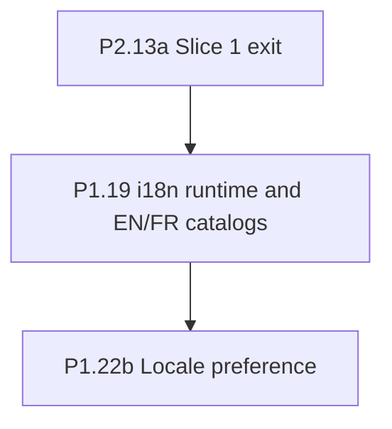

## Phase 1, slice 2 — Lexicon authority, server baseline and platform completion

Depth: **build-ready**. 15 steps, after slice 1: `sealTo`, audit retention, the egress proxy mode, image publishing
and signing (P1.27s, contingent on Alex's guard approval), the server baseline with Tailscale, retiring the prototype, `unset.ac` and the lexicon authority, compliance skeletons, the
Arachnid application, and the Phase 1 exit.

| Id | Step | Tags | Deps | Owner file |
|---|---|---|---|---|
| P2.13b | graphify code graphs in CI (added, editor pass 2026-10-04 evening; PI-2) | — | P2.13a, P0.07 | `phase-2.md` |
| P1.14a | `sealTo`: encrypt-only sealing to an offline-held public key (age X25519) | [SEC] | P1.02, P1.14 | `phase-1.md` |
| P1.15a | Audit retention: segments, retention-checked redaction, erasure by lane | [SEC] | P1.15 | `phase-1.md` |
| P1.18b | `net-guard` forward-proxy mode and the egress proxy for processes that are not ours | [SEC] | P1.18a | `phase-1.md` |
| P1.33q | Outside-probe workflow (check part of P1.33; SE-6 `q`) | [SEC] | P1.32 | `phase-1.md` |
| P1.33 | Server baseline (Alex) | [ALEX] [SEC] | P1.33q, P1.32, P1.28 (only for the outside probe through the edge) | `phase-1.md` |
| P1.33a | Retire the 0x40 prototype before P1.34 (formerly L.01 part A; decision 24) | [ALEX] [SEC] | P1.33 | `phase-1.md` |
| P1.34 | `unset.ac` registered; dev PDS made fit to host the lexicon authority (Alex) | [ALEX] [SEC] [PERMANENT] | P1.30, P1.33, P1.33a, P0.12, P0.11, P1.29 | `phase-1.md` |
| P1.35q | Lexicon monitor workflow and script (check part of P1.35; SE-6 `q`) | [SEC] | P1.18 | `phase-1.md` |
| P1.35 | Lexicon authority on the dev PDS; schemas and permission set published under MIT (Alex) | [ALEX] [PERMANENT] [SEC] | P1.35q, P1.31 (its approved PR), P1.34, P0.12, P0.13 (licence ADR), P1.18 | `phase-1.md` |
| P1.27s | Publish, sign and attest images (contingent split from P1.27q) | [SEC] [ALEX] | P1.27q, P1.27 | `phase-1.md` |
| P1.24b | Remaining islands, after the budget ruling (added step) | — | P1.24a, plus an architecture ruling (runtime share or budget raise) | `phase-1.md` |
| P1.36 | Compliance skeletons | — | P0.07 | `phase-1.md` |
| P1.37a | Apply for Arachnid Shield access (Alex) | [ALEX] | — | `phase-1.md` |
| P1.38 | Phase 1 exit | — | P1.26, P1.19, P1.22b, P1.35, P1.33, P1.34, P1.36, P1.37, P1.37a | `phase-1.md` |

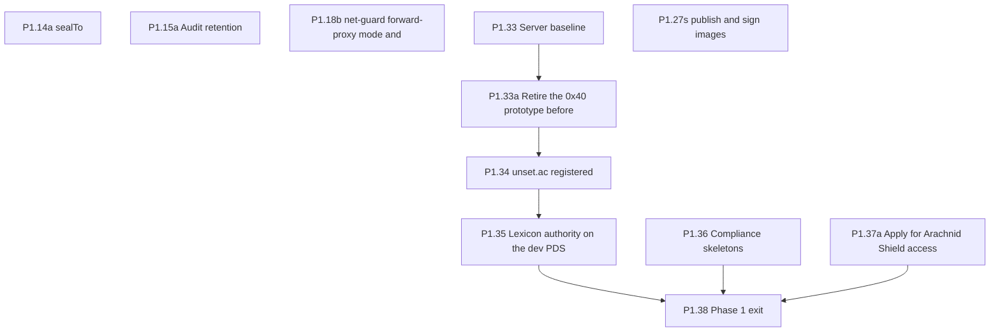

## Phase 2 — Identity, auth, profile writing (after slice 1 and slice 2)

Depth: **build-ready**. 19 steps here; P2.01–P2.08, P2.11–P2.13, P2.15 and P2.13a are in slice 1 above.

| Id | Step | Tags | Deps | Owner file |
|---|---|---|---|---|
| P2.09k | `pds-admin` egress policy in `net-guard` (split from P2.09, SE-6) | [SEC] | P1.18a | `phase-2.md` |
| P2.09 | Minimal `pds-admin` (`invite.issue` only) | [SEC] | P2.09k, P1.27, P1.29, P1.34 | `phase-2.md` |
| P2.09d | `pds-admin` in the dev stack (split from P2.09, SE-6) | [SEC] | P2.09 | `phase-2.md` |
| P2.10 | Invites and `/join?invite=` | [SEC] | P2.09d, P2.09, P2.05, P1.14, P1.14d | `phase-2.md` |
| P2.14 | Module identity seam | [SEC] | P1.16, P2.03 | `phase-2.md` |
| P2.16b | PDQ hasher (one module for images and video frames) | [SEC] | P1.01 | `phase-2.md` |
| P2.16 | Image fingerprint stage (interface, local PDQ, fake check) | [SEC] [MOD] | P2.16b, P1.02, P1.12, P1.15 | `phase-2.md` |
| P2.17 | Image pipeline | [SEC] | P2.16, P2.16b | `phase-2.md` |
| P2.18k | `object-store` egress policy in `net-guard` (split from P2.18, SE-6) | [SEC] | P1.18a | `phase-2.md` |
| P2.18 | Draft store | [SEC] | P2.18k, P1.12, P1.18, P1.24, P2.17 | `phase-2.md` |
| P2.19 | Draft media preview (minimal `media` entrypoint) | [SEC] | P2.18, P1.08 | `phase-2.md` |
| P2.20 | `ProfileView` | [SEC] | P1.24 | `phase-2.md` |
| P2.21 | Profile editor | — | P2.16, P2.18, P2.19, P2.20, P1.23, P1.31 | `phase-2.md` |
| P2.22 | Privacy switches as a state machine | [SEC] (Q-A, Q-D provisional; Q-B, Q-C, Q-E answered) | P2.21, P2.07 | `phase-2.md` |
| P2.23 | Publish and unpublish | [SEC] | P2.21, P2.22, P1.31, P2.07 | `phase-2.md` |
| P2.24 | §5.3 go/no-go spike | [SPIKE] [ALEX] | P1.34 | `phase-2.md` |
| P2.26 | Phase 2 exit | — | P2.23, P2.24, P2.13a, P1.38 | `phase-2.md` |
| P2.26aq | Postmortem template and its docs check (check part of P2.26a; SE-6 `q`) | — | P2.26 | `phase-2.md` |
| P2.26a | Minimal deploy by verified digest for the test host (added, decision 35 D5) | [SEC] | P2.26aq, P2.26, P1.27, P1.27s, P1.30, P1.11p, P1.33 | `phase-2.md` |
| P2.25 | Closed test track | [ALEX] | P2.26, P2.26a, P2.10, P2.15, P2.16 | `phase-2.md` |

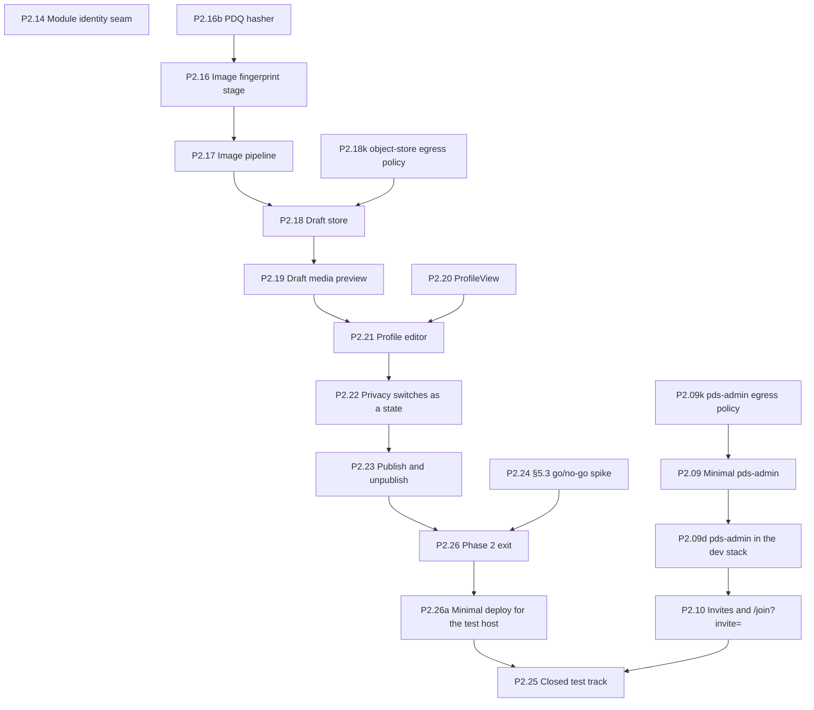

## Phase 3 — Indexer, public profile, directory, admin v1

Depth: **detail by risk; P3.00 refines** (contract parts in full, algorithms a reviewed hypothesis). 36 steps.

| Id | Step | Tags | Deps | Owner file |
|---|---|---|---|---|
| P3.00 | Refine Phase 3 | [STOP] | P2.26 (every Phase 0–2 step merged) | `phase-3.md` |
| P3.01 | Tap spike | [SPIKE] | P3.00, P1.29 | `phase-3.md` |
| P3.03 | Index schema | [SEC] | P3.00, P1.12, P1.13 | `phase-3.md` |
| P3.02 | Tap deployment and repo tracking | [SEC] | P3.01, P3.03, P2.06 | `phase-3.md` |
| P3.04 | Ingest invariants as tests first | — | P3.03 | `phase-3.md` |
| P3.05 | Ingest | [SEC] | P3.04, P3.02, P1.31 | `phase-3.md` |
| P3.06g | Grants for the account-state machine (SE-6) | [SEC] | P3.03, P2.04 | `phase-3.md` |
| P3.06 | Account-state machine | [SEC] | P3.06g, P3.05, P2.03 | `phase-3.md` |
| P3.07g | Grant for `eraseDid` on the audit lane (SE-6) | [SEC] | P3.06g, P1.15a | `phase-3.md` |
| P3.07k | `eraseDid` SQL and its storage and untrack hooks (split from P3.07, SE-6) | [SEC] | P3.07g, P3.06, P1.13, P1.15a, P2.18 | `phase-3.md` |
| P3.07 | `eraseDid`: hand-written `core.erase_did`, the `eraseHooks` list (no registry), `core.erase_pending_hold` for held material | [SEC] | P3.07k, P3.07g, P3.06, P1.13, P1.15a, P2.18 | `phase-3.md` |
| P3.08 | Handle registry rule | [SEC] | P3.06, P2.02 | `phase-3.md` |
| P3.09 | Media proxy for published blobs | [SEC] | P3.06, P2.19 | `phase-3.md` |
| P3.10 | `api` entrypoint: public XRPC | [SEC] | P3.05, P1.06 | `phase-3.md` |
| P3.11 | Service-auth JWT verifier; signed-in `getTimeline` and `searchProfiles` | [SEC] | P3.10, P1.16 | `phase-3.md` |
| P3.12 | Public `/@handle` and `/@handle/p/{rkey}` | [SEC] | P3.09, P2.20, P2.02 | `phase-3.md` |
| P3.13 | Handle hosts | — | P3.12 | `phase-3.md` |
| P3.14 | Directory and search | — | P3.05 | `phase-3.md` |
| P3.15 | Report intake and the public notice form | [MOD] [SEC] | P3.12, P3.06, P1.15, P1.14, P1.14d | `phase-3.md` |
| P3.16 | `pds-admin` v1: envelope pipeline, key model and migration from P2.09 | [SEC] | P3.00, P2.09, P1.15 | `phase-3.md` |
| P3.16d | `pds-admin`: verb table, limits, receipts, alerts and the digest | [SEC] | P3.16 | `phase-3.md` |
| P3.16a | `pds-admin`: delete holds and the held delete | [SEC] | P3.16d | `phase-3.md` |
| P3.16b | `pds-admin`: reaper and break-glass CLI | [SEC] | P3.16a | `phase-3.md` |
| P3.16c | `pds-admin`: preserve verbs (legal holds) for Phase 4 | [SEC] [MOD] | P3.16a | `phase-3.md` |
| P3.17 | `admin` skeleton | [SEC] | P3.00, P1.33, P1.12, P1.23 | `phase-3.md` |
| P3.18 | WebAuthn enrolment with attestation, and login | [SEC] [ALEX] | P3.17, P3.16, P3.16d, P1.16 | `phase-3.md` |
| P3.18a | Enrolment verification CLI, roster signing and `checkAttestation` | [SEC] [ALEX] | P3.18 | `phase-3.md` |
| P3.19 | Per-action signing | [SEC] | P3.18 | `phase-3.md` |
| P3.20 | Admin screens: cases, lookup and account actions | [SEC] | P3.19, P3.15, P3.06, P3.16d | `phase-3.md` |
| P3.20a | Admin screens: invites, holds and owner switches | [SEC] | P3.20, P3.16a, P3.07 | `phase-3.md` |
| P3.20b | Admin screens: audit viewer, reports queue and reconciliation | [SEC] | P3.20 | `phase-3.md` |
| P3.20c | `ops` schema, health board and monitor | [SEC] | P3.20b, P3.16b, P3.16d | `phase-3.md` |
| P3.21 | Suspend end to end | [SEC] | P3.20, P3.09, P3.06, P3.05 | `phase-3.md` |
| P3.22g | Grants for the audit verifier and anchoring (SE-6) | [SEC] | P1.15a, P3.20c | `phase-3.md` |
| P3.22 | Audit chain anchors, nightly verifier and admin runbooks 1–8 | [SEC] [ALEX] | P3.22g, P1.15, P3.16d, P3.20c | `phase-3.md` |
| P3.23 | Phase 3 exit | — | every Phase 3 step; directly P3.07, P3.13, P3.16c, P3.18a, P3.20a, P3.21, P3.22 | `phase-3.md` |

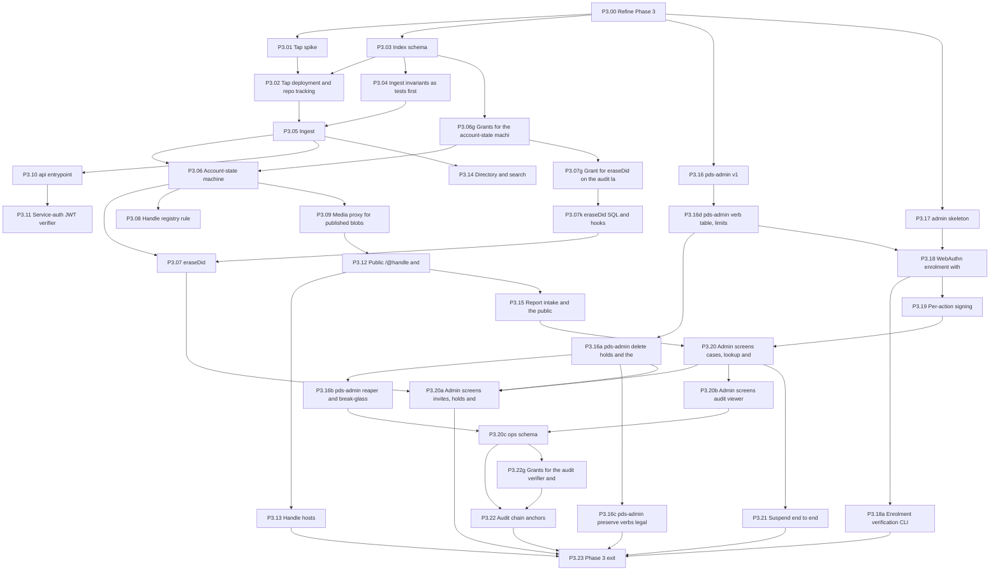

## Phase 4 — Video, review, social, feeds

Depth: **detail by risk; P4.00 refines** (contract parts in full, algorithms a reviewed hypothesis). 38 steps.

| Id | Step | Tags | Deps | Owner file |
|---|---|---|---|---|
| P4.00 | Refine Phase 4 (re-read the phase against what was built; reviewed before any other P4 step) *(outline row only; no body yet)* | [STOP] | P3.23 | `phase-4.md` |
| P4.01 | Decisions before building: the private-account interaction matrix (comment and like record types now settled by the plan) | [STOP] | P4.00\* | `phase-4.md` |
| P4.02 | Lexicons: `sh.unset.video`, `sh.unset.comment`, `sh.unset.like` | [ALEX] (schema publish, permission-set PR) | P4.00\*, P1.31 (P4.01 only for the matrix docs table) | `phase-4.md` |
| P4.03 | Upload intake into the draft store, with the caps and the C-16 transmission buffer | [SEC] | P4.00\*, P2.18, P2.16, P1.14a | `phase-4.md` |
| P4.04g | Grants for the `review` roles on existing tables (SE-6) | [SEC] | P4.03, P1.12 | `phase-4.md` |
| P4.04 | `review` worker skeleton: no-network compute container, egress container, Postgres job queue | [SEC] | P4.04g, P4.00\*, P1.27, P1.12, P1.18, P1.18b, P1.02, P1.03 | `phase-4.md` |
| P4.05 | Probe, limits and transcode: ffprobe validation, stripped 1080p master, 360p and 720p faststart renditions, posters | [SEC] | P4.04, P4.03 | `phase-4.md` |
| P4.06 | Video fingerprints: PDQ on sampled frames, checked through the `FingerprintCheck` stage from the egress step | [SEC] [MOD] | P4.05, P2.16 (`FingerprintCheck` stage, fake), P2.16b (PDQ) | `phase-4.md` |
| P4.07g | Legal-hold reader logins (SE-6) | [SEC] | P4.00\*, P1.12 | `phase-4.md` |
| P4.07k | Legal-hold domain and the offline export CLI (split from P4.07, SE-6) | [SEC] [MOD] | P4.07g, P4.06, P3.16c, P1.14a | `phase-4.md` |
| P4.07 | Match path: block, sealed 365-day legal hold on `pds-admin`'s clock, transmission data held unread, Cybertip.ca report by an owner, no moderator view; the suspected-abuse emergency path (answer 30c) | [SEC] [MOD] | P4.07k, P4.07g, P4.06, P3.16, P3.16c, P4.03, P3.20, P1.14a, P3.07 | `phase-4.md` |
| P4.07h | The body of `core.is_held` (split from P4.07, SE-6) | [SEC] [MOD] | P4.07 | `phase-4.md` |
| P4.08 | Local image gate: nudity (NudeNet class) and gore (hold-only), in the no-network container | [MOD] | P4.05 | `phase-4.md` |
| P4.09 | Local transcript (whisper.cpp `base`) → draft WebVTT captions | — | P4.05 | `phase-4.md` |
| P4.09a | Local text gate: rules, Detoxify multilingual, Llama Guard 3 1B, in the no-network container (answers 30, 30b) | [MOD] [SEC] [SPIKE] (step 0) | P4.04, P4.09 | `phase-4.md` |
| P4.10 | Claude classifier: a documented later option, OFF in v1 (answer 30b; enabled only by an Alex-approved PR after measurement) | [SEC] [MOD] [ALEX] (enabling it) | P4.08, P4.09a (measurements) | `phase-4.md` |
| P4.11 | Submission and review routing: pass → publishable; fail → blocked with reason and appeal; unsure → admin queue; suspected → P4.07 | [MOD] | P4.07, P4.08, P4.09a | `phase-4.md` |
| P4.12 | Draft review queue in `admin` (the written carve-out): blurred thumbnails, 360p play (answer 32), transcript, decision, reason code | [SEC] [MOD] | P4.11, P3.20 | `phase-4.md` |
| P4.13 | Appeals decided by a person; statements of reasons say when automated means were used | [MOD] | P4.12 | `phase-4.md` |
| P4.14 | Publish a video: publish screen with consent and caption editor, one `applyWrites`, upload deleted after review | [SEC] | P4.11, P4.02, P2.23 | `phase-4.md` |
| P4.14a | Unpublish a video: repo delete, `media/` removal, Bluesky post delete *(outline row only; no body yet)* | (P4.00 sets them) | P4.14 | `phase-4.md` |
| P4.15 | "Also post to Bluesky": spike against our PDS, then the opt-in tick | [SPIKE] [ALEX] (disposable crawled PDS hostname) | P4.14 | `phase-4.md` |
| P4.16g | `media` read grants for playback (SE-6) | [SEC] | P4.14, P4.02, P3.03 | `phase-4.md` |
| P4.16 | Playback: renditions through the media proxy, and the player | [SEC] | P4.16g, P4.05, P4.14, P4.02, P3.09 | `phase-4.md` |
| P4.17 | Standalone Bluesky posts (text and images) through the same review | [MOD] [SEC] | P4.11, P4.08, P4.09a, P4.13, P2.16, P2.17, P2.07, P2.22 | `phase-4.md` |
| P4.17a | Interaction policy: the P4.01 matrix as typed data | [SEC] | P4.01, P2.22, P3.05, P1.13 | `phase-4.md` |
| P4.18 | Follows per the P4.01 matrix (mixed by target: `sh.unset.follow` or `app.bsky.graph.follow`, answer 29b); Follow button on profiles | [SEC] | P4.17a, P3.12, P3.05, P2.07, P1.17, P1.31 | `phase-4.md` |
| P4.19 | Likes keyed on URI, not CID; foreign likes ignored; counts survive edits | [SEC] | P4.17a, P3.05, P2.07, P1.17 | `phase-4.md` |
| P4.20 | Comments with the correct reply root | [SEC] [MOD] | P4.17a, P3.05, P2.07, P4.11, P4.13, P1.17 | `phase-4.md` |
| P4.21a | Bluesky pictures through our media server (fetch, verify, fingerprint, re-encode, serve; answer 33) | [SEC] [MOD] | P3.09, P2.16, P2.16b, P2.17, P2.01, P1.18a, P4.07 (the labels step is a soft link only, see phase-4; editor pass 2026-10-04) | `phase-4.md` |
| P4.21 | Home timeline: our videos from the index plus Bluesky `getTimeline` through the user's PDS | [SEC] | P4.18, P2.07, P4.16, P4.19, P4.20, P4.21a | `phase-4.md` |
| P4.22 | Feed tabs: saved feeds in the app DB, `getFeed` through the PDS proxy, our own feeds | [SEC] | P4.21 | `phase-4.md` |
| P4.22a | Our feed generators for third-party unset.sh clients | [SEC] [ALEX] | P4.22, P3.11, P3.10 | `phase-4.md` |
| P4.23 | Labels: our labeler's stream into `label`, `atproto-accept-labelers`, hide and warn | [MOD] [SEC] | P4.21 | `phase-4.md` |
| P4.24 | Report button on every post | [MOD] [SEC] | P3.15, P2.07, P4.23 | `phase-4.md` |
| P4.25g | `retention` grants on existing tables (SE-6) | [SEC] | P4.03, P4.06, P4.07, P4.08, P4.09, P4.13, P4.17, P4.20, P1.12, P2.18 | `phase-4.md` |
| P4.25 | Draft and upload expiry jobs (30 days) under the `retention` role | [SEC] | P4.25g, P4.03, P4.07, P4.07h, P4.13, P4.17, P4.20, P1.12, P2.18 | `phase-4.md` |
| P4.26 | Export page: CAR link plus JSON of every app-DB row for the DID; `dsar.export` | [SEC] | P4.00\*, P3.07, P1.13, P2.13, P2.18 | `phase-4.md` |
| P4.27 | Nightly `metrics_daily`: rounded service-wide counts, no DID, 13-month retention | [SEC] | P4.14, P4.25, P3.15 | `phase-4.md` |
| P4.28 | Phase 4 exit: prototype social parity, one regression test per §2 defect, rendition and first-frame budgets | — (gate) | P4.16, P4.17, P4.18, P4.19, P4.20, P4.21, P4.22, P4.22a, P4.23, P4.24, P4.25, P4.26, P4.27, P4.14a | `phase-4.md` |

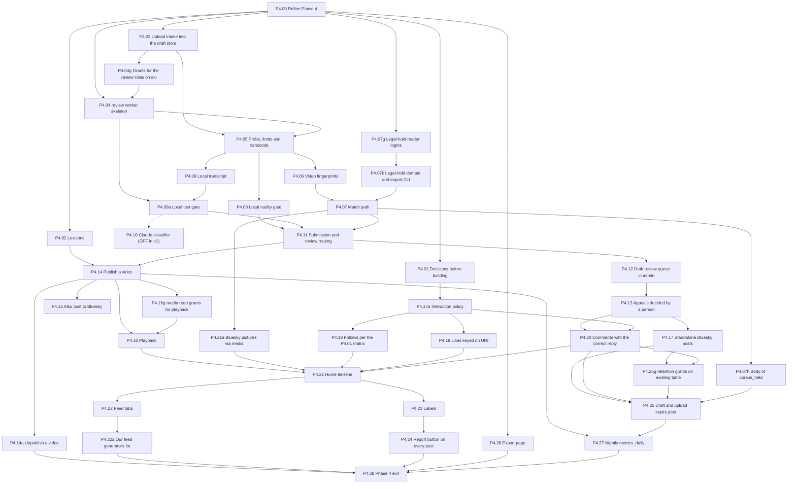

## Phase 5 — Production

Depth: **detail by risk; P5.00 refines** (contract parts in full, algorithms a reviewed hypothesis). 25 steps.

| Id | Step | Tags | Deps | Owner file |
|---|---|---|---|---|
| P5.00 | Refine Phase 5 | [STOP] | P4.28 | `phase-5.md` |
| P5.01 | Hosting and backup storage decision | [STOP] [ALEX] | P5.00 | `phase-5.md` |
| P5.02g | `backup` role grants (SE-6) | [SEC] | P5.00, P1.12 | `phase-5.md` |
| P5.02 | Production compose with profiles, per-container egress and own-host flows | [SEC] | P5.02g, P5.01 | `phase-5.md` |
| P5.04q | Backup-freshness workflow (check part of P5.04; SE-6 `q`) | [SEC] | P5.02 | `phase-5.md` |
| P5.04 | Backups: age-encrypted, off-box, with freshness alerts | [SEC] | P5.04q, P5.02 | `phase-5.md` |
| P5.05 | Restore drill on a fresh host, scripted and timed | [ALEX] | P5.04 | `phase-5.md` |
| P5.06 | Secret inventory and rotation runbook | [SEC] [ALEX] | P5.02 | `phase-5.md` |
| P5.07 | Ozone spike, then deployment | [SPIKE] [MOD] [SEC] | P5.02, P4.23 | `phase-5.md` |
| P5.07a | Report routing to Ozone | [MOD] | P5.07 | `phase-5.md` |
| P5.07g | `web` grants on the legal-hold buffer definers, for P5.07b (SE-6) | [SEC] [MOD] | P5.00, P4.07 | `phase-5.md` |
| P5.07b | Real fingerprint check: Arachnid Shield spike and client, image transmission buffer, image legal hold | [SPIKE] [SEC] [MOD] | P5.07g, P5.02, P2.16, P2.16b, P1.14a, P1.18b, P3.16c, P4.03, P4.06, P4.07, P1.37a (approved) | `phase-5.md` |
| P5.02a | Production PDS on `unset.ac` and lexicon authority migration | [ALEX] [SEC] | P5.02, P1.35, P5.07b (decision 23) | `phase-5.md` |
| P5.03 | Deploy by verified digest (grows P2.26a) | [SEC] | P5.02, P5.02a, P1.30, P2.26a | `phase-5.md` |
| P5.08 | Admin v1.1: statements of reasons and notice-form handling | [SEC] [MOD] | P4.13, P5.07 | `phase-5.md` |
| P5.08a | Blob and record takedown: the bytes stop everywhere we serve them | [SEC] [MOD] | P5.08 | `phase-5.md` |
| P5.08b | GDPR cases, erasure that does not depend on the firehose, and the legal-hold rule | [SEC] [MOD] | P5.08 | `phase-5.md` |
| P5.08c | Phase 5 runbooks | — | P5.08, P5.05, P5.06 | `phase-5.md` |
| P5.08d | Forced handle rename and the global upload pause | [SEC] [MOD] | P5.08, P3.16d, P3.19, P3.20a, P2.16 | `phase-5.md` |
| P5.08e | Invite-chain takedown | [SEC] [MOD] | P5.08d, P3.16d, P3.19, P3.20a | `phase-5.md` |
| P5.08f | Exact-email account lookup | [SEC] [MOD] | P5.08, P3.16d, P3.19 | `phase-5.md` |
| P5.09 | Retention jobs for every class in plan §6 | [SEC] | P5.04, P5.07 | `phase-5.md` |
| P5.10 | Security tests from outside and inside: edge limits, spoofed headers, own-host flows, port scan, ZAP | [SEC] | P5.03, P5.02a, P5.07 | `phase-5.md` |
| P5.11 | Capacity: edge per-client limits, review worker CPU quota, firehose bandwidth | [ALEX] | P5.03, P3.02 | `phase-5.md` |
| P5.12 | Final RoPA and privacy notice; one Canadian lawyer hour | [ALEX] | P5.07, P5.09 | `phase-5.md` |
| P5.13 | Phase 5 exit | [STOP] | every Phase 5 step (P5.00–P5.12, P5.07b, P5.08d, P5.08e, P5.08f) | `phase-5.md` |

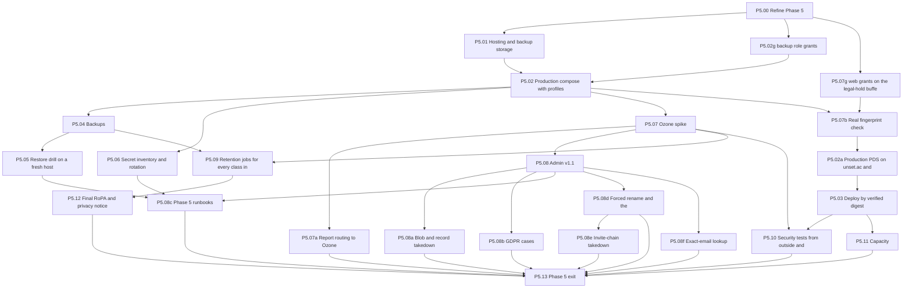

## Phase 6 — Chat

Depth: **detail by risk; P6.00 refines** (contract parts in full, algorithms a reviewed hypothesis). 27 steps.

| Id | Step | Tags | Deps | Owner file |
|---|---|---|---|---|
| P6.00 | Refine Phase 6 | [CHAT], behaves as [SPIKE] | P5.13 (Phase 5 exit) | `phase-6.md` |
| P6.01 | Reference read | [CHAT], behaves as [SPIKE] | P6.00 | `phase-6.md` |
| P6.02 | Synapse and MAS configuration | [SEC] [CHAT] | P6.01, P5.02, P1.32 | `phase-6.md` |
| P6.02a | Edge rules, the Synapse report proxy, and chat preflight | [SEC] [CHAT] | P6.02, P1.28, P1.30, P1.08, P5.10 | `phase-6.md` |
| P6.03 | `chat-auth`: atproto identity to OIDC | [SEC] [CHAT] | P6.02, P2.14, P1.16 | `phase-6.md` |
| P6.04 | `chat-admin`: the seeding service | [SEC] [CHAT] | P6.02, P2.14 | `phase-6.md` |
| P6.05 | Seeding at signup, and the chat contract in `web` | [SEC] [CHAT] | P6.04, P2.12, P2.14, P2.02 | `phase-6.md` |
| P6.06 | Client shell on `chat.unset.sh` | [CHAT] [STOP on new components] | P6.02, P1.24, P1.08, P1.19 | `phase-6.md` |
| P6.06a | Chat-facing read endpoints in `web` | [SEC] [CHAT] | P6.05, P2.03, P2.02, P4.18 | `phase-6.md` |
| P6.07 | Chat login: MAS consent, expected-account check, fail closed on a mismatch | [SEC] [CHAT] | P6.03, P6.06, P6.06a | `phase-6.md` |
| P6.08 | Crypto bootstrap: cross-signing, key backup, recovery key; resumable | [SEC] [CHAT] | P6.07 | `phase-6.md` |
| P6.09 | Isolation mode, own-device verification, device list without location | [SEC] [CHAT] | P6.08 | `phase-6.md` |
| P6.10 | The one `createRoom` wrapper, the invite, and `joinInvitedRoom` | [SEC] [CHAT] | P6.07 | `phase-6.md` |
| P6.10a | Server-side room and media policy in a Synapse module (the Python carve-out) | [SEC] [CHAT] | P6.02, P6.01 | `phase-6.md` |
| P6.11 | Message requests: invite only, accept and decline; server-side spam control | [SEC] [CHAT] | P6.10, P6.10a, P6.06a | `phase-6.md` |
| P6.12 | Timeline, sending text, unread badge | [CHAT] | P6.11 | `phase-6.md` |
| P6.09a | Peer identity change interrupt | [SEC] [CHAT] | P6.09, P6.12 | `phase-6.md` |
| P6.13 | Attachments: refused in unencrypted rooms; the follow gate | [SEC] [CHAT] | P6.12, P6.06a (and through it P4.18) | `phase-6.md` |
| P6.14 | Block, and report a message or a person | [CHAT] [MOD] | P6.12, P3.15 | `phase-6.md` |
| P6.14a | Chat report route, report evidence: upload, fingerprint check, verification | [SEC] [CHAT] [MOD] | P6.14, P6.13, P2.16, P4.04, P4.07, P1.14, P1.14d, P1.16, P1.18 | `phase-6.md` |
| P6.15g | `admin` read grant on the chat mapping (SE-6) | [SEC] [CHAT] | P6.00, P2.14 | `phase-6.md` |
| P6.15 | `admin` polls Synapse event and user reports into its queue | [SEC] [MOD] [CHAT] [ALEX] | P6.15g, P6.14a, P6.02a, P3.20, P3.19 | `phase-6.md` |
| P6.16 | Full logout, revoke, and back-channel logout from the app | [SEC] [CHAT] | P6.07, P6.03, P6.05, P2.08 | `phase-6.md` |
| P6.04a | Chat accounts on suspension, takedown, erasure and "sign out everywhere" | [SEC] [CHAT] | P6.04, P6.05, P6.16, P6.15, P3.06, P3.07, P2.08 | `phase-6.md` |
| P6.17 | Onboarding chat step wired into signup | [CHAT] | P6.08, P6.05, P2.12, P6.07 | `phase-6.md` |
| P6.19 | Restore drill re-run with Matrix databases, media and signing keys | [SEC] | P6.17, P5.05, P5.04, P5.06 | `phase-6.md` |
| P6.20 | Phase 6 exit | [CHAT] | P6.13, P6.14a, P6.15, P6.16, P6.17, P6.09a, P6.19, P6.04a | `phase-6.md` |

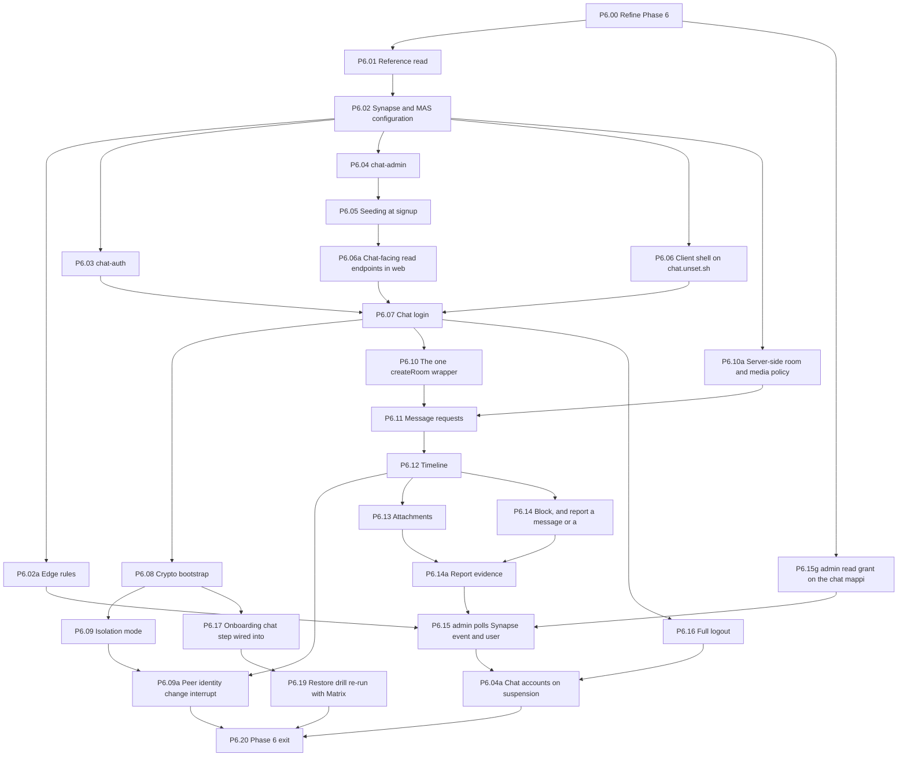

## Launch gate

Depth: **detail by risk; L.00 refines** (contract parts in full, algorithms a reviewed hypothesis). 8 steps.

| Id | Step | Tags | Deps | Owner file |
|---|---|---|---|---|
| L.00 | Refine the launch gate | [STOP] | P6.20 (Phase 6 exit) | `launch-gate.md` |
| L.01 | Placeholders and the final retirement check (part B; part A is P1.33a) | [ALEX] [SEC] | L.00, P5.13, P1.33a (part A, run in Phase 1) | `launch-gate.md` |
| L.02 | Severity gate: no severity-1 or severity-2 bug open | — | L.00, P0.09b | `launch-gate.md` |
| L.03 | Every test executed and passing; ASVS row→test map complete | — | L.00, P6.20 | `launch-gate.md` |
| L.03a | Retro-scan of every test-period upload with the real check | [SEC] [MOD] [STOP] | L.00, P5.07b | `launch-gate.md` |
| L.04 | Final security review (multi-agent plus Alex) | [SEC] | L.00, L.03 | `launch-gate.md` |
| L.05 | Licence re-check before launch | [ALEX] | L.00, P0.13 | `launch-gate.md` |
| L.06 | Invite-only launch | [ALEX] [STOP] | L.01 (part B), L.02, L.03, L.03a, L.04, L.05 | `launch-gate.md` |

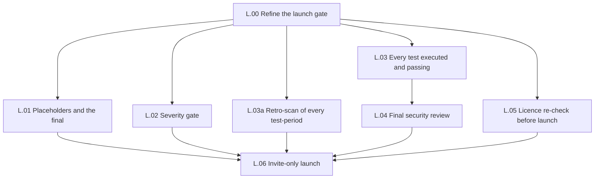

After launch (not a gate; L.00 keeps the list in `launch-gate.md`, "Post-launch follow-ups"). Deferred by Alex
2026-10-06 12:08Z ("we can look into it after launch"); no step before launch depends on these.

| Id | Step | Tags | Deps | Owner file |
|---|---|---|---|---|
| P1.27r | Make `images` a required check (split from P1.27q; deferred until after launch) | [SEC] [ALEX] | P1.27q, L.06 | `phase-1.md` |

## Phase order

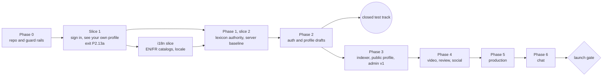

## Ids that moved, were retired or are reserved

| Id | Status |
|---|---|
| P2.16a | Retired. The Arachnid Shield API spike moved to **P5.07b** with the real check (decision 23, global resolution 2). |
| L.01 part A | Now **P1.33a** in Phase 1, before P1.34 (global resolution 8). L.01 keeps part B. |
| L.02's severity definitions | Now **P0.09b**; L.02 keeps only the gate. |
| P0.11b, P0.12b | Not used. P0.11's agent part that needs no input from Alex is P0.11a. The rest of P0.11, and P0.12 and P0.13, stay split inline. |
| P0.09a | Retired (editor pass 2026-10-04 evening): the plan no longer carries old notes wholesale in Phase 0; each `.00` step ports what its phase needs. The vault and its guard are **P0.09d**. |
| P1.36a | Not used: the severity step is P0.09b. |
| P4.07a | Not used: the preserve verbs are **P3.16c**. |
| P6.18 | Retired: the branded Element Web fallback was dropped (Alex answer 53). |
| P4.02a | Reserved: a follow-up PR only if a P4.01 answer needs an extra record. |

## Dependency check (2026-10-04, SE-6 corrections)

Re-run by script over all 237 rows after adding P2.09k, P2.09d, P3.07k and P4.07h: no duplicate id, every dependency
names a step that exists and comes earlier in the row order, every id matches P0.09c's id pattern. Changed
dependencies: P2.09 adds P2.09k; P2.10 adds P2.09d; P3.07 adds P3.07k; P4.25 adds P4.07h. P4.07h follows P4.07 (its
body reads P4.07's table); every other split lands ahead of its feature step.

## Dependency check (2026-10-04, SE-6 follow-up ruling)

Re-run by script over all 233 rows after removing P2.10k, P3.15k and P4.18k and adding P1.06p, P2.01k, P2.18k and
P4.07k: no duplicate id, every dependency names a step that exists and comes earlier in the row order, every id matches
P0.09c's id pattern, and the phase files name no removed id in a `Depends on:` line. Changed dependencies: P2.10, P2.14,
P2.21 drop P2.10k; P3.15, P3.18 drop P3.15k; P4.18, P4.20, P4.21, P4.21a drop P4.18k; P2.01 adds P2.01k; P2.18 adds
P2.18k; P4.07 adds P4.07k. P1.11g (item-5 fix, ahead of P1.11) was added just before this run.

## Dependency check (2026-10-04, SE-6 ruling)

Re-run by script over all 232 rows after adding the 17 split steps below: no duplicate id, every dependency names a step
that exists and comes earlier in the row order, and every id matches P0.09c's `checkCommitMessage` id pattern (one
lowercase letter suffix at most, which is why P5.07b's grants step is `P5.07g`). Changed dependencies: P1.11 adds P1.11g; P1.04 takes
P1.04k instead of P1.03; P1.29 adds P1.12p; P2.10, P2.14, P2.21 add P2.10k; P3.06, P3.07, P3.22 add their `g` step;
P3.15 and P3.18 add P3.15k; P4.04, P4.07, P4.16, P4.25 add their `g` step; P4.18, P4.20, P4.21, P4.21a add P4.18k;
P5.02 adds P5.02g; P5.07b adds P5.07g; P6.15 adds P6.15g. Every new Phase 3–6 step reaches its `.00` step (P4.07g and
P4.18k through `P4.00\*`).

## Dependency check (2026-10-04, decision 35 and English first)

Re-run by script over all rows after moving P1.19 out of slice 1 and adding P0.09c, P1.22b and P2.26a: every dependency
names a step that exists and comes earlier in the row order (result recorded under "Editor pass (2026-10-04, decision
35)"). Changed dependencies: P1.22 drops P1.19 (its locale half moved to P1.22b); P1.19 adds P2.13a (the i18n slice
starts after slice 1); P1.38 adds P1.19 and P1.22b; P2.25 adds P2.26a; P5.03 adds P2.26a. P1.25 and the slice-1 screens
(P2.05, P2.08, P2.11, P2.12, P2.13, P2.15) never listed P1.19 in their `Depends on:` lines; their text now reads their
feature's `messages.ts` in place of the catalogs (phase-1 and phase-2 "Slices"). P6.06 still depends on P1.19, which comes
earlier.

## Dependency check (2026-10-04, decision 34)

Re-run by script after the slice reorder over all 212 rows: every dependency names a step that exists and comes earlier
in the row order. Two violations were found and fixed: P4.21 depended on P4.21a, which was listed after it (P4.21a now
comes first, in the outline and in `phase-4.md`), and P4.21a listed P4.23, which itself depends on P4.21 (a cycle;
P4.21a's own text calls the labels step a soft link, so it was removed from P4.21a's list). The slice reorder changed
these dependencies: P2.04 takes P1.31 instead of P1.35; P2.12 adds P1.15; P2.15 adds P1.37; P2.26 adds P2.13a and P1.38;
the new P2.13a depends on P2.13, P2.08, P2.12, P1.26, P1.29, P1.30.

## Dependency check (2026-10-03)

Checked by script over every row: each dependency names a step that exists and comes earlier in the row order.

- **Missing steps:** none. Every id in a `Depends on:` line exists.
- **Dependencies on a later phase:** none.
- **Steps written before a step they depend on:** none. The editor sweep reordered phase-1, phase-2, phase-3,
  phase-5 and phase-6, so each file's order now matches the row order above.
- **References outside the `Depends on:` lines:** P2.25's wipe script requires L.03a's `retro_scan_record`
  (phase-2 and phase-5 Notes). This is a check at launch time, not a build dependency.
- **Refine steps:** every Phase 3, 5 and 6 step and every launch-gate step reaches its `.00` step through its
  dependencies. Phase 4's headers do not name P4.00
  (see `P4.00\*` above).
- **Exit steps:** P4.28 lists P4.14a, which is still an outline-only row; P4.00 writes its body.

## Stop points at a glance

Taken from the Tags column.

| Kind | Steps |
|---|---|
| Alex acts by hand (`[ALEX]`, including tails) | P0.01, P0.03, P0.07, P0.08, P0.09b, P0.09c, P0.10, P0.11, P0.12, P0.14, P1.31, P1.33, P1.33a, P1.34, P1.35, P1.37, P1.37a, P2.24, P2.25, P3.18, P3.18a, P3.22, P4.02, P4.15, P4.22a, P5.01, P5.05, P5.06, P5.02a, P5.11, P5.12, P6.15, L.01, L.05, L.06 |
| Alex decides; build stops (`[STOP]`, including "STOP on …") | P1.31, P1.32, P2.13a, P3.00, P4.00, P4.01, P5.00, P5.01, P5.13, P6.06, L.00, L.03a, L.06 |
| Spikes that can rewrite later steps (`[SPIKE]`, and steps that behave as one) | P1.20, P2.24, P3.01, P4.09a (step 0), P4.15, P5.07, P5.07b, P6.00, P6.01 |

## Editor pass (2026-10-03, answers 31-53)

- P5.08d now has a body and two siblings, P5.08e (invite-chain takedown) and P5.08f (exact-email lookup), all built
  (Alex answer 45); the conditional note and the outline-only mention are removed; P5.13 depends on all three.
- P6.18 (branded Element Web fallback) removed and its id retired (answer 53); P6.04a loses `[STOP]` (answer 47);
  P6.07 and P6.14a titles follow answers 52 and 50 revised. Phase step counts updated (Phase 5: 23, Phase 6: 26).

## Editor pass (2026-10-04, decision 34)

- Phase 1 and Phase 2 rows regrouped into **Slice 1** (sign in with an atproto account and see your own profile; 48
  rows from both files plus the new exit step P2.13a), **Phase 1, slice 2** (10 rows) and **Phase 2** (15 rows). Step ids
  are unchanged; order, grouping and the dependencies listed under "Dependency check (2026-10-04)" changed. Diagrams
  regenerated per section (transitive edges left out); the phase-order diagram shows the slice.
- P2.13a added to the stop points.
- Ordering check re-run; two Phase 4 violations fixed (P4.21a before P4.21; the P4.21a → P4.23 cycle).
- Step paths follow `layout-map.md`; the outline itself names no code paths.

## Editor pass (2026-10-04, decision 35)

- English first (Alex, step-book card 12:58Z, against the recommendation): P1.19 leaves **Slice 1** (now 47 rows) for a
  new **i18n slice** section with P1.19 and the new P1.22b (the locale half of P1.22). P1.22 is English only and no
  longer depends on P1.19; P1.38 depends on both i18n-slice steps. Slice-1, i18n and phase-order diagrams updated.
- Decision 35 (Alex, 12:56Z, "Adopt all"): new **P0.09c** (commit-message and PR-title check, PR size guard, PR template
  heading check; D2, D3; plan §8 Phase 0 CI list), Phase 0 now 17 steps; new **P2.26a** (minimal deploy by verified digest
  for the test host; D5, findings F-11), Phase 2 now 16 steps; P5.03 grows P2.26a. P0.09c added to the `[ALEX]` stop list.
- Ordering check re-run by script after these changes over all 215 rows: no duplicate id, no missing dependency, no
  dependency on a later row (see "Dependency check (2026-10-04, decision 35 and English first)").

## Editor pass (2026-10-04, SE-6 ruling)

The architecture thread's ruling on SE-6 (plan §9 and the rule as folded at `f9b48f8`): `shared/http/` stays trusted
base; among migrations and `roles.json`, only role and grant changes on objects that already exist are trusted base
(P0.09c parses them, `grant-matrix.json` included); a migration creating new tables, columns or functions rides with its
feature step. A step that needed both is split, the trusted-base part first: `<id>k` for a kit change, `<id>g` for
grants.

- Slice 1 (now 51 rows): **P1.11g** (the Postgres bootstrap script, ahead of P1.11; coordinator follow-up), **P1.04k** (the `shared/http/` server kit, ahead of P1.04), **P1.08i** (the `inline-style`
  guard, after P1.08), **P1.12p** (role password sync, after P1.12).
- Phase 2 (now 17): **P2.10k** (the `signup`, `invite_issue`, `module_handoff`, `editor` policies).
- Phase 3 (now 36): **P3.06g**, **P3.07g**, **P3.15k**, **P3.22g**.
- Phase 4 (now 37): **P4.04g**, **P4.07g**, **P4.16g**, **P4.18k**, **P4.25g**.
- Phase 5 (now 25): **P5.02g**, **P5.07g** (for P5.07b).
- Phase 6 (now 27): **P6.15g**. Launch gate: none.
- Diagrams: each new node and its in-phase edges added; `P1_03 --> P1_04` removed (now through P1.04k).
- Ordering check re-run (see "Dependency check (2026-10-04, SE-6 ruling)").

## Editor pass (2026-10-04, SE-6 follow-up ruling)

The architecture thread ruled on the SE-6 follow-ups; the plan folded them at `6275827` (plan §9's feature-step list:
"tables, columns, views, sequences or functions, with the grants on those new objects and the erasure-registry rows for
columns the same PR creates").

- Rate-limit policies leave the trusted base and live in each interface's `limits.ts`: **P2.10k, P3.15k and P4.18k
  removed** (ids retired; their contents are back in the feature steps), and **P1.06p** added after P1.06 (the
  interface tables and the CI test `every_route_has_policy`).
- `net-guard` and legal-hold splits, trusted-base part first: **P2.01k** (`resolveTxt`), **P2.18k** (`object-store`
  policy), **P4.07k** (legal-hold domain and export CLI).
- Item-5 fix: **P1.11g** (Postgres bootstrap script, whole-path trusted base), ahead of P1.11.
- Counts: Slice 1 53 rows, Phase 2 17, Phase 3 35, Phase 4 37. Diagrams updated (nodes and in-phase edges; removed
  steps' nodes and edges dropped). Ordering check re-run (see "Dependency check (2026-10-04, SE-6 follow-up ruling)").

## Editor pass (2026-10-04, SE-6 corrections)

Coordinator corrections; SE-6 as folded at `6275827` and `badf15a` (plan §9: any change to a function or view the PR
does not create is isolated trusted base).

- **P2.09k** (`pds-admin` egress policy, ahead of P2.09) and **P2.09d** (the dev-stack compose service, after P2.09,
  since `compose.dev.yaml` is not trusted base). P2.09 itself is all trusted base.
- **P3.07k** (`eraseDid` functions and hooks, ahead of P3.07).
- **P4.07h** (the body of `core.is_held`, right after P4.07).
- P5.07g keeps any replacement of P4.07's two definers (no new row).
- Counts: Phase 2 19 rows, Phase 3 36, Phase 4 38. Ordering check re-run (see "Dependency check (2026-10-04, SE-6
  corrections)").

## Editor pass B (2026-10-04 late)

- P1.24: design `[STOP] [ALEX]` removed (every sheet piece approved, sheet v45); P1.24 dropped from the `[ALEX]` and
  `[STOP]` lists. P4.00 keeps `[STOP]`, now also for the Spaces status check (decision 38). No dependency changed.
- Ordering check re-run by script over all 242 rows: no duplicate id, no missing dependency, no dependency listed
  after its dependant.

## Editor pass (2026-10-04 evening)

Editor pass A: P0.09d added (AI notes vault and guard; parallel-safe; depends on P0.06); P0.09a retired; P2.13b added
(graphify in CI, first row of slice 2, after P2.13a); P0.03 and P0.14 titles note decision 41 (updated 2026-10-06 for
GitHub Pro; the ruleset was applied 2026-10-06, ADR 0017).

## Dependency check (2026-10-04 evening)

Re-run by script over all 239 rows after adding P0.09d and P2.13b: no duplicate id, every dependency names a step that
exists and comes earlier in the row order, every id matches P0.09c's id pattern. P0.09d depends on P0.06; P2.13b on
P2.13a and P0.07.
