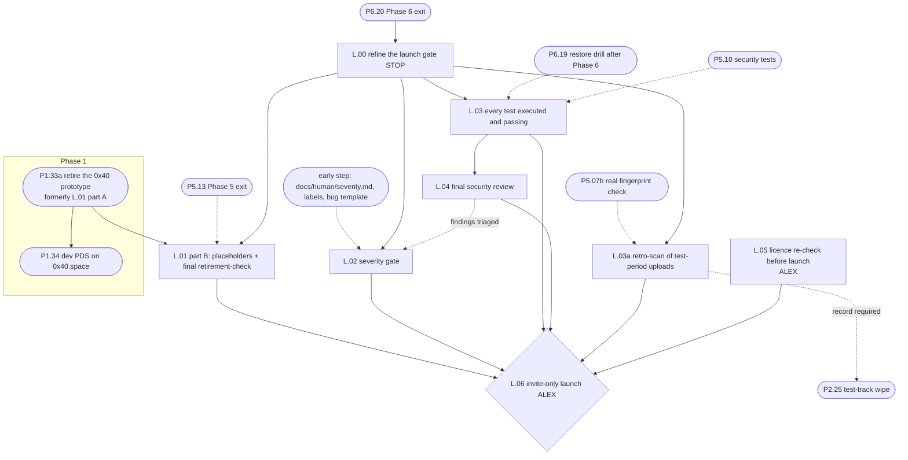

# Launch gate

Status: round 2 (writer-p5, 2026-10-03), after review `reviews/r1-phase-5-and-launch.md`; then the editor pass
(2026-10-03; see the end of the Notes). Source of truth:
`../unset-sh-rebuild-plan.md` §8 "Launch gate" (decision 2, restated), §11 Q2a, Q12, §6 (invite-country rule), plan
issue 19. Where this file and the plan disagree, the plan wins.

**Goal.** Move from "all six phases done" to an invite-only launch on the production stack, and only then.

**Depth of detail (Alex, 2026-10-03, "detail by risk"; `00-README.md`).** The gate is mostly stop points, legal flows
and tests, so most of it keeps full detail:
- the final retirement check and the placeholders (L.01 part B; the retirement itself is P1.33a in Phase 1);
- the scan of every test-period upload with the real fingerprint check (L.03a);
- the severity gate (L.02);
- the test gate (L.03);
- the licence (L.05);
- the launch checks (L.06).

L.04's reviewer split and the runbook wording are a reviewed hypothesis. L.00 refines the whole file against what was
actually built before any gate step runs.

**Exit criteria (plan §8 launch gate):**
- all six phases done, chat included, and every core feature from §4 shipped (P6.20 exit passed);
- no severity-1 or severity-2 bug open, and every severity-3 bug triaged (L.02);
- CI green, with every test executed and passing (L.03);
- the restore drill passing after Phase 6 (P6.19) and the Phase 5 security tests passing (both checked in L.03);
- the Arachnid Shield check live (P5.07b) and every file uploaded during the test period scanned with it (L.03a;
  decision 23);
- a final security review (L.04);
- the licence (decided in P0.13) re-checked before launch (L.05);
- old 0x40 accounts retired **in Phase 1, before P1.34** (P1.33a, formerly L.01 part A), and the placeholders made
  and checked at the gate (L.01 part B);
- then the invite-only launch, with the test track wiped and invites under the invite-country rule (L.06).

**Ordering change (round 1 F12; plan issue 19, settled by decision 24; global resolution 8).** The old prototype PDS runs
on `0x40.space`, the hostname the new development PDS takes in P1.34. Once P1.34 replaces it, the old accounts can no
longer be deactivated or deleted through their PDS. So the retirement (formerly L.01 part A) is now **P1.33a** in
`phase-1.md`, before P1.34, and P1.34 depends on it. Only part B stays here as L.01.

---

### L.00 — Refine the launch gate
Tags: [STOP]            Depends on: P6.20 (Phase 6 exit)            Plan: `00-README.md` "Depth of detail"; architecture principles 13–16
Where: `breakdown/launch-gate.md` (this file), `breakdown/reviews/`
Size: 0 source lines; a revised file and one review round

Goal: before any gate step runs, re-read this file against what Phases 1–6 actually built and against the plan's latest
revision. Then update it and have the revision reviewed.

Inputs:
- the merged code at the Phase 6 exit;
- P1.33a's Phase 1 retirement record (formerly L.01 part A);
- `docs/human/severity.md` (early step) and Alex's answer to L-A1;
- the P5.13 and P6.20 exit reports;
- the scripts this file names (`retirement-check`, `gate-severity`, `gate-tests`, `licence-check`, `launch-check`);
- the plan's open issues.

Outputs: a revised `launch-gate.md`, with every assumed name replaced by its real name (file:line); a review report; a
list of gate items that changed.

Algorithm:
  1. For each script and interface named here, find the real one. Then cite it, update this file, or add the missing
     piece as a letter-suffixed step.
  2. Check the plan's launch-gate text against the exit criteria above. A plan change → revise this file.
  3. Do not re-litigate the following unless the code contradicts them:
     - the severity definitions;
     - the retirement result;
     - the licence answer.

     If the code does contradict them → **stop** and ask (principle 16).
  4. One logic review and one reuse review. No gate step starts until the review passes.

Edge cases and failures: P1.33a was never done (it was skipped) → **stop**.
The old DIDs' state must be established before any `*.0x40.me` handle is issued, and the dev PDS may already hold
`0x40.space`. P1.33a's "old PDS already replaced" branch applies.
Done when (tests): `launch_gate_no_assumed_names` (grep); the review report with every finding answered; Alex approves the
revision PR.
Reuse: none.
Feature ownership (decision 34, guideline §4; added 2026-10-04): the revision checks that every launched feature has
  its `docs/human/features/<feature>.md` with an ownership path that matches the code (the dependency-cruiser report),
  and that the zero-dependency allowlist and `SDK_ADAPTERS` table in P0.05's config match `layout-map.md`; a missing file
  or an unexplained entry blocks L.00.
Not in this step: running any gate.
Diagram: none.

### L.01 — Placeholders and the final retirement check (part B; part A is P1.33a)
Tags: [ALEX] [SEC]            Depends on: L.00, P5.13, P1.33a (the retirement, in Phase 1)            Plan: §11 Q2a, §11 Q1 (`0x40.me` collision), §5.2 (reserved labels held by placeholder accounts), decision 20, decision 24 (plan issue 19 settled)
Where: `deployment/bin/retirement-check` (built by P1.33a), the runbook `deployment/runbooks/retire-0x40.md` (part B section),
`docs/human/retirement/0x40-record.md`, `docs/human/decisions/` (decision 24)
Size: ~30 source lines (the placeholder call), ~40 runbook lines, ~60 test lines

**Part A moved (global resolution 8).** Retiring the prototype is **P1.33a** in `phase-1.md`, before P1.34: the
notice and export window, deactivation and deletion through the old PDS,
the tombstones, the shutdown, `retire-0x40-secrets.md`, the dated record and the `retirement-check` script. Its
"old PDS already replaced" and "rotation key lost" branches live there too. This step keeps only what must happen at the
gate.

Goal: once the production PDS exists and before any `*.0x40.me` handle is issued, prove again that no old DID can claim a
handle the production PDS issues, then hold the reserved labels with placeholder accounts.

Inputs:
- P1.33a's record (`docs/human/retirement/0x40-record.md`: per DID retired, migrated away (not ours), or accepted; no addresses and no
  secret values) and its `retirement-check`.
- P5.02a's production PDS (signups closed); `pds-admin` (P3.16) for placeholders; P2.09's reserved-label list.

Outputs:
- Placeholder accounts for the reserved labels the PDS does not reserve itself (`mta-sts`, `autoconfig`; plan §5.2),
  created through `pds-admin`; the reserved-label test green.
- The final `retirement-check` report attached to the ADR. P5.06 and P5.13 read the record; L.06 reads this report.

Algorithm (part B; was steps 11–14):
  1. Rerun `retirement-check` against `plc.directory`. A retired DID that is no longer tombstoned is impossible without the
     old key, and is treated as severity 1.
  2. Create the placeholder accounts through `pds-admin` (owner touch). This happens only after step 1 passes, so no
     `*.0x40.me` handle is issued while any old DID is live. Run the reserved-label test.
  3. Run the final `retirement-check` and attach the result to the ADR.

Edge cases and failures:
  - **The production PDS already issued a `*.0x40.me` handle before step 1** → P5.13's `no_launch` should have caught
    it; treat it as severity 1.
  - **P1.33a's record is missing or incomplete** → stop (L.00's edge case).

Threats: `*.0x40.me` handles that old, retired DIDs could still claim.
  - S An old DID claiming a handle issued to a new member → placeholders only after the retirement check; reserved
    labels held (`placeholders_created_only_after_retirement`, `reserved_labels_held`,
    `final_retirement_check_green`).

Done when (tests):
  - `placeholders_created_only_after_retirement`, `reserved_labels_held` (P2.09's test against production).
  - `final_retirement_check_green`: every DID retired, migrated away (not ours) or explicitly accepted.
  - Evidence: the ADR with the final `retirement-check` attached.

Reuse: none beyond P1.33a's script.
Not in this step: the retirement itself (P1.33a); moving the `*.0x40.me` DNS to the production edge (L.06); CRM data
migration (a later plugin, Q2a).
Diagram: none (P1.33a has the retirement sequence).

### L.02 — Severity gate: no severity-1 or severity-2 bug open
Tags: none            Depends on: L.00, P0.09b (owns `docs/human/severity.md`)            Plan: §8 launch gate ("no severity-1 or severity-2 bug open (severity-3 triaged)"), §10 ("severity-based gate"); review 07 BLOCKER-2
Where: `deployment/bin/gate-severity` (reads GitHub issues and advisories), tests
Size: ~120 source lines, ~120 test lines

Goal: on launch day, every known bug carries one agreed severity, every severity-3 bug has a recorded triage decision,
and no severity-1 or severity-2 bug is open.

**Moved early (round 1 F21).** Severity labels are used from the Phase 2 test track onwards and throughout Phase 5
(P5.05, P5.10, P5.12), so the following now belong to an early step beside the issue templates, not to this gate:
- the definitions;
- the labels;
- the bug template;
- the triage-comment form.

The outline adds that step (Notes). This step keeps only the gate check. The definitions below are the ones the early
step adopts; Alex confirmed them as drafted (L-A1 = P5-A5, answered 2026-10-03 11:46Z), so they carry no "draft" marking.

**Definitions for `docs/human/severity.md`** (the early step owns them; listed here so the gate's tests have a source):
- **Severity 1.** Any of the following:
  - a security or privacy failure: an auth bypass, an exposed session or token, private content written to a repo or
    shown to someone else, an IP or user agent stored outside the sealed exception, or a secret printed;
  - a legal-duty failure: the abuse-material check, report or preservation path does not work, or erasure or export
    does not work;
  - **data loss or corruption that a restore cannot repair**;
  - a core flow broken for all users;
  - **the restore drill failing** (it does not complete, or a check fails);
  - a compliance-mode retain-until set beyond its cap.
- **Severity 2.** Any of the following:
  - a core feature wrong for some users with no reasonable workaround;
  - a plan §2 rule or §6.1 standard violated without a known exploit;
  - a blocking WCAG 2.2 A/AA failure on a core flow;
  - a missed §6.1 budget on a core surface;
  - a moderation or appeal path that loses or misroutes a case;
  - **data loss that a restore can repair** (round 1 F21);
  - **a restore drill that passed but over RTO** (round 1 F21; the same rule as P5.05).
- **Severity 3.** Everything else.
- **Rule of doubt:** when two severities are plausible, the higher one applies until Alex lowers it.
- **Upstream-mitigation downgrade:** an `upstream` bug (in Synapse, the PDS, Tap or Ozone) may drop one level, and never
  from 1 to 3, only when all of the following hold:
  - a mitigation is deployed;
  - the mitigation is covered by a test that ran in L.03's run;
  - Alex confirms in the triage comment.

  Without all three it counts at its full severity.

Inputs: GitHub issues and **private security advisories**; the L.04 findings; `docs/human/severity.md` as confirmed.
Outputs: the `gate-severity` report: counts by severity and state, the blockers, untriaged bugs, and advisories by
severity. It never includes advisory text.

Algorithm (full detail; this is a stop point):
  1. **Token.** A fine-grained token, read-only, scoped to this repository, with only these permissions:
     - **Issues: read**;
     - **Repository security advisories: read** (round 1 F21; without it private advisories are invisible and the gate
       would pass wrongly);
     - Metadata: read.

     The token is listed in P5.06's inventory.
  2. **Sweep.** Every open `bug` without exactly one of `sev-1`, `sev-2` or `sev-3` → fail. The agent proposes a
     severity in the fixed triage form. Alex confirms every `sev-1` and `sev-2` and every downgrade.
  3. **Advisories:** the open advisories are mapped with the same definitions. Any advisory at sev-1 or sev-2 → fail.
     Their content is never copied into public issues.
  4. **The gate** (timeout 30 s, 3 retries; an API failure → "unknown", which fails):
     - any open `sev-1` or `sev-2` → fail;
     - any open `sev-3` without `triaged` and a triage comment in the fixed form → fail;
     - a downgrade comment lacking the three upstream conditions → fail;
     - otherwise pass.
  5. The gate runs daily from L.00 onwards, and again immediately before L.06.

Edge cases and failures:
  - **A fixed bug reopens** → it counts again.
  - **Two severity labels** → fail.
  - **A severity-1 bug found after L.06** → the incident runbook (P1.37) applies, and signups may be closed through
    `pds-admin`. The launch is not undone automatically.
  - **The token lacks the advisories permission** → the API returns 403/404 for advisories → "unknown" → fail. A missing
    permission is never treated as "zero advisories".

Done when (tests):
  - `gate_fails_on_open_sev1`, `gate_fails_on_open_sev2`, `gate_passes_with_only_triaged_sev3`.
  - `gate_fails_on_bug_without_severity`, `gate_fails_on_two_severity_labels`.
  - `gate_fails_on_sev3_without_triage_comment`, `triage_comment_format_parsed`.
  - `gate_counts_security_advisories`, `gate_fails_when_advisory_permission_missing`.
  - `gate_rejects_downgrade_without_mitigation_test`, `gate_api_failure_is_fail`.
  - Evidence: `docs/human/severity.md` confirmed by Alex (L-A1); a green `gate-severity` report dated the day of L.06.

Reuse: none.
Not in this step: the definitions, labels and template (the early step); fixing the bugs; the security review (L.04).
Diagram: none.

### L.03 — Every test executed and passing; ASVS row→test map complete
Tags: none            Depends on: L.00, P6.20            Plan: §8 launch gate (CI green, every test executed and passing; restore drill after Phase 6; Phase 5 security tests), §6.1 (ASVS 5.0 L2 map, WCAG gates, Lighthouse budgets), §2 rule 27
Where: `deployment/bin/gate-tests`, CI workflow `launch-gate.yml`
Size: ~150 source lines, ~120 test lines

Goal: one CI run on the launch commit proves every test file was discovered and executed, all passed, every ASVS L1+L2
row points at a test that ran in that same run, and the post-Phase 6 drill and Phase 5 security tests are green.

Inputs: the "discovered equals executed" guard (P0.04); the ASVS row→test map and checker (P1.36); Playwright, axe, pa11y
and Lighthouse CI jobs (P1.26); P6.19 drill evidence; P5.10 suites and scheduled workflows; P5.08c runbooks; P5.09 checker.
Outputs: `gate-tests` report on the launch commit with pass/fail per item below.

Algorithm (all on one commit, the candidate launch commit on `main`):
  1. Full CI run. Each job green; any job skipped, cancelled or retried-to-green is reported (a retry-to-green counts as a
     flaky test → an issue at least `sev-3`, and the gate fails until the issue is triaged).
  2. Discovered = executed: `vitest list --json` file set equals the reporter's executed file set, for every workspace.
  3. No disabled tests: a scan finds no `.skip`, `.only`, `.todo`, `test.fixme` or `describe.skip` in test files (a
     reviewed allowlist may hold platform-specific skips, each with an issue link); any found → fail.
  4. ASVS map: the P1.36 checker reports zero unmapped L1+L2 rows; every test id in the map exists in the run's executed
     list and passed. A row mapped to a lint rule → the lint job passed on the commit.
  5. UI gates: Playwright smoke, `@axe-core/playwright` zero violations in both themes and both languages, pa11y-ci on
     zero-JS routes, Lighthouse CI budgets (plan §6.1) — all from this run.
  6. Restore drill after Phase 6: P6.19's evidence file exists, is dated after P6.20's exit, all checks pass (including
     `jti_replay_refused`, `buffer_empty_after_restore` and `blob_via_getblob`), RTO core and RTO full are within target,
     and it is **≤ 30 days old**. This is the single launch-day rule; L.06 uses the same 30 days (round 1 F21). Else fail.
  7. Phase 5 security tests: P5.10's outside **and inside** suites green against production within 7 days, including
     `own_hosts_reachable`, `private_flows_refused`, `client_address_never_reaches_pds`,
     `hairpin_class_limited_not_exempt`, `review_egress_reaches_only_fixed_hosts` and `pds_mod_service_unset`; the port scan green for the last 7 days; the latest ZAP baseline green.
  8. Operations: the P5.09 weekly checker green, noncurrent versions included; P5.04 freshness green, with the outside
     check's size and `COMPLIANCE` mode; P5.08c runbooks drilled within 100 days.

Edge cases and failures:
  - A test is flaky → fails the gate until fixed or explicitly triaged; no automatic retries in the gate run.
  - The ASVS map references a test that was renamed → checker fails with the missing id.
  - The drill evidence predates a significant schema change → the 30-day window catches most; a migration that changes a
    backed-up class after the drill requires a new drill (the gate compares the drill's commit with the current migration
    version).

Done when (tests):
  - `gate_fails_when_discovered_ne_executed`, `gate_fails_on_skip_or_only`, `gate_fails_on_retry_to_green`.
  - `gate_fails_on_unmapped_asvs_row`, `gate_fails_on_asvs_test_not_executed`.
  - `gate_fails_on_stale_drill`, `gate_fails_on_drill_before_migration_change`.
  - `gate_fails_on_red_port_scan_history`, `gate_fails_on_missing_inside_suite`.
  - Evidence: a green `gate-tests` report on the launch commit.

Reuse: none.
Not in this step: writing missing tests (each is its own PR before the gate); the security review (L.04).
Diagram: none.

### L.03a — Retro-scan of every test-period upload with the real check
Tags: [SEC] [MOD] [STOP]            Depends on: L.00, P5.07b            Plan: §8 Phase 2 and the launch gate (decision 23: "everything uploaded during the trusted test period is scanned once the real check is connected"); §5.8 (decision 7); phase-2 Notes E27
Where: `deployment/bin/retro-scan` (a one-shot job in the `review` image, run against the development stack), `docs/human/launch/retro-scan-<date>.md`, the record row `retro_scan_record` that P2.25's wipe and L.06 read
Size: ~180 source lines, ~200 test lines

Goal: before the test track is wiped and before launch, check every image and video stored or published during the test
period with the real Arachnid Shield check, and leave a record without which neither the wipe nor the launch runs.

Why it is a gate step: during the test period every upload was checked only by `fakeFingerprintCheck` (P2.16, P4.06).
Decision 23 accepted that only because this scan comes before any public use.

Inputs:
- P5.07b `arachnidFingerprintCheck`, reached from the development stack through `review-egress` and
  `egress-fixed-review` with the production credentials, mounted for this run only;
- P2.16b `pdqDihedral`; P4.05's frame sampling (1 fps); P4.06's quality rule (< 50 not sent);
- on the development stack: every live `draft_media` variant (P2.18; originals are never kept, so the stored `_publish`
  variant is re-hashed), every video draft's stored master or rendition, and the list of image and video blobs our app
  published to a repo during the test track (the app's publish records, P2.23 and P4.14), on the dev PDS or a tester's
  own PDS;
- the P1.37 Cybertip runbook and P4.07's hold entry point.

Outputs: `retro_scan_record(started_at, finished_at, commit, counts {images, videos, blobs, no_hashable, gone, clear,
match, unavailable}, ok)`, counts only, no DID and no hash; `docs/human/launch/retro-scan-<date>.md` with the same counts.

Algorithm:
  1. Enumerate the three sources above into a work list of object references. A source that cannot be listed (a
     listing error or a timeout) → the run fails; a partial list is never recorded as complete.
  2. For each item, bounded to 4 in parallel:
     a. load the bytes (store object, or `getBlob` from the hosting PDS through `guardedFetch`, 30 s timeout, 2
        retries). Gone (404, deleted repo) → count `gone`, continue;
     b. hash: images → `pdqDihedral` on the decoded luma; videos → frames at 1 fps → PDQ; quality < 50 everywhere →
        count `no_hashable`;
     c. `check(hashes)` with the real client. `unavailable` → retry the item after 1 minute, up to 5 times, then count
        `unavailable`.
  3. **Match → stop** (the `[STOP]`). The item goes through P4.07's `onMatch` with its subject kind, on the stack that
     holds it. The account is frozen, the owners are alerted, and the P1.37 Cybertip runbook applies. The scan finishes
     the list, but the record says `ok = false`. P2.25's wipe already refuses while a hold row exists, and Alex decides
     with the owners how the held material moves under the runbook before anything is wiped.
  4. `ok = true` only when `match = 0` and `unavailable = 0`. Write the record and the evidence file.
  5. The scan is rerun if anything was uploaded to the development stack after it finished (the wipe compares the
     record's `finished_at` with the newest upload time).

Edge cases and failures:
  - **Provider access lost mid-run** → `provider_access_lost` opens (P5.07b); the run fails and restarts from the
    beginning when access returns.
  - **A tester's own PDS is unreachable** → the blob counts as `gone` only on 404 or a deleted repo; a timeout counts
    as `unavailable`, which fails the gate.
  - **Item counts change between listing and loading** → items that vanished count as `gone`; new uploads trigger
    step 5.
  - **The credentials on the dev stack** → mounted as files for the run and removed after it; never in the dev config.

Threats: everything uploaded during the test period, which was checked only by the fake.
  - E Unchecked material carried into launch → every source scanned with the real check; a match stops and holds; an
    outage or listing error fails the gate (`retro_scan_covers_all_sources`, `retro_scan_match_stops_and_holds`,
    `retro_scan_unavailable_fails_gate`, `retro_scan_listing_error_fails`).
  - T Evidence destroyed by the wipe before the scan → wipe refuses without a fresh record
    (`wipe_refuses_without_record`, `wipe_refuses_on_stale_record`).
  - I DIDs or hashes in the scan record → none (`retro_scan_record_has_no_dids_or_hashes`).

Done when (tests):
  - `retro_scan_covers_all_sources` (fixture dev stack with draft images, a video draft and published blobs on two PDSes).
  - `retro_scan_match_stops_and_holds` (stub provider listing one fixture hash) → hold opened, `ok = false`.
  - `retro_scan_unavailable_fails_gate`, `retro_scan_listing_error_fails`, `retro_scan_gone_counted`.
  - `retro_scan_record_has_no_dids_or_hashes`.
  - `wipe_refuses_without_record` and `wipe_refuses_on_stale_record` (with P2.25).
  - Evidence: a record with `ok = true`, dated after the last test-track upload.

Reuse: P5.07b's client and P4.07's entry point (one each).
Not in this step: the wipe itself (P2.25, run at L.06); the real check's design (P5.07b).
Diagram: none.

### L.04 — Final security review (multi-agent plus Alex)
Tags: [SEC]            Depends on: L.00, L.03            Plan: §8 launch gate ("a final security review"), §9 (multi-agent review per phase), §6.1 (ASVS, Top 10 2025, RFC 9700, SSDF, CIS), admin design §10 threat model
Where: `docs/human/reviews/launch-security/` (one report per reviewer plus a synthesis), issues
Size: ~0 source lines; review reports; ~40 test lines (findings-to-issues check)

Goal: an adversarial review of the launch commit and the production configuration finds what the per-phase reviews missed,
every finding becomes a triaged issue, and Alex signs off.

Inputs: the launch commit (L.03 green); production config and runbooks; threat model (admin design §10, updated); the ASVS
map; previous phase reviews.
Outputs: reviewer reports; a synthesis with every finding as `{ id, area, severity (L.02 scale), evidence path:line or URL,
proposed fix }`; one issue per finding; Alex's sign-off comment on the synthesis PR.

Algorithm (the reviewer split is a reviewed hypothesis; steps 4–6 are the stop point and stay as written):
  1. Reviewer areas (one agent each, plus one adversarial critic across all):
     - identity and OAuth (RFC 9700, handle↔DID, sessions);
     - web security (CSRF, CSP, headers, return paths, props serialiser);
     - egress and SSRF (`net-guard`, the two forward proxies, firewall rules, per-container egress, the own-host hairpin
       to `EDGE_ADDR`:443 only, the edge's per-client limits and the hairpin limit class, no client address reaching the
       PDS);
     - data and privacy (eraseDid coverage, the single erasure-under-hold rule, erasure without the firehose, the C-16
       buffer kept out of backups, retention, logs without IPs, exports, the RoPA against the code);
     - media and blobs (the proxy; takedown reaching bytes, renditions, posters, captions and mirror copies; signed draft
       URLs; the Bluesky picture proxy P4.21a: MAC-minted URLs only, CID verification, no redirects, no viewer data
       forwarded, sandbox headers, Alex answer 33; the reviewers' 360p play: signed, `no-store`, audited, capped,
       answer 32);
     - moderation and legal (review pipeline with every verdict local: the image gate P4.08 and the text gate P4.09a in
       the no-network container, no model-provider host anywhere in the egress policy, answers 30 and 30b; the Arachnid
       Shield client and its strict parser, the image and video transmission buffers, the C-16 hold for every subject
       kind including `suspected` and its emergency path (immediate alert, report case, freeze, `csam.suspected` audit,
       answer 30c), the retro-scan record, statements, appeals, the
       Ozone boundary: credential login over the tailnet only (decision 26), with `PDS_MOD_SERVICE_*` unset);
     - admin and `pds-admin` (touch binding, roster, holds, break-glass);
     - chat (Matrix rules §2 17–21, MAS, `chat-admin`, follow-gate, no IPs);
     - supply chain and deploy (pins, signatures, attestation verify, CI permissions, secrets inventory, backups and
       restore).
  2. Each reviewer reads code at the launch commit, the configs, and runs the relevant tests; findings need evidence
     (file:line, a request and response, or a failing test). Opinions without evidence are recorded as notes, not findings.
  3. Tool sweep on the launch commit: Semgrep CE clean or triaged; image scans with no High or Critical unfixed; `npm audit
     --audit-level=high` clean; gitleaks over the full history; ZAP baseline green; outside port scan green; CodeQL if the
     repository is public by then.
  4. Synthesis: deduplicate; assign severity per L.02 (rule of doubt applies); open one issue per finding with label
     `security-review` and the severity.
  5. Fix round: sev-1/sev-2 findings are fixed by PRs (each with security review per CODEOWNERS); a second pass by the
     original reviewer confirms each fix.
  6. Alex reviews the synthesis and signs off. The gate passes when: every finding has an issue; no open sev-1/sev-2 from
     this review (L.02's gate enforces it); Alex's sign-off is recorded.

Edge cases and failures:
  - A finding contradicts the plan (the plan's design is unsafe) → it goes to the plan thread through the coordinator; the
    launch waits for the decision if it is sev-1/sev-2.
  - A reviewer cannot reach a surface (for example the admin panel over the tailnet) → the review is marked incomplete for
    that area; Alex arranges access or runs the steps; incomplete areas fail the gate.

Done when (tests):
  - `every_finding_has_issue` (synthesis parsed against GitHub issues).
  - `findings_have_evidence` (each has a path:line, request, or test reference).
  - `main_protection_enforced` (decision 41, ADR 0009; phase-0 threat row E must close before production): `gh api
    repos/Undefined6799/unset/rulesets` shows the decision-40 ruleset active on the default branch (PR required, green
    checks required with source GitHub Actions, no force-push, no deletion, admins included, empty bypass list), or
    the repository is on a plan that allows it and the ruleset is applied; P0.03's `ruleset_*` and
    `direct_push_refused` and P0.14's waiting drills have been run and recorded. Otherwise the gate fails. (The
    threat is also revisited earlier, before the repository goes public or the first production account, P5.02,
    whichever comes first.)
  - Evidence: reports for every area; tool sweep outputs; Alex's sign-off; L.02 gate green after the fix round.

Reuse: the method of `reviews/fable-review/` (area reviewers plus synthesis) → LESSON.
Not in this step: the per-phase reviews (already done); a paid external audit (plan §6.1: later cost, nothing bought now).
Diagram: none.

### L.05 — Licence re-check before launch
Tags: [ALEX]            Depends on: L.00, P0.13 (the licence ADR)            Plan: §11 Q12 (decided by Alex 2026-10-03: AGPL-3.0 for the apps, MIT for the small building blocks and the lexicon files), §8 Phase 0, P0.13
Where: `docs/human/decisions/` (licence), `deployment/bin/licence-check` (P0.13's per-package check, run against the release)
Size: ~30 source lines (release wrapper around P0.13's check), ~40 test lines

**Decided (P0.13 = L.05, #54, answered by Alex 2026-10-03 11:50Z):** AGPL-3.0-only for the apps; MIT for the small
building blocks and the lexicon files, with per-package licence files (P0.13). L.05 is now only a pre-launch re-check:
nothing is asked again unless the check finds a conflict.

Goal: just before launch, confirm that every package still carries the licence the P0.13 ADR gives it, every dependency
is compatible, the AGPL source offer is in place, and the model files baked into the review image are used under
their licences (answers 30 and 30b): NudeNet weights (YOLOv8-derived, AGPL question), the gore model (MIT), Detoxify
(Apache-2.0), Llama Guard 3 1B (Llama 3.2 Community Licence: the "Built with Llama" notice shown where the P5.12 lawyer
hour said), whisper.cpp and llama.cpp (MIT).

Inputs: the P0.13 ADR and its MIT package list; the lockfile; the shipped images' SBOMs (P0.07).
Outputs: the `licence-check` report for the release commit (every direct and transitive dependency's licence and its
compatibility with its package's licence); a "Source" link in the app footer (the apps are AGPL-3.0); one line in the
ADR: "re-checked before launch <date>".

Algorithm:
  1. Run P0.13's `scripts/licence/check.ts` per package on the release commit, plus the SBOMs of the shipped images.
  2. Any `incompatible` or unknown licence, a package added since P0.13 that is not AGPL-3.0-only and not on the ADR's MIT
     list, or an MIT package depending on an AGPL workspace package → fail with the package name; stop and ask Alex.
  3. Check the footer's source link on production.
  4. Making the repository public stays an Alex action (GitHub setting); when it happens, enable CodeQL (plan §6.1) and
     GitHub secret scanning for public repos.

Edge cases and failures:
  - A dependency has no licence field → `needs-review`; it fails the check until a human records its licence.
  - Alex wants to change the licence before launch → a new ADR and P0.13's file update, then this check again.

Done when (tests):
  - `licence_check_flags_incompatible` (fixture: GPL-2.0-only dependency in an MIT package) and `..._flags_unknown`.
  - `licence_fields_consistent` (each package's `LICENSE` and `package.json` against the ADR's list).
  - `source_link_present_when_agpl_served`.
  - Evidence: the ADR's re-check line; green `licence-check`.

Reuse: none.
Not in this step: making the repository public (Alex, GitHub setting).
Diagram: none.

### L.06 — Invite-only launch
Tags: [ALEX] [STOP]            Depends on: L.01 (part B), L.02, L.03, L.03a, L.04, L.05            Plan: §8 launch gate ("then invite-only launch"), §8 (closed test track wiped before production), §6 (invite-country rule, decision 10), §11 Q2b (federation decision recorded), decision 1
Where: `deployment/runbooks/launch.md`, `deployment/bin/launch-check`
Size: ~130 source lines (the check), ~130 runbook lines, ~110 test lines

Goal: open the production service to its first invitees after the test track is wiped, with the invite-country rule on
and every gate still green on the day.

Inputs:
- L.01–L.05 passed.
- The closed test track on the development PDS (P2.25: dev-PDS invites, the wipe script).
- The production stack (P5.13).
- `pds-admin` `invite.issue` and signup open/close (P3.16).
- The invite-country flag and the terms sentence (P2.10, P2.15).
- The federation decision record (Q2b).
- `*.0x40.me` DNS, pointing nowhere since P1.33a.
- L.03a's `retro_scan_record`.

**Alex's checklist** (the agent prepares `launch.md`; Alex ticks each line):
  - [ ] Tell the test-track members the date, and offer them production invites. They start fresh, because test accounts
        are disposable (plan decision 1).
  - [ ] Confirm L.03a's record is `ok` and newer than the last test-track upload, then run the test-track wipe (P2.25)
        on the development PDS and the dev databases, and revoke all test-track invites.
  - [ ] Move the `*.0x40.me` wildcard DNS and the `_acme-challenge` delegation to the production edge, and confirm the
        wildcard certificate.
  - [ ] Confirm that the production PDS's federation setting (`PDS_CRAWLERS`) matches the recorded decision, and that
        `tap-own` runs whatever the value is (P5.02, round 1 F2).
  - [ ] Confirm that the invite-country rule flag is on (no EU, UK or Australian invitees).
  - [ ] Create the one launch test account, run check 6, and **delete it before opening signups** (owner action through
        `pds-admin`, recorded in the audit).
  - [ ] Open signups as invite-only through `pds-admin` (owner touch).
  - [ ] Issue the first invite batch (small; ≤10 recommended), each with the invitee's country confirmed outside the
        excluded list.
  - [ ] Watch the health board for 24 hours. Close signups through `pds-admin` if a severity-1 issue appears.

Outputs: the `launch-check` report (dated); the first invites issued; the launch recorded in the audit `mod` lane
(`signups.open`) and in `docs/human/exits/launch.md`.

Algorithm (agent, `launch-check`; run immediately before Alex opens signups, and again 24 hours later):
  1. **Gates:**
     - L.02 `gate-severity` green today;
     - L.03 `gate-tests` green on the deployed commit;
     - L.04 sign-off present;
     - L.05 ADR present;
     - L.03a record `ok = true`, newer than the last test-track upload;
     - the AI system record (P4.09a) complete with measured rates; `REVIEW_MODE` equals what Alex signed (`shadow`
       unless he signed `enforce`); the P4.12 queue has no `unsure` item older than 48 h (reviewer capacity, answer
       30b); no `ANTHROPIC_*` key in any production config (`no-model-provider-egress`);
     - L.01 final `retirement-check` all retired, migrated away or accepted, and P1.33a's record complete.

     Any red → **stop**: Alex does not open signups.
  2. **Test track wiped:**
     - the development PDS `listRepos` equals the **keep list** in P2.25's README (`docs/human/test-track/README.md`: the
       accounts the wipe never touches, that is the lexicon authority DID, moved in P5.02a and deactivated there, and the
       dev fixture accounts by name). Any DID listed that is not on the keep list → fail (`launch_check_detects_unwiped_test_track`);
     - dev app tables have zero rows for test-track DIDs;
     - every testers' dev-PDS DID listed by P2.25's wipe summary is tombstoned at `plc.directory` (P2-A3, answered by Alex
       2026-10-03: testers created their own dev-PDS accounts, closed before launch);
     - there are zero unused dev invites.
  3. **Production:** P5.13's checks rerun, except for the drill age:
     - fresh backups;
     - verified digests;
     - preflight (`PDS_RATE_LIMITS_ENABLED=false` set explicitly, no `PDS_RATE_LIMIT_BYPASS_*`, no client address to
       the PDS, no `PDS_MOD_SERVICE_*`, `FINGERPRINT_CHECK=arachnid`);
     - P5.07b's `fingerprint_check_live`: no `provider_access_lost` open, the canary green (if one exists);
     - the port scan green;
     - the inside suite green;
     - **the restore drill ≤ 30 days old**, the same rule as L.03 (round 1 F21; was 100 days).
  4. **Handles:**
     - `https://<placeholder>.0x40.me/.well-known/atproto-did` answers from the new PDS;
     - a random old prototype handle returns no DID, or a tombstoned one that fails verification;
  5. **Invite-country rule:**
     - the invite form refuses an excluded country (a synthetic request against production, with no invite created);
     - the terms page contains the sentence in EN and FR.
  6. **Federation:**
     - the `PDS_CRAWLERS` value equals the decision record;
     - with the launch test account, a fresh account's profile is not in the repo until opt-in (P2.22 on production);
     - that account's own records reach the index through `tap-own`.

     Then the test account is deleted, and `launch-check` confirms **zero accounts** beyond the authority, the labeler,
     and the placeholders. It also confirms that `eraseDid` left no rows for the test DID
     (`erasure_completes_without_relay` on production).
  7. **After 24 hours:** no `sev-1` opened, the backups ran, no alert outstanding.

Edge cases and failures:
  - **A check fails on launch day** → no launch. The failing item becomes an issue with a severity per `docs/human/severity.md`.
  - **An invitee turns out to be in an excluded country** → the account is handled per the terms (deactivation with
    notice), as a case with reason `support_request`.
  - **Heavy sign-up interest** → signups stay invite-only. Nothing else changes without P5.11 numbers.
  - **The test account cannot be deleted** → signups do not open until it is, because `no_launch`-style counting must
    stay exact.

Done when (tests):
  - `launch_check_blocks_on_red_gate` (each of L.01–L.05 and L.03a failing in fixtures).
  - `launch_check_fails_on_fake_fingerprint_check`.
  - `launch_check_detects_unwiped_test_track`, `launch_check_detects_crawlers_mismatch`.
  - `launch_check_fails_on_drill_older_than_30_days`.
  - `launch_check_fails_if_test_account_remains`.
  - `invite_country_rule_enforced` (unit test, plus the synthetic production request).
  - Evidence: Alex's ticked checklist; `docs/human/exits/launch.md` with both `launch-check` runs green.

Reuse: none.
Not in this step: anything after launch (growth rules, admin design §8.4; Phase 7+ modules).
Diagram: none.

---

## Notes for the editor

**Plan issues to route** (through the coordinator):
1. **Plan issue 19 — retirement before P1.34 (round 1 F12); settled by decision 24.** Part A is P1.33a in Phase 1
   (global resolution 8); part B stays here as L.01.
2. **Severity 1/2/3 are not defined in the plan.** The draft is in L.02, owned by the early step. Route it to the plan
   thread, including the round 1 F21 additions (repairable data loss = severity 2; "passed but over RTO" = severity 2;
   the upstream-mitigation downgrade rule).
3. **Who triages and who may downgrade** is not in the plan. The book's default: the agent proposes; Alex confirms every
   severity 1/2 and every downgrade.
4. **AGPL obligations with a private repository** (decision 11's Element fallback): moot, the fallback is dropped
   (Alex answer 53); the apps' own AGPL source offer is L.05's.
5. **Federation timing.** The plan records the Q2b decision but not when `PDS_CRAWLERS` is set. L.06 checks the value;
   `tap-own` makes our own ingest independent of it (phase-5 plan issue 1).
6. **Option B in L.01** (parking old identities) is withdrawn: decision 24 makes "start fresh" final.

**Outline changes** (for `01-outline.md`; this file does not edit it):
- Add **L.00 "Refine the launch gate"**. L.02, L.03, L.04 and L.01 part B depend on it.
- **L.01 part A is P1.33a in Phase 1, before P1.34** (done in the editor pass). **P1.34 depends on it.** L.01 at the gate
  keeps part B: the placeholders and the final `retirement-check`. L.01 depends on L.00, P5.13 and P1.33a.
- **Add L.03a "Retro-scan of every test-period upload"** (editor pass; phase-2 E27, decision 23): depends on L.00 and
  P5.07b; L.06 and P2.25's wipe depend on its record.
- **Severity definitions, labels and the bug template move to an early step** (Phase 0 or 1, beside the issue
  templates). L.02 depends on it and keeps only the gate.
- `retire-0x40-secrets.md` moves from P5.06 to P1.33a. P5.06 and P5.13 only verify its record.
- L.06 depends on L.01 part B (the placeholders), not just on "L.01".
- Kept from round 1:
  - the placeholder accounts (`mta-sts`, `autoconfig`) are created by L.01 part B;
  - L.03 checks the post-Phase 6 drill and the Phase 5 security tests;
  - L.06 reruns P5.13's checks.

**Questions for Alex** (one card each; every recommendation is **provisional**):
- **L-A1 — severity definitions** (the same card as `P5-A5`; ask it once). Confirm the L.02 draft now, not after Phase 6, including:
  - repairable data loss = severity 2;
  - "drill passed but over RTO" = severity 2;
  - the upstream-mitigation downgrade rule (one level, never 1 → 3, with a tested mitigation and Alex's confirmation).

  *Provisional recommendation: confirm as drafted.* **Answered by Alex 2026-10-03 11:46Z: confirm as drafted.** L.02 and
  P0.09b carry the definitions with no "draft" marking.
- **Plan issue 19 / L.01:** moved to P1.33a; settled by decision 24 (retire every old account; "start fresh" is final).
- **P0.13 = L.05 (licence):** answered by Alex 2026-10-03 11:50Z: AGPL-3.0 for the apps, MIT for the small building blocks
  and the lexicon files. L.05 is now a pre-launch re-check only.
- P5-A3 and P5-A4 (admin v1.1 scope, mirror immutability) are in `phase-5.md`'s Notes; P5-A1 (Ozone access) is answered
  by decision 26 (credential login over Tailscale); P5-A2 (the PDS bypass) is withdrawn by global resolution 1. L.04 and
  L.06 check whichever answers Alex gives.

**Round 2 changes**

| Finding | Change in this file |
|---|---|
| F12 L.01 ordering | L.01 is split: part A runs in Phase 1 before P1.34 (notice, export, deactivate and delete through the old PDS, tombstones, shutdown, secret retirement); part B at the gate (placeholders, final check). The A/B choice is recorded per DID before any tombstone. P1.34's preflight requires part A complete |
| F21 severity | Definitions, labels and the template move to an early step; L.02 keeps the gate only. Repairable data loss = sev-2; "passed, over RTO" = sev-2; the downgrade rule is written out. The token's **Repository security advisories: read** permission is named, and a missing permission fails the gate. Drill age is one rule, 30 days, at L.03 and L.06 (was 100 at L.06) |
| F24 refine step | L.00 added. The L.04 reviewer split is marked a reviewed hypothesis |
| F1, F3, F4 (via L.03/L.04/L.06) | L.03 requires the inside suite (`own_hosts_reachable`, `private_flows_refused`, bypass and mod-service tests). L.04 reviews the hairpin, the bypass key and the Ozone boundary. L.06 reruns the preflight additions |
| F2 | L.06 confirms `tap-own` runs whatever `PDS_CRAWLERS` is, and that the test account's erasure completes without the relay |
| F10, F11 | L.04's data and media reviewers check the single erasure-under-hold rule and the reach of takedowns |
| F7 | L.03 requires the weekly checker green, noncurrent versions included |
| Launch-gate note 5 (review disposition) | The test account is kept, and deleted before signups open; `launch_check_fails_if_test_account_remains` |
| Decision 22 | No automatic 720p fallback appears in this file; nothing to change |

**Editor pass (2026-10-03)**

| Request | Change |
|---|---|
| Global resolution 8; editor-todo; phase-5 and launch-gate outline notes | L.01 trimmed to part B (placeholders, the final check), with a pointer to **P1.33a**, which editor-p1 confirmed now holds the full part A text. The header, the diagram, L.00, L.06 and the Notes point to P1.33a |
| Global resolution 2; phase-2 E27; decision 23; editor-todo (Alex 02:58Z) | New **L.03a** retro-scan of every test-period image, video and published blob with the real check; a match stops the gate and follows P4.07; the record gates P2.25's wipe and L.06. Exit criteria and L.04's moderation area updated |
| Global resolution 1 (rate limits) | L.03, L.04 and L.06 now check `client_address_never_reaches_pds`, `hairpin_class_limited_not_exempt` and limits-off preflight, instead of the bypass key |
| P5.07b (new) | L.06 requires `FINGERPRINT_CHECK=arachnid` and `fingerprint_check_live`; L.04 reviews the client, the buffers and the hold |
| Phase-2 editor (via the coordinator): L.06 check 2 | `listRepos` is compared with the keep list in P2.25's README instead of "the seeded dev fixture accounts" |
| Global resolution 9 (labels) | A5 → `L-A1` (same card as `P5-A5`); the plan-issue-19 question moves to P1.33a |

Nothing was rejected.

**Alex's answers 30, 30b, 30c, 32 and 33 applied (2026-10-03, moderation editor)**
- **L.04**: the review scope names the local image and text gates, the absence of any model-provider egress, the
  suspected-abuse emergency path, the reviewers' 360p play and the Bluesky picture proxy.
- **L.05**: the licence re-check covers the model files (NudeNet weights, gore model, Detoxify, Llama Guard 3 1B with
  "Built with Llama", llama.cpp).
- **L.06 check 1**: the AI system record, `REVIEW_MODE` as signed, the 48-hour queue age and no `ANTHROPIC_*` key.

**Lead sweep (2026-10-03)**
- Coordinator item 10: L.02's Depends-on names P0.09b (the owner of `docs/severity.md`).

**Alex's answers and plan decisions 24–26 applied (2026-10-03, answers editor)**
- **L.01, L.00, L.06** (decision 24): option B (parking and migrating old identities) and "pending Alex" wording removed.
- **L.02** (#3): the definitions are confirmed, not a draft.
- **L.05** (#54): now a pre-launch re-check of P0.13's decision (depends on L.00 and P0.13; no longer `[STOP]`).
- **L.06 check 2** (#14): also confirms the testers' dev-PDS DIDs are tombstoned; the keep list check is unchanged.
- **L.04** (P5-A1 / decision 26): the Ozone boundary is the tailnet credential login.

**Editor pass (2026-10-03, answers 31-53)**
- L.05 and Notes item 4 (answer 53): the Element Web fallback is dropped, so its AGPL line is removed. No launch-gate
  step chose between chat clients, so nothing else changes.

### Editor pass (2026-10-04, decision 34)

- Paths rewritten to the decision-34 layout from `layout-map.md` by script (`apply.py`); prototype citations, external
  repositories (atproto, Synapse docs, Element) and Notes written before 2026-10-04 keep their old paths as history.
- L.00 checks every launched feature has `docs/human/features/<feature>.md` and that no layout open point remains.

### Editor pass (2026-10-04 05:10Z refinement, decision 34)

- Layout open points resolved by the architecture thread (guideline §1 refined 05:10Z; `layout-map.md`): L.00 checks the allowlist and `SDK_ADAPTERS` table instead of open points; docs paths per O-10.

### Editor pass (2026-10-04, findings)

Source: `architecture-handoff/step-book-findings.md`; verdicts in `reviews/step-book-findings-triage.md`.

- F-26: Threats blocks added to the full-detail `[SEC]` steps L.01 and L.03a.

### Editor pass (2026-10-04 evening)

- L.04: new check `main_protection_enforced` (decision 41, ADR 0009): the decision-40 ruleset must be active before
  launch; phase-0 threat row E (anyone with Alex's credentials can push to `main`) closes here at the latest.
