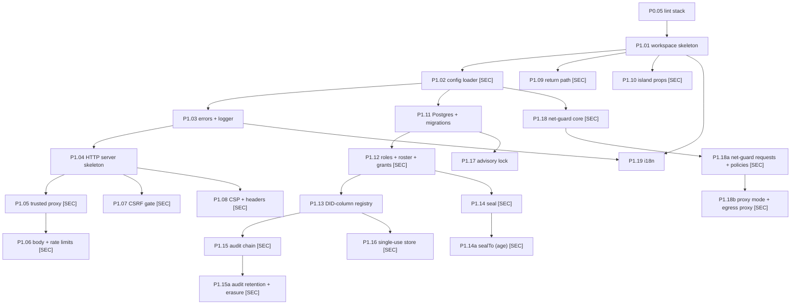
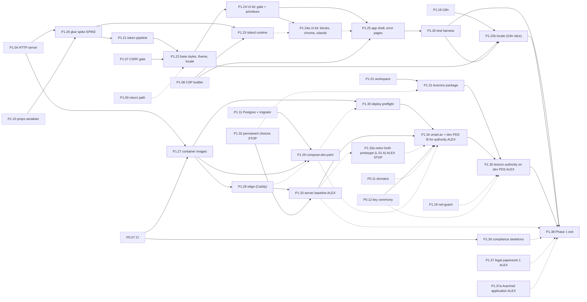
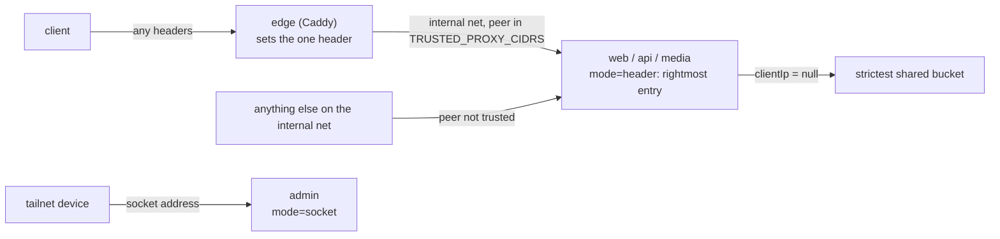
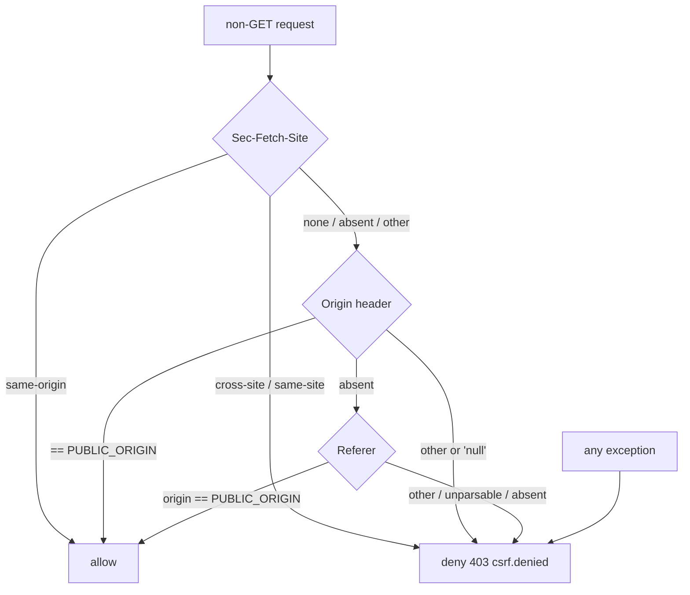
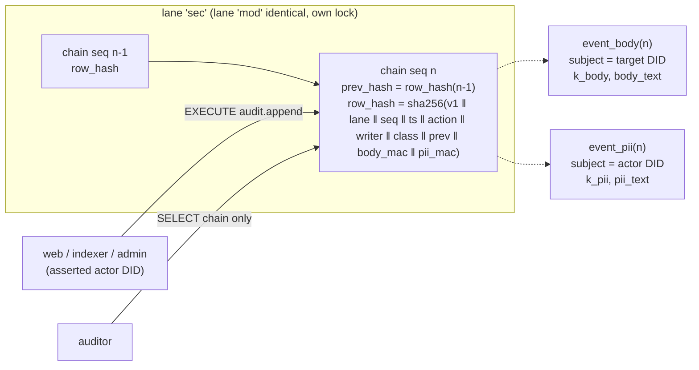
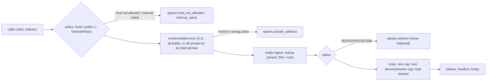
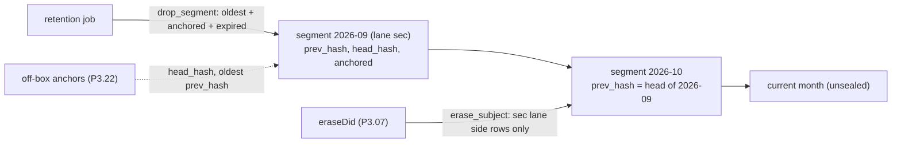
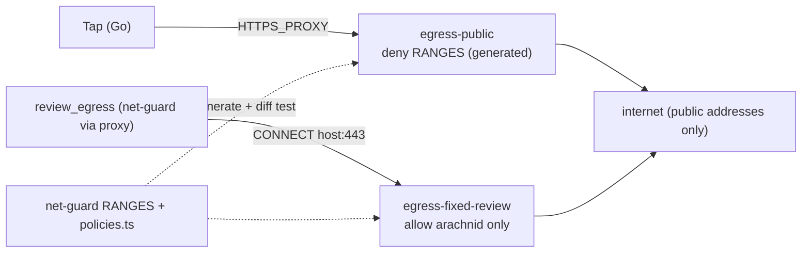
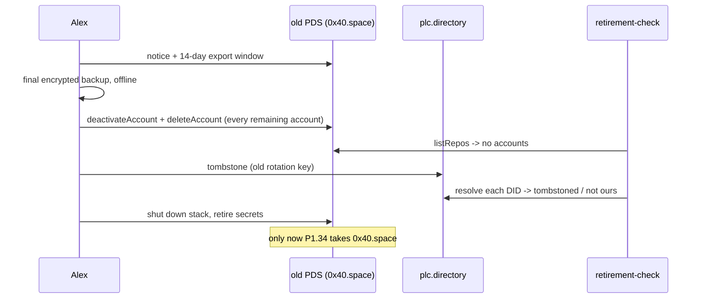

# Phase 1 — Platform, UI, edge, dev stack, lexicon authority (P1.01–P1.38)

Status: **editor pass (2026-10-03)**, build-ready under "detail by risk" (Phases 0–2 are full depth, `00-README.md`).
This file merges part 1 (P1.01–P1.19, round 2 answering [`reviews/r1-phase-1-part1.md`](reviews/r1-phase-1-part1.md))
and part 2 (P1.20–P1.38, round 2 answering [`reviews/r1-phase-1-part2.md`](reviews/r1-phase-1-part2.md)); each part's
round 2 table is kept under "Round 2 changes" at the end, and the editor pass is listed after it. Planning only; no
code. Template, tags, the salvage rule and the global invariants: [`00-README.md`](00-README.md). Step ids and
dependencies: [`01-outline.md`](01-outline.md). Source of truth: [`../unset-sh-rebuild-plan.md`](../unset-sh-rebuild-plan.md)
(03:02Z revision, decisions 1–23) §2, §3, §5.1–§5.4, §5.7, §5.8, §6, §6.1, §7, §8 Phase 1; where this file and the plan
disagree, the plan wins and the disagreement is listed under "Notes for the editor". Engineering rules: Alex's
architecture instructions and practices addendum (`docs/human/engineering/` in the repository): clarity before reuse, no
premature layers, established tools over invention; and, since decision 35 (2026-10-04), the *Engineering Rules*
(`docs/human/engineering/engineering-rules.md`; the plan wins over a rule).

**Goal of the phase.** Build the platform every later feature stands on: one config loader, one HTTP server with the
security middleware (trusted proxy, limits, CSRF, CSP), Postgres with migrations, roles, audit, sealed storage (to our
own key and to an offline key), the single-use store, the advisory lock, the single egress module (with its proxy mode)
and i18n; then (part 2) the UI shell, the local stack, images, the edge, the development PDS and the lexicon authority.
Nothing user-facing beyond the shell ships.

**Phase exit (plan §8 Phase 1):** Playwright smoke passes on the shell in both themes and both languages with zero axe
violations, and the permission set resolves from outside (P1.38, part 2). The framework glue is at or under ~600 lines
with CSS Modules identical on both sides, or the stack switches before Phase 2 (P1.20, part 2).

**What P1.01–P1.19 deliver:** steps P1.01–P1.19 plus P1.14a, P1.15a, P1.18a and P1.18b (letter-suffixed steps added in
round 2, each explained in its own text). All are library or database work testable with Vitest and a Postgres
container; only P1.18b's integration test runs a container image; nothing is deployed. Code layout (decision 34,
settled in P1.01; every old path is in `layout-map.md`): product rules in `domains/<x>/`, external systems and SQL in
`infrastructure/<x>/` (`postgres/`, `seal/`, `audit/`, `net-guard/`), web routes in `interfaces/http/`, the server kit in `shared/http/`,
config, errors, logging and i18n in `shared/<x>/`.

**Added in the editor pass:** `P1.33a` (retire the 0x40 prototype before P1.34; formerly L.01 part A, plan issue
19, global resolution 8) and `P1.37a` (file the Arachnid Shield application; decision 23).

Inputs read for P1.20–P1.38 (UI platform, images and edge, dev stack, lexicon authority): plan §2, §3, §5.1–5.4, §5.7, §6, §6.1, §7, §8 (Phases 1 and 5), §11 Q1, Q3,
Q11; reviews fable 01, 02, 06, 08 and 04, 08; the admin panel design (§4, §5, §8.1, §10, §11); the unset.sh
design sheet (artifact `78Sh5q9HGz74d5AQyMbQVt`, version `1790642962-06cb`: `project/README.md`,
`project/tokens.json`, every `components/*/README.md`, `assets/Logos/README.md`); the 0x40 prototype at
`054ab0f`.

**One added step:** `P1.24a` (UI kit: blocks, chrome and interactive components). The sheet registers 23
components; building all of them plus the "is it on the sheet?" gate is far more than one PR (README: 50–400
lines), and the interactive ones need the island runtime (P1.23), which P1.24 does not depend on. P1.24 keeps
the gate and the static and form components; P1.24a takes the rest.

**Decision 20 (Alex, 22:31Z):** there is no production PDS in Phase 1. P1.34 registers `unset.ac` and makes the
**development PDS on `0x40.space`** fit to host the lexicon authority; P1.35 creates the authority on it. This
puts the homelab dev PDS **on the login path** until P5.02a migrates the authority to production. Round 1
verified that authorization servers keep the last good copy of a resolved permission set, so what must hold is
**durability and integrity** of the authority (backups, Alex's offline keys, CID/PLC/TXT monitoring); availability
is a measured, best-effort figure (provisional, Alex question P1b-A2). P1.33, P1.34 and P1.35 carry this.

## Slices (decision 34, editor pass 2026-10-04)

Plan §8 Phase 1 now opens with a first slice: **sign in with an atproto account and see your own profile**
(`apps/web → interfaces/http → domains/identity → infrastructure/pds → the development PDS`), then the rest follows as
later slices (guideline §12). This file is in build order; step ids did not change, so every cross-reference holds.

- **Slice 1** (this file, in order): P1.01–P1.14, P1.15, P1.16, P1.17, P1.18, P1.18a, P1.20–P1.26, P1.27, P1.28,
  P1.29, P1.30, P1.32, P1.31, P1.37; then phase-2's P2.01–P2.08, P2.11, P2.15, P2.12, P2.13 and the slice exit P2.13a.
  **English only** (Alex, 2026-10-04 12:58Z, "English first", against the recommendation): each feature keeps its
  user-facing English text in one `messages.ts` beside its screens (plain exported constants, or a small function of its
  parameters returning a string; no catalog, no `t()`); error codes' English text sits in `shared/errors/messages.ts`.
  Where a slice-1 step below says "catalog text", "catalog key" or "EN/FR", read "the feature's messages module" and
  "English"; its tests that name both languages run in English until the i18n slice adds French.
  The development PDS for slice 1 is P1.29's **`local`** stack (`pds.unset.localhost`, never reachable from outside),
  so slice 1 needs none of the homelab, Tailscale or lexicon-authority steps.
- **i18n slice** (after P2.13a is merged, before P1.38): **P1.19** (its first task converts every slice-1 messages
  module into the EN/FR catalogs) and **P1.22b** (the locale half of P1.22, and French in P1.26's matrix). P1.19's text
  stays where it is below so ids and links hold; P1.22b sits after P1.37. No French page ships before this slice lands.
  It may run before, beside or after slice 2's steps; P1.38 waits for it, because the Phase 1 exit needs both languages.
- **Slice 2** (after P2.13a is merged): P1.14a (`sealTo`), P1.15a (audit retention), P1.18b (egress proxy mode), P1.33
  (server baseline, Tailscale), P1.33a, P1.34, P1.35 (lexicon authority), P1.36, P1.37a, then the Phase 1 exit P1.38.
- Then the rest of Phase 2 (`phase-2.md`, "Slices").

Why some pieces the plan lists for later stay in slice 1 (each is a security or dependency reason; none adds scope):
- **Seal (P1.14):** the OAuth state and token sets are stored sealed (plan §5.3, P2.04); without seal slice 1 would
  store tokens in clear. Only `seal`/`unseal` are needed; `sealTo` (P1.14a) moves to slice 2.
- **Audit (P1.15):** the sign-in writes no audit row (plan §6), but P2.12's age gate records an under-age block with
  `appendAudit`. P1.15 stays as the minimum; its retention and lane erasure (P1.15a) move to slice 2. Nothing in slice 1
  writes a security event anywhere else.
- **Limits and trusted proxy (P1.05, P1.06):** P2.05 limits login attempts with `RateLimiter.consume('login')`.
- **i18n (P1.19):** moved out of slice 1 by Alex's answer (2026-10-04 12:58Z, English first). The editor's concern (English
  literals scattered like the prototype's `choose()` calls) is met by the messages-module rule above: strings stay in one
  module per feature, never inline in screens, so P1.19's conversion is mechanical.
- **UI kit and shell (P1.20–P1.26):** `/me` (P2.13) renders inside `AppShell` with kit components; every design-sheet piece is
  approved (sheet v45, 2026-10-04), so P1.24 no longer waits on design.
- **Images, edge, dev stack, preflight (P1.27–P1.30):** the local PDS runs from our mirrored, signed image behind the
  edge, which does the per-client rate limiting while the PDS's own limits are off (global resolution 1).
- **Lexicons and permanent choices (P1.32, P1.31):** P2.04's scope strings come from the permission set's JSON. The set
  is **published** only in slice 2 (P1.35); until then logins use the tested fallback scope (P2.04 note).
- **Onboarding and email gates (P2.11, P2.12, P2.15, with P1.37):** `/me` requires a verified, onboarded account; slice 1
  keeps those gates rather than show `/me` without them.

## Dependency diagrams

### P1.01–P1.19



### P1.20–P1.38

Solid arrows are the outline's dependencies. Dashed arrows are dependencies accepted by review round 1 and
waiting for the outline edit (see "Notes for the editor"). Dashed-border nodes are steps written in other files.



---

### P1.01 — Workspace skeleton
Tags: —            Depends on: P0.05            Plan: §7 (layout, tooling, boundary rules; decision 34), §5.5 (boundaries), §9
Where: root `package.json` (`workspaces`: `apps/*`, `interfaces/*`, `domains/*`, `infrastructure/*`, `shared/*`),
  `package-lock.json`, `tsconfig.json`, `tsconfig.base.json`, `vitest.config.ts`, `.dependency-cruiser.cjs`,
  `scripts/workspace/{references.test.ts, codeowners.test.ts, new-workspace.md}`. **No workspace folder is created
  here** (guideline §1: folders are created when their first code lands); slice 1's first steps create theirs
  (P1.02 `shared/config`, P1.03 `shared/errors` and `shared/log`, P1.04 `shared/http` and `interfaces/http`, P1.11 `infrastructure/postgres`, …).
  No `packages/`, `modules/` or `plugins/` folder (decision 34; decision 25).
Size: ~120 source lines (mostly config), ~120 test lines

Goal: the repository can hold the decision-34 layout, and the rule for adding a workspace and what it may reference is
written down and tested, so each later step adds its own workspace with its first code.

Inputs: P0.04 (TS 7, Vitest), P0.05 (dependency-cruiser boundary rules, budgets); `layout-map.md` (book).
Outputs:
  - Workspace convention (written in `scripts/workspace/new-workspace.md` and checked by `references.test.ts`): a
    workspace is `<top>/<name>/` with `package.json` (`name` `@unset/<top>-<name>`, for example
    `@unset/domains-identity`; `private: true`, `type: module`, `version: "0.0.0"`, `license` `MIT` under `shared/` and
    `AGPL-3.0-only` elsewhere (P0.13), dependencies added by the step that needs them), `tsconfig.json` (`extends
    ../../tsconfig.base.json`, `composite: true`, `rootDir: .`, `outDir: dist`, `references` to the workspaces it
    may use) and at least one `*.test.ts` next to its code. Integration tests go to `tests/integration/<area>/`,
    end-to-end tests to `tests/e2e/` (guideline §5); each is a Vitest project of its own.
  - Allowed references (mirrors the P0.05 dependency-cruiser rules; the test reads them from one table):
    - `apps/<x>` → `shared/*` only. Never another app, `domains/*`, `infrastructure/*` or `interfaces/*`; islands reach
      the server over HTTP only.
    - `interfaces/http` → `apps/web`'s render entry only (server-side rendering; data passed as props), `domains/*`,
      `infrastructure/*`, `shared/*`; `interfaces/admin` → `apps/admin`'s render entry only, `domains/*`,
      `infrastructure/*`, `shared/*`; every other interface (`api`, `indexer`, `media`, `review`, `jobs` (all scheduled
      work, retention included; R5-01), `audit-verify`, `chat-auth`) → `domains/*`, `infrastructure/*`, `shared/*`. **No interface references another**;
      the server kit is `shared/http`. Each interface is the composition root of its own process, and every running
      process has its own `interfaces/<name>/` (never shared).
    - `interfaces/pds-admin`, `interfaces/chat-admin` → only the zero-dependency allowlist (today `shared/admin-envelope`;
      Node built-ins otherwise; plan §5.2, guideline §1). "Zero dependencies" means no third-party package
      (architecture ruling, 2026-10-04; guideline §1's `pds-admin` bullet): these services list
      `@unset/shared-admin-envelope` in `package.json` `dependencies` as normal and keep the `tsconfig.json` reference.
      Their `dependencies`, and their `devDependencies` apart from test tooling, hold only `@unset/*` packages on
      `ZERO_DEP_ALLOWLIST`, and their installed closure holds no third-party package. An allowlisted workspace has no
      `@unset/*` reference and no `dependencies`.
    - `domains/<x>` → `shared/errors`, `shared/config` (types only), `shared/lexicons` (the one record validator) and,
      only where a feature needs it, another domain (through its `index.ts`). Never another `shared/*` workspace,
      `infrastructure/*`, `interfaces/*` or `apps/*`, and no npm `dependencies` (rule AB-1 as settled 2026-10-04;
      `@atproto/lex` is reached only through `shared/lexicons`).
    - `infrastructure/<x>` → `domains/*` (the contracts it implements), `shared/*`, `infrastructure/net-guard`
      (egress), `infrastructure/seal` (sealed columns). `infrastructure/net-guard` → nothing.
    - `shared/<x>` → `shared/*` only; `shared/ui` and `shared/lexicons` → nothing (`shared/lexicons` has the one npm
      dependency domains may reach, `@atproto/lex`).
    This table and P0.05's `MATRIX` are one list: the test reads the workspace-level rows from `MATRIX`, so a change to
    one is a change to both.
  - `tsconfig.base.json`: the bootstrap compiler options (`strict`, `noUncheckedIndexedAccess`,
    `exactOptionalPropertyTypes`, `verbatimModuleSyntax`, `erasableSyntaxOnly`, `module/moduleResolution: nodenext`,
    `target/lib: es2025` or the newest TS 7 accepts) plus `declaration: true`. Root `tsconfig.json` has `files: []` and
    `references` to every existing workspace and `scripts/` (the references test fails if one is missing).
  - `package.json` scripts: `"typecheck": "tsc -b"`; `vitest.config.ts` `test.projects` = the workspace globs above plus
    `tests/integration`, `tests/e2e` (when present) and `scripts`; a glob that matches no folder yet is not an error.
  - `.dependency-cruiser.cjs`: the P0.05 rules (swc parser); add `allowed-references-match-tsconfig` as a Vitest test
    (below) rather than a cruiser rule. **New `forbidden` rule `infra-shared-via-index`** (rule DC-2 for
    `infrastructure/` and `shared/`; `docs/human/architecture.md` row "planned: P1.01", architecture thread
    2026-10-04): a file outside `infrastructure/<x>/` imports a module of `infrastructure/<x>/**` only through
    `infrastructure/<x>/index.ts`, and the same for `shared/<x>/**` through `shared/<x>/index.ts` (a package import
    `@unset/<top>-<name>` resolves to that `index.ts`; a deep import such as `@unset/shared-http/csrf/gate` does not).
    Files inside `<x>/` itself are free. Exempt: a file whose name ends in `.fake.ts` (the suffix only, nothing else),
    wherever it is imported (architecture ruling 23:05Z: a fake is never exported from an `index.ts`, and
    `fake-only-in-composition-root` plus TE-1 already restrict its importers to tests and `compose.ts`), and
    non-TypeScript assets (`*.css`). A non-fake deep import from `tests/` still fails. It lands
    here, before P1.02 creates the first `shared/` module, with its fixtures. This step's PR also changes the DC-2 row
    of `docs/human/architecture.md` from `planned: P1.01` to `checked: infra-shared-via-index`: once a `P1.01` commit
    is on `main`, P0.09's docs test refuses a `planned: P1.01` cell.
  - Layout decision: TypeScript lives directly under `<top>/<name>/` (for example `domains/identity/auth/`), no `src/`
    level; SQL lives under `infrastructure/postgres/migrations/`. Book paths written with a `src/` level mean the same folder.
  - `scripts/workspace/codeowners.test.ts` (warning level, `console.warn` only, never fails): every security pattern in
    `.github/CODEOWNERS` (P0.03) matches at least one file once the step that owns that area has merged; a pattern
    matching nothing is printed so a path drift is noticed.

Algorithm:
  1. Create the root files above; `npm install` at the root to update the lockfile (no external packages added in this
     step, and no workspace exists yet, so the lockfile changes only in its root entry).
  2. Write `scripts/workspace/references.test.ts`: for every workspace that exists, read its `tsconfig.json`
     `references` and its `package.json` dependencies on `@unset/*`; assert both are inside the allowed set above;
     **match every `@unset/*` import in its source against both its `package.json` `dependencies` and its
     `tsconfig.json` `references`: a missing entry in either fails the test** (Phase 1 build thread, 2026-10-04: `tsc
     -b` does not catch it, see edge cases). For the zero-dependency services (`interfaces/pds-admin`,
     `interfaces/chat-admin`) also assert: `dependencies`, and `devDependencies` apart from test tooling, hold only
     `@unset/*` packages on `ZERO_DEP_ALLOWLIST`; and `npm ls --workspace <ws> --all --json` lists no third-party
     package in the closure;
     assert its folder is one of the decision-34 top-level folders; assert it has at least one `*.test.ts`; assert no
     `packages/`, `modules/` or `plugins/` folder exists.
     Also assert that **every TypeScript file sits inside some project** that the root `tsconfig.json` references
     (`tsc -b` checks only the listed projects, so a file outside every project is never type-checked): a `.ts`/`.tsx`
     file outside `SKIP_DIRS` that no project includes fails the test. **Rule:** a step that first creates TypeScript
     under `tests/` or `deployment/` (or any other new folder) adds its `tsconfig.json` project and the root reference
     in the same PR. TypeScript that Phase 0 already put outside `scripts/` (P0.11's `deployment/reserved-labels.test.ts`,
     P0.12's `docs/human/runbooks/keys.test.ts`, any other found by the scan) gets its project in this step; the first
     `tests/` TypeScript is P1.11's `tests/integration/setup/pg.setup.ts`, which adds `tests/integration/tsconfig.json`.
  3. Run `npm run check`; fix until green.

Edge cases and failures:
  - A workspace imports another without a `references` entry, or without a `package.json` dependency → `tsc -b` does
    **not** fail: npm links every workspace into `node_modules`, so TypeScript resolves it as a library. The references
    test fails instead (step 2 matches each `@unset/*` import against both lists; correction from the Phase 1 build
    thread, 2026-10-04).
  - `interfaces/pds-admin` or `interfaces/chat-admin` gains a third-party `dependencies` entry, an `@unset/*` entry
    not on `ZERO_DEP_ALLOWLIST`, or a closure that pulls in any third-party package → the references test fails
    (zero-dependency rule, plan §5.2, as ruled 2026-10-04: no third-party package).
  - A workspace is added under a folder the layout does not name (for example `packages/x`) → the references test fails.
  - A new workspace is added later without a test file → "discovered equals executed" does not notice (no test file is
    not a skipped file); the references test asserts every workspace has at least one `*.test.ts`.
  - No workspace exists yet → the references test passes on an empty set and its fixtures still run (below).

Done when (tests):
  - references_match_allowed: fixtures in a temp tree: `interfaces/api` referencing `shared/ui` passes;
    `apps/web` referencing `infrastructure/postgres` fails; `domains/identity` referencing `infrastructure/pds` fails;
    `apps/web` referencing `apps/admin` fails; `shared/config` referencing `domains/identity` fails;
    `interfaces/api` referencing `interfaces/http` fails; `interfaces/pds-admin` referencing `shared/admin-envelope`
    passes and referencing `shared/config` fails; `domains/identity` referencing `shared/errors`, `shared/config` or
    `shared/lexicons` passes, referencing `shared/http` or `shared/log` fails, and a `domains/identity/package.json`
    with any `dependencies` entry fails (AB-1 domain row).
  - unset_import_needs_dependency_and_reference: fixture `interfaces/api/a.ts` importing `@unset/shared-errors` with
    the dependency but no `references` entry → fails; with the reference but no dependency → fails; with both →
    passes; `interfaces/pds-admin/a.ts` importing `@unset/shared-admin-envelope` with only the `references` entry →
    fails (it needs the dependency too).
  - pds_admin_no_deps: fixture `interfaces/pds-admin/package.json` with `"dependencies": {"undici": "1.0.0"}` → test
    fails; with `"@unset/shared-admin-envelope": "*"` → passes; with `"@unset/shared-config": "*"` (not on the
    allowlist) → fails; a fixture closure (`npm ls --workspace interfaces/pds-admin --all --json`) holding any
    non-`@unset/*` package → fails; the same for `interfaces/chat-admin`.
  - unknown_top_level_folder: fixture workspace `packages/core/` → test fails.
  - every_workspace_has_a_test: fixture workspace without a test file → test fails.
  - every_ts_file_in_a_project: fixture `tests/integration/x/a.test.ts` (or `deployment/a.ts`) with no project
    including it → test fails; with a `tests/integration/tsconfig.json` referenced from the root → passes.
  - depcruise_on_real_tree: `npm run lint` passes; a planted `apps/web/x.ts` importing `../admin/index.ts` fails it.
  - depcruise_infra_shared_via_index (DC-2): fixtures `interfaces/http/a.ts` importing
    `../../infrastructure/postgres/pool.ts` and `domains/identity/a.ts` importing `../../shared/errors/codes.ts` → exit
    ≠ 0 naming `infra-shared-via-index`; the same files importing `../../infrastructure/postgres/index.ts` and
    `../../shared/errors/index.ts` → exit 0; `infrastructure/postgres/a.ts` importing `./pool.ts` → exit 0;
    `interfaces/http/compose.ts` with `await import("../../infrastructure/arachnid/fingerprint-check.fake.ts")` in
    the non-prod branch → exit 0 (TE-1 governs it); `tests/integration/a.test.ts` importing
    `../../infrastructure/arachnid/fingerprint-check.fake.ts` → exit 0 (the `.fake.ts` suffix is exempt); the same test
    file importing `../../infrastructure/arachnid/fingerprint-check.ts` (a non-fake deep import) → exit ≠ 0 naming
    `infra-shared-via-index`; a file named `fake-helpers.ts` or `x.fakes.ts` → not exempt, exit ≠ 0.
  - typecheck_build_mode: `tsc -b` exits 0.
  - codeowners_security_paths_match: the warning test runs and prints the patterns that match nothing yet.

Reuse: prototype layout (one package per top-level dir with its own lockfile, `/home/claude/0x40/*/package-lock.json`)
→ REJECT (review 02, 07: separate lockfiles caused the per-package CI matrix and `file:` link hacks,
`/home/claude/0x40/.github/workflows/security-gate.yml:41-47`). Provisional — for reuse review.
Not in this step: any workspace folder (each step creates its own with its first code); any runtime dependency (each
later step adds its own, pinned and justified); `chat-admin` (Phase 6); the plugin manifest, registry, boundary lint, `plugin-api` package and fixture plugin (deferred until the first real
plugin, whose PR designs them; decision 25).
Diagram: none.

---

### P1.01s — Semgrep custom rules: computed imports and floating promises
Tags: [SEC]            Depends on: P1.01, P0.07            Plan: §2 (boundaries enforced by CI), rules DC-4 and AB-1 (fallbacks owed by P0.05)
Where: `.semgrep/rules/{computed-import.yml,floating-promises.yml}` + `.semgrep/rules/fixtures/`, `.github/workflows/ci.yml` (one flag), `scripts/lint/semgrep-rules.test.ts`
Size: ~60 rule lines, ~120 test and fixture lines. Touches `.semgrep/` and five Phase 0 files (listed in the
as-built block); coordinate with the Phase 0 thread before building.

Goal: close the two gaps P0.05 left open. dependency-cruiser cannot follow an import whose specifier is not a string
literal, and Biome's `noFloatingPromises` does not run on TypeScript 7 sources. Both now fail CI, closed.

Inputs: P0.07's `semgrep` job (image pinned by index digest), P1.01's workspace and tsconfig projects.
Outputs:
  - The `.semgrep/rules/` folder. P0.07's `semgrep` job gains `--config .semgrep/rules/` beside the registry packs.
    P1.11 adds `transactions.yml` to the same folder.
  - `computed-import.yml`: in any `.ts`/`.tsx` file outside `scripts/` and `tests/`, a finding at severity ERROR for:
    - `import($X)`, `require($X)` or `createRequire(...)($X)` where `$X` is not a string literal (template literals
      with substitutions count as non-literal);
    - `module.require(...)` and `process.mainModule.require(...)` in any form.
    There is no allow comment and no per-file exception. A real need for a dynamic import is a design question for the
    architecture thread, not a suppression.
  - `floating-promises.yml`: a best-effort syntactic stand-in for DC-4. At severity ERROR it flags:
    - an expression statement that calls a function declared `async` in the same file, or a call ending in
      `.then(...)` with no `.catch(...)` or second argument, unless the statement starts with `await`, `return` or
      `void`;
    - `.forEach(async ...)`.
    It is not type-aware. The step records that limit in the rule's `message`, so a reviewer still owns the cases it
    cannot see.

Algorithm:
  1. Write both rules with `languages: [typescript]` and `paths.exclude` for `scripts/`, `tests/`, `**/*.test.ts` and
     `.semgrep/rules/fixtures/` (fixtures are scanned only by the test).
  2. Write fixtures. Each must-fail fixture carries one known-bad pattern; each must-pass fixture holds the nearest
     legal form (`import("./literal.js")`, `await f()`, `void f()`, `return f()`, `f().catch(log)`).
  3. `semgrep-rules.test.ts` runs the pinned image via `docker run` against the fixtures with `--config
     .semgrep/rules/ --metrics=off --json`. It asserts every must-fail fixture yields at least one finding from the
     right rule id and every must-pass fixture yields none. The image or Docker missing → the test fails, never skips.
  4. Add the flag to the CI job. Run CI once with a planted computed import in `apps/web/` on a scratch branch Alex
     provides or approves, or, as with P0.07, record a local run and say so. Record the result in the PR.
  5. If Semgrep loads zero rules from `.semgrep/rules/` → the job fails (it reuses P0.07's zero-rules check).

Edge cases and failures:
  - `import(\`./x.js\`)` with no substitution → a literal; allowed.
  - `await import(name)` inside a test helper under `tests/` → excluded by path; still covered by TE-1 review.
  - A third-party package doing dynamic requires inside `node_modules/` → not scanned (outside the repo's sources).

Threats:
  - E A computed import reaches a module the boundary matrix forbids (for example a domain loading `pg`) →
    `computed_import_fails`.
  - D/R An unawaited promise loses an error or an audit append silently → `floating_promise_fails`.

Done when (tests):
  - computed_import_fails: `import(name)`, `require(path)`, `` import(`./${x}.js`) ``, `createRequire(u)(p)` in
    `apps/web/x.ts` and `domains/identity/x.ts` fixtures → findings; `semgrep` exits ≠ 0.
  - literal_import_passes: `import("./a.js")`, `` import(`./a.js`) `` → no finding.
  - floating_promise_fails: `doAsync();`, `p.then(f);`, `xs.forEach(async (x) => {...})` → findings.
  - handled_promise_passes: `await doAsync()`, `void doAsync()`, `return doAsync()`, `p.then(f, g)`, `p.catch(h)` → none.
  - rules_folder_loaded: CI's semgrep command line contains `--config .semgrep/rules/` (test reads `ci.yml`).
  - The done-check line: AI notes updated or none needed.

Reuse: none (new rules). Semgrep CE → USE (already pinned by P0.07).
Not in this step: transaction rules (P1.11), type-aware promise checks (revisit when Biome or tsgo exposes them; P2.00).
Diagram: none.
Editor note (2026-10-04 late, step book thread): new step, so P0.05's two moved checks have a home before most code
lands. Placed right after P1.01 rather than inside P1.11, because a computed import is a boundary bypass and P1.02 to
P1.10 add code first.


As ruled (architecture thread, 2026-10-05 00:13Z): the Semgrep fixture assertions move to CI. This replaces algorithm
step 3 and the `semgrep-rules.test.ts` description above.
  - `scripts/lint/semgrep-fixtures.ts`, a small node script, runs in the existing CI `semgrep` job with the pinned
    image. It runs Semgrep over `.semgrep/rules/fixtures/` with `--config .semgrep/rules/ --metrics=off --json` and
    asserts:
    - every must-fail fixture yields at least one finding from the rule id it names;
    - every must-pass fixture yields none.
  - The script fails closed (TE-4), reusing P0.07's `semgrep-rules-ran` pattern, when:
    - the image is missing;
    - it ran zero fixtures;
    - the count of rule ids seen firing differs from the count declared in `.semgrep/rules/`.
  - `scripts/lint/semgrep-rules.test.ts` (Vitest, part of `npm run check`) checks static parts only:
    - `ci.yml` passes `--config .semgrep/rules/`;
    - `ci.yml` has the step that calls `semgrep-fixtures.ts`, so removing that step fails locally;
    - every rule file has fixtures;
    - every rule id appears in at least one must-fail fixture.
  - `npm run semgrep:fixtures` is optional and outside `npm run check`. It runs the same script through Docker when
    Docker is present. There is no local pip install of Semgrep.
  - Done-when changes:
    - `computed_import_fails`, `literal_import_passes`, `floating_promise_fails` and `handled_promise_passes` are
      proven by the CI script, and their run URL goes in the PR.
    - New static tests: `ci_calls_fixture_script`, `every_rule_has_fixtures`, `every_rule_id_in_must_fail`.
    - New CI-script tests: `zero_fixtures_fails`, `rule_count_mismatch_fails`.
  - P1.11's `transactions.yml` follows the same pattern: its fixtures run in the CI script, not inside Vitest.

As built (Phase 1 thread, 2026-10-05): besides `.semgrep/rules/`, P1.01s touches five Phase 0 files, coordinated with
the Phase 0 thread:
  - `.github/workflows/ci.yml`: `--config .semgrep/rules/` on the scan line, plus a step "Prove custom rules on
    fixtures" running `node scripts/lint/semgrep-fixtures.ts`.
  - `scripts/guards/files.ts`: `SKIP_DIRS` gains `.semgrep/rules/fixtures`. The deliberately bad fixtures redeclare
    `require`, `module` and `process`, so they cannot be typechecked.
  - `.dependency-cruiser.cjs`: `options.exclude` gains `\.semgrep/rules/fixtures`.
  - `.semgrepignore`: gains `.semgrep/rules/fixtures/`. The fixture step scans a temp copy with the `paths` blocks
    stripped.
  - `package.json`: a `semgrep:fixtures` script, outside `check`.
  - `scripts/ci/semgrep-rules-ran.ts` (P0.07) gains an assertion that every rule id declared under `.semgrep/rules/`
    appears in `semgrep.sarif`'s rule list. P0.07's zero-rules check counts all SARIF rules, so it would not notice
    `.semgrep/rules/` loading nothing. The ids are read from the rule files, not hard-coded, so P1.11's
    `transactions.yml` id is covered without a change.

---

### P1.02 — Typed config loader per entrypoint
Tags: [SEC]            Depends on: P1.01            Plan: §2 rule 24, §4 platform row, §9 ("one config"); review 07 §4 (no `required:false` secrets)
Where: `shared/config/{schema.ts,load.ts,secret.ts,index.ts}` + tests; each `interfaces/<x>/config.ts` declaring
  that entrypoint's schema (empty except the common keys in this step)
Size: ~220 source lines, ~250 test lines

Goal: each process reads its configuration once at boot through one typed loader that refuses to start on any missing
or invalid key, never makes a secret optional, and never prints a value.

Inputs: environment variables; secret files mounted by Compose (`/run/secrets/*`).
Outputs:
  - Field kinds (typed pseudocode):
      `str({ pattern?, default? })`, `int({ min, max, default? })`, `bool({ default? })`, `oneOf([...], { default? })`,
      `url({ protocols: ["https:"] | ["https:","http:"], default? })`, `origin()` (scheme+host+port, no path),
      `list(kind, { separator: "," })`, `secret({ minBytes })` — **no `default`, no optional variant exists**;
      `secretFile({ minBytes })` reads the path in `<KEY>_FILE`.
  - `defineConfig(schema): Schema<T>`; `loadConfig(schema, env = process.env): Readonly<T>` or throws
    `ConfigError { code: "config.invalid", problems: Array<{ key: string; reason: "missing" | "invalid" | "unreadable" |
    "forbidden_in_env" }> }` — reasons only, **never values**.
  - `Secret` (a class wrapping a `Uint8Array`/string): `reveal(): string | Uint8Array` (the only accessor);
    `toString()`, `toJSON()`, `[util.inspect.custom]()` all return `"[secret]"`; `equals(other)` constant-time.
  - Common keys every entrypoint has: `UNSET_ENV` = `oneOf(["dev","test","prod"])` (no default), `UNSET_SERVICE`
    = `oneOf([...entrypoint names])`, `UNSET_COMMIT` = `str({ pattern: ^[0-9a-f]{40}$ })` (set at image build, P1.27;
    `dev` value `0000…` allowed only when `UNSET_ENV=dev`), `LISTEN_PORT` = `int({1024..65535})`.
  - `describeConfig(schema): Array<{ key, kind, set: boolean }>` for the health board later; no values.

Algorithm (`loadConfig`):
  1. `problems = []`. For each key in the schema (sorted):
     a. If kind is `secret`: read `env[KEY]`. If kind is `secretFile`: read `env[KEY + "_FILE"]` as a path. If a
        `secretFile` key is also present as plain `env[KEY]` → problem `forbidden_in_env` (secrets come from files in
        `prod`; plain env is allowed only for `secret` kind and only when `UNSET_ENV != prod`).
     b. Missing (undefined or empty after trim) → if the field has a default and is not a secret → use the default;
        else → problem `missing`.
     c. For `secretFile`: read the file (`readFileSync`, max 64 KiB). Error (ENOENT, EACCES, too large) → problem
        `unreadable`. Trim one trailing newline. Empty → `missing`. If the file mode allows world write → `unreadable`.
     d. Parse by kind. Failure (pattern mismatch, out of range, bad URL, protocol not allowed, secret shorter than
        `minBytes`) → problem `invalid`.
  2. If `problems` is non-empty → throw `ConfigError` (all problems at once, so one boot shows every missing key).
  3. Cross-field rules declared on the schema run next (example: `UNSET_COMMIT` placeholder only in `dev`); a failure
     adds `invalid` for the named key and throws.
  4. Deep-freeze the result; return it.
  Boot wrapper `bootOrExit(schema)`: catch `ConfigError` → write one log line per problem `{event:"config.invalid",
  key, reason}` through the P1.03 logger if loaded, else `process.stderr` with the same JSON → `process.exit(78)`
  (EX_CONFIG). Any other exception → exit 1. Values are never part of either output.

Edge cases and failures:
  - A secret is "optional for dev" → impossible by construction; dev gets generated secret files from the dev compose
    (P1.29).
  - `env` contains unknown `UNSET_*` keys → one warning line naming the keys (not values); boot continues (old and new
    code overlap during a deploy; plan §5.2 expand-then-contract).
  - Secret file is a symlink → followed (Docker secrets are files; Compose may use symlinks); permissions checked on
    the target.
  - Someone calls `JSON.stringify(config)` or logs it → every secret renders `"[secret]"`.
  - A URL with userinfo (`https://u:p@x`) → `invalid` (credentials never travel in URLs).

Threats: the process's environment and secret files at boot.
  - I A secret printed to logs, an error page or a crash dump → secrets render as `[secret]`; errors name keys, never
    values (`secret_never_printed`, `boot_exit_code`).
  - E A missing or defaulted secret leaves a control running open ("optional for dev") → no secret has a default; boot
    refuses with exit 78 (`secret_has_no_default`, `missing_lists_all_keys`).
  - I A secret in a plain env var (visible in `docker inspect`) → refused in prod for `secretFile` keys
    (`secret_file_in_env_forbidden_in_prod`).
  - T Configuration changed after boot → the loaded object is frozen (`frozen`); credentials in a URL → `invalid`
    (`invalid_url_with_userinfo`).

Done when (tests):
  - missing_lists_all_keys: schema with keys A, B (both required), env empty → `ConfigError` with two problems, reasons
    `missing`, and the error message contains neither value nor any env content.
  - secret_has_no_default: calling `secret({ default: "x" })` is a type error (a `// @ts-expect-error` test) and a runtime
    throw.
  - secret_file_read: temp file containing `abc…\n` (32 bytes) → `reveal()` returns 32 bytes without the newline.
  - secret_file_unreadable: path to a missing file → `unreadable`; directory path → `unreadable`.
  - secret_file_in_env_forbidden_in_prod: `UNSET_ENV=prod`, `X=plain` for a `secretFile` key → `forbidden_in_env`.
  - secret_never_printed: `String(s)`, `JSON.stringify({s})`, `util.inspect(s)`, template literal → all `"[secret]"`.
  - invalid_url_with_userinfo: `https://a:b@x.y` → `invalid`.
  - int_range: `LISTEN_PORT=80` → `invalid`.
  - frozen: assigning to a loaded config field throws in strict mode.
  - boot_exit_code: child process with a missing key exits 78 and its stderr contains the key name, not any value.
  - unknown_keys_warn: `UNSET_FOO=1` → a warning naming `UNSET_FOO`; load succeeds.

Reuse: prototype `/home/claude/0x40/app/src/lib/runtime.ts:13` (`process.env.APP_DB ?? "/data/app.sqlite"`) → REJECT
(silent defaults). Prototype `/home/claude/0x40/app/src/lib/secrets/seal.ts:145-160` (KEK parse: hex or base64, 32 bytes)
→ LESSON for the `secret({ minBytes })` parser. A schema library (zod, valibot) → REJECT for now (~200 lines of our own
code is smaller than the dependency and keeps `Secret` semantics exact); reviewer may overturn. Provisional — for reuse
review.
Not in this step: the keys of individual features (each step adds its own fields); the deploy preflight (P1.30).
Diagram: none.

As built (Phase 1 building-blocks thread, relayed 2026-10-04 23:23Z; all fail closed, each listed in the PR):
  - (a) A `secretFile` key given as plain env → `forbidden_in_env` in every environment, not only prod.
  - (b) A missing or unrecognised `UNSET_ENV` counts as prod for plain-env secrets; only exactly `dev` or `test` allows them.
  - (c) `Secret` holds a string, so secret files must be UTF-8 text; invalid bytes → `invalid`.
  - (d) `list` has no separator option: comma only; empty or padded items → invalid.
  - (e) `bootOrExit` writes its `config.invalid` lines to stderr as JSON itself, because the logger (P1.03) depends on
    config, not the other way round.
  - Later extension made by P1.18a: `defineConfig` collects per-field `holds` rules (see P1.18a's as-built block).

---

### P1.03 — Error model, error-code catalog, structured logger with a field allowlist
Tags: —            Depends on: P1.02            Plan: §2 rule 15 ("Error codes go in URLs, never free text"), §6 (no IP/UA), §6.1 (ASVS V16 logging, A10)
Where: `shared/errors/{catalog.ts,AppError.ts,redirect.ts}`, `shared/log/{logger.ts,scrub.ts}` + tests
Size: ~200 source lines, ~220 test lines

Goal: every failure has a stable code from one catalog, only catalog codes ever appear in URLs, and the logger
cannot write an IP address, a user agent, a request path, a secret or free text into the logs.

Inputs: P1.02 (`UNSET_SERVICE`, `UNSET_COMMIT`, `UNSET_ENV`).
Outputs:
  - `ERROR_CODES`: a const object `{ [code: string]: { status: 400|401|403|404|405|409|413|415|421|429|500|503,
    public: boolean } }`. Codes are `area.reason` lowercase ASCII (`^[a-z]+(\.[a-z_]+)+$`). Initial set: `http.bad_request`,
    `http.not_found`, `http.method_not_allowed`, `http.unsupported_media_type`, `http.payload_too_large`, `http.misdirected`,
    `http.rate_limited`, `http.deadline` (P1.04k's request deadline; listed here so the kit PR touches only
    `shared/http/`, SE-6), `csrf.denied`, `internal.error`, `service.unavailable`, `config.invalid` (not public).
    Later steps add codes; each code needs EN/FR text (`error.<code>` keys, checked in P1.19). Until the i18n slice
    (English first), each public code's English text is a constant in `shared/errors/messages.ts`; P1.19 converts it.
  - `type ErrorCode = keyof typeof ERROR_CODES`. `class AppError extends Error { code: ErrorCode; status; cause? }` —
    `message` is always the code (no free text).
  - `withErrorParam(path: SafePath, code: ErrorCode): string` → `path?error=<code>`; `readErrorParam(query): ErrorCode |
    null` returns a code only if it is in the catalog and `public`; anything else → `null` (the page then shows nothing,
    never the raw value).
  - `createLogger({ service, commit, env }): Logger` with `info|warn|error(event: LogEvent, fields?: LogFields)`.
    `LogEvent` is a string union of known events (extended by later steps). `LogFields` allowlist (typed and checked at
    runtime): `code`, `route` (a route **template** like `/@:handle`, never a raw path), `method`, `status`, `ms`,
    `reqId` (random per request), `count`, `bytes`, `key` (config key names only), `reason`, `phase`, `kind`, `job`,
    `attempt`. Anything else is dropped and counted in `dropped`.
  - Output: one JSON line per call to stdout: `{ ts, level, svc, commit, event, ...fields, dropped? }`.

Algorithm (`logger.log(level, event, fields)`):
  1. If `event` is not in the known set → set `event = "log.unknown_event"` and `kind = <first 40 chars, scrubbed>`.
  2. For each `(k, v)` of `fields`: if `k` not in the allowlist → `dropped++`, skip. If `v` is not string/number/boolean/
     null → skip and `dropped++`.
  3. Strings: truncate to 200 characters; replace C0/C1 control characters with `?`; then `scrub(v)`:
     replace anything matching an IPv4 address, an IPv6 address (with or without zone), an email address, a JWT
     (`eyJ…​.eyJ…​.…`), a `Bearer ` token, a `did:key:`/multibase private-key-like string longer than 40 chars, and any
     run of ≥32 hex or base64url characters → `"[redacted]"`.
  4. `route` must match `^/[A-Za-z0-9_\-/:@.*]*$` and contain no segment that is not a template parameter where the
     route table says a parameter is; the HTTP layer passes the template, so a failure here means a bug → replace with
     `"[route]"`.
  5. Serialize with `JSON.stringify`; on failure (should not happen) write `{event:"log.serialize_failed"}`.
  6. Write with one `process.stdout.write` call (no interleaving within a line).
  Errors: `logError(err)` logs `{ event: "error", code: err instanceof AppError ? err.code : "internal.error",
  kind: err.name }` and, only when `UNSET_ENV != "prod"`, `stack` frames as `file:line` without the message line.

Edge cases and failures:
  - A caller passes `{ ip: "1.2.3.4" }` → dropped (not allowlisted); passes `{ reason: "from 1.2.3.4" }` → scrubbed.
  - A caller passes a user agent string in `reason` → not reliably detectable; the allowlist and code review are the
    control; `reason` values must come from a closed union in each caller (enforced by its type, not by the logger).
  - A huge field → truncated at 200 chars.
  - An `Error` whose message contains user input → message never logged in prod.
  - `readErrorParam("csrf.denied<script>")` → `null`.
  - stdout closed (EPIPE) → swallow and continue; logging never crashes the process.

Done when (tests):
  - catalog_codes_well_formed: every key matches the pattern; every status is in the allowed set.
  - error_param_roundtrip: `withErrorParam("/login", "csrf.denied")` → `/login?error=csrf.denied`; `readErrorParam` →
    `"csrf.denied"`.
  - error_param_rejects_unknown: `?error=foo`, `?error=config.invalid` (not public), `?error=<script>` → `null`.
  - logger_drops_unlisted: `log("x", { ip: "1.2.3.4", ua: "Mozilla/5.0", path: "/@alice" })` → output has none of these
    keys and `dropped = 3`.
  - logger_scrubs_values: fields containing `10.0.0.1`, `2001:db8::1%eth0`, `a@b.c`, a JWT, `Bearer abc`, 64 hex chars →
    every one replaced by `[redacted]` (parametrised test, one case per kind).
  - logger_no_stack_message_in_prod: `UNSET_ENV=prod`, error `new Error("secret value")` → output does not contain
    `secret value`.
  - logger_one_line: a field with `\n` → output is exactly one line.
  - logger_survives_epipe: stdout write throws → `log` returns without throwing.
  - app_error_message_is_code: `new AppError("csrf.denied").message === "csrf.denied"`.

Reuse: prototype `/home/claude/0x40/app/src/lib/audit.ts:36-66` → REJECT (logs IP and UA, trusts the leftmost
`X-Forwarded-For`, free `detail` field). Prototype `/home/claude/0x40/app/src/lib/chat/errors.ts` → LESSON (code-based
errors for chat; read before writing chat codes). Pino → REJECT for now (our allowlist and scrubber are the point; a
serializer around pino would be as long); reviewer may overturn. Provisional — for reuse review.
Not in this step: audit events (P1.15 — audit is a database lane, not a log); i18n texts for codes (P1.19); request-level
logging (P1.04). The field allowlist governs logs and metrics only (rule SE-7 as settled 2026-10-04): the audit lanes
(P1.15), `pds-admin`'s hash-linked log (P2.09, P3.16) and the sealed C-16 buffer (P4.03, P5.07b) are records with their
own rules and keep the fields their steps give them; no step routes them through this logger or its scrubber.
Diagram: none.

As built (Phase 1 building-blocks thread, relayed 2026-10-04 23:23Z; all fail closed, each listed in the PR):
  - (f) `scrub` redacts first, on a copy capped at 1000 chars, then truncates to 200 by code point. The specified
    truncate-first order left partial IPs such as `192.16`.
  - (g) Until the route table exists (P1.04k), a route is a template only if each segment is a parameter, `*`, a word
    literal or `.well-known`; anything else logs `[route]`.
  - (h) `reqId` is kept only if it is a UUID or 16 to 64 base64url chars, else `[reqId]`; it is never scrubbed.
  - (i) Extra scrub patterns: any `did:*`, Basic credentials, bidi overrides.
  - (j) `withErrorParam` takes a plain string until P1.09's `SafePath` lands, inserts before `#`, and replaces an earlier
    `error` value.
  - (k) The logger's write catch is the DC-4 exception the step asks for, commented with the rule.

---

### P1.04k — HTTP server kit in `shared/http/` (split from P1.04, SE-6)
Tags: —            Depends on: P1.03            Plan: as P1.04; §9 trusted base (rule SE-6, as ruled 2026-10-04; plan `f9b48f8`)
Where: `shared/http/{server.ts,routes.ts,health.ts,shutdown.ts,errors.ts,config.ts}` + tests
Size: ~200 source lines, ~230 test lines

Why a separate step (letter suffix): `shared/http/` is trusted base, and a PR that changes it changes nothing else
(P0.09c `trusted_base_isolated`). P1.04 used to build the kit and the entrypoints in one PR; the kit lands first, alone.

Goal: the server kit exists and is tested against an in-test server, before any entrypoint uses it.

Inputs: P1.02 (`defineConfig`), P1.03 (errors, including `http.deadline`; logger). Dependencies added (exact pins,
  justified in the PR): `hono`, `@hono/node-server`.
Outputs: everything P1.04's Outputs list except the composition roots and the route manifests: `defineRoute`,
  `createServer` and `routeTable()`, the request deadline, the fixed middleware order with its empty slots, `/health`,
  the request log line. Plus `httpKitConfig` in `shared/http/config.ts`, the kit's config fragment: P1.04's config keys
  (`PUBLIC_ORIGIN`, `HTTP_ALLOWED_HOSTS`, `SHUTDOWN_GRACE_MS`, `REQUEST_DEADLINE_MS`) and their cross-field rules. Each
  entrypoint's `config.ts` spreads it (wired once by P1.04), so P1.05–P1.09 and every later kit step declare their keys
  in this fragment and never edit an interface.
Algorithm: P1.04's "Algorithm (per request)", shutdown and startup, unchanged.
Edge cases and failures: all of P1.04's (they are the kit's).
Done when (tests): every P1.04 test except `composition_root_split` and `route_manifest_matches`, which need real
  entrypoints and stay with P1.04; plus
  - kit_config_fragment: `loadConfig(defineConfig({ ...httpKitConfig }))` with `REQUEST_DEADLINE_MS=500` → `invalid`;
    with valid values → the four keys typed.
Reuse: as P1.04.
Not in this step: entrypoints, composition roots, route manifests (P1.04); proxy, limits, CSRF, CSP (P1.05–P1.08).
Diagram: none.

---

### P1.04 — HTTP server skeleton per entrypoint
Tags: —            Depends on: P1.04k            Plan: §5.1 (Hono), §5.2 (processes, `docker-rollout`), §6.1 (ASVS V4: deny unknown methods and content types), review 07 §4 (`/health` reports the commit)
Where: each `interfaces/<x>/main.ts`, `interfaces/<x>/compose.ts` and `interfaces/<x>/config.ts` (spreading P1.04k's
  `httpKitConfig`), together the composition root of its process (R1-14, rule TE-1; `interfaces/http` for `web`, then `api`, `media`, `admin` start an HTTP server;
  `indexer` and `review` start a health-only server); `interfaces/<x>/routes.manifest.json`; their tests
Size: ~60 source lines, ~60 test lines

Split (SE-6, editor pass 2026-10-04): the kit described below (`shared/http/`) is built by **P1.04k**, alone, because it
is trusted base. This step builds only what lives in `interfaces/`: the composition roots, the route manifests and each
entrypoint's `config.ts`, with the tests `composition_root_split` and `route_manifest_matches`. The rest of this step's
text stays the kit's specification.

Goal: every entrypoint starts one Hono server through one function that answers `/health` with the commit, refuses
unknown hosts, methods and content types, renders errors by code, and shuts down without dropping in-flight requests.

Inputs: P1.02 (config), P1.03 (errors, logger). Dependencies added (exact pins, justified in the PR): `hono`,
  `@hono/node-server`.
Outputs:
  - `defineRoute({ method: "GET"|"HEAD"|"POST", path: string, group: RouteGroup, accepts?: ContentType[], bodyLimit?:
    int, rateLimit: PolicyName | "exempt", mutates?: boolean, deadlineMs?: int 1000..120000, handler })` — the **only** way to register a route; `rateLimit` is required, names a policy in the serving interface's own table (P1.06p), and `"exempt"` is allowed only for group `static` (`/health`, `/assets/*`), else `defineRoute` throws (a guard test
    forbids `app.get/post/…` outside the kit's `shared/http/{server,routes}.ts`). `accepts` defaults to
    `["application/x-www-form-urlencoded"]` for POST and is ignored for GET/HEAD. `mutates` defaults to `true` for POST
    and `false` for GET/HEAD; the GET rule is P1.07's. `RouteGroup` = `"app" | "profile" | "static" | "media" | "admin" |
    "api"` (CSP groups, P1.08; there is no `auth` group, see P1.08).
  - `createServer({ config, routes: Route[], policies: PolicyTable, readiness?: Array<() => Promise<boolean>>, allowedHosts: string[] }):
    (`policies` is the interface's own table, P1.06p; a route naming a policy absent from it → throws at startup)
    { listen(): Promise<void>, close(): Promise<void>, routeTable(): RouteInfo[] }`. `routeTable()` returns
    `{ method, path, group, middleware: string[] }` per route (used by the CSRF static test, P1.07).
  - Route manifest (findings F-27): each entrypoint commits `interfaces/<name>/routes.manifest.json`, one entry per
    route with every `defineRoute` option except `handler` (method, path, group, accepts, bodyLimit, rateLimit, mutates,
    `requiresSession` from P1.06, deadlineMs). A test compares it with `routeTable()`, so a new route or a changed
    option shows in the PR diff, where the CODEOWNERS entrypoint paths route it to security review.
  - Composition root, two files per process (rules TE-1, AB-2; coordinator item e, 2026-10-04): `main.ts` reads the
    config once (P1.02), calls `compose(config)` and starts the server or loop with what it returns; it imports nothing
    from `infrastructure/**` itself. `compose.ts` exports `compose(config) -> Promise<Services>`: it builds every adapter
    and passes it in as a dependency (`infrastructure/**` is imported only here and in `main.ts`'s single `compose`
    import), and it is the **only** file that may load a `*.fake.ts`, by a dynamic `import()` after it has checked
    `UNSET_ENV != "prod"` (P0.05 `fake-only-in-composition-root`, `fake_boot_refused_in_prod`). In this step each
    `compose.ts` wires only the server kit; later steps add their adapters there.
  - Request deadline (findings F-08): every request gets `ctx.deadline: AbortSignal` that fires after the route's
    `deadlineMs`, else `REQUEST_DEADLINE_MS`. Handlers pass it to every outbound call (`guardedRequest`/`guardedFetch`
    `signal`, P1.18a; `pdsCall`, P2.07), so no request outlives its budget however many calls it makes.
  - Middleware order (fixed; later steps fill their slots): `requestId` → `hostCheck` → `trustedProxy` (P1.05) →
    `securityHeaders` (P1.08, applies to every response including errors) → `methodCheck` → `contentTypeCheck` →
    `bodyLimit` (P1.06) → `rateLimitIp` (P1.06: per-IP and global entries of the route's policy) → `csrf` (P1.07,
    non-GET only) → `session` (Phase 2) → `rateLimitDid` (P1.06: per-DID entries, which need the session) → handler.
  - `/health` (GET/HEAD, group `static`): `200 {"status":"ok","service":…,"commit":…}` when ready, `503
    {"status":"starting"|"draining"|"unready", …}` otherwise; `Cache-Control: no-store`. Readiness runs every registered
    check with a 1 s timeout each, cached for 2 s.
  - One request log line per response: `{event:"http.request", route (template), method, status, ms, reqId}`.
  - Config keys added: `PUBLIC_ORIGIN` (`origin()`; `https://unset.sh` for `web`, `https://admin.int.unset.sh` for
    `admin`, …; read by P1.07 and P1.08, defined here so neither depends on the other); `HTTP_ALLOWED_HOSTS`
    (`list(host)`: an exact host, or a leading-dot suffix entry such as `.0x40.me` that matches any single label below it); `SHUTDOWN_GRACE_MS` (`int 1000..30000`, default 10000);
    `REQUEST_DEADLINE_MS` (`int 1000..60000`, default 30000; the largest route deadline is 120 s, below the edge's
    130 s upstream timeout, P1.28; a route that legitimately runs longer, such as P2.22's
    publish, declares its own `deadlineMs`).

Algorithm (per request):
  1. `reqId = randomUUID()`. `deadline = AbortSignal.timeout(route.deadlineMs ?? REQUEST_DEADLINE_MS)` (404s use the
     default); exposed to the handler as `ctx.deadline`. If it fires before the response has started → abandon the
     handler's result, answer 503 `http.deadline` (public, in P1.03's catalog) with the group's error
     body, log `http.deadline` with the route template; the handler's outbound calls see the same signal and abort.
  2. Host: if the path is exactly `/health` → skip the host check (container and `docker-rollout` probes send
     `Host: localhost:<port>`; `/health` reveals only the service name and commit). Otherwise lowercase the `Host` header,
     strip a `:port` equal to the public port; not matching an exact entry or a suffix entry of `allowedHosts` → 421
     `http.misdirected` (stops DNS-rebinding and host-header tricks). Missing Host → 400 `http.bad_request`.
  3. Method: if not GET/HEAD/POST → 405 with `Allow: GET, HEAD, POST`. If the path matches a route but not with this
     method → 405 with that route's methods in `Allow`. (`OPTIONS`, `PUT`, `DELETE`, `TRACE`, `CONNECT`, `PATCH` → 405;
     `api` may add CORS preflight in P3.10.)
  4. Content type (POST only): parse `Content-Type` media type (ignore parameters, lowercase). Missing or not in the
     route's `accepts` → 415 `http.unsupported_media_type`.
  5. Route not found → 404 `http.not_found`, rendered with the CSP group derived from the path prefix (P1.08).
  6. Handler throws `AppError` → its status and code; anything else → 500 `internal.error` and `logError`. The body is the
     group's error page (HTML for `app`/`profile`/`admin`, JSON `{"error":"<code>"}` for `api`, empty for `media`).
     Never the exception text.
  7. After the response → request log line.
  Shutdown (`SIGTERM`, `SIGINT`): first signal → `state = draining` (health 503), stop accepting new connections,
  close idle keep-alive sockets, wait for in-flight requests up to `SHUTDOWN_GRACE_MS`, then run registered close
  hooks (DB pools later) each with a 5 s timeout, then exit 0. In-flight requests still running at the deadline are
  destroyed and the process exits 1. Second signal during drain → exit 1 immediately.
  Startup: `state = starting` until `listen` resolves and every readiness check passes once; listen error (EADDRINUSE)
  → log `http.listen_failed` → exit 1.

Edge cases and failures:
  - `HEAD` on a GET route → handled as GET without body (Hono default); test it.
  - `Transfer-Encoding: chunked` POST without `Content-Length` → allowed; body limit counts bytes (P1.06).
  - Absolute-form request target (`POST http://evil/x`) → Node parses the path; Host check still applies.
  - A request path with `%00` or invalid percent-encoding → 400 `http.bad_request`; never passed to handlers.
  - Readiness check throws → counts as false (fail closed); health 503.
  - Handler writes after the response was sent → ignored and logged once.
  - Deadline fires after the response has started (a stream) → nothing changes; the stream's own limits apply.
  - `deadlineMs` outside 1000..120000 → `defineRoute` throws at startup (fail closed, never "no deadline"; 120 s is the
    largest deadline the edge's 130 s upstream timeout leaves room for, plan §6.1 Deadlines).

Done when (tests): (Hono's `app.request()` in-process, plus one real-socket test for shutdown)
  - health_ok_with_commit: GET `/health` → 200, body has `commit` equal to config, `Cache-Control: no-store`.
  - health_unready: a readiness check returning false → 503 `unready`; one that throws → 503.
  - unknown_host_421: `Host: evil.example` → 421; `Host: a.b.0x40.me` with suffix entry `.0x40.me` → 421 (one label
    only); `Host: alice.0x40.me` → passes the host check.
  - health_any_host: GET `/health` with `Host: localhost:8080` → 200.
  - method_put_405: `PUT /health` → 405 with `Allow`.
  - method_mismatch_405: POST to a GET-only route → 405 `Allow: GET, HEAD`.
  - content_type_415: POST `application/json` to a form route → 415; POST with no content type → 415.
  - not_found_404_no_reflection: GET `/x<script>` → 404, body does not contain `<script>`.
  - error_hides_exception: handler throws `new Error("db password xyz")` → 500, body and log lines do not contain `xyz`.
  - bad_percent_encoding_400: GET `/%E0%A4%A` → 400.
  - route_registration_guard: a fixture file `apps/web/src/x.ts` calling `app.post(` → the guard test fails.
  - graceful_shutdown: real server, start a request that takes 300 ms, send SIGTERM at 50 ms → that request completes
    with 200; `/health` during drain → 503; a new connection after drain start is refused; process exits 0.
  - shutdown_deadline: request that never ends, grace 200 ms → process exits 1 after ~200 ms.
  - request_log_uses_template: GET `/@alice` on a route `/@:handle` → the log line has `route: "/@:handle"` and no `alice`.
  - request_deadline_503: a route with `deadlineMs: 1000` whose handler awaits a fake call that settles only when
    `ctx.deadline` aborts → 503 `http.deadline` within 1.1 s, and the fake saw the abort.
  - route_deadline_bounds: `deadlineMs: 130000`, `400000` or `0` → `defineRoute` throws; `120000` → accepted.
  - composition_root_split: for every `interfaces/*/main.ts`, a scan finds exactly one import of `./compose.ts` and no
    other `infrastructure/**` import; every `interfaces/*` with a `main.ts` has a `compose.ts` (a fixture `main.ts`
    importing `../../infrastructure/postgres/x.ts` fails).
  - route_manifest_matches: each entrypoint's `routeTable()` equals its committed `routes.manifest.json`; a fixture
    server with one extra route → the test fails naming it.

Reuse: prototype `/home/claude/0x40/appview/src/server.ts` → LESSON (hand-rolled routing; read for the health and
error-handling choices). Hono, `@hono/node-server` → USE (plan §5.1, Q3 confirmed). Provisional — for reuse review.
Not in this step: CSP and headers (P1.08); proxy, limits, CSRF (P1.05–P1.07); sessions (P2.03); HTML error page design
(P1.25 — this step renders a minimal page with the code and a link home).
Diagram: none.

---

### P1.05 — Trusted proxy: the client IP from one configured header only
Tags: [SEC]            Depends on: P1.04            Plan: §2 rule 16, §5.2 (rate limits keyed on client IP), §5.7 (`admin` takes the IP from the socket), §10
Where: `shared/http/proxy/{clientIp.ts,ClientIp.ts}` + tests; its config keys in the kit fragment
  `shared/http/config.ts` (P1.04k), so this PR touches only `shared/http/` (SE-6)
Size: ~120 source lines, ~180 test lines

Goal: a request's client address is read only from the one header the edge sets, only when the request came from the
edge, and the result is a value that cannot be logged or stored by accident.

Inputs: P1.04 middleware slot `trustedProxy`; the socket's remote address from `@hono/node-server`.
Outputs:
  - Config: `TRUSTED_PROXY_MODE` = `oneOf(["header","socket"])` (no default; `admin` sets `socket`);
    `TRUSTED_PROXY_HEADER` = `str({ pattern: ^[a-z0-9-]+$ })` (lowercase name, e.g. `x-forwarded-for`), required when
    mode is `header`; `TRUSTED_PROXY_CIDRS` = `list(cidr)` (the edge's internal addresses), required when mode is `header`;
    `TRUSTED_PROXY_HOPS` = `int({ min: 1, max: 3, default: 1 })` (how many trusted proxies append to the header).
  - `ClientIp` (opaque branded type): `kind: "v4" | "v6"`, internal address bytes; `rateKey(): string` (IPv4: the
    address; IPv6: the /64 prefix) — the only accessor besides `sealForTransmission()` (added in Phase 4, plan §5.8);
    `toString()`, `toJSON()`, `inspect` → `"[ip]"`.
  - `getClientIp(c): ClientIp | null` (set by the middleware on the request context; `null` means unknown).

Algorithm (middleware):
  1. `peer = socket.remoteAddress` (normalise `::ffff:a.b.c.d` to v4). If missing → `clientIp = null`, continue.
  2. Mode `socket` → `clientIp = parse(peer)`; ignore every forwarding header; done.
  3. Mode `header`:
     a. If `peer` is not inside any `TRUSTED_PROXY_CIDRS` → the request did not come through the edge (internal-network
        misuse or a misconfigured route) → `clientIp = null`; log once per minute `proxy.untrusted_peer` (no address);
        continue (callers treat `null` as the strictest shared bucket, P1.06).
     b. Read **only** `TRUSTED_PROXY_HEADER`. All other forwarding headers (`Forwarded`, `X-Real-IP`, `CF-Connecting-IP`,
        `True-Client-IP`, `X-Client-IP`) are ignored, whatever they contain.
     c. Header missing or empty → `null`. Multiple header lines → join with `,` (RFC 9110 list semantics).
     d. Split on `,`, trim. Take the **rightmost** entry (the one our edge appended or set; anything to its left is
        client-supplied). If it is a trusted proxy address itself (double hop) → step left once more; at most
        `TRUSTED_PROXY_HOPS` steps; if every entry looked at is trusted → `null`.
     e. Parse the entry: strip `[`/`]` and a `:port` suffix for IPv4 (`1.2.3.4:5678`); reject zone ids, hostnames,
        `unknown`, obfuscated identifiers → `null`.
     f. `clientIp = parse(entry)`.
  4. Any exception in 1–3 → `clientIp = null` (fail closed: the request is limited as unknown, never as someone else).

Edge cases and failures:
  - Client sends `X-Forwarded-For: 1.1.1.1` and the edge appends the real address → rightmost wins (the real one).
  - The edge is misconfigured to pass the client's header through unchanged → the rightmost entry is client-controlled;
    the P1.28 edge config test and the P5.10 spoofed-header test catch this; this step cannot.
  - IPv4-mapped IPv6 from the socket → normalised to v4 so the same client keys the same bucket.
  - `TRUSTED_PROXY_CIDRS` contains `0.0.0.0/0` or `::/0` → config `invalid` (P1.02 cross-field rule).
  - `admin` behind Tailscale → mode `socket`; any `X-Forwarded-For` is ignored (plan §10: `admin` takes the IP from the socket).
  - Someone logs `clientIp` → `"[ip]"`.

Threats: the edge-to-app hop: which address the app believes is the client's.
  - S A client forges its address with `X-Forwarded-For` to dodge limits or to blame someone → only the one configured
    header, only from a trusted peer, rightmost untrusted entry (`header_rightmost`,
    `header_ignored_from_untrusted_peer`, `other_headers_ignored`).
  - E A trust-everything proxy list → `0.0.0.0/0` and `::/0` refused (`config_rejects_any_cidr`).
  - D One client rotates IPv6 addresses inside its /64 to get fresh buckets → the rate key is the /64
    (`ipv6_rate_key_is_64`).
  - I A client address written to a log (invariant 3) → `ClientIp` prints as `[ip]` (`not_printable`).
  - D A parser error blocks requests → `null` and the request continues to the strict shared bucket
    (`exception_is_null`).

Done when (tests):
  - header_rightmost: peer in trusted CIDR, header `1.1.1.1, 9.9.9.9` → rate key `9.9.9.9`.
  - header_ignored_from_untrusted_peer: peer `203.0.113.7` not trusted, header `9.9.9.9` → `null`.
  - other_headers_ignored: trusted peer, configured header absent, `X-Real-IP: 9.9.9.9`, `Forwarded: for=9.9.9.9` → `null`.
  - double_hop: trusted CIDRs {10.0.0.0/8}, `TRUSTED_PROXY_HOPS=2`, header `9.9.9.9, 10.0.0.5` → `9.9.9.9`; with
    `TRUSTED_PROXY_HOPS=1` → `null` (the hop count is explicit, never inferred from the CIDR list).
  - all_trusted_is_null: header `10.0.0.4, 10.0.0.5` → `null`.
  - garbage_is_null: header `unknown`, `evil.example`, `1.2.3.4%eth0`, `999.1.1.1` → `null` (parametrised).
  - ipv4_with_port: `1.2.3.4:5678` → `1.2.3.4`.
  - ipv6_rate_key_is_64: `2001:db8:1:2:3:4:5:6` and `2001:db8:1:2:ffff::1` → same rate key.
  - mapped_v4_socket: socket mode, peer `::ffff:192.0.2.1` → v4 `192.0.2.1`.
  - socket_mode_ignores_headers: socket mode, header set → value from the socket.
  - not_printable: `String(ip)`, `JSON.stringify({ip})` → `"[ip]"`.
  - config_rejects_any_cidr: `TRUSTED_PROXY_CIDRS=0.0.0.0/0` → `ConfigError` invalid.
  - exception_is_null: header parser stubbed to throw → `null`, request continues.

Reuse: prototype `/home/claude/0x40/app/src/lib/audit.ts:36-40` (leftmost `X-Forwarded-For`, then `X-Real-IP`) → REJECT
(leftmost is client-controlled). Prototype Traefik keyed on `CF-Connecting-IP` (review 04 §3) → LESSON (only valid behind
that one proxy; re-key when ingress changes). Node `net.BlockList` for CIDR checks → USE (builtin). Provisional — for
reuse review.
Diagram:

Not in this step: the rate limiter itself (P1.06); the edge's header config and its CI check (P1.28); sealing the
address at a fingerprint match (P4.07).

---

### P1.06 — Body limits and the rate-limit primitive
Tags: [SEC]            Depends on: P1.05            Plan: §2 rule 16, §5.2 (salted IP hash in memory, 60 s TTL, global ceiling), §6 (never written); admin design §8.1 (key changes daily)
Where: `shared/http/limits/{bodyLimit.ts,rateLimit.ts,policy.ts}` + tests (the mechanism and the policy type only; the
  policy tables live with the interfaces that own the routes, P1.06p, rule SE-6 as updated 2026-10-04, plan §9 at
  `6275827`)
Size: ~200 source lines, ~240 test lines

Goal: every request body is capped, and any route can declare per-IP, per-DID and global rate limits held only in
process memory under keys that cannot be turned back into an address.

Inputs: P1.04 middleware slots (`rateLimitIp`, `rateLimitDid`); P1.05 `ClientIp.rateKey()`; session DID (from Phase 2;
  the primitive accepts any key).
Outputs:
  - `bodyLimit(maxBytes)`: default 64 KiB for every POST (`HTTP_BODY_LIMIT_BYTES`, `int 1024..1048576`, default 65536);
    a route may set a smaller or larger `bodyLimit` (uploads stream elsewhere and declare their own, Phase 2/4).
  - `RateLimiter` (one per process, built by `createRateLimiter(policies: PolicyTable)` from the process's own table):
      `consume(policy: PolicyName, subject: { ip: ClientIp | null } | { did: string }): { ok: true } |
      { ok: false, retryAfterS: int }`; an unknown policy name → throws (a bug, never "no limit").
  - `policy.ts`: the types `Policy` (`{ capacity, refillPerSec, scope }[]`), `PolicyName`, `PolicyTable` and
    `definePolicies(table): PolicyTable`, which rejects an empty policy, a non-positive capacity or rate, or a table
    without `default`. No policy values live in `shared/http/`.
  - Policy values (each interface's table, `interfaces/<name>/limits.ts`, created by P1.06p; later feature steps add
    their own entries in the same PR as their routes): `default` (per IP: 300/min burst 60; global: 3000/min),
    `login` (per IP 10/min), `search` (per IP 60/min, per DID 60/min), `report` (per IP 5/min, per DID 10/min),
    `follow` and `like` (per DID 120/min), `upload` (per DID 10/min; the daily cap is a DB counter in P4.03).
    Phase 2 adds `signup`, `invite_issue`, `editor`, `publish` and `module_handoff` in the steps that use them (phase-2
    E23 and the phase-2 editor); Phase 3
    adds windows longer than a minute (reports 5 per 10 min, admin enrolment and login 10 per 10 min).
    Each policy: `{ capacity, refillPerSec, scope: "ip" | "did" | "global" }[]` — all entries must pass.
  - Two middlewares, one per P1.04 slot, both reading the route's `rateLimit` policy (review r1 F10: the DID is only
    known after `session`):
      `rateLimitIp` (before `csrf`) consumes the policy's `ip` and `global` entries with `{ ip }`;
      `rateLimitDid` (after `session`) consumes the policy's `did` entries with `{ did: session.did }`.
    A route whose policy has a `did` entry must also declare `requiresSession: true`; `defineRoute` throws at startup
    otherwise. If `rateLimitDid` still finds no session at run time, it denies (500 `internal.error`, logged as
    `ratelimit.no_session`): fail closed, never "no DID, no limit". Both answer 429 `http.rate_limited` with
    `Retry-After` when a bucket is empty.
  - Process-held secret `salt`: 32 random bytes from `crypto.randomBytes`, created at start and replaced every 24 h;
    never written, never logged, never exported.

Algorithm:
  Body limit (per request):
  1. If `Content-Length` present and > limit → 413 `http.payload_too_large` before reading anything; close the
     connection after the response (`Connection: close`) so the client cannot keep streaming.
  2. Else wrap the body stream with a byte counter; when the count exceeds the limit → abort the stream, respond 413
     if no response started, else destroy the socket.
  3. `Content-Length` not a valid integer, or both `Content-Length` and `Transfer-Encoding` present → 400 (request
     smuggling shape; Node rejects most of these already; test it).
  Rate limit (`consume`):
  1. Compute bucket keys for each policy entry: `ip` scope → if `subject.ip` is null → key `"ip:unknown"` (one shared,
     strict bucket with capacity = policy capacity ÷ 10, min 1); else `key = "ip:" + base64url(HMAC-SHA256(salt,
     ip.rateKey()))[0..22]`. `did` scope → `"did:" + HMAC(salt, did)` (pseudonymous in memory too). `global` → `"g:" + policy`.
  2. For each key: `bucket = map.get(key)`; if absent → new full bucket. Refill:
     `tokens = min(capacity, tokens + (now - lastRefill) × refillPerSec)`. An idle bucket is never recreated full
     early: a drained bucket keeps its state until refill alone would have filled it (editor pass: a 60 s idle reset
     let any limit with a window longer than 60 s, such as 5 per 10 min, be bypassed by pausing).
  3. If any bucket has `tokens < 1` → return `{ ok: false, retryAfterS = ceil((1 - tokens) / refillPerSec) }` without
     consuming from the others.
  4. Else subtract 1 from every bucket; update `lastSeen`; return ok.
  5. Map hygiene: a sweep every 10 s deletes a bucket only when it is full again, that is when
     `now - lastRefill ≥ (capacity - tokens) / refillPerSec`, and it has been idle > 60 s (the plan's 60 s TTL
     applies to a key that holds no unspent penalty; a key in use for a longer window lives until it has refilled,
     at most the policy's window, and at most until the daily salt rotation in step 6). Hard cap `RATE_LIMIT_MAX_KEYS` (default 100 000): when
     full, a new key is not inserted and the request is counted in an `overflow` bucket per policy with capacity 1/10 of
     normal (fail closed: a key flood cannot evict real users' buckets or grow memory).
  6. Every 24 h: replace `salt` and clear the map (old keys become unlinkable; a few clients get a fresh bucket once).
  7. Any exception inside `consume` → deny with `retryAfterS = 1` and log `ratelimit.error` (fail closed, OWASP A10).

Edge cases and failures:
  - Two `web` replicas → limits are per replica (effective limit ×2); the edge also limits per IP (P1.28). Documented.
  - Clock jumps backwards → `now - lastRefill` negative → treat as 0.
  - IPv6 client rotating addresses inside its /64 → same key (P1.05 rate key).
  - A route declares no policy → impossible: `rateLimit` is required (P1.04), `"exempt"` only for group `static`
    (`/health`, `/assets/*`), and P1.06p's `every_route_has_policy` fails CI for any route without one.
  - Memory: 100 000 keys × ~120 bytes ≈ 12 MB; the cap bounds it.

Threats: untrusted request bodies and request rates reaching a handler.
  - D Oversized or smuggled bodies → length and streamed caps, conflicting length headers refused
    (`body_413_by_length`, `body_413_streamed`, `body_conflicting_headers_400`).
  - D Credential stuffing or scraping from one IP or one account → per-IP, per-DID and global buckets
    (`bucket_allows_then_denies`, `did_and_ip_both_apply`, `global_ceiling`).
  - D Memory exhaustion by many distinct keys → key cap with an overflow bucket (`key_cap_overflow`).
  - I The limiter's map becomes a record of who visited → keys are salted hashes, the salt never logged
    (`keys_not_reversible`, `salt_never_logged`).
  - E A limiter bug lets everything through → an exception denies with 429 (`exception_denies`).

Done when (tests):
  - body_413_by_length: `Content-Length: 70000` on the default route → 413 and no handler call.
  - body_413_streamed: chunked body of 70 000 bytes → 413 (or socket closed) and handler not completed.
  - body_conflicting_headers_400: both `Content-Length` and `Transfer-Encoding` → 400.
  - bucket_allows_then_denies: `login` policy, 10 requests from one IP within a second → ok; 11th → 429 with
    `Retry-After ≥ 1`.
  - refill_after_time: fake clock advances 6 s → one more allowed.
  - idle_bucket_expires: one request on `login` (bucket nearly full), fake clock advances 61 s → the sweep deletes the
    bucket; the next request starts a new full bucket.
  - ten-minute-window-survives-idle-gap: a policy of 5 per 10 min per IP; 5 requests → ok; fake clock advances 61 s,
    sweep runs → the bucket is still present and the 6th request is 429; clock advances to 10 min after the first
    request → allowed again.
  - unknown_ip_shared_strict_bucket: `ip = null` → shares one bucket with capacity 1 for `login`.
  - did_and_ip_both_apply: `search` with ip under limit and did over limit → denied.
  - did_limit_at_route_level: a test route with the `follow` policy and a stub session layer; 121 POSTs as one DID, each
    from a different IP → the 121st is 429 (proves `rateLimitDid` runs after `session` with the real middleware order).
  - did_policy_requires_session: `defineRoute` with the `follow` policy and no `requiresSession` → throws.
  - global_ceiling: many distinct IPs exceed the global entry → denied.
  - keys_not_reversible: inspect the map keys after a request from `198.51.100.7` → no key contains `198.51.100.7` or
    its hex/base64 forms; after salt rotation the same IP yields a different key.
  - key_cap_overflow: `RATE_LIMIT_MAX_KEYS=10`, 11th distinct IP → goes to the overflow bucket; map size stays 10.
  - exception_denies: bucket math stubbed to throw → 429.
  - salt_never_logged: capture all log output across the tests → no 32-byte hex/base64 run appears (P1.03 scrubber is
    belt; this asserts nothing tried).
  - policy_table_validated: `definePolicies` with a zero capacity, an empty entry list or no `default` → throws;
    `consume("nope", …)` → throws. (The tests above use a test table with the values listed in Outputs.)

Reuse: prototype `/home/claude/0x40/app/src/lib/mail/rate-limit.ts:1-24` → REJECT (unbounded map, raw ids as keys, no
expiry). `hono-rate-limiter` (review 02 MINOR-1) → LESSON (it takes our key function; our bucket code is ~80 lines and
keeps the overflow and salt rules explicit). Provisional — for reuse review.
Not in this step: edge (Caddy) rate limits (P1.28); per-DID daily caps stored in the DB (P4.03); per-person admin limits
(P3.20, admin design §7.5); the interfaces' policy tables (P1.06p).
Diagram: none.

---

### P1.06p — Per-interface rate-limit policy tables and the every-route-has-a-policy check
Tags: [SEC]            Depends on: P1.06, P1.04            Plan: §2 rule 16, §5.2 (rate limits); rule SE-6 as updated 2026-10-04 (plan §9 at `6275827`: route rate-limit policies live with their interface)
Where: `interfaces/{http,api,media,admin}/limits.ts`, each of those interfaces' `compose.ts` (passes its table to
  `createServer` and `createRateLimiter`), `tests/integration/routes/route-policy.test.ts`
Size: ~60 source lines, ~70 test lines

Why a separate step (letter suffix): P1.06 is trusted base (`shared/http/`) and builds only the mechanism; the tables
are feature code owned by each interface, so a feature step adds its policy in its own PR without touching the kit.

Goal: each HTTP interface has its own policy table, and CI fails if any route has no policy.
Inputs: P1.06 `definePolicies`, `createRateLimiter`; P1.04 entrypoints, `routeTable()` and `routes.manifest.json`.
Outputs:
  - `interfaces/http/limits.ts` (`web`): `default`, `login`, `search`, `report`, `follow`, `like`, `upload`, with the
    values P1.06 lists. `interfaces/api/limits.ts`: `default`, `search`. `interfaces/media/limits.ts` and
    `interfaces/admin/limits.ts`: `default`. Each built with `definePolicies`. A later interface (chat, review's HTTP
    side) adds its own file with its first route.
  - Test `every_route_has_policy`: for every `interfaces/*` with a `routes.manifest.json`, each route's `rateLimit`
    is a policy name present in that interface's `limits.ts`, or `"exempt"` on a `static` route; a missing `limits.ts`,
    a route without `rateLimit`, an unknown name or `"exempt"` on another group → fails, naming the route. It runs in
    the `check` job, so a missing policy fails CI.
Algorithm: build each table; wire it in `compose.ts`; the test reads the manifests and tables.
Edge cases and failures: a policy defined but used by no route → warning line only (left for the step that uses it).
Threats: request rates on every route.
  - D A route shipped with no limit → required option, startup check and `every_route_has_policy`.
Done when (tests):
  - every_route_has_policy: passes on the real tree; fixtures with a route lacking `rateLimit`, naming `nope`, or
    `"exempt"` on an `app` route → each fails naming the route.
  - tables_valid: each `limits.ts` passes `definePolicies`.
Reuse: none.
Not in this step: the mechanism (P1.06); policies of later routes (their feature steps).
Diagram: none.

---

### P1.07 — CSRF gate
Tags: [SEC]            Depends on: P1.04            Plan: §2 rule 14, §5.1 (Hono's `csrf` not used), §6.1 (A10: an exception denies)
Where: `shared/http/csrf/{gate.ts,gate.test.ts,coverage.test.ts}`
Size: ~90 source lines, ~220 test lines

Goal: every request other than GET and HEAD passes one gate that accepts only same-origin requests, decided by
`Sec-Fetch-Site`, then an exact `Origin`, then an exact `Referer`, and denies everything else, including when the gate
itself fails.

Inputs: P1.04 (`defineRoute`, middleware slot `csrf`, `routeTable()`, config `PUBLIC_ORIGIN`).
Outputs:
  - `csrfGate(publicOrigin: string): Middleware` — installed by `createServer` on every route whose method is not
    GET/HEAD. There is **no** exemption flag (plan §2 rule 14: no route skips it; cross-site POSTs such as an OAuth
    `form_post` callback are not used — the callback is a GET, P2.06).
  - Decision type: `"allow" | "deny"`; on deny → 403 `csrf.denied`, and log `{event:"csrf.denied", route, reason}` with
    `reason ∈ {"sfs_cross_site","sfs_same_site","origin_mismatch","origin_null","referer_mismatch","no_signal","error"}`.

Algorithm (`decide(request)`):
  1. If method is GET or HEAD → allow (the gate is not installed on them; a separate static rule, below, keeps GET
     handlers free of state changes).
  2. `sfs = header("sec-fetch-site")` (lowercased).
     a. `sfs == "same-origin"` → allow.
     b. `sfs == "cross-site"` → deny `sfs_cross_site`.
     c. `sfs == "same-site"` → deny `sfs_same_site` (`chat.unset.sh` and `admin.int.unset.sh` are same-site with the
        app; never trusted, plan §2 rule 14).
     d. `sfs == "none"` or absent or any other value → continue to step 3.
  3. `origin = header("origin")`.
     a. Present and equal to `"null"` → deny `origin_null` (sandboxed frames, some redirects).
     b. Present → allow if and only if `origin === publicOrigin` (exact string compare of the serialised origin, after
        lowercasing scheme and host; port must match exactly; no suffix, wildcard or site comparison). Else deny
        `origin_mismatch`. Do **not** fall back to Referer when an Origin is present.
  4. Origin absent → `referer = header("referer")`. Present → parse with `new URL`; parse error → deny
     `referer_mismatch`; allow iff `url.origin === publicOrigin`; else deny `referer_mismatch`.
  5. Nothing present → deny `no_signal`.
  6. The whole of steps 2–5 runs in `try`; any exception → deny `error` (OWASP Top 10 2025 A10).
  Static coverage (`coverage.test.ts`):
  7. Build each entrypoint's server with its real route list; for every route in `routeTable()` with method POST,
     assert `"csrf"` appears in its middleware list and comes before `"handler"` and after `"bodyLimit"`.
  8. For every such route, send a POST with `Sec-Fetch-Site: cross-site` and a valid form body → assert 403 and that the
     handler spy was not called.
  9. Guard: a test scans `apps/**` and `interfaces/**` for `app.post(`, `app.on(`, `.route(` and `new Hono(` outside the
     kit's `shared/http/{server,routes}.ts`
     → none allowed (routes only through `defineRoute`).
  10. GET-purity rule: a GET/HEAD handler gets a context whose DB handle (Phase 2 onwards) is a read-only transaction.
      `defineRoute` refuses `{ method: "GET", mutates: true }` unless the path is in the one explicit list
      `GET_MUTATION_EXCEPTIONS` in `shared/http/csrf/exceptions.ts`, where each entry is
      `{ path, reason, protection }`. The list ships with exactly one entry:
        `{ path: "/oauth/callback", reason: "the OAuth redirect back is a GET (P2.06): it consumes the login nonce,
        stores the sealed token set and creates the session", protection: "state ↔ __Host- nonce binding, single-use
        in the P1.16 store (plan §2 rule 2); not CSRF" }`.
      Adding an entry is a security-reviewed change (CODEOWNERS covers the file). Infrastructure writes that are not the
      handler's (the session `last_seen_at` touch every 5 minutes, P2.03) run on their own connection outside the
      handler's read-only transaction and are not GET mutations in this sense; the session layer documents that.

Edge cases and failures:
  - Browsers that send no `Sec-Fetch-Site` (old Safari) → Origin is still sent on POST → handled by step 3.
  - Privacy extensions stripping Referer → Origin is still sent on POST in every current browser; a form POST with
    neither header is denied (fail closed).
  - `Origin: https://unset.sh.evil.example` → not equal → deny.
  - `Origin: https://UNSET.SH` → lowercased → allow (browsers serialise lowercase anyway).
  - `Origin: https://unset.sh:443` → browsers never serialise the default port; treat as mismatch (exact rule).
  - Multiple `Origin` headers → Node joins with `, ` → not equal → deny.
  - The profile route group sets `Referrer-Policy: same-origin` (P1.08) so Follow POSTs carry Referer as a second signal.

Threats: cross-site requests reaching a state-changing route (the browser as confused deputy).
  - S A cross-site page submits a form or `fetch` POST with the member's cookies → `Sec-Fetch-Site`, then exact
    Origin, then exact Referer; nothing present → deny (`sfs_cross_site_denies`, `origin_exact`,
    `sfs_none_then_origin`).
  - S A sibling origin (`chat.unset.sh`, a member's `*.0x40.me`) posts → `same-site` is denied, never only
    `cross-site` (`sfs_same_site_denies`).
  - T A JSON body slips past a form-only check (the Hono `csrf` gap) → every content type is gated
    (`json_content_type_still_gated`).
  - E A route registered outside the kit or a mutating GET skips the gate → coverage over the real route tables and
    the `app.post(` guard (`every_post_route_gated`, `no_raw_hono_routes`, `get_cannot_mutate`,
    `only_listed_get_routes_mutate`).
  - E An exception inside the gate → deny (`exception_denies`).

Done when (tests):
  - sfs_same_origin_allows: POST with `Sec-Fetch-Site: same-origin`, no Origin → handler called.
  - sfs_cross_site_denies: `cross-site` with a matching Origin → 403 (Sec-Fetch-Site wins).
  - sfs_same_site_denies: `same-site`, `Origin: https://chat.unset.sh` → 403.
  - sfs_none_then_origin: `none` + exact Origin → allowed; `none` + no Origin + no Referer → 403.
  - origin_exact: `https://unset.sh` → allowed; `https://unset.sh.evil.example`, `https://evil.unset.sh`,
    `http://unset.sh`, `https://unset.sh:443`, `null` → 403 (parametrised).
  - origin_present_no_referer_fallback: wrong Origin + correct Referer → 403.
  - referer_exact: no Origin, Referer `https://unset.sh/settings?x=1` → allowed; `https://unset.sh.evil.example/` → 403;
    `not a url` → 403.
  - json_content_type_still_gated: route accepting `application/json`, cross-site POST → 403 (the Hono `csrf` gap, plan §5.1).
  - exception_denies: header getter stubbed to throw → 403 with reason `error`.
  - every_post_route_gated: coverage test over each entrypoint's real routes (steps 7–8).
  - no_raw_hono_routes: guard (step 9) passes on the tree; a fixture with `app.post(` fails it.
  - get_cannot_mutate: `defineRoute({ method: "GET", path: "/x", mutates: true })` throws at definition.
  - only_listed_get_routes_mutate: over each entrypoint's real route table, the set of GET routes with `mutates: true`
    equals the paths in `GET_MUTATION_EXCEPTIONS` (today exactly `/oauth/callback`, once P2.06 adds it); the list has
    one entry.

Reuse: prototype `/home/claude/0x40/app/src/lib/origin.ts:9-20` → LESSON (compares `host` only, ignores
`Sec-Fetch-Site`, falls back to Referer even when Origin is present; and only 7 of 81 server actions called it, plan §2).
Hono `csrf` middleware → REJECT (plan §5.1: ignores JSON requests). Go 1.25 `CrossOriginProtection` → LESSON for the
`Sec-Fetch-Site` ordering (ours is stricter: a request with no signal is denied). Provisional — for reuse review.
Not in this step: session checks (P2.03); the admin's extra `Sec-Fetch-Site` + role checks (P3.17). There is no plugin
pre-handler chain: session and CSRF checks run before every handler, plugin or not, as plain middleware order in `web`'s
composition root (decision 25; P2.03 adds the session check in that order).
Diagram:


---

### P1.08 — CSP builder and security headers
Tags: [SEC]            Depends on: P1.04            Plan: §2 rule 15, §5.1 (script and CSP rules), §5.4 (profile group CSP), §5.2 (media sandbox), §6.1 (Trusted Types, ZAP headers)
Where: `shared/http/csp/{sources.ts,policies.ts,build.ts,headers.ts}` + `__snapshots__/` + tests; its config keys in
  the kit fragment `shared/http/config.ts` (P1.04k). The `inline-style` guard is **P1.08i** (SE-6: this PR touches only
  `shared/http/`)
Size: ~200 source lines, ~240 test lines

Goal: every response, error pages included, carries exactly the CSP and security headers of its route group, built from
one typed allowlist that cannot express an unsafe or wildcard source; form submissions may only target our own origin.

Inputs: P1.04 (`RouteGroup`, `securityHeaders` slot, path-prefix group resolution for 404s, `PUBLIC_ORIGIN`); config
  `MEDIA_ORIGIN`, `ASSETS_BASE` (default `${PUBLIC_ORIGIN}/assets/`), `UNSET_ENV`, `DEV_VITE_ORIGIN` (only when
  `UNSET_ENV=dev`).
Outputs:
  - `Source` type (closed union): `"'self'"`, `"'none'"`, `{ origin: ConfigOrigin }`, `{ originPath: ConfigOrigin; path:
    "/assets/" }`, and `"blob:"` (usable only in `img-src` and `media-src`). There is no way to write `'unsafe-inline'`,
    `'unsafe-eval'`, `'strict-dynamic'`, `*`, `https:`, `data:` or a nonce; a test asserts none appears in any built
    policy.
  - `POLICIES: Record<RouteGroup, Directives>`, `buildCsp(group, cfg): string` (directives in a fixed order, sources
    sorted, joined with `; `), `securityHeaders(group, cfg): Record<string, string>`.
  - Policies (production; `A` = `ASSETS_BASE`, `M` = `MEDIA_ORIGIN`):
      `app`: `default-src 'none'; script-src A; style-src A; img-src 'self' M; font-src A; connect-src 'self';
        form-action 'self'; base-uri 'none'; frame-ancestors 'none'; object-src 'none'; manifest-src 'self';
        require-trusted-types-for 'script'; trusted-types 'none'`. (P1.23 replaces `trusted-types 'none'` with the
        island runtime's named policy if it needs one. The upload-preview step in Phase 2 adds `blob:` to `img-src` of
        `app`; the type already allows it.)
      `profile` (`/@…`): `default-src 'none'; img-src M; style-src A; font-src A; form-action 'self'; base-uri 'none';
        frame-ancestors 'none'` — no `script-src` at all (zero JS, plan §5.4).
      `static` (`/assets/*`, `/health`): `default-src 'none'; frame-ancestors 'none'`.
      `media` (media entrypoint): `default-src 'none'; sandbox` (plan §5.2).
      `admin`: as `app` with the admin origin; `img-src 'self'` only.
      `api`: `default-src 'none'; frame-ancestors 'none'`.
  - **Leaving the site after a form POST (login, signup).** `form-action` is enforced by the CSP of the document that
    holds the form, including on the redirects that follow its submission (CSP Level 3; Chromium enforces it), so a
    303 from `/login` or `/signup` to the user's authorization server would be blocked by `form-action 'self'`. The
    rule for the whole product: **`form-action 'self'` everywhere, no exceptions**; a POST that must send the browser
    to another origin answers 303 to a same-origin GET interstitial, and the interstitial page navigates on with
    `<meta http-equiv="refresh" content="0;url=<target>">` plus a visible "Continue to <host>" link. A meta refresh starts
    a new navigation, not part of the form's redirect chain, so `form-action` does not apply; it needs no script; and
    the page carries the plan's "you are going to <PDS host>" sentence. P2.05 builds the interstitial
    (`/login/continue?r=<single-use id>`, the id from P1.16, the target never taken from the query string) and its
    Playwright test.
  - Headers on every response (group-specific where noted): `Content-Security-Policy`; `X-Content-Type-Options: nosniff`;
    `Referrer-Policy: same-origin` (`media`: `no-referrer`); `Cross-Origin-Opener-Policy: same-origin`;
    `Cross-Origin-Resource-Policy: same-origin` (`media`: `cross-origin`, since the app and OG crawlers embed it from
    another site); `X-Frame-Options: DENY`; `Permissions-Policy: camera=(), microphone=(), geolocation=(), payment=(),
    usb=(), serial=(), bluetooth=(), browsing-topics=()`; `Strict-Transport-Security: max-age=63072000;
    includeSubDomains` (also set at the edge, P1.28).
  - Inline styles: `style-src A` also blocks `style="…"` attributes. Rule: components never use `style=`; sizes go in
    `width`/`height` attributes or CSS Modules (poster aspect ratios included, plan §5.8). Guard `inline-style` (a
    P0.06-shaped scanner, built by P1.08i) flags `style={` and `style="` in `.tsx` under `apps|interfaces|domains|infrastructure|shared`.
  - Dev (`UNSET_ENV=dev` only): `script-src` and `connect-src` gain `DEV_VITE_ORIGIN` and its `ws:` form for HMR; a boot
    check refuses `DEV_VITE_ORIGIN` when `UNSET_ENV != dev`. Vite's React-refresh preamble is inline by default and the
    typed `Source` cannot allow it, so P1.20 serves the preamble as an external file from `DEV_VITE_ORIGIN`.

Algorithm:
  1. At boot, build every group's header set once from config; freeze.
  2. Per request, the `securityHeaders` middleware decides the group: the matched route's `group`; if no route matched,
     by path prefix: `/@` → `profile`, `/assets/` → `static`, `/health` → `static`, otherwise the entrypoint's default
     group. This happens **before** routing so 400, 404, 405, 413, 415, 421, 429 and 500 responses get the right policy.
  3. Set the headers in an `onResponse` hook so a handler cannot remove them; a handler that set its own
     `Content-Security-Policy` → overwritten and logged `csp.handler_override` (one code path builds CSP).
  4. Building: for each directive in the fixed order, map sources to strings (`{ originPath }` → `origin + path`, which
     must end with `/`); a directive with no sources is omitted.
  5. Building fails at boot (bad origin in config) → `ConfigError` → exit 78.

Edge cases and failures:
  - `MEDIA_ORIGIN` equal to `PUBLIC_ORIGIN` or on the same registrable domain → config `invalid` (plan §5.2). The
    registrable-domain comparison uses the configured domains' known suffixes (`.sh`, `.ac`, `.me`, `.space` and the
    media domain's TLD, listed in the schema), not a public-suffix library.
  - `/@<script>` (no such handle) → 404 with the `profile` CSP (plan §5.4).
  - An exception inside the headers middleware → a final catch applies the `static` set (the most restrictive).
  - HEAD responses → same headers as GET.

Threats: the browser's handling of our responses: which scripts, frames, forms and resources a page may use.
  - T Injected markup runs script (stored XSS on a profile) → `profile` group has `default-src 'none'` and no
    `script-src`; no `unsafe-*`, nonces, `data:` or wildcards anywhere (`profile_has_no_script_src`,
    `no_unsafe_tokens`, `source_type_rejects_wildcards`).
  - T A form posts our data to another site → `form-action 'self'` everywhere (`form_action_self_everywhere`).
  - T An uploaded file opened directly runs in our origin → media on a separate registrable domain with `sandbox`
    (`media_group`, `media_same_site_refused`).
  - E A handler, an error page or a dev setting weakens the policy → group policy wins, error pages carry it, dev
    origins refused in prod (`handler_cannot_override`, `error_pages_use_group_csp`, `headers_on_every_response`,
    `dev_origin_refused_in_prod`).

Done when (tests):
  - snapshot_per_group: one snapshot per group (prod and dev), committed.
  - no_unsafe_tokens: no built policy contains `'unsafe-`, `'strict-dynamic'`, `nonce-`, `data:`, `https:`, ` * ` or
    `*;`.
  - form_action_self_everywhere: every group that has `form-action` has exactly `form-action 'self'`.
  - source_type_rejects_wildcards: `// @ts-expect-error` tests for `"https:"` and `"*"` as a `Source`.
  - profile_has_no_script_src: `profile` has no `script-src` and `default-src 'none'`.
  - error_pages_use_group_csp: GET `/@%3Cscript%3E` → 404 with the `profile` policy; GET `/nope` → 404 with `app`;
    oversized POST → 413 with `app`.
  - headers_on_every_response: 200, 400, 404, 405, 415, 429 (stub), 500 each carry `nosniff`, `Referrer-Policy`, CSP,
    HSTS.
  - handler_cannot_override: handler sets `Content-Security-Policy: default-src *` → the group policy wins.
  - media_group: exactly `default-src 'none'; sandbox`, CORP `cross-origin`, `Referrer-Policy: no-referrer`.
  - dev_origin_refused_in_prod: `UNSET_ENV=prod` with `DEV_VITE_ORIGIN` set → boot exits 78.
  - media_same_site_refused: `MEDIA_ORIGIN=https://media.unset.sh` → `ConfigError`.
  (`inline_style_guard` moved to P1.08i.)
  (The end-to-end proof that signup reaches a foreign authorization server in Chromium, `signup_form_reaches_pds`, is
  P2.05's, because the interstitial is built there.)

Reuse: prototype `/home/claude/0x40/app/src/lib/csp.ts:1-49` → REJECT (nonce + `'strict-dynamic'`, `style-src
'unsafe-inline'`, raw PDS blob origin in `img-src`, path checks by string prefix; plan §5.1 and the
`nextjs-csp-nonce-pitfalls` note). Prototype `/home/claude/0x40/app/src/lib/csp.test.ts` → LESSON (snapshot idea kept).
Provisional — for reuse review.
Not in this step: the island runtime's Trusted Types policy (P1.23); the login/signup interstitial (P2.05); edge headers
(P1.28); the chat origin's policy (P6.06).
Diagram: none.

---

### P1.08i — `inline-style` guard (split from P1.08, SE-6)
Tags: —            Depends on: P1.08            Plan: §2 rule 15, §5.1 (script and CSP rules)
Where: `scripts/guards/inline-style.ts` + fixture + test
Size: ~30 source lines, ~30 test lines

Why a separate step (letter suffix): P1.08 is trusted base (the CSP builder in `shared/http/`); this guard lives in
`scripts/guards/`, which is not, so it lands as its own PR right after (SE-6 as ruled 2026-10-04).

Goal: no component writes an inline `style` attribute, which P1.08's `style-src` blocks.
Inputs: P1.08's "Inline styles" rule; P0.06's guard shape.
Outputs: guard `inline-style` (P0.06-shaped scanner): flags `style={` and `style="` in `.tsx` under
  `apps|interfaces|domains|infrastructure|shared`, printing `file:line`.
Algorithm: scan the listed folders; any finding → exit 1 with the list; none → exit 0.
Edge cases and failures: the text inside a comment or a string still matches → flagged (simple scanner; reword it);
  an unreadable file → exit 1, never skipped.
Done when (tests):
  - inline_style_guard (moved from P1.08): fixture `.tsx` with `style={{ aspectRatio: 1 }}` → 1 finding; the real tree → 0.
Reuse: none.
Not in this step: the CSP itself (P1.08).
Diagram: none.

---

### P1.09 — Return-path validator, fuzz-tested
Tags: [SEC]            Depends on: P1.01            Plan: §2 rule 5 (control characters, `//`, `\`, schemes; one implementation, fuzz-tested)
Where: `shared/http/returnPath.ts` + `returnPath.test.ts` + `returnPath.fuzz.test.ts`
Size: ~60 source lines, ~180 test lines

Goal: one function turns an untrusted "where to go next" value into a same-origin relative path or nothing, so no
redirect in the product can be pointed off-site.

Inputs: none (pure function). Dev dependency: `fast-check` (exact pin, justified: property-based fuzzing the plan asks for).
Outputs:
  - `safeReturnPath(input: unknown, opts?: { allowPrefixes?: string[] }): SafePath | null` where `SafePath` is a branded
    string. `opts.allowPrefixes` (e.g. `["/me", "/settings", "/@"]`) narrows further; default allows any path.
  - `DENIED_TARGETS = ["/login", "/logout", "/oauth"]` — returning there would loop; such inputs → `null`. Matched on a
    path-segment boundary: `out === target` or `out` starts with `target + "/"`, `target + "?"` or `target + "#"`
    (so `/logins` and `/oauthy` are not caught).

Algorithm:
  1. If `typeof input !== "string"` → null.
  2. If `input.length < 1` or `> 512` → null.
  3. If it contains any character in U+0000–U+001F, U+007F–U+009F, U+2028, U+2029, or U+FEFF → null (browsers strip tab,
     CR and LF from URLs, which can turn `/\t/evil` into `//evil`).
  4. If it contains `\` anywhere → null (browsers treat `\` as `/` in special URLs).
  5. If it does not start with exactly one `/`, i.e. `input[0] !== "/"` or `input[1] === "/"` → null.
  6. If it contains `//` anywhere → null (simplest safe rule; no legitimate app path needs it).
  7. If it contains `:` before the first `/`, `?` or `#` after position 0 → impossible after step 5, kept as an assert.
  8. Resolve: `u = new URL(input, "https://return.invalid")`; on throw → null. If `u.origin !== "https://return.invalid"`
     → null.
  9. `out = u.pathname + u.search + u.hash`. If `out` does not start with `/` or starts with `//` → null (defence in
     depth after normalisation of `/.//x` and similar).
  10. If `out` matches any `DENIED_TARGETS` entry on a segment boundary (above) → null.
  11. If `allowPrefixes` is set and `out` does not start with one of them → null.
  12. Return `out` as `SafePath`.

Edge cases and failures:
  - `/%2F%2Fevil.example` → stays percent-encoded in the path; a browser does not decode `%2F` in a Location path; allowed
    (it is a path on our origin). The fuzz property checks this resolves same-origin.
  - `/@alice` → allowed (profile path; `@` after the slash is not userinfo).
  - `/..//evil` → step 6 null.
  - `/./evil` → normalised to `/evil`, allowed.
  - Unicode paths (`/@élodie`) → `new URL` percent-encodes them; allowed.
  - Very long query strings → length cap at step 2.

Threats: an untrusted `next` value turned into a redirect.
  - S An open redirect sends a member from our login to a look-alike site → only same-origin relative paths survive
    (`rejects_offsite`, `fuzz_same_origin`).
  - T Parser differentials (backslashes, control characters, `//`, U+2028) → rejected (`rejects_control_chars`,
    `rejects_double_slash_anywhere`, `fuzz_generators_include_attacks`).
  - D A redirect loop through login or the OAuth callback → loop targets refused (`rejects_loop_targets`).

Done when (tests):
  - accepts_app_paths: `/me`, `/settings?tab=privacy`, `/@alice/p/3k2a`, `/me#x` → returned unchanged (or normalised
    equivalently).
  - rejects_offsite: `https://evil.example/`, `//evil.example`, `/\evil`, `\\evil`, `chat`, `javascript:alert(1)`,
    `/chat/../https://x` → null (parametrised; ported from prototype tests).
  - rejects_control_chars: `/\t/evil.com`, `/\r/evil.com`, `/\n/evil.com`, `/\x00/x`, `/\x7f/x`, and `/` + U+2028 + `/x` (built from the code point in the test) → null.
  - rejects_double_slash_anywhere: `/a//b` → null.
  - rejects_loop_targets: `/login`, `/logout?x`, `/oauth/callback` → null; `/logins`, `/oauthy` → returned (segment
    boundary).
  - allow_prefixes: with `["/settings"]`, `/me` → null, `/settings/export` → ok.
  - non_string: `undefined`, `42`, `["/me"]` → null.
  - fuzz_same_origin (fast-check, 10 000 runs in CI, seed printed on failure): for any string `s`, if
    `r = safeReturnPath(s)` is non-null then (a) `new URL(r, "https://app.example").origin === "https://app.example"`;
    (b) the same holds after removing every tab, CR and LF from `r` (browser Location parsing); (c) `r` contains no
    character from step 3; (d) `safeReturnPath(r) === r` (idempotent).
  - fuzz_generators_include_attacks: the arbitrary mixes random strings with fragments `/`, `//`, `\`, `%2f`, `%5c`,
    `@`, `:`, `\t`, `.`, `..`, `javascript:`, `https://` so the property is exercised on the dangerous space.

Reuse: prototype `/home/claude/0x40/app/src/lib/safe-return-path.ts:3-15` → SALVAGE-candidate for the rule list (it
already rejects C0 + DEL, `//` prefix, `://`, `\`), but rewrite: it lacks C1/U+2028 rejection, `new URL` resolution and the
loop targets, and its cookie helpers are Next-specific (lines 17-44). Its tests `safe-return-path.test.ts:4-26` → SALVAGE
as cases. `fast-check` → USE (dev only; MIT; exact pin). Provisional — for reuse review.
Not in this step: where the return path is stored during login (a `__Host-` cookie or the OAuth state, P2.05).
Diagram: none.

---

### P1.10 — Island props serialiser, fuzz-tested
Tags: [SEC]            Depends on: P1.01            Plan: §5.1 ("one serialiser that escapes `<`, `>`, `&` and U+2028/2029, with a fuzz test")
Where: `shared/ui/islands/props.ts` (server), `shared/ui/src/islands/readProps.ts` (client) + tests
Size: ~60 source lines, ~170 test lines

Goal: island props are written into HTML as JSON that can never end the surrounding `<script>` element or be read as
HTML, and read back to exactly the same value.

Inputs: none (pure). Dev dependencies: `fast-check` (P1.09), `parse5` (exact pin).
Outputs:
  - `type JsonValue = null | boolean | number | string | JsonValue[] | { [k: string]: JsonValue }`.
  - `serializeProps(value: JsonValue, opts?: { maxBytes?: number }): string` — default `maxBytes` 15 360 (the 15 KB per
    island budget of §6.1 is for code; props get the same bound so a page cannot bloat silently).
    Throws `SerializeError { code: "islands.props_invalid" | "islands.props_too_large" }`.
  - `renderPropsTag(id: string, value): { id, json }` — the server component writes
    `<script type="application/json" id="{id}">{json}</script>`; `id` must match `^[a-z][a-z0-9-]{0,40}$`.
  - `readProps(id): JsonValue` (client) — `JSON.parse(document.getElementById(id).textContent)`; a missing element or a
    parse error → throws `PropsMissing` (the island does not hydrate; the server-rendered HTML stays).
  - The escape table. This book writes it by code point and ASCII only, because an earlier draft had its escapes
    decoded into the very characters they replace. Each input code point on the left is replaced by the six ASCII
    characters on the right (backslash, `u`, four lowercase hex digits):

    | Input code point | Name | Output (six ASCII characters) |
    |---|---|---|
    | U+003C | less-than sign | backslash `u003c` |
    | U+003E | greater-than sign | backslash `u003e` |
    | U+0026 | ampersand | backslash `u0026` |
    | U+2028 | line separator | backslash `u2028` |
    | U+2029 | paragraph separator | backslash `u2029` |

    In source code, write the matcher with escape sequences only (a character class of the five code points written as
    `\u` escapes), never with the literal characters, and keep the replacement map keyed by those escapes. Biome or a
    review should never see a literal U+2028/U+2029 in the file.

Algorithm (`serializeProps`):
  1. Validate the value recursively (depth ≤ 32): numbers must be finite (`NaN`, `±Infinity` → `props_invalid`);
     strings any; objects must be plain (`Object.getPrototypeOf(v) === Object.prototype` or `null`); arrays plain;
     `undefined`, functions, symbols, `BigInt`, `Date`, `Map`, class instances → `props_invalid`; a cycle (tracked with a
     `WeakSet` of ancestors) → `props_invalid`.
  2. `s = JSON.stringify(value)` (ES2019+ escapes lone surrogates as backslash-`u` sequences).
  3. Replace every occurrence of each input code point in the table with its six-character output, in one pass.
  4. If `Buffer.byteLength(s, "utf8") > maxBytes` → `props_too_large`.
  5. Return `s`.
  The output is still valid JSON (a backslash-`u` escape inside a JSON string means the same character) and contains
  none of the five input code points.

Edge cases and failures:
  - Keys named `__proto__` → `JSON.parse` creates an own property, not a prototype change; round-trip holds; tested.
  - `-0` → serialises as `0`; round-trip compares with `-0` normalised (documented).
  - A string containing `</script>` or `<!--` → every U+003C becomes backslash-`u003c` → cannot close the element.
  - Very deep nesting → depth limit → `props_invalid` (no stack overflow).
  - Two islands with the same id on one page → moved to P1.23 (`renderPropsTag` is stateless); P1.23's per-request
    counter makes ids unique (test `island_ids_unique_per_response`).

Threats: server data embedded into HTML for islands.
  - T A string in props ends the `<script>` element and injects markup (XSS) → every `<`, `>`, `&`, U+2028 and U+2029
    escaped (`props_known_answer`, `escapes_html_breakers`, `fuzz_no_breakers`, `html_parse_check`).
  - T Prototype pollution through a `__proto__` key → own property only (`proto_key_roundtrip`).
  - D A huge or cyclic value hangs the render → size, depth and cycle limits (`rejects_too_large`, `rejects_cycle`).

Done when (tests):
  - props_known_answer: `serializeProps({ a: "</script>" })` equals the ASCII string
    `{"a":"\u003c/script\u003e"}` — in the test source written as `'{"a":"\\u003c/script\\u003e"}'` (escaped
    backslashes, so the expected value is the literal six-character sequences). A second case: an object whose
    string is built with `String.fromCharCode(0x26, 0x2028, 0x2029, 0x3e)` → the output contains the ASCII text
    `\u0026\u2028\u2029\u003e` (again written with escaped backslashes in the test source).
  - escapes_html_breakers: `{ a: "</script><script>alert(1)</script>", b: "<!--", c: "a&b", d: String.fromCharCode(0x2028,
    0x2029) }` → the output contains none of the five input code points (checked with `codePointAt` over the string),
    and `JSON.parse(output)` deep-equals the input.
  - no_literal_separators_in_source: a test reads `props.ts` and asserts it contains no U+2028 or U+2029 code point.
  - rejects_non_json: `NaN`, `Infinity`, `undefined` in an object, a function, a `Date`, a `Map`, `1n` → each
    `props_invalid` (parametrised).
  - rejects_cycle: `a.self = a` → `props_invalid`.
  - rejects_too_large: a 20 000-character string → `props_too_large`.
  - proto_key_roundtrip: `{"__proto__": {"x": 1}}` built with `JSON.parse` → round-trips; the parsed object's prototype is
    still `Object.prototype`.
  - fuzz_roundtrip (fast-check `jsonValue()` with unicode strings, 10 000 runs): `JSON.parse(serializeProps(v))` deep-equals
    `v` (with `-0` normalised).
  - fuzz_no_breakers: for the same arbitrary, no code point of the output is one of U+003C, U+003E, U+0026, U+2028,
    U+2029 (checked by iterating code points, not by a regex with literal characters).
  - html_parse_check: for 1 000 fuzzed values, embed in `<script type="application/json">…</script>` inside a document,
    parse with `parse5` → exactly one script element whose text equals the serialised string.
  - read_props_missing: `readProps("nope")` in jsdom → throws `PropsMissing`.
  - id_validation: `renderPropsTag("A b", {})` → throws.

Reuse: none found in the prototype (Next.js handled props through RSC). `serialize-javascript` → REJECT (it emits
JavaScript, not JSON, for inline scripts we do not have). `fast-check`, `parse5` → USE (dev only). Provisional — for reuse
review.
Not in this step: the island bootstrap that calls `readProps` and hydrates (P1.23).
Diagram: none.

As built (Phase 1 building-blocks thread, relayed 2026-10-04 23:49Z):
  - Inputs gain `jsdom` 30.1.1, an exact-pinned dev dependency for `read_props_missing` and the client tests.
  - The duplicate-id edge case moved to P1.23, which satisfies it with the per-request counter (test
    `island_ids_unique_per_response`).
  - P1.23 calls `renderPropsTag`, `readProps` and `serializeProps` with the 15 360-byte bound, not its own 16 384.

---

### P1.11g — Postgres bootstrap script: `migrator`, `tap` and the `PUBLIC` revokes (split from P1.11, SE-6)
Tags: [SEC]            Depends on: P1.02            Plan: §5.2 (database); §6.1 (CIS Postgres); §9 trusted base (rule SE-6, as ruled 2026-10-04; plan `f9b48f8`)
Where: `deployment/postgres/init/00-bootstrap.sh` + its test
Size: ~60 lines shell/SQL, ~30 test lines

Why a separate step (letter suffix): the script creates roles and revokes privileges, which is trusted base. It cannot
move into `roles.json` or a migration: it runs once at `initdb` as the superuser and creates `migrator`, the role that
runs every migration. So `/deployment/postgres/init/` is a whole-path entry in the CODEOWNERS `# trusted base (SE-6)`
section (P0.03), and this script lands alone, ahead of the runner.
Goal: a fresh cluster has exactly `migrator`, `tap`, their databases and the `PUBLIC` revokes, and nothing else.
Inputs, Outputs, Edge cases: the `00-bootstrap.sh` bullet of P1.11's Outputs (unchanged; P1.11 keeps the text as the
  specification).
Algorithm: as that bullet: `password_encryption` first, then the roles, databases, revokes and `pgcrypto`; any missing
  or empty secret file → exit non-zero before any statement.
Threats: the cluster's first roles.
  - E `PUBLIC` keeping rights on `unset`, `tap` or schema `public` → the revokes (`bootstrap_revokes_public`).
  - S A role created with a weak or missing password → fail closed on the secret file (`bootstrap_script_fails_closed`),
    SCRAM only (P1.11 `scram_only`).
Done when (tests):
  - bootstrap_script_fails_closed (moved from P1.11): run `00-bootstrap.sh` in a fresh container without the secret
    file → container exits non-zero (tagged `slow`, run in CI).
  - bootstrap_revokes_public: after the script, `PUBLIC` has no privilege on databases `unset` and `tap` or on schema
    `public` in `unset`; the only login roles are `migrator`, `tap` and the bootstrap superuser.
Reuse: none. Not in this step: the runner and `0001_init.sql` (P1.11); every other role (P1.12). Diagram: none.

---

### P1.11 — Postgres and the migration runner as the `migrator` role
Tags: —            Depends on: P1.11g, P1.02            Plan: §5.2 (database, `migrate` one-shot, expand-then-contract), §6.1 (`statement_timeout` 2 s on `web`), review 02 SERIOUS-5
Where: `infrastructure/postgres/{pool.ts,tx.ts,migrate.ts,migrate-cli.ts,sqlLint.ts}`, `.semgrep/rules/transactions.yml` (+ its fixtures), `infrastructure/postgres/migrations/0001_init.sql`,
  (`deployment/postgres/init/00-bootstrap.sh` is **P1.11g**, trusted base, SE-6), `docs/human/db/migrations.md`, `.github/workflows/ci.yml` (Postgres service for the
  `check` job), `vitest` global setup `tests/integration/setup/pg.setup.ts` (the first `tests/` TypeScript, so this PR
  adds `tests/integration/tsconfig.json` and its root reference, P1.01's `every_ts_file_in_a_project`), `.github/required-checks.json` (appends any new
  required job, with P0.07's Alex tail: Alex updates the ruleset to match; phase-0 note 1)
Size: ~260 source lines, ~260 test lines, ~60 lines shell/SQL

Goal: schema changes are SQL files applied once, in order, by a one-shot process holding only the `migrator`
credentials, safely under concurrency, with checksums that stop edited history, and written so old and new code can
run against the same schema during a deploy.

Inputs: P1.02 (config). Dependencies (exact pins): `pg` (node-postgres). Postgres image: **18, latest minor**, pinned by
  index digest (not a fresh x.0 major for a from-scratch security-sensitive stack; 18 is supported to 2030). The same
  digest is used by CI here and by P1.29. Check the image documentation for the PG 18 data path (the official image is
  believed to use `PGDATA=/var/lib/postgresql/18/docker` with the volume at `/var/lib/postgresql`; unverified) and
  record the confirmed path in `docs/human/db/migrations.md` for P1.29's volume mount.
Outputs:
  - `deployment/postgres/init/00-bootstrap.sh` (runs once at `initdb` as the superuser): creates role `migrator`
    (`LOGIN NOSUPERUSER NOCREATEDB CREATEROLE NOREPLICATION NOBYPASSRLS`, password from `/run/secrets/pg_migrator_password`),
    role `tap` (`LOGIN`, password from `/run/secrets/pg_tap_password`), database `unset` owned by `migrator`, database
    `tap` owned by `tap`; `REVOKE ALL ON DATABASE unset, tap FROM PUBLIC`; in `unset`: `REVOKE ALL ON SCHEMA public FROM
    PUBLIC`, `CREATE EXTENSION IF NOT EXISTS pgcrypto` (needed by P1.15). It also sets `ALTER SYSTEM SET
    password_encryption = 'scram-sha-256'` before creating any role (PG 18 deprecates MD5; stated explicitly, not
    assumed). Fails (non-zero exit, so the container stops) if a secret file is missing or empty.
  - Migration files: `infrastructure/postgres/migrations/NNNN_<name>.sql`, `NNNN` 4 digits, contiguous from 0001. First line
    header `-- phase: expand` or `-- phase: contract`; optional second line `-- unset: no-transaction`.
  - Table `public.schema_migrations(version int PRIMARY KEY, name text NOT NULL, checksum text NOT NULL, phase text NOT
    NULL, applied_at timestamptz NOT NULL DEFAULT now())`, created by the runner if absent (inside the advisory lock).
  - `migrate({ databaseUrl, migrator credentials, dir }): Promise<{ applied: int[], ahead: int[] }>`;
    CLI `unset-migrate` (exit 0 ok, 1 error, 2 checksum mismatch, 3 gap). Run by the Compose `migrate` service (P1.29)
    from the `web` image with a different command; `web`, `api`, `indexer` services declare `depends_on: migrate:
    condition: service_completed_successfully`. The `migrate` service receives only `pg_migrator_password` and the
    per-role password files P1.12 syncs, never `web`'s other secrets.
  - `createPool(role, cfg)`: one `pg.Pool` per process role with `statement_timeout`, `idle_in_transaction_session_timeout`
    and `application_name = <service>` set on connect; `max` from config; `connectionTimeoutMillis =
    PG_CONNECT_TIMEOUT_MS`, so an exhausted pool fails fast instead of queueing forever (node-postgres waits without
    limit by default; findings F-09); an acquire timeout becomes `AppError('db.busy')` (503, public, added to P1.03's
    catalog in this PR); registers a close hook with the P1.04 shutdown.
  - `acquire(pool, deadline: AbortSignal | null) -> Promise<PoolClient>` and `withClient(pool, deadline, fn)`, the only
    ways code takes a client (plan §6.1 Deadlines: pool acquire nests inside the request deadline). The wait is
    `min(PG_CONNECT_TIMEOUT_MS, time left on deadline)`; a deadline already fired → `AppError('http.deadline')` without
    asking the pool; the deadline firing while waiting → the same error, and a client the pool hands over afterwards
    is released at once, never leaked. Request handlers pass `ctx.deadline` (P1.04); jobs and scripts pass their own
    budget's signal, or `null` for `PG_CONNECT_TIMEOUT_MS` alone. The role's `statement_timeout` (2 s on `web`) and
    `idle_in_transaction_session_timeout` are already far below any request deadline. A repo scan forbids
    `pool.connect(` and `pool.query(` outside `infrastructure/postgres/pool.ts`.
  - `infrastructure/postgres/tx.ts` (rule DM-2; architecture table "planned: P1.11"): `withTransaction(pool, deadline,
    fn: (client) => Promise<T>) -> Promise<T>`, the only place a transaction is opened: `BEGIN` (with the isolation
    level the caller names, default `READ COMMITTED`), `COMMIT` on success, `ROLLBACK` on any throw or deadline, the
    client always released; built on `withClient`. A Semgrep rule (`.semgrep/rules/transactions.yml`, run by P0.07's
    `semgrep` job with `--config .semgrep/rules/` added beside the registry packs; folder created by P1.01s) allows `BEGIN`, `COMMIT` and `.transaction(` in TypeScript only in `tx.ts`: a SQL string starting
    with `BEGIN`, `COMMIT`, `START TRANSACTION` or `ROLLBACK`, or a `.transaction(` call, anywhere else fails
    (migrations are `.sql` files run by `migrate.ts` inside `tx.ts`, so they are not TypeScript and not scanned). If P1.01s's SARIF check hard-coded its rule ids instead of reading them from the rule files, this step adds the `transactions.yml` id to that list. This
    step's PR flips the DM-2 row of `docs/human/architecture.md` to `checked: transactions-only-in-tx` (P0.09's
    table convention).
  - `checkConnectionBudget(client, pools: number[], maxReplicas)`: at boot, after every pool of the process exists (the
    P1.17 lock pool included), reads `rolconnlimit` for `current_user` from `pg_roles`; if `sum(pools) >
    floor(limit / maxReplicas)` → `ConfigError` (exit 78). This stops a `docker-rollout` with three replicas from
    running into connection refusals mid-deploy. `rolconnlimit = -1` (no limit) → pass.
  - `docs/human/db/migrations.md`: the expand/contract convention and the index rule (below).
  - CI: the `check` job gets a `services: postgres` container (same pinned digest) and `TEST_DATABASE_URL`; DB tests use
    a fresh database per test file (`CREATE DATABASE t_<random>` from a template).
  - Config keys: `PG_HOST`, `PG_PORT`, `PG_DATABASE`, `PG_USER`, `PG_PASSWORD` (`secretFile`), `PG_POOL_MAX`
    (`int 1..50`), `PG_CONNECT_TIMEOUT_MS` (`int 100..10000`, default 2000; 0, which node-postgres reads as "wait
    forever", is outside the range), `PG_MAX_REPLICAS` (`int 1..4`, default 3: the most replicas of one service alive at once during a
    rollout), `PG_SSLMODE` (`oneOf(["disable","require","verify-full"])`, `disable` allowed only on the internal
    Docker network: cross-field rule `PG_HOST` must not contain a dot when `disable`).

Algorithm (`migrate`):
  1. `files = list(dir)` filtered by `^\d{4}_[a-z0-9_]+\.sql$`, sorted. Any other `.sql` file → error (exit 1). Versions
     must be 1..n contiguous → else exit 3 (gap).
  2. For each file: read; `checksum = sha256(content)` hex; parse header → `phase` (missing → exit 1), `noTx` flag.
  3. Lint expand files (`sqlLint`): reject `DROP TABLE|COLUMN|SCHEMA|INDEX` (without `CONCURRENTLY IF EXISTS` on an index
     created in the same file), `RENAME`, `ALTER COLUMN … TYPE`, `ALTER COLUMN … SET NOT NULL`, `TRUNCATE` → exit 1 naming
     the file and line. Contract files may contain them.
  4. Connect as `migrator` (`SET lock_timeout = '5s'; SET statement_timeout = '15min'`). Connection error → retry with
     backoff 1, 2, 4, 8, 16 s (Postgres may still be starting); after 5 failures → exit 1.
  5. `SELECT pg_advisory_lock(<MIGRATE_LOCK_ID>)` (session lock, constant `0x756e7365`); a second runner waits (lock_timeout
     does not apply to advisory locks; wrap the call with a 60 s client-side timeout → exit 1 "another migrate is running").
  6. Create `schema_migrations` if absent. `applied = SELECT version, checksum FROM schema_migrations`.
  7. For each applied version that has a file: if checksums differ → release lock, exit 2 ("migration NNNN was edited
     after it was applied; write a new migration instead").
  8. `ahead = applied versions with no file` (the database is newer than this code: a rollback deploy). If non-empty →
     log `migrate.database_ahead` with the versions, apply nothing, release, exit 0 (old code must run against the newer,
     expand-compatible schema).
  9. For each file not applied, in order: if `noTx` → run the SQL outside a transaction, then insert the row; else
     `BEGIN; <sql>; INSERT INTO schema_migrations …; COMMIT`. On SQL error → `ROLLBACK` (if in a tx), release lock, log
     `migrate.failed` with the version and the Postgres error **code** (not the message, which can contain data), exit 1.
     A failed `noTx` migration leaves partial state → the log says so; the next run retries it (such files must be
     idempotent: `CREATE INDEX CONCURRENTLY IF NOT EXISTS`).
  10. Release the lock; log `migrate.done {count}`; exit 0.
  Convention (`docs/human/db/migrations.md`): an expand migration only adds (tables, nullable columns, columns with defaults,
  indexes concurrently, new functions); code that uses it ships in the same or a later release; a contract migration
  removes what the **previous** release stopped using, and ships at least one release after the code change. Every
  migration that creates a table states its grants (P1.12) in the same file.
  Index rule (plan §6.1 Data access; rule PF-1): every `CREATE [UNIQUE] INDEX` is directly preceded by two comment
  lines, `-- query: <the function or file:symbol whose query it serves>` and `-- why: unique | foreign-key | speed`.
  `sqlLint` (step 3, expand and contract files alike) rejects an index without both lines, or a `query:` naming no
  file that exists (exit 1 naming the line). An index, cache or denormalisation added for `speed` carries
  before-and-after p50/p95/p99 for that query in the PR's `Performance evidence` field (P0.09 template); P0.09c's
  `pr-shape` check fails a PR whose diff adds a `-- why: speed` line while that field says `n/a`.

Edge cases and failures:
  - Two `migrate` containers start together → the second waits on the advisory lock, then finds nothing to do.
  - A migration file is renamed (same content, new name) → version unchanged → fine; a different version number → gap
    or duplicate → exit 3/1.
  - Database unreachable for 31 s → exit 1; Compose keeps `web` from starting (`service_completed_successfully`).
  - The `migrate` service is given a non-migrator user → `CREATE` fails → exit 1. The runner also checks
    `SELECT current_user = 'migrator'` first and exits 1 otherwise.
  - Superuser password is never in any service's environment except the Postgres container itself.

Done when (tests): (real Postgres from the CI service; each test in its own database)
  - applies_in_order: two migrations → both applied; `schema_migrations` has versions 1, 2 with checksums.
  - idempotent_rerun: second run applies nothing, exit 0.
  - checksum_mismatch_exit_2: edit file 1 after applying → exit 2, nothing else applied.
  - gap_exit_3: files 0001 and 0003 → exit 3.
  - database_ahead_exit_0: DB has version 3, files 1–2 → exit 0, logs `migrate.database_ahead`, applies nothing.
  - failing_migration_rolls_back: 0002 contains a syntax error → exit 1; `schema_migrations` has only 1; no partial table
    from 0002.
  - concurrent_runners: two `migrate` calls in parallel → both exit 0; each migration applied once.
  - expand_lint: an expand file with `ALTER TABLE x DROP COLUMN y` → exit 1 naming the line; the same as contract → applied.
  - must_be_migrator: run as another role → exit 1.
  - pool_settings: a pool for role `web` → `SHOW statement_timeout` returns `2s`; `application_name` is the service.
  - pool_exhaustion_fails_fast: pool `max = 1`, `PG_CONNECT_TIMEOUT_MS = 2000`; hold the one client and acquire again →
    rejects with `db.busy` within 2.5 s. `PG_CONNECT_TIMEOUT_MS = 0` → `ConfigError`.
  - acquire_nested_in_deadline: pool `max = 1` held, `PG_CONNECT_TIMEOUT_MS = 2000`, `acquire` with a deadline that
    fires in 300 ms → rejects with `http.deadline` within 400 ms; when the held client is then released, the pool's
    idle count returns to 1 (no leak); an already-fired deadline → rejects without a pool wait.
  - pool_access_single_file: a fixture calling `pool.connect(` outside `pool.ts` → the scan fails.
  - tx_commit_and_rollback: `withTransaction` commits on success; a throw inside `fn` rolls back (the row is absent) and
    rethrows; a fired deadline rolls back; the client is released in every case.
  - transactions_only_in_tx (DM-2): Semgrep over fixtures: `client.query("BEGIN")` and `db.transaction(` in
    `domains/x/a.ts` and in `infrastructure/postgres/other.ts` → findings, `semgrep` exits ≠ 0; the same in
    `infrastructure/postgres/tx.ts` → none; the rule set loaded more than zero rules (AB-4).
  - query_budget_per_route (README invariant 14; plan §6.1 Data access; integration project,
    `tests/integration/query-budget.test.ts`):
    - `withClient` counts statements per request through `ctx`.
    - For every route in every `interfaces/*/routes.manifest.json` (P1.04), the test sends the request fixture that
      route's step adds in `tests/integration/query-budget/fixtures/` and asserts at most 5 statements.
    - A manifest route without a fixture fails (each route step adds its fixture in the same PR), and so does a
      fixture route that runs 6 statements.
    - It passes on zero manifests until `interfaces/http` exists, then requires at least one.
  - index_needs_query_comment: a migration with `CREATE INDEX` and no `-- query:` / `-- why:` lines → exit 1 naming
    the line; with both, and `query:` naming an existing file → applied; `query:` naming a missing file → exit 1.
  - scram_only: `SHOW password_encryption` = `scram-sha-256`; `pg_authid.rolpassword` for `migrator` starts with
    `SCRAM-SHA-256$` (read as the test superuser).
  - connection_budget: role limit 40, pools 20 + 8, `PG_MAX_REPLICAS=3` → `ConfigError` (28 > 13); pools 8 + 4 → passes.
  - (`bootstrap_script_fails_closed` moved to P1.11g.)

Reuse: prototype `/home/claude/0x40/app/src/lib/crm/migrate.ts:59-89` → LESSON (good: advisory lock and one transaction;
missing: checksums, gap detection, "database ahead" handling, role check, expand/contract lint; lines 22-37 search five
directories, which this step replaces with one fixed path). `node-pg-migrate` 9.0.0 (review 02 SERIOUS-5) → LESSON
(reviewer may prefer it; our runner is ~150 lines and keeps the checksum and ahead rules exact). `pg` → USE. Provisional —
for reuse review.
Not in this step: roles other than `migrator` and `tap` and all grants (P1.12); the Compose `migrate` service itself
(P1.29); backups (P5.04).
Diagram:
```mermaid
sequenceDiagram
  participant C as Compose
  participant M as migrate (one-shot, migrator role)
  participant P as Postgres
  participant W as web / api / indexer
  C->>M: start
  M->>P: pg_advisory_lock(MIGRATE_LOCK_ID)
  M->>P: read schema_migrations, compare checksums
  alt edited history
    M-->>C: exit 2 (web never starts)
  else database ahead (rollback deploy)
    M-->>C: exit 0, nothing applied
  else pending files
    M->>P: BEGIN; file; INSERT row; COMMIT (per file)
    M-->>C: exit 0
  end
  C->>W: start (service_completed_successfully)
```

---

### P1.12 — Roles and grants, the role roster, default privileges, grant-matrix test
Tags: [SEC]            Depends on: P1.11            Plan: §5.2 (roles map to processes; grant-matrix test), §5.7 (`admin`, `retention` roles), §6.1 (CIS Postgres)
Where: `infrastructure/postgres/migrations/0002_roles_and_schemas.sql`, `infrastructure/postgres/roles.json`,
  `infrastructure/postgres/grant-matrix.json`, `tests/integration/postgres/grants.test.ts` (password sync is **P1.12p**:
  this PR is all role and grant statements, so it is trusted base and carries nothing else; SE-6 as ruled 2026-10-04)
Size: ~140 lines SQL, ~30 source lines, ~200 test lines

Goal: each process connects as its own role, which can do exactly what the plan says and nothing more; the whole role
roster later phases need exists from the start with no privileges until its owning step grants them; and a test fails
the build the moment any grant drifts from the checked-in matrix.

Inputs: P1.11 (`migrator` with CREATEROLE, database `unset`, runner, `checkConnectionBudget`).
Outputs:
  - Schemas (owned by `migrator`): `app` (app tables), `idx` (index tables; the one name used everywhere, never
    `index`), `audit` (owned by `audit_owner`, P1.15), `types` (shared domains, P1.13/P1.14). Later: `plugin_<id>`.
  - `roles.json`, the **role roster** (one entry per role: `name`, `class`, `login`, `connectionLimit`, `settings`,
    `createdBy`, `grantsBy`, `passwordFrom` or `null`). All roles below are created by this migration, so later steps
    only add grants; a login role whose `passwordFrom` is `null` has no password and cannot log in until its owning
    step sets `passwordFrom` (fail closed).

    | Role | Class | Login | Limit | `statement_timeout` | Privileges granted by |
    |---|---|---|---|---|---|
    | `web` | service | yes | 40 | 2s (plan §6.1) | P1.12 (baseline), each table's step (e.g. P5.07b: INSERT on `fingerprint_request`, EXECUTE on `keep_transmission_for_match` and `destroy_transmission` for image subjects) |
    | `api` | service | yes | 20 | 2s | P1.12 |
    | `indexer` | service | yes | 10 | 10s | P1.12; EXECUTE on `core.erase_did` by P3.07 (`audit.erase_subject` is reached through `core.erase_did`, whose owner `migrator` holds that grant) |
    | `admin` | service | yes | 10 | 5s | P1.12; views by Phase 3 |
    | `retention` | job | yes | 2 | 60s | each table's step; `audit.redact` by P1.15a |
    | `media` | service | yes | 10 | 2s | Phase 2/3 media steps (P2.19, P3.09); P4.21a (SELECT, INSERT, UPDATE on `app.bsky_image_state` by column list and nothing else new, through Phase 4's grants rule) |
    | `review` | service | yes | 4 | 10s | P4 review steps |
    | `review_egress` | service | yes | 2 | 5s | P4 review-egress step; P5.07b (claims and answers `fingerprint_request`) |
    | `auditor` | job | yes | 2 | 60s | P1.15, P1.15a (SELECT on `audit.chain`, `audit.segment`, `audit.redaction_log` only) |
    | `backup` | job | yes | 2 | 0 (none) | P5.04 (explicit SELECT grants per table, by column list on registry tables, listed in the matrix; never `pg_read_all_data`; nothing on any `transmission_buffer` table) |
    | `legal_hold_reader` | group | **no** | — | — | P4.07 (EXECUTE on `core.export_sealed_record` only); members are named owners' own login roles `lh_<owner>` (class `human`, added by P4.07, `passwordFrom: null`; TLS client-certificate login only, the key on the owner's device), never a service or job role |
    | `audit_owner` | owner | **no** | — | — | P1.15 (owns the `audit` schema) |

    Every role: `NOSUPERUSER NOCREATEDB NOCREATEROLE NOREPLICATION NOBYPASSRLS`; settings
    `idle_in_transaction_session_timeout = '10s'`, `lock_timeout = '3s'`, `search_path = ''` (code always
    schema-qualifies; prevents search-path hijack).
  - Baseline grants (each later table adds its row to the matrix in the same PR):
      `audit` schema (created here; USAGE rides with its creation, SE-6): USAGE to `web`, `indexer`, `admin` (callers
        of `audit.append`, P1.15), `retention` (P1.15a's segment and redaction functions) and `auditor` (P1.15, P1.15a
        reads). USAGE alone grants nothing in the schema; the function and table grants stay with P1.15 and P1.15a.
      `web`: CONNECT; USAGE on `app`, `idx`, `types`; USAGE on `app` sequences (default privilege); EXECUTE on
        `audit.append` (P1.15). **No table privilege by default** (column-list ruling, plan §5.2 at `9c54e52`): each
        table's creating step grants `web` what it needs, by column list on a personal-data table.
      `api`: CONNECT; USAGE on `idx`, `types`; table grants by each `idx` table's step; **nothing on `app`** (plan §5.2).
      `indexer`: CONNECT; USAGE on `idx`, `types`; table grants by each `idx` table's step; EXECUTE on `audit.append`.
        Nothing on `app`.
      `admin`: CONNECT; USAGE on `app`, `idx`, `types`; EXECUTE on `audit.append`. No default table privileges.
      Every other role: CONNECT only (plus USAGE on `audit` for `retention` and `auditor`, above).
  - Default privileges, **narrowed** (column-list ruling; SE-6; plan §5.2 at `9c54e52`: "`ALTER DEFAULT PRIVILEGES`
    covers only tables with no personal data … no role's default privileges reach" a table with a row in
    `erasure-registry.json`): `ALTER DEFAULT PRIVILEGES FOR ROLE migrator IN SCHEMA app GRANT USAGE, SELECT ON
    SEQUENCES TO web;` and `REVOKE EXECUTE ON FUNCTIONS FROM PUBLIC` as a default in every schema. **No `ON TABLES`
    default privilege for any role in `app` or `idx`.** A default cannot tell a personal-data table from another at
    creation, and nearly every `app` and `idx` table carries a DID column, so the earlier table defaults (`web` on
    `app`; `web`, `api`, `indexer` on `idx`) are dropped; each table's creating step grants explicitly in its own
    migration (it rides, SE-6: grants on objects the PR creates). A table that lands without its grants fails the
    matrix test (the matrix row names them), so "never lands without grants" still holds, through the test.
  - `audit_owner` and `migrator` (PG 16+ `CREATEROLE` gives the creator ADMIN on a role but not SET): the migration runs
    `GRANT audit_owner TO migrator WITH SET TRUE, INHERIT FALSE`, so P1.15 can create the audit objects under
    `SET ROLE audit_owner`. Consequence, recorded in P1.15: `migrator` can act as the audit owner (and so drop its
    triggers); the off-box chain-head anchor (P3.22) is the control for that.
  - `grant-matrix.json`: `{ "<schema>.<object>": { "<role>": ["SELECT", …] } }` for tables, views, sequences and
    functions, plus `{ "schemas": { … } }`, `{ "roles": { "<role>": { attributes, settings, memberOf } } }`. For a
    table, a role's entry is either table-level (`["SELECT", …]`, or `{ "privileges": [...], "wholeTable": true }`)
    or column-level (`{ "columns": { "<column>": ["SELECT", "UPDATE"] } }`). **`wholeTable: true`** states, in review,
    that the role is meant to hold those privileges on every column of the table, including columns added later
    (rule SE-6; P0.09c rule 3g lets an `ADD COLUMN` on such a table ride with its feature step). A table-level entry
    without the flag fails the test below; so the step that creates a table chooses, per role, whole-table (flagged)
    or column-level. **`wholeTable` is allowed only on a table with no row in `erasure-registry.json`** (SE-6 as
    updated; plan §5.2): a table with personal data (`app.account` and every other table with a registry row) is
    granted to every role by column list (`GRANT SELECT (c1, c2), UPDATE (c2) ON app.t TO web`), and a later step that
    adds a column such a table needs a role to read carries an explicit column grant (it rides only when the column
    is new in the same PR; P0.09c rule 3c). Postgres has no column-level `DELETE` (or `TRUNCATE`, `TRIGGER`), so a
    column-level entry may carry `"rowPrivileges": ["DELETE"]`, the one table-level privilege allowed on a
    personal-data table (it reveals no column; a `WHERE` still needs SELECT on the columns it names). `TRUNCATE` and
    `TRIGGER` are never granted to a service or job role.
  - `syncRolePasswords(cfg)` (built by P1.12p, specified here): run by the `migrate` service after migrations: for each roster role with a non-null
    `passwordFrom`, read `/run/secrets/pg_<role>_password`, then `ALTER ROLE <role> PASSWORD <value>` built with
    `format('%I', role)` and the password passed as a bind parameter to a definer helper (never concatenated); a
    missing or empty file → exit 1, no role altered. Rotation = change the secret file and re-run `migrate`
    (review 07 lesson 27).

Algorithm:
  Migration `0002` (idempotent, because roles are cluster-global while P1.11 gives each test file its own database):
  1. For each roster role: `DO $$ BEGIN IF NOT EXISTS (SELECT 1 FROM pg_roles WHERE rolname = '<r>') THEN CREATE ROLE
     … ; END IF; END $$;` then `ALTER ROLE` to the roster attributes and settings (so a role created by an earlier test
     database is brought to the same state).
  2. `GRANT CONNECT ON DATABASE` through dynamic SQL on `current_database()`, never the literal `unset`.
  3. Schemas, default privileges, baseline grants, the `audit_owner` membership.
  `grants.test.ts` (on a database migrated from scratch):
  4. Query `information_schema.role_table_grants`, `role_routine_grants`, `has_schema_privilege(role, schema,
     'USAGE'|'CREATE')`, `pg_roles` attributes, `pg_auth_members`, and `pg_db_role_setting`.
  4a. Column grants come from `information_schema.column_privileges`; a privilege a role holds on every column only
      because of a table-level grant is normalised to the table-level form.
  5. Normalise to the matrix shape; sort; diff with `grant-matrix.json`. Any extra or missing privilege → fail with a
     readable diff (`+ web SELECT app.drafts`).
  6. Per-class assertions independent of the matrix:
     service and job roles: no `CREATE` on any schema, no DDL, not a member of any role except as the roster says;
     `api`: no privilege on any object in `app`;
     `backup`: SELECT only, on exactly the tables the matrix lists (P5.04 adds them); never a member of
       `pg_read_all_data` or any other role; no privilege on any table named `transmission_buffer` in any schema
       (phase-5 F6: the C-16 buffer is never backed up); it is the only role allowed bulk reads of `audit` side tables
       and sealed columns;
     `auditor`: SELECT on `audit.chain`, `audit.segment` and `audit.redaction_log` and USAGE on schema `audit` only,
       nothing else anywhere;
     `legal_hold_reader`, `audit_owner`: `rolcanlogin = false`;
     `legal_hold_reader`: no `service` or `job` role (`admin` included) is a member, directly or through another role;
       only `human`-class roles are (lead decision 2026-10-03; fail closed: the build fails otherwise);
     no role is SUPERUSER, BYPASSRLS or REPLICATION; `PUBLIC` has no privilege on `app`, `idx`, `audit` objects.
  7. Connect as each role with a password set by the test and run a smoke matrix: `api` → `SELECT 1 FROM app.<any
     table>` fails with `42501`; `web` → `CREATE TABLE app.x()` fails with `42501`.

Edge cases and failures:
  - A new table lands without a matrix update → it has no grants (no table defaults) and the matrix row is missing →
    the matrix test fails until the PR adds both (intended friction: every grant is reviewed).
  - A table `web` must only read → its migration grants SELECT (on the listed columns) and the matrix row says so.
  - `ALTER DEFAULT PRIVILEGES` applies only to objects created by `migrator` → the runner always connects as `migrator`
    (P1.11 step 4).
  - A later step needs a role not in the roster → it adds it to `roles.json` and a migration, and the per-class
    assertions apply to it automatically by its class. A new role, a role attribute (`passwordFrom` included), a role
    membership, default privileges, a policy or a grant on an object that already exists is trusted base (SE-6 as ruled
    2026-10-04; P0.09c's grant parse), so that change is its own `<id>g` step just ahead of the step that needs it. A
    later step's grants on the tables, columns and functions its own migration creates ride with it.
  - Plugin roles (decision 25): there are none in v1. The rule is written now, as the `pluginRule` entry of `grant-matrix.json` that the test reads: a later plugin gets
    exactly one schema `plugin_<id>` and one role of its own, with `search_path` pinned to that schema, added with its
    own matrix section in the plugin's PR. The test `plugin_schema_rule` below enforces it.
  - Connection limits versus pools: each entrypoint calls P1.11's `checkConnectionBudget` at boot.

Threats: each process's database role: what a compromised process can read or change.
  - E A compromised `api` reads private app data → `api` has nothing on `app` (`api_cannot_read_app`,
    `matrix_matches`).
  - E A new table silently granted to a role by default privileges, or a personal-data table granted whole-table →
    no table defaults exist, and the matrix test fails on any table-level grant on a registry table
    (`no_default_privilege_reaches_personal_data`, `personal_data_by_column_list`, `matrix_detects_extra_grant`).
  - E A service role creates or alters objects → no DDL for service and job roles (`no_ddl_for_services`).
  - T Search-path hijack of an unqualified name → `search_path = ''` on every role (`role_settings`).
  - S A role with no owning step logs in → no password, no login (`no_password_no_login`,
    `password_sync_missing_file`).
  - D One role exhausts the connection pool of all → per-role connection limits and P1.11's budget check
    (`roster_complete`).

Done when (tests):
  - matrix_matches: steps 4–5 pass on a fresh database.
  - matrix_detects_extra_grant: a temp migration granting `api` SELECT on an `app` table → diff fails naming it.
  - personal_data_by_column_list (plan §5.2 at `9c54e52`; SE-6): the test also diffs `information_schema.
    role_column_grants`; for every table with a row in `erasure-registry.json`, any table-level privilege held by any
    role other than the owner (from a `wholeTable` entry, a table-wide `GRANT`, or a default privilege) → fails naming
    table and role, except `DELETE` recorded under `rowPrivileges`; a `wholeTable: true` matrix entry on such a table → fails; a temp migration `CREATE TABLE app.t (did
    types.did, x int)` with a registry row and `GRANT SELECT ON app.t TO web` → fails; with `GRANT SELECT (did, x) ON
    app.t TO web` and a column-level matrix entry → passes.
  - no_default_privilege_reaches_personal_data: `pg_default_acl` for schemas `app` and `idx` holds no `ON TABLES`
    entry for any role; a temp migration `ALTER DEFAULT PRIVILEGES … IN SCHEMA app GRANT SELECT ON TABLES TO web` →
    fails (any default-privilege grant on schema `app` to a service role that would reach a personal-data table fails;
    since every new table may get a registry row, any `ON TABLES` default in `app` or `idx` fails).
  - table_grant_needs_whole_table_flag (SE-6, P0.09c rule 3g): a matrix with a table-level entry lacking
    `wholeTable: true` → fails naming the table and role; with the flag on a table with no registry row → passes (on
    a table with a registry row → fails, `personal_data_by_column_list`); a column-level entry
    (`GRANT SELECT (did, created_at) ON app.t TO admin`) matches `{ "columns": … }` and passes; a temp migration adding
    a column to a flagged table → the matrix still matches with no change (the inherited grant is the intended one).
  - roster_complete: every role in `roles.json` exists with the listed attributes; every login role in the cluster is in
    `roles.json` or is `migrator`, `tap` or the bootstrap superuser.
  - class_assertions: step 6 passes; a temp migration granting `auditor` SELECT on `audit.event_body` → fails; a temp
    migration granting `pg_read_all_data` to `backup`, or `backup` SELECT on a test `app.transmission_buffer` → fails;
    a temp migration granting `legal_hold_reader` to `admin` (or to any service or job role, directly or through a
    test role) → fails.
  - api_cannot_read_app: step 7 as `api` → `42501`.
  - no_ddl_for_services: every service and job role → `CREATE TABLE` in each schema fails `42501`.
  - role_settings: as `web`, `SHOW statement_timeout` = `2s`; `SHOW search_path` = `""`.
  - no_password_no_login: a login role with `passwordFrom = null` (e.g. `review` today) cannot authenticate.
  - rerun_in_second_database: run `0002` in two databases of the same cluster → both succeed (idempotent).
  - audit_owner_membership: `pg_auth_members` shows `migrator` in `audit_owner` with `set_option = true`,
    `inherit_option = false`.
  - (`password_sync` and `password_sync_missing_file` moved to P1.12p.)
  - plugin_schema_rule (decision 25): a temp migration creating `plugin_x` plus a role `plugin_x` whose `search_path` is
    not `plugin_x`, or which holds any privilege outside `plugin_x`, or a second service or job role with privileges on
    `plugin_x` → fails; one schema, one role, pinned `search_path` → passes. No plugin schema exists in the real tree.

Reuse: prototype used SQLite per service and one CRM Postgres with a single user (review 04 §1) → LESSON (no role
separation existed). Provisional — for reuse review.
Not in this step: `audit_owner` objects (P1.15); the DID domain and erasure registry (P1.13); per-table retention grants
(each table's step); Tap's own database contents (Tap migrates itself, P3.02).
Diagram: none.

---

### P1.12p — Role password sync (split from P1.12, SE-6)
Tags: [SEC]            Depends on: P1.12            Plan: §5.2 (roles map to processes), §6.1 (CIS Postgres); review 07 lesson 27
Where: `infrastructure/postgres/roles.ts` + `roles.test.ts`
Size: ~60 source lines, ~60 test lines

Why a separate step (letter suffix): P1.12 is all role and grant statements, which are trusted base; this TypeScript is
not, so it lands as its own PR right after (SE-6 as ruled 2026-10-04).

Goal: each login role whose roster entry names a password file gets that password, set safely, every time `migrate` runs.
Inputs: P1.12 `roles.json` (`passwordFrom`), the definer helper P1.12's migration creates for it; P1.02 config.
Outputs: `syncRolePasswords(cfg)` exactly as P1.12's Outputs specify it.
Algorithm: for each roster role with a non-null `passwordFrom`, in roster order: read the secret file; all read first,
  and any missing or empty → exit 1 before any `ALTER ROLE`; then set each password through the definer helper with the
  role name quoted by `format('%I', …)` and the password as a bind parameter.
Edge cases and failures: missing or empty file → exit 1, no role altered; a role in the roster but absent from the
  cluster → exit 1 (P1.12's migration creates every roster role); the password never appears in a log line or error.
Threats: the role passwords.
  - I A password printed in a log or an error → never logged (`password_never_logged`).
  - E A role name or password used to inject SQL → identifier quoted, password bound (`password_sync`).
Done when (tests):
  - password_sync (moved from P1.12): write a new secret file, run `syncRolePasswords`, connect as `web` with the new
    password → ok; old → fails.
  - password_sync_missing_file (moved from P1.12): missing `pg_api_password` → exit 1, no role altered.
  - password_never_logged: captured logs across both tests hold neither password.
Reuse: none.
Not in this step: setting a role's `passwordFrom` (a role attribute: the owning step's `<id>g` grants step); the
`migrate` service (P1.29).
Diagram: none.

---

### P1.13 — DID-column registry test reading `pg_catalog`
Tags: —            Depends on: P1.12            Plan: §2 rule 11 ("erasure covers every table with a DID column"), §5.2 (the test reads `pg_catalog`), §6 (`eraseDid`)
Where: `infrastructure/postgres/migrations/0003_types.sql`, `infrastructure/postgres/erasure-registry.json`,
  `infrastructure/postgres/didColumns.ts`, `tests/integration/postgres/did-columns.test.ts`, `docs/human/db/erasure.md`
Size: ~30 lines SQL, ~40 source lines, ~160 test lines

Goal: every column that can hold a DID is found by querying the database itself, and the build fails while any such
column has no declared erasure behaviour.

Inputs: P1.12 (schemas, `types` schema, matrix). Schema names are `app` and `idx` everywhere (never `index.`; other
  phase files are being aligned, see Notes).
Outputs:
  - Domain `types.did AS text CHECK (VALUE ~ '^did:(plc:[a-z2-7]{24}|web:[a-z0-9]([a-z0-9-]{0,61}[a-z0-9])?(\.[a-z0-9]([a-z0-9-]{0,61}[a-z0-9])?)+)$')`
    with `USAGE` granted to every login role (matrix updated). The `did:web` form is hostname only, lowercase, no port
    and no path, as atproto uses it. Every DID column in every later migration uses `types.did` (or `types.did[]`).
  - Domain `types.at_uri AS text CHECK (VALUE ~ '^at://did:(plc|web):[^/]+(/[^/]+(/[^/]+)?)?$' AND
    types.at_uri_did(VALUE) IS NOT NULL)`, where `types.at_uri_did(text) RETURNS types.did` (IMMUTABLE, plain SQL)
    returns the URI's authority. An AT-URI names a DID in its authority, so a column that stores one is a DID column
    for erasure (phase-3 request: these columns were outside the `types.did` scan and had to be listed by hand). Every
    AT-URI column in every later migration uses `types.at_uri` (or `types.at_uri[]`); a handle authority is resolved
    and replaced by the DID before storage, never stored. USAGE granted like `types.did`.
  - `erasure-registry.json`: `{ "<schema>.<table>.<column>": { "strategy": "delete_row" | "set_null" | "retain" |
    "audit_redact" | "retain_legal_hold", "class"?: "<retention class>", "reason"?: "<why retained>" } }`.
    `retain` requires `class` and `reason`. `audit_redact` is the audit side tables' strategy (P1.15a): erasure calls
    `audit.erase_subject(did)`, which deletes the subject's `sec`-lane side rows and keeps `mod`-lane rows until their
    retention class ends (GDPR Art. 17(3)(e), admin design §8); its row must carry the `mod` class and reason.
    `retain_legal_hold` is defined by P4.07 (erasure skips held rows only); listed now so the enum does not change later.
  - `didColumns(db): Promise<{ schema, table, column, kind: "did" | "did[]" | "at_uri" | "at_uri[]" }[]>` in
    `infrastructure/postgres/didColumns.ts`, exported: algorithm step 1's `pg_catalog` query as the one function that
    lists DID-bearing columns, reused by the test below, by `eraseDid` (P3.07) and by P4.26's `EXPORT_POLICY`
    (02-shared-blocks.md; one copy of the query).
  - `docs/human/db/erasure.md`: how to add a DID column (use the domain, add a registry row, P3.07 will erase it).

Algorithm (`did-columns.test.ts`, on a database migrated from scratch):
  1. Domain columns (`didColumns(db)`): `SELECT n.nspname, c.relname, a.attname FROM pg_attribute a JOIN pg_class c ON … JOIN pg_namespace n
     ON … JOIN pg_type t ON a.atttypid = t.oid WHERE t.typname IN ('did', '_did', 'at_uri', '_at_uri') AND t.typnamespace = 'types'::regnamespace
     AND c.relkind IN ('r','p') AND NOT a.attisdropped` (tables and partitioned tables, every schema including
     `plugin_%`).
  2. Suspicious columns (catches a DID column that forgot the domain): every column of type `text`, `varchar` or
     `text[]` whose name matches `(^|_)did($|_)|_did$|^did` or `(^|_)(uri|at_uri)$`, or whose name is in `{subject,
     actor, author, owner, target}` and that is **not** of domain type → fail listing them (an explicit allow-list
     `NOT_A_DID = ["schema.table.column", …]` in the test, each with a comment, is the only way out).
  3. Coverage: `set(domain columns) == set(registry keys)` → missing in registry → fail ("add an erasure row for …");
     registry rows with no column → fail ("stale registry row").
  4. Validate each registry row: `retain` has `class` and `reason`; `set_null` only on nullable columns (check
     `attnotnull`); `delete_row` on any.
  5. Views and materialised views are skipped (they derive from tables); foreign tables are an error (none expected).

Edge cases and failures:
  - A JSONB column holding DIDs inside (e.g. an event body) → not detectable by type; its table must have a domain column
    for the owning DID, and the registry row's strategy covers the row. The audit side tables are the known case: each
    has a `subject types.did` column (P1.15) with strategy `audit_redact`.
  - Plugin schemas created later → included automatically by step 1.
  - A column added by a contract migration rename → still found by type.

Done when (tests):
  - registry_complete: steps 1–4 pass on the real migrations (initially: no DID columns except those added by P1.15 and
    P1.16, which add their registry rows in their own PRs).
  - detects_missing_row: temp migration adds `app.t(owner types.did)` with no registry row → fails naming `app.t.owner`.
  - detects_stale_row: registry row for a column that does not exist → fails.
  - detects_plain_text_did: temp migration adds `app.u(subject_did text)` → fails as suspicious.
  - at_uri_column_needs_row: temp migration adds `idx.r(record_uri types.at_uri)` with no registry row → fails naming
    `idx.r.record_uri`; a plain `text` column `record_uri` → fails as suspicious.
  - at_uri_domain_check: `at://did:plc:<24 chars>/sh.unset.video/3k` → ok, and `types.at_uri_did` returns the DID;
    `at://alice.example/sh.unset.video/3k` (handle authority) → `23514`.
  - allows_listed_non_did: same column listed in `NOT_A_DID` → passes.
  - retain_needs_reason: registry row `retain` (or `audit_redact`) without `class` and `reason` → fails.
  - domain_check: inserting `did:plc:abc` (too short) into a domain column → `23514`; a valid `did:plc` of 24 base32
    characters → ok; `did:web:example.com` → ok; `did:web:example.com%3A8443`, `did:web:Example.com`,
    `did:web:example.com:user` → `23514`.

Reuse: prototype appview erasure fix `e9a014f` (review 07 §3: erasure repeatedly missed tables) → LESSON (hand lists
drift; read the catalog). Provisional — for reuse review.
Not in this step: `eraseDid` itself (P3.07, which reads this registry); export of DID rows (P4.26).
Diagram: none.

---

### P1.14 — Seal: AES-256-GCM envelope encryption with key ids, bound contexts and rotation
Tags: [SEC]            Depends on: P1.02, P1.12            Plan: §5.3 (tokens sealed, KEK from the secret store, key id for rotation), §4 platform row, §6.1 (ASVS V11)
Where: `infrastructure/seal/{keyring.ts,context.ts,seal.ts,sealStream.ts,rewrap.ts}` + tests;
  `infrastructure/postgres/migrations/0004_sealed_type.sql`; `infrastructure/postgres/sealed-columns.json`;
  `tests/integration/postgres/sealed-columns.test.ts`
Size: ~260 source lines, ~330 test lines

Goal: any secret the app must store and read back itself (OAuth token sets, DPoP keys) is encrypted with a fresh data
key wrapped by a named key-encryption key, bound to the exact column and row it belongs to, and every stored value can be
re-wrapped to a new key without downtime.

Inputs: P1.02 (`secretFile` kind); P1.12 (schemas, `types` schema, matrix) for the database half.
Outputs:
  - Config: `SEAL_KEYRING_FILE` (`secretFile`): JSON `{ "active": "<kid>", "keys": { "<kid>": "<base64 32 bytes>", … } }`;
    `kid` matches `^[a-z0-9]{1,16}$`. Boot fails if `active` is missing from `keys`, any key is not 32 bytes, or there are
    more than 4 keys.
  - Contexts are not free strings. `sealed-columns.json` lists every column of type `types.sealed` as
    `{ "<schema>.<table>.<column>": { "rowKey": "<column whose value identifies the row>" } }`. A generated union
    `SealedColumnId` is produced from it. `sealContext(column: SealedColumnId, rowKey: string): SealContext` returns the
    branded string `"<schema>.<table>.<column>|<rowKey>"`; `rowKey` must be non-empty printable ASCII without `|`.
    Two call sites can therefore never share or drift on a context.
  - `seal(plaintext: Uint8Array, context: SealContext): string` and `unseal(sealed: string, context: SealContext):
    Uint8Array`; `sealJson`/`unsealJson` wrappers. The context is GCM additional data, so a value moved to another row or
    column fails to open.
  - Format (ASCII, `.`-separated, base64url without padding): `s1.<kid>.<wrapIv>.<wrappedDek+tag>.<iv>.<ciphertext+tag>`.
    DEK: 32 random bytes per call. Wrap: AES-256-GCM(KEK[kid], wrapIv, DEK, aad = `unset.seal.wrap.v1|` + kid).
    Data: AES-256-GCM(DEK, iv, plaintext, aad = `unset.seal.data.v1|` + context). IVs: 12 random bytes. Max plaintext
    1 MiB (token sets and keys are a few KiB; larger data goes through `sealStream`).
  - **The one chunked envelope** (editor pass: held media and phase-6 report evidence, up to tens of MB, need one
    streaming form, defined once here; P1.14a's `sealToStream` is its public-key counterpart):
    `sealStream(source: ReadableStream<Uint8Array>, context: SealContext, maxBytes: int): ReadableStream<Uint8Array>`
    and `unsealStream(sealed: ReadableStream<Uint8Array>, context: SealContext, maxBytes: int):
    ReadableStream<Uint8Array>`. Format `s1c`: an ASCII header line `s1c.<kid>.<wrapIv>.<wrappedDek+tag>.<prefix>\n`
    (DEK wrapped exactly as in `s1`; `prefix` = 7 random bytes, base64url), then the plaintext in 64 KiB chunks, each
    sealed as AES-256-GCM(DEK, iv = prefix ‖ uint32-BE chunk index ‖ final-flag byte (0x01 on the last chunk, else
    0x00), aad = `unset.seal.chunk.v1|` + context) and written as its ciphertext+tag. This is the STREAM construction
    (as in age and Tink): reordering fails the index, truncation fails because the last chunk read was not flagged
    final, and an empty plaintext is one empty final chunk. `rewrap` works on the header line alone. The stored
    object is a binary file, never a `types.sealed` column; the column that names the object records its key.
  - **Registering contexts that are not `types.sealed` columns** (lead sweep 2026-10-03). A context still comes only
    from `sealed-columns.json`, so the column that names a stream-sealed object, or a `text`/`bytea` column holding a
    P1.14a `a1.` record, is registered too, with a `form`: `{ "rowKey": "…", "form": "sealStream" | "sealToStream" |
    "sealTo" }` (no `form` = a `types.sealed` column). Examples: `app.legal_hold.media_key` (`sealToStream`, row key
    `subject_ref`, P4.07), `app.transmission_buffer.sealed` (`sealTo`, P4.03). `rewrapAll` skips entries with a `form`.
  - Nonce argument (why random IVs are safe here): each call uses a fresh DEK, so the data IV never repeats under a key.
    The KEK wraps one DEK per call with a random 96-bit IV; NIST SP 800-38D bounds random-IV use at 2^32 invocations per
    key, far above our volume. A metric `seal.count_by_kid` (a counter per kid, no context) lets rotation happen long
    before that.
  - Errors: `SealError { code: "seal.format" | "seal.unknown_kid" | "seal.auth_failed" | "seal.too_large" }`; no partial
    plaintext is ever returned.
  - `rewrap(sealed): string` — unwraps the DEK with its kid and wraps it with the active kid; the data part is unchanged
    (cheap, no plaintext touched).
  - Domain `types.sealed AS text CHECK (VALUE ~ '^s1\.[a-z0-9]{1,16}\.')`; `sealed-columns.test.ts` compares the
    `pg_catalog` columns of type `types.sealed` with the entries without a `form` (the P1.13 method), and checks that
    every entry with a `form` names an existing `text` or `bytea` column that is not `types.sealed`.
  - `rewrapAll(db, { batchSize = 500 })`: for each registered column: `SELECT … WHERE split_part(col,'.',2) <> $active
    LIMIT $batch FOR UPDATE SKIP LOCKED`, rewrap, `UPDATE`, commit per batch; returns counts per kid.
    `rewrapAll --check <kid>` exits 1 while any row still uses that kid. Run by the operator after adding a key; a key is
    removed from the keyring only after `--check` passes (runbook text in P5.06).

Algorithm (`unseal`):
  1. Split on `.`; exactly 6 parts and part 0 = `s1` → else `seal.format`.
  2. `kek = keyring.keys[kid]` → missing → `seal.unknown_kid`.
  3. Decode base64url parts; wrong lengths (wrapIv 12, iv 12, wrapped 32 + 16) → `seal.format`.
  4. Decrypt the DEK with GCM; auth failure → `seal.auth_failed`. Decrypt the data with the context AAD; auth failure →
     `seal.auth_failed`.
  5. Return the plaintext. (The DEK buffer is not "zeroed": Node's crypto copies key material internally, so zeroing
     our copy would be a claim we cannot keep; the book does not make it.)
  Callers: an `unseal` failure means "not stored" (for OAuth, the user signs in again; P2.04). Never log the sealed
  string; log `{event:"seal.failed", code}` only.

  `unsealStream`: 1. Read the header line (≤ 256 bytes, else `seal.format`) and unwrap the DEK as in steps 2–4.
  2. For each chunk: decrypt with its index; a chunk is emitted only after its own tag verifies; auth failure →
     the stream errors `seal.auth_failed`. 3. End of input after a chunk not flagged final, or data after a final
     chunk → `seal.format`. 4. Output past `maxBytes` → `seal.too_large`. Callers write the output to a temporary
     place and use it only after the stream ends without error (a stream that errors may already have emitted
     verified earlier chunks; they are discarded, never served).

Edge cases and failures:
  - Keyring rotated: new `active` = k2, k1 kept → new seals use k2, old values still open with k1; `rewrapAll` moves
    them; removing k1 before `--check` passes → those rows fail `unknown_kid` (fail closed).
  - **KEK compromise** (an attacker holds a database dump and the old KEK): rewrapping does not help, because the
    attacker can already open every value in the dump. The P5.06 runbook therefore says: revoke the OAuth grants
    (sessions must sign in again), rotate the KEK, then rewrap; not "rewrap" alone.
  - Context mismatch (bug or tampering) → `auth_failed`.
  - Truncated or edited value → `format` or `auth_failed`.
  - Empty plaintext → allowed.

Threats: data at rest that the app must read back (token sets, DPoP keys, sealed objects) versus a database dump or a
  misplaced row.
  - I A database dump or backup exposes tokens → envelope encryption with keys outside the database (`roundtrip`,
    `known_answer`, `stream_known_answer`).
  - T A sealed value moved to another row or column and accepted there → the context binds column and row
    (`context_bound`, `context_is_branded`, `stream_context_bound`).
  - T Bit flips, truncation, reordered chunks → authenticated encryption, never a plaintext on failure
    (`tamper_each_part`, `stream_truncated`).
  - I A sealed value or key printed → never logged (`never_logged`).
  - I An old key stays in use after a rotation → rewrap and a per-kid count show what still uses it (`rotation`,
    `rewrap_all_counts`, `count_metric`). Accepted: a KEK leaked together with a dump cannot be fixed by rewrapping
    (edge case above; the response is a token-set revocation).

Done when (tests):
  - roundtrip: seal/unseal 0 bytes, 1 byte, 1 MiB → equal.
  - too_large: 1 MiB + 1 → `seal.too_large`.
  - fresh_dek_and_iv: sealing the same plaintext twice → different outputs.
  - context_bound: seal with `sealContext(colA, "1")`, unseal with `sealContext(colA, "2")` or `sealContext(colB, "1")` →
    `auth_failed`.
  - context_is_branded: `seal(bytes, "free string")` is a type error (`// @ts-expect-error`).
  - context_rowkey_rules: `sealContext(colA, "")` and `sealContext(colA, "a|b")` → throw.
  - tamper_each_part: flip one bit in each of parts 2–5 → `auth_failed` or `format` (parametrised); never a plaintext.
  - unknown_kid: value with kid `zz` → `unknown_kid`.
  - rotation: keyring {k1 active} seal; then {k2 active, k1} → unseal works; `rewrap` → value now `s1.k2.…` and unseals;
    with keyring {k2} only → works.
  - rewrap_all_counts: a table with 3 k1 values → `rewrapAll` → {k1: 0, k2: 3}; `--check k1` exits 0; before rewrap it
    exits 1.
  - keyring_validation: active missing, a 31-byte key, 5 keys, a bad kid → boot `ConfigError` (parametrised).
  - sealed_columns_registry: a temp migration adding a `types.sealed` column without a registry row → test fails; an
    entry with `form: "sealToStream"` naming a missing column, or a `types.sealed` one → test fails.
  - count_metric: three seals with k1 → `seal.count_by_kid{kid="k1"}` = 3.
  - never_logged: capture logs during `auth_failed` → no part of the value appears.
  - known_answer: fixed DEK, IVs and KEK (randomness injected as a dependency) → exact expected output, guarding the format.
  - stream_roundtrip: 0 bytes, 1 byte, exactly 64 KiB, 25 MiB + 1 byte → `unsealStream(sealStream(x))` equals x.
  - stream_truncated: drop the last chunk → `seal.format`; drop a middle chunk or swap two chunks → `seal.auth_failed`.
  - stream_context_bound: unseal with another row's context → `seal.auth_failed` on the first chunk.
  - stream_max_bytes: `maxBytes` exceeded on seal or unseal → `seal.too_large`.
  - stream_rewrap: `rewrap` of the header line to k2 → the object still opens with keyring {k2}.
  - stream_known_answer: fixed DEK, prefix and KEK, two chunks → exact expected bytes.

Reuse: prototype `/home/claude/0x40/app/src/lib/secrets/seal.ts:20-57` → LESSON (correct AES-256-GCM with 12-byte IV and
tag; no key id, no context binding, no envelope, KEK read from a hard-coded env name at every call). Node `crypto` → USE.
Provisional — for reuse review.
Not in this step: public-key sealing for data no server may read back (P1.14a); the OAuth stores that use `seal`
(P2.04); KEK custody and the rotation runbook (P5.06).
Diagram: none.

---

### P1.15 — Audit: append-only `audit.append()`, two hash-chained lanes, side tables, chain verifier
Tags: [SEC]            Depends on: P1.12, P1.13            Plan: §5.7 (audit), §6 (no user sign-in records; retention), invariant 3; admin design §7.1–7.4, §8, §8.1
Where: `infrastructure/postgres/migrations/0005_audit.sql`, `infrastructure/audit/{actions.ts,append.ts,rowHash.ts,verify.ts}`
  + tests; `erasure-registry.json` and `grant-matrix.json` rows
Size: ~180 lines SQL, ~200 source lines, ~300 test lines

Goal: moderation and security events are written only through one database function that stamps the writing role itself
and records the human actor the writer asserts; each row is chained to the previous one in its lane with a hash over
the row's own metadata; personal fields sit in separately keyed side rows that can later be erased without breaking the
chain; and the chain can be verified end to end.

What is **not** audited (plan §6 "no user sign-in records"; review r1 F3, F4): user logins, logouts, failed logins,
session creation or destruction, and any event an unauthenticated client can trigger (CSRF denials, bad requests). Those
are counted only, service-wide, in the daily metrics (decision 17), and CSRF denials keep their P1.07 log line. Phase 2
must not add per-user session events (P1a-A2, settled: answered by Alex 2026-10-03 11:51Z, counts only).

Inputs: P1.12 (roles, `audit` schema, `audit_owner` with `migrator` holding SET), P1.13 (`types.did`), pgcrypto (P1.11).
Outputs (SQL, created under `SET ROLE audit_owner`, so `audit_owner` owns everything):
  - `audit.retention_classes(class text PRIMARY KEY, keep interval NOT NULL, counted_from text NOT NULL CHECK
    (counted_from IN ('event','case_close')))`, seeded: `mod_action` 2 years from event; `mod_decision` 1 year from case
    close; `security` 1 year from event; `pii_admin` 2 years from event (admin design §8.1).
  - `audit.actions(action text PRIMARY KEY, lane text NOT NULL CHECK (lane IN ('mod','sec')), writers name[] NOT NULL,
    retention_class text NOT NULL REFERENCES audit.retention_classes, rate_class text NOT NULL CHECK (rate_class IN
    ('user_triggered','operator','system')))` — the closed list, seeded:
      lane `mod`, writers `{admin}`, rate `operator`: `mod.delist`, `mod.undelist`, `mod.takedown`, `mod.reinstate`,
        `mod.sessions_ended`, `pii.email_reveal`, `hold.created`, `hold.executed` (class `mod_action`), `mod.decision`
        (class `mod_decision`);
      lane `sec`, writers `{web}`, rate `user_triggered`: `report.submitted`, `age_gate.blocked` (class `security`);
      lane `sec`, writers `{indexer}`, rate `system`: `index.account_state` (class `security`);
      lane `sec`, writers `{indexer, admin}`, rate `system`: `account.erased` (class `security`; `admin` runs P3.07's
        erasure after a confirmed delete, phase-3 editor);
      lane `mod`, writers `{admin}`, rate `operator`: `pii.review_play` (class `mod_action`, like `pii.email_reveal`;
        one row per reviewer play of a 360p rendition, P4.12, Alex answer 32);
      lane `mod`, writers `{review, review_egress}`, rate `system`: `csam.suspected` (class `mod_action`; the P4.07
        emergency path, written with the reviewer's DID as actor when a person decided, else the service key; Alex
        answer 30c).
    Later steps add actions by migration (Phase 2 adds `invite.denied`; the step that first writes a fingerprint match
    adds `fingerprint.matched` with its writer).
  - `audit.reasons(reason text PRIMARY KEY)` — the closed reason list `p_reason` is checked against, seeded with admin
    design §7.4's codes (`spam`, `impersonation`, `illegal_content`, `harassment`, `legal_order`, `user_request_gdpr`,
    `security_incident`, `support_request`, `csam`, `underage`) plus `age_gate_hosted` and `harmful-abusive-material`
    (the Arachnid classification name, hyphenated as the provider spells it; requested by the phase-2 editor) and the
    `why` values P3.07 passes with `account.erased`: `account_deleted`, `moderator_foreign`, `user_request`,
    `legal_hold_closed` (phase-3 editor; the list is P3.07's). Later
    steps add codes by migration; the TS `AuditReason` union mirrors the table (test `reason_union_matches_table`).
  - `audit.chain(lane text, seq bigint, ts timestamptz NOT NULL, action text NOT NULL REFERENCES audit.actions, writer name
    NOT NULL, retention_class text NOT NULL, body_mac bytea NOT NULL, pii_mac bytea NOT NULL, prev_hash bytea NOT NULL,
    row_hash bytea NOT NULL, PRIMARY KEY (lane, seq))`; index on `(writer, ts)`.
  - `audit.event_body(lane, seq, subject types.did, k_body bytea NOT NULL, body_text text NOT NULL, PRIMARY KEY (lane,
    seq))` — `subject` is the **target** DID (null when none); `body_text` is the exact UTF-8 text that was MACed (the
    viewer reads it as `body_text::jsonb`; the MAC never depends on Postgres re-printing jsonb the same way after an
    upgrade).
  - `audit.event_pii(lane, seq, subject types.did, k_pii bytea NOT NULL, pii_text text NOT NULL, PRIMARY KEY (lane, seq))`
    — `subject` is the person **whose data this row holds**: for `tailnet_ip`, the acting admin's DID, not the target.
    A row is written only when there is PII; `pii_mac` in the chain is then the MAC of `pii_text`, otherwise the MAC of
    the empty string under a random key that is discarded.
  - `audit.append(p_action text, p_outcome text, p_actor_did types.did, p_actor_key text, p_target types.did, p_reason
    text, p_case uuid, p_jti text, p_request_id uuid, p_receipt bytea, p_pii jsonb) RETURNS TABLE(lane text, seq bigint,
    row_hash bytea)` — `SECURITY DEFINER`, `SET search_path = pg_catalog, audit`, EXECUTE granted to `web`, `indexer`,
    `admin`. `p_actor_did` / `p_actor_key` (a WebAuthn credential id) mean "asserted by the writing process": the
    database cannot verify a session, and says so.
  - Triggers: `audit.chain` `BEFORE UPDATE OR DELETE OR TRUNCATE` → raise `audit is append-only`, except inside the
    P1.15a definer functions (they set `audit.maintenance = 'on'` locally and the trigger checks it). Side tables: UPDATE
    always refused; DELETE only inside P1.15a functions.
  - `auditor` (P1.12 roster): SELECT on `audit.chain` and (P1.15a) `audit.segment` and `audit.redaction_log` only.
  - TS: `AuditAction` union mirroring `audit.actions`; `appendAudit(tx, { action, outcome, actorDid?, actorKey?, target?,
    reason?, case?, jti?, requestId?, receipt?, pii? }): Promise<{ lane, seq }>` — the only TS entry point; the lane is
    derived from the action, never chosen by a caller. `outcome` ∈ `attempted | succeeded | failed | denied | unknown`
    (`unknown` for a PDS call that timed out, admin design §7.2). `reason` ∈ `audit.reasons` (admin design §7.4 and the
    additions above).
    `jti` matches `^[A-Za-z0-9_-]{22}$`; `receipt` is a 32-byte hash. Phases 2 and 3 use exactly this shape.
  - `rowHash(…)` in TS and the same computation in SQL (`audit.row_hash(…)`), with the encoding below.
  - `verifyChain(db, lane, mode: "links" | "full", from?)`: `links` checks prev links and `row_hash` from chain rows only
    (what the `auditor` role can read; P3.22 runs it daily); `full` also checks every surviving side row's MAC (needs
    side-table access; run by the owner's weekly script, admin design §7.3, and by tests).

Row hash encoding (fixed, length-prefixed; `lp(x)` = 2-byte big-endian byte length of the UTF-8 string `x`, then its
bytes):
  `row_hash = sha256( "unset.audit.v1" ‖ 0x00 ‖ lp(lane) ‖ u64be(seq) ‖ i64be(ts as microseconds since the Unix epoch) ‖
  lp(action) ‖ lp(writer) ‖ lp(retention_class) ‖ prev_hash (32 bytes) ‖ body_mac (32) ‖ pii_mac (32) )`.
  So editing any chain column (an early-redaction trick through `retention_class`, a relabelled action, a moved time)
  breaks the hash even after the side rows are gone.

Algorithm (`audit.append`, inside the caller's transaction):
  1. `w = session_user`. `a = audit.actions[p_action]`; missing → raise `audit_unknown_action`. `w` not in `a.writers` →
     raise `audit_writer_denied`.
  2. Validate in SQL (not only in TS): `p_outcome` in the set; `p_reason` null or in `audit.reasons`; `p_jti` null or
     matching its pattern; `p_receipt` null or 32 bytes; `p_pii` null unless `w = 'admin'`, and then exactly
     `{"tailnet_ip": <text>}` where the text casts to `inet` inside `100.64.0.0/10` or `fd7a:115c:a1e0::/48` (the
     Tailscale ranges); anything else → raise `audit_bad_input`.
  3. Rate cap per writer **and** rate class: count chain rows with this writer whose action has this `rate_class` in the
     last minute; above the cap (`user_triggered` 300, `system` 600, `operator` 120) → raise `audit_rate_limited`. A
     flood of one class cannot block another (an operator action still succeeds while `user_triggered` is capped).
  4. `SET LOCAL lock_timeout = '2s'`; `PERFORM pg_advisory_xact_lock(hashtext('audit:' || a.lane))`.
  5. `prev` = `row_hash` of the lane's highest `seq`, or 32 zero bytes (genesis; P1.15a replaces "genesis" by the oldest
     segment's recorded `prev_hash` once segments are dropped). `seq` = highest + 1. `ts = clock_timestamp()`
     truncated to microseconds.
  6. `body_text` = `jsonb_build_object('ts', ts, 'writer', w, 'actor', p_actor_did, 'actor_key', p_actor_key, 'action',
     p_action, 'outcome', p_outcome, 'target', p_target, 'reason', p_reason, 'case', p_case, 'jti', p_jti, 'request',
     p_request_id, 'receipt', encode(p_receipt, 'hex'))` with nulls stripped, then `::text` once; `k_body =
     gen_random_bytes(32)`; `body_mac = hmac(convert_to(body_text, 'UTF8'), k_body, 'sha256')`.
  7. PII: if `p_pii` is not null → `pii_text = p_pii::text`, `k_pii = gen_random_bytes(32)`, `pii_mac = hmac(…)`, and the
     pii row's `subject = p_actor_did` (required non-null when PII is present → else `audit_bad_input`). Else `pii_mac`
     from an empty string under a discarded random key, and no pii row.
  8. `row_hash = audit.row_hash(…)` per the encoding. Insert the chain row, the body row (`subject = p_target`), and the
     pii row if any. Return `(lane, seq, row_hash)`.
  Any exception propagates → the caller's transaction rolls back; per admin design §7.2 the caller treats a failed
  `attempted` write as "stop, do not act".
  `verifyChain(mode)`: read chain rows in `seq` order in batches of 5 000; start `prev` at genesis (or the oldest
  segment's `prev_hash`, P1.15a); for each row: `prev_hash ≠ prev` → `{ok:false, badSeq, reason:"link"}`; recomputed
  `row_hash` differs → `reason:"hash"`; a seq gap → `reason:"gap"`; in `full` mode, a surviving body or pii row whose MAC
  does not match → `reason:"body_mac"` / `"pii_mac"`; a missing side row is fine (redacted or no PII).

Edge cases and failures:
  - Two writers in one lane concurrently → serialised by the advisory lock; seqs contiguous.
  - A `user_triggered` flood → only that class is capped; `operator` and `system` appends continue (and the caller of a
    capped append alerts).
  - The admin's tailnet address is the one IP the audit holds: a named, narrow exception to invariant 3 (admin writer
    only, Tailscale ranges only, a redactable side row, kept for `pii_admin`), **provisional pending Alex (P1a-A1)**. The
    plan and README wording change goes through the coordinator.
  - `migrator` holds SET on `audit_owner` and could disable the triggers → out of scope for in-database controls; the
    off-box chain-head anchor (P3.22) is the control.
  - A Postgres major upgrade changes jsonb printing → irrelevant: MACs cover the stored `body_text`, never a re-print.

Threats: the record of moderator and security actions versus the people and processes it records.
  - R A writer denies or rewrites what it did → append-only chain, writer stamped by the database role, two
    hash-chained lanes (`append_as_admin`, `append_only`, `no_direct_insert`, `chain_links`).
  - S `web` writes a moderator event → the writer must match the action's lane (`writer_denied`).
  - T Rows edited with the triggers disabled → the chain verifier and body MACs detect it (`tamper_chain_metadata`,
    `tamper_body`); `migrator` acting as the owner is answered by P3.22's off-box anchor.
  - I Personal data or secrets in free-text audit fields → typed fields, a closed reason list, PII side rows from
    `admin` only (`typed_append_rejects_free_text`, `unknown_reason`, `pii_only_admin`).
  - D A user-triggered flood blocks operator events → only that class is capped (`audit_flood_does_not_block`).
  - I A per-member sign-in record → no such action exists (`unknown_action`; Alex answer P1a-A2).

Done when (tests): (real Postgres)
  - append_as_admin: `admin` appends `mod.takedown` with `p_actor_did`, `p_actor_key`, a target → chain row in lane `mod`,
    `writer = 'admin'`; body has `actor`, `actor_key`, `target`; `event_body.subject` = target.
  - writer_denied: `web` appends `mod.takedown` → `audit_writer_denied`; nothing inserted.
  - unknown_action: `web` appends `user.session_created` → `audit_unknown_action` (the sign-in events do not exist).
  - unknown_reason: `p_reason = 'because'` → `audit_bad_input`; `harmful-abusive-material` → accepted.
  - reason_union_matches_table: the TS `AuditReason` union equals `SELECT reason FROM audit.reasons`.
  - no_direct_insert: `web` runs `INSERT INTO audit.chain …` → `42501`.
  - append_only: as `audit_owner`, `UPDATE`, `DELETE`, `TRUNCATE` on `audit.chain` → raise; `UPDATE` on a side table →
    raise.
  - pii_only_admin: `web` with `p_pii` → `audit_bad_input`; `admin` with `{"tailnet_ip":"100.64.1.2"}` → ok and the pii row's
    `subject` = the actor DID; `admin` with `{"tailnet_ip":"203.0.113.9"}` → raise; `{"ip":"…"}` → raise.
  - chain_links: 100 appends across both lanes → `verifyChain` ok in both modes; seqs 1..n contiguous per lane.
  - row_hash_known_answer: fixed inputs → the same 32 bytes from `rowHash` (TS) and `audit.row_hash` (SQL), equal to a
    vector committed in the test.
  - tamper_chain_metadata: a test superuser disables the trigger and edits `retention_class` on a row → `verifyChain`
    (`links`) reports that seq with reason `hash`.
  - tamper_body: edit a body row's `body_text` (trigger disabled) → `full` reports `body_mac`; `links` stays ok (documents
    the weaker daily check).
  - concurrent_appends: 20 parallel transactions → contiguous seqs, chain verifies.
  - audit_flood_does_not_block: 301 `user_triggered` appends by `web` within a minute (the 301st raises
    `audit_rate_limited`), then one `operator` append by `admin` → succeeds.
  - typed_append_rejects_free_text: `appendAudit` with an email, an IP or a JWT in `reason`, `jti` or `target` →
    validation error before SQL (parametrised; admin design §7.1 test).
  - registry_rows: `audit.event_body.subject` and `audit.event_pii.subject` are in `erasure-registry.json` with strategy
    `audit_redact`, and the P1.13 test passes.

Reuse: prototype `/home/claude/0x40/app/src/lib/audit.ts:43-66` → REJECT (stdout JSON with IP and UA, free `detail`,
no chain). Admin design §7.1–7.3 → USE as the design. pgcrypto → USE (contrib, trusted extension). Provisional — for
reuse review.
Not in this step: segments, retention, redaction and erasure (P1.15a); the `pds-admin` JSON-lines log and the nightly
cross-check (P3.16, P3.22); off-box anchoring (P3.22); the audit viewer (P3.20); daily metrics (decision 17's step).
Diagram:


---

### P1.16 — Durable single-use nonce and ticket store
Tags: [SEC]            Depends on: P1.12, P1.13            Plan: §2 rule 6 ("Every nonce and ticket is single-use in a durable store"), §5.2 (`jti` replay), §4 identity seam
Where: `infrastructure/postgres/migrations/0007_single_use.sql`, `infrastructure/postgres/singleUse/store.ts` + tests; registry and
  matrix rows
Size: ~40 lines SQL, ~120 source lines, ~200 test lines

Goal: any token that must work once (a login nonce, a module identity assertion, a service-auth `jti`) is consumed
atomically in Postgres, so a replay, a race or a restart can never make it work twice.

Inputs: P1.12 (roles), P1.13 (`types.did`).
Outputs:
  - Table `app.single_use(id bytea PRIMARY KEY, purpose text NOT NULL, bind_did types.did, bind_extra bytea,
    expires_at timestamptz NOT NULL, consumed_at timestamptz, created_at timestamptz NOT NULL DEFAULT now())`, index on
    `expires_at`. `id` = `sha256(token)` for issued tokens, `sha256(purpose || ':' || issuer || ':' || external id)` for claimed ones (a JWT
    `jti` is unique only per issuer, so the issuer is part of the id);
    raw tokens are never stored. Grants (written in this migration; `bind_did` has a registry row, so by column list,
    02-shared-blocks §11): `web` SELECT/INSERT/UPDATE on the columns it uses; `api` none (the `api` process gets its own
    `idx.jti_seen` table in P3.11 because it has no `app` access — see notes); `retention` DELETE (as `rowPrivileges`)
    with SELECT on `expires_at` only.
  - `Purpose` closed union with a max TTL each: `login.nonce` (10 min), `module.assertion` (2 min), `service_auth.jti`
    (2 min), `invite.claim` (10 min), `email.interstitial` (10 min), `chat.openid` (1 h; Phase 6's OpenID handoff,
    added at the phase-6 editor's request). Later steps add purposes.
  - `issue(db, purpose, { ttlS, bindDid?, bindExtra? }): Promise<string>` — returns a 32-byte random token, base64url.
  - `consume(db, purpose, token, { bindDid?, bindExtra? }): Promise<"ok" | "invalid">` — the caller learns only ok or not.
    Internally the reason (`unknown`, `expired`, `reused`, `purpose_mismatch`, `bind_mismatch`) is logged as
    `{event:"single_use.rejected", reason, kind: purpose}`.
  - `claim(db, purpose, { issuer, externalId }, expiresAt): Promise<boolean>` — first use of an externally minted id (a
    JWT `jti` from `iss`) returns true, every later one false. P2.14 and P3.11 pass the token's `iss`.
  - `sweep(db)`: `DELETE FROM app.single_use WHERE expires_at < now() - interval '1 day'` (run by the retention job later;
    callable now).

Algorithm:
  `issue`: 1. `ttlS ≤ maxTtl(purpose)` else throw. 2. `token = randomBytes(32)`; `id = sha256(token)`. 3. `INSERT …
  expires_at = now() + ttlS` (database clock). 4. Return base64url(token). A unique violation (astronomically unlikely) →
  retry once with a new token, then throw.
  `consume`:
  1. Decode the token; not 32 bytes → `invalid` (reason `unknown`), no query.
  2. `UPDATE app.single_use SET consumed_at = now() WHERE id = $1 AND purpose = $2 AND consumed_at IS NULL AND
     expires_at > now() AND bind_did IS NOT DISTINCT FROM $3 AND bind_extra IS NOT DISTINCT FROM $4 RETURNING 1`.
  3. One row → `ok`. Zero rows → a second `SELECT purpose, consumed_at, expires_at, bind_did … WHERE id = $1` only to
     choose the log reason; return `invalid`.
  4. Any DB error → throw (the caller's request fails; never treated as ok).
  `claim`: `INSERT … (id, purpose, expires_at, consumed_at) VALUES (…, now()) ON CONFLICT (id) DO NOTHING RETURNING 1` →
  row → true; none → false. `expiresAt` beyond `now() + maxTtl` → clamp and log.

Edge cases and failures:
  - Two concurrent `consume` of the same token → Postgres row lock on the UPDATE; exactly one gets the row.
  - Expired and unconsumed → `invalid` (`expired`).
  - Bound to DID A, presented with DID B → `invalid` (`bind_mismatch`); the token stays unconsumed. A wrong bind
    cannot burn someone else's token, because presenting it at all requires the token itself.
  - Clock skew between app and DB → the DB clock decides everything.
  - Retention sweep deletes a consumed row after a day → a replay after that is `unknown` → still `invalid`.

Threats: single-use tokens (login nonces, module assertions, service-auth `jti`).
  - S A replayed token → consumed once, atomically (`consume_twice`, `concurrent_consume`, `claim_once`).
  - S A token used for another purpose or another account → purpose and bind checks (`purpose_mismatch`,
    `bind_mismatch_keeps_token`).
  - I A database read yields usable tokens → only a hash is stored (`token_not_stored`).
  - E A database error read as success → it throws, never `ok` (`db_error_throws`).

Done when (tests): (real Postgres)
  - issue_consume_ok: issue then consume → `ok`.
  - consume_twice: second consume → `invalid`, logged reason `reused`.
  - concurrent_consume: 10 parallel consumes of one token → exactly one `ok`.
  - expired: issue with ttl 1 s, wait 1.1 s (or set `expires_at` in the past) → `invalid`, reason `expired`.
  - purpose_mismatch: issued as `login.nonce`, consumed as `module.assertion` → `invalid`.
  - bind_mismatch_keeps_token: bound to DID A; consume with B → `invalid`; then with A → `ok`.
  - malformed_token: `"abc"` → `invalid` without a query (spy on the DB).
  - token_not_stored: after issue, no column contains the token bytes (search all `bytea`/`text` columns).
  - ttl_cap: `issue("module.assertion", { ttlS: 600 })` → throws.
  - claim_once: `claim({issuer: A, externalId: j})` → true, again → false; concurrent claims → one true.
  - claim_scoped_by_issuer: `claim({issuer: A, externalId: j})` then `claim({issuer: B, externalId: j})` → both true.
  - sweep: rows expired 2 days ago deleted; rows expired 1 hour ago kept.
  - db_error_throws: pool stubbed to fail → `consume` rejects (not `invalid`, not `ok`).

Reuse: prototype `/home/claude/0x40/chat-auth/src/store.ts:142-154` (`consumeHandoffNonce`: INSERT … ON CONFLICT DO
NOTHING, `changes === 1`) → LESSON (the atomic insert-as-check is right and becomes `claim`; it was SQLite and stored the
raw nonce). Prototype note `pitfalls/chat-handoff-nonce-not-consumed` → LESSON. Provisional — for reuse review.
Not in this step: the OAuth library's own state store (sealed, P2.04 — the library manages state; this store holds our
`__Host-` nonce cookie binding, P2.05); the `api` process's `jti` table (P3.11).
Diagram: none.

---

### P1.17 — Per-DID Postgres advisory lock helper (the OAuth client's `requestLock`)
Tags: —            Depends on: P1.11            Plan: §5.2 (`pg_advisory_xact_lock(hashtext(did))`, ~40 lines, two `web` replicas); review 02 SERIOUS-5
Where: `infrastructure/postgres/lock.ts` + `lock.test.ts`
Size: ~80 source lines, ~160 test lines

Goal: work keyed on one DID (above all an OAuth token refresh) runs in at most one place at a time across every `web`
replica, so two replicas never spend the same refresh token.

Inputs: P1.11 (`pg` pool creation, config, `checkConnectionBudget`, which counts this lock pool too). The `@atproto/oauth-client-node` `requestLock` signature (≥0.5.8):
  `requestLock<T>(name: string, fn: () => T | PromiseLike<T>): Promise<T>` (confirm against the pinned version's types in
  P2.04; the adapter is the only place that changes if it differs).
Outputs:
  - `createLockPool(cfg): Pool` — a **separate** small pool (`LOCK_POOL_MAX`, default 8) for lock holders, so waiting
    locks cannot starve normal queries.
  - `withAdvisoryLock<T>(pool, namespace: LockNamespace, key: string, fn: () => Promise<T>, opts?: { waitMs?: number;
    holdMs?: number }): Promise<T>`; `LockNamespace` = closed enum of int4 constants (`oauth = 1`, later others);
    defaults `waitMs = 10_000`, `holdMs = 30_000`.
  - `requestLock = (name, fn) => withAdvisoryLock(lockPool, LockNamespace.oauth, name, fn)` — the adapter passed to the
    OAuth client.
  - Errors: `LockError { code: "lock.timeout" | "lock.lost" | "lock.pool_exhausted" }`.

Algorithm (`withAdvisoryLock`):
  1. Acquire a client from the lock pool with a 2 s timeout → on timeout throw `lock.pool_exhausted`.
  2. `BEGIN; SET LOCAL lock_timeout = '<waitMs>ms'; SET LOCAL statement_timeout = '<waitMs + 1000>ms';
     SET LOCAL idle_in_transaction_session_timeout = '<holdMs + 5000>ms';
     SELECT pg_advisory_xact_lock($1::int4, hashtext($2))` (two-key form: the namespace keeps it apart from the migration
     lock and future uses). The role's own `statement_timeout` (2 s for `web`, P1.12) would otherwise cancel the wait
     first, with `57014` instead of `55P03`. After the lock is taken: `SET LOCAL statement_timeout` back to the role
     default (`RESET statement_timeout`). Lock timeout (`55P03`) or statement timeout (`57014`) during the wait →
     `ROLLBACK`, release client, throw `lock.timeout`.
  3. Listen for the client's `error`/`end` event → set `lost = true`.
  4. Run `fn()` with a `holdMs` watchdog: if `fn` is still running at `holdMs`, log `lock.hold_exceeded` (do not abort `fn`;
     the transaction stays open until the idle timeout kills it, which releases the lock).
  5. On `fn` settle:
     a. `lost` is set → release the client as broken; log `lock.lost`; if `fn` succeeded, return its result (the work
        already happened; a second refresh elsewhere during the gap is detected by the OAuth library as an invalid
        refresh token and the user signs in again); if `fn` threw, rethrow its error.
     b. Else `COMMIT` (releases the lock; nothing was written), release the client, return the result or rethrow `fn`'s
        error.
  6. Any error from `COMMIT`/`ROLLBACK` → release the client as broken (`client.release(err)`), still return/rethrow `fn`'s
     outcome.

Edge cases and failures:
  - `hashtext` collisions between two DIDs → they serialise needlessly; harmless.
  - The key passed by the library is not a DID (it passes its own lock names) → any string works; tests use both.
  - Long PDS calls inside `fn` (token refresh over the network, P2.07 timeouts ≤ 10 s) → covered by `holdMs` 30 s.
  - Postgres restarts while locked → connection lost → lock released by the server → `lost` path; logged.
  - Pool exhaustion under a burst of logins → `lock.pool_exhausted` → the login fails with 503 `service.unavailable`
    (fail closed, retryable), not a double refresh.

Done when (tests): (real Postgres; two separate pools simulate two replicas)
  - serialises_same_key: replica A holds key `did:plc:aaa…` for 300 ms; replica B's call on the same key starts after
    A's `fn` ends (timestamps recorded in `fn`).
  - parallel_different_keys: keys X and Y run concurrently (overlapping timestamps).
  - wait_timeout: A holds for 2 s; B with `waitMs = 200` → `lock.timeout` after ~200 ms; A unaffected.
  - wait_longer_than_role_timeout: both pools connect as the real `web` role (`statement_timeout` 2 s); A holds for 6 s;
    B with `waitMs = 5000` → `lock.timeout` at about 5 s (not a `57014` error at 2 s).
  - releases_on_throw: `fn` throws → error rethrown; the next caller gets the lock immediately.
  - releases_on_success: after return, `pg_locks` shows no advisory lock for the key.
  - namespace_isolated: holding the migration lock id does not block `LockNamespace.oauth` on the same int.
  - lock_lost_logged: kill the backend (`pg_terminate_backend`) during `fn` → `fn`'s result returned, `lock.lost` logged,
    client discarded.
  - pool_exhausted: lock pool max 1, one holder busy → second call fails `lock.pool_exhausted` within ~2 s.
  - adapter_shape: `requestLock("k", () => 42)` → 42 (synchronous `fn` supported).

Reuse: prototype `/home/claude/0x40/app/src/lib/crm/migrate.ts:70` (`pg_advisory_xact_lock(872014001)` around migrations)
→ LESSON. Prototype OAuth client ran with a process-local lock (plan §5.2: the reason for a single replica) → REJECT.
Provisional — for reuse review.
Not in this step: wiring into the OAuth client (P2.04); `docker-rollout` (P5.03).
Diagram: none.

---

### P1.18 — `net-guard` core: classify addresses, resolve once, pin the connection
Tags: [SEC]            Depends on: P1.02            Plan: §2 rule 13, §7 (`net-guard` "ported with its 23 tests"); CLAUDE.md protocol-notes table (never a fifth copy)
Where: `infrastructure/net-guard/src/{ranges.ts,classify.ts,resolve.ts,index.ts}` + tests
Size: ~150 source lines, ~280 test lines (the prototype's 23 tests ported plus the new ranges)

Why split (P1.18 → P1.18, P1.18a, P1.18b): about 320 source and 450 test lines plus the proxy mode is more than one PR
(review r1 F21). This step is the port of the prototype's core; P1.18a adds the request functions and policies; P1.18b
the forward-proxy mode. Ids are kept; the two new steps take letter suffixes.

Goal: one table defines every non-public address range, one function classifies an address against it, and one
resolver looks a name up once, with a time limit, and hands the connection layer only vetted addresses.

Inputs: P1.02 (config). Node builtins only (`node:net` `BlockList`, `node:dns`).
Outputs:
  - `RANGES` (`ranges.ts`): the one table of special-purpose ranges (IANA IPv4 and IPv6 special registries), each
    `{ cidr, class: "private" | "loopback" | "reserved" }`: v4 `0.0.0.0/8`, `10/8`, `100.64/10`, `127/8` (loopback),
    `169.254/16`, `172.16/12`, `192.0.0/24`, `192.0.2/24`, `192.88.99/24`, `192.168/16`, `198.18/15`, `198.51.100/24`,
    `203.0.113/24`, `224/4`, `240/4`, `255.255.255.255/32`; v6 `::/128`, `::1/128` (loopback), `64:ff9b:1::/48`,
    `100::/64`, `2001::/32` (Teredo), `2001:2::/48`, `2001:db8::/32`, `2001:10::/28`, `fc00::/7`, `fe80::/10`,
    `fec0::/10`, `ff00::/8`. Embedded-v4 forms are unwrapped and the embedded address classified: `::ffff:0:0/96`
    (mapped), `::a.b.c.d` (compatible), `64:ff9b::/96` (NAT64), `2002::/16` (6to4). P1.18b generates the proxy's deny
    list from this same table (invariant 2: one definition of "private").
  - `classifyAddress(ip: string): "public" | "private" | "loopback" | "reserved"`, built on `net.BlockList`.
  - `isInternalName(host)`: `.internal`, `.local`, `.localhost`, `.home.arpa`, `localhost`, single-label names, and the
    metadata names (`metadata.google.internal`, `instance-data`) → true; trailing dot and zone ids normalised first.
  - `resolveVetted(host, { allow: "public" | "private" }, { timeoutMs = 3000 }): Promise<string[]>` — `dns.lookup(host,
    { all: true, verbatim: true })` raced with the timer; IP literals skip DNS. Errors: `egress.dns_timeout`,
    `egress.dns_failed` (error or empty answer), `egress.private_address` (for `allow: "public"`, **any** answer not
    `public`; for `allow: "private"`, any answer that is `public`).
  - `pinnedLookup(addresses)`: a `lookup` function for the socket layer that returns only the vetted addresses and never
    resolves again. It supports both call shapes Node uses: the single-address callback and `{ all: true }` (Node's
    default `autoSelectFamily` asks for all addresses).
  - `NetGuardError { code }` (codes listed in P1.18a, which uses the rest).

Algorithm (`resolveVetted`):
  1. `host = normalise(host)` (lowercase, strip brackets, trailing dot, zone id).
  2. IP literal → `addrs = [host]`. Else race `dns.lookup(host, { all: true, verbatim: true })` with a `timeoutMs`
     timer: timer first → `egress.dns_timeout`; lookup error or empty → `egress.dns_failed`.
  3. Classify every address. `allow: "public"` → all must be `public` (one private answer fails the whole request:
     rebinding with mixed answers); `allow: "private"` → all must be `private` or `loopback`. Else
     `egress.private_address`.
  4. Return the addresses in resolver order.

Edge cases and failures:
  - `127.attacker.example` (a hostname that looks like a literal) → resolved and vetted like any name, never
    short-circuited to loopback (prototype lesson, `index.ts:63-75`).
  - `[::ffff:169.254.169.254]`, `[::ffff:a9fe:a9fe]`, `[64:ff9b::a9fe:a9fe]`, `[2002:a9fe:a9fe::]` → private.
  - IDN names → `new URL` gives punycode before this layer; compared as punycode.
  - Lookup that never answers → the timer wins; the late answer is ignored.

Threats: outbound connections to addresses a caller or the network can influence (SSRF).
  - E A request reaches internal services, cloud metadata or loopback → one table of non-public ranges, embedded IPv4
    forms included (`special_ranges_parametrised`, `prototype_ported`).
  - T DNS rebinding between check and connect → resolve once, pin the socket to the vetted addresses
    (`pinned_lookup_both_shapes`; P1.18a `pinned_connection`).
  - E A name resolving to both public and private addresses → refused (`mixed_answers_refused`,
    `private_mode_refuses_public`).
  - D A resolver that never answers holds the request → 3 s timer (`dns_timeout`).

Done when (tests):
  - prototype_ported: the 23 tests of `/home/claude/0x40/net-guard/net-guard.test.ts:11-262` ported to Vitest (names kept),
    including the `all: true` lookup branch (`:222`).
  - special_ranges_parametrised: one case per `RANGES` row and per embedded-v4 form (≥ 40 cases) → not `public`; public
    samples (`1.1.1.1`, `8.8.8.8`, `2606:4700:4700::1111`) → `public`.
  - mixed_answers_refused: stub lookup `[93.184.215.14, 10.0.0.1]`, `allow: "public"` → `egress.private_address`.
  - private_mode_refuses_public: stub lookup `[93.184.215.14]`, `allow: "private"` → `egress.private_address`.
  - dns_timeout: lookup stub that never resolves → `egress.dns_timeout` after 3 s (fake timers).
  - pinned_lookup_both_shapes: `pinnedLookup(["93.184.215.14"])` called with a callback and with `{ all: true }` → the
    vetted address in both shapes; the stub resolver is never called.

Reuse: prototype `/home/claude/0x40/net-guard/index.ts:22-123` (normalisation, mapped-v4 parsing, tunnel prefixes,
loopback-literal rule) → SALVAGE with changes: replace the hand-written range checks with `RANGES` + `net.BlockList` and
add the missing ranges (`192.0.0/24`, `192.0.2/24`, `198.18/15`, `198.51.100/24`, `203.0.113/24`, `2001:db8::/32`,
`fec0::/10`, `100::/64`, `.home.arpa`, single-label names); `resolvePinnedAddresses` (`:140-170`, add the timeout) and
`pinnedLookup` (`:178-201`, keep the `all: true` branch at `:188-197`). Tests `/home/claude/0x40/net-guard/net-guard.test.ts`
→ SALVAGE (port to Vitest; confirmed 23 tests on `node:test`). Provisional — for reuse review.
Not in this step: requests, policies, caps (P1.18a); proxy mode (P1.18b); DID and handle resolution (P2.01).
Diagram: none.

As built and ruled (architecture thread, 2026-10-04 23:33Z):
  - Module entry is `infrastructure/net-guard/index.ts`, not `src/index.ts`. net-guard is the single source of truth for
    the address-class table.
  - Per-row classes are fixed:
    - private: `10/8`, `172.16/12`, `192.168/16`, `fc00::/7`.
    - reserved: `169.254/16` (cloud metadata), `100.64/10`, `fe80::/10`, `fec0::/10`.
    So even an internal-only policy never reaches the metadata address.
  - IPv4-mapped and NAT64 forms (`::ffff:0:0/96`, `64:ff9b::/96`) are converted to IPv4 before classification.
  - Loopback, unspecified, multicast and broadcast keep their own non-public classes.
  - Tests: one row per range in the class table, plus mapped and NAT64 forms of `169.254.169.254` and `10.0.0.1`
    classifying the same as the bare IPv4 address.
  - net-guard keeps its 400-line warning for real code; its `*.fake.ts` test servers no longer count (architecture
    ruling 2026-10-04 23:53Z). If P1.18b's proxy takes net-guard's real code past 400, the reviewer checks the
    module's depth first. If splitting would hurt readability, the budget goes up with a one-line reason in
    budgets.json. That is allowed, not a failure (Alex via architecture, 2026-10-05).

---

### P1.18a — `net-guard` requests: policies, no redirects, size, time and decompression caps
Tags: [SEC]            Depends on: P1.18            Plan: §2 rule 13, §5.2 (our own PDS reached inside the stack; edge-only rate limiting), §5.8 (fixed hosts for Claude and Arachnid Shield)
Where: `infrastructure/net-guard/src/{policies.ts,request.ts,libraryFetch.ts}` + tests
Size: ~180 source lines, ~260 test lines

Goal: every outbound HTTP request a caller or the network can influence goes through one function per shape (a plain
request, or a `fetch` for libraries), under a named policy, connected only to vetted addresses, never following a
redirect, and capped in time, bytes and decompressed bytes.

Inputs: P1.18 (`resolveVetted`, `pinnedLookup`, `isInternalName`). Dependency: `undici` (exact pin; the only package
allowed to import it, P0.05 `net-guard-leaf` and the P0.06 egress guard).
Outputs:
  - `Policy` (two kinds):
      `{ kind: "fixed", hosts: string[] }` — exact hostnames, https, port 443, answers must be public.
      `{ kind: "internal", origins: string[] }` — an HTTP service inside the stack (P2.18's object store, P2.09's
        `pds-admin`): exact origins `http://<compose service name>:<port>` (or `https://`), each one fixed in the
        policy; the name must resolve only to private addresses; any other scheme, host or port → refused. Requests
        never leave the internal network, so plain HTTP is allowed here and nowhere else.
      `{ kind: "public", internalHosts: string[] }` — any host, https, port 443; a host that equals an entry of
        `internalHosts` must resolve **only** to private addresses (our own PDS reached inside the stack); every other host
        must resolve only to public addresses and must not be an internal name.
    Named policies (`policies.ts`): `plc` (fixed `plc.directory`), `arachnid`
    (fixed, host from config, used from P5.07b; v1 has **no `anthropic` policy**: moderation is local, Alex answer 30b,
    and only an Alex-approved PR enabling P4.10 may add one), `object-store` (internal, origin from config; added by P2.18,
    phase-2 E23), `pds-admin` (internal, origin from config; added by P2.09), `atproto` (public, `internalHosts = NETGUARD_INTERNAL_HOSTS`): user PDSes and
    authorization servers, `did:web` documents, `.well-known/atproto-did`. One `atproto` policy serves the OAuth client,
    so a login on our own PDS and a login on any other PDS both work through the same `guardedFetch`. There is no
    separate `own-pds` or `atproto-public` policy.
  - `libraryFetch = guardedFetch(atproto, defaults)` (`libraryFetch.ts`): the one fetch handed to atproto libraries
    (P2.04); our own PDS is reached through the `internalHosts` exception of the same policy.
  - Why our own PDS is "internal": `web` reaches it through the edge on the internal network, so the PDS sees the edge
    (a unique-local address it trusts: `app.set('trust proxy', ['loopback','linklocal','uniquelocal', …])`,
    `pds/src/index.ts:197-205`). The edge strips every forwarded-address header on the way to the PDS (P1.28), so the
    PDS sees only the edge's address for every request, ours and every user's; its per-IP rate limits are therefore
    off, and no bypass key or bypass-IP setting is used at all (editor pass, global resolution 1; per-client
    limits live at the edge). A direct `http://pds:3000` route is not used: it would
    break the https-only rule and the DPoP `htu`. The handle domain (`*.0x40.me`) is **not** an internal host: wildcard
    names cannot be split-resolved by Docker aliases, so handle lookups go out and back through the public address
    (hairpin) under the `public` rule.
  - Config: `NETGUARD_INTERNAL_HOSTS` (`list(str)` of exact hostnames; **required** in `prod`, where it must equal the
    PDS public hostname; cross-field rule); `NETGUARD_ALLOW_LOOPBACK` (`bool`, default false; boot refuses `true` unless
    `UNSET_ENV=dev`).
  - `guardedRequest(policy, { url, method: "GET" | "POST", headers?, body?: Uint8Array, timeoutMs ≤ 30 000 (default
    10 000), maxBytes ≤ 64 MiB (default 1 MiB), accept?: string[], signal?: AbortSignal }): Promise<{ status, headers,
    body: Uint8Array }>`. `signal` is the caller's request deadline (P1.04 `ctx.deadline`; findings F-08); the request
    aborts at whichever comes first, it or `timeoutMs`. `guardedFetch` honours `init.signal` the same way.
  - `guardedFetch(policy, defaults): typeof fetch` — a WHATWG-`fetch`-shaped function for libraries that take a custom
    fetch (`@atproto/oauth-client-node`, identity resolvers). It is built on `undici.request` (which does not decompress)
    and wraps the result in a `Response`, so the decompression cap applies on the library path too; undici's own
    `fetch` would decompress gzip/br itself.
  - `NetGuardError.code`: `egress.scheme`, `egress.port`, `egress.host_not_allowed`, `egress.internal_name`,
    `egress.private_address`, `egress.dns_failed`, `egress.dns_timeout`, `egress.connect`, `egress.tls`,
    `egress.timeout`, `egress.too_large`, `egress.redirect`, `egress.encoding`, `egress.content_type`.

Algorithm (`guardedRequest`; `guardedFetch` runs the same steps):
  1. Parse `url` with `new URL`; error → `egress.scheme`. For an `internal` policy the scheme and port are checked in
     step 3 instead. Otherwise `protocol` must be `https:` (dev loopback may use `http:` only
     with `NETGUARD_ALLOW_LOOPBACK`) → else `egress.scheme`. Userinfo present → `egress.scheme`. Port empty or 443 → else
     `egress.port` (dev loopback excepted).
  2. `host = normalise(url.hostname)`.
  3. Policy: `fixed` → `host ∈ hosts` else `egress.host_not_allowed`; `public` → if `host ∈ internalHosts` then
     `allow = "private"`, else (`isInternalName(host)` → `egress.internal_name`) `allow = "public"`; `internal` → the
     URL's scheme, host and port must equal one of `origins` exactly (this replaces the https and port 443 checks of
     step 1 for this kind only) else `egress.host_not_allowed`; `allow = "private"`.
  4. `addrs = resolveVetted(host, { allow })` (P1.18).
  5. Connect with an undici `Agent` whose `connect.lookup = pinnedLookup(addrs)`, `connect.timeout = min(5 000,
     timeoutMs)`, TLS `servername = host` (the certificate is checked against the name, never the IP). No redirect
     interceptor is installed (undici follows nothing by default on `request`). One agent per request; destroyed in
     `finally`.
  6. Send with `headers` plus `accept-encoding: gzip, br, identity` (we decompress ourselves, under a cap) and
     `user-agent: unset.sh/<commit>`; an `AbortController` with `timeoutMs`, combined with the caller's `signal` when
     given (`AbortSignal.any`), covers the whole exchange → abort → `egress.timeout`. A `signal` already aborted →
     `egress.timeout` before any DNS lookup. TLS error → `egress.tls`; socket error → `egress.connect`.
  7. Status 301, 302, 303, 307, 308 → discard ≤ 1 KiB, throw `egress.redirect` (never followed; the caller decides).
     304 and other 3xx are returned as normal statuses (a 304 is not a redirect).
  8. `accept` set and the response media type not in it → `egress.content_type`.
  9. `content-encoding` `gzip`, `br` or `deflate` → decompress with `zlib` and `maxOutputLength = maxBytes`; over →
     `egress.too_large`; any other non-identity encoding → `egress.encoding`.
  10. Stream the body counting bytes; `content-length > maxBytes` → abort before reading; running count > `maxBytes` →
      `egress.too_large`.
  11. Return. Log one line `{event:"egress.request", kind: policyName, status, ms, bytes}` — never the URL, host or path
      (they can name a user's PDS or DID).
  `guardedFetch` specifics: the caller's `redirect` option is ignored (step 7 always applies); a `ReadableStream`
  request body is buffered up to 1 MiB.

Edge cases and failures:
  - DNS rebinding (public at check, private at connect) → impossible: the socket uses the vetted addresses only.
  - Our PDS hostname resolving to a public address inside the stack (misconfigured split DNS) → `egress.private_address`
    (the internal route must stay internal; the login fails closed rather than leaving the stack and coming back).
  - A server that gzips 1 KB into 10 GB → `maxOutputLength` stops it on both paths.
  - Slowloris response → the overall `timeoutMs` aborts.
  - `did:web` with a port (`did:web:example.com%3A8443`) → port ≠ 443 → `egress.port` (P1.13 also rejects it).

Threats: every outbound HTTP request a caller or the network can influence.
  - E A request to a private, internal or metadata address → named policies; the `public` policy allows our own PDS
    only as a private-only internal host (`public_with_internal_exception`, `internal_policy`, `fixed_policy`).
  - E A redirect to an internal address → never followed (`no_redirects`).
  - T DNS rebinding → the socket uses only the vetted addresses (`pinned_connection`).
  - D A slow, huge or compressed-bomb response → total timeout, byte cap, decompression cap on both paths (`timeout`,
    `caller_signal_aborts`, `too_large_by_length`, `gzip_bomb_request`, `gzip_bomb_fetch`).
  - I A user's PDS host or DID path written to logs → the log line has no URL (`log_has_no_url`).
  - E A model-provider host added quietly → no such policy exists (`no_model_provider_policy`).

Done when (tests): (local TLS test servers with a test CA; resolver stubbed through P1.18)
  - public_with_internal_exception: `atproto` policy with `internalHosts = ["unset.ac"]`: `unset.ac` → `172.20.0.5` allowed;
    `unset.ac` → `93.184.215.14` refused (`egress.private_address`); `bsky.social` → `10.0.0.7` refused; `bsky.social` →
    a public address allowed.
  - internal_host_required_in_prod: `UNSET_ENV=prod` without `NETGUARD_INTERNAL_HOSTS` → `ConfigError`.
  - pinned_connection: stub lookup returns `93.184.215.14` once, then `127.0.0.1`; the test server records the connect
    address → only the first answer used.
  - no_redirects: test server answers 302 → `egress.redirect`; the redirect target receives nothing; same through
    `guardedFetch` called with `{ redirect: "follow" }`.
  - not_modified_is_status: 304 → returned as status 304.
  - too_large_by_length / too_large_streamed: `content-length: 2000000` / chunked 2 MiB with `maxBytes` 1 MiB →
    `egress.too_large`.
  - gzip_bomb_request and gzip_bomb_fetch: gzip of 10 MiB zeros, `maxBytes` 1 MiB → `egress.too_large` on
    `guardedRequest` **and** on `guardedFetch`.
  - timeout: a server that never answers, `timeoutMs` 200 → `egress.timeout` within ~250 ms.
  - caller_signal_aborts: a server that never answers, `timeoutMs` 10 000 and a `signal` aborted at 200 ms →
    `egress.timeout` within ~250 ms, on `guardedRequest` and on `guardedFetch` (`init.signal`); an already-aborted
    signal → no DNS lookup (resolver spy).
  - scheme_and_port: `http://x`, `https://x:8443`, `https://u:p@x` → errors.
  - fixed_policy: `plc` with `https://plc.directory.evil.example/` → `egress.host_not_allowed`.
  - no_model_provider_policy: `policies.ts` names no `anthropic` (or other model-provider) policy (answer 30b).
  - internal_policy: policy `{ kind: "internal", origins: ["http://objects:8333"] }`: that origin resolving to
    `172.20.0.9` → allowed over HTTP; resolving to a public address → `egress.private_address`; `http://objects:9000`
    or `http://other:8333` → `egress.host_not_allowed`; `http://` on a `fixed` or `public` policy → `egress.scheme`.
  - loopback_flag_prod_refused: `NETGUARD_ALLOW_LOOPBACK=true` with `UNSET_ENV=prod` → `ConfigError`.
  - log_has_no_url: captured logs contain no hostname or path from the test URLs.

Reuse: prototype `/home/claude/0x40/app/src/lib/crm/safe-webhook.ts:99-134` (`getGuardedJson`) → LESSON (no-redirect via
`redirect: "error"` at `:119` and pinning are right; it reads the whole body before the size check, decides loopback
from `NODE_ENV`, and its `fetchFn` test seam bypasses the guard). `undici` → USE (exact pin). Provisional — for reuse
review.
Not in this step: the forward proxy (P1.18b); DID and handle resolution (P2.01); the Arachnid Shield and Claude clients
(P5.07b, P4.10); per-container networks (P5.02).
Diagram:


As built and ruled (architecture thread, 2026-10-04 23:33Z):
  - net-guard stays a leaf under the MATRIX (`net-guard-leaf`). It imports neither `shared/config` nor `shared/log`.
  - It takes a plain options type `{ internalHosts, allowLoopback }` and a logging callback.
  - The field definitions and cross-field rules live in one `shared/config` export, `netGuardFields`. Its tests,
    `internal_host_required_in_prod` and `loopback_flag_prod_refused`, sit beside it. Each interface merges
    `netGuardFields` into its composition-root schema (AB-2). This replaces the step's two direct config keys
    `NETGUARD_INTERNAL_HOSTS` and `NETGUARD_ALLOW_LOOPBACK`; the env names are unchanged.
  - The per-request log line passes SE-7's field allowlist:
    `{ event: "egress.request", dep: <policy kind>, status, ms, counts: { bytes } }`.
    It has no `kind` and no bare `bytes`. The callback never receives the host, URL or IP.
    Test: `log_callback_never_sees_target`.
  - net-guard keeps its 400-line warning for real code; its `*.fake.ts` test servers no longer count (architecture
    ruling 2026-10-04 23:53Z). If P1.18b's proxy takes net-guard's real code past 400, the reviewer checks the
    module's depth first. If splitting would hurt readability, the budget goes up with a one-line reason in
    budgets.json. That is allowed, not a failure (Alex via architecture, 2026-10-05).

As ruled (architecture thread, 2026-10-04 23:53Z):
  - TE-6 needs a real fast-check property test, and the deterministic 65 536-address sweep stays alongside it. The
    sweep is exhaustive for what it covers, but it never feeds the classifier malformed or unusual text, which is
    where SSRF bypasses live.
  - Dependency-cruiser exemption, kept narrow: only `infrastructure/net-guard/**/*.test.ts` may import `fast-check`
    (and `vitest`) despite `net-guard-leaf`. This is a tooling change, not a boundary change, because test files never
    ship.
  - Tests:
    - `classifier_property` (fast-check, fixed `numRuns`, seed printed on failure). Generators produce text forms of
      addresses in every reserved and private range, plus the public controls:
      - octal, hex and short IPv4 forms (`0177.0.0.1`, `0x7f.1`, `127.1`, `2130706433`);
      - zero-compressed and expanded IPv6;
      - IPv4-mapped (`::ffff:a.b.c.d`, `::ffff:7f00:1`) and NAT64 (`64:ff9b::a.b.c.d`) forms;
      - zone ids (`fe80::1%eth0`);
      - leading or trailing whitespace and stray characters.
      Property: every input either is refused as unparseable or classifies the same as its canonical address. No
      reserved or private input ever classifies as public.
    - Every shrunk counterexample is kept as a plain example test (TE-6).
    - `fast_check_only_in_net_guard_tests`: a fixture `infrastructure/net-guard/x.ts` importing `fast-check` fails
      dependency-cruiser, and the same import in `x.test.ts` passes.
  - Built by the Phase 1 thread in P1.18a.
  - Outputs gain (architecture ruling 2026-10-05 00:00Z): the PR flips docs/human/architecture.md's `net-guard-leaf`
    row, following the table convention. Its "What it says" becomes exactly: "net-guard imports only Node built-ins,
    undici and its own files; its *.test.ts may also import fast-check and vitest". The check name is unchanged.

As built (Phase 1 thread, relayed 2026-10-05 00:11Z):
  - `request()` caps request bodies at 1 MiB. The cap moved there from `guardedFetch`.
  - The egress event has a code `egress.invalid` for programming-error refusals.
  - Review finding S6: `shared/config` fields gained an optional per-field cross-field rule (`holds`, plus a
    `withRule()` helper), which `defineConfig` collects automatically. `netGuardRules` was removed, and the
    `netGuardFields` export now carries its rules on the fields themselves. No ADR is needed (architecture ruling,
    2026-10-05 00:13Z): DO-1 asks for one only when a decision is costly to reverse or crosses a boundary. Two
    requirements:
    - `holds` and `withRule()` carry DC-2 doc comments stating the invariant: every field's rule runs whenever the
      field is merged, so a schema cannot take a field without its rule.
    - The S6 regression test stays: an interface that merges only `netGuardFields` still refuses the bad prod
      settings.

---

### P1.19 — i18n runtime and EN/FR catalogs; missing-key and unused-key checks
**Built in the i18n slice, after P2.13a (Alex, 2026-10-04 12:58Z, "English first"); its text stays here so ids hold.**
Tags: —            Depends on: P1.01, P1.03, P2.13a (slice 1 merged)            Plan: §8 Phase 1 ("i18n catalogs (EN/FR; these replace 1,076 inline `choose()` calls)"), global invariant 8, §6.1 (WCAG language of page)
Where: `shared/i18n/{runtime.ts,locale.ts,catalog.ts}`, `shared/i18n/catalogs/{en,fr}.json`,
  `scripts/i18n/check.ts` + tests; every slice-1 `messages.ts` (converted, then deleted) and its importers
Size: ~160 source lines plus the mechanical conversion of the slice-1 messages modules, ~220 test lines. If the
  conversion pushes the PR past P0.09c's 800-line fail, the runtime and checks land first and the conversion follows as
  a second PR of this step (`large-pr` is not used for it).

Goal: every user-visible string comes from an EN and an FR catalog through one function, and CI fails on a key used but
missing, a key present in one language only, a placeholder mismatch, or a key nobody uses.

Inputs: P1.01. The error-code catalog from P1.03 (for the `error.*` keys; see notes for the dependency). The slice-1
  messages modules: one `messages.ts` per feature under `apps/` and `interfaces/`, and `shared/errors/messages.ts`.
Outputs:
  - Catalog files: flat JSON objects `{ "<key>": "<text>" }`, keys `^[a-z][a-z0-9_]*(\.[a-z0-9_]+)+$`, sorted (checked).
    Plurals as sibling keys with CLDR suffixes: `.one` and `.other` **required in both catalogs** for every plural base
    (a missing FR `.one` would give "1 vidéos"); `.many` optional in FR (fallback `.other`); no `.zero` key exists
    (`Intl.PluralRules` has no `zero` category for `en` or `fr`, so it would never be selected).
    Placeholders `{name}` with `name` `^[a-z][a-zA-Z0-9]*$`. No HTML: values must not contain `<` or `>` (formatting is
    done by components, never by catalog markup).
  - `type Locale = "en" | "fr"`; `type MessageKey` generated from `en.json` into `catalog.generated.ts` by
    `scripts/i18n/check.ts --write` (checked in; CI fails if stale).
  - `t(locale: Locale, key: MessageKey, params?: Record<string, string | number>): string`.
  - `tPlural(locale, keyBase, count: number, params?)` → picks `keyBase + "." + rules(locale).select(count)`, falling back
    to `.other`; `rules(locale)` is one cached `Intl.PluralRules` per locale; `count` is also available as `{count}`
    formatted with `Intl.NumberFormat(locale)`.
  - `resolveLocale({ cookie?: string, acceptLanguage?: string }): Locale` — cookie value `en`/`fr` wins; else the first
    Accept-Language tag whose primary subtag is `en` or `fr` by q-order; else `en`. Public pages pass no cookie (plan-issue
    21: public pages carry no cookie variation); only signed-in pages read the locale cookie.
  - `htmlLang(locale)` → `"en"` / `"fr"` for `<html lang>`.
  - `scripts/i18n/check.ts`: `npm run i18n:check` (added to the `check` job) implementing the checks below.

Algorithm:
  First task, conversion of the slice-1 messages modules (Alex's English-first answer; the i18n slice lists it first):
  0a. For each `messages.ts`: each exported constant becomes an EN key `<feature>.<constant_in_snake_case>` with its
      text; a function constant becomes a key with `{name}` placeholders for its parameters; the codes in
      `shared/errors/messages.ts` become `error.<code>` keys.
  0b. Write the FR text for every new key (Alex reviews all user-visible text in the PR, as for every catalog change).
  0c. Replace each import and use with `t(locale, key, params?)` (the screen gets `locale` from P1.22b's `resolvePrefs`;
      until P1.22b merges, `"en"`), then delete the module.
  0d. `check.ts` gains rule `no-messages-modules`: any `messages.ts` under `apps/` or `interfaces/`, or
      `shared/errors/messages.ts`, fails the check from this PR on.
  `t`:
  1. `msg = catalogs[locale][key]`. If missing: in `dev`/`test` → throw `I18nError("i18n.missing")` (tests catch it);
     in `prod` → `msg = catalogs.en[key]`; if still missing → return the key itself; log `i18n.missing` once per key.
  2. Replace each `{name}`: `params[name]` missing → in dev/test throw; in prod leave `{name}` visible and log. Values are
     inserted as plain text (React escapes on render; `t` never returns HTML).
  3. Return the string.
  `check.ts` (static, no runtime):
  4. Parse both catalogs; invalid JSON, unsorted keys, bad key format, `<`/`>` in a value → fail.
  5. Key parity: `keys(en) == keys(fr)` (plural keys compared by base; FR may have `.many`, EN must not need it) → else
     fail listing the differences.
  6. Placeholder parity: for each plain key, the set of `{name}` in EN equals FR → else fail. For a plural base, compare
     the **union** over its variants, with `{count}` exempt (EN `"One video"` and FR `"{count} vidéo"` are both fine).
     Every plural base has `.one` and `.other` in both catalogs → else fail.
  7. Used keys: scan `apps/**`, `interfaces/**`, `domains/**`, `shared/**` (`.ts`, `.tsx`) for `t(<locale>, "<literal>"` and `tPlural(<locale>,
     "<literal>"` (regex over source with a tolerant whitespace pattern) and `msg("<literal>")` (the React helper added in
     P1.24). Dynamic keys are allowed only through `tKey(prefix: KeyPrefix, suffix: string)` where `KeyPrefix` is a closed
     union declared with its suffix list in `catalog.ts` (`error.` + every code from P1.03's `ERROR_CODES`, and later
     ones such as `reason.`), which the checker expands.
  8. Missing: used keys not in EN → fail. Unused: EN keys not used and not covered by a declared prefix expansion → fail
     (with an allow-list file `scripts/i18n/allow-unused.txt` for keys used only from non-TS sources such as email
     templates; each line needs a comment).
  9. Error codes: for every public code in `ERROR_CODES`, `error.<code>` exists in both catalogs → else fail.
  10. Stale generated types: regenerate `MessageKey` in memory; differs from the file → fail.

Edge cases and failures:
  - French typography (non-breaking space before `:`, `?`, `!`) → allowed in values; the checker does not touch it.
  - A key used inside a template literal (`t(l, \`a.${x}\`)`) → the checker flags it as "dynamic key outside tKey" and
    fails (one way to do dynamic keys).
  - Accept-Language `fr-CA;q=0.9, en;q=0.8` → `fr`. Malformed header → `en`.
  - Cookie value `de` → ignored → Accept-Language → `en`.
  - Count `1.5` in FR → `PluralRules("fr").select(1.5)` = `one` (CLDR); EN → `other`; both handled.

Done when (tests):
  - t_interpolates: EN `"greeting.hello": "Hello, {name}"` → `t("en","greeting.hello",{name:"Alex"})` = `Hello, Alex`.
  - t_missing_throws_in_test: unknown key → throws `i18n.missing`.
  - t_missing_prod_fallback: `UNSET_ENV=prod`, key only in EN, locale FR → EN text; key in neither → the key.
  - t_never_html: param value `<b>x</b>` → returned verbatim as text (the caller's React escapes it); the catalog test
    rejects `<` in values.
  - plural_en_fr: `tPlural("en","items",1)` → `.one`; `("en",0)` → `.other`; `("fr",0)` → `.one`; `("fr",1000000)` →
    `.many` if present else `.other`; `("fr",1.5)` → `.one`.
  - plural_requires_one_other: fixture where FR lacks `items.one` → check fails; a `.zero` key anywhere → check fails.
  - plural_placeholder_union: EN `items.one = "One video"`, `items.other = "{count} videos"`, FR `items.one = "{count}
    vidéo"`, `items.other = "{count} vidéos"` → passes.
  - resolve_locale: cookie `fr` → fr; no cookie + `fr-CA,en;q=0.5` → fr; `de-DE` → en; garbage → en.
  - check_parity_fails: fixture catalogs where FR lacks a key → check fails naming it.
  - check_placeholder_mismatch: EN `{name}`, FR `{nom}` → fails.
  - check_unused_fails: EN key not referenced → fails; listed in allow-unused with a comment → passes.
  - check_missing_used_key: fixture source `t(l, "nope.key")` → fails.
  - check_dynamic_key_rejected: fixture `` t(l, `a.${x}`) `` → fails.
  - check_error_codes_covered: remove `error.csrf.denied` from FR → fails.
  - check_generated_stale: edit EN without regenerating → fails.
  - real_catalogs_pass: `npm run i18n:check` on the tree passes.
  - messages_modules_converted: no `messages.ts` remains under `apps/`, `interfaces/` or `shared/errors/`; every former
    constant has an EN and an FR key (a list in the PR maps each constant to its key).
  - no_messages_module_after_i18n: fixture tree with a new `apps/web/src/x/messages.ts` → check fails naming it.

Reuse: prototype `/home/claude/0x40/app/src/lib/locale.ts:1-5` (`pickLocale(locale, english, french)`) and the 1,076
inline `choose()`/`pickLocale` calls → REJECT as a mechanism (strings colocated in code, no parity or unused checks);
LESSON: review 02 MINOR-3's codemod idea does not apply, since screens are rewritten, not ported. Prototype
`/home/claude/0x40/app/src/lib/request-locale.ts:7-9` (cookie only) → LESSON. An i18n library (i18next, FormatJS) →
REJECT for now (`Intl.PluralRules` and a 100-line runtime cover two languages; reviewer may overturn). Provisional — for
reuse review.
Not in this step: the locale cookie, its POST switch and language negotiation on pages (P1.22b); the React `msg()` helper and `<html lang>` in the shell
(P1.24/P1.25); email templates (PDS-owned).
Diagram: none.

---

### P1.20 — Framework-glue spike

**Tags:** [SPIKE] · **Depends on:** P1.04, P1.10 · **Plan:** §5.1, §6.1 (budgets), §10 row 4, §11 Q3; review fable 02 SERIOUS-4

**Where:** branch `claude/p1-20-glue-spike`. Throwaway code in `spikes/p1-20-hono/` and `spikes/p1-20-astro/`
(a dependency-cruiser rule forbids any import of `spikes/` from `apps/`, `interfaces/`, `domains/`, `infrastructure/` or `shared/`). What merges:
`docs/human/decisions/NNNN-web-framework-glue.md`, `spikes/p1-20-*/MEASUREMENTS.json`, and `scripts/count-glue-lines`
(kept, because P1.23 and P1.38 re-measure with the same rule). The spike code itself stays on the branch, tagged
`spike/p1-20`, as the reference P1.23 starts from.

**Size:** ~450–700 spike lines (not merged), ~150 measurement-script lines, ~250 test lines; ADR ~120 lines.

**Goal:** Decide, with measured numbers, whether Hono plus server-rendered React plus islands can be glued
together in about 600 lines with CSS Modules identical on server and client, and record the answer and what it
changes in an ADR.

**Inputs:**
- P1.04 Hono server skeleton (entrypoint, `/health`, unknown method and content-type denial).
- P1.10 `serializeIslandProps(value) → string` (escapes `<`, `>`, `&`, U+2028, U+2029).
- Versions to test, pinned exactly; the agent re-reads the npm registry on the spike's first day and writes the
  exact versions into the ADR: `hono` 4.13.x, `@hono/node-server`, `@hono/vite-dev-server` 0.26.x, `vite`
  8.3.x, `react`/`react-dom` 19.2.x; `astro` 7.3.x with `@astrojs/react` and `@astrojs/node`.
- Budgets from §6.1: app pages ≤75 KB gzipped JS in total and ≤15 KB per island; `/@handle`-style routes 0 bytes
  of JS.

**Outputs:**
- `MEASUREMENTS.json` per candidate:
  `{ candidate, versions{}, ssrRenderer, glueLines{ devSsr, manifest, css, islands, serialiser, config, total },
  declarativeConfigLines,
  cssIdentical{ dev: bool, prod: bool, mismatches: string[] }, hydrationErrors: int, cspViolations: int,
  styleAttrViolations: int, zeroJsRoute{ scriptTags: int, modulePreloads: int, jsBytes: int },
  jsGzipBytes{ reactRuntime, bootstrap, perIsland{}, total, headroomFor75KB }, rawReports: string[],
  buildSecondsMedian, deps{ direct, transitive }, verdict: "PASS"|"BORDERLINE"|"FAIL"|"INCOMPLETE" }`.
- `count-glue-lines <dir> [--config <file>...] → int`: non-blank, non-comment lines of `.ts`/`.tsx` under
  `<dir>`, tests excluded. Config files passed with `--config` count too: any function, plugin or hook defined in a
  config file is glue; plain declarative config (object literals of options) is allowed up to 80 lines, and every
  line beyond 80 counts as glue. The rule is printed in the script header so every later measurement uses it.
- The ADR (contents in Algorithm step 9).

**Algorithm:**
```text
1. Build one fixture app, the same for every candidate, with four routes:
   a. GET /        SSR page using a shared component Box (styled by Box.module.css) and two islands that
                   also render Box: Counter (local state, a button) and Search (input → fetch('/api/echo?q=')
                   → list of results).
      a'. GET /neg     negative control, test server only: one element with a React style={{ color: "red" }}
                   prop; the CSP must block it (proves step 4c catches style= attributes).
   b. GET /@demo   zero-JS route rendering Box only.
   c. POST /form   a stub CSRF check (Sec-Fetch-Site: same-origin else 403) → 303 to /?ok=1.
   d. GET /api/echo  JSON echo.
2. Hono candidate: SSR with React's renderToString (no streaming: the island list and every CSS link are known
   before the first byte, which keeps the manifest and CSS-link logic simple). The ADR records whether
   streaming (renderToReadableStream) is needed later and what it would change. Write the glue as five files
   under spikes/p1-20-hono/src/glue/:
   dev-ssr, manifest, css, islands (server renderIsland + client bootstrap), serialiser (re-exports P1.10;
   its lines are counted).
   - Dev: Vite in middleware mode or @hono/vite-dev-server; server modules loaded through Vite SSR; CSS of
     every server-rendered CSS Module collected from the module graph and emitted as <link> tags. Vite's
     React-refresh preamble is served as an external file (`<script type="module" src=...>`), never inline:
     the typed CSP (P1.08) cannot allow an inline script, in dev either.
   - Prod: vite build for the client (one entry per island plus the bootstrap) and for the server (SSR
     bundle); the server reads .vite/manifest.json once at boot.
   - CSS Modules: css.modules.generateScopedName = one deterministic function of (path relative to the repo
     root, class name), the same in both builds; no content hash that can differ between builds.
   - Bootstrap: one external module /assets/boot-<hash>.js; it finds [data-island], reads the sibling
     <script type="application/json">, JSON.parse, dynamic-imports the island by its manifest URL,
     hydrateRoot. No inline script anywhere.
3. Serve the production build with the plan's CSP (host substituted for localhost):
   app routes:   default-src 'none'; script-src https://<host>/assets/; style-src https://<host>/assets/;
                 font-src https://<host>/assets/; img-src 'self'; connect-src 'self'; form-action 'self';
                 frame-ancestors 'none'; base-uri 'none'; require-trusted-types-for 'script';
                 trusted-types 'none'
   /@demo:       the same without script-src and connect-src.
4. Measure, each by a script that writes MEASUREMENTS.json:
   a. glue lines: count-glue-lines on src/glue with --config vite.config.ts (and any other build config);
      the config rule of Outputs applies, so moving glue into a Vite plugin does not hide it.
   b. CSS identical:
      i.   build both bundles; extract every CSS Module's exported class map from the server bundle and from
           the client bundle; diff; each difference is a mismatch.
      ii.  Playwright (Chromium, Firefox and WebKit) on the prod build and on the dev server: load /, use both
           islands; collect console errors and page errors; every React hydration-mismatch message is counted.
           Each run's raw Playwright JSON report is saved and listed in rawReports.
      iii. Box's computed style on / differs from an unstyled <div> (proves the CSS was linked for SSR).
   c. CSP: on the prod build (Chromium; Trusted Types is Chromium-only), count console messages containing
      "Content Security Policy" or "Trusted Type" on / and /@demo → cspViolations. Separately count
      style-src-attr violations on /neg → styleAttrViolations; it must be ≥1 (the control works), and every
      production component must use classes only (any style= prop in src/ is a lint error in P1.23).
   d. zero-JS route: in /@demo's HTML count "<script" and rel="modulepreload"; Playwright counts script
      bytes transferred for the page.
   e. JS: gzip -9 sizes of react + react-dom/client on their own (reactRuntime), the bootstrap, and each
      island chunk; headroomFor75KB = 75 KB − reactRuntime − bootstrap. If reactRuntime alone is above 60 KB
      gzipped, record "budget problem for Alex" in the ADR: raise the total, or allow preact/compat. That is a
      stack change, not configuration, so the agent does not choose it.
   f. build seconds (median of 3 clean builds); direct and transitive dependency counts from a clean install
      (npm ls --all --parseable, unique paths).
5. Hono verdict:
   PASS        if glue total ≤ 600 AND cssIdentical.dev AND cssIdentical.prod AND hydrationErrors = 0 AND
               cspViolations = 0 AND styleAttrViolations ≥ 1 on /neg only AND the zero-JS route has 0 scripts,
               0 preloads, 0 JS bytes AND the JS budgets hold (headroomFor75KB ≥ 15 KB, one island).
   BORDERLINE  if every condition holds except 600 < glue total ≤ 700. The plan says "~600"; the agent does
               not round it.
   FAIL        otherwise, including: any prod CSS mismatch; any CSP or Trusted Types violation whose only fix
               is 'unsafe-inline', a nonce, a hash or a 'default' Trusted Types policy; glue > 700; a budget
               miss that configuration cannot fix (reactRuntime > 60 KB is reported to Alex, see 4e).
6. Astro day, timeboxed to one working day whatever Hono's result: the same four routes in
   spikes/p1-20-astro/ with React islands (client:load / client:visible), the Node adapter, and middleware that
   sets the headers and runs the CSRF stub. Measure the same fields, and record specifically:
   a. whether island hydration needs an inline <script> (the astro-island runtime), which breaks the
      path-scoped, no-inline script-src of §5.1;
   b. that Astro's own CSP feature is a <meta> tag, which cannot carry frame-ancestors, so headers must come
      from our middleware;
   c. the transitive dependency count;
   d. /@demo at 0 bytes of JS;
   e. the cost of a fourth syntax (.astro files).
   If the timebox ends first: verdict INCOMPLETE with what was measured.
7. React Router 8 is not built in this spike. The ADR states what switching to it would cost (table below), so
   Alex can choose without a second spike if Hono fails.
8. If the Hono verdict is FAIL or BORDERLINE: STOP. Open the ADR PR with status "proposed" and ask Alex to choose
   one of: Hono with the measured glue, React Router 8, or Astro. Start no step after P1.20 until answered.
   If PASS: ADR status "accepted (pending merge)".
9. The ADR records: context (§5.1, Q3); the fixture; exact versions; both MEASUREMENTS tables; the counting
   rule; the verdict; the consequences table below; which spike files P1.23 carries over; the dev-only
   deviations, each marked dev-only (for example a dev CSP that adds connect-src ws: for HMR, or a dev-only
   flash of unstyled content); and the re-measure rule (P1.23's CI warns when its glue exceeds the accepted
   number).
```

Outcome → later steps that change:

| Outcome | Steps that change |
|---|---|
| Hono PASS | Nothing in substance. P1.23 productionises the spike glue; P1.21 relies on the deterministic `generateScopedName`; P1.08 registers `script-src https://<app host>/assets/`. |
| Hono BORDERLINE, accepted by Alex | P1.23's Size grows; the CI warning threshold in P1.23 is set to the accepted number. |
| React Router 8 | P1.23 becomes "RR8 route modules": `<Scripts/>` omitted for zero-JS route groups, per-route headers, the P1.07 gate as RR middleware. Loader data is serialised by RR's own encoder, which needs its own escaping review [SEC] (P1.10 still covers any JSON we embed). The ≤15 KB-per-island budget becomes a per-route budget (review 02: about 45 KB gzipped baseline) and §6.1's 75 KB total must be re-checked with Alex. P1.25 becomes RR layout routes; P2.21's preview hydrates at route level. |
| Astro | P1.07 and P1.08 run as Astro middleware. If hydration needs inline scripts, §5.1's "no nonces, path-scoped `script-src`" cannot hold: Alex decides before any further step. P1.23 is replaced by Astro island configuration; P2.20 `ProfileView` is rendered from `.astro` pages. |

**Edge cases and failures:**
- A pinned version is unavailable or yanked → use the nearest patch release and record it; never a range.
- Vite emits an island's CSS only in the client build, so the SSR page has no `<link>` for it → counted as a CSS
  mismatch; in production that is FAIL, in dev it is recorded as a dev-only deviation.
- React reports hydration mismatches only in development builds → the measurement build also hooks
  `onRecoverableError` to a counter behind a build flag `SPIKE_INSTRUMENT` that only the measurement build sets.
- A library needs a Trusted Types policy → record the sink and library; if one named, non-default policy fixes
  it, verdict at best BORDERLINE (the plan implies no policy; Alex decides), otherwise FAIL.
- The Astro timebox runs out → INCOMPLETE; no further work on it.
- The agent environment has no npm registry access → the spike cannot run; stop and report.

**Done when (tests):**
- `count_glue_lines_rule`: a fixture directory with comments, blank lines, a test file and code → the script
  returns exactly the code-line count of the non-test files.
- `css_map_diff_detects_mismatch`: two class maps differing in one class → one mismatch; identical maps → zero.
- `hono_verdict_consistent`: a test recomputes every measured field from the raw reports listed in `rawReports`
  (Playwright JSON, build stats, gzip output), checks they equal MEASUREMENTS.json, then recomputes the verdict
  with step 5's rule and gets the recorded verdict; every field is non-null. (Recomputing only from
  MEASUREMENTS.json would be circular.)
- `glue_count_includes_config_plugin`: fixture vite.config.ts with a 30-line plugin function → the 30 lines count.
- `neg_route_style_attr_blocked`: `/neg` produces ≥1 style-src-attr violation in Chromium.
- `astro_measurements_recorded`: Astro's MEASUREMENTS.json exists with verdict INCOMPLETE or with every field.
- `zero_js_route_check`: `/@demo` HTML from the Hono production build contains no `<script` and no
  `modulepreload`.
- `adr_has_required_sections`: the ADR has the headings Context, Fixture, Versions, Measurements, Verdict,
  Consequences, Carried into P1.23.
- The Playwright runs of steps 4b–4d are CI artefacts linked from the ADR.

**Reuse** (all provisional — for reuse review):
- Prototype `app/` on Next.js 16 → REJECT: plan §5.1 reasons (nonce CSP making every page dynamic, forced
  webpack, `scripts/fix-matrix-sdk-esm.mjs` postinstall rewriting `node_modules`).
- `@hono/vite-dev-server` 0.26.x → USE candidate for dev SSR, confirmed or rejected by the spike.
- `@hono/react-renderer` 1.0.1 → REJECT: last published 2025-04-11, no streaming under Vite (review 02).
- HonoX 0.1.x → LESSON: alpha ("zerover"); read its island and manifest code for patterns, do not depend on it.

**Not in this step:** the real island runtime (P1.23); the CSP builder (P1.08); tokens (P1.21); any production
route.

---

### P1.21 — Token pipeline

**Tags:** — · **Depends on:** P1.20 · **Plan:** §8 Phase 1 (styling paragraph), §6.1 (CSS and font budgets), §7 (Biome CSS rules, GritQL plugin), §11 Q11

**Where:** `shared/ui/sheet/` (read-only copies of the sheet's `tokens.json`, fonts, component READMEs and
`index.d.ts`, plus `source.json`); `shared/ui/tokens/{contrast-pairs.json, font-metrics.json}`;
`shared/ui/scripts/build-tokens.ts`; generated and checked in: `shared/ui/styles/tokens.css`;
`shared/ui/styles/layers.css`; `shared/ui/fonts/` (the two woff2 files and their OFL licence texts);
`tools/biome/token-only.grit`; `biome.json` CSS section; `scripts/css-budget.ts`; `budget.css.json`; tests.

**Size:** ~250 source lines, ~300 test lines.

**Goal:** Turn the design sheet's `tokens.json` into one generated, checked-in `tokens.css`, and make lint and
CI reject any CSS that bypasses the tokens, the layer order or the size budget.

**Inputs:**
- P1.20 ADR: the CSS Modules configuration (deterministic scoped names) and the build tool.
- The sheet's files, provided by Alex or by an agent that can read the artifact: `project/tokens.json`,
  `project/fonts/SpaceGrotesk-Variable.woff2` (22,288 bytes), `project/fonts/JetBrainsMono-Variable.woff2`
  (71,556 bytes), sheet version id (at writing `1790642962-06cb`).
- P0.05 Biome 2.5 configuration.

**Outputs:**
- `shared/ui/sheet/source.json`: `{ sheetUrl, sheetVersion, copiedAt, sha256: { "<path>": "<hex>" } }`.
- `buildTokens(tokensJson, fontMetrics) → { css: string, names: Set<string> }`; CLI `npm run tokens` writes
  `tokens.css`; `npm run tokens -- --check` exits 1 when the file on disk differs.
- Custom property naming (one rule, no exceptions): colour → `--color-<name>`; spacing → `--<name>` (names are
  already `space-N`); radius → `--<name>` when it starts with `radius-`, else `--radius-<name>` (so `cut` →
  `--radius-cut`); shadow → `--<name>`; zIndex → `--<name>`; mark → `--<name>` (unitless numbers); type
  families → `--font-<family>`; type styles → `--type-<style>-size`, `-line`, `-weight`, `-tracking`.
- `tokens.css` shape, all inside `@layer tokens`, Dark first because the sheet's native theme is Dark:
  ```text
  @font-face × 2 (real fonts, font-display: swap) + @font-face × 2 fallbacks (size-adjust, ascent-override,
             descent-override, line-gap-override from font-metrics.json)
  :root                                  { color-scheme: dark;  Dark values of every token }
  :root[data-theme="light"]              { color-scheme: light; Light values of every per-theme token }
  @media (prefers-color-scheme: light)   { :root:not([data-theme]) { color-scheme: light; same Light values } }
  ```
  (`data-theme="dark"` needs no block: Dark is the default, and the media block excludes any `[data-theme]`.
  "Per-theme token" means any token, in any family, whose value is an object keyed by theme id — colours and,
  on the current sheet, shadows. The Light block is emitted twice, which counts toward the CSS budget.)
- `layers.css`: the single statement `@layer tokens, base, components, screens;`, imported first by every bundle.
- Biome: CSS linting on with the rules plan §7 names (`noHexColors`, `noMissingVarFunction`, `useLayeredStyles`);
  the agent confirms each rule id against the pinned Biome 2.5.x documentation and stops and reports if one does
  not exist (never substitutes silently). Plus the GritQL plugin `token-only.grit`.
- `budget.css.json`: `{ "perBundle": { "unminifiedBytes": 40960, "minGzipBytes": 12288 }, "perPage":
  { "unminifiedBytes": 40960, "minGzipBytes": 12288 } }`. Limits are KiB (40 KiB = 40,960 bytes; 12 KiB =
  12,288 bytes). Plan §8 Phase 1 speaks of the total shipped CSS, §6.1 of bundles: both are checked.
- `docs/human/decisions/NNNN-design-source.md` (short): "design source = unset.sh sheet `<version>`; the 0x40 v2e direction
  (amber, serif face, chamfers, `UiIcon`) is superseded; icons are Iconoir 7.12.1 SVGs copied from the sheet's Icon
  list (P1.24, #12b), not the 0x40 `iconoir-react` set-up." P0.09 lists the vault note `v2e-visual-direction-locked`
  as superseded so agents do not follow it.

**Algorithm:**
```text
build-tokens:
1. Read and JSON-parse sheet/tokens.json; parse error → exit 1 "tokens.parse".
2. sha256 of tokens.json and both fonts must equal source.json; mismatch → exit 1 "tokens.source_mismatch"
   (tokens are edited on the sheet by Alex, never in the repo copy).
3. Shape: color.themes is a list whose first id is "dark" and which contains "light"; every family except
   "type" is { tokens: [{ name, value, usage }] }; names match [A-Za-z0-9][A-Za-z0-9_.-]{0,63}; each name is
   unique across families. Violation → exit 1 naming the token. A family the generator does not know (for
   example "motion") → exit 1 "tokens.unknown_family" (never dropped silently).
4. Per-theme values (every family, not only colours): a plain value applies to all themes; an object keyed by
   theme ids gives per-theme values, and a missing theme inherits the first theme's value; an object with a key
   that is not a theme id → exit 1 "tokens.bad_theme_key". Colours:  an alias "{x}" → var(--color-x) if x is a colour token,
   otherwise exit 1 "tokens.bad_alias"; alias cycles → exit 1. Accepted literals: hex (3, 4, 6, 8 digits),
   rgb(), rgba(), hsl(), oklch() with numeric arguments. Anything else (named colours, var(), color-mix())
   → exit 1 "tokens.bad_color".
5. Lengths (space, radius including cut): px, rem, em, % or unitless 0; else exit 1. `cut` is also used as a
   length inside clip-path polygons by the components; that is allowed (it is a length). zIndex: integer.
   mark: a number or a numeric string ("220") parsed to a number; anything else → exit 1. Shadow (per theme):
   a comma-separated list of `<len> <len> [<len> [<len>]] <colour>` with an optional leading `inset`, the colour
   a literal accepted by step 4; anything else → exit 1 "tokens.bad_shadow".
6. Type: families → --font-<key>; each style → its four properties; a "lo hi" weight range is allowed only
   in @font-face.
7. @font-face per type.fonts[] entry: src url("../fonts/<basename>") format("woff2"), weight from the entry,
   style normal, font-display swap. Fallback faces from font-metrics.json, two per family, each with its own
   metrics: "<Family> Fallback" on local("Arial") (display) / local("Courier New") (mono) for desktop, and
   "<Family> Fallback Android" on local("Roboto") / local("Droid Sans Mono"), because Android, the plan's
   reference device, has neither Arial nor Courier New. The Android local() names are unverified: checked on a
   real Android device in P1.26's manual pass, and replaced if wrong. Both fallback names are inserted right
   after the real family in --font-*.
8. Emit the blocks of Outputs; within a block, properties ordered by family, then by the sheet's token order
   (stable output, reviewable diffs).
9. Contrast: for each pair in contrast-pairs.json { fg, bg, min, over? } and each theme, composite a
   translucent bg over `over` (default ground), compute the WCAG 2.x ratio; below min → exit 1
   "tokens.contrast <fg>/<bg>/<theme>/<ratio>". Initial pairs: ink, ink-muted, plum, cyan, emerald, link on
   ground, surface-raised, surface-card (min 4.5); line-strong and focus on ground and surface-raised (min 3);
   on-ink on ink, on-plum on plum, on-cyan on cyan, on-emerald on emerald (min 4.5). ASCII-field worst case:
   ink, ink-muted and link on surface-card with `over` set to each field colour (line, line-strong, plum, cyan,
   emerald) — the 95 % card composited over the brightest glyph colour beneath it (min 4.5). The results are
   printed in a table that goes with the design session's solid-card draft (P1.24 step 4), so Alex approves it on
   numbers. (Approved: sheet v40 makes `surface-card` opaque, `#161519` dark / `#fbfafa` light, so the composite
   equals the plain colour; the pairs stay as a regression check. Editor pass B 2026-10-04.)
10. Write tokens.css, or in --check mode compare and exit 1 on difference.

font-metrics.json: produced once by a dev script that reads the two woff2 files (exact-pinned dev dependency,
justified in the PR) and computes the four override values against each fallback font; checked in; re-run
only when the fonts change (source.json hash change makes the test below fail until it is re-run).

css-budget:
1. Build every CSS bundle twice: normally (Lightning CSS minifies) and with build.cssMinify = false.
2. Per bundle: unminified bytes from the second build; gzip -9 bytes of the minified file from the first.
3. Per page: for each page in P1.26's pages.ts, the stylesheets the server links on that page (read from the
   rendered HTML of the production build); sum both measures over them; tokens.css counts.
4. Any bundle or page over budget → exit 1 listing it and both numbers; always print the numbers.

token-only.grit (applies to every .css file except shared/ui/styles/tokens.css):
1. Declarations of color, background, background-color, border-color (and sides), outline-color, fill,
   stroke, box-shadow, text-shadow, padding*, margin*, gap, row-gap, column-gap, inset*, top, right, bottom,
   left, border-radius (and corners), font-size, font-family, font-weight, line-height, letter-spacing,
   z-index: the value may contain only var(--…), calc() over vars and numbers, 0, auto, inherit, initial,
   unset, none, currentColor, transparent. Otherwise: diagnostic "use a token".
2. Literal 1px, 2px and 3px are allowed only in border-width (and sides), outline-width, outline-offset,
   text-underline-offset, text-decoration-thickness, translate and transform (the sheet: hairlines, focus
   offsets and the 3px hover lift are not spacing).

Layer guard (a Vitest repo test, because the rule depends on the path):
1. tokens.css: only @layer tokens. shared/ui/styles/base.css: only @layer base.
   shared/ui/components/**/*.module.css: only @layer components.
   apps/*/screens/**/*.module.css (and apps/*/src/screens/**): only @layer screens.
2. Any other .css file in apps/, interfaces/ or shared/ → fail (no unplanned global CSS).
3. Every var(--x) used in any CSS file is in buildTokens(...).names or declared in the same file → else fail
   with file:line.
```

**Edge cases and failures:**
- The sheet renames a token that CSS uses → the undeclared-var check fails with file and line.
- `surface-card` is opaque since sheet v40 (decided 2026-10-04; it was 95 %); the check still composites it over
  `ground` and each ASCII-field colour (step 9), which now equals the plain colour. A failing pair fails the build.
- A theme value missing for Light → inherits Dark (sheet rule), and the contrast check still runs on it.
- A font file missing or changed → exit 1 (hash mismatch) and the `font_metrics_current` test fails.
- In Phase 1 the app bundle is nearly empty, so the budget passes trivially → the budget test also runs on the
  UI kit showcase bundle once P1.24 lands.
- Fonts total 93,844 bytes, under the 120 KB budget; a sheet font update that exceeds it → `fonts_budget` fails.

**Done when (tests):**
- `tokens_generate_matches_committed`: real sheet copy → `--check` passes.
- `tokens_alias_resolves`: `focus` = `{ink}` → `--color-focus: var(--color-ink)`.
- `tokens_bad_alias_rejected`: fixture alias `{nope}` → exit `tokens.bad_alias`.
- `tokens_named_color_rejected`: value `red` → exit `tokens.bad_color`.
- `tokens_duplicate_name_rejected`; `tokens_unknown_family_rejected`.
- `tokens_source_hash_mismatch`: one changed byte → exit `tokens.source_mismatch`.
- `tokens_theme_blocks`: Dark values in `:root`, Light values in `[data-theme="light"]` and in the media block
  under `:root:not([data-theme])`.
- `tokens_contrast_fails_low`: fixture with `ink-muted` lowered to 3:1 → exit `tokens.contrast`.
- `font_metrics_current`: metrics file records the font hashes it was computed from, equal to `source.json`.
- `fonts_budget`: sum of shipped font bytes ≤ 122,880.
- `lint_hex_rejected`: fixture module with `color: #fff` → Biome diagnostic.
- `lint_raw_spacing_rejected`: `padding: 12px` → diagnostic; `border-width: 1px` and `outline-offset: 2px` → none.
- `layer_guard_wrong_layer`: a screens file declaring `@layer base` → fails with the path.
- `undeclared_var_detected`: `var(--color-nope)` → fails with file:line.
- `css_budget_over`: fixture bundle of 41 KiB → exit 1 with both numbers; `css_budget_current`: real bundles pass.
- `css_budget_per_page_over`: three fixture bundles of 15 KiB each linked by one page → exit 1 naming the page.
- `tokens_shadow_per_theme`: a shadow with `{dark, light}` values → Dark value in `:root`, Light value in both
  Light blocks; `tokens_bad_shadow_rejected`.
- `tokens_mark_string_parsed`: `"220"` → `--mark-x: 220`.
- `tokens_android_fallback_faces`: both fallback faces per family exist and appear in `--font-*` order.
- `tokens_contrast_ascii_field_pairs_present`: the pairs file contains the five `over` field colours.

**Reuse** (all provisional — for reuse review):
- `app/scripts/gen-theme.mjs:1-72` → LESSON: right idea (JSON → generated custom properties, dark and light by
  media query and `data-theme`, a semantic layer); wrong details for us: Tailwind `@theme`, a hard-coded name
  list (line 11), gitignored output, no validation, no contrast check.
- `v2e-tokens.json` → REJECT: the old v2e palette, serif face and 10/16/24 px radii; replaced by the sheet.
- `app/src/styles/primitives.css:1-22` → LESSON: its header documents a specificity truce between layered and
  unlayered rules; `@layer tokens, base, components, screens` makes that structural.
- Sheet `project/components/bundle.css` → LESSON: shows how the sheet's author maps tokens; not copied (not split
  per component, not layered).

**Not in this step:** base element styles (P1.22); components (P1.24, P1.24a); the theme cookie (P1.22); font
preload links (P1.25).

---

### P1.22 — Base styles, theme and locale (server-applied, no cookie variation on public pages)

**English first (Alex, 2026-10-04 12:58Z):** this step is built in slice 1 **without its locale half**, which moves to
**P1.22b** in the i18n slice. The builder of P1.22 skips these items, all English in slice 1 (`<html lang="en">`): the
`Locale` part of `resolvePrefs` (public pages get `vary = []`, app pages `vary = ["Cookie"]`), `localeCookie`,
`POST /prefs/locale`, `?lang`, negotiation, `Vary: Accept-Language`, `LanguageLinks()`, the language form in
`PrefsForms()`, and the tests `prefs_locale_sets_cookie`, `prefs_locale_invalid_400`, `public_lang_query_override`,
`public_language_links_work_without_js`, the French half of `prefs_forms_work_without_js` and the `__Host-locale` and
`Accept-Language` parts of `public_page_ignores_pref_cookies` and `public_page_no_vary_cookie`. Everything else below is
built here unchanged. The P1.19 dependency moved to P1.22b.

**Tags:** [SEC] (cookies and state-changing POSTs; proposed in round 1, accepted) · **Depends on:** P1.21, P1.07, P1.09 · **Plan:** §5.1 (theme applied by the server, no inline pre-paint script), §5.4 (caching: public pages carry no cookie variation), §8 Phase 1, §2 rule 4, §6.1 WCAG row; review 08 §5

**Where:** `shared/ui/styles/base.css`; `interfaces/http/prefs/{theme.ts, locale.ts}`;
`interfaces/http/routes/prefs.ts`; the document renderer from P1.20/P1.23 (`apps/web/src/document.tsx`); catalog
keys in the P1.19 EN/FR catalogs; tests.

**Size:** ~140 TS source lines plus ~170 lines of CSS, ~280 test lines.

**Goal:** Plain HTML looks right with no classes; public pages follow the visitor's system theme and language
with no cookie and no cookie variation, and signed-in pages apply a theme and language the user chose through
plain form POSTs, with no client script.

**Inputs:** `tokens.css` and `layers.css` (P1.21); the CSRF gate (P1.07); P1.19's `negotiateLocale(acceptLanguage)
→ "en" | "fr"`; `validateReturnPath(s) → path | null` (P1.09); the error-code catalog (P1.03); the body limit
primitive (P1.06); the route-group type `RouteGroup = "app" | "public"` from P1.08 (the CSP builder already
groups routes; this step uses the same groups, it does not add a second grouping).

**Outputs:**
- `base.css`, all in `@layer base`: `html`/`body` (`--color-ground`, `--color-ink`, display family, `body` type
  style); `h1`–`h3` → `heading-1`…`heading-3`; `p`; `a` (the sheet's inline Link look: `link` colour, 1px
  underline offset 3px); `code`, `kbd`, `samp`, `pre` (mono, `code` style; `pre` on `surface-raised`); `hr`
  (`line`); `table`, `th`, `td` (the sheet's Table look); text-like `input`, `textarea`, `select` (the Input
  look, 40 px tall); `button` and `input[type=submit]` (the Button look: `ink` fill, `on-ink` text, bottom-right
  cut painted on `::before` so the focus ring is never clipped); `fieldset`/`legend` (`label` style); native
  checkbox and radio drawn as text the way the sheet draws them — `appearance: none` on the real input, then
  `::before` content `[ ]`/`[x]` and `( )`/`(•)` in the mono face (the sheet: "keep real inputs underneath");
  `:focus-visible` 2px `--color-focus` outline offset 2px on every interactive element; `[disabled]`;
  `::selection`; one utility class `.visually-hidden`; interactive elements at least 24×24 CSS px;
  `@media (prefers-reduced-motion: reduce)` disabling animations and transitions; `@media (forced-colors: active)`
  restoring native checkbox and radio rendering (`appearance: auto`, because `::before` text may vanish) and
  keeping borders and focus visible.
- `type ThemePref = "dark" | "light" | "system"`; `type Locale = "en" | "fr"`.
- `resolvePrefs(group, req) → { theme: ThemePref, locale: Locale, vary: string[] }` (pure; the request is passed
  as its parsed parts):
  - `group = "public"`: never reads `__Host-theme` or `__Host-locale`. theme = `"system"`; locale =
    `?lang=en|fr` if valid, else `negotiateLocale(Accept-Language)`, else `"en"`; vary = `["Accept-Language"]`.
  - `group = "app"` (signed-in pages): theme from `__Host-theme` (`dark|light`, anything else → `"system"`);
    locale from `__Host-locale` (`en|fr`), else `?lang`, else negotiation, else `"en"`; vary = `["Cookie"]`.
- `themeCookie(pref)`, `localeCookie(locale) → string`: `__Host-<name>=<value>; Path=/; Secure; HttpOnly;
  SameSite=Lax; Max-Age=31536000`; for `"system"` the theme cookie with `Max-Age=0` (deleted).
- Routes (group `app`, CSRF-gated): `POST /prefs/theme` (fields `theme`, `return`) and `POST /prefs/locale`
  (fields `locale`, `return`): 303 with `Location` = validated return path or `/`, `Cache-Control: no-store`.
  These routes do not require a session in Phase 1 (there is none yet); P2 decides whether they move behind
  the session. The cookie they set is only ever read on `app` pages.
- Document:
  - `<html lang="<locale>">`, plus `data-theme="dark|light"` only on `app` pages with a theme cookie;
  - `<meta name="color-scheme">` matching the server-chosen theme: `dark`, `light`, or `dark light` for system,
    so the canvas before CSS loads does not flash;
  - headers: public pages `Vary: Accept-Language` (the edge normalises `Accept-Language` to `en` or `fr` before
    any cache key — a P3.12 and edge concern, recorded there) and **no** `Vary: Cookie`; app pages
    `Vary: Cookie` and `Cache-Control: private, no-store`.
- `PrefsForms()` for app pages (two small forms: native radios plus a submit button) and `LanguageLinks()` for
  public pages (links to the current path with `?lang=en` / `?lang=fr`, `hreflang` set). P1.25 places the right
  one in the Footer by route group. Public pages show no theme control: the theme follows the system there, and a
  theme POST from a public page would change nothing the visitor sees.

**Algorithm:**
```text
POST /prefs/theme:
1. P1.04 has already rejected unknown methods and content types; the P1.07 gate runs before any body parsing.
   Gate denies → its 403; no cookie is set.
2. Read the body under a route limit of 2 KB (P1.06); only application/x-www-form-urlencoded is parsed.
   Over the limit → 413 (P1.06); no cookie.
3. theme ∉ {dark, light, system} → 400 error page with code prefs.invalid; no cookie.
4. return → validateReturnPath; null or absent → "/".
5. Set-Cookie: themeCookie(theme); 303 to the return path.
POST /prefs/locale: the same with locale ∈ {en, fr}.

Document render (every HTML response; the route's group is known from the route table):
1. prefs = resolvePrefs(group, req).
2. Emit <html lang=prefs.locale>; if group = app and prefs.theme ∈ {dark, light} then data-theme=prefs.theme
   else no attribute. Never echo a raw cookie or query value: only the enum values are written.
3. Emit the color-scheme meta for prefs.theme.
4. Set Vary to prefs.vary; for group = app also Cache-Control: private, no-store.
```

**Edge cases and failures:**
- Cookie value tampered (`__Host-theme=<script>`) on an app page → `"system"`; only enum values reach HTML.
- A visitor with a theme cookie opens a public page → the cookie is ignored; the page follows the system theme;
  the response is byte-identical to the one without the cookie (shared cache stays valid).
- `?lang=de` or `?lang=<script>` → ignored → negotiation; never echoed.
- `return` = `//evil.example`, `https://evil.example`, `/\evil`, control characters → `/` (P1.09).
- `GET /prefs/theme` → 405 from P1.04: no state change on a GET (§2 rule 4).
- JSON or multipart body → 415 from P1.04; a cross-site form → 403 from the gate. Both deny; tests cover both.
- Browser without `prefers-color-scheme` → Dark (the default block).
- Forced-colors mode → native checkboxes come back so their state stays visible.
- Local development over plain HTTP: `__Host-` cookies need `Secure`; browsers accept Secure cookies on
  `http://localhost`; any other dev host uses HTTPS through the edge.

**Threats:** preference cookies and the shared cache in front of public pages.
  - I A shared cache serves one visitor's theme or language page to another, or a cookie splits the cache per visitor
    → public pages read no preference cookie and send no `Vary: Cookie` (`public_page_ignores_pref_cookies`,
    `public_page_no_vary_cookie`; global resolution 6).
  - T A tampered cookie or `?lang` value reaches the HTML → enum values only, never echoed (`app_document_theme_attr`,
    `prefs_theme_invalid_value_400`, `public_lang_query_override`).
  - S A cross-site form changes a preference, or `return` sends the visitor off-site → CSRF gate and P1.09
    (`prefs_csrf_denied`, `prefs_return_path_rejects_offsite`).
  - T Inline script or style in the document → none (`document_no_inline_script_or_style`).

**Done when (tests):**
- `base_has_no_classes_except_visually_hidden` (layer placement is covered by P1.21's layer guard).
- `checkbox_drawn_as_text`: rendered checkbox has `appearance: none` and `::before` content `[ ]`, checked `[x]`;
  `checkbox_forced_colors_native` (Playwright `forcedColors: active` → `appearance: auto`).
- `prefs_theme_sets_cookie`: same-origin POST `theme=light` → 303 to `/`, Set-Cookie exactly as specified.
- `prefs_theme_system_deletes_cookie` → `Max-Age=0`.
- `prefs_theme_invalid_value_400` → 400, no Set-Cookie; `prefs_body_too_large_413`.
- `prefs_return_path_rejects_offsite`: `return=//evil.example` → `Location: /`.
- `prefs_csrf_denied`: cross-site Origin → 403, no Set-Cookie.
- `prefs_get_405`; `prefs_json_415`; `prefs_locale_sets_cookie`; `prefs_locale_invalid_400`.
- `public_page_ignores_pref_cookies`: a public page with and without `__Host-theme=light; __Host-locale=fr` →
  identical HTML and identical headers.
- `public_page_no_vary_cookie`: `Vary` contains `Accept-Language` and not `Cookie`.
- `public_lang_query_override`: `?lang=fr` with `Accept-Language: en` → `lang="fr"`; `?lang=de` → negotiation.
- `app_page_vary_cookie`: an app page has `Vary: Cookie` and `Cache-Control: private, no-store`.
- `app_document_theme_attr`: cookie light → `data-theme="light"`; no cookie or garbage → no attribute.
- `color_scheme_meta_matches`: light → `light`; system → `dark light`.
- `document_no_inline_script_or_style`: no `<script>` without `src`, no `<style>`, no `style=` attribute.
- `prefs_forms_work_without_js` (Playwright, JS disabled; runs in P1.26's harness, app group test page): switch
  to light, then to French, through the footer forms → the reloaded page is light and French.
- `public_language_links_work_without_js`: click "Français" on a public page → `lang="fr"`.

**Reuse** (all provisional — for reuse review):
- `app/src/components/theme-control.tsx:1-60` → REJECT: theme applied in `useEffect` from `localStorage`, the
  flash of wrong theme the plan removes (review 08 §2).
- `app/src/components/language-control.tsx:1-26` → LESSON: cookie plus reload is right for signed-in pages, but
  it is JS-only and the cookie lacks `Secure` and the `__Host-` prefix; becomes a form POST.
- `app/src/styles/primitives.css:43-115` → LESSON: the touch-target floor, the `:focus-visible` ring, and painting
  the cut fill on `::before` so the focus outline is not clipped (lines 67-115); values, selectors, the
  top-left plus bottom-right cut and Tailwind `@apply` are rejected (the sheet cuts bottom-right only).
- `app/src/styles/globals.css:27-33` (`.sr-only`) → LESSON.

**Not in this step:** Button, Input and other components (P1.24); the footer that hosts the forms and links
(P1.25); the profile route group's caching and the edge's `Accept-Language` normalisation (P3.12 — the same
public-page rule must be applied there; see Notes).

---

### P1.23 — Island runtime

**Tags:** [SEC] · **Depends on:** P1.20, P1.08 · **Plan:** §5.1 (islands, props, script and CSP rules), §6.1 JS budgets, §2 rule 15

**Where:** `apps/web/src/islands/runtime/{registry.ts, island.tsx, bootstrap.ts, manifest.ts, assets-route.ts}`;
`apps/web/vite.config.ts`; `scripts/island-budget.ts`; a dependency-cruiser rule; tests.

**Size:** ~300 source lines (re-measured with `count-glue-lines`, warning above the number the P1.20 ADR
accepted), ~350 test lines.

**Goal:** Any page can include a hydrated island under a nonce-free, path-scoped CSP with Trusted Types, and
every page without islands ships zero JavaScript.

**Inputs:** the P1.20 ADR with the Hono outcome accepted (any other outcome means this step is rewritten first)
and the spike's glue; P1.08 `buildCsp(group)` with its typed allowlist; P1.10 serialiser; P1.02 config
`APP_ORIGIN`.

**Outputs:**
- File convention: one island per file `*.island.tsx` under `apps/web/src/islands/` and `shared/ui/islands/`;
  the island name is the file stem; the registry is generated at build time.
- `defineIsland<P>(component: (props: P) => Element, opts: { propsSchema: Validator<P>, maxPropsBytes?: int
  /* default 15360, P1.10's serializeProps bound; a larger value is refused */ })`.
- Server: `<Island name props>` renders `<div data-island="<name>" data-island-id="<id>">…SSR…</div>` followed by
  the props script that P1.10's `renderPropsTag(id, props)` writes, `<script type="application/json"
  id="<id>">…serialised…</script>`, and sets `request.needsBootstrap = true`. The id is the per-request counter
  `i1, i2, …`, which matches P1.10's id rule `^[a-z][a-z0-9-]{0,40}$`.
- Document: when `needsBootstrap`, one `<script type="module" src="/assets/boot-<hash>.js">` plus
  `<link rel="modulepreload">` for the islands used on this page only; otherwise no script tag at all.
- Client bootstrap behaviour (Algorithm below).
- `GET /assets/<file>`: serves only files in the build manifest, with `Cache-Control: public, max-age=31536000,
  immutable`, `X-Content-Type-Options: nosniff`, `Cross-Origin-Resource-Policy: same-origin`, `Content-Type` from
  the allowlist {js `text/javascript`, css `text/css`, woff2 `font/woff2`, svg `image/svg+xml`, png `image/png`};
  anything else 404 with `Cache-Control: no-cache`.
- CSP entries registered in P1.08's allowlist for the app route group: `script-src <APP_ORIGIN>/assets/`,
  `style-src <APP_ORIGIN>/assets/`, `font-src <APP_ORIGIN>/assets/`, `require-trusted-types-for 'script'`,
  `trusted-types 'none'`. Zero-JS route groups get no `script-src`.
- `island-budget`: after build, each island chunk ≤15 KB gzipped and bootstrap + shared runtime + all islands
  ≤75 KB gzipped; over → exit 1.
- dependency-cruiser: `*.island.tsx` may import only `shared/ui` and type-only modules; never `domains/`, `infrastructure/`
  or `interfaces/` modules (db, config, seal, net-guard, audit).
- Lint: a JSX `style` prop anywhere in `apps/`, `interfaces/` or `shared/` is an error (a GritQL rule next to P1.21's
  token-only rule). `style-src` has no `'unsafe-inline'`, so server-rendered `style=` attributes are blocked by
  the CSP (P1.20 measured it with `/neg`); the lint catches it before the browser does.

**Algorithm:**
```text
Server render of <Island name props>:
1. name not in the registry → throw IslandUnknown (a programming error; the request gets P1.25's 500 page).
2. propsSchema(props) fails → throw IslandPropsInvalid (programming error; 500).
3. s = serializeProps(props, { maxBytes: maxPropsBytes }) (P1.10). A SerializeError with code
   islands.props_invalid → throw IslandPropsInvalid (500). Code islands.props_too_large:
   - NODE_ENV test or development → throw IslandPropsTooLarge;
   - production → render the SSR markup without the props script and without setting needsBootstrap for
     this island (it stays static; every island must work without JS), and log code island.props_too_large
     with the island name only.
4. Render SSR HTML; the id is a per-request counter (i1, i2, …), never derived from data.

Client bootstrap (type=module, so it runs after parsing):
1. For each [data-island] element:
   a. readProps(id) (P1.10); PropsMissing → leave static, console.error("island.props_missing", name); continue.
   b. The bootstrap never parses JSON itself; readProps does.
   c. url = manifest[name] (embedded at build); missing → console.error; continue.
   d. import(url); rejected (network, 404 after a deploy) → leave static; continue.
   e. propsSchema check on the client; fails → leave static; continue.
   f. hydrateRoot(el, component(props), { onRecoverableError: e => console.error(...) }).
2. Islands are processed with Promise.allSettled, so one failure never blocks another. No error beacon is sent
   anywhere (plan §6: no real-user monitoring).

GET /assets/<file>:
1. Path must match ^/assets/[A-Za-z0-9._-]+$ → else 404.
2. File must be in the manifest set computed at boot → else 404.
3. Extension must be in the content-type allowlist → else 404.
4. Stream the file with the headers above; HEAD supported; no Range.
```

**Edge cases and failures:**
- An island throws while hydrating → it keeps its SSR markup; the others hydrate.
- Props containing `</script>`, `<!--`, U+2028 → escaped by P1.10.
- Two instances of one island → two ids, one module import.
- Two islands with the same id on one page: moved here from P1.10, whose `renderPropsTag` is stateless. The
  per-request counter makes ids unique (`island_ids_unique_per_response`).
- Browser without Trusted Types → the directive is ignored; the path-scoped `script-src` still applies.
- `/assets/..%2fsecret`, `/assets/%2e%2e/x` → regex rejects → 404.
- HTML from the previous release references an old hash during a `docker-rollout` overlap → 404 for the old
  chunk; the island stays static and the page still works. Keeping the previous release's assets is a P5.03
  concern.
- No CSP `report-uri`: no endpoint exists and nothing leaves; violations are caught by Playwright (P1.26).

**Threats:** scripts the browser runs on our app pages.
  - T Injected script runs on an app page → path-scoped `script-src` with Trusted Types, no inline script
    (`csp_app_group_snapshot`, `csp_no_violations`, `island_none_no_script`).
  - T Props escape their script element → P1.10's serialiser (`island_props_xss_escaped`).
  - I A crafted asset path reads files outside the manifest → only listed files, encoded traversal rejected
    (`assets_rejects_unlisted`, `assets_rejects_encoded_traversal`).
  - E An island reaches server code by import → dependency-cruiser boundary (`island_import_boundary`).

**Done when (tests):**
- `island_renders_props_script`: island `demo` with `{a: 1}` → markup and props script as specified; document has
  the bootstrap tag and one modulepreload.
- `island_none_no_script`: page without islands → no `<script` in the HTML.
- `island_props_xss_escaped`: props `"</script><script>alert(1)</script>"` → no raw `</script` inside the props
  script.
- `island_props_too_large_prod`: production, 20 KB props → no props script, no bootstrap, one log line with the
  code and island name only; `island_props_too_large_dev_throws`.
- `island_unknown_throws`; `island_props_invalid_throws`.
- `island_ids_unique_per_response`: a page with three islands, two of the same name → three distinct ids.
- `assets_serves_manifest_file`: exact headers; `assets_rejects_unlisted`, `assets_rejects_encoded_traversal`,
  `assets_rejects_bad_extension` → 404.
- `csp_app_group_snapshot`: P1.08 snapshot contains `script-src https://<host>/assets/` and `trusted-types
  'none'`, and no `'unsafe-inline'`, nonce or hash.
- `bootstrap_isolates_failure` (Playwright, production build): two islands, one whose chunk returns 404 → the
  other is interactive; no uncaught error.
- `csp_no_violations` (Playwright Chromium, production build): interacting with a demo island → zero console
  messages about CSP or Trusted Types.
- `island_budget_check`: fixture chunk of 16 KB gzipped → exit 1.
- `glue_line_warning`: `count-glue-lines apps/web/src/islands/runtime` reported; above the ADR number → CI warning.
- `island_import_boundary`: fixture island importing `infrastructure/postgres` → dependency-cruiser violation.
- `jsx_style_prop_rejected`: fixture component with `style={{ color: "red" }}` → lint error.

**Reuse** (all provisional — for reuse review):
- Spike glue `spikes/p1-20-hono/src/glue/*` → SALVAGE candidate only if the reuse reviewer confirms it meets this
  step; expected changes: registry from the file convention, the `SPIKE_INSTRUMENT` flag removed, tests added.
- Prototype: no island runtime (Next.js) → none.
- `app/src/lib/csp.ts:1-49` → LESSON: `wasm-unsafe-eval` and Matrix `connect-src` on every route is the
  anti-pattern (review 08 §3); here each route group gets only what it needs.

**Not in this step:** specific islands (the kit's in P1.24a, the editor preview in P2.21, like and follow, search);
the chat bundle (P6.06); the CSP builder itself (P1.08).

---

### P1.24 — UI kit, part 1: the "is it on the sheet?" gate and the static and form components

**Tags:** — (every sheet piece is approved, final in sheet v45, 2026-10-04; no design stop remains) · **Depends on:** P1.22 · **Plan:** §8 Phase 1 (every UI piece is on the sheet; anything missing is a stop item for Alex), §7 (icon wrapper), §6.1 WCAG row; review 08

**Answered by Alex 2026-10-03 (#12 P1b-A5 at 11:53Z; #13 at 11:53Z; icons superseded by #12b at 18:00Z):** icons are
**Iconoir** (7.12.1, regular, MIT): the design session's Icon draft on the sheet lists 36 Iconoir icons whose SVG files are
copied onto the sheet at that pinned version; the kit copies them as data, never the npm package. **Alex approved the
36-icon list at 18:02Z** (published as final on the sheet, version 34, Foundations group), so the Icon piece is settled
and this step builds `Icon` (not `Glyph`). **Alex approved Avatar as a disc at 18:13Z** (design-thread card, option
"Disc"): round pictures; no photo shows the name's first letter in the mono face; sizes 24, 40, 64, 128; a thin hairline
so pale photos keep an edge. Final on sheet v36 (People group): no shape prop; the no-picture fallback is one mono
letter on `surface-raised`; the hairline is 1px in the `line` token; `alt` defaults to "". P1.24 builds it from v36. **Alex approved Switch at 18:16Z**
(final on sheet v37, Forms group): text-drawn `[──◉] on` in green and `[○──] off` in grey, the words always shown, label
on the left of a 40px row, over a real `input type=checkbox role=switch`, state swap CSS-only, no JS. **Alex approved Toast at 18:18Z** (final on
sheet v38, Status group): one line at the bottom on the menu surface with a thin border, one at a time, a close button,
never auto-hides (stays until closed or the next page); the live region exists from page load, `role=status`, or
`role=alert` for errors; without JS the server prints it on the page after the redirect. **Alex approved SkipLink at 18:21Z** (final on sheet v39, Navigation group): an off-screen link to
`#main` reading "SKIP TO CONTENT", shown on focus at the top left on ground with a 1px ink border, the first focusable
element on every page; P1.25 no longer waits on it. **The rest is approved too (2026-10-04, final in sheet v45; Editor pass B):** every Card
is solid (v40: `surface-card` is opaque, `#161519` dark and `#fbfafa` light, read only through the token; the `solid`
prop and the `surface-card-solid` token are gone); **MediaFrame** (v41); **Pagination** (non-feed lists only);
**DescriptionList** (v45, Data group, approved 22:00Z); and the feed pieces **NewPosts** and **FeedMore** (v44). P1.24, P1.24a and P1.25 no longer wait on design.

**Where:** `shared/ui/components/<Name>/{<Name>.tsx, <Name>.module.css, <Name>.test.tsx}`;
`shared/ui/inventory.json`; `shared/ui/scripts/check-inventory.ts`; `shared/ui/showcase/` (a zero-JS
showcase page served only by the test server, P1.26); `docs/human/ui/stop-items.md`.

**Size:** ~400 source lines (TSX plus module CSS), ~400 test lines. Over the README's PR upper bound is avoided
by moving the rest to P1.24a.

**Goal:** The kit's static and form components exist exactly as the sheet defines them, and CI refuses any
component, variant or icon that is not on the sheet.

**Inputs:** the sheet copy (P1.21: `shared/ui/sheet/components/*/README.md` and `index.d.ts`); `tokens.css`,
`base.css`; P1.09 is not needed here. **P1.24 owns `safeHref` and `SafeHref`** (lead sweep 2026-10-03): every later
step imports them from `shared/ui`; P2.20 and every other caller use this one function and never rebuild it.

**Outputs:**
- `shared/ui/safe-href.ts`: the branded type `SafeHref` and its only constructor
  `safeHref(raw: string, allow: ('http:' | 'https:' | 'mailto:' | 'path')[]) -> SafeHref | null`: trims; length ≤ 2000;
  `'path'` accepts a same-origin path that starts with exactly one `/` (never `//` or `/\`); otherwise `new URL(raw)`
  (absolute only); scheme in `allow`; for http/https no username or password; returns the parsed, normalised `href`,
  never the raw input. `javascript:`, `data:`, `vbscript:` and protocol-relative URLs are always `null`.
- `inventory.json`: `{ "<Component>": { "sheet": "components/<Name>/README.md", "sheetSha256": "…", "props":
  "<the d.ts props type name>", "variants": [...], "status": "built" | "p1.24a" | "stop" } }` for all 23 sheet
  components plus every stop item.
- Components in this step (props follow the sheet's `index.d.ts`, trimmed to what the plan uses; every
  difference is listed in the component's test file header):
  - `Button` — one style (ink fill, `on-ink` text, bottom-right cut, 3px hover lift); its label ends in the 16px
    `next` `Icon` where the sheet shows it (sheet v34), never a typed →. `as="button"|"a"`; `href`
    accepts only `SafeHref`. `type` defaults to `"button"` when not in a form, `"submit"` is explicit.
  - `Link` — inline and standalone; a standalone link ends in the 16px `next` `Icon` (sheet v34), never a typed →;
    `href: SafeHref`; external links get `rel="noopener noreferrer"`, never
    `target=_blank` by default.
  - `Tag`, `Mark`, `SectionHeading` (with the mono `#` eyebrow the sheet shows), `Kbd`.
  - `Input`, `Textarea`, `Checkbox`, `RadioGroup` (a `<fieldset>` with `<legend>`), `Select` (native `<select>`
    only; the listbox island is P1.24a).
  - Every field component takes `label` (required), `hint?`, `error?` (catalog-resolved text), wires
    `aria-describedby` to hint and error ids, and sets `aria-invalid` when `error` is set.
  - `Icon` — **settled, built in this step** (#12b: Iconoir chosen 2026-10-03 18:00Z; the sheet's 36-icon list,
    Iconoir 7.12.1 regular, MIT, approved by Alex at 18:02Z and published as final in sheet version 34, Foundations
    group). Inventory entry `{ "Icon": { "sheet": "Foundations/Icon (sheet v34)", "status": "built" } }`, with the
    approval line in `docs/human/ui/stop-items.md`. Rules: each SVG is copied byte for byte from the sheet's Icon files (Foundations group, v34) at the
    pinned version into `shared/ui/icons/svg/<name>.svg` (data, not a dependency; nothing fetched at build or run
    time); `shared/ui/icons/icons.json` records `{ iconoirVersion: "7.12.1", sheetVersion, icons: { "<name>":
    "<sha256>" } }` and is the **allowlist, generated from the sheet's Icon list** (never hand-edited, never the font
    `cmap`); `shared/ui/icons/LICENSE-iconoir.txt` carries Iconoir's MIT notice and the folder README states the
    pinned version (fits licence decision 27 / P0.13). `Icon({ name: IconName })` (`IconName` is the union generated
    from `icons.json`) renders the SVG **inline** on the server (zero JS, no ``, no CSP change), with
    `stroke`/`fill` `currentColor`, `aria-hidden="true"` and `focusable="false"` always, sized by tokens; meaning comes
    from visible text next to it or a `.visually-hidden` sibling span (never `role="img"` with `aria-label`). An icon
    is decorative unless the text label is present: an `Icon` used without a visible or visually hidden label in an
    interactive element is a review defect and fails `icon_has_text_label`.
- Approved stop-item components built here (static, zero JS; Editor pass B 2026-10-04):
  - `Avatar` (v36, as above), `Switch` (v37, as above), `SkipLink` (v39, as above).
  - `MediaFrame` (v41): exactly five shapes, as the sheet names them; 2px corners; a hairline border in the `line`
    token; the shape is fixed by the prop, never computed from the image, so nothing shifts when the image loads; with no
    image it shows the mono text `[no image]`.
  - `DescriptionList` (v45, Data group): a real `<dl>` of label and value pairs, used for account details and admin
    records. Labels sit on the left when the list is wide and stack above their values on a phone (a container query,
    like `Header`); an empty value shows a dash `—`.
  - `Pagination`, for **non-feed lists only**: numbered pages for admin lists (`?page=<n>`); cursor `newer` / `older`
    links for followers and search (`?cursor=`). Plain links; the current page has `aria-current="page"`. Feeds never use
    it: they use `FeedMore` (P1.24a).
- `check-inventory`: fails CI on any of: a directory in `shared/ui/components/` not in the inventory; a
  `status: "built"` entry without a directory; a sheet README hash that changed since recorded (re-review
  needed); a `stop` item that is used anywhere in `apps/`; an `import` of any icon package (`iconoir*`,
  `lucide*`, `@heroicons/*`, `react-icons`, `@tabler/icons*`, `@phosphor-icons/*`, `@fortawesome/*`) anywhere, or any
  such package in a `package.json` dependency list or the lockfile (the copied SVG data under `shared/ui/icons/` is
  allowed: it is files, not a package); an `Icon` name, or an `.svg` file in `shared/ui/icons/svg/`, that is not on
  the sheet's Icon list in `icons.json`; an icon SVG whose sha256 differs from `icons.json`, or whose `iconoirVersion`
  is not the sheet's pin; an icon SVG containing `<script>`, `<style>`, `<foreignObject>`, an `on*` attribute or any
  `href`/`xlink:href`; any `.svg` icon file or inline `<svg>` outside `shared/ui/icons/` and the sheet's logo files.
- `docs/human/ui/stop-items.md`: the list of UI pieces the plan needs that are not on the sheet, each with where it
  is needed (step id), the design session's sheet draft (link) and Alex's approval with a date, one line per piece.

**Algorithm:**
```text
Gate (done first, before any component):
1. For each sheet README, record name, variants, states and the d.ts props in inventory.json.
2. Walk the plan's Phase 1–3 UI needs (§8: app shell, error pages, sign-in, editor, profile page, hub,
   settings, admin panel §8.1 of the admin design) and list each UI piece; for each, find its sheet component.
3. A piece with no sheet component → inventory status "stop" with the step that needs it. Expected (from
   reading the sheet at 1790642962-06cb): Avatar (profile, hub), Switch/toggle (settings), Toast/live status
   (copy confirmation, save), skip link (shell), an opaque card surface (surface-card is 95 % opaque over the
   ASCII field), a media frame (profile images), a pagination control, a description list. Also the
   Light-theme value of any token that only the Dark theme defines, if any.
4. [ALEX] STOP per piece (answered #13): ask the coordinator to start a design-sheet session thread; that session
   drafts each stop item on the design sheet (the Icon list is already approved, 18:02Z; Avatar approved as a disc, 18:13Z; Switch approved, 18:16Z; Toast approved, 18:18Z; SkipLink approved, 18:21Z; all-solid cards v40, MediaFrame v41, Pagination, NewPosts and FeedMore v44 and DescriptionList v45 approved 2026-10-04, so no stop item is open), and Alex approves each one separately. An
   approved piece reaches the sheet copy (P1.21), its inventory status changes from "stop", and the step that needs it
   (P1.24, P1.24a or P1.25) builds it. Components not affected keep going; no stop item is designed by a build agent
   in code ("no workaround": the plan's rule, not a style choice).
Components:
5. For each component in this step: build TSX with semantic HTML first (button, a, input, fieldset,
   select); module CSS in @layer components using tokens only; no client JS.
6. A component whose sheet README states a behaviour that needs JS → not in this step (P1.24a).
7. Snapshot the server-rendered HTML of every variant and state into the showcase page.
```

**Edge cases and failures:**
- `Button` with `href` that is not a `SafeHref` → TypeScript error (branded type); at runtime the constructor
  refuses `javascript:`, `data:`, `vbscript:` and protocol-relative URLs and returns `null`, and the button renders
  disabled — never an unsafe `href`.
- A screen needs an icon that is not on the sheet's Icon list → stop item for Alex (the design session adds it to the
  sheet at the same pinned Iconoir version); never copied from Iconoir or elsewhere by a build agent.
- A design-session draft is not approved, or Alex asks for changes → that piece stays "stop"; only the steps that use
  it wait.
- A field with `error` but no `label` → TypeScript error; a runtime check throws in dev.
- Sheet README hash changes after a sheet update → `check-inventory` fails until the component is re-reviewed and
  the hash updated (sheet is authoritative; Alex edits it, the agent follows).
- A screen author writes a one-off button style → caught by P1.21's layer guard (screens may not restyle
  `button` globally) and by review against the inventory.

**Done when (tests):**
- `inventory_covers_sheet`: all 23 sheet components appear in `inventory.json`.
- `inventory_unknown_component_fails`: fixture directory `shared/ui/components/Fancy` → check fails.
- `inventory_stop_item_used_fails`: fixture app import of a `stop` component → check fails.
- `no_icon_packages`: fixture import of `iconoir-react` → check fails; fixture `package.json` with `iconoir` (or
  `lucide-react`) as a dependency → check fails; the copied files under `shared/ui/icons/` → pass.
- `button_renders_single_style`, `button_safehref_rejects_javascript` (renders disabled, no href attribute),
  `button_type_default_button`.
- `link_external_rel`: external `SafeHref` → `rel="noopener noreferrer"`, no `target`.
- `safeHref.table` (moved here from P2.20): `javascript:`, `data:`, `vbscript:`, `//evil`, `/\evil`, userinfo, a
  relative path without `'path'`, > 2000 characters → `null`; valid http/https/mailto/path cases → the normalised
  output (`HTTPS://A.EXAMPLE` → `https://a.example/`).
- `field_aria_wiring`: `Input` with hint and error → `aria-describedby` lists both ids, `aria-invalid="true"`.
- `radiogroup_fieldset_legend`; `select_native`.
- `icon_approval_recorded`: inventory status for Icon is `built` and `docs/human/ui/stop-items.md` records Alex's approval of
  the sheet's Icon list (2026-10-03 18:02Z, sheet v34, Foundations group).
- `next_icon_on_button_and_link`: `Button` and a standalone `Link` render the 16px `next` `Icon` (inline SVG,
  `aria-hidden`) after the label and contain no typed `→`.
- `icon_allowlist_matches_sheet`: `icons.json` regenerated from the sheet copy equals the checked-in file;
  `iconoirVersion` is `7.12.1`; `LICENSE-iconoir.txt` exists and is the MIT text.
- `icon_not_on_sheet_fails`: fixture `<Icon name="rocket">` (not on the list) → type error and check fails;
  fixture extra `shared/ui/icons/svg/rocket.svg` → check fails.
- `icon_svg_hash_mismatch_fails` and `icon_svg_unsafe_content_fails` (fixtures with an edited path, a
  `<script>`, an `onload` attribute, an `href`).
- `icon_renders_inline`: server HTML contains an inline `<svg aria-hidden="true" focusable="false">` with
  `currentColor`, no ``, no `<script>`, no external URL.
- `icon_has_text_label`: an icon-only `Button` or `Link` without a visible or `.visually-hidden` label →
  check fails; axe on the showcase finds no unnamed control.
- `stop_item_needs_dated_approval`: any inventory entry that left `stop` has a dated approval line and a sheet link in
  `docs/human/ui/stop-items.md`.
- `components_axe_clean` (P1.26 harness on the showcase page): axe zero violations in both themes.
- `components_target_size`: every interactive element in the showcase ≥ 24×24 CSS px.
- `stop_items_doc_exists` and lists a step id for each `stop` entry.
- `card_surface_opaque`: `surface-card` resolves to an opaque colour in both themes (alpha 1); no `surface-card-solid`
  token and no `solid` prop on `Card` exist (type error and inventory check).
- `mediaframe_shapes`: exactly the five sheet shapes (any other → type error); 2px corners and hairline from tokens; no
  image → `[no image]`; the box keeps its size with the image missing.
- `descriptionlist_layout`: wide container → label left; 360 px container → stacked; empty value → `—`.
- `pagination_numbered_and_cursor`: numbered variant marks the current page with `aria-current="page"`; cursor variant
  renders only `newer`/`older` links and never a page count.
- Each new component (Avatar, Switch, SkipLink, MediaFrame, DescriptionList, Pagination) is covered by
  `<name>_keyboard` (every interactive part reachable and operable by keyboard, visible focus), `<name>_reduced_motion`
  (no animation under `prefers-reduced-motion`), `<name>_both_themes` (axe clean in dark and light) and `<name>_no_js`
  (works with scripts off; all are zero-JS).

**Reuse** (all provisional — for reuse review):
- `renderer/src/render/sanitize.ts:1-20` (`safeHref`) → SALVAGE with changes (moved here from P2.20): return the
  parsed `href` instead of the raw string, reject userinfo, add the allow-list parameter and the length cap; port
  `renderer/test/sanitize.test.ts`.
- `app/src/components/ui-icon.tsx:1-166` → REJECT: it imports the `iconoir-react` package and is a `"use client"`
  component; unset.sh uses Iconoir SVGs copied from the sheet, rendered on the server with zero JS (#12b).
- `app/src/components/submit-button.tsx` → LESSON: pending state for form submits; here a form submit is a
  plain POST, no client pending state in this step.
- `app/src/components/settings/cfg-controls.tsx` (228 lines) → LESSON: field-label-hint-error wiring; Tailwind
  classes and client state rejected.
- `app/src/styles/primitives.css:24-60` → LESSON: target-size floor (44 px there; the plan's floor is 24 px,
  the sheet's Input is 40 px).

**Not in this step:** Callout, Card, Table, Progress, Spinner, CodeBlock, CommandBlock, Header, Footer, Tabs,
Modal, the Select listbox island, AsciiBackground, Toast, NewPosts, FeedMore (P1.24a); designing any stop item.

---

### P1.24a — UI kit, part 2: blocks, chrome and interactive components (added step)

**Added because:** P1.24 holding all 23 components plus the gate exceeds one PR, and the interactive components
need the island runtime (P1.23), which P1.24 does not depend on.

**Tags:** — (every sheet piece it uses is approved, sheet v45, 2026-10-04) · **Depends on:** P1.24, P1.23 · **Plan:** §8 Phase 1, §5.1 (islands; zero-JS pages), §6.1

**Where:** `shared/ui/components/<Name>/…` as P1.24; islands under `shared/ui/islands/*.island.tsx`.

**Size:** ~500 source lines, ~450 test lines (upper end of a PR; if it runs over, the islands split off into a
review-only second PR within the same step).

**Goal:** The rest of the sheet's components exist; every interactive one works without JavaScript and is only
enhanced by an island.

**Inputs:** P1.24 inventory and conventions; P1.23 `defineIsland`; tokens.

**Outputs (each component's no-JS behaviour first, island second):**
- Any icon inside these components (for example a Callout tone marker or a link arrow, as the sheet draws them) is
  P1.24's `Icon` with a name on the sheet's Icon list (#12b); the text-drawn controls below (checkbox, radio,
  progress, spinner) and the bracketed status words stay text, as the sheet draws them.
- `Callout` with exactly the sheet's four tones `info`, `note`, `success`, `danger`. `Card` (on `surface-card`, which is
  opaque since sheet v40, so every card is solid and there is **no** solid variant, `solid` prop or `surface-card-solid`
  token; its actions end in the 16px `next` `Icon`, sheet v34, never a typed →), `Table` (real `<table>`, `<caption>` required,
  `scope` on headers).
- `Progress`, drawn as text the way the sheet draws it: the visible value is mono text `[#####-----] 50%`
  (`aria-hidden="true"`), and a real `<progress>` underneath carries the semantics and is `.visually-hidden`
  (the sheet: "keep real inputs underneath").
- `Spinner`: the sheet's text spinner `| / - \` cycled by a CSS animation of `content` steps (no JS),
  `aria-hidden`, next to `role="status"` text from the catalog; under reduced motion a static `|`.
- `CodeBlock` (`<pre><code>`, no syntax-highlighting library), `CommandBlock` (CodeBlock plus a copy button
  island `copy.island.tsx`: without JS the button is not rendered; with JS it uses `navigator.clipboard.writeText`
  and announces "Copied" in a polite live region; clipboard denied → announces the failure text).
- `Header` (site name, nav links). The sheet folds the menu when the header's content is 440 px or narrower: a
  **container query** on the header (`container-type: inline-size`), not a viewport media query. Folded, the
  menu is `<details><summary>`, which works without JS; the island `header-menu.island.tsx` only adds
  Escape-to-close and focus return.
- `Footer` (links, and one slot that P1.25 fills by route group: `PrefsForms` on app pages, `LanguageLinks` on
  public pages, P1.22).
- `Tabs`: without JS, each tab is a link to `?tab=<id>` and the server renders that panel (`aria-current="page"`);
  island `tabs.island.tsx` turns it into the ARIA tabs pattern with roving tabindex and arrow keys, and keeps the
  URL in sync with `history.replaceState`.
- `Modal`: requires `fallbackHref` — without JS the trigger is a link to a full page with the same content; island
  `modal.island.tsx` opens a native `<dialog>` with `showModal()` (focus trap and Escape come from the
  platform), returns focus to the trigger on close.
- `Select` listbox island `select.island.tsx`. The sheet's Select is **always** a custom listbox (typeahead,
  Home/End, opening upward when there is no room below), so every `Select` is enhanced. Without JS (or before the
  island loads) the P1.24 native `<select>` stays and submits normally. The island hides the native select from
  the accessibility tree only after it has mounted, keeps the native element as the form value (so the form
  POST is unchanged), and follows the ARIA combobox-with-listbox pattern (APG).
- `AsciiBackground`: server-rendered, seeded by a value the caller passes (never `Math.random()` in SSR, so
  server and client match), `aria-hidden="true"`, no animation under `prefers-reduced-motion`, zero JS by
  default; an animated island only if the sheet requires motion.
- `Toast` (v38, as P1.24 records it): one line at the bottom on the menu surface, one at a time, a close button, never
  auto-hides; the live region exists from page load (`role=status`, `role=alert` for errors). Without JS the server
  prints it in the page after the redirect and the close button is a plain link back to the same page; island
  `toast.island.tsx` only closes it in place.
- `NewPosts` (v44): a sticky status bar under the header on `surface-raised`, written as a terminal line like the toast:
  `[info] 3 new posts  SHOW ↑` (count and words from the catalog). It hides when the reader scrolls up; when the reader
  reaches the top of the feed, the feed reloads in place with the new posts; `SHOW` does both in one step. It is
  rendered only by the feed-list island (P4.21): without JS nothing is shown.
- `FeedMore` (v44): without JS, an `older posts` link to the next cursor page; the feed-list island (P4.21) turns it
  into auto-load with three states: loading (the text `Spinner`), end (a plain line, no link) and error (the line plus a
  retry button that keeps the link).
- Feed layout rules the kit fixes for P3.12 and P4.21/P4.22 (sheet v44): the feed list has the ARIA `feed` role
  (`role="feed"`, each item an `article` with `aria-posinset`/`aria-setsize`, `aria-busy` while loading); the island
  keeps the current cursor in the URL with `history.replaceState`; **feed pages have no footer**, and the footer links
  (including `PrefsForms`) move into the `Header` menu on those pages. `Pagination` (P1.24) is never used for a feed.
- Inventory updated: all 23 at `status: "built"`.

**Algorithm:**
```text
1. For each component: write the no-JS version; check it renders and works with JS disabled in the showcase.
2. For each island: define with a propsSchema; props contain only what the island needs (no user data beyond
   text it displays); budget ≤15 KB gzipped each (P1.23's island-budget).
3. Islands never fetch, never write to storage, never use innerHTML or dangerouslySetInnerHTML (P0.06's
   `inner-html` guard is the one mechanism, with zero exemptions; Biome's noDangerouslySetInnerHtml is not enabled
   as a second copy (phase-0 request); Trusted Types 'none' catches it at runtime).
4. Showcase page: every component in every state, once with JS and once without (P1.26 runs both).
```

**Edge cases and failures:**
- Clipboard API missing or permission denied → live region announces the catalog text `ui.copy_failed`; the
  code stays selectable.
- `<dialog>` unsupported (very old browsers) → the island detects `typeof HTMLDialogElement` and leaves the
  fallback link in place.
- Tabs given a `?tab=` value that is not a tab id → first tab, no error, value not echoed.
- Modal without `fallbackHref` → TypeScript error (required prop).
- AsciiBackground with a seed from user data → the seed is hashed to an integer first; the text never reaches
  the DOM.
- Table without caption → TypeScript error.

**Done when (tests):**
- `inventory_all_built`: 23 entries `built` (plus stop items untouched).
- `commandblock_no_js_no_button`: SSR HTML has no copy button; with JS (Playwright) the button appears.
- `commandblock_copy_announces` and `commandblock_copy_denied_announces` (Playwright with clipboard permission
  granted / denied).
- `header_menu_details_no_js`: JS disabled → menu opens and closes via `<summary>`.
- `tabs_link_fallback`: `?tab=b` → panel b rendered, `aria-current="page"` on tab b; `tabs_unknown_param`.
- `tabs_island_keyboard`: arrow keys move focus and selection; Home/End work.
- `callout_tones_match_sheet`: exactly `info`, `note`, `success`, `danger`; any other tone → TypeScript error.
- `progress_text_and_native`: value 50 → visible `[#####-----] 50%` and a hidden `<progress value=50 max=100>`.
- `spinner_reduced_motion_static`.
- `select_nojs_native`: JS disabled → native select submits its value.
- `select_island_keyboard`: open with Alt+Down / Enter, arrow keys move, Home/End jump, Enter selects, Escape
  closes and returns focus; the submitted form value equals the chosen option.
- `select_island_typeahead`: typing "fr" moves to the first option starting with "fr".
- `select_island_flip_up`: placed at the viewport bottom → listbox opens upward.
- `header_folds_by_container`: header inside a 400 px container folds even in a wide viewport.
- `modal_fallback_link_no_js`; `modal_dialog_focus_return`.
- `ascii_background_deterministic`: same seed → identical HTML on two renders; `aria-hidden`.
- `no_inner_html_lint`: fixture island using `dangerouslySetInnerHTML` → P0.06's `inner-html` guard fails.
- `kit_islands_budget`: each kit island ≤15 KB gzipped.
- `kit_axe_both_themes_js_and_nojs` via P1.26.
- `card_no_solid_variant`: `Card` has no `solid` prop (type error) and renders on the opaque `surface-card`.
- `toast_nojs_server_printed`, `toast_live_region_from_load`, `toast_never_auto_hides`.
- `newposts_status_bar_text`: renders `[info] 3 new posts  SHOW ↑` on `surface-raised` under the header;
  `newposts_hides_on_scroll_up`; `newposts_top_reloads_in_place`; `newposts_show_does_both`.
- `feedmore_nojs_link`: JS off → a plain `older posts` link to the next cursor; `feedmore_states`: loading, end and
  error states with JS.
- `feed_role_and_no_footer`: a feed page has `role="feed"`, articles with `aria-posinset`, no `<footer>`, and the
  footer links are in the header menu; `feed_cursor_replacestate`: after an auto-load the URL carries the new cursor.
- Each new component (Toast, NewPosts, FeedMore) has `<name>_keyboard`, `<name>_reduced_motion` (no slide animation
  under `prefers-reduced-motion`), `<name>_both_themes` and `<name>_no_js` tests.

**Reuse** (all provisional — for reuse review):
- `app/src/components/clipboard-toast.tsx` (65 lines) → LESSON: announce copy in a live region; the toast
  pattern itself is a stop item.
- `app/src/components/dither-background.tsx` (146 lines) → REJECT: canvas plus client random; replaced by a
  seeded SSR AsciiBackground.
- `app/src/components/app-shell.tsx:28-186` → LESSON for Header/Footer structure (P1.25 takes the rest).

**Not in this step:** the app shell and error pages (P1.25); stop items (Alex's answers become new steps).

---

### P1.25 — App shell and error pages

**Tags:** — (every sheet piece it uses is approved, sheet v45, 2026-10-04; no design wait) · **Depends on:** P1.24, P1.24a, P1.08 · **Plan:** §8 Phase 1, §5.1, §5.4 (no cookie variation on public pages), §2 rule 15 (error codes), §6.1 (fonts)

**Where:** `apps/web/src/shell/{AppShell.tsx, head.tsx}`; `interfaces/http/routes/{home.tsx, legal.tsx}`;
`apps/web/src/errors/{NotFound.tsx, ServerError.tsx, Unavailable.tsx, static-500.html}`;
`interfaces/http/routes/test-routes.ts`; favicon files copied from the sheet's `assets/Logos/`; tests.

**Size:** ~300 source lines, ~300 test lines.

**Goal:** Every page of the app has one shell (head, header, main, footer) and every error the server can produce
renders as a designed, accessible page with a stable code and no leaked detail.

**Inputs:** kit components (P1.24, P1.24a); P1.08 CSP per route group; the P1.03 error-code catalog; the shell's
English text in `apps/web/src/shell/messages.ts` and the error codes' in `shared/errors/messages.ts` (English first; P1.19
converts both in the i18n slice); P1.22 document attributes and preference forms; request id from P1.04.
`LanguageLinks` joins the Footer in P1.22b.

**Outputs:**
- `AppShell({ group, title, children, noindex? })` (`group` from the route table, P1.22): `<head>` with charset,
  viewport, `<title>`, the `color-scheme` meta from `resolvePrefs`,
  `<link rel="preload" as="font" type="font/woff2" crossorigin>` for the two fonts, the stylesheet links from the
  manifest, favicons (SVG plus PNG from the sheet), `<meta name="robots" content="noindex">` when `noindex`; body
  with a skip link (SkipLink, approved by Alex 18:21Z, sheet v39), `Header`, `<main id="main">`,
  `Footer` whose slot holds `LanguageLinks` on public pages and `PrefsForms` on app pages (P1.22). `AppShell` takes
  `feed?: true`: a feed page renders **no footer**, and the footer's links and slot move into the `Header` menu (sheet
  v44; used by P3.12 and P4.21/P4.22).
- Route groups in Phase 1: `/`, `/terms`, `/privacy` and every error page are **public** (no cookie read, no
  `Vary: Cookie`). The only `app` page in Phase 1 is the test page `/__test/app` (test server only), which P1.22's
  and P1.26's cookie tests use until Phase 2 adds real signed-in pages.
- Routes: `GET /` (placeholder landing text from the catalog), `GET /terms` and `GET /privacy` (placeholder pages
  saying the documents are in preparation, `noindex`; real texts come with the legal work).
- Error pages:
  - 404: catalog text, link home; `Cache-Control: no-cache`; the requested path is not echoed.
  - 500: catalog text plus `requestId` (shown so a user can quote it; it is an opaque random id); `Cache-Control:
    no-store`. If rendering the 500 page itself throws, the handler sends `static-500.html` (built at build
    time, no data).
  - 503: `Retry-After: 30`, `Cache-Control: no-store`; used by the maintenance flag P1.02 exposes, if any.
  - `?error=<code>` on any shell page: the code is looked up in the catalog; known → a `Callout` (danger) with the
    catalog text; unknown → ignored; the raw value is never rendered.
- `TEST_ROUTES=1` (test server only) mounts `/__test/throw`, `/__test/showcase`, `/__test/unavailable`, `/__test/app`; in
  `NODE_ENV=production` the server refuses to start when `TEST_ROUTES` is set (exit 1 `config.test_routes_in_prod`).

**Algorithm:**
```text
Request → route:
1. Matched route renders inside AppShell.
2. No route → 404 page (status 404).
3. Handler throws → log { code: "http.unhandled", requestId, route pattern } (no message text, no stack in
   production logs if it can contain user data; the stack goes to logs only with paths, per P1.03 rule) →
   try render 500 page; that throws → send static-500.html. Both with status 500.
4. Maintenance flag on → 503 page for every route except /health.
```

**Edge cases and failures:**
- `/<script>` 404 → the path does not appear anywhere in the body.
- `?error=` with HTML or an unknown code → no Callout; no echo.
- A font file 404s → the fallback faces from P1.21 apply; no layout jump beyond metric-adjusted fallback.
- `noindex` pages also send `X-Robots-Tag: noindex`.
- HEAD on any page → same headers, no body.

**Done when (tests):**
- `shell_head_contents`: preload links for both fonts, stylesheet from manifest, favicons, color-scheme meta.
- `shell_zero_js`: `/`, `/terms`, `/privacy`, 404, 500 → no `<script`.
- `notfound_no_echo`: `GET /%3Cscript%3Ex` → 404, body lacks `script>x`, `Cache-Control: no-cache`.
- `server_error_request_id`: `/__test/throw` → 500, body contains the response's request id, no stack text.
- `server_error_fallback_static`: 500 renderer forced to throw → static page, status 500.
- `unavailable_retry_after`: 503 with `Retry-After: 30`.
- `error_param_known_code` → Callout with catalog text; `error_param_unknown_ignored`.
- `test_routes_refused_in_prod`: config with both set → startup exits 1 with the code.
- `legal_placeholders_noindex`: meta and header present.
- `shell_feed_no_footer`: `AppShell` with `feed` → no `<footer>`; the footer links and `PrefsForms` are in the header
  menu, reachable by keyboard with JS off.

**Reuse** (all provisional — for reuse review):
- `app/src/components/app-shell.tsx:28-186` (StateWindow 158-186) → LESSON: one state component for empty,
  error and loading states; the client-side chrome is rejected.
- `app/src/app/not-found.tsx`, `app/src/app/error.tsx` → LESSON: copy tone; Next.js mechanisms rejected.
- Prototype privacy and terms pages → REJECT: written for 0x40 and its PDS; legal texts are rewritten.

**Not in this step:** landing page content; legal texts; sign-in (Phase 2).

---

### P1.26 — Accessibility and browser test harness

**Tags:** — · **Depends on:** P1.25 · **Plan:** §6.1 (WCAG 2.2 AA, Playwright + axe, Lighthouse budgets), §7

**Where:** `tests/e2e/{playwright.config.ts, pages.ts, a11y.spec.ts, nojs.spec.ts, csp.spec.ts, headers.spec.ts}`;
`tests/e2e/fixtures/servers.ts`; `.pa11yci.json`; `lighthouserc.json`; `.github/workflows/e2e.yml`;
`scripts/assert-tests-ran.ts`; `.github/required-checks.json` (appends the `e2e` job, with P0.07's Alex tail: Alex
updates the ruleset to match; phase-0 note 1).

**Size:** ~350 lines of test code and config.

**English first:** in slice 1 the matrix's locale dimension has the single value English (no `?lang`, no locale
cookie); P1.22b adds French and the stray-`__Host-locale` cells in the i18n slice.

**Goal:** Every page is tested in CI, in both themes and both languages, with and without JavaScript, for
accessibility, CSP violations, headers and budgets — and a page that is added but not tested fails CI.

**Inputs:** the app (P1.25), the kit showcase (P1.24, P1.24a), P1.08 CSP snapshots.

**Outputs:**
- `pages.ts`: the single list of page fixtures `{ path, group: "app"|"public", zeroJs: bool, expectJs: bool }`
  (the same groups as P1.08 and P1.22). A
  test compares it against the server's route table (exported by P1.04's router) and fails on any GET HTML
  route not listed.
- Two servers started by the fixture: production config on one port (no test routes) and test config with
  `TEST_ROUTES=1` on another. Both from the production build.
- Matrix per page:
  - `app` pages: theme ∈ {cookie dark, cookie light, system with `colorScheme: dark`, system with `colorScheme:
    light`} × locale ∈ {cookie en, cookie fr};
  - `public` pages: theme ∈ {`colorScheme: dark`, `colorScheme: light`} × locale ∈ {`Accept-Language: en`,
    `?lang=fr`}, each cell also run **with** stray `__Host-theme`/`__Host-locale` cookies, asserting the response
    is identical to the cookie-free one (P1.22 rule).
- Checks per matrix cell: `@axe-core/playwright` with tags `wcag2a, wcag2aa, wcag21a, wcag21aa, wcag22aa` → zero
  violations; zero console errors; zero CSP or Trusted Types console messages; header snapshot (CSP, HSTS
  absent in dev, nosniff, Referrer-Policy, Vary); for `expectJs: false` zero JS requests.
- Once per page: `forcedColors: active` focus visible; `reducedMotion: reduce` no running animations (computed
  `animation-name` none or duration 0); JS disabled (separate context) page usable and axe-clean; target size
  ≥24×24 on all interactive elements; reflow at 320 CSS px width with no horizontal scroll.
- Manual pass (recorded in `docs/human/phase-exits/phase-1.md` by P1.38, not CI): on a real Android phone, check
  the fallback font faces of P1.21 apply (no visible layout jump while fonts load) and record the local() names
  that worked.
- `pa11y-ci` over the same URL list (second engine, catches different issues).
- Lighthouse CI: `lighthouserc.json` with budgets from §6.1 (JS, CSS, fonts per page), accessibility score
  assertion = 1, upload target `filesystem` only (never `temporary-public-storage`, which publishes reports).
- `assert-tests-ran`: reads Playwright's JSON report; fails when discovered ≠ executed or any test is skipped
  without an allowlisted reason.

**Algorithm:**
```text
CI job e2e:
1. npm ci --ignore-scripts; build production.
2. Start both servers; wait on /health (timeout 30 s → job fails with the server log, secrets-free).
3. Run Playwright (Chromium, Firefox, WebKit for the a11y and no-JS specs; Chromium only for header and CSP
   snapshots); retries 0 (flakes are bugs).
4. assert-tests-ran on the report.
5. pa11y-ci; lhci autorun with filesystem upload.
6. Upload reports as workflow artefacts (retention 14 days; no external upload).
Any step fails → job fails; required check on main.
```

**Edge cases and failures:**
- A new route without a fixture → `pages_cover_routes` fails, naming it.
- axe rule disabled for a known false positive → only via a per-rule, per-selector allowlist with a reason and
  an expiry date; expired → fails.
- WebKit missing a feature (Trusted Types) → CSP checks run on Chromium only; documented in the config.
- Browser download in CI blocked → job fails; never skipped.
- Lighthouse score variance → only deterministic assertions (budgets, a11y) are gating; performance scores are
  reported, not gating.

**Done when (tests):**
- `pages_cover_routes`: fixture route added to the router without `pages.ts` entry → fails.
- `axe_matrix_green`: all cells pass on the real pages.
- `axe_detects_violation`: fixture test page with an unlabeled input → the a11y spec fails (proves the harness
  bites).
- `csp_violation_detected`: fixture page with an inline script → csp spec fails.
- `zero_js_detected`: fixture page with a script on a zero-JS route → fails.
- `assert_tests_ran_skip_fails`: report with one skipped test without reason → exit 1.
- `lhci_no_public_upload`: config test asserts `upload.target === "filesystem"`.
- `reflow_320`: real pages have `scrollWidth ≤ clientWidth` at 320 px.

**Reuse** (all provisional — for reuse review):
- Prototype Playwright setup (`app/e2e/` if present) → LESSON at most; its pages and selectors are Next.js-specific.
- `@axe-core/playwright`, `pa11y-ci`, `@lhci/cli` → USE (pinned exactly).

**Not in this step:** visual regression screenshots (not in the plan); real-user monitoring (excluded by §6).

---

### P1.27 — Container images, mirrored upstreams, SBOM, provenance and signatures

**Tags:** [SEC] · **Depends on:** P1.04, P0.07 · **Plan:** §2 rule 23, §6.1 SLSA row ("`cosign verify` and `gh attestation verify` in the deploy preflight"), §8 Phase 0 ("images signed with cosign plus SLSA provenance"), §7 (CI); review 04-infra

**Where:** `deployment/images/node-app.Dockerfile`; `.dockerignore`; `.github/workflows/{images.yml, mirror.yml}`;
`deployment/images.lock.json`; `deployment/mirror.list.json`; `deployment/cosign.pub`; `.trivyignore.yaml`; `.hadolint.yaml`;
`scripts/verify-images.ts`; `docs/human/decisions/NNNN-image-signing-private-repo.md`; `.github/required-checks.json` (appends the
image build and scan jobs, with P0.07's Alex tail; phase-0 note 1). This is the repository's first job with a secret
(the `signing` environment below), so it follows P0.07's environment rule; Alex creates the environment.

**Size:** ~160 lines of Dockerfile and workflows, ~180 script lines, ~200 test lines.

**Goal:** Every image a deploy can pull — first-party or upstream — comes from our private registry by digest,
was scanned, carries an SBOM and SLSA provenance, and is signed with our key without publishing anything about
the private repository.

**Signing design (provisional — Alex question P1b-A3; recommendation (a)):** while the repo is private, sign with
**cosign using a key pair and no transparency log**. Why not the alternatives:
- keyless cosign writes a Fulcio certificate to the public Rekor log; it names the workflow
  (`https://github.com/<owner>/<repo>/.github/workflows/images.yml@refs/heads/main`), the commit and the digest,
  so it publishes the private repo's name and activity;
- GitHub artifact attestations for **private** repos appear to need GitHub Enterprise Cloud (unverified; the agent
  checks GitHub's current documentation at the start of the step and records the answer in the ADR). If they are
  available on Alex's plan, they are added *in addition* (the plan names both `cosign verify` and
  `gh attestation verify`), never instead of cosign.
When the repo becomes public, the ADR's follow-up is to move to keyless cosign and public Rekor (or GitHub
attestations); that is a separate, reviewed change.

**Inputs:** P1.04 server entrypoint; P0.07 CI conventions (pinned action SHAs, minimal `permissions`); the
committed lockfile; a cosign key pair generated by Alex (checklist below).

**Outputs:**
- One multi-stage `node-app.Dockerfile` with `ARG APP` (web, and later workers): stage `deps` (`npm ci
  --ignore-scripts --omit=dev` of the workspace), stage `build`, stage `runtime` from the **mirrored**
  `ghcr.io/<owner>/mirror/node:26-<variant>@sha256:<multi-arch index digest>`; `USER 65532:65532`;
  `WORKDIR /app`; read-only-friendly (no writes outside `/tmp`); `HEALTHCHECK` via a tiny node script hitting
  `/health`; `ENTRYPOINT ["node", "dist/<app>/server.js"]`; labels `org.opencontainers.image.source`,
  `.revision`, `.created` (from `SOURCE_DATE_EPOCH`).
- `mirror.list.json`: each upstream image compose or the Dockerfile uses (Node base, PDS, Postgres, Caddy, Tap,
  Mailpit, CoreDNS) as `{ "source": "<registry/name>@sha256:<index digest>", "mirror": "ghcr.io/<owner>/mirror/<name>" }`,
  digests chosen in the PR that adds or bumps them (Renovate proposes, a human reviews).
- `mirror.yml` (on change to `mirror.list.json`, and weekly for the scan only): for each entry, `crane copy` by
  digest into the private mirror (all platforms of the index) → Trivy scan of the mirrored digest → syft SBOM →
  `cosign sign --key env://COSIGN_PRIVATE_KEY --tlog-upload=false <mirror>@<digest>` → `cosign attest
  --type spdxjson` with the SBOM, also `--tlog-upload=false`. Upstream provenance is not invented: the mirror
  carries our signature meaning "reviewed, scanned, mirrored by us", and the lock records `origin: upstream`.
- `images.yml` (first-party): on PRs build and scan only; on push to main: hadolint → build (Buildx,
  `SOURCE_DATE_EPOCH` from the commit) → Trivy scan → syft SBOM → push to private GHCR by digest →
  `cosign sign --key … --tlog-upload=false` → `cosign attest --type slsaprovenance1` (provenance generated in the
  job: builder id = this workflow at `refs/heads/main`, source repo and commit, build parameters) and
  `cosign attest --type spdxjson` (SBOM), both `--tlog-upload=false`.
- Key custody: the private key is a GitHub **environment** secret `COSIGN_PRIVATE_KEY` (plus its password) in an
  environment `signing` restricted to the `main` branch with Alex as required reviewer; only the sign jobs use
  that environment. Better, if Alex has a cloud account: a KMS key reached through OIDC (`--key
  gcpkms://…` or `awskms://…`), so the key never exists outside the KMS. The public key is committed as
  `deployment/cosign.pub`. SLSA Build L2 holds: the provenance is generated and signed on the hosted build
  platform with a key only its protected environment can use.
- Permissions: build jobs `contents: read`; push-and-sign jobs `contents: read`, `packages: write`, plus
  `id-token: write` only if KMS is used. No job has `write-all`.
- `images.lock.json`: `{ "<image>": { "ref": "ghcr.io/<owner>/…@sha256:…", "origin": "first-party" | "upstream",
  "upstreamSource"?: "<registry/name>@sha256:…", "verify": "cosign-key" } }`. Every entry points at our private
  registry; `verify` is always `cosign-key` (the mirror makes the plan's "refuse unsigned images" hold for
  upstream images too).
- **Lock update without a dead PR:** a PR opened with the default `GITHUB_TOKEN` triggers no workflows, so its
  required checks never run and it could never merge. The job therefore opens the lock PR with a **GitHub App
  token** (an app Alex installs on this repo only, permissions `contents: write` and `pull-requests: write`,
  credentials in the `signing` environment). Fallback if Alex prefers no app: the job writes the new lock to its
  summary and Alex commits it in a normal PR. The App credentials go into the secret inventory (P5.06).
- `.trivyignore.yaml`: each entry has `id`, `reason`, `expires` ≤ 90 days ahead; a test fails on an expired or
  reasonless entry.
- `verify-images(lock) → { ok } | { ok: false, failures[] }` (used by P1.30 C3/C4): for each entry,
  `cosign verify --key deployment/cosign.pub --insecure-ignore-tlog=true <ref>`; for first-party entries also
  `cosign verify-attestation --key … --insecure-ignore-tlog=true --type slsaprovenance1 <ref>` and a check that
  the provenance names this repo, `refs/heads/main` and the workflow path `.github/workflows/images.yml`; plus
  `gh attestation verify` only if the ADR records that attestations are available. The host needs a
  **read-only GHCR token** (`read:packages` only) to pull and verify; it is listed in the secret inventory (P5.06).
- ADR `image-signing-private-repo`: the design above, the P1b-A3 answer, the attestation-availability finding, and
  the switch-to-keyless trigger.

**Checklist (Alex, once, before the first push to main):**
1. Generate the key pair on the operator machine: `cosign generate-key-pair` (strong password from the password
   manager), or create the KMS key and grant the workflow's OIDC identity sign-only access.
2. Create environment `signing`: deployment branch `main` only, required reviewer Alex; add `COSIGN_PRIVATE_KEY`
   and `COSIGN_PASSWORD` (or the KMS reference). Delete the local private key file after storing a sealed backup
   with the other offline material (P0.12).
3. Commit `cosign.pub` via a PR.
4. Install the lock-update GitHub App on this repo only (or choose the manual fallback).
The agent verifies: `cosign.pub` parses; a test image signed in the `signing` environment verifies with it; the
environment's branch rule and reviewer are set (GitHub API read).

**Algorithm:** (CI, push to main, first-party)
```text
1. hadolint the Dockerfile; any error → fail.
2. Build per APP for linux/amd64 and linux/arm64 (the homelab architecture is confirmed in P1.33).
3. Trivy image scan: HIGH/CRITICAL with a fixed version → fail unless in .trivyignore.yaml and not expired.
   Timeout 10 min → fail (never pass on timeout). Vulnerability DB download failure → fail.
4. syft SBOM (SPDX JSON).
5. Push by digest to private GHCR.
6. In environment `signing`: cosign sign (--tlog-upload=false); cosign attest provenance and SBOM
   (--tlog-upload=false). Any signing error or timeout (5 min) → fail; the unsigned digest never enters the lock.
7. Verify what was just pushed with verify-images (same code as the deploy) → fail on any mismatch.
8. Open the lock-update PR with the App token; its CI runs like any PR.
Mirror job: the same steps 3–7 for each mirrored digest, after crane copy (copy failure or timeout → fail,
nothing written to the lock).
```

**Edge cases and failures:**
- A dependency with an install script needed at runtime → `--ignore-scripts` breaks it → the build fails; the
  dependency is replaced or its script is run explicitly in the Dockerfile with a comment and a review (never a
  blanket `postinstall`).
- Base or upstream digest updated → Renovate PR changes `mirror.list.json`; the mirror job re-scans and re-signs;
  never a tag.
- An upstream registry deletes the digest → our mirror still has it; deploys keep working (and do not hit Docker
  Hub rate limits).
- The `signing` environment's reviewer does not approve → the job waits and then times out; nothing unsigned is
  locked.
- Private key leaked → rotate: new key pair, re-sign every locked digest, replace `cosign.pub` in a PR; old
  signatures stop verifying. The procedure is in the ADR.
- A workflow step with `--tlog-upload=true` or without the flag → `no_tlog_upload` lint fails (default cosign
  behaviour would upload to public Rekor).
- Image runs as root by mistake → `image_runs_non_root` fails.

**Threats:** the images a deploy can pull.
  - T A tampered or substituted image runs in production → our registry by digest only, signed and with provenance;
    deploys verify (`lock_covers_compose_images`, `verify_images_rejects_unsigned`,
    `verify_images_rejects_wrong_key`).
  - T An upstream retags or deletes an image → mirrored by digest and re-signed (`mirror_list_digest_only`).
  - E A container runs as root or carries build tools → non-root, no dev dependencies (`image_runs_non_root`,
    `image_has_no_dev_deps`).
  - I The private repository leaks through a public transparency log → `--tlog-upload=false`
    (`no_tlog_upload_flag_present`).
  - E A workflow signs without the reviewer → only sign jobs use the `signing` environment
    (`workflow_permissions_minimal`).
  - T A known-vulnerable image ships under a stale ignore → `.trivyignore` entries expire and carry reasons
    (`trivyignore_expiry_enforced`).

**Done when (tests):**
- `dockerfile_hadolint_clean`; `dockerfile_base_from_mirror_by_digest` (regex on `FROM`: our mirror and
  `@sha256:` required).
- `image_runs_non_root`: `docker run --rm  id -u` → 65532 (CI job step).
- `image_has_no_dev_deps`: no `devDependencies` present in the runtime image.
- `image_health_ok`: container started with test env → `/health` 200 within 20 s.
- `trivyignore_expiry_enforced`: expired entry → fails; missing reason → fails.
- `lock_covers_compose_images`: every `image:` in compose files resolves to a lock entry that points at our
  registry by digest.
- `mirror_list_digest_only`: every `source` in `mirror.list.json` has `@sha256:`.
- `workflow_permissions_minimal`: parse YAML; no `write-all`; only sign jobs use environment `signing`.
- `no_tlog_upload_flag_present`: every `cosign sign|attest` line has `--tlog-upload=false`; every `cosign
  verify*` line has `--key`.
- `verify_images_rejects_unsigned`, `verify_images_rejects_wrong_key`,
  `verify_images_rejects_provenance_from_other_workflow` (fixture provenance naming another workflow path),
  `verify_images_rejects_provenance_from_other_branch`.

**Reuse** (all provisional — for reuse review):
- `appview/Dockerfile:1-27`, `app/Dockerfile` → LESSON: uid 65532 and multi-stage are right; Node 24 base, a
  `postinstall` step and tag-pinned bases rejected.
- Vault note `pin-image-index-digests` → LESSON: pin the multi-arch index digest, not a per-arch manifest.
- `cosign`, `crane`, `syft`, `trivy`, `hadolint` → USE, each pinned (binary checksum or action SHA).

**Not in this step:** deploy (P1.30, P5.03); patching upstream images (the PDS image is used unmodified — the
prototype's `deploy/pds/Dockerfile` sed patch is REJECTED).

---

### P1.28 — Edge (Caddy)

**Tags:** [SEC] · **Depends on:** P1.27 · **Plan:** §5.2 (edge; PDS admin XRPC never public), §5.7 (Synapse/MAS precedent: no client IP upstream, per-IP limits at the edge), §6 (logs: no IP, no user agent), §5.3 (PDS); review 04-infra; fable 06

**Where:** `deployment/edge/Caddyfile`; `deployment/edge/sites/{app.caddy, pds.caddy}`; `deployment/edge/snippets/{log.caddy,
security-headers.caddy, xrpc-guard.caddy, ratelimit.caddy, tls.caddy, upstream.caddy}`; `deployment/edge/limits.json`; `deployment/edge/Dockerfile` (Caddy built
with one plugin, see below); `tests/integration/deployment/edge/` (stub upstream and test runner).

**Size:** ~220 lines of Caddy config and Dockerfile, ~350 test lines.

**Goal:** One edge terminates TLS for every public host, writes no identifying data to any log, denies the PDS
admin surface from outside in every encoding, rate-limits clients by address in memory only, and never passes the
client address upstream.

**Client-address rule (provisional — Alex question P1b-A1; recommendation (a)):** the upstream PDS logs all request
headers when logging is on and stores the client address and user agent per signed-in browser in its `device`
table (verified in round 1: `pds/src/logger.ts:40-58`, `pds/src/account-manager/db/schema/device.ts:9-10`), and it
trusts every private address as a proxy (`pds/src/index.ts:197-204`). So the edge **does not forward the client
address** to the PDS (as plan §5.7 already decides for Synapse and MAS). The PDS sees only the edge's internal
address; its `device.ipAddress` holds that address; its own per-IP limits would collapse into one bucket, so they
are off (P1.29, P1.30 C7; no bypass key, no bypass IP) and the edge does the per-client limiting, in memory, and
writes the address nowhere. The same rule is the default for every
upstream; a later step that needs the client address upstream must justify it against invariant 3.

**Inputs:** the edge image (built here, signed by P1.27's pipeline); the upstream service names and the `edge`
network's fixed subnet from P1.29; the PDS admin XRPC namespace (`com.atproto.admin.*`,
`com.atproto.server.createInviteCode(s)`, `com.atproto.temp.*`, `tools.ozone.*` while unused, and any route that
takes admin Basic auth).

**Outputs:**
- `deployment/edge/Dockerfile`: standard Caddy plus exactly one plugin, `github.com/mholt/caddy-ratelimit`, built with
  `xcaddy` at pinned versions (Caddy and plugin by commit), runtime from the mirrored Caddy image by digest,
  non-root with `cap_net_bind_service` only. It is a first-party image, so P1.27 scans, signs and locks it.
  (Standard Caddy has no rate limiter; this is the plugin Caddy's own docs point to. Licence Apache-2.0; the
  reuse reviewer confirms maintenance.)
- `Caddyfile` global: `admin off`; no `trusted_proxies` (nothing sits in front of the edge; if a VPS edge with a
  tunnel is ever added, P1.34's CGNAT branch revisits this); default logger configured (below);
  `import sites/enabled/*`.
- `log.caddy`:
  - access log: JSON with a `filter` encoder that deletes `request>remote_ip`, `request>client_ip`,
    `request>remote_port`, `request>headers`, `resp_headers`, `request>tls`, `request>uri` and any other field that
    carries the path or query; fields kept: time, host, method, `route_class`, status, duration, size. The edge log
    keeps a **route class, never the raw path**: a path such as `/@alice` or `/o/draft-preview/drafts/<did>/…` is
    personal data (bibliography review R3-16; rule SE-7; admin design §8.1 "no paths per user");
  - route class: a `map {path} {vars.route_class}` (regular-expression rows, first match wins, default `other`) and
    `log_append route_class {vars.route_class}`. PDS host rows: `^/xrpc/<NSID>$` for an NSID the xrpc guard allows →
    `xrpc:<NSID>` (a protocol name, never personal data); `^/oauth/` → `oauth`; `^/\.well-known/` → `well-known`;
    `^/health$` → `health`; anything else → `other`. The app host's site config (Phase 2) adds its rows the same way
    (`/@*` → `profile`, `/o/*` → `o`, `/join` → `join`, …), never a capture of a user segment. If the pinned Caddy
    cannot delete the URI fields or append the class, the log-content test fails and the step stops;
  - **default (non-access) log** as well: level `ERROR`, with the same `filter` encoder deleting `remote_ip`,
    `remote_addr`, `client_ip` and any `remote`/`address` fields, and an output that drops the Go stdlib
    "TLS handshake error from <ip>:<port>" lines (they arrive as a message string, so the filter replaces the
    message's `<ip>:<port>` with `[redacted]` by regexp). If the pinned Caddy version cannot filter a field that
    carries an address, the test below fails and the step stops (no "probably fine").
- `security-headers.caddy`: `Strict-Transport-Security max-age=63072000; includeSubDomains` (no preload until
  Alex decides), `X-Content-Type-Options nosniff`, `Referrer-Policy no-referrer` default, `-Server`, `-Via`. CSP is
  set by the app (P1.08); the edge sets a strict CSP only on hosts with no app CSP.
- `tls.caddy`: ACME issuer **pinned to Let's Encrypt** (the CAA records of P1.34 allow only `letsencrypt.org`;
  Caddy's default would fall back to ZeroSSL, which the CAA refuses). Before any site for a name under `unset.sh`
  is enabled, its parked CAA (`0 issue ";"`, P0.11) is replaced by `0 issue "letsencrypt.org"` (phase-0 request;
  P1.34 does the same for `0x40.space`, P5.02 for `unset.ac`). Contact e-mail an alias Alex controls. If
  inbound port 80 is blocked, the TLS-ALPN-01 challenge on 443 still works; the HTTP-01 challenge is not required.
- `xrpc-guard.caddy` on the PDS host:
  1. Match `path_regexp` on the **raw** request path (`{http.request.orig_uri.path}` and its escaped form):
     `^/xrpc/` followed by an NSID `[A-Za-z0-9.-]+` and nothing else; any other `/xrpc/` path (encoded dots,
     slashes, `%2e`, double encoding, trailing segments) → 400.
  2. NSID matches the deny list case-insensitively (`com.atproto.admin.`, `com.atproto.temp.`, invite-code
     creation, `tools.ozone.`) → 404 (does not reveal the route).
  3. `Authorization: Basic …` on any `/xrpc/` request → 401 with no `WWW-Authenticate` (admin auth is Basic;
     users never use it).
  4. Explicitly allowed and tested because lexicon resolution depends on them: `com.atproto.sync.getRecord`,
     `com.atproto.repo.getRecord`, `com.atproto.repo.describeRepo`, `com.atproto.identity.resolveHandle`,
     `com.atproto.server.describeServer`, `_health`.
- `ratelimit.caddy` (memory only; the plugin's distributed mode is off, so nothing is written to disk or shared):
  zones keyed by `{remote_host}`, provisional numbers chosen to mirror the PDS's own defaults
  (`pds/src/api/.../rate-limits` and `createSession`'s limits), adjusted in review:
  | Zone | Match | Limit per client address |
  |---|---|---|
  | `auth` | `/oauth/*`, `/account*`, `/xrpc/com.atproto.server.createSession`, `…server.refreshSession`, `…server.requestPasswordReset`, `…server.resetPassword` | 30 per 5 min |
  | `signup` | `/xrpc/com.atproto.server.createAccount` | 10 per hour |
  | `global` | everything on the PDS host | 3000 per 5 min |
  Over the limit → 429 with `Retry-After`; nothing logged except the access-log line (no address).
- Upstream (`reverse_proxy` on every site): `header_up -X-Forwarded-For`, `header_up -X-Real-IP`,
  `header_up -Forwarded`, `header_up X-Forwarded-Proto https`, `header_up X-Forwarded-Host {host}`; upstream
  timeouts set explicitly in one snippet, `snippets/upstream.caddy`, imported by every site (plan §6.1 Deadlines: a
  request's deadline < the edge timeout): `transport http { dial_timeout 5s; response_header_timeout 130s }`, and the
  server's `timeouts { read_body 30s; write 135s; idle 2m }`. 130 s sits above the largest route deadline (P2.22's
  publish, 120 s; P1.04 caps `deadlineMs` at 120000), so our own 503 `http.deadline` always reaches the client before
  the edge gives up. The constant `EDGE_UPSTREAM_TIMEOUT_S = 130` is also written in `deployment/edge/limits.json`, which
  the test below reads. The PDS therefore sees the edge's socket address as `req.ip`.
- `sites/enabled/` is a directory of symlinks per environment (dev enables the PDS host; the app host later).

**Algorithm:** (test runner)
```text
1. Start the edge image with the config, a stub upstream that echoes method, path, raw path and all headers as
   JSON, and Caddy's internal CA for TLS (the ACME issuer is swapped for the internal one only in the test
   config; a config test asserts the production tls.caddy names Let's Encrypt).
2. For each probe in the table — normal XRPC call; each allowed resolution route; each deny NSID in lower,
   upper and mixed case; %2e, %2f and double-encoded variants; trailing slash; Basic auth on an allowed NSID;
   client-sent X-Forwarded-For, X-Real-IP and Forwarded headers — send the request; assert status and whether
   the stub saw it.
3. Assert the stub never saw X-Forwarded-For, X-Real-IP or Forwarded, whatever the client sent.
4. Rate limit: send 31 requests to /oauth/authorize from one address within the window → the 31st is 429; a
   second client address is unaffected.
5. Provoke a failed TLS handshake (plain TCP garbage to 443) and a malformed HTTP request; then read ALL Caddy
   output (access log, default log, stdout, stderr) and assert no IPv4/IPv6 address pattern, no port after an
   address, no header map, no query string and no raw request path appears; every access-log line has a
   `route_class` from the closed list.
6. Assert the admin API (localhost:2019) is closed.
```

**Edge cases and failures:**
- A future PDS version adds a new admin namespace → the deny list misses it; mitigated by P1.34's outside probe of
  `com.atproto.admin.*`.
- HTTP/1.0 or absolute-form request targets → Caddy normalises; the raw-path regex still applies.
- WebSocket upgrade for `com.atproto.sync.subscribeRepos` → allowed (relays need it later); the dev PDS is not
  crawled.
- Many users behind one carrier NAT share a client address → the `auth` limit may bite; the numbers are
  provisional and the 429 page says to retry later; no allowlist by address is added.
- The edge restarts → in-memory counters reset; accepted (memory only is the point).
- Caddy fails to obtain a certificate → serves nothing on that host; P1.34's probe alerts.
- A Caddy upgrade changes the log filter syntax → the log-content test fails; never shipped untested.

**Threats:** the public edge in front of the PDS and our services.
  - E The PDS admin API reached from the internet → admin namespaces denied in every case and encoding, Basic auth
    refused (`edge_denies_admin_all_case`, `edge_denies_encoded_paths`, `edge_denies_basic_auth`).
  - I Client addresses reach the PDS or a log (invariant 3) → forwarded-address headers stripped, logs without IP or
    query, paths kept only as a route class (`edge_strips_client_address_headers`,
    `edge_all_logs_have_no_ip_path_or_query`, `edge_access_log_route_class`).
  - D A client floods sign-in → per-client limits in memory (`edge_rate_limit_auth_zone`; global resolution 1).
  - T A rogue certificate authority issues for our names → Let's Encrypt only (`edge_tls_issuer_letsencrypt`; CAA in
    P0.11).
  - E The edge's own admin API or an unexpected plugin → admin API off, exact module list (`edge_admin_api_off`,
    `edge_image_plugins_exact`).

**Done when (tests):**
- `edge_allows_normal_xrpc`: `GET /xrpc/com.atproto.server.describeServer` → upstream reached, 200.
- `edge_allows_lexicon_resolution_routes`: `com.atproto.sync.getRecord`, `repo.getRecord`, `repo.describeRepo`,
  `identity.resolveHandle` → upstream reached.
- `edge_denies_admin_all_case`: each deny NSID in three cases → 404, upstream not reached.
- `edge_denies_encoded_paths`: `/xrpc/com%2eatproto%2eadmin.getAccountInfo`, `/xrpc/%2e%2e/…`, double-encoded → 400.
- `edge_denies_basic_auth`: Basic auth on an allowed NSID → 401, upstream not reached.
- `edge_strips_client_address_headers`: client sends `X-Forwarded-For: 1.2.3.4`, `X-Real-IP`, `Forwarded` →
  upstream sees none of them.
- `edge_rate_limit_auth_zone`: 31st request → 429 with `Retry-After`; other address unaffected.
- `edge_all_logs_have_no_ip_path_or_query` (renamed from `edge_all_logs_have_no_ip_or_query`, R3-16): step 5 over all
  output; the requests include `/join?code=<canary>` (the invite link of P2.10, phase-2 E23),
  `/@<canary-handle>.test` and `/o/draft-preview/drafts/did:plc:<canary>/x`, and no canary appears anywhere.
- `edge_access_log_route_class`: one access-log line per request; none has a `uri` or path field; each has
  `route_class` from the closed list (`/xrpc/com.atproto.server.describeServer` → `xrpc:com.atproto.server.describeServer`;
  `/@x.test` on the PDS host → `other`).
- `edge_tls_issuer_letsencrypt`: production `tls.caddy` names the Let's Encrypt ACME directory only.
- `edge_admin_api_off`; `edge_security_headers`: HSTS, nosniff, no `Server`.
- `edge_image_plugins_exact`: `caddy list-modules` in the image shows standard modules plus `http.handlers.rate_limit`
  and nothing else non-standard.
- `edge_timeout_above_every_deadline` (plan §6.1 Deadlines): the adapted Caddy JSON has `response_header_timeout`
  equal to `limits.json`'s `EDGE_UPSTREAM_TIMEOUT_S` on every `reverse_proxy`, and the server `write` timeout is
  larger; every `deadlineMs` in every `interfaces/*/routes.manifest.json` (P1.04) and the maximum of
  `REQUEST_DEADLINE_MS` (60 s) are below it. A fixture manifest with `deadlineMs: 130000`, or a site without the
  snippet, fails; the test fails when it read zero manifests once `interfaces/http` exists.

**Reuse** (all provisional — for reuse review):
- `deploy/traefik/dynamic.yml:1-60` → REJECT: routes admin XRPC publicly (lines 31-40).
- `github.com/mholt/caddy-ratelimit` → USE candidate (pinned commit; reuse reviewer confirms licence and
  maintenance).

**Not in this step:** the app host's site config (Phase 2); the PDS's own settings (P1.29, P1.30); `LOG_ENABLED`
on the PDS (P1.30 C12).

---

### P1.29 — Development stack (`compose.dev.yaml`)

**Tags:** [SEC] (secrets, the PDS admin credential, network trust; proposed in round 1, accepted) · **Depends on:** P1.11, P1.12p, P1.27, P1.28 · **Plan:** §5.2 (edge-only rate limiting; PDS per-IP limits off, no bypass), §5.3 (dev PDS), §8 Phase 1; decision 20

**Where:** `deployment/compose.dev.yaml`; `deployment/env/dev.example.env`; `deployment/secrets/README.md`;
`scripts/dev-seed.ts`; `scripts/dev-precheck.ts`; tests.

**Size:** ~230 lines of YAML, ~220 script lines, ~250 test lines.

**Goal:** One command brings up a hardened development stack — Postgres, migrator, the dev PDS minting
`.0x40.space` handles, the edge, a mail catcher — on networks where only the edge can reach the PDS's HTTP port,
and seeds test accounts without printing a secret and without ever touching the lexicon authority.

**Inputs:** P1.11 migrator image and Postgres settings; P1.27 images and lock; P1.28 edge image and config; the dev
PDS hostname `0x40.space` (plan §5.3 and decision 20); `shared/lexicons/published.lock.json` (P1.31/P1.35).
Two env files use the same compose file: `dev` (the homelab, Alex-operated from P1.34 on) and `local`
(`PDS_HOSTNAME=pds.unset.localhost`, edge on 127.0.0.1 only; agents' throwaway stacks for tests).

**Outputs:**
- `compose.dev.yaml` with `name: unset-dev` (project name pinned — vault note
  `compose-overlay-must-pin-project-name`), every image by digest from the lock, and per service: `read_only:
  true` where the image allows, `cap_drop: [ALL]` (edge adds only `NET_BIND_SERVICE`), `security_opt:
  [no-new-privileges:true]`, `user:` non-root where the image allows, `tmpfs: /tmp`, `mem_limit`, `cpus` and
  `pids_limit`, restart `unless-stopped`. Every Node service also sets `NODE_OPTIONS=--max-old-space-size=<n>` with `n`
  at most 75 % of its `mem_limit` in MiB, so the heap hits its own cap before the container is killed (findings F-32).
- Networks (round 1, F15). The PDS trusts **every private address** as a proxy (`pds/src/index.ts:197-204`), so
  any container sharing a network with the PDS's HTTP port could forge a client address; only the edge (and, from
  Phase 2, `web`) may share one:
  | Network | Settings | Members |
  |---|---|---|
  | `edge` | not internal; fixed subnet (e.g. `172.30.10.0/24`); fixed IPs | edge `.2`, pds `.3` (and `web` `.4` from Phase 2) |
  | `pds_egress` | not internal | pds only (outbound HTTPS: PLC, DID and handle resolution, OAuth client metadata, other permission sets, AppView) |
  | `db` | `internal: true` | postgres, migrate (and `web` from Phase 2) |
  | `mail` | `internal: true` | pds, mailpit |
  | `tap` | `internal: true` | tap and its DB (profile `tap`) |
  | `tap_egress` | not internal | tap only (reaches the dev PDS through its public name and the edge, like any outside consumer) |
  Only the edge publishes ports. Mailpit's UI is published on `127.0.0.1:8025` only.
- Services:
  - `postgres` (networks `db`; no published port; data volume mounted at the PG 18 data path confirmed and recorded
    by P1.11 in `docs/human/db/migrations.md`; the same image digest as CI's Postgres service).
  - `migrate` (P1.11 migrator, runs once, `depends_on: postgres: service_healthy`); its only secrets are the
    `migrator` password file and the role password files `syncRolePasswords` reads (P1.12), nothing else.
  - `pds` (upstream image from our mirror, unmodified; env from `secrets/pds.env`, mode 0600). Env pinned
    explicitly, never left to defaults:
    - `PDS_HOSTNAME=0x40.space`; `PDS_SERVICE_HANDLE_DOMAINS=.0x40.space` (default would be `.<hostname>`; never
      `.0x40.me`);
    - `PDS_INVITE_REQUIRED=true`; `PDS_CRAWLERS` empty (never crawled in dev);
    - `PDS_RECOVERY_DID_KEY` set (P1.34 step);
    - `PDS_RATE_LIMITS_ENABLED=false`, set explicitly (the PDS's per-IP limits are off): every request reaches the PDS from the
      edge's address, so a per-IP limit there would be one bucket shared by every user; per-client limits live at the
      edge (P1.28, plan §5.2, editor pass global resolution 1). `PDS_RATE_LIMIT_BYPASS_IPS` and
      `PDS_RATE_LIMIT_BYPASS_KEY` both absent, in every phase (no bypass key, no bypass IP; a bypass IP is also
      treated as a trusted proxy, and the key lets anyone with the header skip limits);
    - `LOG_ENABLED=false` (the PDS logs every request header when on; see P1.30 C12 and the debugging runbook);
    - `PDS_EMAIL_DISABLE_CONFIRMATION_LINK=true` (plan §5.3; the variable exists, `pds/src/config/env.ts:92`);
    - `PDS_DEV_MODE` absent; `PDS_LEXICON_AUTHORITY_DID` absent (it would redirect resolution of every NSID);
    - `PDS_EMAIL_SMTP_URL` → Mailpit (`smtp://mailpit:1025`) in pure dev; real SMTP before the closed test track
      (P2.25; see Notes, SMTP provider). Provider settled by Alex (2026-10-03): a paid sending service hosted in
      Canada or the EU; the team shortlists providers and Alex picks one before P2.25 step 2a;
    - `PDS_MODERATION_EMAIL_SMTP_URL` and `PDS_MODERATION_EMAIL_ADDRESS` set (Mailpit in pure dev), so moderation
      receipts and alerts are never dropped silently (P1.30 C19; phase-3 PI-6).
  - `tap` (profile `tap`; dynamic mode pointed at the dev PDS; provisional until the P3.01 spike decides).
  - `edge` (P1.28 image; ports 80 and 443 published on the host's tailnet address in pure dev, or on the public
    interface only when P1.34 opens outside access).
  - `mailpit`; `web` (profile `app`, from Phase 2); `seed` (profile `seed`, run on demand).
- `dev-precheck` (run by `npm run dev:up` before `docker compose up`): refuses when `0x40.space` answers
  `describeServer` with a DID that is neither the expected dev PDS DID nor absent (protects against the old
  prototype PDS), when the env names a production host, and when `preflight --env dev` (P1.30) fails.
- `dev-seed`: creates test accounts through the dev PDS — **only before the lexicon authority exists** (below).

**Algorithm:**
```text
dev-seed:
1. Refuse unless ENV ∈ {dev, local} AND the PDS hostname is 0x40.space (env dev) or ends with .localhost
   (env local: an agent's throwaway stack, never reachable from outside) AND the compose project name is
   unset-dev → exit 2 "seed.not_dev".
2. Authority guard (round 1, F6): read shared/lexicons/published.lock.json. If it names an authority DID,
   fetch https://plc.directory/<DID> through net-guard (timeout 10 s):
   - service endpoint is https://0x40.space → exit 2 "seed.authority_hosted" (after P1.35 the dev PDS admin
     password is authority-critical and only Alex holds it; test accounts come from invites, P2.10);
   - timeout or error → exit 2 "seed.authority_unknown" (fail closed);
   - endpoint elsewhere (after P5.02a) → continue.
   No authority DID in the lock → continue.
3. Get invite codes through the PDS admin API on the internal address http://pds:3000 (never through the
   edge, which denies it) using PDS_ADMIN_PASSWORD from the secrets file. Dev-only use of the admin
   credential, allowed only while step 2 passes.
   Timeout 10 s → exit 1 "seed.pds_timeout"; non-2xx → exit 1 with the status only.
   (The seed container joins the edge network for this one call; it is a profile service that exits.)
4. For each test account (alice, bob, carol .0x40.space): createAccount with a generated password (crypto
   random, 24 bytes base64url) and the invite code. Handle taken → skip and report "exists".
5. Write .seeded.json { handle, did, password } with mode 0600 in deployment/secrets/ (gitignored); print handles
   and DIDs only; never print passwords.
6. Re-run → idempotent (existing accounts skipped).
```

**Edge cases and failures:**
- Secrets file mode not 0600 → P1.30 C9 refuses; `dev-seed` also refuses.
- Port 8025 bound on all interfaces by mistake → `mailpit_localhost_only` fails.
- The old prototype PDS still answering on `0x40.space` → precheck refuses (P1.33a must complete before P1.34).
- Postgres not healthy within 60 s → `migrate` never starts; compose reports unhealthy; no partial seed.
- A container added to the `edge` network without a review → `compose_dev_networks_match_table` fails.
- `tap` profile not enabled → nothing depends on it in Phase 1.
- Someone runs `docker compose down -v` after P1.35 → the authority's PDS data is gone; recovery is P1.34's
  restore runbook. The runbook and `deployment/secrets/README.md` open with that warning, and `npm run dev:down`
  never passes `-v`.

**Threats:** the development stack's networks and the PDS's trust in private addresses.
  - S A container next to the PDS forges a client address (the PDS trusts every private address as a proxy) → only the
    edge (and `web`) share a network with the PDS (`compose_dev_networks_match_table`,
    `postgres_only_on_internal_networks`).
  - E A dev service exposed to the LAN or the internet → only the edge publishes; Mailpit on 127.0.0.1
    (`compose_dev_only_edge_publishes`, `mailpit_localhost_only`).
  - E A container escapes or escalates → `cap_drop: ALL`, `no-new-privileges`, non-root (`compose_dev_hardening`).
  - D One container starves the host → memory, CPU and pids limits, heap below the limit (`compose_dev_limits`).
  - T The seed touches the lexicon authority or a foreign PDS → refused (`seed_refuses_while_authority_hosted`,
    `precheck_refuses_unknown_pds_did`).
  - I Seeded passwords printed or world-readable → never printed, file mode 0600 (`seed_never_prints_password`,
    `seed_file_mode_0600`).

**Done when (tests):**
- `compose_dev_name_pinned`; `compose_dev_images_by_digest` (every image in the lock, from our registry).
- `compose_dev_hardening`: every service has cap_drop ALL and no-new-privileges (YAML parse test).
- `compose_dev_limits`: every service has `mem_limit`, `cpus` and `pids_limit`; every service built from our Node image
  has a `--max-old-space-size` at most 0.75 × its `mem_limit` (a fixture without one, or with 90 %, fails).
- `compose_dev_networks_match_table`: each service's networks equal the table; `internal: true` where listed.
- `postgres_only_on_internal_networks`; `compose_dev_only_edge_publishes` (plus Mailpit on 127.0.0.1).
- `mailpit_localhost_only`.
- `pds_env_pinned`: every PDS variable listed above has the stated value or is absent as stated.
- `seed_refuses_non_dev`: ENV=prod → exit 2.
- `seed_refuses_while_authority_hosted`: stub PLC answering `https://0x40.space` → exit 2; stub timing out → exit 2.
- `seed_never_prints_password`: run against a stub PDS; stdout and stderr contain no generated password.
- `seed_file_mode_0600`.
- `precheck_refuses_unknown_pds_did`: stub `describeServer` answering a foreign DID → refuses.
- `dev_down_never_removes_volumes`: the npm script contains no `-v`/`--volumes`.

**Reuse** (all provisional — for reuse review):
- `deploy/compose.yaml:1` (name), `48-49`, `180-182` (hardening) → LESSON.
- `deploy/compose.yaml:85-130` (PDS env names) → LESSON: names re-verified against the pinned PDS's `env.ts`.
- `deploy/secrets/pds.env.example` → LESSON: its SMTP warning.

**Not in this step:** production compose (P5.02/P5.03); Tap decisions (P3.01); real SMTP (P2.25 prerequisite).

---

### P1.30 — Deploy preflight

**Tags:** [SEC] · **Depends on:** P1.27 · **Plan:** §2 rule 23 and §6.1 SLSA row (refuse unsigned images), §5.2 (edge rate limiting, no client address to the PDS, PDS logging off: "the deploy preflight checks the three settings"), §5.3 (recovery key, confirmation link), §5.8 (moderation mail), §6

**Where:** `scripts/preflight/{index.ts, checks/*.ts, secret-map.ts, compose-parse.ts}`;
`docs/human/runbooks/pds-debug-logging.md`; tests.

**Size:** ~470 source lines, ~470 test lines.

**Goal:** Before any `compose up` on a server, one command checks the stack against every rule that, if broken,
would leak data or cannot be fixed later, and refuses to proceed on any failure.

**Inputs:** compose files; `images.lock.json`, `cosign.pub` and `verify-images` (P1.27); secrets directory; env
files; the network table (P1.29).

**Outputs:**
- `preflight --env dev|prod --compose <file>... → exit 0 (all pass) | 1 (a check failed) | 2 (preflight could not
  run)`. No `--skip` flag of any kind.
- Output: one line per check, `PASS|FAIL <id> <short reason>`; never a secret value.
- `SecretMap`: loads secret files into a map whose `toString`, `toJSON` and `inspect` return `[redacted]`; values
  are only reachable through `secretMap.use(name, fn)`.
- Compose is parsed from YAML by the script itself with interpolation resolved from the env files and the
  SecretMap kept apart — **never** `docker compose config`, which prints interpolated secrets (it leaked in the
  prototype).

Checks:
| Id | Check |
|---|---|
| C1 | `name:` present and equals `unset-<env>` |
| C2 | every `image:` is `<our registry>/…@sha256:…` and present in `images.lock.json` with the same digest |
| C3 | every first-party digest verifies with `cosign verify --key deployment/cosign.pub` and has SLSA provenance naming this repo, `main` and `images.yml` (`verify-images`); `gh attestation verify` too if the P1.27 ADR enabled it |
| C4 | every upstream (mirrored) digest verifies with `cosign verify --key deployment/cosign.pub` (our mirror signature) |
| C5 | lock digests are multi-arch index digests (not a per-platform manifest) |
| C6 | PDS env: `PDS_RECOVERY_DID_KEY` present and a valid `did:key` (secp256k1 or P-256) |
| C7 | PDS env: `PDS_INVITE_REQUIRED=true`; `PDS_CRAWLERS` empty in dev; admin password length ≥ 32; `PDS_RATE_LIMITS_ENABLED` present and exactly `false` (per-IP limits off: the PDS sees one address, the edge's, for everyone; global resolution 1; unset fails too, so a changed upstream default cannot turn them on silently) |
| C8 | no variable matching `PDS_RATE_LIMIT_BYPASS_*` (`_IPS`, `_KEY`, any future one) is set in any env, any phase; present, even empty → FAIL (no bypass key, no bypass IPs; a bypass IP is also a trusted proxy, and the PDS silently truncates a CIDR to its network address, `pds/src/config/config.ts:246-248`) |
| C9 | every referenced secret file exists, is non-empty, mode 0600, owned by the deploy user |
| C10 | published ports: only the edge publishes 80/443; any other published port binds 127.0.0.1 |
| C11 | SMTP: `PDS_EMAIL_SMTP_URL` present; in prod not Mailpit; scheme `smtps`, or `smtp` with STARTTLS required |
| C12 | PDS `LOG_ENABLED` unset or `false` (when on, `pino-http` logs `remoteAddress`, `remotePort` and every request header except `authorization`/`dpop`, `pds/src/logger.ts:40-58`) |
| C13 | `PDS_LEXICON_AUTHORITY_DID` absent (it redirects resolution of **every** NSID to one DID, `pds/src/context.ts:412-419`) |
| C14 | `PDS_DEV_MODE` absent or `false` |
| C15 | `PDS_SERVICE_HANDLE_DOMAINS` set explicitly: `.0x40.space` in dev; never contains `.0x40.me` |
| C16 | `PDS_EMAIL_DISABLE_CONFIRMATION_LINK=true` (plan §5.3: "the deploy preflight fails otherwise") |
| C17 | networks: only services in the env's network table share a network with the PDS; `db` and `mail` are `internal: true` |
| C18 | edge: the Caddy site for the PDS host (and every site with an upstream) imports `ratelimit.caddy` and carries `header_up -X-Forwarded-For`, `-X-Real-IP` and `-Forwarded` (read from the config the edge image or mount serves); with C7 and C12 this is plan §5.2's "three settings" |
| C19 | moderation mail (phase-3 PI-6): `PDS_MODERATION_EMAIL_SMTP_URL` and `PDS_MODERATION_EMAIL_ADDRESS` present; same scheme rule as C11 (Mailpit allowed in dev only). Without them the PDS drops every moderation receipt, alert and digest silently |
| C20 | `PDS_MOD_SERVICE_*` absent (phase-5 F4: only `PDS_REPORT_SERVICE_*` may be set, from Phase 5) |
| C21 | when `PDS_HOSTNAME=0x40.space`: the committed `retirement-check` report (P1.33a) says part A complete (`retirement_part_a_complete`); report absent or incomplete → FAIL. Other hostnames skip it (PASS "n/a") |
| C22 | when the env sets `VIDEO_MASTER_MAX_BYTES` (Phase 4 on): `PDS_BLOB_UPLOAD_LIMIT` is set and ≥ it (the PDS default is 5 MB; phase-4-part1 note 10); before Phase 4, PASS "n/a" |
| C23 | prod only (P5.07b, decision 23): `FINGERPRINT_CHECK=arachnid` and `FAKE_FINGERPRINT_LIST` absent; dev and local skip it (PASS "n/a"); the server's own boot refusal (P5.07b) is the second guard |
| C24 | host clock (findings F-16): `timedatectl show -p NTPSynchronized --value` prints `yes`, and when `chronyc` is installed `chronyc tracking` reports a system-time offset ≤ 1 s. Service-auth JWTs (60 s), `pds-admin` envelopes (`iat`/`exp`, 5 s of future leeway) and WebAuthn assertions assume a synchronised clock. Command missing or output unparsable → FAIL. Skipped (PASS "n/a") only when `PDS_HOSTNAME` ends in `.localhost` (an agent's throwaway stack) |

**Algorithm:**
```text
1. Parse args; unknown flag → exit 2.
2. Load env files and secrets into SecretMap; unreadable → exit 2 naming the file (not its content).
3. Parse compose YAML; parse error → exit 2.
4. Run C1..C24 in order; each returns PASS or FAIL(reason); a check that throws → FAIL "check error"
   (fail closed). Network checks (C3, C4) timeout 30 s each → FAIL.
5. Any FAIL → exit 1. All PASS → exit 0.
```

`pds-debug-logging.md` (the only way to turn PDS logging on): Alex only; set `LOG_ENABLED=true` with
`LOG_DESTINATION` on a tmpfs path inside the container; reproduce; copy out only the lines needed after removing
addresses and headers; set it back to false; restart (tmpfs is purged); note the date in the runbook log. Preflight
fails while it is on, so a debugging session cannot be forgotten across a deploy.

**Edge cases and failures:**
- No network for signature verification → C3/C4 FAIL (never pass on unknown).
- An env value interpolated from a secret → the value never leaves SecretMap; the reason names the variable only.
- `PDS_RECOVERY_DID_KEY` missing on an existing PDS → FAIL; it cannot be retrofitted into existing DID docs (vault
  note `pds-key-custody-and-disaster-recovery`), so the message says so.
- PDS rate limits enabled → C7 FAIL: every user would share the edge address's one bucket (3,000 requests per
  5 min) and a busy minute would lock everyone out. Per-client limiting is the edge's job (C18). Any bypass key or
  bypass IP → C8 FAIL. (With limits off the PDS ignores the bypass list anyway, `config.ts:242-250`; C8 still
  fails on a value so that turning limits on later cannot silently activate a stale bypass.)

**Threats:** what a deploy is allowed to start.
  - T An unsigned or unlisted image deployed → digest, signature and provenance checks (C2–C5; their failing
    fixtures).
  - I A deploy setting that leaks data (PDS logging on, client address forwarded, Mailpit in prod) → C7, C11, C12, C18
    (`c12_log_enabled_fails`, `c18_forwarded_header_passed_fails`).
  - E A rate-limit bypass key or IP, dev mode, or an admin-wide lexicon redirect → C8, C13, C14
    (`c8_any_bypass_var_fails`, `c13_lexicon_authority_did_fails`).
  - I The preflight prints secrets → SecretMap redaction; never `docker compose config`
    (`preflight_never_prints_secrets`, `secret_map_redacts`, `preflight_does_not_call_docker_compose_config`).
  - S Tokens and envelopes judged against a drifting host clock → C24 (`c24_clock_unsynchronised_fails`).
  - E A check skipped or erroring is read as a pass → no skip flag; a throwing check fails (`preflight_no_skip_flag`,
    `preflight_check_throws_fails_closed`).

**Done when (tests):**
- One failing fixture per check C1–C24 → exit 1 with that id; the all-good fixture → exit 0. Named ones:
  `c7_pds_rate_limits_enabled_fails`, `c7_pds_rate_limits_unset_fails`, `c8_any_bypass_var_fails` (`_KEY`, the edge's
  IP, a service IP, a CIDR, an empty value), `c12_log_enabled_fails`, `c13_lexicon_authority_did_fails`, `c15_handle_domain_0x40_me_fails`,
  `c16_confirmation_link_required`, `c17_extra_service_on_pds_network_fails`, `c18_missing_edge_ratelimit_fails`,
  `c18_forwarded_header_passed_fails`, `c19_moderation_mail_missing_fails`, `c20_mod_service_set_fails`, `c21_part_a_incomplete_fails` (this is P1.33a's
  `part_a_complete_required_by_p134_preflight`), `c22_blob_limit_below_master_fails`,
  `c23_prod_fake_fingerprint_fails`, `c24_clock_unsynchronised_fails` (stubbed `timedatectl` printing `no`; stubbed
  `chronyc` reporting a 2.5 s offset; `timedatectl` missing → each FAIL).
- `preflight_never_prints_secrets`: fixture secrets with a canary string → canary absent from all output.
- `secret_map_redacts`: `JSON.stringify`, template string and `util.inspect` → `[redacted]`.
- `preflight_no_skip_flag`: `--skip C3` → exit 2.
- `preflight_check_throws_fails_closed`.
- `preflight_does_not_call_docker_compose_config`: spawn is stubbed; any call → test fails.
- `pds_device_row_has_no_client_ip` (integration, dev stack): sign in through the edge from a test client, then
  read the PDS `device` table's `ipAddress` → it equals the edge's internal fixed IP, never the client's.

**Reuse** (all provisional — for reuse review):
- Vault notes `pin-image-index-digests`, `pds-key-custody-and-disaster-recovery` → LESSON.
- Prototype deploy scripts → LESSON at most (they used `docker compose config`).

**Not in this step:** running the deploy (P5.03); backup checks (P5.04).

---

### P1.32 — Permanent choices (ask Alex)

**Tags:** [STOP] [PERMANENT] · **Depends on:** — · **Plan:** §11 Q1, §5.3, §5.7, admin design §4; decision 20

**Where:** `docs/human/decisions/permanent-choices.md` (the question, filled with Alex's answers);
`shared/config/permanent.ts` (written only after the answers).

**Size:** ~60 lines of doc, ~30 lines of constants, ~40 test lines.

**Goal:** Alex answers the choices that cannot be changed after first use, before any step uses them.

**Inputs:** plan §11 Q1; admin design §4 (WebAuthn RP id); P1.33 (Tailnet Lock); P1.31 (permission set NSID).

**The question to Alex (sent as one message, each with options and the plan's recommendation; Q2's and Q4's
recommendations are this book's, provisional):**

| # | Question | Options | Recommendation |
|---|---|---|---|
| Q1 | Matrix `server_name` (appears in every MXID forever) | (a) `unset.sh` with `.well-known` delegation to `chat.unset.sh`; (b) `chat.unset.sh` | (a) — plan §11 Q1: short MXIDs, delegation is standard |
| Q2 | Who holds the Tailnet Lock disablement secrets | (a) Alex only, two sealed offline copies in separate places; (b) Alex plus Tailscale's support copy | (a) — the plan gives no recommendation; this file suggests not giving Tailscale a copy, so no third party can disable the lock |
| Q3 | Admin panel WebAuthn RP id (passkeys are bound to it forever) | (a) `admin.int.unset.sh`; (b) `int.unset.sh` | (a) — admin design §4: narrowest scope, passkeys cannot be used on other internal hosts |
| Q4 | Permission set NSID (users' grants name it; permanent — the set grows by editing it, never by a new NSID, P1.31) | (a) `sh.unset.authApp`; (b) another name Alex picks | (a) — flat, fits the `_lexicon.unset.sh` authority |

**Answers received (2026-10-03):** Q1 answered by Alex 11:50Z: (a) `unset.sh`, with `.well-known` delegation to
`chat.unset.sh`. Q2 answered by Alex 11:52Z: (a) Alex only, two sealed offline copies in separate places. Q4 answered by
Alex 11:47Z: (a) `sh.unset.authApp`. Q3 is a team default (`admin.int.unset.sh`); Alex approves the value under the
README's permanent-value rule. All three are settled; `permanent.ts` is written with them.

**Algorithm:**
```text
1. Send the table to Alex (through the lead session). STOP: no step that uses these values starts.
2. Answer received → record each answer with date in permanent-choices.md; write permanent.ts with the values
   and a header "PERMANENT — changing any value breaks existing users".
3. A test pins each constant; changing one requires editing the test with a linked decision record.
4. Alex answers "other" → record verbatim; if it conflicts with the plan, report to the lead before proceeding.
```

**Edge cases and failures:** Alex answers only some → record those; steps depending only on answered ones may
start (Q1 → Phase 6; Q2 → P1.33; Q3 → admin phase; Q4 → P1.31/P1.35).

**Done when (tests):** `permanent_constants_pinned` (each value equals the recorded answer);
`permanent_doc_has_dates`.

**Reuse:** none (provisional — for reuse review).

**Not in this step:** implementing any of the four.

---

### P1.31 — Lexicons package

**Tags:** [PERMANENT] [SEC] [ALEX] [STOP] (Alex reviews the schemas' fields and the permission set's EN/FR consent text in this step's PR; nothing is published until he approves it: answered by Alex 2026-10-03 11:48Z) · **Depends on:** P1.01, P1.32 (Q4, the permission-set NSID) · **Plan:** §3 (lexicons, scope string), §5.2, §5.3; fable 01

**Where:** `shared/lexicons/{schemas/sh.unset.*.json, vendor/app.bsky/*, src/{validate.ts, scope.ts, index.ts},
published.lock.json, published/<nsid>.json, scripts/{build.ts, breaking-check.ts}, test/}`.

**Size:** ~200 source lines plus schemas, ~350 test lines.

**Goal:** The `sh.unset.*` schemas, the permission set and the OAuth scope string exist in one package, are
strictly validated, generate types with `@atproto/lex`, and cannot change in a breaking way once published.

**Inputs:** plan §3's record list and scope string; `@atproto/lex` 0.3.13 (pinned exactly; the agent rechecks the
latest patch at start); the vendored `app.bsky` schemas the records reference.

**Outputs:**
- Schemas with flat NSIDs `sh.unset.<name>` (no deeper segments), so one `_lexicon.unset.sh` TXT covers them all
  (lexicon resolution is non-recursive per authority).
- A `permission-set` lexicon, NSID `sh.unset.authApp` (P1.32 Q4, settled: answered by Alex 2026-10-03 11:47Z), listing the
  collections (`repo:`) and RPCs (`rpc:`) the app needs. Rules verified in `@atproto/oauth-scopes`
  (`include-scope.ts:80-160`): a set may grant only `repo:` and `rpc:` under its own group prefix `sh.unset.`;
  its `rpc:` entries use `inheritAud`, never a fixed `aud`. A build check enforces both.
- The set's **consent text**: `title`, `title:lang`, `detail`, `detail:lang` (`lex-document/src/lexicon-document.ts:620-627`)
  appear on every user's consent screen at every authorization server. EN and FR text are written here
  (invariant 8), kept in the catalogs' review flow, and approved by Alex together with the schema fields in this
  step's PR (**[STOP]**: the PR does not merge, and P1.35 publishes nothing, until Alex approves it). Draft (for Alex's
  review in the PR):
  - EN title "unset.sh profile and pages"; detail "Create and update your unset.sh profile, sections and pages,
    and your follows of unset.sh accounts, in your account. Nothing else in your account."
  - FR title « Profil et pages unset.sh »; detail « Créer et modifier votre profil, vos sections et vos pages
    unset.sh, et vos abonnements à des comptes unset.sh, dans votre compte. Rien d'autre dans votre compte. »
- **How the permission set evolves (verified in round 1, `@atproto/oauth-provider`):** an authorization server
  rebuilds a token's scope from the **current** set at every refresh (`token/token-manager.ts:255-260`) and
  re-fetches the set about every 5 minutes (`oauth-constants.ts:84`). So editing the set widens or narrows
  **every existing grant within minutes, without new consent**. Therefore:
  - new collections (Phase 4's P4.01 and later) are **added to the same set**, never a new set NSID (a new set
    NSID forces every user to consent again);
  - each addition is its own PR, tagged `[ALEX]`, because it silently expands every user's token; the
    breaking-check refuses it without the flag `--approved-by-alex=<PR number>`;
  - removing a permission breaks running features → refused (a feature is retired first, then a reviewed
    removal PR with the same flag);
  - an unexpected change of the published set's CID is a **security incident** (P1.35 monitor and runbook);
  - P2.06's granted-scope check compares the token's expanded granular scopes computed from the published set,
    not the literal `include:` string, so it follows the set when it changes (recorded for the Phase 2 file).
- **`sh.unset.follow`** (key `tid`; `{subject: did (required), createdAt: datetime (required)}`, the same shape as
  `app.bsky.graph.follow`), in this package's **first** publication and in the permission set from the start
  (`repo:sh.unset.follow`, actions create and delete), so no user ever re-consents for it (Alex answer 29b, plan
  decision 28): a public member's follow of an unset.sh account writes it; a follow of a Bluesky account stays
  `app.bsky.graph.follow` (P4.17a, P4.18). The plan names it provisionally `sh.unset.graph.follow`; the book uses the
  flat `sh.unset.follow` because the build check below allows only flat NSIDs (one `_lexicon.unset.sh` TXT record).
  `scopeStringFallback()` (the granular list for PDSes without permission sets) gains
  `repo:sh.unset.follow?action=create&action=delete`.
- An unresolvable set at authorization gives `invalid_scope` (`request/request-manager.ts:293-310`); the server
  does not fall back, so the client (P2.04) retries with `scopeStringFallback()`.
- `validateRecord(nsid, value) → { ok: true, value } | { ok: false, errors }`: strict (unknown fields refused for
  our own records on write; accepted on read per the lexicon rule for forward compatibility — the function
  takes a `mode: "write" | "read"`).
- `scopeString(): string` the full scope per §3 (`atproto include:sh.unset.authApp …`), and `scopeStringFallback()`
  the granular-scope list for PDSes that do not support permission sets.
- `published.lock.json`: `{ "<nsid>": { "cid": "…", "schemaRecordCid": "…", "publishedAt": "…" } }` (filled by
  P1.35); `published/<nsid>.json` snapshots of what was published.
- `breaking-check`: for each **record or query** NSID in the lock, compares the current schema with its
  snapshot; any of: removed field, changed type, new required field, narrowed constraint (maxLength down, enum
  value removed; knownValues is fine), changed `key` type → exit 1 "breaking: publish a new NSID". For the
  **permission set** the rules above apply instead (add with Alex's flag; never remove; never a new NSID).
  Consent-text edits also need the flag (users see them).
- Limits (maxLength, maxGraphemes, array lengths) per record from §3, centralised in one constants file.

**Algorithm:**
```text
build:
1. Parse every schema strictly (lexicon doc parser in strict mode); any warning → error.
2. Check each schema's id equals its file name; id matches ^sh\.unset\.[a-zA-Z][a-zA-Z0-9]*$ (flat).
3. lex build → generated types into src/generated (checked in; --check mode in CI).
4. Permission-set checks: every permission is repo: or rpc: under sh.unset.; no rpc: entry has a fixed aud;
   title and detail exist in en and fr. Any failure → exit 1.
5. breaking-check against published.lock.json (record/query rules, or permission-set rules).
scopeString:
1. Return the exact string from §3 built from constants; a test pins it byte for byte.
```

**Edge cases and failures:**
- A record schema change after publication → breaking-check fails; the fix is a new record NSID (e.g.
  `sh.unset.profileV2`) — never an edit (permanent, `[PERMANENT]`). This does **not** apply to the permission set
  (see Outputs).
- A PDS without permission-set support → the OAuth client (Phase 2) requests the fallback scope; this step only
  provides both strings.
- A record with a `$type` mismatch → validateRecord fails.
- Unknown fields on read → accepted and ignored (forward compatibility); on write → refused.

**Threats:** the record formats and the permission set that other apps and users' PDSes rely on.
  - T A write carries fields the schema does not define → refused on write (`validate_write_rejects_unknown_field`,
    `limits_enforced`).
  - E The permission set widens every user's grant at the next token refresh → additions need Alex's flag, removals
    fail, only our prefix (`breaking_check_permission_set_add_requires_flag`,
    `breaking_check_permission_set_removal_fails`, `permission_set_scope_prefix_only`).
  - T A published schema changes under existing records → breaking check (`breaking_check_detects_removed_field`,
    `…_new_required`, `…_narrowed_maxlength`).
  - S The scope string drifts from plan line 126 → pinned (`scope_string_pinned`, `scope_fallback_pinned`).

**Done when (tests):**
- `every_schema_parses_strict` (vault lesson `lexicon-docs-need-strict-parse-test`).
- `nsids_are_flat`; `schema_id_matches_filename`.
- `validate_write_rejects_unknown_field`; `validate_read_accepts_unknown_field`.
- `limits_enforced`: one over-limit fixture per limited field → error.
- `scope_string_pinned`; `scope_fallback_pinned`.
- `breaking_check_detects_removed_field`, `…_new_required`, `…_narrowed_maxlength`; `breaking_check_allows_new_optional`.
- `breaking_check_permission_set_add_requires_flag`: adding a permission without `--approved-by-alex` → exit 1;
  with it → exit 0.
- `breaking_check_permission_set_removal_fails`.
- `permission_set_has_en_fr_title_detail`.
- `follow_schema_in_first_set` (answer 29b): the set lists `repo:sh.unset.follow`; `sh.unset.follow` validates
  `{subject: <did>, createdAt}` and rejects a missing or non-DID `subject`; the fallback scope pins it.
- `permission_set_scope_prefix_only`: a fixture `repo:app.bsky.feed.post` in the set → exit 1;
  `permission_set_rpc_no_fixed_aud`.
- `generated_types_current` (`--check`).

**Reuse** (all provisional — for reuse review):
- `lexicons/app.0x40.profile.json`, `section.json` → LESSON: field shapes; drop the `published` field.
- `lexicons/limits.ts:10-40` → LESSON.
- `lexicons/index.ts:1-78` → REJECT: `as never` casts defeat validation.
- `lexicons/test/lexicons.test.ts` → LESSON.
- get/putPreferences lexicons → REJECT (preferences are not ours to define).
- Vault note `atproto-lexicon-authoring` → LESSON.

**Not in this step:** publishing (P1.35); Phase 4 collections (P4.01 adds them to the same set through an
`[ALEX]` PR), except `sh.unset.follow`, which is here from the first publication (answer 29b).

---

### P1.37 — Legal paperwork, round 1 (Alex)

**Tags:** [ALEX] · **Depends on:** — · **Plan:** §6 (C-16, Arachnid Shield, PIPEDA, Law 25), §8 Phase 1

**Where:** `docs/human/legal/{cybertip-runbook.md, incident-response.md, legal-status.md}`.

**Size:** ~260 lines of docs.

**Goal:** Runbooks and outside appointments that take weeks are started in Phase 1, so they are ready before
media uploads and launch. The Arachnid Shield application is its own step, P1.37a (decision 23).

**Agent prepares:**
- Cybertip.ca reporting runbook: when a match occurs, what is preserved (C-16, S.C. 2026 c. 19: one-year
  preservation, transmission data), who reports, within what time; each legal citation marked
  **[lawyer to confirm]** for the one-hour legal review.
- Incident-response runbook: PIPEDA breach of security safeguards (RROSH: report and notify), Quebec Law 25
  (Commission d'accès à l'information notice, register of incidents); roles (Alex alone), templates. It is the
  runbook P1.35's `permission-set-changed.md` and `plc-nullification.md` hand over to when an integrity incident
  may have exposed users.
- `legal-status.md`: table `item | status | submitted | expected | next action`.

**Checklist (Alex):** 1. Fill placeholders. 2. (The Arachnid application is P1.37a.) 3. Book the lawyer hour; send
the citations list. 4. Update `legal-status.md` with dates.

**Agent verifies afterwards:** submission date recorded; every **[lawyer to confirm]** marker listed in the
status table; no personal data of Alex beyond what he chose to put in the repo (the docs live in a private repo;
no home address, no phone).

**Edge cases and failures:** lawyer unavailable → markers stay; launch gate L.03 lists them. (The Arachnid
application's failure cases are in P1.37a.)

**Done when (tests):** `legal_status_has_dates` (a doc lint script); manual V above recorded.

**Reuse:** none (provisional — for reuse review).

**Not in this step:** the Arachnid Shield application (P1.37a); integrating the scanner (P5.07b).

---

### P1.22b — Locale: negotiation, `?lang`, the locale cookie and language links (moved out of P1.22; i18n slice)

**Tags:** [SEC] (a cookie and a state-changing POST, as P1.22) · **Depends on:** P1.19, P1.22, P1.25, P1.26 · **Plan:** §8
Phase 1 (i18n as its own slice after the first, English first), §5.4 (public pages carry no cookie variation), §6.1
(WCAG language of page); global resolution 6

**Why this step exists (English first, Alex 2026-10-04 12:58Z):** slice 1 is English only, so the locale half of P1.22
moved here, into the i18n slice, after P1.19. The behaviour is the one P1.22's text already specifies; this step builds
it and adds French to the test matrix.

**Where:** `interfaces/http/prefs/locale.ts`; `interfaces/http/routes/prefs.ts` (adds `POST /prefs/locale`); the document
renderer (`apps/web/src/document.tsx`); P1.25's `Footer` slot (`LanguageLinks` on public pages, the language form beside
the theme form on app pages); P1.26's `pages.ts` matrix; tests.

**Size:** ~70 source lines, ~150 test lines.

**Goal:** public pages follow `?lang` or the visitor's `Accept-Language` with no cookie and no cookie variation, signed-in
pages apply the language the user chose through a plain form POST, and every page is tested in both languages.

**Inputs:** P1.19 `resolveLocale` and `htmlLang` (P1.22's text calls the negotiation `negotiateLocale`; it is P1.19's
`resolveLocale` called **without** a cookie on public pages); P1.22 `resolvePrefs`, `PrefsForms`, cookie helpers and the
CSRF-gated prefs route; P1.25 shell; P1.26 harness.

**Outputs:** the items P1.22 marks as locale (its "English first" paragraph lists them): `Locale` in `resolvePrefs`
(public: `?lang=en|fr`, else `resolveLocale({acceptLanguage})`, else `en`, `vary = ["Accept-Language"]`; app:
`__Host-locale`, else `?lang`, else negotiation, else `en`); `localeCookie`; `POST /prefs/locale`; `<html lang>` from the
resolved locale; public pages send `Vary: Accept-Language` and still never `Vary: Cookie`; `LanguageLinks()`; the
language form in `PrefsForms()`. P1.26's matrix gains the locale dimension it describes (app: cookie `en`/`fr`; public:
`Accept-Language: en`/`?lang=fr`, each also with stray `__Host-locale`).

**Algorithm:** P1.22's `POST /prefs/locale` and its document-render steps 1–4, with the locale values.

**Edge cases and failures:** P1.22's `?lang=de` / `?lang=<script>` (ignored → negotiation; never echoed), tampered
`__Host-locale` (→ negotiation; only enum values reach HTML), a cross-site form (403) and an off-site `return` (`/`).

**Threats:** the locale preference and the shared cache in front of public pages.
  - I A shared cache serves one visitor's language to another, or a cookie splits the cache → public pages read no locale
    cookie and send no `Vary: Cookie` (`public_page_ignores_locale_cookie`, `public_page_no_vary_cookie`).
  - T A tampered cookie or `?lang` value reaches the HTML → enum values only (`public_lang_query_override`,
    `prefs_locale_invalid_400`).
  - S A cross-site form changes the language, or `return` sends the visitor off-site → P1.07 and P1.09
    (`prefs_locale_csrf_denied`, `prefs_return_path_rejects_offsite`).

**Done when (tests):** the locale tests moved from P1.22: `prefs_locale_sets_cookie`, `prefs_locale_invalid_400`,
`prefs_locale_csrf_denied`, `public_lang_query_override`, `public_language_links_work_without_js`, the French half of
`prefs_forms_work_without_js`; `public_page_ignores_locale_cookie` (with and without `__Host-locale=fr` → identical HTML
and headers); `public_page_vary_accept_language` (`Vary` contains `Accept-Language`, not `Cookie`); P1.26's
`axe_matrix_green` over both languages; `html_lang_matches` (`lang="fr"` on a French page, `en` otherwise).

**Reuse:** as P1.22 (`app/src/components/language-control.tsx:1-26` → LESSON). Provisional — for reuse review.

**Not in this step:** the catalogs and the conversion of the slice-1 messages modules (P1.19); the profile route group's
caching and the edge's `Accept-Language` normalisation (P3.12, P5).

---

### P1.14a — `sealTo`: encrypt-only sealing to an offline-held public key (age X25519)
Tags: [SEC]            Depends on: P1.02, P1.14            Plan: §5.8 and decision 21 (per-upload transmission buffer sealed to the legal-hold key), §6 (invariant 3 exception)
Where: `infrastructure/seal/sealTo.ts` + tests; `.dependency-cruiser.cjs` rule; `docs/human/runbooks/open-sealed.md`
Size: ~100 source lines, ~180 test lines

Why a separate step (letter suffix): the real fingerprint check (P5.07b: the image transmission buffer and the image
hold entry point), the video upload buffer (P4.03) and the legal hold (P4.07) seal data to the legal-hold public key,
which P1.14 (symmetric) cannot do. P2.16 seals nothing (decision 23 moved the real check to Phase 5). Review r1 F11
and the editor to-do list.

Goal: a server can seal records (the per-upload transmission buffer, held-record metadata) and held media objects of
any size so that only the holders of an offline private key can open them; no server package contains code that
could decrypt them.

Inputs: P1.14 (`SealContext`, `sealed-columns.json`); P0.12 key inventory row K2 (the legal-hold `age1…` recipient).
  Dependency (exact pin): `age-encryption` (typage, the TypeScript age implementation by the age author; BSD-3-Clause;
  licence and maintenance confirmed at pin time).
Outputs:
  - Config: `LEGAL_HOLD_RECIPIENTS` = `list(str)` of `age1…` X25519 recipients, at least one (K2; a second owner's
    recipient may be added later). Boot parses each; any that fails to parse, or any `age1yubikey…`/plugin recipient →
    `ConfigError` (encrypting to a plugin recipient may invoke a plugin binary on the server; the hardware key protects
    the identity file at rest instead, per P0.12 / P0-A4).
  - `recipientId(recipient) = first 16 hex characters of sha256(recipient string)`.
  - `sealTo(recipients: "legal_hold", plaintext: Uint8Array, context: SealContext): Promise<string>` — encrypts to every
    configured recipient. age has no additional-data input, so the context is bound **inside** the plaintext: the age
    payload is the UTF-8 JSON document `{"context":"<context>","payload_b64":"<base64 of plaintext>","v":1}` (keys in
    RFC 8785 order, produced from a fixed object literal; no other fields). Output envelope (ASCII):
    `a1.<recipientId of the first recipient>.<base64url(age binary ciphertext)>`. Max plaintext 1 MiB (records only;
    objects use `sealToStream`).
  - `sealToStream(recipients: "legal_hold", source: ReadableStream<Uint8Array>, context: SealContext, maxBytes: int):
    ReadableStream<Uint8Array>` — for held media objects (P4.07, P5.07b), which are larger than 1 MiB (review
    r1-phase-2-part2 F1: a 14 MiB photo must be holdable). The age payload is one header line, the UTF-8 JSON
    `{"context":"<context>","v":1}` (RFC 8785 order) followed by `\n`, then the object's raw bytes; age's own STREAM
    format (64 KiB chunks) authenticates the whole payload, so the context is bound inside as with `sealTo`. The output
    is the age binary file, written by the caller to the object store (P4.07 names the key and stores the envelope's
    `recipientId` beside it). No size cap of its own beyond `maxBytes`, which the caller passes from its own upload cap.
    age's payload format is itself the chunked STREAM construction, so this is the same envelope shape as P1.14's
    `sealStream`; a server never needs a second chunking scheme.
  - Errors: `SealToError { code: "seal_to.too_large" | "seal_to.no_recipients" }`.
  - **No decrypt path in any server.** There is no `unsealFrom`. Opening happens offline with the standard `age` CLI
    (`docs/human/runbooks/open-sealed.md`: decode the base64url part, `age -d -i <identity> -o out.json`, where the identity
    is K2's file opened with one of the two hardware keys via `age-plugin-yubikey` and never written to disk (P0.12,
    P0-A4 answered by Alex 2026-10-03 11:45Z), then check that
    `context` equals the expected `<schema>.<table>.<column>|<rowKey>` before trusting `payload_b64`).
  - dependency-cruiser rule `age-only-in-sealto`: `age-encryption` may be imported only by
    `infrastructure/seal/sealTo.ts` and by test files.

Algorithm (`sealTo`):
  1. `plaintext.length > 1 MiB` → `seal_to.too_large`. No recipients configured → `seal_to.no_recipients` (boot already
     refuses this; the check stays as a fail-closed assert).
  2. Build the inner JSON document (above) as UTF-8 bytes.
  3. `e = new Encrypter()`; `e.addRecipient(r)` for each configured recipient; `ct = await e.encrypt(bytes)` (API names as
     in the pinned typage version; confirmed in the PR).
  4. Return `"a1." + recipientId(recipients[0]) + "." + base64url(ct)`.
  5. Any exception from the library → rethrow as `internal.error`; the caller's request fails (P4.03, P5.07b: the
     upload is refused, never stored without its buffer).
  Algorithm (`sealToStream`):
  6. No recipients → `seal_to.no_recipients`. Build the header line (above).
  7. Encrypt the concatenation of the header line and `source` with the same `Encrypter` and recipients, streaming
     (typage's stream input; API name confirmed in the PR). Count source bytes as they pass; past `maxBytes` → abort
     the output stream with `seal_to.too_large` (the caller deletes the partial object).
  8. A source or library error aborts the output stream with `internal.error`; the caller treats a partial object as
     absent and deletes it.

Edge cases and failures:
  - Context binding: an envelope copied to another row decrypts fine offline, but the context check in the runbook
    shows the mismatch; the test proves the context travels inside.
  - Recipient rotation: a new `age1…` recipient in config → new envelopes use it; old envelopes keep their recipient id
    so the holder knows which identity opens them.
  - Held media files of any size go through `sealToStream` (editor pass: the earlier note that media over 1 MiB were
    not covered is withdrawn); P4.07 owns where the sealed object is stored and how long.
  - Logging: never the envelope; `{event:"seal_to.done", bytes}` only.

Threats: material sealed for the legal-hold owners, which no server may read back.
  - I A compromised server reads sealed transmission data or held media → servers hold only the public recipient; no
    decrypt code outside tests (`no_decrypt_in_servers`, `sealto_roundtrip_offline`).
  - T An envelope moved to another row is taken for that row → the context is inside the envelope and checked by the
    runbook (`sealto_wrong_context_visible`).
  - D One owner's key lost → two recipients, each opens alone (`sealto_two_recipients`).
  - E A hardware-plugin recipient that the offline runbook cannot open → refused (`plugin_recipient_refused`).

Done when (tests):
  - sealto_roundtrip_offline: a test-only identity generated in the test (`generateIdentity`, test file only) as the
    configured recipient; `sealTo` → decrypt with typage's `Decrypter` in the test → JSON whose `context` equals the
    input context and whose `payload_b64` decodes to the input bytes.
  - sealto_wrong_context_visible: seal with context A; decrypt; `context` ≠ B (the check a runbook does).
  - sealto_two_recipients: two test identities configured → each one alone decrypts the envelope.
  - envelope_shape: output matches `^a1\.[0-9a-f]{16}\.[A-Za-z0-9_-]+$`.
  - plugin_recipient_refused: `LEGAL_HOLD_RECIPIENTS=age1yubikey1…` → `ConfigError`.
  - too_large: 1 MiB + 1 → `seal_to.too_large`.
  - sealtostream_large_object: a 14 MiB fixture, test identity → decrypt in the test → first line's `context` equals
    the input; the remaining bytes equal the fixture.
  - sealtostream_max_bytes: `maxBytes` = 1000, a 1001-byte source → the output stream errors `seal_to.too_large`.
  - no_decrypt_in_servers: dependency-cruiser fixture `apps/web/src/x.ts` importing `age-encryption` → `age-only-in-sealto`
    fails; and a guard test finds no `Decrypter` identifier in `apps/**`, `interfaces/**` (explicitly including the
    offline export CLI `interfaces/legal-hold-export/**`, P4.07; there is no top-level `tools/`), `domains/**`,
    `infrastructure/**` or `shared/**` outside test files; a fixture `interfaces/legal-hold-export/x.ts` with
    `new Decrypter()` fails it.

Reuse: `age-encryption` (typage) → USE, provisional on the licence and maintenance check at pin time. The `age` CLI →
USE for the offline side (P0.12 already copies it to the offline machine). Provisional — for reuse review.
Not in this step: the transmission buffer itself (P4.03 for video, P5.07b for images); the legal-hold table and the
held-object storage (P4.07); key custody (P0.12).
Diagram: none.

---

### P1.15a — Audit retention: segments, retention-checked redaction, erasure by lane
Tags: [SEC]            Depends on: P1.15            Plan: §6 (retention classes), §2 rule 11 (erasure); admin design §7.3, §8
Where: `infrastructure/postgres/migrations/0006_audit_retention.sql`, `infrastructure/audit/{segments.ts,verify.ts}` + tests
Size: ~120 lines SQL, ~60 source lines, ~200 test lines

Why a separate step (letter suffix): an append-only chain with fixed retention needs a way to drop old rows without
breaking verification (review r1 F7), and P1.15 alone is already one full PR. The segment table must exist before the
first real audit row, because adding boundaries later means re-anchoring; so this step comes right after P1.15, before
any step writes audit rows.

Goal: personal data in the audit is erased or expires exactly when its class says, moderation evidence cannot be
removed early by anyone, and old chain rows can be dropped whole-segment at a time while the remaining chain still
verifies against a recorded, off-box-anchored starting point.

Inputs: P1.15 (chain, side tables, retention classes, maintenance flag).
Outputs:
  - `audit.segment(lane text, id int, first_seq bigint, last_seq bigint, prev_hash bytea NOT NULL, head_hash bytea NOT
    NULL, max_class_expiry timestamptz, sealed_at timestamptz NOT NULL, anchored_at timestamptz, PRIMARY KEY (lane,
    id))` — one segment per lane per calendar month (UTC). `prev_hash` is the hash before `first_seq`; `head_hash` the
    `row_hash` of `last_seq`. `auditor` gets SELECT.
  - `audit.redaction_log(lane text, seq bigint, part text, at timestamptz, by name)` — non-personal; explains every gap
    in side rows. `auditor` gets SELECT.
  - Definer functions (all set the maintenance flag locally, all append to `redaction_log`):
      `audit.seal_segment(p_lane, p_month date)`: computes and inserts the segment row for a finished month; refuses a
        month that is not over, or one already sealed. EXECUTE: `retention`.
      `audit.mark_anchored(p_lane, p_id, p_head_hash)`: sets `anchored_at` only when `p_head_hash` equals the stored
        `head_hash`. EXECUTE: granted by P3.22 to its anchoring job role.
      `audit.redact(p_lane, p_seq, p_part text CHECK IN ('body','pii'))`: deletes that side row and its key **only if**
        the row's class has expired: `retention_classes.counted_from = 'event'` and `now() > chain.ts + keep`; classes
        counted from `case_close` are refused until P3 provides the close date (fail safe: kept). Not expired → raise
        `audit_retention_active`. EXECUTE: `retention`.
      `audit.erase_subject(p_did types.did)`: the GDPR erasure path. Deletes the side rows of lane **`sec` only** where
        `event_body.subject = p_did` or `event_pii.subject = p_did`, regardless of class (Art. 17 overrides the
        security-class retention for the user's own data); never touches lane `mod` (kept until its class ends,
        Art. 17(3)(e), admin design §8). Returns the count. EXECUTE: granted by P3.07 to `migrator`, the owner of the
        definer `core.erase_did`, which calls it; no service role calls it directly.
      `audit.drop_segment(p_lane, p_id)`: deletes the segment's chain and side rows only when it is the **oldest**
        remaining segment of the lane, `anchored_at` is set, and `now() > max_class_expiry`; else raises. The segment
        row itself stays (it holds the `prev_hash` the remaining chain starts from). EXECUTE: `retention`.
  - `verifyChain` (P1.15) gains: start `prev` from the oldest remaining segment's `prev_hash` when earlier rows were
    dropped, and check each sealed segment's `head_hash` against the chain; P3.22 compares the oldest `prev_hash` and
    every `head_hash` with the off-box anchors.

Algorithm (`seal_segment`):
  1. Month not finished (`p_month + 1 month > now()`) → raise. Already sealed → raise.
  2. `first_seq`, `last_seq` = min/max seq of the lane's chain rows with `ts` in the month; none → insert nothing, return.
  3. `prev_hash` = `prev_hash` of the `first_seq` row; `head_hash` = `row_hash` of `last_seq`.
  4. `max_class_expiry` = max over the segment's rows of `ts + keep` for `event` classes; any `case_close` class row →
     `null` (not droppable until P3 supplies close dates).
  5. Insert the segment row; `sealed_at = now()`.

Edge cases and failures:
  - A segment with any `case_close` row → `max_class_expiry` null → `drop_segment` refuses (kept, fail safe).
  - Erasure of a user who is also the target of moderation rows → their `sec` rows go; `mod` rows stay with their body
    (the moderation record names the target; retention ends it).
  - Erasure of an admin → `sec` rows where they are the subject go; `mod` rows and their pii rows stay until class end.
  - Dropping segments out of order → refused (only the oldest).
  - The anchor never happened (P3.22 down) → `anchored_at` null → nothing can be dropped (fail safe).

Threats: audit personal data versus its retention class and erasure.
  - R Moderation evidence erased early (by an erasure request or a retention bug) → redaction refuses unexpired rows,
    `mod` rows survive a target's erasure (`redact_refuses_unexpired`, `mod_rows_survive_target_erasure`,
    `drop_refuses_case_close_class`).
  - I Personal data kept past its class → expired rows redacted, a subject's `sec` rows erased (`redact_expired_ok`,
    `erase_sec_by_did`).
  - T Segments dropped to hide history → only the oldest, only anchored, only with the matching head hash
    (`seal_and_drop`, `drop_requires_anchor`, `mark_anchored_checks_hash`).
  - E The retention job deletes audit rows directly → only through the definer (`no_raw_delete`).

Done when (tests): (real Postgres; time moved by inserting rows with past timestamps as the test superuser)
  - redact_refuses_unexpired: a `mod_action` row from yesterday → `audit.redact` raises `audit_retention_active`.
  - redact_expired_ok: a `security` row older than 1 year → `redact(…,'body')` deletes it; `redaction_log` has the entry;
    `verifyChain` (`full`) ok.
  - erase_sec_by_did: rows in both lanes about DID X → `erase_subject(X)` removes X's `sec` body and pii rows; X's `mod`
    rows remain; the count matches.
  - mod_rows_survive_target_erasure: a `mod.takedown` row targeting X → still present with its body after erasure.
  - pii_subject_is_actor_on_erasure: erasing the target X does not delete the acting admin's pii row; erasing the admin
    deletes their `sec` pii rows only.
  - seal_and_drop: two sealed, anchored, expired segments → `drop_segment` of the newer refuses; of the older succeeds;
    `verifyChain` from the remaining segment's `prev_hash` → ok.
  - drop_requires_anchor: expired but not anchored → refuses.
  - drop_refuses_case_close_class: a segment holding a `mod.decision` row → refuses.
  - mark_anchored_checks_hash: a wrong head hash → refused.
  - no_raw_delete: `retention` runs `DELETE FROM audit.event_body …` directly → `42501`.

Reuse: admin design §7.3 (off-box anchors, object-lock period equal to the class) → USE as the design.
Provisional — for reuse review.
Not in this step: scheduling `seal_segment`/`redact`/`drop_segment` (the retention job, P3.22); the off-box anchor
upload (P3.22); `eraseDid` (P3.07).
Diagram:


---

### P1.18b — `net-guard` forward-proxy mode and the egress proxy for processes that are not ours
Tags: [SEC]            Depends on: P1.18a            Plan: §2 rule 13; plan-issue 20 (Tap and indexer egress through net-guard); plan-issue 3 (`review-egress` limited to fixed hosts)
Where: `infrastructure/net-guard/src/proxy.ts` + tests; `deployment/egress-proxy/` (generated config, one instance per policy);
  `scripts/egress/generate-proxy-config.ts` + test
Size: ~90 source lines, ~180 test lines, generated config

Why (letter suffix): Phase 3 runs Tap (a Go binary that cannot import `net-guard`) and Phase 4 isolates `review_egress`
on a network with no route out except a proxy; both need egress rules enforced outside our TypeScript. Review r1 F12.

Goal: a process that has no direct route to the internet reaches it only through an HTTPS `CONNECT` proxy that applies
the same address rules as `net-guard` (generated from the same table) and, per instance, the same host allowlist; our
own TypeScript callers on such a network use `net-guard` in proxy mode so their local checks still run.

Inputs: P1.18 (`RANGES`), P1.18a (`Policy`, `policies.ts`, `guardedRequest`). Proxy software: Stripe's smokescreen
  (an HTTP CONNECT proxy that resolves, vets and pins; MIT; licence, maintenance and the deny-range and ACL config
  format confirmed at pin time; image pinned by index digest).
Outputs:
  - Proxy instances (one per policy, so no per-client role detection is needed): `egress-public` (any public host,
    private ranges denied; for Tap, plan-issue 20; the indexer is TypeScript and uses `net-guard` directly under the
    `atproto` policy) and `egress-fixed-review` (only the
    `arachnid` host; for `review_egress`; answer 30b removed `anthropic`). Each is reached on an internal network by one fixed name.
  - `scripts/egress/generate-proxy-config.ts`: writes each instance's config from `RANGES` (deny list) and, for a fixed
    instance, the policy's `hosts` (allow list); configures logging to **drop the client address and the request path**
    (invariant 3); output under `deployment/egress-proxy/<instance>.yaml`, committed. A test regenerates in memory and
    diffs, so a hand edit or a stale file fails CI.
  - `Policy` gains `via?: { proxy: "egress-public" | "egress-fixed-review" }`. With `via`, `guardedRequest` still checks
    scheme, port and the host policy locally (defence in depth), resolves the **proxy's** name with
    `resolveVetted(…, { allow: "private" })`, opens `CONNECT host:443` to it (undici `ProxyAgent`, CONNECT tunnel;
    confirmed on the pinned version), and runs TLS end to end through the tunnel with `servername = host`. Size, time,
    no-redirect and decompression caps stay in `net-guard`. With a proxy, the **target** is resolved and pinned by the
    proxy, not locally; the step says so in code comments so nobody adds an unused local lookup.
  - Non-TypeScript clients (Tap) get `HTTPS_PROXY=http://egress-public:<port>` and a network with no other route out
    (P5.02 builds the networks; P3.02 sets Tap's environment).

Algorithm (proxy mode request):
  1. Steps 1–3 of P1.18a (scheme, port, host policy) on the target.
  2. `proxyAddrs = resolveVetted(proxyName, { allow: "private" })`.
  3. `CONNECT host:443` through a `ProxyAgent` pinned to `proxyAddrs`; proxy refusal (403) → `egress.host_not_allowed`;
     proxy unreachable → `egress.connect`; tunnel timeout → `egress.timeout`.
  4. Steps 6–11 of P1.18a over the tunnel.

Edge cases and failures:
  - Proxy down → `egress.connect`; the caller fails closed (no fallback to a direct route; the network has none).
  - A fixed instance asked for a host not on its list → the proxy refuses; the local check refused it first anyway.
  - A target that resolves privately at the proxy (rebinding, or our own PDS) → the proxy's deny list refuses it; our own
    PDS is never reached through these instances (those callers have no reason to).
  - `RANGES` changes (a new IANA range) → the generated configs change in the same PR; the diff test enforces it.

Threats: outbound traffic from processes that are not ours (Tap, the PDS) or that must reach one fixed host.
  - E A process reaches internal or metadata addresses through the proxy → the deny list is generated from `RANGES`
    (`proxy_deny_ranges_match_classify`, `generated_config_fresh`).
  - E A fixed-host process reaches any other host → the proxy ACL equals its policy (`proxy_acl_matches_policy`,
    `proxy_mode_connect_only_allowed_host`).
  - I The proxy logs client addresses or paths → disabled (`proxy_logs_no_client_address`).
  - E The proxy is down and the caller falls back to a direct route → fails closed (`proxy_down_fails_closed`,
    `local_checks_still_run`).

Done when (tests):
  - proxy_deny_ranges_match_classify: the generated deny list equals `RANGES` exactly (every row, embedded forms
    expanded as the proxy needs).
  - proxy_acl_matches_policy: `egress-fixed-review`'s allow list equals `policies.arachnid.hosts` (answer 30b).
  - generated_config_fresh: regenerating in memory equals the committed files.
  - proxy_logs_no_client_address: the generated config disables source-address and path logging (asserted on the
    config keys named in the pinned version's documentation).
  - proxy_mode_connect_only_allowed_host: an integration test with the pinned proxy image (CI, tagged `slow`): a request
    to an allowed fixed host's test double succeeds through the tunnel; another host → `egress.host_not_allowed`.
  - proxy_down_fails_closed: proxy name resolves but nothing listens → `egress.connect`.
  - local_checks_still_run: `via` set and `https://x:8443` → `egress.port` before any connection.

Reuse: smokescreen → USE, provisional on the pin-time check. Squid → REJECT (much larger configuration surface for the
same CONNECT-only job). Provisional — for reuse review.
Not in this step: the Docker networks that leave the proxy as the only route (P5.02); Tap's configuration (P3.02);
`review_egress` itself (Phase 4).
Diagram:


---

### P1.33 — Server baseline (Alex)

**Tags:** [ALEX] [SEC] · **Depends on:** P1.32 (Q2) (P1.28 only because step 11's probe runs through the edge) · **Plan:** §5.7 (host, Tailscale, admin access), §6 (access); review 04-infra; decision 20

**Host:** under decision 20 there is no production host in Phase 1. This step baselines **the homelab host that
runs the dev PDS** (on the login path until P5.02a, P1.34) **and its router**, because on a homelab the router is
part of the attack surface. The same runbook runs again on the production host in Phase 5.

**Where (repo files the agent prepares):** `deployment/host/{tailscale-policy.hujson, nftables.conf,
docker-daemon.json, sshd_config.d/unset.conf, systemd/ssh-after-tailscale.conf, coredns/Corefile}`;
`deployment/host/tools/ip-echo/` (temporary); `.github/workflows/outside-probe.yml`; `docs/human/runbooks/host-baseline.md`.

**Size:** ~280 lines of config, ~180 lines of runbook, ~150 lines of probe tests.

**Goal:** The host accepts administration only over Tailscale with hardware keys, survives a reboot without
losing SSH, exposes only the edge's ports to the internet over IPv4 (and IPv6 only if probed), and Alex has
proved he can recover it from the console.

**Agent prepares:**
- `tailscale-policy.hujson`: deny by default. Sources are **Alex's user identity** (or `autogroup:admin`), not a
  tag — tagging personal devices removes their user identity; tags are for servers only (`tag:host`).
  `alex@… → tag:host:22,443`; `tag:host` → nothing; a `tests` block asserting both; Funnel and Tailscale SSH off.
- `nftables.conf`: its **own table** `table inet host_fw` with an input hook only (family `inet`, so IPv4 and IPv6
  are both covered). It never starts with `flush ruleset` (that wipes Docker's and Tailscale's chains); it
  replaces only its own table (`destroy table inet host_fw` then the table definition, applied atomically with
  `nft -f`). Input policy drop; allow established/related, loopback, `tailscale0`, ICMP/ICMPv6 needed for path MTU
  and neighbour discovery, TCP 80/443 on the public interface, UDP 41641 (Tailscale's WireGuard, so direct
  connections work).
- Container exposure: controlled by publishing only the edge, on explicit host addresses (P1.29), not by
  declaring `DOCKER-USER` in nft (it is an iptables chain Docker manages). If an extra container filter is ever
  needed, it goes into Docker's iptables-nft `DOCKER-USER` through a systemd unit ordered after `docker.service`.
- `docker-daemon.json`: `"userland-proxy": false`, `"no-new-privileges": true`, log driver `local` with size
  limits, `"live-restore": true`; `"ipv6": false` unless the IPv6 path is probed (below).
- sshd: `ListenAddress <tailscale IP>`, `PasswordAuthentication no`, `KbdInteractiveAuthentication no`,
  `PubkeyAcceptedAlgorithms sk-ssh-ed25519@openssh.com,sk-ecdsa-sha2-nistp256@openssh.com`, `PermitRootLogin no`,
  `AllowUsers <admin>`. **Boot order:** sshd starts before `tailscaled` has its address, so the bind would fail
  and SSH stays down until a manual restart. The systemd drop-in `ssh-after-tailscale.conf` sets
  `After=tailscaled.service`, `Wants=tailscaled.service`, `Restart=on-failure`, `RestartSec=5`; as a second guard,
  `net.ipv4.ip_nonlocal_bind=1` and `net.ipv6.ip_nonlocal_bind=1` let sshd bind before the address exists.
- CoreDNS split resolver for `int.unset.sh` (answers only on the tailnet address).
- `ip-echo`: a temporary container on 80 that returns the client address it sees, to check the path from the
  internet; removed in step 13.
- `outside-probe.yml` (manual dispatch, plus a monthly reminder issue to re-run it and to export-and-diff the
  Tailscale policy): from a GitHub runner, scan the host's public IPv4 address for TCP 1–65535 with a short
  timeout; expected open: 80 and 443 only; UDP 41641 is expected open and recorded, not scanned. With ip-echo up,
  assert the echoed address equals the runner's own public IPv4 (fetched from a fixed echo service through
  net-guard): a mismatch means the router rewrites source addresses (SNAT or hairpin), which would break every
  per-client limit at the edge (P1.28). GitHub-hosted runners have no IPv6 (unverified, long-standing), so this
  workflow cannot see the IPv6 path; see the IPv6 rule.
- **IPv6 rule:** a homelab with IPv6 exposes every LAN host by its global address. In Phase 1: **no AAAA record for
  `0x40.space`** and the router's IPv6 inbound firewall default-deny, unless Alex probes IPv6 from an IPv6 vantage
  point (a VPS or a phone on a v6 network running the same port scan) and records it.

**Runbook (Alex):**
```text
0.  Confirm console access (physical keyboard and screen, or the board's out-of-band console) works BEFORE
    starting. Note the router model and firmware version.
1.  Router: update firmware; admin interface reachable from the LAN only (WAN admin off); UPnP and NAT-PMP off;
    port forwards: TCP 80 and 443 to the host only (and UDP 41641 if Tailscale needs it for direct paths);
    no DMZ host; IPv6 inbound default-deny; change the router admin password (password manager).
2.  Host: update the OS; enable unattended security updates; record the CPU architecture (P1.27 builds
    amd64 and arm64).
3.  Install Tailscale; join with a tagged auth key (tag:host); disable key expiry for the host.
4.  Enable Tailnet Lock: `tailscale lock init` with Alex's two signing nodes; store the disablement secrets per
    P1.32 Q2 (answered by Alex 2026-10-03: Alex only, two sealed offline copies in separate places, P0.12 places 1
    and 2; no copy with Tailscale support) and add a row for them to the P0.12 key inventory (places only, never the
    values; phase-0 request). Sign the host's node key.
5.  Apply tailscale-policy.hujson in the admin console (no CI credential exists for it); run its tests.
6.  Install nftables.conf; `nft -c -f` first; apply with `nft -f`; confirm SSH over Tailscale still works from a
    second session before closing the first; confirm `docker ps` and `tailscale status` still work (their chains
    are intact).
7.  Install docker-daemon.json; restart Docker.
8.  Install the sshd config and the systemd drop-in; `sshd -t`; restart; test login over Tailscale with the
    hardware key. Place `allowed_signers` (made offline in P0.10) at `/etc/ssh/allowed_signers`, owned by root,
    mode 0644, and check its sha256 against the copy in the repo (phase-0 note 6).
9.  Console drill, from the console only:
    a. log in; `nft list table inet host_fw`;
    b. remove our table (`nft destroy table inet host_fw`), confirm the host is still reachable over Tailscale,
       then restore with `nft -f /etc/nftables.conf` and `systemctl restart docker tailscaled`;
    c. **reboot**; after boot confirm SSH over Tailscale works without touching anything (proves the boot-order
       fix) and our table is loaded;
    d. record "drill passed" with the date.
10. Only after 9 passes: confirm no public port 22 (the forward never existed; nftables drops it).
11. Start CoreDNS on the tailnet address; set split DNS for int.unset.sh in the admin console.
12. Start ip-echo on 80; trigger outside-probe.yml; it must report only 80 and 443 open and an echoed address
    equal to the runner's.
13. Stop and remove ip-echo; re-run the port part of the probe.
14. Send the agent: Tailnet Lock status output, the policy as applied (export), the probe run links, the drill
    record, the router checklist ticked, and whether IPv6 is off or probed.
```

**Agent verifies afterwards:**
- V1: `tailscale lock status` output shows the lock enabled and the host signed.
- V2: the applied policy export equals `tailscale-policy.hujson` (normalised diff empty).
- V3: the outside probe shows exactly 80 and 443 open, no 22, and the echoed address equal to the runner's.
- V4: drill record present with date, including the reboot; `host-baseline.md` updated with the date and host
  name (no IP).
- V5: ip-echo removed (the second probe on 80 reaches the edge or is closed, not the echo).
- V6: router checklist ticked; IPv6 recorded as off (no AAAA, inbound deny) or probed from a v6 vantage point.
- V7: `allowed_signers` on the host has the repo copy's sha256; the P0.12 inventory has the Tailnet Lock row.

**Edge cases and failures:**
- The drill fails, or SSH is down after the reboot → stop; fix with console access; the step is not done.
- Lockout over Tailscale → console access recovers; this is why step 0 and step 9 come first.
- The probe shows an extra open port → find the service, close it, re-run.
- Echoed address differs from the runner's → the router rewrites sources; stop and fix the router (or record it
  for the VPS-edge option in P1.34); per-client limits would otherwise be one bucket.
- Homelab behind CGNAT (no public IPv4) → stop; P1.34 cannot open the PDS; options are in P1.34.
- The ISP changes the public address → handled by P1.34's dynamic-DNS branch.

**Threats:** administrative access to the host.
  - S Someone other than the owners administers the host → SSH only over Tailscale with hardware keys, tailnet policy
    tested (`policy_tests_present`, `policy_no_tagged_users`, `ssh_dropin_after_tailscaled`).
  - E An unexpected service reachable from the internet → nftables default deny and an outside port probe
    (`nftables_has_inet_family`, `outside_probe_expected_ports`).
  - S Source addresses rewritten by the router (the edge would see one client for everyone) →
    `outside_probe_echo_matches_runner`.
  - D A firewall or SSH change locks the owners out → console access first, reboot drill (V1–V6).

**Done when (tests):**
- `policy_tests_present`: the HuJSON has a `tests` block covering admin allow and host deny; `policy_no_tagged_users`.
- `nftables_syntax` (`nft -c -f` in a CI container); `nftables_has_inet_family`; `nftables_no_flush_ruleset`.
- `sshd_config_valid` (`sshd -t -f` in a CI container); `ssh_dropin_after_tailscaled`.
- `outside_probe_expected_ports` and `outside_probe_echo_matches_runner`: the workflow's assertion steps fail on
  any other port or on an address mismatch (unit-tested with recorded fixtures).
- V1–V6 recorded in `host-baseline.md`.

**Reuse** (all provisional — for reuse review): prototype host notes, if any → LESSON. None found in the repo.

**Not in this step:** the production host (Phase 5 re-runs this runbook); the admin host.

---

### P1.33a — Retire the 0x40 prototype before P1.34 (Alex; formerly L.01 part A)

**Tags:** [ALEX] [SEC] · **Depends on:** P1.33 · **Runs before:** P1.34 (P1.34 depends on it; P1.30 C21
checks it) · **Plan:** §11 Q2a and **decision 24** (Alex, 2026-10-03: retire the old accounts before the development PDS
takes the hostname; "start fresh" is final), §11 Q1 (`0x40.me` collision), decision 20, plan issue 19 (settled by
decision 24)

**Why here (editor pass, global resolution 8):** P1.34 gives the hostname `0x40.space` to the new development PDS. The
old prototype accounts live on the old PDS at that hostname and use `*.0x40.me` handles, the handle domain the
production PDS will issue. Once P1.34 runs, the old PDS can no longer delete or export them. So the part of L.01 that
needs the old PDS runs here; the launch gate keeps L.01 part B (the reserved-label placeholders and the final
`retirement-check`), which reads this step's record.

**Where:** `deployment/runbooks/retire-0x40.md`, `deployment/runbooks/retire-0x40-secrets.md` (moved here from P5.06),
`deployment/bin/retirement-check`, `docs/human/decisions/` (decision 24), `docs/human/retirement/0x40-record.md` (the dated record).

**Size:** ~140 source lines (the check script), ~200 runbook lines, ~120 test lines.

**Goal:** while the old PDS still answers on `0x40.space`, every prototype account is given notice and an export,
then deactivated and deleted through that PDS, and its DID is tombstoned with the old rotation key. The old stack is
shut down and its secrets are retired. Only then does P1.34 take the hostname.

**Decided (decision 24; no question to Alex):** every old account is retired: notice and export, then deactivate and
delete through the old PDS, then a PLC tombstone for each DID with the old rotation key. Old handles become free. A
re-registered handle gets a new DID, and bidirectional verification (P2.02) stops other apps linking it to the old one.
"Start fresh" is final: no old identity is kept or migrated into the new PDS. A holder who wants to keep their identity
migrates it to another PDS of their choice during the export window; that DID is then "not ours to retire".

**A tombstone is final (round 1 F12).** The check refuses to tombstone a DID that no longer has the old PDS as its
service (a holder who migrated away).

**Inputs:**
- The old prototype stack at commit `054ab0f`, still Alex's to operate, still on `0x40.space`.
- The list of old DIDs, which Alex exports with `com.atproto.sync.listRepos` (DIDs only).
- The account holders' contact addresses, which Alex reads from the old PDS for the notice only and never copies into
  the repo.
- The old PDS's PLC rotation key (in the old `pds.env`, held by Alex).
- The old secrets list (from the prototype's env files and its secret stores, names only).

**Outputs:**
- The ADR recording decision 24.
- `docs/human/retirement/0x40-record.md`, the dated record:
  - per DID: notice sent, export offered or taken, deactivated, deleted, tombstoned (or "migrated away: not ours");
  - the archive location of the final old backup;
  - the stack shutdown;
  - each old secret rotated or destroyed.

  It holds no addresses and no secret values. P1.30 (C21), P5.06, P5.13 and L.01 part B read it.
- `retire-0x40-secrets.md`, completed: every old credential is revoked at its issuer or destroyed with its stack. This
  covers DNS, registrar, SMTP, OAuth client keys, Synapse and MAS secrets, backup keys, GitHub tokens and deploy keys.
- The `retirement-check` report: per old DID, its PLC state and whether any `*.0x40.me` name still points at it; and
  the flag `retirement_part_a_complete` that P1.30's C21 reads.

**Algorithm:**
```text
1.  The agent prepares the runbook, the record template and the check script; Alex runs the steps below.
2.  Notice. Alex sends each holder other than himself a dated notice. It says:
    - what happens and when (at least 14 days ahead);
    - how to export: com.atproto.sync.getRepo plus blobs, or the standard migration to another PDS of their choice
      while the old PDS still runs;
    - that the account and its identity will be closed for good (decision 24).
    The record holds "notice sent <date>" only.
3.  Export window. It stays open for at least 14 days. A holder who migrates away by themselves → their DID now
    points at another PDS. It is "not ours to retire", recorded, and skipped in steps 5–6.
4.  Final backup. Alex takes a final encrypted backup of the old stack and archives it offline (Q2a). Its retention
    is the same as the backup class N (P5.01), and its deletion date goes in the record.
5.  Deactivate and delete every remaining account through the old PDS: deactivateAccount, then the old admin
    deleteAccount. The check reads listRepos on the old PDS, which must list no accounts (timeout 10 s,
    3 retries). If the old PDS is unreachable → "unverified", which does not pass.
6.  Tombstone. The check refuses to proceed while any account still exists on the old PDS.
    - Alex signs a PLC tombstone with the old rotation key (goat) and submits it to plc.directory. deleteAccount
      sends no PLC operation by itself (admin design §8).
    - The agent's retirement-check resolves each DID at plc.directory directly, and it must be tombstoned.
    - A DID whose rotation keys no longer include the old key → "not ours to retire", listed for Alex.
7.  (No account is kept or parked: decision 24.) After the last tombstone, the old rotation key is destroyed and the
    record says so.
8.  Shut down the old stack. The old renderer stops serving *.0x40.me. The *.0x40.me wildcard DNS is removed, or
    pointed at nothing, until L.06.
9.  Retire the old secrets (retire-0x40-secrets.md, moved here from P5.06): revoke each at its issuer, or record
    that it died with the stack (a key held only inside the destroyed volumes). Each line is dated.
10. Hand over 0x40.space. Only now may P1.34 point 0x40.space at the new development PDS. retirement-check writes
    retirement_part_a_complete, which P1.30's C21 requires before any preflight for PDS_HOSTNAME=0x40.space passes.
```

**Edge cases and failures:**
- **The old PDS was already replaced on `0x40.space`** before this step (P1.34 ran first, or the old host died). Steps 5
  and 7 are then impossible; only tombstones (step 6, which needs only the rotation key) remain.
  - Notice is still sent.
  - The record says "deleted: impossible, PDS gone".
- **The old rotation key is lost** → no tombstone is possible. The DIDs stay pointing at a dead host and their handles
  cannot verify once `*.0x40.me` points at the new PDS. Alex accepts this in the ADR.
- **A holder objects after the notice** → they may migrate their identity to another PDS within the window (step 3);
  otherwise the account is retired as decided.

**Threats:** the prototype's accounts and DIDs, which stay public identities after the prototype is gone.
  - S A retired DID or handle is reused or still points at a host we no longer control → tombstone or verified
    migration, checked before P1.34 (`retirement_check_flags_live_did`, `retirement_check_accepts_tombstone`,
    `part_a_complete_required_by_p134_preflight`).
  - T A member's identity destroyed while they still use or moved it → tombstone refused for migrated or existing
    accounts (`tombstone_refused_for_migrated_did`, `tombstone_refused_while_account_exists`).
  - I The retirement record leaks addresses or secrets → scanned (`record_has_no_addresses_or_secrets`).

**Done when (tests):**
- `retirement_check_flags_live_did` (PLC mock: a DID with an active PDS service) → listed as not retired.
- `retirement_check_accepts_tombstone`, `retirement_check_unreachable_old_pds_is_unverified`,
  `retirement_check_lists_unrotatable_dids`.
- `tombstone_refused_for_migrated_did`, `tombstone_refused_while_account_exists`.
- `part_a_complete_required_by_p134_preflight` (P1.30's `c21_part_a_incomplete_fails`).
- `record_has_no_addresses_or_secrets` (the secret and PII scan on `0x40-record.md`).
- Evidence: the ADR; the record, fully dated for part A; the secrets runbook ticked; a `retirement-check` run showing
  every DID retired, migrated away (not ours) or explicitly accepted.

**Reuse** (provisional — for reuse review):
- `goat` (PLC tombstone) → USE, as in P5.02a.
- Prototype `reaper/reap.mjs` (deletion loop) → LESSON only.

**Not in this step:** the reserved-label placeholders and the final `retirement-check` (L.01 part B, at the gate); moving the `*.0x40.me` DNS to the production edge (L.06); CRM data migration (a later plugin, Q2a).

**Diagram:**



---

### P1.34 — `unset.ac` registered; dev PDS made fit to host the lexicon authority (Alex)

**Tags:** [ALEX] [SEC] [PERMANENT] · **Depends on:** P1.30, P1.33, P1.33a, P0.12, P0.11, P1.29 · **Plan:** §5.2, §5.3, §5.7, §8 Phase 1, §10 (risks); decision 20

**Decision 20 in one line:** no production PDS in Phase 1. `unset.ac` is registered now (the permanent account
domain) with no PDS behind it; the **development PDS on `0x40.space`** hosts the lexicon authority account until
P5.02a migrates it to production.

**The risk, stated precisely (corrected in round 1):** the permission set `sh.unset.authApp` is on the login
path. Every user's authorization server — on any PDS — resolves it when our client asks for
`include:sh.unset.authApp`, through `_lexicon.unset.sh` → the authority DID → its PDS →
`com.atproto.sync.getRecord`. Verified in `@atproto/oauth-provider` (`lexicon-getter.ts:16-40`): an authorization
server keeps resolved sets in a persistent store and serves the last good copy when resolution fails. So a dev PDS
outage blocks only an authorization server resolving the set **for the first time** (and Alex's own tests from
other PDSes); test-track accounts live on the dev PDS itself, so they are down anyway. What cannot be allowed is
**loss** of the authority (its DID, repo and records) or **silent change** of the set (it changes every user's
grant at the next refresh, P1.31). Hence the requirements below.

**Requirements until P5.02a (provisional where marked — Alex question P1b-A2, recommendation (a)):**
- **Durability (hard):** the authority's DID survives the homelab (Alex's offline keys at the top of its PLC
  rotation keys, P1.35); its repo and the PDS state are backed up daily, encrypted, off-site; a restore test passes
  monthly; and because a record's CID depends only on its content, republishing `published/*.json` on any new PDS
  restores identical CIDs (cheaper recovery path; the exact steps for re-hosting an existing DID on a new PDS are
  unverified — rehearsed during P5.02a).
- **Integrity (hard):** P1.35's monitor alerts on any new PLC operation, any DID-document change, any CID change
  and any `_lexicon` TXT change; a CID or PLC change is a security incident with a runbook.
- **Availability (best effort, measured — provisional):** a reachability probe every 15 minutes from outside the
  homelab, **not on the private repo's GitHub Actions minutes** (a 5-minute schedule would be ~8,640 billed
  minutes a month and would exhaust a private plan's quota, stopping all CI — figures unverified, the agent checks
  current billing rules). The 30-day figure is reported, not promised.
- **Custody (hard, round 1 F6):** after decision 20 the dev PDS admin password can take over the authority
  (`admin.updateAccountEmail` / `updateAccountPassword`). From this step on **only Alex** holds the dev PDS admin
  password and the homelab host shell. Agents work on the homelab stack only through public endpoints and PRs; for
  local tests they run their own throwaway stack with the `local` env (`PDS_HOSTNAME=pds.unset.localhost`, never
  reachable from outside, seedable — P1.29's seed guard allows `0x40.space` only before the authority exists, or a
  `.localhost` host).
- **Change control (hard):** the homelab dev PDS is no longer scratch: no wipe, no volume removal, no version bump
  without a fresh backup first; test accounts are removed one by one with `admin.deleteAccount` (by Alex), never
  by deleting the volume. Phase 2's P2.25 wipe script must refuse while the authority is hosted here (recorded in
  Notes for the Phase 2 file).

**Where:** `deployment/env/{dev-public.env, local.env}`; `deployment/edge/sites/pds.caddy` enabled in dev;
`deployment/ddns/` (only if the address is dynamic); `deployment/backup/dev-pds.sh`; `deployment/backup/restore-test.sh`;
the probe (location per P1b-A2: default a separate public repo `unset-probe`, below); `docs/human/runbooks/
{dev-pds-on-login-path.md, secrets-bundle.md, dev-pds-admin-custody.md}`; `docs/human/domains.md` updated.

**Size:** ~200 lines of config, scripts and workflow, ~220 lines of runbooks, ~150 test lines.

**Goal:** `unset.ac` is owned and locked down, and the dev PDS on `0x40.space` is reachable from the internet only
through the edge, invite-only, with its admin surface unreachable, a recovery key set, no client address stored
or logged, backed up with a passing restore test, and probed from outside.

**Checklist (Alex):**
```text
A. unset.ac
 1. Register unset.ac at the registrar already used for unset.sh (P0.11), account with hardware-key 2FA. Every
    other provider account this host depends on (the DNS or DDNS provider, the off-site backup target) also has
    hardware-key 2FA (phase-0 note 7).
 2. Registrar lock on; DNSSEC on; auto-renew on; renewal ≥ 5 years if offered.
 3. Create NO records except: CAA 0 issue ";" (no certificate may be issued yet — P5.02a replaces it);
    SPF "v=spf1 -all"; DMARC "v=DMARC1; p=reject"; null MX "0 ." (no mail, no spoofing). No A/AAAA.
 4. Send the agent the registrar name and that DNSSEC and the lock are on.
B. 0x40.space as a name on the resolution path
 5. Confirm registrar lock and DNSSEC on 0x40.space (enable them if off).
 6. CAA on 0x40.space: 0 issue "letsencrypt.org" (optionally with accounturi=<Caddy's ACME account URI>, RFC
    8657, once Caddy has registered). The edge is pinned to Let's Encrypt (P1.28).
C. Prerequisites on the old prototype (P1.33a, formerly L.01 part A)
 7. P1.33a is complete: every old account was given notice and an export, then retired (decision 24), the old
    stack is shut down and its secrets retired; `retirement-check` reports `retirement_part_a_complete`. If not →
    STOP; P1.29's precheck and the preflight run in step 10 also refuse.
D. Dev PDS fit for the authority
 8. Generate the dev PDS recovery key on the offline machine with the P0.12 runbook (a key separate from the
    authority's own offline keys; recorded as its own P0.12 inventory row); put only its did:key in PDS_RECOVERY_DID_KEY, BEFORE any account that matters
    is created (it is stamped into DID docs at creation and cannot be retrofitted).
 9. Public address: if the ISP address is static → A record for 0x40.space. If dynamic → the DDNS updater
    (deployment/ddns) with an API token scoped to that single record only; if the DNS provider cannot scope a token
    to one record → STOP and choose with the agent (another provider for 0x40.space, or a static address).
    _lexicon.unset.sh and _atproto.lexicon.unset.sh are never editable by that token; only Alex edits them.
    No AAAA record unless IPv6 was probed in P1.33.
10. Run `preflight --env dev --compose compose.dev.yaml` (P1.30) with dev-public.env; all PASS.
11. `docker compose -f compose.dev.yaml --env-file deployment/env/dev-public.env up -d` (services without a
    profile start by default; there is no "default" profile). The edge obtains certificates (TLS-ALPN-01 on 443
    works even if the ISP blocks inbound 80).
12. Power and recovery: the homelab and router on a UPS; both restart automatically after power loss.
13. Store the secrets bundle (pds.env with the admin password and the PDS's PLC rotation key, cosign and age
    material excluded) separately encrypted, per secrets-bundle.md.
14. Confirm with the agent that one backup and one restore test have run, and the probe is green.
```

**Agent prepares and verifies:**
- `dev-public.env`: as P1.29 (invite-only, no crawlers, `LOG_ENABLED=false`, PDS rate limits off with edge limits on, no bypass key or IPs),
  public edge ports. Mail: Mailpit stays acceptable **only** while no invite goes to anyone but Alex; the closed
  test track (P2.25) needs real SMTP first (P2.11's e-mail gate cannot pass through Mailpit) — Notes, SMTP provider.
- Hairpin check: `curl https://0x40.space/xrpc/_health` from inside the compose network (from a throwaway
  container on `tap_egress`). If it fails (router has no NAT loopback), add split-horizon resolution for the
  containers that need it (`extra_hosts: 0x40.space:<edge fixed IP>` on `web` and `tap`), never on the PDS. The
  PDS resolves its own lexicons locally (`pds/src/context.ts:357-410`), and its source names this failure mode
  (`context.ts:363-366`).
- **Probe (P1b-A2 default, provisional):** a separate **public** repo `unset-probe` containing only a scheduled
  workflow (every 15 min) and no secrets — public repos do not consume private minutes, and the probed hostnames
  are public anyway. Alternative if Alex prefers: an uptime checker on a small VPS outside the homelab. Each run,
  timeout 10 s per request:
  1. `GET https://0x40.space/xrpc/_health` → 200;
  2. `com.atproto.sync.getRecord` for the authority's `sh.unset.authApp` record (once P1.35 has published) → 200
     and a CAR whose commit proof verifies against the DID document's signing key (the same check resolvers do,
     `lex-resolver.ts:495-520`), and whose record CID equals the expected CID committed in the probe repo;
  3. admin probes: `com.atproto.admin.getAccountInfos`, `com.atproto.server.createInviteCode` (POST, no auth) and a
     Basic-auth request → 404/401; any 2xx → the run fails with "admin surface exposed";
  4. TLS certificate valid for more than 14 days.
  Alerting: a failed run notifies Alex by GitHub's workflow-failure e-mail; two consecutive failures are an
  outage. Runs that did not execute (GitHub schedule delays) are counted separately as "probe gap", never as up or
  down: each run writes its timestamp to a workflow artefact, and a weekly job reports gaps over 45 minutes and the
  measured availability. Nothing about outages is written to public issues.
- `deployment/backup/dev-pds.sh` (daily, run by a systemd timer on the host as a dedicated user):
  1. for every SQLite file of the PDS (account DB, sequencer, DID cache, and each actor store), use SQLite's
     `.backup` (WAL-safe); if any `.backup` fails → stop the PDS container for at most 60 s, copy the files, start
     it again; record which path was taken;
  2. copy the blob directory;
  3. encrypt the archive with age to Alex's backup public key (P0.12 inventory row K3); delete the plaintext; copy off the homelab to the
     target Alex names (at least one off-site); keep 30 daily copies;
  4. exit non-zero on any failure; the host's timer failure e-mails Alex.
  The secrets bundle is **not** in this archive; it is a separate, separately encrypted bundle (vault note
  `pds-key-custody-and-disaster-recovery`).
- `restore-test.sh` (monthly, on a scratch machine **with no public DNS name and no inbound ports**, never serving
  `0x40.space` publicly): decrypt, restore, start the PDS with the secrets bundle on a private network, then
  `describeServer` and `sync.getRecord` of the authority record with proof → CID equals the lock.
- Logs: the edge writes no addresses (P1.28); the PDS logs nothing (`LOG_ENABLED=false`, C12); the PDS `device`
  table holds only the edge's internal address (P1b-A1 default, P1.28; test `pds_device_row_has_no_client_ip`).

**Agent verifies afterwards:**
- V1: `delv unset.ac SOA` validates (or a validating resolver sets the AD flag) and `dig DS unset.ac` at the `.ac`
  servers returns a DS; no A/AAAA; SPF, DMARC, null MX and CAA present. (`dig +dnssec unset.ac` on an apex with
  no A record returns NODATA, so it proves nothing.)
- V2: the same DNSSEC check on `0x40.space`, plus the CAA record; registrar lock confirmed by Alex.
- V3: from outside, `describeServer` on `0x40.space` → 200 with `inviteCodeRequired: true`.
- V4: outside admin probes → 404/401 (the P1.28 tests, now against the live host).
- V5: `PDS_RECOVERY_DID_KEY` present (preflight C6) and equal to the did:key Alex reported.
- V6: one encrypted backup present off-site; one restore test passed.
- V7: probe green for 24 h before P1.35 starts; hairpin check passed or split-horizon in place.
- V8: an edge log sample and the PDS `device` table from the live host contain no client address.

**Edge cases and failures:**
- Homelab has no public IPv4 (CGNAT) → stop; options for Alex: a small VPS running only the edge with a tunnel to
  the homelab (then the client-address question of P1b-A1 moves to the VPS, and P1.28's `trusted_proxies` is
  revisited), or bringing P5.02a forward. IPv6-only is not enough (some resolvers and authorization servers lack
  IPv6).
- ISP blocks inbound 443 → as CGNAT. Blocks only 80 → fine (TLS-ALPN-01).
- Address changes while DDNS lags → the probe fails; the authorization servers' cached copies cover logins.
- Dev PDS upgrade breaks → restore the previous image digest; the backup taken before the upgrade covers data.
- Somebody deletes the volume → restore from backup; the runbook's first line warns; `dev:down` never passes `-v`.
- Probe repo's schedule stops (GitHub disables schedules in repos without activity for 60 days) → the weekly gap
  report notices; the runbook says to re-enable it.

**Threats:** the dev PDS on the public internet, now on the login path of the lexicon authority.
  - E The PDS admin API or a debug setting exposed → the dev host runs P1.30's checks and the outside probe tries
    admin (`dev_public_env_matches_policy`, `probe_checks_present`).
  - S A substituted repository served under our name → the probe verifies `sync.getRecord` proofs
    (`probe_proof_verification_fails_on_wrong_key`).
  - I Backups leak plaintext, or a restore test answers on the public name → encrypted backups, restore on a
    non-public name (`backup_script_encrypts_and_leaves_no_plaintext`, `restore_test_has_no_public_name`).
  - D Data loss on the only copy → every actor store backed up (`backup_covers_every_sqlite_file`); probe gaps never
    counted as up (`probe_gap_not_counted_as_up`).

**Done when (tests):** `dev_public_env_matches_policy` (reuses P1.30's checks); `probe_checks_present` (health,
sync.getRecord with proof, admin, TLS); `probe_proof_verification_fails_on_wrong_key` (fixture CAR signed by
another key); `probe_gap_not_counted_as_up`; `backup_script_encrypts_and_leaves_no_plaintext`;
`backup_covers_every_sqlite_file` (fixture data dir with three actor stores); `restore_test_has_no_public_name`
(script refuses when the scratch host resolves as `0x40.space`); V1–V8 recorded in `dev-pds-on-login-path.md`.

**Reuse** (all provisional — for reuse review): vault note `pds-key-custody-and-disaster-recovery` → LESSON;
`deploy/secrets/pds.env.example` → LESSON.

**Not in this step:** the production PDS (P5.02); migration (P5.02a); any user accounts on `unset.ac`.

---

### P1.35 — Lexicon authority on the dev PDS; schemas and permission set published (Alex)

**Tags:** [ALEX] [PERMANENT] [SEC] · **Depends on:** P1.31 (its PR approved by Alex: fields and consent text), P1.34,
P0.12 (rows K1 and K1b), P0.13 (licence ADR: the lexicons are MIT), P1.18 · **Plan:** §3, §5.2, §5.3 ("published never from CI or agents"), §10 (nightly PLC log check); decision 20

**Where:** `docs/human/runbooks/{lexicon-authority.md, plc-nullification.md, permission-set-changed.md,
permission-set-update.md}`; `shared/lexicons/published.lock.json` and `published/*.json`;
`.github/workflows/lexicon-monitor.yml`; `scripts/lexicon-monitor.ts`.

**Size:** ~180 lines of runbooks, ~250 script lines, ~200 test lines.

**Goal:** A `did:plc` whose top rotation keys are Alex's offline keys from its very first operation publishes the
`sh.unset.*` schemas and the permission set under the MIT licence, `_lexicon.unset.sh` points to it, and a monitor
detects any change to the DID, the records or the DNS within 6 hours.

**Licence (P0-A6 and #54, answered by Alex 2026-10-03 11:49Z and 11:50Z):** the lexicon files are MIT. P1.35 publishes
only after P0.13's ADR lists `shared/lexicons` as MIT and that package carries its own MIT `LICENSE`;
`lexicon-authority.md` states that the published schemas and the permission set are MIT. The rest of the repository stays
private.

**Content gate (answered by Alex 2026-10-03 11:48Z):** nothing is published until Alex has approved the schema fields and
the EN/FR consent text in P1.31's PR; P1.35 publishes exactly what that merged PR holds (`published/*.json` equals it).

**Keys (P1b-A4, answered by Alex 2026-10-03 11:48Z: two keys):** two offline keys from the P0.12 ceremony, the primary
(inventory row K1) set at account creation and the backup (row K1b) added straight after in a PLC operation signed by
the primary; stored apart, so one lost place does not end Alex's control. Final `rotationKeys`, highest priority
first: `[offline primary, offline backup, dev PDS recovery key (PDS_RECOVERY_DID_KEY), PDS rotation key]`
(four of PLC's maximum of five — the maximum is unverified for the current PLC version). The PDS rotation key must
stay in the list (`submitPlcOperation.ts:24-25`). Only the **public** `did:key`s are needed to create the account;
the private keys are needed only for a later PLC operation (adding the backup key, migration, nullification).

**Checklist (Alex, with `goat` pinned to commit `df3241d` or the commit the agent names):**
```text
1. Alex (not the agent) issues one single-use invite code on the dev PDS through the internal admin API on the
   host (the edge denies it), and uses it himself.
2. Create the account with the offline primary key in the genesis operation:
     goat account create --pds-host https://0x40.space --handle unsetlex.0x40.space \
       --invite-code <code> --recovery-key <offline primary did:key> --email <alias> --password <from manager>
   The genesis rotationKeys are then [offline primary, PDS_RECOVERY_DID_KEY, PDS rotation key]
   (createAccount.ts:306-312). A handle outside .0x40.space is refused at creation (UnsupportedDomain,
   account-manager.ts:233-241), hence the temporary local handle (label 3–18 characters).
3. On the offline machine, add the backup key at index 1 with a PLC operation signed by the offline primary key
   (the exact goat subcommand is confirmed by the agent against the pinned goat before the step; if goat cannot
   sign a PLC operation with an external key, the agent supplies a reviewed, offline-run script built on
   @did-plc/lib — never the PDS's signing path). Submit to plc.directory.
4. DNS: _atproto.lexicon.unset.sh TXT "did=<DID>". Then goat account update-handle lexicon.unset.sh. Verify both
   directions: goat resolve lexicon.unset.sh → DID; DID document alsoKnownAs → at://lexicon.unset.sh.
5. DNS: _lexicon.unset.sh TXT with exactly one line "did=<DID>" (two did= lines make resolution fail,
   lex-resolver.ts:536-548). Wait until two public resolvers return it.
6. Publish from the operator machine: goat lex publish for every schema and the permission set. goat checks the
   _lexicon DNS for the current account first (lex_publish.go:19-50); NEVER pass --skip-dns-check — the check is
   the guard against publishing under the wrong account.
7. Turn on e-mail 2FA for the account on the PDS /account page. Its codes, like its reset links, land in Mailpit
   on the homelab, so host access stays the root of trust (dev-pds-admin-custody.md says so).
8. Send the agent: the DID, goat plc history output, the publish output with CIDs.
```

**Agent verifies and records:**
- V1: `plc.directory/<DID>/log/audit`: the genesis op has the offline primary at index 0; the latest op has
  `[offline primary, offline backup, PDS recovery, PDS rotation]`; `services.atproto_pds` → `https://0x40.space`;
  the latest op CID is recorded as `plc.lastOpCid` in `published.lock.json`, together with the full expected DID
  document (`rotationKeys`, `verificationMethods`, `services`, `alsoKnownAs`).
- V2: for each NSID, `LexResolver.get(nsid, { noCache: true })` with no hooks (which uses
  `com.atproto.sync.getRecord` and verifies the commit proof against the DID document's signing key) returns a
  document whose CID equals the CID computed locally from `published/<nsid>.json`; writes `published.lock.json`
  (`cid`, `schemaRecordCid`, `publishedAt`) in a PR.
- V3: `_lexicon.unset.sh` from two public DoH resolvers: exactly one TXT string, equal to `did=<DID>`.
- V4: handle verified bidirectionally (P1.15 `verifyHandle` or the same rule).
- V5: the published permission set lists exactly the permissions of P1.31 and its EN/FR consent text as approved in
  P1.31's merged PR (`published/<nsid>.json` byte-equal to the merged schema files).
- V6: `shared/lexicons/LICENSE` is MIT and `package.json` says `"license": "MIT"` (P0.13's `files_consistent`).

**Monitor (`lexicon-monitor.yml` in the private repo, every 6 h — about 120 billed minutes a month):**
```text
All fetches go through net-guard (P1.18) to fixed hosts only; each request timeout 10 s; then fail. Retries follow
README rule 8a: GETs are idempotent, so at most one retry, on a timeout, connection error or 5xx, and only while it
fits in the run's budget (the workflow's `timeout-minutes: 5`, set by this step; about 1 minute is the normal run).
1. _lexicon.unset.sh TXT via two DoH resolvers: missing, disagreeing, more than one did= line, or a DID other
   than the lock's → fail "lexicon.dns".
2. plc.directory/<DID>/log/audit: the latest op CID differs from plc.lastOpCid → fail "lexicon.plc_new_op"
   (SECURITY INCIDENT: any new operation, even one that keeps Alex's keys, because a lower-priority key can
   change the signing key, handle or endpoint). Also diff the current document against the expected one
   (rotationKeys, verificationMethods, services, alsoKnownAs); any difference → "lexicon.plc_doc_changed".
3. For every NSID in published.lock.json: resolve with LexResolver (noCache, sync.getRecord with proof):
   CID differs → fail "lexicon.cid" (SECURITY INCIDENT: the permission set changes every user's grant at the
   next refresh); not found → "lexicon.missing"; proof invalid → "lexicon.proof".
4. Any failure → the workflow fails (Alex is e-mailed) and one private issue labelled lexicon-integrity is opened
   or updated with the code (no addresses, no tokens).
5. An intended change (P5.02a migration, a permission-set update) updates published.lock.json in the same
   reviewed PR, so the monitor follows it.
```

**Runbooks (written in this step):**
- `plc-nullification.md`: when an unexpected PLC operation appears, Alex signs with the offline primary (or
  backup) key an operation that forks from the last good operation, **within 72 hours** of the bad one (PLC's
  recovery window); exact goat or script commands, a dry run on a test DID, and what to verify after.
- `permission-set-changed.md`: unexpected CID change → treat the homelab and its admin password as compromised;
  republish the approved document from `published/` with Alex's account (new CID returns to the expected content's
  CID); rotate the account password and the PDS admin password; check PLC; record the incident; consider
  notification duties (P1.37 incident runbook).
- `permission-set-update.md`: the only way to change the set — an `[ALEX]` PR changing the schema and consent text
  (P1.31 flag), Alex publishes with goat, the PR updates the lock, the monitor goes green.
- `dev-pds-admin-custody.md` (with P1.34): who holds the dev PDS admin password and host shell (Alex only), why
  (it can take over the authority), and that nobody else is given them until P5.02a completes.

**Edge cases and failures:**
- Offline **public** key not at hand at step 2 → stop (do not create the account without it at index 0; adding it
  later needs the e-mail token flow and leaves a window where only the homelab controls the DID).
- Offline private key unavailable at step 3 → the account is safe (primary is at index 0); step 3 waits.
- PLC rejects the step-3 operation → nothing changed; fix and resubmit; never drop `PDS_RECOVERY_DID_KEY` or the
  PDS rotation key from the list.
- `goat lex publish` refuses because DNS is not visible yet → wait for propagation; never `--skip-dns-check`.
- A record schema needs a fix after publishing → new record NSID (P1.31); the permission set is edited instead
  (P1.31 rules).
- PDS ≥ 0.5.35 reads its own accounts' lexicons locally (`context.ts:357-410`) — only the hosting PDS; every other
  authorization server resolves over the network, so the outside checks (V2, monitor, probe) are the ones that count.
- The authority account must never be acted on by moderation tooling → P3.16 refuses any admin verb on this DID
  (Notes, for the Phase 3 file).
- Migration (P5.02a, not here): the account moves with Alex's offline key signing the PLC update; CIDs do not
  change; cut over so `sync.getRecord` answers from the new PDS **before** the old account is deactivated (the
  old PDS's local hook falls back to the network on deactivation, `context.ts:384`); then the lock's expected
  DID document and `plc.lastOpCid` are updated in the same PR.

**Threats:** the lexicon authority's identity: whoever controls it can change every user's permission set.
  - E A server-held key takes over the authority DID → Alex's offline keys sit above the PDS key in the rotation
    list from the first operation (edge cases; V1–V5).
  - T The schemas, permission set or DID document change unexpectedly → the monitor alerts on a new PLC operation, a
    signing-key change or a CID change (`monitor_detects_new_plc_op`, `monitor_detects_signing_key_change`,
    `monitor_detects_cid_change`).
  - T Publishing before DNS proves the authority → the runbook order and no `--skip-dns-check` (`runbook_order_lint`).
  - E Moderation tooling acts on the authority account → P3.16 `target_protected` (P3.16 `authority-did-target-403`).

**Done when (tests):**
- `runbook_order_lint`: in `lexicon-authority.md`, the `_lexicon` TXT step precedes `lex publish`, the
  `--recovery-key` flag is present at creation, and `--skip-dns-check` appears nowhere.
- `monitor_detects_cid_change` (stub server); `monitor_detects_new_plc_op`; `monitor_detects_signing_key_change`
  (only `verificationMethods` changed); `monitor_detects_dns_mismatch`; `lexicon_txt_single_did_line` (two lines →
  fail); `monitor_detects_bad_proof`; `monitor_uses_net_guard` (no direct fetch import);
  `published_lock_matches_snapshots`.
- V1–V5 recorded in `lexicon-authority.md`.

**Reuse** (all provisional — for reuse review): vault notes `atproto-lexicon-authoring`, `atproto-identity-model`
→ LESSON; `@atproto/lex` `LexResolver` → USE (pinned with P1.31); prototype `net-guard/index.ts` → LESSON (P1.18
replaces it).

**Not in this step:** the OAuth client (Phase 2); migration (P5.02a).

---

### P1.36 — Compliance skeletons

**Tags:** — · **Depends on:** P0.07 · **Plan:** §6 (ASVS 5.0 L2, AI system record, RoPA), §7; launch gate L.03

**Where:** `docs/human/compliance/{asvs-5-l2.md, asvs-5.0.csv, ai-system-record.md, ropa.md}`; `tests/compliance.test.ts`.

**Size:** ~400 lines of docs (tables), ~150 test lines.

**Goal:** Every ASVS 5.0 Level 2 requirement has a row that says covered, partial, open or n/a with evidence, and
CI keeps the evidence pointers honest.

**Outputs:**
- `asvs-5.0.csv`: the official requirement list pinned (version, source URL, sha256).
- `asvs-5-l2.md`: one table per chapter; columns `id | requirement (short) | status | evidence | step`. Evidence
  kinds: `test:<file>#<name>`, `lint:<rule>`, `guard:<script>`, `doc:<path>`, `step:<id>` (planned).
- `ai-system-record.md`: a template whose required fields are the plan's (§5.8, §6.1), filled as far as known now
  and completed in Phase 4 (P4.08, P4.09a): purpose; the **local** models (nudity, gore, Detoxify, Llama Guard 3 1B,
  whisper.cpp) with name, version and sha256, and the policy-text version; inputs (frames, images, caption, alt,
  captions text, transcript, post and comment text), all processed in the no-network container; **no processor and
  no transfer** (Alex answer 30b: nothing is sent to Anthropic or any model provider; enabling P4.10 later would add
  them); retention (scores only, with the draft); the notice wording shown to users; measured false-positive and
  false-negative rates per category and per language (EN, FR) on 200 or more labelled items each, with the items'
  provenance and consent, and the S4 rate; the human reviewer and the appeal route (DSA Art. 17); change control
  (a model, threshold or policy change means re-measuring before use).
  ISO 42001 headings organise it; the fields above are what the test checks.
- `ropa.md`: processing activities with purpose, lawful basis, retention and processors: accounts; e-mail; edge
  logs (no address); backups (encrypted, 30 days); **the dev PDS `device` table** (holds the edge's internal
  address and the user agent per signed-in browser — P1b-A1 default; if P1b-A1 changes, this row changes); **the closed
  test track** (P2.25: test users' accounts on the dev PDS, invites, e-mail through the SMTP provider);
  **the SMTP provider** as a processor (a paid sending service hosted in Canada or the EU, named once Alex picks it
  from the team's shortlist; Alex answer 21).
- `compliance.test.ts`: every L2 id in the CSV has exactly one row; `covered` rows have at least one non-`step:`
  evidence; every `test:` reference exists (test name found in the file); every `lint:` rule is enabled;
  `STRICT=1` (used by L.03) additionally fails on any `open` or `partial`.

**Algorithm:** 1. Import CSV. 2. Generate the table skeleton (all `open`). 3. Mark rows covered by Phase 0–1
steps with evidence. 4. Test runs in CI (non-strict).

**Edge cases and failures:** ASVS CSV updated upstream → pinned hash; updating is a PR. A test renamed → the
compliance test fails until the evidence is updated. n/a rows need a reason.

**Done when (tests):** `asvs_rows_complete`; `asvs_evidence_exists` (fixture with a missing test → fail);
`asvs_strict_fails_on_open`; `ropa_has_lawful_basis_per_row`; `ropa_has_device_table_and_test_track_rows`;
`ai_record_has_required_fields` (every field listed above present, value or `TBD (Phase 4)`; `STRICT=1` fails on
any `TBD`).

**Reuse** (all provisional — for reuse review): `docs/compliance/security-standards.md` → REJECT (ASVS 4.0);
`data-flow-map-ropa.md` → LESSON.

**Not in this step:** making rows pass (each step does); external audit.

---

### P1.37a — Apply for Arachnid Shield access (Alex)

**Tags:** [ALEX] · **Depends on:** — · **Plan:** §8 Phase 2 (decision 23: "the application for access is filed in
Phase 1, since it needs no code and approval can take a while"), §5.8 (Arachnid Shield, PDQ only), §6 (legal
paperwork in Phase 1–2), §10 (abuse-material duty)

**Where:** `docs/human/legal/arachnid-application-draft.md`; its row in `docs/human/legal/legal-status.md` (P1.37).

**Size:** ~80 lines of docs.

**Why a separate step (letter suffix, editor pass):** decision 23 moves the real check (client, spike, image
transmission buffer and image hold) to P5.07b and keeps only a fake check in Phases 2 and 4. Production refuses to
boot without the real check, and the launch gate scans every test-period upload with it, so access must be
approved long before Phase 5. Approval is outside our control and may take weeks; filing early is the safeguard.

**Goal:** the Arachnid Shield API application is filed by Alex in Phase 1, and its status is tracked until access
is granted.

**Inputs:** plan §5.8's description of the check; Alex's organisation details (he fills them; the agent never
guesses them).

**Outputs:**
- `arachnid-application-draft.md`: organisation details as placeholders Alex fills; the use case stated exactly as
  the plan builds it: **PDQ hashes only** (images, and sampled video frames at 1 fps), computed locally and sent as
  base64 to `POST /v1/pdq/`; no media and no MD5 or TMK ever leave our servers; every photo and video is checked,
  private ones included (decision 7); matches are reported to Cybertip.ca and preserved under C-16 (the P1.37
  runbook); classification names as the provider spells them (`harmful-abusive-material`, `no-known-match`);
  a volume estimate (closed test track: at most 10 people; launch: Alex's estimate); a technical contact.
- A `legal-status.md` row: `Arachnid Shield access | drafted | submitted <date> | expected <date> | next action`.

**Checklist (Alex):**
```text
1. Fill the placeholders; correct anything the draft says that is wrong about the organisation.
2. Submit the application through the provider's own channel. Never put an API key or credential in the repo
   or in a reply to the agent; when access is granted, the key goes straight to the secret store P5.06 lists.
3. Tell the agent the submission date and any reference number the provider gives (not a secret).
4. When the provider answers (granted, questions, refused), tell the agent the date and outcome.
```

**Agent verifies afterwards:** the submission date is in `legal-status.md`; the draft says PDQ only and names no
MD5, TMK or media upload; no credential appears anywhere in the repository (the secret scan of P0.04 covers it).

**Edge cases and failures:**
- No answer within 30 days → the agent opens a reminder issue for Alex to follow up; the status row says so.
- The provider asks questions → Alex answers; the draft is updated by PR so the record matches what was sent.
- Refused, or access withdrawn later → recorded; a `[STOP]` for Alex before Phase 5: without the real check,
  production cannot boot (P5.07b) and the launch gate cannot pass (plan §8, decision 23); options (another
  provider, a renewed application) are an Alex decision, never a fallback to "no check".
- The API differs from what the draft describes (for example, it starts to accept other hash types) → the
  P5.07b spike decides; the draft is not changed after submission except by Alex.

**Done when (tests):** `legal_status_has_dates` (P1.37's doc lint) covers this row; a doc lint
`arachnid_draft_pdq_only` (the draft names `POST /v1/pdq/` and contains none of `MD5`, `TMK`, `PhotoDNA`); the
submission date recorded.

**Reuse:** none (provisional — for reuse review).

**Not in this step:** the client, the spike, the transmission buffer and the hold (P5.07b); the check stage and
its fake (P2.16); storing the API key (P5.06).

---

### P1.38 — Phase 1 exit

**Tags:** — · **Depends on:** P1.26, P1.19, P1.22b (the i18n slice: the exit needs both languages), P1.35, P1.33, P1.34, P1.36, P1.37, P1.37a · **Plan:** §8 Phase 1 exit criteria, §4 (size targets)

**Where:** `.github/workflows/phase-exit.yml`; `scripts/phase-metrics.ts`; `docs/human/phase-exits/phase-1.md`.

**Size:** ~150 lines.

**Goal:** Prove every Phase 1 exit criterion with a recorded check, and measure size against plan §4.

**Algorithm:**
```text
1. phase-exit.yml (manual dispatch): runs typecheck, all tests, e2e (P1.26), preflight in dev (P1.30),
   verify-images (P1.27), compliance (non-strict), lexicon-monitor once. Alex triggers the probe repo's
   workflow once (P1.34) and links the run.
2. Outside resolution of the permission set: from a GitHub runner, LexResolver.get("sh.unset.authApp",
   { noCache: true }) with no hooks (DNS → PLC → sync.getRecord with proof). This proves the chain, not an
   authorization server's view.
3. Optional, stronger (do it if possible; otherwise record why not): a pushed authorization request (PAR) to
   bsky.social with scope "atproto include:sh.unset.authApp", using a public-client metadata document served over HTTPS
   from a path behind our edge for the duration of the test (the app host does not exist yet). 201 → a real authorization server resolves the set; invalid_scope → it does not
   (then stop and investigate before Phase 2). The test client is deleted afterwards; no tokens are requested.
4. Alex: `goat lex resolve sh.unset.authApp` from his own machine; a manual keyboard-only pass over the shell and
   kit showcase in both themes; the Android fallback-font check of P1.26; records results.
5. Record the open Alex answers (P1a-A1, P1a-A2, P1b-A1–P1b-A5; plan issue 19 for P1.33a is settled by decision 24) and their status; a provisional default still in force is listed as such.
6. phase-metrics: LOC per package (non-test, non-generated), direct and transitive dependency counts, glue
   lines (count-glue-lines with its config rule), JS and CSS budgets (per bundle and per page) → compared with §4
   targets; over target → listed, not failing.
7. Write docs/human/phase-exits/phase-1.md: each criterion → evidence link; open items carried to Phase 2.
```

**Edge cases and failures:** any check red → not done; the doc lists it. Dev PDS down during the exit run → the
probe fails; exit waits for recovery (availability is best effort, but the exit evidence must be green). The
PAR check is refused for a reason other than `invalid_scope` (for example the authorization server rejects the
test client) → record the response code and treat step 3 as not done, not as passed.

**Done when (tests):** the workflow run is green and linked; `phase_exit_doc_complete` (every criterion has a
link, and P1a-A1, P1a-A2 and P1b-A1–P1b-A5 each have a status; P1.33a's record and P1.37a's submission date are
linked).

**Reuse:** none (provisional — for reuse review).

**Not in this step:** Phase 2 work.

---

## Notes for the editor

Plan gaps, outline changes, cross-file requests and Alex questions for P1.01–P1.38 (rounds 1 and 2 of both parts,
merged in the editor pass). No shared file was edited by the writers. Part 1's items are unnumbered or numbered 1–4;
part 2's keep their round 2 numbers (1–41, round 1 numbers in brackets), which part 2's round 2 table cites. Alex
question labels are namespaced per part: `P1a-` (P1.01–P1.19) and `P1b-` (P1.20–P1.38).

### Outline changes (for `01-outline.md`)

**P1.01–P1.19**
- New steps with letter suffixes: **P1.14a** `sealTo` (depends P1.02, P1.14), **P1.15a** audit retention (depends
  P1.15), **P1.18a** net-guard requests (depends P1.18), **P1.18b** proxy mode (depends P1.18a). P2.16 and the Phase 4
  legal-hold steps depend on P1.14a; Tap (P3.02) and `review_egress` depend on P1.18b. *Editor pass: P2.16 no longer
  depends on P1.14a (decision 23); P4.03, P4.07 and P5.07b do.*
- Changed dependencies: P1.14 adds P1.12; P1.15 and P1.16 add P1.13; P1.19 adds P1.03. P1.08 no longer needs P1.07
  (`PUBLIC_ORIGIN` moved to P1.04).
- Migration numbers: 0004 sealed type (P1.14), 0005 audit (P1.15), 0006 audit retention (P1.15a), 0007 single-use
  (P1.16).

**P1.20–P1.38**
1. P1.24a added (letter suffix): depends on P1.24 and P1.23; P1.25 depends on P1.24a. [1]
2. P1.22 → P1.09. [2]  3. P1.29 → P1.28. [3]  4. P1.31 → P1.32. [4]
5. P1.34 → P0.11 and P1.29. [5]  6. P1.35 → P1.18 and P0.12. [6, F23]
7. P1.38 → P1.33, P1.34, P1.36, P1.37. [7]  8. P1.29 → P1.30 (the dev stack's `up` runs the preflight). [F23]
9. Tags: P1.22 and P1.29 `[SEC]` [33]; P1.31 also `[ALEX]` (schema fields and the permission set's consent text). [F23, F8]
10. P1.33 → P1.28 is kept only because the outside probe goes through the edge. [F23]
11. P1.27's outline row should say "cosign key-pair signing without a transparency log, mirrored upstream images"
    once Alex answers P1b-A3.

**Editor pass**
- **P1.33a** (new, letter suffix): L.01 part A, "retire the 0x40 prototype"; depends on P1.33; **P1.34 depends on it**
  (and P1.30's C21 checks it). L.01 at the gate keeps part B only.
- **P1.37a** (new, letter suffix): "apply for Arachnid Shield access", `[ALEX]`, no dependencies; P1.38 depends on it;
  P5.07b depends on it (decision 23).

### Changes other phase files need (the editor carries them over)

**From P1.01–P1.19**
- **Phase 2 (sign-in events).** P1.15 no longer has `user.session_*`, `security.login_failed` or any login/logout
  action (plan §6 "no user sign-in records"). Phase 2's `login.success`, `logout.*` audit calls become service-wide
  counters in the daily metrics. P1a-A2 is answered (Alex, 2026-10-03 11:51Z): counts only, no per-user trail.
- **Phases 2 and 3 (audit API).** Use exactly `appendAudit(tx, { action, outcome, actorDid?, actorKey?, target?, reason?,
  case?, jti?, requestId?, receipt?, pii? })`; outcomes `attempted | succeeded | failed | denied | unknown`; the lane is
  never passed (phase-2.md's `audit.append(tx, 'sec', …)` and phase-3's `succeeded|failed|unknown` + `error` field are
  aligned to this; `error` is not a field: the outcome and reason code carry it).
- **P2.05** builds the same-origin interstitial (`/login/continue?r=<single-use id>`, meta refresh + "Continue to <host>"
  link) for login and signup, and the Playwright test `signup_form_reaches_pds` (Chromium, a stub authorization server
  on another origin). There is no `auth` CSP group any more.
- **P2.06** adds `/oauth/callback` as the one entry of `GET_MUTATION_EXCEPTIONS` (P1.07). **P2.03** writes the session
  `last_seen_at` touch on its own connection, outside the handler's read-only transaction.
- **P2.14, P3.11** call `claim(db, purpose, { issuer, externalId }, …)` (P1.16): a `jti` is unique per issuer. P3.11's
  `api`-side `jti` table (the `api` role cannot read `app`) keys on `iss` too.
- **P2.16, P4.07** use `sealTo("legal_hold", bytes, sealContext(column, rowKey))` from P1.14a; phase-4-part1's
  `seal.encryptTo(pubKeyId, bytes)` and `seal.encrypt(keyId, bytes)` / `seal.decrypt(envelope)` names (no context) become
  `sealTo(…, context)` and P1.14's `seal(plaintext, context)` / `unseal(sealed, context)`. Held **media files** larger
  than 1 MiB are not covered by `sealTo`; P4.07 must say how held media bytes are stored (for example, a held copy in a
  restricted bucket whose object key is sealed), or ask. *Superseded in the editor pass: held media of any size go
  through P1.14a's `sealToStream`; P2.16 seals nothing (decision 23), the image buffer and hold are P5.07b's.*
- **P3.07** grants EXECUTE on `audit.erase_subject` to `migrator`, the owner of `core.erase_did` (editor pass; was "the
  role running `eraseDid`"), and the erasure-registry strategy `audit_redact` calls it; `retain_legal_hold` (P4.07) is already in the P1.13 enum.
- **P3.22** schedules `audit.seal_segment` monthly, uploads each segment's `head_hash` (and the oldest `prev_hash`)
  off-box, then calls `audit.mark_anchored`; runs `verifyChain(…, "links")` daily as `auditor`; the weekly owner script
  runs `"full"`. `auditor` reads `audit.chain`, `audit.segment` and `audit.redaction_log` only.
- **P3.13** adds `.0x40.me` as a suffix entry in `web`'s `HTTP_ALLOWED_HOSTS`; handle lookups go out by hairpin (not an
  internal host in net-guard). *Rejected by the phase-3 editor; P1.04's "which P3.13 needs" remark removed.*
- **P1.20** serves Vite's React-refresh preamble as an external file (the typed CSP cannot allow an inline script).
  *Applied in P1.20 (editor pass).*
- **P1.29** mounts the Postgres volume at the PG 18 data path confirmed in P1.11, uses the same image digest as CI, and
  gives the `migrate` service only the migrator and role password files. *Applied in P1.29 (editor pass).*
- **P3.02 / P5.02** put Tap behind `egress-public` (`HTTPS_PROXY`) on a network with no other route out; P5.02 builds the
  networks for `review_egress` → `egress-fixed-review`.
- **P5.06** (KEK runbook): a KEK compromise means revoke OAuth grants, rotate, then rewrap (P1.14 edge case).
- **Schema name:** `idx` everywhere; phase-4-part2 and phase-6 use `index.` and should be aligned.
- **Book-wide check for decoded escapes:** P1.10's escape table had been corrupted because `\uXXXX` sequences were
  decoded into the characters themselves when the file was written. The editor should grep every book file for literal
  U+2028/U+2029 and for escape tables that map a character to itself.

**From P1.20–P1.38**
12. **P2.25 (phase-2.md:2441-2444):** the wipe script must not delete the dev PDS data volume; it removes test
    accounts one by one with `admin.deleteAccount` (run by Alex), and refuses while `plc.directory/<authority DID>`
    names `https://0x40.space` (test `wipe_refuses_while_authority_hosted`). [F6]
13. **P2.25 / P2.11:** the closed test track needs real SMTP on the dev PDS before the first invite. [F14, 20]
14. **P2.06:** the granted-scope check compares the token's expanded granular scopes computed from the published
    set, not the literal `include:` string. **P2.04:** on `invalid_scope`, retry with the fallback scope. [F8]
15. **P2.10:** after P1.35, test accounts come from invites, not from `dev-seed`. [F6]
16. **P3.12 (phase-3.md:1191,1210):** public pages read no theme or locale cookie and send no `Vary: Cookie`;
    the language comes from `?lang`, else `Accept-Language` normalised by the edge to `en|fr`. [F1, 14]
17. **P3.16:** no admin or moderation verb may act on the lexicon authority DID. [28, F6]
18. **P4.01:** new collections are added to the same permission set through an `[ALEX]` PR (P1.31 rules); no new
    set NSID. [F8, 27]
19. **P5.02a:** replace `unset.ac`'s CAA `0 issue ";"`; cut over so `sync.getRecord` answers from the new PDS
    before the old account is deactivated; rehearse re-hosting the DID and republishing `published/*.json`;
    update the expected DID document and `plc.lastOpCid` in the same PR. [F14, F7, F19]
20. **P5.06 secret inventory:** cosign private key (environment `signing`), the lock-update GitHub App
    credentials, the host's read-only GHCR token, the age backup key, the dev PDS secrets bundle. [F4, F19]
21. **P0.09:** list the vault note `v2e-visual-direction-locked` as superseded by the unset.sh sheet. [F10.9]

### Writer notes from round 1, P1.01–P1.19 (verdicts applied)
1–2. Dependencies → applied (above).
3. CI Postgres service → same digest as P1.29.
4. `migrate` from the `web` image → kept; secrets narrowed (P1.11).
5. Tailnet IP vs invariant 3 → kept as a named, narrow exception, **provisional pending Alex (P1a-A1)**; restricted to the
   Tailscale ranges (P1.15).
6. MACs in chain rows → kept, plus the row-hash metadata encoding and the stored MAC text.
7. Chain retention → segments (P1.15a).
8. Rate-limit key lifetime → consistent (60 s idle buckets, daily salt, memory only); one plan line would help.
9. Internal route to our PDS → kept, now cited (`pds/src/index.ts:197-205`, `pds/src/rate-limits.ts:26`) and expressed as
   one `public` policy with an internal-host exception (P1.18a).
10. `form-action` → interstitial; `form-action 'self'` everywhere (P1.08).
11. `api` jti table → P3.11, keyed by issuer.
12. `requestLock` signature → confirmed in P2.04; P1.17 also handles the role `statement_timeout`.
13. KEK from a file → fine for v1.
14. Postgres → 18, latest minor, by index digest.
15. Libraries → own code kept for config (zod's errors print received values), logger, rate limiter, migration runner
    (narrowly: switch to node-pg-migrate if the runner grows down-migrations or templating), i18n. `age-encryption`,
    `undici` and smokescreen are used where the job is cryptography or a proxy (addendum §5).
16. `/health` and `docker-rollout` → kept; `/health` skips the host check.

### Questions for Alex (one card each; every recommendation is provisional until he answers)

**P1.01–P1.19**
- **P1a-A1. The admin's tailnet address in the audit.** (a) Keep it as a named exception to "no IPs": admin writer only,
  Tailscale ranges only, a redactable side row, kept for its class (2 years). (b) Drop it and rely on the WebAuthn
  credential id. (c) Record the Tailscale node id instead. *Recommendation (provisional): (a), with the exception written
  into invariant 3 and plan §6 and a RoPA line.* The book builds (a) meanwhile.
- **P1a-A2. User session history.** (a) No per-user login or logout records at all; counts only. (b) Keep "signed out
  everywhere" and erasure events per DID for 1 year, since they protect the user. *Recommendation (provisional): (a),
  the plan's own rule.* The book builds (a). **Answered by Alex 2026-10-03 11:51Z: (a) counts only, no per-person
  sign-in records.**

**P1.20–P1.38**
- **P1b-A1 — the client address and the upstream PDS** (P1.28, P1.30, P1.36). (a) The edge never forwards the client
  address to the PDS; per-client limits at the edge, in memory only; PDS logging off; the PDS `device` table holds
  only the edge address. **Recommended (provisional, in force as the default).** (b) Forward it and accept the
  `device` table as a second written exception to invariant 3 (privacy notice, RoPA, unknown retention).
  (c) Ask upstream for a setting not to store it; meanwhile (a).
- **P1b-A2 — what the dev PDS must guarantee until P5.02a** (P1.34). (a) Durability and integrity hard;
  availability best effort, probed every 15 min outside the private repo's Actions minutes (default: a public
  probe-only repo), alerts after two failures. **Recommended (provisional, default).** (b) A 99.5 % target with a
  VPS monitor and paid minutes. (c) Bring P5.02a forward.
- **P1b-A3 — image signing while the repo is private** (P1.27, P1.30). (a) cosign with a key pair,
  `--tlog-upload=false`, key in a protected environment or KMS, upstream images mirrored into private GHCR and
  signed. **Recommended (provisional, default).** (b) GitHub Enterprise Cloud and GitHub attestations. (c) Keyless
  cosign to public Rekor, publishing the repo's identity.
- **P1b-A4 — offline keys for the authority** (P1.35). (a) Two offline keys at the top of `rotationKeys`, the primary
  at creation with `--recovery-key`, the backup added by an operation the primary signs. **Recommended
  (provisional).** (b) One offline key. **Answered by Alex 2026-10-03 11:48Z: (a) two keys** (P0.12 rows K1 and K1b;
  P1.35).
- **P1b-A5 — approve `Glyph`** (P1.24). Approve the Unicode-in-mono icon component exactly as the sheet's
  Iconography section describes (**recommended, provisional**), or design it on the sheet first. Until then
  `Glyph` is a stop item. **Answered by Alex 2026-10-03 11:53Z: (b) design it on the sheet first; plain text until
  drawn and approved.** P1.24 builds no `Glyph`; it joins the design-sheet work list with #13. **Superseded for icons by
  #12b (Alex, 2026-10-03 18:00Z): Iconoir via SVGs copied onto the sheet at 7.12.1; the 36-icon list was approved at
  18:02Z (sheet v34), so P1.24 builds `Icon`.**
- Also from round 1: P1.32 Q1, Q2 and Q4 (answered by Alex 2026-10-03: `unset.sh` with delegation; Alex only, two
  sealed copies; `sh.unset.authApp`; Q3 is a team default); the P1.24 stop items (answered by Alex 2026-10-03 11:53Z:
  a design session drafts each on the sheet and Alex approves each one); the SMTP provider (answered by Alex 2026-10-03 16:14Z: a paid sending service hosted in Canada or the EU; the team shortlists, Alex picks before P2.25); the schema
  field review and the consent text (P1.31; answered by Alex 2026-10-03 11:48Z: reviewed in P1.31's PR, nothing
  published until he approves).

### Plan issues to route (through the coordinator)

**P1.01–P1.19**
1. Plan §6 "no user sign-in records" vs the audit login events → default: none recorded (P1.15).
2. Invariant 3 and plan §6 need the admin tailnet-address exception written out (P1a-A1).
3. Audit retention needs the segment scheme; "append-only" plus fixed retention is unbuildable without it (P1.15a).
4. Plan §5.1's CSP text has no rule for leaving the site after a form POST → state the interstitial and
   `form-action 'self'` everywhere (P1.08).

**P1.20–P1.38**
22. The upstream PDS stores the client address and user agent per device and logs all request headers when
    logging is on; §6's "the PDS log level is set likewise" is not enough. A choice is needed (P1b-A1). [34, F2]
23. §6.1 and §8 Phase 0 require cosign; private-repo GitHub attestations may need Enterprise Cloud (unverified).
    Proposed: cosign key pair without a transparency log until the repo is public (P1b-A3). [19, F4]
24. §10's risk "permission set unresolvable → nobody can log in" overstates it: authorization servers keep the
    last good copy. Updating a set changes every existing grant at the next refresh; the plan should name that
    as the evolution path for new collections, behind an Alex gate. [27, F8]
25. §5.3: record that the authority's offline key goes in at creation (`createAccount.recoveryKey`), and that the
    dev PDS admin credential is authority-critical until P5.02a. [F5, F6]
26. Any "≥99.5 % availability" wording for the dev PDS should become durability and integrity requirements (P1b-A2). [8, F7]
27. "Refuses unsigned images" (§2 rule 23) holds for upstream images only through the mirror-and-sign design. [18, F20]

### Remaining gaps and contradictions, P1.20–P1.38 (not settled by round 1)
28. `'self'` cannot carry a path in CSP; the plan's "path-scoped `'self'`" means `https://<host>/assets/`. [13]
29. The sheet's `surface-card` is 95 % opaque; the plan says "opaque cards". Now measured by P1.21's contrast
    pairs; the decision goes to Alex with numbers. [15]
30. The sheet's bundle is React 18; we use React 19. Reference only. [17]
31. Lighthouse CI's default `temporary-public-storage` publishes reports; P1.26 forces `filesystem`. [21]
32. The Tailscale policy is applied by hand (no admin credential in CI); drift is checked by V2 and the monthly
    export-and-diff reminder. [22]
33. Lexicon fields are near-permanent; Alex reviews them with the consent text before P1.35. [24]
34. The dev seed's use of the PDS admin password is allowed only before the authority exists, or on a `.localhost`
    stack (round 1 rejected the earlier blanket dev exception). [25]
35. The authority handle is `lexicon.unset.sh`, set after creation through `unsetlex.0x40.space`. [26]
36. Tap runs in the dev stack before the P3.01 spike decides on it; provisional. [29]
37. Astro's island hydration may need inline scripts; the spike records it. [32]
38. React's client runtime may take most of the 75 KB JS budget; P1.20 reports it, and Alex decides between a
    higher total and `preact/compat` if it exceeds about 60 KB. [F9]
39. The Android fallback-font `local()` names are unverified; P1.26's manual pass checks them. [F11]
40. The old prototype accounts whose DIDs point at `https://0x40.space` must be migrated or deactivated before
    P1.34 (L.01 timing). [11] *Settled in the editor pass: P1.33a (formerly L.01 part A) runs before P1.34.*
41. The edge needs one Caddy plugin (`caddy-ratelimit`) for in-memory per-client limits; that makes the edge a
    first-party image. [F2]

## Round 2 changes

### Part 1 (P1.01–P1.19)

| Finding | Change in round 2 | Status |
|---|---|---|
| F1 escape table corrupted | P1.10 rewritten with code points and ASCII only; `props_known_answer`; a test that the source holds no literal separators; P1.09's literal U+2028 replaced. | fixed |
| F2 audit actor and subjects | `p_actor_did`, `p_actor_key`; `event_body.subject` = target; `event_pii.subject` = the person the PII is about (the actor for `tailnet_ip`); registry strategy `audit_redact`; erasure by lane (`sec` erased, `mod` kept) in P1.15a. | fixed |
| F3 sign-in records | Session and login events removed from the seed; counters only; P1a-A2. | fixed |
| F4 audit cap blocks logins | Unauthenticated events never written; caps per writer and rate class; `audit_flood_does_not_block`. | fixed |
| F5 row hash coverage | Length-prefixed encoding over lane, seq, ts, action, writer, class, prev and MACs; TS/SQL known-answer vector; `tamper_chain_metadata`. | fixed |
| F6 redaction rights | `redact` checks the class period; `erase_subject` (sec only); `redaction_log`. | fixed (P1.15a) |
| F7 chain retention | Monthly segments, anchoring, `drop_segment` (oldest + anchored + expired); verifier starts from the segment's `prev_hash`. | fixed (P1.15a) |
| F8 `form-action` | Interstitial (meta refresh) for any POST leaving the site; `form-action 'self'` everywhere; `https:` removed from the `Source` type; `auth` group removed; Playwright proof assigned to P2.05. | fixed |
| F9 GET purity | One explicit list `GET_MUTATION_EXCEPTIONS` (only `/oauth/callback`, with its protection stated); session touch is infrastructure; `only_listed_get_routes_mutate`. | fixed |
| F10 per-DID limits before session | `rateLimitIp` before `csrf`, `rateLimitDid` after `session`; `did` policy requires a session; route-level test. | fixed |
| F11 no public-key sealing | P1.14a `sealTo` with age X25519 recipients, context inside the payload, no decrypt code in any server (dependency-cruiser rule + guard test). | fixed |
| F12 no forward-proxy mode | P1.18b: smokescreen instances per policy, config generated from `RANGES` and `policies.ts` with a diff test, CONNECT mode in net-guard, logs without client address. | fixed |
| F13 one fetch for every PDS | One `public` policy with `internalHosts` (exact names, required in prod); handle domain by hairpin; PDS trust-proxy citation. | fixed |
| F14 lock wait vs role timeout | `SET LOCAL statement_timeout` for the wait, reset after; `57014` → `lock.timeout`; test as the real `web` role. | fixed |
| F15 role roster | Full roster in `roles.json` (media, auditor, review, review_egress, backup, retention, legal_hold_reader, …), created now without privileges or passwords; per-class assertions; idempotent `CREATE ROLE`; `current_database()`; `audit_owner` SET membership; connection budget check. | fixed |
| F16 `idx` vs `index` | `idx` stated as the one name; other files flagged. | fixed here; other files via coordinator |
| F17 audit API shape | One `appendAudit` shape, outcomes incl. `unknown`, `receipt`; phases 2–3 flagged. | fixed |
| F18 tailnet IP any inet | Restricted in SQL to Tailscale ranges. | fixed |
| F19 verifier vs `auditor` | `links` mode (chain only, daily, auditor) and `full` mode (side rows, weekly owner script). | fixed |
| F20 jsonb text as MAC input | `body_text` / `pii_text` stored and MACed. | fixed |
| F21 net-guard details | `guardedFetch` on `undici.request` with own decompression cap; no redirect interceptor; `all: true` lookup kept; 304 is a status; split into P1.18 / P1.18a / P1.18b. | fixed |
| F22 seal context | `sealContext(column, rowKey)` branded and registry-generated; nonce argument; `seal.count_by_kid`; compromise runbook line; zeroing claim dropped. | fixed |
| F23 plurals | No `.zero`; `.one`/`.other` required in both; placeholder union with `{count}` exempt; cached rules; new tests. | fixed |
| F24 health host check | `/health` skips the host check; suffix host entries. | fixed |
| F25 dependencies | P1.14 ← P1.12; P1.15, P1.16 ← P1.13; P1.19 ← P1.03; `PUBLIC_ORIGIN` moved to P1.04. | fixed |
| F26 `jti` per issuer | `claim` keyed by issuer; test. | fixed |
| F27 deliberation in text | P1.04, P1.16, P1.17 sentences replaced by the decision; `http.bad_request` added to the catalog. | fixed |
| F28 smaller CSP/header points | `style=` banned with a guard; HMR preamble external (P1.20); `blob:` allowed in `img-src`/`media-src` by type; `TRUSTED_PROXY_HOPS`; return-path segment boundary; `did:web` hostname only. | fixed |
| Coordinator defaults | F1 ASCII + known answer; F2 actor + subject + lane erasure; F3 counters; F4 per-class caps; F5–F7 incl. segments; F8 interstitial; F9 exceptions list; F10 split slots; F11 P1.14a age; F12 P1.18b; F13 public + internal exception; roster; tailnet IP provisional. | applied |
| Review proposal "use `tools/offline/` for decrypt code" | Not adopted: offline opening uses the standard `age` CLI and a runbook, so no decrypt code exists in the repository at all (simpler than a banned folder). | rejected, with reason |

### Part 2 (P1.20–P1.38)

Every finding of `reviews/r1-phase-1-part2.md` was accepted; none was rejected. Where a fix was adopted only in
part or a choice was made among the reviewer's options, the reason is given.

| Finding | Disposition | Where | What changed |
|---|---|---|---|
| F1 | Fixed | P1.22, P1.25, P1.26, P1.24a; Note 16 | `resolvePrefs(group, req)`: public pages read no pref cookie, `Vary: Accept-Language` only, `?lang` override, language links; app pages keep the cookies with `Vary: Cookie` and `private, no-store`; `color-scheme` meta matches; tests from the review added. P3.12 fix sent to the editor. |
| F2 | Fixed (P1b-A1 default) | P1.28, P1.29, P1.30 (C12), P1.34, P1.36; P1b-A1 | Edge strips `X-Forwarded-For`/`X-Real-IP`/`Forwarded`; per-client limits at the edge in memory (one plugin); `LOG_ENABLED=false` with a debug runbook; `device` table test; RoPA row. |
| F3 | Fixed | P1.29, P1.30 (C7, C8) | Bypass list empty in Phase 1, never the edge; any `/` refused; `PDS_RATE_LIMITS_ENABLED=true` and no bypass key checked. |
| F4 | Fixed (P1b-A3 default) | P1.27, P1.30 (C3, C4); P1b-A3 | cosign key pair with `--tlog-upload=false`, key in a protected environment or KMS, verification with `--key`; GitHub attestations only in addition if available; lock PR opened with a GitHub App token (or committed by Alex); GHCR read token named. |
| F5 | Fixed | P1.35, P1.34 probe, P1.28 | `goat account create --recovery-key`; local handle first, then `update-handle`; `_lexicon` TXT before `lex publish`, never `--skip-dns-check`; `sync.getRecord` with proof / `LexResolver` everywhere; exactly one `did=` line; the "offline key unavailable" case corrected. |
| F6 | Fixed | P1.34, P1.35, P1.29; Notes 12, 15, 17 | Only Alex holds the dev PDS admin password and host shell; Alex issues the authority invite; `dev-seed` refuses once the authority is hosted; P2.25 and P3.16 changes noted; 2FA on the account with its Mailpit caveat. |
| F7 | Fixed (P1b-A2 default) | P1.34, P1.35; P1b-A2 | 99.5 % replaced by durability and integrity requirements; best-effort 15-min probe outside private minutes (default a public probe-only repo; the reviewer's "free external uptime service" option was not made the default because it adds a third party for no gain over a public repo); gaps counted separately. |
| F8 | Fixed | P1.31, P1.35; Notes 14, 18 | Set grows in place behind an `[ALEX]` flag; removal refused; never a new set NSID; CID change is a security incident with a runbook; EN/FR consent text drafted for Alex; scope-prefix and `inheritAud` checks. |
| F9 | Fixed | P1.20, P1.23 | Config plugins count as glue, declarative config capped at 80 lines; React runtime and headroom reported, >60 KB goes to Alex; hydration in three engines; `/neg` style-attribute control and a JSX `style` lint; `renderToString` stated; verdict test recomputes from raw reports. |
| F10 | Fixed | P1.24, P1.24a, P1.21, P1.22; P1b-A5 | `Glyph` is a stop item until approved; allowlist generated from the sheet and checked against the font `cmap` (icons superseded by #12b: `Icon`, Iconoir SVGs, allowlist from the sheet's Icon list); `aria-hidden` plus hidden text; Callout tones = sheet's four; text-drawn checkbox, radio, progress and spinner over real inputs; Select always enhanced with tests; header fold by container query; ASCII-field contrast computed; v2e superseded ADR. |
| F11 | Fixed | P1.21 | Per-theme values for every family (shadows); shadow grammar; `mark` strings parsed; `cut` allowed in clip-path; Android fallback faces (names to verify on a device). |
| F12 | Fixed | P1.21 | Per-page CSS total added; limits stated in KiB. |
| F13 | Fixed | P1.33 | Router in scope; sshd boot-order drop-in and a reboot in the drill; own `inet` nft table, never `flush ruleset`, no nft `DOCKER-USER`; IPv6 rule; ip-echo address assertion; UDP 41641 recorded; user identities instead of tags. |
| F14 | Fixed | P1.34, P1.28 | `delv`/DS verification; DNSSEC and lock checks on `0x40.space`; Caddy pinned to Let's Encrypt (optional `accounturi`); DDNS branch with a record-scoped token; TLS-ALPN on blocked 80; hairpin check; SMTP before the test track; compose command fixed. |
| F15 | Fixed | P1.29, P1.30 (C17) | Network table; only the edge (and later `web`) shares a network with the PDS's HTTP port. |
| F16 | Fixed | P1.29, P1.30 (C13–C16) | `PDS_LEXICON_AUTHORITY_DID` absent, `PDS_DEV_MODE` off, `PDS_SERVICE_HANDLE_DOMAINS` pinned, `PDS_EMAIL_DISABLE_CONFIRMATION_LINK=true`. |
| F17 | Fixed | P1.28 | Default logger filtered too; the log test reads all output after a failed handshake and a malformed request. |
| F18 | Fixed | P1.35 | Alert on any new PLC operation (`plc.lastOpCid`); full DID-document diff; nullification runbook (72 h). |
| F19 | Fixed | P1.34 | Every SQLite file backed up WAL-safely (or a brief stop); separate secrets bundle; restore test with no public name; republish-from-git recovery path noted (unverified, rehearsed in P5.02a). |
| F20 | Fixed | P1.27, P1.30 (C4) | Upstream digests mirrored into private GHCR, scanned and signed; every lock entry verifies with our key. |
| F21 | Fixed | P1.36, P1.35, P1.38 | AI system record fields and test; RoPA rows; the five missing runbooks; optional PAR check at exit and `LexResolver` with `noCache`. |
| F22 | Fixed | Headers of P1.27, P1.28, P1.30, P1.33; file header | Plan references corrected (§5.6 is Chat); plan revision 22:49Z. |
| F23 | Fixed | Diagram, step headers, Notes 1–10 | Accepted dependencies shown and listed; tags added. |

## Editor pass (2026-10-03)

The two parts were merged into this file. There is one header and one Notes section. Each part's round 2 table is
kept above, and steps are in id order. Changes, each with the request that caused it:

1. **P1.06, the idle-refill bug** (phase-3 notes; editor-todo). A bucket was recreated full after 60 s idle, so a
   window longer than a minute (5 per 10 min) could be bypassed by pausing. Now a bucket is evicted only once it has
   refilled and has been idle for 60 s. New test `ten-minute-window-survives-idle-gap`. The Phase 2 policy names are
   listed (`signup`, `invite_issue`, `editor`, `publish`, `module_handoff`; phase-2 E23 and the phase-2 editor).
2. **P1.12, roles** (phase-3, phase-4, phase-5). `media` and `auditor` were already in the roster (round 2 F15). Kept,
   with these changes:
   - `auditor` also reads `audit.redaction_log`, matching P1.15a.
   - `backup` gets explicit SELECT grants per table, never `pg_read_all_data`, and nothing on any
     `transmission_buffer` (phase-5 F6), with a test.
   - The `web` and `review_egress` rows name P5.07b's grants (editor-p5).
   - `indexer` reaches `audit.erase_subject` only through `core.erase_did`, whose owner `migrator` holds the grant
     (phase-3 editor; P1.15a changed to match).
3. **P1.13, AT-URI columns** (phase-3). New domain `types.at_uri`, DID authority only, with
   `types.at_uri_did(uri)`. The catalog scan finds these columns like DID columns, and the suspicious-name check
   covers `*_uri`. `didColumns(db)` is exported as the one query, reused by `eraseDid` and P4.26 (coordinator,
   editor-p0). Strategy name `retain_legal_hold` kept (lead decision; phase-2 E11's "`retain` with class
   `legal_hold`" was not adopted).
4. **P1.14 and P1.14a, the 1 MiB note** (editor-todo; review r1-phase-2-part2 F1; phase-6 editor). One chunked
   envelope is now defined once:
   - `sealStream` / `unsealStream` (P1.14, format `s1c`, the STREAM construction, 64 KiB chunks).
   - `sealToStream` (P1.14a, the age payload with the context header line).
   - The old "media over 1 MiB not covered" note is withdrawn.
   - P1.14a's rationale now names P5.07b, P4.03 and P4.07, not P2.16 (decision 23).
5. **P1.15** (phase-2 editor, phase-3 editor):
   - New table `audit.reasons` holds the closed reason list: admin design §7.4's codes, plus `age_gate_hosted`,
     `harmful-abusive-material` and P3.07's `why` values (`account_deleted`, `moderator_foreign`, `user_request`,
     `legal_hold_closed`).
   - `account.erased` gains writer `admin`.
   - `invite.denied` is named as a Phase 2 addition.
   - `fingerprint.matched` is added by the step that first writes it. It is not seeded here (see Rejected).
6. **P1.16**: new purpose `chat.openid`, max TTL 1 h (phase-6 editor).
7. **P1.18a, egress** (global resolutions 1 and 4; phase-2 E23 and its editor; coordinator).
   - New policy kind `internal`, with exact `http(s)://service:port` origins that must resolve privately. It is used
     by `object-store` (P2.18) and `pds-admin` (P2.09).
   - `libraryFetch` is defined as `guardedFetch(atproto)`. There is no separate `own-pds` or `atproto-public` policy.
   - The `PDS_RATE_LIMIT_BYPASS_IPS` citation is removed. Arachnid is used from P5.07b.
8. **P1.04**: removed "which P3.13 needs" (phase-3 editor).
9. **Rate limits, global resolution 1** (editor-todo; phase-5 F3; editor-p5). The PDS's per-IP limits are off
   (`PDS_RATE_LIMITS_ENABLED=false`, set explicitly), with no bypass key and no bypass IPs. Per-client limiting
   happens at the edge only.
   - Changed: P1.28's client-address paragraph, P1.29's env and P1.34's env.
   - P1.30 checks C7 and C8 are rewritten.
   - New check C18 (edge rate-limit import and stripped forwarding headers). With C7 and C12, it covers plan §5.2's
     "three settings".
10. **P1.30, more preflight checks:**
    - C19, the moderation mailer (phase-3 PI-6). P1.29 also sets the two variables.
    - C20, `PDS_MOD_SERVICE_*` refused (phase-5 F4).
    - C21, P1.33a complete before the dev PDS takes `0x40.space`.
    - C22, `PDS_BLOB_UPLOAD_LIMIT` ≥ `VIDEO_MASTER_MAX_BYTES` (phase-4-part1 note 10).
    - C23, production requires the real fingerprint check (P5.07b, decision 23).
11. **P1.33a (new): L.01 part A** (global resolution 8; phase-5 and launch-gate notes). Its text was moved in full
    from launch-gate L.01, which now keeps part B.
    - P1.34 depends on it. Checklist item C.7 and the precheck edge case now point to it.
12. **P1.37a (new): [ALEX] Arachnid Shield application** (decision 23).
    - The application draft moved here from P1.37, now stating PDQ only, `POST /v1/pdq/` and hyphenated names.
    - P1.37 points to it. The scanner is integrated in P5.07b. P1.38 depends on P1.37a, and so does P5.07b.
13. **Phase-0 requests:**
    - P1.11, P1.26 and P1.27 append to `.github/required-checks.json`.
    - P1.27 is the first job using a secret environment.
    - P1.24 uses P0.06's `inner-html` guard instead of Biome's rule.
    - P1.28 handles `unset.sh`'s parked CAA.
    - P1.33 places `allowed_signers` and records the Tailnet Lock secrets in the P0.12 inventory.
    - P1.34 cites row K3, uses the P0.12 runbook for the recovery key and requires 2FA on provider accounts.
    - P1.35 cites row K1.
14. **Requests within Phase 1:**
    - P1.20 serves the React-refresh preamble as an external file.
    - P1.29 mounts Postgres at P1.11's confirmed PG 18 path with CI's digest, and gives `migrate` only the role
      password files.
    - P1.28's log test includes `/join?code=` (phase-2 E23). The query strip already applied everywhere.
15. **Alex labels** (global resolution 9): `A1`–`A2` became `P1a-A1`–`P1a-A2`, and `A1`–`A5` became
    `P1b-A1`–`P1b-A5`. P1.14a's "P0.12 / A4" became `P0-A4`. P1.38 records all of them.

**Rejected or not applied:**
- Phase-5 F3: `PDS_RATE_LIMITS_ENABLED=true` with a bypass key. Global resolution 1 overrides it.
- Phase-2 E7 (`form-action 'self' https:` for an `auth` group). Superseded by round 2 F8: an interstitial, and
  `form-action 'self'` everywhere.
- Phase-2's assumed `own-pds` / `atproto-public` policies. Resolution 4 sets one `public` policy with an
  internal-host exception, so phase-2 aligns to it.
- Seeding `fingerprint.matched` in P1.15 (the phase-2 editor said it was already seeded; it was not). Its writer
  depends on the stage that records a match (P2.16's fake stage, P4 or P5.07b). That step adds it by migration with
  its writer, so this file does not guess one.
- The phase-3 editor's reason list "deleted, takedown, underage, auth_dead, legal_hold_closed". Those are mostly
  `app.end_sessions_for_did`'s `why` enum (P3.06), which is not an audit reason. P3.07's
  `account.erased` reasons were seeded instead.
- The severity-definitions step: not added here. editor-p0 owns it as P0.09b.

**Lead sweep (2026-10-03)**
- Lead decision 1 (one chunked seal), P1.14: `sealed-columns.json` entries may carry `form: "sealStream" |
  "sealToStream" | "sealTo"` so a column naming a sealed object (`app.legal_hold.media_key`, P4.07) or holding an `a1.`
  record (`app.transmission_buffer.sealed`, P4.03) is registered and can give a context; the registry test checks
  those entries and `rewrapAll` skips them; new test case in `sealed_columns_registry`.
- Lead decision 3 (legal-hold export), P1.12: the `legal_hold_reader` row names its only privilege and its members
  (owners' `lh_<owner>` human logins, client-certificate only); a new per-class assertion and test fail the build if
  `admin` or any service or job role becomes a member.
- Coordinator item 7: P1.31 moved below P1.32 (its Depends-on was right).
- Coordinator item 9: P1.24 owns `safeHref`/`SafeHref` (signature, `'path'` allow value, the `safeHref.table` test and
  the renderer salvage moved here from P2.20).
- Stale names (lead item 6): the remaining `PDS_RATE_LIMIT_BYPASS_*` mentions in P1.29/P1.30 are refusals, not
  settings; left as they are.

**Alex's answers and plan decisions 24–26 applied (2026-10-03, answers editor)**
- **P1.01** (decision 25): no `packages/plugin-api`; references, the test count (11) and "Not in this step" updated.
- **P1.07 "Not in this step"** (decision 25): no plugin pre-handler chain; session and CSRF run as plain middleware order.
- **P1.12** (decision 25): one schema and one role per plugin, written in `grant-matrix.json` (`pluginRule`) and enforced
  by the new test `plugin_schema_rule`.
- **P1.14a** (#1): the open-sealed runbook opens K2 with a hardware key.
- **P1.15** (#9, P1a-A2): settled, counts only. (#10, P1a-A1 was not in the batch to apply; left as it was.)
- **P1.24, P1.24a, P1.25** (#12, #13): `[ALEX]` stop point added; P1.24 builds no `Glyph`; a design session drafts every
  missing piece on the sheet and Alex approves each; the three steps wait only for the pieces they use; glyph tests move
  to the follow-up; new test `stop_item_needs_dated_approval`. P1.21's contrast table goes with the solid-card draft.
- **P1.31** (#4, #5): NSID `sh.unset.authApp` settled; `[STOP]`: fields and consent text are approved in the PR before
  anything is published.
- **P1.32** (#4, #8, #11): Q1, Q2 and Q4 recorded as answered.
- **P1.33** (#11): disablement-secret custody stated.
- **P1.33a** (decision 24): the per-account A/B/C question, option B (parking) and the `[STOP]` are removed; every old
  account is retired (notice and export, deactivate and delete, tombstone); a holder may migrate away during the window.
  P1.34 C7 and P1.38 follow.
- **P1.35** (#5, #6, #7, #54): depends on P1.31's approved PR and on P0.13; publishes under MIT; K1 and K1b settled; V5
  tightened, V6 added.

**Alex's answers 29b and 30b applied (2026-10-03, moderation editor; this editor may change only the roles, egress,
processor and lexicon-list parts of this file)**
- **P1.31** (answer 29b, plan decision 28): `sh.unset.follow` joins the first publication and the permission set
  (`repo:` with create and delete), the fallback scope and the draft EN/FR consent text; new test
  `follow_schema_in_first_set`. Flat NSID instead of the plan's provisional `sh.unset.graph.follow` (P1.31's flat
  rule; the plan says "provisionally"); flagged for Alex. Alex still approves the schema and consent text in P1.31's
  PR. P1.35 publishes it with the rest (no change needed there).
- **P1.18a, P1.18b** (answer 30b): no `anthropic` policy; `egress-fixed-review` allows the `arachnid` host only;
  tests `fixed_policy` (now `plc`), `no_model_provider_policy`, `proxy_acl_matches_policy`; diagram.
- **P1.36** (answer 30b): the AI system record template lists local models only, no processor and no transfer.
- Not edited here (outside this editor's scope, for the phase-1 owner): **P1.15** must add the audit actions
  `csam.suspected` (answer 30c) and `pii.review_play` (answer 32) to its closed list; **P1.12** gains the `media` grant
  on `app.bsky_image_state` (P4.21a) through Phase 4's grants rule.

**Editor pass (2026-10-03, answers 31-53)**
- **P1.15** (answers 30c and 32, left over by the moderation editors): the closed action list gains `pii.review_play`
  (lane `mod`, writer `admin`) and `csam.suspected` (lane `mod`, writers `review` and `review_egress`).
- **P1.12** (answer 33, P4.21a): the `media` row names its grant on `app.bsky_image_state`.
- **P1.29, P1.36, Notes** (answer 21, SMTP provider): settled as a paid sending service hosted in Canada or the EU;
  the team shortlists and Alex picks before P2.25; the RoPA lists it as a processor.

**Editor pass (2026-10-03, Iconoir)** (Alex, 2026-10-03 18:00Z, design thread: Iconoir for all icons; alex-answers #12b)
- **P1.24**: `Glyph` (Unicode in mono) replaced by `Icon`: Iconoir 7.12.1 regular SVGs (36 on the sheet's Icon draft)
  copied byte for byte as data into `packages/ui/icons/`, inline, `currentColor`, `aria-hidden` with a text label;
  allowlist `icons.json` generated from the sheet's Icon list (not the font `cmap`); version and MIT notice recorded;
  `check-inventory` still blocks every icon package (imports, `package.json`, lockfile) but allows the copied data, and
  fails on an icon not on the list, a hash change or unsafe SVG content. Alex approved the 36-icon list at 18:02Z (sheet
  v34, Foundations group): the `[ALEX]` stop is lifted for the Icon piece only and it is settled; the other eight
  pieces keep their stops. Button, standalone Link (P1.24) and Card actions (P1.24a) end in the 16px `next` Icon
  instead of a typed →, with test `next_icon_on_button_and_link`. Glyph tests became icon tests; `ui-icon.tsx` reject
  reason updated.
- **P1.24a, P1.25**: icons come from `Icon`; text-drawn controls and bracketed status words stay text.
- **P1.21** design-source ADR: v2e (amber, serif, chamfers, `UiIcon`) stays superseded; only the icon set returns, via
  the sheet. P1b-A5 and round-2 row F10 marked superseded for icons.
- Editor pass (2026-10-03, Avatar): Alex approved the disc Avatar at 18:13Z (design-thread card); P1.24's stop is lifted for Avatar only, the other seven pieces keep theirs.
- Editor pass (2026-10-03, Switch): Alex approved the text-drawn Switch at 18:16Z (design-thread card, sheet v37); stop lifted for Switch only.
- Editor pass (2026-10-03, Toast): Alex approved the no-timer Toast at 18:18Z (design-thread card, sheet v38); stop lifted for Toast only.
- Editor pass (2026-10-03, SkipLink): Alex approved SkipLink at 18:21Z (design-thread card, sheet v39); stop lifted for SkipLink only, P1.25 unblocked for it.

### Editor pass (2026-10-04, decision 34)

- Paths rewritten to the decision-34 layout from `layout-map.md` by script (`apply.py`); prototype citations, external
  repositories (atproto, Synapse docs, Element) and Notes written before 2026-10-04 keep their old paths as history.
- New "Slices" section; the file is reordered into build order: slice 1 (P1.01–P1.14, P1.15, P1.16–P1.18a, P1.19–P1.31,
  P1.37), then slice 2 (P1.14a, P1.15a, P1.18b, P1.33–P1.36, P1.37a, P1.38). No id changed.
- P1.01 rewritten: no empty workspaces (guideline §1); workspace globs `apps/*`, `interfaces/*`, `domains/*`,
  `infrastructure/*`, `shared/*`; the allowed-references table follows the boundary rules, with tests for each
  forbidden edge; `@unset/<top>-<name>` naming; no `src/` level.
- Scanners and guards (P1.04 route guard, P1.08 style scan, P1.14a `Decrypter` scan, P1.19 used-keys scan, P1.20 spikes
  rule, P1.21 layer guard, P1.23 island rule, P1.24 style lint) scan the decision-34 folders.
- Kept in slice 1 for security or dependency reasons, stated in "Slices": P1.14 seal, P1.15 audit (P2.12's one row),
  P1.05/P1.06, P1.19 i18n (pending Alex), the UI chain, P1.27–P1.30, P1.32/P1.31, P1.37.

### Editor pass (2026-10-04 05:10Z refinement, decision 34)

- Layout open points resolved by the architecture thread (guideline §1 refined 05:10Z; `layout-map.md`): P1.01 allowed references (apps → `shared/` only; render entry only from the serving interface; no interface → interface; allowlist for pds-admin/chat-admin) with new fixtures; server kit → `shared/http/`; backup scripts → `deployment/backup/`; docs paths per O-10.

### Editor pass (2026-10-04, findings)

Source: `../architecture-handoff/step-book-findings.md`; verdicts in `reviews/step-book-findings-triage.md`.
- P1.04 (F-08, F-27): per-request deadline `ctx.deadline` (`REQUEST_DEADLINE_MS`, route `deadlineMs`, 503
  `http.deadline`) passed to every outbound call; committed `routes.manifest.json` per entrypoint with a
  manifest-equals-router test. Tests `request_deadline_503`, `route_deadline_bounds`, `route_manifest_matches`.
- P1.11 (F-09): `connectionTimeoutMillis` from `PG_CONNECT_TIMEOUT_MS` (100..10000, default 2000), acquire timeout →
  503 `db.busy`; test `pool_exhaustion_fails_fast`. F-07 rejected: P1.12's role table already sets
  `statement_timeout` per role and `lock_timeout` and `idle_in_transaction_session_timeout` on every role.
- P1.18a (F-08): `guardedRequest` `signal` and `guardedFetch` `init.signal`; test `caller_signal_aborts`.
- P1.29 (F-32): `cpus` added to the per-service limits; Node heap capped at 75 % of `mem_limit`; test
  `compose_dev_limits`.
- P1.30 (F-16): check C24, host clock synchronised (offset ≤ 1 s); test `c24_clock_unsynchronised_fails`. One shared
  leeway constant was not adopted: `pds-admin` may import no shared module (invariant 13), so each verifier keeps its
  own stated leeway.
- `Threats:` heading (F-26, README step template) filled for all 27 `[SEC]` steps of this file.

### Editor pass (2026-10-04, decision 35)

- English first (Alex's answer on the step-book card, 2026-10-04 12:58Z, against the recommendation): P1.19 leaves slice 1
  for a new **i18n slice** (after P2.13a, before P1.38). "Slices" rewritten: slice 1 is English only, each feature keeps
  its English text in one `messages.ts` (plain exported constants), and P1.19's first task (new steps 0a–0d, tests
  `messages_modules_converted`, `no_messages_module_after_i18n`) converts those modules into the catalogs.
- P1.22: its locale half moves to the new step **P1.22b** (i18n slice; behaviour unchanged, tests moved); P1.22 no longer
  depends on P1.19. P1.03, P1.25 and P1.26 note the English-only slice-1 form. P1.38 depends on P1.19 and P1.22b (the
  Phase 1 exit still requires both languages, plan §8). Diagram updated.
- Header: the engineering rules (decision 35) are binding beside the earlier guidelines.
- Kept: P1.31's EN/FR consent text in the permission set. It is a published lexicon contract (`title:lang`), not a page,
  and it is published only in slice 2 (P1.35), so English first does not change it.

### Editor pass (2026-10-04, bibliography review)

Source: `reviews/bibliography-review/00-synthesis.md`, `r-06-critic.md` §3, and the architecture thread's settled points.
- P1.04 (R1-14): `Where:` names `interfaces/<x>/main.ts`, the composition root of each process, instead of the stale
  `apps/<entrypoint>/src/main.ts`. A grep found the same old path only in pre-2026-10-04 Notes (`phase-5.md`, Alex
  answer 33), which keep old paths as history.
- P1.28 (R3-16, SE-7): the edge access log keeps a closed-list `route_class`, never the raw path or query (`/@alice` is
  personal data). Test renamed `edge_all_logs_have_no_ip_path_or_query` (with handle and DID canaries); new test
  `edge_access_log_route_class`.
- P1.01 (AB-1 domain row, R5-01): domains reference only `shared/errors`, `shared/config` (types), `shared/lexicons` and
  other domains, with no npm dependencies; the table is read from P0.05's `MATRIX`; `retention` dropped from the
  interface list (one `jobs` process). Tests extended in `references_match_allowed`.
- P1.03 (SE-7 carve-out): the log allowlist does not apply to the audit lanes, `pds-admin`'s log or the sealed C-16
  buffer, which keep their planned fields. No other Phase 1 step strips their fields.

### Editor pass (2026-10-04, bibliography review, follow-up)

- P1.04 (TE-1, item e): `interfaces/<x>/compose.ts` beside `main.ts`. `main.ts` reads the config and calls
  `compose()`; `compose.ts` wires the adapters and is the only file that may load a `*.fake.ts`. Test
  `composition_root_split`. `deadlineMs` is capped at 120000 so it stays below the edge timeout.
- P1.11 (§6.1 Deadlines, item c): `acquire(pool, deadline)` and `withClient` nest the pool wait inside the request
  deadline. Tests `acquire_nested_in_deadline`, `pool_access_single_file`.
- P1.11 (§6.1 Data access, item f): the index rule (`-- query:` and `-- why:` lines, enforced by `sqlLint`) and the
  speed-evidence rule. Tests `index_needs_query_comment` and `query_budget_per_route` (≤5 statements per route).
  The migration rules live in P1.11, not P1.12.
- P1.28 (§6.1 Deadlines, item b): `snippets/upstream.caddy` with `response_header_timeout 130s`, above the largest route
  deadline. Test `edge_timeout_above_every_deadline`.
- P1.35's monitor (item d): cites README rule 8a. Its 5-minute workflow budget is set by this step.
- P1.14a (item j): `no_decrypt_in_servers` explicitly covers `interfaces/legal-hold-export/**`.

### Editor pass (2026-10-04, SE-6 ruling)

The architecture thread's ruling on SE-6 (plan §9 and the rule as folded at `f9b48f8`): `shared/http/` stays trusted
base; only role and grant changes on objects that already exist are trusted base among migrations and `roles.json`;
a migration creating new tables, columns or functions, with the grants on them, rides with its feature step. P0.09c
parses migrations, `roles.json` and `grant-matrix.json` to tell the two apart.

- **P1.04k** (new, ahead of P1.04): the `shared/http/` server kit, alone, plus the kit config fragment
  `shared/http/config.ts` (`httpKitConfig`). P1.04 now builds only the entrypoints' composition roots, `config.ts` and
  route manifests, and depends on P1.04k.
- P1.03: `http.deadline` joins the initial catalog, so the kit PR does not edit `shared/errors/`.
- P1.05, P1.08: their config keys go in the kit fragment, so each PR touches only `shared/http/`.
- **P1.08i** (new, after P1.08): the `inline-style` guard, moved out of P1.08 (it lives in `scripts/guards/`).
- **P1.12p** (new, after P1.12): `syncRolePasswords`, moved out of P1.12, which is now a grants-only PR. P1.29 depends on
  P1.12p. P1.12's "role not in the roster" edge case now says a role or grant change on existing objects is an `<id>g` step.
- P1.06, P1.07, P1.09: already touch only `shared/http/`; unchanged. P1.07 ships the one `GET_MUTATION_EXCEPTIONS`
  entry, so P2.06 no longer edits `shared/http/csrf/exceptions.ts` (phase-2 note).
- **P1.11g** (new, ahead of P1.11; coordinator follow-up): `deployment/postgres/init/00-bootstrap.sh` alone. It
  creates `migrator` and `tap` and revokes `PUBLIC`'s rights as the superuser at `initdb`, before any migration can
  run, so it cannot move into `roles.json` or a migration; `/deployment/postgres/init/` is a whole-path trusted-base
  entry instead (phase-0 P0.03). Test `bootstrap_script_fails_closed` moved there; new `bootstrap_revokes_public`.
- P1.12 (coordinator follow-up): grants USAGE on schema `audit` to `web`, `indexer`, `admin`, `retention` and `auditor`
  in the same migration that creates the schema, so it rides with the new object and P1.15/P1.15a need no grants step.
  `auditor`'s class assertion allows that USAGE.

### Editor pass (2026-10-04, SE-6 follow-up ruling)

The architecture thread ruled on the SE-6 follow-ups; the plan folded them at `6275827` (plan §9's feature-step list:
"tables, columns, views, sequences or functions, with the grants on those new objects and the erasure-registry rows for
columns the same PR creates").

- Rate-limit policies leave the trusted base. P1.06 now builds only the mechanism and the policy type
  (`shared/http/limits/policy.ts`, `definePolicies`, `createRateLimiter(table)`); the values move to each interface's
  `limits.ts`. **P1.06p** (new, after P1.06) creates those tables and the CI test `every_route_has_policy`. P1.04's
  `defineRoute` makes `rateLimit` required (`"exempt"` only on `static` routes) and `createServer` takes the table.
- Item-5 gap fixes (coordinator follow-up): **P1.11g** (bootstrap script alone, whole-path trusted base) and USAGE on
  schema `audit` granted by P1.12 with the schema; see the previous note.

### Editor pass (2026-10-04, SE-6 ADD COLUMN gap)

Coordinator item: a new column on an existing table inherits that table's table-level grants. Option **(a)** chosen
(details and reason in phase-0's note of the same date): P1.12's `grant-matrix.json` gains the per-entry
`wholeTable: true` flag and column-level entries; new test `table_grant_needs_whole_table_flag`; step 4a reads
column privileges. P0.09c treats `ADD COLUMN` on an existing table as trusted base unless every entry for it is
column-level or flagged. (b) was not chosen because the matrix and `web`'s default privileges are table-level by
design.

### Editor pass B (2026-10-04 late): design approvals

Source: the design thread's relays (21:57Z–22:02Z), sheet v40–v45; Alex approved every remaining piece.
- **P1.24**: design `[STOP] [ALEX]` removed; no stop item is open. New outputs: `MediaFrame` (v41: five shapes, 2px
  corners, hairline, fixed shape, `[no image]`), `DescriptionList` (v45, Data group: labels left when wide, stacked on a
  phone, empty value `—`), `Pagination` (non-feed lists only: numbered for admin, cursor newer/older for followers and
  search), and the approved Avatar, Switch and SkipLink listed as outputs. Tests for each, plus keyboard, reduced-motion,
  both-theme and no-JS tests per component.
- **P1.24a**: every Card is solid (v40); the opaque/solid variant is removed. New `Toast`, `NewPosts` (status bar
  `[info] 3 new posts  SHOW ↑`, never the rejected round pill) and `FeedMore` (no-JS `older posts` link, auto-load by the
  P4.21 feed-list island); feed rules (ARIA `feed` role, cursor via `replaceState`, no footer on feed pages, footer
  links in the menu). Tests added.
- **P1.25**: design wait removed; `AppShell` gains `feed` (no footer, links in the menu) with `shell_feed_no_footer`.
- **P1.21**: `surface-card` is opaque since v40; the contrast pairs stay as a regression check.
- The feed-list island stays inside P1.23's existing budget (≤15 KB gzipped per island, ≤75 KB total).

### Editor pass (2026-10-04 evening)

Editor pass A (column-list ruling, decisions 40–42, architecture table; relays to 22:40Z).

- P1.01 (architecture table, DC-2 "planned: P1.01"): new dependency-cruiser rule `infra-shared-via-index` (modules
  under `infrastructure/` and `shared/` are reached only through their `index.ts`; fakes reached from `compose.ts` and
  CSS exempt) and test `depcruise_infra_shared_via_index`. Its PR flips the DC-2 row of `docs/human/architecture.md` from
  `planned: P1.01` to `checked: infra-shared-via-index` (table convention). Rule name `infra-shared-via-index` (coordinator, final).
- P1.01 deviation (c), **confirmed by architecture ruling 23:05Z**: `*.fake.ts` is exempt from
  `infra-shared-via-index` wherever imported (a fake is never exported from an `index.ts`; `fake-only-in-composition-root`
  and TE-1 restrict its importers). Conditions in the text: the exemption matches only the `.fake.ts` suffix; a fixture
  proves a non-fake deep import from `tests/` still fails.
- P1.01 deviation (d): `tsc -b` checks only listed projects, so the references test also fails when a TypeScript file
  sits outside every project (test `every_ts_file_in_a_project`); a step that first creates `tests/` or `deployment/`
  TypeScript adds its tsconfig project in the same PR (written into P1.01 and the first such later steps).
- P1.01: the rule name is `infra-shared-via-index` (CSS exempt); the DC-2 row reads `checked: infra-shared-via-index`.
- P1.12 (column-list ruling, plan §5.2 at `9c54e52`; SE-6): default privileges narrowed to sequences (`web`) and the
  `PUBLIC` function revoke; no `ON TABLES` default for any role in `app` or `idx`, so no default privilege reaches a
  personal-data table; `wholeTable` only on tables with no `erasure-registry.json` row; personal-data tables granted
  by column list; new tests `personal_data_by_column_list` (diffs `role_column_grants`) and
  `no_default_privilege_reaches_personal_data`. The baseline `web`/`api`/`indexer` table grants move to each table's
  creating step.
- P1.16: `app.single_use` grants by column list (registry column `bind_did`); `retention` DELETE as `rowPrivileges`.
- P1.11 (architecture table, DM-2 "planned: P1.11"): new `infrastructure/postgres/tx.ts` (`withTransaction`) and a
  Semgrep rule allowing `BEGIN`, `COMMIT` and `.transaction(` only there (`.semgrep/rules/transactions.yml`, wired into
  P0.07's `semgrep` job); tests `tx_commit_and_rollback`, `transactions_only_in_tx`. The Semgrep custom-rules folder is created by P1.01s (added 2026-10-04 late); this rule joins it.
  in the book, so P1.11 creates the rules folder (routed to the coordinator: P0.05's two moved checks need a home).
- P1.01 (Phase 1 build thread, via the coordinator): `tsc -b` does not fail on a missing `references` entry (npm links
  workspaces into `node_modules`); `references.test.ts` now matches each `@unset/*` import against the importer's
  `package.json` dependencies and `tsconfig.json` references (either missing fails); new test
  `unset_import_needs_dependency_and_reference`. Item (b) (zero-dependency services keep no `dependencies`, the
  tsconfig reference alone being the record) was **proposed, ruled not adopted** by the architecture thread:
  "zero dependencies" means no third-party package; `pds-admin` and `chat-admin` list `@unset/shared-admin-envelope`
  as a normal dependency; `pds_admin_no_deps` checks their dependencies (and non-test devDependencies) hold only
  allowlisted `@unset/*` packages and their installed closure holds no third-party package.
<!-- pass-A-evening-end -->
