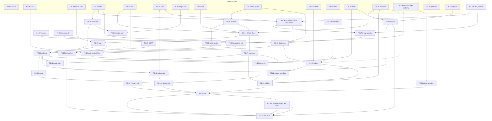
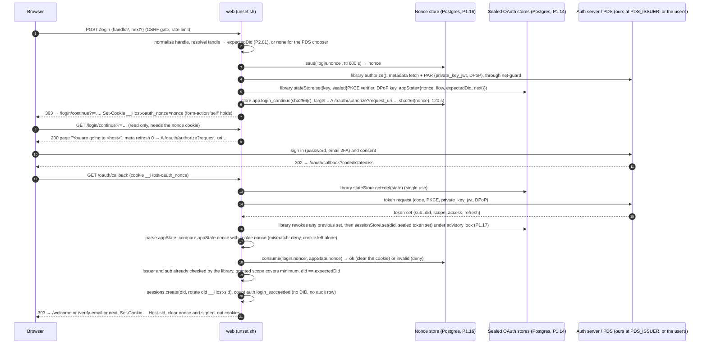
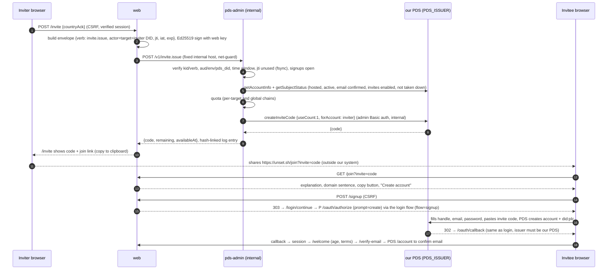
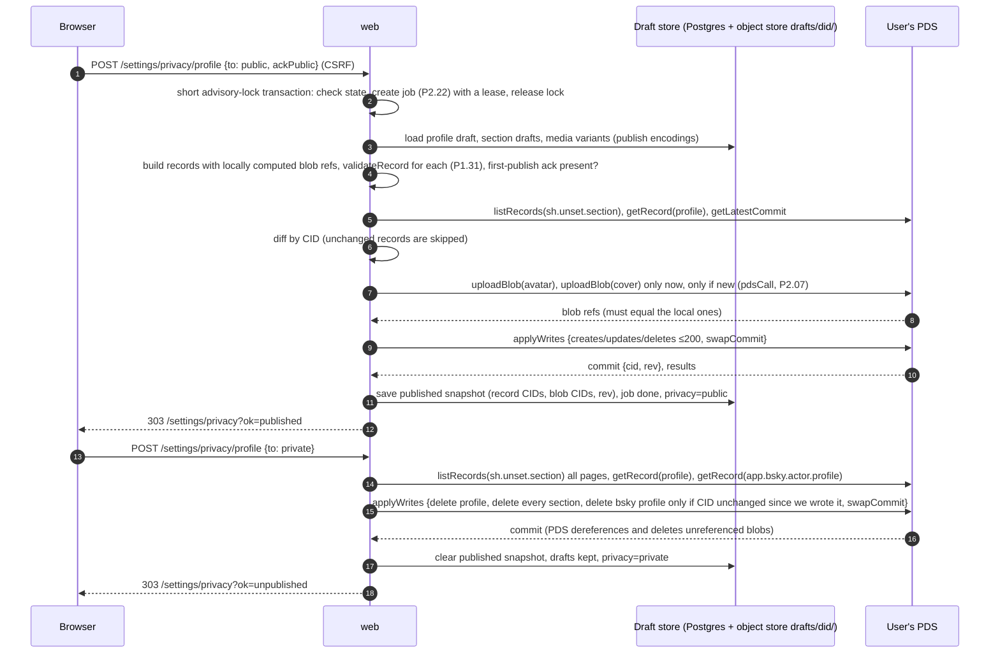
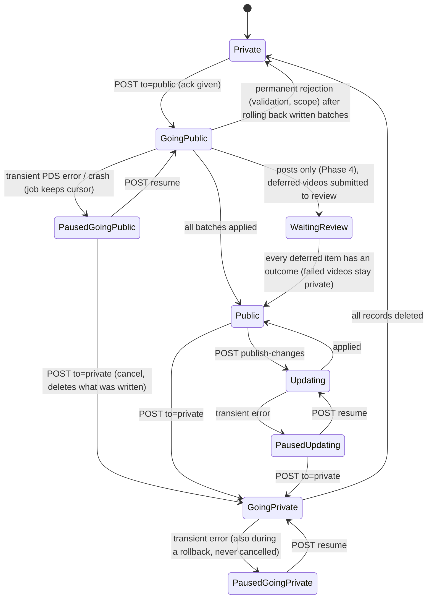
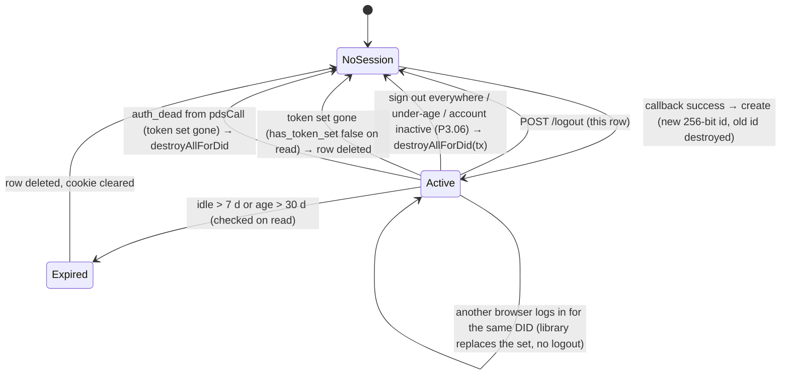
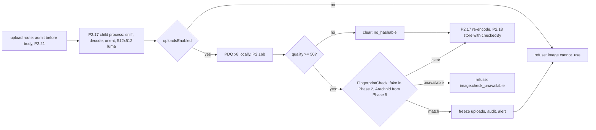

# Phase 2 — Identity, auth, profile writing

Status: **round 2, build-ready** (writer: phase-2 agent; round 1 2026-10-02, round 2 2026-10-03 applying
`reviews/r1-phase-2-part1.md` and `reviews/r1-phase-2-part2.md`; see "Round 2 changes" at the end). Planning only; no code.
Source of truth: `../unset-sh-rebuild-plan.md` (22:20Z revision). Where this file and the plan disagree, the plan wins;
disagreements found while writing are listed in "Notes for the editor" at the end, never fixed here.

## Phase goal

A person with an invite creates an account on our PDS (`0x40.space` in development and on the test track; `unset.ac` only from Phase 5, decision 20) through
OAuth `prompt=create`, signs in to `unset.sh` with a confidential OAuth client, passes the age, terms and email gates,
edits a private profile draft (fields, sections, avatar and cover) whose images are fingerprint-checked and re-encoded,
previews it through the one `ProfileView`, and publishes or unpublishes it. Nothing reaches the person's repo except on
Publish; Unpublish removes every record we wrote.

## Exit criteria (checked by P2.26)

1. Sign-up through `/join?invite=` → PDS `prompt=create` → callback → onboarding → verified email works end to end on the
   development stack, with an invite issued through `pds-admin`.
2. Login, logout and "sign out everywhere" work; a DPoP-nonce 401 or a PDS 5xx never logs the user out.
3. Draft edits (profile fields, sections with reorder and delete, avatar and cover) never write to the repo:
   `com.atproto.repo.listRecords` for every `sh.unset.*` collection returns nothing while unpublished.
4. Publish writes `sh.unset.profile` and the sections in one `applyWrites`; Unpublish deletes them in one `applyWrites`;
   the blobs we uploaded are no longer served by `getBlob` after Unpublish.
5. Every image upload is PDQ-hashed locally and passes the `FingerprintCheck` stage before it is stored (the fake check
   in development, CI and the test track; production refuses to boot without the real check, which lands in Phase 5).
6. The §5.3 go/no-go list (P2.24) has a recorded result and Alex has accepted the branding screenshots.
7. Every Phase 2 page passes axe-core in both themes and both languages; every Phase 2 string is in EN and FR.

## Assumed interfaces from earlier phases (the editor reconciles names)

The steps below call these by the names given here. If the Phase 0/1 file names them differently, the Phase 1 name wins
and this table is the only place to change.

| From | Assumed interface (typed pseudocode) |
|---|---|
| P1.02 config | `cfg: Readonly<Config>` built once per entrypoint by `loadConfig(schema)`; a missing required key fails boot; values never printed. Phase 2 adds keys listed in each step's Inputs. |
| P1.03 errors, logger | `ErrorCode` closed union (catalog file); `AppError(code: ErrorCode, httpStatus)`; `log.event(name, fields)` with a field allowlist (no IP, no UA, no email, no token). Redirect targets carry `?e=<ErrorCode>` or `?ok=<NoticeCode>`, never free text. |
| P1.04 HTTP | Hono app per entrypoint; `defineRoute({method, path, group: RouteGroup, handler})` (the steps write `route(…)` as shorthand); unknown methods → 405, unknown content types → 415. `ctx.req`, `ctx.memo` (per-request memo map). |
| P1.05 trusted proxy | `clientAddress(ctx) -> string` (only from the configured header). Used in Phase 2 only to build the rate-limit hash and, at a fingerprint match only, the sealed transmission data. |
| P1.06 limits | `RateLimiter.consume(policy, {ip: ClientIp \| null} \| {did}) -> {ok: true} \| {ok: false, retryAfterS}` (policies `login` per IP 10/min, `upload` per DID 10/min; Phase 2 adds `signup`, `invite_issue`, `editor`, `publish`, `module_handoff`). Two slots: `rateLimitIp` (before CSRF) and `rateLimitDid` (after the session; the route declares `requiresSession: true`), both answering 429 `http.rate_limited`. A handler that maps a denial to its own error code calls `RateLimiter.consume` itself, with `{ip}` before the session or `{did}` after it, for a policy the route does not also declare. Body limit per route (`bodyLimit(bytes)`). |
| P1.07 CSRF | `csrfGate` runs on every non-GET/HEAD before the handler; an exception inside it denies. Phase 2 adds no bypass. A GET handler's DB handle is a read-only transaction; the only GET that writes is listed in `GET_MUTATION_EXCEPTIONS` (P2.06 adds `/oauth/callback`, its one entry). |
| P1.08 CSP | `RouteGroup = 'app' \| 'profile' \| 'static' \| 'media' \| 'admin' \| 'api'` (there is no `auth` group); `form-action 'self'` everywhere, no exceptions. A POST that must send the browser to another origin answers 303 to a same-origin GET interstitial that navigates on with a meta refresh (P2.05 builds it); `cspFor(group)`; security headers on every response including errors. |
| P1.09 return path | `safeReturnPath(input: unknown, opts?: {allowPrefixes?}) -> SafePath \| null`. |
| P1.10 props | `serializeIslandProps(value) -> string` (safe inside `<script type="application/json">`). |
| P1.11/P1.12 DB | `db.tx(fn: (tx) => T, {role})`; migrations `infrastructure/postgres/migrations/NNNN_name.sql` run by `migrator`; grants written explicitly in each table's migration (no table default privileges; column lists on any table with an `erasure-registry.json` row, plan §5.2 at `9c54e52`) + the grant matrix file `db/grants.matrix` (P1.12 test; Phase 1 names the file `infrastructure/postgres/grant-matrix.json`). Schema `app` for app tables. |
| P1.13 DID registry | `db/did-columns.coverage` lists every `(schema.table.column, eraseStrategy)`; the P1.13 test fails when a DID column is missing. **Every Phase 2 table with a DID column adds its line** (Phase 1's actual form: domain `types.did` plus `erasure-registry.json` with strategies `delete_row \| set_null \| retain`, `retain` needing a class and reason; the steps' `eraseStrategy` maps onto these). |
| P1.14 seal | (P1.14a's public-key `sealTo("legal_hold", plaintext, context)` is **not** needed by Phase 2: the legal hold moved to P5.07b with the real check; P1.14a must exist before P5.07b and P4.03/P4.07.) `seal(plaintext, context: SealContext) -> string`; `unseal(sealed, context)` (throws `SealError{code: 'seal.format' \| 'seal.unknown_kid' \| 'seal.auth_failed' \| 'seal.too_large'}`); the context comes only from `sealContext(column, rowKey)` (e.g. `sealContext("app.oauth_session.sealed", did)`), never a free string; the value is stored in a `types.sealed` column registered in `sealed-columns.json` (the string carries its own key id, so no separate `kid` column). |
| P1.15 audit | `appendAudit(tx, {action, outcome, actorDid?, actorKey?, target?, reason?, case?, jti?, requestId?, receipt?, pii?}) -> {lane, seq}`; `outcome` ∈ `attempted \| succeeded \| failed \| denied \| unknown`; the lane is derived from the action, never passed; `actorDid` is the human actor; `reason` is from the closed reason list. The action list is closed; Phase 1 seeds `age_gate.blocked` (writer `web`) and **no** login, logout or session action (plan §6 "no user sign-in records"). A Phase 2 action not in the seed is added by that step's migration. Sign-in, sign-out and identity hand-offs are counted only, service-wide, in the daily metrics (decision 17): each is one `log.event(name, {code?})` line with no DID, no session id and no handle, which the daily metrics aggregate. |
| P1.16 single-use store | `issue(db, purpose, {ttlS, bindDid?, bindExtra?}) -> token`; `consume(db, purpose, token, {bindDid?, bindExtra?}) -> 'ok' \| 'invalid'`; `claim(db, purpose, {issuer, externalId}, expiresAt) -> boolean` (a `jti` is unique per issuer); table `app.single_use`; purposes `login.nonce` (10 min), `invite.claim`, `email.interstitial`, … **It carries no payload**, so the login flow data `{flow, expectedDid, next}` rides in the OAuth library's `appState`, which P2.04's sealed, single-use state store (`app.oauth_state`) already protects (P2.05). |
| P1.17 lock | `withAdvisoryLock(pool, namespace, key, fn, opts) -> T` plus a `requestLock` adapter for the OAuth library; throws on timeout. The steps write `withAdvisoryLock('ns:key', fn)` as shorthand. |
| P1.18 net-guard | `guardedRequest(policy, {...})` and `guardedFetch(policy, defaults): typeof fetch`, both on `undici.request`, with named policies `plc`, `arachnid` (fixed hosts; no `anthropic` policy in v1, Alex answer 30b) and `atproto` (one `public` policy whose `internalHosts = NETGUARD_INTERNAL_HOSTS` holds our own PDS's hostname, reached inside the stack — this settles E18); proxy mode (P1.18b) for processes that are not ours; throws `NetGuardError` with codes `egress.*`. The steps' `kind` values (`blocked`, `dns`, `connect`, `timeout`, `too_large`, `redirect`, `tls`) map onto those `egress.*` codes. Redirects are never followed. P2.01 assumes (or adds) `resolveTxt(name, {timeoutMs}) -> string[][]` throwing `NetGuardError{kind:'dns', code: 'ENOTFOUND'\|'ENODATA'\|'ESERVFAIL'\|'ETIMEOUT'…}`. |
| P1.19 i18n | `t(locale, key, params?)`; EN and FR catalogs; missing/unused key checks. Built in the i18n slice, after P2.13a (English first): slice-1 steps use `messages.ts` modules instead. |
| P1.20/P1.23 islands | `<Island name props/>` server component + hashed client bundle; props through P1.10. |
| P1.22 theme/locale | cookies `theme`, `locale`; form POSTs to switch. The locale half is P1.22b (i18n slice); slice 1 is English. |
| P1.24 UI kit | `Button`, `LinkButton`, `Field`, `TextInput`, `TextArea`, `Checkbox`, `FileInput`, `Notice`, `Form`, `Card`, `Avatar`, `Icon`, `CopyField` (if not on the sheet, P2 steps that need it stop for Alex — see each step). |
| P1.25 shell | `AppShell`, `ErrorPage(code)`, legal page route slots `/legal/terms`, `/legal/privacy`. |
| P1.31 lexicons | `validateRecord(nsid, value) -> {ok: true, value} \| {ok: false, path, message}`; `LIMITS.profile.*`, `LIMITS.section.*`; NSID constants; `PERMISSION_SET_NSID`; the permission-set JSON (for the scope-equality test); vendored `app.bsky.actor.profile` validator. |
| P1.34/P1.35 PDS | No production PDS before Phase 5 (decision 20; P1.34 only registers `unset.ac`). Phase 2 runs entirely against the dev PDS `0x40.space`, made fit to be an authority by P1.35: invite-only, `PDS_SERVICE_HANDLE_DOMAINS=.0x40.me` (dev `.0x40.space`), permission set published and resolvable. |
| P1.37 legal 1 | Arachnid Shield application status; Cybertip report-and-preserve runbook (`docs/human/runbooks/cybertip.md`); incident-response page. |

## Shared conventions for this phase

- **Cookies** (all `__Host-`, `Secure`, `Path=/`, no `Domain`, `HttpOnly`): `__Host-sid` (session, `SameSite=Lax`),
  `__Host-oauth_nonce` (`SameSite=Lax`, 600 s), `__Host-signed_out` (marker `1`, `SameSite=Lax`, 30 days). No other
  cookie is introduced in Phase 2.
- **No state change on a GET** (plan §2 rule 4). The only GET that writes is `/oauth/callback`, which the OAuth protocol
  forces; it is bound to the nonce cookie and the single-use store. Read-cache refreshes (P2.11) are not state changes
  the user can be tricked into.
- **Owner reads** come from the draft store and the published snapshot, never from the index (plan §2 rule 12).
- **Images** in signed-in pages come only from the media origin through P2.19 signed URLs (plan §2 rule 9).
- **Errors** in URLs are codes from the P1.03 catalog. Every code added in this phase is listed in the step that adds it.
- **PDS calls** from `web` go only through P2.07's `pdsCall` (a static test enforces it from P2.07 on).
- **Composition root.** Each entrypoint has one `main.ts` that loads config, builds the few long-lived objects (the
  OAuth client, the `FingerprintCheck` implementation, the object store client, the privacy module with its
  publishers) and passes them as plain parameters to the routes. No container, no registry, no module-level singletons
  that read config on import.
- **Provider failures stay isolated.** Every outside provider sits behind one function that returns a typed result and
  never throws: the user's PDS (`pdsCall` → `PdsResult`), the fingerprint check (`FingerprintCheck.check`), the object
  store (`{ok: false, code: 'objects.unavailable'}`), `pds-admin` (`issueInvite`). A provider outage degrades only the
  feature that needs it (text saves work while the object store is down; a PDS outage never logs anyone out).
- **Clarity before reuse.** Interfaces exist only where two implementations are certain (`FingerprintCheck`: fake now,
  Arachnid in Phase 5; `CategoryPublisher`: profile now, posts in Phase 4). Everything else is a plain function.

## Phase 2 routes at a glance

| Route | Method | Group | Step |
|---|---|---|---|
| `/oauth-client-metadata.json`, `/oauth/jwks.json` | GET | `app` (JSON) | P2.04 |
| `/login` | GET, POST | `app` | P2.05 |
| `/login/continue` | GET | `app` | P2.05 |
| `/oauth/callback` | GET | `app` | P2.06 |
| `/login-failed` | GET | `app` | P2.05/P2.06 |
| `/logout`, `/logout/everywhere` | POST | `app` | P2.08 |
| `/signed-out` | GET | `app` | P2.08 |
| `/invite`, `/invite/hide` | GET, POST / POST | `app` | P2.10 |
| `/join` | GET | `app` | P2.10 |
| `/signup` | POST | `app` | P2.10 |
| `/verify-email` | GET | `app` | P2.11 |
| `/welcome`, `/welcome/age`, `/welcome/terms`, `/welcome/chat` | GET, POST | `app` | P2.12 |
| `/me`, `/settings` (shell) | GET | `app` | P2.13 |
| `/module-handoff` | GET, POST | `app` | P2.14 |
| `/legal/terms`, `/legal/privacy`, `/legal/domains`, `/.well-known/security.txt` | GET | `static` | P2.15 |
| `/settings/profile`, `/settings/profile/*`, `/settings/sections*` | GET, POST | `app` | P2.21 |
| `/settings/privacy`, `/settings/privacy/*` | GET, POST | `app` | P2.22/P2.23 |
| `media` entrypoint: `/o/{purpose}/{objectKey}` | GET, HEAD | `media` | P2.19 |
| `pds-admin`: `/v1/invite.issue`, `/health` | POST, GET | internal | P2.09 |

## Slices (decision 34, editor pass 2026-10-04)

Phase 2's first steps belong to **slice 1, "sign in with an atproto account and see your own profile"** (plan §8
Phase 1, guideline §12), which is built before the rest of Phase 1: P2.01–P2.08, P2.11, P2.15, P2.12, P2.13 and the
slice exit **P2.13a**, in that order, after the Phase 1 slice-1 steps (`01-outline.md`, "Slice 1"). The rest of this
file (P2.09, P2.10, P2.14, P2.16b–P2.26a) is built after slice 2 and the i18n slice (the rest of Phase 1, ending at
P1.38). Step ids did not change; the file is in build order.

**English first (Alex, 2026-10-04 12:58Z, against the recommendation).** Slice 1 is English only. Its Phase 2 steps
(P2.01–P2.08, P2.11, P2.15, P2.12, P2.13, P2.13a) keep their user-facing English text in one `messages.ts` per feature
(plain exported constants, no catalog machinery); where they say "catalog key", "catalogs" or "EN/FR", read "the
feature's messages module" and "English", and their axe and Playwright tests run English only. P2.15 writes only the
`.en.md` legal documents in slice 1; the `.fr.md` files land in the i18n slice (P1.19's PR, approved by Alex like all
legal text). The i18n slice (P1.19, P1.22b; `phase-1.md`, "Slices") converts every module first and adds French to these
tests; no French page ships before it. The Phase 2 exit (P2.26) still checks both languages, since it comes after it.
Every step after P2.13a uses the catalogs and `t()` directly. Dependency changes: P2.04 takes P1.31 instead of P1.35; P2.12 lists P1.15 (its
age-gate block writes one audit row); P2.15 lists P1.37 (its incident-response page); P2.26 lists P2.13a and P1.38.

## Step dependency diagram

Solid arrows are dependencies as this file states them after round 2 (several differ from the outline; see Notes E1,
E2, E5); dashed arrows are dependencies still to be added to the outline (E1).



## Sequence: login and callback



## Sequence: sign-up with an invite



## Sequence: publish and unpublish



## State diagram: privacy switch (one per category)



## State diagram: app session lifecycle



---

### P2.01k — `resolveTxt` in `net-guard` (split from P2.01, SE-6)
Tags: [SEC]            Depends on: P1.18            Plan: §2 rule 13 (one egress); §9 trusted base (rule SE-6, as updated 2026-10-04; plan `6275827`)
Where: `infrastructure/net-guard/dns.ts` + `dns.test.ts`, its export from `infrastructure/net-guard/index.ts`
Size: ~40 source lines, ~60 test lines

Why a separate step (letter suffix): `net-guard` is trusted base, and P1.18 exports no `resolveTxt` (checked: no
phase-1 step names it), so P2.01's old "A0" addition is its own PR, first.
Goal: DNS TXT lookups (for `_atproto.<handle>`) go through `net-guard`, bounded in time.
Inputs: P1.18 `NetGuardError`; config `IDENTITY_DNS_TIMEOUT_MS` (declared by the caller and passed in).
Outputs: `resolveTxt(name: string, { timeoutMs }): Promise<string[][]>` throwing `NetGuardError{kind: 'dns', code:
  'ENOTFOUND' | 'ENODATA' | 'ESERVFAIL' | 'ETIMEOUT' | …}`, as P2.01's interface row states.
Algorithm: a `node:dns` `Resolver` with `timeout = timeoutMs`, `tries = 2`, servers from the system; return the TXT
  records; map every error to `NetGuardError` with its code; a name that is not a valid DNS name → `kind: 'dns'`,
  `code: 'EBADNAME'`, no query sent.
Edge cases and failures: timeout → `ETIMEOUT`; an empty answer → `ENODATA`; the resolver throws anything else → `dns`
  with the code, never an unwrapped error.
Threats: outbound DNS.
  - D A slow resolver holding a request → bounded `timeoutMs`, two tries (`resolve_txt_timeout`).
  - T A crafted name → validated before any query (`resolve_txt_bad_name`).
Done when (tests): `resolve_txt_ok` (stub resolver returns records → same records); `resolve_txt_timeout`;
  `resolve_txt_nodata`; `resolve_txt_bad_name` (no query sent).
Reuse: none. Not in this step: handle resolution itself (P2.01). Diagram: none.

---

### P2.01 — DID and handle resolution
Tags: [SEC]            Depends on: P2.01k, P1.18            Plan: §2 rules 1, 13; §3 "PLC read replicas"; §5.2; Q1
Where: `domains/identity/{did-doc.ts, resolve-did.ts, resolve-handle.ts, syntax.ts, index.ts}` (`resolveTxt` in
  `net-guard` is **P2.01k**, trusted base, SE-6)
Size: ~280 source lines, ~380 test lines

Goal: Turn a DID into a parsed, validated DID document and a handle into a DID, through `net-guard` only, with
outcomes that separate "does not exist" from "could not tell right now".

Inputs: P1.18 `guardedFetch`, `resolveTxt`; config keys `PLC_URL` (required, `https://plc.directory` in every
  environment in Phase 2), `IDENTITY_HTTP_TIMEOUT_MS` (default 3000), `IDENTITY_DNS_TIMEOUT_MS` (default 2000),
  `DID_DOC_CACHE_TTL_S` (default 300), `DID_DOC_CACHE_MAX` (default 10000).
Outputs:
  - `type Did = string & {__brand: 'Did'}`; `type Handle = string & {__brand: 'Handle'}` (lowercase, validated).
  - `parseDid(raw: string) -> Did | null` — `did:plc:` + 24 base32 chars `[a-z2-7]`, or `did:web:` + hostname that matches
    the did:web hostname rule (lowercase dotted, alphabetic TLD, no port, no path, no `%`); anything else null.
  - `parseHandle(raw: string) -> Handle | null` — atproto handle syntax (≤253 chars, ≥2 labels, labels 1–63 of
    `[a-z0-9-]` not starting/ending with `-`, TLD not starting with a digit), after trim, lowercase and one leading `@`
    stripped; rejects the disallowed TLDs `.alt .arpa .example .internal .invalid .local .localhost .onion .test`.
  - `type ResolvedDid = { did: Did; pds: URL | null; signingKeyMultibase: string | null; rawAlsoKnownAs: readonly string[] }`
  - `resolveDid(did: Did, opts: {consistency: 'fresh' | 'cached'}) -> ResolvedDid` throws
    `IdentityError{kind: 'not_found' | 'invalid_doc' | 'unavailable'}`.
  - `resolveHandle(handle: Handle) -> {status: 'found', did: Did, via: 'dns' | 'https'} | {status: 'not_found'} | {status: 'unavailable'}`.
  - `didResolverForOAuth` and `handleResolverForOAuth`: adapters with the shapes the pinned
    `@atproto/oauth-client-node` accepts (`resolve(handle) -> Did | null`, throw on transient), used by P2.04.
  - Static test file `identity/also-known-as.guard.test.ts`: the identifiers `alsoKnownAs` / `rawAlsoKnownAs` appear
    only in `did-doc.ts`, `resolve-did.ts` and `verify-handle.ts` (P2.02) across the whole repo.

Algorithm:
  A0. Use `resolveTxt` from `net-guard`, built by P2.01k (SE-6: this PR does not touch `net-guard`). Its shape, for
      reference: a `node:dns` `Resolver` with `timeout = IDENTITY_DNS_TIMEOUT_MS`, `tries = 2`, servers from the
      system; it returns the TXT records or throws `NetGuardError{kind:'dns', code}`. Record the addition in the PR.
  A. `resolveDid(did, {consistency})`
    1. If `parseDid(did)` is null → throw `IdentityError('invalid_doc')`.
    2. If `consistency == 'cached'` and the LRU cache holds an entry younger than `DID_DOC_CACHE_TTL_S` → return it.
       If `consistency == 'fresh'` → skip the cache read (the result still refreshes the cache).
    3. Build the URL:
       - `did:plc:` → `PLC_URL + '/' + did` (fixed-host policy `{fixedHosts: [host of PLC_URL]}`). Phase 2 has no replica;
         `fresh` and `cached` both read `PLC_URL`. The parameter exists so Phase 3 can add a replica for `cached` reads
         only; a test pins that `fresh` never reads a replica.
       - `did:web:<host>` → `https://<host>/.well-known/did.json` (policy `'public'`).
    4. `guardedFetch(url, {method: 'GET', headers: {accept: 'application/did+ld+json, application/json'},
       timeoutMs: IDENTITY_HTTP_TIMEOUT_MS, maxBytes: 64 KiB})`:
       - throws `timeout | dns | connect | tls` → throw `IdentityError('unavailable')`.
       - throws `blocked | redirect | too_large` → throw `IdentityError('invalid_doc')` (a hostile or broken host; never retried).
       - HTTP 404 or 410 → throw `IdentityError('not_found')` (PLC answers 404 for unknown and 410 for tombstoned DIDs).
       - HTTP 5xx or 429 → throw `IdentityError('unavailable')`.
       - any other non-200 → throw `IdentityError('invalid_doc')`.
       - 200 → continue.
    5. Parse JSON; on a parse error → `invalid_doc`. Then `parseDidDoc(json, did)` in `did-doc.ts`:
       a. `json.id` must equal `did` exactly → else `invalid_doc`.
       b. `rawAlsoKnownAs` = `json.alsoKnownAs` if it is an array of strings (non-strings dropped), else `[]`.
          This module never interprets them; P2.02 does.
       c. PDS: the first `service` entry whose `id` is `#atproto_pds` or `<did>#atproto_pds` and `type` is
          `AtprotoPersonalDataServer`; its `serviceEndpoint` must be a string URL with scheme `https`, no userinfo,
          no query, no fragment, path empty or `/`. Otherwise `pds = null` (not an error: the caller decides).
       d. Signing key: the `verificationMethod` with id `#atproto` or `<did>#atproto`, `publicKeyMultibase` string,
          else null.
    6. Store in the LRU (evict least recently used beyond `DID_DOC_CACHE_MAX`) and return.
  B. `resolveHandle(handle)`
    1. Precondition: `handle` came from `parseHandle` (type enforces it).
    2. DNS: `resolveTxt('_atproto.' + handle)`:
       - records found: collect values that start with `did=`; strip the prefix; keep those where `parseDid` succeeds.
         - exactly one distinct DID → return `{found, did, via: 'dns'}` (DNS wins; HTTPS is not consulted).
         - more than one distinct DID → dnsResult = `invalid` (treated as not found for DNS; go to step 3).
         - zero → dnsResult = `none`.
       - throws with `ENOTFOUND` or `ENODATA` → dnsResult = `none`.
       - throws with anything else (`ESERVFAIL`, `ETIMEOUT`, `ECONNREFUSED`…) → dnsResult = `unavailable`.
    3. HTTPS: `guardedFetch('https://' + handle + '/.well-known/atproto-did', {policy: 'public', timeoutMs:
       IDENTITY_HTTP_TIMEOUT_MS, maxBytes: 1024})`:
       - 200 → body trimmed of ASCII whitespace; if `parseDid(body)` → httpsResult = `found(did)`; else `none`.
       - 404 or 410 → `none`.
       - 5xx, 429, `timeout`, `dns` (non-NXDOMAIN), `connect`, `tls` → `unavailable`.
       - `dns` with NXDOMAIN → `none`. `blocked`, `redirect`, `too_large`, other status → `none`.
    4. Combine:
       - httpsResult `found` → return `{found, did, via: 'https'}` (also when DNS was `unavailable`: either method is valid per spec, and P2.02 verifies the reverse direction).
       - both `none`/`invalid` → `{not_found}`.
       - otherwise (one side `unavailable`, the other `none`) → `{unavailable}`. Fail closed: callers never treat this as "no such handle".
  C. OAuth adapters: `handleResolverForOAuth.resolve(h)` → `parseHandle` null → return null; `found` → did;
     `not_found` → null; `unavailable` → throw `IdentityError('unavailable')`. `didResolverForOAuth` wraps
     `resolveDid(did, {consistency: 'fresh'})` and returns the raw document shape the library expects (the library
     re-reads `alsoKnownAs` itself; that is the one accepted exception, listed in the guard test with a comment).

Edge cases and failures:
  - PLC 410 (tombstoned DID) → `not_found`.
  - DID document `id` differs from the requested DID → `invalid_doc` (never trust a doc served for another DID).
  - `did:web:localhost`, `did:web:pds:3000`, `did:web:10.0.0.1`, `did:web:a%2Fb` → `parseDid` null → `invalid_doc` before any network.
  - did:web host resolves to a private address → net-guard `blocked` → `invalid_doc`.
  - did:web host answers with a 302 → `redirect` → `invalid_doc`.
  - DID doc larger than 64 KiB → `invalid_doc`.
  - PDS endpoint `http://…`, with a path `/xrpc`, with `user:pass@`, or missing → `pds = null`.
  - Two `did=` TXT records with different DIDs → DNS ignored, HTTPS decides.
  - TXT record `did=` + garbage → ignored.
  - DNS SERVFAIL and HTTPS 404 → `unavailable` (not `not_found`).
  - DNS NXDOMAIN and HTTPS timeout → `unavailable`.
  - HTTPS body `did:plc:abc…\n` with trailing newline → accepted after trim; body with a second line → `parseDid` fails → `none`.
  - Handle `Alice.0x40.ME` → normalised to `alice.0x40.me`; `@alice.0x40.me` → leading `@` stripped; `alice..0x40.me`,
    `alice.local`, `-a.0x40.me`, a 254-char handle → `parseHandle` null.
  - Cache poisoning: a `fresh` read always replaces the cached entry; `not_found`/`unavailable` are never cached here.

Threats: identity data fetched from PLC, `did:web` hosts, DNS and handle domains, all controlled by others.
  - S A DID document served for another DID → `id` must equal the requested DID (`resolveDid.id_mismatch`).
  - E SSRF through a `did:web` host or a redirect → `parseDid` refuses local and internal forms; `net-guard` refuses
    private answers and redirects (`parseDid.accepts_plc_and_web`, `resolveDid.blocked_redirect_too_large`).
  - S A self-asserted `alsoKnownAs` trusted as the handle → only P2.02 reads it (`alsoKnownAs.guard`).
  - T A PDS endpoint with http, a path or userinfo → `pds = null` (`resolveDid.pds_endpoint_rules`).
  - D An outage read as "account not found" → `unavailable` is distinct and never cached
    (`resolveDid.plc_5xx_timeout`, `resolveHandle.unavailable_cases`).
  - T Cache poisoning → `fresh` reads go to `PLC_URL` only and replace the entry (`resolveDid.cache`,
    `resolveDid.fresh_never_replica`).

Done when (tests):
  - `parseDid.accepts_plc_and_web`: valid `did:plc` and `did:web:example.com` → returned; table of invalid forms above → null.
  - `parseHandle.normalises_and_rejects`: table of inputs → expected output or null, including every disallowed TLD.
  - `resolveDid.plc_ok`: fake fixed-host fetch returns a valid doc → `pds`, `signingKeyMultibase`, `rawAlsoKnownAs` set.
  - `resolveDid.id_mismatch`: doc `id` ≠ requested → `invalid_doc`.
  - `resolveDid.plc_404_410`: 404 and 410 → `not_found`.
  - `resolveDid.plc_5xx_timeout`: 503, 429 and a `timeout` NetGuardError → `unavailable`.
  - `resolveDid.blocked_redirect_too_large`: each NetGuardError kind → `invalid_doc`.
  - `resolveDid.pds_endpoint_rules`: http, path, userinfo, query, missing → `pds = null`; valid https → URL.
  - `resolveDid.cache`: two `cached` calls → one fetch; a `fresh` call → second fetch and the cache is updated.
  - `resolveDid.fresh_never_replica`: with a fake replica configured in the test harness, `fresh` hits `PLC_URL` only.
  - `resolveHandle.dns_wins`: TXT `did=A` and HTTPS `B` → `A`, HTTPS never called (spy).
  - `resolveHandle.dns_conflict_falls_to_https`: TXT `did=A`, `did=B` → HTTPS result used.
  - `resolveHandle.https_only`: NXDOMAIN, HTTPS 200 → `via: 'https'`.
  - `resolveHandle.not_found`: NXDOMAIN + 404 → `not_found`.
  - `resolveHandle.unavailable_cases`: SERVFAIL+404, NXDOMAIN+timeout, SERVFAIL+timeout → `unavailable`.
  - `resolveHandle.https_body_rules`: trailing newline accepted; two lines, HTML, empty → `none`.
  - `oauthAdapter.throws_on_unavailable`: adapter throws for `unavailable`, returns null for `not_found`.
  - `alsoKnownAs.guard`: static scan of the repo source passes; a planted fixture file referencing `alsoKnownAs` fails it.

Reuse (provisional — for reuse review):
  - `appview/src/identity.ts:25-30` (`didWebUrl` hostname rule) → LESSON: the regex and its SSRF rationale are right;
    rewrite inside `parseDid` and test it here.
  - `appview/src/identity.ts:32-50` (`resolveDidDoc`) → REJECT as code: it collapses every failure to `null`, which is
    the "outage looks like not found" defect this step exists to prevent.
  - `@atproto/common-web` `getHandle/getPdsEndpoint` (used at `appview/src/identity.ts:2-18`) → REJECT here: P2.02 must
    be the only reader of `alsoKnownAs`, so the parse is ours (~40 lines).
  - `@atproto/identity` (`DidResolver`, `HandleResolver`) → LESSON: read for edge cases (TXT parsing, did:web rules); not
    used, because it fetches with its own `fetch`/`dns`, outside `net-guard`.
  - vault `research/atproto-identity-model` (DNS TXT preferred, bidirectional rule) → cite in the module comment.
Not in this step: the bidirectional check and its cache (P2.02); the handle-registry rule for `*.0x40.me` (P3.08); any
  PLC write; a PLC replica (Phase 3 if needed).
Diagram: none.

### P2.02 — `verifyHandle(did)`
Tags: [SEC]            Depends on: P2.01            Plan: §2 rule 1; §5.2 "handles in events are hints only"
Where: `domains/identity/verify-handle.ts`, `domains/identity/verify-handle.test.ts`
Size: ~110 source lines, ~200 test lines

Goal: The one function that turns a DID into a display handle, accepted only when the DID document claims the handle
and the handle resolves back to the same DID.

Inputs: P2.01 `resolveDid`, `resolveHandle`, `parseHandle`; config `HANDLE_VERIFY_TTL_S` (default 600),
  `HANDLE_INVALID_TTL_S` (default 60), `HANDLE_CACHE_MAX` (default 10000).
Outputs:
  - `type HandleVerdict = {status: 'verified', handle: Handle, checkedAt} | {status: 'invalid', checkedAt} | {status: 'unavailable'}`.
  - `verifyHandle(did: Did, opts?: {consistency?: 'fresh' | 'cached'}) -> HandleVerdict` (never throws; internal errors
    become `unavailable`).
  - `invalidateHandle(did: Did) -> void` (for P3 identity events and P2.06 after login).
  - `displayHandle(v: HandleVerdict) -> string` → the handle, or the literal `handle.invalid` for `invalid` and
    `unavailable` (UI shows the DID beside it; never a stale or unverified handle).

Algorithm:
  1. If `opts.consistency != 'fresh'` and the cache holds an entry for `did` not past its expiry → return it.
  2. `resolveDid(did, {consistency: opts.consistency ?? 'cached'})`:
     - throws `not_found` or `invalid_doc` → verdict `invalid`; cache for `HANDLE_INVALID_TTL_S`; return.
     - throws `unavailable` → return `unavailable` (not cached).
  3. Claimed handle: the **first** entry of `rawAlsoKnownAs` that starts with `at://`; strip `at://`; `parseHandle`.
     Per the handle spec only the first `at://` entry counts.
     - none, or `parseHandle` null → `invalid` (cache short); return.
  4. `resolveHandle(claimed)`:
     - `found` with `did` equal to the input DID → `verified(claimed)`; cache for `HANDLE_VERIFY_TTL_S`; return.
     - `found` with another DID → `invalid` (a spoof or a stale doc); cache short; return.
     - `not_found` → `invalid`; cache short; return.
     - `unavailable` → return `unavailable` (not cached).
  5. Any unexpected exception in steps 2–4 → log `identity.verify_error` (DID only) and return `unavailable`.

Edge cases and failures:
  - DID doc lists `at://mallory.example` first and `at://alice.0x40.me` second → only the first is checked.
  - `alsoKnownAs` entry `at://ALICE.0x40.me` → normalised before resolution; verified if it resolves back.
  - Handle resolves to the right DID only over HTTPS while DNS is down → `verified` (P2.01 rule).
  - PLC down → `unavailable`; callers display `handle.invalid` and the DID, and never block a login on it.
  - Two concurrent calls for the same DID → may both resolve; last write wins in the cache; no correctness impact.
  - A previously verified handle after an `invalidateHandle(did)` → next call re-resolves.

Threats: the handle we display for a DID (plan §2: verified bidirectionally).
  - S A DID claims a handle it does not own (impersonation by display) → the first `alsoKnownAs` handle must resolve
    back to the same DID, else `handle.invalid` (`verifyHandle.bidirectional_ok`, `verifyHandle.reverse_mismatch`,
    `verifyHandle.first_aka_only`).
  - T A stale verification outlives a handle change → short TTLs and invalidation (`verifyHandle.cache_ttls`,
    `verifyHandle.invalidate`).
  - D A PLC outage blocks logins → `unavailable`, not cached, never blocks (`verifyHandle.plc_unavailable_not_cached`,
    `verifyHandle.never_throws`).

Done when (tests):
  - `verifyHandle.bidirectional_ok`: doc claims `alice.test-pds.example`, handle resolves to the same DID → `verified`.
  - `verifyHandle.reverse_mismatch`: handle resolves to another DID → `invalid`, `displayHandle` = `handle.invalid`.
  - `verifyHandle.first_aka_only`: second entry valid, first invalid → `invalid`.
  - `verifyHandle.no_aka`: empty list → `invalid`.
  - `verifyHandle.plc_unavailable_not_cached`: first call `unavailable`, second call (PLC healthy) → `verified` (two fetches).
  - `verifyHandle.cache_ttls`: verified cached 600 s, invalid 60 s (fake clock).
  - `verifyHandle.invalidate`: after `invalidateHandle` → re-resolution happens.
  - `verifyHandle.never_throws`: resolver throwing a raw `TypeError` → `unavailable`.
  - `alsoKnownAs.guard` (from P2.01) still green with this file added.

Reuse (provisional — for reuse review):
  - `appview/src/verify.ts:10-21` (`verifyMemberHandle`) → LESSON: right instinct (fail closed on an unissued
    `*.0x40.me`), wrong mechanism (a registry table instead of reverse resolution; "full bidirectional check deferred"
    for external handles). Rewrite as above; the registry rule is P3.08.
  - vault `pitfalls/self-asserted-did-doc-handle-must-be-bidirectionally-verified` → cite in the module comment.
Not in this step: the `*.0x40.me` "our PDS confirms" rule (P3.08); handle display components (P2.13); identity-event
  invalidation wiring (P3.05).
Diagram: none.

### P2.03 — Session store and lifecycle
Tags: [SEC]            Depends on: P1.12            Plan: §2 rule 7; §5.3 "Sessions"
Where: `domains/identity/auth/session-store.ts`, `interfaces/http/session-cookie.ts`,
  migration `0201_app_session.sql`, `db/did-columns.coverage` (+1 line), `db/grants.matrix` (+1 table)
Size: ~170 source lines, ~260 test lines

Goal: Durable browser sessions that map a random cookie to a DID, with server-checked idle and absolute timeouts,
rotation at login and one call that ends every session of a DID inside the caller's transaction.

Inputs: P1.12 roles (this step's migration grants `web` SELECT/INSERT/UPDATE on `app.session` by column list and DELETE as `rowPrivileges`: a registry table, 02-shared-blocks §11; no default privileges); config `SESSION_IDLE_S` (604800),
  `SESSION_ABSOLUTE_S` (2592000), `SESSION_TOUCH_INTERVAL_S` (300).
Outputs:
  - Table `app.session(id_hash bytea primary key /* sha256 of the 32-byte id */, did text not null,
    created_at timestamptz not null, last_seen_at timestamptz not null, absolute_expires_at timestamptz not null,
    email_confirmed boolean null /* cache, P2.11 */, email_checked_at timestamptz null)`; index `(did)`;
    index `(absolute_expires_at)`. Coverage line: `app.session.did → delete`.
  - `sessions.create(tx, did, opts: {replacingCookie?: string}) -> {cookieValue: string, expiresAt}`.
  - `sessions.read(ctx) -> Session | null` where `Session = {did, idHash, createdAt, emailConfirmed: boolean | null}`;
    memoised in `ctx.memo` for the request.
  - `sessions.destroy(tx, idHash) -> void`; `sessions.destroyAllForDid(tx, did, why: EndSessionsReason) -> number` (rows
    deleted), a thin wrapper over the definer `app.end_sessions_for_did(did, why)` (below); there is no second copy of
    its SQL in TypeScript (phase-3 Notes; one mechanism).
  - Definer `app.end_sessions_for_did(did types.did, why text) RETURNS int`, created by **P2.04's** migration (it needs
    both `app.session` and `app.oauth_session`) with the contract P3.06 states: owned by `migrator`, `SECURITY DEFINER`,
    `SET search_path = pg_catalog, app`; deletes the DID's `app.session` rows; deletes its `app.oauth_session` row
    unless `why = 'deactivated'`; `why` CHECKed against one closed enum shared with P3.06: Phase 2 uses
    `user_signout_all` (P2.08), `underage` (P2.12) and `auth_dead` (P2.07); P3.06 uses the account-state and moderation
    values. EXECUTE to `web` here; P3.06 grants it to `indexer` and `admin`. Because the function also deletes the token
    set, a caller that must revoke the grant at the authorization server calls `client.revoke` **before** it.
  - `sessions.setEmailConfirmed(tx, idHash | {did}, value: boolean) -> void`.
  - `sessionCookie.set(ctx, value, maxAgeS)`, `sessionCookie.clear(ctx)`: `__Host-sid`, HttpOnly, Secure, SameSite=Lax, Path=/.
  - `sessions.sweep() -> number` (deletes rows past idle or absolute expiry), run hourly under `withAdvisoryLock('session-sweep')`.

Algorithm:
  1. `create(tx, did, {replacingCookie})`:
     a. If `replacingCookie` is a syntactically valid cookie value → `DELETE FROM app.session WHERE id_hash = sha256(decode(replacingCookie))`
        (rotation: the previous session of this browser dies, whoever it belonged to).
     b. `id = randomBytes(32)`; `value = base64url(id)` (43 chars).
     c. `INSERT (sha256(id), did, now(), now(), now() + SESSION_ABSOLUTE_S)`; on a primary-key collision (2^-256) → retry once, then throw.
     d. Return `{cookieValue: value, expiresAt: absolute}`; the caller sets the cookie with `Max-Age = SESSION_ABSOLUTE_S`.
  2. `read(ctx)`:
     a. If `ctx.memo.session` is set → return it (one DB read per request).
     b. Cookie missing → memo null, return null.
     c. Value not 43 chars of base64url → clear cookie, memo null, return null.
     d. `SELECT … WHERE id_hash = sha256(decode(value))`. DB error → throw (the route's error handler answers 503;
        fail closed: no anonymous fallback on an authenticated route).
     e. No row → clear cookie; return null.
     e2. Token-set check (the SELECT gains this column in P2.04's migration, when `app.oauth_session` exists):
        `EXISTS (SELECT 1 FROM app.oauth_session o WHERE o.did = s.did) AS has_token_set`. If false → DELETE the row,
        clear the cookie, return null. App-session validity follows the stored token set: the library removes the set
        when the grant is really dead, and this one indexed probe in the same SELECT ends the browser session (review
        r1-part1 F1; the library's own delete hook cannot be used for this, see P2.04 step 7).
     f. `now() > absolute_expires_at` or `now() > last_seen_at + SESSION_IDLE_S` → DELETE the row, clear cookie, return null.
     g. If `now() - last_seen_at > SESSION_TOUCH_INTERVAL_S` → `UPDATE last_seen_at = now()` on **its own pool connection,
        outside the handler's transaction** (a GET handler's transaction is read-only, P1.07 step 10; this touch is
        session infrastructure, not a GET mutation, and the session layer's README says so). Best effort: an error here
        is logged and ignored, the session stays valid for this request.
     h. Memo and return the session.
  3. `destroyAllForDid(tx, did, why)` → `SELECT app.end_sessions_for_did($1, $2)` inside the given transaction; return the
     count. It never opens its own transaction, so the caller's state change (P2.12's block, P3.06's account state) and
     this delete commit together. Until P2.04's migration exists the wrapper is not callable (P2.03 and P2.04 land before
     any caller).
  4. `sweep()` → `DELETE … WHERE absolute_expires_at < now() OR last_seen_at < now() - SESSION_IDLE_S`; return the count;
     log `session.sweep {count}`.

Edge cases and failures:
  - Cookie value is a valid shape but unknown → cookie cleared, null.
  - Clock: all comparisons use database `now()` (one clock for every replica).
  - Two replicas touching the same row → last `UPDATE` wins; harmless.
  - `replacingCookie` belongs to another DID (shared computer) → still deleted (rotation is per browser).
  - `destroyAllForDid` called outside a transaction → type error at compile time (`tx` parameter is required).
  - DB unavailable on `read` → 503 page, cookie kept (never logs out on a DB blip).
  - A session row whose DID was erased (P3.07) → no row → null.
  - The token set was deleted (library refresh failure, sign out everywhere, erasure) → `has_token_set` false →
    row deleted, null. The callback's own revoke-then-store window (milliseconds) can sign out a request from another
    browser that lands inside it; accepted (rare).

Threats: the browser cookie that stands for a signed-in member.
  - S A stolen database row replayed as a cookie → only `sha256(id)` stored (`session.create_stores_hash_only`).
  - S Session fixation on a shared computer → rotation on login (`session.rotation`).
  - I The cookie read by scripts, sent cross-site or to member subdomains → `__Host-`, `HttpOnly`, `Secure`,
    `SameSite=Lax`, no `Domain` (`session.cookie_attributes`).
  - E A session outliving its limits or its token set → idle and absolute expiry by the DB clock; no token set ends it
    (`session.idle_expiry`, `session.absolute_expiry`, `session.no_token_set_ends`).
  - E "Sign out everywhere" missing a path → one definer with a closed reason list (`session.end_sessions_single_sql`,
    `session.end_sessions_why_closed`).
  - D A database blip logs everyone out → 503, cookie kept (`session.db_error_is_503`).

Done when (tests):
  - `session.create_stores_hash_only`: after `create`, the table has `sha256(id)`; the raw id appears nowhere in the row.
  - `session.read_roundtrip`: cookie from `create` → `read` returns the DID.
  - `session.rotation`: `create` with `replacingCookie` → old row gone, new row present.
  - `session.idle_expiry`: fake DB time +7 d +1 s since `last_seen_at` → null, row deleted, Set-Cookie clears.
  - `session.absolute_expiry`: touched every day, at +30 d +1 s → null.
  - `session.touch_throttled`: two reads 10 s apart → one UPDATE; reads 6 min apart → two UPDATEs.
  - `session.malformed_cookie`: 10 malformed values (empty, 42 chars, `+/` chars, 1 KB) → null, no DB query (spy).
  - `session.memo`: three `read` calls in one request → one SELECT.
  - `session.destroyAllForDid_in_tx` (runs after P2.04's migration): inside a tx that then rolls back → rows still there;
    committed → session rows and the token-set row gone.
  - `session.end_sessions_single_sql`: repo scan — `DELETE FROM app.session WHERE did` appears only in the definer's
    migration, not in TypeScript.
  - `session.end_sessions_why_closed`: `app.end_sessions_for_did(did, 'other')` raises; `'deactivated'` keeps the
    `app.oauth_session` row.
  - `session.touch_outside_read_only_tx`: a GET handler running in a read-only transaction, session 6 min idle → the
    touch succeeds (own connection) and the handler's transaction stays read-only.
  - `session.db_error_is_503`: DB throws on read → the route answers 503, cookie not cleared.
  - `session.cookie_attributes`: Set-Cookie has `__Host-sid`, `Secure`, `HttpOnly`, `SameSite=Lax`, `Path=/`, no `Domain`.
  - `session.sweep`: three expired and two live rows → 3 deleted.
  - `session.no_token_set_ends` (runs after P2.04's migration): a live session row whose DID has no `app.oauth_session`
    row → `read` returns null, the row is deleted, the cookie is cleared.
  - P1.13 DID-column test passes with the new coverage line; P1.12 grant-matrix test passes.

Reuse (provisional — for reuse review):
  - `app/src/lib/db.ts:94-121` (cookie session) → REJECT: stores the raw sid, absolute TTL only (14 d), no idle timeout,
    no rotation (review 01 §3 latent issue c).
  - `app/src/lib/session-policy.ts:1-3` (`SESSION_COOKIE_OPTS`) → LESSON: attributes are right; Max-Age changes to 30 d.
Not in this step: OAuth token storage (P2.04); what happens on login (P2.06) or logout (P2.08); account-state wiring (P3.06);
  the email gate logic (P2.11).
Diagram: see "State diagram: app session lifecycle" at the top of this file.

### P2.04 — OAuth client
Tags: [SEC]            Depends on: P1.14, P1.17, P1.31, P2.01            Plan: §2 rules 3, 6; §3 scopes; §5.3 "OAuth client", "Permission set custody"
Decision 34 (slice 1): this step needs P1.31's set JSON and NSID, not the publication. It used to depend on P1.35; it now
  builds in slice 1, before the set is published. Until P1.35, no authorization server can resolve `include:` for the set,
  so every login takes P2.05's tested fallback (`SCOPE_FALLBACK`: the same permissions written out); no scope is added
  or widened. P1.38's exit check ("the permission set resolves from outside") and P2.26 confirm the primary string.
Where: `infrastructure/pds/oauth/{oauth-client.ts, oauth-stores.ts, scopes.ts, client-metadata.ts}`, `interfaces/http/routes/oauth-metadata.ts`,
  migration `0202_app_oauth.sql`, coverage and grants lines (grants written in the migration by column list, DELETE as `rowPrivileges`: a registry table, 02-shared-blocks §11; no default privileges since the column-list ruling)
Size: ~260 source lines, ~320 test lines

Goal: One confidential atproto OAuth client (`private_key_jwt` ES256, DPoP) whose state and token sets are sealed in
Postgres, whose refreshes are serialised by an advisory lock across replicas, whose network traffic goes through
`net-guard`, and whose scope string is the plan's, with a tested fallback.

Inputs: `@atproto/oauth-client-node` pinned exactly (≥0.5.8; use the newest 0.5.x at build time with
  `minimumReleaseAge` satisfied), `@atproto/jwk-jose` pinned exactly, `@atproto/oauth-scopes` pinned exactly; P1.14 seal;
  P1.17 lock; P1.18 `guardedFetch` with the `atproto` policy (public, our PDS as its internal host); P2.01 adapters; P2.03 `sessions`;
  P1.31 `PERMISSION_SET_NSID` and the set's JSON.
  Config: `PUBLIC_URL` (`https://unset.sh`), `OAUTH_CLIENT_KEYS` (secret; JSON array of ES256 private JWKs, each with a
  unique `kid`; ≥1 required), `OAUTH_ACTIVE_KID` (must be one of them), `PDS_ISSUER` (dev and test track `https://0x40.space`; there is no production
  PDS before Phase 5 — decision 20, outline P1.34 — so no step in this phase names its host; copy derives it from
  `PDS_ISSUER`), `OAUTH_ALLOW_HTTP` (boolean; boot fails if true and `ENV == 'production'`).
Outputs:
  - Tables: `app.oauth_state(key text primary key, sealed types.sealed not null, expires_at timestamptz not null)`;
    `app.oauth_session(did text primary key, sealed types.sealed not null, client_kid text not null, updated_at timestamptz not null)`.
    `sealed` is P1.14's self-describing string (it carries the seal key id); both columns are registered in
    `sealed-columns.json` (`app.oauth_state.sealed` row key `key`, `app.oauth_session.sealed` row key `did`). `client_kid` is the **OAuth client** key id
    the library bound this token set to (`value.authMethod.kid`), not secret, used only by the key-rotation runbook
    (review r1-part1 F4). Erasure registry: `app.oauth_session.did → delete_row`.
  - The same migration extends P2.03's `sessions.read` SELECT with the `has_token_set` probe (P2.03 step 2e2) and creates
    the definer `app.end_sessions_for_did(did, why)` described in P2.03's Outputs (EXECUTE to `web`).
  - `scopes.ts`: `SCOPE_PRIMARY: string`, `SCOPE_FALLBACK: string`, `SCOPE_METADATA: string` (union, deduplicated),
    `REQUIRED_GRANT: readonly ScopeRequirement[]`, `grantCovers(granted: string, req: ScopeRequirement[]) -> {ok: true} | {ok: false, missing: string[]}`.
  - `getOAuthClient() -> NodeOAuthClient` (built once in `web`'s composition root, `interfaces/http/main.ts`, and passed to the
    routes that need it; a failed construction fails boot).
  - Routes: `GET /oauth-client-metadata.json` (the `client_id`), `GET /oauth/jwks.json` (public keys of every kid).
    Both `Cache-Control: public, max-age=300`, `Content-Type: application/json`.

Algorithm:
  1. Scope constants (exact strings; every scope token must parse with `@atproto/oauth-scopes`; `#` in an `aud` is
     written `%23` as the permission spec requires — confirm against the pinned parser):
     - non-set scopes `NS` = `repo:app.bsky.feed.like?action=create&action=delete repo:app.bsky.feed.post
       repo:app.bsky.actor.profile repo:app.bsky.graph.follow blob:image/* blob:video/* account:email?action=read
       rpc:app.bsky.feed.getFeed?aud=did:web:api.bsky.app%23bsky_appview
       rpc:app.bsky.feed.getTimeline?aud=did:web:api.bsky.app%23bsky_appview
       rpc:app.bsky.feed.getPosts?aud=did:web:api.bsky.app%23bsky_appview
       rpc:app.bsky.feed.getFeedGenerators?aud=did:web:api.bsky.app%23bsky_appview
       rpc:app.bsky.feed.getPostThread?aud=did:web:api.bsky.app%23bsky_appview
       rpc:com.atproto.moderation.createReport?aud=*`.
       Why each one differs from the round-1 text (review r1-part1 F2, E4; coordinator defaults, 2026-10-03):
       - **No `account:status` of either kind and no `identity:handle`.** Plain `account:status` is enforced by no PDS
         endpoint and only adds a consent line; `?action=manage` would let a compromised `web` deactivate every hosted
         account. Decision 3 puts account actions on the PDS's own page, and operator deactivation goes through
         `pds-admin` (P3.16). No Phase 2 step changes a handle. Provisional pending Alex question P2-A1 (Notes).
       - `getFeedGenerators`, `getPostThread`: plan §3 (plan-issue 10), AppView `aud`.
       - `createReport?aud=*`: Phase 5 reports to Bluesky's moderation service **and** to our own Ozone, whose DID does
         not exist until P5.07; the parser accepts `aud=*` with a fixed method
         (`oauth-scopes/src/scopes/rpc-permission.test.ts:24-26`). A set cannot hold foreign NSIDs, so these sit in `NS`.
       - `repo:app.bsky.graph.follow`: Phase 4 follows; **pending the plan thread** (Notes P2-A6).
       A scope added after launch costs every user a re-consent, so this list is the one place to get it right; the test
       `scopes.matches_plan` pins it to a fixture copied from plan §3.
     - `SCOPE_PRIMARY = 'atproto include:' + PERMISSION_SET_NSID + ' ' + NS`.
     - `SCOPE_FALLBACK = 'atproto ' + expand(permission set JSON) + ' ' + NS`, where `expand` writes each permission of the
       set as an explicit scope token (`repo:sh.unset.profile`, `repo:sh.unset.section`, …), computed at build time from
       P1.31's JSON and checked in (a test recomputes it).
     - `SCOPE_METADATA = dedupe(SCOPE_PRIMARY ∪ SCOPE_FALLBACK)`.
     - `REQUIRED_GRANT` (minimum to create a session): `atproto`; repo write (create, update, delete) on
       `sh.unset.profile` and `sh.unset.section`; `blob:image/*`; `account:email?action=read`.
     - Authorization servers silently drop scope tokens they cannot parse
       (`oauth-provider/src/request/request-manager.ts:167-184`), so P2.06 also compares the granted set with the
       requested set and logs `oauth.scope_narrowed {missing}` (scope names only) without failing the login.
  2. Client metadata object: `client_id = PUBLIC_URL + '/oauth-client-metadata.json'`, `client_name = 'unset.sh'`,
     `client_uri = PUBLIC_URL`, `logo_uri`, `tos_uri = PUBLIC_URL + '/legal/terms'`, `policy_uri = PUBLIC_URL + '/legal/privacy'`,
     `redirect_uris = [PUBLIC_URL + '/oauth/callback']`, `scope = SCOPE_METADATA`, `grant_types = ['authorization_code',
     'refresh_token']`, `response_types = ['code']`, `application_type = 'web'`, `token_endpoint_auth_method =
     'private_key_jwt'`, `token_endpoint_auth_signing_alg = 'ES256'`, `dpop_bound_access_tokens = true`,
     `jwks_uri = PUBLIC_URL + '/oauth/jwks.json'`.
  3. Keyset: parse `OAUTH_CLIENT_KEYS`; each key must be EC P-256 with `d` (private), `kid`, `alg` `ES256` → else boot fails
     with `config.oauth_keys_invalid` (the value is never printed). `JoseKey.fromImportable` per key. The active kid is
     listed first so the library signs with it; the JWKS route publishes every key's public part (rotation: add the new
     key, deploy, switch `OAUTH_ACTIVE_KID` (affects **new** logins only), then remove the old key only when
     `SELECT count(*) FROM app.oauth_session WHERE client_kid = <old>` is 0, or after Alex accepts a forced re-login for
     the remainder — written in `docs/human/runbooks/oauth-key-rotation.md`). The library binds each token set to the kid it
     was negotiated with and every refresh signs with that kid (`oauth-client/src/oauth-client-auth.ts:108-113`); a
     missing kid throws `AuthMethodUnsatisfiableError` and the set is deleted (`oauth-client.ts:499-503`). Provider
     refresh lifetimes run to months, so "wait the longest token lifetime" is not usable. Incident branch: a compromised
     key is removed at once and the forced re-login accepted.
  4. Stores (in `oauth-stores.ts`), both implementing the library's `get/set/del`:
     - state: `set(key, value)` → `seal(JSON(value), sealContext("app.oauth_state.sealed", key))` → UPSERT with `expires_at = now() + 600 s`.
       `get(key)` → SELECT where `expires_at > now()` → unseal with the same AAD → JSON. Missing/expired → undefined.
       `SealError` → log `oauth.state_unseal_failed`, delete the row, return undefined (the flow fails as "expired").
       `del(key)` → DELETE.
     - session: `set(did, value)` → `seal(JSON(value), sealContext("app.oauth_session.sealed", did))` → UPSERT with
       `client_kid = value.authMethod.kid`. `get(did)` → unseal or undefined;
       `SealError` → log, delete row, return undefined (user must sign in again). `del(did)` → DELETE.
     - Any DB error → rethrow (the library surfaces it; P2.07 classifies it as transient).
  5. `requestLock(name, fn)` → `withAdvisoryLock('oauth:' + name, fn, {timeoutMs: 10000})`; `LockTimeout` → rethrow
     (transient for P2.07).
  6. Construct `new NodeOAuthClient({clientMetadata, keyset, stateStore, sessionStore, requestLock,
     fetch: guardedFetch(atproto), handleResolver: handleResolverForOAuth, didResolver: didResolverForOAuth,
     plcDirectoryUrl: PLC_URL, allowHttp: OAUTH_ALLOW_HTTP, onSessionUpdated, onSessionDeleted})`.
     - One fetch for every PDS (P1.18a): the `atproto` policy is `public` with `internalHosts = NETGUARD_INTERNAL_HOSTS`,
       which holds the host of `PDS_ISSUER`; that host must resolve only to private addresses (reached inside the stack,
       TLS name kept), every other host only to public ones. Without the exception, our own PDS resolving to its
       internal address would be refused and every login on it would fail (review r1-part1 F7). No policy choice by host
       lives in `auth/`.
     - `didResolver` is an accepted option (`internal/did-resolver/src/create-did-resolver.ts:15-19`); the library
       wraps it in its own cache, bounded by the pinned version's default (record the bound in the PR).
  7. Hooks:
     - `onSessionUpdated({sub})` → no-op (no logging of token data).
     - `onSessionDeleted(sub, cause)` → **writes no session rows and no audit row.** It logs `oauth.session_deleted
       {reasonCode: classify(cause)}` only (`revoked | refresh_failed | invalid | other`). Reason: the library fires this
       hook on **every** successful callback (it revokes the previous set first, `oauth-client.ts:445-451`, and fires it
       even when no set existed, `session-getter.ts:70-79`) and on `signOut()`. Ending sessions here would sign a user
       out of every other browser at each login (review r1-part1 F1). App sessions end through P2.03's
       `has_token_set` probe instead, and the explicit paths keep their own `destroyAllForDid`: sign out everywhere
       (P2.08), the under-16 block (P2.12), P3.06, and P2.07's `auth_dead`.
  8. `grantCovers(granted, REQUIRED_GRANT)`: parse `granted` with the pinned `@atproto/oauth-scopes` parser; if it contains
     `include:<PERMISSION_SET_NSID>`, treat it as granting the set's expansion (the spike in P2.06's tests records which
     form the dev PDS returns: the `include:` token or its expansion; both are handled). For each requirement check that
     a granted scope matches it with the library's matcher. Return the missing list.

Edge cases and failures:
  - `OAUTH_CLIENT_KEYS` empty, malformed, a public-only key, a duplicate kid, or `OAUTH_ACTIVE_KID` not in the set → boot fails.
  - Seal key rotated (P1.14 new KEK) → `unseal` still works for rows sealed with older kids that P1.14 keeps; a row with an
    unknown kid → `SealError` → treated as missing (state: flow expires; session: re-login).
  - A row copied from another DID's key (`oauth_session` row swap in a dump) → AAD mismatch → `SealError` → missing.
  - Two replicas refreshing the same DID's token at once → the advisory lock serialises them; the second sees the
    refreshed set.
  - Lock wait > 10 s → `LockTimeout` → transient (P2.07), user not logged out.
  - The set's JSON in P1.31 changes → the checked-in `SCOPE_FALLBACK` test fails until regenerated (forces a review,
    because changing fallback scopes forces re-consent for fallback users).
  - `OAUTH_ALLOW_HTTP=true` in production → boot fails.
  - The authorization server answers `invalid_scope` to `SCOPE_PRIMARY`, or cannot resolve the permission set → the
    caller (`startAuth`, P2.05 step 5) retries once with `SCOPE_FALLBACK`; this step only provides both strings.
  - Second login for the same DID from another browser → the library revokes and replaces the set; the first browser's
    session stays valid on the new set (no hook-driven logout).
  - A client key removed while sessions still use it → those sessions are deleted by the library at their next
    refresh (forced re-login); the runbook's count check prevents this outside the incident branch.

Threats: OAuth tokens and client keys: the credentials that act on each member's repository.
  - I A database dump yields usable tokens or a PKCE verifier → state and token sets sealed (`stores.sealed_at_rest`).
  - S A token-set row swapped onto another DID → sealed with the DID in the context, deleted on mismatch
    (`stores.aad_binding`).
  - I The private client key served in the JWKS or logged → public parts only; boot errors never print values
    (`jwks.route`, `keys.boot_fails`).
  - E A scope broader than plan line 126 requested → scopes pinned to the plan, no `transition:`
    (`scopes.matches_plan`, `scopes.parse_all`, `scopes.fallback_equals_set`).
  - T Two replicas refresh one token set and one loses it → per-DID advisory lock (`lock.serialises`,
    `client.two_replicas_one_refresh`).
  - E OAuth over plain HTTP in production → boot fails (`client.allowHttp_prod`).

Done when (tests):
  - `scopes.matches_plan`: `NS` equals a fixture copied from plan §3 plus the coordinator's 2026-10-03 additions; a drift
    fails CI. It also asserts that no `account:status` and no `identity:handle` token appears.
  - `scopes.parse_all`: every token in `SCOPE_METADATA` parses with the pinned parser; no `transition:` token appears.
  - `scopes.fallback_equals_set`: `expand(set JSON)` equals the `repo:/rpc:` part of `SCOPE_FALLBACK` exactly (no broader,
    no narrower); a fixture set with one extra collection makes it fail.
  - `scopes.metadata_superset`: `SCOPE_PRIMARY` and `SCOPE_FALLBACK` tokens are all in `SCOPE_METADATA`.
  - `grantCovers.include_form` and `grantCovers.expanded_form`: both satisfy `REQUIRED_GRANT`.
  - `grantCovers.missing_email`: a grant without `account:email` → `{ok: false, missing: ['account:email?action=read']}`.
  - `metadata.route`: GET returns the object above; `client_id` equals the request URL; JSON content type; cacheable.
  - `jwks.route`: two configured keys → two public JWKs, no `d` member anywhere in the body.
  - `keys.boot_fails`: each invalid key configuration above → boot error code, and the value does not appear in the log output.
  - `stores.sealed_at_rest`: after `stateStore.set`, the DB row contains no substring of the JSON (e.g. the PKCE verifier).
  - `stores.aad_binding`: swapping two `oauth_session` rows between DIDs (contexts `oauth.session:<did>`) → `get` returns undefined for both and deletes them.
  - `stores.expiry`: a state row past `expires_at` → undefined.
  - `lock.serialises`: two concurrent `requestLock('x', fn)` calls → second starts after the first finishes (timestamps).
  - `lock.timeout_transient`: a held lock and a 50 ms timeout in the test → `LockTimeout`.
  - `hook.onSessionDeleted_writes_nothing`: firing the hook for a DID with two app sessions → both rows still there, no
    audit row, one log line.
  - `login.second_browser_keeps_first`: browser A is signed in; B completes a login for the same DID (fake AS) → A's next
    `sessions.read` succeeds and A's next `pdsCall` is `ok` on the new set.
  - `hook.first_login_no_audit`: a first login writes no `oauth.session_deleted` audit row.
  - `stores.client_kid_recorded`: after a login with key A, `app.oauth_session.client_kid = 'A'`.
  - `rotation.old_kid_sessions_still_refresh`: keys A and B, a session made with A, active switched to B → the refresh
    signs with A and succeeds.
  - `rotation.removed_kid_logs_out`: key A removed → the next refresh deletes the set; documents the runbook rule.
  - `client.two_replicas_one_refresh`: two `NodeOAuthClient` instances over the same Postgres stores and lock pool, a
    fake AS that answers `invalid_grant` to a reused refresh token; both call `restore(did, true)` at once → exactly one
    refresh request reaches the AS, both get the new set, the set is not deleted (proves the lock is wired).
  - `client.own_pds_uses_internal_policy`: `NETGUARD_INTERNAL_HOSTS` holds `PDS_ISSUER`'s host; a request to it resolving
    to a private address is allowed under `atproto`; the same host resolving to a public address is refused.
  - `client.foreign_pds_uses_public`: constructing the client and running `authorize()` against a fake foreign AS
    records every request on the net-guard spy under `atproto`; a bare `fetch` spy records none.
  - `client.allowHttp_prod`: `ENV=production` + `OAUTH_ALLOW_HTTP=true` → boot fails.

Reuse (provisional — for reuse review):
  - `app/src/lib/oauth.ts:24-46` (metadata object) → SALVAGE with changes: rename to unset.sh, new scope constants, add
    `tos_uri`/`policy_uri`, jwks path; cite. `app/src/lib/oauth.ts:48-62` → REJECT: `requestLocalLock` (single replica),
    plaintext stores, `HANDLE_RESOLVER` defaulting to an internal URL.
  - `app/src/lib/db.ts:59-91` (state and session stores) → REJECT: plaintext JSON at rest (plan §5.3 requires sealing).
  - `app/src/lib/session-policy.ts:56-60` (`grantCovers`) → LESSON: right idea (check the granted scope), too loose (prefix
    match ignoring actions; no `include:` handling). Replace with the library matcher.
  - `@atproto/oauth-client-node`, `@atproto/jwk-jose`, `@atproto/oauth-scopes` → USE, exact pins (plan §3, §9).
Not in this step: the login and callback routes (P2.05, P2.06); error classification of PDS calls (P2.07); revocation
  UI (P2.08).
Diagram: see "Sequence: login and callback".

### P2.05 — Login
Tags: [SEC]            Depends on: P2.04, P1.09            Plan: §2 rules 2, 4, 5; §5.3 "Login and signup", "Logout"
Where: `interfaces/http/routes/{login.ts, login-continue.ts}`, `domains/identity/auth/start-auth.ts`, `apps/web/screens/{Login.tsx,
  LoginFailed.tsx, LoginContinue.tsx}`, migration `NNNN_app_login_continue.sql` (next free number at merge; no DID column, so `web` may be granted whole-table with `wholeTable: true`, explicitly in the migration, since P1.12 has no table defaults), catalogs
Size: ~250 source lines, ~330 test lines

Goal: Start an OAuth authorization from a handle or from the PDS chooser, bound to this browser by a `__Host-` nonce
cookie; the expected account and the return path ride in the library's sealed `appState`.

Inputs: P2.04 client and scopes; P2.01 `parseHandle`, `parseDid`, `resolveHandle`; P1.09 `safeReturnPath`;
  P1.16 nonces; P1.06 `RateLimiter`; P1.08 (`form-action 'self'` everywhere); config `HANDLE_DOMAIN` (`0x40.me`; dev `0x40.space`), `PDS_ISSUER`.
Outputs:
  - `GET /login` → form page (group `app`): one text field "Handle" (placeholder `alice.0x40.me`), a submit
    button "Sign in", a secondary submit "Use {pdsHost} sign-in" (empty handle; `pdsHost` = the host of `PDS_ISSUER`,
    never a literal), hidden `next` (from `?next=` if it
    validates). Signed-in visitors get a 303 to `/me`.
  - `POST /login` (fields `handle?`, `next?`, `intent: 'login' | 'chooser'`) → 303 to the authorization URL or back to
    `/login?e=<code>`.
  - `startAuth(ctx, {flow: 'login' | 'signup', input: Handle | Did | 'issuer', expectedDid: Did | null, next: string | null,
    prompt?: 'login' | 'create' | 'consent'}) -> Response(303)` used by P2.05, P2.10 and P2.11.
  - `GET /login-failed?e=<code>` page: one sentence per code, "Try again" link, link to `/legal/domains`.
  - Error codes: `login.handle_invalid`, `login.handle_not_found`, `login.handle_unverified`, `login.identity_unavailable`,
    `login.pds_unreachable`, `login.rate_limited`, `login.failed`.
  - **The interstitial (P1.08's rule for leaving the site after a form POST).** Chromium applies `form-action` to the
    redirect chain of a form submission, and `form-action 'self'` holds everywhere, so `POST /login`, `POST /signup`
    and `POST /verify-email/reconsent` never answer 303 to another origin. `startAuth` stores the authorization URL
    server-side and answers 303 to `GET /login/continue?r=<id>`; that page navigates on with
    `<meta http-equiv="refresh" content="0;url=<target>">` (a new navigation, outside the form's redirect chain, no
    script) and shows the plan's sentence "You are going to **{host}**" with a visible "Continue to {host}" link (for
    `PDS_ISSUER`'s host, the "our sign-in server; it is the only place you type your password" wording P2.08's
    `PdsAccountLink` uses).
  - Table `app.login_continue(id_hash bytea primary key /* sha256 of the 32-byte id */, target text not null,
    nonce_hash bytea not null /* sha256 of the login nonce */, expires_at timestamptz not null)`. No DID column; rows
    past `expires_at` are deleted by the hourly `sessions.sweep` (this step adds that one DELETE to P2.03's sweep). The id is not a P1.16 token:
    the page is a GET, which may not consume anything (P1.07 step 10), so the row is only read, bound to this
    browser's nonce cookie and short-lived (120 s). The target is never taken from the query string.
  - `GET /login/continue?r=<id>` (group `app`, `Cache-Control: no-store`, `Referrer-Policy: no-referrer`).

Algorithm (`POST /login`):
  1. CSRF gate (P1.07) has already passed. `RateLimiter.consume('login', {ip})` → `{ok: false}` → 303 `/login?e=login.rate_limited`.
  2. `next` = `safeReturnPath(form.next)` or null.
  3. If `intent == 'chooser'` or the trimmed handle is empty → `startAuth(ctx, {flow: 'login', input: 'issuer',
     expectedDid: null, next})`.
  4. Else normalise: trim, strip one leading `@`, lowercase. If it starts with `did:` → `parseDid`; null → 303
     `/login?e=login.handle_invalid`; else `input = expectedDid = did`, go to 6.
  5. If it has no `.` → append `'.' + HANDLE_DOMAIN`. `parseHandle` → null → `login.handle_invalid`.
     `resolveHandle(handle)`: `found` → `expectedDid = did`, `input = handle`; `not_found` → 303
     `/login?e=login.handle_not_found`; `unavailable` → 303 `/login?e=login.identity_unavailable`.
  6. `startAuth(ctx, {flow: 'login', input, expectedDid, next})`.
  Why resolve here and again in the library: our resolution gives the `not_found` vs `unavailable` split before any
  AS traffic; the library, given a handle, re-resolves and enforces handle↔DID **bidirectionally** (the DID document
  must claim the handle). That library check is what satisfies the bidirectional rule at login. A change between
  the two resolutions fails closed through P2.06's `account_mismatch`.

Algorithm (`startAuth`):
  1. `nonce = issue(db, 'login.nonce', {ttlS: 600})` (P1.16 returns the random token; no payload is stored with it).
  2. `appState = JSON.stringify({v: 1, nonce, flow, expectedDid, next, startedAt: now})` (the library's `state` option is
     a string) — passed to the library below, which keeps it in P2.04's sealed, single-use state store (`app.oauth_state`)
     and hands it back at the callback (P1.16 has no payload field). The library sends its own random `state` to the AS,
     never ours (`oauth-client.ts:274-289`).
  3. `prompt`: the explicit argument if given; else `'login'` when the request carries `__Host-signed_out=1`; else none.
  4. `authorizeInput` = `PDS_ISSUER` when `input == 'issuer'`, else `input`.
  5. `client.authorize(authorizeInput, {state: appState, scope: SCOPE_PRIMARY, prompt})`, timeout 10 s (abort signal):
     - success → URL.
     - error whose OAuth error is `invalid_scope`, or whose message identifies an unresolvable permission set (the exact
       error shape is pinned by test `startAuth.set_unresolvable` with a fake AS; the real-PDS probe uses a **separate
       throwaway set NSID**, never the live set, whose TXT removal would break login for everyone on the dev PDS) → call
       `authorize` again with `scope: SCOPE_FALLBACK` (same state); log `oauth.scope_fallback_used`; its errors follow the
       next bullets.
     - the library's bidirectional check fails (`IdentityResolverError` "… does not include the handle": the DID
       document does not claim the handle, `internal/identity-resolver/src/atproto-identity-resolver.ts:93-123`) → burn
       the nonce; 303 `/login?e=login.handle_unverified` ("this handle is not confirmed by its account").
     - any other handle or DID resolution error from the library → burn the nonce (`consume(db, 'login.nonce', nonce)`; P1.16 has no delete, and an unburned one expires in 10 min anyway); 303 `/login?e=login.handle_not_found`.
     - net-guard `timeout | connect | dns | tls`, or 5xx from the AS → burn the nonce (`consume(db, 'login.nonce', nonce)`; P1.16 has no delete, and an unburned one expires in 10 min anyway); 303 `/login-failed?e=login.pds_unreachable`.
     - anything else → burn the nonce (`consume(db, 'login.nonce', nonce)`; P1.16 has no delete, and an unburned one expires in 10 min anyway); log `oauth.authorize_failed` (error class name only); 303 `/login-failed?e=login.failed`.
  6. Interstitial row: check `url` parses with `new URL` and its protocol is `https:` (`http:` only when
     `OAUTH_ALLOW_HTTP`) → else burn the nonce, log `oauth.authorize_failed`, 303 `/login-failed?e=login.failed`.
     `id = randomBytes(32)`; `INSERT app.login_continue(sha256(id), url, sha256(nonce), now() + 120 s)`; DB error →
     303 `/login-failed?e=login.failed`.
  7. Set cookie `__Host-oauth_nonce=nonce` (HttpOnly, Secure, SameSite=Lax, Path=/, Max-Age=600).
  8. Respond 303 `Location: /login/continue?r=` + base64url(id), `Cache-Control: no-store`.

Algorithm (`GET /login/continue`, read only):
  1. `r` (first value) must be 43 base64url characters → else 303 `/login-failed?e=login.expired`.
  2. `SELECT target, nonce_hash FROM app.login_continue WHERE id_hash = sha256(decode(r)) AND expires_at > now()`; no
     row → `login.expired`; DB error → 503 page.
  3. Cookie `__Host-oauth_nonce` missing, or `sha256(cookie)` ≠ `nonce_hash` (constant-time) → `login.state_mismatch`
     (the link was opened in another browser).
  4. Render `LoginContinue`: the sentence and link above, `<meta http-equiv="refresh" content="0;url=…">` with the target
     passed through `safeHref` and attribute-escaped by the renderer. Nothing is written; a reload within 120 s renders
     the same page (the authorization server refuses a reused `request_uri` on its side).

Edge cases and failures:
  - `GET /login?handle=alice` (old links, bots) → shows the form prefilled; never starts a flow (no state change on GET).
  - `next=//evil.com`, `/\t/evil.com`, `javascript:` → dropped silently (form still works).
  - Two tabs start two flows → two nonce records; the cookie holds the latest nonce. The first tab's callback fails with
    `login.state_mismatch` and **leaves the cookie alone**, so the second tab's callback still succeeds (P2.06 checks the
    nonce before consuming or clearing anything; review r1-part1 F5). The first record expires.
  - Rate limit hit → no nonce record is written.
  - `HANDLE_DOMAIN` suffix appended only when no dot; `alice.bsky.social` passes through unchanged.
  - Fallback scope also fails → the normal error mapping applies; no third attempt.
  - The PDS chooser path (`issuer`) has `expectedDid = null`: any account on that PDS may come back.
  - `/login/continue?r=…` forwarded to someone else → their browser has no matching nonce cookie → `login.state_mismatch`.
  - `/login/continue` after 120 s → `login.expired`; the user starts again from `/login`.
  - A target with a quote, `<` or a `;url=` sequence → it came from the library's authorization URL, but it is still
    escaped, never concatenated raw into the `content` attribute.

Threats: starting an OAuth authorization on behalf of a browser.
  - S Login CSRF: an attacker's flow completed in the victim's browser → a `__Host-` nonce cookie binds the flow to
    the browser (`continue.other_browser`, `continue.expired_or_unknown`).
  - S An open redirect through `next` or the continue page → `next` validated by P1.09; the target comes from the
    stored row, escaped (`login.next_validated`, `continue.target_not_from_query`, `continue.escapes_target`).
  - T A GET starts a flow (link-triggered state change) → GET only renders (`login.get_renders_no_state`).
  - D Account enumeration or flooding of authorization servers → per-address limit before any AS call
    (`login.rate_limited`).
  - S A cross-site POST to `/login` → CSRF gate (`login.csrf_enforced`).

Done when (tests):
  - `login.get_renders_no_state`: GET with `?handle=alice&next=/me` → 200 form, prefilled; DB nonce table unchanged; no cookie set.
  - `login.post_handle`: fake resolver `alice.0x40.space → did:plc:a` and fake AS → 303 to `/login/continue?r=…` (same
    origin); one `app.login_continue` row whose target is the AS URL; cookie set with the attributes above; stored
    appState `{flow:'login', expectedDid:'did:plc:a', next:null}`.
  - `login.post_short_handle_appends_domain`: `alice` → resolution called with `alice.0x40.space` (dev config).
  - `login.post_did`: `did:plc:…` → `expectedDid` set, resolver not called.
  - `login.post_chooser`: empty handle → authorize called with `PDS_ISSUER`, `expectedDid` null.
  - `login.handle_invalid`, `login.handle_not_found`, `login.identity_unavailable`: each resolver outcome → the matching code; no nonce row.
  - `login.next_validated`: valid `next` stored in appState; three invalid ones → null.
  - `login.prompt_login_after_signout`: request with `__Host-signed_out=1` → authorize called with `prompt: 'login'`.
  - `startAuth.set_unresolvable`: fake AS returning the set-unresolvable error → second call uses `SCOPE_FALLBACK`; log event present.
  - `startAuth.as_unreachable`: net-guard timeout → 303 `/login-failed?e=login.pds_unreachable`; nonce burned.
  - `login.rate_limited`: 11th POST in a minute from one address → `login.rate_limited`; no AS call.
  - `login.csrf_enforced`: POST with `Sec-Fetch-Site: cross-site` and a foreign Origin → 403 from the gate (regression for P1.07 coverage).
  - `login.signed_in_redirect`: GET with a valid session → 303 `/me`.
  - `login.csp_app_group`: `/login` and `/login/continue` carry the `app` CSP (`form-action 'self'`); no `https:` source.
  - `login.post_never_leaves_origin`: `POST /login`, `POST /signup` and `POST /verify-email/reconsent` → every 303
    `Location` is same-origin.
  - `continue.renders_meta_refresh`: valid `r` and cookie → 200, meta refresh to the stored target, the "Continue to
    {host}" link, `no-store`, `no-referrer`; the handler issues no INSERT, UPDATE or DELETE (DB spy).
  - `continue.other_browser`: valid `r`, no cookie or another nonce → `login.state_mismatch`.
  - `continue.expired_or_unknown`: row past `expires_at`, or an unknown `r` → `login.expired`.
  - `continue.target_not_from_query`: `/login/continue?r=…&target=https://evil.example` → the page uses the stored target.
  - `continue.escapes_target`: a stored target containing `"` and `<` → the HTML holds it escaped (no attribute break).
  - `signup_form_reaches_pds` (Playwright, Chromium, P1.08's end-to-end proof): a stub authorization server on another
    origin; `/join?invite=…` → "Create account" → the browser arrives at the stub's authorize page; no CSP violation
    is reported in the console. The same run covers the login form (`login_form_reaches_as`).

Reuse (provisional — for reuse review):
  - `app/src/app/login/route.ts:11-21` (handle normalisation) → LESSON: keep the "append the handle domain when no dot" rule;
    drop the `?domain=` override (lets a link pick any suffix) and the GET-starts-auth behaviour (`login/route.ts:40-44`).
  - `app/src/app/login/route.ts:23-38` (`startAuth` with try/catch) → LESSON: the catch-to-error-page fix (commit bdb58a7)
    carries over; the rest is rewritten.
  - `app/src/lib/session.ts:27-48` (`setOAuthNonce`) → SALVAGE the cookie attributes and the comment explaining login CSRF;
    the nonce becomes 32 random bytes with a server-side record (rule 6).
  - `app/src/lib/safe-return-path.ts:20-37` (return-path cookie) → REJECT: the return path moves into the sealed appState, no cookie.
Not in this step: the callback (P2.06); sign-up entry (`/signup`, P2.10, reuses `startAuth`); re-consent entry (P2.11 reuses
  `startAuth` with `prompt: 'consent'`).
Diagram: see "Sequence: login and callback".

### P2.06 — Callback
Tags: [SEC]            Depends on: P2.05, P2.03, P2.02, P1.07, P1.16            Plan: §2 rules 2, 3, 6, 7, 19 (expected account); §5.3; §6 "no user sign-in records"
Where: `interfaces/http/routes/oauth-callback.ts`, `domains/identity/auth/complete-auth.ts`, migration `0203_app_account.sql`
  (the per-DID app account row used from here on), coverage and grants
Size: ~190 source lines, ~320 test lines

Goal: Finish the authorization only for the browser that started it, only with an acceptable grant for the expected
account, and then create a fresh session.

Inputs: P2.04 client, `grantCovers`, `REQUIRED_GRANT`; P2.03 `sessions`; P2.02 `verifyHandle`, `invalidateHandle`;
  P1.16 single-use store; P1.07 `GET_MUTATION_EXCEPTIONS`; P2.07 `pdsCall` (for the email read; if P2.07 is not merged yet, the email read is skipped
  and P2.11 reads it — the callback must not fail on it).
Outputs:
  - Table `app.account(did text primary key, first_seen_at timestamptz not null, onboarding text not null default 'age'
    check in ('age','terms','done','blocked_underage'), terms_version text null, terms_accepted_at timestamptz null,
    privacy_version text null, age_confirmed_at timestamptz null, storage_quota_bytes bigint null)`. Coverage
    `app.account.did → delete`. (Later steps add columns; this step creates the row.) **Grants by column list**
    (column-list ruling, plan §5.2 at `9c54e52`; SE-6: personal data, so no `wholeTable` and no default privilege):
    `GRANT SELECT (did, first_seen_at, onboarding, terms_version, terms_accepted_at, privacy_version, age_confirmed_at,
    storage_quota_bytes), INSERT (did, first_seen_at), UPDATE (first_seen_at, onboarding, terms_version,
    terms_accepted_at, privacy_version, age_confirmed_at) ON app.account TO web` (the exact lists follow the columns
    the code touches; `storage_quota_bytes` is read-only to `web`), and the matching column-level `grant-matrix.json`
    entry `{ "app.account": { "web": { "columns": { … } } } }`. A later step that adds a column `web` (or another
    role) must read or write carries its own column grant in the same PR (it rides because the column is new; P0.09c
    rule 3c). No other role gets anything here.
  - `GET /oauth/callback` → 303 to `/welcome`, `/verify-email`, the stored `next`, or `/me`; or 303 to `/login-failed?e=<code>`.
  - Error codes: `login.state_mismatch`, `login.expired`, `login.consent_denied`, `login.scope_insufficient`,
    `login.account_mismatch`, `login.wrong_server` (sign-up came back from another issuer), `login.pds_unreachable`, `login.failed`.
  - **No audit rows** (plan §6 "no user sign-in records"; P1.15 has no login action): service-wide counters only, as
    log events with no DID: `auth.login_succeeded`, `auth.login_denied {code}`.
  - The one entry of P1.07's `GET_MUTATION_EXCEPTIONS` (`shared/http/csrf/exceptions.ts`), **shipped by P1.07** (its
    list "ships with exactly one entry"); this step does not edit `shared/http/`, which is trusted base (SE-6 as ruled
    2026-10-04), and only defines the route that matches it: `{path: "/oauth/callback", reason: "the OAuth redirect back is a GET: it consumes
    the login nonce, stores the sealed token set and creates the session", protection: "state ↔ __Host- nonce binding,
    single-use in the P1.16 store (plan §2 rule 2); not CSRF"}`. The route is defined with `mutates: true`.
  - Log event `oauth.scope_narrowed {missing}` (scope names only).

Library guarantees this step relies on and does not repeat (pinned `@atproto/oauth-client` 0.5.x, cited so a version
bump re-checks them): the `iss` parameter is compared with the issuer stored in the state and a missing `iss` is
rejected when advertised (`oauth-client.ts:413-436`); `sub` is checked against its DID document's PDS and AS, uncached
(`oauth-server-agent.ts:119-121, 194-207`); PKCE S256, random `state`, per-flow DPoP key (`oauth-client.ts:254-272`);
single-use state, get then delete (`oauth-client.ts:383-392`). Tests `callback.mixup_iss` and
`login.state_is_sealed_appstate` pin them in our suite.

Algorithm:
  1. Read cookie `__Host-oauth_nonce` into `cookieNonce` (may be null). Do **not** clear it yet.
  2. `client.callback(query)` with a 15 s abort:
     - throws because the AS returned `error=access_denied` → deny `login.consent_denied`.
     - throws because the library has no state for the `state` parameter (unknown or expired) → deny `login.expired`.
     - throws net-guard `timeout | connect | dns | tls` or AS 5xx → deny `login.pds_unreachable`.
     - throws anything else (issuer mismatch, invalid token response, DPoP failure) → deny `login.failed` (log class name).
     - returns `{session, state: appStateString}` → continue.
  3. `payload = parseAppState(appStateString)`: JSON parse; must be an object with `v: 1`, `nonce` (43 base64url
     characters), `flow ∈ {login, signup}`, `expectedDid` (`parseDid` or null), `next` (re-checked with
     `safeReturnPath`; invalid → null) and `startedAt`. Anything else → deny `login.failed`.
  4. Nonce check, in this order (review r1-part1 F5):
     a. If `cookieNonce` is null, or `payload.nonce` ≠ `cookieNonce` (constant-time compare) → deny
        `login.state_mismatch` **without** clearing the cookie (another tab's flow may still own it) and without
        consuming anything.
     b. Else `consume(db, 'login.nonce', payload.nonce)`: `invalid` → deny `login.expired`; DB error → deny
        `login.failed`. On `ok`, add a Set-Cookie clearing `__Host-oauth_nonce` to the response.
     Single use holds twice over: the library deleted its state at step 2, and the nonce is consumed here.
     On any deny from here on, the token set the library just stored belongs to the account that consented; it is
     left in place (it serves that DID's other browsers) and no app session is created. No other session of that
     DID is touched (P2.04 step 7).
  5. `did = session.did`. `issuer = session.serverMetadata.issuer` (verified by the library against the DID's PDS).
  6. If `payload.flow == 'signup'` and `issuer` ≠ `PDS_ISSUER` → deny `login.wrong_server`.
  7. If `payload.expectedDid` ≠ null and `did` ≠ `payload.expectedDid` → deny `login.account_mismatch`.
  8. `info = session.getTokenInfo()`; `grantCovers(info.scope, REQUIRED_GRANT)`. Both checks below compare **expanded
     granular scopes**: an `include:<PERMISSION_SET_NSID>` token in the grant is expanded from the published permission
     set (P1.31's JSON, which P1.35 publishes), never compared as a literal string, so the check follows the set when
     it changes (phase-1-part2 note 14):
     - not ok → `session.signOut()` (revokes the narrow grant; errors ignored), deny `login.scope_insufficient`.
       The failure page offers "Try again", which posts to `/login` with `prompt=consent`.
     - ok, but the granted set (expanded) lacks some token of the requested `SCOPE_PRIMARY` expansion → log
       `oauth.scope_narrowed {missing}` and continue (the AS drops tokens it cannot parse; P2.04 step 1).
  9. In one transaction:
     a. `UPSERT app.account(did, first_seen_at = now())` keeping existing columns.
     b. `created = sessions.create(tx, did, {replacingCookie: request cookie __Host-sid})`.
     DB error → deny `login.failed` (no cookie set). After commit, count `auth.login_succeeded` (no DID).
  10. `invalidateHandle(did)` (the handle may have changed during sign-up or on the PDS).
  11. Email read (best effort, 5 s): `pdsCall(did, getSession)` → `ok` → `sessions.setEmailConfirmed(created, value)`;
      any other outcome → leave null (P2.11 reads it).
  12. Response: set `__Host-sid` (Max-Age 30 d); clear `__Host-signed_out`; 303 to the first that applies:
      account `onboarding` ≠ `done` → `/welcome`; `emailConfirmed` is not true → `/verify-email`; `payload.next` →
      that path; else `/me`.
  13. `deny(code)`: count `auth.login_denied {code}` (no DID); 303 `/login-failed?e=code`; no session cookie.

Edge cases and failures:
  - Callback opened in a different browser than the one that started it → no cookie → `login.state_mismatch`.
  - Callback URL replayed after success → library state already deleted → `login.expired`; nonce already consumed.
  - Attacker's code+state fed to a victim (login CSRF) → victim's cookie nonce differs from the attacker's appState →
    `login.state_mismatch`; no session in the attacker's account.
  - User types `alice` but signs in as `bob` on the PDS screen → `login.account_mismatch`; page offers "Sign in as
    alice again" (POST `/login`, `prompt=login`).
  - Sign-up flow but the user chose "sign in" with an existing account on our PDS → allowed (issuer is ours, expectedDid null).
  - The dev PDS returns the granted scope in `include:` form or expanded → both accepted (P2.04 test).
  - The server grants a narrower scope than requested (no per-scope toggle was found in the provider UI; a server
    dropping a token it cannot parse is the realistic case) → below `REQUIRED_GRANT`: `login.scope_insufficient`,
    grant revoked; above it: `oauth.scope_narrowed` logged, login proceeds.
  - A stray hit on `/oauth/callback` (old bookmark, mistyped URL) → library has no state → `login.expired`; the live
    nonce cookie is untouched.
  - A deny for DID b (e.g. `account_mismatch`) → b's existing app sessions in other browsers stay valid.
  - DB down at step 9 → `login.failed`; the user retries.
  - `getTokenInfo` throws → treat as `login.failed` (never create a session without knowing the grant).

Threats: the OAuth callback: where a grant becomes a session.
  - S Login CSRF: an attacker's code fed to a victim → cookie nonce must match the sealed appState
    (`callback.no_cookie`, `callback.cookie_mismatch`, `login.state_is_sealed_appstate`).
  - S Mix-up: a callback carrying another issuer → refused before any token request (`callback.mixup_iss`).
  - S Signed in as a different account than typed → `login.account_mismatch` (`callback.expected_account`,
    `callback.signup_wrong_issuer`).
  - R Replay of a successful callback → `login.expired` (`callback.replay`, `callback.replay_after_success`).
  - E A session created without the needed grant → grant read first; insufficient grant revoked
    (`callback.scope_insufficient_revokes`).
  - S Session fixation → the old cookie's row is deleted (`callback.rotates_old_session`).
  - I Sign-in identity in logs or the audit chain → none (`callback.no_sign_in_records`).

Done when (tests):
  - `account_granted_by_column_list` (P1.12 `personal_data_by_column_list`): `app.account` has only column-level
    grants, matching the matrix; as `web`, `SELECT storage_quota_bytes` works and `UPDATE … SET storage_quota_bytes`
    fails with `42501`; no `wholeTable` entry exists for it.
  - `callback.success_creates_session`: fake AS, matching cookie and appState → 303 `/welcome` for a new account; one session
    row; Set-Cookie `__Host-sid`; nonce cookie cleared; one `auth.login_succeeded` log line with no DID; **no** audit row.
  - `callback.no_cookie`, `callback.cookie_mismatch`: → `login.state_mismatch`; no session row; one
    `auth.login_denied` line with the code and no DID; no audit row.
  - `callback.no_sign_in_records`: a success and a deny → `audit.chain` unchanged; no log line holds the DID or handle.
  - `callback.listed_get_exception`: `/oauth/callback` is the only GET route with `mutates: true`, and it is listed in
    `GET_MUTATION_EXCEPTIONS` (joins P1.07's `only_listed_get_routes_mutate`).
  - `callback.replay`: second request with the same query → `login.expired`.
  - `callback.consent_denied`: `?error=access_denied` → `login.consent_denied`.
  - `callback.expected_account`: appState expects `did:plc:a`, session is `did:plc:b` → `login.account_mismatch`.
  - `callback.signup_wrong_issuer`: flow `signup`, issuer `https://bsky.social` → `login.wrong_server`.
  - `callback.scope_insufficient_revokes`: grant lacking `account:email` → `signOut` spy called; `login.scope_insufficient`.
  - `callback.rotates_old_session`: request carries an old `__Host-sid` → old row deleted.
  - `callback.redirect_order`: onboarding done + email unconfirmed → `/verify-email`; done + confirmed + `next=/settings/profile` → there; neither → `/me`.
  - `callback.email_read_failure_tolerated`: `pdsCall` returns transient → still 303 success; `email_confirmed` null.
  - `callback.db_failure`: DB throws in step 9 → `login.failed`, no Set-Cookie for `__Host-sid`.
  - `callback.pds_unreachable`: token request times out → `login.pds_unreachable`.
  - `callback.dev_pds_e2e` (Playwright, compose.dev): seeded account signs in through the real dev PDS → lands on `/welcome`.
  - `callback.two_tabs_second_succeeds`: tab 1 starts (cookie N1), tab 2 starts (cookie N2); tab 1's callback →
    `login.state_mismatch`, cookie still N2; tab 2's callback → success.
  - `callback.stray_hit_keeps_nonce`: GET `/oauth/callback?code=x&state=unknown` with a live cookie → `login.expired`;
    the nonce is still consumable and the cookie was not cleared.
  - `callback.replay_after_success`: the successful query replayed → `login.expired`.
  - `callback.appstate_malformed`: library returns a state string that is not our JSON shape → `login.failed`.
  - `callback.denied_does_not_end_other_sessions`: DID b has a session in browser A; an `account_mismatch` deny for b in
    browser B → A's session row remains and `read` succeeds.
  - `callback.mixup_iss`: the callback carries `iss` from another issuer → `login.failed`, no token request made.
  - `login.state_is_sealed_appstate`: after `startAuth`, the AS's PAR request body contains no `nonce`, `expectedDid` or
    `next` value.
  - `callback.scope_narrowed_logged`: fake AS grants `SCOPE_PRIMARY` minus `getPostThread` → session created, one
    `oauth.scope_narrowed` log line naming only that scope.
  - `callback.include_expanded_from_set`: the grant holds only `include:<set>`; a fixture set with one more collection →
    the comparison uses the fixture's expansion (not the literal token), and `REQUIRED_GRANT` is met.
  - `scopes.dev_pds_grants_all` (integration, compose.dev): the granted set equals `SCOPE_PRIMARY`'s expansion.
  - `login.handle_not_claimed_by_doc` (P2.05): fake resolver where the DID document lacks the handle → 303
    `/login?e=login.handle_unverified`.

Reuse (provisional — for reuse review):
  - `app/src/app/oauth/callback/route.ts:9-28` → LESSON: the nonce-equality check and its comment are right (keep the
    comment's reasoning); REJECT the rest: no expected-account check, no granted-scope check, Matrix provisioning inside
    login (plan §2 defect "dead chat provisioning adds up to 2.5 s"), console logging of raw errors.
  - `app/src/lib/session-policy.ts:18-27` (`grantCovers` motivation comment) → LESSON for the lock-out loop it describes.
Not in this step: adding the repo to Tap at first login (P3.02 hooks in after step 9); onboarding screens (P2.12); the email
  gate page (P2.11); the "our PDS confirms" rule for `*.0x40.me` handles (P3.08) — in Phase 2 our own handles rely on
  DNS/HTTPS resolution plus the DID document's claim, like any other.
Diagram: see "Sequence: login and callback".

### P2.07 — Resilience: one wrapper for PDS calls
Tags: [SEC]            Depends on: P2.04            Plan: §2 rule 3; §5.3; §10 (PDS rate limit)
Where: `infrastructure/pds/pds-call.ts`, `infrastructure/pds/pds-errors.ts`, `infrastructure/pds/pds-call.guard.test.ts`
Size: ~180 source lines, ~300 test lines

Goal: Every call `web` makes to a user's PDS goes through one function that restores the OAuth session, classifies
failures, retries only what is safe, and never turns a nonce handshake or a transient error into a logout.

Inputs: P2.04 client; P2.03 `sessions.destroyAllForDid`; `@atproto/lex` client (exact pin) built over the OAuth
  session's fetch handler, with `com.atproto.*` and `app.bsky.*` types from P1.31's `lex install` (if the pinned `lex`
  client cannot take an OAuth fetch handler, `@atproto/api` `Agent` is used instead and the PR says why); config
  `PDS_CALL_TIMEOUT_MS` (10000), `PDS_UPLOAD_TIMEOUT_MS` (30000).
Outputs:
  - `type PdsResult<T> = {kind: 'ok', value: T} | {kind: 'transient', code: 'pds_unavailable' | 'pds_rate_limited' | 'lock_timeout'}
     | {kind: 'auth_dead'} | {kind: 'scope_missing', scope?: string} | {kind: 'rejected', xrpcError: string, status: number}`.
  - `pdsCall<T>(ctx | null, did: Did, op: (xrpc: XrpcClient) => Promise<T>, opts: {idempotent: boolean, timeoutMs?})
     -> Promise<PdsResult<T>>`.
  - `pdsSessionInfo(ctx, did) -> PdsResult<{handle, email?, emailConfirmed?: boolean}>` (memoised per request; the plan's
    "getSession is memoised per request").
  - `isAuthFatal(err) -> boolean`, `isDpopNonceHandshake(err) -> boolean` (pure, exported for tests).
  - Static guard: no file outside `pds-call.ts` constructs an XRPC client from an OAuth session or calls
    `client.restore(` (repo scan with a planted failing fixture).

Algorithm:
  1. Restore: `session = client.restore(did, 'auto')` (refreshes if expired; the refresh runs under P2.04's lock).
     - throws a token-refresh, token-revoked or token-invalid error from the library, or an OAuth `invalid_grant` →
       `auth_dead` (go to 6).
     - throws `LockTimeout` → `transient(lock_timeout)`.
     - throws "no session stored" for this DID → `auth_dead`.
     - throws net-guard timeout/connect/dns/tls or an AS 5xx during refresh → `transient(pds_unavailable)`.
     - throws `TypeError('Issuer mismatch')` from `verifyIssuer` during a refresh (the user moved their PDS,
       `oauth-server-agent.ts:203-206`) → `auth_dead`.
     - throws `AuthMethodUnsatisfiableError` (the client key bound to the set is gone; the library has deleted the
       set, `oauth-client.ts:499-503`) → `auth_dead`.
     - anything else → `transient(pds_unavailable)` and log the class name (default to "not a logout").
     Each mapping keys on the error class, or on a message pinned by a test against the pinned version.
  2. Build the XRPC client over `session` (memoised in `ctx.memo['pds:' + did]` when `ctx` is given).
  3. Run `op(xrpc)` under `timeoutMs` (default `PDS_CALL_TIMEOUT_MS`) and, when `ctx` is given, under `ctx.deadline`
     too (P1.04; the signal reaches `libraryFetch` through the session's fetch handler, P1.18a; findings F-08). The
     deadline firing → `transient(pds_unavailable)` at once, with no retry:
     - success → `ok(value)`.
     - `isDpopNonceHandshake(err)` (error `use_dpop_nonce`, or a `WWW-Authenticate` header containing
       `error="use_dpop_nonce"`) → retry `op` once. The library's DPoP fetch has already retried one handshake itself
       (`fetch-dpop.ts:97-142`), so reaching this branch means two rotations; a further handshake →
       `transient(pds_unavailable)`.
     - HTTP 401 (not the handshake): the library has already force-refreshed and retried on `invalid_token`; when that
       refresh **throws** (AS or PLC down, lock timeout) it returns the original 401 and keeps the set
       (`oauth-session.ts:114-121`). So re-read `oauthSessionStore.get(did)` (one SELECT): gone → `auth_dead`; still
       there → `transient(pds_unavailable)` and log `pds.401_with_live_set` (review r1-part1 F3).
     - HTTP 403 with XRPC error `ScopeMissingError` (`oauth-scopes/src/scope-missing-error.ts:2,6`;
       `xrpc-server/src/errors.ts:100-101` copies `cause.name`) → `scope_missing`.
     - HTTP 429 → `transient(pds_rate_limited)`; never retried here.
     - HTTP 5xx, net-guard timeout/connect/dns/tls, abort by our timeout → if `opts.idempotent`, this is the first
       attempt, and the wait (a random 200–600 ms) plus `timeoutMs` still fit before `ctx.deadline` → retry once; else
       `transient(pds_unavailable)` (README rule 8a; callers never retry `pdsCall` again).
     - HTTP 400 or other 4xx with an XRPC error name → `rejected(xrpcError, status)`.
     - anything else → `transient(pds_unavailable)`, log the class name.
  4. Never retry a non-idempotent op automatically (callers that can reconcile, like P2.23, decide).
  5. Return the result. No result path throws.
  6. `auth_dead`: in a transaction `sessions.destroyAllForDid(tx, did, 'auth_dead')` (the library has already deleted the token set
     or will on its next attempt); if `ctx` is given, clear the cookie on the response. Route handlers map `auth_dead`
     to 303 `/login?e=login.session_ended`.
  7. Route mapping helper `respondToPdsFailure(ctx, result)`: `transient` → render the current page with a `Notice`
     "{pdsHost} is not answering; your session is kept" (`pdsHost` derived from the DID's PDS, never a literal) and status 503 for a POST, 200 with the notice for a GET;
     `scope_missing` → 303 `/verify-email?e=login.scope_insufficient` (that page offers re-consent); `rejected` → the
     caller's own message.

Edge cases and failures:
  - Request body already consumed when the nonce handshake comes back (streams) → `op` must be re-callable: callers pass
    a function that rebuilds the request; uploads pass a Buffer, never a stream.
  - Nonce rotates twice in a row → second handshake → transient, not logout.
  - PDS returns 401 `InvalidToken` and the library has deleted the stored set → `auth_dead` (credential really dead).
  - PDS returns 401 while the AS is down (refresh throws, set kept) → `transient`, sessions kept.
  - PDS returns 401 with `use_dpop_nonce` in `WWW-Authenticate` but no body → handshake, not logout.
  - Refresh happening on replica A while replica B calls → B waits on the lock, then uses the new set.
  - `pdsSessionInfo` called three times in one request → one XRPC call.
  - The PDS's per-IP limit (plan §5.2, 3000/5 min) hit → `pds_rate_limited`, user not logged out.

Threats: every call `web` makes to a member's PDS with their OAuth credential.
  - E The credential restored outside the wrapper → one entry point, repo scan (`pdsCall.guard`).
  - S A dead or reissued credential kept in use → `auth_dead` deletes the DID's sessions (`pdsCall.401_auth_dead`,
    `pdsCall.issuer_mismatch_auth_dead`, `pdsCall.refresh_revoked`).
  - T A non-idempotent write repeated by a retry → only idempotent calls retry (`pdsCall.5xx_idempotent_retry`).
  - D A slow or rate-limiting PDS ties up requests or logs members out → timeout, request deadline, no retry on 429,
    transient never logs out (`pdsCall.timeout`, `pdsCall.request_deadline`, `pdsCall.429`,
    `pdsCall.401_refresh_throws_is_transient`).

Done when (tests):
  - `isDpopNonceHandshake.cases`: `error: 'use_dpop_nonce'`; header form (both `Headers` and plain object); a plain 401 → false.
  - `isAuthFatal.cases`: 401 → true; `invalid_grant` → true; handshake 401 → false; 500, 503, network error → false.
  - `pdsCall.retry_respects_deadline` (README rule 8a): idempotent op, first attempt 5xx, `ctx.deadline` with less time
    left than the wait plus `timeoutMs` → `transient(pds_unavailable)` with one attempt only.
  - `pdsCall.handshake_retry_once`: fake op throwing the handshake once then succeeding → `ok`; twice → `transient`; sessions kept.
  - `pdsCall.5xx_idempotent_retry`: 503 then 200 with `idempotent: true` → `ok`; with `idempotent: false` → `transient`, one call.
  - `pdsCall.401_auth_dead`: 401 `InvalidToken` and the stored set gone → `auth_dead`; the DID's session rows are deleted.
  - `pdsCall.401_refresh_throws_is_transient`: fake AS answers 503 on refresh, PDS answers 401 `invalid_token`, set still
    stored → `transient`, sessions kept.
  - `pdsCall.issuer_mismatch_auth_dead`: refresh throws the pinned issuer-mismatch error → `auth_dead`.
  - `pdsCall.auth_method_unsatisfiable_auth_dead`: restore throws `AuthMethodUnsatisfiableError` → `auth_dead`.
  - `pdsCall.refresh_revoked`: restore throws the library's revoked error → `auth_dead`.
  - `pdsCall.lock_timeout`: restore throws `LockTimeout` → `transient(lock_timeout)`; sessions kept.
  - `pdsCall.429`: → `transient(pds_rate_limited)`; no retry.
  - `pdsCall.scope_missing`: 403 `ScopeMissingError` → `scope_missing`; 403 `ScopeMissing` (wrong name) → `rejected`.
  - `pdsCall.timeout`: op never resolves → after the timeout `transient(pds_unavailable)`.
  - `pdsCall.request_deadline`: `ctx.deadline` aborts at 200 ms while an idempotent op hangs with a 10 s timeout →
    `transient(pds_unavailable)` within ~250 ms, one call (no retry after the deadline).
  - `pdsCall.never_throws`: op throws a `TypeError` → `transient`, logged.
  - `pdsSessionInfo.memo`: three calls in one ctx → one fake XRPC call.
  - `pdsCall.guard`: repo scan passes; planted fixture calling `client.restore(` elsewhere fails.
  - `pdsCall.dev_pds_nonce_rotation` (integration, compose.dev): force a DPoP nonce rotation on the dev PDS between two
    calls → second call `ok`, no logout.

Reuse (provisional — for reuse review):
  - `app/src/lib/session-policy.ts:15-50` (`isDpopNonceHandshake`, `isAuthFatal`) → SALVAGE: matches this step's rules
    (commit 935ff7f, RFC 9449 §8); move into `pds-errors.ts`, keep its comment, port `src/lib/session-policy.test.ts`.
    Change: callers now get a typed `PdsResult` instead of `null` (the prototype's `getSession` returned `null` for both
    "dead" and "transient", `app/src/lib/session.ts:69-80`, which hid outages as logouts in the UI).
  - `app/src/lib/session.ts:50-80` → REJECT: two PDS round trips per page, no memo (review 01 §4).
Not in this step: specific PDS operations (each step owns its own); the email gate (P2.11); Bluesky feed proxying (P4.21).
Diagram: none.

### P2.08 — Logout and "sign out everywhere"
Tags: [SEC]            Depends on: P2.06            Plan: §5.3 "Logout"; §2 rule 4; §4 dropped "cross-host logout ticket"
Where: `interfaces/http/routes/logout.ts`, `apps/web/screens/SignedOut.tsx`, `apps/web/components/PdsAccountLink.tsx` (shared with P2.11, P2.13)
Size: ~120 source lines, ~180 test lines

Goal: "Sign out" ends this browser's session; "Sign out everywhere" ends every app session of the DID and revokes the
OAuth grant; both point the user to their PDS account page to end PDS browser sessions.

Inputs: P2.03 `sessions` (`destroy`, `destroyAllForDid`); P2.04 client; P2.01 `resolveDid`; config `PDS_ISSUER`.
Outputs:
  - `POST /logout` → 303 `/signed-out`. `POST /logout/everywhere` (field `confirm=yes` required, the checkbox on P2.13's
    form) → 303 `/signed-out?scope=everywhere` (or with `&e=logout.revoke_unconfirmed`); without `confirm=yes` → 303
    back with `?e=logout.confirm_required`.
  - `GET /logout`, `GET /logout/everywhere` → 405 (no state change on GET).
  - `GET /signed-out` page: confirmation sentence; the interstitial sentence and a link to the PDS account page
    (`PdsAccountLink`); "Sign in again" link.
  - `PdsAccountLink({issuer})`: for `issuer == PDS_ISSUER` → `new URL('/account', PDS_ISSUER)` with the sentence "You are
    going to **{pdsHost}**, our sign-in server; it is the only place you type your password" (catalog key, EN/FR,
    `pdsHost` = host of `PDS_ISSUER`); for another issuer → `<issuer origin>/` labelled "your sign-in server (<host>)"
    without that sentence. The href always
    passes `safeHref` and is built from the issuer recorded by the OAuth library, never from a DID document field.
  - **No audit rows** (plan §6 "no user sign-in records"): counters only, as log events with no DID:
    `auth.logout_this_browser`, `auth.logout_everywhere`, `auth.revoke_unconfirmed`.
  - Chat hook points (built by P6.16, not here; Phase 2 has no chat and no sign-out hook): after the session row is
    destroyed in step 3 of `POST /logout`, P6.16 adds one call `chat.endSessions(s.did, {kind: 'this_browser',
    appSessionRef: base64url(sha256('chat-session-ref:' + s.idHash))})`; after step 4 of `POST /logout/everywhere`,
    one call `chat.endSessions(s.did, {kind: 'everywhere'})`. Each only enqueues a job and never blocks or fails the
    sign-out (phase-6, principle 17).

Algorithm (`POST /logout`):
  1. CSRF gate passed. `s = sessions.read(ctx)`.
  2. If `s` is null → clear cookie, set `__Host-signed_out=1` (Max-Age 30 d), 303 `/signed-out` (idempotent).
  3. In a tx: `sessions.destroy(tx, s.idHash)`. DB error → 503 page "Could not sign you out, try again"; cookie not
     cleared (so the retry finds it). After commit, count `auth.logout_this_browser`.
  4. `remaining = SELECT count(*) FROM app.session WHERE did = s.did`. If `remaining == 0` (this was the last browser) →
     `client.revoke(s.did)` with a 10 s timeout; on any error log `oauth.revoke_failed` and delete the stored set directly
     (`oauthSessionStore.del(s.did)`), but
     no `revoke_unconfirmed` notice: a long-lived DPoP-bound refresh credential with no user behind it is not kept
     (review r1-part1 F13). If `remaining > 0`, the OAuth token set is kept: it is shared by the DID's other browsers
     (plan §5.3 library constraint). A login racing in between is harmless: it stores a fresh set after the revoke.
  5. Clear `__Host-sid`; set `__Host-signed_out=1`; 303 `/signed-out`.

Algorithm (`POST /logout/everywhere`):
  1. CSRF gate passed. `s = sessions.read(ctx)`; null → as step 2 above. `form.confirm != 'yes'` → 303
     `/settings?e=logout.confirm_required`, nothing changed.
  2. Remember `issuer` from the stored OAuth session (`client.restore(did, false)` metadata, read without refreshing) if
     available; else `PDS_ISSUER` when the DID's PDS is ours, else null.
  3. Revoke first, because step 4's `app.end_sessions_for_did` also deletes the stored token set and the revocation needs
     it: `client.revoke(s.did)` (the library calls the AS revocation endpoint, then deletes the stored token set) with a
     10 s timeout:
     - success → `revoked = true`.
     - any error → `revoked = false`; log `oauth.revoke_failed` (class name). Step 4 deletes the stored set anyway, so no
       token remains on our side.
  4. In a tx: `n = sessions.destroyAllForDid(tx, s.did, 'user_signout_all')` (sessions and token-set row). DB error →
     503 page. The grant may already be revoked; the remaining sessions then end at their next read through
     `has_token_set` (the library deleted the set), so a retry is harmless. After commit, count `auth.logout_everywhere`.
  5. Clear `__Host-sid`; set `__Host-signed_out=1`; 303 `/signed-out?scope=everywhere` plus `&e=logout.revoke_unconfirmed`
     when `revoked == false`. The page then says the grant could not be confirmed revoked and links to the account
     page's "Connected apps".

Edge cases and failures:
  - Logout with an expired session → treated as signed out (step 2).
  - Cross-site POST (`Sec-Fetch-Site: cross-site`) → CSRF gate 403; nothing deleted (logout CSRF is denied too).
  - Revocation endpoint down → local token set still deleted; the user is told; next login gets `prompt=login`.
  - Sign out everywhere from browser A while B is mid-request → B's next `sessions.read` finds no row → signed out.
  - A user whose PDS is not ours → link goes to their issuer origin; no "our sign-in server" sentence.
  - Last browser signs out while the AS is unreachable → stored set deleted locally anyway; log `oauth.revoke_failed`.
  - Two quick POSTs → second finds no session → idempotent 303.
  - DB down after a successful revoke in "everywhere" → 503; the sessions end on their next read (no token set).

Threats: ending sessions and revoking the OAuth grant.
  - T Logout CSRF or a link that signs the member out → POST only, CSRF gate (`logout.get_405`, `logout.csrf`).
  - E A grant that outlives "sign out everywhere" → revoke first, token-set row deleted even when revoke fails
    (`logout.everywhere`, `logout.everywhere_revoke_fails`).
  - S Silent re-login on a shared computer → next login carries `prompt=login` (`logout.next_login_prompt`).
  - R Sign-out events kept as identity records → none (`logout.no_sign_in_records`).

Done when (tests):
  - `logout.this_browser`: two sessions for one DID; POST from session 1 → row 1 gone, row 2 kept; token set kept (store spy); signed_out cookie set.
  - `logout.last_browser_revokes`: one session; POST → `revoke` spy called once; token store row gone.
  - `logout.everywhere_requires_confirm`: POST without `confirm=yes` → `logout.confirm_required`; sessions intact.
  - `logout.everywhere`: three sessions → all gone; `revoke` spy called once, **before** the token-set row is deleted
    (call order); no audit row; one `auth.logout_everywhere` log line without a DID.
  - `logout.everywhere_revoke_fails`: revoke throws → token store row deleted anyway (by the definer); redirect carries
    `logout.revoke_unconfirmed`.
  - `logout.no_sign_in_records`: both logout paths → `audit.chain` unchanged.
  - `logout.get_405`: GET on both paths → 405, nothing deleted.
  - `logout.csrf`: cross-site POST → 403, sessions intact.
  - `logout.no_session_idempotent`: POST without cookie → 303 `/signed-out`.
  - `logout.db_error`: DB throws → 503, session cookie still present.
  - `logout.next_login_prompt`: after logout, `POST /login` → authorize called with `prompt: 'login'` (joins P2.05).
  - `pdsAccountLink.own_vs_foreign`: issuer equal to `PDS_ISSUER` (test value `https://pds.test`) → `https://pds.test/account`
    and the sentence with `pds.test`; `https://pds.example` → origin only.

Reuse (provisional — for reuse review):
  - `app/src/app/logout/route.ts` and `app/src/lib/logout-ticket.ts` → REJECT: the HMAC ticket to `account-manager`
    (no `jti`, replayable for 120 s, review 01 §3 d) and the GET bounce are dropped by the plan (§4, §5.3).
  - `app/src/lib/pds.ts:48-71` (trusted PDS host pinning) → LESSON: never build a link from a self-asserted endpoint;
    here the issuer verified by OAuth replaces the allowlist.
Not in this step: ending PDS browser sessions (the user does it at the PDS); chat logout (P6.16); account-state-driven
  session ends (P3.06).
Diagram: see "State diagram: app session lifecycle".

### P2.11 — Email-verify gate
Tags: [SEC]            Depends on: P2.06, P2.07            Plan: §2 rules 3, 4; §5.3 "Email-verify gate"
Where: `domains/identity/auth/gates.ts` (`requireSession`, `requireVerified`), `interfaces/http/routes/verify-email.ts`,
  `apps/web/screens/VerifyEmail.tsx`, catalogs
Size: ~120 source lines, ~200 test lines

Goal: Pages that need a confirmed email send the user to `/verify-email`, which reads `emailConfirmed` fresh from the PDS
and links to the PDS account page to confirm; nothing a URL carries can mark the email confirmed.

Inputs: P2.03 `sessions` (`email_confirmed` cache), P2.07 `pdsSessionInfo`, P2.08 `PdsAccountLink`, P2.04 `grantCovers`,
  P2.05 `startAuth`; config `EMAIL_RECHECK_S` (900).
Outputs:
  - `requireSession(ctx) -> Session` (303 `/login?next=<path>` when none; `next` from `safeReturnPath(ctx.path)`).
  - `requireVerified(ctx) -> Session`: session required; then if `email_confirmed` is true and `email_checked_at` is within
    `EMAIL_RECHECK_S` → pass; if true but stale → `pdsSessionInfo` refresh (transient → pass on the cached true; the
    PDS being down must not lock a verified user out); if false or null → 303 `/verify-email`.
  - `GET /verify-email`: states `confirmed` (link "Continue"), `unconfirmed` (interstitial sentence + button link to
    the PDS account page + "I've confirmed it — check again" link that reloads this page), `needs_consent` (grant
    lacks `account:email` → a form posting to `/verify-email/reconsent`), `unavailable` (PDS not answering; retry link).
  - `POST /verify-email/reconsent` → `startAuth(ctx, {flow: 'login', input: session.did, expectedDid: session.did,
    next: '/verify-email', prompt: 'consent'})`.
  - Error/notice codes: `verify.unavailable`, `verify.needs_consent`.

Algorithm (`GET /verify-email`):
  1. `s = requireSession(ctx)`.
  2. `r = pdsSessionInfo(ctx, s.did)` (fresh XRPC, memoised only within this request):
     - `ok` and `emailConfirmed === true` → `sessions.setEmailConfirmed(s, true)` with `email_checked_at = now()`; render `confirmed`.
     - `ok` and `emailConfirmed === false` → `setEmailConfirmed(s, false)`; render `unconfirmed`.
     - `ok` and `emailConfirmed` undefined (the PDS omits email fields when the grant lacks `account:email`) → render `needs_consent`.
     - `scope_missing` → render `needs_consent`.
     - `transient` → render `unavailable` (200, no cache change).
     - `auth_dead` → 303 `/login?e=login.session_ended`.
  3. Query parameters are ignored entirely (no `?confirmed=1` state exists).
  4. This GET never asks the PDS to send an email (no `requestEmailConfirmation` call): confirmation mails are sent from
     the PDS account page, where the user acts.

Edge cases and failures:
  - User changes their email on the PDS after verifying → `emailConfirmed` becomes false on the PDS; the next stale recheck
    (≤15 min) sends them to `/verify-email`.
  - PDS down while the cache says true and fresh → pass; cache says false/null → `/verify-email` shows `unavailable`.
  - Foreign PDS without a `/account` page → `PdsAccountLink` points to the issuer origin with neutral wording.
  - `/verify-email?confirmed=1` crafted link → same as no parameter.
  - Mail delivery is the PDS's (P1.29 `PDS_EMAIL_SMTP_URL`): on a throwaway stack, Mailpit catches it; a tester on the
    shared dev PDS cannot read Mailpit, so the closed test track needs real SMTP on the dev PDS before the first invite
    (P2.25 checklist item; phase-1-part2 note 13). Without it, this gate never passes for a tester.
  - Re-consent loop guard: if the user returns from re-consent and the grant still lacks `account:email`, P2.06 denies with
    `login.scope_insufficient` (no loop).

Threats: the confirmed-email gate.
  - S A crafted `?confirmed=1` passes the gate → ignored; only the PDS answer counts (`verify.query_ignored`).
  - T A GET sends mail (link-triggered action) → no send on GET (`verify.no_send_on_get`).
  - D A PDS outage locks members out or ends sessions → cached true passes, session kept
    (`gate.requireVerified_stale_true_pds_down`, `verify.transient`).

Done when (tests):
  - `gate.requireVerified_fresh_true`: cache true, checked 1 min ago → pass, no XRPC.
  - `gate.requireVerified_stale_true_pds_down`: cache true, 20 min old, PDS transient → pass.
  - `gate.requireVerified_false`: cache false → 303 `/verify-email`.
  - `verify.confirmed`: fake PDS `emailConfirmed: true` → `confirmed` view; cache updated.
  - `verify.unconfirmed`: false → interstitial with the "our sign-in server" sentence and the account link.
  - `verify.needs_consent`: email fields absent → reconsent form; POST starts auth with `prompt: 'consent'` and `expectedDid`.
  - `verify.query_ignored`: `?confirmed=1` with PDS false → `unconfirmed`.
  - `verify.no_send_on_get`: XRPC spy never sees `requestEmailConfirmation`.
  - `verify.transient`: PDS 503 → `unavailable`, status 200, cache unchanged, session kept.
  - `verify.axe`: all four states pass axe in both themes and languages.

Reuse (provisional — for reuse review):
  - `app/src/lib/verify-policy.ts:1-14` (`pickVerifyState`) → LESSON: "success needs emailConfirmed, never the flag" is
    kept as a test; the `confirmedParam` input disappears.
  - `app/src/app/verify-email/page.tsx:50-90` (auto-send on a bare GET) → REJECT: a GET that sends mail is a state change (rule 4).
  - `app/src/lib/session-policy.ts:62-63` (`EMAIL_SCOPE` re-consent path) → LESSON: keep the re-consent escape hatch.
Not in this step: showing the email publicly (P2.21/P2.23 use the verified email only); onboarding order (P2.12).
Diagram: none.

### P2.15 — Legal paperwork part 2
Tags: (none; content needs Alex's approval through the PR and two inputs, see checklist)            Depends on: P1.25, P1.37            Plan: §6 "Legal paperwork", "Privacy notice", "Invite-country rule", "Canadian law"; §5.3 interstitial; §5.8 fingerprints
Where: `apps/web/legal/{terms.en.md, terms.fr.md, privacy.en.md, privacy.fr.md, domains.en.md, domains.fr.md}` rendered by
  `interfaces/http/routes/legal.ts` (build-time markdown → static HTML, no runtime markdown), `interfaces/http/routes/security-txt.ts`,
  `domains/identity/legal/versions.ts`
Size: ~90 source lines, ~120 test lines, plus the documents (~1 page each)

Goal: One-page terms and privacy notice in EN and FR, an "our domains" page and `security.txt`, live with sign-up.

Inputs: P1.25 legal route slots; P1.37 incident-response page; config `PRIVACY_OFFICER_NAME` (required, Law 25),
  `PRIVACY_OFFICER_CONTACT` (required), `SUPPORT_EMAIL`, `SECURITY_CONTACT` (required), `SECURITY_TXT_EXPIRES` (ISO date,
  required).
Outputs:
  - `TERMS_VERSION`, `PRIVACY_VERSION` constants (date strings, for example `2026-11-01`); P2.12 compares them.
  - Routes (group `static`, zero JS): `/legal/terms`, `/legal/privacy`, `/legal/domains`, each `?lang=` free (locale
    from the P1.22b cookie; English only until the i18n slice); `/.well-known/security.txt` (`text/plain; charset=utf-8`).
  - English first: slice 1 writes `terms.en.md`, `privacy.en.md`, `domains.en.md`; the `.fr.md` files, their parity
    check and the FR half of `legal.axe` land in the i18n slice (P1.19's PR).
  - PDS settings to set by Alex in P2.24: `PDS_TERMS_OF_SERVICE_URL`, `PDS_PRIVACY_POLICY_URL`, `PDS_SUPPORT_URL` pointing here.

Content checklist (each item must appear; the test scans for a marker comment per item):
  Terms: (T1) invite-only and who may join: 16+, and the invite-country rule sentence while the flag is on; (T2) profile is
  private until you publish; publishing makes it public on unset.sh, in other atproto apps, and copies by third parties may
  not be recallable; (T3) every photo and video you upload, private ones included, is fingerprinted and only the
  fingerprint is checked with the Canadian Centre for Child Protection; matches are blocked and reported (during the
  closed test track the check is a stand-in and every stored test image is checked with the real service before launch;
  the sentence carries that clause until Phase 5); (T4) public posts
  are reviewed automatically before they go live, with a human appeal (wording ready for Phase 4, marked "when posting
  opens"); (T5) acceptable use summary and reporting; (T6) we may suspend or remove; statements of reasons and appeal;
  (T7) chat rules apply to the unset.sh client only (marked "when chat opens"); (T8) contact.
  Privacy: (P1) controller and the named privacy officer (Law 25); (P2) what we hold: account DID, session records,
  drafts, invites, sealed OAuth tokens, onboarding timestamps; never your password; (P3) no IP addresses or browser
  details stored, except decision 21's brief retention: the connection data of each upload is kept, encrypted so that
  we cannot read it, for at most minutes while the check runs, destroyed at once when it is clear, and kept with a legal
  hold only when the upload matches known abuse material (marked "from Phase 5" until the real check lands);
  rate limiting uses a short-lived in-memory hash of the address, never written; (P4) processors and transfers:
  Canadian Centre for Child Protection (fingerprints only), hosting provider (named in Phase 5); automated review of
  posts and comments submitted for publication runs on our own servers and sends nothing to another company (Alex
  answer 30b, "when posting opens"; no Anthropic line); (P5) retention table from
  plan §6, with one line saying that an unpublished profile draft (text, sections and draft images) is deleted whole 30
  days after its last edit, and that unattached draft images expire after 30 days (Q-E, answered by Alex 2026-10-03
  11:57Z); draft images are part of your export; (P6) your rights: export, erasure, correction, complaint to the OPC and CAI; (P7) federation: public content
  is copied by relays; (P8) contact.
  Domains: unset.sh (app), chat.unset.sh (later), the sign-in server host `{pdsHost}` (from `PDS_ISSUER`; `unset.ac` from Phase 5 — "the only place you type your password"),
  0x40.me (handles), the media domain; nothing else is ours; how to report a look-alike.
  security.txt (RFC 9116): `Contact`, `Expires` (from config), `Preferred-Languages: en, fr`, `Canonical`, `Policy`.
Algorithm:
  1. Build step renders each markdown file with a fixed, non-HTML-passing renderer (escape everything, headings, lists,
     links through `safeHref` from P1.24) into a static fragment; the route wraps it in the shell. Config values are
     substituted at render time through the escaping template (never string-concatenated into HTML).
  2. `security.txt` route builds the text from config; `Expires` must be ≤ 365 days ahead (boot check).
  3. Alex's approval of the wording is the PR approval; the PR description lists items T1–T8, P1–P8 with line references.
  [ALEX] inputs this step stops for before merging: the privacy officer's name and contact (Law 25; fable 06 Q5) and the
  support email address. Recommendation: Alex as privacy officer, a role address (for example `privacy@unset.sh`) as contact.

Edge cases and failures:
  - A missing translation → the P1.19 catalog check fails the build (legal pages included in the check through a key per section).
  - `SECURITY_TXT_EXPIRES` within 30 days → CI warning test fails (reminder to renew).
  - Version bump without a changelog line in the document → test fails.

Done when (tests):
  - `legal.items_present`: each document contains every checklist marker (T1–T8, P1–P8, domains list).
  - `legal.zero_js`: the three pages have no `<script>`; CSP equals the `static` snapshot.
  - `legal.config_escaped`: `PRIVACY_OFFICER_NAME = '<b>x</b>'` in a test config renders escaped.
  - `securitytxt.fields`: all five fields present; `Expires` parses; content type correct.
  - `securitytxt.expiry_soon`: expiry 20 days ahead → test fails (guard works).
  - `legal.axe`: both themes × EN/FR.
  - `legal.versions_exported`: `TERMS_VERSION` and `PRIVACY_VERSION` match the documents' front matter.
Reuse (provisional — for reuse review):
  - `docs/compliance/*` in the prototype (RoPA, standards map) → LESSON: content inputs only; the plan says the RoPA is
    rewritten (P5.12) and ASVS chapters there are stale (plan §6.1).
Not in this step: the final RoPA and lawyer hour (P5.12); the public notice form (P3.15); `PDS_*_URL` settings (Alex, P2.24).
Diagram: none.

### P2.12 — Onboarding: age, terms, chat placeholder
Tags: [SEC]            Depends on: P2.06, P2.11, P2.15, P1.15            Plan: §6 "Canadian law" (age 16), "Invite-country rule", "Legal paperwork"; §5.6 (chat step later)
Where: `interfaces/http/routes/welcome.ts`, `apps/web/screens/welcome/{Age.tsx, Terms.tsx, ChatLater.tsx, UnderAge.tsx}`,
  `domains/identity/auth/gates.ts` (`requireOnboarded`), migration `0205_app_account_onboarding.sql` (if columns differ from P2.06)
Size: ~200 source lines, ~260 test lines

Goal: Before using the app, every account passes a neutral 16+ age screen and accepts the current terms and privacy
notice; an under-16 answer blocks the account in the app, revokes our grant, asks an operator to deactivate a hosted
account through `pds-admin`, and explains the appeal route.

Inputs: P2.06 `app.account`; P2.15 `TERMS_VERSION`, `PRIVACY_VERSION`, legal routes; P2.03; P2.04 client;
  P1.15 audit; config `MIN_AGE` (16), `SUPPORT_EMAIL` (required), `INVITE_COUNTRY_RULE`.
Outputs:
  - `requireOnboarded(ctx) -> Session`: account `onboarding == 'done'` and `terms_version == TERMS_VERSION` → pass (a
    `PRIVACY_VERSION` bump alone shows a one-time notice banner linking to the new notice; it does not force
    re-acceptance — review r1-part1 F15);
    `blocked_underage` → 303 `/welcome/blocked`; otherwise 303 `/welcome`.
  - Order of gates on every app page: `requireSession` → `requireOnboarded` → `requireVerified`.
  - `GET /welcome` → 303 to the first unfinished step. `GET|POST /welcome/age`, `GET|POST /welcome/terms`, `GET|POST /welcome/chat`,
    `GET /welcome/blocked`.
  - Age screen: heading "When were you born?", three plain inputs (day, month, year) with no default, no hint of the
    threshold, no "I'm over N" checkbox. Only the result is stored: `age_confirmed_at` (timestamp). The date is never stored or logged.
  - Terms screen: short summaries with links to `/legal/terms` and `/legal/privacy`; checkbox "I accept the terms and the
    privacy notice"; when the invite-country rule is on, a second checkbox "I do not live in the EU, the UK or Australia"
    (the sentence also sits in the terms). Stored: `terms_version`, `privacy_version`, `terms_accepted_at`.
  - Chat placeholder: one screen "Chat comes later" with "Continue"; stores nothing besides advancing `onboarding` to `done`.
    P6.17 replaces this step's body (the state value stays).
  - Error codes: `welcome.date_invalid`, `welcome.terms_required`, `welcome.country_required`.

Algorithm:
  1. `POST /welcome/age` (CSRF): parse day 1–31, month 1–12, year 4 digits; validate the calendar date (Feb 30 invalid)
     and that it is not in the future and not before 1900 → else 303 `/welcome/age?e=welcome.date_invalid`.
     `age` = full years between the date and today (UTC).
     - `age ≥ MIN_AGE` → `UPDATE app.account SET age_confirmed_at = now(), onboarding = 'terms'`; 303 `/welcome/terms`.
     - `age < MIN_AGE` → go to step 4.
  2. `POST /welcome/terms` (CSRF): checkbox missing → `welcome.terms_required`; rule on and country box missing →
     `welcome.country_required`; else set the three columns and `onboarding = 'chat'` (if it was `'terms'`, or stays `'done'`
     when this is a re-acceptance after a version change); 303 `/welcome/chat` or the `next` stored in the form after `safeReturnPath` (invalid → `/me`).
  3. `POST /welcome/chat` → `onboarding = 'done'`; 303 `/verify-email` if not confirmed, else `/me`.
  4. Under age (block first, then revoke, then end sessions; the block is what every later request checks):
     a. In a tx: `UPDATE app.account SET onboarding = 'blocked_underage'`; `appendAudit(tx, {action: 'age_gate.blocked',
        outcome: 'succeeded', actorDid: did, target: did, reason: hosted ? 'age_gate_hosted' : null})` (the action is in
        P1.15's seed with writer `web`, and so is the reason code `age_gate_hosted`; this step's migration inserts neither). Commit. DB error → 503, nothing
        else done.
     b. No in-app deactivation (P2.04: no `account:status` scope; decision 3 puts account actions on the PDS page; P2-A1,
        provisional). If the account is hosted on our PDS (issuer == `PDS_ISSUER`), the audit row from 4a carries
        `reason: 'age_gate_hosted'` and an operator alert `age_gate.hosted_block` (no DID in the alert, the audit row id
        only) asks an operator to deactivate the account through `pds-admin` (P3.16, hardware-key touch; until P3.16 the
        runbook uses the PDS admin CLI on the host). The app block is the real gate meanwhile.
     c. `client.revoke(did)` with a 10 s timeout, **before** step d, because `app.end_sessions_for_did` deletes the
        stored token set the revocation needs (errors logged as `oauth.revoke_failed`).
     d. In a tx: `sessions.destroyAllForDid(tx, did, 'underage')` (every session and the token-set row). DB error →
        logged; the block from 4a still holds and the sessions end at their next read (`has_token_set`).
     e. Clear the cookie; 303 `/welcome/blocked`.
  5. `GET /welcome/blocked`: neutral text ("We can't offer you an account right now"), the appeal route: a `mailto:` link to
     `SUPPORT_EMAIL` with a subject containing a random case reference (not the DID, not the date). No form, no stored text.
  6. A blocked account that signs in again → P2.06 succeeds (only while the PDS account is still active: authorization
     flows are refused for a deactivated account, `oauth-provider/src/request/request-manager.ts:405-408`, and
     `activateAccount` is refused over OAuth, `pds/src/api/com/atproto/server/activateAccount.ts:9-18`) →
     `requireOnboarded` sends it to `/welcome/blocked`; no other page is reachable.
  7. Terms version bump (`TERMS_VERSION` changes in P2.15) → `requireOnboarded` sees an old version → `/welcome/terms` only
     (age is not asked again).

Edge cases and failures:
  - Date fields with letters, `31/02/2000`, a future date, year 1850 → `welcome.date_invalid`; nothing stored.
  - The user goes back and enters another date after a block → impossible: the session is gone and the account is blocked;
    `/welcome/age` for a blocked account → 303 `/welcome/blocked`.
  - Exactly 16 today → allowed (birthday counts).
  - Account on a foreign PDS under 16 → app block only (no deactivate call).
  - Operator deactivation not yet done → the app block stands; the alert repeats in the daily digest until the audit row
    is marked handled.
  - Pages under `/legal/*`, `/logout*`, `/welcome*`, `/signed-out` are reachable without `requireOnboarded`.
  - The age request carries a date: the request body is not logged (P1.03 allowlist), and the access log keeps the route only.

Threats: the age screen and terms acceptance (personal data: date of birth).
  - I The date of birth stored or logged → only `age_confirmed_at` (`age.valid_adult`).
  - E An under-16 account keeps using the app → sessions and token set ended, every route blocked on sign-in again
    (`age.underage_blocks`, `blocked.signin_again`).
  - E Skipping onboarding by URL → guard order (`onboarded.guard_order`, `terms.version_bump`).

Done when (tests):
  - `age.valid_adult`: 2000-01-01 → `terms` step; DB row has `age_confirmed_at`; no column or log line contains the date (DB and log scan).
  - `age.exact_birthday`: born 16 years ago today → allowed.
  - `age.invalid_dates` (table): each invalid input → `welcome.date_invalid`, row unchanged.
  - `age.underage_blocks`: 12 years old → `blocked_underage`, all sessions and the token-set row gone, one
    `age_gate.blocked` audit row (actor and target the DID; `reason: 'age_gate_hosted'` when hosted), operator alert
    raised (hosted) / not raised (foreign), revoke spy called before the token-set row is deleted, no
    `deactivateAccount` call anywhere (XRPC spy), redirect `/welcome/blocked`.
  - `terms.privacy_bump_notice_only`: `PRIVACY_VERSION` changes → banner shown once, no redirect to `/welcome/terms`.
  - `blocked.signin_again`: blocked account signs in → every app route 303s to `/welcome/blocked`.
  - `terms.required_boxes`: missing terms box / missing country box (rule on) → codes; rule off → one box suffices.
  - `terms.version_bump`: accepted v1, current v2 → only `/welcome/terms` is required.
  - `onboarded.guard_order`: a non-onboarded user on `/settings/profile` → `/welcome`; onboarded but unverified → `/verify-email`.
  - `welcome.axe`: every screen passes axe in both themes and languages; the age screen has no text mentioning 16 (catalog scan).

Reuse (provisional — for reuse review):
  - `app/src/components/{app-home,setup-progress}.tsx` (onboarding steps) → LESSON only: they guided profile set-up, not
    legal gates; nothing to salvage for age or terms.
Not in this step: the real chat step (P6.17); COPPA "credible under-13 report deletes the account" (moderator action,
  P3.20 runbook); age assurance for Australia (not built; the invite-country rule covers it).
Diagram: none.

### P2.13 — `/me` and the settings shell
Tags: (none)            Depends on: P2.06, P1.25            Plan: §5.4 (owner sees drafts); §2 rules 9, 12; §4 "Shell + UI kit"
Where: `interfaces/http/routes/me.ts`, `apps/web/screens/{Me.tsx, SettingsShell.tsx}`, catalogs
Size: ~150 source lines, ~160 test lines

Goal: A signed-in home that shows the account at a glance and a settings layout that later steps fill.

Inputs: P2.11/P2.12 gates; P2.02 `verifyHandle`; P2.08 `PdsAccountLink`; P1.25 `AppShell`; P1.24 components;
  later steps' read functions when present (P2.18 `drafts.getProfile`, P2.22 `privacy.state`, P2.19 `mintDraftUrl`);
  until they land, the page shows neutral placeholders (the components accept `undefined`).
Outputs:
  - `GET /me`: avatar (draft avatar through a signed media URL when it exists, else the `Avatar` initials fallback),
    display name from the draft (or the handle), `displayHandle(verifyHandle(did))` plus the DID in mono, profile state
    ("Private" / "Public" / "Public — unpublished changes"), links: Edit profile, Privacy, Invites, Your account on {pdsHost}
    (`PdsAccountLink`), Sign out (POST form), Sign out everywhere (POST form with a confirmation checkbox named `confirm`, value `yes`, which P2.08 requires).
  - `SettingsShell({active, children})`: nav with Profile (`/settings/profile`), Privacy (`/settings/privacy`), Invites
    (`/invite`), Account (PDS link), Language and theme (P1.22 forms). `/settings` → 303 `/settings/profile`.
  - Every response: `Cache-Control: private, no-store`, `Vary: Cookie`.

Algorithm:
  1. Guards: `requireSession` → `requireOnboarded` → `requireVerified`.
  2. Load in parallel (each failure degrades its own block, never the page): `verifyHandle(did)`; draft profile (P2.18);
     privacy state (P2.22). DB failure for the draft/privacy reads → 503 page (owner data is the page's purpose).
  3. Avatar URL: `mintDraftUrl('drafts/<did>/i/<mediaId>/avatar_256.webp', 300, 'draft-preview')` when a draft avatar exists; never a PDS `getBlob` URL, never a
     URL built from the DID document.
  4. Render inside `AppShell`; no island needed.

Edge cases and failures:
  - Handle `unavailable` → `handle.invalid` shown next to the DID with the hint "We couldn't check your handle just now".
  - No draft yet → "Set up your profile" call to action linking to `/settings/profile`.
  - Signed-out visitor → `/login?next=/me`.

Done when (tests):
  - `me.renders_owner_data`: seeded draft and private state → name, handle, "Private", links present; HTML contains no
    PDS host and no `getBlob` (string scan).
  - `me.avatar_signed_url`: draft avatar → `img src` on the media origin with `exp` and `sig` params.
  - `me.no_cache`: headers `private, no-store` and `Vary: Cookie`.
  - `me.handle_unavailable`: resolver unavailable → `handle.invalid` + DID.
  - `me.guards`: no session → login redirect with `next=/me`; not onboarded → `/welcome`.
  - `settings.redirect`: `/settings` → `/settings/profile`.
  - `me.axe`: both themes × EN/FR, zero violations.

Reuse (provisional — for reuse review):
  - `app/src/app/me/page.tsx`, `app/src/components/me-view.tsx` → LESSON: layout and copy ideas; REJECT the avatar path
    (`app/src/lib/profile-media.ts:2-13` builds a raw PDS `getBlob` URL, plan §2 rule 9 defect).
Not in this step: the profile editor (P2.21); privacy switch actions (P2.22); export link (P4.26).
Diagram: none.

### P2.13a — Slice 1 exit: sign in with an atproto account and see your own profile (added, decision 34)
Tags: [STOP] (slice 2 starts only after Alex has read the architecture review and merged this PR)            Depends on: P2.13, P2.08, P2.12, P1.26, P1.29, P1.30            Plan: §8 Phase 1 "First slice" (decision 34, amendment A4); guideline §4, §12
Where: `tests/e2e/slice-1.spec.ts` (Playwright on a production build against the `local` dev stack),
  `docs/human/features/sign-in.md`, `docs/ai/slices/slice-1-review.md`
Size: ~120 test lines, ~150 lines of documentation

Goal: prove the first slice works end to end, check its architecture against the boundary rules, write down what
was learned, and fix problems before any other slice is built (guideline §12).

Inputs: every slice-1 step merged (`01-outline.md`, "Slice 1"); P1.29's `local` env (`PDS_HOSTNAME=pds.unset.localhost`,
  never reachable from outside) with an account seeded by `dev-seed`; Mailpit for the verification mail; P1.26's
  Playwright and axe harness; P0.05's dependency-cruiser rules.
Outputs:
  - `tests/e2e/slice-1.spec.ts`: one scenario per theme, in English (slice 1 is English only; the i18n slice adds French).
  - `docs/human/features/sign-in.md`: what the feature does, its ownership path
    (`apps/web → interfaces/http → domains/identity → infrastructure/pds → PDS`, with `infrastructure/postgres`,
    `infrastructure/seal` and `infrastructure/net-guard` beside it), its routes, tables and roles, the security pieces it
    uses and the steps that built it (guideline §4).
  - `docs/ai/slices/slice-1-review.md`: the architecture review (boundary report, line counts per top-level folder
    against the P0.05 budgets, dependency count), what was learned, the problems found and the PR that fixed each one,
    and any change the book needs (routed as a plan or book issue, never fixed silently).

Algorithm:
  1. Bring up the `local` stack (`compose.dev.yaml` with the `local` env, profile `app`); seed one account.
  2. Run the scenario: `/login` → handle of the seeded account → the local PDS's sign-in page → consent (the fallback
     scope set is expected until P1.35 publishes the permission set; P2.05 logs `oauth.scope_fallback_used`) →
     `/oauth/callback` → onboarding (age, terms) → email verification through Mailpit → `/me` shows the verified handle
     and the DID in mono and the "Set up your profile" placeholder → Sign out → `/me` redirects to `/login?next=/me`.
  3. Assert on the way: every response carries the P1.08 CSP and security headers; session cookies are `__Host-`
     cookies with no `Domain=`; the OAuth state, session and token rows are sealed (`types.sealed`); no IP address or
     user agent is written (P0.06 `ip-columns` and a log scan of the run); the sign-in writes no audit row (only the
     onboarding age-gate block may, P2.12); axe finds zero violations on every page in both themes (English only); no
     user-visible string in a slice-1 screen is a literal outside its feature's `messages.ts` (review item).
  4. Architecture review: `npm run lint` (dependency-cruiser) passes; list every import between top-level folders that
     the run exercised and check it against P1.01's allowed references; record line counts and new dependencies.
  5. Write the two documents. A problem found → its own fix PR, linked from the review; this step's PR merges only
     when every listed problem is fixed or Alex accepts it as a known limit.
  6. **Stop:** Alex reads the review; the next slice starts only after this PR is merged.

Edge cases and failures:
  - The local PDS cannot be reached or the seed fails → the run fails; never fall back to the homelab dev PDS (its admin
    password is Alex's alone after P1.34).
  - The local PDS cannot fetch `web`'s client metadata (the `client_id` URL does not resolve from `pds_egress`, or the
    PDS's OAuth provider refuses the address) → **stop** and report with options (findings F-25; the prototype could
    never verify a signed-in flow locally, vault pitfall `dev-local-verification-limits`). Never make it pass with
    `PDS_DEV_MODE` (P1.30 C14), a fetch bypass on the PDS, or request interception in the test.
  - The authorization server rejects the fallback scope set → stop and report: the scope strings (P2.04) are wrong, not
    the test.
  - A boundary violation is found → fixed in its own PR before this one merges; never an exception added to the rules
    without Alex.

Done when (tests):
  - `slice1.sign_in_to_me`: the scenario in step 2 passes in both themes, in English.
  - `slice1.headers_and_cookies`: step 3's header and cookie checks hold on every response of the run.
  - `slice1.tokens_sealed`: after the run, `app.oauth_state` and `app.oauth_session` hold only sealed values.
  - `slice1.no_sign_in_records`: the audit chain gained no row from sign-in, callback or sign-out.
  - `slice1.axe`: zero violations on every page visited.
  - `slice1.real_oauth`: the spec registers no `page.route`/`context.route` handler and stubs no OAuth endpoint (static
    check of the spec file), and after the run the local PDS holds an authorization for the seeded account and
    `web`'s `client_id` (read through the PDS's own database in the throwaway stack).
  - `slice1.docs_present`: `docs/human/features/sign-in.md` names the ownership path; the review file names a date and
    lists its problems with their fix PRs (checked by `scripts/docs/docs.test.ts`).

Reuse: none (new step).
Not in this step: invites and `/join` (P2.10); the profile editor (P2.21); the lexicon authority and the primary scope
string resolving from outside (P1.35, P1.38); everything listed under "Slice 2" in `01-outline.md`.
Diagram: none.

---

### P2.13b — graphify code graphs in CI (added, editor pass 2026-10-04 evening; plan §7, §9; PI-2)
Tags: —            Depends on: P2.13a, P0.07            Plan: §7 tooling ("graphify graphs regenerated in CI"), §9 "Measured" ("graphify graphs diffed in PRs, so 'who calls this' is a command, not a guess"); phase-0 plan issue PI-2 (deferred in ADR 0007)
Where: `<top>/graphify-out/` committed per top-level folder that holds code (`apps/`, `interfaces/`, `domains/`,
  `infrastructure/`, `shared/`; `scripts/` too); `.graphifyignore`; `.github/workflows/ci.yml` (new job `graphs`);
  the graphify pin (`scripts/graphify/requirements.txt` with hashes, or a digest-pinned image); `scripts/graphify/graphs.test.ts`
Size: ~40 lines of YAML and config, ~60 test lines, plus the generated graphs

Why here (letter suffix): the trigger is the first slice's code. Before P2.13a there is little to graph; from slice 2 on,
reviewers and agents trace callers with `graphify explain` instead of grep. Building it in Phase 0 would graph an
almost empty tree.

Goal: every PR keeps the committed code graphs current, so "who calls this" is a command on any checkout, and the
reviewer can open the PR's `graph.html`.

Inputs: P0.07's CI rules (GitHub-owned actions by SHA, tool images by digest, no `${{ }}` in `run:`, read-only token,
  no secrets); the slice-1 code.
Outputs:
  - graphify pinned to an exact version: installed with `pip install --require-hashes --no-deps -r
    scripts/graphify/requirements.txt` (each wheel hash-pinned, Renovate's pip manager bumps it) or run from an image
    pinned by index digest; the PR names which. It reads source only and needs no network after install (the job runs
    the graph step with networking off: `docker run --network none`, or `unshare -n` on the runner).
  - CI job `graphs` (10 min, `pull_request` and `push` to `main`, `permissions: { contents: read }`): for each
    top-level folder that holds code, `graphify update <folder>`; then `git diff --exit-code -- '*/graphify-out/'` fails
    the job when a committed graph is stale (the author runs `npm run graphs` and commits the result); every
    `graph.html` is uploaded with `actions/upload-artifact` (SHA-pinned).
  - `package.json` `"graphs"`: the same loop locally.
  - Determinism: the committed output must not change between two runs on the same tree. A field that does (a build
    time, the commit the graph was built from in `GRAPH_REPORT.md`) is either turned off by graphify's options or
    excluded from the comparison by a fixed, tested filter; if neither is possible → stop and ask (a stale check that
    always fails is worse than none).
  - `.graphifyignore`: `node_modules`, `dist`, `coverage`, fixtures, `*.generated.*`, `graphify-out` itself.
  - The job is advisory until protection exists (decision 41); `.github/required-checks.json` gains `graphs`.

Algorithm:
  1. Confirm graphify's distribution and licence at PR time (a pinned, hash-verifiable artefact). Not available that
     way → stop and ask; never `pip install graphify` unpinned or `curl | sh`.
  2. Run it twice on the same tree; diff the outputs; set the determinism filter (above).
  3. Generate and commit the graphs; write the job and the test.

Edge cases and failures:
  - A folder with no code yet → skipped (the loop lists folders that exist).
  - graphify needs the network at run time → the networking-off run fails; stop and ask.
  - A stale graph → the job fails naming the folder.

Done when (tests):
  - graphs_job_shape (`scripts/graphify/graphs.test.ts`): the `graphs` job exists, uses only SHA-pinned GitHub-owned
    actions, pins graphify (hashes or digest), runs with networking off, and uploads `graph.html`.
  - graphs_stale_fails: on a scratch branch, a source edit without regenerating → `graphs` fails (run URL in the PR).
  - graphs_deterministic: two runs on the same tree produce identical committed files after the filter.
  - graphs_required_listed: `graphs` is in `.github/required-checks.json` and is a job id in `ci.yml`.

Reuse: graphify → USE (plan §7 names it; the prototype graphed every package with it). Provisional — for reuse review.
Not in this step: graph-based review bots or blocking on graph metrics (none planned).
Diagram: none.

### P2.09k — `pds-admin` egress policy in `net-guard` (split from P2.09, SE-6)
Tags: [SEC]            Depends on: P1.18a            Plan: §2 rule 13 (one egress); §5.2 "`pds-admin`"; §9 trusted base (rule SE-6; plan `6275827`)
Where: `infrastructure/net-guard/src/policies.ts` + its test
Size: ~15 source lines, ~30 test lines

Why a separate step (letter suffix): `net-guard` is trusted base; P2.09 used to add this policy in its own PR.
Goal: `web` reaches `pds-admin` through one named internal policy and nothing wider.
Inputs: P1.18a policy kind `internal`.
Outputs: named policy `pds-admin` of kind `internal`, its one origin from `PDS_ADMIN_URL`, passed in by the calling
  process's composition root (as P2.18k does for `object-store`).
Algorithm: add the entry; nothing else in `net-guard` changes.
Edge cases and failures: the origin resolving publicly, or another host or port → `egress.blocked`.
Threats: egress from `web`.
  - E The policy used to reach anything else → exact origin only (`pds_admin_policy_exact_origin`).
Done when (tests): `pds_admin_policy_exact_origin`; `pds_admin_policy_private_only`.
Reuse: none. Not in this step: `pds-admin` itself (P2.09); the compose service (P2.09d). Diagram: none.

### P2.09 — Minimal `pds-admin` (`invite.issue` only)
Tags: [SEC]            Depends on: P2.09k, P1.27, P1.29, P1.34            Plan: §5.2 "`pds-admin`", "Rules for the handle domain"; admin design §6.2 envelope, TB6
Where: `interfaces/pds-admin/{server.mjs, verify-envelope.mjs, jcs.mjs, log.mjs, jti.mjs, pds.mjs, reserved-labels.json, cli.mjs}`,
  `tests/integration/pds-admin/*.test.ts` (Vitest), `shared/admin-envelope/sign.ts` (the `web` side signer); all
  trusted base, so this PR touches nothing else (SE-6). The `net-guard` policy is **P2.09k**; the
  `deployment/compose.dev.yaml` service `pds-admin` (internal network only) and `web`'s `PDS_ADMIN_URL` wiring are
  **P2.09d**
Size: ~330 source lines (pds-admin ~260, signer ~70), ~380 test lines

Goal: A dependency-free internal service that alone holds the PDS admin password and creates one-use invite codes,
accepting only an Ed25519-signed, single-use, short-lived envelope from `web`'s key for the verb `invite.issue`.

Inputs: P1.34 PDS reachable on the internal network (`PDS_INTERNAL_URL`, for example `http://pds:3000`); secrets as
  files (never env dumps): `/run/secrets/pds_admin_password`, `/run/secrets/pds_admin_keys.json`
  (`[{kid, iss: 'web', publicKeyPem, verbs: ['invite.issue']}]`). **The key file is a Phase 2 stand-in, retired by P3.16:**
  there, envelope keys live only in the signed roster's `service_keys` (`web`'s key as kind `service`, verbs
  `["invite.issue"]`), `pds_admin_keys.json` is deleted, and this step's route and log format are migrated by expand,
  then contract (P3.16 "migration"). Nothing in Phase 2 may grow the file (one key, one verb). Config (env, validated at
  boot, missing → exit 1):
  `PDS_ADMIN_ENV` (`dev` | `prod`), `PDS_DID` (the PDS's service DID), `PDS_INTERNAL_URL`, `INVITE_WINDOW_HOURS` (24),
  `INVITE_MAX_PER_WINDOW` (5; settled by Alex 2026-10-03, P2-A2: launch numbers from day one, the test track included),
  `INVITE_MAX_PER_DAY_GLOBAL` (100), `SIGNUPS_OPEN` (`true`|`false`), `STATE_DIR` (volume for the log and the `jti`
  file); secret file `/run/secrets/pds_admin_log_key` (32 bytes, HMAC key for the log). On the `web` side: secret `PDS_ADMIN_WEB_KEY` (Ed25519 private key PEM),
  `PDS_ADMIN_WEB_KID`, `PDS_ADMIN_URL` (fixed internal URL).
Outputs:
  - `POST /v1/invite.issue` body `{payload, kid, sig}`; `payload = {v: 1, env, aud: 'pds-admin', pds_did, verb: 'invite.issue',
    target: Did, actor_did: Did, jti: base64url(16 bytes), iat: int seconds, exp: int seconds}`; `sig = base64url(Ed25519(JCS(payload)))`.
    Responses: 200 `{code, remaining, availableAt: string | null}`; 403 `{error: 'denied'}`; 409 `{error: 'signups_closed'}`;
    429 `{error: 'quota', availableAt}`; 400 `{error: 'bad_request'}`; 503 `{error: 'unavailable'}`.
  - `GET /health` → `{ok: true, commit}`.
  - Every other method/path → 404 (no password, email or passthrough routes exist).
  - `STATE_DIR/log.jsonl`: one line per request outcome `{seq, ts, verb, kid, actorMac, targetMac, jti, outcome, reason?,
    codeMac?, prev, hash}`, `hash = sha256(prev ‖ JCS(entry without hash))`, fsynced; never the code, never the password,
    never a raw DID. `actorMac`/`targetMac = HMAC(logKey, did)` keep the log linkable for an investigation without putting
    DIDs in an append-only chain that `eraseDid` cannot reach (invariant 5); `codeMac = HMAC(logKey, code)`, because a PDS
    code carries only ~50 bits (10 base32 characters, `pds/src/api/com/atproto/server/util.ts:14-30`) and an unsalted
    hash of it can be brute-forced (review r1-part1 F11). The log is recorded in the RoPA as a security log.
  - `STATE_DIR/jti.log`: one `jti` per line with its `exp`, fsynced before the PDS call; loaded into a Set at boot;
    lines older than `exp + 120 s` dropped on a daily compaction.
  - `cli.mjs check-reserved` → prints, for each label in `reserved-labels.json`, whether `<label>.<handle domain>`
    resolves on our PDS (`com.atproto.identity.resolveHandle`) — Alex's runbook creates placeholder accounts for any
    label the PDS itself does not reserve and that is still free (`mta-sts`, `autoconfig`, …).
  - `web` side: `signAdminEnvelope({verb, target, actorDid}) -> {payload, kid, sig}` and
    `issueInvite(inviterDid) -> {kind: 'ok', code, remaining, availableAt} | {kind: 'quota', availableAt} | {kind: 'closed'} | {kind: 'denied'} | {kind: 'unavailable'}`.

Algorithm (pds-admin request handling, in this order; any failure logs `denied` with a reason and answers as shown):
  1. Method `POST` and path exactly `/v1/invite.issue`, else 404. `content-type: application/json` else 400.
  2. Read the body with a hard cap of 4096 bytes (abort past it → 400). JSON parse error → 400.
  3. Shape: `kid` string ≤64, `sig` base64url string, `payload` object with exactly the keys listed, every value a string
     or a safe integer (no floats, no nested objects) → else 400. (This makes JCS a sorted-key `JSON.stringify` over
     strings and integers, ~30 lines, no library.)
  4. Key: `kid` in the key file → else 403. Key's `verbs` includes `payload.verb` → else 403. `iss` of the key is `web`
     and `payload.actor_did == payload.target` (a user issues invites for themselves only) → else 403.
  5. Signature: `crypto.verify(null, Buffer(JCS(payload)), publicKey, sig)` → false → 403.
  6. Claims: `aud == 'pds-admin'`, `env == PDS_ADMIN_ENV`, `pds_did == PDS_DID`, `v == 1`; `exp - iat ≤ 60`;
     `iat ≤ now + 5`; `now ≤ exp` → else 403. `target` and `actor_did` match `^did:(plc|web):[A-Za-z0-9._:%-]{1,256}$` → else 400.
  7. Replay: `jti` in the Set → 403. Else add it to the Set **synchronously, before the first `await`**, then append
     `jti exp` to `jti.log` and `fsync`. (Two concurrent copies of one envelope can no longer both pass the check; review
     r1-part1 F10. Burned even if a later step fails; `web` mints a new `jti` per attempt.)
  7a. Steps 9–12 run inside a per-target in-process promise chain, and the global daily count inside one global chain, so
     two envelopes for the same target cannot both read the same quota (the prototype's `serialized` idea).
  8. Signups: `SIGNUPS_OPEN != 'true'` → 409.
  9. Inviter state, two calls (Basic auth, 5 s timeout, response cap 64 KiB each):
     a. `GET …/xrpc/com.atproto.admin.getAccountInfo?did=<target>`: 400 `NotFound` (the PDS's real answer,
        `pds/src/api/com/atproto/admin/getAccountInfo.ts:18-20`) → 403 (only accounts hosted on our PDS issue invites,
        P2-A2); timeout, connect error, 5xx → 503; 200 → `AccountView` (`pds/src/api/com/atproto/admin/util.ts:51-65`):
        `deactivatedAt` set → 403; `invitesDisabled` true → 403; `emailConfirmedAt` absent → 403 (defence in depth: a
        compromised `web` cannot mint invites for unverified accounts). Read `invites` (array; non-array → empty).
     b. `GET …/xrpc/com.atproto.admin.getSubjectStatus?did=<target>` (takedown lives here, not in `AccountView`,
        `getSubjectStatus.ts:51-62`): `takedown.applied` true → 403; error → 503. (The PDS also refuses at sign-up any code
        whose `forAccount` is taken down, `pds/src/account-manager/helpers/invite.ts:99-112`.)
  10. Quota (pure function, ported): codes created by `target` within `INVITE_WINDOW_HOURS` ≥ `INVITE_MAX_PER_WINDOW` →
      429 with `availableAt` = oldest-in-window + window. Global: codes this service created today (counted from its own
      log since UTC midnight) ≥ `INVITE_MAX_PER_DAY_GLOBAL` → 429.
  11. Create: `POST {PDS_INTERNAL_URL}/xrpc/com.atproto.server.createInviteCode` body `{useCount: 1, forAccount: target}`
      (Basic auth, 5 s timeout, cap 4 KiB):
      - 200 with `code` a string of `[A-Za-z0-9-]{1,64}` → continue.
      - anything else → 503.
  12. Append log entry `{outcome: 'issued', codeMac}` (fsync), answer 200 with the code and the recomputed quota.
  13. The admin password is read once at boot from its file into memory, used only to build the `Authorization` header,
      and never logged; the PDS URL comes from config and is validated at boot to have a hostname that does not resolve
      to a public address (internal only). This service makes HTTP calls with `node:http` to that one origin. The P0.06
      bare-fetch guard allow-lists exactly one file, `interfaces/pds-admin/pds.mjs`, with a test that its only host is
      `PDS_INTERNAL_URL` (E10).
  14. Unhandled exception anywhere → log `error` (class name), answer 503; never 200.

Algorithm (`web` side `issueInvite(inviterDid)`):
  1. `payload = {v: 1, env, aud: 'pds-admin', pds_did, verb: 'invite.issue', target: inviterDid, actor_did: inviterDid,
     jti: base64url(randomBytes(16)), iat: now, exp: now + 60}`; sign with `PDS_ADMIN_WEB_KEY`.
  2. `guardedRequest('pds-admin', {url: PDS_ADMIN_URL + '/v1/invite.issue', method: 'POST', body, timeoutMs: 8000,
     maxBytes: 4096})`, where `pds-admin` is a named internal policy (one fixed internal host, from config) added to
     P1.18a's list by P2.09k (SE-6), the same way P2.18k adds `object-store`.
  3. Map: 200 with valid shape (code string, remaining integer ≥ 0, availableAt string or null) → `ok`; 429 → `quota`;
     409 → `closed`; 403 → `denied`; anything else, a shape error or a NetGuardError → `unavailable`.

Edge cases and failures:
  - Envelope signed by an unknown key, wrong verb, `actor_did ≠ target`, expired, `iat` 10 s in the future, wrong `env` or
    `pds_did`, replayed `jti` → 403 each, one `denied` log line each with its reason.
  - Body of 5 KB → 400 without parsing.
  - Float in payload (`iat: 1.5`) or an extra key → 400.
  - PDS down → 503 and the `jti` is burned; `web` retries with a new envelope.
  - Crash between `jti` fsync and the PDS call → the `jti` stays burned (safe direction).
  - Crash between the PDS call and the log append → a code exists without a log line; the nightly verifier (P3.22) is the
    detector. Accepted for Phase 2 and written in the PR.
  - Log file tampering → the hash chain breaks; `cli.mjs verify-log` reports the first bad `seq`.
  - The admin password file missing or empty → boot exits 1.
  - `web` compromised → can issue at most `INVITE_MAX_PER_WINDOW` codes per hosted account and the global daily cap; cannot
    do anything else (no other verb accepted for its key).

Threats: the only holder of the PDS admin password; reachable from `web` on the internal network.
  - S A forged or altered request → signed envelope with pinned kid, verb, audience, env and target
    (`envelope.rejects`, `envelope.jcs_roundtrip`).
  - R Replay of a valid envelope → durable `jti`, once, across restarts and races (`envelope.replay`,
    `envelope.jti_survives_restart`, `envelope.concurrent_replay`).
  - E A compromised `web` mints unlimited invites or reaches other admin routes → per-account and global quotas, two
    routes only (`issue.concurrent_quota`, `issue.quota_window`, `issue.quota_global`, `routes.only_two`).
  - E Invites for taken-down, foreign or unconfirmed accounts → refused (`issue.not_found_400`,
    `issue.taken_down_via_subject_status`, `issue.email_unconfirmed`, `issue.invites_disabled`).
  - T Log tampering → hash chain (`log.hash_chain`). I DIDs or codes in the log → none (`log.no_raw_did`).
  - E A dependency smuggled in → zero dependencies, single-file egress (`zero_dependency`,
    `guard.pds_admin_single_file`).
  - D A large body → 400 before parsing (`limits.body_cap`).

Done when (tests):
  - `envelope.jcs_roundtrip`: signer (web) and verifier (pds-admin) agree on 20 random payloads.
  - `envelope.rejects` (table test): unknown kid, wrong verb, actor≠target, bad sig, wrong aud/env/pds_did/v, exp−iat=61,
    iat=now+10, expired, extra key, float, nested object → expected status and `denied` reason in the log.
  - `envelope.replay`: same envelope twice → 200 then 403; `jti.log` contains the jti once.
  - `envelope.jti_survives_restart`: write a jti, restart the server (new process in the test), replay → 403.
  - `limits.body_cap`: 5000-byte body → 400.
  - `issue.happy_path` (fake PDS on a local port): returns the code; fake PDS saw `forAccount` = target and Basic auth;
    log has `codeMac`, not the code, and no raw DID.
  - `issue.not_found_400`: fake PDS answers 400 `NotFound` → 403.
  - `issue.taken_down_via_subject_status`: `getSubjectStatus` reports takedown → 403.
  - `issue.invites_disabled`: `invitesDisabled: true` → 403.
  - `issue.email_unconfirmed`: no `emailConfirmedAt` → 403.
  - `envelope.concurrent_replay`: two parallel posts of one envelope → exactly one 200.
  - `issue.concurrent_quota`: limit 5, four issued, six parallel requests → one 200 and five 429.
  - `log.no_raw_did`: after a run, `log.jsonl` contains no `did:` substring and no code.
  - `guard.pds_admin_single_file`: the P0.06 guard passes with the one allow-listed file; a planted `fetch` elsewhere in
    `interfaces/pds-admin` fails.
  - `issue.quota_window` and `issue.quota_global`: counts at the limits → 429 with `availableAt`.
  - `issue.signups_closed`: `SIGNUPS_OPEN=false` → 409, PDS not called.
  - `issue.pds_down`: fake PDS closed → 503.
  - `log.hash_chain`: three entries chain; editing the second makes `verify-log` report seq 2.
  - `routes.only_two`: GET `/v1/invite.issue`, POST `/v1/anything`, `/xrpc/com.atproto.admin.getAccountInfo` → 404.
  - `boot.missing_secret`: no password file → exit code 1, no secret in stderr.
  - `zero_dependency`: `interfaces/pds-admin/package.json` has no `dependencies` (dev dependencies only for tests).
  - `reserved.list`: `reserved-labels.json` contains exactly `www, api, admin, account, mail, mta-sts, autoconfig, status`
    plus the rule "any label starting with `_`"; `check-reserved` against the fake PDS prints one line per label.
  - `web.issueInvite_mapping`: each pds-admin status → the matching `issueInvite` kind; a NetGuardError → `unavailable`.

Reuse (provisional — for reuse review):
  - `invite-broker/src/policy.mjs:50-76` (`inviteStatus` window/quota) → SALVAGE: pure, tested
    (`invite-broker/test/*`); port with the `target` parameter and add the global cap.
  - `invite-broker/src/server.mjs:33-42` (`bodyJson` with an 8 KiB cap) → LESSON: lower to 4 KiB, reject before parsing.
  - `invite-broker/src/server.mjs:77-87` (`serialized` per-DID promise chain) → LESSON: keep the idea for one process; the
    `jti` file is the replay guard.
  - `invite-broker/src/policy.mjs:6-14` (shared bearer secret) and `server.mjs:122-127` (`/suspend` with the same secret)
    → REJECT: one shared secret carrying both invite and takedown authority is the defect the admin design names (§37).
  - `invite-broker/src/server.mjs:136` (`listen 0.0.0.0`) → LESSON: bind to the internal network interface only in compose.
Not in this step: moderator verbs, WebAuthn assertions, roster (and with it the retirement of the key file), holds,
  receipts, the reaper, break-glass CLI, signups open/close as a verb (all P3.16); the edge rule denying admin XRPC (P1.28).
Diagram: see "Sequence: sign-up with an invite".

### P2.09d — `pds-admin` in the dev stack (split from P2.09, SE-6)
Tags: [SEC]            Depends on: P2.09            Plan: §5.2 "`pds-admin`"; §9 trusted base (rule SE-6; plan `6275827`)
Where: `deployment/compose.dev.yaml` (service `pds-admin`, internal network only; `web`'s `PDS_ADMIN_URL`)
Size: ~25 lines YAML, ~20 test lines

Why a separate step (letter suffix): `deployment/compose.dev.yaml` is not trusted base, so the compose lines P2.09 and
its policy (P2.09k) need cannot ride in either trusted-base PR; they land right after, alone.
Goal: the dev stack runs `pds-admin` on the internal network only, and `web` reaches it at the origin P2.09k allows.
Inputs: P2.09's service; P2.09k's policy; P1.29's networks.
Outputs: the compose service (no published port, internal network, read-only root, non-root) and `PDS_ADMIN_URL` for
  `web`, equal to the `pds-admin` policy's origin.
Algorithm: the compose lines.
Edge cases and failures: a published port → P1.29's "only the edge publishes ports" test fails.
Done when (tests): P1.29's compose tests pass with the new service; an end-to-end `invite.issue` from `web` → ok.
Reuse: none. Not in this step: the service code (P2.09). Diagram: none.

### P2.10 — Invites and `/join?invite=`
Tags: [SEC] (E3)            Depends on: P2.09d, P2.09, P2.05, P1.14 (invite codes are sealed)            Plan: §5.3 "Login and signup"; §3 "PDS branding env"; §6 "Invite-country rule"
Where: `interfaces/http/routes/{invite.ts, join.ts, signup.ts}`, `apps/web/screens/{Invite.tsx, Join.tsx}`,
  `apps/web/islands/CopyButton.tsx`, migration `0204_app_invite.sql` (grants written in the migration by column list, DELETE as `rowPrivileges`: a registry table, 02-shared-blocks §11; no default privileges since the column-list ruling), catalogs
Size: ~210 source lines, ~240 test lines

Goal: A signed-in member issues one-use invite codes through `pds-admin` under the invite-country rule, and an invitee
lands on `/join?invite=` that explains the code, offers copy-to-clipboard and starts sign-up with `prompt=create`.

Inputs: P2.09 `issueInvite`; P2.05 `startAuth`; P2.11 `requireVerified` and P2.12 `requireOnboarded` (both used as guards
  on `/invite`; if not merged yet, `/invite` requires a session only and the guards are added by those steps); P1.14 seal;
  P1.06 rate limit (this step adds the policies `invite_issue`, 10/h per DID, and `signup`, 10/min per IP, to
  `interfaces/http/limits.ts`, P1.06p; feature code, not trusted base); P1.28 edge log filter; config `INVITE_COUNTRY_RULE` (`on` | `off`, required; `on` until Alex records a representative and
  age assurance), `PDS_ISSUER`, `PUBLIC_URL`.
Outputs:
  - Table `app.invite(id uuid primary key, inviter_did text not null, submission_id uuid not null, state text not null
    check (state in ('pending','issued')), sealed_code types.sealed null check ((state = 'issued') = (sealed_code is not
    null)), created_at timestamptz not null, hidden_at timestamptz null, unique (inviter_did, submission_id))`; index
    `(inviter_did, created_at)` (`-- query: invite list, GET /invite`). The submission id makes a double submit one
    record (plan §2 rule 12a, rule DA-2). Coverage
    `app.invite.inviter_did → delete`. (Codes are sealed: a code is a sign-up credential.) `app.invite.sealed_code` is
    registered in `sealed-columns.json` with row key `id`; the sealed string carries its key id, so there is no `kid`
    column (`rewrapAll` keeps it current).
  - `GET /invite`: quota line ("N left in the next 24 h" from the last `issueInvite` result, or "–"), the list of codes
    issued in the last 30 days (unsealed for display, newest first, max 20), each with its join link
    `PUBLIC_URL/join?invite=<code>` in a `CopyField` (readonly input; the `CopyButton` island copies it; no JS → select and copy).
  - `GET /invite` renders a hidden field `submissionId`, a fresh random UUID v4 for each render.
  - `POST /invite` (fields `submissionId`, and `countryAck` when the rule is on) → 303 `/invite?ok=invite.issued` or
    `/invite?e=<code>`.
  - `POST /invite/hide` (field `id`) → sets `hidden_at` for the caller's own row (lets a member tidy the list).
  - `GET /join?invite=<code>`: public page, no session needed; shows the code (if well formed), the copy button, the
    domain sentence, the invite-country sentence (when on), what will happen ("you'll pick your handle and password on
    {pdsHost}, then come back here"), and a "Create account" form posting to `/signup`. While `TEST_TRACK_BANNER=on`
    the page also carries P2.25's test-track notice and its required tick (P2-A3, answered by Alex 2026-10-03).
  - `POST /signup` → `startAuth(ctx, {flow: 'signup', input: 'issuer', expectedDid: null, next: null, prompt: 'create'})`.
  - Error codes: `invite.country_ack_required`, `invite.quota`, `invite.closed`, `invite.denied`, `invite.unavailable`,
    `invite.rate_limited`, `invite.bad_submission`, `invite.in_progress`, `join.code_malformed`.

Algorithm (`POST /invite`):
  1. Guards: session, verified email, onboarded. `RateLimiter.consume('invite_issue', {did})` (10 per hour) →
     `invite.rate_limited`.
  2. If `INVITE_COUNTRY_RULE == 'on'` and `form.countryAck != 'yes'` → 303 `/invite?e=invite.country_ack_required`.
  2a. Submission (rule 12a): `form.submissionId` must be a UUID → else 400 `invite.bad_submission`. Insert
     `app.invite(id, did, submissionId, 'pending', null, now())` `ON CONFLICT (inviter_did, submission_id) DO NOTHING`,
     committed before any envelope. Conflict → the existing row decides, with no second envelope: `issued` → 303
     `/invite?ok=invite.issued`; `pending` → 303 `/invite?e=invite.in_progress` (the first request is still running or
     was lost).
  3. `r = issueInvite(session.did)`:
     - `ok` → in a tx: update that row to `state = 'issued'`, `sealed_code = seal(code, sealContext("app.invite.sealed_code", id))`; 303 `/invite?ok=invite.issued`.
       DB error after a successful issue → 303 `/invite?e=invite.unavailable` and log `invite.store_failed` (the code
       exists on the PDS but is not shown; the member's quota absorbs it; accepted, written in the PR).
     - any result other than `ok` → delete the `pending` row first, so the same form can be sent again (no code exists).
       `unavailable` after a lost reply may mean a code was issued; the row is still deleted and the quota absorbs the
       code, as for the DB-error case above.
     - `quota` → 303 `/invite?e=invite.quota` (the page shows `availableAt` in the user's locale via a code + timestamp param).
     - `closed` → `invite.closed`; `denied` → `invite.denied` and, in a tx, `appendAudit(tx, {action: 'invite.denied',
       outcome: 'denied', actorDid: session.did, target: session.did})` (action added to P1.15's closed list by this
       step's migration: lane `sec`, writers `{web}`, rate class `user_triggered`, retention class `security`);
       `unavailable` → `invite.unavailable`.
Algorithm (`GET /join`):
  1. `code = query.invite` (first value only). Well formed = matches `^[A-Za-z0-9-]{1,64}$` → show it; otherwise show the page
     without a code and the notice `join.code_malformed`. The code is never validated against the PDS (that needs admin power).
  2. Signed-in visitors see the same page with a note "You're already signed in as @handle" and a sign-out button.
  3. Response headers: group `app` CSP; `Referrer-Policy: no-referrer` on this route (the URL holds a credential);
     `Cache-Control: no-store`.
  4. Logging: the app's request log records the route template only (`/join`), never the query; P1.28's Caddy log filter
     deletes `request.uri` query values on `/join` (a config line added in this PR) (review r1-part1 F14).
Algorithm (`POST /signup`): `RateLimiter.consume('signup', {ip})` → `{ok: false}` → 303 `/join?e=login.rate_limited`;
  else `startAuth` as in Outputs.

Edge cases and failures:
  - `/join` with `?code=` (prototype alias) → ignored (the alias is dropped; old links pre-date this product).
  - `/join?invite=<script>` → malformed notice; the value is never echoed.
  - Invite-country rule `off` → no checkbox, no sentence on `/join`; the terms sentence stays governed by P2.15.
  - Member hosted on another PDS → `pds-admin` answers 403 → `invite.denied` with the sentence "Invites are available to
    accounts hosted on {pdsHost}".
  - Unsealing a stored code fails (KEK rotated out) → that row is shown as "unavailable" and can be hidden.
  - Copy button without JS → the readonly field is selectable; the button is not rendered (progressive enhancement).
  - Double submit of `POST /invite` (same `submissionId`) → one envelope, one code, one row (rule 12a); a new render of
    `/invite` gets a new id, so a deliberate second invite still works.
  - A `pending` row left by a crash → listed as "unavailable" and can be hidden; it holds no code. Rows still `pending`
    after 10 minutes are excluded from the list query.
  - Test accounts on the shared dev PDS: once P1.35 hosts the lexicon authority there, every test account comes from an
    invite through this step (Alex's account issues the first ones); `dev-seed` refuses on that PDS and is used only on
    an agent's throwaway `local` stack (`pds.unset.localhost`, P1.34/P1.29).

Threats: member invites and the public `/join` page that shows a code.
  - I An invite code leaked through logs, the Referer or a database dump → not logged, `no-referrer`, sealed at rest
    (`join.code_not_logged`, `join.renders_code`, `invite.issue_ok`).
  - E Reading or hiding another member's codes (BOLA) → scoped to the caller (`invite.list_scoped`,
    `invite.hide_own_only`).
  - T Reflected script through `?invite=` → never echoed (`join.malformed`).
  - D Invite or signup flooding → rate limits before any envelope or authorize call (`invite.rate_limit`,
    `signup.rate_limited`).

Done when (tests):
  - `invite.issue_ok`: fake `issueInvite` ok → row inserted, code not stored in plaintext (DB scan), redirect `ok`.
  - `invite.country_ack`: rule on, no ack → error code; rule off, no ack → issued.
  - `invite.mapping`: quota/closed/denied/unavailable → matching codes; denied writes one `invite.denied` audit row
    (`outcome: 'denied'`, actor and target the inviter).
  - `invite.rate_limit`: 11th POST in an hour → `invite.rate_limited`, `issueInvite` not called.
  - `invite.double_submit_one_record` (plan §2 rule 12a): two concurrent POSTs with the same `submissionId` → the fake
    `issueInvite` is called once, one `app.invite` row exists, both responses are 303 (`ok`, or `in_progress` for the
    one that arrived while the first was running); a third POST with the same id after completion → `ok`, no call. A
    missing or malformed `submissionId` → 400 `invite.bad_submission`, no call; a non-`ok` result → no row left.
  - `signup.rate_limited`: 11th `POST /signup` in a minute from one address → refused, no authorize call.
  - `join.code_not_logged`: a request to `/join?invite=abc-123` → neither the app log nor the edge log fixture contains
    `abc-123`.
  - `invite.list_scoped`: member A sees only A's codes (two members seeded).
  - `invite.hide_own_only`: A hiding B's row id → 404, row unchanged.
  - `join.renders_code`: valid code shown with copy field and join form; `Referrer-Policy: no-referrer`; `no-store`.
  - `join.malformed`: `<script>` and 70-char codes → notice, value absent from HTML.
  - `signup.post_starts_create`: POST `/signup` → authorize called with `prompt: 'create'`, input `PDS_ISSUER`, payload flow `signup`.
  - `copyButton.island`: island props serialised through P1.10; axe passes with and without JS (Playwright).
  - `invite.e2e` (the agent's throwaway `local` stack, where `dev-seed` may create the first member; never the shared dev
    PDS): member issues a code through the real `pds-admin` and the stack's PDS; a new browser opens the join link,
    signs up with the code, and returns to `/welcome`.

Reuse (provisional — for reuse review):
  - `app/src/lib/invites.ts:6-31` (response shape validation) → LESSON: keep the strict shape check; the bearer-secret
    transport is replaced by the signed envelope.
  - `app/src/lib/join-invite.ts:1-14` → REJECT the `code` alias; LESSON for "first value only".
  - `app/src/app/create-account/route.ts:22-31` (invite and handle in the PDS URL fragment) → REJECT: only the prototype's
    PDS theme patch read the fragment; the unpatched PDS has no prefill (fable 01 MINOR-3).
  - `app/src/lib/clipboard-feedback.ts` → LESSON for the copied/failed feedback states.
Not in this step: invite management in `admin` (P3.20); signups open/close (P3.16); reserved-label placeholders (Alex's
  runbook, using P2.09's `check-reserved`).
Diagram: see "Sequence: sign-up with an invite".

### P2.14 — Module identity seam
Tags: [SEC]            Depends on: P1.16, P2.03            Plan: §4 "Identity" (module identity seam); §5.6 "What the core provides"; §2 rule 19
Where: `domains/identity/identity-seam/{mint.ts, module-accounts.ts, verify.ts}` (`verify.ts` is the verifier: imports only
  `node:crypto`, so a zero-dependency module can import that one file), the fixed module list in `web`'s composition root
  (`interfaces/http/main.ts`), `interfaces/http/routes/module-handoff.ts`, migration `0206_app_module_account.sql` (grants written in the migration by column list, DELETE as `rowPrivileges`: a registry table, 02-shared-blocks §11; no default privileges since the column-list ruling), a test-only fixture
  module in `tests/integration/identity-seam/` (no `plugins/` fixture; decision 25)
Size: ~250 source lines, ~340 test lines

Goal: Give a module (chat first) a way to learn, once and only for itself, which DID the signed-in user is, and keep an
injective `did ↔ module account` mapping that never depends on a handle.

Inputs: P2.03 sessions; P1.16 nonces (for the module side's replay store when it shares the database; modules with their
  own store pass their own `consume` function); P1.14 not needed (signatures, not encryption); config
  `MODULE_ASSERTION_KEY` (secret, Ed25519 private key PEM), `MODULE_ASSERTION_KID`, `PUBLIC_URL`. The modules are a
  fixed list `MODULES: [{id, audience, callbackUrl, ttlS /* 1..120, default 60 */}]` written in `web`'s composition
  root and passed to `mintModuleAssertion` as a parameter (decision 25: no registry, no manifest, nothing read from a
  JSON env value); each entry's URLs are built from existing config. Empty in Phase 2 except in tests; Phase 6 adds the
  two entries `chat-auth` and `chat-admin` in code.
Outputs:
  - Assertion: a compact JWS, header `{alg: 'EdDSA', kid, typ: 'unset-id+jwt'}`, claims `{iss: PUBLIC_URL, aud: <module audience>,
    sub: Did, jti: base64url(16 bytes), iat, exp: iat + <module ttlS>, nonce: <module-supplied, 16–128 chars [A-Za-z0-9_-]>}`
    plus the caller's extra `claims`. No handle, no email (the module resolves the handle itself through the core's
    public resolver if it needs one).
  - `mintModuleAssertion(did, moduleId, {nonce, claims?: Record<string, string | number | boolean>}) -> string`; throws
    `UnknownModule`, `InvalidNonce`, `ReservedClaim` (a key in `claims` that is `iss`, `sub`, `aud`, `exp`, `iat`, `jti`
    or `nonce`; the core's claims are never overridden). Phase 6 is the first caller with `claims` (F8.1).
  - `GET /.well-known/unset-module-keys.json` → the public JWKs (all kids) for verifiers.
  - `verifyModuleAssertion(token, {audience, expectedNonce, keys, maxTtlS, consumeJti: (iss, jti, exp) => Promise<boolean>,
    now}) -> {ok: true, did, claims} | {ok: false, reason}` in `domains/identity/identity-seam/verify.ts` (pure, `node:crypto`
    only; there is no `@unset/plugin-api` package, decision 25). `claims`
    holds the extra claims only. A module sharing the database passes `consumeJti = (iss, jti, exp) => claim(db,
    'module.assertion', {issuer: iss, externalId: jti}, exp)` (P1.16; a `jti` is unique per issuer).
  - Handoff route: `GET /module-handoff?module=<id>&nonce=<n>` → signed-in, onboarded, verified → a page "Continue to
    <module name> as @handle" with a POST button (no auto-submit, no script); `POST /module-handoff` (CSRF) → mint →
    303 to the module's **configured** `callbackUrl` with `?assertion=<jws>` (never a URL from the query).
  - Table `app.module_account(module text not null, did text not null, account_ref text not null, created_at timestamptz not null,
    primary key (module, did), unique (module, account_ref))`. Coverage `app.module_account.did → delete`.
  - `moduleAccounts.link(tx, module, did, accountRef) -> 'created' | 'exists'` (throws `AlreadyLinkedOther` when the DID has a
    different ref, `RefTakenByOtherDid` when the ref belongs to another DID); `byDid(module, did) -> ref | null`;
    `byRef(module, ref) -> did | null`.

Algorithm:
  1. Mint: look up `moduleId` in `MODULES` → else `UnknownModule`; validate `nonce` charset/length → else `InvalidNonce`;
     any reserved key in `claims` → `ReservedClaim`; build claims with `iat = now`, `exp = now + module.ttlS` (≤ 120),
     random `jti`, then the extra claims; sign; return.
  2. Verify (module side), in this order, returning the first failing reason: three base64url segments → `malformed`;
     header `alg == 'EdDSA'` exactly and `typ` matches → `bad_header`; `kid` in `keys` → `unknown_kid`; Ed25519 signature
     over `header.payload` → `bad_signature`; `iss` equals the configured issuer → `bad_iss`; `aud` equals `audience`
     exactly → `bad_aud`; `exp - iat ≤ maxTtlS` (≤ 120) and `iat ≤ now + 5` and `now < exp` → `expired` /
     `not_yet_valid`; `nonce == expectedNonce` (constant time) → `bad_nonce`; `sub` matches the DID syntax → `bad_sub`;
     `consumeJti(iss, jti, exp)` returns true (first use) → else `replayed`. Return the extra claims. Any exception →
     `{ok: false, reason: 'error'}`.
  3. Handoff POST: guards; `RateLimiter.consume('module_handoff', {did})` (30/h, a policy this step adds to `interfaces/http/limits.ts`, P1.06p) → 429 page;
     mint; count `auth.module_handoff {module}` (no DID; an identity hand-off is a sign-in to the module, so it is not
     audited per user: plan §6, P1.15); 303 with `Cache-Control: no-store` and `Referrer-Policy: no-referrer`. The
     hand-off transport stays each module's choice (P6.03 posts a form); this route is unchanged by Phase 6.
  4. `link`: `INSERT … ON CONFLICT DO NOTHING RETURNING`; if nothing returned, read the existing rows for `(module, did)` and
     `(module, account_ref)`: same pair → `'exists'`; DID linked to another ref → throw `AlreadyLinkedOther`; ref linked to
     another DID → throw `RefTakenByOtherDid`. Never UPDATE an existing mapping (a change needs an explicit admin action, later).

Edge cases and failures:
  - Assertion for `chat` presented to another module → `bad_aud`.
  - Assertion replayed within 60 s → `replayed` (module's durable store).
  - `alg: none`, `alg: HS256` with the public key as secret → `bad_header`.
  - Clock skew of 4 s → accepted; 6 s in the future → `not_yet_valid`.
  - `module` query parameter unknown → 404 page; `nonce` invalid → 400 page.
  - Two handles for one DID over time → the mapping is keyed on the DID only; handle changes never touch it.
  - Same DID linking twice with the same ref (retry) → `'exists'`.

Threats: the module identity assertion: the only way a module learns the user's DID.
  - S A forged or algorithm-confused assertion → signature with a pinned alg (`assertion.rejects`).
  - S An assertion for one module used at another → `bad_aud` (`assertion.rejects`).
  - R Replay → single use (`assertion.single_use`).
  - T A forged callback or reserved claims → callback from config only; reserved claims refused
    (`assertion.callback_from_config`, `assertion.reserved_claims`).
  - E Two DIDs mapped to one module account → injective mapping (`moduleAccount.injective`, `moduleAccount.property`).
  - T Minting on GET → GET mints nothing (`handoff.get_no_state`).

Done when (tests):
  - `assertion.roundtrip`: mint then verify with the fixture module → `{ok, did}`.
  - `assertion.rejects` (table): every failing reason above, each with a crafted token.
  - `assertion.single_use`: second verify with a durable `consumeJti` (P1.16 `claim` keyed by issuer) → `replayed`;
    the same `jti` from another issuer → accepted.
  - `assertion.claims_roundtrip`: mint with `{nonce, claims: {interaction: 'x'}}` → verify returns `claims.interaction`.
  - `assertion.reserved_claims`: each of `iss`, `sub`, `aud`, `exp`, `iat`, `jti`, `nonce` in `claims` → `ReservedClaim`.
  - `assertion.module_ttl`: a module with `ttlS: 120` → `exp - iat = 120` verifies; `ttlS: 121` in `MODULES` → boot
    fails; a token with `exp - iat = 121` → `expired`.
  - `handoff.no_audit`: a hand-off → `audit.chain` unchanged; one `auth.module_handoff` line without a DID.
  - `assertion.callback_from_config`: `POST /module-handoff` with a forged `callback` field → redirect goes to the configured URL.
  - `handoff.get_no_state`: GET renders the page and mints nothing (spy).
  - `handoff.guards`: signed out → login; not onboarded → `/welcome`.
  - `moduleAccount.injective`: link (m, A, r1) → created; (m, A, r1) → exists; (m, A, r2) → `AlreadyLinkedOther`;
    (m, B, r1) → `RefTakenByOtherDid`; (m2, B, r1) → created (per-module namespace).
  - `moduleAccount.property`: 1,000 random (did, ref) link attempts → the table never holds two DIDs for one ref or two refs
    for one DID within a module.
  - `keys.route`: JWKS has the public key only.
  - P1.13 coverage test passes.

Reuse (provisional — for reuse review):
  - `chat-auth/src/handoff-verify.ts` (prototype handoff) → REJECT: its nonce was signed but never consumed (vault
    `pitfalls/chat-handoff-nonce-not-consumed`) and it fed the token handle into the gate (vault
    `pitfalls/self-asserted-did-doc-handle-must-be-bidirectionally-verified`). LESSON for both.
  - vault lesson "handle→MXID mapping non-injective — fixed twice" (review 07 §2 row 4) → the property test above.
Not in this step: `chat-auth` and MAS (P6.03); the "Message" button (Phase 6); plugin capability checks (deferred to the
first real plugin, decision 25).
Diagram: none.

### P2.16b — PDQ hasher (one module for images and video frames)
Tags: [SEC]            Depends on: P1.01            Plan: §5.8 "Fingerprints" (PDQ computed locally; only hashes leave)
Where: `domains/moderation/fingerprint/pdq/{pdq.ts, dihedral.ts, preprocess.ts, README.md}` + tests; `scripts/fetch-pdq-vectors.ts`
  (CI fetch of the reference data); `docs/human/decisions/00xx-pdq-implementation.md`
Size: ~280 source lines (port ~250), ~220 test lines

Goal: One pure PDQ implementation that `web` uses for images (P2.16) and the review compute container uses for video
frames (P4.06), so the system has exactly one hasher.

Inputs: none at run time (pure functions). Reference: Meta ThreatExchange `pdq/` at a pinned commit (repository `LICENSE`
  BSD, `ThreatExchange/LICENSE:1-12`; `pdq/` has no licence file of its own): `cpp/hashing/pdqhashing.cpp` (~550
  lines), `cpp/downscaling/downscaling.cpp` (~480 lines), and the pure-Python port `pdq/python/pdqhashing` to read
  alongside.
Outputs:
  - `type PdqHash = {bits: Uint8Array /* 32 bytes */, quality: number /* 0..100 */}`.
  - `pdqPreprocess(rgb: {width, height, data: Uint8Array /* RGB, already oriented */}) -> Luma512` — squashes to
    **exactly 512×512** like the reference (`pdq/cpp/io/pdqio.cpp:102-104`), not fit-inside, then luminance.
  - `pdqHash(luma: Luma512) -> PdqHash`; `pdqDihedral(luma: Luma512) -> PdqHash[8]` (the eight rotations and flips from
    one DCT, as the reference does).
  - `toBase64(hash) -> string`, `toHex(hash) -> string`, `hamming(a, b) -> number`.
  - ADR: implementation choice and measured results.

Algorithm:
  1. Port the reference stages in order: luminance (reference weights), Jarosz box-filter downsample to 64×64, 16×16
     DCT, median threshold, quality metric, the dihedral variants. Integer and float operations follow the reference so
     that the same luminance input gives the same bits.
  2. Option A (default): this TypeScript port. Option B, only if A fails its criteria: compile the reference C++ to WASM
     **on raw buffers only**. The reference loads images with CImg, which is dual CeCILL-C / CeCILL (copyleft,
     `pdq/cpp/CImg.h:16-27`), so CImg is never compiled in. `pdq/wasm` is a demo (emscripten 3.1.7, .NET/Selenium tests)
     and is not used.
  3. Pass criteria (ThreatExchange's own rule, `pdq/README.md:33-35`):
     a. Same bytes give the same hash: feed the luminance arrays the reference produces for its regression images →
        bit-exact equality on every image.
     b. End to end with sharp decoding (P2.17), images at JPEG quality ≥ 80 → Hamming distance ≤ 10 from the reference
        hash, because the decoders differ.
     c. ≤ 150 ms per image in the P2.17 child process.
  4. If A fails (a) or (c) → try B with the same criteria. If both fail → **stop** and report (the README `[SPIKE]` rule
     applies to this choice even though the step is not tagged a spike).

Edge cases and failures:
  - A flat image (one colour, a plain logo) → quality < 50; the hash is returned with its quality; the caller decides
    (P2.16 does not send it, matching P4.06 and ThreatExchange's
    `python-threatexchange/threatexchange/signal_type/pdq/signal.py:48-49`).
  - Input that is not 512×512 luminance → type error at the boundary (`pdqPreprocess` is the only producer).
  - Images with alpha → the caller removes alpha before `pdqPreprocess` (P2.17 stage 1).

Threats: untrusted image and video-frame pixels hashed for the fingerprint check.
  - T A wrong hash lets a listed image through → bit-exact against pinned reference vectors (`pdq.luma_vectors_exact`,
    `pdq.vectors_fetched_pinned`, `pdq.end_to_end_q80`, `pdq.dihedral_matches_rotation`).
  - D A crafted input stalls the hasher → fixed 512×512 input only, timing bound (`pdq.timing`).

Done when (tests):
  - `pdq.luma_vectors_exact`: reference luminance arrays → bit-exact hashes for every regression image.
  - `pdq.end_to_end_q80`: the regression images re-encoded at quality 80 and decoded with sharp → distance ≤ 10.
  - `pdq.dihedral_matches_rotation`: hashing a 90°-rotated image equals the matching dihedral variant (distance ≤ 10).
  - `pdq.flat_low_quality`: a single-colour image → quality < 50.
  - `pdq.timing`: 512×512 input → p95 ≤ 150 ms on the CI runner.
  - `pdq.vectors_fetched_pinned`: the CI fetch script downloads ThreatExchange at the pinned commit and checks each
    file's SHA-256; a changed file fails. The images are never vendored into this repository (their README says they
    are for open-source testing only).

Reuse (provisional — for reuse review): ThreatExchange `pdq/` → LESSON/port (BSD; source of the algorithm and test data);
  `pdq/wasm` → REJECT (demo toolchain, CImg); `faustomorales/pdqhash-python`, `darwinium-com/pdqhash` → LESSON (bindings
  to read; not used). No maintained JavaScript package was found in the reference README (npm not searched; the PR
  records a search).
Not in this step: deciding what to send and to whom (P2.16); video frame sampling (P4.06).
Diagram: none.

### P2.16 — Image fingerprint stage (interface, local PDQ, fake check)
Tags: [SEC] [MOD]            Depends on: P2.16b, P1.02, P1.12, P1.15            Plan: §5.8 "Fingerprints", "Fingerprint check on everything"; Alex decision 2026-10-03 02:58Z (real check deferred to Phase 5)
Where: `domains/moderation/fingerprint/{fingerprint-check.ts, gate.ts, uploads-enabled.ts, README.md}`;
  `infrastructure/arachnid/fingerprint-check.fake.ts` (the fake, beside the folder where P5.07b adds the real client;
  renamed from `domains/moderation/fingerprint/fake-check.ts`, R4-01, rule TE-1); wiring in `interfaces/http/compose.ts`
  (the composition root's wiring file, called by `main.ts`), migration `0207_app_upload_flags.sql` (each column it adds to `app.account` that `web` reads or writes carries its own column grant in this migration; it rides because the column is new, P0.09c rule 3c; 02-shared-blocks §11)
Size: ~150 source lines, ~220 test lines

Goal: Every uploaded image is hashed locally with PDQ and passed through one fingerprint-check interface before it is
stored; Phase 2 ships a fake check for development, CI and the test track, and production refuses to boot until the real
check exists.

Why the stage is built now and the real check later (Alex, 2026-10-03 02:58Z): until launch, only trusted people use the
app, so the real Arachnid Shield client waits until closer to deployment. Building the stage, the local hash and the
interface now keeps the later swap small: one new implementation of `FingerprintCheck` and one line in the composition
root. **Moved to Phase 5** (P5.07b, "Real fingerprint check"):
  - the Arachnid Shield client and the API spike that was P2.16a. Facts the round-1 review already verified in the SDK
    (`arachnid-shield-sdk-ts@37c633f`, MIT) go with it: `POST /v1/pdq/` with base64 hashes; HTTP Basic; classifications
    `csam`, `harmful-abusive-material`, `no-known-match` (hyphens); "exact" means a SHA-1 match on **uploaded media**, so
    no media-free exact lookup exists and v1 sends PDQ hashes only; the SDK posts through axios, so our own ~60-line
    client goes through net-guard;
  - the C-16 transmission buffer for images (P4.03's module), destroyed in the same request when the check is clear;
  - the legal hold at a match through the one P4.07 design: P4.07's **one** `legal_hold` table (with a subject kind for
    images), objects encrypted to the legal-hold public key with P1.14a's `sealTo("legal_hold", plaintext, context)`, the clock on
    `pds-admin` (one year after notification, P3.16c's `preserve.*` verbs), sealed-record export only, never media. This
    step creates **no** hold table and no second hold design (phase-4-part2 E23 is settled this way). P1.14a therefore
    has to exist before P5.07b, not before this one;
  - the production origin pin (`https://shield.projectarachnid.ca`) and the `provider_access_lost` flag.

Inputs: P2.16b `pdqDihedral`; P1.02 config (`UNSET_ENV`); P1.12 roles; P1.15 audit (P1.15 does **not** seed `fingerprint.matched`: this step's migration `0207_app_upload_flags.sql` inserts
  the action into `audit.actions` — lane `sec`, writers `{web}`, rate class `system`, retention class `security` — and
  of the reason codes only `csam`, with `ON CONFLICT DO NOTHING` (P1.15 already seeds `csam` and
  `harmful-abusive-material`; this migration never inserts `harmful-abusive-material` or `age_gate_hosted`); Phase 4 adds `review` to its writers instead of a second action). Config: `FINGERPRINT_CHECK` (`fake` | `arachnid`, required); `FAKE_FINGERPRINT_LIST` (path to a
  JSON fixture `{match: string[] /* base64 hashes */, unavailable: string[]}`, dev and test only).
Outputs:
  - `interface FingerprintCheck { readonly name: 'fake' | 'arachnid'; check(hashes: PdqHash[], opts: {timeoutMs}) ->
    Promise<{kind: 'clear'} | {kind: 'match', classification: 'csam' | 'harmful-abusive-material', matchType: 'exact' |
    'near'} | {kind: 'unavailable'}> }` — never throws; one implementation in Phase 2 (`fakeFingerprintCheck`), one
    more in Phase 5. This is an interface only because two implementations are certain, not for future flexibility.
  - `fakeFingerprintCheck(list)` in `infrastructure/arachnid/fingerprint-check.fake.ts` (it doubles an unmanaged
    service through our own contract, so it is a `*.fake.ts` outside `domains/`; only tests and
    `interfaces/http/compose.ts` import it, P0.05 `fake-only-in-composition-root`): no network; `match` when any hash (or a dihedral variant) is within Hamming distance
    31 of a listed `match` hash (the distance Arachnid's near match is assumed to use — the Phase 5 spike records the real
    one), `unavailable` when one is in `unavailable`, else `clear`.
  - `fingerprintGate.check(did, luma: Luma512) -> {kind: 'clear', hashes: PdqHash[], checkedBy} | {kind: 'blocked'} |
    {kind: 'unavailable'}` — the image entry; it is `checkHashes` with `freezeDid = did` after hashing.
  - `fingerprintGate.checkHashes(freezeDid: Did | null, hashes: PdqHash[]) -> same result` — the entry for callers that
    hashed with P2.16b themselves (video frames in P4.06, report evidence in P6.14a); it runs steps 1 and 3–5 below.
    `freezeDid` is the account to freeze on a match, passed explicitly: upload callers (P2.17 through `check`, P4.06)
    pass the uploader's DID; P6.14a's chat report evidence passes `null`, because the route knows only the reporter and
    a reporter is never frozen for reporting (lead decision, phase-6 open point 17). These are the stage's
    names and result shape for other phases (phase-6 interfaces table); there is no other check path.
  - `uploadsEnabled(did) -> boolean` — the one answer to "may this DID upload?" (review r1-part2 F16). Phase 2 reads the
    `uploads_frozen` flag only. Phase 4 (P4.07) sets the same flag; Phase 5 adds `provider_access_lost` and "an open hold
    whose subject is this DID" (the hold row survives erasure, so an erased DID that signs in again stays frozen).
  - Column `app.account.uploads_frozen boolean not null default false` (no `uploads_blocked_at`; one flag for P2.16 and
    P4.07).
  - Boot rule in the composition root (`compose.ts`, before any fake is imported): `UNSET_ENV == 'prod'` and
    `FINGERPRINT_CHECK != 'arachnid'` → boot fails with `config.fingerprint_check_required`; only after
    `UNSET_ENV != 'prod'` is established does `compose.ts` load the fake, by a dynamic `import()` (TE-1: the closed-test
    host runs the fake under decision 23; production never evaluates the module); `FINGERPRINT_CHECK == 'arachnid'` in Phase 2 → boot fails with
    `config.fingerprint_check_unimplemented` (P5.07b replaces this rule when it adds the real check). `FAKE_FINGERPRINT_LIST` set while `UNSET_ENV == 'prod'` → boot fails.
  - Log event `fingerprint.match` at severity `alert` (no DID, no hashes; the upload id only).

Algorithm (`fingerprintGate.check`):
  1. If `freezeDid` is not null and not `uploadsEnabled(freezeDid)` → return `blocked` (no hashing, no check). With
     `freezeDid = null` this step is skipped.
  2. `hashes = pdqDihedral(luma)` (8 hashes). Exception → return `unavailable`.
  3. If every hash has quality < 50 → return `clear` with `checkedBy = 'no_hashable'` (same rule as P4.06; a flat logo
     must not create false matches; review r1-part2 F13).
  4. `r = check.check(hashes with quality ≥ 50, {timeoutMs: 8000})`:
     - `clear` → return `clear` with `checkedBy = check.name`.
     - `unavailable` → log `fingerprint.unavailable` (no DID) and return `unavailable`. Fail closed: the caller refuses
       the upload.
     - `match` → step 5.
  5. Match (Phase 2 behaviour; Phase 5 adds the buffer move and the hold at this point):
     a. In one transaction: if `freezeDid` is not null, `UPDATE app.account SET uploads_frozen = true WHERE did =
        freezeDid`; then `appendAudit(tx, {action: 'fingerprint.matched', outcome: 'succeeded', actorDid: freezeDid ??
        omitted, target: freezeDid ?? omitted, reason: classification})` (the match type stays out of the audit row;
        P5.07b's hold records it). With `freezeDid = null` no account is frozen; from Phase 5 the hold is still recorded
        and the case opened through P5.07b / P4.07's entry point exactly as for an upload. DB error → still return
        `blocked`, log `fingerprint.freeze_failed` at `alert`.
     b. Log `fingerprint.match` at `alert`.
     c. Return `blocked`. The image is not stored. The user sees the same code as an undecodable file (P2.17
        `image.cannot_use`), so nothing in the URL or the page says this was a match (review r1-part2 F14; no tipping
        off).

Edge cases and failures:
  - Production config with the fake → boot fails; there is no "unchecked" mode and no operator exception (the earlier
    `operator-only` mode is removed).
  - The fake's list file missing or malformed in dev → boot fails (never silently "clear everything").
  - A rotated or flipped copy of a listed image → caught by the dihedral hashes.
  - Flat image (all hashes quality < 50) → `clear`, `checkedBy = 'no_hashable'`, recorded with the stored media (P2.18)
    so the launch-gate rescan knows it.
  - Frozen account uploads again → `blocked` with no hashing.
  - Test-track images are checked only by the fake; before launch every stored test-period image is scanned with the real
    check (launch-gate item, Notes).

Threats: every image a member uploads, before it is stored.
  - E An image stored without a check → one gate, no unchecked branch, the fake refused in production
    (`gate.no_unchecked_path`, `config.prod_requires_real_check`).
  - T A rotated or flipped copy evades the match → dihedral hashes (`gate.match_rotated`).
  - D A check outage read as clear → `unavailable` stores nothing (`gate.unavailable`).
  - E A matched uploader keeps uploading → freeze, kept even when the freeze write fails (`gate.match_freezes`,
    `gate.frozen_shortcut`, `gate.freeze_db_failure`).

Done when (tests):
  - `gate.clear`: fake with an empty list → `clear`, 8 hashes returned, `checkedBy = 'fake'`.
  - `gate.match_freezes`: fixture hash listed → `blocked`; `uploads_frozen` true; one `fingerprint.matched` audit row
    (`reason` hyphenated, e.g. `harmful-abusive-material`); alert log line without DID or hash.
  - `gate.check_hashes_same_path`: `checkHashes` with a listed hash → `blocked` and the same freeze and audit row as
    `check`; with a quality < 50 hash only → `clear`, `no_hashable`.
  - `blocked_with_null_freeze_freezes_nobody`: `checkHashes(null, [listed hash])` → `blocked`; no `app.account` row has
    `uploads_frozen` changed (the reporter's and every other row compared before and after); one `fingerprint.matched`
    audit row with no actor and no target; the alert line is written. (From P5.07b, the same test also asserts one hold
    row and one case.)
  - `gate.callers_pass_uploader`: repo scan — every `checkHashes` call outside P6.14a's evidence route passes a DID
    expression, never the literal `null`.
  - `gate.no_hold_table`: the Phase 2 migrations create no table named like `%legal_hold%`.
  - `gate.match_rotated`: the listed image rotated 90° → `blocked`.
  - `gate.unavailable`: hash in the fake's `unavailable` list → `unavailable`; nothing stored by the caller.
  - `gate.frozen_shortcut`: frozen DID → `blocked`; the hasher spy is not called.
  - `gate.flat_image_not_sent`: single-colour image → `clear` with `no_hashable`; the check spy receives nothing.
  - `gate.freeze_db_failure`: DB throws in 5a → still `blocked`; alert log.
  - `config.prod_requires_real_check`: `UNSET_ENV=prod` with `FINGERPRINT_CHECK=fake` → boot error; with
    `FAKE_FINGERPRINT_LIST` set → boot error; `FINGERPRINT_CHECK=arachnid` in Phase 2 → boot error.
  - `compose.prod_never_loads_fake`: P0.05's `fake_boot_refused_in_prod` now covers `interfaces/http/compose.ts`: with
    `UNSET_ENV=prod` and `FINGERPRINT_CHECK=fake` the boot fails and `fingerprint-check.fake.ts` is never resolved; with
    `UNSET_ENV=test` it is loaded and `gate.clear` passes through the wired root.
  - `gate.no_unchecked_path`: static scan of `domains/content/media`, `interfaces/http` and `apps/web` finds no branch that stores an image
    without a `fingerprintGate.check` result of `clear` (P2.17 is the only caller of storage for images).
  - `uploadsEnabled.single_owner`: repo scan — `uploads_frozen` is read only in `uploads-enabled.ts`.

Reuse (provisional — for reuse review): prototype — none (`app/src/lib/privacy-image.ts` only re-encodes);
  `arachnid-shield-sdk-ts` → LESSON for Phase 5 (axios, no fetch injection: write our own client there).
Not in this step: the real check, the API spike, the transmission buffer, the legal hold and the origin pin (Phase 5, see
  above); video fingerprints (P4.06); decoding and re-encoding (P2.17); storing (P2.18).
Diagram:


### P2.17 — Image pipeline
Tags: [SEC]            Depends on: P2.16, P2.16b            Plan: §2 rule 10; §6.1 image budget; §5.4 drafts
Where: `domains/content/media/image/{sniff.ts, child.ts, pool.ts, variants.ts, ingest.ts, README.md}`,
  `interfaces/http/image-child.ts` (the child entry point)
Size: ~280 source lines, ~340 test lines

Goal: Decode untrusted images in killable child processes, refuse bombs and odd formats, run the fingerprint stage on
the original, and produce stripped re-encodes for publishing and preview; the original bytes are never stored.

Inputs: `sharp` pinned exactly (libvips; justify in the PR); P2.16 `fingerprintGate`; P2.16b `pdqPreprocess`; P1.31
  `LIMITS.profile.avatarMaxSize`, `coverMaxSize`, accepted MIME types; config `IMAGE_MAX_UPLOAD_BYTES` (15 MiB),
  `IMAGE_MAX_PIXELS` (40,000,000), `IMAGE_MAX_EDGE` (8000), `IMAGE_CHILDREN` (2), `IMAGE_QUEUE_MAX` (8),
  `IMAGE_DECODE_TIMEOUT_MS` (5000), `IMAGE_ENCODE_TIMEOUT_MS` (8000), `IMAGE_CHILD_MEMORY_MB` (512).
Outputs:
  - `sniffImage(bytes) -> 'jpeg' | 'png' | 'webp' | 'avif' | 'animated' | null` (magic bytes only; the declared
    Content-Type is ignored; a PNG with an `acTL` chunk before `IDAT`, an animated WebP `ANIM` chunk or an AVIF `avis`
    brand → `animated`).
  - `ingestImage(did, bytes, purpose: 'avatar' | 'cover') -> {kind: 'ok', variants: Variant[], hashes, checkedBy} |
    {kind: 'refused', code: ImageErrorCode}` where `Variant = {name, mime, bytes: Uint8Array, width, height, sha256}`
    and `ImageErrorCode = 'image.too_large' | 'image.unsupported' | 'image.too_many_pixels' | 'image.animated' |
    'image.cannot_use' | 'image.busy' | 'image.timeout' | 'image.check_unavailable'`.
    `image.cannot_use` is deliberately one code for an undecodable file, a fingerprint match and a frozen account (no
    tipping off; review r1-part2 F14). There is no `image.corrupt` and no `image.not_allowed`.
  - The pool: `IMAGE_CHILDREN` child processes started with `child_process.fork` under a launcher that sets the address
    space limit (`prlimit --as=IMAGE_CHILD_MEMORY_MB`, util-linux in the image; the container's memory limit is the
    backstop). A child is killed with **SIGKILL** on timeout and replaced. Worker threads are not used: a native fault in
    libvips kills the whole process, and `Worker.terminate()` does not stop sharp work already on the libuv threadpool
    (review r1-part2 F7).
  - Variants per purpose (names include the format; sizes from plan §6.1 and the lexicons):
    | purpose | name | format | geometry | byte cap |
    |---|---|---|---|---|
    | avatar | `avatar_publish.webp` | WebP | 1000×1000 centre crop | lexicon `avatarMaxSize` (1,000,000) |
    | avatar | `avatar_bsky.jpg` | JPEG | 1000×1000 | 1,000,000 (Bluesky `app.bsky.actor.profile` accepts PNG/JPEG only) |
    | avatar | `avatar_256.avif`, `avatar_256.webp` | AVIF, WebP | 256×256 | target 20 KB |
    | cover | `cover_publish.webp` | WebP | 1500×500 centre crop (3:1) | lexicon `coverMaxSize` |
    | cover | `cover_bsky.jpg` | JPEG | 1500×500 | 1,000,000 |
    | cover | `cover_1200.avif`, `cover_1200.webp` | AVIF, WebP | 1200×400 | target 60 KB |

Algorithm (`ingestImage`; the route has already admitted the upload before reading the body, P2.21):
  1. `bytes.length > IMAGE_MAX_UPLOAD_BYTES` → `image.too_large`.
  2. `fmt = sniffImage(bytes)`: null → `image.unsupported` (GIF, HEIC, SVG, BMP, TIFF, anything else); `animated` →
     `image.animated`.
  3. Stage 1 job `{bytes, fmt}` to the pool: queue length ≥ `IMAGE_QUEUE_MAX` → `image.busy`. Time limit
     `IMAGE_DECODE_TIMEOUT_MS`; on timeout → SIGKILL that child, start a fresh one, return `image.timeout`. The child exits
     with a signal (SIGSEGV, SIGABRT) or the out-of-memory limit → `image.cannot_use`, child replaced.
  4. Child, stage 1: `sharp.cache(false)`, `sharp.concurrency(1)`;
     `meta = sharp(bytes, {limitInputPixels: IMAGE_MAX_PIXELS, failOn: 'warning', sequentialRead: true}).metadata()`:
     - `meta.format` ≠ the sniffed format → `image.cannot_use` (no libvips loader other than the four allowed ever runs).
     - `meta.pages > 1` → `image.animated`; width or height > `IMAGE_MAX_EDGE`, or the pixel-limit error →
       `image.too_many_pixels`.
     - `oriented = .rotate()` (applies the orientation tag), `removeAlpha()`, raw RGB → `pdqPreprocess` → `luma`.
     - **Any** sharp exception in stage 1 (truncation errors surface during the pixel decode, not in `metadata()`) →
       `image.cannot_use`.
     - Return `{luma, width, height}`; the child is released.
     `failOn: 'warning'` is sharp's strictest setting and its default; it is kept unless the camera corpus test below
     shows real phone JPEGs failing, in which case the PR relaxes it to `'error'` and records why.
  5. Parent: `g = fingerprintGate.check(did, luma)` — no child is held while the check runs:
     `clear` → step 6; `unavailable` → `image.check_unavailable`; `blocked` → `image.cannot_use`.
  6. Stage 2 job `{bytes, fmt, purpose}` (re-decoded from the bytes; time limit `IMAGE_ENCODE_TIMEOUT_MS`, same SIGKILL
     rule): oriented, for each variant: `resize({width, height, fit: 'cover', position: 'centre'})`, sRGB, encode with
     a quality ladder (82, 72, 62, 52, 42) until under the cap; still over the cap at 42 → for `_publish`/`_bsky`
     `image.too_large`; for previews keep the smallest. Never `withMetadata()`/`keepMetadata()`. `sha256` of each
     output. Any sharp exception → `image.cannot_use`.
  7. Drop every reference to `bytes` after the job; the original lives only in this call's memory.
  8. Return `ok(variants, g.hashes, g.checkedBy)` (P2.18 records `checkedBy` and the hashes for the launch-gate rescan).

Edge cases and failures:
  - A PNG declaring 100,000×100,000 (decompression bomb) → `image.too_many_pixels` before decoding pixel data.
  - A JPEG with an EXIF GPS block and orientation 6 → output rotated correctly and carries no EXIF/XMP/IPTC/GPS.
  - CMYK JPEG or a wide-gamut PNG → converted to sRGB.
  - A truncated JPEG → `image.cannot_use` (the prototype's `failOn: 'none'` accepted it).
  - APNG (libvips may report no `pages` for it) → caught by the `acTL` sniff → `image.animated`.
  - A tiny image (16×16) → upscaled to the variant geometry (avatars must fill the frame); accepted.
  - A file named `.jpg` that is an SVG → sniff null → `image.unsupported`.
  - A native crash or memory blow-up in a child → `image.cannot_use`; the server keeps answering.
  - HEIC from iPhones → the file input's `accept` attribute (P2.21) makes iOS convert to JPEG; a HEIC that still
    arrives → `image.unsupported`.
  - Fingerprint stage unavailable → no variants are produced.

Threats: untrusted image bytes decoded by native code (libvips).
  - D Decompression bombs, hangs and native crashes take the server down → pixel cap before decode, killable children,
    bounded queue (`ingest.bomb`, `pool.kill_on_timeout`, `pool.native_crash`, `pool.queue_full`).
  - T A polyglot or mislabelled file (SVG as `.jpg`, format mismatch) → magic-byte sniff must agree with libvips
    (`sniff.table`, `ingest.format_mismatch`).
  - I GPS and camera metadata published → all metadata stripped (`ingest.strips_metadata`,
    `ingest.no_original_retained`).
  - E An image stored without the fingerprint check → gate before variants; outage and block refuse
    (`ingest.gate_order`, `ingest.gate_blocked_same_code`).

Done when (tests):
  - `sniff.table`: magic bytes for each accepted format → name; APNG, animated WebP, `avis` → `animated`; GIF, HEIC,
    SVG, BMP, random → null.
  - `ingest.strips_metadata`: fixture JPEG with GPS EXIF and XMP → no variant has EXIF/XMP/IPTC; orientation applied
    (pixel check on a fixture with an asymmetric mark).
  - `ingest.bomb`: crafted 100k×100k PNG header → `image.too_many_pixels` in < 200 ms.
  - `ingest.animated`: animated WebP and APNG fixtures → `image.animated`.
  - `ingest.truncated_is_cannot_use`: truncated JPEG → `image.cannot_use`.
  - `ingest.format_mismatch`: bytes sniffed as PNG whose libvips format differs → `image.cannot_use`.
  - `ingest.camera_corpus`: 20 real camera JPEGs (licensed fixtures, recorded in the test README) → all `ok` with
    `failOn: 'warning'`.
  - `ingest.variant_caps`: a 6000×4000 noise image → each `_publish`/`_bsky` within its cap; previews exist.
  - `ingest.formats`: `avatar_bsky.jpg` is `image/jpeg`; `avatar_publish.webp` is `image/webp`.
  - `ingest.gate_order`: gate returning `unavailable` → `image.check_unavailable` and stage 2 never runs (spy).
  - `ingest.gate_blocked_same_code`: gate `blocked` → `image.cannot_use`, the same code as the truncated file.
  - `pool.native_crash`: the child exits with SIGSEGV → `image.cannot_use`; the next job succeeds; the server answers.
  - `pool.kill_on_timeout`: a stage-1 job that never ends → SIGKILL sent (spy on `process.kill`), `image.timeout`.
  - `pool.child_released_during_check`: with `IMAGE_CHILDREN=1`, a slow fake check does not block another upload's
    stage 1.
  - `pool.queue_full`: 9 concurrent jobs with queue 8 → one `image.busy`.
  - `ingest.no_original_retained`: after `ok`, no returned object references the input buffer.

Reuse (provisional — for reuse review):
  - `app/src/lib/privacy-image.ts:18-63` → LESSON: the quality ladder and "never return original bytes" are right; REJECT
    `failOn: 'none'`, no pixel limit, no isolation, decode on the request thread.
  - vault `research/user-media-pipeline-best-practices` → read before building.
  - `sharp` → USE (exact pin; libvips CVE watch through Renovate). Details marked unverified in round 1 (`failOn`
    strictness, APNG `pages`) are pinned by the tests above against the pinned version.
Not in this step: admission and the route (P2.21); storing variants (P2.18); serving them (P2.19); video (P4.05).
Diagram: see P2.16.

### P2.18k — `object-store` egress policy in `net-guard` (split from P2.18, SE-6)
Tags: [SEC]            Depends on: P1.18a            Plan: §2 rule 13 (one egress); §5.8 drafts store; §9 trusted base (rule SE-6, as updated 2026-10-04; plan `6275827`)
Where: `infrastructure/net-guard/src/policies.ts` + its test
Size: ~15 source lines, ~30 test lines

Why a separate step (letter suffix): `net-guard` is trusted base; P2.18 used to add this policy in its feature PR.
Goal: the object store is reachable through one named internal policy and nothing wider.
Inputs: P1.18a policy kind `internal` (exact `http(s)://service:port` origins that must resolve privately).
Outputs: named policy `object-store` of kind `internal`, its one origin taken from `OBJECT_STORE_URL`, which the
  calling process's composition root passes in (P1.18a's config rule for internal origins).
Algorithm: add the entry; nothing else in `net-guard` changes.
Edge cases and failures: `OBJECT_STORE_URL` resolving to a public address → refused (P1.18a `internal` rule); a
  different host or port than the configured origin → refused.
Threats: egress from `web` and `media`.
  - E The store policy used to reach anything else → exact origin only (`object_store_policy_exact_origin`).
Done when (tests): `object_store_policy_exact_origin` (the configured origin → allowed; another port or host →
  `egress.blocked`); `object_store_policy_private_only` (a public answer → `egress.blocked`).
Reuse: none. Not in this step: the storage client and drafts (P2.18). Diagram: none.

### P2.18 — Draft store
Tags: [SEC]            Depends on: P2.18k, P1.12, P1.18, P1.24, P2.17            Plan: §5.4 "Drafts are private"; §5.8 "a `drafts` store with a 30-day lifecycle rule", "Caps from day one"; §6 "abandoned drafts: 30 days"; Q7
Where: `domains/identity/profile/{drafts.ts, draft-media.ts, quota.ts, upload-day-count.ts, tid.ts, README.md}`,
  `infrastructure/storage/{object-store.ts, README.md}`, migration `0208_app_drafts.sql` (grants written in the migration by column list, DELETE as `rowPrivileges`: a registry table, 02-shared-blocks §11; no default privileges since the column-list ruling), erasure registry and grant
  lines, `deployment/compose.dev.yaml` service `objects` (S3-compatible) and its bucket and credentials
Size: ~330 source lines, ~400 test lines

Goal: Keep every profile edit, section and draft image in the app (Postgres plus the private object store, per-DID
prefixes), versioned for concurrent edits, with atomic section ordering, an atomic storage quota, the daily upload
ledger, a 30-day lifecycle for released media, and the deletion of a whole unpublished profile draft 30 days after its
last edit (P2-A5 Q-E, answered by Alex 2026-10-03 11:57Z).

Why the object store now (review r1-part2 F6, plan §5.8): the plan names a `drafts` store with per-DID prefixes; P3.07's
erasure outbox deletes the object prefix `drafts/<did>/`; Phase 4 writes video drafts to the same store. A filesystem
volume here would leave every draft photo behind at erasure, because P3.07's hooks cannot reach a JavaScript file delete.

Inputs: P1.12; P1.18 net-guard (named internal policy `object-store`, a fixed host, added to P1.18a's policy list by
  **P2.18k**, SE-6); P2.17 variants; P1.31 `LIMITS`; P1.17 lock (sweeper). Config: `OBJECT_STORE_URL` (internal), `OBJECT_STORE_BUCKET`
  (`unset-private`), `OBJECT_STORE_WEB_KEY_ID` / `OBJECT_STORE_WEB_SECRET` (secret; read-write on `drafts/`),
  `DEFAULT_STORAGE_QUOTA_BYTES` (2 GiB), `MAX_SECTIONS` (50), `DRAFT_MEDIA_ORPHAN_DAYS` (30), `UNPUBLISHED_DRAFT_DAYS` (30,
  Q-E), `IMAGE_DAILY_CAP` (50;
  settled by Alex 2026-10-03, P2-A7; the plan names only video's 10/day).
  Object-store server: an S3-compatible server in `compose.dev` chosen in the PR after a licence check (SeaweedFS,
  Apache-2.0, first; Garage and MinIO are AGPL-3.0 and need Alex's yes). Client: `@aws-sdk/client-s3` exact pin with net-guard's
  `object-store` fetch, or a ~120-line SigV4 client if the SDK cannot take that fetch; the PR says which.
Outputs:
  - Object keys (one convention for the whole book; recorded for `02-shared-blocks.md`): `drafts/<did>/i/<mediaId>/<variant>`
    for images; Phase 4 uses `drafts/<did>/v/<uploadId>/…`. The DID appears raw (P3.07 and Phase 4 already assume it).
  - `objectStore.put(key, bytes, contentType, tags?)`, `setTags(key, tags)` (for P4.03's and P4.13's tag handling;
    this step never calls it), `get(key) -> Uint8Array | null`,
    `deletePrefix(prefix) -> number`, `list(prefix) -> string[]` — a thin wrapper over the client, timeouts 10 s; errors
    returned as `{ok: false, code: 'objects.unavailable'}`, never thrown.
  - **No lifecycle tag on profile images (phase-4 E26; P4.25 step 6; lead decision 4 as amended 2026-10-03).** The
    store's lifecycle rule on `drafts/` is a backstop that filters on the object tag `lifecycle=expire` (never
    age-only; P5.01 configures it) and never touches an untagged object. This step writes profile images **without**
    the tag: they may be in use by a profile for years, and the hourly sweeper below is their only deleter (it handles
    "released", which no lifecycle rule can). Draft video and image uploads (P4.03, P4.05, P4.17) carry the tag.
  - Tables:
    `app.profile_draft(did text primary key, doc jsonb not null default '{}', avatar_media_id uuid null, cover_media_id uuid null,
      show_email boolean not null default false, listed boolean not null default false, rev integer not null default 0,
      draft_version bigint not null default 0, updated_at timestamptz not null,
      last_edit_at timestamptz not null default now() /* Q-E clock: every profile, section or media change, and P2.23's to_private finish */)`
    `app.section_draft(id uuid primary key, did text not null, rkey text not null, position integer not null, doc jsonb not null,
      rev integer not null default 0, created_at timestamptz not null, updated_at timestamptz not null,
      unique (did, rkey), unique (did, position) deferrable initially deferred)`
  - **These tables hold private records shaped for Spaces (decision 38, Alex 2026-10-04 17:29Z, ADR 0005; Editor pass B
    2026-10-04 late).** Each draft is one record in our lexicon, keyed as the public record or a space repo would key it:
    `profile_draft.doc` is the `sh.unset.profile` record shape under rkey `self`; each `section_draft` is one section
    record shape (`doc`) under its TID `rkey`, chosen once at creation and kept at publish. So a later move into the
    member's space is a copy, not a redesign. Nothing here uses Spaces (the check is in P4.00); drafts stay in our
    database. Test `drafts_record_shape`: every `doc` passes `lexicon.validate` for its collection, and `rkey` is a TID
    (`self` for the profile).
    `app.draft_media(id uuid primary key, did text not null, purpose text not null check (purpose in ('avatar','cover')),
      variants jsonb not null, total_bytes bigint not null, pdq_hashes text[] not null, checked_by text not null
      check (checked_by in ('fake','arachnid','no_hashable')), created_at timestamptz not null, released_at timestamptz null)`
    `app.upload_day_count(did text not null, day date not null, kind text not null check (kind in ('image','video')),
      n integer not null, primary key (did, day, kind))` — the daily ledger shared with P4.03 (which adds `video` rows;
      review r1-part2 F15). Rows older than 2 days are deleted by the sweeper.
    Erasure registry: every `did` column above → `delete_row`; the object prefix `drafts/<did>/` → P3.07's outbox.
  - `doc` holds the record-shaped draft without blobs (profile fields `displayName, headline, bio, location, website,
    availability{label, detail}, stats[{label, value}], cta{title, body, label, href}`; section fields `type, title,
    summary, items[]`), the same names as P1.31's lexicons so P2.23 builds records by mapping.
  - `drafts.getProfile(did)`; `drafts.saveProfile(did, patch, expectedRev) -> {ok, rev} | {conflict, current} | {invalid, field, code}`.
  - `drafts.listSections(did)`; `createSection(did, type)`; `saveSection(did, id, patch, expectedRev)`; `deleteSection(did, id)`;
    `moveSection(did, id, 'up' | 'down')`; `reorderSections(did, ids)`.
  - `drafts.draftVersion(did) -> bigint`.
  - `drafts.expiresAt(did) -> timestamptz | null`: `last_edit_at + UNPUBLISHED_DRAFT_DAYS` while the profile switch is
    `private` (P2.22), else null; P2.21's editor shows it in the Q-E notice.
  - `drafts.touch(tx, did)`: sets `last_edit_at = now()`; called by every save, section operation, `attach`/`detach`,
    and by P2.23's `to_private` finish.
  - `draftMedia.store(did, purpose, ingestResult) -> {ok, mediaId} | {over, usedBytes, limitBytes} | {error}`;
    `attach(did, purpose, mediaId)`; `detach(did, purpose)`; `read(did, mediaId, variant) -> Uint8Array | null`;
    `listForExport(did) -> {key, mime, bytes}[]` (for P4.26's export, review r1-part2 F17).
  - `quota.used(did) -> bytes`, `quota.limit(did) -> bytes` (the names Phase 4 uses).
  - `uploadDayCount.reserve(did, kind, cap) -> {ok} | {capped}` (row lock; counts attempts, not successes).
  - `sweepDraftMedia() -> number` hourly under `withAdvisoryLock`: released media older than `DRAFT_MEDIA_ORPHAN_DAYS`
    and never-attached media older than that (rows and objects), objects under `drafts/<did>/i/` with no row older than
    one day, `upload_day_count` rows older than 2 days; and (Q-E) every **unpublished** profile draft whose
    `last_edit_at` is older than `UNPUBLISHED_DRAFT_DAYS`: in one transaction per DID, re-checked under the DID's
    `publish` advisory lock, only when `app.privacy.profile = 'private'` and no `publish_job` is active, delete the
    `profile_draft` row, every `section_draft` row and every `draft_media` row of the DID, then `deletePrefix
    ('drafts/<did>/i/')` (never `drafts/<did>/v/`: video drafts keep P4.25's own rule); count `drafts.expired_unpublished`
    (no DID). The sweeper is the only deleter of these objects; they carry no lifecycle tag, so the tag-filtered backstop
    never touches them.
    **Mass-delete governor (findings F-13).** Before deleting, each kind (released media, never-attached media, orphan
    object prefixes, Q-E unpublished drafts) counts its candidates (a pure planner over the rows read). A count above
    the kind's cap (`SWEEP_MAX_DRAFTS_PER_RUN`, default 20, for unpublished drafts; `SWEEP_MAX_MEDIA_PER_RUN`, default
    500, for each media kind) → that kind deletes nothing this run and logs `drafts.sweep_mass_delete` at severity
    `alert` with the kind and the count (no DID); the other kinds still run. A clock or query bug therefore cannot empty
    the draft store in one run. A real backlog is cleared by raising the cap in a reviewed config PR, never by a flag.
    `upload_day_count` rows (counters, no user content) have no cap.

Algorithm (key operations):
  1. `saveProfile(did, patch, expectedRev)`: validate each field against `LIMITS` (graphemes and bytes; URL fields
     through `safeHref` from P1.24, http/https only); invalid → `{invalid, field, code}` (`profile.too_long`,
     `profile.url_invalid`, `profile.too_many_stats`). An empty value means "remove the field": the update is
     `doc = (doc - removedKeys) || setPatch`, never JSON `null` (review r1-part2 F26). Then `UPDATE … WHERE did = $1 AND
     rev = $2 RETURNING rev`; no row and the draft exists → `{conflict, current}`; no draft → `INSERT … rev = 1`, and a
     unique violation from a racing first save → `{conflict, current}` (never a 500). Required fields are checked at
     publish (a draft may be incomplete).
  2. `createSection(did, type)`: count ≥ `MAX_SECTIONS` → `section.limit`; type not in the lexicon's known values →
     `section.type_invalid`; insert with `position = count`, `rkey = tid()`; bump `draft_version`.
  3. `deleteSection(did, id)` in one transaction: `DELETE … WHERE id = $1 AND did = $2` (0 rows → `not_found`); renumber with
     `row_number() OVER (ORDER BY position, created_at) - 1`; the deferred unique constraint is checked at commit; bump.
  4. `moveSection`: in one transaction swap positions with the neighbour (none → no-op success); bump.
  5. `reorderSections(did, ids)`: in one transaction: `ids` must be exactly the DID's section ids (same size, no
     duplicates) → else `section.reorder_mismatch`; set `position = index`; bump.
  6. `store(did, purpose, r)`:
     a. `mediaId = random uuid`. Put each variant at `drafts/<did>/i/<mediaId>/<name>` (no tags);
        any put error → `deletePrefix`
        of what was written, return `{error}` (route: `media.store_unavailable`).
     b. One transaction: `SELECT storage_quota_bytes FROM app.account WHERE did = $1 FOR UPDATE` (the per-DID row lock
        that makes the check atomic; review r1-part2 F27); `used = quota.used(did)`; `used + Σ bytes > limit` →
        rollback, delete the objects, `{over}`; else insert the `draft_media` row with `pdq_hashes` and `checked_by`; commit.
  7. `uploadDayCount.reserve(did, kind, cap)`: one transaction, `INSERT … ON CONFLICT DO NOTHING`, then `SELECT n … FOR
     UPDATE`; `n ≥ cap` → `{capped}`; else `n + 1`. Shared by every replica and survives restarts (the in-memory P1.06
     limiter does not).
  8. Every query has `did = $n` in its WHERE clause (tenant predicate).

Edge cases and failures:
  - Two tabs saving the profile → second gets `conflict` with the current values (P2.21 shows them).
  - Two first saves racing on the primary key → one `ok`, one `conflict`.
  - Clearing the bio → the key is removed from `doc`; publish then omits the field.
  - Renumber after deleting the first of five sections → positions 0..3, no gaps, no duplicates.
  - A crash between the object puts and the row insert → objects without a row; the sweeper deletes them after a day.
  - Two parallel uploads near the quota → the row lock serialises them; at most one passes.
  - `reorderSections` with another DID's id → mismatch, nothing changed.
  - A replacement avatar → `attach` releases the old one, so released media stop counting; a replacement never fails on
    quota alone when it fits after the release (P2.21 detaches first).
  - Released media still referenced by the published snapshot (P2.23) → the sweeper skips media ids in
    `app.published_profile`.
  - Object store down → saves of text still work; image uploads answer `media.store_unavailable`; previews show the
    initials fallback.
  - Erasure → P3.07 deletes the rows and its outbox deletes `drafts/<did>/`.
  - Q-E expiry races an edit or a publish → the per-DID lock and the re-check of `last_edit_at`, the switch and the
    active job inside the transaction mean an edit or a publish that lands first keeps the draft.
  - A public profile → its draft never expires under Q-E (`expiresAt` is null); making it private restarts the clock.

Threats: per-DID drafts in Postgres and the private object store.
  - E Editing or reordering another DID's rows (BOLA) → every call scoped to the DID; foreign ids are a mismatch
    (`sections.reorder_exact_set`, `export.lists_media`).
  - D Storage exhaustion by one member → quota and daily cap under a row lock (`quota.concurrent`, `dayCount.cap`).
  - T A bad cutoff mass-deletes drafts → per-run governor (`sweep.governor_stops_mass_delete`); single runner
    (`sweep.single_runner`).
  - I Draft data surviving erasure → objects removed with the rows (`erase-removes-draft-objects`).

Done when (tests):
  - `drafts.save_and_read`, `drafts.conflict`, `drafts.limits`: as before (two fields round-trip; stale `rev` →
    `conflict`; 65-grapheme name, `javascript:` website, 13 stats → each code, nothing stored).
  - `drafts.clear_field_removes_key`: saving an empty bio → `doc` has no `bio` key.
  - `drafts.first_save_race`: two parallel first saves → one `ok`, one `conflict`, no 500.
  - `sections.create_limit`, `sections.delete_renumbers_atomically`, `sections.reorder_exact_set`, `sections.rkey_stable`,
    `sections.tenant`: as specified in steps 2–5.
  - `media.store_keys`: objects land under `drafts/<did>/i/<mediaId>/`; the row carries `checked_by` and the hashes.
  - `media.store_rollback`: a put fails on the third variant → the first two are deleted; no row.
  - `media.attach_releases_previous`: second avatar → first `released_at` set.
  - `media.no_lifecycle_tag`: no object written by `store` carries `lifecycle=expire`, before or after `attach` or a
    release; with the tag-filtered rule in a fixture store, an attached avatar older than the rule's age survives.
  - `quota.over` and `quota.concurrent`: limit 1 MB, 900 KB used, two parallel 200 KB stores → exactly one `over`.
  - `dayCount.cap`: cap 3, four uploads → fourth `capped`; four in parallel → exactly three pass; a restart in between
    keeps the count.
  - `sweep.deletes_old_released`: released 31 days ago → row and objects gone; 29 days → kept; referenced by snapshot → kept.
  - `sweep.orphan_objects`: objects without a row older than a day → deleted.
  - `sweep.single_runner`: two concurrent sweeps → one runs.
  - `sweep.governor_stops_mass_delete`: 21 unpublished drafts past 30 days with the cap at 20 → none deleted, one
    `drafts.sweep_mass_delete` alert line with kind and count; expired released media in the same run are still
    deleted; with 20 drafts → all 20 deleted.
  - `sweep.unpublished_draft_expires` (Q-E): private profile, last edit 31 days ago → profile, sections, draft media rows
    and `drafts/<did>/i/` objects gone, `drafts/<did>/v/` untouched; 29 days → kept; public profile with a 40-day-old
    edit → kept; made private yesterday after a 60-day-old edit → kept; an active publish job → kept.
  - `drafts.touch_on_every_edit`: each save, section operation, attach and detach moves `last_edit_at`.
  - `erase-removes-draft-objects` (with P3.07 when it lands; a fake outbox here): `erase_did` plus the outbox → no object
    under `drafts/<did>/`.
  - `export.lists_media`: `listForExport` returns every live variant of the DID and none of another DID's.
  - P1.13 and P1.12 tests pass with the new tables.

Reuse (provisional — for reuse review):
  - `app/src/lib/sections.ts:7-24, 51-76, 99-190` → LESSON/partial SALVAGE for P2.21's form handling (type→fields table,
    blank-row skipping); limits come from P1.31.
  - `app/src/actions/settings.ts:339-353` (reorder with a `putRecord` per section) → REJECT: non-atomic, writes to the repo
    on every move (vault `profile-delete-section-orphans`).
  - `app/src/lib/record.ts:116-231` → LESSON: separate save boundaries; `show_email`/`listed` are columns, never mixed into
    `doc` patches.
  - `@atproto/common-web` `TID` → USE if already in the tree at an exact pin; else a 20-line `tid.ts` with tests.
Not in this step: the editor UI and the upload route (P2.21); serving draft images (P2.19); video uploads (P4.03);
  the retention-role expiry job (P4.25 moves the sweeper there).
Diagram: none.

### P2.19 — Draft media preview (minimal `media` entrypoint)
Tags: [SEC]            Depends on: P2.18, P1.08            Plan: §5.2 "Media proxy" (draft previews paragraph); §2 rule 9; plan-issue 5
Where: `interfaces/media/{main.ts, verify.ts}`, `domains/content/media/signed-url.ts`, compose service `media` (dev), edge route for
  the media domain (P1.28 config change, listed in the PR)
Size: ~150 source lines, ~240 test lines

Goal: A cookie-less service on the media domain that serves draft image variants only for short-lived HMAC-signed
URLs minted by `web` for a named purpose, with the sandbox headers.

Inputs: P2.18 object store and key convention (`media` gets **read-only** credentials on `drafts/` only); P1.08 header
  helpers (the `media` group); config shared by `web` and `media`: `DRAFT_URL_KEYS` (secret, JSON `[{kid, key: base64 ≥
  32 bytes}]`), `DRAFT_URL_ACTIVE_KID`; `web`: `MEDIA_ORIGIN`; `media`: `OBJECT_STORE_URL`, `OBJECT_STORE_MEDIA_KEY_ID`,
  `OBJECT_STORE_MEDIA_SECRET`.
Outputs:
  - `mintDraftUrl(objectKey, ttlSeconds = 300, purpose: 'draft-preview') -> string` in `web` (the name and parameters
    Phase 4 already uses): `exp = ceil((now + ttl) / 60) * 60`;
    `msg = 'v1\n' + purpose + '\n' + kid + '\n' + objectKey + '\n' + exp`; `sig = base64url(HMAC-SHA256(key[kid], msg))`;
    URL `MEDIA_ORIGIN/o/<purpose>/<objectKey>?exp=<exp>&kid=<kid>&sig=<sig>`.
    Phase 4 adds purposes (video renditions, `admin_thumb` for `thumbs-blur/*`, `admin_play` for a reviewer's 360p
    play, `bsky_img` for the Bluesky picture proxy; no `frames-cleared/*` since answer 30b) by extending the
    per-purpose prefix table, without changing the message format (review r1-part2 F18).
  - Per-purpose prefix allow-list in `media` (Phase 2 has one row): `draft-preview` → object keys matching
    `^drafts/did:(plc:[a-z2-7]{24}|web:[a-z0-9.-]{1,253})/i/[0-9a-f-]{36}/[a-z0-9_]{1,32}\.(avif|webp|jpg)$`.
  - A signed URL is a **bearer capability for at most 10 minutes**: anyone holding it can fetch that one object until
    `exp`. That is why the TTL is short and nothing logs URLs.
  - `media` routes: `GET|HEAD /o/{purpose}/{objectKey…}` and `GET /health`. Everything else 404; other methods 405.
  - Response headers on every response (including 404 and errors): `Content-Security-Policy: default-src 'none'; sandbox`,
    `X-Content-Type-Options: nosniff`, `Referrer-Policy: no-referrer`, `Cross-Origin-Resource-Policy: cross-origin`; no
    `Set-Cookie`, ever. Success adds `Content-Type` (fixed map by extension: avif, webp, jpg), `Content-Length`,
    `Content-Disposition: inline`, `Cache-Control: private, max-age=<min(exp - now, 300)>`. Failures: `no-store`.
  - The `app` route group's CSP gains `img-src … <MEDIA_ORIGIN>` (P1.08 allowlist entry, in this PR).
  - Config check: `DRAFT_URL_KEYS` shares no key value with the P1.14 seal keyring or any other HMAC key in the config
    (boot fails otherwise).

Algorithm (`media` request):
  1. Method GET or HEAD → else 405.
  2. Path `^/o/([a-z-]{1,32})/(.+)$` → else 404. `purpose` must be in the allow-list and `objectKey` must match that
     purpose's pattern → else 404.
  3. Query must contain exactly `exp`, `kid`, `sig` (no others, no repeats) → else 404.
  4. `kid` in `DRAFT_URL_KEYS` → else 404. `exp` integer; `now ≤ exp` and `exp - now ≤ 600` → else 404.
  5. Recompute the HMAC over `purpose`, `kid`, `objectKey`, `exp`; `timingSafeEqual` (length check first) → else 404.
  6. `objectStore.get(objectKey)` with a 5 s timeout: missing → 404; error or timeout → 503 with the same headers; size
     > 2 MiB → 404 (pipeline caps make this impossible; defence in depth).
  7. Respond 200 with the headers above (HEAD: no body).
  8. Logging: route template and status only (no purpose, key or query).

Edge cases and failures:
  - URL with `exp` changed → HMAC mismatch → 404.
  - A URL minted for one purpose replayed under another purpose's path → MAC mismatch → 404.
  - URL copied after 5 minutes → expired → 404; the editor re-renders with fresh URLs on each page load.
  - Signed URL for a draft later deleted → object gone → 404.
  - Key outside `drafts/` (for example `legal-hold/…` or `media/…`) → no purpose pattern matches → 404; `media`'s
    credentials cannot read it anyway.
  - Encoded traversal (`%2e%2e`, `..`) → the key pattern forbids it → 404.
  - A different `kid` after rotation → old URLs keep working until they expire while the old key stays configured
    for 10 minutes (rotation runbook line).
  - Media domain visited with a cookie → ignored.
  - The image opened directly in a tab → sandboxed CSP, `nosniff`; a crafted file can't script.

Threats: a cookie-less public service that serves private draft images to whoever holds a signed URL.
  - S A forged, altered, expired or re-purposed URL → HMAC over purpose, key, exp and kid (`signedUrl.tamper`,
    `signedUrl.purpose_bound`, `signedUrl.expired`).
  - E Reading objects outside `drafts/` or by traversal → strict key pattern per purpose (`media.key_outside_prefix`).
  - T A crafted image runs script on the media origin → sandboxed CSP and `nosniff` on every response
    (`media.headers_on_errors`).
  - I Cookies or a shared key leaking authority → cookies ignored; draft keys distinct from seal keys
    (`media.no_cookies_read`, `config.draft_keys_distinct`).

Done when (tests):
  - `signedUrl.roundtrip`: mint in `web` code, verify in `media` code → 200 with exact headers (snapshot).
  - `signedUrl.tamper` (table): change each of purpose, objectKey, exp, kid, sig → 404.
  - `signedUrl.purpose_bound`: a MAC computed for purpose `x` served under `draft-preview` → 404.
  - `signedUrl.expired` and `signedUrl.far_future`: fake clock → 404 both.
  - `media.extra_query`: `&x=1` → 404.
  - `media.key_outside_prefix`: `legal-hold/…`, `media/…`, `drafts/<did>/v/…` with valid MACs → 404.
  - `media.headers_on_errors`: 404, 405 and 503 responses carry the CSP, `nosniff`, `no-referrer`; no `Set-Cookie`.
  - `media.head`: HEAD → headers, no body.
  - `media.no_cookies_read`: request with cookies → identical response.
  - `media.store_down`: object store times out → 503 with the security headers.
  - `config.draft_keys_distinct`: a `DRAFT_URL_KEYS` value equal to a seal key → boot error.
  - `csp.app_img_src`: `app` group CSP includes `MEDIA_ORIGIN` in `img-src` and no PDS host.
  - `media.e2e` (compose.dev): editor page image loads from the media origin in Chromium and Firefox.

Reuse (provisional — for reuse review):
  - `appview/src/views.ts:143-153` and `appview/src/media-proxy.ts` → LESSON: header set and the "never a direct getBlob
    URL" rule; published-blob serving comes in P3.09. Vault `research/atproto-blob-serving-security` → read first.
Not in this step: serving published blobs from the index (P3.09); `Range` requests (videos, P4.16); a CDN; Phase 4's
  purposes.
Diagram: none.

### P2.20 — `ProfileView`
Tags: [SEC]            Depends on: P1.24            Plan: §5.4 "One pure ProfileView"; §2 rule 15; §6.1 (`/@handle` budgets)
Where: `apps/web/profile/{ProfileView.tsx, ProfileView.module.css, model.ts, markdown.ts, sections/*.tsx}` (no `safe-href.ts`: P1.24 owns `safeHref`)
Size: ~330 source lines (+ CSS), ~380 test lines

Goal: One pure, isomorphic React component that renders a profile from a plain view model, used by the public page
(P3.12) and the editor preview, with every user string escaped, every link through `safeHref` and the bio rendered from a
small markdown subset without raw HTML.

Inputs: P1.24 components (`Avatar`, `Icon`), tokens; P1.19 `t`; P1.31 section types (as a TypeScript union).
Outputs:
  - `ProfileViewModel` (typed, no lexicon objects inside):
    `{did: string; handle: string; handleVerified: boolean; displayName: string; headline?: string; bio?: string;
      location?: string; website?: string; email?: string; avatar?: ImageRef; cover?: ImageRef;
      availability?: {label: string; detail?: string}; stats: {label: string; value: string}[];
      cta?: {title?: string; body?: string; label?: string; href?: string}; sections: SectionView[]}`,
    `ImageRef = {sources: {type: 'image/avif' | 'image/webp' | 'image/jpeg'; src: string}[]; width: number; height: number; alt: string}`,
    `SectionView = {key: string; type: SectionType | 'unknown'; title: string; summary?: string; items: Record<string, string>[]}`.
  - `<ProfileView model mode: 'public' | 'preview' mediaOrigin: string locale slots?: {afterHeader?: ReactNode}/>` — no hooks,
    no effects, no browser APIs, no data fetching, no `dangerouslySetInnerHTML`.
  - No URL function of its own: every link goes through P1.24's `safeHref(raw, allow) -> SafeHref | null` (imported
    from `shared/ui`, never rebuilt here; lead sweep 2026-10-03).
  - `parseMarkdownSubset(src: string) -> Block[]` and `renderMarkdown(blocks) -> ReactNode`: blocks are paragraphs; inline
    nodes are text, line break, strong, em, link (http/https only). Everything else is literal text.

Algorithm:
  1. `parseMarkdownSubset(src)`: remove U+0000 and other C0 controls except `\n` and `\t`; CRLF → LF; trim; split on two or
     more newlines into paragraphs; within a paragraph split on single newlines into lines (line breaks); tokenise each
     line left to right: `[label](url)` (label without `]`, url without `)` or whitespace) → link if `safeHref(url,
     ['http:', 'https:'])` is non-null, else the literal characters as text; `**x**` → strong (no nesting except text);
     `*x*` → em; anything unmatched → text. Bound: at most 200 paragraphs and 10,000 input characters processed
     (lexicon limits are lower; this is a guard).
  2. `renderMarkdown`: map nodes to `<p>`, `<br/>`, `<strong>`, `<em>`, `<a href rel="nofollow ugc noopener noreferrer">`;
     text nodes are React strings (escaped by React).
  3. `ProfileView`:
     a. Images: render an `ImageRef` only when every `src` starts with `mediaOrigin + '/'`; otherwise render the
        initials fallback (defence for plan §2 rule 9). `<picture>` with AVIF then WebP/JPEG sources, `width`/`height`
        attributes and CSS `aspect-ratio`, `alt` from the model, `loading="lazy"` for the cover, `decoding="async"`.
     b. Header: display name (`<h1>`), handle in mono with a verified mark only when `handleVerified` (else the text
        `handle.invalid` and the DID), headline, location, website (`safeHref` http/https; dropped if null), email
        (`mailto:` through `safeHref`; only present when the model includes it — the caller decides).
     c. Bio through the markdown subset. Availability, stats, CTA (`href` through `safeHref` http/https/mailto).
     d. Sections in model order; each known type renders its item fields as in P1.31 (social: platform + handle + url;
        links: title + url; projects: title + summary + tag + url; writing: title + url + date; text: title + summary;
        cta: title + summary + label + url); `unknown` → title and summary only. All URLs through `safeHref`.
     e. `mode == 'preview'` adds a visually distinct banner "Preview — only you can see this until you publish" (catalog
        key) above the view; the view itself is identical in both modes.
  4. CSS Module: tokens only (Biome rules); no global selectors; works with zero JS.

Edge cases and failures:
  - `javascript:alert(1)`, `JaVaScRiPt:`, `java\tscript:`, `data:text/html,…`, `vbscript:`, ` https://x` (leading space),
    `https://user:pw@evil.example`, `//evil.example`, `/relative` → link dropped (text shown) or field omitted.
  - Bio `<script>alert(1)</script>` → literal text.
  - Bio `[x](https://a.example)` inside `**…**` → strong text containing the literal brackets (no nesting); documented.
  - NUL characters planted to collide with a placeholder scheme (the prototype used `\u0000N\u0000`) → stripped first; this
    renderer uses no placeholders.
  - Image `src` on the PDS host or a `getBlob` URL → not rendered.
  - Empty model fields → their blocks are omitted, no empty headings.
  - RTL or very long unbroken strings → CSS `overflow-wrap: anywhere`; no layout break (visual test).

Threats: member-written profile text and links rendered as HTML for every visitor.
  - T Stored XSS through bio, links or markdown → `safeHref`, no `dangerouslySetInnerHTML`, fuzzed markdown subset
    (`view.links_use_safehref`, `view.no_dangerous_html`, `markdown.fuzz`).
  - I Raw PDS blobs served to browsers → media origin only (`view.media_origin_only`).
  - S An unverified handle shown as verified → `handle.invalid` and the DID (`view.handle_invalid`).

Done when (tests):
  - `view.links_use_safehref`: a website `javascript:alert(1)` and a CTA `//evil` render no `href`; a static check finds no
    URL parsing in `ProfileView` outside calls to P1.24's `safeHref` (the `safeHref.table` test lives in P1.24).
  - `markdown.subset`: paragraphs, breaks, strong, em, links → expected node trees.
  - `markdown.fuzz` (fast-check, 10,000 runs, seeded): random strings including `<`, `>`, `"`, `'`, `&`, `javascript:`, NUL →
    `renderToStaticMarkup` output contains no `<script`, no ` on…=` attribute, no `javascript:`/`data:` href, and every `<a href`
    starts with `http://` or `https://`.
  - `view.pure`: rendering the same model on the server (`renderToStaticMarkup`) and in jsdom produces identical HTML.
  - `view.no_dangerous_html`: static scan — the profile folder contains no `dangerouslySetInnerHTML` (the lint exception in
    plan §2 rule 15 stays unused; editor note E14).
  - `view.media_origin_only`: an `ImageRef` on `https://pds.test/xrpc/com.atproto.sync.getBlob…` → initials fallback.
  - `view.handle_invalid`: `handleVerified: false` → `handle.invalid` and the DID shown; no verified mark.
  - `view.sections_order_and_types`: one section of each type renders its fields; `unknown` renders title and summary.
  - `view.snapshot_both_themes` and `view.axe`: Playwright on a fixture page, both themes × EN/FR, zero violations.
  - `view.zero_js_size`: the public fixture page's HTML for a full model is ≤ 30 KB gzipped (plan §6.1 budget).

Reuse (provisional — for reuse review):
  - `renderer/src/render/sanitize.ts:1-20` (`escapeHtml`, `safeHref`) → `safeHref` is salvaged by P1.24, not here.
    `escapeHtml` → not needed inside React (React escapes); keep it only where a string
    context needs it (P2.15 build step), same tests.
  - `renderer/src/render/markdown.ts:1-47` → LESSON: same subset and the http(s)-only link rule; REJECT the NUL-placeholder
    technique (`markdown.ts:25-46`) and the string-HTML output; port its test cases to the AST renderer.
  - `renderer/src/render/{profile-html.ts, sections-html.ts, state-pages.ts}` → LESSON for structure and per-type rendering;
    state pages move to P3.12.
  - `app/src/components/settings/private-preview.tsx` (311 lines) → REJECT (the duplicate preview the plan deletes, §5.4);
    its test becomes `view.pure`.
Not in this step: data loading, state pages (private, not found, unavailable), OG meta, receipt, latest posts, caching
  (all P3.12); Follow button (P4.18 via `slots.afterHeader`); the editor island (P2.21).
Diagram: none.

### P2.21 — Profile editor
Tags: (none)            Depends on: P2.16, P2.18, P2.19, P2.20, P1.23, P1.31            Plan: §5.4 "Drafts are private, and publishing is explained"; §5.1 islands and forms; §2 rules 4, 8, 9
Where: `interfaces/http/routes/settings/{profile.ts, profile-image.ts, sections.ts, preview.ts}`,
  `apps/web/screens/settings/{ProfileForm.tsx, SectionList.tsx, SectionForm.tsx, ImageField.tsx}`,
  `apps/web/islands/ProfilePreview.tsx`, `domains/identity/profile/to-view-model.ts`, catalogs
Size: ~380 source lines, ~380 test lines

Goal: A no-JS-complete settings editor for the profile draft (fields, avatar and cover, typed sections with atomic
reorder and delete), with a live preview island that renders the same `ProfileView`; nothing here writes to the repo.

Inputs: P2.18 drafts, media, `uploadDayCount`; P2.17 `ingestImage`; P2.16 `uploadsEnabled`; P2.19 `mintDraftUrl`; P2.20
  `ProfileView`; P1.24 `safeHref`; P1.23 islands; P1.31 `LIMITS` (field `maxLength`/grapheme caps in the HTML come from here);
  P2.11/P2.12 gates; P2.03 session (`email_confirmed`); P1.06 rate limits (policy `upload` per DID 10/min; policy
  `editor`, which this step adds to `interfaces/http/limits.ts`, P1.06p); config `IMAGE_DAILY_CAP` (P2.18),
  `EDITOR_SAVES_PER_HOUR` (240).
Outputs:
  - `GET /settings/profile`: inside `SettingsShell`; sections of the page: Basics (display name, headline, bio, location,
    website), Availability, Stats (existing rows + 3 blank rows), Call to action, Images (avatar and cover, each with an
    upload form and a remove form), Visibility details ("Show my email" checkbox, default off; "Listed in the unset.sh
    directory" checkbox, default off), Sections (list with Edit, Move up, Move down, Delete), Add section (type select +
    button). Each input's `maxlength` and the hint text come from `LIMITS`. Hidden `rev`. While the profile is
    unpublished, a notice at the top (catalog key, EN/FR; Q-E, answered by Alex 2026-10-03 11:57Z): "Unpublished
    drafts are deleted 30 days after your last edit. This draft will be deleted on {date} unless you edit or publish
    it." (`drafts.expiresAt`); shown in a `Callout` (tone `note`) from 7 days before the date.
  - Preview: the `ProfilePreview` island (props: the initial `ProfileViewModel` and the server-signed `imageRefs`) listens
    to `input` events on the form, rebuilds the model client-side with the same pure `toViewModel`, and re-renders
    `ProfileView` in `mode="preview"`. The island changes text fields only; image URLs come pre-signed in the props, so
    no key material ever reaches the browser (review r1-part2 F19). Without JS: a "Preview" link to `GET /settings/profile/preview` (server-rendered
    `ProfileView` of the saved draft).
  - `POST /settings/profile` (fields + `rev`) → 303 `/settings/profile?ok=profile.saved` or re-render with errors (422) or
    the conflict view (409, showing current values and the user's unsaved values side by side).
  - `POST /settings/profile/visibility` (`showEmail`, `showEmailAck`, `listed`) — its own save boundary (never mixed with content).
  - `POST /settings/profile/image` (multipart: `purpose` = avatar|cover, `file`; body limit 16 MiB; `Content-Length`
    required) → 303 with `ok` or `e`. The file input carries `accept="image/jpeg,image/png,image/webp,image/avif"` so iOS
    converts HEIC before upload.
  - `POST /settings/profile/image/remove` (`purpose`).
  - `POST /settings/sections` (`type`) → 303 `/settings/sections/<id>`; `GET /settings/sections/<id>`; `POST /settings/sections/<id>`
    (fields + `rev`); `POST /settings/sections/<id>/delete` (`confirm=yes`); `POST /settings/sections/<id>/move` (`dir`);
    `POST /settings/sections/reorder` (`ids[]`, used by an optional drag island later; not built now).
  - `toViewModel(draft, sections, imageRefs: {avatar?: ImageRef, cover?: ImageRef}) -> ProfileViewModel` (pure, no
    signer, no I/O; the server builds `imageRefs` with `mintDraftUrl` before calling it; email never included in the preview unless
    `show_email` and the session's email is confirmed, in which case a placeholder "your verified email" is shown — the
    address itself is read only at publish, P2.23).
  - Error codes: `profile.too_long`, `profile.url_invalid`, `profile.too_many_stats`, `profile.conflict`,
    `profile.email_unverified`, `profile.email_ack_required`, `section.limit`, `section.type_invalid`, `section.not_found`,
    `section.reorder_mismatch`, `media.quota`, `media.store_unavailable`, `editor.rate_limited`, `image.uploads_daily_cap`,
    `image.length_required`, plus every `image.*` code from P2.17.

Algorithm:
  1. Every route: `requireSession` → `requireOnboarded` → `requireVerified`; POSTs pass the CSRF gate; responses
     `Cache-Control: private, no-store`.
  2. `POST /settings/profile`: `RateLimiter.consume('editor', {did})` → `{ok: false}` → `editor.rate_limited`; read fields (strings only;
     arrays for stats with paired `statLabel[]`/`statValue[]`, blank rows skipped); `drafts.saveProfile(did, patch, form.rev)`:
     `ok` → 303; `invalid` → 422 re-render with the field error and the submitted values; `conflict` → 409 conflict view.
  3. `POST /settings/profile/visibility`: `showEmail == 'on'` requires `session.emailConfirmed === true` (else
     `profile.email_unverified`) and `showEmailAck == 'yes'` (else `profile.email_ack_required`; the checkbox text repeats
     the first-publish notice: "Your email address will be public wherever your profile is public, and copies may be kept
     by others"); write the two columns; bump `draft_version`.
  4. `POST /settings/profile/image` — admission **before the body is read** (review r1-part2 F15, as P4.03 does):
     a. `uploadsEnabled(did)` false → 303 `?e=image.cannot_use` (the same code as an undecodable file).
     b. `RateLimiter.consume('upload', {did})` → `{ok: false}` → `editor.rate_limited`.
     c. `Content-Length` missing or not an integer → 411 page `image.length_required`; above 16 MiB → 413
        `image.too_large`. Nothing is parsed yet.
     d. `uploadDayCount.reserve(did, 'image', IMAGE_DAILY_CAP)` → `capped` → `image.uploads_daily_cap`.
     e. Parse the multipart body (one file part, one `purpose` field; anything else → `image.unsupported`).
     f. `ingestImage(did, bytes, purpose)` → `refused(code)` → 303 `?e=<code>`; `ok` → `draftMedia.store` (`over` →
        `media.quota`; `error` → `media.store_unavailable`) → `draftMedia.attach(did, purpose, mediaId)` → 303
        `?ok=image.saved`.
  5. `POST /settings/profile/image/remove`: `draftMedia.detach(did, purpose)`; 303.
  6. Sections: each POST calls the matching P2.18 function with the session DID; `not_found` → 404 page; `invalid` → 422;
     success → 303 back to the list (moves and deletes) or the section page (saves).
  7. `GET /settings/profile/preview`: mint 5-minute `draft-preview` URLs, build `imageRefs`, call `toViewModel`; render
     `ProfileView` with the preview banner.
  8. The island receives only the model (no DID-scoped secrets, no signed URL longer than 5 minutes); its props go through
     P1.10; its bundle stays ≤ 15 KB gzipped beyond React (plan §6.1) — `ProfileView` and `toViewModel` are shared code.

Edge cases and failures:
  - JS disabled → every action works through forms; preview through the preview page.
  - Signed URLs expire while the page is open for more than 5 minutes → preview images stop loading; the page shows a
    "Refresh preview" link (GET). Accepted.
  - Upload of a 20 MB file → body limit 413 → error page with `image.too_large`.
  - Two tabs editing the same section → `rev` conflict on the second.
  - Section of another DID addressed by id → `section.not_found` (404), never 403 (no existence leak).
  - Frozen account (P2.16) → the upload is refused before the body is read with `image.cannot_use`; the page gives no
    reason (no tipping off).
  - Request without `Content-Length` (chunked) → 411 before parsing.
  - User toggles "Show my email" while unverified → refused with a link to `/verify-email`.

Done when (tests):
  - `editor.get_renders_limits`: every input's `maxlength` equals the P1.31 limit (table compares the rendered HTML with `LIMITS`).
  - `editor.save_ok` / `editor.save_invalid` / `editor.save_conflict`: 303 / 422 with message and kept values / 409 view.
  - `editor.visibility_separate`: saving content does not change `show_email`/`listed`; saving visibility does not change `doc`.
  - `editor.show_email_requires_verified_and_ack`: unverified → code; verified without ack → code; both → saved.
  - `editor.image_upload_flow`: fake `ingestImage` ok → media stored and attached; refused → `?e=` code; quota → `media.quota`.
  - `editor.upload_admitted_before_body`: frozen DID, rate-limited DID, missing `Content-Length`, declared 17 MiB, daily
    cap reached → each refused with its code, and the test body stream throws if read (it is never read).
  - `editor.file_input_accept`: the rendered input has the `accept` list above.
  - `island.props_have_no_key_material`: the island's serialised props contain no `DRAFT_URL_KEYS` value and no field
    named `key`/`signer`; image URLs are the pre-signed ones.
  - `editor.sections_crud`: create, save, move up/down, delete through the routes; positions stay contiguous.
  - `editor.tenant`: user A posting to B's section id → 404, B's row unchanged.
  - `editor.no_repo_writes`: across the whole test file the `pdsCall` spy records zero calls.
  - `editor.preview_island_parity`: Playwright — type in the display name field → the preview updates; the island's HTML
    equals the server preview page's HTML for the same saved draft.
  - `editor.no_js`: Playwright with JavaScript disabled completes create section → edit → move → delete → upload.
  - `editor.axe`: both themes × EN/FR, zero violations, including the error and conflict views.
  - `editor.island_budget`: the island chunk is ≤ 15 KB gzipped.

Reuse (provisional — for reuse review):
  - `app/src/lib/record.ts:59-104` (`readSettingsForm`) and `app/src/lib/sections.ts:51-76` (`readSectionForm`) → LESSON:
    paired-array parsing and blank-row skipping; rewritten without the Hono-shim fossils (`app/src/lib/formdata.ts`).
  - `app/src/lib/validate.ts:37-129` → REJECT as code (hand limits drifted from the lexicon, vault
    `settings-ui-validation-limit-drift`); its cases become tests against `LIMITS`.
  - `app/src/components/settings/{profile-block, avatar-field, draft-form, draft-registry}.tsx` → LESSON for layout; REJECT the
    three-layer client draft machinery (review 01 §5) and the avatar flow that could reach publish without a blob ref
    (vault `pitfalls/avatar-upload-missing-blob-ref`): here an image is always a stored, checked draft media id.
Not in this step: publishing (P2.23); privacy switches (P2.22); drag-and-drop reorder island (later, if wanted).
Diagram: none.

### P2.22 — Privacy switches as a state machine
Tags: [SEC] (Q-A settled in P4.17a; Q-B, Q-C, Q-D and Q-E answered by Alex 2026-10-03, see below)            Depends on: P2.21, P2.07            Plan: Q2b (whole answer); §5.4 "Publish"/"Unpublish"; §3 "Relay archives"
Where: `domains/identity/profile/privacy.ts`, `domains/identity/profile/publish-job.ts`, `domains/identity/profile/category-publisher.ts`
  (the interface only), wiring in `interfaces/http/main.ts` (composition root), `interfaces/http/routes/settings/privacy.ts`,
  `apps/web/screens/settings/Privacy.tsx`, migration `0209_app_privacy.sql`, catalogs
Size: ~260 source lines, ~340 test lines

Goal: Two switches, "Profile" and "Posts and follows", each private or public, driven by one state machine whose moves
to public, updates and moves to private run as resumable jobs, so a crash or an outage never leaves an unknown state.

Inputs: P2.21 (drafts exist); P2.07 `PdsResult`; P1.17 lock; P2.18 `draftVersion`; config `PUBLISH_BATCH_MAX_OPS` (200;
  `applyWrites` is capped at 200, `pds/src/api/com/atproto/repo/applyWrites.ts:85`), `PUBLISH_MAX_BATCHES_PER_REQUEST`
  (20), `PUBLISH_LEASE_S` (60), `BSKY_PROFILE_MODE` (`optin`, Q-B settled by Alex; `off` and `auto` remain valid
  values).
Outputs:
  - Tables:
    `app.privacy(did text primary key, profile text not null default 'private' check in ('private','public'),
      posts text not null default 'private' check in ('private','public'), first_publish_ack_at timestamptz null,
      bsky_profile_optin boolean not null default false, updated_at timestamptz not null)`
    `app.publish_job(id uuid primary key, did text not null, category text not null check in ('profile','posts'),
      direction text not null check in ('to_public','update','to_private'), state text not null check in
      ('running','paused','waiting','done','cancelled'), cursor jsonb not null default '{}', written jsonb not null default '[]',
      deferred jsonb not null default '[]' /* [{kind: 'submit_review', ref, outcome: null | 'passed' | 'failed'}] */,
      attempts integer not null default 0, last_error text null, lease_until timestamptz not null, lease_token uuid not
      null, created_at, updated_at)`;
    unique index on `(did, category)` where `state in ('running','paused','waiting')`. Erasure registry: both `did`
    columns → `delete_row`.
  - `type SwitchState = 'private' | 'going_public' | 'paused_going_public' | 'public' | 'updating' | 'paused_updating'
     | 'going_private' | 'paused_going_private' | 'waiting_review'` (derived: base column + active job's direction and state; a `running`
     job whose `lease_until` has passed counts as paused).
  - `privacy.state(did) -> {profile: SwitchState, posts: SwitchState, hasUnpublishedChanges: boolean}`.
  - `privacy.request(ctx, did, category, action: 'to_public' | 'update' | 'to_private' | 'resume', opts: {ack?: boolean,
     deleteBskyProfile?: boolean /* to_private only; default false (Q-C) */})
     -> {kind: 'done' | 'paused', code?} | {kind: 'refused', code}`.
  - The one publishing interface (coordinator default 2026-10-03; Phase 4 implements it for posts and must not define a
    second shape — the editor renames Phase 4's `privacyState`, `privacy.get`, `FlipContributor` and
    `registerFlipContributor` to these names):
    ```text
    interface CategoryPublisher {
      category: 'profile' | 'posts'
      needsReviewConsent: boolean            // true for posts: flipping to public sends private videos to review
      nextBatch(did, direction, cursor, written) ->
          {ops: WriteOp[], defer: DeferredItem[], cursor} | null     // null = nothing left to build
      apply(did, ops) -> PdsResult<{rev, results}>
      finish(tx, did, direction, written) -> void
    }
    DeferredItem = {kind: 'submit_review', ref: string}  // e.g. a private video that must pass review before it is written
    ```
    **Video path:** a private video is never written by a flip. `nextBatch` returns it in `defer`; the job submits it
    to review (Phase 4, P4.11) and waits; a pass publishes it through the normal P4.11/P4.14 path, a fail leaves that
    video private with its statement of reasons. P2.23 implements the interface for `profile` (`needsReviewConsent =
    false`, `defer` always empty). `posts` has no publisher in Phase 2.
  - `createPrivacy({publishers})` is called once in `web`'s composition root with `{profile: profilePublisher}`; Phase 4
    adds `posts`. There is no registry: the map is a plain argument.
  - `privacy.reviewDone(did, ref, outcome: 'passed' | 'failed')` (called by Phase 4's review path) records the outcome
    on the waiting job; when every deferred item has an outcome, the job finishes (step 6).
  - `GET /settings/privacy`, `POST /settings/privacy/profile` (`action`, `ack`, `confirm`, `bskyProfile`,
    `deleteBskyProfile`; declares `deadlineMs: 120000`, P1.04: a profile batch can hold several uploads; a deadline
    that fires mid-batch pauses the job like any `transient`), and the screen
    text below.
  - Codes: `privacy.ack_required`, `privacy.confirm_required`, `privacy.review_consent_required`, `privacy.busy`,
    `privacy.paused`, `privacy.nothing_to_publish`, `privacy.category_unavailable`, plus P2.23's `publish.*` codes.

Algorithm (`privacy.request`):
  1. Guards and CSRF are done by the route. `RateLimiter.consume('publish', {did})` (30/h) → `{ok: false}` → `editor.rate_limited`.
  2. `category == 'posts'` → `refused(privacy.category_unavailable)` (Phase 2; see STOP).
  3. Transition (short): `withAdvisoryLock(pool, 'publish', did, …, {timeoutMs: 2000})` wraps **only** this step's
     read-decide-write transaction; lock timeout → `refused(privacy.busy)`. While PDS calls run (step 5), the job's
     `lease_until` is the mutex, so no pool connection is held across network calls (review r1-part2 F24). A request
     that finds a job `running` with a live lease → `refused(privacy.busy)`.
     **Fenced lease (findings F-02).** Creating, resuming or continuing a job is a claim: it sets a fresh
     `lease_token = gen_random_uuid()` and `lease_until = now() + PUBLISH_LEASE_S`, and the request keeps the token.
     Every later write to the job row (steps 5–7: `written`, `cursor`, `deferred`, `state`, `attempts`, `last_error`,
     the lease itself) is one statement ending `WHERE id = $id AND lease_token = $token`. Zero rows → the lease was
     claimed by another request: stop at once, make no further PDS call, write nothing else, return
     `refused(privacy.busy)`. Heartbeat: while `nextBatch` or `apply` runs, renew `lease_until` every
     `PUBLISH_LEASE_S / 3` seconds with the same fenced statement (one short statement per beat; no connection held
     between beats). A single PDS call can outlast the lease (`uploadBlob` at `PDS_UPLOAD_TIMEOUT_MS` with P2.07's one
     retry), so correctness never depends on a batch finishing inside `PUBLISH_LEASE_S`.
  4. Inside the transition, load the switch state and the active job (if any):
     - action `to_public`: allowed from `private`; requires `ack` when `first_publish_ack_at` is null (else
       `refused(privacy.ack_required)`); when the category's publisher has `needsReviewConsent`, also requires the AI-review
       consent tick (plan §5.8, separate from the ack; else `refused(privacy.review_consent_required)`); records `first_publish_ack_at = now()` in the same transaction that creates the job
       `{direction: 'to_public', state: 'running'}`.
     - action `update`: allowed from `public` and only when `hasUnpublishedChanges` (else `refused(privacy.nothing_to_publish)`).
     - action `to_private`: allowed from `public`, `paused_updating`, `paused_going_public`; requires `confirm`
       (else `refused(privacy.confirm_required)`); an existing paused job is marked `cancelled` and a `to_private` job is
       created whose `written` list starts from the cancelled job's (so a half-done public move is undone). The job's
       `cursor` records `deleteBskyProfile` (true only when the user ticked the box; Q-C).
     - action `resume`: allowed from any `paused_*` state; reuses that job (`state = running`, new lease).
     - anything else → `refused(privacy.busy)` when a job is running with a live lease, otherwise
       `refused(privacy.nothing_to_publish)`.
  5. Run the job (bounded): repeat at most `PUBLISH_MAX_BATCHES_PER_REQUEST` times:
     a. `b = publisher.nextBatch(did, direction, cursor, written)`; null → go to 6. Items in `b.defer` are appended to
        the job's `deferred` list and submitted to review (Phase 4's submit function, passed in by the publisher);
        they are never in `b.ops`.
     b. Assert `b.ops.length ≤ PUBLISH_BATCH_MAX_OPS` (else a programming error → job `paused` with `publish.internal`).
     c. `r = publisher.apply(did, b.ops)`:
        - `ok` → in one fenced statement: append the batch's written URIs and CIDs to `written`, save `cursor`, renew
          the lease; zero rows → stop as in step 3 (the batch's writes are already on the PDS, and the new holder's
          `nextBatch` finds them by CID equality).
        - `transient` → job `paused`, `last_error = r.code`, `attempts + 1`; return `{paused, code: 'privacy.paused'}`.
        - `auth_dead` → job `paused`; the route redirects to login (P2.07).
        - `scope_missing` → job `paused`; route sends to re-consent (P2.11).
        - `rejected` (a permanent PDS refusal, for example `InvalidRecord`) → for `to_public`: switch the job's direction to
          `to_private` with the same `written` list and continue the loop (removes what was written), then end as
          `cancelled` with base `private` and return `refused(publish.rejected)`. If an `apply` **during this rollback**
          is `transient`, the job stays `paused` (derived `paused_going_private`) and is never `cancelled`, because
          public records still exist (review r1-part2 F25); for `update`: job `cancelled`, base stays
          `public` (the old records stay), return `refused(publish.rejected)`; for `to_private`: job `paused` (never give up on
          removing public data) and return `paused`.
  6. Finished building: if any `deferred` item has no outcome yet → job `waiting` (derived `waiting_review`), lease
     released; return `{paused, code: 'privacy.waiting_review'}`. `privacy.reviewDone` re-enters here. Otherwise, in one
     tx: `publisher.finish(tx, did, direction, written)`; set the base column (`public` after
     `to_public`/`update`, `private` after `to_private`); job `done`. Return `done`.
  7. Loop limit reached with batches left → job stays `running` with its cursor, lease released (set to now); return
     `{paused, code: 'privacy.paused'}` with a "Continue" button (only for large `posts` jobs; the `profile` job is one batch).

Screen (`GET /settings/privacy`), Profile switch:
  - `private`: "Private — only you can see your profile." Button "Publish". First time only: a notice block with the exact
    text (catalog key, EN/FR): "When you publish, your profile becomes public on unset.sh, in Bluesky and other atproto
    apps that read it, and it can be copied by others; copies may be impossible to take back." and a required checkbox "I
    understand". When `BSKY_PROFILE_MODE == 'optin'`: an extra checkbox (default off) "Also create a Bluesky profile from
    it" (shown only when the account has no Bluesky profile yet; P2.23 decides that).
  - `public`: "Public." When `hasUnpublishedChanges`: "You have changes that are not published" + button "Publish changes".
    Button "Make private" with a required confirmation checkbox: "Your profile will be removed from your repository.
    Copies already taken by other services cannot be recalled." When we created the account's Bluesky profile
    (`published_profile.bsky_profile_cid` is set): an extra checkbox, **off by default**, "Also delete the Bluesky
    profile unset.sh created for you" (Q-C, answered by Alex: opt-in), with the line "If you changed it in Bluesky since,
    it is kept." The confirmation also says that the profile then stays as a draft, deleted 30 days after its last edit
    (Q-E).
  - `paused_*`: "Publishing paused — {pdsHost} did not answer. Your profile is <state in words>." Buttons "Try again"
    (resume) and, when meaningful, "Make private".
  - `waiting_review`: "{n} posts waiting for review" (Phase 4 only).
  - "Posts and follows" switch: shown disabled, "Arrives with posts", until P4.01 is answered. When Phase 4 enables it,
    the first switch to private shows P4.17a's one-time notice that the person a member likes, comments on or follows
    sees their name (decision 39, ADR 0006; Editor pass B 2026-10-04 late).

Provisional decisions (built with the recommended default; each is an Alex question in the Notes, P2-A5; reviewer
r1-part2 A3 agrees with every default):
  - Q-A Likes, comments and follows while "Posts and follows" is private (plan Q2b proposal). Default: **defer to P4.01**,
    already a stop point. Phase 2 has no posts or follows; the Posts switch stays disabled until P4.01.
  - Q-B `app.bsky.actor.profile`. **Settled (answered by Alex 2026-10-03 11:56Z: opt-in tick, off by default, never
    overwrite):** an opt-in tick at publish ("Also create a Bluesky profile"), shown only when the account has no
    Bluesky profile; an existing Bluesky profile is **never overwritten**. The scope already has
    `repo:app.bsky.actor.profile`. `BSKY_PROFILE_MODE = optin`.
  - Q-C On going private, a Bluesky profile we created. **Answered by Alex 2026-10-03 11:56Z ("Opt in"):** a tick box on
    the go-private screen, **off by default**, to delete the Bluesky profile we created. Unticked → it is kept. Ticked →
    it is deleted, still **only if its CID is unchanged** since we wrote it (the earlier default's guard, kept so the
    user's own later Bluesky edits are never destroyed; the screen says so). This is safe with `swapCommit`:
    `applyWrites` has no per-write swap (a delete is `{collection, rkey}`), but `swapCommit` covers the CID check made
    after `getLatestCommit`.
  - Q-D "Listed in the unset.sh directory". Default: **off**. Settled by Alex (2026-10-03 12:02Z): off until the
    person turns it on.
  - Q-E Abandoned drafts. **Answered by Alex 2026-10-03 11:57Z (B, against the recommendation):** an **unpublished**
    profile draft (the switch is `private`: never published, or made private again) is deleted **whole** (text, sections
    and draft media) 30 days after its last edit, by P2.18's sweeper. "Last edit" is `draft.updated_at` (P2.18's
    `draftVersion` change); making the profile private counts as an edit, so a draft that has just left the repository
    gets its full 30 days. A published profile's draft is not expired (its published records stay the user's own).
    The editor shows a notice on every unpublished draft: "Unpublished drafts are deleted 30 days after your last edit
    (on <date>)", from day 1, and again prominently from day 23. Unattached draft media still expire as before; video
    drafts keep their own 30-day rule (P4.25). P2.15's retention table states the rule.

Edge cases and failures:
  - Double click on Publish → second request gets `privacy.busy` (lock) or sees the finished state.
  - Crash after the PDS committed but before `written` was saved → job `running` with an expired lease → shows as paused;
    resume → P2.23's `nextBatch` reconciles against the repo by **CID equality** (it computes each desired record's CID
    locally and skips a write whose current CID is equal), so nothing is written twice.
  - `to_private` during a running `to_public` (another tab) → `privacy.busy`; after the lease passes, allowed as a cancel.
  - A worker stalls past its lease (heartbeat blocked, process paused) and another request claims the job → the stale
    worker's next fenced write updates zero rows and it stops; it cannot overwrite `written` or `cursor`. Its PDS
    writes, if any landed, are protected by `swapCommit` and found by the new holder's CID diff.
  - Publish with an empty draft (no display name) → P2.23 refuses with `publish.incomplete` before any PDS call; state stays `private`.
  - PDS rejects a record after another batch of the same job succeeded (only possible for `posts`) → rollback path removes it.

Threats: the switches that make a member's data public or private on their PDS.
  - T Two workers write one job (stale lease) → fenced lease token and heartbeat
    (`machine.stale_lease_holder_cannot_write`, `machine.every_job_write_fenced`, `machine.heartbeat_keeps_lease`).
  - E Publishing without the first-time acknowledgement or review consent → refused
    (`machine.ack_required_first_time_only`, `machine.flip_requires_ai_consent`).
  - I Data left public after "make private" → `to_private` never gives up (`machine.to_private_never_gives_up`,
    `machine.to_private_cancels_paused_public`).
  - D A slow PDS holds locks or the pool → no lock during PDS calls; bounded batches
    (`machine.lock_not_held_during_pds_calls`, `machine.batch_bounds`).

Done when (tests):
  (with a fake `CategoryPublisher`; P2.23 brings its own tests)
  - `machine.private_to_public`: ack given → one job, `done`, base `public`, `first_publish_ack_at` set.
  - `machine.ack_required_first_time_only`: no ack first time → refused; second publish after an unpublish → no ack needed.
  - `machine.transient_pauses_and_resumes`: fake apply transient → `paused_going_public`; resume with healthy fake → `public`.
  - `machine.rollback_transient_pauses`: batch 2 rejected, then the rollback's apply is transient → job `paused`,
    derived `paused_going_private`, never `cancelled`.
  - `machine.flip_defers_review`: a fake publisher defers 2 items → job `waiting`, screen shows "2 posts waiting for
    review"; two `reviewDone(passed)` calls → job `done`; one `failed` → that item stays private, job still `done`.
  - `machine.flip_requires_ai_consent`: a fake publisher with `needsReviewConsent` → `to_public` without the consent tick
    → `privacy.review_consent_required`.
  - `machine.lock_not_held_during_pds_calls`: a slow fake `apply` (2 s) → no advisory lock is held and no pool
    connection is checked out while it runs (pool spy); a second request meanwhile → `privacy.busy` via the lease.
  - `machine.rejected_rolls_back`: two-batch fake where batch 2 is rejected → batch 1's records are deleted by the rollback;
    base `private`; job `cancelled`.
  - `machine.to_private_cancels_paused_public`: paused `to_public` with one batch written → `to_private` removes it.
  - `machine.to_private_never_gives_up`: rejected during `to_private` → `paused`, never `cancelled`.
  - `machine.lease_expiry`: `running` job with lease in the past → derived state `paused_*`.
  - `machine.stale_lease_holder_cannot_write`: request A's fake `apply` blocks with the heartbeat stubbed off; the
    lease expires (fake clock); request B resumes (new token) and finishes; A's `apply` then returns `ok` → A's
    fenced write updates zero rows, A makes no further `apply` call, and the job row holds B's `written` and state.
  - `machine.heartbeat_keeps_lease`: a fake `apply` that runs 3 × `PUBLISH_LEASE_S` (fake clock) → `lease_until` stays
    in the future throughout; a `resume` meanwhile → `privacy.busy`.
  - `machine.every_job_write_fenced`: a statement spy over the whole suite → every UPDATE of `app.publish_job` after
    the claim carries the `lease_token` predicate.
  - `machine.single_active_job`: concurrent `request` calls → one job (unique index + lock); the other `privacy.busy`.
  - `machine.batch_bounds`: a fake producing 201 ops → job paused with `publish.internal`; a fake with 25 batches → stops
    after 20 with `privacy.paused` and continues on the next request.
  - `machine.posts_unavailable`: any action on `posts` → `privacy.category_unavailable`.
  - `screen.texts`: each state renders its exact catalog text in EN and FR; axe in both themes.
  - `screen.confirm_required`: Make private without the checkbox → `privacy.confirm_required`.

Reuse (provisional — for reuse review):
  - `app/src/lib/record.ts:106-140` (`readProfileVisibilityForm`, `buildProfileVisibilityRecord`) → REJECT: it stored
    `published`/`discoverable` flags inside a public record (plan §2 defect "an unpublished profile is a public repo record").
  - `app/src/lib/profile-visibility.ts` → REJECT for the same reason; LESSON: "strict live means published === true" maps here
    to "public means the records exist".
  - vault decision `settings-privacy-separate-from-page-editor` → LESSON: one save boundary per concern (kept: privacy has its
    own page and POSTs).
Not in this step: building and writing records (P2.23); posts and follows publishers (Phase 4 after P4.01).
Diagram: see "State diagram: privacy switch".

### P2.23 — Publish and unpublish
Tags: [SEC]            Depends on: P2.21, P2.22, P1.31, P2.07            Plan: §5.4 "Publish", "Unpublish", "Records"; §2 rules 8, 10, 12; §3 scopes; Q2b
Where: `domains/identity/profile/{publish.ts, build-records.ts, repo-diff.ts}`, migration `0210_app_published_profile.sql` (grants written in the migration by column list, DELETE as `rowPrivileges`: a registry table, 02-shared-blocks §11; no default privileges since the column-list ruling)
Size: ~340 source lines, ~420 test lines

Goal: The `profile` publisher for P2.22: Publish builds and validates `sh.unset.profile` and the sections from the draft,
uploads changed images only after validation, and writes everything in one `applyWrites`; Unpublish deletes every record we wrote in one
`applyWrites` and keeps the draft.

Inputs: P2.18 drafts and `draftMedia.read`; P2.07 `pdsCall`, `pdsSessionInfo`; P1.31 `validateRecord` for `sh.unset.profile`,
  `sh.unset.section` and the vendored `app.bsky.actor.profile`; NSID constants; P2.22 interfaces; config `BSKY_PROFILE_MODE`.
Outputs:
  - Table `app.published_profile(did text primary key, profile_cid text not null, section_cids jsonb not null /* {rkey: cid} */,
    avatar_media_id uuid null, avatar_blob_cid text null, cover_media_id uuid null, cover_blob_cid text null,
    bsky_profile_cid text null /* only when we created it */, created_at_value text not null /* the record's createdAt,
    kept across updates */, commit_rev text not null, draft_version bigint not null, published_at timestamptz not null)`.
    Coverage `did → delete`. `hasUnpublishedChanges = drafts.draftVersion(did) != published_profile.draft_version`.
  - `profilePublisher: CategoryPublisher` (P2.22) with:
    `buildProfileRecords(did, draft, sections, blobRefs, email?) -> {profile: Record, sections: {rkey, record}[], bsky?: Record}`
    (pure); `localBlobRef(bytes, mime) -> BlobRef` (pure: raw-codec SHA-256 CID, size, MIME, as the PDS computes it with
    `cidForRawHash`, `pds/src/actor-store/blob/transactor.ts:~100`); `recordCid(record) -> Cid` (pure, DAG-CBOR);
    `diffRepo(desired, current) -> WriteOp[]` (pure; skips a write whose current CID equals the desired one).
  - Codes: `publish.incomplete` (missing required fields), `publish.invalid` (lexicon validation failed; field path in the
    message key), `publish.email_unverified`, `publish.blob_failed`, `publish.rejected`, `publish.too_many_records`,
    `publish.internal`.

Algorithm (`nextBatch` + `apply` for `to_public` and `update`; one batch):
  1. Load the draft, sections (ordered), attached media, privacy row and snapshot (if any).
  2. Required fields: `displayName` non-empty → else `refused(publish.incomplete)` before any PDS call (P2.22 surfaces it).
  3. Email: if `show_email`: `pdsSessionInfo(ctx, did)` fresh → `ok` with `emailConfirmed === true` and an email → use it;
     confirmed false → `publish.email_unverified`; other results → map as P2.07 (transient pauses).
  4. Blob refs, computed **locally** (no upload yet; review r1-part2 F10): for avatar and cover, if attached, read
     `<purpose>_publish.webp` (and `<purpose>_bsky.jpg` when step 7 will create a Bluesky profile) from the draft store
     and compute `localBlobRef`. A failed upload later can therefore never strand a private photo on the PDS: the
     PDS stores an uploaded blob with a temp key and nothing in `packages/pds/src` sweeps unreferenced temp blobs
     (`blob/transactor.ts:108-143, 219-262`).
  5. Build records (pure): `sh.unset.profile` (rkey `self`) with the draft fields, `email` only from step 3, `avatar` and
     `coverImage` blob refs in the lexicon's JSON form, `listed` → the lexicon's directory field, `createdAt` = snapshot's
     `created_at_value`, else the current repo record's `createdAt` (read in step 8; a resumed first publish), else the
     job's `created_at`, so the value is stable across retries; `updatedAt` = the draft's `updated_at`. Each section: `{type, title, summary?, position, items, createdAt,
     updatedAt}` with its draft `rkey`. No `published` field exists (P1.31; plan §2 defect).
  6. `validateRecord` on every record → any failure → `refused(publish.invalid)` (no PDS write).
  7. Bluesky profile (only if `BSKY_PROFILE_MODE != 'off'` and the user ticked the box, or mode `auto`):
     `pdsCall(getRecord app.bsky.actor.profile/self)` → exists → skip (never overwrite; leave `bsky_profile_cid` as it was);
     `RecordNotFound` → build `{displayName (≤64 graphemes), description: headline (≤256 graphemes), avatar: bsky JPEG blob,
     banner: bsky JPEG blob, createdAt}`, validate with the vendored validator → include a `create` op.
  8. Current repo state: `pdsCall(getLatestCommit)` → `{cid}`; `getRecord(sh.unset.profile/self)` (404 → none);
     `listRecords(sh.unset.section, limit 100)` up to 3 pages (more than 300 records → `publish.too_many_records`).
  9. `ops = diffRepo(desired, current)`: profile `create` (absent) or `update` (present and `recordCid(desired)` ≠ current
     CID; equal → no op); each desired section likewise; each current section rkey not desired → `delete`; plus the
     Bluesky `create` if any. No ops at all → finished with nothing to write (a retry after a committed timeout writes
     nothing; review r1-part2 F11). Count > 200 → `publish.too_many_records` (cannot happen with `MAX_SECTIONS = 50`).
     `updatedAt` is taken from the draft's `updated_at`, not from now, so an unchanged draft yields an unchanged CID.
  9a. Upload, immediately before the write (the one blob-upload rule shared with P4.14 and P4.17; phase-4-part2 R1): for
     each blob ref that the snapshot does not already hold (same CID),
     `pdsCall(…uploadBlob(bytes, {encoding}), {idempotent: true, timeoutMs: PDS_UPLOAD_TIMEOUT_MS})`: `ok` → assert the
     returned ref equals the local one (else `publish.blob_failed`, logged); `transient` → pause; `rejected` →
     `publish.blob_failed`. `bytes` are always the **stored** `_publish` / `_bsky` variant from the draft store, never a
     fresh re-encode, so a retry (a resumed job, an `InvalidSwap` re-run) re-uploads the same bytes and gets the same
     CID (`blob/transactor.ts:89`, `:127-134`, `:298-310`). Record keys are fixed before the first attempt (`self` for the
     profile, the draft's `rkey` for each section, chosen once in P2.18), so a lost `applyWrites` response is recovered
     by reading the records back (step 10), never by writing under a new key.
  10. `pdsCall(applyWrites({repo: did, writes: ops, swapCommit: cid}), {idempotent: false})`:
      - `ok` → collect each result's URI and CID; return them for `written`.
      - `rejected('InvalidSwap')` → re-run steps 8–10 once; a second `InvalidSwap` → `transient` (pause).
      - `transient` caused by a timeout after sending → **reconcile by CID**: re-read the profile record and sections;
        if every desired record's current CID equals `recordCid(desired)` → treat as `ok` with those CIDs; otherwise
        return `transient` (the resumed job recomputes the diff and writes only what differs).
      - `rejected(other)` → return as is (P2.22 rolls back for `to_public`).
  11. `finish(tx, did, 'to_public' | 'update', written)`: upsert `app.published_profile` with the CIDs, media ids, blob CIDs,
      `bsky_profile_cid` (only if this job created it), `commit_rev`, `draft_version` (the version read in step 1),
      `published_at`. If the draft version moved during the job, `hasUnpublishedChanges` is true afterwards (correct).

Algorithm (`to_private`):
  1. Read: `getLatestCommit`; `getRecord(sh.unset.profile/self)`; all `sh.unset.section` records (`listRecords`, pages of 100,
     bounded at 10 pages per batch; the cursor continues in the next batch); `getRecord(app.bsky.actor.profile/self)`.
  2. Ops: delete the profile if present; delete every section present (ours, whatever the snapshot says — the collection is
     ours); delete the Bluesky profile **only if** the job's `cursor.deleteBskyProfile` is true (the user ticked the
     opt-in box, Q-C answered) **and** the snapshot's `bsky_profile_cid` equals the current record's CID; at most 200
     ops per batch; nothing to delete → batch null (finished).
  3. `applyWrites` with `swapCommit`; `InvalidSwap` → retry once from step 1; timeout → reconcile by re-reading (records gone →
     ok); other `rejected` → returned (P2.22 keeps the job paused).
  4. `finish`: delete the `app.published_profile` row and `drafts.touch(tx, did)` (Q-E: the draft gets its full 30
     days from going private). Drafts otherwise untouched.

Edge cases and failures:
  - Draft has sections but no display name → `publish.incomplete`, no PDS call (spy).
  - Avatar removed from the draft after a publish → `update` writes the profile without `avatar`; the PDS dereferences the
    old blob.
  - A section deleted from the draft → its record is deleted in the same `applyWrites`.
  - A stray `sh.unset.section` record created by another client → deleted on the next publish and on unpublish
    (the collection belongs to this app; documented in the terms' "public means public" section).
  - User did not tick "Also delete the Bluesky profile" → unpublish leaves it (Q-C: opt-in, off by default).
  - User ticked it but changed their Bluesky profile after we created it → unpublish leaves it (CID differs).
  - Account already has a Bluesky profile (bsky.social user) → never overwritten; tick hidden (P2.22 screen asks P2.23 via
    `bskyProfileExists(did)` at render time, best effort; failure hides the tick).
  - Validation fails → nothing is uploaded (blob refs were local).
  - `uploadBlob` succeeded, `applyWrites` then failed → the uploaded blob is unreferenced and never served (`getBlob`
    reads the permanent store only, `blob/reader.ts:35-48`), but no API deletes it; accepted and documented. The window
    is one request, because uploads happen immediately before the write.
  - PDS returns `BlobTooLarge` → `publish.blob_failed` (the pipeline caps should prevent it; logged at warn).
  - Read-after-write: right after publish, `/me` and the editor read the draft and `published_profile`, never the index.

Threats: records written to and deleted from the member's own repository.
  - T Overwriting a member's own Bluesky profile → never overwritten; deleted only if unchanged
    (`bsky.never_overwrites`, `unpublish.bsky_only_if_unchanged`).
  - T Invalid or partial records written → validate before any upload; one `applyWrites` with `swapCommit`
    (`build.invalid_blocks_write`, `publish.first_time`, `publish.invalid_swap_retry`).
  - I Email published without consent or confirmation → `publish.email_rules`.
  - I Records left public after unpublish → all records and strays deleted (`unpublish.deletes_all`,
    `unpublish.many_strays`).

Done when (tests):
  - `build.records_valid`: a full draft → records pass `validateRecord`; no `published` key; email absent unless provided.
  - `build.invalid_blocks_write`: a draft forced invalid (fixture bypassing P2.18 limits) → `publish.invalid`, no `applyWrites`.
  - `publish.exact_pds_calls` (README invariant 14; plan §6.1 Data access, `ee1aa26`): a recording fake PDS.
    - First publish with an avatar and two sections; `show_email` on; Bluesky mode off. The recorded sequence is
      exactly `getSession` (email), `getLatestCommit`, `getRecord(sh.unset.profile/self)`, `listRecords(sh.unset.section)`
      (one page), `uploadBlob` ×1, `applyWrites` ×1 carrying `swapCommit`.
    - An update that changes no image → no `uploadBlob`.
    - A second run with nothing changed → the reads only, and no `applyWrites` (CID compare).
    - The call count never depends on the number of sections beyond `listRecords`' bounded pages (a 50-section draft
      → still one `applyWrites`).
  - `diff.cases` (pure table): first publish; update with one section added, one changed, one removed; strays; empty repo.
  - `publish.first_time` (fake PDS): ops = profile create + N section creates in **one** `applyWrites` with `swapCommit`; snapshot saved.
  - `publish.update_reuses_blob`: unchanged avatar → no `uploadBlob` call; changed avatar → one call.
  - `publish.invalid_uploads_nothing`: an invalid draft → zero `uploadBlob` calls.
  - `publish.local_ref_matches_pds`: the dev PDS's returned blob ref equals `localBlobRef` for the fixture images.
  - `publish.retry_after_committed_timeout_writes_nothing`: the fake PDS commits then times out; the resumed job's
    diff is empty and no second commit is made.
  - `diff.unchanged_is_noop`: desired equals current by CID → zero ops.
  - `publish.email_rules`: `show_email` + confirmed → email in record; unconfirmed → `publish.email_unverified`; off → no email even if confirmed.
  - `publish.invalid_swap_retry`: first `InvalidSwap`, second ok → success with two reads.
  - `publish.timeout_reconcile`: applyWrites times out but the fake PDS committed → treated as success; not committed → paused.
  - `publish.retry_reuploads_same_bytes`: `uploadBlob` ok, `applyWrites` fails transiently, the job resumes → the second
    `uploadBlob` receives byte-identical input (same CID as the first); the re-encoder spy is not called.
  - `publish.blobs_uploaded_just_before_applywrites`: call order on the fake PDS is reads → `uploadBlob`(s) →
    `applyWrites`, with no other PDS call between the last upload and the write.
  - `publish.lost_response_same_rkey`: `applyWrites` commits, the response is lost → the resumed job reads the records
    back under the same rkeys and writes nothing new.
  - `bsky.never_overwrites`: existing `app.bsky.actor.profile` → no op for it; absent + opted in → create; mode `off` → never.
  - `unpublish.deletes_all`: profile + 3 sections + 1 stray → one `applyWrites` with 5 deletes; snapshot row deleted; drafts unchanged.
  - `unpublish.bsky_only_if_unchanged`: snapshot CID equals current → deleted; differs → kept.
  - `unpublish.many_strays`: 450 stray sections → three batches across the job cursor; all deleted.
  - `publish.e2e` (compose.dev, real dev PDS): publish → `listRecords` shows the records and `getBlob` serves the avatar;
    unpublish → `listRecords` empty for `sh.unset.profile` and `sh.unset.section`, and `getBlob` for the old avatar CID
    returns an error status (records only while published; blob dereferenced).

Reuse (provisional — for reuse review):
  - `app/src/lib/record.ts:165-231` (`buildProfileRecord`, image keep/set/remove cases) → LESSON: port its 27 test cases
    (`test/record.test.ts`) as fixtures for `buildProfileRecords`; REJECT the `published` flag logic.
  - `app/src/lib/record.ts:44-52` (`isPlainBlobRef`) and `app/src/lib/profile.ts:27-37` (BlobRef → JSON before validation)
    → LESSON: the blob ref must be in the lexicon's JSON form when validated; re-check with the pinned `@atproto/lex`.
  - `app/src/lib/profile.ts:26-96` (one `putRecord` per write) → REJECT: not atomic; replaced by one `applyWrites`.
  - vault `pitfalls/read-after-write-appview-consistency`, `pitfalls/avatar-upload-missing-blob-ref` → cite in comments.
Not in this step: the public page (P3.12); indexing (P3.05); posts and follows publishing (Phase 4).
Diagram: see "Sequence: publish and unpublish".

### P2.24 — §5.3 go/no-go spike
Tags: [SPIKE] [ALEX]            Depends on: P1.34            Plan: §5.3 "Phase 2 go/no-go"; §3 PDS account UI and branding; §4 dropped `account-manager`/`pds-gatekeeper`
Where: `docs/human/decisions/00xx-pds-account-surface.md`, `docs/human/decisions/assets/pds-branding/*.png`, `docs/human/runbooks/pds-branding.md`,
  `deployment/` env for the dev PDS (and the production PDS by Alex)
Size: ~0 source lines; ~60 lines of runbook and ADR; one Playwright script (~120 lines) for screenshots and probes

Goal: Decide with evidence that the unpatched, branded PDS `/account` and sign-in pages can be the only account surface,
so `account-manager` and `pds-gatekeeper` stay dropped.

Inputs: the dev PDS (P1.29, made fit for authority by P1.34/P1.35) at the pinned image digest — there is no production PDS
  before Phase 5 (decision 20), so every item runs on the dev PDS and P5.12 re-runs items 1–6 against production (the ADR
  says so); Mailpit on the dev stack (P1.29, `PDS_EMAIL_SMTP_URL`; E15 is settled); P2.15 legal URLs; the design sheet's colours and logo.
Outputs: the ADR with one row per item below (result, evidence path, PDS image digest, date), the screenshots, and
  Alex's written acceptance of the branding.

Algorithm (experiment protocol; each item: steps → pass → fail and what changes downstream):
  1. Email 2FA can be enabled at `/account`. Steps: create a test account on the dev PDS, sign in at `/account`, enable
     email 2FA. Pass: the setting persists after sign-out/in. Fail → **stop**: `pds-gatekeeper` comes back on the table;
     the book gets a new step before P2.26.
  2. OAuth sign-in challenges for it. Steps: with 2FA on, sign in to `unset.sh` (P2.05 flow). Pass: the PDS asks for the
     emailed code before consent, and a wrong code is refused. Fail → **stop** and ask Alex: (a) accept for the closed test
     track only (dev PDS, disposable accounts) and open an upstream issue; (b) run `pds-gatekeeper` as before.
     Recommendation (a), re-tested before production (P5.12 gate).
  3. Password reset is reachable from the OAuth sign-in page. Steps: "Forgot password" on the sign-in page → mail → reset →
     sign in with the new password. Pass: all four work. Fail → upstream issue; **stop** for Alex (no app-side reset).
  4. Captcha. Steps: try to sign up on the PDS without an invite code. Pass: refused (`PDS_INVITE_REQUIRED=true`) → record
     "no captcha while invite-only". Fail (signup open without a code) → configuration bug: fix the env, re-run; if the
     PDS cannot require invites → **stop**.
  5. Branding [ALEX]. Steps: set `PDS_SERVICE_NAME`, `PDS_LOGO_URL`, `PDS_PRIMARY_COLOR`, status colours,
     `PDS_BACKGROUND_LIGHT_URL`/`DARK`, `PDS_HOME_URL`, `PDS_TERMS_OF_SERVICE_URL`, `PDS_PRIVACY_POLICY_URL`,
     `PDS_SUPPORT_URL` (values in the runbook); the Playwright script captures sign-in, sign-up (`prompt=create`), consent,
     each `/account` page, and the confirm-email, reset and 2FA mails, in light and dark. Pass: Alex accepts in writing (a
     PR comment). Fail → **stop**; the plan's fallback is thin app pages for what OAuth allows (handle change, deactivate,
     verify prompt) — new steps are added to the book before continuing; never a PDS patch.
  6. Confirmation link. Steps: with `PDS_EMAIL_DISABLE_CONFIRMATION_LINK=true`, trigger a confirm-email mail. Pass: the
     mail shows a code and no `bsky.app` link (string check on the captured mail). Also confirm P1.30's preflight refuses a
     PDS env without the flag. Fail → fix env/preflight and re-run.
  7. Recorded decision: the PDS offers email 2FA only (no TOTP or WebAuthn); the mailbox is the root of trust; accepted for
     v1. Pass = the ADR line exists with Alex's approval.
  Extra probes recorded in the same ADR (not go/no-go, but later steps depend on them):
  8. The granted scope string form after consent (`include:` token or expanded) — feeds P2.04's `grantCovers` test.
  9. Withdrawn in round 2: no in-app deactivation and no `account:status` scope (P2.04, P2-A1). Record instead that
     `activateAccount` is refused over OAuth and that authorization flows are refused for a deactivated account
     (`pds/src/api/com/atproto/server/activateAccount.ts:9-18`, `oauth-provider/src/request/request-manager.ts:405-408`).
  10. The PDS's behaviour on `applyWrites` for `sh.unset.*` records with `validate` omitted (accepts unknown lexicons, or
      resolves our published schemas and validates) — feeds P2.23.
  11. `/.well-known/atproto-did` on a `*.0x40.space` handle: 200 for an account, 404 for an unknown handle, and what an
      outage returns — feeds P3.13.
  12. The permission set resolves locally on our PDS (0.5.35+) and the fallback path (P2.05) triggers when it does not —
      probed with a separate throwaway set NSID, never by removing the live set's TXT.

Edge cases and failures:
  - Screenshots must use a test account with no real email address (mail catcher domain) → no PII in the repo.
  - No item touches production (none exists); the ADR's digest is the dev PDS's, and P5.12 re-runs items 1–6 on the
    production digest.
  - Any **stop** above → P2.26 cannot pass; the book is revised first.

Done when (tests):
  - `spike.adr_complete`: a CI doc check finds the ADR with all 12 rows filled and a PDS image digest.
  - `spike.screenshots_present`: the asset folder holds every page × theme listed in item 5.
  - `spike.preflight_flag`: P1.30's preflight test with the flag missing fails (re-run here as evidence).
  - Alex's acceptance comment is linked from the ADR (manual check in the PR).
Reuse (provisional — for reuse review):
  - `deploy/pds/patch-*.mjs` in the prototype → REJECT (plan §9: no patched upstreams); LESSON: the list of what the theme
    patch did (invite and handle autofill) is the list of known losses.
  - vault `pitfalls/email-2fa-not-enforced-by-oauth-provider`, `pitfalls/email-change-pds-account-manager` → read first.
Not in this step: any app-side account screen (only if item 5 fails, in new steps); Ozone; production launch settings.
Diagram: none.

### P2.26 — Phase 2 exit
Tags: (none)            Depends on: P2.23, P2.24, P2.13a, P1.38            Plan: §8 Phase 2 "Exit"; §6.1 gates; §7 "dependency counts recorded at each phase exit"
Where: `tests/e2e/phase-2.exit.spec.ts` (Playwright on a production build against `compose.dev`),
  `tests/integration/authz/web-matrix.test.ts` (findings F-27), `docs/human/phase-exits/phase-2.md`
Size: ~0 source lines, ~260 test lines, one report

Goal: Prove the exit criteria at the top of this file on the development stack, and record the measurements the plan asks
for at each phase exit.

Inputs: every Phase 2 step merged; compose.dev with the dev PDS, `pds-admin`, `media`, mail catcher.
Outputs: the passing exit spec in CI (nightly and on demand), and `docs/human/phase-exits/phase-2.md` with: test counts
  (discovered = executed), per-package line counts against budgets, direct and transitive dependency counts, the P2.24 ADR
  link, the Lighthouse and axe summaries, and the manual keyboard pass record.

Algorithm (the exit spec, in order; each numbered block is one Playwright test with its own fresh accounts):
  1. `exit.signup_with_invite`: seeded member issues an invite (`/invite`) → new browser opens `/join?invite=<code>` →
     `POST /signup` → on the dev PDS fills handle, email (mail catcher), password, invite code → back on `unset.sh/welcome`
     → age (adult date) → terms → chat placeholder → `/verify-email` shows unconfirmed → confirm on the PDS `/account` with
     the code from the mail catcher → `/verify-email` shows confirmed → `/me`.
  2. `exit.repo_empty_while_draft`: edit display name, bio, add three sections, reorder, delete one, upload an avatar
     (`FINGERPRINT_CHECK=fake`) → the `draft_media` row records `checked_by = 'fake'` and the hashes → `listRecords` for `sh.unset.profile`, `sh.unset.section` and `app.bsky.actor.profile`
     on the user's repo return zero records.
  3. `exit.publish`: Publish with the acknowledgement → `listRecords` returns the profile and two sections whose content
     equals the draft; the avatar blob is served by `getBlob`; `/me` shows "Public".
  4. `exit.update`: change the bio, "Publish changes" → the record's bio changed; one `applyWrites` observed in the dev PDS
     log (or by commit count).
  5. `exit.unpublish`: Make private with confirmation → `listRecords` empty again; `getBlob` for the old avatar CID fails;
     the editor still shows the draft.
  6. `exit.resilience`: during an editor session, restart the dev PDS container → the next page shows the "not answering"
     notice and the session survives; after the PDS returns, the page works without signing in again.
  7. `exit.logout_everywhere`: two browser contexts signed in → "Sign out everywhere" in one → the other is signed out on
     its next request; the next login sends `prompt=login`.
  8. `exit.fingerprint_fail_closed`: an avatar whose hash is in the fake's `unavailable` list is refused with
     `image.check_unavailable` and nothing is stored; one whose hash is in its `match` list is refused with
     `image.cannot_use`, the account's uploads are frozen, and nothing is stored; a production-config boot with the
     fake fails.
  9. `exit.a11y_i18n`: every Phase 2 route in both themes × EN/FR → zero axe violations; pa11y on `/legal/*` and `/join`;
     the i18n missing-key check is green.
  10. Manual: a keyboard-only pass over sign-up, editor and privacy (plan §6.1) recorded in the report by Alex or the agent
      with Alex's sign-off.

Edge cases and failures:
  - Any failing block → the phase is not exited; the failure is filed with the step id it belongs to.
  - Flaky PDS timing → retries are not allowed in the exit spec (Playwright `retries: 0` for this file); fix the cause.

Done when (tests):
  - The ten blocks above pass on CI against a production build.
  - `exit.authz_matrix_web` (Vitest integration; findings F-27): generated from `interfaces/http/routes.manifest.json`
    (P1.04). For every route with `mutates` and `requiresSession`, a fixture gives member A's request; the test sends
    it as member B (B's own valid session and CSRF signals) → 303 with an error code, 403 or 404, and a snapshot of A's
    rows (drafts, sections, media, privacy, publish jobs, published snapshot, sessions) is unchanged; sent signed out →
    303 to `/login` and nothing changes. A manifest route without a fixture fails the test.
  - `docs/human/phase-exits/phase-2.md` exists with every listed measurement; Alex approves the PR.
Reuse (provisional — for reuse review): prototype Playwright smoke and `test/e2e/*` (if present) → LESSON only.
Not in this step: Tap and the public page (Phase 3); the test track itself (P2.25).
Diagram: see the three sequence diagrams at the top of this file.

---

### P2.26a — Minimal deploy by verified digest for the test host (added, decision 35 D5)
Tags: [SEC]            Depends on: P2.26, P1.27, P1.30, P1.11, P1.33            Plan: §8 Phase 2 "Minimal digest-verified deploy for the closed-test host" (decision 35 D5; findings F-11); §2 rule 23; rule DL-5
Where: `deployment/bin/deploy`, `deployment/deploy/{plan.ts, verify.ts, smoke.ts, main.ts}` (pure planning and checks plus a
  thin shell), `deployment/deploy/*.test.ts`, `docs/human/runbooks/deploy-test-host.md`,
  `docs/human/runbooks/postmortem-template.md` (moved here from P5.00, R2-14), `scripts/docs/postmortem.test.ts`
Size: ~190 source lines, ~250 test lines

Why here: Alex chose (decision 35 D5) that the closed-test host deploys the way production will from the first day of
the test track, instead of only from P5.03. This is the minimal command; **P5.03 grows it** (zero-downtime rollout, the
pre-migration backup, the disk check, image retention and the production host) rather than replacing it.

Goal: one command, `deploy <commit>`, run by Alex over SSH on the test host, that deploys an exact CI-built, signed
release by digest, migrates, proves the new commit serves real pages, and rolls back when that proof fails.

Inputs: P1.27 `release.json`, cosign signatures and provenance (identity: the release workflow on `refs/heads/main`);
  `images.lock.json` for upstream images; P1.30 `preflight(renderedConfig, release, imageLock)`; P1.11 `migrate`
  (expand-only migrations); `/health` returning `{ commit }` on every own service (P1.04); the homelab dev stack
  (`compose.dev.yaml`, `dev` env, P1.29) on the server baselined by P1.33.
Outputs:
  - `deploy <commit>`: exit 0 = deployed and verified; any other code = nothing changed, or rolled back, with the code.
  - Pure functions: `planDeploy(current, target, services) -> Plan`; `verifyRelease(target) -> { ok, failures }`;
    `healthMatches(health, commit) -> boolean`; `smokeChecks(baseUrl) -> Check[]`.
  - A deploy record line (commit, from, to, result, timestamps; no user data) in `deployment/state/deploys.log`.
  - Retained: the current and the previous release's images, so a rollback needs no pull.
  - **Postmortem template** (rule RE-5, whose trigger is the closed test; bibliography review R2-14 moved it here from
    P5.00 because this command is when rollbacks become possible): `docs/human/runbooks/postmortem-template.md` with the
    headings Summary, Impact (counts only), Timeline (UTC), Root cause, What went well, What went badly, Action items
    (each an issue link), and a status line. Rule, stated in the template and in `deploy-test-host.md`: every
    severity-1 or -2 incident (P0.09b's definitions), every rollback (a `rolled_back` or `failed` record), every
    data-loss near miss and every failed restore drill gets a blameless postmortem within 7 days at
    `docs/human/runbooks/postmortem-<date>-<slug>.md`, with no user identifiers; the fix PR links it.

Algorithm:
  1. Refuse to start unless: the deploy user runs it in the canonical deploy directory; the checkout is clean and at
     `<commit>`; `<commit>` is on `origin/main`; `deploy.lock` is acquired (`flock -n`; held → exit 12).
  2. Fetch `release.json` for `<commit>` (timeout 30 s; failure → exit 3).
  3. Verify: every own image → `cosign verify` against the workflow identity, then `gh attestation verify` (60 s each);
     every upstream image → digest equals `images.lock.json`. Any failure → exit 4.
  4. Pull each image **by digest**; never build on the host. A failed pull → exit 6.
  5. Render the compose config into memory and run `preflight` (P1.30). Not ok → exit 7; the rendered config is never
     printed.
  6. Pending migrations → `docker compose run --rm migrate`; non-zero → exit 9 (the old code keeps running: migrations
     are expand-only, P1.11). A contract migration in the release → refused, exit 9 (P1.11 convention).
  7. `docker compose up -d --no-deps <service>` for each changed own service, one replica each (single replica accepted
     on the test host; a short blip is acceptable there).
  8. Wait until every own service's `/health` reports `<commit>` (120 s), then run the smoke checks through the edge,
     beyond `/health`: `GET /` on `web` returns 200 with the shell; `GET /login` returns 200 with the sign-in form (a
     signed-out form); `GET /legal/terms` returns 200. Any timeout or failed check → step 10.
  9. All good → record `ok`; remove images older than the previous release, by digest only (never `prune -a`, never
     volumes). Exit 0.
  10. Rollback: redeploy the previous release (steps 4, 7 and 8 with no migration), record `rolled_back`, print the
      failing check and the line `postmortem due by <date + 7 d>: docs/human/runbooks/postmortem-<date>-<slug>.md`
      (RE-5), exit 13. Rollback fails too → record `failed`, exit 10, and follow the runbook.

Edge cases and failures:
  - A signature from a non-`main` identity, or an attestation for another digest → exit 4, nothing pulled.
  - Concurrent deploys → the second exits 12.
  - The smoke page answers 200 from the old container (health raced) → `healthMatches` is checked first, then smoke.
  - The test host is also the dev PDS host (P1.34): the PDS image changes only through the same verify-pull-preflight
    path; its data volume is never touched (P2.25's rule).

Threats: what may run on the test host that testers use.
  - T An unsigned or tampered image runs → cosign and attestation verification before any pull (`verify_rejects_unsigned_image`,
    `verify_rejects_wrong_identity`, `verify_rejects_attestation_mismatch`).
  - E A branch build reaches the host → `<commit>` must be on `origin/main` (`refuses_commit_not_on_main`).
  - I The rendered config with secrets is printed → never (`never_prints_rendered_config`).
  - D A broken release stays up → smoke beyond `/health` and automatic rollback (`smoke_failure_rolls_back`).

Done when (tests):
  - `plan_orders_migrate_before_code`; `plan_skips_unchanged_services`.
  - `verify_rejects_unsigned_image`, `verify_rejects_wrong_identity`, `verify_rejects_attestation_mismatch`.
  - `refuses_wrong_working_dir`, `refuses_commit_not_on_main`, `concurrent_deploy_locked`.
  - `migration_failure_keeps_old_code`; `contract_migration_refused`.
  - `smoke_failure_rolls_back` (CI, throwaway compose project): a release whose `/login` answers 500 → the previous
    release is serving again and the record says `rolled_back`.
  - `health_timeout_rolls_back`; `never_prints_rendered_config`; `image_retention_keeps_previous`.
  - `rollback_prints_postmortem_due`: the `smoke_failure_rolls_back` run prints the postmortem line with a date 7 days on.
  - `postmortem_template_headings` (`scripts/docs/postmortem.test.ts`): the template has the seven headings and the
    rule's text; a fixture without one fails.
  - `postmortems_have_no_user_identifiers`: every `docs/human/runbooks/postmortem-*.md` (the template counts, so the
    test examines at least one file) contains no DID, `@handle`, email address or IPv4/IPv6 pattern; a fixture with
    `did:plc:` fails.
  - First real use: Alex deploys the Phase 2 exit commit to the test host with it before P2.25 step 1 (recorded in the
    runbook's status table).

Reuse: P5.03's planned design → this is its first half, written so P5.03 extends the same files. `docker-rollout` is
  not used here (single replica). Prototype `deploy/RUNBOOK-image-prune.md:10-37` → LESSON. Provisional — for reuse review.
Not in this step: zero-downtime `docker rollout`, the pre-migration backup and `backup.lock`, the disk check, the 24-hour
  release-drift alert and the production host (P5.03); signing (P1.27); preflight rules (P1.30).
Diagram: none.

---

### P2.25 — Closed test track
Tags: [ALEX]            Depends on: P2.26, P2.26a, P2.10, P2.15, P2.16            Plan: §8 "closed test track" (decision 1); §6 invite-country rule
Where: `apps/web/components/TestTrackBanner.tsx`, `deployment/scripts/wipe-test-track.sh`, `docs/human/test-track/README.md`,
  `docs/human/test-track/call-note.template.md`
Size: ~80 source lines, ~100 test lines, runbook

Goal: Run a closed test track of at most ten people Alex knows on the development PDS, clearly labelled "not a launch",
with test accounts the testers create themselves on the dev PDS through invites (P2-A3, answered by Alex 2026-10-03
11:54Z, against the recommendation) and a scripted wipe that closes them. Photo uploads work normally against the fake fingerprint check (P2.16).

Inputs: P2.10 invites; P2.16 (`FINGERPRINT_CHECK=fake`); P2.15 terms; the dev stack reachable by testers; config
  `TEST_TRACK_BANNER` (`on` | `off`).
Outputs:
  - `TestTrackBanner`: when `on`, every page (including `/join`, legal pages and error pages) shows "Test version — not a
    launch. Accounts will be deleted." (EN/FR), with a link to the test-track page.
  - Test-track sign-up notice (P2-A3, answered): while `TEST_TRACK_BANNER=on`, `/join` (P2.10) shows, before the sign-up
    button, the plain notice (EN/FR, catalog key): "This creates a real public identity (a `did:plc` and a handle on
    {pdsHost}) that anyone can look up. It is for the test only and will be closed before launch; its record in the
    public directory stays, marked closed." and a required tick "I understand"; `POST /signup` without the tick →
    `join.test_track_ack_required`. The tick is not stored (no new personal data).
  - `wipe-test-track.sh`: refuses to run unless `ENV=dev`, the compose project `name:` is the dev name, and the PDS
    hostname is `0x40.space`. It also refuses while `plc.directory/<authority DID>` names `https://0x40.space` as the
    lexicon authority's PDS (the authority moves in P5.02a; phase-1-part2 note 12). It **never deletes the dev PDS data
    volume** (P1.34 change control: the dev PDS is not scratch). Test accounts are removed one by one with
    `com.atproto.admin.deleteAccount`, run by Alex (only Alex holds the dev PDS admin password, P1.34 custody): the script
    prints the test-track DIDs (hosted DIDs from `app.account`, minus the keep list in the README: the lexicon authority
    and the named dev fixture accounts), waits, and continues only when `com.atproto.sync.getRepoStatus` reports none of
    them active. Then it deletes the `app` schema data (by re-running migrations on an empty database), the dev bucket's
    `drafts/` prefix and `pds-admin`'s `jti` state, and prints a summary. Before it deletes anything, it requires the
    launch-gate rescan record (L.03a's `retro_scan_record`) to exist with `ok = true` and a `finished_at` later than the
    newest test-track upload, because the rescan needs the stored test-period images. Phase 2 creates no
    legal holds (the fake check cannot see real material); if P4.07's `legal_hold` table exists and holds rows, the script
    stops and points to the Cybertip runbook.
  - `docs/human/test-track/README.md`: who (≤ 10 people Alex knows; invite-country rule applies), what they agree to (the terms),
    how to report bugs, the weekly 30-minute call; that photos are checked only by a stand-in during the test track and
    will be scanned with the real check before launch; and, per P2-A3 (answered by Alex 2026-10-03 11:54Z), that testers
    create their own accounts on the dev PDS through an invite, after the plain notice above that each one is a real
    public `did:plc` that will be closed (deleted and tombstoned) before launch. It also holds the **keep list**: the dev-PDS accounts the wipe never touches (the lexicon authority DID
    and the dev fixture accounts by name), which the launch gate's `launch-check` compares with `listRepos`.
  - Call-note template: date, attendees by first name only, findings with issue links, decisions; no user data.

Algorithm (checklist for Alex; the agent prepares 0, Alex does 1–6, the agent waits):
  0. The agent builds the banner, the wipe script and the README with a status table for items 1–6, opens the PR, and stops.
  1. Decide the tester list (≤ 10, no EU/UK/AU residents while the rule is on).
  2. Confirm the dev stack is reachable for testers (E16), deployed with P2.26a's `deploy <commit>` at the Phase 2 exit
     commit (decision 35 D5), and `TEST_TRACK_BANNER=on`.
  2a. Configure real SMTP on the dev PDS (P1.29 `PDS_EMAIL_SMTP_URL`, P1.30 check C11), using the provider Alex picked
     from the team's shortlist (Alex answer 21: a paid sending service hosted in Canada or the EU; the RoPA names it,
     P1.36), and send one confirmation mail to
     Alex's own address **before the first invite**: testers cannot read Mailpit, and P2.11's email gate never passes
     without real mail (phase-1-part2 note 13).
  3. Issue one invite per tester from Alex's own account through `/invite`; each tester creates their own dev-PDS
     account with it, after the notice.
  4. Confirm `FINGERPRINT_CHECK=fake` on the dev stack and that the README's sentence about the stand-in check is shown.
  5. Schedule the weekly call; first note filed.
  6. Before production (launch gate L.06): the launch-gate rescan of every stored test-period image with the real check
     (L.03a) is recorded first; then run the wipe script and record it; then the PLC tombstone runbook is run for every
     test-track DID (P2-A3: testers' dev-PDS accounts are closed).

Edge cases and failures:
  - Wipe script run with production env → refuses (test with a fake env).
  - Rescan record missing → wipe stops.
  - Hold rows present in P4.07's `legal_hold` table → wipe stops.
  - Lexicon authority still hosted on the dev PDS → wipe refuses.
  - A test-track DID still active after Alex's deletions → the script waits and names nothing but the count.
  - Banner missing on an error page → test fails.

Done when (tests):
  - `banner.every_page`: Playwright visits each Phase 2 route and a 404 → banner present when on, absent when off.
  - `join.test_track_notice`: banner on → `/join` shows the notice and `POST /signup` without the tick →
    `join.test_track_ack_required`; with the tick → proceeds; banner off → no notice, no tick required.
  - `wipe.lists_tombstone_targets`: the script's summary lists every test-track DID (minus the keep list) for the
    tombstone runbook.
  - `wipe.refuses_prod`: script with `ENV=production` or a non-dev PDS host → exits non-zero before touching anything.
  - `wipe_refuses_without_record`: no `retro_scan_record`, or one with `ok = false` → exits non-zero before deleting
    anything.
  - `wipe_refuses_on_stale_record`: `finished_at` older than the newest test-track upload → exits non-zero.
  - `wipe.stops_on_holds`: a seeded `legal_hold` table (P4.07) with one row → exits non-zero (skipped while the table
    does not exist).
  - `wipe_refuses_while_authority_hosted`: a fake PLC answering that the authority DID's PDS is `https://0x40.space` →
    exits non-zero before touching anything.
  - `wipe.never_deletes_pds_volume`: static check — the script contains no `docker volume rm`, `compose down -v` or
    path under the PDS data directory.
  - `wipe.waits_for_account_deletion`: one listed DID still active on the fake PDS → the script does not reach the
    data-deleting part.
  - `wipe.dev_roundtrip` (CI on a throwaway compose project): seed, delete the test accounts, wipe → `app` schema and the
    `drafts/` prefix empty; the PDS volume and the keep-list accounts untouched.
  - Alex's checklist items 1–5 (with 2a) ticked in the README's status table (manual).
Reuse (provisional — for reuse review): none in the prototype (it had no test track); `compose-overlay-must-pin-project-name`
  vault pitfall → the script checks `name:`.
Not in this step: production invites (L.06); the test track growing to video (Phase 4).
Diagram: none.

## Notes for the editor

Plan gaps, outline dependency errors, cross-phase edits and Alex questions found while writing and in round 1. None of
them is fixed in the outline, README, plan, `plan-issues.md` or another phase file; each is the editor's or the
coordinator's to route. Round 2 status is given per item.

**Outline dependency errors (E-series)**

- **E1 — Missing direct dependencies.** Applied in this file's step headers; the outline still needs them: P2.06 → P1.15;
  P2.11, P2.22, P2.23 → P2.07; P2.05 → P1.16; P2.10 → P1.14; P2.12 should follow P2.11 (gate order); P2.21 → P1.31; P2.16
  → P2.16b, P1.12, P1.15; P2.17 → P2.16b; P2.18 → P1.18. P2.03 no longer depends on P1.16 (it used nothing from it).
- **E2 — P2.25 starts too early.** Applied here: P2.25 depends on P2.26, P2.15 and P2.16. The outline must follow.
- **E3 — P2.10 is `[SEC]`.** Applied here.
- **E5 — P2.09's dependencies are P1.27, P1.29 and P1.34**, not P1.04 (`pds-admin` does not use the Hono skeleton).
  Applied here.
- **E22 — New step ids.** P2.16b (PDQ hasher) is new and sits before P2.16. P2.16a (Arachnid API spike) is **not** in
  Phase 2 any more (Alex, 2026-10-03 02:58Z): it moves to Phase 5 with the real check (E26).

**Plan gaps and contradictions**

- **E4 — Scopes.** Resolved by the coordinator's defaults and P2-A1 (provisional): no `account:status` of either kind, no
  `identity:handle`, no in-app deactivation; plain `rpc:` scopes for `getFeedGenerators`, `getPostThread`, and
  `createReport?aud=*`; `repo:app.bsky.graph.follow` pending the plan thread (P2-A6). Plan §3 should drop `account:status`
  (it grants nothing on the pinned PDS: `checkAccountStatus` allows any credential).
- **E6 — Q2b text contradicts itself and §5.4.** Unchanged: this book follows "Profile public ⟺ records in the repo".
- **E7 — `form-action` and login redirects.** Settled in the editor pass by P1.08: no `auth` group, `form-action 'self'`
  everywhere, and P2.05's same-origin interstitial `/login/continue` (meta refresh) for login, signup and re-consent.
- **E8 — Who may issue invites.** Now P2-A2. Settled by Alex (2026-10-03 16:13Z): hosted members with a confirmed
  email, 5 per 24 h each, 100 per day in total, from day one (no lower test-track value).
- **E9 — Withdrawn.** There is no unchecked or operator mode any more (Alex, 02:58Z): the test track uploads normally
  against the fake check, and production refuses to boot without the real one.
- **E10 — `pds-admin` and the bare-fetch guard.** Resolved in P2.09: P0.06's guard allow-lists exactly
  `apps/pds-admin/pds.mjs`, with a test that its only host is `PDS_INTERNAL_URL`. P0.06 needs that line.
- **E11, E12 — Legal hold.** Moved to Phase 5 with the real check (E26). The single design is P4.07's. For the editor:
  P3.07 must **skip** legal-hold rows and objects rather than raise and erase nothing (GDPR Art. 17(3)(b) covers only what
  the obligation needs); the registry strategy is `retain_legal_hold` (P1.13's name; lead decision) with reason "C-16 preservation; GDPR
  Art. 17(3)(b)"; the backups half belongs to P5.04.
- **E13 — "Abandoned drafts: 30 days".** Now Q-E, answered by Alex 2026-10-03 11:57Z: the whole unpublished profile
  draft is deleted 30 days after its last edit (P2.18 sweeper, P2.21 notice, P2.15 retention line).
- **E14 — `dangerouslySetInnerHTML` exception unused.** Unchanged; the lint exception can be removed.
- **E15 — Mail catcher.** Settled by P1.29 (Mailpit, `PDS_EMAIL_SMTP_URL`); P2.24 and P2.26 reference it.
- **E16 — Test-track hosting and identities.** Now P2-A3, answered by Alex 2026-10-03 11:54Z (testers create dev-PDS
  accounts after a plain notice; the wipe closes them). A public dev hostname for `web` is still needed (the `client_id`
  must be fetchable by any tester's PDS); a dev-PDS account is a permanent public `did:plc`.
- **E17 — Bluesky profile semantics.** Now Q-B and Q-C, both answered by Alex 2026-10-03 11:56Z (P2.22).
- **E18 — How `web` reaches its own PDS.** Settled by P1.18a: one `atproto` (`public`) policy whose `internalHosts` holds
  our PDS's hostname; P2.04 passes `guardedFetch(atproto)` to the library.
- **E19 — Lexicon fields.** Unchanged: P1.31 defines `listed`, no `published` flag, and avatar/cover `accept` lists that
  include `image/webp`.
- **E20 — Library facts.** Settled in round 1: `didResolver` is accepted; the missing-scope error is `ScopeMissingError`.
  Still open: the error shape for an unresolvable permission set at PAR (pinned by a fake-AS test; the real-PDS probe uses
  a throwaway set NSID); whether `@atproto/lex`'s client runs over an OAuth fetch handler (P2.07 falls back to
  `@atproto/api`); sharp's `failOn` and APNG `pages` behaviour (pinned by P2.17's tests).
- **E21 — Phase 1 names.** The assumed-interfaces table uses Phase 1's names. Shorthand still inside step bodies for the
  editor to align: `rateLimit.take`/`allowed` (→ `RateLimiter.consume`/`ok`), `audit.append(tx, lane, {type})` (→
  `appendAudit`; every new Phase 2 action — `login.success`, `login.denied`, `logout.*`, `invite.denied`,
  `age_gate.blocked`, `upload.fingerprint_match` — needs a migration adding it to P1.15's closed list),
  `NetGuardError.kind` names (→ `egress.*`), "coverage lines" (→ `erasure-registry.json`). *Editor pass:* the
  rate-limit and audit shorthand is aligned in the step bodies; the login and logout actions are dropped (counters
  only), `upload.fingerprint_match` is `fingerprint.matched`, and only `invite.denied` and `fingerprint.matched` are
  added to P1.15's list (`age_gate.blocked` is already seeded). The OAuth state store is
  **P2.04's** (`app.oauth_state`), not P2.03's. P2.01's `resolveTxt` is still a Phase 2 addition to net-guard.

**Cross-phase edits for the editor (round 2)**

- **E23 — P1 additions this phase relies on.** P1.06 policy list gains `invite_issue`, `signup`, `editor`, `publish`;
  P1.18a gains the `object-store` and `pds-admin` internal policies (no `libraryFetch`: the `atproto` policy's
  `internalHosts` covers our PDS); P1.28's Caddy log filter drops query values on `/join`; P0.06's guard allow-lists one `pds-admin`
  file. **P1.14a (`sealTo`) is no longer needed before P2.16**; it must precede the Phase 5 real-check step and
  P4.03/P4.07.
- **E24 — Phase 4 names to align with this file** (one shape each):
  - `privacyState(did)`, `privacy.get`, `FlipContributor`, `registerFlipContributor` → `privacy.state(did)`,
    `CategoryPublisher` (with `defer` and `needsReviewConsent`), and the `publishers` map passed by the composition root;
  - `mintDraftUrl(objectKey, ttlSeconds, purpose)` keeps its name; the URL shape is `/o/<purpose>/<objectKey>` and the MAC
    covers the purpose; Phase 4 adds rows to `media`'s per-purpose prefix table;
  - P4.06's "`pdq` binary" → P2.16b's module; Arachnid classification names are hyphenated (`harmful-abusive-material`,
    `no-known-match`) — P4's table spells them with underscores;
  - `uploads_frozen` is one flag on `app.account`, read only by `uploadsEnabled(did)` (P2.16); P4.06's
    `provider_access_lost` and P4.07's open-hold check join that one function;
  - `upload_day_count` is created by P2.18 with a `kind` column; P4.03 inserts `kind = 'video'` rows instead of creating
    the table;
  - P4.03's `transmission_buffer` module is first built by the Phase 5 real-check step for images, or by P4.03 if Phase 4
    lands first — one module either way.
- **E25 — P3.07 and P4.26.** P3.07's outbox deletes the object prefix `drafts/<did>/` (now real from Phase 2); its
  pre-step revokes the OAuth grant (best effort); the erasure screen says that records already published in a foreign
  repo stay there. P4.26's export includes draft images through `draftMedia.listForExport(did)`.
- **E26 — New Phase 5 step (P5.07b, "Real fingerprint check")**, from Alex's 02:58Z decision: the Arachnid
  Shield API spike (the former P2.16a, with the round-1 review's spike spec and verified SDK facts), our own ~60-line client
  through net-guard (PDQ hashes only; no media-free exact lookup exists), the production origin pin, the
  `provider_access_lost` flag, the transmission buffer for images (P4.03's design, destroyed in the same request when
  clear), and the legal hold at a match through P4.07's shared entry point (one table with a subject kind, objects
  encrypted to the legal-hold public key, expiry one year after notification on `pds-admin`'s clock, sealed-record export
  only, never media). It depends on P1.14a, P3.16c and P2.16, and it replaces `fakeFingerprintCheck` in production config.
- **E27 — Launch-gate item (new).** Before launch, every image stored during the test period is scanned with the real
  check: every live `draft_media` variant (rows with `checked_by` in `fake` or `no_hashable` are re-hashed from the stored
  `_publish` variant, since originals are never kept) and every image blob we published to a repo during the test track.
  A match follows the Phase 5 match path. The record of the scan is a precondition of P2.25's wipe script and of L.06.
- **E28 — Object store from Phase 2.** P2.18 adds the S3-compatible object store to `compose.dev` (plan §5.8 already
  names a `drafts` store; the round-1 review's PI-4). P5.02's production compose and P5.04's backups must include it.

**Questions for Alex (provisional; each step builds the recommended default and names the question)**

| Id | Question | Default built | Source |
|---|---|---|---|
| P2-A1 | Scopes for account status and handle | (b) no `account:status`, no `identity:handle`; under-16 hosted accounts deactivated by an operator through `pds-admin`, app block meanwhile | r1-part1 A1 |
| P2-A2 | Who may issue invites | (b) hosted members with a verified email, 100 per day in total. **Settled by Alex (2026-10-03 16:13Z): launch numbers from day one, 5 per 24 h each (the 2 per 24 h test-track value is dropped).** | r1-part1 A2 |
| P2-A3 | Test-track hosting and identities | **Answered by Alex 2026-10-03 11:54Z: (a), against the recommendation:** testers create their own dev-PDS accounts through invites, after a plain notice that these are real public identities closed before launch; P2.25's wipe closes them (deletion plus PLC tombstone); the keep list and L.06 check 2 still hold; a public dev hostname for `web` | r1-part1 A3 |
| P2-A4 | Transmission data for images | (a) decision 21's buffer for every image upload, destroyed in the same request when clear — **deferred to the Phase 5 real-check step**. **Settled by Alex (2026-10-03 16:46Z): the same sealed short-lived record as videos, destroyed after a clear result (P5.07b).** | r1-part2 A2 |
| P2-A5 | P2.22: Q-A defer to P4.01; Q-B opt-in tick, default off, never overwrite; Q-C delete only if the CID is unchanged, and say so in the confirmation; Q-D listed off; Q-E expire unattached media only | as listed. **Q-D settled by Alex (2026-10-03 12:02Z): off until the person turns it on.** **Q-B answered by Alex 2026-10-03 11:56Z: opt-in tick, off by default, never overwrite (settled). Q-C answered by Alex 11:56Z ("Opt in"): a tick box on the go-private screen, off by default, to delete the Bluesky profile we created (P2.22, P2.23). Q-E answered by Alex 11:57Z (B, against the recommendation): an unpublished profile draft is deleted whole 30 days after its last edit, with a notice in the editor (P2.18, P2.21, P2.22, P2.15).** Q-A is settled in P4.17a (Alex answer 26). | r1-part2 A3 |
| P2-A6 | `repo:app.bsky.graph.follow` in the scope now | included (re-consent later is the cost of leaving it out) | coordinator, pending the plan thread |
| P2-A7 | Image daily cap | 50 per DID per day. **Settled by Alex (2026-10-03 16:13Z): 50 a day.** | this file (the plan names only video's 10) |
| P2-A8 | Object-store server licence | SeaweedFS (Apache-2.0); Garage or MinIO (AGPL-3.0) only with Alex's yes | this file |

Withdrawn: r1-part2 A1 (uploads before Arachnid access; Alex's 02:58Z decision removes the unchecked mode question) and
r1-part2 A4 (holds created during the test track: the fake check creates none; Phase 5 builds the hold).

**Plan issues to route (through the coordinator)**

1. Scope string (r1-part1 PI 1): `createReport` for our own Ozone, whose DID does not exist until Phase 5 → book uses
   `aud=*`; plan-issue 10's "add them to the permission set" is wrong (a set cannot hold foreign NSIDs).
2. `account:status` read grants nothing (r1-part1 PI 2) → drop from §3.
3. Test-track accounts are permanent public DIDs (r1-part1 PI 3) → §8 needs a PLC tombstone step (P2-A3 answered (a):
   testers' dev-PDS accounts exist, so P2.25's wipe tombstones them).
4. One token set per DID (r1-part1 PI 4) → §5.3 should say app-session validity follows the stored token set.
5. Arachnid exact matches are SHA-1 on uploaded media (r1-part2 PI-1) → the plan's "plus MD5 of the file" has nothing to
   check against; default: keep MD5 for the hold only, never upload media. Phase 5.
6. Decision 21 versus synchronous image checks (r1-part2 PI-2) → default P2-A4(a), Phase 5.
7. Image hashes leave from `web`, not `review-egress` (r1-part2 PI-3) → provisionally settled by P5.07b: hashes go from
   `web` to `review-egress` through a `fingerprint_request` job row (editor-p5, 2026-10-03).
8. Drafts store is object storage from Phase 2 (r1-part2 PI-4) → E28.
9. Real fingerprint check deferred to Phase 5 (Alex 02:58Z) → plan §5.8 and §8 Phase 2 should say so, with the
   launch-gate rescan (E27).

**Editor pass (2026-10-03)**

Changes made, with the request that caused each:
- **No sign-in records; one `appendAudit` shape** (phase-1-part1 Notes "Phase 2 (sign-in events)", "audit API"; global
  resolutions 4–5): `login.success`, `login.denied`, `logout.this_browser`, `logout.everywhere` and
  `module.assertion_issued` are gone; they are DID-free counter log lines (`auth.*`). The remaining audit calls use
  `appendAudit(tx, {action, outcome, actorDid, target, reason})`: `invite.denied` (P2.10, new action), `age_gate.blocked`
  (P2.12, seeded by P1.15), `fingerprint.matched` (P2.16, renamed from `upload.fingerprint_match`; P1.15 does not seed it,
  so P2.16's migration adds the action to `audit.actions` and its reason codes to `audit.reasons`). Header table rows P1.06, P1.07, P1.08, P1.14, P1.15, P1.16, P1.18 rewritten to Phase 1's names.
- **P2.05 interstitial and `signup_form_reaches_pds`** (phase-1-part1 Notes; P1.08): no `auth` group; `/login`,
  `/signup` in group `app`; `startAuth` answers 303 to `GET /login/continue?r=` (read-only, nonce-bound, 120 s,
  `app.login_continue`), which meta-refreshes to the authorization server; new tests. Deviation from P1.08's wording:
  the id is not a P1.16 token, because the interstitial is a GET and may not consume anything (P1.07 step 10).
- **P2.06** adds `/oauth/callback` as the one `GET_MUTATION_EXCEPTIONS` entry (phase-1-part1); its granted-scope check
  compares scopes expanded from the published set (phase-1-part2 note 14). Dependency P1.15 → P1.07.
- **P2.03** calls `app.end_sessions_for_did` (phase-3 Notes) through `destroyAllForDid(tx, did, why)`; the session touch
  runs on its own connection outside the read-only GET transaction (phase-1-part1). Because the function also deletes
  the token set, P2.08 "everywhere" and P2.12's under-age path now revoke **before** ending sessions.
- **P2.04**: `guardedFetch(atproto)` replaces `libraryFetch`/`own-pds` (P1.18a, resolution 4); the `invalid_scope` →
  fallback rule is stated (phase-1-part2 note 14; the retry itself stays in P2.05).
- **P2.08** documents P6.16's two `chat.endSessions` calls (phase-6 item 2); it builds no hook now.
- **P2.09**: the key file is a Phase 2 stand-in retired by P3.16 in favour of the roster's `service_keys` (phase-3
  Notes); `web` reaches `pds-admin` through a named internal policy `pds-admin`.
- **P2.10**: test accounts on the shared dev PDS come from invites after P1.35, `invite.e2e` runs on a throwaway stack
  (phase-1-part2 note 15).
- **P2.11 / P2.25**: real SMTP on the dev PDS before the first invite (phase-1-part2 note 13).
- **P2.14**: `mintModuleAssertion(did, moduleId, {nonce, claims})` with a reserved-claim check, per-module TTL ≤ 120 s,
  `verifyModuleAssertion` returning the claims, `consumeJti` keyed by issuer (phase-6 item 1 / F8.1; phase-1-part1
  `claim` by issuer).
- **P2.16**: `checkHashes` entry and stated result shape for other phases (phase-6 item 3); no hold table, P5.07b uses
  P4.07's one `legal_hold` table (phase-4-part2 E23, resolution 3); `sealTo`, P3.16c, P5.07b names.
- **P2.23**: the R1 blob-upload rule (stored bytes on retry, rkeys chosen once, read-back on a lost response) with three
  tests (phase-4-part2 R1).
- **P2.25**: wipe guard (phase-1-part2 note 12): refuses while the authority is hosted on the dev PDS, never deletes the
  PDS volume, test accounts deleted one by one by Alex, keep list for L.06's check; rescan record is L.03a's
  `retro_scan_record` with `ok` and freshness checks (editor-p5); hold check against P4.07's table.
- E11 registry strategy renamed `retain_legal_hold` (lead decision). Alex question labels namespaced `P2-A1`…`P2-A8`
  (resolution 9). Plan issue 7 marked provisionally settled by P5.07b (editor-p5).

Rejected or not applied:
- phase-1-part1's "P2.16 uses `sealTo("legal_hold", …)`": P2.16 seals nothing since Alex's 02:58Z decision; the call
  belongs to P5.07b.
- phase-4-part1 note 1(a) (image transmission buffer in P2.16) and notes 9/21/24 (P2.16a spike): superseded by
  resolution 2; both are in P5.07b.

For other editors (conflicts this file cannot settle):
- **phase-3 (P3.06):** `app.end_sessions_for_did` is now created by P2.04's migration (it must exist before P3.06);
  P3.06 should only grant EXECUTE to `indexer` and `admin`, and its `why` enum must include Phase 2's `underage` and
  `auth_dead` (`user_signout_all` is already there).
- **phase-3 interfaces row P2.09:** the log line fields are `actorMac`, `targetMac`, `codeMac` (HMAC), not `actor`,
  `target`, `codeHash`.
- **phase-1 (P1.18a):** needs the internal named policies `object-store` and `pds-admin` (one fixed internal host each,
  http inside the stack); today's `fixed` kind requires https and public answers. **P1.06:** policies `invite_issue`,
  `signup`, `editor`, `publish`, `module_handoff` join the list. **P1.15:** reason codes `age_gate_hosted`, `csam`,
  `harmful-abusive-material` join the closed reason list (added by P2.12 / P2.16 migrations).
- **phase-6:** the stage is `fingerprintGate.check` / `checkHashes(freezeDid, hashes)` with result `clear | blocked |
  unavailable` (not `checkStage.check → "match"`); P6.14a passes `freezeDid = null`.
- **Lead decision, phase-6 open point 17 (applied):** `checkHashes` takes an explicit `freezeDid: Did | null`; `null`
  (chat report evidence) records the hold and opens the case but freezes nobody; upload callers pass the uploader's DID;
  test `blocked_with_null_freeze_freezes_nobody`. Checked against phase-6 "Book-internal changes": item 1 (P2.14) and
  item 2 (P2.08) are fully applied; item 3 (P2.16) is applied with this signature. Its P1.16 `chat.openid` purpose is
  phase-1's to add.
- **launch-gate L.06 check 2:** compare `listRepos` with P2.25's README keep list.

**Lead sweep (2026-10-03)**
- Lead decision 4 (drafts tag, phase-4 E26), P2.18: every draft object is written with the tag `lifecycle=expire`
  (`objectStore.put` gains `tags`, new `setTags`); `attach` removes it and a release sets it again, so a profile image
  in use is never under the tag-filtered backstop; the sweeper stays the deleter; test `media.lifecycle_tag`.
- Lead decision 5 (reason codes): P2.12's migration inserts no reason code (`age_gate_hosted` is P1.15's); P2.16's
  inserts the action `fingerprint.matched` and only `csam` with `ON CONFLICT DO NOTHING`, never
  `harmful-abusive-material`.
- `sealTo` mentions (P1.14 interface row, P2.16) use the owner's order `sealTo("legal_hold", plaintext, context)`.
- Coordinator item 7: P2.12 moved below P2.15 and P2.25 below P2.26 (both Depends-on lines were right).
- Coordinator item 9: P2.20 no longer defines `safeHref`; it, P2.15, P2.18 (now depends on P1.24) and P2.21 use
  P1.24's; the `safeHref.table` test moved to P1.24 and P2.20 gained `view.links_use_safehref`.
- Coordinator item 10: P2.10 uses `seal` for invite codes, so its header now depends on P1.14, matching the diagram and
  the Notes.
- Coordinator follow-up (sealed values): every seal in this phase uses `sealContext(column, rowKey)` and a registered
  `types.sealed` column: P2.04's `app.oauth_state.sealed` / `app.oauth_session.sealed` (free-string contexts
  `'oauth.state:'…`/`'oauth.session:'…` removed), P2.10's `app.invite.sealed_code` (was `bytea` plus a `kid` column; the
  `kid` column is dropped because the sealed string carries its key id and `rewrapAll` would leave a separate one
  stale), and the P1.14 interface row.
- Coordinator follow-up (in-use profile images under a separate prefix): checked and **not** done; the tag design in
  P2.18 stays. A separate prefix is not local to P2.18: every reader and deleter keys on `drafts/<did>/` (P2.13's
  avatar URL, P2.19's signed draft URLs, P3.07's erasure outbox, P4.26's export through `listForExport`, P5.04/P5.09
  storage classes, P5.01's rule), and `attach` would have to copy objects between prefixes and delete them back on
  release, a new partial-failure path in place of one `setTags` call.
- Lead decision 4 amended (2026-10-03), P2.18: profile images are written **without** the `lifecycle=expire` tag;
  the hourly sweeper is their only deleter. The attach/release `setTags` handling is dropped (`setTags` stays in the
  wrapper for P4.03/P4.13); `media.lifecycle_tag` is replaced by `media.no_lifecycle_tag`. Draft video and image
  uploads (P4.03, P4.05, P4.17) keep the tag. This supersedes the decision-4 row above.

## Round 2 changes

| Finding | Disposition | Where |
|---|---|---|
| r1-part1 F1 hook logout cascade | Fixed: hook logs only; sessions follow the token set via `has_token_set` | P2.03 2e2, P2.04 step 7, diagrams |
| r1-part1 F2 scope string | Fixed with the coordinator's scope list; `scopes.matches_plan` | P2.04 step 1 |
| r1-part1 F3 401 → `auth_dead` | Fixed: re-read the stored set; issuer mismatch and `AuthMethodUnsatisfiableError` → `auth_dead` | P2.07 |
| r1-part1 F4 key rotation | Fixed: `client_kid` column, count-based runbook, incident branch | P2.04 |
| r1-part1 F5 two-tab nonce order | Fixed: compare, then consume, then clear | P2.05, P2.06, login diagram |
| r1-part1 F6 `payload` binding, string `appState`, store owner | Fixed | P2.05 step 2, P2.06 steps 3–4, header table |
| r1-part1 F7 own-PDS egress | Fixed: `libraryFetch` in net-guard | P2.04 step 6 |
| r1-part1 F8 silent scope narrowing | Fixed: `oauth.scope_narrowed` log; edge case reworded | P2.04, P2.06 |
| r1-part1 F9 bidirectional check and error map | Fixed: library guarantee cited; `login.handle_unverified`; nonce burned via `consume` | P2.05 |
| r1-part1 F10 inviter checks, jti race, quota race | Fixed | P2.09 |
| r1-part1 F11 `pds-admin` log privacy | Fixed: HMAC of DIDs and codes; RoPA security log | P2.09 |
| r1-part1 F12 library facts | Fixed: `ScopeMissingError`, double handshake, `didResolver`, email fields | P2.04, P2.07 |
| r1-part1 F13 last-browser credential | Fixed: revoke when no session remains | P2.08 |
| r1-part1 F14 invite credential hygiene | Fixed: log filter, signup rate limit, policy names, `/invite/hide` route | P2.10, routes table |
| r1-part1 F15 deactivation facts | Applied: no in-app deactivation (P2-A1); facts cited; `safeReturnPath`; privacy bump is a notice | P2.12 |
| r1-part1 F16 hard-coded `unset.ac` | Fixed: `{pdsHost}` from `PDS_ISSUER` everywhere; diagram relabelled | P2.05, P2.08, P2.10, P2.11, P2.13, P2.15, P2.22, header |
| r1-part1 F17 missing tests | Fixed: two replicas one refresh, mix-up `iss`, sealed `appState` | P2.04, P2.06 |
| r1-part1 F18 nits | Fixed: P1.16 dependency dropped; `confirm=yes`; contexts `oauth.state:`/`oauth.session:` | P2.03, P2.08, P2.13, P2.04 |
| r1-part2 F1 hold key and size | **Moved to Phase 5** (Alex 02:58Z): no hold in Phase 2; Phase 5 uses `seal.encryptTo` and streaming | E26 |
| r1-part2 F2 two hold designs | **Moved to Phase 5**; one design (P4.07's) | E26, E11 |
| r1-part2 F3 media export | **Moved to Phase 5**; sealed-record export only, never media | E26 |
| r1-part2 F4 image transmission buffer | **Moved to Phase 5** (P2-A4) | E26 |
| r1-part2 F5 Arachnid facts, P2.16a | **Moved to Phase 5**; facts kept in P2.16's pointer and E26; interface built now | P2.16, E26 |
| r1-part2 F6 drafts on a volume | Fixed: object store with `drafts/<did>/` | P2.18, P2.19, E28 |
| r1-part2 F7 worker threads | Fixed: child processes, SIGKILL, separate time limits, check outside the child | P2.17 |
| r1-part2 F8 flip-to-public review hook | Fixed: one `CategoryPublisher` with `defer`, `waiting` state, consent tick | P2.22, E24 |
| r1-part2 F9 operator bypass | Fixed by Alex's 02:58Z decision: no unchecked mode; production boot requires the real check | P2.16 |
| r1-part2 F10 stranded blobs | Fixed: local blob refs, upload just before `applyWrites` | P2.23 |
| r1-part2 F11 retry idempotency | Fixed: CID diff and reconcile; stable `updatedAt`/`createdAt` | P2.23, P2.22 |
| r1-part2 F12 PDQ licence, criteria, one hasher | Fixed: new step P2.16b | P2.16b |
| r1-part2 F13 low-quality hashes | Fixed: quality < 50 not sent | P2.16 |
| r1-part2 F14 tipping-off code | Fixed: one code `image.cannot_use` | P2.16, P2.17, P2.21 |
| r1-part2 F15 late admission, in-memory daily cap | Fixed: admission before the body; DB ledger | P2.21, P2.18 |
| r1-part2 F16 three upload flags | Fixed: one `uploadsEnabled`, one `uploads_frozen` | P2.16, E24 |
| r1-part2 F17 erasure and export | Applied: export of draft media; P3.07 and P4.26 items routed | P2.18, E11, E25 |
| r1-part2 F18 purpose-less MAC | Fixed: purpose in the MAC and the path; distinct keys; bearer sentence | P2.19 |
| r1-part2 F19 signer in the island | Fixed: pure `toViewModel` with pre-signed refs | P2.21 |
| r1-part2 F20 sharp details | Fixed: `failOn: 'warning'` with a camera corpus test, format assert, APNG sniff, `accept` | P2.17, P2.21 |
| r1-part2 F21 P2.16 too large | Fixed: PDQ split into P2.16b; client and hold moved to Phase 5 | P2.16b, P2.16 |
| r1-part2 F22 stale production PDS | Fixed: P2.24 on the dev PDS; P5.12 re-runs items 1–6 | P2.24, header |
| r1-part2 F23 hashes from `web` | Routed as plan issue 7; Phase 5 decides | Notes |
| r1-part2 F24 lock held during PDS calls | Fixed: lock for the transition only; lease is the mutex | P2.22 |
| r1-part2 F25 rollback transient | Fixed: stays paused, never cancelled | P2.22 |
| r1-part2 F26 clearing a field; first-save race | Fixed | P2.18 |
| r1-part2 F27 quota race | Fixed: row lock on the account | P2.18 |
| r1-part1 E-note views | Applied as listed under E1–E21 above | Notes |
| Coordinator: P1.14a must precede P2.16 | **Superseded** by Alex's 02:58Z decision: P2.16 seals nothing now; P1.14a must precede the Phase 5 real-check step | E23 |
| Coordinator: P2.16 calls a shared hold entry point that P4.07 extends | **Superseded** the same way: the Phase 5 step calls P4.07's entry point | E26 |
| Coordinator: images use the per-upload transmission buffer | **Superseded**: moved to Phase 5 with the real check | E26, P2-A4 |
| Coordinator: uploads off for everyone until Arachnid access works | **Superseded** by Alex's 02:58Z decision: the test track uploads against the fake; production refuses to boot without the real check | P2.16 |

Nothing in either review was rejected on its merits. The four superseded coordinator defaults are deferred to Phase 5, not dropped.

**Alex's answers and plan decisions 24–26 applied (2026-10-03, answers editor)**
- **P2.14** (decision 25): the module hand-off stays, as a fixed `MODULES` list in `web`'s composition root (not a
  JSON env value); the verifier moves from `@unset/plugin-api` to `packages/core/identity-seam/verify.ts`; the
  `plugins/fixture-identity/` fixture becomes a test-only fixture.
- **P2.10, P2.25** (#14, P2-A3, answered against the recommendation): testers create their own dev-PDS accounts by
  invite after a plain notice with a required tick on `/join`; the wipe closes them and the tombstone runbook runs for
  every test-track DID; the keep list is unchanged. New tests `join.test_track_notice`, `wipe.lists_tombstone_targets`.
- **P2.22, P2.23** (#15 settled; #16): Q-C is an opt-in tick on the go-private screen, off by default; when ticked the
  Bluesky profile we created is deleted, still only if its CID is unchanged.
- **P2.18, P2.21, P2.22, P2.23, P2.15** (#17, P2-A5 Q-E, answered against the recommendation): an unpublished profile
  draft is deleted whole 30 days after `last_edit_at`; the editor shows the date; going private restarts the clock;
  the retention line is rewritten. New tests `sweep.unpublished_draft_expires`, `drafts.touch_on_every_edit`.

**Alex's answers 30b, 32 and 33 applied (2026-10-03, moderation editor; only the lines that referenced the Claude review)**
- P1.18 interface row: no `anthropic` policy. P2.15 privacy notice outline (P4): the Anthropic processor line is
  replaced by "automated review runs on our own servers". P2.19 signed-URL purposes: `frames-cleared/*` removed;
  `admin_play` (answer 32) and `bsky_img` (answer 33) named.

**Editor pass (2026-10-03, answers 31-53)**
- **P2.09, E8, P2-A2** (answer 19): `INVITE_MAX_PER_WINDOW` is 5 from day one; the 2 per 24 h test-track value is dropped.
- **P2.18, P2-A7** (answer 20): the 50-a-day picture cap is settled.
- **P2.22, P2-A5 Q-D** (answer 18): directory listing off until the person turns it on, settled. Q-A is settled in P4.17a
  (answer 26).
- **P2.25 step 2a** (answer 21): the SMTP provider is a paid sending service in Canada or the EU, picked by Alex from a
  team shortlist before the first invite.
- **P2-A4** (answer 43): settled; P5.07b's buffer is the same sealed short-lived record as videos.

### Editor pass (2026-10-04, decision 34)

- Paths rewritten to the decision-34 layout from `layout-map.md` by script (`apply.py`); prototype citations, external
  repositories (atproto, Synapse docs, Element) and Notes written before 2026-10-04 keep their old paths as history.
- New "Slices" section; the file is reordered: P2.01–P2.08, P2.11, P2.15, P2.12, P2.13, **P2.13a** (new: slice-1 exit,
  e2e on the `local` stack, architecture review, `docs/human/features/sign-in.md`; [STOP]), then P2.09, P2.10, P2.14,
  P2.16b–P2.26.
- Depends: P2.04 P1.35 → P1.31 (fallback scope until the set is published; nothing widened); P2.12 + P1.15; P2.15 + P1.37;
  P2.26 + P2.13a, P1.38. Diagram updated.
- E2E spec moved to `tests/e2e/phase-2.exit.spec.ts`; integration tests under `tests/integration/` (layout map).

### Editor pass (2026-10-04 05:10Z refinement, decision 34)

- Layout open points resolved by the architecture thread (guideline §1 refined 05:10Z; `layout-map.md`): server-kit paths → `shared/http/`; the envelope signer → `shared/admin-envelope/sign.ts`; docs paths per O-10.

### Editor pass (2026-10-04, findings)

Source: `architecture-handoff/step-book-findings.md`; verdicts in `reviews/step-book-findings-triage.md`.

- F-02: P2.22 job writes are fenced by a `lease_token` and kept alive by a heartbeat; three new tests.
- F-08: P2.07 honours `ctx.deadline` (no retry after it); P2.22 declares `deadlineMs: 120000`.
- F-13: P2.18 sweep has a mass-delete governor (`SWEEP_MAX_DRAFTS_PER_RUN`, `SWEEP_MAX_MEDIA_PER_RUN`).
- F-25: P2.13a stops (no dev-mode or interception bypass) if the local PDS cannot fetch the client metadata.
- F-27: P2.26 adds the web authorization matrix generated from the route manifest (P1.04).
- F-26: a Threats block (STRIDE letter, threat, control, test ids) added to every `[SEC]` step.

### Editor pass (2026-10-04, decision 35)

- English first (Alex's answer on the step-book card, 2026-10-04 12:58Z): "Slices" says slice 1 is English only, with one
  `messages.ts` per feature; the i18n slice (P1.19, P1.22b) converts them and adds French. P2.15 writes only the English
  legal documents in slice 1; P2.13a's spec and axe checks run in English. The Phase 2 exit (P2.26) keeps both languages.
  Assumed-interfaces rows for P1.19 and P1.22 updated.
- Decision 35 D5 (findings F-11): new step **P2.26a**, the minimal deploy by verified digest for the closed-test host
  (verify, pull by digest, preflight, migrate, smoke beyond `/health`, rollback; single replica), which P5.03 later grows.
  P2.25 depends on it and its checklist item 2 deploys with it. Diagram updated.

### Editor pass (2026-10-04, bibliography review)

Source: `reviews/bibliography-review/00-synthesis.md`, `r-06-critic.md` §3, and the architecture thread's final TE-1.
- P2.16 (R4-01, TE-1): the fake is `infrastructure/arachnid/fingerprint-check.fake.ts` (was
  `domains/moderation/fingerprint/fake-check.ts`), wired only by `interfaces/http/compose.ts` through a dynamic import
  after the non-prod check; new test `compose.prod_never_loads_fake` (P0.05's `fake_boot_refused_in_prod` covers this
  root).
- P2.26a (R2-14, RE-5): the postmortem template and its rule move here from P5.00, because the rule's trigger is the
  closed test and this command is when rollbacks start; a rollback prints when its postmortem is due. Tests
  `rollback_prints_postmortem_due`, `postmortem_template_headings`, `postmortems_have_no_user_identifiers`.

### Editor pass (2026-10-04, bibliography review, follow-up)

- P2.10 (plan §2 rule 12a, item a): `POST /invite` carries a `submissionId`. A pending row is claimed before any
  envelope, so a double submit creates one record. Test `invite.double_submit_one_record`.
- P2.07 (item d): the idempotent retry also requires the attempt to fit before `ctx.deadline` (README rule 8a). Test
  `pdsCall.retry_respects_deadline`.
- P2.23 (item g): test `publish.exact_pds_calls`, which pins the named reads, the changed-blob uploads and one
  `applyWrites` with `swapCommit`. P2.22 runs P2.23 per batch.

### Editor pass (2026-10-04, SE-6 ruling)

The architecture thread's ruling on SE-6 (plan §9 and the rule as folded at `f9b48f8`): `shared/http/` stays trusted
base and a PR that changes it changes nothing else; only role and grant changes on existing objects are trusted base
among migrations and `roles.json`.

- **P2.10k** (new, ahead of P2.10): adds the `signup`, `invite_issue`, `module_handoff` and `editor` policies to
  `shared/http/limits/policies.ts`, which P2.10, P2.14 and P2.21 used to add in their feature PRs. All three now
  depend on P2.10k. `EDITOR_SAVES_PER_HOUR` moves into the kit config fragment (P1.04k).
- P2.06: no longer adds the `/oauth/callback` entry to `GET_MUTATION_EXCEPTIONS`; P1.07 ships it (as P1.07 already says).
- Grants: no Phase 2 step widens a grant on an existing object. P2.03, P2.04, P2.06, P2.16 and P2.18 grant only on the
  tables and functions their own migrations create, so they ride with their steps (still CODEOWNERS-reviewed).
- Open (not decided here): P2.01 (`resolveTxt`, only if P1.18 lacks it) and P2.18 (the `object-store` policy) add to
  `infrastructure/net-guard/`, which is also trusted base, inside feature PRs; and `publish` from note E23 has no
  using step. The ruling covered `shared/http/` and grants only, so these are left for the lead.

### Editor pass (2026-10-04, SE-6 follow-up ruling)

The architecture thread ruled on the SE-6 follow-ups; the plan folded them at `6275827` (plan §9's feature-step list:
"tables, columns, views, sequences or functions, with the grants on those new objects and the erasure-registry rows for
columns the same PR creates").

- **P2.10k removed.** Rate-limit policies leave the trusted base and live in each interface's `limits.ts` (P1.06p).
  P2.10 (`signup`, `invite_issue`), P2.14 (`module_handoff`) and P2.21 (`editor`, with `EDITOR_SAVES_PER_HOUR` back in
  its own config) add their policies to `interfaces/http/limits.ts` in their own PRs and no longer depend on P2.10k.
  The id is retired.
- **P2.01k** (new, ahead of P2.01): `resolveTxt` in `net-guard` (P1.18 has none); P2.01's step A0 now uses it.
- **P2.18k** (new, ahead of P2.18): the `object-store` named policy in `net-guard`.
- Still open, outside this ruling: P2.09 also adds the `pds-admin` named policy to `net-guard` (P1.18a says so) and
  edits `deployment/compose.dev.yaml` beside trusted-base `pds-admin` and `shared/admin-envelope/` files; as written it
  fails P0.09c's isolation check.

### Editor pass (2026-10-04, SE-6 corrections: P2.09 split)

Coordinator correction; SE-6 as folded at `6275827`.

- **P2.09k** (new, ahead of P2.09): the `pds-admin` named policy in `net-guard`.
- P2.09 keeps `interfaces/pds-admin/`, `shared/admin-envelope/sign.ts` and their tests, all trusted base.
- **P2.09d** (new, after P2.09): the `deployment/compose.dev.yaml` service and `web`'s `PDS_ADMIN_URL`. The coordinator
  asked for the compose line to go with the policy, but `compose.dev.yaml` is not trusted base, so in a trusted-base
  PR it would fail P0.09c's isolation check; it gets its own step after P2.09 instead. This answers the earlier "Still
  open" note on P2.09.
- ADD COLUMN (P0.09c rule 3g): ~~P2.06 should mark `app.account`'s `web` entry `wholeTable: true` …~~ Superseded by
  the column-list ruling (2026-10-04 evening): `app.account` holds personal data, so P2.06 grants by column list and
  each later column (P2.16's `uploads_frozen`, …) carries its own column grant in its own PR.

### Editor pass B (2026-10-04 late)

- P2.18: the draft tables are stated as private records shaped for Spaces (decision 38, ADR 0005): lexicon record shape,
  keyed by collection + rkey (TID, `self` for the profile); test `drafts_record_shape`.
- P2.22: the "Posts and follows" switch line points to P4.17a's one-time notice (decision 39, ADR 0006).

### Editor pass (2026-10-04 evening)

Editor pass A (column-list ruling, plan `9c54e52`; brief item F).
- New **P2.13b** graphify code graphs in CI (plan §7, §9; PI-2): the first step after the slice-1 exit; pinned graphify,
  no network, stale committed graph fails, `graph.html` uploaded.
<!-- pass-A-evening-end -->
- Column-list ruling walk (plan §5.2 at `9c54e52`; SE-6; 02-shared-blocks §11): P2.06 grants `app.account` by column
  list (test `account_granted_by_column_list`); P2.03, P2.04, P2.10, P2.14, P2.18 and P2.23 grant their registry tables
  by column list in their own migrations (DELETE as `rowPrivileges`); P2.05's table has no DID column and may be
  `wholeTable`; P2.16's new `app.account` columns carry their own column grants. No step relies on default
  privileges any more (P1.12 narrowed them). The earlier note asking P2.06 for `wholeTable` is superseded.
