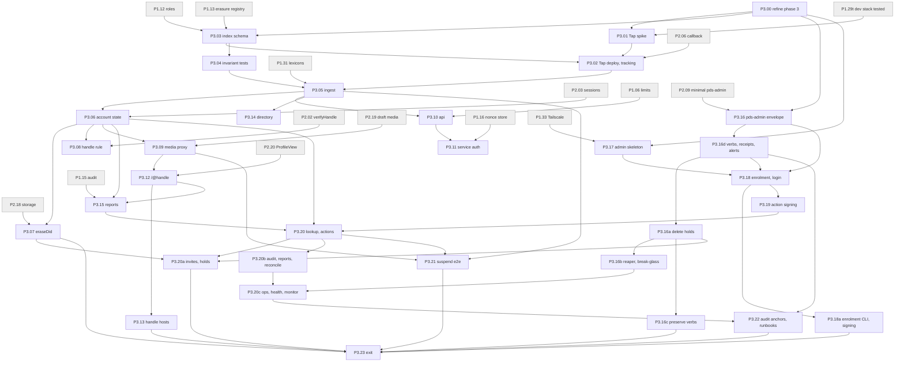
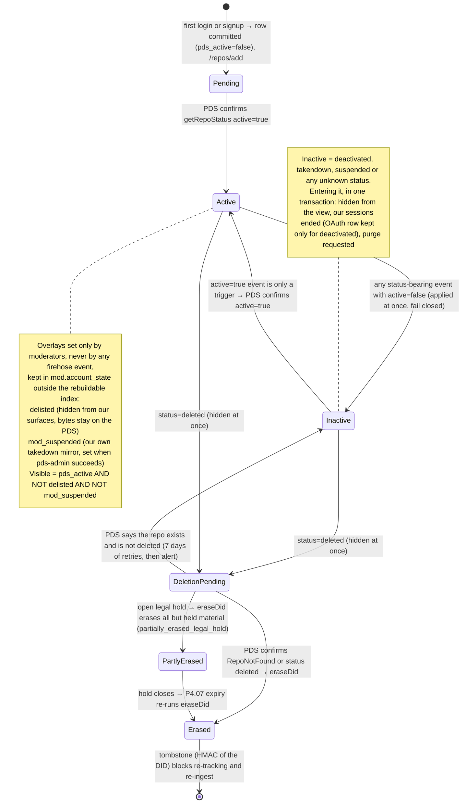
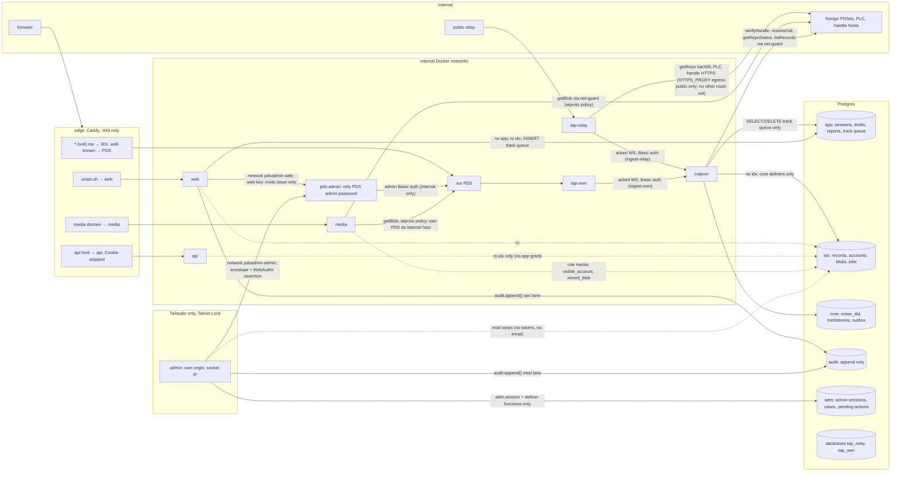

# Phase 3 — Indexer, public profile, directory, admin v1

Status: **round 2 draft** (both round 1 reviews applied; see "Round 2 changes" at the end of the Notes). Planning
only. Source of truth: `../unset-sh-rebuild-plan.md` and the admin panel design
(`../admin-panel/admin-panel-design.md`, cited "AD §n"). Where this file and the plan disagree, the plan wins; the
disagreements found are listed in "Notes for the editor" at the end.

**Phase goal.** Records published by any atproto account that has signed in to unset.sh are indexed through
Tap; the public `/@handle` page renders from that index with zero JavaScript and images only from the media
origin; moderators act on accounts from an internal console over Tailscale with a hardware key touch per PDS
action, verified by `pds-admin`.

**Exit criteria (plan §8 Phase 3, checked by P3.23):**
1. `/@handle` renders with zero bytes of JS, and every image on it comes from the media origin.
2. Handle↔DID for a hosted handle is confirmed by a resolver implementation we did not write (in Phase 3: an
   independent resolver inside the dev stack; the check from outside our network moves to P5.02a and the launch
   gate; provisional, question P3-A2).
3. A suspend stops the page, the bytes and the sessions.
4. An account deletion leaves no rows (the erasure coverage test passes against a populated database), and an
   erased DID is not re-indexed.
5. The appview invariants are ported as behaviour tests where they still apply (P3.04 lists the mapping for all
   166 prototype tests).
6. Admin runbooks 1–6 (plan) and 7–8 (anchor check, mail canary; added by review) have each been run once with a dated note.

**Depth of detail (README "Depth of detail", Alex 2026-10-03).** This phase is written in two depths:
- **Contract, kept in full:** data model and migrations (tables, columns, constraints, erasure policies), roles
  and grants, trust boundaries and networks, external contracts (Tap's wire and admin API, the PDS admin
  endpoints, the `pds-admin` envelope, roster and log formats, XRPC routes, service auth), legal and privacy flows
  (erasure, tombstones, reports, reveals, holds), stop points and the "done when" tests. Changing one of these
  while building is a principle 16 escalation: stop for human review.
- **Reviewed hypothesis:** algorithm sections marked `Algorithm (hypothesis)`. They were reviewed once and are the
  best current plan; P3.00 re-reads them against what Phases 0–2 actually built, and a builder may change them
  locally (fix locally, refactor on repetition) as long as the contracts and tests above still hold.

**Code shape (README "Readable, reusable code"; Alex's architecture principles 7, 11, 12, 17).**
- **One composition root per process.** Each entrypoint (`indexer`, `media`, `api`, `web`, `admin`, `pds-admin`)
  has one `main.ts` that builds its fixed dependencies (database pool, `net-guard`, clock, Tap channel, PDS
  client) and passes them as function parameters. No registry, container or plugin lookup: the set of
  dependencies is known and fixed. Round 1's "named query registry" and the generated `erase_did` are dropped
  for this reason (Round 2 changes R2-31, R2-32).
- **Decisions are pure functions, I/O is a thin shell**: for example `planEvent(accountRow, event) → Plan` and
  `applyPlan(tx, plan)`; `checkEnvelope(envelope, roster, revoked, state, now) → Check` and the server that loads
  files and calls the PDS.
- **Provider failures are isolated.** Each outside provider (Tap, the relay, a foreign PDS, our PDS, PLC, mail
  through `sendEmail`) sits behind one adapter, and each background loop (ingest, track, status confirmation,
  reconcile, handle check, purge, erasure outbox, receipts, monitor) runs on its own timer with its own error
  handling, so one provider being down degrades its own feature and is visible on the health board, but never
  stalls another loop or crashes the process.
- **Errors**: expected failures are typed results `{ok:false, error:<code>}` with codes from P1.03's catalog;
  "throws" in this file means a bug path only.
- **Shared blocks** (only the security mechanisms that must exist once, README rule 9): `canonicalize` and
  `loadRoster` (`shared/admin-envelope`, P3.16), `checkAttestation` (P3.18a), `mediaUrl` (P3.09),
  `profileHref` (P3.12; `canonicalActorPath` is its internal helper), `app.end_sessions_for_did` (P2.04; grants P3.06), `confirmRepoStatus` and `reconcile`
  (P3.06), `core.erase_did` (P3.07). Everything else stays local until it repeats.

**Reuse verdicts** in every step are **provisional — for reuse review** (README "Salvage rule"); prototype paths
are at commit `054ab0f`, `/home/claude/0x40`.

**Provisional defaults.** Seven questions for Alex (P3-A1–P3-A4 from the part 1 review, P3-B1–P3-B3 from part 2) are built
with the reviewers' recommended default and marked `provisional (P3-Ax/P3-Bx)` where they apply. The list is in the
Notes. If Alex chooses otherwise, the book is revised before the affected step is built.

**Steps added with a letter suffix:**
- **P3.00** refines this phase before anything else is built (README "Depth of detail").
- **P3.16 is split five ways** (each would otherwise be well over one PR): P3.16 the envelope pipeline (key
  model, roster, revoke file, assertion verifier, `jti`, log, migration from P2.09); **P3.16d** the verb table,
  limits, receipts, `alert.notify` and `digest.send`; P3.16a delete holds; P3.16b reaper and break-glass;
  **P3.16c** the preserve verbs that Phase 4 calls. Build order: P3.16 → P3.16d → P3.16a → P3.16b → P3.16c.
- **P3.18a** (the `verify-enrolment` CLI, `sign-roster.sh`, the roster runbook and the shared
  `checkAttestation`) splits from P3.18.
- **P3.20a, P3.20b, P3.20c** split the admin screens: P3.20 lookup and account actions; P3.20a invites, holds and
  owner switches; P3.20b audit viewer, reports and reconciliation; P3.20c the `ops` schema, health board and
  monitor.

## Interfaces assumed from earlier phases

These are the names this file builds on. P3.00 replaces each with what was actually merged.

| From | Assumed interface |
|---|---|
| P1.02 | `loadConfig(schema) → Config` (boot fails on a missing key; values never printed) |
| P1.03 | error catalog; `log.info/warn/error(event, fields)` with a field allowlist (no IP, no UA) |
| P1.04 | `createServer({routes, methods, contentTypes}) → Server` with `/health` |
| P1.05 | `clientIp(req) → string` (configured header); `socketIp(req) → string` (admin only) |
| P1.06 | `RateLimiter.consume(policy, {ip} \| {did}) → {ok:true} \| {ok:false, retryAfterS}` (an IP slot and a DID slot, one per P1.04 middleware; memory only); `bodyLimit(bytes)` |
| P1.07 | `csrfGate(req) → "allow" \| "deny"` applied to every non-GET |
| P1.08 | `cspFor(group) → string`; `securityHeaders(group)` |
| P1.10 | `serializeProps(obj) → string` |
| P1.11 | migration runner as `migrator`; `db.tx(role, fn)` |
| P1.12 | roles from `roles.json`: `web, api, indexer, media, review, review_egress, retention, auditor, backup, admin` and the others listed there (+ Tap's own database roles, P3.02); `infrastructure/postgres/grant-matrix.json` and its test; domain `types.did` |
| P1.13 | `erasure-registry.json` with strategies `delete_row \| set_null \| retain \| audit_redact \| retain_legal_hold` (`retain` needs `class` and `reason`) and the `pg_catalog` coverage test |
| P1.14 | `seal(plaintext, context) → string`; `unseal(sealed, context) → bytes`, with `context = sealContext(column, rowKey)` only and the value in a registered `types.sealed` column; P1.14a `sealTo("legal_hold", plaintext, context)` (encrypt only; used from Phase 4) |
| P1.15 | `appendAudit(tx, {action, outcome, actorDid?, actorKey?, target?, reason?, case?, jti?, requestId?, receipt?}) → {lane, seq}` (lane derived from the action; `outcome` ∈ `attempted \| succeeded \| failed \| denied \| unknown`); SQL definer `audit.append(p_action, p_outcome, …)`; `verifyChain(db, lane, "links" \| "full")`; P1.15a `audit.erase_subject`, `audit.seal_segment`, `audit.mark_anchored` |
| P1.16 | `issue`/`consume(db, purpose, token, …) → "ok" \| "invalid"`; `claim(db, purpose, {issuer, externalId}, expiresAt) → boolean` (true only on first use per issuer; durable) |
| P1.18 | `guardedRequest(policy, {url, method, headers?, body?, timeoutMs, maxBytes, accept?}) → {status, headers, body}` and `guardedFetch(policy, defaults)` (on `undici.request`); policies `fixed` and one `public` policy (`atproto`) whose internal-host exception is our own PDS (P1.18a); errors `NetGuardError.code` `egress.*`; P1.18b proxy mode and the `egress-public` proxy for Tap |
| P1.22 | locale and theme resolution; on public pages: theme by `prefers-color-scheme`, locale by `Accept-Language` with a URL override (plan §5.4 "Caching") |
| P1.28 | Caddy config with log filter; admin-auth XRPC denied |
| P1.29 | `compose.dev.yaml` with Postgres, dev PDS (`.0x40.space`), seeded accounts |
| P1.30 | deploy preflight (this phase adds checks) |
| P1.31 | `lexicons.validate(nsid, value) → ok \| ValidationError`; lexicon `key` types; NSID constants |
| P1.33 | Tailscale with Tailnet Lock; `admin` reachable on the host's tailnet address only |
| P2.01 | `resolveDid(did, {noCache?}) → {doc, pdsEndpoint, atprotoKey} \| null` through `net-guard` |
| P2.02 | `verifyHandle(did, {fresh?}) → {handle: string \| null, status: "verified" \| "invalid" \| "unresolved", expiresAt}` |
| P2.03 | session table `app.session`; `destroyAllForDid` (calls `app.end_sessions_for_did`, created by P2.04's migration) |
| P2.04 | sealed OAuth token store `app.oauth_session` |
| P2.06 | callback creates the session in one transaction (this phase adds one insert there, P3.02) |
| P2.09 | minimal `pds-admin` (`.mjs`, zero npm dependencies): `POST /v1/invite.issue {payload, kid, sig}`, keys in `/run/secrets/pds_admin_keys.json`, log line `{seq, ts, verb, kid, actorMac, targetMac, jti, outcome, codeMac?, prev, hash}`, `jti.log` lines `jti exp` |
| P2.18 | object-storage client (draft prefixes) |
| P2.19 | minimal `media` entrypoint serving signed draft URLs; `mediaSandboxHeaders()` |
| P2.20 | `ProfileView(props)`: pure, `escape`, markdown subset; links through P1.24's `safeHref` |

## Dependency diagram



## Overview diagrams

### An event from the relay to the index

Provisional (P3-A1): hosted DIDs are tracked by `tap-own`, which reads our PDS directly; every other DID by
`tap-relay`, which reads the public relay. Both deliver the same wire format to one indexer.

```mermaid
sequenceDiagram
  autonumber
  participant PDS as User's PDS
  participant R as Public relay (relay1.us-east)
  participant T as Tap (tap-relay, or tap-own for our PDS)
  participant I as indexer
  participant DB as Postgres (idx schema)
  Note over T: repo tracked earlier: idx.account row committed, then POST /repos/add (P3.02)
  PDS->>R: #commit, #identity, #account (foreign PDS)
  R->>T: subscribeRepos frame
  PDS->>T: subscribeRepos frame (tap-own: our PDS directly)
  T->>T: verify signature + MST; drop collections outside the filter
  T->>I: record event or identity event (status rides inside identity, live:false) over the acked WebSocket (Basic auth)
  I->>I: adapter → commit / identity / account parts (pure)
  I->>DB: BEGIN; tombstone + row check; watermark; validate; upsert with rev guard; enqueue account jobs; COMMIT
  alt committed, or definitively invalid (dropped)
    I->>T: ack {id}
  else per-event failure
    I->>I: retry in-process (100 ms, 500 ms, 2 s), socket stays open
    I--xT: still failing: no ack; Tap redelivers on its retry timer (≤ 2 × TAP_RETRY_TIMEOUT)
  else database unavailable
    I--xT: hold, never counted, never acked; alert
  else same frame failed 5 times (record events only)
    I->>DB: insert idx.dead_letter (must succeed, else no ack); alert
    I->>T: ack {id}
  end
  Note over I,PDS: Outside the transaction: status confirmation, deletion confirmation, reconcile and handle checks call the PDS through net-guard (P3.06, P3.08)
```

### Account state



### Trust boundaries



### A moderator action

```mermaid
sequenceDiagram
  autonumber
  actor M as Moderator (tailnet device + hardware key)
  participant B as Browser on admin.int.unset.sh
  participant A as admin
  participant DB as Postgres (adm, audit, idx)
  participant P as pds-admin
  participant S as our PDS
  participant O as Owners' inboxes
  M->>B: choose "Take down", reason code, case (target shown as handle + DID)
  B->>A: POST /actions/prepare (session, Origin, Sec-Fetch-Site same-origin)
  A->>A: role, reason, case, args schema; action {v, env, aud, pds_did, verb, target DID, args, reason_code, case_id, actor_did, jti(128 bit), iat, exp=iat+60}
  A->>DB: store pending action by jti (single use, bound to session)
  A-->>B: challenge = sha256(JCS(action)), allowCredentials = actor's keys
  B->>M: touch key + PIN
  M-->>B: assertion (authenticatorData, clientDataJSON, signature)
  B->>A: POST /actions/commit {jti, assertion}
  A->>DB: tx1: consume pending action + audit.append(mod, attempted); COMMIT
  alt tx1 failed
    A-->>B: 503, nothing sent
  end
  A->>P: envelope {action, assertion, kid, sig Ed25519}
  P->>P: key from signed roster; aud/env/pds_did/time; jti fsync (+ sign counter); roster, revoke file, role, args; WebAuthn §7.2 checks; limits
  P->>S: getAccountInfo(target) → hosted? (NotFound → 404 not_hosted, no write)
  P->>S: getSubjectStatus(actor) → active?
  P->>S: updateSubjectStatus(repoRef, takedown applied, ref "unset:<jti>")
  S-->>P: 200
  P->>P: append hash-linked log {intent, outcome, args}
  P-->>A: {ok, jti, seq, hash}
  P-)O: receipt via sendEmail (HTML-escaped): verb, target handle, actor label, seq
  A->>DB: tx2: mod.mark_suspended(did) + audit.append(mod, succeeded, seq)
  A-->>B: done, shows seq and hash
```

---

## Steps

### P3.00 — Refine Phase 3
Tags: [STOP]            Depends on: P2 exit (every Phase 0–2 step merged)            Plan: §8 Phase 3; README "Depth of detail"; architecture principles 13–16
Where: `breakdown/phase-3.md` (this file) through the book's review process; `docs/human/decisions/` for any boundary change
Size: no source; one revision of this file and one review round

Goal: before any other Phase 3 step starts, re-read this phase against what Phases 0–2 actually built, update
it, and have the update reviewed, so the hypothesis sections match the code they extend.

Inputs: the merged code of Phases 0–2; `02-shared-blocks.md` as built; this file; both round 1 reviews and this
round's answers; the plan and plan-issues at their current revision; the latest Tap release and `@atproto/pds`
pin.
Outputs:
  - A revision of this file in which:
    - the "Interfaces assumed" table names the real exported functions, files, roles and config keys;
    - every `Algorithm (hypothesis)` section is checked against the code it calls and updated;
    - every contract section (tables, grants, networks, envelope and roster formats, routes, tests) either still
      holds or carries a marked change;
    - the Tap facts in P3.01 are re-checked against the Tap commit chosen today.
  - A short list of **contract changes** (data model, grants, trust boundaries, external contracts, legal or
    privacy flows), each with the reason. This list goes to Alex.
  - Review reports from a logic reviewer and a reuse reviewer in `reviews/`.

Algorithm (contract: the order is fixed):
  1. Diff the assumed interfaces against the merged code; record each mismatch.
  2. For each step, re-read its contracts and hypothesis against the code it extends; update names and
     algorithms; keep every "done when" test unless it is impossible, and say why when one changes.
  3. Re-check the source-pinned facts (Tap behaviour table in P3.01, the PDS admin endpoint table in P3.16d)
     against today's pins; record differences.
  4. Re-check the provisional defaults (P3-A1–P3-A4, P3-B1–P3-B3) against Alex's answers if any have arrived; apply them.
  4a. Settle the step-book findings routed to this refine step (`reviews/step-book-findings-triage.md`): F-06 (a cap
      on each ingest lane with back pressure to Tap, a per-DID dead-letter re-drive, and how `account_job` and the
      P3.07 outbox claim work, e.g. `FOR UPDATE SKIP LOCKED`); F-14 (a Tap stream that goes silent without closing);
      F-15 (an index tying each `alert.send` class to a runbook entry, P3.20c and P3.22); F-27 (a per-route test that
      every `api` and `media` read answers the same for takendown, deactivated, delisted and suspended accounts);
      F-28 (responses built field by field from view types; upstream responses size-capped and validated); F-29
      (display names, captions and report text shown to moderators made safe against bidi and invisible characters);
      F-31 (one indexer instance at a time). Each goes into the step it belongs to, or onto the list for Alex.
  4b. Write the `Threats:` heading (README step template) for every `[SEC]` step whose algorithm this revision settles.
  5. Submit the revision for the two-reviewer process (README "How the review works").
  6. **Stop** until the review passes and Alex has seen the contract-change list. No other Phase 3 step starts
     before this.

Edge cases and failures:
  - A Phase 0–2 contract this phase depends on was built differently (for example P2.09's log format) → this
    phase adapts; it never edits a merged earlier step's contract without its own escalation.
  - The Tap commit changed a behaviour in the P3.01 table → the spike's expectations change before it runs.
  - A reviewer finds a contract change → it goes on the list for Alex; building does not start until he answers.

Done when (tests):
  - `p300-review-present`: a round report from each reviewer for the revision is in `reviews/`, with every
    finding answered.
  - `p300-contract-list-acknowledged`: Alex's acknowledgement of the contract-change list is recorded in the
    revision's PR.
  - `p300-interfaces-table-matches-code`: every name in the "Interfaces assumed" table exists in the merged code
    (a reviewer check, recorded in the report).

Reuse: none.
Feature ownership (decision 34, guideline §4; added 2026-10-04): the revision adds a "Feature ownership" table to this
  file: for each feature of the phase, its ownership path before any code (for example posting a video: `apps/web →
  interfaces/http → domains/content (+ domains/moderation) → infrastructure/pds, storage → PDS`), and it settles the
  `layout-map.md` open points this phase touches (all resolved 2026-10-04 05:10Z; P3.00 confirms the O-11 judgement calls). The step that lands a feature's first slice writes
  `docs/human/features/<feature>.md` (what it does, its ownership path, routes, tables, roles, the steps that built
  it). Done when (added): every feature of the phase has a row whose path uses only decision-34 folders, and
  `scripts/docs/docs.test.ts` finds `docs/human/features/<feature>.md` for every feature whose first slice has merged.
Not in this step: building anything; editing other phases (gaps go to the editor and `plan-issues.md`).
Diagram: none.

### P3.01 — Tap spike
Tags: [SPIKE]            Depends on: P3.00, P1.29t            Plan: §3 (Tap row), §5.2 "Indexer and Tap trust rules", §8 Phase 5 egress, §10 risks, §11 Q13
Where: `deployment/tap/` (build recipe only), `spikes/tap/` (throwaway harness, deleted after the ADR), `docs/human/decisions/00xx-ingest-via-tap.md`
Size: ~250 lines of throwaway harness, ~0 kept source; the ADR ~2 pages

Goal: confirm, against the pinned Tap build, the behaviour its source already shows, measure what the source
cannot (volume, latency, loss under crashes), and record the answers in an ADR that later steps build on.

Inputs: P1.29 dev compose; the indigo repository at a commit chosen today (`cmd/tap`); `@atproto/tap` (exact
pin); one throwaway account on a federating PDS that is not ours [ALEX hand-off for the account only].
Outputs:
  - `docs/human/decisions/00xx-ingest-via-tap.md` with the fields under "ADR content".
  - `deployment/tap/Dockerfile` + build arguments pinned to the indigo commit (kept; P3.02 uses it).
  - A decision: outcome A, B, C or D (below).

**What the source already answers** (round 1 review, indigo `b2619d8`, `ref/indigo/cmd/tap/`; the spike
**confirms** these, it does not rediscover them; P3.00 re-checks them against the commit chosen):

| Fact | Source | Consequence in this book |
|---|---|---|
| Redelivery happens only on the `TAP_RETRY_TIMEOUT` timer (worst case ≈ 2 × timeout); a disconnect does not trigger it. The README's "default 10s" contradicts `main.go` (60 s). | `main.go:161-165`, `outbox.go:176-201`, `README.md:94,186` | P3.02 sets `TAP_RETRY_TIMEOUT=30s`; P3.05 retries in-process and keeps the socket open |
| Live events are per-DID barriers; historical (`live:false`) events for one DID may be in flight concurrently. | `outbox.go:13-28,286-303` | status events can arrive out of order (P3.06 fail-closed rule) |
| There is no `account` event type. `#account` becomes `type:"identity"` with `is_active` and `status`; `throttled` and `desynchronized` are dropped; `deleted` also deletes Tap's repo row; a handle change re-emits Tap's *stored* status; identity events are `live:false`. | `types.go:52-72`, `firehose.go:294-357`, `repo_manager.go:67-86`, `event_manager.go:296-312` | the adapter splits every identity event (P3.05); reactivation is confirmed at the PDS (P3.06) |
| Backfill events are `live:false` and carry the snapshot commit `rev`; a resync starts with an identity event. | `resyncer.go:150,238,301-309` | equal-rev rule (P3.05); reconcile trigger (P3.06) |
| No resync endpoint (routes: add, remove, info, stats); the only re-backfill is remove + add, and a re-add resets Tap's stored status to `active`. | `server.go:55-65,150-158`, `models.go` Repo | `resync-all` = remove + add (P3.02), safe only with P3.06's confirmation rule |
| Resync emits create/update only for changed CIDs; **no deletes and no markers**. | `resyncer.go:241-325` | delete-only `reconcile(did)` (P3.06) |
| Tap keeps `(did, collection, rkey, cid)` and buffered bodies until acked; `remove` does not purge the outbox. | `models/models.go`, `db_helpers.go`, `README.md:59` | tombstone check on every ingest branch (P3.05, P3.07) |
| Basic auth wraps **every** route, including `/channel` and `/health`; `/repos/add` is idempotent and does no DID validation. | `server.go:49-53,142-166` | channel and healthcheck send credentials (P3.02, P3.05) |
| Repo fetches use `ssrf.PublicOnlyTransport()`; the identity directory's transport is **unverified**. | `resyncer.go:203-213` | firewall stays mandatory (P3.02) |
| Collection filters are a comma-separated env list; a trailing `*` is a prefix wildcard; **an empty list matches every collection**. | `main.go:146-150`, `util.go:37-53` | boot refuses an empty filter (P3.02) |
| Event ids restart from 1 when Tap restarts with an empty outbox. | `event_manager.go:20,153,224` | attempts keyed by frame hash (P3.05) |

The vault rule "`wantedCollections` takes repeated params" is a **Jetstream v1** rule; Tap's env list is
comma-separated. The ADR states both facts so nobody "fixes" one into the other.

Algorithm (contract: what is measured and the pass rules; the harness itself is a hypothesis):
  1. Pin the latest indigo commit touching `cmd/tap`; build twice in a clean container; record SHA and image
     index digest (non-reproducible is recorded, not a failure).
  2. Re-read the cited lines at the new commit; mark each table row "confirmed" or "changed (file:line)".
  3. Setup S1 (public relay, `tap-relay` shape) and S2 (dev PDS as the relay, `tap-own` shape), each with its own
     database, admin password and `TAP_RETRY_TIMEOUT=30s`.
  4. A ~150-line harness on `@atproto/tap` appends every event to a file and acks after `fsync`; flags withhold
     acks, crash after N events, or sleep before acking.
  5. Run the measurements; write the ADR; choose the outcome; if not A or B, **stop** for book revision.

| # | Measurement | Pass |
|---|---|---|
| M1 | S1 inbound volume over ≥24 h, peak 1-min rate | ≤350 GB/day; over → outcome B |
| M2 | S1 Tap CPU and RAM over 24 h | mean ≤1 core, RSS ≤1 GiB; over → outcome B |
| M3 | S2: 1,000 writes, harness crashes 20 times | every write delivered at least once |
| M4 | withheld ack | redelivered within 2 × `TAP_RETRY_TIMEOUT` + 5 s, and a disconnect loses nothing |
| M5 | S2: 500 sequential edits to one record, 10 runs | final state equals last write 10/10 |
| M6 | S2: deactivate, reactivate, takedown, reinstate, delete | identity events with the shapes in the table above |
| M7 | S2: handle change | identity event re-emits the stored status (table row 3) |
| M8 | S1: `/repos/add` a foreign account with ≥1,000 records | completes; events `live:false` with the snapshot `rev` |
| M12 | `/channel`, `/health`, `/repos/add` without or with a wrong password | 401 each |
| M13 | latency, S1 50 writes / S2 200 writes | p95 ≤10 s (S1), ≤2 s (S2) |
| M14 | stop Tap 10 min during writes | resumes from its relay cursor, no loss |
| M15 | identity directory transport (PLC, DNS, well-known) | record whether it refuses private addresses (informational; the firewall applies anyway) |
| M16 | `@atproto/tap` message types vs the pinned wire | match, or list differences |
| M17 | S1 behind `egress-public` with no other route out: do the relay WebSocket and every repo and identity fetch go through `HTTPS_PROXY` | all through the proxy; otherwise **stop** for book revision (P3.02's egress design depends on it; editor pass) |
| M18 | S2 delete while Tap is stopped, then restart | records whether the delete is replayed from the relay cursor (it should be: only resync loses deletes) |

Outcomes and what changes:

| Outcome | Condition | Later steps that change |
|---|---|---|
| A | M3–M8, M12, M13, M14, M16, M18 pass and the source table is confirmed | none; build as written |
| B | A, but M1 or M2 over budget | none in Phase 3; numbers go to P5.01, P5.11 and Alex |
| C | M3, M5, M14 or M18 fails, or dynamic mode does not work on the relay | **fallback to `@atproto/sync`**: no Tap; the indexer subscribes to `subscribeRepos` with the `Firehose` class, filters locally, backfills with `getRepo` through `net-guard` (~300 lines, plan §5.2); P3.03 adds `idx.relay_cursor`; the cursor advances only after the event commits (`appview/src/ingest.ts:227-232`); P3.07 has no Tap purge; P1.12 drops the `tap` roles |
| D | Tap fine, M16 mismatch | P3.05 writes its own ~150-line acked-channel client against the documented wire format |

ADR content: context (plan §5.2, Q13, Tap beta); versions; env names (passwords redacted); the source table
with confirmed/changed; M1–M18 raw numbers and pass/fail; one redacted sample of each event shape; the decision
and changed steps; revisit triggers (Tap leaves beta, volume +50 %, Sync 1.1 strict mode on the relay, any loss
in production).

Edge cases and failures:
  - The relay is unreachable from the spike host → run S1 elsewhere; if nowhere, record and **stop** (Alex).
  - The commit fails to build → previous commit touching `cmd/tap`; record both.
  - Spike data contains other people's records → the harness writes only tracked DIDs; the spike databases are
    dropped at the end and the ADR records the time; only test accounts are ever added.

Done when (tests):
  - `adr-present`: every ADR field filled, outcome set, every source-table row marked.
  - `tap-dockerfile-pinned`: a 40-character commit SHA; CI builds it.
  - `spike-data-dropped`: ADR records the drop time; no `spikes/tap/*.jsonl` committed (path check + gitleaks).
  - A book revision for outcome C or D is merged before P3.02 starts.

Reuse:
  - Tap (`indigo/cmd/tap`) → USE, provisional — for reuse review: named by the plan; beta; pin by commit.
  - `@atproto/tap` → USE, provisional: version matched in M16.
  - `@atproto/sync` → USE as fallback (outcome C), provisional.
  - Prototype `appview/src/consumer.ts:33-80` (reconnect on close or error, jittered backoff) → LESSON, provisional.
Not in this step: the production Tap services (P3.02); the indexer (P3.05); hosting size (P5.01).
Diagram: none (the relay→Tap→indexer sequence above is what the spike confirms).

### P3.03 — Index schema
Tags: [SEC]            Depends on: P3.00, P1.12, P1.13            Plan: §5.2 "Database", §2 rule 11, §5.8 labels
Where: `infrastructure/postgres/migrations/NNNN_idx_schema.sql`, `infrastructure/postgres/grant-matrix.json`, `erasure-registry.json`
Size: ~220 lines SQL, ~150 test lines

Goal: create the `idx` schema with promoted columns, a per-repo watermark and per-row `rev`, the account job
queue, and the grants and erasure entries, so the P1.12 and P1.13 tests cover it from the first migration.

Inputs: P1.11 runner; P1.12 roles, grant matrix and `types.did`; P1.13 erasure registry.

Outputs (contract; every timestamp `timestamptz`; every DID column `types.did`; `rev` columns `COLLATE "C"`):
  - `idx.account(did PK, handle text NULL, handle_status text NOT NULL DEFAULT 'unresolved' CHECK in
    ('verified','invalid','unresolved'), handle_checked_at NULL, pds_endpoint text NULL, pds_active bool NOT NULL
    DEFAULT false, pds_status text NULL, moderation_version bigint NOT NULL DEFAULT 0, last_rev text NULL,
    track_requested_at NULL, tracked_at
    NULL, tap_instance text NULL CHECK in ('relay','own'), backfilled_at NULL, updated_at NOT NULL)`.
    `pds_active` defaults to **false**: an account is visible only after its PDS confirms it (P3.06).
    Partial unique index on `lower(handle)` where `handle_status = 'verified'`; index on `lower(handle)
    text_pattern_ops` for prefix search (P3.14).
  - `mod.account_state(did types.did PK, delisted bool NOT NULL DEFAULT false, mod_suspended bool NOT NULL DEFAULT
    false, updated_at timestamptz NOT NULL)` in schema `mod`, created here (P3.06 adds the schema's functions and
    views). **Moderator decisions live outside the rebuildable index** (findings F-01): `idx` is derived data, so the
    table has no foreign key to `idx.account`; truncating or rebuilding `idx`, or deleting and re-creating one
    account row, never clears a delist or a suspension, and a decision made before the DID is indexed needs no stub
    row. Written only by P3.06's `mod.*` definers; no role holds a table grant on it.
  - View `idx.visible_account AS SELECT … FROM idx.account a LEFT JOIN mod.account_state m USING (did) WHERE
    a.pds_active AND NOT coalesce(m.delisted, false) AND NOT coalesce(m.mod_suspended, false)` (the one visibility
    definition; owned by `migrator`, so its readers need no grant on `mod.account_state`).
  - `idx.account_job(did → account ON DELETE CASCADE, kind text CHECK in ('confirm_status','confirm_deletion',
    'reconcile','handle_check'), due_at NOT NULL, attempts int NOT NULL DEFAULT 0, first_queued_at NOT NULL,
    PRIMARY KEY (did, kind))`; index `(kind, due_at)`. One queue for the per-account network work that must
    happen outside the ingest transaction (P3.06, P3.08).
  - `idx.profile(did PK → account CASCADE, uri, cid, rev NOT NULL, record jsonb, display_name text NULL, discoverable bool
    NOT NULL, avatar_cid NULL, banner_cid NULL, indexed_at)`; indexes `lower(display_name) text_pattern_ops`,
    `(indexed_at DESC, did DESC) WHERE discoverable`.
  - `idx.section(uri PK, did → account CASCADE, rkey, cid, rev NOT NULL, record jsonb, position int, indexed_at)`; index `(did, position)`.
  - `idx.post(uri PK, did → account CASCADE, collection, rkey, cid, rev NOT NULL, record jsonb, created_at, reply_root_uri
    NULL, reply_parent_uri NULL, indexed_at)`; indexes `(did, created_at DESC, uri DESC)`, `(reply_root_uri)`.
    Empty until P4.02 adds post collections (the Phase 3 routes are built over a test fixture collection).
  - `idx.record_blob(uri, cid, did → account CASCADE, mime text, size int, PRIMARY KEY (uri, cid))`; index `(did, cid)`.
  - `idx.label(src text, uri text, cid NULL, val, neg bool, cts, exp NULL, PRIMARY KEY (src, uri, val))` (filled by P4.23).
  - `idx.dead_letter(id bigserial PK, kind CHECK in ('event','track','untrack'), did types.did NULL, collection
    NULL, rkey NULL, frame_sha256 bytea NULL, reason_code NOT NULL, attempts int, first_seen, last_seen)`.
  - `idx.purge_request(did PK → account CASCADE, requested_at)`.
  - `idx.ingest_stat(name PK, value bigint, updated_at)` (counters; no DIDs).
  - **Not created here:** `idx.like` (no like collection in Phase 3; P4.19 creates it with its subject rule).
  - Every `rev` that an upsert or delete guard compares is `NOT NULL` (findings F-03): against a NULL `rev`,
    `excluded.rev >= t.rev` is never true and the row would be frozen for good. `idx.account.last_rev` is the one
    nullable `rev` (no commit seen yet), and P3.05 states its NULL case. Later record tables (P4.02, P4.19) follow
    the same rule.
  - Grants (explicit list):

    | Object | `indexer` | `web` | `api` | `media` | `admin` |
    |---|---|---|---|---|---|
    | `mod.account_state` | — | — | — | — | — (written only through P3.06's definers; read through the two views) |
    | `idx.account`, `profile`, `section`, `post`, `record_blob`, `label` | S I U D | S | S | — | — |
    | `idx.visible_account` | S | S | S | S | S |
    | `idx.record_blob` | (above) | (above) | (above) | S | — |
    | `idx.account_job`, `purge_request`, `ingest_stat` | S I U D | — | — | — | — |
    | `idx.dead_letter` | S I | — | — | — | — (counts via view `idx.dead_letter_counts`, S to `admin`) |
    | view `mod.account_view` (P3.06: state columns, verified handle, `handle_checked_at`; no record bodies) | — | — | — | — | S |

    `media` is a new login role (plan issue P4): SELECT on `idx.visible_account` and `idx.record_blob` only.
    **Column lists (column-list ruling, plan §5.2 at `9c54e52`; 02-shared-blocks §11):** every table above with a
    registry row (`idx.account`, `profile`, `section`, `post`, `record_blob`, `label`, `account_job`,
    `purge_request`, `dead_letter`, `mod.account_state`, each with a DID column) is granted by column list: `S`, `I`
    and `U` name the columns each role needs (P3.00 writes the lists from the code beside it), `D` is the one
    table-level privilege (`rowPrivileges`), and no entry is `wholeTable`. `idx.ingest_stat` (no DID column) may be
    `wholeTable`. Views are granted whole (a view is not a registry table; its column list is its definition).
  - Erasure registry: every `did` column `delete_row` (children cascade from `idx.account`); `idx.post.reply_root_uri`
    and `reply_parent_uri` `set_null` when they name the erased DID (other people's replies stay); `idx.label.uri`
    rows naming the DID or its AT-URIs `delete_row`. AT-URI columns are not `types.did` columns, so P1.13's test
    does not see them: `erase_did` lists them by hand and the P3.07 coverage test seeds them (Notes: P1.13 strategy
    names). `mod.account_state.did` → `delete_row` (no cascade reaches it; an erased DID is tombstoned by P3.07, which
    blocks re-tracking, and the decision itself stays in the audit `mod` lane).
  - Indexes on text prefixes use `text_pattern_ops` (or `COLLATE "C"`), and prefix queries write `ESCAPE '\'`.

Algorithm (hypothesis): one migration creates schema `mod` (owned by `migrator`; `idx` itself is P1.12's), the tables,
indexes and view, and their grants. It issues **no** `ALTER DEFAULT PRIVILEGES` statement (that would be trusted base,
SE-6). P1.12 sets no table defaults (column-list ruling), so a new `idx` table starts with no grants; the migration
GRANTs on its own new tables, by column list on registry tables, until each matches the table above exactly. Every such statement is on an
object this PR creates, so it rides with this step. `grant-matrix.json` and `erasure-registry.json` change in
the same PR. Each later step writes its SQL as plain parameterised functions next to the code that uses it (no
central query registry).

Edge cases and failures:
  - A table added later without grants → the grant-matrix test fails until the matrix is updated (deliberate).
  - A DID column without a registry row → P1.13 test fails.
  - Two DIDs claim one handle → the partial unique index rejects the second `verified` row; P3.08 resolves it.
  - `idx` truncated and rebuilt, or one `idx.account` row deleted and re-created → `mod.account_state` is untouched; a
    delisted or suspended account stays out of `idx.visible_account` (fail closed).
  - TIDs compared as text → `COLLATE "C"` keeps ordering bytewise.

Done when (tests):
  - `idx-migration-applies-and-rolls-forward` on an empty database and on a copy with Phase 2 data.
  - `grant-matrix-idx`; `api` has no grant on `app.*`; `media` has exactly two grants.
  - `did-registry-idx`: P1.13 passes; removing one registry row fails it.
  - `rev-collation-bytewise` over 1,000 random TIDs.
  - `new-account-row-starts-hidden`: a fresh row is not in `idx.visible_account`.
  - `idx-rebuild-preserves-decisions`: DID A delisted, DID B suspended (through P3.06's definers once they land; as
    `migrator` until then); `TRUNCATE idx.account CASCADE`; both rows re-created with `pds_active = true` → neither is
    in `idx.visible_account`.
  - `rev-guard-columns-not-null`: `pg_catalog` shows `attnotnull` for `rev` on `idx.profile`, `section` and `post`;
    `idx.account.last_rev` is the only nullable `rev` column in `idx`.
  - `queries-bounded`: the integration suites run with a statement-capturing spy; every distinct statement
    against `idx` is then run under `EXPLAIN (FORMAT JSON)` on a seeded database (10k accounts, 100k records)
    and must show a `Limit` node or an index/PK lookup, with no `Seq Scan` on `idx.profile`, `section`, `post`,
    `record_blob`. This replaces round 1's registry-based check without a registry.

Reuse:
  - Prototype `appview/src/db.ts:252-270` (schema) → LESSON, provisional: SQLite with `json_extract` filtering and a `time_us` version; here promoted columns and `rev`.
  - Prototype `appview/src/db.ts:344` (`setHiddenBy0x40` as an upsert) → LESSON: superseded by "rows only from P3.02" (P3.06).
Not in this step: ingest (P3.05); moderation functions (P3.06); `eraseDid` and tombstones (P3.07).
Diagram: none.

### P3.02 — Tap deployment and repo tracking
Tags: [SEC]            Depends on: P3.01, P3.03, P2.06            Plan: §5.2 "Indexer and Tap trust rules", §2 rule 1, §8 Phase 5 "per-container egress networks", §10
Where: `deployment/tap/`, `deployment/firewall/`, `deployment/compose.dev.yaml` (Tap services), `interfaces/indexer/track.ts`, migration `NNNN_track_queue.sql`, one line in P2.06's callback
Size: ~180 source lines, ~250 test lines

Goal: run Tap from the pinned build with filters, credentials and egress limits, and add a repo to the right Tap
when its owner first logs in or signs up, without giving `web` any Tap credential and without ever re-tracking an
erased DID.

Inputs: the P3.01 ADR (outcome A, B or D), its Dockerfile and env names; P3.03 `idx.account` and
`core.is_erased`; P1.12 roles; P2.06 callback; P2.01 `resolveDid`.

Outputs (contract):
  - **Two Tap services** (provisional P3-A1), same image by digest, each `read_only: true`, non-root, `cap_drop:
    [ALL]`, no published ports, its own database and admin password:
    - `tap-relay`: `TAP_RELAY_URL=https://relay1.us-east.bsky.network`; network `ingest-relay` (shared only with
      `indexer`) and `tap-egress`; tracks every DID whose PDS is not ours.
    - `tap-own`: `TAP_RELAY_URL` = our PDS's internal URL; network `ingest-own` (shared only with `indexer`) and
      the PDS's internal network plus PLC egress only; tracks DIDs hosted on our PDS. In the dev stack this is the
      dev PDS (the dev PDS never sets `PDS_CRAWLERS`).
  - Tap env (each instance; P1.02 validates; all required): `TAP_RELAY_URL`, `TAP_COLLECTION_FILTERS`,
    `TAP_DATABASE_URL` (databases `tap_relay` / `tap_own`, roles `tap_relay` / `tap_own`), `TAP_ADMIN_PASSWORD`
    (secret file), `TAP_RETRY_TIMEOUT=30s`. `indexer`: `TAP_RELAY_URL_INTERNAL`, `TAP_OWN_URL_INTERNAL`, both
    passwords (secret files), `PDS_PUBLIC_URL`.
  - `INGEST_COLLECTIONS` (constant in `interfaces/indexer`): Phase 3 = `sh.unset.profile`, `sh.unset.section`.
    `app.bsky.feed.like` is **not** in Phase 3 (plan §5.8 names `sh.unset.like` for likes on our content; P4.01
    decides, plan issue P5). Compose's `TAP_COLLECTION_FILTERS` is generated from the constant, and a test
    compares them. Boot refuses an empty filter (Tap would deliver every collection).
  - Table `app.track_request(did types.did PRIMARY KEY, requested_at timestamptz NOT NULL)`: `web` INSERT only;
    `indexer` SELECT and DELETE only. Erasure registry: `delete_row`.
  - `idx.account` gains (P3.03 defines it): `track_requested_at`, `tracked_at`, `tap_instance text NULL CHECK in
    ('relay','own')`.
  - `interfaces/indexer/track.ts`: `runTrackLoop(signal)`; `untrack(did) → Result`; `resyncAll() → {count}`
    (operator command `indexer resync-all`).
  - P2.06 change: in the session-creating transaction, `INSERT INTO app.track_request(did, requested_at)
    VALUES ($1, now()) ON CONFLICT DO NOTHING`.
  - Egress (plan line 635, "Tap and the indexer get general HTTPS egress through `net-guard` with private ranges
    blocked"; editor pass, phase-1 notes): the indexer's calls go through `net-guard` (`guardedRequest`, `atproto`
    policy). Tap is a Go binary that cannot link `net-guard`, so it gets `HTTPS_PROXY=http://egress-public:<port>`
    (P1.18b's proxy, whose deny list is generated from the same address table) and sits on `tap-egress`, an
    internal network whose only other member is `egress-public`: Tap has no route out except the proxy, which
    resolves and vets every target. `tap-own` reaches PLC the same way. Second layers stay: `DOCKER-USER` drops RFC
    1918, 100.64.0.0/10, 169.254.0.0/16, 127.0.0.0/8, ::1, fc00::/7, fe80::/10 and the internal Docker subnets
    (`deployment/firewall/`), and Tap's own `ssrf.PublicOnlyTransport` covers repo fetches. P3.01 M17 must pass.

Algorithm (hypothesis):
  1. Build: CI builds the Dockerfile at the ADR's commit and signs it (P1.27); compose pins the digest.
  2. Track loop (`indexer`, every 2 s or on `LISTEN app_track_request`), 100 DIDs per batch:
     a. Drop DIDs for which `core.is_erased(did)` is true (delete the queue row; count `track_erased_skip`).
     b. Upsert `idx.account(did, track_requested_at = now())` (insert with defaults: `pds_active = false`; never
        touch state columns) and enqueue `account_job(did, 'confirm_status')`; **commit** (F5: the row exists
        before Tap can deliver anything).
     c. Route each DID: `resolveDid(did)` (net-guard); `pdsEndpoint` origin = `PDS_PUBLIC_URL` origin → `own`, else
        `relay`; unresolvable → keep the queue row, retry next run (cap 24 h, then dead-letter `kind='track'`).
     d. POST `<instance>/repos/add {"dids": [...]}` with Basic auth, 10 s timeout.
     e. 2xx → set `tracked_at`, `tap_instance` and delete the queue rows in one transaction. 401 → keep rows,
        alert (misconfiguration). Other 4xx → dead-letter, alert. Timeout or 5xx → keep rows, back off 2 s
        doubling to 60 s.
  3. Instance change (a DID moved between our PDS and another, seen by P3.08's re-check): `untrack` on the old
     instance, `/repos/add` on the new, enqueue `reconcile` (P3.06).
  4. `resyncAll()`: for each tracked DID, 100 at a time: `/repos/remove` then `/repos/add` on its instance (the
     only re-backfill Tap offers), then enqueue `reconcile`. Safe only because a re-add's "active" status is a
     trigger, not a fact (P3.06).
  5. `untrack(did)`: POST `/repos/remove` on the DID's instance; 2xx → `tracked_at = null`; error → 3 retries
     1/5/25 s, then dead-letter `kind='untrack'`, alert.
  6. One-time backfill at the Phase 3 deploy: the migration inserts every DID from `app.session` and
     `app.oauth_session` into `app.track_request`.

Edge cases and failures:
  - `web` compromised → it can only insert DIDs into the queue; bounded by the per-DID login rate limit (P1.06);
    queue depth is on the health board.
  - Tap down → queue grows; nothing lost; the other Tap instance is unaffected.
  - An erased DID logs in again → step 2a skips it; only an owner action re-allows tracking (P3.07).
  - Events delivered before `/repos/add` returns → the row already exists (step 2b), so they apply.
  - Missing password or empty filter → `indexer` and Tap refuse to boot.

Done when (tests):
  - `track-callback-enqueues`: a P2.06 callback test → one `app.track_request` row in the same transaction; a
    failed callback leaves none.
  - `backfill-before-track-commit-not-lost`: the stub Tap emits events before returning 200 → every one applied.
  - `track-loop-adds-and-clears`; `track-loop-holds-on-5xx`; `track-loop-holds-on-timeout`;
    `track-loop-401-alerts-keeps`; `track-loop-4xx-dead-letters`.
  - `hosted-did-routed-to-own-tap`; `foreign-did-routed-to-relay-tap`.
  - `erased-did-not-retracked-on-login`.
  - `tap-filters-equal-handled-set`; `empty-filter-refused`.
  - `grant-web-insert-only-track`: `web` INSERT only; `indexer` SELECT+DELETE only; `web` cannot SELECT.
  - `compose-tap-isolated`: no `ports`; `tap-relay` on `ingest-relay` and `tap-egress` only; `tap-own` on
    `ingest-own` and the PDS network only; `web`, `api`, `media`, `admin` on neither ingest network.
  - `firewall-tap-egress-private-dropped`: static check of every range; an integration probe from a sidecar with
    `network_mode: service:tap-relay` (the Tap image has no `curl`) expects timeouts to `10.0.0.1`,
    `100.100.100.100` and a public address reached directly, and a successful public request through
    `egress-public`; a request through the proxy to a private address is refused.
  - `tap-healthcheck-authenticated`: the compose healthcheck sends Basic auth (or there is none and the indexer's
    lag check stands in).
  - `untrack-retries-then-dead-letters`.

Reuse:
  - Prototype `deploy/relay`, `deploy/jetstream`, `reaper/reap.mjs:79-98` → REJECT, provisional: the machinery Tap replaces.
  - Prototype `deploy/compose.yaml:485` repeated-`wantedCollections` comment → LESSON: filter syntax is verified per tool, never assumed.
Not in this step: event handling (P3.05); erasure's call to `untrack` (P3.07); production egress and the forward proxy (P5.02).
Diagram: see "Trust boundaries".

### P3.04 — Ingest invariants as tests first
Tags: none            Depends on: P3.03            Plan: §2 rule 11, §8 Phase 3 "Port the appview tests"
Where: `tests/integration/indexer/invariants/*.test.ts`, `tests/integration/indexer/fixtures/`, `tests/integration/indexer/invariants.pending.json`
Size: ~0 source lines (typed stubs), ~800 test lines

Goal: write the indexer's behaviour as failing tests before the code, porting the prototype's appview tests
that still apply and adding the ones the plan's defects and the round 1 review call for.

Inputs: P3.03 schema; prototype tests (read-only) under `appview/test/`.
Outputs (contract: the internal event and outcome shapes):
  - `InternalEvent = {kind:"commit", did, rev, live: bool, ops:[{action:"create"|"update"|"delete", collection,
    rkey, cid|null, record|null}]} | {kind:"identity", did, handleHint: string|null} | {kind:"account", did,
    active: bool, status: string|null}`.
  - `Outcome = {ok:true, result: "applied" | "dropped:invalid" | "dropped:stale" | "dropped:unhandled" |
    "dropped:inactive" | "dropped:erased"} | {ok:false, error: "event_failed" | "db_unavailable"}`.
  - Typed stub `handleEvent(tx, evt) → Outcome` and event builders.
  - `invariants.pending.json`: the list of test ids expected to fail until P3.05/P3.06/P3.07/P3.08 land. A CI
    guard requires every listed test to fail and every unlisted one to pass; each implementing PR removes its
    ids. (Replaces round 1's untestable "red CI allowed on this PR only".)

Algorithm (hypothesis): port, retarget, defer, invert or drop each prototype test per the table; add the new
tests; register every file with the "discovered equals executed" guard (P0.04).

Mapping (prototype → new). Counts at `054ab0f`: ingest 33, db 25, verify-commit 18, xrpc 24, media 7, verify 7,
consumer 7, reapply-delists 10, views 12, backfill 6, identity 6, moderation-route 11 = **166**. Verdicts for the
last six are provisional; the builder confirms them test by test.

| Prototype (`appview/test/…`) | Count | Verdict |
|---|---|---|
| `ingest.test.ts` profile/section/post create, delete (21–35, 111–121) | 5 | port `commit-create-indexes-{profile,section}`, `commit-delete-removes`; post variants deferred to P4.02 |
| `ingest.test.ts:43,63` follow create/delete, stale delete vs replayed create | 2 | port as `stale-delete-cannot-remove-newer-create` on `idx.section` (follows are P4.18) |
| `ingest.test.ts:88` Bluesky like indexed | 1 | **invert and defer** to P4.19 (`like-on-foreign-subject-dropped`); no like collection in Phase 3 |
| `ingest.test.ts:128,175,185,196` identity resolve, no NULL clobber | 4 | port `identity-schedules-handle-check`, `identity-unresolved-keeps-cached-pds-endpoint` (P3.08) |
| `ingest.test.ts:205,221` identity never reactivates a suspended account | 2 | port `identity-handle-part-never-changes-state`; `new-account-row-starts-active` is **inverted** to `new-account-row-starts-hidden` (fail closed) |
| `ingest.test.ts:134` account deleted erases | 1 | port to P3.06/P3.07 as `confirmed-deletion-erases` |
| `ingest.test.ts:241-295` hosted-handle registration and takeover | 5 | port to P3.08 (`hosted-handle-*`) |
| `ingest.test.ts:306-424` commit-verify drop/hold/retry | 11 | retarget: Tap verifies; keep 3 (397, 411, 424) as `definitive-invalid-acked-and-dropped`, `event-failure-not-acked`, `event-failure-recovers-on-redelivery`; drop 8 (no `getRecord` proof path, no kill switch) |
| `ingest.test.ts:234,440` cursor persists / throw holds cursor | 2 | retarget to acks: `ack-only-after-commit`, `throw-holds-ack` |
| `db.test.ts` monotonic upserts (48, 56, 217, 228) | 4 | port `older-rev-never-overwrites-{profile,section}`, `equal-rev-backfill-applies`; the like variant deferred to P4.19 |
| `db.test.ts` CRUD, registry, cursor (7, 15, 24, 203, 210, 236–252) | 8 | port profile and section CRUD; post CRUD to P4.02; registry four (203, 236, 245, 252) to P3.08; cursor drop (Tap holds it) |
| `db.test.ts:75,123` timeline, post social by CID | 2 | defer to P4.19–P4.21 with the fix: counts by URI, not CID |
| `db.test.ts:260-301` directory gates, keyset, search | 5 | port to P3.14 |
| `db.test.ts:312-355` delist ordering | 6 | port to P3.06: `delist-of-tracked-account-sticks`, `no-event-clears-delist`, `undelist-idempotent`, `delist-untracked-did-sticks` (moderator path only; no stub row since findings F-01) |
| `verify-commit.test.ts` | 18 | drop under outcome A (Tap verifies; the ADR cites it); under outcome C retarget 6 to `@atproto/sync` |
| `verify.test.ts` handle display truth table | 7 | port to P3.08 |
| `xrpc.test.ts` | 24 | port 14 to P3.10/P3.11; drop 10 (bearer tokens replaced by service auth; `getProfiles`, `listProfiles` dropped) |
| `media-proxy.test.ts` | 7 | port all 7 to P3.09, plus the "referenced only" test |
| `consumer.test.ts` | 7 | retarget to P3.05's channel: reconnect, backoff, attempt reset on delivery; drop the cursor-file cases |
| `reapply-delists.test.ts` | 10 | drop the two-store reapply mechanics (one database now); keep the persistence behaviour as P3.06's delist tests |
| `views.test.ts` | 12 | port the state cases (not found, private, unavailable, published) to P3.10 and P3.12; drop renderer-specific markup cases |
| `backfill.test.ts` | 6 | drop (Tap backfills); keep "equal-rev backfill applies" via `equal-rev-backfill-applies` |
| `identity.test.ts` | 6 | port to P3.08 (re-resolution, unresolved keeps stored, bidirectional) |
| `moderation-route.test.ts` | 11 | drop (moderation moved out of `web`); the access rules are covered by P3.17's manifest-generated matrix |

Added (new invariants):
  - `repo-watermark-drops-older-rev`; `replayed-create-after-delete-not-resurrected`.
  - `inactive-account-commit-dropped` (watermark still advances).
  - `validation-uses-lexicon` (the same validator object as `web`).
  - `profile-non-self-rkey-dropped`; `record-type-must-equal-collection` (F13).
  - `unhandled-collection-acked`; `event-for-unknown-did-dropped-not-inserted` (F6).
  - `identity-event-handle-is-hint-only`; `identity-event-commits-without-network` (F10).
  - `reordered-status-events-fail-closed`; `readd-default-active-does-not-reveal`;
    `reactivation-requires-pds-confirmation` (F1).
  - `relay-deleted-without-pds-confirmation-hides-not-erases`; `deleted-under-hold-erases-all-but-held` (F7, F8; editor pass).
  - `erased-did-not-resurrected-by-identity`; `erased-did-not-resurrected-by-buffered-commit` (F6).
  - `status-event-never-dead-lettered`; `db-down-10min-no-loss`; `dead-letter-insert-failure-no-ack` (F4).
  - `resync-unchanged-record-survives` (regression against round 1's step 9).

Edge cases and failures: a prototype test whose behaviour contradicts the plan or a review finding is inverted,
never ported as is, and the table says so.

Done when (tests):
  - Every file exists, is discovered and executed; `invariants.pending.json` lists exactly the failing ids.
  - `invariant-mapping-complete`: `fixtures/mapping.json` marks all 166 prototype tests with a verdict.

Reuse:
  - Prototype `appview/test/{ingest,db,verify,media-proxy,xrpc,identity,views}.test.ts` → SALVAGE as behaviour specs only, provisional: assertions kept, harness rewritten for Vitest and Postgres.
  - Prototype `verify-commit.test.ts` and its CAR fixture → LESSON under outcome A; SALVAGE (fixture only) under C.
Not in this step: any implementation.
Diagram: none.

### P3.05 — Ingest
Tags: [SEC]            Depends on: P3.04, P3.02, P1.31            Plan: §5.2 "Ingest does four things", §2 rules 8, 11
Where: `interfaces/indexer/{main,channel,adapter,ingest,lanes}.ts`
Size: ~380 source lines, tests from P3.04 plus ~200

Goal: consume both Taps' acked channels and apply each event to `idx` in one short transaction with no network
I/O: check the tombstone and the account row, validate against the lexicon, upsert with the `rev` guard, promote
filter columns, and queue whatever needs the network.

Inputs: P3.02 (Taps, `INGEST_COLLECTIONS`); P3.03; P3.04; P1.31 validators and lexicon key types.
Outputs (contract):
  - `channel.ts`: `connect(url, {user:"admin", password}, onEvent) → Channel` with `ack(id)`, auto-reconnect
    (Basic auth on `/channel`, M12).
  - `adapter.ts`: `toInternal(tapEvent) → InternalEvent[]` (pure). A record event → one `commit`. **Every**
    identity event → an `identity` part (`handleHint`) **and** an `account` part (`active = is_active`, `status`).
  - `ingest.ts`: `handleEvent(tx, evt) → Outcome`, split as `planEvent(accountRow, evt) → Plan` (pure) and
    `applyPlan(tx, plan)`.
  - `lanes.ts`: events hashed by DID to one of `INDEXER_LANES` (8) lanes; each lane serial.
  - Error classes (contract, F4):
    - `db_unavailable`: connection refused, pool timeout, SQLSTATE `57P01`, `08*` → never counted, hold without
      ack, alert at 5 min.
    - `event_failed`: a throw from validation or view code, `57014` on this event, a constraint bug → counted.
  - Config: `INDEXER_LANES` (8), `INDEXER_MAX_ATTEMPTS` (5), `OUR_POST_COLLECTIONS` (empty in Phase 3).

Algorithm (hypothesis; the error classes, the ack rules and the "no network in the transaction" rule are contract):
  1. Parse the frame (cap 1 MiB); malformed → log `tap_frame_malformed`, ack if it has an id.
  2. `key = sha256(frame)` (ids restart, so attempts are keyed by content).
  3. `evts = toInternal(e)`; dispatch to the DID's lane.
  4. In the lane, one transaction as `indexer`, `statement_timeout` well under `TAP_RETRY_TIMEOUT ÷ 2`:
     - every kind: `core.is_erased(did)` → `dropped:erased`, ack. `acct = SELECT … FOR UPDATE`; absent →
       `dropped:unhandled`, ack (ingest **never inserts** `idx.account`; only P3.02 does).
     - `commit`:
       a. `acct.last_rev IS NOT NULL AND evt.rev < acct.last_rev` → `dropped:stale`. A NULL `last_rev` means no
          commit seen yet: the event applies (stated, not left to NULL logic; findings F-03).
       b. `NOT acct.pds_active` → advance `last_rev`; `dropped:inactive` (sync spec: ignore commits for inactive
          accounts; P3.06's reconcile recovers any delete missed meanwhile).
       c. For each op whose collection is in `INGEST_COLLECTIONS ∪ OUR_POST_COLLECTIONS`:
          - delete → `DELETE … WHERE uri=$1 AND rev <= $2` and its `record_blob` rows.
          - create/update → `record.$type` equals the collection, the rkey matches the lexicon `key` type
            (`literal:self` for the profile), `lexicons.validate` passes → else skip op, count `ingest_invalid`.
            Promote columns; upsert `… WHERE excluded.rev >= <table>.rev`; replace the URI's `record_blob` rows
            with the blob refs found in the record.
       d. `last_rev = GREATEST(last_rev, evt.rev)`. If `evt.live` and `backfilled_at IS NULL` → set it. If
          `NOT evt.live` and `backfilled_at IS NOT NULL` → a resync happened: enqueue `reconcile`.
     - `identity` part: enqueue `handle_check` (due now). Nothing else: no network, no handle written.
     - `account` part: P3.06 `applyAccountState(tx, did, active, status)` (in-transaction part only).
  5. Commit → ack → forget `key`. A definitive drop also commits and acks.
  6. `event_failed` → roll back; retry in-process 100 ms, 500 ms, 2 s with the socket open; still failing →
     no ack (Tap's timer redelivers); `attempts[key] += 1`. At `INDEXER_MAX_ATTEMPTS`:
     - record events → insert `idx.dead_letter` in a fresh transaction; ack only if that insert committed; alert.
     - identity events (they carry status) → **never** dead-lettered: hold, alert at 5 minutes.
  7. `db_unavailable` → roll back, no ack, not counted; pause the lane 1 s doubling to 30 s; alert at 5 minutes.
  8. Every 30 s report `tap_lag_seconds` per instance and counters to `ops` (P3.20c); no per-DID values.

Edge cases and failures:
  - Backfill events share one rev → `>=` on rows and strict `<` on the watermark let all apply. Do not "fix" this from
    the prototype vault note `atproto-sync-and-firehose`: its "drop a commit whose `rev` ≤ the last seen" rule is for
    the live `subscribeRepos` stream, not for Tap backfill (findings F-05).
  - Status events reordered by Tap → handled by P3.06's rule (inactive applies at once; active only after the PDS confirms).
  - `throttled`/`desynchronized` never arrive (Tap drops them, F20); the unknown-status branch is reachable in unit
    tests only. The P3-A1 lag alert is the only detection of a throttled hosted account.
  - A validator bug throws → `event_failed` 5 times, then dead-lettered with an alert; never silently dropped.
  - Tap closes the socket → reconnect with jitter; nothing is lost (redelivery by timer).

Done when (tests):
  - Every P3.04 test assigned to P3.05 passes and leaves `invariants.pending.json`.
  - `ack-after-commit-only`; `dead-letter-after-max-attempts`; `dead-letter-insert-failure-no-ack`.
  - `db-down-10min-no-loss`: Postgres stopped 10 minutes under load → after restart every event applied, none dead-lettered.
  - `status-event-never-dead-lettered`.
  - `transient-failure-does-not-stall-other-dids`: one DID's event fails; 100 events for other DIDs apply within 2 s.
  - `lanes-serialise-per-did`; `blob-refs-recorded-and-replaced`; `promoted-columns-match-record` (property test).
  - `channel-sends-basic-auth`.
  - `null-watermark-first-commit-applies`: an account row with `last_rev` NULL receives a commit → applied, `last_rev`
    set; `equal-rev-backfill-applies` still passes.
  - `identity-event-commits-without-network`: a network spy records zero calls during the transaction.
  - `no-did-in-logs` (log spy over 1,000 events).
  - Integration `tap-to-index-dev`: publish a profile through P2.23 → row within 5 s; unpublish → gone.

Reuse:
  - Prototype `appview/src/ingest.ts:77-233` → LESSON, provisional: branch structure (validate → upsert; identity without clobbering; hold on unexpected throw, lines 221-226) kept; per-commit `getRecord` proof and `time_us` versioning dropped.
  - Prototype `appview/src/consumer.ts:33-80` → LESSON: reconnect on close or error, reset attempts on a delivered message.
  - `@atproto/tap` → USE (outcome A/B), provisional; own client under outcome D.
Not in this step: account state (P3.06); handle rules (P3.08); likes (P4.19); labels (P4.23).
Diagram: see "An event from the relay to the index".

### P3.06g — Grants for the account-state machine (split from P3.06, SE-6)
Tags: [SEC]            Depends on: P3.03, P2.04            Plan: §5.2 roles; §9 trusted base (rule SE-6, as ruled 2026-10-04; plan `f9b48f8`)
Where: one migration `NNNN_account_state_grants.sql` (grant statements only), `grant-matrix.json` rows,
  `tests/integration/postgres/grants.test.ts` (matrix rows)
Size: ~15 lines SQL, ~20 test lines

Why a separate step (letter suffix): both grants are on objects that already exist, which is trusted base; P0.09c fails
a PR that mixes them with P3.06's code. The definers P3.06 creates, and their grants, ride with P3.06.
Goal: the roles P3.06 runs as can reach the existing objects it needs, and nothing more.
Inputs: `app.end_sessions_for_did` (created by P2.04's migration, EXECUTE to `web` since Phase 2); schema `mod` (P3.03).
Outputs: `GRANT EXECUTE ON FUNCTION app.end_sessions_for_did(types.did, text) TO indexer, admin`; `GRANT USAGE ON
  SCHEMA mod TO admin`; the matching matrix rows. Nothing else.
Algorithm: the two statements, in one migration with only `trusted` statements (P0.09c).
Edge cases and failures: the function signature differs from P2.04's → the migration fails; fix the signature here,
  never with a broader grant.
Threats: the `indexer` and `admin` roles.
  - E A wider grant than P3.06 needs → the grant-matrix test fails on any extra privilege (`matrix_matches`, P1.12).
Done when (tests): P1.12's `matrix_matches` with the new rows; as `indexer`, `SELECT app.end_sessions_for_did(…)` runs;
  as `api`, it fails `42501`.
Reuse: none. Not in this step: the `mod.*` definers and `mod.account_view` (P3.06, with their grants). Diagram: none.

### P3.06 — Account-state machine
Tags: [SEC]            Depends on: P3.06g, P3.05, P2.03            Plan: §2 rule 7, §5.2 "`#account active=false`" (restated, plan issue P3), AD §3.1, §6.6
Where: migration `NNNN_account_state.sql` (definer functions, `mod` schema), `interfaces/indexer/{account-state,account-jobs,reconcile}.ts`
Size: ~260 source lines (SQL + TS), ~350 test lines

Goal: make every change of an account's PDS status, and our own delist and suspend flags, hide or show its
records and blobs and end our sessions in the same transaction, applying anything that hides at once and
anything that reveals only after the account's own PDS confirms it.

Inputs: P3.05 dispatch; P3.03 tables and job queue; P2.03 sessions; P2.04 token store; P1.18 `net-guard`;
P3.07 `erase_did` (the deletion branch is wired when P3.07 lands; until then its
tests are in `invariants.pending.json`).

Outputs (contract):
  - **Rule (restating plan §5.2 for the book, plan issue P3):** status changes only from status-bearing events;
    a change to inactive applies at once; a change to active, or `deleted`, is only a trigger, confirmed against
    the account's PDS. Identity events never change state through their handle part.
  - Definer `app.end_sessions_for_did(did types.did, why text) RETURNS int` (owned by `migrator`, `SECURITY
    DEFINER`, `SET search_path = pg_catalog, app`), **created by P2.04's migration** (editor pass, phase-2 editor):
    deletes `app.session` rows for the DID; deletes the `app.oauth_session` row **unless** `why = 'deactivated'`
    (allow-list, F17); `why` CHECKed against the closed enum {`deactivated`, `takendown`, `suspended`, `deleted`,
    `unknown`, `mod_suspended`, `mod_end_sessions`, `user_signout_all`, `underage`, `auth_dead`}. `web` already has
    EXECUTE from Phase 2 (P2.03's `destroyAllForDid` calls it; no duplicated SQL); P3.06g (a grant on an existing
    function, SE-6) grants
    EXECUTE to `indexer` and `admin`.
  - Schema `mod` (P3.03 created it with its one table, `mod.account_state`; this step adds functions and views),
    USAGE to `admin` (granted by P3.06g: `mod` already exists). Definers (EXECUTE to `admin` only; each takes
    `actor_did`, `reason_code`, `case_id`, `jti NULL`, checks `session_user = 'admin'`, the closed reason list
    (AD §7.4) and a non-null case, and calls `audit.append('mod', …)` inside): `mod.set_delisted(did, on)`,
    `mod.mark_suspended(did)`, `mod.clear_suspended(did)`. Each upserts `mod.account_state`, so a delist before the
    DID is indexed sticks with no `idx.account` row (findings F-01); P3.02 is the only path that creates `idx.account`
    rows.
  - View `mod.account_view` (state columns from `idx.account` and `mod.account_state`, verified handle,
    `handle_checked_at`, `pds_endpoint`; no record bodies; a DID with a decision but no index row still shows).
  - `applyAccountState(tx, did, active, status) → "changed" | "unchanged" | "trigger_queued"` (in-transaction
    part).
  - Shared blocks (outside any transaction, through `net-guard`'s `atproto` policy, where our own PDS is the
    internal-host exception, P1.18a):
    - `confirmRepoStatus(did) → {active:true} | {active:false, status} | {notFound:true} | {unavailable:true}`
      via `com.atproto.sync.getRepoStatus` on the DID's `pds_endpoint`.
    - `reconcile(did) → {deleted: n} | {skipped: reason}`: delete-only (F2).
  - Job workers (each its own loop, failures isolated; batch 20, every 10 s): `confirm_status`,
    `confirm_deletion`, `reconcile`. Backoff on `unavailable`: 1, 5, 25 min, then hourly.
  - `onVisibilityLost(did)`: inserts `idx.purge_request(did)` (P3.09's `purge({did})`; the worker in `indexer` consumes it).

Algorithm (contract: which transitions apply at once and which need confirmation):
  `applyAccountState(tx, did, active, status)` (row locked by P3.05):
  1. `status = 'deleted'` → hide: `pds_active = false`, `pds_status = 'deleted'`, version + 1,
     `end_sessions_for_did(did,'deleted')`, `onVisibilityLost`; enqueue `confirm_deletion`; return. Never erases
     in the ingest transaction (F7).
  2. `active = false` → `pds_active = false`, `pds_status = coalesce(status,'unknown')`, version + 1;
     `end_sessions_for_did(did, <status if in the enum, else 'unknown'>)`; `onVisibilityLost` if it was visible.
  3. `active = true` and the row is already `pds_active` → "unchanged".
  4. `active = true` and the row is inactive → change nothing; enqueue `confirm_status`; "trigger_queued" (F1).

  `confirm_status` job:
  1. `r = confirmRepoStatus(did)`.
  2. `{active:true}` → short transaction: lock the row; if still inactive and `pds_status ≠ 'deleted'` →
     `pds_active = true`, `pds_status = NULL`, version + 1; enqueue `reconcile` (deletes may have been missed while
     inactive).
  3. `{active:false, status}` → apply as `applyAccountState` step 2 (idempotent); done.
  4. `{notFound}` → treat as a deletion trigger: enqueue `confirm_deletion`.
  5. `{unavailable}` → stays inactive; backoff.

  `confirm_deletion` job:
  1. `r = confirmRepoStatus(did)`.
  2. `{notFound}` or `{active:false, status:"deleted"}`:
     - `core.erase_did(did, 'account_deleted')`. Under an open legal hold it erases everything except the held
       material and returns `partially_erased_legal_hold` (P3.07's single rule); the account stays hidden and
       P4.07's hold expiry finishes the erasure. A hold never blocks, defers or loops the deletion (editor pass;
       phase-5 F10). `core.erase_did` failing (for example the hold check erroring) → retry with the backoff below.
  3. Any other answer (the repo exists and is not deleted) → clear the `deleted` status to the answer's status;
     stays hidden unless step `confirm_status` later confirms active; alert `deletion_not_confirmed`.
  4. `{unavailable}` → retry with backoff for 7 days, then alert and stop retrying; **never erase on an error**.

  `reconcile(did)` job (F2):
  1. `head = getRepoStatus(did)` (its `rev`); not active → skip.
  2. For each collection in `INGEST_COLLECTIONS ∪ OUR_POST_COLLECTIONS`: `com.atproto.repo.listRecords` on the
     DID's PDS through `net-guard`, paginated, caps profile 1, sections 50, posts 10,000; any error or cap hit →
     skip the whole run, delete nothing.
  3. Delete our rows for that DID whose URI is absent from the listing **and** whose `rev <= head.rev` (a record
     created after the listing has a newer rev and survives). Never insert from this source.
  4. Triggers: a resync seen by P3.05; a confirmed reactivation; P3.02's instance change; a weekly bounded sweep of
     1/7 of tracked DIDs.

  Moderator functions (one statement each from `admin`, in the caller's transaction). Each writes
  `mod.account_state` (upsert by DID); "version + 1" bumps `idx.account.moderation_version` when that row exists (the
  ETag and P3.08's write guard read it), and `onVisibilityLost` runs only when it exists (nothing is indexed otherwise):
  1. `mod.set_delisted(did, on, …)`: upsert `delisted`, version + 1; `on` → `onVisibilityLost`; audit.
  2. `mod.mark_suspended(did, …)`: `mod_suspended = true`, version + 1; `end_sessions_for_did(did,'mod_suspended')`;
     `onVisibilityLost`; audit. Called only after `pds-admin` returned `ok`.
  3. `mod.clear_suspended(did, …)`: `mod_suspended = false`, version + 1; audit. Only after reinstate `ok`.

Edge cases and failures:
  - `takendown` (id 2) applied, then a stale `active=true` (id 1) redelivered → only a trigger; the PDS says
    taken down; the account stays hidden.
  - `untrack` + re-add (or `resync-all`) makes Tap emit `is_active:true` → only a trigger; confirmed or not at the PDS.
  - `active=true` while `mod_suspended` or `delisted` → `pds_active` may become true; still invisible until a
    moderator clears the overlay.
  - Session deletion fails (lock timeout) → the whole transaction rolls back, the event is not acked; state and
    sessions never diverge.
  - An account on our PDS taken down by us → our PDS emits `#account takendown`; `tap-own` delivers it; it hides at
    once (already hidden by `mod_suspended`).
  - Unknown inactive status (unit-level only, F20) → stored, treated as inactive, OAuth row deleted.

Threats: account status events from the network and our own moderation decisions.
  - S A stale or replayed `active=true` reveals a taken-down account → events are only triggers; the PDS is asked
    (`reordered-status-events-fail-closed`, `readd-default-active-does-not-reveal`).
  - E Reactivation or an index rebuild clears a moderation decision → decisions live in `mod.account_state`
    (`reactivate-does-not-clear-mod-suspended`, `reactivate-does-not-clear-delist`,
    `decision-survives-account-row-recreate`).
  - E Sessions outlive a takedown → hidden and sessions ended in one transaction
    (`inactive-hides-and-ends-sessions-atomically`, `session-delete-failure-rolls-back-state`).
  - T A PDS error read as deletion → only a confirmed deletion erases (`confirmed-deletion-erases`,
    `deletion-pds-error-never-erases`).
  - R A moderation change without a record → admin-only functions with reason, case and audit in the same transaction
    (`mod-functions-admin-only`, `mod-function-requires-reason-and-case`, `mod-function-writes-audit-in-txn`).

Done when (tests):
  - P3.04's assigned tests pass: `reordered-status-events-fail-closed`, `readd-default-active-does-not-reveal`,
    `reactivation-requires-pds-confirmation`, `relay-deleted-without-pds-confirmation-hides-not-erases`,
    `deleted-under-hold-erases-all-but-held`, the delist tests, `new-account-row-starts-hidden`.
  - `inactive-hides-and-ends-sessions-atomically`: visible account, 2 sessions, profile → `active=false
    status=takendown` → not visible, sessions 0, OAuth 0, one `purge_request`.
  - `deactivated-keeps-oauth-row`; `unknown-why-deletes-oauth`; `end-sessions-why-enum-checked`.
  - `session-delete-failure-rolls-back-state`.
  - `confirmed-deletion-erases`; `deletion-pds-error-never-erases` (7 days of stubbed errors → alert, rows remain).
  - `reconcile-removes-missed-delete`; `reconcile-keeps-unchanged`; `reconcile-keeps-newer-than-listing`;
    `reconcile-pds-error-deletes-nothing`.
  - `reactivate-does-not-clear-mod-suspended`; `reactivate-does-not-clear-delist`.
  - `decision-survives-account-row-recreate`: delist; delete the `idx.account` row as `migrator` (an operator
    repairing the index); P3.02's track loop re-creates it on the next login and the PDS confirms active → still not
    visible; `undelist` → visible.
  - `mod-functions-admin-only`; `mod-function-requires-reason-and-case`; `mod-function-writes-audit-in-txn`.
  - `job-worker-failure-isolated`: the `reconcile` worker's PDS calls all time out → `confirm_status` jobs for other DIDs still complete.

Reuse:
  - Prototype `appview/src/db.ts:286` (`upsertIdentity` leaving state alone), `:308` (`setAccountState`), `:344` (`setHiddenBy0x40`) → LESSON, provisional: the comments are the specification; rewritten with definers and PDS confirmation.
  - Prototype `app/src/actions/moderation.ts` → LESSON: superseded by AD §7.2's order of operations.
Not in this step: the PDS-side takedown (P3.16d); erasure itself (P3.07); admin UI (P3.20); CDN purge (P5).
Diagram: see "Account state".

### P3.07g — Grant for `eraseDid` on the audit lane (split from P3.07, SE-6)
Tags: [SEC]            Depends on: P3.06g, P1.15a            Plan: §5.2 roles; §9 trusted base (rule SE-6, as ruled 2026-10-04; plan `f9b48f8`); AD §8 "Erasure"
Where: one migration (grant statement only), `grant-matrix.json` row, matrix test row
Size: ~5 lines SQL, ~10 test lines

Why a separate step (letter suffix): `audit.erase_subject` exists since P1.15a, so granting on it is trusted base.
Goal: `core.erase_did` (owned by `migrator`) can redact the audit `sec` lane, and no other role can call it.
Inputs: `audit.erase_subject` (P1.15a, owned by `audit_owner`).
Outputs: `GRANT EXECUTE ON FUNCTION audit.erase_subject(types.did) TO migrator` (run under `SET ROLE audit_owner`, which
  `migrator` holds, P1.12); the matrix row. Nothing to `indexer` or `admin`.
Algorithm: the one statement.
Edge cases and failures: none beyond the matrix test.
Threats: the audit lane.
  - E `indexer` or `admin` calling the redaction directly → no grant to them (`matrix_matches`; P3.07's
    `erase-subject-only-through-definer`, if the refine step names it).
Done when (tests): `matrix_matches` with the row; as `indexer`, `SELECT audit.erase_subject(…)` fails `42501`.
Reuse: none. Not in this step: `core.erase_did` and its grants (P3.07k). Diagram: none.

### P3.07k — `eraseDid` SQL and its storage and untrack hooks (split from P3.07, SE-6)
Tags: [SEC]            Depends on: P3.07g, P3.06, P1.13, P1.15a, P2.18            Plan: as P3.07; §9 trusted base (`eraseDid`; rule SE-6, plan `6275827` and `badf15a`)
Where: migration `NNNN_erase_did_functions.sql` (the functions only: `core.erase_did`, `core.erase_outbox_list`,
  `core.erase_outbox_mark`, `core.erase_hook_mark`, `core.erase_report`, `core.is_erased`, `core.allow_retrack`,
  `mod.erase_foreign_did`, the `core.is_held` placeholder, and their EXECUTE grants), `interfaces/http/jobs/erase-storage.ts`,
  `interfaces/indexer/erase-untrack.ts`, their unit tests
Size: hypothesis, P3.00 sets it (~170 source lines, ~150 test lines)

Why a separate step (letter suffix): `eraseDid` is trusted base (SE-6). Its functions are on the CODEOWNERS `# trusted
functions:` line, so P0.09c counts their migration as trusted base (rule 3f), and the two hook files are whole-path
trusted base; the tables and registry rows are feature work and follow in P3.07.
Goal: the erasure function family and its two worker hooks exist, reviewed alone, before the tables they write.
Inputs: as P3.07.
Outputs: the functions and hooks exactly as P3.07's Outputs specify them, written in PL/pgSQL, whose table references
  are resolved at first call, so they can be created before P3.07's tables (`core.erased_did`, `core.erase_pending_hold`,
  `core.erase_outbox`); nothing calls them until P3.07 lands.
Algorithm (hypothesis): as P3.07's.
Edge cases and failures: a call before P3.07 → the missing-table error is raised and nothing is erased (fail closed).
Threats: as P3.07.
Done when (tests): the hooks' unit tests against a fake outbox port; P0.09c classifies the migration as trusted base;
  the integration tests that run `core.erase_did` stay in P3.07, where its tables exist.
Reuse: as P3.07. Not in this step: the tables, registry rows and integration tests (P3.07). Diagram: none.

### P3.07 — `eraseDid`
Tags: [SEC]            Depends on: P3.07k, P3.07g, P3.06, P1.13, P1.15a, P2.18            Plan: §6 "`eraseDid(did)`", §5.2 roles, AD §8 "Erasure", §6.6; plan issue P6; the single erasure rule (owner P4.07; phase-5 F10)
Where: migration `NNNN_erase_did.sql` (the tables `core.erased_did`, `core.erase_pending_hold`, `core.erase_outbox` and
  their grants), `erasure-registry.json` (new rows for the columns it creates), the integration tests. The functions and
  the two hook files below are **P3.07k** (trusted base, SE-6); this text stays their specification.
Size: ~230 source lines (SQL + workers), ~360 test lines

Goal: one `SECURITY DEFINER` function that removes or anonymises every row naming a DID, following the erasure
registry, **except material under an open legal hold**, leaves an HMAC tombstone so the DID is never re-indexed from
buffered events or a re-login, and hands object-storage deletes, the untrack and later per-module erasures (chat,
P6.04a) to workers that hold those credentials outside the process that parses firehose data.

Inputs: P1.13 registry (strategies `delete_row`, `set_null`, `retain`, `audit_redact`, `retain_legal_hold`); P1.15a
`audit.erase_subject`; P3.03/P3.06 tables; Phase 2 app tables; P2.18 storage client; P2.04 token store; P3.02 `untrack`.

Outputs (contract):
  - **The single erasure rule** (owner P4.07; the same rule in P5.04, P5.08b and P5.09): `eraseDid` erases every row
    and object for the DID **except** rows and objects under an open legal hold, reports
    `partially_erased_legal_hold` when it kept anything, and finishes the rest when the hold closes. It never
    refuses, raises or defers the whole erasure because of a hold (GDPR Art. 17(3)(e) keeps only what the legal claim
    needs), so a foreign PDS's `#account deleted` never loops or is dropped.
  - `core.erase_did(did types.did, why text) RETURNS jsonb` (owned by `migrator`, `SECURITY DEFINER`,
    `SET search_path = pg_catalog`): **hand-written**, one statement per registry row, children before parents;
    returns `{outcome: "erased" | "partially_erased_legal_hold", counts: {table: rows}, kept_held: {table: rows}}`.
    EXECUTE to `indexer` only. Round 1 generated it from the registry; plain SQL is easier to read and review, and
    the coverage test below catches a forgotten column just as well. `why` ∈ {`account_deleted`,
    `moderator_foreign`, `user_request`, `legal_hold_closed`}; the migration adds these to P1.15's closed reason list.
  - **Held rows:** for a registry row with strategy `retain_legal_hold`, its hand-written statement deletes only rows
    where `core.is_held(subject_kind, subject_ref)` is false for the row's subject (for example
    `('video', video_upload.id)`, or `legal_hold`'s own `subject_kind, subject_ref`); the rest are counted in
    `kept_held`. **`core.is_held` is the one hold predicate** (lead decision 2026-10-03; P4.07, P5.04 and P5.09 call
    the same SQL function; there is no TypeScript twin). This step declares it in two forms, both definer
    with `search_path` pinned and returning `boolean`: `core.is_held(did text)` (the DID has an open hold) and
    `core.is_held(subject_kind text, subject_ref text)` (that subject has an open hold). In Phase 3 both return false
    (no held table exists yet); P4.07 writes the body and registers its own tables (`legal_hold`, `legal_hold_transmission`, the
    matched upload row and its case) as `retain_legal_hold`. An error inside `core.is_held` aborts the whole call:
    nothing is deleted and the caller retries (the hold state is never guessed).
  - `mod.erase_foreign_did(did, case_id, jti, actor_did, reason_code)` (definer, EXECUTE to `admin` only): refuses
    unless a completed `adm.db_hold` exists for the DID (P3.20a) **and** `idx.account.pds_endpoint` is not our PDS;
    then calls `core.erase_did(did, 'moderator_foreign')`. `admin` never gets EXECUTE on `core.erase_did`. The
    migration adds `admin` to the writers of the `account.erased` audit action (it runs under `admin`'s session).
  - `audit.erase_subject` (P1.15a, strategy `audit_redact`): EXECUTE granted by P3.07g (an existing function, SE-6) to `migrator`, the owner of
    `core.erase_did`, so it runs only inside the definer; neither `indexer` nor `admin` can call it directly.
  - Tombstone (P3-A3, settled by Alex 2026-10-03 16:14Z: keep only a keyed HMAC of the DID, never the DID; RoPA line
    and lawyer-hour line; plan issue P6):
    - `core.erased_did(did_hmac bytea PK, erased_at, why, outcome)`; `did_hmac = HMAC-SHA256(k, did)`; no plain DID
      kept.
    - `k` lives in `core.tombstone_key` (one row, written by the `migrate` service from a secret file, readable
      only by `migrator`-owned definers). A backup holds both key and hashes, so a backup reader can test whether
      a known DID was erased; recorded in the RoPA line.
    - `core.is_erased(did) RETURNS bool` (definer; EXECUTE to `indexer`, `web`).
    - `core.allow_retrack(did, actor_did, case_id, jti)` (definer; EXECUTE to `admin`; owner role checked by the
      caller's signed action, P3.20a) deletes the tombstone row.
  - Remainder under a hold: `core.erase_pending_hold(did types.did PK, created_at)`, written when the outcome is
    partial and deleted when a later run erases everything. When P4.07's hold-expiry job closes a hold, it calls
    `core.erase_did(did, 'legal_hold_closed')` for that DID, which erases what was kept.
  - Outbox `core.erase_outbox(did PK, why, created_at, storage_done_at NULL, untracked_at NULL, hooks jsonb NOT NULL
    DEFAULT '{}')` with definers `core.erase_outbox_list(part)`, `core.erase_outbox_mark(did, part)` (`part` ∈
    `storage`, `untrack`; EXECUTE to `web` for `storage`, `indexer` for `untrack`) and `core.erase_hook_mark(did, hook,
    status)` (`status` ∈ `pending`, `done`; EXECUTE to `web`). The row is
    deleted when both parts are set and every hook is `done`. Two workers, each holding only its own credential:
    `web`'s job runner deletes `drafts/<did>/` and `media/<did>/` (object-storage credentials, which `indexer` never
    holds), skipping every object under a subject prefix whose subject is held (`drafts/<did>/v/<uploadId>/` while
    `core.is_held('video', uploadId)` is true; a matched upload's drafts stay
    until P4.07's `preserve_copy` verifies its copy; `legal-hold/*` is never under a DID prefix); the `indexer`
    calls `untrack(did)` (Tap credentials, which `web` never holds).
  - **Erase hooks (phase-6 note 5):** `web`'s composition root passes a fixed list `eraseHooks: {name, erase(did) →
    "done" | "pending"}[]` to the storage worker (principle 7: no registry, no `registerEraseHook`). Phase 3 passes
    an empty list; P6.04a adds `chat`. After the storage part, the worker calls each hook and records its status with
    `core.erase_hook_mark`; a hook that finishes later (chat's job) marks itself `done` through the same definer.
    The outbox's **`chat` part** (phase-6 editor) is this hook entry, `hooks.chat`: P6.04a's `Chat.erase` runs it,
    returns `pending`, and its job calls `core.erase_hook_mark(did, 'chat', 'done')` after its last step. No separate
    column, so a later module adds a part without a migration to this table.
  - `core.erase_report(did) RETURNS jsonb` (definer; EXECUTE to `admin` and `web`): `{outcome, storage, untrack,
    hooks: {name: "pending" | "done"}, complete}`, read from the outbox row and, after it is gone, from the
    tombstone. `admin` (P3.20a, P5.08b) shows it; "chat pending" is a hook status, never a failed erasure.
  - OAuth pre-step (phase-2 E25): a caller erasing a live account (P5.08b's case runner, a member's own request)
    first revokes the member's OAuth grant at their authorization server through P2.04's client, best effort (5 s;
    a failure is counted and never blocks); P3.06's deletion branch skips it (the account is already gone).
    `core.erase_did` deletes the token row either way.
  - Erasure statement (phase-2 E25): the confirmation and P5.08b's statement say that records already published to
    a repo on another PDS, or copied by other services, stay there (catalog key `erase.foreign_copies_remain`, EN
    and FR).
  - Registry rows this step adds: `core.erase_outbox.did` `retain` (class `erasure_in_progress`, reason "the
    deletion is still running"); `core.erase_pending_hold.did` `retain` (class `erasure_in_progress`, reason "the
    rest waits for a legal hold to close, P4.07"); `idx.post.reply_*_uri` `set_null` when naming the DID (other
    people's replies stay); reports as reporter `set_null`, as subject `retain` (P3.15).
  - Plugin statements: none in Phase 3. A later step adds its own statements to `erase_did` in its migration (a
    replaced body of an existing function: trusted base, so that step splits a `<id>k` step out ahead, SE-6);
    P1.13 already scans every schema, so the coverage test fails until it does.

Algorithm (contract: the order and the refusals):
  1. Validate the DID; else `RAISE`.
  2. `pg_advisory_xact_lock` on the DID (one erasure of a DID at a time).
  3. Run each registry statement in order; `retain_legal_hold` rows only where
     `NOT core.is_held(subject_kind, subject_ref)`; collect
     `counts` and `kept_held`. Any error (including from `core.is_held`) → the transaction rolls back; nothing is
     erased.
  4. `audit.erase_subject(did)` (strategy `audit_redact`): `sec` lane side rows about the DID are deleted; `mod` lane
     rows are kept for their class (AD §8; P1.15a).
  5. `outcome` = `partially_erased_legal_hold` if any `kept_held` count > 0, else `erased`. Upsert the tombstone
     (with `outcome`) and the outbox row (`ON CONFLICT DO NOTHING`); `outcome` partial → upsert
     `core.erase_pending_hold`, else delete it.
  6. `audit.append('account.erased', 'succeeded', …, p_target => NULL, p_reason => why)` (the SQL side of P1.15's
     `appendAudit` shape; no target, so the chain never re-records the DID it just erased).
  7. Return `{outcome, counts, kept_held}`.

Outbox workers (hypothesis; every 30 s, 20 rows each): `web` deletes the prefixes except held keys (3 retries),
marks `storage`, then runs the erase hooks; `indexer` untracks and marks `untrack`; a part that keeps failing leaves
the row and raises `alert.send('erasure_stuck')` (P3.20c) after 3 runs.

Edge cases and failures:
  - Open legal hold → everything else is erased now; held rows and objects stay; outcome
    `partially_erased_legal_hold`; `erase_pending_hold` row. The hold closes → P4.07's expiry re-runs `erase_did` →
    outcome `erased`.
  - `core.is_held` fails → nothing erased this time; P3.06's backoff retries; never erases while the hold state is
    unknown.
  - A hook is pending (chat down) → the core erasure is complete; `erase_report` lists the hook as pending; the
    outbox row stays until it is done.
  - OAuth revocation fails or times out → erasure continues; the token row is deleted anyway.
  - Erase while a commit is in flight → P3.05 finds the tombstone → `dropped:erased`; buffered Tap events drain the same way.
  - The DID logs in again → P3.02 skips it; re-tracking needs `core.allow_retrack` (owner action).
  - LIKE metacharacters in a `did:web` → escaped in the AT-URI prefix statements.
  - Tap's databases keep `(did, collection, rkey, cid)` until `remove`, and buffered bodies until acked; both
    clear once the worker untracks and ingest acks the drained events. Tap database backups (P5.04) carry the same
    retention note as the app database.

Threats: the one function that removes a person's data (GDPR erasure).
  - I A DID-bearing column missed → registry-driven, every column tested (`erase-covers-every-did-column`,
    `tombstone-holds-no-plain-did`, `erase-audit-row-has-no-target`).
  - T Held evidence destroyed, or erasure while the hold state is unknown → held rows skipped; a hold-check error
    erases nothing (`erase-skips-held-rows`, `erase-hold-check-error-erases-nothing`,
    `storage-worker-skips-held-object-keys`).
  - E A hosted account erased by an admin, or erasure called directly → refused; definer only
    (`admin-cannot-erase-hosted-did`, `erase-subject-only-through-definer`).
  - T An erased DID resurrected by a login or a buffered commit → tombstone (`erased-did-not-resurrected-by-identity`,
    `erased-did-not-resurrected-by-buffered-commit`).
  - R The audit chain broken by erasure → still valid (`audit-chain-valid-after-erase`).

Done when (tests):
  - `erase-covers-every-did-column`: seed every registry column and every AT-URI column for DIDs X and Y →
    `erase_did(X)` → zero rows naming X in any `types.did` column (query from `pg_catalog`) or AT-URI column;
    Y untouched; outcome `erased`.
  - `erase-keeps-others-replies`: Y's reply to X's post survives with `reply_*_uri` null.
  - `erase-skips-held-rows`: a test table registered `retain_legal_hold` and a test body of `core.is_held` that holds
    one row of X → that row kept, every other row of X erased, outcome `partially_erased_legal_hold`,
    `erase_pending_hold` row present.
  - `erase-finishes-when-hold-closes`: the same, then the hold released and `erase_did(X, 'legal_hold_closed')` →
    zero rows, outcome `erased`, `erase_pending_hold` empty.
  - `erase-hold-check-error-erases-nothing`: `core.is_held` raises → no row deleted, no tombstone, no audit row.
  - `foreign-account-deleted-under-hold`: P3.06's deletion branch for a foreign DID with a held row → partial
    erasure on the first run; no retry loop, no `deletion_not_confirmed` alert.
  - `storage-worker-skips-held-object-keys`.
  - `erase-report-hook-pending-then-done`: a fake hook returning `pending` → report lists it pending, outbox row
    kept; `core.erase_hook_mark(…, 'done')` → report complete, outbox row gone.
  - `erase-oauth-revoke-failure-does-not-block`.
  - `erase-idempotent` (second run zeros, one outbox row, one tombstone).
  - `erased-did-not-resurrected-by-identity`; `erased-did-not-resurrected-by-buffered-commit`;
    `erased-did-not-retracked-on-login`; `allow-retrack-owner-only`.
  - `tombstone-holds-no-plain-did`: no `did:` string in `core.erased_did`.
  - `admin-cannot-erase-hosted-did`: `mod.erase_foreign_did` on a DID with our `pds_endpoint` → refused; `admin`
    has no EXECUTE on `core.erase_did`.
  - `erase-subject-only-through-definer`: `indexer` and `admin` calling `audit.erase_subject` directly → permission denied.
  - `erase-audit-row-has-no-target`.
  - `erase-outbox-worker-deletes-prefixes-and-untracks`; `indexer-has-no-storage-delete-credential` (config schema test).
  - `audit-chain-valid-after-erase`.

Reuse:
  - Prototype `appview/src/db.ts:376` `purgeDid` → LESSON, provisional: one function so a table cannot be forgotten; here enforced by the coverage test.
Not in this step: the PDS-side delete (P3.16a); the body of `core.is_held`, the held tables and the hold-expiry
re-run (P4.07); the erasure case screen and statement (P5.08b); the chat hook (P6.04a); PLC tombstone (runbook,
Phase 5); backups (P5.04).
Diagram: none.

### P3.08 — Handle registry rule
Tags: [SEC]            Depends on: P3.06, P2.02            Plan: §2 rule 1, §5.2 "The 'PDS isn't ours' rule", §11 Q1
Where: `interfaces/indexer/handles.ts`
Size: ~140 source lines, ~220 test lines

Goal: set an account's display handle only from `verifyHandle`, outside any ingest transaction, and accept a
handle under our hosted suffix only when our own PDS confirms the account and maps the handle back to the same DID.

Inputs: P2.02 `verifyHandle`; P2.01 `resolveDid`; `net-guard`'s `atproto` policy (our PDS is its internal-host exception, P1.18a); P3.03 job queue.
Outputs (contract):
  - `handle_check` job worker: `checkHandle(did) → {handle: string|null, status}` (network, no transaction), then
    `writeHandle(tx, did, result, seenVersion)` (short transaction).
  - Config: `HOSTED_HANDLE_SUFFIXES` (production `.0x40.me`; development `.0x40.space`), `PDS_PUBLIC_URL`.
  - Due rule: `handle_check` due now on every identity event; and a sweep every 10 minutes enqueues accounts where
    `handle_checked_at IS NULL OR handle_checked_at < now() - expiry` (F10: a `NULL` is always due).

Algorithm (contract: the acceptance rules; the job mechanics are hypothesis):
  1. The identity event's hint is never written; it only made the job due.
  2. `v = verifyHandle(did, {fresh: true})` (bidirectional, through `net-guard`); timeout or network error →
     `unresolved`: keep the stored handle and status.
  3. `invalid` or `v.handle = null` → `handle = NULL, handle_status = 'invalid'`.
  4. `v.handle` under a hosted suffix (case-insensitive, on a label boundary):
     a. `resolveDid(did).pdsEndpoint` origin = `PDS_PUBLIC_URL` origin; else invalid.
     b. our PDS `getRepoStatus` (5 s): 200 and `active=true`; timeout/5xx → unresolved; 400/404 or
        inactive → invalid.
     c. our PDS `resolveHandle` (5 s): same DID; timeout/5xx → unresolved; anything else → invalid.
  5. Write in a short transaction, guarded: skip if the row's `moderation_version` or `handle_checked_at` changed
     since the job read them (re-queue instead).
  6. Collision: another row holds the same handle as `verified` → set it `unresolved` and enqueue its check; a
     unique violation on the partial index re-runs this step once.
  7. Also record `pds_endpoint` from step 2's resolution (a null result keeps the stored value); a change of
     instance (ours ↔ foreign) tells P3.02 step 3.

Edge cases and failures:
  - A foreign PDS claiming `x.0x40.me` → 4a fails → invalid.
  - A hosted account asserting another user's handle → bidirectional check and 4c fail → invalid.
  - Our PDS down → unresolved; stored handle kept; `/@handle` keeps working.
  - A user moves to their own domain → step 4 skipped; external handle verified bidirectionally.
  - Development uses `.0x40.space`; the production preflight checks `HOSTED_HANDLE_SUFFIXES` equals the PDS's
    `PDS_SERVICE_HANDLE_DOMAINS` and never contains `.0x40.space`.

Threats: the display handle we store for every indexed account.
  - S A foreign PDS or another hosted account claims our handle → bidirectional check plus our PDS's own mapping
    (`hosted-handle-rejected-when-pds-maps-other-did`, the `verify.test.ts` truth table).
  - S An event's handle hint trusted → never written (`hint-never-written`, `no-alsoKnownAs-reader`).
  - T A stale verification overwrites a newer one → version check (`stale-write-requeued`).
  - D Our PDS down breaks profile pages → stored handle kept (`unresolved-keeps-stored`).

Done when (tests):
  - The seven `verify.test.ts` truth-table cases and the six `identity.test.ts` cases, rewritten for this function.
  - `hosted-handle-registers-when-pds-confirms`, `hosted-handle-rejected-when-pds-maps-other-did`,
    `hosted-handle-rejected-without-reverse-resolution`, `hosted-handle-rejected-without-active-repo`,
    `foreign-pds-hosted-suffix-claim-invalid`.
  - `hint-never-written`; `handle-collision-moves`; `unresolved-keeps-stored`.
  - `new-account-null-checked-at-gets-verified`.
  - `stale-write-requeued` (version changed between read and write).
  - `no-alsoKnownAs-reader`: `alsoKnownAs` appears only in P2.02's module.

Reuse:
  - Prototype `appview/src/hosted-pds.ts:1-57` → LESSON, provisional: the two checks are right; rewritten on `net-guard` with explicit unresolved vs invalid.
  - Prototype `appview/src/verify.ts:1-21` → LESSON: the truth table.
Not in this step: `/.well-known/atproto-did` (P3.13).
Diagram: none.

### P3.09 — Media proxy for published blobs
Tags: [SEC]            Depends on: P3.06, P2.19            Plan: §2 rule 9, §5.2 "Media proxy", §6.1 images; vault `atproto-blob-serving-security`
Where: `interfaces/media/src/published.ts`, `interfaces/indexer/purge.ts`, migration for the `media` role
Size: ~200 source lines, ~250 test lines

Goal: serve a published blob on the media domain only when an indexed record of a visible account references
it, with the sandbox headers, a size cap, a CID check on the bytes, `Range`, and a purge hook.

Inputs: P2.19 `media` entrypoint and `mediaSandboxHeaders()`; P3.03 `idx.record_blob`, `idx.visible_account`
(role `media`); P1.18 `net-guard`; P3.06 `idx.purge_request`.
Outputs (contract):
  - Route `GET|HEAD /b/{did}/{cid}` on the media origin; other methods 405.
  - `mediaUrl(did, cid) → "https://<MEDIA_ORIGIN>/b/<urlencoded did>/<cid>"`: the only way any page builds a
    published-media URL; lint forbids `getBlob` in `apps/web`, `interfaces/http`, `interfaces/api`, `shared/ui`.
  - Response headers: `mediaSandboxHeaders()` (`Content-Security-Policy: default-src 'none'; sandbox`,
    `X-Content-Type-Options: nosniff`), `Cache-Control: public, max-age=${MEDIA_MAX_AGE_S}` (default 600, never
    `immutable`), strong `ETag: "<cid>"`, `Cross-Origin-Resource-Policy: cross-origin`, `Referrer-Policy:
    no-referrer`, `Accept-Ranges: bytes`; never `Set-Cookie`; incoming `Cookie` ignored.
  - Content type from the allowlist {image/jpeg, image/png, image/webp, image/avif, image/gif} using the
    record's declared mime, else `application/octet-stream`; the upstream `Content-Type` is ignored.
  - Config: `MEDIA_ORIGIN`, `MEDIA_MAX_BLOB_BYTES` (16 MiB), `MEDIA_MAX_AGE_S` (600), `MEDIA_MAX_INFLIGHT` (8; the
    CID check buffers the body, so 8 × 16 MiB bounds memory), `PDS_PUBLIC_URL` (our PDS, reached through
    `net-guard`'s internal-host exception, P1.18a).
  - Purge (editor pass, phase-5 F11): `idx.purge_request(id, did types.did NOT NULL, cid NULL, record_uri NULL,
    requested_at)` (erasure registry `delete_row`) and one entry point `purge({did, cid?, recordUri?})`: a DID alone
    purges everything served for the account, a CID one blob, a record URI everything served for that record (P4.16
    adds renditions, posters and captions; P5.08a keys `hidden_by_moderation` by CID and by record URI). The worker
    runs in `indexer` (which already has read-write on `idx`), so `media` stays read-only; Phase 3 logs the count and
    deletes the row (the CDN adapter is a no-op until P5).
  - Wording: for a foreign account, a delist hides the bytes **at our proxy only**; the admin screens call it a
    delist, never a takedown (vault note).

Algorithm (hypothesis; the gate, the CID check and the headers are contract):
  1. Decode path segments once; DID syntax and CIDv1 base32 syntax; else 400 `no-store`.
  2. `SELECT rb.mime, rb.size, a.pds_endpoint FROM idx.record_blob rb JOIN idx.visible_account a USING (did)
     WHERE rb.did=$1 AND rb.cid=$2 LIMIT 1`. No row → 404 `no-cache`. `pds_endpoint` NULL → 404 `no-cache`, no
     upstream call. DB error → 503 `Retry-After: 30`, `no-store`.
  3. Declared size over the cap → 404.
  4. `If-None-Match: "<cid>"` → 304 (visibility already re-checked in step 2).
  5. In-flight semaphore full → 503 `Retry-After: 5`.
  6. Upstream: `guardedRequest` with the `atproto` policy for every PDS (our own is its internal-host exception, reached
     through the edge); `getBlob`; 10 s; `maxBytes` = cap; no
     redirects. Denied/too large/network → 502; timeout → 504; upstream 4xx → 404; 5xx → 502.
  7. CIDv1 (raw, sha2-256) of the body ≠ `cid` → 502, counter `media_cid_mismatch`.
  8. Range: one `bytes=a-b` range → 206; any other → 200 full; invalid → 416.
  9. HEAD: same checks; no body and **no `Content-Length`** (the record's size is self-declared).

Edge cases and failures:
  - Blob of a deleted record → no `record_blob` row → 404.
  - Account suspended, delisted or inactive → not in the view → 404 on the next request.
  - HTML uploaded as a blob → `application/octet-stream` and sandboxed.
  - DID document repointed at a private address → `net-guard` refuses → 502.
  - For a hosted account, our PDS also refuses `getBlob` after a takedown (the bytes stop at the source).

Done when (tests):
  - Ported 7: `parse-rejects-traversal`, `parse-accepts-encoded-did`, `parse-rejects-bad-escape`, `unknown-did-404`,
    `happy-path-headers`, `html-blob-sandboxed`, `suspended-and-delisted-stop-bytes`.
  - `unreferenced-blob-404`; `null-endpoint-404`; `cid-mismatch-502`; `size-cap`.
  - `range-single-206`, `range-multi-200`, `range-invalid-416`; `head-no-content-length`.
  - `own-pds-via-internal-host-exception`; `foreign-pds-public-addresses-only`.
  - `no-cookie-ever`; `db-down-503-no-store`.
  - `media-role-two-grants-only` (grant matrix); `purge-request-consumed-by-indexer`; `purge-by-did-cid-and-record-uri`.
  - `no-getblob-url-in-web-or-api`.

Reuse:
  - Prototype `appview/src/media-proxy.ts:1-139` → LESSON, provisional: headers, not-immutable cache, size cap and state gating are right (`a116898`); rewritten because it gates on the DID, reflects upstream `Content-Type` and does not verify the CID.
  - `multiformats` → USE if already a transitive dependency of `@atproto/*` at an exact pin; else ~30 lines with `node:crypto`. Provisional.
Not in this step: video renditions (P4.16); CDN (P5); draft URLs (P2.19); pictures in Bluesky posts (P4.21a extends
this proxy with its own MAC-minted route, `bsky-cache/` and `app.bsky_image_state`, Alex answer 33).
Diagram: none.

### P3.10 — `api` entrypoint: public XRPC
Tags: [SEC]            Depends on: P3.05, P1.06            Plan: §5.2 "Public read API (XRPC)", §6.1 V4, performance budget
Where: `interfaces/api/{main,routes,views}.ts`, `shared/lexicons` (query lexicons), compose service `api`
Size: ~280 source lines, ~300 test lines

Goal: serve `getProfile`, `resolveHandle`, `getAuthorFeed` and `getPost` publicly from the index in its own
process and database role, with rate limits, caching and size caps.

Inputs: P1.04; P1.06; P3.03; P3.09 `mediaUrl`; P1.31 lexicons for the four queries and `sh.unset.actor.defs`,
`sh.unset.feed.defs`.
Outputs (contract):
  - Process `api` on `API_HOST` (assumed `api.unset.sh`, Notes), role `api` (SELECT on `idx.*` only), pool 10.
  - Routes (GET only; others 405; unknown 404 `MethodNotImplemented`): `/xrpc/sh.unset.actor.getProfile?actor=`,
    `/xrpc/sh.unset.identity.resolveHandle?handle=`, `/xrpc/sh.unset.feed.getAuthorFeed?actor=&limit=&cursor=`,
    `/xrpc/sh.unset.feed.getPost?uri=`, `/.well-known/did.json` (`did:web:<API_HOST>`, service `#unset_appview`),
    `/health`.
  - Error names (contract): `InvalidRequest` (fixed message codes, never validator free text), `AccountUnavailable`
    (unknown actor, any non-visible state, or a private profile; no reason), `InvalidCursor`, `PostNotFound`,
    `HandleNotFound`, `RateLimitExceeded`, `ServiceUnavailable`, `InternalError`. **Decision 35 D7 and rule SE-2 (Alex,
    2026-10-04):** a private profile answers exactly like a missing one, so there is no `ProfilePrivate` and no
    `ProfileNotFound`; this `api` has no viewer, so the owner exception does not arise here (the owner sees their state
    in `web`, P3.12).
  - Headers: `Cache-Control: public, max-age=60` on 200, `no-cache` on 4xx, `no-store` on 5xx;
    `Access-Control-Allow-Origin: *` without credentials; `nosniff`; CSP `default-src 'none'`. The edge strips
    `Cookie` for `API_HOST`, and `api` ignores any it receives.
  - `resolveHandle` answers only for **visible** accounts with a verified handle (we are not a general resolver,
    and a delisted or taken-down account is not ours to point at).

Algorithm (hypothesis):
  1. Rate limit per IP hash 300 per 5 min plus the global ceiling; deny → 429 with `Retry-After`.
  2. Parse parameters with the lexicon (coercing integers and booleans from strings, prototype `xrpc.ts:13-31`).
  3. `actor` → DID from the index only (DID syntax, or a normalised verified handle); never live resolution.
  4. State: one query returns the account row, its visibility and whether a published profile exists (contract: a
     single statement, so an unknown actor, a non-visible account and a private profile cost the same number of queries).
     Unknown, not visible, or visible without a profile → `AccountUnavailable` with the same status (404), headers
     (`no-cache`) and body bytes; else the view, every image through `mediaUrl`. `getAuthorFeed` for such an actor
     answers the same way (decision 35 D7) **unless the account has public posts**. Decision 37 (Alex, 2026-10-04
     13:50Z, ADR 0004; R3-04): whatever another app can show about a member, we show too. So `getAuthorFeed` for a
     visible account with no published profile but public posts returns those posts, the author given as a bare
     `{did, handle}` with no profile view. `getProfile` still answers `AccountUnavailable`. With no public posts, the
     answer is the same as for a missing account. "Private equals missing" covers the **profile**, never the public
     posts.
  5. `getAuthorFeed`: keyset on `(created_at, uri)`, opaque base64url cursor, `limit` 1–50 (30), excludes replies.
  6. `getPost`: collection in `OUR_POST_COLLECTIONS`, account visible. A private profile does not hide a public post
     (decision 37): the author is a bare `{did, handle}`.
  7. Response ≤256 KiB (enforced); DB error → 503 `Retry-After: 30`.

Edge cases and failures:
  - `limit=0|51|abc` → 400; cursor over 512 characters → 400.
  - A corrupt stored record → 500 `InternalError`, logged with the URI hash only.
  - `api` reading `app.*` → permission denied (grant test).

Done when (tests):
  - Ported from `xrpc.test.ts`: `get-profile-by-handle`, `get-profile-unknown-404`, `resolve-handle-registry`,
    `health-ok`, `profile-private` (now asserts `AccountUnavailable`), `profile-published`, `corrupt-record-500`,
    `limit-non-integer-400`, `limit-over-max-400`, `malformed-cursor-400`, `author-feed-media-urls`, `get-post-by-uri`,
    `author-feed-private-profile` (now asserts `AccountUnavailable`); and the `views.test.ts` state cases assigned here.
  - `api-private-equals-missing` (D7): `getProfile` for a private profile, an unknown DID and a takendown account, and
    `getAuthorFeed` for a private profile **with no public posts**, an unknown DID and a takendown account → identical
    status, headers (minus the request id) and body; the query counter records the same number of queries for all three.
  - `api-private-profile-public-posts` (decision 37, R3-04): a private profile with two public posts → `getProfile` is
    still `AccountUnavailable`, identical to an unknown DID; `getAuthorFeed` and `getPost` return the posts with the
    author as `{did, handle}` only (no `displayName`, avatar or other profile field).
  - `api-role-cannot-read-app`; `api-rate-limit-429`; `api-global-ceiling-429`; `api-no-live-resolution`.
  - `api-unavailable-states` (takendown, deactivated, delisted, mod_suspended); `resolve-handle-only-visible`.
  - `api-headers`; `did-web-document`.
  - The p95 ≤50 ms DB-time budget runs in the perf job (P1.26's performance suite), not unit CI.

Reuse:
  - Prototype `appview/src/xrpc.ts:1-232` → LESSON, provisional: coercion and error shapes right; bearer-token routes REJECT; `getProfiles`/`listProfiles` dropped.
  - Prototype `appview/src/views.ts:117-150` → REJECT for images (direct `getBlob` URLs).
  - `@atproto/lex-server` → USE if P1.31 adopted it; else plain routes with the lexicon validator. Provisional.
Not in this step: signed-in routes (P3.11); timeline content (P4.21); labels (P4.23).
Diagram: none.

### P3.11 — Service-auth JWT verifier; signed-in `getTimeline` and `searchProfiles`
Tags: [SEC]            Depends on: P3.10, P1.16            Plan: §5.2 "signed-in `feed.getTimeline` and `actor.searchProfiles` need atproto service auth", §6.1 ASVS V9
Where: `interfaces/api/service-auth.ts`, `interfaces/api/routes-signed.ts`
Size: ~200 source lines, ~300 test lines

Goal: accept a third-party client's request only with a short-lived service-auth token signed by the caller's
own atproto key, scoped to our service and to the method called, used once.

Inputs: P2.01 `resolveDid`; P1.16 `claim`; P3.10; P3.14 search query.
Outputs (contract):
  - `verifyServiceAuth(authorizationHeader, lxm, deps) → {ok:true, did} | {ok:false, error: "auth_required" |
    "invalid_token" | "expired_token" | "bad_audience" | "bad_method" | "replay" | "unavailable"}` (all but
    `unavailable` → 401 with the XRPC error name; `unavailable` → 503). Claim checks are a pure function
    `checkClaims(header, payload, lxm, now)`.
  - Token rules: `alg` ∈ {`ES256`, `ES256K`} exactly; required `iss`, `aud`, `exp`, `iat`, `lxm`, `jti`; `aud` =
    `API_SERVICE_DID` (or with `#unset_appview`); `lxm` = the route NSID; `iat ≤ now + 5 s`, `now - 5 s ≤ exp`,
    `exp - iat ≤ 60 s`; `iss` a bare DID (no fragment); `jti` 16–128 characters; signature low-S for **both**
    curves (atproto cryptography rules; **unverified** against the spec text, the reference implementation's
    `allowMalleableSig` switch implies low-S is the default); `jti` single use **per issuer**: P1.16's
    `claim(db, "service_auth.jti", {issuer: iss, externalId: jti}, exp + skew)` over the `api`-only table
    `idx.jti_seen(id bytea PRIMARY KEY, expires_at timestamptz NOT NULL)` (`id` is P1.16's claimed-id formula,
    `sha256(purpose ‖ ':' ‖ iss ‖ ':' ‖ jti)`; `api` INSERT only, `retention` DELETE; no DID column), because `api`
    has no grant on `app.single_use`. `claim` takes the table as its store, so there is no second implementation.
  - API notes for client developers: PDS-minted tokens default to `exp = iat + 60`
    (`@atproto/xrpc-server` `auth.ts:32-33`); clients may request up to 1 h with an `lxm`
    (`getServiceAuth.ts:68-80`), and we reject those.
  - Routes: `/xrpc/sh.unset.feed.getTimeline?limit=&cursor=`, `/xrpc/sh.unset.actor.searchProfiles?q=&limit=&cursor=`;
    `Cache-Control: private, no-store`.

Algorithm (hypothesis): header shape → `checkClaims` → `resolveDid(iss)` (null → `invalid_token`; timeout →
`unavailable`) → verify the signature with `atprotoKey`, re-resolving once with `{noCache:true}` on failure (key
rotation) → `claim(…, {issuer: iss, externalId: jti}, exp + skew)` (false → `replay`; store down →
`unavailable`). Routes: `searchProfiles` rate limit per DID 60/min, `q` 2–64 characters, P3.14's
`searchListed`; `getTimeline` from `idx.post` (the viewer's own posts until P4.18 adds follows); the viewer DID
comes **only** from the token.

Edge cases and failures: replay → `replay`; another service's `aud` → `bad_audience`; `alg: HS256` with the
public key as secret → rejected; no `#atproto` key → `invalid_token`; nonce store down → 503 (fail closed).

Done when (tests):
  - Vectors with keys generated in the test (P-256 and secp256k1): `valid-token-accepted`, `alg-none-rejected`,
    `alg-hs256-rejected`, `wrong-aud`, `wrong-lxm`, `expired`, `lifetime-over-60s`, `iat-in-future`,
    `replay-rejected`, `same-jti-other-issuer-accepted`, `rotated-key-reresolve-once`, `bad-signature-after-reresolve`, `iss-with-fragment-rejected`,
    `high-s-es256k-rejected`, `high-s-es256-rejected`, `nonce-store-down-503`, `did-unresolvable-401`, `did-timeout-503`.
  - `timeline-viewer-from-token-only`; `search-requires-auth`; `search-bounds`.
  - The ASVS 5 L2 V9 rows name these test ids (P1.36 checker passes).

Reuse:
  - `@atproto/xrpc-server` `verifyJwt` → USE only wrapped, provisional — for reuse review: it accepts high-S
    signatures (`allowMalleableSig: true`, `auth.ts:178-188`) and checks no `iat`, `jti` or lifetime
    (`auth.ts:72-176`); usable only with a custom `verifySignatureWithKey` that enforces low-S and with
    `checkClaims` and the nonce step around it. Exact pin.
  - Prototype bearer tokens (`xrpc.ts:55-80`) → REJECT.
Not in this step: timeline content and follows (P4.18, P4.21).
Diagram: none.

### P3.12 — Public `/@handle` and `/@handle/p/{rkey}`
Tags: [SEC]            Depends on: P3.09, P2.20, P2.02            Plan: §5.4 "Public routes", "This route group", "Caching"; §6.1 performance (`/@handle` 0 JS, HTML ≤30 KB gz)
Where: `interfaces/http/routes/public-profile.ts`, `apps/web/src/screens/public/{profile,post,state}.tsx`, `domains/identity/profile-href.ts`, CSP group `public-profile`
Size: ~280 source lines, ~350 test lines

Goal: render a member's public profile and posts from the index with zero JavaScript, its own strict CSP on
every response including errors, correct state pages, OG meta, the receipt, and HTTP caching that never varies
on a theme or language cookie.

Inputs: P2.20 `ProfileView`; P3.09 `mediaUrl`; P3.03; P1.08 `cspFor`; P1.22 `resolvePrefs("public", req)` (its locale half is P1.22b, i18n slice);
P2.03 session lookup (signed-in detection only).
Outputs (contract):
  - Routes (GET and HEAD; others 405 with the group's CSP): `/@:actor`, `/@:actor/p/:rkey`.
  - CSP group `public-profile`: `default-src 'none'; img-src <MEDIA_ORIGIN>; style-src https://<APP_HOST>/assets/;
    font-src https://<APP_HOST>/assets/; form-action 'self'; frame-ancestors 'none'; base-uri 'none'` (no
    `script-src`); `Referrer-Policy: same-origin`, `nosniff`, `X-Frame-Options: DENY`.
  - **Caching (plan §5.4, revised: public pages carry no cookie variation):**
    - Theme follows `prefers-color-scheme` in CSS (no inline script, no theme cookie read); language follows
      `?lang=en|fr` when present, else `Accept-Language` as normalised by the edge to `en` or `fr` (P1.22); theme
      and language cookies are **not read** on these routes, for any viewer.
    - Anonymous 200: `Cache-Control: public, max-age=60` (no `stale-while-revalidate`), `Vary: Accept-Language`
      (never `Cookie`), strong ETag = `"` + base64url(sha256(profile.cid ‖ section cids in order ‖ latest post cid ‖
      moderation_version ‖ BUILD_COMMIT ‖ resolved locale)) + `"`.
    - Signed-in viewer (valid `__Host-sid`, read only to detect a signed-in viewer): `private, no-store`, still
      `Vary: Accept-Language` only. No response on these routes carries `Vary: Cookie` (global resolution 6; phase-1
      part 2 note 16). The P5 edge rule bypasses the shared cache for requests carrying `__Host-sid`, so a signed-in
      viewer never receives a cached anonymous page through the CDN (Notes).
    - 404 and 503: `no-cache`; an outage is a 503, never a cached 404.
  - **`profileHref(actor: { did: Did; verdict: HandleVerdict }, opts?: { rkey?: string }) → SafeHref`**: the one way
    to link to a profile or a post on it (plan line 667, invariant 2; lead sweep 2026-10-03). It takes the handle only
    from P2.02's `verifyHandle` verdict (a `verified` handle, else the DID), builds the path with `canonicalActorPath`,
    and returns it through P1.24's `safeHref(…, ['path'])`. Every later link to a profile (Phase 4 feeds, Phase 6
    chat) calls it. No step in Phases 1–2 links to a profile, so it is defined here once.
  - `canonicalActorPath(handle | null, did) → "/@alice" | "/@bob.example.com" | "/@<did>"` (`/@<did>` when the
    handle is null or not verified; never a redirect loop): `profileHref`'s internal helper and the redirect rule's
    comparison; not exported for links.
  - State pages (decision 35 D7 and rule SE-2, Alex 2026-10-04): `unavailable` (404) for an unknown actor, a
    non-visible account and, for anyone but the owner, a private profile, one page with identical bytes and headers
    (`no-cache`, `X-Robots-Tag: noindex`, no ETag); `private-owner` (200, `private, no-store`, `noindex`) only for the
    signed-in owner of a private profile ("your profile is private", with a link to the editor); `outage` (503). There is
    no `notfound` page distinct from `unavailable` and no public `private` page.

Algorithm (hypothesis; the resolution rule "index only", the redirect rule and the headers are contract):
  1. Normalise `actor`: if it starts with `did:`, validate it as a DID **without** lowercasing; otherwise
     lowercase, append the primary hosted suffix when there is no dot, validate as a handle. Invalid or > 253 →
     404 `unavailable` with no query (the same page as step 3).
  2. Resolve from the index only (DID → row; handle → verified row), in one statement that also returns visibility and
     whether a published profile exists. If a `__Host-sid` cookie is present, the session lookup (P2.03) runs before this,
     for every target alike, so its cost never depends on the target's state.
  3. State before redirect (decision 35 D7; a redirect would reveal that the account exists): not found, not visible, or
     no published profile and the viewer is not the account's DID → 404 `unavailable` (no reason), the same response for
     all three. No published profile and the viewer is the owner → 200 `private-owner`.
  4. Canonical redirect: the path differs from `canonicalActorPath(account.handle, did)` → 301, `Location` built
     only from the verified handle or the DID.
  5. Load sections (≤50) and latest posts (≤6); ≤5 queries per request. (The six latest posts are a fixed list, not a
     feed. A full profile feed, if P3.00 or P4.00 adds one, follows the feed rules of P1.24a/P4.21 step 12 except that
     this route group is zero JS: `FeedMore` stays a plain `older posts` link and there is no `NewPosts`. Editor pass B
     2026-10-04 late.)
  6. Render `ProfileView`: every image `mediaUrl`; OG meta escaped; receipt "signed · <DID> · export" linking
     (`safeHref`) to `<pds_endpoint>/xrpc/com.atproto.sync.getRepo?did=<did>` (a link, not a fetch); a "Report"
     link to `/report?subject=<at-uri>`.
  7. Anonymous: `If-None-Match` equal → 304; else 200 with the headers above.
  8. Any exception or DB timeout → 503 `outage`, `Retry-After: 30`, same CSP; if the error page fails, a static
     minimal body with the same headers.
  9. `/@:actor/p/:rkey`: steps 1, 2 and 4; rkey syntax; post must be in `OUR_POST_COLLECTIONS`; ETag over post cid +
     moderation_version + build + locale. State here is per post, not per profile (decision 37, ADR 0004; R3-04):
     account not found, not visible, or no such public post → the same 404 `unavailable` as step 3. A visible account
     whose profile is private still shows its public post, under the bare handle (plain text, never a link to
     `/@handle`) with no display name, avatar or bio. The Follow form (P4.18) sits on this page. `/@handle` itself
     stays the step-3 `unavailable` 404 (D7).

Edge cases and failures:
  - `/@<script>` → 404 with the group CSP, input never echoed unescaped.
  - Reinstated account → version changed → new ETag within 60 s for anonymous caches.
  - Handle changed → old path 404 (no redirect from an unverified handle).
  - Account with an invalid handle → `/@<did>` renders; `/@<did>` never redirects to a handle that is not verified.

Done when (tests):
  - `zero-js` (no `<script`, no `on*=`, no `javascript:`; ≤30 KB gzipped); `images-only-media-origin`.
  - `csp-on-every-status` (200, 301, 304, 404, 405, 503).
  - `state-unavailable-404` (unknown actor, the four inactive states and a private profile seen anonymously or by
    another member); `state-private-owner-only` (the owner sees `private-owner`, 200, `private, no-store`); the
    `views.test.ts` state cases assigned here.
  - `private-equals-missing` (D7): for a private profile and an unknown handle, requested as `/@handle` and as `/@<did>`,
    anonymously and as another signed-in member → identical status, body and headers (request id aside), no 301 for
    either, and the same query count (query-counter helper, rule PF-1); response time is not asserted (too noisy), the
    equal query count is its proxy. D7 makes the **profile page** identical to a missing one; it does not hide public
    posts (decision 37: the next test).
  - `post-page-private-profile-bare-handle` (decision 37, R3-04): a private profile with a public post →
    `/@alice/p/<rkey>` returns 200 with the post, the handle as plain text, no `href` to `/@alice` and no profile
    field; `/@alice` still matches `private-equals-missing`. A private profile with no such post →
    `/@alice/p/<rkey>` is the same 404 as an unknown handle.
  - `outage-503-not-cached`; `etag-304`; `signed-in-no-store-no-vary-cookie`; `lang-query-overrides-accept-language`.
  - `anonymous-ignores-theme-and-lang-cookies`: the same request with and without `theme`/`lang` cookies → identical body, ETag and headers; no `Vary: Cookie`.
  - `etag-varies-by-accept-language-only`.
  - `canonical-redirects`; `did-path-not-suffixed`; `did-path-renders-when-handle-invalid`.
  - `profile-href`: verified handle → `/@alice`; `invalid` or `unavailable` verdict → `/@<did>`; with `rkey` →
    `/@alice/p/<rkey>`; the output is a `SafeHref`. A static guard fails on any `"/@"` string or template literal used
    as a link in `apps/**` or `interfaces/**` outside `profile-href.ts` and test files (fixture file → fails).
  - `no-live-resolution`; `query-budget`.
  - axe-core and pa11y on the three states (`unavailable`, `private-owner`, `outage`) and the profile, both colour
    schemes (via `prefers-color-scheme` emulation), EN and FR.

Reuse:
  - Prototype `renderer/src/headers.ts`, `renderer/src/render/*` → LESSON, provisional: zero-JS headers and escaping right; the renderer is dropped.
  - Prototype `appview/src/views.ts` `profileState` → LESSON: its notfound/private distinction is **dropped** (decision
    35 D7).
Not in this step: the Follow button (P4.18); post rendering beyond the generic card (P4.16); edge purge and the cookie-bypass rule (P5).
Diagram: none.

### P3.13 — Handle hosts
Tags: none            Depends on: P3.12            Plan: §5.4 "Handle hosts", §5.2 "Rules for the handle domain", §11 Q1
Where: `deployment/caddy/` (handle-domain site block), `tests/integration/deployment/handle-host.test.ts`
Size: ~40 lines of edge config, ~150 test lines

Goal: make `alice.<handle domain>/` a permanent redirect to `/@alice` and pass
`alice.<handle domain>/.well-known/atproto-did` to the PDS, with a 503 (never a cached 404) on outage.

Inputs: P1.28 Caddy; the reserved-label list (P0.11); the PDS with `PDS_SERVICE_HANDLE_DOMAINS`; P3.12.
Outputs (contract): Caddy site `*.<HANDLE_DOMAIN>`: `/.well-known/atproto-did` → reverse proxy to the PDS with
`Host` preserved and `X-Forwarded-Host` **overwritten** with the request host; every other path → `301
https://<APP_HOST>/@<label>`, ignoring path and query; reserved labels and multi-label hosts → 404. No cookies.
The edge answers every handle-host request itself, so `web`'s `HTTP_ALLOWED_HOSTS` gets **no** handle-domain suffix
entry: a handle host reaching `web` is a misroute and gets P1.04's 421. `web`'s own handle lookups (`verifyHandle`
on `*.<HANDLE_DOMAIN>`) leave by hairpin under `net-guard`'s `public` rule; the handle domain is not an internal host
(P1.18a).

Verified (round 1 review): the pinned PDS serves `/.well-known/atproto-did` for its handle domains from
`req.hostname` (`pds/src/well-known.ts:8-29`): 404 for unknown, taken-down and deactivated handles, 500 on a
database error. So no `web` fallback route is built (round 1's conditional `well-known-did.ts` is deleted).

Algorithm (hypothesis): label syntax check; reserved → 404; well-known: PDS 200 → pass with `max-age=60`; PDS
404 → 404 `no-cache`; PDS unreachable, timeout (5 s) or 5xx → 503 `Retry-After: 30`, `no-store`; other paths →
301 with `max-age=3600`.

Edge cases and failures: `www`, `mta-sts`, `_atproto` → 404; `a.b.<HD>` → 404; a handle that moved away → the
PDS 404s, and `/@label` answers 404 (no unverified redirect chain); development `0x40.space` never in production
config.

Done when (tests):
  - `handle-host-redirect`; `handle-host-reserved-404`; `handle-host-multilabel-404`; `handle-host-bad-label-404`.
  - `well-known-passthrough-200`, `well-known-404-no-cache`, `well-known-pds-down-503`, `well-known-pds-500-503`.
  - `well-known-forged-forwarded-host-overwritten`: a request with `X-Forwarded-Host: victim.<HD>` to
    `alice.<HD>` → the PDS sees `alice.<HD>`.
  - `handle-host-never-reaches-web`: a request to `web` with `Host: alice.<HD>` → 421.

Reuse: prototype `deploy/traefik/dynamic.yml` and `appview/src/wellknown.ts` → LESSON, provisional: the prototype rendered on the handle host; the plan redirects.
Not in this step: the external resolver check (P3.23, P5.02a); DNS TXT at mint.
Diagram: none.

### P3.14 — Directory and search
Tags: none            Depends on: P3.05            Plan: §5.4 "Discoverable is labelled 'listed in the unset.sh directory'", §2 rule 11
Where: `interfaces/http/routes/people.ts`, `apps/web/src/screens/people.tsx`, `infrastructure/postgres/people/queries.ts`
Size: ~150 source lines, ~200 test lines

Goal: list and search only accounts that are visible and chose to be listed, with bounded keyset queries
shared by the `web` page and the `api` route.

Inputs: P3.03 indexes; P1.06; P3.09 `mediaUrl`.
Outputs (contract): `listListed(limit, cursor?)` and `searchListed(q, limit, cursor?)` → `{rows, cursor?}`, both
joining `idx.visible_account` and requiring `discoverable = true`; page `GET /people` (signed-in only, Notes)
with a GET search form that works without JavaScript. The list pages with P1.24's `Pagination`, cursor variant
(`newer` / `older` links, never page numbers; sheet v44, Editor pass B 2026-10-04 late); it is not a feed.

Algorithm (hypothesis): session required; rate limit per DID 60/min and per IP hash; no `q` → keyset on
`(indexed_at, did)`; `q` trimmed 2–64, lowercased, `\ % _` escaped, `lower(handle) LIKE $q || '%' ESCAPE '\'
OR lower(display_name) LIKE $q || '%' ESCAPE '\'`, keyset `(lower(handle), did)`, 30 per page; opaque cursor
≤256 bytes, malformed → first page (web) or 400 (api).

Edge cases and failures: `discoverable=false`, private, inactive, delisted, suspended → never listed; `q="%"` →
escaped; a cursor from another query → first page.

Done when (tests):
  - Ported: `list-gates-private-and-inactive`, `list-keyset-every-row-once`,
    `search-matches-name-and-handle-case-insensitive`, `list-excludes-undiscoverable`,
    `search-excludes-undiscoverable-on-match`.
  - `search-escapes-like-metachars`; `search-bounds-q-length`; `search-rate-limited`; `directory-requires-session`.
  - `queries-bounded` covers both (the `text_pattern_ops` indexes are used).
  - Playwright + axe on `/people`, both themes and languages.

Reuse: prototype `appview/src/db.ts:468-500` → LESSON, provisional: keyset and gates right; `%q%` with `json_extract` was a full scan.
Not in this step: a live-search island; Follow buttons (P4.18).
Diagram: none.

### P3.15 — Report intake and the public notice form
Tags: [MOD] [SEC]            Depends on: P3.12, P3.06, P1.15, P1.14, P1.14d            Plan: §5.8 "A report button stays on every post", §6 "Reports go into the moderation queue, never into logs", DSA Art. 16; plan-issues #6; AD §3.1, §7.4
Where: `interfaces/http/routes/report.ts`, `apps/web/src/screens/report.tsx`, migration `NNNN_reports.sql`
Size: ~220 source lines, ~260 test lines

Goal: let anyone, signed in or not, report an account or record, or send a DSA Art. 16 notice, into a queue
that `admin` lists, with the text and the notifier's details sealed at rest, kept out of logs and audit, and
revealed only on purpose.

Inputs: P1.07; P1.06; P1.14 seal; P1.15 (`sec` lane); P1.19 catalogs; P3.12 report links.
Outputs (contract):
  - `app.report(id uuid PK, kind CHECK in ('report','notice'), category NOT NULL (closed list), subject_kind CHECK
    in ('account','record','private_comment') NOT NULL, subject text NOT NULL (a DID, an AT-URI or a private
    comment id, validated per kind), origin CHECK in ('unset','bsky') NULL (records only: `bsky` for `app.bsky.*`
    collections), subject_did types.did NOT NULL, reporter_did types.did NULL, sealed types.sealed NOT
    NULL (P1.14 `sealJson` of `{text, notifier_name?, notifier_email?}` with `sealContext("app.report.sealed", id)`;
    registered in `sealed-columns.json`, row key `id`), good_faith bool NOT NULL,
    created_at, status CHECK in ('open','triaged','closed') DEFAULT 'open', closed_at NULL, case_id uuid NULL)`.
    Erasure: `subject_did` `retain` (class `report`, 6 months after close, P5.09); `reporter_did` `set_null`.
  - `ReportSubject = {kind:"account", did} | {kind:"record", uri, origin:"unset"|"bsky"} | {kind:"private_comment",
    id}` (phase-4 part 2 E15). Phase 3's forms accept `account` and `record` (ours or Bluesky's); `private_comment`
    is refused with 400 until P4.24 enables it (its id resolves to `subject_did` on the server, never from the form).
  - `app.submit_report(kind, category, subject_kind, subject, origin, subject_did, reporter_did, sealed, good_faith) RETURNS uuid |
    'busy'` (definer; EXECUTE to `web` only; `web` has **no** grant on the table). Under one advisory lock it
    counts open anonymous reports and refuses at ≥1,000 (`busy`), then inserts.
  - `admin` reads `mod.report_list` (no `sealed`), changes status through `mod.set_report_status(...)`, and
    reveals through `mod.reveal_report(id, actor_did, reason_code, case_id, jti) RETURNS types.sealed`. In one
    transaction the definer enforces the reveal quota, appends `pii.report_reveal` to the `mod` lane and returns the
    sealed value; it never unseals (only TypeScript holds the KEK). `admin` then opens it in TypeScript with
    `unsealJson(sealed, sealContext("app.report.sealed", id))` into `{text, notifier_name?, notifier_email?}`, shows it
    once with `Cache-Control: no-store` and never logs it; `admin` therefore holds `SEAL_KEYRING_FILE` (P1.14). An
    `unseal` failure shows "unavailable"; the audit row stays (the reveal was attempted).
  - Reveal quota (AD §7.5 "reveals 30"): **one shared count** per actor per day across `pii.report_reveal` and
    `pii.email_reveal`, read by `admin` from its own `mod` lane rows before either reveal; `pds-admin`'s own
    30/day on email reveals stays as a backstop.
  - Categories (closed, EN/FR): `spam`, `impersonation`, `harassment`, `illegal_content`, `csam`, `self_harm`, `violence`, `other`.
  - Routes: `GET /report?subject=`, `POST /report`, `GET /notice` (Art. 16(2) fields), `GET /report/received/:ref`.

Algorithm (hypothesis; the storage, sealing, logging and audit rules are contract):
  1. CSRF gate; body ≤16 KiB; form encoding only.
  2. `RateLimiter.consume("report", …)`: IP slot 5 per 10 min, DID slot 20 per day; this step sets the `report` policy to these values in
     `interfaces/http/limits.ts` (P1.06p; feature code, SE-6 as updated, plan `6275827`). P1.06 already keeps a drained
     bucket until it has refilled, so the 10-minute and daily windows hold across idle gaps.
  3. Validate kind, category, subject syntax (need not be indexed), text 10–4,000 characters; for `notice`:
     `good_faith = true`, name and email required unless `category = 'csam'` (Art. 16(2)(c)).
  4. `seal` the text and notifier fields; `app.submit_report(...)`; `busy` → 503 page "Reports are busy, try later".
  5. `appendAudit(tx, {action: 'report.submitted', outcome: 'succeeded', target: subject_did, reason: category})`, never
     the text, name or email.
  6. 303 to `/report/received/<first 8 chars of id>`.
  7. A `csam` report needs no action from `web`: P3.20c's monitor sees it within 60 s and alerts (`web` gets no
     alert path and no `pds-admin` key beyond `invite.issue`).

Edge cases and failures: signed-out reporters allowed (Art. 16 "any individual or entity"); DB down → 503 page,
only the error code logged; duplicates stored and counted per subject; the Art. 16(4) receipt is on screen until
P5.08 (Notes).

Done when (tests):
  - `report-inserts-row-and-sec-audit-without-text`; `report-text-sealed-at-rest` (no plaintext canary in the table).
  - `notice-requires-name-email-good-faith`; `notice-csam-allows-anonymous`.
  - `report-subject-kinds`: account, our record and a Bluesky record accepted with the right `subject_kind` and
    `origin`; `private_comment` → 400 in Phase 3.
  - `report-csrf-denied`; `report-rate-limited`; `anon-cap-enforced-without-select-grant`.
  - `report-text-never-logged` (canary absent from logs and audit tables).
  - `report-admin-view-hides-text`; `report-reveal-audited-and-shared-quota` (31st reveal of either kind in a day → refused).
  - `report-reveal-definer-returns-sealed`: `mod.reveal_report` returns a `types.sealed` value (`s1.…`), never plaintext,
    and its audit row commits in the same transaction (a failure after the append rolls both back); `admin` unseals it
    with the `app.report.sealed|<id>` context to the original text and notifier fields; another report's context →
    `seal.auth_failed`, shown as "unavailable".
  - axe + pa11y on `/report` and `/notice`, EN/FR.

Reuse: prototype `app/src/lib/post-report.ts` → REJECT, provisional: reports went to `console.info` and a webhook.
Not in this step: the per-post button (P4.24); Ozone routing (P5.07); statements of reasons and notifier emails (P5.08); the admin queue (P3.20b).
Diagram: none.

### P3.16 — `pds-admin` v1: envelope pipeline, key model and migration from P2.09
Tags: [SEC]            Depends on: P3.00, P2.09, P1.15            Plan: §5.2 "`pds-admin`", §5.7; AD §3.1, §6.1–§6.3, §6.5, §7.3, §11.1 test 3
Where: `interfaces/pds-admin/{server,envelope,revoke,webauthn,log,state,pds}.ts`; `shared/admin-envelope/{jcs,roster,action}.ts` (zero dependencies); `shared/admin-envelope/sign.ts` (moved to the new envelope); compose networks
Size: ~380 source lines, ~550 test lines

Goal: make `pds-admin` accept an action only in an envelope from a key listed in the owner-signed roster, and
for moderator actions only with a WebAuthn assertion over that exact action from a roster key that is not
revoked, and move Phase 2's `invite.issue` onto the same pipeline without an outage.

Inputs: P2.09 service, its log and `jti.log`; the PDS admin password file; the allowed-signers file (P0.10);
P1.15's audit vocabulary (for `jti` matching).

Outputs (contract):
  - **Networks** (F9): one per caller, `pds-admin` binds on each: `pdsadmin-web` (`web`), `pdsadmin-admin`
    (`admin`); Phase 4 adds `pdsadmin-review` (`review-egress`) and `jobs-pdsadmin` (the `jobs` process, which holds
    the `retention` service key, scoped to `preserve.listExpired` and `preserve.close`; R5-01; P5.02 names it). `pds-admin` also sits on
    the PDS's internal network. No two callers share a network, so P3.17's "`web` cannot reach `admin`" holds.
  - **HTTP**: `POST /v1/envelope` (`application/json`, ≤16 KiB); `POST /v1/invite.issue` (P2.09's route, served
    for **one release** then removed: expand, then contract); `GET /health` → `{ok, commit, roster_serial,
    roster_sha256, log_head}`. Anything else → 404.
  - **Shared package** `shared/admin-envelope` (zero npm dependencies; imported by `pds-admin`, `admin` and the
    owner CLI; dependency-cruiser allows only `node:*` inside it). It is the one entry on P0.05's zero-dependency
    allowlist (guideline §1, 2026-10-04 05:10Z): `pds-admin` may import it, it obeys the same rule itself, and the
    web-side signer `shared/admin-envelope/sign.ts` lives here too (`node:crypto` only). No byte-equal copies: `canonicalize(value) → string` (RFC 8785
    restricted to strings, safe integers, booleans, arrays and objects; floats rejected), `loadRoster(paths,
    state) → Roster | Deny`, the `Action`, `Envelope`, `Roster`, `Revoked` types.
  - **Types:**
    ```text
    Action   = {v:2, env:"prod"|"dev", aud:"pds-admin"|"admin", pds_did, verb, target, args, reason_code, case_id,
                actor_did, jti /*128-bit base64url*/, iat, exp}
               target: a DID for every account verb (never a handle); a code list only for invite.disable_codes
               args: per-verb schema, closed keys, strings and integers only (P3.16d)
               aud "admin" marks a local-only action verified in admin (P3.19 commitLocal); pds-admin refuses it
    Assertion = {credential_id, client_data_json, authenticator_data, signature}   /* base64url */
    Envelope = {action, assertion: Assertion|null, kid, sig /*Ed25519 over JCS(envelope minus sig)*/}
    Roster   = {v:1, serial, issued_at, env, pds_did, rp_id, origin,
                members:[{did, role:"viewer"|"moderator"|"owner", label,
                          keys:[{credential_id, alg:"ES256"|"EdDSA", jwk, cose_b64, aaguid, attestation_sha256, added_at}]}],
                service_keys:[{kid, label, kind:"roster"|"service", verbs:[verb], ed25519_pub}],
                enrol?: {did, role, label, token_sha256, expires_at}}
    Revoked  = {v:1, dids:[], credential_ids:[], kids:[], device_ips:[]}
    Result   = {ok:true, jti, seq, hash, result?} | {ok:false, error: ErrorCode}
    ```
  - **Key model (F2):** envelope keys live **only** in the signed roster's `service_keys`; `KEYS_PATH` and P2.09's
    `/run/secrets/pds_admin_keys.json` are retired. Load rules (any violation → the whole roster is Deny):
    exactly one key of kind `roster` (admin's); a `service` key lists only verbs marked `service_allowed` in the
    verb table; kids unique. Step 8 branches on the key's `kind`, never on a caller name. Rotating `web`'s key is a
    roster change signed by an owner (Notes).
  - **Roster rollback and fork (F11):** `state.json` keeps `(max_serial, sha256_at_max)`. `serial < max` → Deny;
    `serial = max` with a different sha256 → Deny and alert `roster_fork`; `serial > max` → store both.
  - **State directory** (volume): `log.jsonl`, `jti.log`, `state.json`. Appends are `write` + `fsync`;
    `state.json` is replaced by write-temp + `fsync` + `rename` + `fsync(dir)`.
  - **Log format v2 (F8):** one JSON line per entry `{v:2, seq, prev, ts, phase, jti, kid, verb, target, actor_did,
    credential_id, reason_code, case_id, args?, outcome?, pds_status?, error?, count?, hash}`, `hash =
    sha256(prev ‖ JCS(entry without hash))` (P2.09's rule, so one chain spans both formats). `phase` ∈ `intent`
    (carries `args`), `outcome`, `denied`, `hold` (P3.16a), `preserve` (P3.16c), `format_upgrade`. The verifier
    accepts P2.09's v1 lines followed by one `format_upgrade` entry and then v2 lines.
  - **`jti.log`** keeps P2.09's `jti exp` lines, optionally followed by `credential_id counter`; entries more than
    30 days past `exp` are dropped at boot.
  - Config (required): `PDS_INTERNAL_URL`, `PDS_ADMIN_PASSWORD_FILE`, `PDS_DID`, `PDS_ADMIN_ENV`, `LEXICON_AUTHORITY_DID`, `ROSTER_PATH`,
    `ROSTER_SIG_PATH`, `ALLOWED_SIGNERS_PATH`, `REVOKE_PATH`, `STATE_DIR`. The image carries `openssh-client`
    (still zero npm dependencies).
  - Verbs built in this step: `invite.issue` (service key; P2.09's rules: actor = target, signups open, quotas),
    `pds.health` and `account.status` (roster key, no touch). P3.16d adds the rest.

Algorithm — `POST /v1/envelope` (contract: this order; any failure appends a `denied` entry with the code, the
fields that parsed and a repeat count, and returns the status shown):
  1. Size ≤16 KiB, JSON, exact envelope shape → else 400 `malformed`.
  2. Roster: if the three files' (mtime, size, sha256) changed: `ssh-keygen -Y find-principals` then
     `ssh-keygen -Y verify -n unset-roster` (`execFile`, fixed argv, 5 s, no shell); schema; load rules; serial and
     fork rule. Deny → 403 `roster_invalid` (deny all).
  3. Revoke file parse; missing or unparsable → 403 `revoke_invalid` (deny all).
  4. Key: `kid` in `roster.service_keys` and not in `revoked.kids` → else 401 `unknown_kid`; `action.verb` ∈
     `key.verbs` → else 403 `verb_not_allowed_for_key`; per-kid rate ≤10 envelopes per second → else 429 (F21).
  5. `sig` (Ed25519 over `JCS(envelope minus sig)`) → else 401 `bad_envelope_sig`.
  6. `aud = "pds-admin"`, `env`, `pds_did` → else 401 `wrong_audience`; `iat ≤ now + 5 s`, `now ≤ exp`,
     `exp - iat ≤ 60 s` → else 401 `time_out_of_range`; `jti` is 16 bytes → else 400 `bad_jti`.
  7. `args` against the verb's schema (closed keys, integers and strings only) → else 400 `bad_args`; `target`
     syntax per verb (a DID for account verbs; a handle → 400 `handle_target`); a `target` or `subject_did` equal to
     `LEXICON_AUTHORITY_DID` → 403 `target_protected` for every verb (no admin or moderation verb acts on the
     lexicon authority, P1.35; phase-1 part 2 note 17).
  8. Caller by key kind:
     - `roster` kind: `m = roster.members[actor_did]`, not revoked → else 403 `actor_not_allowed`; role ≥ the
       verb's minimum → else 403 `role`; for write verbs, `target` ∈ roster members → 403 `target_on_roster`.
     - `service` kind: the verb's own caller rule (for `invite.issue`: `actor_did = target`).
  9. Assertion (roster kind and a touch verb; must be null otherwise → 400):
     a. `credential_id` ∈ `m.keys`, not revoked → else 403 `unknown_credential`.
     b. `C = JSON.parse(client_data_json)` (≤2 KiB): `type = "webauthn.get"`, `challenge =
        base64url(sha256(JCS(action)))`, `origin = roster.origin`, `crossOrigin` absent or false, no `topOrigin` →
        else 401 `webauthn_client_data`.
     c. `authenticator_data` exactly 37 bytes; `rpIdHash = sha256(roster.rp_id)`; UP and UV set; BS, AT, ED clear →
        else 401 `webauthn_flags`.
     d. `count = uint32be(A[33..37])`; stored counter > 0 and `count ≤ stored` → 401 `counter_regressed` **and**
        an immediate `credential_clone_suspected` alert (never an automatic revoke: that would let a replay lock a
        moderator out).
     e. signature over `A ‖ sha256(client_data_json)` (ES256: JWK, `dsaEncoding:"der"`; EdDSA) → else 401 `webauthn_sig`.
  10. `jti` unused (in-memory set from `jti.log`) → else 409 `replay`. Append `jti exp` and, for a touch verb,
      `credential_id count`, in **one** `fsync`, before any PDS call; failure → 503 `state_write_failed`.
  11. For account write verbs: hosted check `getAccountInfo(target)` (5 s): 400 `NotFound` → 404 `not_hosted`, no
      PDS write; timeout or 5xx → 503 (F1).
  12. For touch verbs: actor active: `getSubjectStatus(actor_did)`: taken down or deactivated, or 400 `NotFound` →
      403 `actor_inactive`; timeout → 503.
  13. Limits (P3.16d); then append the `intent` entry (with `args`); failure → 503, no PDS call.
  14. Execute against `PDS_INTERNAL_URL`, Basic auth, 10 s, no redirects: 2xx `ok`; 4xx `pds_rejected` (422, the
      PDS error name only); timeout or 5xx `pds_error` (502; the `jti` stays burnt).
  15. Append the `outcome` entry; queue receipts (P3.16d); return `{ok, jti, seq, hash, result}`, `no-store`.

Algorithm — migration (contract, F8):
  1. At first boot of this version: verify P2.09's log as v1; append `format_upgrade`; continue in v2.
  2. `shared/admin-envelope/sign.ts` (`web`) moves to the v2 envelope in the same PR; `web`'s key moves into
     `roster.service_keys` (kind `service`, verbs `["invite.issue"]`) in the roster signed for this deploy.
  3. `/v1/invite.issue` keeps P2.09's exact contract for one release, mapped onto the same pipeline (key from the
     roster); the next release removes it.

Edge cases and failures:
  - Two envelopes with the same `jti` → the in-memory set (single-threaded loop) → 409.
  - Crash between the `jti` fsync and the PDS call → the action did not happen; the `jti` is burnt; `admin`'s
    `attempted` row with no outcome alerts after 10 minutes (P3.20c).
  - Crash after the PDS call, before the outcome entry → `intent` without `outcome`; P3.22 reports it.
  - **Outcome after a 409 `replay`** (bibliography review R2-05; F-04's decision kept). A 409 `replay` says only that
    this `jti` passed step 10 before; it never carries the earlier outcome, and its body is the same whether the first
    attempt succeeded, failed or crashed (`replay-409-carries-no-outcome`). `pds-admin` has **no status-query verb**
    and none is added; the zero-dependency rule and the verb table are unchanged. The caller (P3.19) has already
    recorded `unknown` and never resends the same `jti`. The outcome is learned by reading **state** through the read
    verbs that already exist, which is what P3.20b's reconciliation does for each `attempted` row without an outcome:
    `account.takedown` / `account.reinstate` → `account.status` (`takedown_ours`; the ref `unset:<jti>` ties a takedown
    to exactly this action); `hold.create`, `hold.cancel`, `hold.approve` → `hold.list` (the one open hold per target,
    its `created_by`, `approvals`, `cancelled_at`); `hold.execute`, the delete → `hold.list` (`executed_at`, `outcome`)
    and `account.status` (the DID no longer hosted); `preserve.create` → idempotent on `holdRef` (P3.16c), so a resend
    returns the same `holdId`. Only when the read shows the action did not happen is it prepared again, as a new action
    with a new `jti` and a new touch; a hold verb repeated on changed state is refused by state (`hold_exists`, a second
    execute → 409). Until reconciliation runs, the outcome stays `unknown` (fail closed: nothing is assumed done).
  - Roster signed for `dev` on production → Deny all. `ssh-keygen` missing → Deny all, `/health` 503.
  - A login assertion (challenge prefixed `login\0`) or a local action (`aud:"admin"`) → 401.
  - A compromised `web` key → only `invite.issue`, bounded by P2.09's quotas and the per-kid rate.
  - Repeated identical denials within 1 s → one entry with `count` (the log cannot be flooded).
  - The reaper and break-glass (P3.16b) apply the same `target_protected` check before any PDS call.

Threats: `pds-admin`, the only holder of the PDS admin password, now taking moderator actions.
  - S An envelope from a key not in the owner-signed roster → refused; unsigned key files ignored
    (`unsigned-key-file-ignored`, `two-roster-kind-keys-denied`, `wrong-aud-env-pdsdid-401`).
  - E A service key (`web`) used for takedowns → roster refuses service keys on touch verbs
    (`service-key-cannot-list-touch-verb`, `web-key-takedown-403`).
  - R Replay or counter rollback → `jti` fsynced before the PDS call; counter persisted (`replayed-jti-409`,
    `jti-fsync-before-pds-call`, `counter-regression-401-and-alerts`, `counter-persisted-with-jti`).
  - T Log tampering → chain verified at boot; broken log refuses boot (`log-chain-verified-at-boot`,
    `broken-log-refuses-boot`).
  - D Envelope or denial floods → per-kid cap, deduplicated denials (`jti-flood-capped`, `denials-deduplicated`).
  - E A dependency or shared network widens reach → zero dependencies, networks per caller (`zero-dependencies`,
    `pdsadmin-networks-per-caller`).

Done when (tests): AD §11.1 test 3, each logged `denied` with the right code:
  - `replayed-jti-409`; `iat-future-401`; `exp-past-401`; `lifetime-over-60s-401`; `wrong-aud-env-pdsdid-401`;
    `local-aud-admin-refused`; `envelope-sig-wrong-401`; `assertion-over-other-target-401`;
    `wrong-type-origin-rpid-401`; `cross-origin-true-401`; `up-missing`, `uv-missing`, `bs-set`, `at-set`,
    `ed-set` → 401; `login-assertion-as-action-401`; `revoked-credential-403`; `revoked-did-403`;
    `revoked-kid-401`; `unsigned-roster-403`; `rollback-roster-serial-403`; `equal-serial-different-hash-denied`;
    `revoke-file-unparsable-denies-all`; `roster-member-as-target-403`; `actor-taken-down-403`;
    `actor-not-found-403`; `handle-target-rejected`; `bad-args-400`; `authority-did-target-403`.
  - `unsigned-key-file-ignored`: a `keys.json` or P2.09 secret key file present → not read.
  - `service-key-cannot-list-touch-verb`: roster with a service key listing `account.takedown` → Deny all.
  - `two-roster-kind-keys-denied`; `web-key-takedown-403`.
  - `takedown-unhosted-did-404-no-pds-write`: the PDS stub records zero `updateSubjectStatus` calls.
  - `counter-regression-401-and-alerts`; `counter-persisted-with-jti` (crash after step 10 → counter survives).
  - `jti-fsync-before-pds-call` (fault injection: fsync throws → no PDS call).
  - `jti-flood-capped`: 1,000 envelopes per second from one kid → 429 after 10, `jti.log` grows only for accepted ones.
  - `denials-deduplicated`.
  - `replay-409-carries-no-outcome` (R2-05): the same envelope sent after a success, after a PDS `pds_error` and after a
    crash between steps 10 and 14 → three identical 409 `{ok:false, error:"replay"}` bodies; no PDS call on any of them.
  - `boots-on-phase2-log`; `web-invite-still-works-after-upgrade` (old route and new envelope).
  - `log-chain-verified-at-boot`; `broken-log-refuses-boot`.
  - `jcs-rfc8785-vectors` (restricted types; floats rejected).
  - `webauthn-real-vectors`: recorded YubiKey assertions (ES256, EdDSA) verify.
  - `zero-dependencies`: `interfaces/pds-admin` and `shared/admin-envelope` have no `dependencies`.
  - `pdsadmin-networks-per-caller`: compose: `web` and `admin` share no network.

Reuse:
  - Prototype `invite-broker/src/policy.mjs:6-14` → REJECT, provisional: one secret that could issue invites and take accounts down (AD §2 non-goal 8).
  - Prototype `app/src/lib/moderation/allowlist.ts:16-27` → LESSON: "missing or empty roster denies all".
  - `@simplewebauthn/server` → REJECT for `pds-admin` (ten dependencies); USE in `admin` only.
  - `canonicalize` (npm, RFC 8785 reference) → LESSON, provisional: algorithm and test vectors; ~40 lines here.
  - `node:crypto` (`crypto.verify`, JWK import) → USE.
Not in this step: the other verbs, limits and receipts (P3.16d); delete holds (P3.16a); reaper and break-glass
(P3.16b); preserve verbs (P3.16c); the `admin` client (P3.19).
Diagram: see "A moderator action".

### P3.16d — `pds-admin`: verb table, limits, receipts, alerts and the digest
Tags: [SEC]            Depends on: P3.16            Plan: §5.2 "`pds-admin`", §5.7; AD §3.1, §6.2, §7.5
Where: `interfaces/pds-admin/{verbs,limits,receipts,alerts}.ts`; the deploy preflight (P1.30's script; production P5.02a)
Size: ~300 source lines, ~400 test lines

Goal: add every Phase 3 PDS action and owner switch as a row in one verb table that says who may call it, with
per-actor limits, receipts that cannot silently vanish, a capped alert path, and the daily digest that carries
the audit anchors.

Inputs: P3.16 pipeline; the PDS admin endpoints (below).

**The PDS admin endpoints** (contract; verified in `@atproto/pds` 0.5.37 `src/api/com/atproto/admin/`, assumed
equal in the pinned 0.5.36; P3.00 re-checks):
| Need | Endpoint | Auth | Behaviour |
|---|---|---|---|
| Takedown / reinstate | `updateSubjectStatus {subject: {$type: "com.atproto.admin.defs#repoRef", did}, takedown: {applied, ref?}}` | moderator | sets `takedownRef`, revokes refresh and OAuth tokens, sequences `#account`; `applied:false` clears |
| Deactivate (admin) | same, `deactivated: {applied}` | moderator | keeps every user credential; the user can undo it with `activateAccount` |
| Read status | `getSubjectStatus?did=` | moderator | `{takedown: {applied, ref?}, deactivated: {applied}}`; unknown DID → 400 `NotFound` |
| Account fields | `getAccountInfo?did=` | moderator | no takedown field; unknown DID → 400 `NotFound` |
| Delete | `deleteAccount {did}` | admin password only | **200 for an unknown DID** and always sequences `#account deleted` |
| Mail | `sendEmail {recipientDid, content, senderDid, subject?}` | moderator | `senderDid` required but unread; `content` is **HTML**; with no moderation SMTP configured it answers `{sent:true}` and sends nothing |

So: `updateSubjectStatus` and `deleteAccount` "succeed" for DIDs our PDS does not host and broadcast a deletion
for them; P3.16 step 11 (hosted check) is mandatory for every account write verb.

Outputs (contract):
  - Verb table (`verbs.ts`; a static table, not a registry). `callers`: R = the roster-kind key (`admin`), with
    the member role shown; S:<label> = a service key. A verb is `service_allowed` iff it lists an S caller; a
    service caller never touches.

| Verb | Callers (min role) | Touch (R) | PDS call | Result | Receipt |
|---|---|---|---|---|---|
| `pds.health` | R viewer | no | `/xrpc/_health` + `listRepos` count (≤10 pages) | `{version, accounts}` | no |
| `account.status` | R moderator | no | `getSubjectStatus` | `{takedown, takedown_ours, deactivated}` | no |
| `account.lookup` | R moderator | no | `getAccountInfo` + `getSubjectStatus` | `did, handle, createdAt, takendown, takedown_ours, deactivated, invitesDisabled, invites: [{code_ref (first 8 hex of sha256), code_suffix (last 4), available, uses}], emailConfirmed: bool`; never an email, a full code or `invitedBy` notes | no |
| `pii.email_reveal` | R moderator | yes | `getAccountInfo` | `{email}` (never logged) | yes |
| `account.takedown` | R moderator | yes | `updateSubjectStatus` takedown `{applied:true, ref:"unset:<jti>"}` | — | yes |
| `account.reinstate` | R moderator | yes | refused 409 `hold_open` while a delete hold is open for the target; `getSubjectStatus.takedown.ref` must equal the log's open `unset:<jti>` → else 409 `not_our_takedown`; then `applied:false` | — | yes |
| `invite.issue` | S:web (actor = target); R moderator | yes (R) | `createInviteCode {useCount:1, forAccount}` (P2.09) | code (shown once) | R only |
| `invite.list` | R moderator | no | `getInviteCodes {sort:"recent", limit:100}` | `code_ref`, `code_suffix`, counts | no |
| `invite.disable_codes` | R moderator | yes | `disableInviteCodes {codes}` or `{accounts}` (args: full codes from the shown-once screen, or `forAccount`) | — | yes |
| `invite.disable_account` / `invite.enable_account` | R moderator | yes | `disableAccountInvites` / `enableAccountInvites` | — | yes |
| `invite.revoke_unused_by_inviter` | R moderator | yes | `getInviteCodes` filtered, then `disableInviteCodes` | count | yes |
| `signups.set` | R owner | yes | none (local) | — | yes |
| `limits.raise` | R owner | yes | none (args `{verb, factor ≤5, hours ≤24}`) | — | yes |
| `case.protect` / `case.unprotect` | R moderator | no | none (reaper protection set) | — | no |
| `alert.notify` | R (monitor) | no | `sendEmail` to every owner (args `{class}`; closed list) | — | (is one) |
| `digest.send` | R (monitor) | no | `sendEmail` to every owner (fixed schema below) | — | (is one) |
| `hold.*`, `reaper.candidates`, `preserve.*` | see P3.16a, P3.16b, P3.16c | | | | |

  - No password, email-change or handle verb exists (`no-password-or-email-verb`). Phase 5 adds exactly one handle verb,
    `account.rename_handle` (P5.08d), and the read `pii.email_lookup` (P5.08f), both touch verbs (Alex answer 45).
  - Limits (AD §7.5; per actor per verb; hourly and daily buckets on `pds-admin`'s clock): takedown 20/h and
    100/day; lookup 200/day; email reveal 30/day; invites 50/day; hold.create 3/day; plus any `limits.raise` in
    force; break-glass counts under actor `break-glass`. Over → 429 `limit` and a `limit_hit` alert.
  - Receipts: `receipts.jsonl` holds `queued`, `sent` and `failed` entries; the queue is rebuilt at boot from
    `queued` without a matching `sent`/`failed` (F21). A worker sends each to every roster owner with
    `sendEmail {recipientDid: owner, senderDid: PDS_DID, subject: "unset.sh admin: <verb>", content}`, where every
    interpolated field (verb, target handle, actor label, seq, hash prefix) is **HTML-escaped**. Retry with
    backoff up to 24 h, then `failed` (on the board). The receipt names the target handle (AD §7.5 exception) and
    nothing else personal.
  - Alerts: closed class list `{tap_lag, dead_letters, attempted_without_outcome, chain_mismatch, cert_expiring,
    reconcile_mismatch, report_csam, disk, admin_denied, roster_changed, revoke_changed, audit_write_failed,
    limit_hit, credential_clone_suspected, roster_fork, login_new_device, deletion_not_confirmed, reaper_mass,
    mail_canary_overdue, pdsadmin_unmatched, csam_emergency}`; caps enforced **here**: 6 per class per hour, 30 per
    hour in total; overflow is counted into the next digest. **`csam_emergency`** (P4.07's suspected-abuse emergency
    path, Alex answer 30c) is the highest class and is **exempt from both caps**: it is always sent at once, never
    suppressed and never digest-only, and does not count toward the 30-per-hour total. Its payload carries no DID,
    handle, text or hash (only the hold reference).
  - `digest.send` args (fixed schema): `{heads: [{lane, seq, row_hash}], roster_serial, roster_sha256, counts:
    {accounts_new, reports_opened, actions}, suppressed_alerts, canary_code}`; `pds-admin` adds its own log head.
  - **Mail preflight (F3, plan issue PI-6):** the deploy preflight (P1.30, production P5.02a) fails unless
    `PDS_MODERATION_EMAIL_SMTP_URL` and `PDS_MODERATION_EMAIL_ADDRESS` are set on the PDS. Delivery itself is
    proven by the owner's weekly canary (P3.20c, runbook 8), since `sendEmail` cannot report it.

Algorithm (hypothesis; the table, limits, escaping and caps are contract): each verb is one small function
`(args, target, pds) → Result` called from P3.16 step 14; limit counters update with the `outcome` entry.

Edge cases and failures:
  - A Bluesky or break-glass takedown on our PDS → `takedown_ours = false`; `account.reinstate` refuses it.
  - Mail misconfigured → receipts are marked `sent` by the PDS but never arrive → caught by the canary within 8 days.
  - A compromised `admin` floods alerts → `pds-admin`'s caps hold.

Done when (tests):
  - `takedown-happy-path` (PDS stub receives `$type` repoRef, `ref:"unset:<jti>"`; log intent + outcome; receipts queued).
  - `reinstate-checks-pds-ref`; `reinstate-refused-while-hold-open`.
  - `takedown-outcome-readable-after-lost-reply` (R2-05, P3.16): the reply to `account.takedown` is dropped; resending
    the envelope → 409 `replay`; `account.status` then shows `takedown_ours` with ref `unset:<jti>` of that envelope.
  - `lookup-reports-takedown-from-subject-status`; `no-touch-reads-never-return-full-codes`;
    `lookup-output-never-contains-at-sign` (property test).
  - `enable-account-invites-exists`; `no-password-or-email-verb`.
  - `over-limit-429-alerts`; `signups-closed-refuses-web-invite`.
  - `receipt-content-escaped`; `receipts-rebuilt-at-boot`.
  - `alert-caps-enforced-in-pds-admin`; `alert-class-closed-list`.
  - `csam-emergency-exempt-from-caps`: with the class and total caps already reached, a `csam_emergency` alert is
    still sent at once and is not counted as suppressed; its payload has no DID, handle, text or hash.
  - `digest-send-schema-fixed`.
  - `preflight-fails-without-moderation-smtp`.

Reuse: none beyond P3.16.
Not in this step: holds (P3.16a); reaper and break-glass (P3.16b); preserve verbs (P3.16c).
Diagram: none.

### P3.16a — `pds-admin`: delete holds and the held delete
Tags: [SEC]            Depends on: P3.16d            Plan: §5.2 "7-day hold on `pds-admin`'s own clock"; AD §6.6, §3.1 "Delete hold", §8 "The reaper skips"
Where: `interfaces/pds-admin/delete-holds.ts`, `verbs.ts` (five rows)
Size: ~170 source lines, ~280 test lines

Goal: make account deletion possible only through a **delete hold** that `pds-admin` keeps on its own clock for
at least 7 days (or with an approval from a different person and key), with every step signed, logged in the
hash-linked log and receipted. A delete hold is not a **legal hold** (P3.16c): see the glossary note.

Inputs: P3.16 pipeline and log; P3.16d receipts; `state.legal_hold_dids` (P3.16c; empty until then, test hook now).
Outputs (contract):
  - Hold events are log entries (`phase: "hold"`), so P3.22's verifier covers them; the map is rebuilt from
    `log.jsonl` at boot (round 1's separate `holds.jsonl` is dropped).
  - `DeleteHold = {id, kind: "moderation" | "gdpr", target, created_at, created_by: {did, credential_id},
    approvals: [{did, credential_id, at, self_approved}], cancelled_at?, cancel_reason?, executed_at?, outcome?}`.
  - Verbs (all touch, roster key): `hold.create` (moderator; 3/day), `hold.cancel` (creator or owner),
    `hold.approve` (owner), `hold.execute` (owner); read `hold.list` (moderator; no touch).
  - Kind rules (P3-A4, settled by Alex 2026-10-03 16:15Z: we lock with a takedown when we impose the freeze;
    deactivation only when the user asks): `moderation` → takedown with ref `unset:<jti>` first; `gdpr` (a hold we impose) →
    takedown with ref `unset:gdpr:<jti>`, never deactivation, because the user can undo an admin deactivation with
    `activateAccount`. A user who withdraws an erasure request contacts us; a moderator cancels the hold and then
    reinstates.

Algorithm (contract: the maturity, second-person and refusal rules):
  1. `hold.create {kind}` on target T: refuse if an open hold for T exists (409 `hold_exists`); take T down as above
     unless already taken down by us; a PDS error fails the verb (no hold); append `hold create`.
  2. `hold.cancel`: open hold; creator or owner; append `cancel`. Cancelling does not reinstate.
  3. `hold.approve`: owner; open hold. `age < 7 d` → the approver's DID **and** credential differ from the creator's
     → else 403 `second_person_required`. `age ≥ 7 d` → any owner (`self_approved` when the same person).
  4. `hold.execute`: owner; open hold; ≥1 approval; `age ≥ 7 d` or an approval by a different DID and credential
     → else 403 `hold_not_mature`. Then, in order:
     a. `getAccountInfo(T)`: 400 `NotFound` → close the hold `already_gone` **without** calling delete (F4: delete
        is 200 for an unknown DID and would broadcast a deletion).
     b. `T ∈ state.legal_hold_dids` → 409 `legal_hold`; the hold stays open.
     c. kind `moderation` or `gdpr`: `getSubjectStatus(T).takedown.applied` true → else 409 `not_taken_down`.
     d. T not on the roster.
     e. `deleteAccount {did: T}`; 2xx → append `execute ok`; error → `execute failed` (hold stays open; a retry
        needs a new touch).
  5. Every create, cancel, approve and execute queues an immediate receipt to every owner.
  6. `hold.list`: open holds and those closed in the last 30 days, with ages; no PII.

Edge cases and failures:
  - Host clock moved backwards → age `max(0, now - created_at)`; host root can forge time (accepted, AD §4.2).
  - One owner only → after 7 days, approve and execute are two separate touches.
  - Execute twice concurrently → the second sees `executed_at` → 409.
  - After a successful delete our PDS emits `#account deleted`; `tap-own` delivers it; P3.06 confirms with the
    PDS and erases (P3.07).

Threats: account deletion on our PDS (irreversible).
  - E One person or one stolen key deletes an account at once → 7-day hold, or approval by a different person and key
    (`hold-execute-one-second-after-create-403`, `early-execute-needs-different-person-and-key`).
  - T Deleting an account under legal hold or not taken down → refused (`execute-refused-for-legal-hold-did`,
    `execute-refused-when-not-taken-down`).
  - R A deletion without a trail → chained log and receipts (`hold-events-in-chained-log`,
    `every-hold-step-receipted`).

Done when (tests):
  - `hold-execute-one-second-after-create-403` (AD §11.1 test 3).
  - `hold-execute-after-7-days-with-approval-ok` (fake clock).
  - `early-execute-needs-different-person-and-key`; `self-approved-flagged`.
  - `moderation-hold-takes-down-first`; `hold-create-fails-if-takedown-fails`; `gdpr-hold-uses-takedown-ref`.
  - `execute-missing-did-closes-already-gone-no-delete-call`.
  - `execute-refused-for-legal-hold-did` (`state.legal_hold_dids` seeded).
  - `execute-refused-when-not-taken-down`.
  - `hold-events-in-chained-log`; `holds-survive-restart`; `every-hold-step-receipted`.
  - `hold-outcome-readable-after-lost-reply` (R2-05): the reply to `hold.create` and then to `hold.execute` is dropped
    (fault injection after step 15); resending each envelope → 409 `replay`; `hold.list` then shows the hold with that
    creator, and later `executed_at` and `outcome`; `account.status` reports the DID as no longer hosted.

Reuse: none (the prototype had no holds).
Not in this step: forced handle rename (v1.1, P5.08); legal holds (P3.16c, P4.07); admin screens (P3.20a).
Diagram: none.

### P3.16b — `pds-admin`: reaper and break-glass CLI
Tags: [SEC]            Depends on: P3.16a            Plan: §5.2 "the reaper deletes only when the PDS definitively reports…", "a break-glass CLI covers emergencies"; AD §6.2 item 4, §6.6 "Break-glass", §8 "The reaper skips"; plan issue PI-5
Where: `interfaces/pds-admin/{reaper,break-glass-server}.ts`, `interfaces/pds-admin/bin/break-glass.ts`
Size: ~200 source lines, ~280 test lines

Goal: delete abandoned unverified accounts only on two definite observations and never anyone with a case, a
hold or any activity, and give owners a host-side command for urgent reversible actions when the panel is unreachable.

Inputs: P3.16 state and log; P3.16a holds; `state.legal_hold_dids`; the PDS admin API.
Outputs (contract):
  - Config: `REAPER_MODE` (`dry-run` | `delete`, required; `dry-run` in Phase 3 until Alex switches it after a
    week of candidates), `REAP_TTL_HOURS` (72), `REAP_INTERVAL_S` (3600), `REAP_MAX_PER_RUN` (20).
  - Read verb `reaper.candidates` (R viewer; no touch).
  - Candidate rule (contract): `listRepos` says `active` with no status; not on the roster; not protected
    (`case.protect`); no open delete hold; not in `legal_hold_dids`; no log entry in the last 365 days;
    `getAccountInfo` succeeds with `emailConfirmedAt` absent and `indexedAt < now - TTL`; **and** no activity
    beyond creation: `describeRepo.collections` ⊆ the profile collections (plan issue PI-5; dry-run covers the gap
    until it is settled). Deletable only when it was a candidate in the previous **run** (by run id) and
    `first_seen ≤ now - REAP_INTERVAL_S`.
  - Unix socket `/run/pds-admin/break-glass.sock` (mode 0600, never published) and CLI `break-glass <verb>
    <target DID> --reason <code> --case <id> --owner <label>`; verbs `takedown`, `reinstate`,
    `invite.disable_account`, `invite.revoke_unused_by_inviter`, `signups.close`.
  - Break-glass rules: same verb implementations and hosted check as P3.16; **limits apply** under actor
    `break-glass`; receipts flagged `BREAK-GLASS` name the self-declared `--owner` (whoever can `docker exec` is
    root; the runbook records the SSH session in the after-action note). P3-B1 (settled by Alex 2026-10-03 16:15Z): a roster member's account
    may be **taken down** (only) by break-glass, flagged `ROSTER-TARGET` (AD §6.2 item 4); every other verb on a
    roster target is refused.

Algorithm (hypothesis): runs are exclusive (a tick is skipped while one runs) and resume by `listRepos` cursor
(≤100 pages); candidates are checked sequentially 200 ms apart; any `listRepos` error ends the run with no deletes;
a deletable count above `REAP_MAX_PER_RUN` deletes none and alerts `reaper_mass`; `delete` mode re-runs the
hosted check, appends intent, calls `deleteAccount`, appends outcome (actor `reaper`); a daily digest line gives
the count (no handles).

Edge cases and failures:
  - A PDS upgrade renames `emailConfirmedAt` → everyone becomes a candidate → the mass cap stops it.
  - A reported account → P3.20 calls `case.protect` when a case names a DID.
  - Socket left over after a crash → unlinked and recreated at boot.

Done when (tests):
  - `reaper-deletes-only-on-second-observation`; `reaper-skips-on-any-error`;
    `reaper-skips-protected-roster-hold-logged`; `reaper-and-execute-skip-legal-hold-did`;
    `reaper-skips-account-with-records`; `reaper-skips-inactive-from-listrepos`; `reaper-mass-cap-aborts`;
    `reaper-dry-run-never-deletes`; `reaper-listrepos-error-no-deletes`; `reaper-runs-exclusive`.
  - `delete-unhosted-did-refused`.
  - `break-glass-takedown-logs-and-receipts`; `break-glass-refuses-delete`;
    `break-glass-roster-target-takedown-only-flagged`; `break-glass-limits-apply`; `break-glass-owner-label-in-receipt`;
    `break-glass-no-server-exit-2`.
  - `socket-not-published`.

Reuse: prototype `reaper/reap.mjs:49-77` → LESSON, provisional: "only delete when positively confirmed" is right; the rest REJECT (whole `pds.env`, logged handles, no audit, no case check, no cap).
Not in this step: tier 2 break-glass (runbook, P3.22); revoke-file edits (SSH, runbook).
Diagram: none.

### P3.16c — `pds-admin`: preserve verbs (legal holds) for Phase 4
Tags: [SEC] [MOD]            Depends on: P3.16a            Plan: §5.2 processes ("internal `pds-admin` for `preserve.create` alone"), §5.8 "Abuse-material law (decision 9)", decision 21; AD §8; plan issue PI-4; phase 4 P4.07
Where: `interfaces/pds-admin/legal-holds.ts`, `verbs.ts` (four rows)
Size: ~150 source lines, ~250 test lines

Goal: give Phase 4 the four `preserve.*` verbs on `pds-admin`'s clock, so a 365-day legal hold can be created by
the review egress step, recorded as notified by an owner, listed when expired and closed only after expiry, with
no verb that shortens or cancels it, and with the held account protected from the reaper and the held delete.

Inputs: P3.16 pipeline, key model and log; P3.16d receipts and alerts; P3.16a and P3.16b refusal hooks.
Outputs (contract):
  - Legal-hold state is rebuilt from `log.jsonl` entries with `phase: "preserve"`; `state.legal_hold_dids` is the
    set of `subject_did` with an open legal hold.
  - `LegalHold = {holdId, holdRef, kind: "report" | "analyst", subject_did, created_at, created_by, notified_at?,
    expires_at?, closed_at?}`.
  - Verbs and callers (the service keys are added to the roster in Phase 4; Phase 3 tests use test keys):

| Verb | Callers | Touch | Rule | Result |
|---|---|---|---|---|
| `preserve.create {holdRef (128-bit), kind, subject_did}` | S:`review_egress` (`PDS_PRESERVE_KEY`, **this verb only**); R owner | no (S) / yes (R) | idempotent on `holdRef` (same `holdId` back); `created_by` is taken from the verified key (the `review_egress` kid or the owner DID), never from `args`; `kind = analyst` → `expiresAt = createdAt + 365 d` (provisional, lawyer hour; P4.07's table); `kind = report` → no expiry until notified; adds `subject_did` to `legal_hold_dids` (provisional P3-B3); immediate owner alert | `{holdId, createdAt}` (`pds-admin`'s clock) |
| `preserve.notify {holdId, notifiedAt}` | R owner | yes | `createdAt ≤ notifiedAt ≤ now` (`pds-admin`'s clock) → else 400; `expiresAt = max(expiresAt, notifiedAt + 365 d)` (never shortens); a second notify → 409 | — |
| `preserve.listExpired {}` | S:`retention` | no | `[holdId]` with `expiresAt ≤ now` and not closed | list |
| `preserve.close {holdId}` | S:`retention` | no | only an expired hold → else 409 `not_expired`; removes the DID from `legal_hold_dids` when no other open hold names it | — |

  - No verb shortens, cancels or edits a legal hold. No verb carries media, ciphertext or the legal-hold private
    key: Phase 4 part 1 keeps that key **offline** with the owners (owner export only); `pds-admin` holds only the
    clock, the hold ids and the DIDs.
  - `preserve.create` has **no hosted check**: an uploader may be on any PDS.
  - One verb set for every hold: P4.07's video match path and P5.07b's image match path both call
    `preserve.create`; a caller other than `review_egress` gets its own roster `service_keys` entry listing
    `preserve.create` only (a roster change signed by an owner). P4.07 sends exactly these `args`; its
    `createdBy` field is not an argument (it comes from the key).
  - Every verb writes receipts; `preserve.create` also raises an immediate alert (class `legal_hold_created`, added
    to P3.16d's closed list).

Algorithm (hypothesis): each verb is a small function over the rebuilt map; entries go through P3.16 steps 13–15.

Edge cases and failures:
  - `review_egress`'s key used for any other verb → 403 `verb_not_allowed_for_key` (P3.16 step 4).
  - `preserve.create` retried after a timeout → same `holdId` (idempotent on `holdRef`).
  - A held DID's delete hold → `hold.execute` 409 `legal_hold`; the reaper skips it.
  - Host clock forged by host root → accepted risk (AD §4.2); the log and receipts record every step.

Done when (tests):
  - `pds-admin-preserve-key-scope`: the preserve key for `preserve.notify`, `account.takedown` or `hold.execute` → refused and logged; for `preserve.create` → accepted; repeated `holdRef` → same `holdId`.
  - `pds-admin-no-early-release`: no verb shortens or cancels; `preserve.close` before expiry → 409.
  - `preserve-notify-sets-365-days`; `preserve-notify-twice-409`; `preserve-notify-never-shortens`;
    `preserve-notify-future-or-before-create-400`; `analyst-hold-expires-365-days-after-create`;
    `preserve-create-createdby-from-key` (a `createdBy` in `args` → 400 `bad_args`).
  - `legal-hold-did-blocks-reaper-and-execute`.
  - `preserve-state-rebuilt-from-log`.
  - `retention-key-list-and-close-only`.

Reuse: none.
Not in this step: the match path, the sealed record, owner export and the hold-expiry job (P4.07); the review
egress step (P4.06); the body of `core.is_held` and the erasure re-run when a hold closes (P4.07).
Diagram: none (phase 4 part 1's P4.07 sequence shows the callers).

### P3.17 — `admin` skeleton
Tags: [SEC]            Depends on: P3.00, P1.33, P1.12, P1.23            Plan: §5.7 "Where", "Login"; AD §4, §5.1, §5.2 "Host side", §6.1 "Sessions", §11.1 tests 1, 2, 6
Where: `interfaces/admin/{main,tls,gate,session,roster-cache,manifest}.ts`, migration `NNNN_adm_schema.sql`, compose service `admin`
Size: ~320 source lines, ~380 test lines

Goal: stand up the `admin` process on its own origin, reachable only from the tailnet, with its own TLS, session
cookie, request gate, CSP and database role, refusing everything until a later step adds login.

Inputs: P1.33 (Tailscale, Tailnet Lock, `DOCKER-USER`, split DNS for `int.unset.sh`); P1.12 role `admin`;
P1.04; P1.05 `socketIp`; P1.08; P1.23 islands; the certificate job's output (read-only); P3.16
`shared/admin-envelope` (`loadRoster`).
Outputs (contract):
  - Process `admin`: HTTPS on `ADMIN_BIND_ADDR:443` (the host's tailnet address, never `0.0.0.0`); on network
    `pdsadmin-admin` only (never a network shared with `web`).
  - Schema `adm` (owned by `migrator`): `adm.session(sid_hash PK, did types.did, credential_id, role, login_ip
    inet, created_at, last_seen_at)`; `adm.roster_state(id int PK CHECK (id = 1), max_serial bigint, sha256 bytea)`
    with definer `adm.observe_roster(serial, sha256) RETURNS 'ok' | 'rollback' | 'fork'` (monotonic: lower serial
    → rollback; equal serial with another hash → fork; higher → stored); tables added by later steps
    (`pending_action`, `credential_counter`, `known_device`, `case`, `db_hold`, `canary`). `admin` role: SELECT,
    INSERT, UPDATE, DELETE on `adm.session` only; everything else through definers; SELECT on `mod` views; no grant
    on `app.session`, `app.oauth_session` or any email column. Erasure: `adm.session.did` `delete_row`.
  - Staff tailnet addresses are stored in `adm.session.login_ip` and the revoke file (AD §8.1; the audit holds no PII,
    P1a-A1 answered "No address", 2026-10-07); `adm.known_device` stores an HMAC of the IP. README invariant 3 needs this
    exception written in (plan issue PI-2); the P0.06 IP-write check allow-lists exactly these places.
  - Route manifest `[{method, path, minRole, touch, writes}]`; `writes` is true for any route that calls
    `pds-admin` or writes audit, and every `writes` route is a POST. The router is built from the manifest.
  - Config (required): `ADMIN_ORIGIN` (`https://admin.int.unset.sh`), `ADMIN_RP_ID`, `ADMIN_BIND_ADDR`, TLS
    paths, roster paths, `ADMIN_ENVELOPE_KEY_FILE`, `PDS_ADMIN_URL`, `DATABASE_URL` (role `admin`). Boot check:
    `ADMIN_RP_ID` equals the host of `ADMIN_ORIGIN` exactly (never a parent such as `int.unset.sh`; never a
    `*.ts.net` name or an IP).

Algorithm (contract: the gate order; any deny ends the request):
  1. `ip = socketIp(req)` in 100.64.0.0/10 or fd7a:115c:a1e0::/48, and `Host` equals the origin host → else 404.
  2. `ip` in `revoked.device_ips` → 404.
  3. Static assets under `/assets/` → served with their CSP.
  4. Manifest lookup; unknown → 404; wrong method → 405.
  5. **Every method** (F6): `Sec-Fetch-Site` must be `same-origin` or `none` (typed URL, bookmark); `same-site`,
     `cross-site` or absent → 403 and audit `moderator.csrf_denied`. Non-GET also requires `Origin =
     ADMIN_ORIGIN`. Reason: `admin.int.unset.sh` is same-site with `unset.sh`, so a `SameSite=Strict` cookie *is*
     sent on requests started by any `*.unset.sh` page.
  6. Session: `__Host-admin_sid` → `sha256` → row; absent → `/login` (GET) or 401. Idle >15 min or age >8 h →
     delete, 401. `ip ≠ login_ip` → delete, 401, audit. Roster: `loadRoster` + `adm.observe_roster` (rollback or
     fork → Deny all, alert); DID or credential revoked, or not on the roster → delete, 401. Role from the current
     roster.
  7. `role < minRole` → 403, audit `moderator.denied` (and an `admin_denied` alert through P3.20c).
  8. `last_seen_at` at most once per minute. Handler. An exception inside steps 1–7 denies (OWASP A10).
  9. Headers on every response: CSP group `admin` (`default-src 'none'; script-src https://<ADMIN_HOST>/assets/;
     style-src https://<ADMIN_HOST>/assets/; img-src 'self' <MEDIA_ORIGIN>; connect-src 'self'; form-action
     'self'; frame-ancestors 'none'; base-uri 'none'; require-trusted-types-for 'script'`), `no-store`,
     `Referrer-Policy: no-referrer`, `X-Frame-Options: DENY`, `nosniff`, HSTS.
  10. Cookie (P3.18): `__Host-admin_sid=<256-bit>; Secure; HttpOnly; SameSite=Strict; Path=/`, no `Max-Age`.

Edge cases and failures:
  - Roster files missing → every authenticated route 401; `/login` shows "roster unavailable".
  - Certificate missing → refuse to boot; expiring in <21 days → board warning.
  - `X-Forwarded-For` ignored (socket address only). SSRF from `web` cannot reach `admin` (no shared network, and
    step 1).

Threats: the admin process: a second origin with power over every account.
  - S Reached from the internet, from `web` or from a revoked device → tailnet source and host checks; no shared
    network (`non-tailnet-source-404`, `wrong-host-404`, `revoked-device-ip-404`, the network test).
  - E A route without its gate (BOLA) → manifest equals router; access matrix generated from it
    (`manifest-matches-router`, access matrix).
  - S Stolen admin session → idle and absolute expiry, IP change kills it, revocation next request
    (`idle-15min-expires`, `absolute-8h-expires`, `ip-change-kills-session`,
    `revoked-did-kills-session-next-request`).
  - T A rolled-back or forked roster → refused (`admin-refuses-rolled-back-roster`, `admin-refuses-forked-roster`).
  - E A gate exception lets a request through → denies (`exception-in-gate-denies`).

Done when (tests):
  - `manifest-matches-router` (AD §11.1 test 1); `writes-routes-are-post`.
  - Access matrix generated from the manifest (AD §11.1 test 2).
  - `get-same-site-403`; `lookup-from-subdomain-image-no-audit-row`.
  - `non-tailnet-source-404`; `wrong-host-404`; `revoked-device-ip-404`.
  - `idle-15min-expires`, `absolute-8h-expires`; `ip-change-kills-session`.
  - `revoked-did-kills-session-next-request`; `demotion-applies-next-request`.
  - `admin-refuses-rolled-back-roster`; `admin-refuses-forked-roster`.
  - `rp-id-must-equal-origin-host`.
  - `exception-in-gate-denies`; `admin-role-no-token-or-email-columns`; `headers-on-every-response`.
  - `no-admin-module-in-web` (P0.06).
  - Network (AD §11.1 test 6): from `web`'s container, connecting to `admin` times out; `admin` sees the real tailnet peer address.

Reuse:
  - Prototype `app/src/lib/moderation/require-moderator.ts:7-16` → LESSON, provisional: a route in `web` is internet-reachable whatever its guard says.
  - Hono (as in `web`) → USE; P1.20 glue for the few admin islands.
Not in this step: enrolment and login (P3.18); actions (P3.19, P3.20).
Diagram: see "Trust boundaries".

### P3.18 — WebAuthn enrolment with attestation, and login
Tags: [SEC] [ALEX]            Depends on: P3.17, P3.16, P3.16d, P1.16            Plan: §5.7 "Login", "Enrolment with attestation happens on desktop Chrome or Firefox only"; AD §6.1, §6.4, §11.3
Where: `interfaces/admin/{enrol,login}.ts`, `apps/admin/islands/webauthn.ts`, migration (`adm.credential_counter`, `adm.known_device`)
Size: ~260 source lines, ~350 test lines

Goal: let a person enrol a hardware key with verified vendor attestation from a desktop browser, producing a
record an owner verifies and signs offline, and log in with that key and PIN.

Inputs: P3.17; P3.16 roster loader; P3.18a `checkAttestation` (built in the same PR series; P3.18 calls it);
P1.16; `@simplewebauthn/server` (exact pin); P3.16d `alert.notify`.
Outputs (contract):
  - Routes: `GET /enrol`, `POST /enrol/options`, `POST /enrol/verify`, `GET /login`, `POST /login/options`,
    `POST /login/verify`, `POST /logout`.
  - `EnrolmentRecord = {did, role, label, credential_id, alg, jwk, cose_b64, aaguid, attestation_object,
    client_data_json, challenge}` (shown once, downloadable). `cose_b64` is what `@simplewebauthn/server` needs at
    login (its `credential.publicKey` is COSE bytes, not a JWK); `jwk` is what `pds-admin` uses. Both are written
    by `verify-enrolment`; no JWK→COSE converter exists in `admin`.
  - `adm.credential_counter(credential_id PK, counter bigint)` (definer-written after each login and
    `commitLocal`); `adm.known_device(credential_id, ip_hmac bytea, first_seen, PRIMARY KEY (credential_id,
    ip_hmac))` keyed by a per-deployment secret, never the plain IP.

Algorithm — enrolment (contract: the acceptance rules):
  1. Precondition [ALEX]: an owner signed a roster with `enrol = {did, role, label, token_sha256, expires_at ≤ 24 h}`,
     deployed it by human pull, and added the person's device to the tailnet.
  2. `POST /enrol/options {token}`: `sha256(token) = enrol.token_sha256` (constant time) and `now < expires_at` →
     else 403; rate limit 5 per 10 min per source IP (this step adds the enrolment and login policies to
     `interfaces/admin/limits.ts`, P1.06p). The token is **not** consumed here (P1.16 has no peek, and
     options are harmless); it is consumed at verify. Options: `rpID: ADMIN_RP_ID`, `challenge:
     sha256("enrol\0" ‖ did ‖ token)`, `attestationType: "direct"`, cross-platform, `residentKey: "discouraged"`,
     `userVerification: "required"`, algorithms −7 and −8.
  3. `POST /enrol/verify`: reject `crossOrigin === true` before the library; `verifyRegistrationResponse(...,
     requireUserVerification: true)`; then `checkAttestation(response)` (P3.18a: `packed` with `x5c` only, chain
     verified to a pinned vendor root by our own `X509Certificate.verify`, AAGUID from the leaf extension equals
     the authData AAGUID and is allowlisted); `credentialBackedUp = false`; `singleDevice`. Any failure → 400 fixed
     code, audit `moderator.enrol_refused`. Success → `nonce.consume("enrol", token_sha256, expires_at)` (false →
     403), audit `moderator.enrolled`, show the record. **No roster change and no session.**
  4. Owner, offline [ALEX]: P3.18a.

Algorithm — login (hypothesis; the counter, clone and cross-origin rules are contract):
  1. `POST /login/options`: rate limit 10 per 10 min per source IP; `challenge = "login\0" ‖ random 32 B`, nonce
     scope `login` (120 s); `allowCredentials` = non-revoked roster credentials; UV required.
  2. `POST /login/verify`: reject `crossOrigin === true`; credential in the roster; `verifyAuthenticationResponse`
     with `credential: {id, publicKey: cose_b64, counter: adm.credential_counter}`; `nonce.consume("login",
     challenge)`; BS clear; not revoked. A counter regression → 401 and an immediate `credential_clone_suspected`
     alert (no auto-revoke). Failure → 401, audit `moderator.login_failed`.
  3. Success: store the new counter; delete any session for this DID from the same IP; new session; cookie;
     audit `moderator.login`; `ip_hmac` not in `adm.known_device` for this credential → insert and alert
     `login_new_device`.
  4. `POST /logout`: delete the session, clear the cookie, audit.

Edge cases and failures:
  - Synced passkey → BS=1 / `multiDevice` → refused at enrolment and login.
  - Safari and iOS return `fmt: none` at enrolment → "Enrol from desktop Chrome or Firefox".
  - Phones (AD promises NFC keys): UV over NFC and Ed25519 on Android Chrome and iOS Safari are **unverified**.
    Recorded fixtures `login-android-nfc` and `login-ios-nfc` with an action touch from each decide it; if iOS
    cannot do UV over NFC, phones are login-only for viewers or not supported, and the runbook says so.
  - Roster replaced mid-ceremony → verify uses the roster at verify time.

Done when (tests):
  - `enrol-refuses-fmt-none`; `enrol-refuses-packed-self-attestation`; `enrol-refuses-chain-when-roots-not-set`
    (runs with the library's root settings reset); `enrol-refuses-unknown-aaguid`; `enrol-refuses-backed-up`;
    `enrol-token-single-use`; `enrol-token-expired`; `enrol-creates-no-session`.
  - `login-challenge-single-use`; `login-bs-set-refused`; `login-revoked-refused`; `login-not-on-roster-refused`;
    `login-rotates-session-id`; `login-new-ip-alerts`; `login-counter-persisted-and-enforced`;
    `counter-regression-alerts`; `admin-refuses-cross-origin-true`.
  - Fixtures recorded once from real hardware (YubiKey 5, ES256 and EdDSA) in desktop Chrome and Firefox, a
    Safari `none` sample, a packed self-attestation sample, and the two phone fixtures; no hardware in CI.
  - Playwright with a virtual authenticator for the ceremony wiring only.

Reuse:
  - `@simplewebauthn/server` → USE in `admin` only, provisional — for reuse review: exact pin (14.0.3 reviewed);
    note that `validateCertificatePath` returns true with no trust anchors (`validateCertificatePath.ts:16-19`)
    and `packed` has no default roots (`settingsService.ts:98-119`), hence `checkAttestation`.
  - `@simplewebauthn/browser` → USE candidate for the island, or ~40 lines of direct `navigator.credentials`; the
    smaller within P1.23's island budget.
  - FIDO Metadata Service → LESSON: pin vendor roots and AAGUIDs in the repo (no runtime egress from `admin`).
Not in this step: the CLI, signing script and runbook (P3.18a); per-action signing (P3.19).
Diagram: none.

### P3.18a — Enrolment verification CLI, roster signing and `checkAttestation`
Tags: [SEC] [ALEX]            Depends on: P3.18            Plan: §5.7 "Enrolment"; AD §6.3, §6.4
Where: `interfaces/admin/attestation/check.ts`, `interfaces/admin/tools/verify-enrolment.ts`, `deployment/admin/sign-roster.sh`, `deployment/admin/vendor-roots/`, `deployment/admin/aaguids.json`, `docs/human/runbooks/roster-signing.md`
Size: ~180 source lines, ~250 test lines, runbook ~2 pages

Goal: give owners an offline tool that re-verifies an enrolment record with the same attestation check as the
server, and a signing script that cannot produce a rolled-back or forked roster.

Inputs: P3.18 records; `@simplewebauthn/server`; vendor roots (Yubico FIDO root and any other allowlisted vendor,
SHA-256 noted in the runbook); AAGUID allowlist.
Outputs (contract):
  - `checkAttestation(registrationInfo, roots, aaguids) → {ok:true, aaguid} | {ok:false, error}` (F7): requires
    `fmt === "packed"` with `x5c` (full attestation); refuses `none`, self-attestation, `fido-u2f`, `tpm`, `apple`,
    `android-*`; verifies the `x5c` chain with `node:crypto` `X509Certificate.verify` up to a pinned root **and**
    sets the library's `packed` roots at boot (`SettingsService.setRootCertificates`), so the result never hinges
    on library state; the leaf's `id-fido-gen-ce-aaguid` extension equals the authData AAGUID and is allowlisted.
    One function, used by the server and the CLI.
  - `verify-enrolment record.json` (owner's machine): `checkAttestation`, UV, BS clear, challenge equals
    `sha256("enrol\0" ‖ did ‖ token)`; prints the roster key entry with `jwk` and `cose_b64`, and checks both
    encode the same point.
  - `sign-roster.sh --deployed-serial <n>`: `<n>` is read from the admin board's roster view (which shows
    `pds-admin`'s `roster_serial` and hash); validates the schema and the load rules (P3.16); refuses to sign a
    serial ≤ `<n>`; runs `ssh-keygen -Y sign -n unset-roster`.
  - Runbook `roster-signing.md`: review, verify, sign, PR (Alex as bypass actor, AD §6.3), deploy by human pull;
    after a `pds-admin` state-volume restore, set `max_serial` from the last emailed digest (which carries serial
    and hash) before accepting a roster.

Algorithm (hypothesis): the CLI and script are thin wrappers around `checkAttestation` and `loadRoster`.

Edge cases and failures: two owners signing from the same base → the second is a fork and is denied by both
processes; a stale local roster → the script refuses (serial too low).

Done when (tests):
  - `cli-and-server-share-checkAttestation`; `verify-enrolment-cli-matches-server`; `jwk-and-cose-match`.
  - `sign-roster-refuses-below-deployed-serial`; `sign-roster-validates-load-rules`.
  - Manual [ALEX]: enrol two real keys per person; record the date in the runbook.

Reuse: as P3.18.
Not in this step: roster review automation beyond schema checks (CI, P0.03).
Diagram: none.

### P3.19 — Per-action signing
Tags: [SEC]            Depends on: P3.18            Plan: §5.7 "Actions"; AD §6.2, §7.2
Where: `interfaces/admin/{actions,pds-admin-client,local-touch}.ts`, `apps/admin/islands/touch.ts`, migration (`adm.pending_action`)
Size: ~230 source lines, ~320 test lines

Goal: turn a moderator's choice into an action whose exact bytes the hardware key signs, send it to `pds-admin`
in an envelope with the audit `attempted` row committed first, and verify the same kind of touch locally for
database-only reveals.

Inputs: `shared/admin-envelope`; P3.17; P3.18; P1.15; `ADMIN_ENVELOPE_KEY_FILE`.
Outputs (contract):
  - `adm.pending_action(jti PK, sid_hash, action jsonb, created_at, consumed_at NULL)`.
  - `prepare(session, {verb, target DID, args, reason_code, case_id}) → {jti, challenge, allowCredentials,
    display}`; `commit(session, jti, assertion) → Result`; `commitLocal(session, jti, assertion) → ok`.
  - Local actions carry `aud: "admin"`; `pds-admin` actions `aud: "pds-admin"`.
  - `pdsAdminClient.send(envelope)` (15 s, no retries).

Algorithm (contract: the transaction boundaries and the order):
  - `prepare`: verb allowed for the route and role; `reason_code` in the closed list; `case_id` an open case;
    `args` against the verb's schema (the same schema as `pds-admin`); build the action (`jti` 16 random bytes,
    `exp = iat + 60`); insert pending; return `challenge = base64url(sha256(canonicalize(action)))` and the display
    (verb, handle **and** DID, reason, case, args), rendered before the touch.
  - `commit`:
    1. **tx1** (committed before any HTTP): lock the pending row; same `sid_hash`, unconsumed, unexpired → else
       409; mark consumed; `audit.append('mod', attempted)`. Failure → 503, nothing sent.
    2. HTTP: envelope `{action, assertion, kid, sig}` → `pds-admin`. Timeout or network error → outcome `unknown`
       ("check reconciliation"; never retried with the same `jti`).
    3. **tx2**: the verb's local follow-up (for example `mod.mark_suspended`) and the outcome row. If tx2 fails
       after `pds-admin` said `ok` → retry 3 times, then alert `audit_write_failed`; P3.22's matcher will flag the
       missing row; the PDS state is authoritative.
  - `commitLocal`: tx1 as above; verify the assertion in `admin` (`crossOrigin` refused, UV, BS clear, counter
    stored); call the definer (for example `mod.reveal_report`), which writes the outcome row; render once, `no-store`.
  - Reveals: before preparing `pii.email_reveal` or `pii.report_reveal`, `admin` counts the actor's reveals of
    both kinds today from its `mod` lane rows; ≥30 → refused (one shared quota, AD §7.5).

Edge cases and failures: >60 s → `pds-admin` 401, rebuilt with a new `jti`; the browser cannot submit an action
(only a `jti`); two tabs → 409; `attempted` then crash → P3.20c alerts at 10 minutes.

Threats: the moderator's hardware-key signature over one exact action.
  - S A signature obtained for one action used for another → challenge is the hash of the canonical action; pending
    action bound to the session and single use (`challenge-is-hash-of-jcs-action`, `pending-action-bound-to-session`,
    `pending-action-single-use`, `pending-action-expires`).
  - R An action sent without a record, or retried blindly → `attempted` committed before send; timeout records
    unknown, no retry (`audit-attempted-committed-before-send`, `timeout-records-unknown-no-retry`).
  - I Reveals of private data without a touch → local touch and a shared quota (`local-touch-required-for-reveal`,
    `shared-reveal-quota`).

Done when (tests):
  - `challenge-is-hash-of-jcs-action` (cross-checked with `pds-admin`'s vector).
  - `pending-action-bound-to-session`; `pending-action-single-use`; `pending-action-expires`.
  - `audit-attempted-committed-before-send` (fault-inject tx1 → no HTTP; and no row lock held during HTTP).
  - `timeout-records-unknown-no-retry`; `outcome-write-failure-retries-then-alerts`.
  - `local-action-aud-admin`; `local-touch-required-for-reveal`; `local-touch-bs-refused`; `shared-reveal-quota`.
  - `envelope-signature-verifies-in-pds-admin` (integration).
  - End-to-end with a virtual authenticator: prepare → touch → `pds-admin` → PDS stub; one `attempted` and one outcome row.

Reuse: prototype `app/src/actions/moderation.ts:79-84` → LESSON, provisional: reinstate only an open action of ours (now enforced by `pds-admin` on the PDS's ref).
Not in this step: the screens (P3.20, P3.20a).
Diagram: see "A moderator action".

### P3.20 — Admin screens: cases, lookup and account actions
Tags: [SEC]            Depends on: P3.19, P3.15, P3.06, P3.16d            Plan: §5.7 "What"; AD §3.1, §6.5, §7.4, §8 "Lookup, never browse"
Where: `apps/admin/src/screens/{cases,lookup,account}.tsx`, `interfaces/admin/routes/account.ts`, migration (`adm.case`)
Size: ~300 source lines, ~300 test lines

Goal: let a moderator open a case, look up one account by exact handle, DID or AT-URI, and delist, take down,
reinstate, end our sessions or reveal the email, each with a reason and a case.

Inputs: P3.19; P3.06 `mod.*`; P3.16d verbs; P3.15 reports.
Outputs (contract):
  - `adm.case(id uuid PK, opened_by, opened_at, subject_did types.did NULL, status, closed_at, note_sealed
    types.sealed NULL)`: free text only here, sealed with P1.14 `seal(text, sealContext("adm.case.note_sealed", id))`
    (registered in `sealed-columns.json`, row key `id`); auto-close 90 days after the last action (P5.09). Definers
    `mod.open_case`, `mod.close_case`, `mod.case_note`. `subject_did` `retain` (class `moderation_decision`).
  - Routes: `GET /cases`, `POST /cases`, `GET /lookup` (form), `POST /lookup`, `GET /account/:did`,
    `POST /account/:did/{delist,undelist,end-sessions}` (DB, no touch),
    `POST /account/:did/{takedown,reinstate,reveal-email}/{prepare,commit}` (touch).
  - Wording: for a foreign account the action is **"Delist (hide on unset.sh)"**, never "takedown".

Algorithm (hypothesis):
  1. Case: `mod.open_case`; a DID subject → `case.protect`; closing the last open case for a DID → `case.unprotect`.
  2. Lookup (`POST`, since it calls `pds-admin` and writes audit): exact DID, exact handle or AT-URI → the DID
     from the index; `mod.account_view` plus `account.lookup` for hosted accounts. Shows handle **and** DID. If the
     handle no longer resolves, show the last verified mapping with its date.
  3. Delist/undelist → `mod.set_delisted`. End our sessions → `mod.end_sessions(did, …)` →
     `app.end_sessions_for_did(did,'mod_end_sessions')` (the PDS-side grants are untouched: runbook 3).
  4. Takedown → `account.takedown` → on `ok` `mod.mark_suspended`; reinstate → `account.reinstate` → on `ok`
     `mod.clear_suspended`. Hidden for foreign DIDs and for roster members.
  5. Reveal email → `pii.email_reveal` (shared quota) → render once, `no-store`.

Edge cases and failures: missing case or reason → 400, no effect; a foreign DID → `pds-admin` answers
`not_hosted` (shown plainly); `pds-admin` down → touch actions fail with `pds_unavailable`, DB actions work.

Done when (tests):
  - `lookup-exact-only`; `lookup-is-post`; `lookup-no-email-anywhere`.
  - `delist-writes-flag-and-audit-atomically`; `end-sessions-deletes-sessions-and-oauth`.
  - `takedown-ok-marks-suspended`; `takedown-failed-no-local-change`; `reinstate-clears-suspended`.
  - `missing-reason-400-no-effect`; `missing-case-400-no-effect`.
  - `case-open-protects-reaper`; `foreign-did-delist-wording-no-takedown`.
  - axe-core on every screen, both themes, EN/FR.

Reuse: prototype `app/src/components/moderation/ModerationView.tsx` → LESSON, provisional: markup only.
Not in this step: invites, holds, owner switches (P3.20a); audit, reports, reconciliation (P3.20b); health and monitor (P3.20c).
Diagram: none.

### P3.20a — Admin screens: invites, holds and owner switches
Tags: [SEC]            Depends on: P3.20, P3.16a, P3.07            Plan: §5.7; AD §3.1 rows "Invites", "Close / reopen signups", "`limits.raise`", "Delete hold"; §6.6
Where: `apps/admin/src/screens/{invites,holds,owner}.tsx`, routes, migration (`adm.db_hold`)
Size: ~250 source lines, ~260 test lines

Goal: issue and revoke invites, drive delete holds on the PDS and index-only erasures of foreign DIDs, and give
owners the signups switch, `limits.raise` and the re-track permission, all through signed actions.

Inputs: P3.19; P3.16d and P3.16a verbs; P3.07 `mod.erase_foreign_did`, `core.allow_retrack`.
Outputs (contract):
  - `adm.db_hold(id, did types.did, created_at, created_by, approved_by NULL, executed_at NULL)` with definers
    `mod.create_db_hold` (refuses a DID whose `pds_endpoint` is our PDS), `mod.approve_db_hold`; execution calls
    `mod.erase_foreign_did` (P3.07), which re-checks both rules. Erasure: `did` `retain` until executed (class
    `moderation_decision`).
  - Screens: invites (issue ≤5, list by `code_ref`/suffix, disable codes, disable or enable an account's invites,
    revoke unused under an inviter); holds (list with ages from `hold.list`, create, cancel, approve, execute; says
    whether a second person is needed); owner (signups, `limits.raise`, "allow re-tracking of an erased DID").

Algorithm (hypothesis): every button is `prepare` → touch → `commit` (PDS verbs) or `commitLocal` (database-only:
`db_hold` steps, re-track); codes shown once; never an invitee email; the hold list refreshes from `pds-admin` on
each load, and the page disables buttons when `pds-admin` is down.

Edge cases and failures: a moderator on the owner screen → 403 and `denied`; a `db_hold` DID that moved to our
PDS → refused at execute.

Done when (tests):
  - `invite-issue-touch-required`; `invite-codes-shown-once`; `revoke-unused-under-inviter`; `enable-account-invites-screen`.
  - `hold-flow-dev-stack`: create → approve by a second owner key → execute (fake clock) → PDS stub `deleteAccount`.
  - `db-hold-refuses-our-pds-did`; `db-hold-7-days-or-second-actor`; `db-hold-executes-erase`.
  - `allow-retrack-owner-only`; `owner-screen-moderator-403`.

Reuse: none.
Not in this step: forced rename, invite-tree takedown (v1.1, P5.08).
Diagram: none.

### P3.20b — Admin screens: audit viewer, reports queue and reconciliation
Tags: [SEC]            Depends on: P3.20            Plan: §5.7 "the audit log"; AD §3.1 rows "Reports queue", "Audit log, security events, reconciliation list"
Where: `apps/admin/src/screens/{audit,reports,reconcile,roster}.tsx`
Size: ~220 source lines, ~200 test lines

Goal: show what was done (audit), what was reported (queue), who holds power (roster), and where our records and
the PDS disagree (reconciliation).

Inputs: P1.15 audit views; P3.15 `mod.report_list`, `mod.reveal_report`; P3.16d read verbs.
Outputs (contract): screens only; no new tables. Moderators see their own trail and the trail by exact subject
DID; owners see every trail; the audit holds no PII side rows (P1a-A1 answered "No address", 2026-10-07).

Algorithm (hypothesis): audit reads are bounded keyset queries; the reports queue lists `mod.report_list` by age
(50 per page) with counts per subject and reveal through `commitLocal`; reconciliation compares our open
takedowns (from the `mod` lane, ≤200) with `account.status` (`takedown_ours`), delists with
`mod.account_state.delisted`, and lists `attempted` rows without an outcome; the roster view shows DIDs, roles, labels,
key ids and `pds-admin`'s serial and hash.

Edge cases and failures: `pds-admin` down → reconciliation says so and shows the last result.

Done when (tests):
  - `audit-viewer-moderator-own-and-subject-only`; `audit-viewer-owner-all`.
  - `reports-queue-hides-text`; `report-reveal-touch-and-quota`.
  - `reconcile-detects-pds-reinstated-outside-panel`; `reconcile-lists-attempted-without-outcome`.

Reuse: prototype `reapply-delists.ts`, `/admin/hidden` → REJECT, provisional: the two-store delist dance disappears with one database.
Not in this step: Matrix report intake (P6.15; reports made in other Matrix apps land in this queue through P6.15's
report-reading service account, Alex answer 50 revised); draft review queue (P4.12); statements of reasons (P5.08).
Diagram: none.

### P3.20c — `ops` schema, health board and monitor
Tags: [SEC]            Depends on: P3.20b, P3.16b, P3.16d            Plan: §5.7 "a health board"; AD §3.1 "Health board", §7.5 alerts, §11.4
Where: migration (`ops` schema, `adm.canary`), `apps/admin/src/screens/health.tsx`, `interfaces/admin/jobs/monitor.ts`
Size: ~220 source lines, ~220 test lines

Goal: collect a few numbers from each process without any DID, show what is running, and turn thresholds into
capped alerts and the daily digest, with a way to notice when the alert path itself is dead.

Inputs: P3.05 counters; P3.16b `reaper.candidates`; P3.16d `alert.notify`, `digest.send`; P3.22 chain results.
Outputs (contract):
  - `ops.metric(name PK, value double precision, reported_at, source_role)`; definer `ops.report(name, value)`
    with the name-to-role mapping written as a fixed `CASE` inside the function (no mapping table): `indexer` →
    `tap_lag_seconds_relay`, `tap_lag_seconds_own`, `ingest_dead_letters`, `track_queue_depth`,
    `account_jobs_overdue`; `web` → `sessions_active`; `media` → `media_cid_mismatch`; `auditor` →
    `audit_chain_ok_*`, `audit_head_*`. A string value is impossible (numeric column). These per-service health
    signals sit beside `metrics_daily` by Alex's decision 35 D9 (2026-10-04; decision 17 clarified): never per user (no
    DID, IP or handle in a name or value), and `ops.metric` has a row in the retention table (latest value only,
    overwritten; P5.09) and a line in the RoPA (P1.36, P5.12).
  - `adm.canary(id, code_sha256, sent_at, confirmed_at NULL)`: the mail canary (F3).
  - **Alert outbox, `alert.send(class)`** (editor pass, phase-5 note 10): a process with no mail path (`indexer`,
    `auditor`, and later `retention` and `backup`) never sends an alert itself. `alert.send(class)` calls the
    definer `ops.send_alert(class)`, which inserts `ops.alert_outbox(id, class, source_role, created_at,
    delivered_at NULL)`; the classes each role may raise are a fixed `CASE` like `ops.report`'s (no free text, no
    DID). `review` and `review_egress` may raise `csam_emergency` (P4.07); the monitor delivers a `csam_emergency`
    row in the same cycle, ahead of every other row, and re-raises it every 4 hours while P4.07's case has no recorded
    notification (P4.07 owns that rule). The monitor delivers each undelivered row through `pds-admin`'s `alert.notify` and marks it delivered;
    the caps stay in `pds-admin`.
  - Health board tiles: commit per service from `/health` (2 s each, cached 30 s, escaped as untrusted text), Tap
    lag per instance, queue depth, dead letters, overdue account jobs, PDS version and account count, certificate
    expiry, reaper candidates, roster serial, **mail canary status**, outside-heartbeat status, last backup
    placeholder, three daily counts.
  - Monitor (every 60 s) → `alert.notify(class)`: Tap lag > 300 s; dead letters increased; `attempted` without
    outcome > 10 min; chain verify failure; certificate < 21 days; reconciliation mismatch; open `csam` report;
    disk > 80 %; any `denied` on an admin route; roster or revoke-file hash change; audit write failure; limit hit;
    overdue deletion confirmation; mail canary unconfirmed > 8 days. `pds-admin` enforces the caps (P3.16d).
  - Daily digest (03:30, after P3.22's job): `digest.send` with the chain heads, roster serial and hash, counts,
    suppressed alerts and a fresh canary code (stored hashed in `adm.canary`); an owner enters the code on the
    board weekly (runbook 8).
  - Outside heartbeat (P3-B2, settled by Alex 2026-10-03 16:15Z: yes, an outside dead-man's-switch service with no
    personal data; the team shortlists providers before Phase 3 and Alex picks one): after a successful `digest.send`, the monitor pings `HEARTBEAT_URL`
    through `net-guard` fixed-host mode (one host, no personal data); the external dead-man's-switch alerts the
    owners if a day passes without it. The provider is a new processor: **[ALEX]** chooses it; until then the
    ping is off and the board shows "no outside heartbeat".

Algorithm (hypothesis): each threshold is a pure function over the latest metrics and the previous state; a
failing health call shows "unreachable" and never blocks the board.

Edge cases and failures: `ops.report` for a name the role does not own → raise, nothing stored; alert storm →
`pds-admin` caps, suppressed counts in the digest; `pds-admin`, the PDS or mail down → no digest, no ping → the
outside switch alerts (P3-B2).

Done when (tests):
  - `ops-report-name-ownership`; `ops-numeric-only`; `alert-outbox-class-ownership`; `alert-outbox-delivered-once`.
  - `monitor-alerts-each-threshold` (fake clock, one per class); `monitor-csam-report-alert`.
  - `csam-emergency-delivered-same-cycle`: a `csam_emergency` outbox row is delivered in the monitor cycle that sees
    it, before other rows.
  - `mail-canary-overdue-banner`; `canary-code-confirm`.
  - `heartbeat-only-after-digest-ok`; `heartbeat-fixed-host-only`.
  - `health-tiles-escape-untrusted-values`.

Reuse: none.
Not in this step: backups and their tile values (P5.04); the external provider contract ([ALEX]).
Diagram: none.

### P3.21 — Suspend end to end
Tags: [SEC]            Depends on: P3.20, P3.09, P3.06, P3.05            Plan: §8 Phase 3 exit "A suspend stops the page, the bytes and the sessions"; §2 rule 7
Where: `tests/e2e/suspend.test.ts` (dev stack), small fixes wherever the test finds a gap
Size: ~50 source lines (fixes, if any), ~260 test lines

Goal: prove on the running dev stack that one moderator takedown stops the public page, the media bytes and the
account's sessions, and that reinstate restores the page and bytes but not the sessions.

Inputs: dev compose with the dev PDS, `tap-own` (dev PDS), indexer, web, media, api, `pds-admin`, `admin`; a
virtual authenticator enrolled through a test roster signed with a test SSH key.
Outputs: the e2e test and its CI job (nightly and on PRs touching `apps/admin`, `interfaces/{admin,pds-admin,indexer,media}`).

Algorithm (contract: what is asserted, and when):
  1. Seed: user U publishes a profile with an avatar; `/@U` 200; the avatar URL 200; U has two sessions.
  2. A moderator opens a case, prepares a takedown, touches, commits.
  3. Immediately (no wait for the firehose): `/@U` → 404 "unavailable"; avatar → 404; both sessions → login;
     `api getProfile` → `AccountUnavailable`; the ETag changed; `pds-admin` log intent + outcome with
     `ref "unset:<jti>"`; one receipt per owner queued.
  4. Within 30 s: the takedown status event arrived and `pds_active = false`; the PDS's own `getBlob` refuses.
  5. U cannot log in (the PDS refuses).
  6. Reinstate (touch): the status event `active=true` is a trigger; after the PDS confirms and
     `mod.clear_suspended`, `/@U` 200 and avatar 200; old sessions stay gone; U can log in again.
  7. Delist instead: page and bytes stop on our surfaces; sessions untouched; PDS `getBlob` still serves (the
     documented difference between a delist and a takedown).

Edge cases and failures: the firehose is slow → step 3 must already pass; step 4 waits up to 30 s and fails with
Tap lag in the message; no shared cache in the dev stack (the ETag change stands in for purge).

Threats: the whole takedown path on the running stack.
  - E A taken-down account still visible, its bytes still served or its sessions alive → asserted immediately, without
    waiting for the firehose (test step 3).
  - S A reinstate revives old sessions → sessions stay gone (test step 6).
  - I A delist mistaken for a takedown → the difference is asserted (test step 7).

Done when (tests): the test passes three runs in a row on CI; a run log is attached to the P3.23 PR.

Reuse: none.
Not in this step: edge/CDN purge (P5).
Diagram: see "A moderator action" and "Account state".

### P3.22g — Grants for the audit verifier and anchoring (split from P3.22, SE-6)
Tags: [SEC]            Depends on: P1.15a, P3.20c            Plan: §5.2 roles; §9 trusted base (rule SE-6, as ruled 2026-10-04; plan `f9b48f8`); §5.7; AD §7.3
Where: one migration (grant statements only), `grant-matrix.json` rows, matrix test rows
Size: ~10 lines SQL, ~20 test lines

Why a separate step (letter suffix): every grant below is on a function that already exists, which is trusted base.
`audit.list_jtis`, which P3.22 creates, keeps its grant to `auditor` in P3.22's own migration.
Goal: `auditor` and `admin` can call exactly the existing functions P3.22 names.
Inputs: `ops.report` and `alert.send` (P3.20c); `audit.mark_anchored` (P1.15a).
Outputs: `GRANT EXECUTE ON FUNCTION ops.report(…), alert.send(…) TO auditor` (P3.22: "for its own names", which the
  definers check); `GRANT EXECUTE ON FUNCTION audit.mark_anchored(…) TO admin` (interim; P5.04 moves it, and that move
  is itself a grant change on an existing function); the matrix rows.
Algorithm: the statements.
Edge cases and failures: none beyond the matrix test.
Threats: `auditor` and `admin`.
  - E `auditor` gaining more than SELECT on three audit tables and these calls → `class_assertions` (P1.12) and
    `matrix_matches`.
Done when (tests): `matrix_matches`; P1.12's `auditor` class assertion still passes.
Reuse: none. Not in this step: the verifier and runbooks (P3.22). Diagram: none.

### P3.22 — Audit chain anchors, nightly verifier and admin runbooks 1–8
Tags: [SEC] [ALEX]            Depends on: P3.22g, P1.15, P3.16d, P3.20c            Plan: §5.7 "chain heads copied off-box daily"; AD §7.3, §11.2 "Before Phase 3 ends"; plan issue PI-3
Where: `interfaces/audit-verify/` (one-shot job), `deployment/runbooks/admin-{1..8}-*.md`, `deployment/admin/anchor-check.sh`, compose service `audit-verify` (scheduled)
Size: ~180 source lines, ~180 test lines, eight runbooks (~1 page each)

Goal: detect tampering with the audit chain and with `pds-admin`'s log, get the chain heads off the host every
day in a mail an owner actually compares, and have the lockout and compromise runbooks rehearsed before Phase 3 ends.

Inputs: P1.15 chain and body MACs; P3.16 log format (read-only mount of `pds-admin`'s state volume); P3.20c
digest and metrics.
Outputs (contract):
  - Role `auditor` (P1.12 roster): SELECT on `audit.chain`, `audit.segment` and `audit.redaction_log` only
    (P1.15, P1.15a); EXECUTE on `audit.list_jtis(lane, from_seq, to_seq) RETURNS TABLE(seq, action, jti)` (definer:
    `jti` and action only, never bodies, subjects or PII; needed because the `jti` sits in the body row);
    `ops.report` and `alert.send` for its own names. It reads no side table and holds no key: it never sends mail.
  - Verification depth (phase-1 notes): daily, `auditor` runs `verifyChain(db, lane, "links")` for both lanes;
    weekly, the owner's script (runbook 7) runs `verifyChain(db, lane, "full")`, which also checks every surviving
    side row's MAC with side-table access over SSH.
  - Segments (P1.15a): a monthly job in this compose service, run as `retention` (which holds EXECUTE on
    `audit.seal_segment`), seals the previous month per lane. Off-box anchor (Phase 3 interim target, PI-3, until
    P5.04's object-locked upload): the heads go into `ops.metric`, and P3.20c's daily `digest.send` mails the
    current chain heads, `pds-admin`'s log head and, for every sealed segment not yet anchored, its `head_hash`
    and the lane's oldest `prev_hash`, to every owner. After `digest.send` returns `ok`, `admin`'s monitor calls
    `audit.mark_anchored(lane, id, head_hash)` (EXECUTE granted by P3.22g to `admin`, interim; P5.04 moves it to the
    upload job).
  - Runbooks: (1) lost key; (2) break-glass, tier 1 and tier 2 (incl. P3-B1's roster-target takedown); (3)
    compromised user account (takedown revokes PDS tokens, user resets password by email, reinstate, user removes
    app passwords); (4) offboard and revoke; (5) panel unreachable; (6) roster deploy blocked, and `pds-admin`
    state restored (set `max_serial` from the last digest); **(7) anchor check** (owner, weekly: dump
    `audit.chain` over SSH with `anchor-check.sh` and confirm the last 7 emailed heads are present at their `seq`
    with the same hash; "last run" on the board); **(8) mail canary** (owner, weekly: enter the digest's code).

Algorithm (hypothesis; what is matched and what alerts are contract):
  1. `verifyChain(db, 'mod'|'sec', "links")` over the new range; failure → `alert.send('chain_mismatch')`.
  2. Read `log.jsonl`, ignoring a trailing line without a newline (a write in progress); verify hash links;
     failure → alert.
  3. Match by `jti`: every `pds-admin` `outcome ok` entry from the **roster-kind** key (not reaper, break-glass or
     a service key) must have a `mod` lane row with the same `jti`; every `mod` `attempted` with a `jti` older than
     10 minutes must have a `pds-admin` entry. Service-key entries are checked by count against their own records
     (for `web`: the `sec` lane `user.invite_issued` per day). Unmatched → `pdsadmin_unmatched`.
  4. Write heads and results to `ops.metric`; every alert goes through `alert.send` (P3.20c's outbox). Never blocks
     moderation.

Algorithm — runbooks [ALEX]: each is run once on the dev or staging stack by or with Alex; the dated note goes in
its "last rehearsed" line.

Edge cases and failures: clock skew → matching by `jti`; mail misconfigured → the canary goes overdue (runbook 8)
and, with P3-B2, the outside heartbeat stops; restore drill later (P5.05) checks the restored chain against the last
emailed head.

Done when (tests):
  - `verify-detects-edit` (chain row), `weekly-full-detects-body-edit` (body MAC, owner script), `verify-detects-delete`,
    `verify-detects-reorder`; `verify-passes-after-side-row-purge`.
  - `purged-entry-not-matchable-to-candidate-ips` (AD §11.1 test 5).
  - `pdsadmin-log-tamper-detected`; `partial-trailing-line-not-tamper`.
  - `unmatched-pdsadmin-entry-alerts`; `attempted-without-pdsadmin-entry-alerts`; `web-invite-not-flagged-unmatched`.
  - `intent-entry-has-args` (P3.16 log).
  - `anchor-check-script-detects-rewritten-history` (fixture: a chain rewritten after a head was emailed).
  - `digest-contains-heads`; `segment-sealed-monthly-and-anchored-after-digest-ok`; `no-anchor-mark-when-digest-fails`;
    `auditor-reads-chain-segment-redaction-log-only`.
  - Eight runbooks with a dated "last rehearsed" line (CI fails at the P3.23 PR if any is empty).

Reuse: prototype `app/src/lib/audit.ts:35-36` (free `detail` field) → REJECT, provisional (AD §7.1).
Not in this step: object-locked upload and restore drill (P5.04, P5.05); Phase 5 runbooks.
Diagram: none.

### P3.23 — Phase 3 exit
Tags: none            Depends on: every Phase 3 step (P3.07, P3.13, P3.16c, P3.18a, P3.20a, P3.21, P3.22 directly)            Plan: §8 Phase 3 "Exit"
Where: `docs/human/phase-exits/phase-3.md`, CI job `phase-3-exit`, compose service `resolver-check` (dev only)
Size: ~40 source lines (the resolver container), ~150 test lines, a one-page exit note

Goal: show, with test runs and recorded checks, that every Phase 3 exit criterion holds.

Inputs: all Phase 3 steps merged; the dev stack.
Outputs: the exit note with links to CI runs, line and dependency counts (plan §7), and Alex's sign-off.

Algorithm (contract: the checks):
  1. Zero JS: Playwright loads `/@<test user>` with JavaScript disabled and enabled: identical DOM; no script
     requests; every image from `MEDIA_ORIGIN`; HTML ≤30 KB gzipped.
  2. Handle check (provisional P3-A2): a separate container runs `@atproto/identity` `IdResolver` (not our
     `verifyHandle`) against the dev stack: DNS TXT, well-known and the DID document for a hosted test handle;
     the result is recorded. The check from outside our network (for example Bluesky's public `resolveHandle` and a
     DNS-over-HTTPS lookup) moves to P5.02a and the launch gate, once the production PDS exists.
  3. Suspend: P3.21 three runs in a row.
  4. Deletion: delete a test account on the dev PDS by the user path and, separately, by a held delete with a
     fake-clocked `pds-admin`; after each, P3.07's coverage query finds zero rows, the outbox is empty, Tap no
     longer tracks the DID, a tombstone exists, and replaying a buffered event for it changes nothing.
  5. Ported tests: P3.04's mapping check passes; `invariants.pending.json` is empty.
  6. Runbooks 1–8 have dated rehearsal lines.
  7. Budgets: `admin` + `pds-admin` + audit under the 3,000-line warning (plan §5.7), or the warning noted.
  8. Axe-core zero violations on the new pages, both themes, EN/FR; pa11y on `/@handle` states and `/report`.

Edge cases and failures: any criterion failing → the exit PR stays open with the failing item listed.

Done when (tests): `phase-3-exit` (steps 1, 2, 3, 4, 5, 8) is green; steps 6 and 7 are in the exit note; Alex approves the PR.

Reuse: `@atproto/identity` → USE for the independent check only (dev container), provisional.
Not in this step: anything new.
Diagram: none.

---

## Notes for the editor

Plan gaps, outline changes and contradictions found while writing and revising this phase. Nothing here was
changed in the outline, README, glossary, plan, plan-issues or other phase files.

**Provisional defaults (questions for Alex; each built with the reviewers' recommendation and marked in place):**

| Id | Question | Default built | Where |
|---|---|---|---|
| P3-A1 | How our own users' records reach the index | A second Tap, `tap-own`, reads our PDS directly; `tap-relay` serves foreign DIDs. Hosted users never depend on Bluesky's relay or its 100-account limit for new hosts (`indigo/cmd/relay/main.go:112-115`; whether relay1 runs that default is **unverified**) | P3.02, P3.05, diagrams |
| P3-A2 | Phase 3 exit item 2 ("an external resolver confirms handle↔DID") | An independent resolver implementation (`@atproto/identity`) in the dev stack now; the check from outside our network moves to P5.02a and the launch gate | P3.23, exit criteria |
| P3-A3 | Keep a hashed tombstone of erased DIDs | Yes: HMAC of the DID, never the DID; one RoPA line (lawyer-hour item). **Settled by Alex (2026-10-03 16:14Z).** | P3.07 |
| P3-A4 | How a GDPR hold is applied on our PDS | Takedown with ref `unset:gdpr:<jti>` for holds we impose; deactivation only when the user asks (they can undo it). **Settled by Alex (2026-10-03 16:15Z).** | P3.16a |
| P3-B1 | Break-glass against a moderator's own account | Allowed for takedown only, flagged `ROSTER-TARGET` (AD §6.2 item 4). **Settled by Alex (2026-10-03 16:15Z).** | P3.16b |
| P3-B2 | Alerts when `pds-admin`, the PDS or mail is down | An outside dead-man's-switch pinged after each successful digest; provider chosen by Alex ([ALEX]). **Settled by Alex (2026-10-03 16:15Z): yes, no personal data; the team shortlists providers before Phase 3.** | P3.20c |
| P3-B3 | May `pds-admin` know which DIDs are under a C-16 legal hold | Yes: `preserve.create` carries `subject_did`; the reaper and held deletes refuse that DID | P3.16c, P3.16a, P3.16b |

Labels are namespaced per file (editor pass): this file's are `P3-A1`…`P3-A4` and `P3-B1`…`P3-B3`; Phase 4 part 1's
legal-hold key question is `P4a-A1`.

**Plan gaps and plan issues (proposed for `plan-issues.md`):**
1. **Tap and the indexer's egress.** Resolved by the plan (line 635: general HTTPS egress through `net-guard`
   with private ranges blocked). Tap cannot link `net-guard`, so P3.02 enforces the same policy at the network
   layer (firewall + Tap's own `PublicOnlyTransport`). If "through `net-guard`" means "through the egress forward
   proxy", P3.01 M17 says whether Tap honours `HTTPS_PROXY`. `tap-own` (P3-A1) needs only our PDS and PLC, matching
   the older Phase 5 wording for that instance. (Review part 1 P2.)
2. **Hosted users depend on relay1 crawling our PDS**, and the plan's diagram (line 240) and text (line 267)
   disagree on Tap's upstream. Default P3-A1. (Part 1 P1.)
3. **"Identity events never change account state"** cannot hold literally: Tap delivers status only inside
   identity events. Restated for the book in P3.06: status changes only from status-bearing events; inactive
   applies at once; reactivation and deletion are confirmed at the PDS. (Part 1 P3.)
4. **New database roles `media` and `auditor`** are not in plan §5.2's role list or P1.12's. (Part 1 P4.)
5. **Likes in Phase 3.** `app.bsky.feed.like` is dropped from the Phase 3 filter; plan §5.8 names
   `sh.unset.like` for likes on our content; P4.01 decides; `idx.like` moves to P4.19. (Part 1 P5.)
6. **Erasure tombstone** is new retained data (HMAC of the DID) and needs a RoPA purpose (P3-A3). (Part 1 P6.)
7. **AD §6.2's signed fields lack per-verb `args`.** The book adds `args` inside the signed action, validated by a
   closed per-verb schema in both `admin` and `pds-admin`. (Part 2 PI-1.)
8. **README invariant 3** ("no IPs anywhere, one exception") contradicts AD §8.1's staff tailnet addresses: amend
   it to "… and staff tailnet addresses in `adm.*` and the revoke file". (Part 2 PI-2; the audit PII side rows were
   dropped when P1a-A1 was answered "No address", 2026-10-07.)
9. **Off-box audit copies in Phase 3** (plan line 622) need a provider chosen only in P5.01. Interim: chain heads in
   the daily digest, compared weekly by an owner (runbook 7). (Part 2 PI-3.)
10. **`preserve.create` carries `subject_did`** so `pds-admin` can honour AD §8's "the reaper skips legal holds"
    (P3-B3). (Part 2 PI-4.)
11. **Reaper criterion** "unverified and older than the TTL" can delete an active, unconfirmed account: add "no
    records beyond creation". Dry-run covers the gap meanwhile. (Part 2 PI-5.)
12. **PDS moderation mailer variables** (`PDS_MODERATION_EMAIL_SMTP_URL`, `_ADDRESS`) must be in the deploy
    checklist; without them every receipt, alert and digest is silently dropped. (Part 2 PI-6.)
13. **The `api` host name** is not in the plan's domain table: default `api.unset.sh`, service DID
    `did:web:api.unset.sh`, `Cookie` stripped at the edge; only service auth is built for signed-in API routes
    (the app's `__Host-` cookie never reaches another host).
14. **Directory visibility**: signed-in only (prototype parity; a public directory is a scraping target).
    Accepted by review; an Alex question only if he raises it.
15. **Media cache lifetime**: 600 s (not `immutable`; vault note) so a takedown reaches browsers within ten
    minutes without a CDN.
16. **Post collections in Phase 3**: `getAuthorFeed`, `getPost`, `/@handle/p/{rkey}` and "latest posts" are built
    over a test fixture collection until P4.02; whether standalone `app.bsky.feed.post` records are shown is for
    P4.17.
17. **DSA Art. 16(4) notifier receipt** is on screen until P5.08. Lawyer-hour item: whether an on-screen
    reference meets "without undue delay" for notifiers who left an email (**legal reading, unverified**).
18. **Reaper mode** stays `dry-run` until Alex reviews a week of candidates.
19. **Edge cache and signed-in viewers** (P3.12): anonymous pages vary only on `Accept-Language`; the P5 edge
    configuration must bypass the shared cache for requests carrying `__Host-sid`, or a signed-in viewer may see
    the cached anonymous page. Add to P5's CDN step.

**Changes needed in other files (for the editor; this file does not edit them):**
- **P1.06**: a bucket idle more than 60 s is recreated full (`phase-1-part1.md:463`), so any limit with a window
  longer than 60 s (reports 5 per 10 min, admin enrolment and login 10 per 10 min) is not enforced. Evict a bucket
  only when it has refilled. Test `ten-minute-window-survives-idle-gap`.
- **P1.12 / P1.13**: add the `media` and `auditor` roles; AT-URI columns that name a DID are outside the
  `types.did` scan, so P1.13's registry needs a way to list them (this phase lists them by hand in `erase_did` and
  seeds them in the coverage test); strategy names here follow P1.13 (`delete_row`, `set_null`, `retain`).
- **P1.30 / P5.02a**: the moderation-mailer preflight check (PI-6).
- **P2.03**: `destroyAllForDid` calls `app.end_sessions_for_did` (no second copy of the SQL).
- **P2.09**: its route, key file and log format are migrated by P3.16 (expand, then contract); the P2.09 writer
  should know its `/run/secrets/pds_admin_keys.json` is retired in favour of the roster's `service_keys`.
- **Phase 4 part 1**: "the `P3.16a` verbs" (lines 41, 703, 1326 and the P4.07 deps) should read **P3.16c**; P4.07's
  `Where` drops `apps/pds-admin/verbs/preserve.ts`; `preserve.create` gains `subject_did` (P3-B3); the review
  `review_egress` and `retention` keys are added to the roster's `service_keys` (P3.16 key model).
- **Glossary**: separate a **delete hold** (`hold.*`, 7 days, P3.16a, code name `DeleteHold`) from a **legal hold**
  (`preserve.*`, 365 days after notification, P3.16c/P4.07, code name `LegalHold`).
- **`02-shared-blocks.md`**: add `packages/admin-shared` (`canonicalize`, `loadRoster`), `checkAttestation`
  (P3.18a), `mediaUrl` (P3.09), `canonicalActorPath` (P3.12), `app.end_sessions_for_did`, `confirmRepoStatus`,
  `reconcile` (P3.06), `core.erase_did`, `core.is_erased` (P3.07).

**Outline changes (`01-outline.md`):**
- New rows: **P3.00** (Refine; first), **P3.16a** (delete holds), **P3.16b** (reaper, break-glass), **P3.16c**
  (preserve verbs), **P3.16d** (verb table, limits, receipts, alerts, digest), **P3.18a** (CLI, signing,
  `checkAttestation`), **P3.20a/b/c**. The P3.16 row no longer lists the reaper and holds; the P3.20 row is split.
- Dependency fixes: every Phase 3 step after P3.00 depends on it; P3.02 → P3.03; P3.07 → P2.18; P3.08 → P3.06;
  P3.15 → P3.06, P1.14; P3.17 → P1.23; P3.18 → P1.16, P3.16d; P3.20 → P3.06, P3.16d; P3.20a → P3.07; P3.21 →
  P3.05; P3.22 → P3.16d, P3.20c; P3.23 → P3.16c, P3.18a, P3.20a, P3.22.
- Tags: P3.03 and P3.05 become [SEC] (grants; untrusted input and erasure); P3.15 adds [SEC]; P3.22 adds
  [ALEX] (rehearsals); P3.18a is [SEC] [ALEX]; P3.16c is [SEC] [MOD].

**Contradictions:**
- AD §3.1 lists "Forced handle rename" in v1.1, while plan §5.2 lists renames under `pds-admin`'s holds. Phase 3
  builds delete holds only; rename goes to P5.08.
- AD §6.4 relies on an owner "signing script" verifying attestation offline; the plan names only
  `@simplewebauthn/server` in `admin`. P3.18a adds the `verify-enrolment` CLI with the same `checkAttestation`.
- AD §8.1 still states 21-day abuse-material preservation; the plan (C-16) says one year. P3.16c implements the
  plan.
- AD §6.6 says GDPR holds deactivate the account; the PDS lets the user undo an admin deactivation
  (`activateAccount.ts:32-35`), so P3.16a uses takedown (P3-A4).
- AD §5.1's same-site argument for `admin.int.unset.sh` must note that `SameSite=Strict` cookies are sent on
  same-site requests; P3.17 gates every method on `Sec-Fetch-Site` (part 2 F6).

**Editor pass (2026-10-03)** (brief: global resolutions 1–10; requests from the other files' notes and `editor-todo.md`):
- **P3.07** rewritten to the single erasure rule (resolution 3; editor-todo; phase-5 F10; phase-2 E11/E25; lead
  decision): erase everything except rows and objects under an open legal hold, outcome `partially_erased_legal_hold`,
  finish when the hold closes (P4.07's expiry re-runs `erase_did` with `why = legal_hold_closed`). Registry strategy
  `retain_legal_hold` (P1.13 enum) with the predicate `core.is_held` (body owned by P4.07). Removed
  `core.is_under_legal_hold`, `RAISE 'legal_hold'`, `core.erase_deferred`/`defer_erase`; added
  `core.erase_pending_hold`. Tests `erase-skips-held-rows`, `erase-finishes-when-hold-closes`,
  `erase-hold-check-error-erases-nothing`, `foreign-account-deleted-under-hold` replace `erase-legal-hold-blocks`.
  P3.06's deletion branch, the account-state diagram and test `deleted-under-hold-erases-all-but-held` follow.
- **P3.07, phase-6 note 5:** per-hook status through a fixed `eraseHooks` list from `web`'s composition root, an
  outbox `hooks` column, `core.erase_hook_mark` and `core.erase_report`. **Rejected:** the name and shape
  `registerEraseHook(name, fn)` (a registry; principle 7, and phase-6's own `Chat` interface says "no registry"). The
  phase-6 interface table row for P3.07 should read "`eraseHooks` list passed by the composition root". Phase-6's
  request for a `chat` part in `core.erase_outbox` is applied as the `hooks.chat` entry (same behaviour, no column).
- **P3.07, phase-1 notes:** `audit.erase_subject` (strategy `audit_redact`) is granted to `migrator`, the owner of
  `core.erase_did`, not to `indexer` directly (otherwise `indexer` could erase audit rows without erasing the
  account); P1.12's roster note "indexer: `audit.erase_subject` by P3.07" should say "through `core.erase_did`". Audit
  action names aligned with P1.15's seeded list (`account.erased`, `report.submitted`); `account.erased` gains
  `admin` as a writer (for `mod.erase_foreign_did`); the erasure audit row carries no target. The `why` values join
  P1.15's reason list.
- **P3.07, phase-2 E25:** OAuth revocation pre-step (best effort), held object keys skipped by the storage worker,
  and the "copies in foreign repos stay" statement key.
- **P3.09 (phase-5 F11):** `purge({did, cid?, recordUri?})` and `idx.purge_request` keyed by DID, CID and record URI.
- **P3.12 (phase-1 part 2 note 16; resolution 6):** no `Vary: Cookie` on any response of the public routes, signed-in
  included; no theme or language cookie read; `?lang`, else edge-normalised `Accept-Language`.
- **P3.16 (phase-1 part 2 note 17):** `LEXICON_AUTHORITY_DID`; every verb (and the reaper and break-glass) refuses it
  with 403 `target_protected`.
- **P3.16c (resolution 3; must match P4.07):** the four `preserve.*` verbs stay here. `created_by` comes from the
  verified key, so P4.07's `createdBy` argument should be dropped (phase-4 editor); `subject_did` stays (P3-B3);
  analyst holds expire 365 days after creation, report holds 365 days after notification, notify never shortens;
  P5.07b's image path uses the same verb with its own service key if it is not `review_egress`.
- **P3.22 (phase-1 notes; phase-5 notes):** `auditor` reads `audit.chain`, `audit.segment`, `audit.redaction_log`
  only; daily `verifyChain(…, "links")`, weekly owner `"full"`; `audit.verify_macs` dropped (body-MAC checks are
  weekly); `audit.list_jtis` definer for the `jti` matcher; monthly `audit.seal_segment` (as `retention`), heads in the
  digest as the interim off-box target until P5.04, then `audit.mark_anchored` (EXECUTE to `admin`, interim).
- **P3.20c (phase-5 note 10):** `alert.send(class)` is a DB outbox (`ops.alert_outbox`) delivered by `admin`'s monitor.
- **P3.02 / P3.01 (phase-1 notes; resolution 4):** Tap behind `egress-public` (`HTTPS_PROXY`) on a network with no
  other route out; M17 becomes a stop condition. Plan-gap item 1 above is settled this way.
- **P3.11 (phase-1 notes):** `jti` single use per issuer through P1.16's `claim` over the `api`-only `idx.jti_seen`.
- **P3.15 (phase-4 part 2 E15):** `subject_kind` (`account`, `record`, `private_comment`) and `origin` (`unset`,
  `bsky`) columns and the `ReportSubject` type; `private_comment` refused until P4.24.
- **Names (resolution 4):** the "Interfaces assumed" table now uses `RateLimiter.consume`, `seal`/`sealTo` with
  context, `appendAudit`, `claim`, `guardedRequest`/`guardedFetch` with the `atproto` policy and our PDS as the
  internal-host exception, and the `roles.json` roster; `PDS_INTERNAL_URL` is gone from `media` and the indexer
  (P3.06, P3.08, P3.09; `pds-admin` keeps it, it is the one allowed bare caller).
- **Alex labels (resolution 9):** `A1`…`B3` renamed `P3-A1`…`P3-B3` throughout.
- **P3.06 (phase-2 editor):** `app.end_sessions_for_did` is created by P2.04's migration; P3.06 only grants EXECUTE
  to `indexer` and `admin`; its `why` enum gains `underage` and `auth_dead`. The P2.09 interface row uses the log
  fields `actorMac`, `targetMac`, `codeMac`. The older note "P2.03 calls `app.end_sessions_for_did`" is superseded.
- **Rejected, P3.13 (phase-1 part 1 notes):** adding `.0x40.me` as a suffix entry to `web`'s `HTTP_ALLOWED_HOSTS`. The
  edge answers every handle-host request itself (301 or the PDS pass-through), so the entry would only widen `web`'s
  host allow-list; P3.13 now says so and tests that `web` returns 421. The hairpin note is applied. P1.04's remark
  "which P3.13 needs" should be dropped by the phase-1 editor.
- Not applied here (owned elsewhere): P1.06 idle eviction, P1.12 `backup` grants, P2.03, P2.09, Phase 4 "P3.16a" →
  "P3.16c" references, glossary entries, outline rows.
- Resolutions 1, 5, 7, 8 and 10: no Phase 3 text conflicts with them (Phase 3 turns no PDS rate limit on, writes no
  sign-in audit event and requests no OAuth scope); no hypothesis section gained detail beyond the requested names.

**Lead sweep (2026-10-03)**
- Lead decision 2 (hold predicate), P3.07: `core.is_held` is declared in the two forms `core.is_held(did)` and
  `core.is_held(subject_kind, subject_ref)` (body by P4.07); the held-row statements and the storage worker's object
  skip use the subject form (`('video', uploadId)`); the old `(table_name, row_key)` and `('object', key)` forms and
  the `isHeld` name are gone. No `core.is_under_legal_hold`, raise or defer remains outside the Notes.
- Coordinator item 7: P3.02 moved below P3.03 (Depends-on was right).
- Coordinator item 8: P3.12 exports `profileHref` (plan line 667; `canonicalActorPath` is its internal helper), with
  test `profile-href` and a static guard; it now depends on P2.02 too; no Phase 1–2 step links to a profile. The
  shared-blocks line in this file's conventions names it.
- Coordinator item 9: the P2.20 interface row says links go through P1.24's `safeHref`.
- Lead decision 3: no Phase 3 step gave `admin` an export; P3.16c's "owner export only" stands.
- Coordinator follow-up (sealed values): P3.15's `app.report.sealed` and P3.20's `adm.case.note_sealed` are
  `types.sealed` columns registered in `sealed-columns.json`, sealed with `sealContext(column, id)` (was `bytea` with
  "AAD = report id"); the P1.14 interface row says contexts come only from `sealContext`.
- Lead decision (b) (2026-10-03), P3.15: the reveal path is restated. `mod.reveal_report` enforces the quota, writes the
  audit row and returns the sealed value in one transaction; `admin` unseals in TypeScript (it holds
  `SEAL_KEYRING_FILE`). New test `report-reveal-definer-returns-sealed`.

## Round 2 changes

Every finding from `reviews/r1-phase-3-part1.md` (P1-Fn) and `reviews/r1-phase-3-part2.md` (P2-Fn), the
coordinator's plan changes (PC-n) and Alex's new rules (AR-n), with what changed or why it was rejected.

| # | Finding | Severity | Decision | What changed |
|---|---|---|---|---|
| R2-01 | P1 "source already answers" table | — | applied | P3.01 pre-filled with the source facts; the spike confirms them; outcome E removed (now the design); M4 threshold, M17 (proxy), M18 (delete replay) added |
| R2-02 | P1-F1 status in unordered identity events; re-add resets to active | major | applied | Adapter always splits identity events; inactive applies at once; reactivation only after `getRepoStatus` (P3.06 `confirm_status`); new rows start hidden; tests `reactivation-requires-pds-confirmation`, `reordered-status-events-fail-closed`, `readd-default-active-does-not-reveal` |
| R2-03 | P1-F2 deletes during a desync never seen; step 9 destructive | major | applied | Round 1 step 9 removed; delete-only `reconcile(did)` with a `rev` bound and listing caps (P3.06); four tests incl. `resync-unchanged-record-survives` |
| R2-04 | P1-F3 redelivery is timer-based | major | applied | `TAP_RETRY_TIMEOUT=30s`; M4 passes at 2 × timeout + 5 s; the socket stays open; in-process retries; per-event budget < timeout ÷ 2; test `transient-failure-does-not-stall-other-dids` |
| R2-05 | P1-F4 DB outage dead-letters and acks | major | applied | Error classes `db_unavailable` / `event_failed`; identity events never dead-lettered; no ack if the dead-letter insert fails; attempts keyed by frame hash; three tests |
| R2-06 | P1-F5 `/repos/add` before the row exists | major | applied | P3.02 commits the `idx.account` row before `/repos/add`; test `backfill-before-track-commit-not-lost` |
| R2-07 | P1-F6 erased DIDs resurrected | major | applied | Ingest never inserts accounts; HMAC tombstone checked by track and ingest; re-track only by owner action (provisional P3-A3); three tests |
| R2-08 | P1-F7 unsigned relay `deleted` erases | major | applied | `deleted` hides at once, then `confirm_deletion` at the PDS; never erases on an error; 7-day retry then alert |
| R2-09 | P1-F8 legal hold rolls back the hiding | major | applied | Hide first; `core.defer_erase` when under legal hold; test `deleted-under-hold-hides-and-defers` |
| R2-10 | P1-F9 hosted users depend on relay1 (100-account cap) | major | applied (provisional P3-A1) | `tap-own` on our PDS, `tap-relay` for foreign DIDs, routing by `pds_endpoint`; lag alert per instance |
| R2-11 | P1-F10 network I/O inside the ingest transaction; NULL `handle_checked_at` never due | minor | applied | Identity branch only queues `handle_check`; P3.08 runs outside the transaction with a guarded write; NULL is due |
| R2-12 | P1-F11 Basic auth on `/channel` and `/health` | minor | applied | `connect` takes credentials; authenticated healthcheck; test `channel-sends-basic-auth` |
| R2-13 | P1-F12 one source for collections; empty filter = all | minor | applied | `INGEST_COLLECTIONS` constant generates the env; boot refuses empty; `resync-all` = remove + add |
| R2-14 | P1-F13 rkey not checked against the lexicon key | minor | applied | rkey and `$type` checks in P3.05; test `profile-non-self-rkey-dropped` |
| R2-15 | P1-F14 P3.12 breaks DID paths | minor | applied | DID inputs never lowercased or suffixed; `canonicalActorPath(handle\|null, did)`; two tests |
| R2-16 | P1-F15 media grants, null endpoint, HEAD length, memory, wording | minor | applied | `media` role on the view and `record_blob` only; purge worker in `indexer`; null endpoint 404; HEAD without `Content-Length`; in-flight 8; "delist" wording for foreign accounts |
| R2-17 | P1-F16 `eraseDid` details | minor | applied | `mod.erase_foreign_did` wrapper is `admin`'s only path; storage deletes in `web`, untrack in `indexer`; replies `set_null`; registry rows for outbox and deferral; plugin hooks "none in Phase 3"; Tap retention note |
| R2-18 | P1-F17 OAuth row kept only on an allow-list | minor | applied | Kept only for `deactivated`; `why` closed enum; test `unknown-why-deletes-oauth` |
| R2-19 | P1-F18 service-auth reuse | minor | applied | `verifyJwt` only wrapped with low-S and claim checks; `high-s-es256-rejected`; API note on PDS token lifetimes |
| R2-20 | P1-F19 untestable "red CI on this PR"; unmapped tests | minor | applied | `invariants.pending.json` guard; six more prototype files mapped (166 tests), verdicts provisional |
| R2-21 | P1-F20 `throttled`/`desynchronized` never arrive | minor | applied | Stated in P3.05 and P3.06; the P3-A1 lag alert is the detector |
| R2-22 | P1-F21 citations out of range | nit | applied | `db.ts:286`, `:308`, `:344`, `:376`; the bogus `consumer.ts:285-293` removed |
| R2-23 | P1-F22 nits | nit | applied | Sidecar firewall probe and DNS allowance; perf budget moved to the perf job; `resolveHandle` answers visible accounts only (decided); CSP source syntax fixed; explicit grant table; `app.bsky.feed.like` removed |
| R2-24 | P1 writer-note answers (notes 1, 2, 3, 4, 5, 7, 15–18) | — | applied | Notes 1 and 2 → plan items 1 and 4; note 3 → `end_sessions_for_did` EXECUTE to `web` too; note 10 answered (P3-A4); note 16 → P3-A2 |
| R2-25 | P2-F1 unhosted DID "succeeds" and broadcasts a deletion | major | applied | P3.16 step 11 hosted check for every account write verb; reaper re-checks; tests `takedown-unhosted-did-404-no-pds-write`, `delete-unhosted-did-refused` |
| R2-26 | P2-F2 unsigned `keys.json`; key model cannot express Phase 4 | major | applied | Envelope keys moved into the signed roster's `service_keys` with `kind`; load rules; verb table `callers` column; `KEYS_PATH` retired |
| R2-27 | P2-F3 `sendEmail` succeeds with no mailer | major | applied (item 2 changed) | Preflight check; HTML escaping; mail canary on the board and runbook 8. The "`/health` mail status" in `pds-admin` is replaced by the board's canary status, because `pds-admin` cannot observe delivery and the confirmation lands in `admin` |
| R2-28 | P2-F4 delete path, legal holds, reinstate during a hold, holds not chained | major | applied | `getAccountInfo` before delete (`already_gone`); `legal_hold_dids` refusal; reinstate refused while a hold is open; `not_taken_down` re-check; hold events in `log.jsonl` |
| R2-29 | P2-F5 `preserve.*` verbs in no step | major | applied, placed differently | The reviewer proposed P4.07a; the coordinator asked for a Phase 3 step: **P3.16c** builds the four verbs with `review_egress` limited to `preserve.create`; Phase 4 references should change from "P3.16a" to "P3.16c" |
| R2-30 | P2-F6 same-site GETs with side effects | major | applied | `Sec-Fetch-Site` gate on every method; lookup is a POST; `writes` routes are POST |
| R2-31 | P2-F7 attestation chain bypass | major | applied | Shared `checkAttestation` (P3.18a): packed with `x5c` only, our own chain verification, leaf AAGUID; three tests |
| R2-32 | P2-F8 P3.16 silently changes P2.09's formats | major | applied | P3.16 owns the migration: v1/v2 log in one chain with `format_upgrade`, `jti exp` kept, old route served one release, signer moved in the same PR |
| R2-33 | P2-F9 `admin` and `web` share `pdsadmin` | major | applied | One network per caller |
| R2-34 | P2-F10 verb details | minor | applied | Lookup uses `getSubjectStatus`; no full codes in reads; `invite.enable_account`; `ref "unset:<jti>"` checked on reinstate; DID-only targets; `actor_inactive` on `NotFound`; `$type` on `subject` |
| R2-35 | P2-F11 roster serial rules | minor | applied | Fork rule; `adm.observe_roster` in `admin`; `sign-roster.sh --deployed-serial`; restore note; `packages/admin-shared` |
| R2-36 | P2-F12 WebAuthn counters and `admin` side | minor | applied | `adm.credential_counter`; clone alert without auto-revoke; counter in the `jti` fsync; `crossOrigin` refused; `cose_b64` in the roster; `aud:"admin"`; RP ID boot check; phone fixtures; enrolment token consumed only at verify (no `nonce.peek` needed) |
| R2-37 | P2-F13 audit order, verifier reach, matching | minor | applied | tx1/tx2 spelled out; outcome-write retry and alert; `audit.verify_macs` for `auditor`; match roster-kind entries only; trailing partial line ignored; `args` in intent entries |
| R2-38 | P2-F14 anchor email has no sender and no comparison | minor | applied | `digest.send` verb called by `admin`'s monitor; runbook 7 anchor check with `anchor-check.sh`; `auditor` holds no key |
| R2-39 | P2-F15 alert caps, classes, alerter down, CSAM wording | minor | applied (P3-B2 provisional) | Caps enforced in `pds-admin`; missing classes added; outside heartbeat (P3-B2); P3.15 gives `web` no alert path |
| R2-40 | P2-F16 reaper and break-glass | minor | applied (P3-B1 provisional) | Roster-target takedown only, flagged; limits apply; `--owner`; exclusive runs by run id; activity check (`describeRepo`, PI-5); `listRepos` status |
| R2-41 | P2-F17 size and dependency order | minor | applied | P3.16 split into P3.16 + P3.16d; P3.20b into P3.20b + P3.20c; P3.18 into P3.18 + P3.18a; dependencies added; outline rows listed above |
| R2-42 | P2-F18 reports | minor | applied | `app.submit_report` definer with the cap; text and notifier fields sealed; one shared reveal quota; P1.06 eviction routed to the editor |
| R2-43 | P2-F19 P3.13 and P3.14 | minor | applied | Fallback route deleted (the PDS serves well-known); forged `X-Forwarded-Host` test; `text_pattern_ops` on handle and `ESCAPE '\'` |
| R2-44 | P2-F20 invariant 3 and staff IPs | nit | applied | Exception listed in P3.17 (PI-2); `adm.known_device` stores an IP HMAC |
| R2-45 | P2-F21 `pds-admin` hygiene | nit | applied | Per-kid rate cap and `jti` appended after the checks; receipts with `sent`/`failed` markers; denial dedupe |
| R2-46 | P2 writer-note answers (notes 6, 8, 9, 11–14) | — | applied | Recorded in plan items 9, 14, 17, 18 and the steps above; `RECEIPT_SENDER_DID` dropped (the PDS ignores `senderDid`; `PDS_DID` is sent) |
| R2-47 | PC-1 Tap and the indexer get general HTTPS egress through `net-guard` | — | applied | P3.02 egress paragraph; notes item 1; M17 |
| R2-48 | PC-2 public pages carry no theme or language cookies | — | applied | P3.12: theme by `prefers-color-scheme`, locale by `Accept-Language` + URL override; ETag drops theme and the cookie locale; `Vary: Accept-Language` only; test `anonymous-ignores-theme-and-lang-cookies`; notes item 19 |
| R2-49 | PC-3 TMK+PDQF dropped | — | no change needed | Phase 3 never referenced video fingerprints |
| R2-50 | PC-4 a draft with an open appeal never expires | — | no change needed | Phase 3 builds no draft expiry; P3.07 deletes drafts only on account erasure, which the plan does not exempt (an erased account's appeal ends with the account; P4 owns the appeal rules) |
| R2-51 | PC-5 new scopes are plain `rpc:` scopes beside the `include:` set | — | no change needed | Phase 3 requests no new OAuth scope; P3.11's service auth is inbound and uses no scope |
| R2-52 | PC-6 `preserve.*` in a Phase 3 step; `review_egress` may call `preserve.create` only | — | applied | P3.16c (R2-29) |
| R2-53 | PC-7 legal-hold private key offline (owner export only) | — | applied | P3.16c states that `pds-admin` never holds or receives the key, ciphertext or media |
| R2-54 | AR-1 detail by risk; P3.00 Refine | — | applied | Header "Depth of detail"; `Algorithm (hypothesis)` vs contract sections; new P3.00 [STOP] before every other step |
| R2-55 | AR-2 no premature registries or layers; composition root; provider failure isolation | — | applied | Header "Code shape"; round 1's named query registry dropped (the bounded-query test now captures executed statements); generated `erase_did` replaced by hand-written SQL plus the coverage test; `ops.metric_owner` table replaced by a fixed `CASE`; plugin hook table dropped; one loop per provider-facing job (test `job-worker-failure-isolated`); `idx.account_job` is one queue instead of several per-purpose tables |
| R2-56 | AR-3 provisional defaults P3-A1–P3-A4, P3-B1–P3-B3 | — | applied | Table at the top of these Notes; marked in place |

**Editor pass (2026-10-03, answers 31-53)**
- **P3.07, P3.16a, P3.16b** (answers 22, 23, 24): P3-A3, P3-A4 and P3-B1 marked settled in place and in the table.
- **P3.20c** (answer 25): P3-B2 settled; the provider is picked by Alex from a team shortlist made before Phase 3.
- **P3.16d, P3.20c** (answer 30c, left over by the moderation editor): new alert class `csam_emergency`, exempt from the
  per-class and total caps, delivered in the same monitor cycle; `review` and `review_egress` may raise it; tests
  `csam-emergency-exempt-from-caps`, `csam-emergency-delivered-same-cycle`.
- **P3.09** (answer 33): "Not in this step" notes that P4.21a extends this proxy for pictures in Bluesky posts.
- **P3.20b** (answer 50 revised): reports made in other Matrix apps reach this queue through P6.15.
- **P3.16d** (answer 45): points to Phase 5's `account.rename_handle` and `pii.email_lookup` verbs.

### Editor pass (2026-10-04, decision 34)

- Paths rewritten to the decision-34 layout from `layout-map.md` by script (`apply.py`); prototype citations, external
  repositories (atproto, Synapse docs, Element) and Notes written before 2026-10-04 keep their old paths as history.
- P3.00 records feature ownership paths and settles layout open points O-1, O-2, O-4, O-6; feature docs rule.
- P3.16: `packages/admin-shared` kept with an explicit open-point note (O-1: pds-admin may import only itself now).
- Ingest invariant tests → `tests/integration/indexer/`; e2e → `tests/e2e/`; guards scan `interfaces/` too.

### Editor pass (2026-10-04 05:10Z refinement, decision 34)

- Layout open points resolved by the architecture thread (guideline §1 refined 05:10Z; `layout-map.md`): P3.16: `packages/admin-shared` → `shared/admin-envelope/` as the zero-dependency allowlist entry (no copies); P3.00 now only confirms O-11; docs paths per O-10.

### Editor pass (2026-10-04, findings)

Source: `architecture-handoff/step-book-findings.md`; verdicts in `reviews/step-book-findings-triage.md`.

- F-01: moderation decisions (`delisted`, `mod_suspended`) move out of the rebuildable `idx` schema into
  `mod.account_state` (P3.03); `idx.visible_account` joins it; P3.04, P3.05, P3.06 and P3.20b follow; new tests
  `idx-rebuild-preserves-decisions` and `decision-survives-account-row-recreate`.
- F-03: `rev` is NOT NULL on profile, section and post (P3.03); P3.05 states the NULL-watermark case.
- F-05: P3.05 edge case on the vault note's "≤" rule.
- F-06, F-14, F-15 (alert↔runbook index), F-27 (api/media matrix), F-28, F-29, F-31: routed to P3.00 step 4a.
- F-26: Threats blocks added to the full-detail `[SEC]` steps (P3.06, P3.07, P3.08, P3.16, P3.16a, P3.17,
  P3.19, P3.21); P3.00 step 4b writes them for the rest.

### Editor pass (2026-10-04, decision 35)

- D7 (Alex, 2026-10-04 12:56Z; rule SE-2; plan §5.4 now says the same): a private profile answers like a missing one for
  everyone but the owner. P3.10: `ProfilePrivate` and `ProfileNotFound` folded into `AccountUnavailable`; one-statement
  state lookup so the cases cost the same; test `api-private-equals-missing`. P3.12: one `unavailable` page for unknown,
  inactive and private (non-owner); `private-owner` only for the signed-in owner; the state check moves **before** the
  canonical redirect (a 301 for `/@<did>` of a private account would have revealed it); session lookup before resolution
  for every target; test `private-equals-missing` (bytes, headers, no redirect, equal query count). The rules doc cites
  these at `phase-3.md:1284,1296`; they were at lines 1359/1371 (P3.10) and 1491 (P3.12) before this pass.
- Open for P4.00: P4.18 R2 (a member with a private profile and public posts is followable "from the private-profile state
  page") has no page to live on now; P4.18 carries the note.

- D9 (decision 35): P3.20c's `ops.metric` contract states that per-service health signals are allowed beside
  `metrics_daily`, never per user, with a retention-table row and a RoPA line. Step 1 of P3.12 answers invalid actors with
  the same `unavailable` page.

### Editor pass (2026-10-04, bibliography review)

Source: `reviews/bibliography-review/00-synthesis.md` and `r-06-critic.md` (R2-05 row and §3).
- P3.16 (R2-05): new edge case "Outcome after a 409 `replay`". A replay carries no outcome; the caller keeps `unknown`
  and learns the result by reading state through the existing read verbs (`account.status`, `hold.list`; `preserve.create`
  is idempotent on `holdRef`), which P3.20b's reconciliation does. F-04 is kept: no status-query verb, no new verb, the
  zero-dependency rule unchanged. Tests `replay-409-carries-no-outcome` (P3.16), `hold-outcome-readable-after-lost-reply`
  (P3.16a), `takedown-outcome-readable-after-lost-reply` (P3.16d). P3.20b's hypothesis algorithm already lists
  `attempted` rows without an outcome; P3.00 should make it read those verbs per row when it settles P3.20b.
- P3.16 (R5-01; architecture thread): the Phase 4 network is `jobs-pdsadmin` (was `pdsadmin-retention`); its caller is the
  `jobs` process holding the `retention` key, scoped to `preserve.listExpired` and `preserve.close`. P3.16c already has
  both verbs, so no verb was added.

### Editor pass (2026-10-04, bibliography review, decision 37)

- P3.10, P3.12 (decision 37, ADR 0004; R3-04): D7 makes the **profile** identical to a missing one; it does not hide
  public posts.
  - `getAuthorFeed` and `getPost` show a private-profile member's public posts under a bare `{did, handle}`.
  - `/@alice/p/{rkey}` renders such a post with no profile link.
  - `/@alice` stays the `unavailable` 404.
  - Tests `api-private-profile-public-posts` and `post-page-private-profile-bare-handle`;
    `api-private-equals-missing` narrowed to "no public posts".
  - The older "Open for P4.00" note above is answered by this.

### Editor pass (2026-10-04, SE-6 ruling)

The architecture thread's ruling on SE-6 (plan §9 and the rule as folded at `f9b48f8`): role and grant changes on
objects that already exist are trusted base, checked by P0.09c's grant parse; a migration creating new tables, columns
or functions, with the grants on them, rides with its feature step. `shared/http/` stays trusted base. Detail by risk:
only steps whose text already names the grant or kit change were split.

- **P3.06g** (new, ahead of P3.06): EXECUTE on `app.end_sessions_for_did` to `indexer` and `admin`, USAGE on `mod` to
  `admin`.
- **P3.07g** (new, ahead of P3.07): EXECUTE on `audit.erase_subject` to `migrator`.
- **P3.15k** (new, ahead of P3.15): the `report` policy, admin enrolment and login policies, and P1.06's idle eviction,
  in `shared/http/limits/`. P3.15 and P3.18 depend on it.
- **P3.22g** (new, ahead of P3.22): EXECUTE on `ops.report` and `alert.send` to `auditor`, on `audit.mark_anchored` to
  `admin`. P3.22's Where names no migration; `audit.list_jtis` and its grant land in P3.22's own migration.
- P3.03 (coordinator follow-up): the default-privilege sentence reworded. The migration issues no `ALTER DEFAULT
  PRIVILEGES`; new `idx` tables inherit P1.12's defaults and are then granted and revoked to the table exactly, all on
  new objects. It creates schema `mod`, not `idx` (P1.12 creates `idx`).
- Not split, for P3.00 to check: P3.03 (`media` needs `USAGE` on `idx`, a schema P1.12 creates, if P1.12's baseline
  does not give it);
  P3.15 (`app.submit_report` and its grant are new, so they ride).

### Editor pass (2026-10-04, SE-6 follow-up ruling)

The architecture thread ruled on the SE-6 follow-ups; the plan folded them at `6275827` (plan §9's feature-step list:
"tables, columns, views, sequences or functions, with the grants on those new objects and the erasure-registry rows for
columns the same PR creates").

- **P3.15k removed** (id retired). Route rate-limit policies live in each interface's `limits.ts` (P1.06p), outside
  the trusted base: P3.15 sets `report` in `interfaces/http/limits.ts`; P3.18 adds its enrolment and login policies
  to `interfaces/admin/limits.ts` in its own PR. The idle-eviction fix was already in P1.06. P3.15 and P3.18 no longer
  depend on P3.15k.
- `erasure-registry.json` is now parsed (P0.09c): P3.03's and other steps' new rows for the columns they create ride
  with them; a changed or removed row is trusted base.
- Open, for the lead: P3.07's migration creates `core.erase_did` (neutral statements, so a feature file to the parse)
  while its other files, `erase-storage.ts`, `erase-untrack.ts`, are whole-path trusted base (`eraseDid`); as written
  P3.07 fails P0.09c's isolation check. Either `eraseDid`'s SQL gets a trusted-base marker or the hooks split out.

### Editor pass (2026-10-04, SE-6 corrections: P3.07 split)

Coordinator corrections; SE-6 as folded at `6275827` and `badf15a` (plan §9: any change to a function or view the PR
does not create is isolated trusted base).

- **P3.07k** (new, ahead of P3.07): the `eraseDid` function family (PL/pgSQL, with its EXECUTE grants) and the
  `erase-storage.ts` / `erase-untrack.ts` hooks. P3.07 keeps the tables, registry rows and integration tests and
  depends on P3.07k. P0.09c rule 3f (the `# trusted functions:` line) makes the function migration trusted base.
  This answers the earlier "Open" note on P3.07.
- P3.07: a later step's plugin statements in `erase_did` replace an existing function body, so they are trusted base.
- P3.03's `media` USAGE on `idx` is left to P3.00.

### Editor pass B (2026-10-04 late)

- P3.12 step 5: the six latest posts are not a feed; a later full profile feed keeps zero JS (`FeedMore` link only).
- P3.14: `/people` uses P1.24's cursor `Pagination` (newer/older), per the approved sheet v44 rule (numbered pages for
  admin lists only).

### Editor pass (2026-10-04 evening)

Editor pass A (column-list ruling, plan §5.2 at `9c54e52`; SE-6; 02-shared-blocks §11).
- P3.03: the `idx` and `mod` registry tables are granted by column list (DELETE as `rowPrivileges`); no table default
  privileges exist any more (P1.12), so the migration grants each new table explicitly. Every other Phase 3 step that
  creates a table with a registry row (P3.02 `app.track_request`, P3.11 `idx.jti_seen` if it holds a DID, P3.15
  `app.report`, P3.17 `adm.*`) follows 02-shared-blocks §11; P3.00 checks each against the code.
