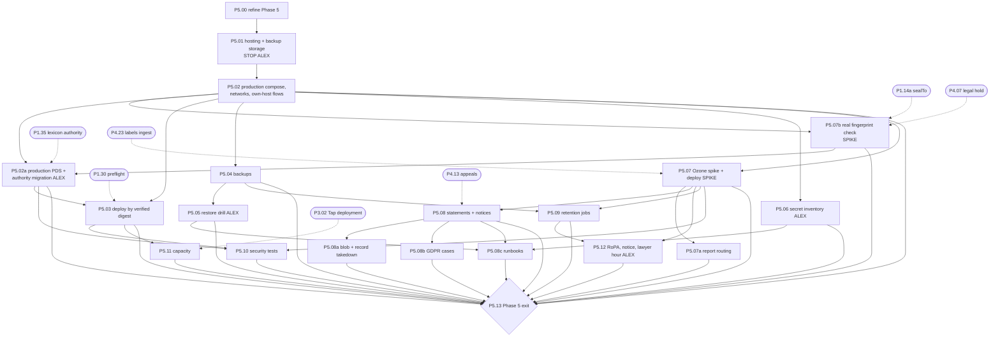
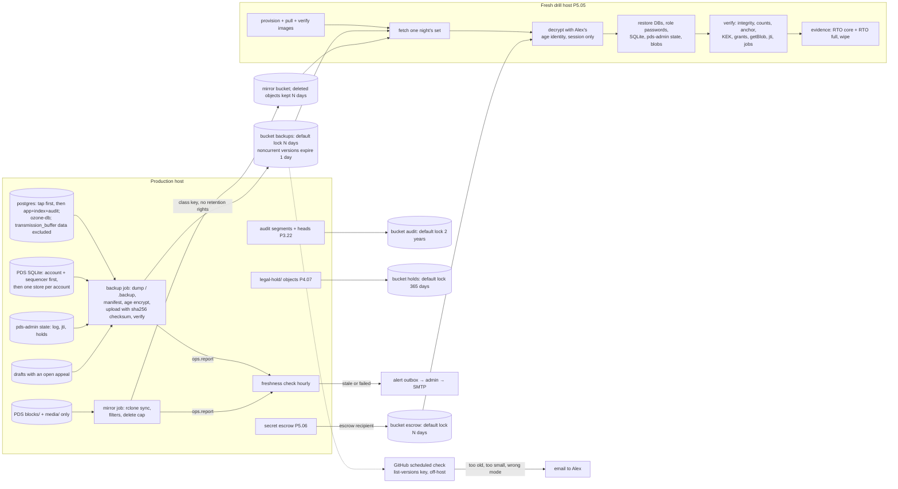
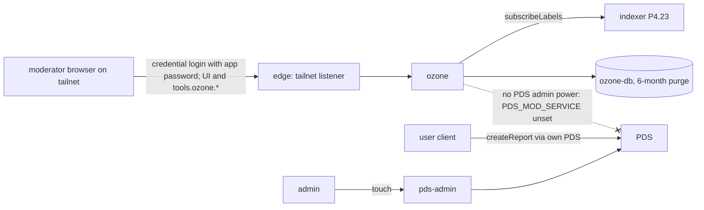
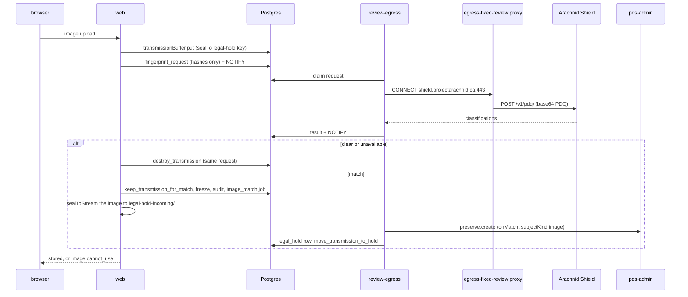
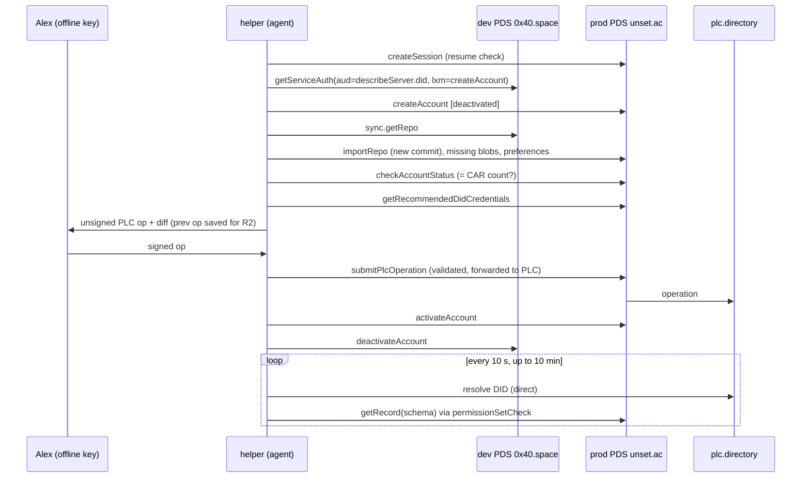

# Phase 5 — Production

Status: draft, round 2 (writer-p5, 2026-10-03), then the editor pass (2026-10-03; see the end of the Notes). Source of truth: `../unset-sh-rebuild-plan.md` §8 Phase 5 (decisions
20–22 included). Where this file and the plan disagree, the plan wins; report it under "Notes for the editor".
Round 1 review: `reviews/r1-phase-5-and-launch.md`; every change is listed in "Round 2 changes" at the end.

**Goal.** Turn the Phase 4 codebase into a production stack on a host Alex chose:
- one compose file;
- the production PDS on `unset.ac` with no users, and the lexicon authority migrated onto it;
- deploys by verified digest;
- backups that cannot fail silently, and a timed restore drill;
- a secret inventory, Ozone, admin v1.1, retention jobs, outside security tests and confirmed capacity.

**No launch** happens in this phase: the launch gate follows Phase 6.

**Depth of detail (Alex, 2026-10-03, "detail by risk"; `00-README.md`).** This phase is not build-ready as a whole.
These parts stay in full detail, because they are expensive to reverse:
- networks and egress (P5.02);
- keys and the authority migration (P5.02a, P5.06);
- deploy verification (P5.03);
- backups and restore (P5.04, P5.05);
- the Ozone trust boundary (P5.07);
- the real fingerprint check, the image transmission buffer and the image legal hold (P5.07b);
- takedown and erasure (P5.08a, P5.08b);
- retention (P5.09);
- the outside security tests (P5.10);
- every stop point and every "done when" test.

Everywhere else the algorithm is a **reviewed hypothesis**. P5.00 re-reads the whole phase against what Phases 1–4
actually built, and its review must pass before any other P5 step starts. If building shows that a boundary is wrong,
apply principle 16: fix locally, refactor on repetition, and stop for human review before changing a core boundary,
public contract or data model.

**Exit criteria (plan §8 Phase 5, made checkable in P5.13):**
- a restore drill on a fresh host passes, scripted and timed (P5.05);
- the edge rate-limit and spoofed-header tests pass against the production stack (P5.10);
- the production stack is ready:
  - every service runs a verified digest and reports the release commit;
  - preflight passes;
  - every backup class is fresh;
  - alerts are proven to fire;
  - own-host flows work through the edge;
  - signups are closed, and no `*.0x40.me` handle has been issued (P5.13);
  - the real fingerprint check is live, and production refuses to start without it (P5.07b, decision 23).

**Steps this file adds** (letter suffix or `.00`, per `00-README.md`):
- **P5.00:** the Refine step.
- **P5.07a:** report routing to Ozone.
- **P5.08a:** blob and record takedown.
- **P5.08b:** GDPR cases.
- **P5.08c:** the runbooks the plan lists for Phase 5.
- **P5.07b:** the real fingerprint check (Arachnid Shield spike and client, the image transmission buffer, the image
  legal hold), moved here from Phase 2 by decision 23. It lands before P5.02a.

P5.02a was added by the outline (decision 20).

## Step dependencies



P5.00 precedes every other P5 step; only the first arrow is drawn. P5.13 depends on every P5 step (round 1, outline
note 3).

## Deployment and network (production host, end of Phase 5)

```mermaid
flowchart LR
  subgraph NET[Internet]
    U((users / other apps))
    RELAY[(relay1.us-east.bsky.network)]
    PLC[(plc.directory)]
    FPDS[(other PDSes)]
    AS[(Arachnid Shield)]
    BSKY[(Bluesky AppView)]
    OBJ[(Object Lock buckets<br/>one per class)]
    MIR[(blob mirror bucket)]
    SMTP[(SMTP relay)]
    ACME[(ACME CA + DNS API)]
  end
  subgraph TAIL[Tailnet only]
    OPS((owner / moderator device))
  end
  subgraph HOST[Production host: public inbound 443 + 80 only]
    EDGE[edge Caddy<br/>0.0.0.0:443/80<br/>fixed internal address]
    ADMIN[admin<br/>tailnet IP :443]
    WEB[web x2]
    API[api]
    MEDIA[media]
    PDS[pds unset.ac]
    OZ[ozone]
    IDX[indexer]
    TAP[tap: public relay]
    TAPO[tap-own: our PDS]
    REV[review compute<br/>no network]
    REVE[review-egress]
    PDSA[pds-admin]
    PG[(postgres)]
    OZDB[(ozone-db)]
    BK[backup + freshness]
    RET[retention]
    MIG[migrate one-shot]
    CERT[cert-renew]
  end
  U -->|443| EDGE
  OPS -->|443| ADMIN
  EDGE --> WEB & API & MEDIA & PDS & OZ
  WEB & MEDIA & IDX & TAP & PDS & OZ -. hairpin: edge address :443 only .-> EDGE
  WEB --> PDSA
  ADMIN --> PDSA
  REVE -->|preserve.create only| PDSA
  PDSA --> PDS
  TAPO -->|internal firehose| PDS
  TAP & TAPO -->|acked WS| IDX
  WEB & API & MEDIA & IDX & TAP & TAPO & REV & REVE & ADMIN & MIG & RET & BK --> PG
  OZ & RET & BK --> OZDB
  WEB -. net-guard .-> FPDS & PLC
  MEDIA -. net-guard: own-blob checks, Bluesky pictures from author PDS getBlob (P4.21a) .-> FPDS
  MEDIA -. net-guard: PDQ lookup for proxied pictures (P4.21a) .-> AS
  API -. net-guard .-> PLC
  IDX -. net-guard .-> PLC & FPDS
  TAP -. indigo SSRF transport .-> RELAY & FPDS & PLC
  PDS -.-> PLC & SMTP & RELAY
  OZ -.-> BSKY & PLC
  REVE -. fixed host (no model provider in v1, Alex answer 30b) .-> AS
  BK -. fixed hosts .-> OBJ & MIR
  RET -. fixed host, read key .-> OBJ
  ADMIN -. fixed host .-> SMTP
  EDGE -. fixed hosts .-> ACME
  CERT -. fixed hosts .-> ACME
```

**Network and egress table.** This is the authority for P5.02. Every network is `internal: true` unless it is an
`egress-*` one.

| Container | Internal networks it joins | Egress class | Listens publicly |
|---|---|---|---|
| `edge` | `edge-web`, `edge-api`, `edge-media`, `edge-pds`, `edge-ozone`; fixed `ipam` address `EDGE_ADDR` on the bridge the hairpin rule targets | fixed hosts (ACME) via `egress-edge` | yes, `0.0.0.0:443`, `:80` (redirect) |
| `web` (2 replicas) | `edge-web`, `db-web`, `web-pdsadmin` | any host via `net-guard`, plus hairpin; `egress-web` | no |
| `api` | `edge-api`, `db-api` | any host via `net-guard` (DID resolution for service auth); `egress-api` | no |
| `media` | `edge-media`, `db-media`, storage | any host via `net-guard` (`public` policy, no redirects), plus hairpin (own-PDS blobs); `egress-media`. Since Alex answer 33 (P4b-E5 option C) this includes the **Bluesky picture proxy** (P4.21a): `com.atproto.sync.getBlob` on the post author's PDS (CID-verified, 2 MB cap, 5 s, no viewer data) and, from P5.07b, the Arachnid Shield PDQ lookup for each newly proxied picture. `cdn.bsky.app` is not used (its re-encode cannot be verified against the CID) | no |
| `indexer` | `tap-indexer`, `db-indexer` | any host via `net-guard`, plus hairpin (`*.0x40.me` well-known); `egress-indexer` | no |
| `tap` (public relay) | `tap-indexer`, `db-tap`, `tap-proxy` | relay, any PDS, PLC through the `egress-public` forward proxy (P1.18b, `HTTPS_PROXY`), if P3.01 M17 confirms Tap honours it; otherwise directly on `egress-tap` with the firewall drops and indigo's `ssrf.PublicOnlyTransport` (P3.02's default). Plus hairpin (own-PDS resync) | no |
| `egress-public` (smokescreen, P1.18b) | `tap-proxy` | any public host, deny list generated from `RANGES`; `egress-proxy-public` | no |
| `tap-own` (only while `PDS_CRAWLERS` is unset) | `tap-indexer`, `db-tap`, `pds-internal` | none (its firehose URL is the PDS's internal address) | no |
| `review` (compute) | `db-review`, storage volumes | **none** | no |
| `review-egress` | `db-review`, `review-pdsadmin`, `review-proxy` | one fixed host (Arachnid Shield) only, by `net-guard` proxy mode through `egress-fixed-review` (P1.18b); no `egress-*` network of its own; no object-store access (Alex answer 30b: no model provider, no `frames-cleared/*`) | no |
| `egress-fixed-review` (smokescreen, P1.18b) | `review-proxy` | allow list = the `arachnid` policy host only (answer 30b removed `anthropic`); `egress-proxy-review` | no |
| `object-store` (P2.18, phase-2 E28; SeaweedFS per P2-A8), only when P5.01 Q3 = A | `store` (shared by `web`, `media`, `review`, `jobs`, `backup`; `review-egress` no longer joins it, answer 30b) | none | no |
| `admin` | `db-admin`, `admin-pdsadmin` | fixed host (SMTP relay) via `egress-admin` | tailnet IP `:443` only |
| `pds-admin` | `web-pdsadmin`, `admin-pdsadmin`, `review-pdsadmin`, `jobs-pdsadmin`, `pds-internal` | **none** | no |
| `pds` | `edge-pds`, `pds-internal` | any host (PLC, SMTP, crawlers, OAuth client metadata), plus hairpin (our client metadata, our Ozone); `egress-pds` | no (through `edge`) |
| `ozone` | `edge-ozone`, `ozone-db` | any host (Bluesky AppView, PLC, PDSes), plus hairpin; `egress-ozone` | no (through `edge`) |
| `postgres` | every `db-*` | none | no |
| `ozone-db` | `ozone-db` | none | no |
| `migrate` | `db-migrate` | none | no |
| `jobs` (all scheduled work, retention included, under the `retention` role; R5-01, one process with P4.25's `jobs`) | `db-retention`, `ozone-db`, `jobs-pdsadmin` (internal) | fixed host (object store, read/list key only); `egress-retention` | no |
| `backup` | `db-backup`, `ozone-db`; read-write mount of the PDS data dir (opened with `sqlite3 -readonly`) | fixed hosts (object storage endpoints) via `egress-backup` | no |
| `cert-renew` | none | fixed hosts (ACME, DNS provider API) via `egress-cert` | no |
| Phase 6 (`chat` profile, not started here) | own networks, defined in P6.02 | — | via `edge` |

**Own-host flows.** Containers reach our own public hostnames only through the edge, by a hairpin to `EDGE_ADDR:443`
(round 1 F1; plan issue routed). Why a hairpin:
- SSRF-protected clients refuse private addresses (`net-guard`, the PDS's `safeFetch`, Tap's transport);
- the PDS itself warns that reaching its own public endpoint is not guaranteed (`@atproto/pds` `context.ts:362-365`).

The hairpin works like this:
1. Each listed `egress-*` subnet may open TCP 443 to the host's public address.
2. Docker's DNAT turns that into `EDGE_ADDR`.
3. The rule allowing it is keyed on `EDGE_ADDR` and placed before the private-range drop.
4. The client dials a public IP, and the edge applies its normal per-route rules.

| Source | Hostname / path | Why |
|---|---|---|
| `pds` | `https://unset.sh/…/client-metadata.json` (and JWKS) | the PDS fetches our OAuth `client_id` at every PAR; without it **every sign-in fails** |
| `pds` | Ozone public host `/xrpc/…` | `atproto-proxy` forwarding of our users' `createReport` and of moderators' `tools.ozone.*` calls (P5.07) |
| `web` | `https://unset.ac/…` | OAuth, DPoP and XRPC calls to our own PDS (DPoP binds the public URL) |
| `media` | `https://unset.ac/xrpc/com.atproto.sync.getBlob` | own-PDS published blobs (P3.09) |
| `indexer` | `https://<label>.0x40.me/.well-known/atproto-did` | `verifyHandle` for our users |
| `tap` | `https://unset.ac/xrpc/com.atproto.sync.getRepo` | resync of own-PDS repos |
| `ozone` | `https://unset.ac/…` | reading the labeler account's records and moderators' PDS calls |

**Host firewall (`DOCKER-USER`, extends P1.33).** Rules apply in this order:
1. **Hairpin.** The subnets of `egress-web`, `-media`, `-indexer`, `-tap` (or `-proxy-public` when Tap uses the
   proxy), `-pds` and `-ozone` may reach `EDGE_ADDR` on TCP 443. The edge sees these as their own socket addresses
   and limits them as one client class each (P5.11), never as an exemption.
2. **Allowed outbound.** Every `egress-*` subnet may reach TCP 443, plus:
   - TCP 587/465 for `egress-pds` and `egress-admin` only;
   - UDP/TCP 53 to the configured resolver.
3. **Drops.** Every `egress-*` subnet is denied RFC 1918, CGNAT (100.64/10, which includes the tailnet), link-local,
   `169.254.169.254` and every other internal address and port. Then everything else is dropped.

`net-guard` (P1.18) stays the hostname-level control inside our containers. The firewall is the layer that still holds
when a container bypasses it. `tailscale0` may reach only the admin port and owners' `sshd` (P1.33).

## Backup and restore flow



Lifecycle rules delete expired objects; the host never does. Object Lock requires versioning, so every bucket has two
lifecycle rules: expire the current version at lock + 1 day, and expire non-current versions and delete markers
1 day after they become non-current. Without the second rule, "expired" data stays forever as non-current versions
(round 1 F7).

The host keys can put objects but hold no retention permission, so each object takes its bucket's default retention. A
hold that needs a longer retention than the bucket default is extended with the offline admin key (P4.07 runbook).

A legal-hold object outlives the N-day pruning because it lives in its own bucket (plan §6: "a legal hold is the only
thing that outlives N").

---

### P5.00 — Refine Phase 5
Tags: [STOP]            Depends on: P4.28 (Phase 4 exit)            Plan: `00-README.md` "Depth of detail"; architecture principles 13–16
Where: `breakdown/phase-5.md` (this file), `breakdown/reviews/`
Size: 0 source lines; a revised phase file and one review round

Goal: before any Phase 5 code, re-read this phase against what Phases 1–4 actually built, update the hypotheses, and
have the revision reviewed.

Inputs: the merged code at the Phase 4 exit; the ADRs from P1.20, P3.01 and P4.15; every interface this file
names as "assumed":
- `release.json`, `preflight`;
- `ops.report`, `alert.send`;
- `permissionSetCheck`;
- `labelIngest`, `media.purge`, `core.is_held`;
- `eraseDid`'s held-row behaviour.

Also the plan's latest revision and its open plan issues, and Alex's answers to P5-A1–P5-A5 (Notes).
Outputs: a revised `phase-5.md`, with every "assumed" interface replaced by the real name and shape (file:line); a review
report in `reviews/`; a short list of steps whose size or order changed.

Algorithm:
  1. For each assumed interface, find the real one in the code (`graphify explain <name>`). There are three outcomes:
     - it exists and matches → cite it;
     - it differs → update this file;
     - it is missing → add it to the owning earlier step as a defect, or to this phase as a letter-suffixed step.
  2. Re-check each upstream fact this file depends on, at the versions now pinned:
     - the PDS env names `PDS_RATE_LIMITS_ENABLED` (kept explicitly `false`, global resolution 1),
       `PDS_RATE_LIMIT_BYPASS_*` (never set) and `PDS_REPORT_SERVICE_*`;
     - the Arachnid Shield API facts that P5.07b's spike re-checks;
     - the error shapes of `createAccount` and `activateAccount`;
     - Ozone's `withProxy` and OAuth client routes;
     - Tap's SSRF transport;
     - the chosen storage provider's Object Lock and key-scoping behaviour.

     A changed fact → revise the step and record the source line.
  3. Do not re-litigate the expensive-to-reverse parts unless the code contradicts them:
     - the network table;
     - the bucket layout;
     - the C-16 exclusion;
     - erasure under hold;
     - the Ozone boundary;
     - the fingerprint-check boot rule and the image legal-hold path (P5.07b).

     If the code does contradict them → **stop** and ask (principle 16).
  3a'. Decision 35 D6 (2026-10-04): reconsider Stryker mutation testing for the Phase 5 security tests (the security-guard
     modules) and put the result on the list for Alex: adopt it at phase exits or keep it deferred. It is deferred until
     this point; nothing before Phase 5 adds it.
  2a. **Process-placement test for scheduled jobs** (architecture thread 2026-10-04; guideline §1). A scheduled job
     joins `interfaces/jobs` only if both hold:
     - it needs no database grant, network or egress beyond what `jobs` already holds;
     - it parses no input from outside the system.
     Otherwise it becomes its own process, with an ADR naming its driver (rule AB-3). Apply the test to each job this
     revision confirms and record one line per job in the revision. Today's jobs all pass: drafts and upload expiry
     (P4.25), hold expiry (P4.07, through `jobs-pdsadmin`), the Ozone 6-month purge (`ozone_retention`), the P5.09
     classes, and P4.27 metrics through the `SECURITY DEFINER` `metrics_compute`. A job that fails the test →
     **stop** and ask before building it inside `jobs`.
  3a. Settle the step-book findings routed here (`reviews/step-book-findings-triage.md`, editor pass 2026-10-04):
     F-31 (scheduled jobs and the indexer refuse to run
     twice: a Postgres advisory lock taken at start, exit if held, with a two-instance test; P2.18's sweeper, P4.25 and
     the reaper already hold one); and the `Threats:` heading (README step template) for each `[SEC]` step whose
     algorithm this revision settles. Each goes into its step or onto the list for Alex. (F-15, the postmortem template,
     is no longer here: it lands with P2.26a, since rule RE-5's trigger is the closed test; bibliography review R2-14.)
  4. Submit the revision for one logic review and one reuse review. Answer the findings. No other P5 step starts until
     the review passes.

Edge cases and failures:
  - Alex has not answered P5-A3 or P5-A4 → the dependent steps stay blocked (P5.08's scope on P5-A3; P5.04's mirror
    on P5-A4; P5-A1 is answered: decision 26). The rest may proceed. Alex's edge-IP card (resolution 1) is still queued; P5.02a and
    P5.11 build its default meanwhile.
  - Phase 4 left open defects in an interface this phase uses → they are fixed in the owning step first.

Done when (tests):
  - `phase5_no_assumed_interfaces`: grep of `phase-5.md` → no "assumed" left without a file:line citation.
  - The review report is present with every finding answered; Alex approves the revision PR.

Reuse: none.
Feature ownership (decision 34, guideline §4; added 2026-10-04): the revision adds a "Feature ownership" table to this
  file: for each feature of the phase, its ownership path before any code (for example posting a video: `apps/web →
  interfaces/http → domains/content (+ domains/moderation) → infrastructure/pds, storage → PDS`), and it settles the
  `layout-map.md` placements this phase uses (retention runs inside `interfaces/jobs`, the one scheduled process under
  the `retention` role, as P4.25 built it; there is no `interfaces/retention` (R5-01; a future job that needs a different
  grant becomes its own process, with an ADR); backup scripts in `deployment/backup/`; `terraform/` and `ansible/`
  are created here only when hosting is chosen). The step that lands a feature's first slice writes
  `docs/human/features/<feature>.md` (what it does, its ownership path, routes, tables, roles, the steps that built
  it). Done when (added): every feature of the phase has a row whose path uses only decision-34 folders, and
  `scripts/docs/docs.test.ts` finds `docs/human/features/<feature>.md` for every feature whose first slice has merged.
Not in this step: building anything.
Diagram: none.

### P5.01 — Hosting and backup storage decision
Tags: [STOP] [ALEX]            Depends on: P5.00            Plan: §8 Phase 5, §5.2 (firehose), §5.6 (chat sizing), §5.8 (video storage), §6 (backups N days, Law 25), §11 Q10, review-later item 10, decision 14
Where: `docs/human/decisions/` (new ADR "production hosting and backup storage"), `deployment/hosting.md`, `deployment/bin/verify-buckets` + tests
Size: ~0 source lines; ~120 lines of ADR and checklist; ~100 source lines plus ~100 test lines for `verify-buckets`

Goal: Alex chooses three things, so every later Phase 5 step has a real machine and real buckets:
- the production host;
- compliance-mode Object Lock storage for backups, audit, holds and escrow;
- the blob-mirror target.

Inputs:
- plan §8 Phase 5 price comparison;
- review 06 S6/S7 (prices and Object Lock facts, 2026-10-02);
- review 07 SERIOUS-4 and review 04-video MINOR 8;
- P3.01's measured inbound volume;
- P4.05's transcode budget.

Outputs:
- **ADR:** the answers to Q1–Q7, with the date, prices as quoted on the decision day, and who decided.
- **`deployment/hosting.md`:**
  - provider, region and VPS size;
  - the four locked buckets (`backups`, `audit`, `holds`, `escrow`) and their default retentions;
  - the mirror bucket;
  - endpoint hostnames (these become the fixed-host allowlists of `egress-backup` and `egress-retention`);
  - N, RPO and RTO;
  - the primary store's lifecycle: **no age-only rule covers `drafts/`** (phase-4 E26: appealed drafts and
    `drafts/<did>/private/` outlive 30 days). The one `drafts/` rule is a backstop filtered on the object tag
    `lifecycle=expire` (set by the draft upload writers P4.03, P4.05 and P4.17, removed by appeals in P4.13; P2.18's
    profile images are never tagged), at 60 days (P4.25 step 6). P4.25's job and P2.18's sweeper are the deleters; `legal-hold/` has no rule
    at all (P4.07).
- **Alex's completed checklist** and the agent's verification report.
- **Config keys:** `BACKUP_RETENTION_DAYS` (N), `BUCKET_BACKUPS`, `BUCKET_AUDIT`, `BUCKET_HOLDS`, `BUCKET_ESCROW`,
  `BACKUP_ENDPOINT`, `MIRROR_BUCKET`, `MIRROR_ENDPOINT`, `STORAGE_MODE` (`disk` | `s3`).

Algorithm:
  1. The agent re-quotes the tables below from each provider's public price page on the day. A changed figure is marked
     "re-quoted <date>"; a page that cannot be fetched keeps the old figure, marked "not re-checked".
  2. The agent computes sizing from measured numbers:
     - **Inbound:** P3.01's measured GB/day × 30. The plan estimates 200–300 GB/day, so 6–9 TB/month.
     - **RAM:** the sum of `mem_limit` from the P5.02 draft. The estimate is ~12 GB for the core, plus ~4 GB for chat
       at launch (plan §5.6), so ≥16 GB before Phase 6 ends.
     - **CPU:** 2 cores for transcode, plus ≥2 for the rest.
     - **Disk:** the databases with 3× headroom; with `STORAGE_MODE = disk`, also the blob and media growth from P5.11's
       projection.
  3. The agent writes Q1–Q7 into the ADR as "proposed" and **stops**. Nothing from P5.02 onward is built until Alex
     answers the questions those steps need (see edge cases).
  4. Alex answers and completes the checklist.
  5. The agent runs `verify-buckets` with the keys Alex placed in the secret store. It checks the **real** properties
     (round 1 F7). Each S3 call has a 10 s timeout, retried 3×, after which the check fails.
     - **Locked buckets.** For each of the four:
       - `GetObjectLockConfiguration` must return `COMPLIANCE` with that bucket's default retention. Any other mode, or
         none, fails: governance mode can be bypassed by a privileged key.
       - `GetBucketVersioning` must return `Enabled`.
       - The lifecycle must have both rules: current expiry at the default retention + 1 day, and
         `NoncurrentVersionExpiration` of 1 day with expired-delete-marker cleanup.
     - **Host key, against a probe object `verify/<date>.txt` in `backups`:**
       - the PUT succeeds;
       - `DeleteObject` **with the version ID** is refused;
       - `PutObjectRetention` shortening the retention is refused;
       - `PutObjectRetention` lengthening it is also refused (the host key has no retention rights; F7);
       - `DeleteObject` without a version ID → whatever the provider returns is recorded: a delete marker is
         acceptable, because the locked version survives;
       - `GetObjectRetention` on the probe → mode `COMPLIANCE`, retain-until ≈ now + N.
     - **Off-host key:**
       - `ListObjectVersions` and `GetObjectRetention` → allowed;
       - delete by version ID → refused.
     - **Lifecycle, as a deferred check:** the drill (P5.05) and P5.09 confirm that the probe's version is gone after
       N + 2 days.
     - **Mirror key:** put, get and delete all succeed (erasure must reach the mirror). The agent confirms the mirror is
       at a different provider or account from the primary blob storage.
  6. The agent writes the report into the ADR. On any failure, the agent goes back to Alex with the exact failing check.
     P5.02 may start, but P5.04 may not.

**The questions for Alex (exact wording for the decision card):**

Q1. Production host. The host needs:
- ≥16 GB RAM by the end of Phase 6;
- ≥4 vCPU, plus 2 for transcoding;
- room for ~6–9 TB/month of inbound firehose traffic, plus media egress;
- a provider console (KVM or VNC) for the Tailscale lockout drill;
- Docker and IPv4.

| Option | Price (2026-10-02 quotes) | For | Against |
|---|---|---|---|
| **A. OVHcloud Canada, Beauharnois (recommended)** | VPS-2: 4 vCPU / 8 GB / 75 GB NVMe, unlimited traffic, CAD 11.64/mo. VPS-3: 6 vCPU / 12 GB, CAD 16.83/mo. KVM console, daily backup, snapshots. | Canadian law and operator; cheapest; unmetered traffic fits the firehose | 12 GB is below the ~16 GB estimate (check the next tier on the day); off-box copies leave Quebec, so a Law 25 PIA is needed (P5.12) |
| B. 1984 Hosting, Iceland | #3: 2 vCPU / 4 GB, €34.88/mo. #4: 4 vCPU / 8 GB, €69.76/mo. VNC console. | privacy reputation | 3–6× the price; no object storage; traffic allowance not verified; no shield from Canadian orders |
| C. Hetzner Cloud (reference only, not a plan option) | quotes differ between reviews; 20 TB included | cheap CPU | not Canadian; must be re-quoted |

Recommendation (provisional): A, on the smallest tier with ≥16 GB.

Q2. Locked storage for backups, audit, holds and escrow. Compliance-mode Object Lock is required, and R2 has none.

| Option | Price | Compliance mode | Key scoping (PutObject without delete or retention rights) | Notes |
|---|---|---|---|---|
| **A. Hetzner Object Storage, Germany (recommended)** | ≈ USD 12.30/TB-month | yes | **to verify on the day** (round 1 F7) | EEA, non-US owner |
| B. Backblaze B2, US | ≈ USD 6/TB-month | yes | to verify on the day | US jurisdiction |
| C. Wasabi (Toronto region) | ≈ USD 6.99/TB-month | yes | to verify on the day | US-owned |

Recommendation (provisional): A, **if** its key scoping passes step 5; otherwise the cheapest option that passes.

Q3. Where do the **primary** PDS blobs, media renditions and drafts live?
- A. host disk plus a block volume;
- B. S3-compatible storage at the host provider, in the same region;
- C. R2.

Book default: B if the host offers it in-region, otherwise A. Never C, because the mirror (Q4) must be a different
provider. With A, a lost host means copying every blob back from the mirror, and that copy counts in the full RTO
(P5.05).

Q4. Blob mirror (nightly `rclone sync`):
- **A. Cloudflare R2 (plan: "R2 can keep the public blob mirror")**;
- B. a second, unlocked bucket at the Q2 provider.

Recommendation (provisional): A. The mirror's immutability is Alex question P5-A4 (Notes).

Q5. Backup retention N. Plan §6 says "N days", and erasure must reach backups within N.
- Recommendation (provisional): **N = 30 days**. Drafts are the shortest personal-data class in the dumps, and GDPR
  requires erasure "within one month". **Settled by Alex (2026-10-03 16:45Z): 30 days.**
- Erased data then leaves within N + 1 days (current-version expiry), plus 1 day (non-current expiry).

Q6. Off-host freshness check.
- What it is: a GitHub Actions scheduled workflow, holding a list-versions and get-retention key, checks daily that the
  newest object per class:
  - is younger than 26 h;
  - is at least 50 % of the 7-day median size;
  - has mode `COMPLIANCE`.
- Recommendation (provisional): yes. It is the alarm that rings when the host is dead (plan §2 rule 25).

Q7. Recovery targets.
- Recommendation (provisional): **RPO 24 h**; **RTO (core) 4 h**; **RTO (full, with blobs)** to be measured by P5.05
  and accepted by Alex. **Settled by Alex (2026-10-03 16:46Z): as recommended.**

**Alex's checklist:**
- [ ] Provider accounts (host, storage, mirror), each with hardware-key 2FA and offline recovery codes, stored apart
      from data backups.
- [ ] VPS ordered; the console login tested once.
- [ ] Four buckets created, each with versioning, compliance mode, its default retention, and both lifecycle rules
      (step 5).
- [ ] Keys created:
  - [ ] a host write key per bucket: PutObject only, no delete-version, no retention;
  - [ ] an off-host list-versions and get-retention key;
  - [ ] an admin key, kept offline (lifecycle and retention extension).
- [ ] Keys placed in the secret store, never in chat or a PR.
- [ ] Mirror bucket and its key created.
- [ ] DNS for `unset.ac` not pointed anywhere yet (P5.02a does that).

Edge cases and failures:
  - **Alex answers only some questions** → the answered ones are recorded. P5.02 needs Q1 and Q3; P5.04 needs Q2, Q4
    and Q5. The agent states which steps stay blocked.
  - **Governance mode only** → Q2 verification fails. Governance mode does not meet admin design TB5.
  - **The provider cannot scope a key to PutObject without delete-version** → Q2 fails for that provider. The agent
    re-proposes, and P5.04 stays blocked.
  - **Prices changed more than 25 %** → flagged for Alex before he buys.
  - **RAM below the sum of `mem_limit`** → a resize becomes a P5.13 blocker.
  - **The probe stays locked for N days** → expected; it costs nothing.

Done when (tests):
  - `adr_hosting_has_all_answers`: Q1–Q7 each have an answer, a date and "Alex".
  - `verify_buckets_rejects_governance` (MinIO in governance mode).
  - `verify_buckets_rejects_version_delete` (MinIO key that can delete versions).
  - `verify_buckets_rejects_retention_rights` (MinIO key with `PutObjectRetention`).
  - `verify_buckets_requires_noncurrent_rule` (lifecycle without `NoncurrentVersionExpiration` → fail).
  - `verify_buckets_accepts_compliance_setup`.
  - `lifecycle_removes_noncurrent_versions` (MinIO, clock-advanced): an expired object leaves no version behind.
  - `verify_buckets_timeout`: 3 retries, then "timeout", with no hang.
  - `verify_buckets_no_age_rule_on_drafts`: a lifecycle rule covering `drafts/` without the tag filter
    `lifecycle=expire`, or any rule covering `legal-hold/` → fail; the tag-filtered 60-day `drafts/` rule → pass.
  - `hosting_md_endpoints_feed_allowlist`: the endpoints listed are equal to the configured `egress-backup` and
    `egress-retention` allowlists.

Reuse:
- MinIO (CI fixture only; supports compliance mode and lifecycle on versions) → USE, pinned by digest (provisional,
  for reuse review).
- Prototype `deploy/backup/RESTORE.md:1-15` (the Recovery Kit list) → LESSON.

Not in this step: backup code (P5.04); compose (P5.02); the Law 25 PIA (P5.12).
Diagram: "Backup and restore flow" above.

### P5.02g — `backup` role grants (split from P5.02, SE-6)
Tags: [SEC]            Depends on: P5.00, P1.12            Plan: §5.2 roles; §9 trusted base (rule SE-6, as ruled 2026-10-04; plan `f9b48f8`); round 1 F6
Where: one migration (grant statements only, generated as P5.02 describes), `roles.json` (`backup`'s `passwordFrom`),
  `grant-matrix.json` rows, the generator's drift test (P5.00 places the generator under `infrastructure/postgres/` or
  `scripts/`; if `scripts/`, the generator lands in P5.02 and only its output lands here)
Size: ~30 lines SQL (generated), ~30 test lines

Why a separate step (letter suffix): by Phase 5 every table exists, so `backup`'s SELECT grants and schema USAGE are
grants on existing objects, which is trusted base; P5.02's compose, firewall and `pg_hba.conf` work is not.
Goal: `backup` can read exactly the tables P1.12's matrix lists for it, never a `transmission_buffer`.
Inputs: P1.12 matrix and `backup` class assertions; every table created through Phase 4.
Outputs: P5.02's "`backup` role" list: SELECT on every table except any `transmission_buffer` (on a table with a
  registry row, SELECT by column list naming every column, regenerated by the generator when a column is added;
  column-list ruling, 02-shared-blocks §11); USAGE on the schemas;
  the matrix rows; `backup`'s `passwordFrom`. Never `pg_read_all_data`.
Algorithm: generate from the matrix; commit the generated statements; the drift test regenerates and compares.
Edge cases and failures: a table added later → its own step adds `backup`'s SELECT with the table (a new object, it
  rides); a buffer table in the generated list → P1.12's `class_assertions` fails.
Threats: the `backup` role.
  - I `backup` reading the C-16 buffer → no grant on any `transmission_buffer` (`class_assertions`, P1.12).
  - E `backup` made a member of `pg_read_all_data` → `class_assertions`.
Done when (tests): `matrix_matches`; `class_assertions`; the drift test.
Reuse: none. Not in this step: compose, firewall, `pg_hba.conf` (P5.02); `ozone_backup` and `ozone_retention` live in
  `ozone-db`, outside our migrations and the grant parse (P5.02, CODEOWNERS-reviewed). Diagram: none.

### P5.02 — Production compose with profiles, per-container egress and own-host flows
Tags: [SEC]            Depends on: P5.02g, P5.01            Plan: §5.2 (processes, roles, edge), §8 Phase 5, §2 rules 23 and 26, §5.7 (Tailscale only), admin design §5.2; plan issue 20 (Tap/indexer egress)
Where: `deployment/compose.yaml`, `deployment/firewall/docker-user.nft` (extends P1.33), `deployment/postgres/pg_hba.conf`,
`deployment/postgres/backup-grants.sql` (generated), `deployment/compose.test.ts`
Size: ~320 lines of compose and config, ~170 lines of firewall, `pg_hba` and grants, ~300 test lines

Goal: write one production compose file that:
- runs every Phase 1–5 service with least privilege;
- matches the network table above;
- reaches our own hostnames only through the edge;
- cannot publish a port, or reach any destination, that the table does not list.

Inputs:
- `release.json` from CI (P1.27, assumed shape `{ commit, images: { <service>: "<ref>@sha256:<index digest>" } }`);
- the edge config (P1.28);
- the P1.30 preflight;
- the P1.33 baseline;
- the roles and the grant matrix (P1.12);
- the P1.02 config schemas (each secret read from a `*_FILE` path);
- `deployment/hosting.md` (P5.01);
- the federation decision record (Q2b: is `PDS_CRAWLERS` set or not);
- P1.18b's generated proxy configs (`deployment/egress-proxy/*.yaml`) and P3.01 M17 (does Tap honour `HTTPS_PROXY`);
- the object store from P2.18 (phase-2 E28).

Outputs:
- **`deployment/compose.yaml`**, with `name: unset` and these profiles:
  - no profile = the core: `edge`, `web`, `api`, `media`, `indexer`, `tap`, `review`, `review-egress`, `admin`,
    `pds-admin`, `pds`, `postgres`, `cert-renew`, `egress-public`, `egress-fixed-review`, and `object-store` when
    P5.01 Q3 = A;
  - `own-ingest` = `tap-own`, required while `PDS_CRAWLERS` is unset (round 1 F2);
  - `ozone` (P5.07);
  - `jobs` = `migrate`, `backup`, `retention`;
  - `chat` = an empty placeholder (P6.02).
- **Every service has:**
  - an image by index digest;
  - a non-root `user`, except `edge`, which gets `cap_add: [NET_BIND_SERVICE]` only;
  - `read_only: true` and `tmpfs: /tmp`;
  - `cap_drop: [ALL]` and `no-new-privileges`;
  - `mem_limit`, `cpus` and `pids_limit`; a Node service also sets `NODE_OPTIONS=--max-old-space-size` to at most
    75 % of its `mem_limit` (findings F-32, as P1.29 does for the dev stack);
  - a healthcheck and `restart: unless-stopped`;
  - `logging: local` with size caps;
  - secrets as `secrets:` file mounts.
- **`web`, `api` and `media`** have no `container_name` and no `ports:` (docker-rollout).
- **Networks:**
  - exactly as in the table;
  - `edge` has a fixed address `EDGE_ADDR` (`ipam`);
  - each `egress-*` network has a fixed subnet;
  - every other network is `internal: true`.
- **`pg_hba.conf`:** each login role may connect only from its own `db-<role>` subnet; everything else is rejected.
- **`backup` role** (added to P1.12's matrix by **P5.02g**, its own step: grants on existing tables, SE-6), round 1 F6. It is **not** `pg_read_all_data`:
  - `backup-grants.sql` is generated from the P1.12 grant matrix;
  - it grants `SELECT` on every table **except** `transmission_buffer`;
  - it grants `USAGE` on the schemas;
  - a test regenerates the file and fails on any drift.
- **`ozone-db`** gets its own `ozone_backup` role (SELECT only) and its own `ozone_retention` role (DELETE on the tables
  P5.07's spike lists).
- **`DOCKER-USER` rules** as in "Host firewall" above, including the hairpin rule.
- **`tap-own`:** the same pinned Tap binary as `tap`, with `TAP_RELAY_URL` set to the PDS's internal address on
  `pds-internal` (Tap's firehose dialer has no SSRF check, indigo `firehose.go:453`, so an internal URL works). It uses its
  own cursor and the same collection filters, and is acked into the same indexer.
- **`pds-admin`** accepts on `review-pdsadmin` only the verb `preserve.create`, enforced inside `pds-admin` by
  listener-to-verb mapping (plan issue 15). On `jobs-pdsadmin` (internal network, no egress; architecture thread
  2026-10-04) it accepts only `preserve.listExpired` and `preserve.close`, enforced the same way. The `jobs` process
  holds the `retention` service key, which the roster scopes to exactly those two verbs (P3.16c's table already has
  both; no verb is added).

Algorithm (what the build agent writes, and what the guard test checks):
  1. Write the services and networks from the table. A service that is not in the table is an error.
  2. Publishing:
     - only `edge` publishes `0.0.0.0:443` and `:80`;
     - `admin` publishes `${TAILNET_IP}:443`;
     - preflight refuses an empty `TAILNET_IP`, or `0.0.0.0`.

     - `edge` also publishes `${TAILNET_IP}:8443`, the tailnet-only listener for Ozone's UI and `tools.ozone.*`
       (decision 26, P5.07 S4); preflight refuses it on any other address. (This replaces round 1's `edge-int`.)
  3. `review` (compute):
     - `STORAGE_MODE = disk` → volumes only;
     - `STORAGE_MODE = s3` → add `egress-storage`, allowing 443 and the hairpin drop rules, with the storage host
       allowlisted in `net-guard`.
  4. `backup` mounts the PDS data directory **read-write** (round 1 F8). SQLite's WAL needs a writable filesystem for
     `-shm`, and a `:ro` mount fails with "unable to open database file" (vault `backups-design`, drill-found bug).
     Safety comes from opening every database with `sqlite3 -readonly`. The container is otherwise `read_only: true`, and
     its only writable path is its scratch volume.
  5. `tap-own`:
     - `PDS_CRAWLERS` unset in the decision record → the `own-ingest` profile is required, and preflight refuses a
       deploy without it;
     - `PDS_CRAWLERS` set → `own-ingest` is optional; recommended kept, so ingest does not depend on the relay.
  6. Write `docker-user.nft` in this order:
     1. the hairpin rule (listed subnets → `EDGE_ADDR`, TCP 443);
     2. accept 443 (plus 53 to the resolver, and SMTP for the two subnets that send mail);
     3. drop private, CGNAT, link-local and metadata ranges, and the host's own addresses;
     4. drop everything else.
  7. Write `compose.test.ts`. It renders `docker compose config --format json` **into memory**, never to stdout or a
     log (vault `launch-day-secret-rotation`), and asserts the "Done when" rules below.

Edge cases and failures:
  - **A service needs a network the table lacks** → the test fails; the table is updated by PR first.
  - **`EDGE_ADDR` changes** → impossible: it is fixed in `ipam`. Preflight checks that the nft rule and the compose
    address agree.
  - **A container behind the hairpin tries another internal port on the edge** → the rule allows 443 only.
  - **A container tries another container's address through the hairpin** → DNAT targets `EDGE_ADDR` only; everything
    else is dropped.
  - **The edge receives hairpinned requests** → it treats them like outside requests:
    - it overwrites `X-Forwarded-For` (P1.28) and never forwards a client address to the PDS (global resolution 1);
    - it limits each source address in memory with `caddy-ratelimit` (P1.28); a hairpin source is one client class
      with its own measured limit (P5.11), not an exemption. There is no bypass header.
  - **The userland proxy hides the peer IP from `admin`** → the P1.33 fallback (`network_mode: host` for `admin`) is
    used, and recorded here.
  - **`ports:` on an internal-only container** → Docker silently ignores it (prototype `compose.yaml:403-410`); the test
    fails on any publish outside the two allowed.
  - **A new table is added in a migration** → the generated `backup-grants.sql` changes. The test forces a regeneration
    in the same PR, and the generator skips `transmission_buffer` by name.

Threats: the production host: published ports, container networks and egress.
  - E A compromised container reaches the internet, other containers or cloud metadata → internal networks by default,
    no egress for isolated services, nft drops of private and metadata ranges (`compose_internal_by_default`,
    `compose_no_egress_for_isolated`, `firewall_rules_order_and_ranges`).
  - E A role connecting from the wrong network, or `backup` reading the buffer → `pg_hba` subnet pinning; grant matrix
    (`pg_hba_role_subnet_pinning`, `backup_role_cannot_read_buffer`).
  - T An unpinned or locally built image → images by digest, no `build:` (`compose_images_by_index_digest`).
  - I Rendered compose with secrets printed → never (`compose_render_never_printed`).

Done when (tests):
  - `compose_only_allowed_ports_published`: `edge` publishes 443/80 on `0.0.0.0`; `admin` publishes 443 on `TAILNET_IP`.
  - `compose_networks_match_table`, `compose_internal_by_default`.
  - `compose_no_egress_for_isolated`: `review`, `review-egress`, `pds-admin`, `postgres`, `ozone-db`, `migrate`,
    `object-store` and `tap-own` join no `egress-*` network.
  - `compose_review_egress_only_via_fixed_proxy`: `review-egress` reaches the outside only through
    `egress-fixed-review`, whose allow list equals the `arachnid` policy host only (P1.18b's
    `proxy_acl_matches_policy`; answer 30b); `review-egress` is not on the `store` network.
  - `compose_hardening_fields`, `compose_images_by_index_digest` (and no `build:` key, plan §2 rule 23),
    `compose_rollout_services_have_no_container_name_or_ports`, `compose_secrets_are_files`.
  - `compose_own_ingest_required_without_crawlers`: decision record "no crawlers" and no `own-ingest` profile →
    preflight refuses.
  - `pg_hba_role_subnet_pinning` (real Postgres): `web` connecting from `db-api` → rejected.
  - `main_protection_before_first_prod_account` [ALEX]: before the first production account exists, `gh api` shows the
    decision-40 ruleset enforced on `main`, or Alex records in ADR 0009's revisit that the repo is still unprotected and
    accepts it for this step. Threat row E's revisit is due here, which is earlier than L.04 (step book thread, 2026-10-04 late).
  - `backup_role_cannot_read_buffer`: as `backup`, `SELECT` from `transmission_buffer` → permission denied; from
    `legal_hold_transmission` → allowed.
  - `backup_grants_match_matrix`: the regenerated file equals the committed one.
  - `firewall_rules_order_and_ranges` (parsed nft):
    - the hairpin rule precedes the drops;
    - every egress subnet drops private and metadata ranges;
    - only the listed subnets have the hairpin.
  - `pdsadmin_review_listener_preserve_only`: from `review-pdsadmin`, any verb other than `preserve.create` → refused.
  - `pdsadmin_jobs_listener_preserve_expiry_only`: from `jobs-pdsadmin`, `preserve.listExpired` and `preserve.close`
    (with the `retention` key) are served; every other verb, including `preserve.create` and `invite.issue`, is refused,
    even with a key that lists it. A roster giving the `retention` key any other verb → Deny all (P3.16's load rule).
    `jobs` reaches no other `pds-admin` network, and `pds-admin` still has no egress.
  - `compose_render_never_printed`.
  - The live checks (`own_hosts_reachable`, the negative probes) run in P5.10.

Reuse:
- Prototype `deploy/compose.yaml:13-32` (internal broker networks) and `:44-633` (hardening fields) → LESSON. Write
  fresh: the file carries `build:` keys and services that are not ported.
- Vault `pin-image-index-digests-not-platform-digests` → LESSON.
- Indigo's `ssrf.PublicOnlyTransport` inside Tap → USE as shipped, as the second layer (provisional, for reuse review).
- smokescreen (P1.18b) → USE as pinned there.

Not in this step: the deploy procedure (P5.03); PDS settings (P5.02a); backup internals (P5.04); Ozone details
(P5.07); chat (P6.02).
Diagram: "Deployment and network" and the tables above.

### P5.04 — Backups: age-encrypted, off-box, with freshness alerts
Tags: [SEC]            Depends on: P5.04q, P5.02            Plan: §2 rules 22 and 25, §6 (backups N days, legal holds, transmission buffer), §8 Phase 5, §5.7, admin design §7.3, §8.1, §11.4; decision 21
Where: `deployment/backup/` (a TypeScript job in the `backup` image that calls `pg_dump`, `sqlite3`, `age` and `rclone` with argument arrays, never through a shell); `.github/workflows/backup-freshness.yml`
Size: ~400 source lines, ~400 test lines
Split (SE-6 `q` rule, ruling 2026-10-05 01:15Z): `.github/workflows/backup-freshness.yml` lands first as
**P5.04q**; this step brings `deployment/backup/**`.

Goal: copy every class of irreplaceable data off the host each night, encrypted to a key the host does not hold, into
buckets the host cannot shorten or purge, never copying the C-16 transmission buffer, and alert within hours on any
missed or failed run, from inside and from outside the host.

Settled by Alex (2026-10-03 16:45Z, P5.01 Q5): backup retention N = 30 days.

Inputs:
- From P5.01: the buckets, the per-bucket host keys (PutObject only), N.
- From P5.02:
  - the `backup` role (explicit grants without `transmission_buffer`) and `ozone_backup`;
  - a **read-write** mount of the PDS data dir;
  - a read-only mount of `pds-admin` state.
- The age **recipients**: the data recipient (Alex's offline identity, plus a second owner's if one exists) and the
  escrow recipient (a different identity).
- `ops.report(key, value)`.
- `alert.send(tier, class, text)` as a **DB outbox row consumed by `admin`**. The `backup` container has no SMTP
  egress (round 1, note 7).
- P3.22's `auditExport(day) -> { segmentPath, head }`.
- P4.07's legal-hold objects under `legal-hold/<holdId>/` in the media/drafts store (already encrypted to the legal-hold
  public key), each with a manifest. A read-only credential for that prefix (round 1 F20).
- P4.11 / P4.13: the drafts with an open appeal (`state = appealed`).
- The object store (P2.18, phase-2 E28) that holds `drafts/`, `media/` and `legal-hold/`: the classes below reach it by
  prefix, and `legal-hold-incoming/` (P5.07b) is covered by the `hold` class scan.

Outputs, classes and schedule (supercronic with an absolute path, prototype `Dockerfile:29-33`):

| Class | Source | Method | When | Bucket / path |
|---|---|---|---|---|
| `postgres` | `tap` DB **first**, then app+index+audit DB, then `ozone` DB (when the profile is on), then globals | `pg_dump -Fc --exclude-table-data='*.transmission_buffer'`; globals via `pg_dumpall --globals-only --no-role-passwords` | 02:15 and on demand (`pre-deploy`) | `backups` `postgres/<YYYY>/<MM>/<DD>/<stamp>.tar.age` |
| `pds` | `account.sqlite` and `sequencer.sqlite` **first**, then one `actors/*/store.sqlite` per account listed in the **copied** `account.sqlite`, then the other top-level `*.sqlite` | `sqlite3 -readonly <db> ".timeout 5000" ".backup <dst>"` + `integrity_check` on each copy | 02:45 | `backups` `pds/...` |
| `pds-admin` | log, `jti` file, holds index | copy, trim to the last complete line, verify the links | 03:00 | `backups` `pds-admin/...` |
| `appealed-drafts` | draft media whose draft is `appealed` (a small set) | age-encrypted copy | 03:05 | `backups` `appealed-drafts/...` |
| `audit` | P3.22 segments and heads | upload as produced | daily | `audit` `<lane>/<YYYY>/<MM>/<DD>.seg.age` |
| `hold` | new objects under `legal-hold/<holdId>/` | copy as-is (already encrypted); verify against P4.07's manifest | hourly scan | `holds` `<holdId>/…` |
| `escrow` | secrets marked `escrow` in P5.06 | age to the escrow recipient | on change, and weekly | `escrow` `<stamp>.tar.age` |
| `mirror` | PDS `blocks/` and our `media/` prefix **only** | `rclone sync` with filters, `--backup-dir`, and a delete cap | 03:30 | mirror bucket |

Notes on the classes:
- Ordinary draft **media** is not backed up (private, 30-day lifespan). Draft **rows** are in the Postgres dump.
- Every archive contains `manifest.json`:
  `{ class, createdAt, setId (the night's date), commit, schemaVersion, files: [{ path, sha256, bytes }], rowCounts, auditHeads, sqliteCount, accountCount }`.
  It holds counts only.
- A plaintext sidecar `<stamp>.meta.json` carries `{ class, setId, createdAt, bytes, sha256 }`.
- `ops.report("backup.<class>", { at, setId, bytes, sha256, ok })`.
- An hourly `freshness` job, plus the GitHub workflow.

Algorithm, one run of class C:
  1. **Lock.** Take `backup.lock` (shared with deploy; round 1 F15), unless the caller passed `lockHeld`. If it is busy,
     wait up to 30 minutes, then fail with `lock_timeout`.
  2. **Scratch space.** The scratch volume must have at least 2 × the last good size of C free, or the run fails with
     `scratch_full`.
  3. **Build the plaintext set** in a 0700 scratch directory.
     - `postgres`, for each database in the listed order (`tap` first, so that Tap redelivers anything acked after the
       app dump, and versioned upserts make that idempotent; round 1 F16):
       - `pg_dump -Fc --exclude-table-data='*.transmission_buffer'` with `lock_timeout=10s`;
       - a non-zero exit fails with `dump_failed:<db>`; output under 1 KB fails with `dump_empty:<db>`;
       - then the globals, then the `rowCounts`.
     - `pds`:
       - copy `account.sqlite` and `sequencer.sqlite`; if either is missing, fail with `no_source`;
       - read the account list from the **copy**;
       - copy each account's store; a missing store fails with `store_missing:<did>`;
       - copy the remaining top-level files;
       - run `integrity_check` on each copy; any result other than `ok` fails with `integrity:<path>`;
       - `accountCount` must equal the number of stores.
     - `pds-admin`: copy, trim to the last newline, and verify the links. A broken link before the trim point fails with
       `pdsadmin_chain_broken` (alert: this is tampering or corruption).
  4. **Secret scan.** This applies to every class except `escrow` (round 1 F19). Any file name or content matching an
     inventory secret name, `AGE-SECRET-KEY-`, `-----BEGIN`, or a JWK `"d":` fails the run with `secret_in_bundle`.
     `escrow` instead must be encrypted **only** to the escrow recipient; any other recipient fails with
     `escrow_recipient`.
  5. **Encrypt.** Write `manifest.json`. Run `tar` to a file, not a pipe (prototype `backup.sh:59-60`), and check its exit.
     Run `age -r <recipient>…`, check its exit, and check the output is non-empty.
  6. **Upload** with that bucket's host key, plus the header `x-amz-checksum-sha256`.
     - No retention header is sent: the object takes the bucket's default retention (round 1 F7).
     - Upload timeout 30 minutes; 2 retries with backoff; then fail with `upload_failed`.
     - Before any upload, `retainUntilCap(class)` is computed and checked against the bucket's default retention:
       backups N + 1 days; audit at most the class period + 1 day; holds at most the hold's `expiresAt` + 1 day. A bucket
       whose default exceeds its cap blocks the upload with `retention_cap` (round 1 F19: a wrong lock cannot be undone).
  7. **Verify.** `HEAD` the object and require all of these, or fail with `verify_failed`:
     - the stored SHA-256 checksum (not the ETag) equals the local hash;
     - the size matches;
     - `GetObjectRetention` returns mode `COMPLIANCE`, with retain-until ≤ the cap.
  8. Upload the sidecar. Delete scratch. Report `ok`. Release the lock.
  9. **On any failure:** delete scratch, report `ok: false` with the code, write an `alert.send("immediate", "backup", …)`
     outbox row, and exit non-zero.

Mirror run (P5-A4 decides its immutability; round 1 F18):
  1. Sources are filtered. Include PDS `blocks/` and `media/`. Exclude:
     - `drafts/` (private, never mirrored);
     - `legal-hold/`;
     - the PDS `quarantine/`;
     - `tempt/` on disk and `tmp/` on S3.
  2. An empty source, or a failed listing → fail with `mirror_source_empty`.
  3. More deletes than max(100, 5 %) → fail with `mirror_mass_delete`. Alex reruns with `--allow-deletes <n>`.
  4. Run `rclone sync --backup-dir <mirror>/deleted/<date> --checksum`. Lifecycle removes `deleted/` after N days. An
     error is retried once, then the run fails.
  5. An `illegal_content` or `csam` takedown also deletes the matching mirror and `deleted/` copies at once (P5.08a).

Hold class: scan `legal-hold/` for hold IDs not yet in `holds`. For each one:
- copy every object;
- verify it against P4.07's manifest; on mismatch → fail with `hold_manifest_mismatch` and raise an immediate alert;
- the holds bucket default (365 days) applies. A hold that needs longer is extended by an owner with the offline admin
  key (P4.07 runbook).

Freshness, inside (hourly):
- For each class, read the newest report.
  - No report at all → `never_ran` (fail closed).
  - Older than 26 h, or `ok: false` → alert, deduplicated per class over 12 h.
- Disk over 80 % → alert.

Freshness, outside (daily, GitHub workflow, list-versions and get-retention key): for each class, the newest object
version must be all of these, otherwise the workflow fails:
- younger than 26 h;
- at least 50 % of the 7-day median size;
- mode `COMPLIANCE`.

A fake "fresh" sidecar written by a compromised host therefore does not pass (round 1 F25). The workflow prints only
class names, ages and sizes.

Edge cases and failures:
  - **A PDS write in progress** → `.timeout 5000`; `-readonly` means the backup cannot corrupt it.
  - **An account created after `account.sqlite` was copied** → it is absent from this set and present in the next one.
    No orphan store is copied.
  - **The OAuth refresh-token state differs between 02:15 and 02:45** → after a restore, some users may need to sign in
    again. This is documented in the restore runbook.
  - **An object store that ignores the default lock** → caught by step 7.
  - **A wrong host clock** → retention comes from the bucket and the cap uses the object store's `Date` header.
  - **Erasure versus backups**:
    - an erased user's rows leave tomorrow's set;
    - old sets expire within N + 2 days, the non-current versions included;
    - the mirror's `deleted/` copies expire within N days;
    - the only exception is material under an **open legal hold**. Per the single rule owned by P4.07 (round 1 F10),
      `eraseDid` erases everything except held rows and objects, and finishes the rest when the hold closes.
  - **The C-16 buffer** → its table exists in the dump with zero rows; `legal_hold_transmission` (moved ciphertext) is
    included.
  - **The `ozone` profile is off** → that database is skipped and not reported missing.
  - **Chat** → its classes are added in P6.19.

Threats: copies of every irreplaceable store, kept off the host.
  - I A backup readable by the host or holding the transmission buffer or secrets → age-encrypted to an off-host key;
    buffer and secrets excluded (`backup_excludes_transmission_buffer`, `secret_never_bundled`).
  - T A compromised host deletes or shortens backups → compliance lock; host key cannot delete versions
    (`upload_takes_bucket_default_lock`, `host_key_cannot_delete_version`, `outside_check_rejects_small_or_unlocked`).
  - T A silent partial backup → every failure fails loudly; freshness alerts (`ro_mount_fails_loudly`,
    `no_source_fails`, `verify_uses_sha256_checksum`, `freshness_alerts_stale`).
  - I Private prefixes mirrored, or erasure not propagated → filtered; erasure propagated; mass delete refused
    (`mirror_filters_private_prefixes`, `mirror_propagates_erasure`, `mirror_refuses_mass_delete`).

Done when (tests):
  - `postgres_roundtrip`: restore the backup into an empty cluster → row counts equal the manifest.
  - `backup_excludes_transmission_buffer`: seed a buffer row → decrypt → the table exists with 0 rows, and
    `legal_hold_transmission` rows are present.
  - `postgres_dump_order_tap_first`.
  - `sqlite_live_wal_race`, run **with the production mount mode** (read-write mount, `-readonly` open), with a nested
    store.
  - `pds_store_per_account_from_copy`: an account inserted mid-run → no orphan store, and `accountCount` matches.
  - `ro_mount_fails_loudly`: a `:ro` mount → `integrity`/open error, an alert, and no silent success.
  - `no_source_fails`, `dump_tool_error_fails`, `tar_failure_fails`, `age_failure_fails`.
  - `secret_never_bundled`, `escrow_exempt_from_scan_but_recipient_checked`.
  - `upload_takes_bucket_default_lock` (MinIO): compliance mode; retain-until ≈ the default; no retention header sent.
  - `retain_until_capped`: a bucket default above the cap → `retention_cap`, nothing uploaded.
  - `verify_uses_sha256_checksum`: a truncating proxy → `verify_failed`.
  - `host_key_cannot_delete_version`.
  - `lifecycle_removes_noncurrent_versions` (shared with P5.01).
  - `hold_copied_and_manifest_checked`, `hold_manifest_mismatch_alerts`.
  - `appealed_drafts_backed_up`; non-appealed draft media is not backed up.
  - `pdsadmin_partial_line_trimmed`, `pdsadmin_tamper_detected`.
  - `mirror_filters_private_prefixes`: `drafts/`, `legal-hold/`, `quarantine/` and the temp dirs are never mirrored.
  - `mirror_refuses_empty_source`, `mirror_refuses_mass_delete`, `mirror_propagates_erasure`.
  - `deploy_with_migration_runs_backup` (shared with P5.03).
  - `freshness_alerts_stale`, `freshness_alerts_never_ran`, `freshness_alert_deduped`.
  - `outside_check_rejects_small_or_unlocked`: a fresh but tiny object, or a non-compliance one → fail.
  - `alerts_go_to_outbox`: the `backup` container has no SMTP route, and the alert appears in the `admin` outbox.
  - `logs_have_no_ips_or_secrets`.
  - `authority_account_in_pds_backup` (production evidence).

Reuse:
- Prototype `deploy/backup/backup.sh:17-27` (`-readonly`, `.timeout 5000`) → LESSON, flags kept.
- Prototype `backup.sh:44-51` (secrets bundled with data) and `:64-72` (host prune) → REJECT.
- Prototype `Dockerfile:3-33` → LESSON.
- Prototype `HOST-JOBS.md:38-46` → LESSON.
- Vault `backups-design` (the rw-mount drill bug) → LESSON.
- `age` → USE (plan), pinned (provisional).
- `rclone` → USE for the mirror (plan names `rclone sync`). For locked uploads, rclone's object-lock flags and their
  minimum version are **unverified**; if P5.00 cannot confirm them, the uploader uses the AWS SDK pinned exactly
  (provisional).
- restic → REJECT, provisional: prune needs delete rights.
- pgBackRest / WAL-G → LESSON, provisional, only if Q7 asks for a lower RPO.
- Litestream → REJECT, provisional.

Not in this step: restore (P5.05); live-data retention (P5.09); the escrow contents (P5.06); the Matrix classes
(P6.19).
Diagram: "Backup and restore flow" above.

### P5.05 — Restore drill on a fresh host, scripted and timed
Tags: [ALEX]            Depends on: P5.04            Plan: §2 rule 25, §8 Phase 5 exit, launch gate ("restore drill passing after Phase 6"), admin design §7.3, §11.2
Where: `deployment/drill/restore-drill` (TS job and thin wrapper), `deployment/compose.drill.yaml`, `docs/human/drills/`
Size: ~350 source lines, ~250 test lines

Goal: prove, on a host that has never run production, that **one night's backup set** comes back as a working stack,
and measure both the core RTO and the full RTO.

Settled by Alex (2026-10-03 16:46Z, P5.01 Q7): RPO 24 h, core RTO 4 h; the full recovery time is measured by this
drill and then accepted by Alex.

Inputs:
- P5.04 objects and manifests.
- The off-host read key.
- Alex's data and escrow age identities, supplied at run time into `tmpfs` only. **[ALEX]**
- A fresh VM provisioned by Alex.
- The production release commit.

Outputs:
- `restore-drill --target <commit> [--set <date>] [--phase …]`, which exits 0 only if every check passes.
- `docs/human/drills/restore-<date>.md`, containing:
  - the timed phases;
  - "RTO (core)" and "RTO (full, with blobs)", against P5.01 Q7;
  - the `setId` used;
  - every check;
  - counts only.
- `deployment/drills/last.json`, shown on the health board. One age rule applies across the gate: a drill ≤ 14 days old at
  P5.13, and ≤ 30 days old at L.03 and L.06 (round 1 F21).

Algorithm:
  1. **Phase A, prepare** (timed). Starts at T0, when Alex hands over an empty VM.
     - Install Docker and apply the P1.33 firewall.
     - Pull and verify all images, as in P5.03 step 3. This needs the registry, Sigstore and the GitHub API.
     - Then **arm the safety rails** (round 1 F17):
       - the compose project is `unset-drill`;
       - no production project name, and no `0.0.0.0` publish;
       - no `egress-*` network except `egress-backup-read`;
       - `PDS_CRAWLERS` unset, SMTP empty, `review-egress` off, `tap` (public) off;
       - no DNS points at the drill host.
     - Any rail fails → abort.
  2. **Phase B, fetch** (timed).
     - Choose the newest **complete set**: one `setId` with every class present. A missing class → use the previous
       night's set, and record it.
     - Fetch that set, plus the escrow object current at that date.
     - Each fetch has a 10-minute timeout, otherwise abort with `fetch_failed`.
  3. **Phase C, decrypt.** Decrypt from `tmpfs`, then check the manifest hashes. Failures abort with `decrypt_failed` or
     `manifest_mismatch`.
  4. **Phase D, restore core** (timed).
     a. Load the secrets from escrow (mode 0400, correct uid).
     b. Start `postgres` and restore the globals.
     b′. **Set each role's password** from the escrowed secrets (the globals were dumped with `--no-role-passwords`).
     c. `pg_restore --exit-on-error` each database: `tap`, then app, then `ozone`.
     d. Restore the PDS SQLite files, then the `pds-admin` state, then the appealed drafts.
     e. If the manifest's commit differs from `<commit>`: start at the backup's commit, run `migrate` at `<commit>`, then
        start every core service.
     f. Run `tap-own` with a **cursor reset** to the restored PDS's sequencer head. A real recovery then also calls
        `requestCrawl` to the configured crawlers. Relay behaviour when its cursor is ahead of the restored PDS is
        **unverified**; it is recorded here (round 1 F16).
  5. **Phase E, restore blobs** (timed separately).
     - `STORAGE_MODE = disk` → copy every mirror object back into the PDS layout `blocks/<did>/<cid>` (vault
       `pds-blobstore-s3-key-prefix`) and into `media/`.
     - `s3` → re-point at the provider bucket, and copy only if the drill simulates losing it.
  6. **Phase F, verify.** Each check is named. A failure marks the drill failed, and the remaining checks still run.
     - `pg_counts`, `sqlite_integrity`, `pds_account_store_parity`.
     - `pds_health`; `getLatestCommit` for the authority equals the manifest.
     - `audit_anchor` against P3.22's off-box anchor.
     - `kek_unseals`; `role_passwords_work` (each service connects).
     - `grant_matrix`, `did_columns`, `backup_role_cannot_read_buffer`.
     - `buffer_empty_after_restore`: `transmission_buffer` has 0 rows.
     - `pdsadmin_log`; `jti_replay_refused`: an envelope recorded in the restored `jti` file is refused. Envelope
       lifetimes (≤ 60 s) are far below RPO, so an older `jti` file cannot be replayed.
     - `blob_via_getblob`: a sample of 50 blobs fetched through the restored PDS's `getBlob`, and media through the
       media proxy, each hashing to its CID.
     - `drafts_marked_lost`; `appealed_drafts_present`.
     - `review_jobs_reconciled`: jobs whose objects are gone end in a named state (`lost_in_restore`) and do not crash.
     - `web_smoke`.
     - `holds_bucket_readable`: a test hold object can be listed with the read key, and is never decrypted on the drill
       host.
  7. Compute the results:
     - **RTO (core)** = end of D − T0;
     - **RTO (full)** = end of F, with E included.

     Not timed by the drill, and estimated in the evidence: DNS and TLS cut-over (TTL plus certificate issuance).
     Over target → the drill is "passed, over RTO", and an issue is opened as **severity 2** per `docs/human/severity.md` (the
     definitions moved early; see the launch-gate notes).
  8. **Teardown.** `down -v`, wipe the `tmpfs`, Alex destroys the VM, and the evidence is written.

Edge cases and failures:
  - **Wrong or missing identity** → abort before any restore.
  - **A set older than 26 h** → recorded (the freshness alert should already have fired).
  - **The drill is run on the production host** → the rails see the production label and abort.
  - **The Ozone profile is off** → the Ozone database is skipped and recorded.
  - **A deferred lifecycle check** (P5.01): the drill lists versions of `verify/` older than N + 2 days and expects
    none.

Done when (tests):
  - `drill_refuses_production_names`, `drill_refuses_public_publish`, `drill_refuses_crawlers`,
    `drill_rails_armed_after_pull`.
  - `drill_full_ci`: a backup of a seeded compose stack into MinIO, then a drill into a second project → every check
    passes, with the phases timed.
  - `drill_uses_one_set`: classes from different nights → the previous complete set is chosen.
  - `drill_sets_role_passwords`, `drill_detects_missing_kek`, `drill_detects_count_mismatch`,
    `drill_detects_audit_rewrite`, `drill_wrong_identity_aborts_clean`, `drill_upgrade_path`,
    `drill_jti_replay_refused`, `drill_review_jobs_reconciled`.
  - Production evidence: a real fresh host, every check passing, both RTOs recorded.

Reuse:
- Prototype `deploy/backup/matrix-restore-drill.sh:41-98` and `:186-206` → LESSON.
- Prototype `deploy/backup/RESTORE.md:45-67` → LESSON.

Not in this step: the Matrix drill (P6.19); automatic host provisioning.
Diagram: "Backup and restore flow" above.

### P5.06 — Secret inventory and rotation runbook
Tags: [SEC] [ALEX]            Depends on: P5.02            Plan: §2 rule 24, §8 Phase 5, §11 Q2a, admin design §6.6; vault `deploy-secret-lifecycle-inventory`, `launch-day-secret-rotation`
Where: `deployment/secrets/inventory.json`, `deployment/secrets/inventory.test.ts`, `deployment/runbooks/secret-rotation.md`
Size: ~120 source lines, ~250 runbook lines, ~150 test lines

Goal: keep one list of every secret the stack uses, saying where it lives, how it is backed up and how it is rotated,
with a test that keeps the list and the code in step.

Inputs:
- The P1.02 schemas and P5.02 compose.
- The offline keys from P0.12.
- The P5.01 storage keys.
- The P3.16 roster and the `pds-admin` key.
- The P1.14 KEK and the P2.04 OAuth JWK.
- The PDS secrets from P5.02a, including the K-256 rotation key hex (there is no rate-limit bypass key, resolution 1).
- The Arachnid Shield credentials (P5.07b, `review-egress` only).
- From Phase 1 (phase-1 Notes 20): the cosign private key (environment `signing`), the lock-update GitHub App
  credentials, the host's read-only GHCR token, the age backup key and the dev PDS secrets bundle.
- The L.01 Phase 1 record of the old 0x40 secrets already retired.

Outputs:
- `inventory.json`: rows of `{ name, usedBy, kind, custody: online|offline, backup: escrow|offline-only|none-regenerable, rotation, replaceable, lastRotated, notes }`.
  It never holds values.
- **Escrow rows** (P5.04 `escrow` class, encrypted to the escrow recipient only):
  - the KEK;
  - the online PDS PLC rotation key, `PDS_JWT_SECRET`, `PDS_ADMIN_PASSWORD`;
  - the Arachnid Shield credentials;
  - the OAuth client JWK;
  - `admin`'s envelope key;
  - the Tap admin password;
  - the Postgres role passwords (P5.05 step 4b′ needs them);
  - later, the Ozone label signing key (P5.07) and the Matrix keys (P6.19).
- **Offline-only rows:**
  - the authority offline key and the PDS recovery key;
  - the age data and escrow identities;
  - the roster signing SSH keys;
  - the Tailnet Lock disablement secrets;
  - the storage admin key.
- `secret-rotation.md`, one section per kind, including:
  - the Postgres `ALTER ROLE`-first order;
  - the OAuth `kid` rollover;
  - KEK re-wrap (P1.14), and on a **KEK compromise**: revoke the OAuth grants first, then rotate, then re-wrap
    (phase-1 Notes; P1.14 edge case);
  - PDS admin password;
  - storage keys;
  - Arachnid Shield credentials (rotate at the provider, then `review-egress`; a 401 during the swap opens
    `provider_access_lost` and uploads stop, which is the safe side).

Algorithm:
  1. Build the inventory from the schemas and compose. If a secret's kind is unknown, ask in the PR.
  2. `inventory.test.ts` checks:
     a. the schemas and compose match the rows, in both directions;
     b. no row holds a value (entropy and pattern check);
     c. the escrow and offline-only rows are disjoint, and every escrow row is in P5.04's list;
     d. every rotation anchor exists.
  3. **Old 0x40 secrets:** retired in Phase 1 by L.01 (round 1 F12). This step only verifies that L.01's record exists
     and is complete. It runs no prototype checklist of its own.
  4. **First rotation exercise:** rotate one online secret of each kind on production (no users yet) and record
     `lastRotated`.

Edge cases and failures:
  - **An exposed secret** → rotate it now; `docker compose config` must always be captured, never printed.
  - **A schema key with a default** → the test fails.
  - **The online PDS PLC rotation key is exposed** → a PLC operation per hosted DID, signed with the recovery key. Before
    launch, only the authority DID (plus the labeler, if hosted) is affected.

Threats: every secret the stack uses.
  - I A secret missing from the list, or its value written in the list → the inventory matches the schemas and holds
    no values (`inventory_matches_schemas_and_compose`, `inventory_has_no_values`).
  - E A leaked secret that cannot be replaced → one rotation per kind rehearsed (evidence).

Done when (tests):
  - `inventory_matches_schemas_and_compose`, `inventory_has_no_values`, `escrow_excludes_offline_only`,
    `rotation_anchors_exist`, `schema_secret_without_inventory_fails`.
  - `old_0x40_retirement_record_complete`: L.01's Phase 1 record exists, with every line dated.
  - Evidence: one rotation per kind, recorded.

Reuse:
- Prototype `deploy/scripts/gen-secrets.sh:3-25` → LESSON.
- sops → REJECT, provisional (vault `sops-secrets-encryption-not-configured`).

Not in this step: retiring the prototype's secrets (L.01, Phase 1).
Diagram: none.

### P5.07 — Ozone spike, then deployment
Tags: [SPIKE] [MOD] [SEC]            Depends on: P5.02, P4.23            Plan: §5.8 "Our labeler: Ozone", §6 (reports for 6 months, Ozone's Postgres included); review 04-video SERIOUS 6, review 03 SERIOUS-4 and MINOR-2, review 06 S10
Where: spike → `docs/human/decisions/` ("Ozone version and boundaries"). Deployment → `deployment/compose.yaml` (`ozone` profile),
`deployment/edge/` (Ozone host rules), `deployment/ozone/retention.sql`, `deployment/runbooks/ozone-keys.md`.
Size: spike ~2 days plus a ~150-line harness; deployment ~150 config lines, ~80 source lines, ~220 test lines

Goal: confirm that a pinned Ozone version can serve as the unset.sh labeler and the intake for reports about public
records, without ever becoming a PDS administrator. Then deploy it with moderators signing in by credential login over
Tailscale (decision 26).

**Decided (P5-A1, answered by Alex 2026-10-03, plan decision 26): credential login over Tailscale.** Round 1 F5 found
that Ozone's OAuth path does not fit a tailnet-only UI: the UI sends `tools.ozone.*` through the moderator's PDS with
`withProxy('atproto_labeler', did)` (`ozone/components/shell/ConfigurationContext.tsx:53-56`) to the public
`#atproto_labeler` endpoint, and its OAuth client id is built from the forwarded host
(`app/oauth-client.json/route.ts:11-23`). Alex chose Ozone's **credential login** (`AuthContext.tsx:74-76`) with an
**app password**, over the tailnet. So:
- the moderator UI and `tools.ozone.*` are served on a tailnet-only listener, as the admin design intended; nothing of
  them is public;
- each moderator has an account on our PDS (`unset.ac`) and an app password used only for Ozone, listed in the P5.06
  secret inventory; this revives the legacy password path for these accounts only (vault note
  `legacy-createsession-password-path`);
- Ozone never gets PDS admin power; takedowns and account actions stay in `admin` through `pds-admin`;
- the spike (S4) must confirm that the credential path reaches Ozone directly over the tailnet, not through the PDS
  proxy. If it does not, the step stops and the question returns to Alex before Phase 5 proceeds.

Inputs: P4.23's label ingester (`labelIngest.start({ serviceDid, url, cursorStore })`, checked at P5.00); the dev stack
(P1.29); P5.02 compose and the own-host hairpin; P5.02a's production PDS; the pinned Ozone image.
Outputs:
- The ADR: the digest, the settings, the edge rules, the retention tables and the spike results S1–S8.
- The `ozone` compose profile (`ozone`, `ozone-db` with the `ozone_backup` and `ozone_retention` roles).
- The production labeler DID, its account and its label signing key (Alex).
- Edge rules.
- **`PDS_REPORT_SERVICE_URL` / `PDS_REPORT_SERVICE_DID`** pointing at our Ozone. **Never `PDS_MOD_SERVICE_*`** (round 1
  F4): that setting makes the service a PDS administrator (`auth-verifier.ts:148-174`).
- `atproto-accept-labelers` = Bluesky's labeler plus ours.
- `retention.sql`, registered as `reports.ozone` in P5.09.
- The `ozone-keys.md` runbook.

**Spike protocol** (dev stack only):
  1. Record the newest release's **index digest** and its licence. Watchtower must be absent.
  2. Run Ozone with its own Postgres. Create a disposable labeler DID on the dev PDS (its repo holds
     `app.bsky.labeler.service`; its DID document holds the `atproto_labeler` service and the label key).
  3. Tests:
     - **S1 label stream.** Emit a label → P4.23 stores it → a negation removes it → the cursor resumes after a restart.
     - **S2 report intake.** A dev user's report through their PDS with `atproto-proxy: <ozone did>#atproto_labeler`
       arrives. So does one from a second (foreign) dev PDS.
     - **S3 report service.** With `PDS_REPORT_SERVICE_*` set and no proxy header, the report still arrives.
       - With `PDS_MOD_SERVICE_*` **unset**, a service JWT signed by Ozone's key on `updateSubjectStatus` → 401.
       - The test confirms the env names at the pinned PDS version (`config/env.ts:107-112`).
     - **S4 credential login over the tailnet (decision 26).** The UI and `tools.ozone.*` are served only on the edge's
       tailnet listener (`${TAILNET_IP}:8443`, P5.02), which checks the source against the tailnet range. From a tailnet device, a dev
       moderator signs in with their dev-PDS handle and an app password and runs a case query and a label action. The
       spike confirms the calls reach Ozone **directly** over the tailnet: Ozone sees the tailnet source, and the PDS
       logs no `atproto-proxy` call to the labeler for them. From any outside address the UI, `tools.ozone.*` and the
       OAuth client routes return 404.
     - **S5** (removed: the labels-only outcome is not needed after decision 26).
     - **S6 retention.** List every table holding report text, reporter DIDs or notes. Purge "closed more than 6 months
       ago". Ozone still starts and lists cases.
     - **S7 resources** (a 1-hour soak), and **S8 egress hosts**.
  4. **Pass** = S1, S2, S3, S4 and S6. Write the ADR.
  5. **Fail branches.** Each one stops the step, and the book is revised:
     - S1 fails → no own labeler at launch; ask Alex;
     - S3's 401 check fails → **stop** (the security boundary is broken);
     - S4 fails (credential login does not reach Ozone directly over the tailnet) → **stop**; the question returns to
       Alex before Phase 5 proceeds (decision 26);
     - S2 fails → ask Alex (report intake through the user's PDS is needed);
     - S6 fails → ask Alex, because retention cannot be skipped.

**Deployment:**
  1. **Alex** creates the production labeler DID **and its account on `unset.ac`** (round 1 F23), with
     `PDS_RECOVERY_DID_KEY` already set and the authority offline key as the first rotation key (the P1.35 procedure),
     plus the label signing key. P5.13's `no_launch` check allows this account. The key goes into the P5.06 inventory
     with `backup: escrow`.
  2. Add the `ozone` profile:
     - images by digest;
     - Ozone's moderator allowlist = roster moderators and owners only;
     - each of them has an `unset.ac` account and one app password used only for Ozone (decision 26), recorded by name
       in the P5.06 secret inventory and revoked at offboarding (P3 offboarding runbook).
  3. Edge: public only `com.atproto.label.*`, `com.atproto.moderation.createReport`, `/.well-known/*` and
     `/xrpc/_health`; the UI and `tools.ozone.*` only on the tailnet listener (the S4 rules).
  4. PDS: set `PDS_REPORT_SERVICE_*` (restart via P5.03). Preflight refuses `PDS_MOD_SERVICE_*`.
  5. Point P4.23 at the production Ozone, and set `atproto-accept-labelers`.
  6. Retention: `retention.sql` runs under the `ozone_retention` role; class `reports.ozone`.
  7. Add the Ozone database to the P5.04 `postgres` class, and the signing key to escrow.

Edge cases and failures:
  - **A new Ozone version** → S1, S3, S4 and S6 rerun in CI before the Renovate PR merges; a version that drops
    credential login → stop and ask Alex (decision 26).
  - **Raw-JSON rendering of `sh.unset.*`** → accepted; the case note links the post on `unset.sh`.
  - **Ozone attempts a takedown** → it has no PDS admin power (S3), so the PDS refuses. Takedowns go through `admin` and
    `pds-admin`.
  - **The label key is lost** → restore it from escrow; failing that, rotate it by a PLC operation with the offline key.

Threats: Ozone, the labeler and report intake.
  - E Ozone's key acting on our PDS → `PDS_MOD_SERVICE_DID` unset (`pds_mod_service_unset_prod`).
  - E The Ozone UI or `tools.ozone.*` reachable from outside → public paths only (`ozone_public_paths`).

Done when (tests):
  - Spike: the ADR records S1–S8 and the digest.
  - `pds_mod_service_unset_prod`: a service JWT signed by the Ozone key on `updateSubjectStatus` → 401.
  - `ozone_public_paths` (outside): only the label, report, well-known and health paths answer; the UI and
    `tools.ozone.*` return 404.
  - `ozone_credential_login_direct` (from a tailnet device, production): a moderator signs in with an app password and
    a `tools.ozone.*` call succeeds, reaching Ozone directly (no `atproto-proxy` hop through the PDS).
  - `ozone_label_roundtrip_prod`, `ozone_report_routing_prod`, `ozone_retention_purges`,
    `ozone_no_watchtower`, `inventory_has_ozone_keys`, `labeler_account_allowed_by_no_launch`.

Reuse: Ozone → USE, pinned by digest (provisional, for reuse review).
Not in this step: the routing of reports from `web` (P5.07a); chat reports (P6.15); the draft queue (P4.12).
Diagram:



### P5.07a — Report routing to Ozone
Tags: [MOD]            Depends on: P5.07            Plan: §5.8, plan-issues 6, §6
Where: `domains/moderation/report-routing/`, the `web` report route (P3.15, P4.24)
Size: ~120 source lines, ~150 test lines

Goal: send a signed-in user's report about a public record to Ozone through their own PDS, and keep everything else in
`admin`, never in a log.

Inputs: P3.15's `reports` table; P2.07's PDS wrapper; the Ozone DID; the `createReport` scope (plan issue 10).
Outputs: `routeReport(input) -> { route: "ozone" | "admin", reason }` (pure); `submitReport(input, deps)`.

Algorithm (a reviewed hypothesis):
  1. Choose the route:
     - a public record or account, with a signed-in reporter → `ozone`;
     - a draft, chat, an anonymous notice, or anything else → `admin`.
  2. `ozone` → `createReport` through the user's PDS with `atproto-proxy` (timeout 10 s).
     - Success → store nothing locally.
     - A scope error, a timeout or a 5xx → store the report in `admin` with the reason. A report is never lost.
  3. The user sees the same confirmation either way.

Edge cases and failures: the record is gone, or a foreign PDS does not proxy → `admin`. Report text is never logged.
Per-DID rate limits apply before routing.
Done when (tests): `route_*` (public / draft / chat / anonymous / unknown); `ozone_success_stores_nothing_locally`;
`ozone_scope_error_falls_back`; `ozone_timeout_falls_back`; `report_text_never_logged`; `rate_limit_before_routing`.
Reuse: none.
Not in this step: the notice form (P5.08); chat reports (P6.15).
Diagram: none.

### P5.07g — `web` grants on the legal-hold buffer definers, for P5.07b (split from P5.07b, SE-6)
Tags: [SEC] [MOD]            Depends on: P5.00, P4.07            Plan: §5.2 roles; §9 trusted base (rule SE-6, as ruled 2026-10-04; plan `f9b48f8`); decision 21 (the buffer)
Where: one migration (the grant statements, and the `CREATE OR REPLACE` of the two definers if their bodies change), `grant-matrix.json` rows,
  matrix test rows
Size: ~10 lines SQL (more if the definers change), ~20 test lines

Why a separate step: `keep_transmission_for_match` and `destroy_transmission` exist since P4.07, so `web`'s EXECUTE on
them is trusted base. The id is `P5.07g`, not `P5.07bg`, so it still matches P0.09c's one-letter id pattern. P5.07b's
grants on `fingerprint_request` and `provider_access_lost`, which it creates, ride with P5.07b.
Goal: `web` can keep or destroy an image's transmission record, and only an image's.
Inputs: P4.07's two definers (today `review_egress` only, video subjects).
Outputs: `GRANT EXECUTE ON FUNCTION keep_transmission_for_match(…), destroy_transmission(…) TO web`; "for `image`
  subjects only" (P5.07b) enforced inside the definers by `session_user` and subject kind; if that needs a change to
  their bodies, that `CREATE OR REPLACE` lands here too (a replaced body of an existing function is trusted base,
  SE-6, plan §9 at `badf15a`; P0.09c rule 3e), never in P5.07b; the matrix
  rows.
Algorithm (hypothesis, P5.00 settles): the statements.
Edge cases and failures: `web` calling either for a `video` subject → raise, nothing changed.
Threats: the C-16 buffer.
  - E `web` releasing or keeping a video's record → subject-kind check in the definer (P5.00 names the test),
    `matrix_matches`.
Done when (tests): `matrix_matches`; as `web`, a `video` subject → raises.
Reuse: none. Not in this step: the real check, `fingerprint_request`, the image hold path (P5.07b). Diagram: none.

### P5.07b — Real fingerprint check: Arachnid Shield spike and client, image transmission buffer, image legal hold
Tags: [SPIKE] [SEC] [MOD]            Depends on: P5.07g, P5.02, P2.16, P2.16b, P1.14a, P1.18b, P3.16c, P4.03, P4.06, P4.07, P1.37a (the `[ALEX]` Arachnid Shield application, approved)            Plan: §5.8 "Fingerprints (decision 7)", decision 9 (C-16), decision 21 (the buffer), decision 23 (real check in Phase 5, before the production PDS; production refuses to start without it); §5.2 (`review-egress`); §6 (the one IP exception); plan-issues 4 and 16; phase-2 Notes E26
Where: spike → `docs/human/decisions/` ("Arachnid Shield API"), `infrastructure/arachnid/arachnid-shapes.ts` (types only).
Client → `infrastructure/arachnid/arachnid-check.ts` (+ tests), used by `interfaces/review/egress/`. Wiring →
`interfaces/http/main.ts` (composition root), `interfaces/review/egress/main.ts`, `interfaces/media/main.ts` (the P4.21a Bluesky picture
proxy, Alex answer 33: the real check for every newly proxied picture, a match through P4.07's image path with the
bytes sealed in `media`), `domains/moderation/fingerprint/gate.ts`
(P2.16's step 5), `uploads-enabled.ts`; migration for `fingerprint_request`, `provider_access_lost` and the `image`
subject kind; P1.30 preflight addition.
Size: spike ~1 day plus ~40 lines of types; client ~80 source lines; wiring and match path ~180 source lines;
~380 test lines

Goal: replace the fake check with the real Arachnid Shield check for every image and video, seal each image upload's
transmission data into the short-lived buffer, and send an image match into P4.07's one legal-hold design. Production
refuses to start without the real check.

Settled by Alex (2026-10-03 16:46Z, P2-A4): an image upload's transmission data uses the same sealed short-lived record
as videos (P4.03's buffer), destroyed after a clear result.

**Why it is here (decision 23).** Until launch only trusted people upload, so Phases 2 and 4 run the check stage against
`fakeFingerprintCheck` (P2.16). This step is the swap that P2.16 kept small: one more implementation of
`FingerprintCheck` and one line in each composition root. It lands before P5.02a, so the production PDS never runs
without it. The launch gate then scans everything uploaded during the test period (L.03a).

**Verified facts carried from Phase 2** (round-1 review r1-phase-2-part2 F5, SDK `arachnid-shield-sdk-ts@37c633f`,
MIT). The spike re-checks each one:
- base URL `https://shield.projectarachnid.ca/` (`src/client.ts:13`); HTTP Basic auth (`client.ts:43-45`);
- PDQ lookup `POST /v1/pdq/`, body `{ hashes: string[] }`, hashes **base64** (`client.ts:163-186`);
- response `{ scanned_hashes: Record<hash, { classification, match_type, near_match_details }> }`
  (`models/ScannedPdqHashes.ts:7-12`);
- classifications `csam`, `harmful-abusive-material`, `no-known-match`, **hyphenated** (`MediaClassification.ts:28-32`);
- `exact` is a SHA-1 match on **uploaded media**, so no hash-only exact lookup exists: v1 sends PDQ only, no MD5 and no
  TMK (plan §5.8; plan issue 16 as amended);
- the SDK posts through axios and cannot take our egress, so we write our own client (SDK → LESSON).

**Spike protocol** (dev stack, with the credentials from the approved application):
  1. Pin the SDK commit and the provider's API documentation. Record the base URL, the auth scheme, the batch maximum,
     rate limits, the error body shape, every enum string and the near-match distance. Write `arachnid-shapes.ts`.
  2. Confirm again that no hash-only exact (SHA-1 or MD5) lookup exists. If one now exists → **stop**: the plan's PDQ-only
     line and P4.06 change first.
  3. Ask the provider for an integration test hash, and call `/v1/pdq/` with it through `guardedFetch` (proxy mode,
     `egress-fixed-review`) from the dev stack. Pass: a documented non-clear response. No test hash exists → record it;
     CI uses the recorded shapes only, and the production canary (below) is disabled with a note.
  4. Record what the provider keeps of submitted hashes and its terms for private, pre-publication content (feeds P5.12
     and the RoPA).
  5. Record whether the provider matches rotations itself. Either way P2.16b's eight dihedral hashes stay (they cost one
     request).
  6. Any contradiction with P2.16, P4.06 or this step → **stop**, and the book is revised (README `[SPIKE]` rule).

Inputs:
- P2.16 `FingerprintCheck`, `fingerprintGate`, `uploadsEnabled(did)`, the `uploads_frozen` flag, the boot rule;
  P2.16b `pdqDihedral`; P2.17/P2.18 (the image route and the stored variants, with `checked_by`).
- P4.03 `transmissionBuffer` (`domains/moderation/transmission-buffer.ts`: `put`, `takeForHold`, `sweep`), its
  UNLOGGED `transmission_buffer` table and the definer functions `keep_transmission_for_match(subject_ref)`,
  `move_transmission_to_hold(subject_ref, hold_id)`, `destroy_transmission(subject_ref)`.
- P4.07's single hold entry point `onMatch({ subjectKind: 'image' | 'video', subjectRef, did, result })`
  (`domains/moderation/legal-hold/`), the `legal_hold(hold_id, did, subject_kind, subject_ref, kind, …)` table, the held-media
  layout (one `sealToStream` object, `legal-hold/<holdId>/media.age`, under the context
  `app.legal_hold.media_key|<subjectRef>`, plus `manifest.json`) and the report-vs-analyst table.
- P1.14a `sealTo("legal_hold", plaintext, context)` and `sealToStream("legal_hold", source, context, maxBytes)`, with
  the legal-hold recipient (P0.12 K2) as the only key on any server.
- P1.18a/P1.18b `guardedFetch` with the `arachnid` fixed-host policy, proxy mode through `egress-fixed-review`.
- P3.16c `preserve.create` (`review_egress` key only; carries `subject_did`).
- P4.04 job queue; P4.06's egress handler, which calls the same `FingerprintCheck`.
- Config: `FINGERPRINT_CHECK` (`fake` | `arachnid`), `ARACHNID_USERNAME_FILE`, `ARACHNID_PASSWORD_FILE` (`review-egress`
  only), `ARACHNID_ORIGIN` (pinned to `https://shield.projectarachnid.ca`), `IMAGE_CHECK_TIMEOUT_MS` (8000, P2.16),
  `ARACHNID_CANARY_HASH_FILE` (optional, from spike item 3).

Outputs:
- `arachnidFingerprintCheck(deps): FingerprintCheck` with `name = 'arachnid'`. It never throws. It runs **only in
  `review-egress`**, the one container that holds the credentials (plan §5.2). It sends hashes, never media, and has no
  media method at all.
- **Image transport (plan issue 7 of phase-2, settled here; provisional).** `web` does not call Arachnid itself: it
  hands the hashes to `review-egress` through the shared job queue, as plan §5.2/§5.8 say ("the hashes are handed to
  `review-egress`"). `web` gets `queuedFingerprintCheck(db): FingerprintCheck`:
  1. insert `fingerprint_request(id, hashes, created_at)` (hashes only: no DID, no image, no address) and `NOTIFY`;
  2. wait for the result row up to `timeoutMs` (`LISTEN` plus one re-read);
  3. no result in time → mark the request `abandoned` and return `unavailable` (fail closed).

  `review-egress` claims the request, calls `arachnidFingerprintCheck`, writes the result and notifies. The
  `fingerprint_request` rows are deleted after 1 hour (P5.09 class `fingerprint.requests`). No new network: both
  containers already reach Postgres.
- The **match path for images** in P2.16's gate step 5, extended (below).
- Grants (added to the P1.12 matrix; the two EXECUTE grants on P4.07's existing definers are **P5.07g**, SE-6; the rest are on tables this step creates and ride with it): `web` may INSERT `fingerprint_request` and read its own result, and may EXECUTE
  `keep_transmission_for_match` and `destroy_transmission` for `image` subjects only; `review_egress` may claim and
  answer `fingerprint_request` and never sees an image.
- Table `provider_access_lost(at, provider)`, written by `review-egress`; `uploadsEnabled(did)` returns false for every
  DID while a row is open, and an owner clears it after access returns.
- Boot rules:
  - `UNSET_ENV = prod` and `FINGERPRINT_CHECK ≠ arachnid` → boot fails (`config.fingerprint_check_required`, kept
    from P2.16);
  - P2.16's `config.fingerprint_check_unimplemented` is removed;
  - `review-egress` with `FINGERPRINT_CHECK = arachnid` and no credential files → boot fails;
  - the P1.30 preflight refuses a production config with `FINGERPRINT_CHECK ≠ arachnid` or with `FAKE_FINGERPRINT_LIST`
    set.
- A daily canary in `review-egress` (only if spike item 3 found a test hash): the test hash must come back non-clear;
  anything else raises an immediate alert. The canary result is never recorded as a match and opens no hold.

Algorithm (`arachnidFingerprintCheck.check(hashes, { timeoutMs })`):
  1. Encode each PDQ hash as base64 (the spike's recorded encoding). More hashes than the batch maximum → split into
     sequential batches inside the one deadline.
  2. `guardedFetch(POST ARACHNID_ORIGIN/v1/pdq/, policy arachnid, via egress-fixed-review)` with Basic auth, JSON body,
     no redirects, a 64 KiB response cap and the remaining deadline.
  3. Map the outcome:
     - timeout, `egress.*` error, 5xx or 429 → `unavailable`;
     - 401 or 403 → `unavailable`, **and** open `provider_access_lost` with an immediate owner alert (uploads stop for
       everyone; fail closed);
     - 200 → parse strictly against `arachnid-shapes.ts`. A missing hash, an unknown classification or an unknown
       `match_type` → `unavailable` plus an alert (`fingerprint.unknown_shape`). A lax mapper would turn unknown values
       into "clear".
  4. Every hash `no-known-match` → `clear`. Any `csam` or `harmful-abusive-material` → `match`, with the most severe
     classification (`csam` first) and its `match_type` as returned (with PDQ only, the provider reports `near`; plan
     §5.8). The provider's reference goes into the result for the case.
  5. Logs carry the outcome kind and the latency only: no hash, no DID, no credential.

Algorithm (image upload with the real check; extends P2.16's gate, the request handled by `web`):
  1. Before the check, `transmissionBuffer.put(subjectRef = image upload id, sealTo("legal_hold", JCS({ address:
     clientAddress(req), at: request start, route }), sealContext("app.transmission_buffer.sealed", subjectRef)),
     expiresAt = now + 10 minutes)`. The image bytes stay in memory in this request only.
  2. `fingerprintGate.check(did, luma)` with `queuedFingerprintCheck` (steps 1–4 of P2.16).
  3. `clear` → `destroy_transmission(subjectRef)` **in the same request**, then P2.17 stores the image as before.
  4. `unavailable` → `destroy_transmission(subjectRef)`; the upload is refused (`image.cannot_use`, as P2.16).
  5. `match`:
     a. `keep_transmission_for_match(subjectRef)` (the buffer now lives up to 7 days, P4.07; `web` is granted this
        function for `image` subjects only);
     b. write the image bytes as P4.07's held media, one object:
        `sealToStream("legal_hold", imageBytes, sealContext("app.legal_hold.media_key", subjectRef), maxBytes = the
        image upload cap)` to `legal-hold-incoming/<subjectRef>.age`. `web` holds PutObject on that prefix only and can
        never read it back. The hold id does not exist yet, but the context needs only the subject ref (the row key of
        the registered column `app.legal_hold.media_key`, P4.07), so the object later moves unchanged; `web` puts the
        plaintext size and sha256 and the ciphertext sha256 in the `image_match` job for P4.07's manifest;
     c. P2.16's freeze and `appendAudit` (`upload.fingerprint_match`), as today;
     d. enqueue `review_job(kind = 'image_match', subjectRef, did, result)`. `review-egress` runs
        `onMatch({ subjectKind: 'image', subjectRef, did, result })` (P4.07): it calls `preserve.create`, inserts the
        `legal_hold` row, calls `move_transmission_to_hold(subjectRef, holdId)`, and compute moves the incoming object
        unchanged to `legal-hold/<holdId>/media.age` and writes the manifest;
     e. return `image.cannot_use` to the user (no tipping off, P2.16).
  6. Any failure in 5b–5d → the user still gets `image.cannot_use` and the account stays frozen. A failure in 5b →
     the case records "media unavailable". A failure in 5d → an immediate owner alert; a reconcile job finds matched
     requests with no hold after 5 minutes and re-runs `onMatch` (idempotent on `subjectRef`).

Algorithm (video): P4.06's egress handler already calls `FingerprintCheck` and P4.07's `onMatch({ subjectKind:
'video', … })`; this step only switches its implementation to `arachnidFingerprintCheck` in `review-egress`'s
composition root.

Edge cases and failures:
  - **Provider down at upload** → `unavailable`; the image is refused and the buffer destroyed. No retry in the request.
  - **Provider access revoked** → `provider_access_lost`; every upload is refused until an owner clears the flag.
  - **The request times out in `web` but `review-egress` gets a match later** → the late result is still a match:
    `review-egress` opens the hold with "media unavailable" (the bytes were never kept), freezes the account and alerts.
    The buffer was destroyed at step 4, so the case says "transmission data unavailable".
  - **Postgres crash** → the UNLOGGED buffer is truncated (P4.03); a later match is held without transmission data.
  - **A flat image (`no_hashable`)** → nothing is sent; the buffer is destroyed as for `clear`.
  - **Erasure of a DID with a hold** → `eraseDid` erases everything except the held rows and objects
    (`partially_erased_legal_hold`, P4.07).
  - **The `fake` check reaches production** → boot fails; preflight fails first.

Threats: the real fingerprint check and the image legal hold.
  - E A failure read as clear (auth error, timeout, unknown answer) → `unavailable`, uploads off
    (`arachnid_unknown_value_is_unavailable`, `arachnid_auth_failure_sets_access_lost`,
    `arachnid_timeout_and_5xx_unavailable`, `queued_check_times_out_closed`).
  - E The fake left in production → boot and preflight refuse (`config.prod_refuses_fake`,
    `preflight_refuses_fake_check`).
  - I Media or credentials leaving through the wrong service → hashes only; `web` holds no credentials
    (`arachnid_no_media_method`, `web_holds_no_arachnid_credentials`).
  - I Transmission data kept after a clear check, or readable by `web` → destroyed; test key only
    (`image_clear_destroys_buffer_in_request`, `image_match_buffer_decrypts_with_test_key_only`).

Done when (tests):
  - Spike: the ADR has every row filled; `arachnid-shapes.ts` compiles; `arachnid_contract_recorded_shapes` passes.
  - `arachnid_request_shape`: base64 hashes, `POST /v1/pdq/`, Basic auth, origin pinned, through the
    `egress-fixed-review` proxy (stub provider).
  - `arachnid_hyphenated_classifications`: `harmful-abusive-material` → match; `no-known-match` → clear.
  - `arachnid_unknown_value_is_unavailable` (unknown classification, unknown `match_type`, missing hash).
  - `arachnid_auth_failure_sets_access_lost`: 401 → `unavailable`, flag open, `uploadsEnabled` false for any DID.
  - `arachnid_timeout_and_5xx_unavailable`; `arachnid_no_media_method` (the module exports no upload function);
    `arachnid_logs_no_hash_or_did`.
  - `web_holds_no_arachnid_credentials` (config schema test) and `review_egress_reaches_only_fixed_hosts` (P5.10 inside).
  - `queued_check_times_out_closed`: no `review-egress` → `unavailable` after the timeout; request marked `abandoned`.
  - `image_clear_destroys_buffer_in_request`: after a clear upload, no `transmission_buffer` row for that subject.
  - `image_unavailable_destroys_buffer`.
  - `image_match_opens_hold`: listed hash (stub provider) → `blocked`; `legal_hold` row with `subject_kind = image`;
    `legal_hold_transmission` row present; buffer gone; `legal-hold/<holdId>/media.age` (context
    `app.legal_hold.media_key|<subjectRef>`) with a manifest; nothing in
    `drafts/`; user sees `image.cannot_use`.
  - `image_match_buffer_decrypts_with_test_key_only` (the test holds the test legal-hold identity; `web`'s keys fail).
  - `image_late_match_holds_without_media`; `image_match_reconcile_reruns_on_match`.
  - `video_uses_real_check_in_prod_config`.
  - `config.prod_refuses_fake` (boot) and `preflight_refuses_fake_check`.
  - `canary_alerts_on_clear` (when a canary hash exists).

Reuse:
- `arachnid-shield-sdk-ts@37c633f` → LESSON (axios, no injectable fetch; we take its shapes, not its code).
- P4.03's buffer module, P4.07's entry point and P1.14a `sealTo` → USE (one each; invariant 2).

Not in this step: the scan of test-period uploads (L.03a); the hold's expiry, export and notification (P4.07); the
Cybertip report (an owner, P1.37 runbook); the lawyer-hour questions (P5.12).
Diagram:



### P5.02a — Production PDS on `unset.ac` and lexicon authority migration
Tags: [ALEX] [SEC]            Depends on: P5.02, P1.35, P5.07b (decision 23: the real check before the production PDS)            Plan: §8 Phase 1 and Phase 5 (decision 20), §5.2 (PDS rate limit: edge limiting, no client IP to the PDS), §2 rule 22, §11 Q1
Where: `deployment/pds/pds.env.schema`, `deployment/runbooks/authority-migration.md`, `deployment/bin/authority-migrate` (step-by-step
wrapper around `goat`), P1.30 preflight additions, tests under `deployment/pds/`
Size: ~180 source lines, ~130 runbook lines, ~250 test lines

Goal: start the production PDS on `unset.ac` with no users. Then move the lexicon authority account to it from the dev
PDS, using the standard atproto account migration, so that the permission set resolves before the move, after it, and
throughout except for a measured window.

Inputs:
- The P5.01 host, with the P1.33 baseline re-run on it (the baseline is per host).
- P5.02 compose and the P1.30 preflight.
- From P1.35:
  - the authority `did:plc` and its dev account (`0x40.space`; password in the secret store);
  - its rotation key, which is the **authority offline key** (P0.12);
  - the `_lexicon` TXT record and the published schemas;
  - the permission set and its monitor `permissionSetCheck(nsid)` (assumed, checked at P5.00:
    `{ ok, did, pdsUrl, schemaCids, error? }`, resolving TXT → DID document from `plc.directory` directly → PDS →
    `getRecord`).
- The **production PDS key ceremony** (moved here from P0.12 by the phase-0 round 2; phase-0 Notes asked for it in
  "P5.02", and this step owns the PDS settings): Alex generates the PDS recovery key and the PDS PLC rotation key
  (K-256, `goat key generate --type K-256`, P0.12 runbook) on the offline machine. The rotation key's private part is
  converted to `PDS_PLC_ROTATION_KEY_K256_PRIVATE_KEY_HEX` with a short stdlib script copied to the offline machine with
  its checksum, and round-tripped hex → multibase → `goat key inspect` → the same `did:key` in the dry run. The recovery
  key's public `did:key` becomes `PDS_RECOVERY_DID_KEY`. Both rows go into the P0.12 inventory.
- `goat`, pinned by version and checksum.
- A `did-method-plc` server image, pinned, for CI.

Outputs:
- **The production PDS settings:**
  - `PDS_HOSTNAME=unset.ac`, `PDS_SERVICE_HANDLE_DOMAINS=.0x40.me`, `PDS_RECOVERY_DID_KEY` set;
  - `PDS_INVITE_REQUIRED=true`;
  - **`PDS_RATE_LIMITS_ENABLED=false`, set explicitly** (global resolution 1; provisional while Alex's edge-IP card is
    queued). Every request reaches the PDS from the edge's address, so per-IP limits would put every user in one
    bucket. Per-client limiting happens at the edge, in memory (`caddy-ratelimit`, P1.28). Setting it explicitly means a
    changed upstream default cannot turn it on silently (`config.ts:242-250`);
  - `PDS_RATE_LIMIT_BYPASS_KEY` and `PDS_RATE_LIMIT_BYPASS_IPS` unset: there is no bypass key and no bypass address;
  - the edge forwards no client address to the PDS (no `X-Forwarded-For`, `Forwarded` or `X-Real-IP`), and PDS request
    logging is off (plan §5.2);
  - `PDS_MODERATION_EMAIL_SMTP_URL` and `PDS_MODERATION_EMAIL_ADDRESS` set (phase-3 PI-6);
  - `PDS_EMAIL_DISABLE_CONFIRMATION_LINK=true`;
  - `PDS_ACCEPTING_REPO_IMPORTS` not false (`importRepo.ts:30`);
  - `PDS_PRIVACY_POLICY_URL` and the terms URL;
  - request logging at the P1.34 level;
  - `PDS_CRAWLERS` per the federation record.
- **Settings that must never be present:**
  - `PDS_MOD_SERVICE_DID` and `PDS_MOD_SERVICE_URL`: they make that service a PDS administrator (round 1 F4);
  - `PDS_REPORT_SERVICE_*` until P5.07 sets it.
- **Preflight additions (P1.30), each a refusal** (P1.30's check ids: C7 limits exactly `false`, C8 bypass, C12 PDS
  logging, C18 edge strips client-address headers, C19 moderation mail, C20 mod service, C23 fingerprint check):
  - `PDS_RATE_LIMITS_ENABLED` missing or not `false` (provisional, resolution 1);
  - any `PDS_RATE_LIMIT_BYPASS_*` set;
  - an edge route to the PDS that forwards a client-address header, or PDS request logging on;
  - missing `PDS_MODERATION_EMAIL_SMTP_URL` or `PDS_MODERATION_EMAIL_ADDRESS` (phase-3 PI-6);
  - `FINGERPRINT_CHECK` not `arachnid` in the production config (P5.07b);
  - `unset.ac`'s CAA still `0 issue ";"` when certificates are requested (phase-0 Notes, phase-1 F14);
  - any `PDS_MOD_SERVICE_*`;
  - repo imports disabled;
  - a missing `PDS_RECOVERY_DID_KEY`.
- Signups closed: no invite exists except the single-use one consumed by the migration.
- The authority account active on `unset.ac`, and deactivated (not deleted) on `0x40.space`.
- A PLC operation pointing `atproto_pds` at `https://unset.ac` and `#atproto` at the new signing key, with
  `rotationKeys = [authority offline key, PDS_RECOVERY_DID_KEY, new PDS rotation key]` (round 1 F13). The dev PDS's
  rotation key is removed.
  - This is the only time the recovery key is added. `createAccount` with an existing DID sends no PLC operation
    (`createAccount.ts:272-280`), so the migrated DID is not stamped with the recovery key automatically.
- P1.35's monitor's expected endpoint updated to `https://unset.ac` by a PR merged in the same window, so the move does
  not raise a false takeover alarm (round 1 F13). The same PR updates the expected DID document and `plc.lastOpCid`
  (phase-1 F7, F19).
- `docs/human/drills/authority-migration-<date>.md`.

Algorithm:
  1. **Preflight** (agent): run P1.30 against P5.02 with only `edge` and `pds` enabled, including the additions above.
     Any failure → stop. Then check online that `com.atproto.identity.getRecommendedDidCredentials` lists the
     recorded rotation `did:key`, with the recovery key first (`createAccount.ts:306-311`; phase-0 Notes).
  2. **Starting state** (agent): run `permissionSetCheck` from outside (a GitHub runner). It must be `ok` with
     `pdsUrl = https://0x40.space`; record its `schemaCids` as BEFORE. Not ok → stop.
  3. **Handle** (agent). Branch:
     - the authority uses a domain handle verified by its `_atproto` TXT → use it;
     - otherwise → **stop and ask Alex**. Options: (a) set a domain handle on dev first (recommended); (b) issue a
       `*.0x40.me` handle, which needs L.01 complete first; (c) a label confirmed absent from L.01's exported old-account
       list.
  4. **DNS and start** (Alex): point `unset.ac` A/AAAA at the host and replace its CAA `0 issue ";"` with the serving
     set; `*.0x40.me` stays unpointed until L.06. Start `edge` and `pds` by digest.
  5. **Outside checks** (agent):
     - `_health` returns 200 (10 s timeout, 3 retries, then stop);
     - `describeServer` reports `inviteCodeRequired: true` and `availableUserDomains: [".0x40.me"]`;
     - `createAccount` without an invite → refused;
     - the admin-auth XRPC probe list → denied at the edge;
     - a service JWT signed by a throwaway key on `com.atproto.admin.updateSubjectStatus` → 401 (`pds_mod_service_unset`).
  6. **Invite** (Alex): issue one single-use invite via `pds-admin` (owner signature).
  7. **Safety copy** (agent): `sync.getRepo` from dev → a CAR file.
     - Count the records in the CAR locally; this is `EXPECTED_RECORDS` (round 1 F13).
     - Store the CAR age-encrypted, offline.
     - Timeout 30 s, 3 retries, then stop.
  8. **Resume check**, before anything is created (round 1 F9): try `createSession` on `unset.ac` with the stored new
     password.
     - Success and `did` matches → the account exists from an earlier attempt → go to 9d.
     - Error → no account yet → continue at 9a.
     - Do not branch on `createAccount` error names. A rerun returns "Handle already taken" or "Email already taken" with
       no error name, because availability includes deactivated accounts (`createAccount.ts:254-263`).
       `HandleNotAvailable` means a reserved handle only.
  9. **Migration** (helper; each step checked):
     a. Log in to dev; the password is never printed.
     b. `aud = describeServer().did` from `unset.ac` (as goat does, `account_migrate.go:92-108`). Call
        `getServiceAuth` on dev with that `aud`, `lxm = com.atproto.server.createAccount` and `exp` ≤ 60 s. Error →
        stop.
     c. `createAccount` on `unset.ac` with the DID, the handle, the email, a new password (stored), the invite and the
        token. The account is created deactivated. Any error → stop and report it verbatim.
     d. `sync.getRepo` from dev → `importRepo` on `unset.ac`. `importRepo` diffs against the current repo and **writes a
        new commit** signed by the new key (`importRepo.ts:54-73`), so re-running it is safe. Timeout 60 s; at most one
        retry, on a timeout, connection error or 5xx, within the helper's run (README rule 8a); then stop.
     e. `listMissingBlobs`, then copy each missing blob (bounded at 1,000; expected 0). Any failure → stop.
     f. Copy preferences.
     g. `checkAccountStatus`:
        - `indexedRecords = EXPECTED_RECORDS`;
        - `expectedBlobs = importedBlobs`;
        - `repoCommit` present.

        Mismatch → R1.
  10. **PLC update**:
     a. Agent:
        - reads `getRecommendedDidCredentials` on `unset.ac` (it returns `[PDS_RECOVERY_DID_KEY, PDS rotation key]`
          plus the signing key and the service);
        - reads the current document and the last operation CID from `plc.directory` directly;
        - saves the **full previous operation** (`rotationKeys`, `verificationMethods`, `services`, `alsoKnownAs`) for R2.
     b. Agent builds the unsigned operation:
        - `prev` = the last CID;
        - `rotationKeys = [authority offline key, PDS_RECOVERY_DID_KEY, new PDS rotation key]`;
        - the recommended `verificationMethods` and `services`;
        - `alsoKnownAs` with the step-3 handle.

        The agent shows Alex a diff against the current document.
     c. Alex signs it with `goat` on the offline machine and **returns the signed operation to the helper**. The helper
        submits it through `com.atproto.identity.submitPlcOperation` on `unset.ac`, which validates it (migration
        guide, "Updating identity"; goat `account_migrate.go:250`).
        - A PLC conflict (`prev` mismatch) → stop; treat it as an incident (P1.37).
        - Timeout → re-read the PLC log before any retry; never submit twice blindly.
  11. `activateAccount` on `unset.ac`. Before `deactivateAccount` on dev, `sync.getRecord` of every published schema on
      `unset.ac` must return the CID recorded in `published.lock.json` (phase-1 F14); otherwise → R2. Then
      `deactivateAccount` on dev. Record `T_plc` and `T_active`.
  12. **Verify** (agent, from outside): poll `permissionSetCheck` every 10 s, for up to 10 minutes from `T_plc`.
     - `ok` with `pdsUrl = https://unset.ac` and `schemaCids` equal to BEFORE → pass. The window is measured as
       "uncached check only": the PDS resolver at 0.5.37 has no DID cache (`context.ts:357-358`), but other consumers
       may cache.
     - Still pointing at the old PDS → keep polling.
     - Not ok after 10 minutes → R2.
     - Also check that `resolveHandle` agrees in both directions (P2.02), and that `getLatestCommit` is signed by the
       new key.
     - From outside our network (a GitHub runner), a resolver we did not write confirms handle↔DID for the authority:
       Bluesky's public `resolveHandle` and a DNS-over-HTTPS TXT lookup (moved here from P3.23, phase-3 P3-A2).
  13. **Login smoke**: a dev-stack `web` (P1.29) configured to use the production authority (production `web` does not
      exist until P5.03) signs a dev test account in with the full scope string. The consent screen must show the set's
      description.
      - The fallback scopes appear → R2, unless the problem clears within the poll.
      - P5.13 repeats this check against production `web`.
  14. Keep the dev copy deactivated until P5.04 has backed up the production PDS (test `authority_account_in_pds_backup`).

Rollback (round 1 F9):
  - **R1 (before the PLC operation).** Leave the new account **deactivated**. This is harmless: no PLC change, no
    events. Leave dev untouched, and resume later at step 8.
    - It is **not** deleted: P3.16 refuses every action on the authority DID (P1.35).
    - If it must go, deletion needs the explicit, audited authority exception that P3.16 lists.
  - **R2 (after the PLC operation).**
    1. The agent builds an operation that **restores the saved previous operation exactly**: its `rotationKeys`
       (including the dev PDS's rotation key), `verificationMethods`, `services` and `alsoKnownAs`, with the authority
       offline key kept first.
    2. Alex signs it, and it is submitted directly to `plc.directory`.
    3. `activateAccount` on dev must return 200. Dev's `activateAccount` checks that its own rotation key and signing
       key are in the document (`server/util.ts:116-134`).
    4. Then `deactivateAccount` on new, and the step-12 poll in reverse.
  - Never leave both PDSes active, except for the seconds between step 11's two calls.

Edge cases and failures:
  - **Dev PDS unreachable during steps 7–9** → stop before anything changes.
  - **Alex's offline machine unavailable** → stop at step 10; the new account stays deactivated (R1 state).
  - **Monitor PR not merged by `T_plc`** → the helper refuses to start step 10 (it reads the deployed monitor config).
  - **A PDS version whose rate-limit env names change** → P5.00 records it; preflight keeps requiring limits off
    explicitly.
  - **`PDS_CRAWLERS` set before the federation decision is recorded** → preflight refuses.

Threats: the production PDS, which holds every hosted account, and the move of the lexicon authority.
  - E Production started without a recovery key, with open signups or rate-limit bypasses → preflight refuses each
    (`pds_preflight_production_flags`, `pds_signups_closed`).
  - E Admin XRPC or a moderation service reachable from outside → denied (`pds_admin_xrpc_denied_outside`,
    `pds_mod_service_unset`).
  - I Client addresses passed to the PDS → never (`pds_receives_no_client_address`).
  - T A broken authority move → rehearsed with rollback; stops on a PLC conflict; never prints secrets
    (`authority_migration_dry_run`, `authority_migration_rollback_r1`, `plc_conflict_stops`,
    `migration_never_prints_secrets`).

Done when (tests):
  - `pds_preflight_production_flags`. Each must be refused:
    - no recovery key;
    - invite not required;
    - `PDS_RATE_LIMITS_ENABLED` missing or `true`;
    - any `PDS_RATE_LIMIT_BYPASS_*` set;
    - a client-address header forwarded to the PDS, or request logging on;
    - moderation mail settings missing;
    - `FINGERPRINT_CHECK=fake`;
    - `PDS_MOD_SERVICE_DID` set;
    - imports disabled;
    - confirmation link not disabled.
  - `pds_signups_closed`, `pds_admin_xrpc_denied_outside`, `pds_mod_service_unset` (outside).
  - `pds_receives_no_client_address` (CI stack): a request sent with `X-Forwarded-For`, `Forwarded` and `X-Real-IP`
    reaches the PDS with none of them (header-echo probe), and after a login the PDS `device` row holds the edge's
    address.
  - `published_schemas_served_before_deactivation`: step 11 refuses to deactivate dev while a schema CID differs.
  - `authority_migration_republish_rehearsal` (CI): re-hosting the DID and republishing `published/*.json` from git
    gives the same CIDs (phase-1 F19).
  - `pds_rotation_key_hex_roundtrip` (dry run) and `recommended_credentials_list_recovery_first`.
  - `authority_migration_dry_run` (CI: two PDS containers and the **real `did-method-plc` server**): steps 1–13 pass;
    one new operation; `schemaCids` unchanged; the operation was submitted via `submitPlcOperation`.
  - `authority_migration_resume_after_9c` (kill the helper after 9c, rerun) → resumes at 9d via `createSession`; no
    duplicate account.
  - `authority_migration_rollback_r1`: tamper one record → `checkAccountStatus` mismatch; new account stays deactivated;
    dev untouched.
  - `authority_migration_rollback_r2`: fail the post-PLC check → restore operation submitted; dev's `activateAccount`
    returns 200; the check passes on dev.
  - `plc_conflict_stops`, `handle_branch_stops_without_domain_handle`, `migration_never_prints_secrets`.
  - Evidence: `docs/human/drills/authority-migration-<date>.md`; P1.38's outside check green after the move.

Reuse:
- `goat` → USE as in P1.35 (provisional, for reuse review).
- The `did-method-plc` server image (CI) → USE (provisional).
- Prototype → none.

Not in this step: the general deploy (P5.03); backups (P5.04); the retirement of old accounts (L.01, Phase 1); report
service settings (P5.07); edge per-client limits (P1.28, tested in P5.10 and measured in P5.11).
Diagram:



### P5.03 — Deploy by verified digest
Tags: [SEC]            Depends on: P5.02, P5.02a, P1.30, P1.30s, P1.30t, P1.30u, P2.26a            Plan: §2 rule 23, §5.2 (`docker-rollout`, `migrate`, expand-then-contract), §6.1 SLSA row, admin design §6.3 (human pulls), §11.4
Where: `deployment/bin/deploy`, `deployment/deploy/` (pure planning functions plus a thin shell), `deployment/images.lock`, tests
Size: ~300 source lines, ~320 test lines (less what P2.26a already built)

**Grows P2.26a (decision 35 D5, 2026-10-04; findings F-11):** the closed-test host has deployed with P2.26a's minimal
`deploy <commit>` (verify, pull by digest, preflight, migrate, smoke beyond `/health`, rollback; single replica) since the
end of Phase 2. This step extends the same files and tests rather than writing a second command: it adds the `docker
rollout` zero-downtime roll, the pre-migration backup under `backup.lock`, the disk check, the 24-hour drift alert and
the production host, and keeps P2.26a's smoke checks (adding `getProfile` on `api`, which exists from Phase 3).

Goal: a person runs one command over SSH that:
- deploys an exact CI-built release, verified by signature and provenance;
- migrates first, and rolls the web-facing services without downtime;
- proves every service runs the new commit;
- rolls itself back when that proof fails.

Inputs:
- `release.json`, plus cosign signatures and SLSA L2 attestations (P1.27). The certificate identity is the release
  workflow on `refs/heads/main`.
- `images.lock` for upstream images.
- `preflight(renderedConfig, release, imageLock)` (P1.30).
- `/health` returning `{ commit }` on every own service (P1.04).
- `migrate` (P1.11).
- `docker-rollout`, pinned by checksum.
- `backup.run(class, reason, { lockHeld })` (P5.04).

Outputs:
- `deploy <commit>`: exit 0 means deployed and verified; non-zero means nothing changed, or it rolled back, with a code.
- Pure functions:
  - `planDeploy(current, target, services) -> Plan`;
  - `verifyRelease(target) -> { ok, failures }`;
  - `healthMatches(health, commit)`.
- A deploy record, written through `ops.report` and to the deploy log.
- Retained images: the current and the previous release.
- Two separate lock files, `deploy.lock` and `backup.lock`, on a volume that both the host and the `backup` container
  mount (round 1 F15).

Algorithm (a reviewed hypothesis outside steps 3, 6, 7 and 10, which are the security-relevant ones):
  1. **Refuse to start** unless all of these hold:
     - the command runs as the deploy user, in the canonical `/srv/unset/deploy`, checked against the Compose
       `working_dir` label of the running containers (vault `worktree-deploy-secrets-drift`);
     - the checkout is clean and at `<commit>`;
     - `<commit>` is on `origin/main`;
     - `deploy.lock` is acquired (`flock -n`). If it is held → exit 12.
  2. Fetch `release.json` (timeout 30 s, 3 retries; on failure → exit 3).
  3. **Verify every image:**
     - each own image → `cosign verify` against the workflow identity and issuer, then `gh attestation verify` (timeout
       60 s each). Any failure → exit 4;
     - each upstream image → its digest must equal `images.lock`, and its upstream signature is verified where one is
       published.
  4. Check free disk: at least max(2 × new image sizes, 20 % of the disk). Otherwise → exit 5 and raise a `disk` alert.
  5. Pull each image by digest; never build. A failed pull → exit 6.
  6. Render the compose config **into memory** and run `preflight`. Not ok → exit 7. The rendered config is never
     printed.
  7. If migrations are pending:
     a. take `backup.lock` (wait up to 30 minutes, then exit 11);
     b. call `backup.run("postgres", "pre-deploy", { lockHeld: true })`. On failure → release the lock and exit 8;
     c. release `backup.lock`;
     d. run `docker compose run --rm migrate`. Non-zero → exit 9; the old code keeps running, because migrations are
        expand-only.
  8. Roll the services in plan order:
     - `docker rollout` for `web`, `api` and `media`;
     - `up -d --no-deps` for the singletons.

     After each service, poll until every container of that service reports the target commit (120 s), or until the
     Docker healthcheck passes for upstream services. A timeout → step 10.
  9. All healthy → record `ok` and remove images older than the previous release, by digest only (never `prune -a`,
     never volumes). Exit 0.
  10. **Rollback.** Redeploy `current` (steps 5, 8 and 9, with no migration), record `rolled_back`, and raise an
      immediate alert. If the rollback also fails → record `failed`, exit 10, and follow the "deploy failed" runbook
      (P5.08c).

Edge cases and failures:
  - **A signature from a non-`main` identity, or an attestation for another digest** → exit 4.
  - **A contract (destructive) migration shipped together with code** → refused (the P1.11 convention, re-checked here).
  - **A nightly backup is running when a deploy with a migration starts** → step 7a waits on `backup.lock`, and the
    deploy never interrupts the backup.
  - **Concurrent deploys** → `deploy.lock`; the second one exits 12.
  - **The deployed commit differs from the latest release tag for more than 24 h** → alert (admin design §11.4).

Done when (tests):
  - `plan_orders_migrate_before_code`, `plan_skips_unchanged_services`.
  - `verify_rejects_unsigned_image`, `verify_rejects_wrong_identity`, `verify_rejects_attestation_mismatch`.
  - `refuses_wrong_working_dir`, `refuses_commit_not_on_main`, `disk_precheck_blocks_pull`.
  - `deploy_with_migration_runs_backup` (CI): the backup runs under the deploy's own `backup.lock`, with no
    `lock_timeout`.
  - `deploy_waits_for_running_backup` (CI).
  - `migration_failure_keeps_old_code`, `rollout_zero_downtime`, `health_timeout_rolls_back`.
  - `never_prints_rendered_config`, `image_retention_keeps_previous`, `concurrent_deploy_locked`.

Reuse:
- `docker-rollout` → USE (provisional, for reuse review).
- `cosign` and `gh attestation verify` → USE (plan §6.1).
- Prototype `deploy/RUNBOOK-image-prune.md:10-37` and vault `docker-build-images-can-exhaust-production-disk` → LESSON.

Not in this step: CI signing (P1.27); preflight rules (P1.30); backups (P5.04).
Diagram: none.

### P5.08 — Admin v1.1: statements of reasons and notice-form handling
Tags: [SEC] [MOD]            Depends on: P4.13, P5.07            Plan: §5.7, §6 (statements, DSA Art. 16 notice form, appeals by a person), admin design §3.2, §7.4
Where: `interfaces/admin/cases/statements/`, `interfaces/admin/notices/`, the `pds-admin` verb `email.send`, EN/FR templates
Size: ~350 source lines, ~300 test lines

Goal: every takedown and delist sends the affected person a statement of reasons built from the case, and every public
notice gets an acknowledgement and a decision notice. The moderator never sees an address.

Inputs: cases and reason codes (P3.20); appeals (P4.13); notices (P3.15); the `pds-admin` envelopes; our mailer
(`admin`'s SMTP egress); `alert.send`.
Outputs:
- `buildStatement(case)` (pure). It states what was restricted, the reason paragraph, the terms clause, the automation
  flag (DSA Art. 17(3)(c)), and the appeal route. Language EN or FR.
- `sendStatement(caseId)`:
  - on our PDS → through `pds-admin` `email.send` (one touch);
  - on a foreign PDS → a banner on the user's next sign-in.
- Case fields for statement and notice status.
- The notice screens.

Algorithm (a reviewed hypothesis, except the legal rules in steps 2 and 3):
  1. Each outcome row enqueues a statement in the same transaction.
  2. The outbox worker routes each statement:
     - our PDS → `email.send` (waits for a touch);
     - a foreign PDS → `not_sent: foreign_pds`, plus the banner;
     - a mail failure → `failed`. The restriction still applies, an alert fires, and sending retries for up to 24 h.
  3. Notices:
     - an acknowledgement goes to the notifier's email, if one was given;
     - a decision notice follows the decision;
     - with no email given, nothing is sent and the decision is recorded.
  4. A decision on appeal sends an `appeal_outcome` statement.
  5. Audit: one `mod`-lane row per statement, with no address and no text.

Edge cases and failures:
  - **A `csam` case** → the statement is withheld (`withheld_legal`) under the Cybertip runbook; the lawyer hour (P5.12)
    confirms this.
  - **The account is deleted** → `account_gone`.
  - **Two actions in one minute** → one statement covering both.
  - **An invalid notifier email** → no send.

Done when (tests):
  - `statement_contains_required_parts`, for every reason code, in EN and FR.
  - `statement_automation_flag_*`, `statement_sent_via_pdsadmin_needs_touch`,
    `statement_moderator_never_sees_address`, `statement_foreign_pds_banner`,
    `statement_mail_failure_alerts_and_keeps_restriction`, `statement_withheld_for_csam`.
  - `notice_ack_and_decision_sent`, `notice_without_email_sends_nothing`, `audit_rows_have_no_text_or_address`.

Reuse: prototype `app/src/actions/moderation.ts:79-84` → LESSON.
Not in this step:
- blob and record takedown (P5.08a);
- GDPR cases (P5.08b);
- forced rename and the pause-uploads switch (P5.08d), invite-chain takedown (P5.08e) and the exact-match email lookup
  (P5.08f); Alex answer 45 (P5-A3) builds all four.
Diagram: none.

### P5.08a — Blob and record takedown: the bytes stop everywhere we serve them
Tags: [SEC] [MOD]            Depends on: P5.08            Plan: §2 rule 9 ("a takedown stops the bytes"), §5.2 (media proxy purge; "a record takedown does not stop `sync.*`"), §5.8 (renditions in `media`, opt-in Bluesky post), admin design §3.2
Where: `interfaces/admin/actions/takedown-blob|record`; `interfaces/pds-admin` verbs `blob.takedown`, `record.takedown` and their
reverses; `interfaces/media` (rendition gate and purge); index table `hidden_by_moderation`; P4.16's rendition query
Size: ~320 source lines, ~320 test lines

Goal: a moderator takes down a blob or a record, and everything derived from it stops being served by us: the bytes,
renditions, posters, captions and mirror copies. For illegal content, the derived objects are deleted. Our cross-posted
Bluesky post is deleted. The panel says honestly what remains outside our reach.

Inputs:
- `pds-admin` envelope verification (P3.16, P3.19).
- PDS `updateSubjectStatus` (blob and record subjects).
- The media proxy (P3.09): its purge is DID-only and a no-op adapter today. This step extends it to
  `media.purge({ did, cid? , recordUri? })`.
- P4.16's renditions, posters and captions, served by `did/rkey` from `media/` (not repo blobs; plan issue 17).
- P4.14 / P4.15: the opt-in `app.bsky.feed.post` written in the same `applyWrites`, and its URI stored with the video.
- The mirror key (P5.04).
- P4.07: the legal-hold path, for `csam`.

Outputs:
- `hidden_by_moderation(subject_kind: blob|record, cid NULL, record_uri NULL, did, case_id, at)`, keyed by CID **and**
  by record URI (round 1 F11).
- `media` returns 410 for a hidden CID, and for every rendition, poster and caption of a hidden record URI. P4.16's query
  joins the table.
- The verbs in `pds-admin` (each needs a touch).
- A "what we cannot reach" panel.

Algorithm:
  1. `admin` checks the session, Origin, role ≥ moderator, the reason and the case, then writes `attempted`.
  2. The envelope goes to `pds-admin`, which verifies it and calls `updateSubjectStatus` with `takedown.applied=true`.
     The PDS moves the blob bytes to `quarantine/` (`disk-blobstore.ts:116-125`). Timeout 10 s → outcome `error`,
     nothing hidden, an alert.
  3. On success, in one transaction: insert `hidden_by_moderation` and write the outcome row.
  4. Purge in `media`:
     - blob → that CID;
     - record → its URI and every derived object under `media/<did>/<rkey>/`.

     A purge failure → the outcome stays `ok`, an alert fires, and the purge retries every 5 minutes for 1 hour.
  5. **Reason `illegal_content` or `csam`:**
     - delete the derived objects (renditions, posters, captions), or for `csam` move them under the hold per P4.07;
     - delete the matching mirror objects and their `deleted/` copies at once with the mirror key;
     - the upper bound for a copy in a user's browser is the media `Cache-Control` max-age (600 s, P3.09), stated in
       the panel.
  6. **Cross-posted Bluesky post.** If the video carries a stored `app.bsky.feed.post` URI:
     - `pds-admin` deletes our record from the user's repo when the account is on our PDS (verb `record.delete`, same
       touch);
     - it is a foreign PDS → it cannot be deleted; the panel offers a prepared `createReport` to Bluesky's moderation
       service.

     The copy in Bluesky's video service and CDN is outside our reach, and the panel says so.
  7. The panel always lists what stays:
     - `sync.getRepo` / `sync.getRecord` still serve a taken-down record, and no firehose event is sent;
     - the Bluesky CDN copy;
     - copies already taken by third parties.
  8. **Reinstate**, only for an open action of ours: the reverse verb, the hide row removed, derived objects re-served
     if they still exist. Deleted ones are re-derived from the master by a `review` job, if the master survives.

Edge cases and failures:
  - **A blob shared by several records** → all of them are hidden, with a placeholder.
  - **A foreign-PDS blob** → `pds-admin` refuses it. "Hide on our surfaces" stays available (a DB action), together with
    the honest note.
  - **A request mid-stream at purge time** → it completes; the next one gets 410.
  - **The record takedown is not illegal content** → derived objects are hidden, not deleted.

Threats: takedown of a blob or record and everything derived from it.
  - I Bytes still served after a takedown (renditions, mirror) → 410 everywhere; derived and mirror copies removed
    (`blob_takedown_stops_bytes`, `record_takedown_stops_renditions`,
    `illegal_takedown_removes_derived_and_mirror_copy`).
  - E A takedown without a touch, or of a foreign blob → touch required; foreign refused (`takedown_requires_touch`,
    `foreign_blob_takedown_refused_hide_offered`).

Done when (tests):
  - `blob_takedown_stops_bytes`: media 410; the PDS `getBlob` refuses; a placeholder appears.
  - `record_takedown_stops_renditions`: a video record takedown → 360p, 720p, poster and caption all return 410.
  - `illegal_takedown_removes_derived_and_mirror_copy`: the objects are gone from `media/`, the mirror and the mirror's
    `deleted/`.
  - `csam_takedown_moves_to_hold`.
  - `crosspost_deleted_on_takedown` (our PDS) and `crosspost_foreign_offers_bluesky_report`.
  - `record_takedown_panel_lists_unreachable`, `takedown_requires_touch`, `foreign_blob_takedown_refused_hide_offered`,
    `purge_failure_retries_and_alerts`, `reinstate_only_our_action`, `audit_attempted_then_outcome`.

Reuse:
- Prototype `appview/src/media-proxy.ts` → LESSON via P3.09.
- Prototype invite-broker `policy.mjs:17-27` → LESSON.

Not in this step: account takedown (P3.20, P3.21).
Diagram: none.

### P5.08b — GDPR cases, erasure that does not depend on the firehose, and the legal-hold rule
Tags: [SEC] [MOD]            Depends on: P5.08            Plan: §6 (`eraseDid`, export, `dsar.export`, audit side tables, PLC tombstones), admin design §3.2, §6.6, §8
Where: `interfaces/admin/cases/gdpr/`; the hold verbs in `interfaces/pds-admin` (P3.16); `dsar.export` (P4.26)
Size: ~260 source lines, ~280 test lines

Goal: turn access and erasure requests into tracked cases, due in one month, with identity checked by a code sent by
email. Erasure completes even if no firehose event arrives, and erases everything except material under an open legal
hold.

**The single erasure rule (round 1 F10; owner P4.07):** `eraseDid(did)` erases every row and object for the DID
**except** rows and objects under an open legal hold, and returns `partially_erased_legal_hold` when anything was kept.
When the hold closes, P4.07's expiry runs the remaining erasure.
- P3.07, P5.04, P5.09 and this step all follow it.
- No step blocks a whole erasure because of a hold.
- A foreign-PDS `#account deleted` event therefore never loops or gets dropped.

Inputs: cases (P3.20); `pds-admin` holds (a GDPR hold deactivates the account, admin design §6.6); `eraseDid` (P3.07,
under the rule above); `dsar.export` (P4.26); `email.send` (P5.08).
Outputs: case kinds `gdpr_access`, `gdpr_erasure`, `gdpr_rectification` and `gdpr_objection`, each with a `due_at`
(received + 1 month), identity fields and an outcome; a digest entry at day 25; an immediate alert at day 30.

Algorithm:
  1. **Open.** Record the channel, the stated DID or handle, and the kind.
  2. **Identity.** `email.send` delivers a 6-digit single-use code, stored hashed in the nonce store, valid 7 days, with
     at most 5 attempts. A match sets `identity_verified_at`. If there is no email, or the account is foreign → a
     confirmation that requires a fresh sign-in (`prompt=login`).
  3. **By kind:**
     - **Access** → `dsar.export`. The requester gets a single-use link; the moderator never sees it.
     - **Erasure, account on our PDS:**
       1. Create a GDPR hold (the account is deactivated).
       2. After 7 days, with an owner's approval, execute it. `pds-admin` `deleteAccount` returns success.
       3. **Then `admin` calls `eraseDid(did)` directly** (round 1 F2). The later `#account deleted` event, from
          `tap-own` or the relay, is an idempotent no-op.
       4. The erasure runbook (P5.08c) signs the PLC tombstone.
       5. If the user reactivates during the hold → the case is withdrawn.
     - **Erasure, foreign DID** → a held DB action that erases our index and app rows only. It refuses DIDs our PDS
       hosts.
     - **Erasure with material under an open legal hold** → erase the rest. The outcome is "erased except held material
       (Art. 17(3)(e))", and the statement says so, without naming the hold's subject matter when the Cybertip runbook
       forbids it. The remainder is erased when the hold closes (P4.07).
     - **Rectification or objection** → handled manually, with the outcome recorded.
  4. Erasure also deletes the DID's `sec`-lane side rows and its case notes, except held ones. `mod`-lane decisions stay
     until their retention ends.
  5. **Close.** Due-date alerts at day 25 and day 30. A case is never auto-closed as done.

Edge cases and failures:
  - **`deleteAccount` succeeds but `eraseDid` fails** → the case stays open as `erasure_incomplete`, an immediate alert
    fires, and the call is retried hourly.
  - **A taken-down user** → the hold is their only route (they cannot self-delete).
  - **Too many attempts at the code** → a new code is required.

Threats: access and erasure requests (GDPR).
  - S Someone else requesting a person's data or erasure → single-use, expiring, attempt-limited identity code
    (`identity_code_single_use_and_expires`, `identity_code_attempt_limit`).
  - I Erasure that waits on the firehose, or held data destroyed → direct erasure; partial under a hold
    (`erasure_completes_without_relay`, `erasure_partial_under_legal_hold`).
  - E Our hosted DIDs erased as foreign, or a moderator seeing an export → refused
    (`foreign_did_erasure_refuses_our_pds_dids`, `access_export_link_never_shown_to_moderator`).

Done when (tests):
  - `gdpr_case_due_in_one_month`, `digest_flags_day_25`, `alert_day_30`.
  - `identity_code_single_use_and_expires`, `identity_code_attempt_limit`.
  - `erasure_hold_deactivates_not_takedown`, `erasure_executes_after_7_days_with_approval`,
    `reactivation_cancels_hold`.
  - `erasure_completes_without_relay`: with no Tap event delivered, the direct `eraseDid` call leaves no rows.
  - `erasure_event_after_direct_call_is_noop`.
  - `erasure_partial_under_legal_hold`: held rows and objects remain, everything else is gone, the outcome is
    `partially_erased_legal_hold`, and the statement wording is checked.
  - `foreign_account_deleted_under_hold`: a foreign `#account deleted` for a held DID → partial erasure with no retry
    loop.
  - `hold_close_finishes_erasure` (with P4.07).
  - `foreign_did_erasure_refuses_our_pds_dids`, `access_export_link_never_shown_to_moderator`,
    `erasure_removes_sec_lane_side_rows_keeps_mod_lane`.

Reuse: none beyond the steps named.
Not in this step: the PLC tombstone procedure (P5.08c); the hold mechanics (P4.07).
Diagram: none.

### P5.08c — Phase 5 runbooks
Tags: none            Depends on: P5.08, P5.05, P5.06            Plan: §8 Phase 5 ("the remaining runbooks"), admin design §11.2, P1.37
Where: `deployment/runbooks/*.md`, `deployment/runbooks/runbooks.test.ts`
Size: ~600 runbook lines, ~80 test lines

Goal: every operational procedure the admin design requires by Phase 5 exists in one format, and has been drilled once.

Inputs: admin design §11.2; P1.37; P5.03–P5.08b.
Outputs: runbooks, each with the sections `When`, `Who`, `Steps`, `Verify`, `Record` and `Last drilled`:
- takedown with statement;
- **erasure with PLC tombstone**: build the operation, Alex signs offline, submit, verify;
- legal orders and holds, **including how to ask for a hold's retention to be extended or why it cannot be shortened**;
- DSA Art. 18 notification;
- moderator onboarding;
- suspected admin compromise;
- audit chain mismatch;
- key and password rotation (pointing to P5.06);
- restore drill (pointing to P5.05), **including the post-restore `requestCrawl` and `tap-own` cursor steps, and "users
  may need to sign in again"**;
- deploy failed;
- backup alert codes;
- disk full;
- **Ozone moderator access**: credential login with an app password over the tailnet (decision 26), and app
  password revocation at offboarding.

Algorithm (a reviewed hypothesis): write each runbook; drill it on production (no users) or tabletop it; the test
checks the sections, the links and that each was drilled within 100 days.
Edge cases and failures: a runbook needs a missing tool → a new letter-suffixed step, never an improvisation.
Done when (tests): `runbooks_have_all_sections`, `runbook_links_resolve`, `runbooks_drilled_recently`; one dated drill
note per runbook.
Reuse: prototype `deploy/RUNBOOK-image-prune.md:22-37`, `deploy/backup/RESTORE.md` → LESSON.
Not in this step: the Phase 1–3 runbooks.
Diagram: none.

### P5.08d — Forced handle rename and the global upload pause
Tags: [SEC] [MOD]            Depends on: P5.08, P3.16d, P3.19, P3.20a, P2.16            Plan: §5.7, admin design §3.2, §6.2, §7.5; Alex answer 45 (P5-A3, option B: build all four tools)
Where: `interfaces/pds-admin/verbs.ts` (verb `account.rename_handle`), `apps/admin/src/screens/{account,owner}.tsx`,
`domains/moderation/fingerprint/uploads-enabled.ts` (the global switch), migration (`app.upload_pause`), catalogs
Size: ~200 source lines, ~260 test lines

Goal: let a moderator take an abusive or impersonating handle away from a hosted account, and let an owner stop every
upload at once, each as a signed, audited, reversible action.

Settled by Alex (2026-10-03 16:48Z, answer 45, against the recommendation): all four admin tools are built (this step,
P5.08e and P5.08f).

Inputs: P3.16d verb table and limits; P3.19 `prepare` → touch → `commit`; P3.20 cases and reason codes; P2.09's
`reserved-labels.json` and `check-reserved`; P2.16 `uploadsEnabled(did)`; P5.08 statements of reasons.
Outputs (contract; hard to undo, so in full):
  - Verb `account.rename_handle` (R moderator, touch, receipt; limit 5/day per actor): args `{target DID, new_label}`;
    the hosted check (P3.16 step 11); refused for roster members; calls `com.atproto.admin.updateAccountHandle {did,
    handle: <new_label>.<handle domain>}` (P5.00 confirms the endpoint in the pinned PDS). `new_label` is generated by
    `admin`, never typed: `renamed-<10 base32 chars>`.
  - **The old handle is reserved in the same action**: before the PDS call, `pds-admin` appends the old label to its
    reserved list and checks it with `check-reserved`; if the label cannot be held (the PDS would let anyone sign up
    with it), the verb refuses with `cannot_reserve_old_handle` and nothing changes. A freed handle taken by someone
    else is an impersonation that cannot be undone, so this is fail closed.
  - Audit `mod.handle_renamed` (lane `mod`, writer `admin`, class `mod_action`; added by this step's migration) with the
    case, reason code and target DID; no old or new handle text beyond the receipt.
  - Statement of reasons through P5.08 (restriction "handle changed").
  - Table `app.upload_pause(id int PK CHECK (id = 1), paused bool, set_by types.did, set_at, reason_code)`; owner screen
    switch "Pause all uploads" through `commitLocal` (touch, owner only, reason required; audit `mod.uploads_paused` /
    `mod.uploads_resumed`). `uploadsEnabled(did)` returns false while paused (still the one answer, P2.16); every upload
    route answers the neutral code `uploads.paused` and the editor shows a banner. Reading the switch fails → uploads
    refused (fail closed).

Algorithm (hypothesis, except the reservation rule above): rename → `prepare` (shows current handle, new handle, case)
→ touch → `commit` → `pds-admin` reserves, renames, re-reads `getAccountInfo` and answers the new handle; `admin`
enqueues a re-verify of the DID's handle in the index (P3.05) and the statement. Undo: a moderator may rename again
to a chosen free label; the old label stays reserved until an owner releases it.

Edge cases and failures:
  - PDS refuses the handle or times out after the reservation → the reservation stays, the verb answers
    `pds_unavailable`; a retry with the same `new_label` is idempotent.
  - Foreign DID → `not_hosted` (we cannot rename it; the moderator delists instead).
  - Pause set while an upload is mid-flight → that upload is refused at its next stage check; nothing is lost.

Done when (tests):
  - `rename_requires_touch_case_and_reason`; `rename_refused_for_roster_and_foreign`.
  - `rename_reserves_old_label_first`: reservation failure → no PDS call, `cannot_reserve_old_handle`.
  - `rename_audit_and_statement`; `rename_limit_5_per_day`.
  - `upload_pause_owner_only_touch`; `upload_pause_blocks_every_upload_route`; `upload_pause_read_error_fails_closed`.
  - P3.16d's `no-password-or-email-verb` still passes (`account.rename_handle` is the one handle verb, listed).
Reuse: none.
Not in this step: invite-chain takedown (P5.08e); email lookup (P5.08f).
Diagram: none.

### P5.08e — Invite-chain takedown
Tags: [SEC] [MOD]            Depends on: P5.08d, P3.16d, P3.19, P3.20a            Plan: §5.7, admin design §6.2, §7.5; Alex answer 45
Where: `interfaces/pds-admin/verbs.ts` (verbs `invite.tree`, `account.takedown_chain`), `apps/admin/src/screens/chain.tsx`
Size: ~220 source lines, ~280 test lines

Goal: when a spam or abuse wave comes in through one inviter, take down the inviter and the accounts invited from it
in one reviewed, owner-approved action that can be reversed as a unit.

Inputs: P3.16d (`account.takedown`, limits, receipts, `getInviteCodes`); P3.19; P3.20a's two-person hold pattern.
Outputs (contract; a mass action, so in full):
  - Read verb `invite.tree` (R moderator, no touch): from `root` DID, follows `getInviteCodes` codes whose
    `forAccount` is a DID in the tree to their `uses[].usedBy`, breadth-first, **depth ≤ 3, ≤ 200 DIDs**; answers
    `[{did, handle, depth, takendown}]` and `truncated`. Never codes, never emails.
  - Touch verb `account.takedown_chain` (R **owner**, touch, receipt): args `{root, dids[≤ 50], case}`; every DID must
    be in a fresh `invite.tree(root)` (re-read inside the verb) → else 400; roster members and foreign DIDs are
    skipped and listed; each takedown uses ref `unset:chain:<jti>` and counts toward the per-actor takedown limit.
    A moderator prepares; a **second person (owner)** approves, as P3.20a's holds do.
  - `account.reinstate_chain` (R owner, touch): reinstates exactly the DIDs whose ref is `unset:chain:<jti>`.
  - Audit one `mod.takedown` row per DID with the case and the chain `jti`; one receipt for the batch.

Algorithm (hypothesis): preview → select (default: all, the moderator may untick) → prepare → owner approval → touch
→ commit; per-DID results shown; statements of reasons per DID (P5.08).

Edge cases and failures: `pds-admin` fails midway → per-DID outcomes recorded, the rest retried on the next commit
with the same `jti`; a DID reinstated by hand after a chain takedown is not re-taken down by a retry.

Done when (tests): `tree_depth_and_size_bounded`; `chain_dids_must_be_in_fresh_tree`; `chain_needs_owner_approval`;
`chain_skips_roster_and_foreign`; `chain_counts_toward_takedown_limit`; `chain_reinstate_only_its_ref`;
`tree_never_returns_codes_or_emails`.
Reuse: none.
Not in this step: invite-disabling (P3.16d's `invite.*` verbs already exist).
Diagram: none.

### P5.08f — Exact-email account lookup
Tags: [SEC] [MOD]            Depends on: P5.08, P3.16d, P3.19            Plan: §5.7, admin design §8 "Lookup, never browse", §7.5; §6 (PII); Alex answer 45
Where: `interfaces/pds-admin/verbs.ts` (verb `pii.email_lookup`), `apps/admin/src/screens/lookup.tsx` (one more field)
Size: ~120 source lines, ~200 test lines

Goal: let a moderator answer "which account uses this exact email?" (for example a legal request or an abuse report
naming an address) without ever being able to browse or list emails.

Inputs: P3.16d (limits, the shared email-reveal quota); P3.19 per-action signing; P3.20 cases.
Outputs (contract; PII, so in full):
  - Verb `pii.email_lookup` (R moderator, **touch on every use**, receipt): args `{email, case, reason_code}`. The
    address is trimmed and lower-cased, must be one syntactically valid address (no `*`, `%`, `?` or whitespace) →
    else 400. `pds-admin` finds accounts whose email **equals** it (P5.00 picks the PDS admin read that can do an exact
    match in the pinned PDS, for example `com.atproto.admin.searchAccounts`'s `email` parameter if present, and checks
    in its source that it matches exactly; if none can, the step stops for Alex). Result: `{did, handle}` for exactly
    one match, `none` for zero; **more than one match → `ambiguous` with no DIDs** (never a list).
  - Counts against the shared reveal quota (30/day per actor, P3.16d) and 10/day of its own.
  - Audit `pii.email_lookup` (lane `mod`, writer `admin`, class `pii_admin`; added by this step's migration) with the
    actor DID, the case and `matched: true | false`; **never the email** (not in the audit, receipt, logs or URL; the
    form posts it in the body and `admin` does not keep it).

Algorithm (hypothesis): lookup form → `prepare` → touch → `commit` → result shown once (`no-store`) with a link to the
account page.

Edge cases and failures: an email belonging to a foreign PDS account → `none` (we only see our PDS); `pds-admin` down
→ `pds_unavailable`, nothing audited as a match.

Done when (tests): `email_lookup_exact_only` (a prefix, a wildcard and a second address → 400 or `none`);
`email_lookup_touch_every_use`; `email_lookup_never_lists` (two accounts with one email → `ambiguous`, no DIDs);
`email_lookup_email_never_logged_or_audited`; `email_lookup_quota_shared_with_reveal`; `email_lookup_no_store`.
Reuse: none.
Not in this step: email reveal (P3.20, exists).
Diagram: none.

### P5.09 — Retention jobs for every class in plan §6
Tags: [SEC]            Depends on: P5.04, P5.07            Plan: §6 Retention, Measurement; §5.8 (365-day hold, drafts 30 days); admin design §7.1 (redactable side tables), §7.4 (cases auto-close 90 days), §8.1 (weekly "nothing older than its retention")
Where: `domains/privacy/retention/` (the registry and pure selectors), run as scheduled jobs of `interfaces/jobs`
(P4.25's process, under the `retention` role; R5-01: jobs and retention are one process); `retention` DB role grants;
`deployment/ozone/retention.sql`
Size: ~320 source lines, ~380 test lines

Goal: every kind of stored record has exactly one retention rule. A daily job applies the rules. A weekly check proves
that nothing older than its rule exists, backups and object versions included. A table without a rule fails CI.

Inputs:
- The `retention` DB role (P1.12): `DELETE` only on listed tables, `EXECUTE` on the audit purge definer functions, and
  **no access to `transmission_buffer`** (owned by the review pipeline, P4.07).
- The `ozone_retention` role on `ozone-db` (P5.07). The `jobs` process joins the `ozone-db` network for this alone.
- Audit side tables (P1.15); cases (P3.20); the reports table (P3.15); drafts and upload expiry (P4.25); `metrics_daily`
  (P4.27); sessions and nonces (P2.03, P1.16); the OAuth state store (P2.04).
- **The hold predicate from P4.07**: the SQL function `core.is_held` (lead decision; owned by P4.07), the same
  predicate `eraseDid` uses (round 1 F10). Two forms: `core.is_held(did)` and `core.is_held(subject_kind, subject_ref)`
  (P3.07 declares it, P4.07 writes the body). When a hold closes, P4.07's expiry job re-runs `erase_did` with
  `why = legal_hold_closed` from `core.erase_pending_hold`.
- The read key for the locked buckets and the mirror (`egress-retention`, P5.02; `ListObjectVersions` and
  `GetObjectRetention` only).

Outputs:
- `RetentionClass = { id, target, clock, period, purge(now, deps) -> { deleted, kept_held, backlog }, respectsHold, owner,
  governorMax }`, where `governorMax` is the most rows one run may delete for the class (findings F-13; defaults 10,000
  for the expiry-only classes `sessions`, `nonces`, `oauth.state`, `fingerprint.requests`, and 1,000 for every other
  class; set in config, changed by a reviewed PR),
  with `owner` one of `retention`, `pds-admin`, `lifecycle`, `ozone`, `review`.
- The registry. Periods come from plan §6 and the admin design; `N` is from P5.01 Q5:

| Class id | What | Clock | Period | Owner |
|---|---|---|---|---|
| `audit.mod` | admin action log side rows (`event_body`, `event_pii`) | created | 2 years | retention (definer fn) |
| `audit.sec` | admin security event side rows | created | 1 year | retention |
| `moderation.decisions` | decision rows and statements sent | case closed | 1 year | retention |
| `reports.app` | reports in the app table (drafts, chat, notices) | case closed | 6 months | retention |
| `reports.ozone` | Ozone report text, reporter DIDs, notes | case closed | 6 months | ozone (`retention.sql` under `ozone_retention`) |
| `breach.record` | `security_incident` cases | determined | 24 months | retention |
| `abuse.preservation` | C-16 hold, with its transmission data | notified | 365 days | pds-admin (P4.07) |
| `abuse.transmission_buffer` | per-upload sealed buffer, video and image | created | review deadline (image: 10 minutes) | review (P4.07, P5.07b); never backed up |
| `fingerprint.requests` | `fingerprint_request` rows (hashes only) | created | 1 hour | retention (P5.07b) |
| `drafts` | drafts and draft media, except drafts with an open appeal | last change | 30 days | retention (P4.25) |
| `uploads` | upload originals after review | review done | immediate, 30 days at most | retention (P4.25) |
| `metrics.daily` | aggregate counts | day | 13 months | retention |
| `cases.autoclose` | cases with no action | last action | close after 90 days | retention |
| `sessions` / `nonces` / `oauth.state` | expired rows | expiry | expiry + 1 day | retention |
| `backups.<class>` | locked backup objects, **every version** | created | N days (audit 2 years, holds `expiresAt`) | lifecycle (P5.01) |
| `mirror.deleted` | mirror `deleted/` objects | deleted | N days | lifecycle |
| `edge.logs` | Caddy access log files | written | 3 days | edge log roll (P1.28) |
| `pds.logs` | PDS container logs | written | 3 days | Docker log rotation |

- The daily job (`retention`, 04:15) and the weekly checker (`retention-check`, read-only, Sunday 05:00).
- The coverage test: every table in the app, index, audit and Ozone schemas is classified as a retention class, as
  "account lifetime (erased by `eraseDid`)", or as "no personal data". An unclassified table fails CI.

Algorithm (daily job):
  1. For each class owned by `retention`, in registry order: the cutoff is `now − period` by the **DB clock**.
     **Governor (findings F-13):** count the rows due at that cutoff, bounded at `governorMax + 1`. Above
     `governorMax` → the class deletes nothing this run and the job alerts `retention_mass_delete` with the class id
     and the count (no DID; through the DB outbox as in step 7); the other classes continue. A wrong clock, a wrong
     period or a broken selector therefore cannot empty a table in one run.
  2. Delete in batches of 1,000 rows, up to 100 batches per class per run. Anything left → `backlog`, continued next run.
  3. **Holds (round 1 F10, the single rule):** if `respectsHold`, exclude every row and object for which `core.is_held` is
     true, and count them as `kept_held`.
     - When a hold closes, P4.07 lifts the flag and the next run deletes what was kept.
     - If the predicate fails → skip that class this run and alert. Never delete while the hold state is unknown; fail
       toward keeping.
  4. Audit: call the definer functions `audit.purge_side_rows(lane, cutoff)`. Chained rows stay, so the chain still
     verifies (admin design §7.1).
  5. Run `reports.ozone` through `ozone_retention` (P5.07's SQL).
  6. Write one `sec`-lane audit row per class with the counts only, plus `ops.report("retention.<class>", …)`.
  7. A class error → continue with the others, then send an alert through the DB outbox (`admin` delivers it; `retention`
     has no SMTP egress) naming the failing class ids.

Algorithm (weekly checker):
  1. For each DB class: the oldest remaining row older than `period + 2 days` and not held → alert `retention_overdue`.
  2. **Buckets, by versions (round 1 F7):** `ListObjectVersions` on every locked bucket and on the mirror.
     - A version or delete marker of any kind older than `period + 2 days` → `retention_overdue`. This includes
       noncurrent versions, which a current-version listing would miss.
     - `GetObjectRetention` on a sample: a retain-until beyond `retainUntilCap` for the class → `retention_cap_exceeded`
       (immediate alert; compliance mode cannot be undone, so this is a severity 1 issue).
  3. The mirror: no `deleted/` object older than N + 2 days. No object under an excluded prefix (`drafts/`,
     `legal-hold/`, `quarantine/`, `tempt/`, `tmp/`) → otherwise `mirror_scope_leak`.
  4. Holds: no hold object past its `expiresAt` + 2 days.
  5. Logs: file modification times through a read-only mount.

Edge cases and failures:
  - **The "case closed" clock is null** (the case is open) → that class never deletes the row; `cases.autoclose` closes it
    after 90 days of inactivity first.
  - **A GDPR erasure already removed the rows** → nothing to do; the count is 0.
  - **The `retention` role lacks a grant on a new table** → the coverage test fails in CI before any deploy.
  - **Held rows for an erased DID** → kept until the hold closes, then deleted by this job. This is the same rule as
    `eraseDid`, with no second path.
  - **The provider does not support `ListObjectVersions` with the read key** → P5.01's `verify-buckets` already failed;
    this step does not start.

Threats: the daily retention job across every stored class.
  - T Mass deletion by a wrong rule → per-class governor (`retention_governor_stops_mass_delete`).
  - T Held data, the buffer or the audit chain damaged → holds respected, no buffer grant, chain still verifies
    (`retention_respects_hold_rows_and_objects`, `retention_never_touches_transmission_buffer`,
    `retention_audit_chain_still_verifies`).
  - I Data kept past its rule → every table classified; weekly check (`retention_coverage_all_tables_classified`,
    `retention_check_flags_noncurrent_version`).

Done when (tests): one test per DB class, each seeding rows at `period − 1 day` and `period + 1 day` and checking that the
first stays and the second goes. Plus:
  - `retention_respects_hold_rows_and_objects`, `retention_hold_close_deletes_kept`,
    `retention_hold_check_failure_skips_class`.
  - `retention_never_touches_transmission_buffer` (no grant; the attempt fails).
  - `retention_audit_chain_still_verifies`, `retention_batches_bounded` (with the class's `governorMax` raised above
    the seeded count).
  - `retention_governor_stops_mass_delete`: `reports.app` with 1,001 rows past the cutoff and `governorMax` 1,000 →
    nothing deleted, one `retention_mass_delete` alert naming the class; a second class in the same run still purges;
    a DB clock moved forward a year → every class over its cap stops the same way.
  - `retention_coverage_all_tables_classified`.
  - `retention_check_flags_noncurrent_version` (MinIO with versioning: an old noncurrent version → alert).
  - `retention_check_flags_retain_until_over_cap`.
  - `retention_check_flags_mirror_scope_leak`, `retention_check_flags_overdue_hold`, `..._overdue_log_file`.
  - `retention_ozone_class_registered`.
  - `retention_registry_matches_ropa` (shared with P5.12).

Reuse: none (the prototype had no retention jobs).
Not in this step: the C-16 hold mechanics (P4.07); Matrix retention (P6.02).
Diagram: none.

### P5.10 — Security tests from outside and inside: edge limits, spoofed headers, own-host flows, port scan, ZAP
Tags: [SEC]            Depends on: P5.03, P5.02a, P5.07            Plan: §6.1 (ZAP baseline weekly, missing headers fail), §8 Phase 5 exit, §2 rules 15 and 16, §5.6 (per-IP limits at the edge), admin design §4.2 TB1, §5.2 (outside port scan), §11.1 test 6
Where: `tests/integration/deployment/edge/*.test.ts` (Vitest, target URL from env), `tests/integration/deployment/inside/*.test.ts` (run with
`docker compose run` on the host), `.github/workflows/zap-weekly.yml`, `.github/workflows/outside-probes.yml`
Size: ~320 test lines, ~90 workflow lines

Goal: prove from outside that the edge limits floods per client, ignores spoofed headers, denies admin paths, forwards
no client address to the PDS and exposes only ports 80 and 443. Prove from inside that every own-host flow works and every other private flow
is refused. Keep proving both every week.

Inputs: the production stack (P5.03; no users yet); the compose stack in CI; the edge config (P1.28) and trusted-proxy
rule (P1.05); CSP and headers (P1.08); P5.02's network table and own-host flows table; P5.02a's PDS settings; P5.07's
public paths for the chosen outcome.
Outputs: the suites, run as `TARGET=https://… vitest run tests/integration/deployment/edge` and `tests/integration/deployment/inside`; two scheduled
workflows. Results are GitHub check runs and emails; the host takes no inbound integration.

Algorithm (the outside tests, each a function of the target):
  1. **Rate limit.** Send 3× the per-IP limit for 60 s to a limited route → 429 with `Retry-After`, never a 5xx. A second
     runner is not limited.
  2. **Spoofed headers:**
     - `X-Forwarded-For`, `Forwarded`, `X-Real-IP`, `CF-Connecting-IP` and `True-Client-IP` → the limiter still keys on
       the real IP;
     - `Host` or SNI `admin.int.unset.sh`, `localhost`, `pds:3000` or the bare IP → 404/421;
     - `X-Forwarded-Host: evil.example` is never reflected;
     - `Sec-Fetch-Site: same-origin` together with a foreign `Origin` and no session → 401/403.
  3. **`client_address_never_reaches_pds`** (global resolution 1): from outside, requests to `unset.ac` carrying
     `X-Forwarded-For`, `Forwarded` and `X-Real-IP` → a header-echo probe on the CI stack shows the PDS received none
     of them. One outside client sending above its edge limit to `unset.ac` → 429 from the edge (the response carries
     the edge's marker, not the PDS's), with the PDS's own limits off.
  4. **Admin XRPC denial.** Every P1.28 path with encodings (`%2e`, `%2F`, a double slash, mixed case, a trailing-dot
     host), plus any `Authorization: Basic` → denied at the edge.
  5. **Ozone paths** (P5.07's `ozone_public_paths`): from outside, the UI and `tools.ozone.*` return 404.
  6. **Headers:** every public route group returns `nosniff`, HSTS and its CSP snapshot, with no version leak. Media
     responses carry `default-src 'none'; sandbox`. If the edge caches anonymous pages, a request carrying
     `__Host-sid` is never served from the shared cache (`cache_bypassed_for_session_cookie`; phase-3 note 19).
  7. **Log check.** After the suite, the edge log contains no runner IP and no `X-Forwarded-For` value.
  8. **Port scan** (daily): all TCP ports and the top UDP ports, IPv4 and IPv6 → the open set is exactly {80, 443}, plus
     41641/udp if Alex enabled it. Anything else → fail and open an issue as a severity 1 candidate.
  9. **ZAP baseline** (weekly) against the CI stack built from `main`, never production. Missing headers fail.

Algorithm (the inside tests; round 1 F1, F14):
  10. **`own_hosts_reachable`**: for each row of P5.02's own-host flows table, run the request from a throwaway container
      attached to that row's egress network, then check the result:
      - pds → `https://unset.sh/oauth-client-metadata.json` → 200;
      - pds → the Ozone host's public report path → 200 (report intake);
      - web → `https://unset.ac/xrpc/_health` → 200;
      - media → `getBlob` on the test account → 200; media → `getBlob` on a Bluesky-hosted test account's PDS through
        net-guard (P4.21a) → 200, and a redirect from it → refused;
      - indexer → `https://<test>.0x40.me/.well-known/atproto-did` → 200, once L.01's placeholders exist (before that,
        a 404 from the edge counts as reachable);
      - tap-own → `getRepo` → 200;
      - ozone → `unset.ac` → 200;
      - review-egress → Arachnid Shield through `egress-fixed-review` → TLS handshake succeeds; any other host,
        `api.anthropic.com` included → refused by the proxy (`review_egress_reaches_only_fixed_hosts`, answer 30b).
  11. **Negative probes** from every egress network: connecting to any private address other than `EDGE_ADDR`:443 is
      refused. This covers the PDS's internal address, Postgres, `pds-admin`, the Docker host gateway and the metadata
      address `169.254.169.254`. Also `EDGE_ADDR` on any port other than 443 → refused.
  12. **`hairpin_class_limited_not_exempt`:** a probe container on `egress-web`, through the hairpin, is not limited at
      P5.11's measured app rate, and gets 429 from the edge above that class's ceiling. No request reaches the PDS
      with a bypass header (there is none).
  13. **`pds_mod_service_unset`:** read the PDS's effective env names through `preflight` (names only, no values; never
      `docker compose config` to stdout) → no `PDS_MOD_SERVICE_*`, and `PDS_REPORT_SERVICE_*` present.
  14. **When the suites run:**
      - suites 1–7 and 10–13 run at P5.13, and after every deploy that changes `edge`, a network or the PDS env;
      - suite 8 runs daily;
      - suite 9 runs weekly.

Edge cases and failures:
  - **The provider's DDoS protection trips** → keep the burst at 3× for 60 s and record the response. The PDS limits are
    never load-tested from outside beyond test 3.
  - **No IPv6** → the scan records "no AAAA" and passes only if no AAAA record exists.
  - **ZAP false positives** → handled through a reviewed suppression file, with a reason per rule.
  - **A filtered 443 in the scan** → inconclusive, which fails.
  - **An inside probe container left running** → the suite removes it in `finally`, and P5.13 checks that none remain.

Threats: the production edge and the container networks, tested from outside and inside.
  - S Spoofed client-address headers dodging limits → limiter keys on the real peer (algorithm 2).
  - E Admin, PDS or Ozone paths reachable from outside → 404/421 (algorithm 2, 5).
  - I Client addresses reaching the PDS, or sessions in the shared cache → never (`client_address_never_reaches_pds`,
    `cache_bypassed_for_session_cookie`).
  - E An egress container reaching a host outside its list → refused (`review_egress_reaches_only_fixed_hosts`,
    `hairpin_class_limited_not_exempt`).

Done when (tests): `edge_rate_limit_429_after_limit`, `edge_rate_limit_per_ip_not_global`, `spoofed_*_ignored`,
`admin_host_not_served_publicly`, `internal_hosts_not_routable`, `forwarded_host_not_reflected`,
`csrf_header_spoof_no_auth_bypass`, `client_address_never_reaches_pds`, `admin_xrpc_denied_all_encodings`,
`basic_auth_denied`, `security_headers_per_group`, `media_sandbox_csp`, `edge_log_has_no_runner_ip`,
`port_scan_only_80_443` (on recorded nmap XML), `zap_baseline_fails_on_missing_header`, `own_hosts_reachable` (one case
per row), `private_flows_refused` (one case per network), `edge_other_ports_refused`, `hairpin_class_limited_not_exempt`,
`review_egress_reaches_only_fixed_hosts`, `cache_bypassed_for_session_cookie` (when the edge caches),
`pds_mod_service_unset`, `no_probe_containers_left`.

Reuse:
- Prototype `deploy/traefik/*.test.mjs` → LESSON (run them in CI).
- OWASP ZAP baseline → USE, pinned by digest.
- `nmap` on the runner → USE.

All three verdicts are provisional, for reuse review.
Not in this step: the hairpin-class measurement under load (P5.11); unit tests of the application's limits (P1.06).
Diagram: none.

### P5.11 — Capacity: edge per-client limits, review worker CPU quota, firehose bandwidth
Tags: [ALEX]            Depends on: P5.03, P3.02            Plan: §5.2 (PDS rate limit: edge limiting in memory, PDS per-IP limits off, no bypass key), §5.8 (worker on its own CPU quota), §5.6 (chat ~4 GB), §6.1, §8 Phase 5 capacity
Where: `deployment/capacity/*.test.ts`, `deployment/compose.yaml` (`cpus`, `mem_limit`), the edge's limit table (P1.28), `docs/human/capacity.md`
Size: ~180 test lines, ~60 config lines, ~80 doc lines

Goal: show with measurements that the app is not throttled on its way to its own PDS, that a burst of uploads cannot
starve `web` or the PDS, and that the host's traffic, memory and disk will hold.

**Rate limits (global resolution 1; provisional while Alex's edge-IP card is queued).** The edge never forwards client
addresses to the PDS or to chat, and limits each client in memory with `caddy-ratelimit` (P1.28). The PDS's per-IP limits
are off (`PDS_RATE_LIMITS_ENABLED=false`, P5.02a), because every request reaches it from the edge's address. There is no
bypass key and there are no bypass addresses. (Round 1 F3's bypass key and CIDR finding are superseded; the facts stay
true: the PDS cuts bypass entries at `/`, `config.ts:242-250`, and trusts every RFC 1918 proxy, `index.ts:197-203`.)
- `web`'s calls to our PDS arrive at the edge through the hairpin from the `egress-web` subnet, so for the edge they are
  one source. That source gets its own limit class, sized here from measurement, with a ceiling. It is not an
  exemption, and no outside client can claim it, because the edge keys on the socket address, never on a header.

Inputs: production (P5.03, P5.02a settings); the Tap volume from P3.01/P3.02; the review worker (P4.04, P4.05); P5.01
sizing.
Outputs: `docs/human/capacity.md` with dated measurements; alerts (queue depth, traffic at 80 % of the allowance, disk at
80 %, memory pressure).

Algorithm (a reviewed hypothesis):
  1. **Edge limit classes:**
     - measure `web`'s peak hairpin rate to the PDS under a synthetic load of 3,500 authenticated calls in 5 minutes,
       and set the `egress-web` class ceiling at 2× that rate → no 429 at that load;
     - a single outside client above its per-client limit → 429 from the edge;
     - the PDS returns no 429 at all (its limits are off);
     - repeat after a `docker-rollout` (new replicas keep the same subnet).
  2. **CPU quota:** `review` gets `cpus: 2.0` and lower shares than `web` and `pds`. A burst of 10 clips at once → about
     1× real time per clip, `web` p95 TTFB ≤ 500 ms, PDS `_health` < 200 ms. The queue alert fires when more than 20
     jobs wait longer than 10 minutes.
  3. **Firehose:** 7 days of Tap and `tap-own` inbound bytes against the plan's 200–300 GB/day and the provider's
     allowance; project monthly.
  4. **Memory:** the sum of `mem_limit` plus chat's 4 GB must stay ≤ 90 % of RAM; otherwise a resize is a P5.13 blocker.
  5. **Storage:** project the growth at about 75 MB per video for 100, 1,000 and 10,000 users, giving the month each
     store reaches 80 %. Write `docs/human/capacity.md`.

Edge cases and failures: the quota is too low for the transcode budget → raise it to 3.0 only if `web` p95 holds;
otherwise record "worker host needed" for Alex. The `egress-web` class reaches its ceiling in production → alert, and
the ceiling is raised by PR from new measurements, never removed.
Done when (tests): `hairpin_class_not_throttled_at_app_load`, `hairpin_class_after_rollout`, `outside_client_limited_at_edge`,
`pds_never_returns_429`, `review_burst_does_not_starve_web`, `transcode_budget_under_quota`, `queue_depth_alert_fires`,
`memory_sum_within_host`; `docs/human/capacity.md` with dated numbers.
Reuse: none.
Not in this step: chat sizing beyond the reservation (P6.02); a media CDN (later).
Diagram: none.

### P5.12 — Final RoPA and privacy notice; one Canadian lawyer hour
Tags: [ALEX]            Depends on: P5.07, P5.09            Plan: §6 (RoPA rewritten, privacy notice, Law 25, PIPEDA, C-16, invite-country rule, federation decision), §5.8, §6.1 (AI system record), review 06 S3–S6, M2, M6
Where: `docs/human/compliance/ropa.md`, the privacy page in the EN/FR catalogs, `docs/human/compliance/pia-law25.md`,
`docs/human/compliance/lawyer-hour-<date>.md`, `docs/human/compliance/ropa.test.ts`
Size: ~400 document lines, ~120 test lines

Goal: the record of processing and the public notice describe exactly what production does; the Law 25 PIA covers data
leaving Quebec; and a Canadian lawyer has answered the open legal questions.

Inputs: the RoPA skeleton (P1.36); the terms and notice v1 (P2.15); P5.01 providers; the P5.09 registry; the AI system
record (P4.08, P4.09a: local models only; P4.10 is off in v1, Alex answer 30b); Ozone (P5.07, with the P5-A1
outcome); P4.07's transmission-buffer design and its suspected-abuse path (answer 30c).
Outputs: `ropa.md` (one row per purpose, with lawful basis, retention class id, processors, countries and safeguards);
the processor list; the EN/FR notice; `pia-law25.md`; `lawyer-hour-<date>.md`.
The legal content stays in full detail; the drafting order is a hypothesis.
- **RoPA rows** must include:
  - the transmission buffer, never backed up;
  - backups, per class and bucket;
  - the blob mirror, with draft media excluded;
  - erasure "except material under an open legal hold (Art. 17(3)(e))";
  - Ozone report data, kept 6 months;
  - the cross-posted Bluesky copy, which is outside our reach after a takedown;
  - automated review on our own servers (images: nudity and gore models; text: rules, Detoxify, Llama Guard; no
    processor, no transfer; `text_result` keeps scores only; answers 30, 30b);
  - suspected abuse material sealed under a legal hold without a fingerprint match (answer 30c);
  - the Bluesky picture cache (P4.21a, answer 33): third-party public images, CID-keyed, 24 h, no viewer data.
  - **No Anthropic row:** v1 sends nothing to Anthropic or any model provider (answer 30b). If P4.10 is ever enabled,
    its PR adds the processor row, the transfer and the consent text.
- **The notice** must state:
  - fingerprints leave, media never does;
  - submitted posts and comments are checked by automated systems on our own servers before they are public;
    nothing is sent to another company for review, and a person decides anything uncertain (answer 30b);
  - IP hashing is used for rate limiting;
  - there are no analytics;
  - PLC history cannot be erased;
  - the invite-country rule;
  - erasure under a legal hold.

**Alex's checklist:**
  - [ ] Name the Law 25 privacy officer and the public contact address.
  - [ ] Book one hour with a Canadian privacy lawyer. Send the questions and the RoPA a week before.
  - [ ] The questions:
        1. C-16: is the per-upload sealed buffer (videos, and images since P5.07b) the "collection" the Act
           requires, or is "provide what you hold" enough?
        2. **On a `csam` case, may or must the statement of reasons be withheld,** and what may the erasure outcome
           say about held material?
        3. **Holds under compliance-mode Object Lock cannot be released before their retain-until** (round 1 F19). Is
           that acceptable if a court orders destruction earlier, and what should the hold runbook say?
        4. Law 25: is `pia-law25.md` sufficient for backups and processors outside Quebec?
        5. PIPEDA while the service is non-commercial, and what changes if it charges or incorporates.
        6. **"Built with Llama"** (answer 30): does running Llama Guard 3 1B server-side for moderation "make available"
           a product containing it under the Llama 3.2 Community Licence, so the notice must be shown, and where
           (P4.09a shows it on the about page and the terms until answered)? Is the Acceptable Use Policy compatible?
        7. **NudeNet weight licence** (P4.08): the package is MIT, but the weights are YOLOv8 fine-tunes and Ultralytics
           YOLOv8 is AGPL-3.0. Does using those weights in our server oblige anything beyond our own AGPL code
           (P0.13), or should we switch to the Apache-2.0 fallback model?
        8. **Suspected versus matched material: reporting duties and the deadline** (answer 30c): under the
           Mandatory Reporting Act and C-16, what must we report, to whom and **by when**, when a local model or a
           person only *suspects* child sexual abuse material (including written material, Criminal Code s. 163.1)
           without a fingerprint match? What may we preserve, for how long, and must the uploader's account be
           frozen or told? The answer replaces P4.07's provisional 4-hour re-alert and the analyst-path expiry.
        9. **Review notice without a third party** (answer 30b): now that no content leaves our servers, is the
           checkbox still needed, or is the notice (P4.11) enough?
  - [ ] Decide each answer. The agent turns each one into an issue or a book change.
  - [ ] Approve the final notice text in EN and FR.

Algorithm (agent, a reviewed hypothesis):
  1. Draft from the inputs; every retention statement reads the P5.09 registry.
  2. Write `ropa.test.ts`.
  3. Prepare the lawyer pack and **stop** until Alex reports the hour done. Record the answers and open issues, with
     severities per `docs/human/severity.md`.
  4. Publish with the next deploy, and check that `PDS_PRIVACY_POLICY_URL` resolves.

Edge cases and failures:
  - **The lawyer rejects the buffer or the hold-lock design** → book revision of P4.07 or P5.01 (a stop point, principle
    16), not a local patch.
  - **A new processor** → `ropa.test.ts` fails until the RoPA lists it.

Done when (tests): `ropa_retention_matches_registry`, `notice_retention_matches_registry`,
`ropa_lists_every_processor_and_egress_host`, `ropa_rows_have_lawful_basis`, `notice_en_fr_same_sections`,
`privacy_officer_named`, `notice_states_erasure_under_hold`, `pds_privacy_url_resolves`; evidence: the lawyer-hour file
with answers and linked issues, and Alex's approval in the PR.
Reuse: prototype `docs/compliance/` RoPA → LESSON only (provisional, for reuse review).
Not in this step: per-country rules (later); an EU representative (not needed while the invite-country rule holds).
Diagram: none.

### P5.13 — Phase 5 exit
Tags: [STOP]            Depends on: every P5 step (P5.00–P5.12, P5.07b included)            Plan: §8 Phase 5 exit; §7 (dependency counts); §6.1 (keyboard pass); §8 launch gate (estimate re-measured)
Where: `deployment/exit/phase-5-check` (read-only script), `docs/human/exits/phase-5.md`
Size: ~170 source lines, ~120 test lines

Goal: a single check that says yes only when production is ready, the drill and the security tests have passed, and nothing
has launched.

Inputs: the outputs of every Phase 5 step.
Outputs: `phase-5-check` exit 0, or the list of failing items; `docs/human/exits/phase-5.md`, dated.

Algorithm (each item is a named check; all must pass):
  1. `drill_recent_and_passed`: `docs/human/drills/restore-<date>.md` is **≤ 14 days old**, every check passed, and both RTO
     core and RTO full are within target.
  2. `security_suites_passed`: P5.10's outside and inside suites green against production within 7 days; the daily port
     scan green for 7 days; the latest ZAP green.
  3. `all_services_verified`: every running digest is in `release.json`, and every `/health` reports the release commit.
  4. `preflight_green` on the running config, including:
     - `PDS_RATE_LIMITS_ENABLED=false` set explicitly, and no `PDS_RATE_LIMIT_BYPASS_*` (resolution 1);
     - no client address forwarded to the PDS, and PDS request logging off;
     - no `PDS_MOD_SERVICE_*`;
     - `FINGERPRINT_CHECK=arachnid`, with no `FAKE_FINGERPRINT_LIST`.
  5. `backups_fresh`:
     - every class ran within 26 h and passed;
     - the outside freshness workflow is green for 7 days, with its checks on size (≥ 50 % of the 7-day median) and
       mode `COMPLIANCE`;
     - `verify-buckets` is green.
  6. `alerts_proven`: a simulated stale backup reached Alex's inbox within 10 minutes (Alex confirms).
  7. `retention_green`: the last daily run passed, and the last weekly check found no overdue item, noncurrent versions
     included.
  8. `ozone_ready` (decision 26: `ozone_credential_login_direct` green), with the P5.07a tests green.
  9. `admin_v1_1_ready`: P5.08, P5.08a and P5.08b green (including `erasure_completes_without_relay` and
     `record_takedown_stops_renditions`); the P5.08c runbooks drilled within 100 days; P5.08d, P5.08e and P5.08f green (answer 45).
  10. `capacity_documented`, with no resize blocker open.
  11. `compliance_ready`: P5.12 green, and the lawyer-hour file present.
  12. `no_launch`:
      - `describeServer` reports invite-required;
      - zero unused invite codes;
      - the only accounts are the lexicon authority, **the labeler account** (round 1 F23) and L.01's reserved
        placeholders;
      - no `*.0x40.me` handle has been issued except L.01's placeholders.
  13. `secrets_inventory_green`, and L.01's Phase 1 retirement record is complete.
  14. `production_login_smoke`: the **production `web`** (deployed by P5.03) completes an OAuth login of the test
      account against `unset.ac`. This proves the own-host hairpin end to end (round 1 F1, F25).
  15. `no_probe_containers_left`.
  15a. `fingerprint_check_live`: P5.07b's tests green; no `provider_access_lost` open; the canary green for 7 days (or
       recorded as unavailable by the spike).
  16. Recorded, not gating:
      - dependency counts and line counts;
      - the month estimate re-measured;
      - a keyboard pass of the admin v1.1 screens in both themes.

Edge cases and failures:
  - **A check that depends on Alex** (6, 11, or an unanswered P5-A3 or P5-A4) → listed as "awaiting
    Alex", never passed silently.
  - **An extra account** → `no_launch` fails, and an issue is opened at severity 1 (someone could sign up).

Done when (tests): `exit_check_fails_on_stale_drill` (15 days), `exit_check_fails_on_unverified_image`,
`exit_check_fails_on_extra_account`, `exit_check_allows_labeler_account`, `exit_check_fails_on_mod_service_env`,
`exit_check_reports_awaiting_alex`, `exit_check_fails_on_fake_fingerprint_check`; evidence: `docs/human/exits/phase-5.md` all green, with Alex's approval on the PR.
Reuse: none.
Not in this step: Phase 6; the launch (launch gate).
Diagram: none.

---

## Notes for the editor

**Plan issues to route** (through the coordinator to the plan thread; the review's list, with the book's provisional
defaults):
1. **Own-PDS ingest without crawling (F2).** With `PDS_CRAWLERS` unset, production runs `tap-own` on our PDS, and
   `admin` calls `eraseDid` directly after a confirmed `deleteAccount`. Erasure never depends on the firehose.
2. **Own-host reachability (F1).** Internal services reach our own public hostnames only through the edge: each egress
   subnet may reach `EDGE_ADDR`:443 and nothing else private. The PDS must fetch our client metadata.
3. **PDS rate limits (F3). Superseded by global resolution 1 (editor pass)** and by plan §5.2 (03:02Z): the edge
   limits each client in memory and forwards no client address; the PDS's per-IP limits are off, set explicitly; no
   bypass key and no bypass addresses. Still provisional: Alex's edge-IP card is queued from the plan thread. One point
   for that card: `web` reaches our PDS through the edge hairpin, so the edge gives that source its own measured limit
   class (P5.11). The class is keyed on the socket address and is not an exemption.
4. **Ozone boundary (F4, F5).** Settled by decision 26 (credential login over Tailscale; the plan now records it). The
   plan's "PDS mod-service setting" must read "report-service setting only".
5. **Backup bucket layout and lifecycle (F7).** One locked bucket per class, noncurrent-version expiration, delete-marker
   cleanup, retain-until caps, and scoped keys (P5.01 Q2).
6. **eraseDid under legal hold (F10).** State once in plan §6: "erase all except held material; finish when the hold
   closes" (owner P4.07).
7. **Blob mirror immutability (F18).** See P5-A4.
8. **Plan issue 19 (F12).** L.01 part A runs in Phase 1, before P1.34, as P1.33a; settled by decision 24
   (retire every old account; "start fresh" is final).
9. **Drafts with an open appeal are backed up (F16);** ordinary draft media is not. This needs a sentence in plan §8
   Phase 5.
10. **The alert path.** `backup` and `retention` have no SMTP egress, so `alert.send` is a DB outbox consumed by
    `admin`. P3.20/P3.22 should say so.

**Outline changes** (for `01-outline.md`; this file does not edit it):
- Add **P5.00 "Refine Phase 5"** and **L.00 "Refine the launch gate"**.
- **P5.13 depends on every P5 step.**
- **P5.05 gets [ALEX]**: a fresh VM and the age identities.
- **L.01 moves into Phase 1, before P1.34** (plan issue 19; the review suggested the id P1.33a; the editor chooses).
  P1.34 depends on it. L.01 at the gate keeps only the placeholders and the final retirement check.
- **Severity definitions move early.** A Phase 0/1 step (beside the issue templates) owns `docs/severity.md`, the labels
  and the bug template. L.02 keeps only the gate check. This file already cites `docs/severity.md`.
- **P5.08d** (forced rename and the global upload pause), **P5.08e** (invite-chain takedown) and **P5.08f** (exact-email
  lookup): all built (Alex answer 45).
- Steps already split in round 1 and kept: P5.07a, P5.08a, P5.08b, P5.08c.
- **P5.07b** "Real fingerprint check" (editor pass): depends on P5.02, P2.16, P2.16b, P1.14a, P1.18b, P3.16c, P4.03,
  P4.06, P4.07 and P1.37a (the `[ALEX]` Arachnid application); **P5.02a depends on P5.07b**; P5.13 depends on it.
  Launch gate: new **L.03a** (retro-scan), on which P2.25's wipe and L.06 depend.
- Kept from round 1:
  - P4.23 is built against a stub; S1 is its real test;
  - P3.22 uses an interim target until P5.04;
  - `retention`, `backup`, `migrate` and `drill` are entrypoints, not apps;
  - the Phase 5 host needs P1.33's baseline re-run.

**Contradictions to reconcile elsewhere:**
- P3.07 must adopt the F10 rule: skip held rows and report `partially_erased_legal_hold`, instead of raising
  `LegalHold`.
- P3.09's purge must become `media.purge({ did, cid?, recordUri? })` (F11).
- P4.16's rendition query must join `hidden_by_moderation` by record URI.
- P1.12's grant matrix must add the `backup` role with explicit grants, **not** `pg_read_all_data`, and with no access to
  `transmission_buffer` (F6). It also gains P5.07b's grants (`fingerprint_request`; `web`'s two buffer functions for
  image subjects).
- P1.30's preflight must refuse `PDS_MOD_SERVICE_*` and any `PDS_RATE_LIMIT_BYPASS_*`, must require
  `PDS_RATE_LIMITS_ENABLED=false` set explicitly (resolution 1), and must refuse `FINGERPRINT_CHECK ≠ arachnid` in
  production (P5.07b).
- The names `alert.send`, `ops.report`, `permissionSetCheck`, `release.json` and `core.is_held` belong in the shared-blocks
  and glossary files.

**Questions for Alex** (one card each; every recommendation is **provisional**):
- **P5-A1 — how moderators reach Ozone.**
  - (a) `tools.ozone.*` on the public mod host, accepted only from our PDS's hairpin source; moderators need `unset.ac`
    accounts;
  - (b) credential login over the tailnet with an app password;
  - (c) labels-only Ozone, with moderation in `admin`;
  - (d) defer Ozone past launch.

  *Provisional recommendation: (a).* **Answered by Alex 2026-10-03 (plan decision 26, relayed 12:0xZ): (b) credential
  login over the tailnet with an app password; a Phase 5 test confirms the sign-in reaches Ozone directly.** P5.07 is
  rewritten for (b) only; the (a) and (c) paths are removed.
- **P5-A2 — the PDS bypass. Withdrawn (editor pass):** settled by global resolution 1 and Alex's edge-IP card. The
  options below are kept for the record only.
  - (i) a bypass key header that only `web` sends and the edge strips;
  - (ii) `web-a` and `web-b` with fixed addresses;
  - (iii) one replica.

  *Provisional recommendation: (i).* CIDR is not an option.
- **P5-A3 — admin v1.1 scope:** forced handle rename, invite-tree takedown, a manual pause-uploads switch, exact-match email
  lookup. *Provisional recommendation:* build rename and the pause switch now (P5.08d); defer the other two, with a
  manual runbook in the meantime. **Answered by Alex 2026-10-03 16:48Z (B, against the recommendation): build all
  four** (P5.08d, P5.08e, P5.08f). The email lookup is exact-match only, signed per use, audited, never returns lists.
- **P5-A4 — blob mirror immutability.**
  - (a) accept that a host compromise can destroy both blob copies;
  - (b) an R2 bucket lock of N days;
  - (c) blobs in the locked backup bucket.

  *Provisional recommendation: (b),* because it fits "erasure within N" and costs little. Choose (a) only if P5.01 Q3
  puts the primary blobs at a provider in a separate account.
- **P5-A5 — severity definitions.** Confirm them now, not after Phase 6, including:
  - repairable data loss = severity 2;
  - "drill passed but over RTO" = severity 2;
  - the upstream-mitigation downgrade rule.

  *Provisional recommendation: confirm as drafted* (launch-gate L.02). This is the same card as `L-A1`; ask it once.
  **Answered by Alex 2026-10-03 11:46Z: confirm as drafted.** `docs/severity.md` (P0.09b) carries no "draft" marking.

**Round 2 changes**

| Finding | Change in this file |
|---|---|
| F1 own hostnames | The hairpin rule (each egress subnet → `EDGE_ADDR`:443, before the private-range drop); the own-host flows table; `app-pds` and `edge-int` removed; P5.10 `own_hosts_reachable` plus negative probes; P5.13 production login smoke |
| F2 crawl dependence | `tap-own` (profile `own-ingest`) in P5.02; P5.08b's direct `eraseDid` after a confirmed delete; `erasure_completes_without_relay` |
| F3 PDS bypass | `PDS_RATE_LIMITS_ENABLED=true`; the bypass key (provisional, P5-A2); preflight refuses CIDR; `bypass_header_stripped_at_edge`, `pds_rate_limits_enabled` (all superseded in the editor pass by resolution 1) |
| F4 mod service | Only `PDS_REPORT_SERVICE_*`; `PDS_MOD_SERVICE_*` refused by preflight; S3 and `pds_mod_service_unset` tests |
| F5 Ozone UI | The plan condition is marked as failing; the spike starts from the known facts; outcomes 1 and 2 both written; P5-A1 |
| F6 C-16 buffer | `--exclude-table-data='*.transmission_buffer'`; explicit backup grants with no access to it; the retention role has no grant either |
| F7 lifecycle | One locked bucket per class; noncurrent-version and delete-marker expiration; `retainUntilCap`; host keys PutObject only; P5.09 checks versions |
| F8 SQLite | PDS data mounted read-write and opened with `sqlite3 -readonly`; per-account stores copied in order |
| F9 rollbacks | Resume via `createSession`; R1 leaves the new account deactivated; R2 restores the full previous PLC operation, dev rotation key included; real PLC in CI |
| F10 erasure vs hold | One rule, owned by P4.07, applied in P5.04, P5.08b and P5.09; `partially_erased_legal_hold`; `foreign_account_deleted_under_hold` |
| F11 takedown reach | `hidden_by_moderation` by URI and CID; renditions, posters and captions return 410; illegal content and csam delete derived objects and mirror copies; cross-post deleted; the Bluesky report offered |
| F12 L.01 ordering | P5.06 only verifies L.01's Phase 1 record; P5.13 checks it; outline note |
| F13 P5.02a details | `aud` from `describeServer().did`; `importRepo` writes a new commit; rotation-key order; `submitPlcOperation`; monitor endpoint changed by PR in the same window |
| F14 network table | Tap uses indigo's SSRF transport; `review-pdsadmin` network limited to `preserve.create`; `retention` and `backup` join `ozone-db` |
| F15 locks | `deploy.lock` and `backup.lock` |
| F16 consistency | Dump order (tap first; PDS account store and sequencer first); appealed drafts backed up; post-restore crawl and cursor steps |
| F17 RTO | Timed phases A–F; RTO core and RTO full; role passwords from escrow; new drill checks |
| F18 mirror | Prefix filters; P5-A4 |
| F19 compliance mode | `retainUntilCap`; escrow exempt from the secret scan but recipient-checked; the hold-release question for the lawyer |
| F20 hold class | Reads `legal-hold/<holdId>/` and verifies P4.07's manifest |
| F21 severity | Cites `docs/severity.md` from the early step; "passed, over RTO" = severity 2; drill ≤ 14 days at P5.13 |
| F22 admin v1.1 | P5-A3; P5.08d proposed |
| F23 labeler account | Created with the offline key first; allowed in `no_launch` |
| F24 refine step | P5.00 added; non-risky algorithms marked "a reviewed hypothesis" |
| F25 nits | `x-amz-checksum-sha256`; rclone flags unverified; "draft **media**"; the production `web` login smoke at P5.13; size and mode in the outside check |
| Decision 22 | No automatic 720p fallback appears in this file; a foreign-PDS 413 belongs to Phase 4 (pause and ask the user) |

**Editor pass (2026-10-03)**

| Request | Change |
|---|---|
| Global resolution 1 (rate limits); editor-todo "P5 F3 conflict"; phase-1-part2 A1 | P5.02a: `PDS_RATE_LIMITS_ENABLED=false` set explicitly, no bypass key or IPs, no client address to the PDS, request logging off; preflight and tests rewritten. P5.02: the edge strips nothing, forwards no address and limits per source in memory (`caddy-ratelimit`). P5.10: tests 3 and 12 replaced (`client_address_never_reaches_pds`, `hairpin_class_limited_not_exempt`). P5.11 rewritten around edge limit classes. P5.06: bypass key removed from the inventory and runbook. P5.13 item 4. P5-A2 withdrawn. Plan issue 3 marked superseded |
| Global resolution 2; phase-2 E26, E23; editor-todo (Alex 02:58Z, decision 23) | New **P5.07b**: the spike (the former P2.16a spec), our own client (`POST /v1/pdq/`, base64 PDQ, Basic auth, hyphenated names, strict parser, through `guardedFetch` proxy mode), `provider_access_lost`, the image buffer sealed with `sealTo`, the image entry into P4.07's `onMatch` (names agreed with editor-p4), the boot and preflight refusal. P5.02a depends on it. P5.09 gains its two classes. P5.13 gains `fingerprint_check_live` |
| Phase-2 plan issue 7 (where image hashes leave from) | Settled in P5.07b, provisionally: `web` hands the hashes to `review-egress` through the job queue (plan §5.2/§5.8 wording); the credentials stay in `review-egress` |
| Phase-2 E28 (object store from Phase 2) | P5.02 network table row `object-store`; P5.04 inputs |
| Phase-4-part2 E26 (drafts lifecycle) | P5.01: no age-based rule on `drafts/` or `legal-hold/`; test `verify_buckets_no_age_rule_on_drafts` |
| Phase-1-part1 (P3.02/P5.02 Tap behind `egress-public`; `review_egress` → `egress-fixed-review`) | P5.02 table: both proxies as rows; Tap uses the proxy if P3.01 M17 confirms `HTTPS_PROXY`, else P3.02's firewall default; `review-egress` reaches outside only through `egress-fixed-review`; new compose test |
| Phase-1-part1 (P5.06 KEK runbook) | KEK compromise order in the rotation runbook |
| Phase-1-part2 Notes 19, 20 | P5.02a: CAA replacement, `sync.getRecord` served before dev deactivation, republish rehearsal, DID document and `plc.lastOpCid` in the monitor PR. P5.06: cosign key, App credentials, GHCR token, age backup key, dev PDS bundle |
| Phase-0 Notes (P5.02 key ceremony, CAA, online check) | Placed in **P5.02a**, not P5.02, because P5.02a owns the PDS settings: K-256 ceremony, hex round trip, `getRecommendedDidCredentials` check, CAA |
| Phase-3 Notes (PI-6 mail preflight; P3.23 outside resolver; note 19 edge cache) | P5.02a preflight and step 12; P5.10 test 6 (`cache_bypassed_for_session_cookie`, only if the edge caches) |
| editor-p1 reply | P5.07b depends on P1.37a; P5.02a cites P1.30 checks C7, C8, C12, C18–C20, C23 |
| Lead decision (hold predicate name) | `isHeld` / `isUnderHold` → `core.is_held` (P4.07) in P5.00, P5.09 and the Notes |
| Global resolution 9 (labels) | A1–A5 → P5-A1–P5-A5; P5-A5 is the same card as `L-A1` |
| Global resolution 8 (L.01 part A in Phase 1) | No change needed here: P5.06 and P5.13 already only verify the record; the id is now P1.33a |

Rejected or not applied:
- The phase-0 request to put the key ceremony in **P5.02** → placed in P5.02a instead (reason above).
- The phase-3 note asking for "P5's CDN step" → there is no CDN step (P5.11: a media CDN is later); the cache rule is a
  conditional P5.10 test instead.

Open conflict for the coordinator: resolution 1 says "no bypass IPs", but `web` reaches our PDS through the edge hairpin,
so the edge must treat that source as its own limit class. This book keys it on the socket address with a measured
ceiling (P5.11), which is not a bypass at the PDS. It should go with Alex's edge-IP card.

**Alex's answers 30, 30b, 30c and 33 applied (2026-10-03, moderation editor)**
- **P5.02** (answer 30b): `review-egress` reaches only Arachnid Shield; `egress-fixed-review`'s allow list is the
  `arachnid` host only; `review-egress` leaves the `store` network (it reads no media); the diagram's Anthropic node is
  gone; the reachability probe now expects `api.anthropic.com` refused. (Answer 33): the `media` row and diagram add
  the Bluesky picture proxy (author-PDS `getBlob` through net-guard's `public` policy, and the PDQ lookup from P5.07b).
  The coordinator asked to add it to "the egress-public allowlist": `egress-public` is the deny-list proxy that only
  `tap` uses and has no allowlist, while `media` already reaches any public host through net-guard on `egress-media`,
  so the row and the probe were updated instead; no new network.
- **P5.07b** (answer 33): `apps/media/main.ts` is wired to the real check for proxied pictures.
- **P5.12** (answers 30, 30b, 30c, 33): RoPA rows for local automated review, suspected material and the picture
  cache; no Anthropic processor; the notice line about review is rewritten; lawyer-hour questions 6–9 ("Built with
  Llama", NudeNet weights, suspected-versus-matched duties and deadline, whether the review tick is still needed).

**Lead sweep (2026-10-03)**
- Lead decision 1, P5.07b: `sealTo` calls use the owner's order; image held media is one `sealToStream` object
  (`legal-hold-incoming/<subjectRef>.age`, context `app.legal_hold.media_key|<subjectRef>`) moved unchanged to
  `legal-hold/<holdId>/media.age`; `web` hands the sizes and hashes to the manifest through the `image_match` job;
  test and diagram updated.
- Lead decision 4, P5.01: the `drafts/` lifecycle rule is the tag-filtered (`lifecycle=expire`) 60-day backstop of
  P4.25 step 6, not "no rule"; `verify_buckets_no_age_rule_on_drafts` now fails only on an untagged rule over
  `drafts/` or any rule over `legal-hold/`.
- Coordinator item 7: P5.02a moved below P5.07b; P5.03 depends on P5.02a, so it moved with it (below P5.02a).
- Stale names: the `PDS_RATE_LIMIT_BYPASS_*` mentions in P5.02, P5.02a and P5.13 are refusals, not settings; left.
- Lead decision 4 amended (2026-10-03), P5.01: the tag is set by P4.03, P4.05 and P4.17 only; P2.18's profile images are never tagged.

**Alex's answers and plan decisions 24–26 applied (2026-10-03, answers editor)**
- **P5.07, P5.07a, P5.02, P5.13** (P5-A1, answered as plan decision 26, relayed by the coordinator): moderators use
  Ozone's credential login with an app password over the tailnet. The OAuth-hairpin outcome and the labels-only outcome
  are removed; S4 now confirms the sign-in reaches Ozone directly; new test `ozone_credential_login_direct`; the edge
  publishes a tailnet-only listener `${TAILNET_IP}:8443`.
- **Notes** (#3): P5-A5 marked answered. Plan issue 19 marked settled by decision 24.

**Editor pass (2026-10-03, answers 31-53)**
- **P5.08d, P5.08e, P5.08f (new), P5.08 "Not in this step", P5.13 check 9, Notes** (answer 45, P5-A3 B): all four admin
  tools are built. Full detail only where a mistake is hard to undo: the rename reserves the old handle first (fail
  closed); the chain takedown is owner-approved, bounded and reversible by its ref; the email lookup is exact-match,
  touch per use, audited without the email, never a list. The upload pause is kept short.
- **P5.01 Q5, P5.04** (answer 38): N = 30 days settled. **P5.01 Q7, P5.05** (answer 44): RPO 24 h, core RTO 4 h, full
  time measured then accepted. **P5.07b** (answer 43): P2-A4 settled.
- New audit actions for P1.15's list (added by these steps' migrations): `mod.handle_renamed`, `mod.uploads_paused`,
  `mod.uploads_resumed`, `pii.email_lookup`. P3.16d's "no handle verb" line is superseded by `account.rename_handle`.

### Editor pass (2026-10-04, decision 34)

- Paths rewritten to the decision-34 layout from `layout-map.md` by script (`apply.py`); prototype citations, external
  repositories (atproto, Synapse docs, Element) and Notes written before 2026-10-04 keep their old paths as history.
- P5.00 records feature ownership paths; settles O-6 (`retention`), O-9, O-10; `terraform/` and `ansible/` only here (D1).

### Editor pass (2026-10-04 05:10Z refinement, decision 34)

- Layout open points resolved by the architecture thread (guideline §1 refined 05:10Z; `layout-map.md`): P5.00: `interfaces/retention`, backups in `deployment/backup/`; docs paths per O-10.

### Editor pass (2026-10-04, findings)

Source: `architecture-handoff/step-book-findings.md`; verdicts in `reviews/step-book-findings-triage.md`.

- F-32: P5.02 sets a Node heap cap tied to each container's memory limit (the limits themselves were already there).
- F-13: P5.09 adds a per-class `governorMax` (alert `retention_mass_delete`); `retention_batches_bounded` raises it.
- F-15 (postmortem template), F-31: routed to P5.00 step 3a.
- F-26: Threats blocks added to the full-detail `[SEC]` steps; P5.00 writes them for the rest.

### Editor pass (2026-10-04, decision 35)

- P5.03 (D5, findings F-11): depends on P2.26a and grows its minimal deploy command instead of replacing it.
- P5.00 (D6): new item 3a' to reconsider Stryker for the Phase 5 security tests.

### Editor pass (2026-10-04, bibliography review)

Source: `reviews/bibliography-review/00-synthesis.md`, `r-06-critic.md` §3, and the architecture thread's R5-01 answer.
- P5.00 (R2-14): the postmortem template (F-15) left step 3a; it now lands with P2.26a, since rule RE-5's trigger is
  the closed test.
- R5-01: jobs and retention are **one process**, `interfaces/jobs`, running all scheduled work under the `retention`
  role as P4.25 already does. P5.00's placement list, P5.09's `Where:` and inputs, and P5.02's network table (row
  `retention` → `jobs`; the `store` network) changed. A future job needing a different grant becomes its own process
  with an ADR. Consequence for P5.00 to confirm: the merged process carries `ozone-db` and `egress-retention` for every
  job it runs, not only retention.
- Not changed: the pre-2026-10-04 Notes ("`retention`, `backup`, `migrate` and `drill` are entrypoints"; answer 33's
  `apps/media/main.ts`), which keep old wording as history.

### Editor pass (2026-10-04, bibliography review, follow-up)

- P5.00 (architecture thread, item k): new step 2a, the process-placement test for scheduled jobs. Today's jobs all
  pass; a failing job → stop.
- P5.02 (item l): new internal network `jobs-pdsadmin` on the `jobs` and `pds-admin` rows. `pds-admin` serves only
  `preserve.listExpired` and `preserve.close` there and still has no egress. Test
  `pdsadmin_jobs_listener_preserve_expiry_only`. P3.16c already had both verbs, so none was added.
- P5.02a (item d): the `importRepo` retry cites README rule 8a.

### Editor pass (2026-10-04, SE-6 ruling)

The architecture thread's ruling on SE-6 (plan §9 and the rule as folded at `f9b48f8`): role and grant changes on
objects that already exist are trusted base, checked by P0.09c's grant parse; a migration creating new tables, columns
or functions, with the grants on them, rides with its feature step. Detail by risk: only steps whose text already names
the grant change were split.

- **P5.02g** (new, ahead of P5.02): the generated `backup` grants on every existing table except the buffer.
- **P5.07g** (new, ahead of P5.07b): `web` EXECUTE on P4.07's `keep_transmission_for_match` and `destroy_transmission`,
  with any change to their bodies. Named `P5.07g` because `P5.07bg` would not match P0.09c's id pattern.
- Not split, for P5.00: P5.04 does not name its grants, but P3.22 says P5.04 moves `audit.mark_anchored` from `admin`
  to the upload job, and P4.07 says the backup path gets EXECUTE on `core.is_held`; both are grants on existing
  functions and need a `P5.04g` when P5.00 writes them. P5.09's grants on new tables ride with it.

### Editor pass (2026-10-04, SE-6 follow-up ruling)

The architecture thread ruled on the SE-6 follow-ups; the plan folded them at `6275827` (plan §9's feature-step list:
"tables, columns, views, sequences or functions, with the grants on those new objects and the erasure-registry rows for
columns the same PR creates").

- P5.07g: holds only the two EXECUTE grants. P0.09c now follows SE-6's wording exactly, under which replacing an
  existing function's body is not trusted base, so any change to the two definers' bodies rides with P5.07b.
- P5.02g: `backup`'s `passwordFrom` is a `roles.json` change, and `roles.json` is a whole-path trusted-base file, so it
  stays in this grants step (unchanged).

### Editor pass (2026-10-04, SE-6 corrections: function bodies)

- P5.07g restored to carry any `CREATE OR REPLACE` of P4.07's two definers with its grants: replacing the body of a
  function the PR does not create is isolated trusted base (plan §9 at `badf15a`; P0.09c rule 3e). This supersedes the
  previous note's "rides with P5.07b".

### Editor pass (2026-10-04 evening)

Editor pass A (column-list ruling, plan §5.2 at `9c54e52`; SE-6; 02-shared-blocks §11).
- P5.02g: `backup`'s SELECT on registry tables is by column list (all columns, generated); a column added later needs
  its `backup` column grant, which the generator's drift test catches.
- Every Phase 5 step that creates a table with a registry row (P5.08d `app.upload_pause`, P5.07b's
  `fingerprint_request` if it holds a DID) grants by column list; P5.00 checks.
