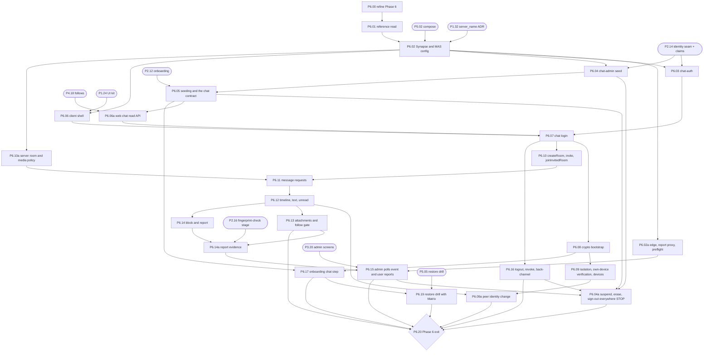
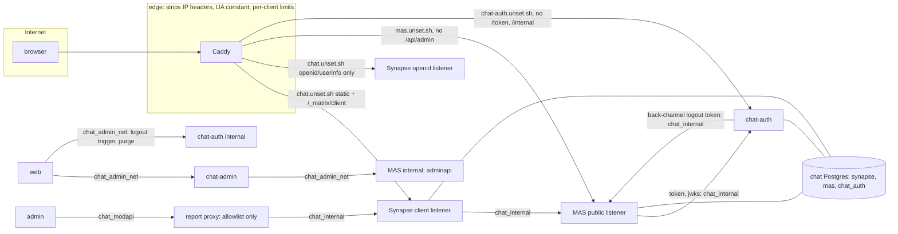
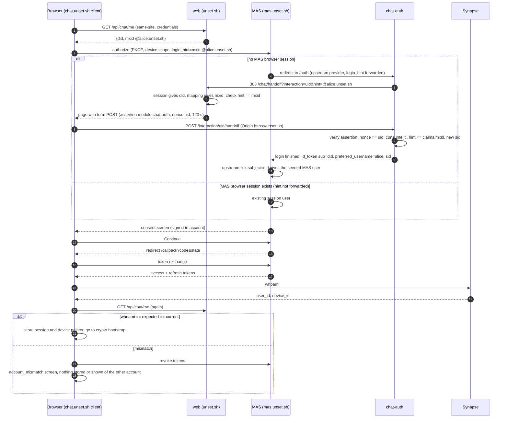
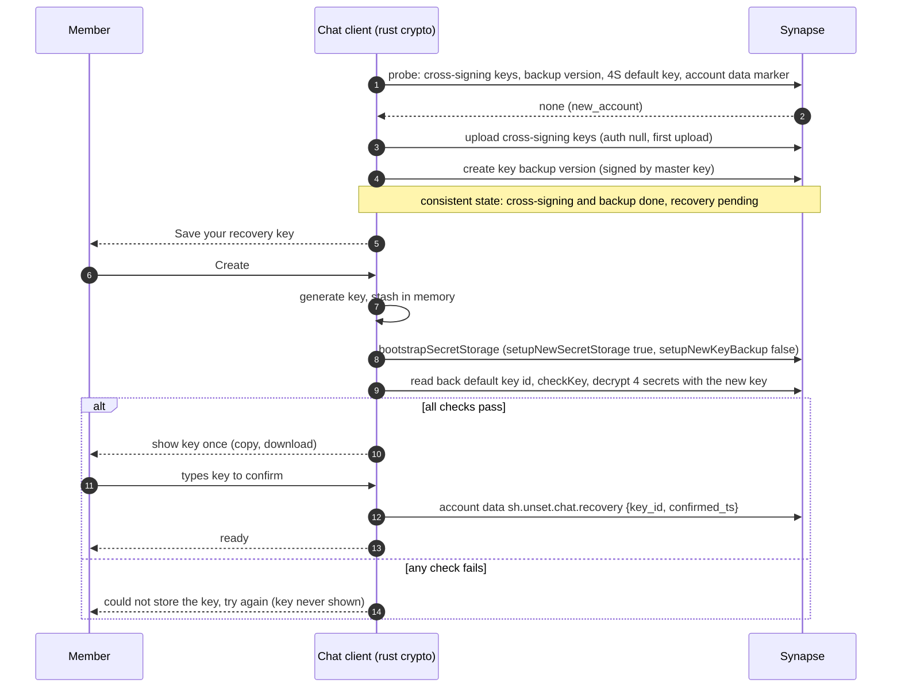
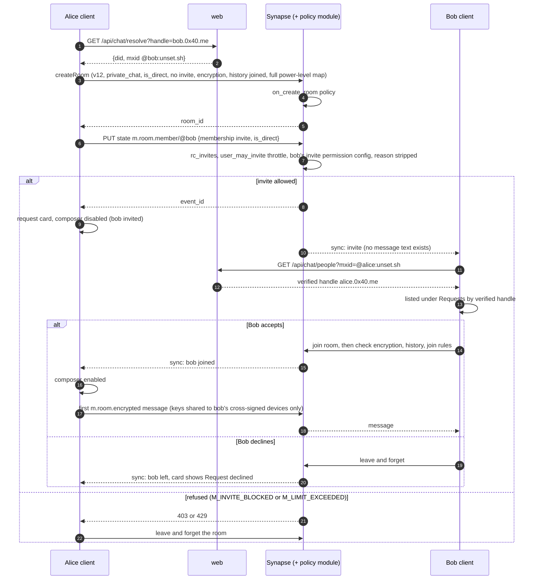
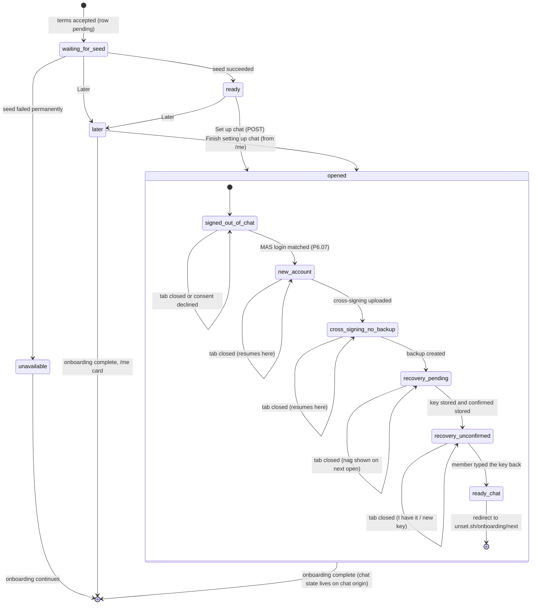

# Phase 6 — Chat

Status: **round 2 plus the editor pass (2026-10-03).** Planning only. Source of truth: `../unset-sh-rebuild-plan.md` §2 rules
17–21 and the chat defects, §5.1 ("chat is not part of this app"), §5.2, §5.6 (as revised 2026-10-03 03:02Z with the
round-1 review's chat facts), §5.7, §5.8, §6, §6.1, §8 Phase 6, §11 Q4. Supporting: `reviews/r1-phase-6.md` (round 1,
applied here; see "Round 2 changes" at the end), `reviews/fable-review/05-chat-matrix.md`, `reviews/02-chat.md`, the
prototype's vault notes, and Alex's `../engineering/architecture-instructions.md` (principles 1–23).

**Goal.** Every unset.sh member can send every other member an end-to-end encrypted 1:1 message from a client on
`chat.unset.sh`, through a message request (invite only, no text until accepted), with recovery, own-device
verification, a device list without location, full logout, block, report with checked evidence, and attachments
behind the follow gate. Chat runs beside the core: its own origin, keys and sessions, joined to the app only by the
identity seam (P2.14), the `did↔mxid` mapping, a few read-only `web` endpoints, and the small chat contract below.

**Exit criteria (P6.20).** Two members exchange encrypted DMs through a request; one recovers on a new browser with
the recovery key and reads history; the device list shows no location; attachments are refused in unencrypted rooms,
refused by Synapse when they are plaintext media, and hidden from people you don't follow; event and user reports
reach `admin`, attachment evidence verified as sent by the reported member; Synapse and MAS hold no client IP and no
client User-Agent; chat cold load ≤3.5 MB gzipped, first room list ≤3 s warm and ≤15 s cold; axe zero violations in
both themes and both languages; a manual keyboard pass; the restore drill passes with the Matrix data (P6.19).

**No Element Web fallback (Alex answer 53, 2026-10-03 16:57Z, reversing the fallback half of plan decision 11).**
Only our own chat client ships on `chat.unset.sh`; there is no branded Element build, no `chat-element` profile and no
fallback step (the former P6.18 is dropped; its id is retired). Element, cinny and hydrogen stay **sources to read** for
protocol behaviour (README invariant 12). Members may still use a third-party Matrix client through dynamic
registration; the server-side rules (P6.10a) bind those clients.

**Depth of detail (README "Depth of detail", Alex 2026-10-03: "detail by risk"; principles 13–15).** This phase keeps
in full what is expensive or impossible to reverse, and marks everything else as a **reviewed hypothesis** that
P6.00 re-reads against what Phases 1–5 actually built before any other Phase 6 step starts. In full:
- room settings fixed at creation (encryption, `history_visibility`, join rules, power levels, room version) — P6.10,
  P6.10a; a wrong value here cannot be repaired for existing rooms (vault `invite-exports-room-history`);
- identity mapping (`did↔mxid`, MAS upstream link, localpart rules) — P6.03, P6.04, P6.05;
- crypto, recovery-key handling and isolation — P6.08, P6.09, P6.09a, P6.13 (attachment crypto);
- erasure, suspension and sign-out reaching chat — P6.04a, P6.16;
- the security boundaries around `chat-admin`, the Synapse admin path and the edge — P6.02, P6.02a, P6.04, P6.15;
- report evidence (PII, legal hold, RoPA) — P6.14a;
- every stop point and every "Done when" test.
Each step's Algorithm heading says which it is: "(full detail: …)" or "(reviewed hypothesis; P6.00 refines)". A
hypothesis algorithm is the reviewed starting point, not a contract: the building agent may change it within the
step's Goal, Outputs and tests, following principle 16 (fix locally; stop for review before changing a boundary,
public contract or data model).

**The chat contract (principles 2, 4, 5, 17).** The app talks to chat through one small interface; rooms, events,
MXIDs, MAS and Synapse stay inside adapters.
```ts
// domains/messaging/chat.ts — what `web` (onboarding, erasure, sign-out, account state) may know about chat.
type ChatAccountStatus = "none" | "pending" | "ready" | "unavailable";
interface Chat {
  requestAccount(tx: Tx, did: Did): Promise<void>;           // P6.05: called by onboarding's terms step
  accountStatus(did: Did): Promise<ChatAccountStatus>;        // P6.17, /me card
  endSessions(did: Did, scope: { kind: "this_browser"; appSessionRef: string } | { kind: "everywhere" }): Promise<void>; // P6.16, P6.04a
  setSuspended(did: Did, suspended: boolean): Promise<void>;  // P6.04a
  erase(did: Did): Promise<"done" | "pending">;               // P6.04a, the `hooks.chat` entry of eraseDid's `eraseHooks` (P3.07)
}
```
- The only implementation is `MatrixChat` in `infrastructure/matrix/chat/` (seed runner, `chat-admin` and `chat-auth`
  clients, the `/api/chat/*` routes and the handoff page, whose caller is the chat origin and which therefore speak
  MXIDs). It is wired once in `web`'s composition root (principle 7); no registry, no plugin (principle 3).
- Every method is a durable job or a single row write: a chat outage never fails a core request or transaction
  (principle 17). `endSessions`, `setSuspended` and `erase` enqueue and return.
- Inside the chat client the same split holds: screens use `apps/chat/core/` types (`Conversation`,
  `Person { address, handle? }`, `Message`, `Request`, `Device`, `CryptoState`); only `apps/chat/matrix/`
  imports `matrix-js-sdk`, so an SDK upgrade stays local.
- `admin` needs no new interface: chat reports become ordinary `app.report` rows, `source = 'chat'` from our own
  client (P6.14a's route) and `source = 'matrix'` from other Matrix apps (the P6.15 poller is that adapter); both land
  in the P3.20b report inbox (Alex answer 50 revised).
- Guard (principle 22), added in P6.05 and extended by each step: dependency-cruiser rules
  `matrix-stays-in-chat-adapter` (no file outside `infrastructure/matrix/chat/` and `interfaces/http`'s composition root
  imports from `infrastructure/matrix/chat/`) and `sdk-only-in-matrix-adapter` (no file in `apps/chat` outside
  `matrix/` imports `matrix-js-sdk`; `apps/chat/matrix/` is the browser runtime's one adapter folder in P0.05's
  `SDK_ADAPTERS` table, guideline §1).
The contract grows only when a real requirement shows another capability belongs in it (principle 4).

**Pins used in this phase.** `matrix-js-sdk` **43.0.0** exactly; MAS **1.26.x** (round-1 review read 1.26.0,
`19fa53b`); Synapse **1.162.x** (review read 1.162.0, `4f55240`); element-web **v1.12.29** (the newest release; the
review read develop `3af38b8` just after it); cinny v4.12.7; spec **v1.18**. The exact patch releases go in the P6.01
ADR. The prototype pinned `^42.0.0`; the vault's SDK line numbers are v42.

**Reference rule (repo chat rule, README invariant 12).** Every step that implements Matrix behaviour carries a
`Reference:` line inside **Inputs**. The round-1 review read the Element, cinny, SDK 43, MAS 1.26 and Synapse 1.162
sources first-hand and verified or corrected the citations; this file now uses its locations. Paths: Element under
`element-web/apps/web/src/` (written `E:`), SDK 43 tarball under `package/` (`SDK:`), Synapse repo root (`S:`), MAS repo
root (`M:`). What is still unverified is marked **"to P6.01"**: the spec URLs (v1.18), the vault's attachment-crypto
SDK lines (v42), and line numbers for Element and cinny files that the review confirmed exist. A citation that
contradicts a step stops that step.

**Hostnames (plan gap, editor note 1).** The plan's domain table names only `chat.unset.sh`. This book assumes: the
client bundle and the Synapse client API on `chat.unset.sh` (`/_matrix/client/*` routed to Synapse), MAS on
`mas.unset.sh`, `chat-auth` on `chat-auth.unset.sh`. All are host-only, cookie-isolated, and none is on the app origin.
`server_name` comes from the P1.32 ADR: `unset.sh` with `.well-known` delegation to `chat.unset.sh` (P1.32 Q1, settled:
answered by Alex 2026-10-03 11:50Z), so MXIDs read `@<opaque localpart>:unset.sh` (decision 42; `@alice:unset.sh` in
examples below stands for an opaque id).

## Interfaces this phase assumes from earlier phases

| Step | Interface assumed (name it exactly; if the step built something else, adapt the call, not the semantics) |
|---|---|
| P1.02 | `loadConfig(schema)`; boot fails on a missing key; values never printed |
| P1.03 | error catalog `ErrorCode`, `Result<T, E>` = `{ ok: true, value } \| { ok: false, error }` |
| P1.06 | `RateLimiter.consume(policy, { ip } \| { did }) → { ok: true } \| { ok: false, retryAfterS }`: one policy per route with an IP slot (`rateLimitIp`, before the session) and a DID slot (`rateLimitDid`, after it); 429 `http.rate_limited` |
| P1.07 | CSRF gate as written: exact app Origin, no exemption, `same-site` denied. **Phase 6 needs nothing from it**: the `/api/chat/*` reads are GETs, and the evidence upload authenticates with a Matrix bearer token (P6.14a) |
| P1.08 | `buildCsp(group)` returns a header string for any route group, including a statically served group (`chat-client`), consumed by the edge config generator |
| P1.13 | DID-column registry (every new DID column registered with its erasure strategy) |
| P1.14 | `seal(plaintext, context)` / `unseal(sealed, context)` with `context = sealContext(column, rowKey)` from `sealed-columns.json`; plaintext ≤1 MiB; larger data through `sealStream` / `unsealStream` (format `s1c`) |
| P1.14a | `sealTo("legal_hold", plaintext, context)` and `sealToStream("legal_hold", source, context, maxBytes)`: encrypt-only to the legal-hold key; no decrypt code exists in the repository (owners open records offline) |
| P1.15 | `appendAudit(tx, { action, outcome, actorDid?, actorKey?, target?, reason?, case?, jti?, requestId?, receipt?, pii? })`; the lane comes from the action, never from the caller; each new action is added to the closed `audit.actions` list (with its writer role) by the step that first writes it. No per-user sign-in or session events (aggregate counters only) |
| P1.16 | `claim(db, purpose, { issuer, externalId }, expiresAt) → boolean` (first use true; a `jti` is unique per issuer), plus `issue`/`consume`; `Purpose` is a closed union with a max TTL each; the schema is reusable against another database (`chat_auth`) |
| P1.18 | `guardedFetch` (net-guard, on `undici.request`, P1.18a policies, P1.18b proxy mode) for every outbound call from `web`; Phase 6 uses it with a fixed host and one path only |
| P1.19 | `t(key)` and per-bundle EN/FR catalogs with the missing/unused-key checks |
| P1.24 | UI kit components and icon wrapper; new components stop for Alex |
| P1.32 | ADR value `matrix.server_name` (config key `MATRIX_SERVER_NAME`) |
| P2.01/P2.02 | `resolveHandle(handle) → did`, `verifyHandle(did) → { handle, verified }` |
| P2.03 | `getSession(req) → { did, sid } \| null` |
| P2.08 | `POST /logout` and `POST /logout/everywhere` as written; **no sign-out hook exists**. P6.16 adds one call to `chat.endSessions` after the session row is destroyed (routed to the editor as a P2.08 change) |
| P2.12 | onboarding state machine with a `chat` placeholder step: `onboarding.current(did)`, `onboarding.advance(did, step)`, hook `onTermsAccepted(did, tx)` |
| P2.14 | As written (`phase-2.md` P2.14): `mintModuleAssertion(did, moduleId, nonce)`, 60 s TTL, no custom claims; `verifyModuleAssertion(token, { audience, expectedNonce, keys, consumeJti, now })`; `app.module_account(module, did, account_ref, created_at)` with `moduleAccounts.link(tx, module, did, ref)`, `byDid`, `byRef`. **Phase 6 needs the extension in F8.1** (routed to phase-2's writer): `mintModuleAssertion(did, moduleId, { nonce, claims })` with a reserved-claim check (no `iss`, `sub`, `aud`, `exp`, `iat`, `jti`, `nonce` override) and a per-module TTL from `MODULES` (≤120 s); `verifyModuleAssertion` returns the claims. Modules `chat-auth` and `chat-admin` are two entries in the fixed `MODULES` list in `web`'s composition root (decision 25) |
| P2.16 | the fingerprint-check stage: `fingerprintGate.check(did, luma)` (image entry) and `fingerprintGate.checkHashes(freezeDid: Did | null, hashes)` (positional and first, so no caller can leave it out; `null` freezes no one) (for callers that hashed with P2.16b themselves, such as P6.14a), both `→ { kind: "clear", hashes, checkedBy } \| { kind: "blocked" } \| { kind: "unavailable" }` (never "match"; there is no other check path) over the `FingerprintCheck` interface (`check(hashes, { timeoutMs })`; PDQ computed locally, P2.16b). Its fake runs until **P5.07b** adds the real Arachnid client; production refuses to boot without the real check (Alex 02:58Z, decision 23). PDQ only: no MD5, no TMK; classifications hyphenated (`harmful-abusive-material`, `no-known-match`) |
| P3.07 | `eraseDid`: `core.erase_did` plus the `core.erase_outbox` row; `web`'s composition root passes a fixed `eraseHooks` list (`{ name, erase(did) }`; no registry, no `registerEraseHook`). Chat is the `hooks.chat` entry: `chat.erase(did)` (P6.04a) returns `"pending"`, and its job calls `core.erase_hook_mark(did, 'chat', 'done')` after its last step. Material under an open legal hold is kept and the rest erased; the outcome is `partially_erased_legal_hold` and the held part finishes when the hold closes (global resolution 3) |
| P3.15/P3.20 | `app.report` (closed category list, `text` revealed via `mod.reveal_report`), the `mod.report_list` view and the report list screen; P6.15 adds a `source` column and a definer for ingest |
| P3.19 | per-action WebAuthn signing for reveals |
| P4.04 | `enqueueJob(kind, payload)` and the worker handler registry (no-network compute container) |
| P4.07 | the one legal-hold design: one table, objects sealed with `sealTo` to the legal-hold key, the clock on `pds-admin` (one year after notification), no moderator view; the `preserve.*` verbs are P3.16c. Images enter it through the image entry point built in **P5.07b**; this file calls that entry point `openAbuseCase({ source, evidenceRef })` and P6.00 adopts its real name |
| P4.18 | `followState(viewerDid, subjectDid) → { viewerFollowsSubject, subjectFollowsViewer }` (if P4.18 exposes only `counts(did)` and "follows you", P6.06a adds this reader in P4.18's module) |
| P5.02 | compose profiles and per-container networks; this phase adds the `chat` profile |
| P5.04/P5.05/P5.06 | backup inventory file, drill script, secret inventory |
| P5.07b | the real Arachnid client behind `FingerprintCheck`, the image transmission buffer and the image legal-hold entry point |
| P5.10 | edge rate limiting: each client limited in memory at the edge (our Caddy image with `caddy-ratelimit`); the edge forwards no client address to the PDS or to chat, and there is no bypass key or bypass IP (global resolution 1; provisional, Alex card queued) |

## Dependency diagram



Steps added by this file (reasons in each step): **P6.00** (README rule), **P6.02a**, **P6.04a**, **P6.06a**,
**P6.09a**, **P6.10a**, **P6.14a**.

---

### P6.00 — Refine Phase 6
Tags: [CHAT] (behaves as a [SPIKE]: a contradiction stops the steps it touches)            Depends on: Phase 5 exit (P5.13); P6.01 runs after this step (it depends on P6.00)            Plan: README "Depth of detail"; architecture principles 13–16
Where: `docs/ai/phase-6-refine.md` (the delta report); a PR against this book file through the editor (the agent never
  edits the book directly)
Size: ~0 source lines, ~300 lines of document, ~0 test lines

Added because: README "Depth of detail" gives every phase from 3 to 6 a first step that re-reads its reviewed
hypotheses against what was actually built, before any other step of the phase starts.

Goal: Bring every Phase 6 step up to date with the code, contracts and decisions that Phases 1–5 really produced, and
have the changes reviewed before P6.02 starts.

Inputs: this file; the merged code of Phases 1–5; `01-outline.md`; `plan-issues.md`; the decisions log; the Alex cards
  answered since this file was written (P6-A1–P6-A8 in the Notes).
  Reference: none of its own (P6.01, which runs after this step, owns the Matrix references).
Outputs:
  - `docs/ai/phase-6-refine.md`: one row per Phase 6 step `Step | What changed upstream | Change to the step | Kind
    (hypothesis update / contract change / boundary change) | Needs review by`.
  - A list of "contract changes" (anything in the full-detail list of the header) that go to the logic reviewer and,
    when they touch a core boundary, public contract or data model, to Alex (principle 16).
Algorithm (full detail: it gates the whole phase):
  1. For each row of "Interfaces this phase assumes", find the real symbol in the merged code. Same semantics, other
     name → note the rename. Different semantics → a contract change.
  2. Check specifically, because round 1 found drift here: P2.14's `claims` extension and `MODULES` entries for
     `chat-auth` and `chat-admin`; P2.08's sign-out path (where P6.16 calls `chat.endSessions`); P2.16's fingerprint-check
     names and whether the real Arachnid client is live (P5.07b); P4.07/P5.07b's image legal-hold entry point; P3.07's erasure-report shape; P3.15's `app.report`
     columns and categories; P4.18's follow reader; P5.02's network names; P5.10's edge limiter; P1.13's registry API.
  3. For each step whose Algorithm is marked "reviewed hypothesis", compare it with the code it will sit beside and
     rewrite it where the surrounding code makes another shape simpler (principles 9, 12, 18). Record each rewrite.
  4. Read the answers to P6-A1–P6-A8. An answer that differs from the default taken in this file → the affected steps are
     rewritten in the delta and marked contract change.
  5. Check the chat contract (header) against what onboarding, erasure and sign-out actually need; grow or shrink it
     only on that evidence (principle 4).
  4a. **Decision 42 (Alex, 2026-10-04 21:44:49Z, ADR 0010): the `keys/query` [STOP] is lifted, decided.** Every
     member's Matrix user id is an opaque random localpart assigned at chat enrolment (P6.05), never derived from the
     handle or DID, so a key query can no longer confirm a guessed member. The refine item that remains: **how a
     verified handle is shown** for a member inside existing conversations (cost of decision 42: until this is
     settled, a private member shows as a raw id there). Three ways to choose from, with Alex when it touches a
     boundary: (a) the client resolves MXID → handle through `web`'s `people` read (P6.06a), which answers a private
     member like an unknown MXID (decision 36), so private members stay raw ids to non-followers; (b) Synapse
     displayname set to the verified handle at seeding and on handle change (public to room members); (c) show the
     handle only to people the member follows or shares a room with, through a new scoped read (needs an ADR).
  5a. Settle the step-book findings routed here (`reviews/step-book-findings-triage.md`, editor pass 2026-10-04): F-28
     (MAS, Synapse and `chat-auth` upstream answers size-capped and schema-validated in `infrastructure/matrix/`, with
     a malformed fixture per adapter); F-29 (display names and report text shown to moderators safe against bidi and
     invisible characters); and the `Threats:` heading (README step template) for each `[SEC]` step whose algorithm
     this delta settles.
  6. Send the delta to the editor and the logic reviewer; no other Phase 6 step starts until the delta is merged into
     the book.
Edge cases and failures:
  - An upstream step was never built or was dropped → the dependent Phase 6 step is marked blocked in the delta; stop.
  - An upstream security mechanism exists twice (README reuse rule 9) → report it; do not add a third use.
Done when (tests):
  - `refine-report-covers-every-step` (doc test: every Phase 6 step id has a row).
  - `refine-report-has-no-open-contract-change` (doc test: every contract-change row links a review or an Alex answer).
Reuse: none (provisional — for reuse review).
Feature ownership (decision 34, guideline §4; added 2026-10-04): the revision adds a "Feature ownership" table to this
  file: for each feature of the phase, its ownership path before any code (for example posting a video: `apps/web →
  interfaces/http → domains/content (+ domains/moderation) → infrastructure/pds, storage → PDS`), and it settles the
  `layout-map.md` open points this phase touches (resolved 2026-10-04 05:10Z; P6.00 decides whether P2.14's `verify.ts` joins the
  zero-dependency allowlist for `chat-admin`, or asks Alex). The step that lands a feature's first slice writes
  `docs/human/features/<feature>.md` (what it does, its ownership path, routes, tables, roles, the steps that built
  it). Done when (added): every feature of the phase has a row whose path uses only decision-34 folders, and
  `scripts/docs/docs.test.ts` finds `docs/human/features/<feature>.md` for every feature whose first slice has merged.
Not in this step: Matrix reference reading (P6.01); any code.
Diagram: none.

---

### P6.01 — Reference read
Tags: [CHAT] (behaves as a [SPIKE]: a contradiction stops the step it touches)            Depends on: P6.00            Plan: §5.6 "designed from how Element and the spec do it", README invariant 12, prototype `CLAUDE.md` chat rule
Where: `docs/ai/chat/references.md` (the table), `docs/human/decisions/NNNN-chat-pins.md` (pins and clone commits), `docs/ai/chat/references.test.ts`
Size: ~0 source lines, ~450 lines of document, ~60 test lines

Goal: Before any chat code, record for every chat behaviour in this phase the client file:line, the SDK file:line and
the spec URL it follows, starting from the locations the round-1 review verified and confirming the rest.

Inputs: this file; `reviews/r1-phase-6.md` "Citations verified or corrected" (read first-hand on 2026-10-02/03 against
  element-web develop `3af38b8`, cinny v4.12.7 `8967c13`, the `matrix-js-sdk` 43.0.0 npm tarball, MAS 1.26.0 `19fa53b`,
  Synapse 1.162.0 `4f55240`); the prototype's vault notes (`invite-exports-room-history`,
  `bootstrap-secret-storage-needs-setupnewsecretstorage`, `matrix-room-access-control`, `matrix-encrypted-file-invariants`,
  `matrix-device-trust-and-isolation-posture`, `matrix-key-backup-and-secret-storage`, `chat-opens-wrong-mas-account`,
  `peer-provisioning-needs-mas-not-synapse`); review 05 §2 and §4.
  Reference: spec https://spec.matrix.org/v1.18/client-server-api/ ; Synapse docs https://element-hq.github.io/synapse/latest/ ;
  MAS docs https://element-hq.github.io/matrix-authentication-service/ (to P6.01: the URLs themselves).
Outputs:
  - Clones outside the repo, via `graphify clone` (re-clone if absent), shallow, at release tags:
    `element-hq/element-web` **v1.12.29** (or the newest release at build time; source under `apps/web/src`, not
    `src/`), `cinnyapp/cinny` v4.12.7, `element-hq/hydrogen-web` v0.5.1, `element-hq/synapse` v1.162.x,
    `element-hq/matrix-authentication-service` v1.26.x. `matrix-js-sdk@43.0.0` unpacked from the npm tarball with
    `--ignore-scripts`, integrity hash recorded.
  - `docs/ai/chat/references.md`: one row per behaviour:
    `Behaviour | Step | Element file:line | cinny file:line | SDK 43 file:line | Server file:line | Spec URL | Our decision | Divergence and why`.
  - ADR: exact versions, tag commit SHAs, SDK tarball integrity, date read, and the experimental Synapse callbacks
    pinned (F6.6: `check_event_allowed` is "very experimental", `S:docs/modules/third_party_rules_callbacks.md:22-25`).
Algorithm (full detail: the reference rule is non-negotiable):
  1. Clone each repository at its tag; record the commit SHA. A missing tag → the newest release tag at or before the
     build date, recorded in the ADR.
  2. Unpack `matrix-js-sdk@43.0.0`; record `sha512` integrity. Unavailable → stop and ask (the pin is the plan's).
  3. Seed the table with every row of the review's citation table (status "verified r1"). For each, re-read the
     line at the pinned tag (the review read element-web develop, not v1.12.29); a moved line is updated; a changed
     behaviour is an open contradiction.
  4. For the remaining items (below), in order: grep Element `apps/web/src` for the SDK symbols; then cinny `src`;
     then hydrogen `src` only when the question is what the SDK does underneath; an empty grep → check the source root
     before concluding "not implemented"; read the spec section; read the server source for server behaviour.
  5. Remaining items (each one row at least):
     - spec v1.18 URLs used in this file (every `#anchor`);
     - line numbers for the Element and cinny files the review found to exist (session lock, boot order,
       `SecurityManager.ts`, `SetupEncryptionStore.ts`, `ChangeRecoveryKey.tsx`, `SessionManagerTab.tsx`,
       `VerificationShowSas.tsx`, `UserIdentityWarning.tsx`, `RoomPreviewBar.tsx`, `InviteDialog.tsx`,
       `TimelinePanel.tsx`, `EventTile.tsx`, `MessageComposer.tsx`, `RoomNotificationStateStore.ts`,
       `DecryptionFailureTracker.ts`, `ReportEventDialog.tsx`, `ReportRoomDialog.tsx`, `UserInfo.tsx`, `DMRoomMap.ts`,
       `utils/dm/`; cinny `client/initMatrix.ts`, `pages/client/inbox/Invites.tsx`, `features/room/RoomTimeline.tsx`,
       `RoomInput.tsx`);
     - where Element now revokes tokens (the old `stores/oidc/OidcClientStore.ts` is gone; SDK `src/oauth/index.ts:243`
       `revokeToken` is the SDK side);
     - the vault's attachment-crypto SDK lines (`@types/media.d.ts`, `client.d.ts:1865`, v42) at v43;
     - MAS back-channel logout (read in the editor pass at MAS `19fa53b`; re-read at the pinned tag): the action is
       fixed per provider (`M:crates/handlers/src/upstream_oauth2/backchannel_logout.rs:247-313`), `sub` and `sid` only
       narrow which upstream sessions match (`:233-243`); MAS requires `exp`, `iat`, `sub` or `sid`, the events claim and
       no `nonce` (`:207-230`) and checks no `jti`; the endpoint is `POST /upstream/backchannel-logout/{provider_id}`
       (`M:crates/router/src/endpoints.rs:795-814`) on the `human` resource (`M:crates/handlers/src/lib.rs:333,456-457`);
     - MAS CLI or admin API for creating the reports service account and issuing its personal session (P6.15 [ALEX]
       runbook; `M:crates/handlers/src/admin/v1/personal_sessions/add.rs:75-80,125`);
     - Synapse's MAS introspection cache TTL (how long a locked user's token keeps working, P6.04a): 2 minutes
       (`S:synapse/api/auth/mas.py:140-146`, read in the editor pass; re-read at the pinned tag);
     - the OpenID token path used by P6.14a: `POST /_matrix/client/v3/user/{userId}/openid/request_token`
       (`S:synapse/rest/client/openid.py:70-105`, authenticated by `get_user_by_req`, so it works under MAS),
       `GET /_matrix/federation/v1/openid/userinfo` served by an `openid`-only listener (`S:synapse/app/homeserver.py:223-226`;
       `S:synapse/federation/transport/server/__init__.py:213-262`), SDK `getOpenIdToken` (`SDK:src/client.ts:5981`),
       Element's use for widgets (`E:stores/widgets/ElementWidgetDriver.ts:652,663`); spec URLs for both endpoints;
     - the `check_event_allowed` call site and its fail-closed wrapper (`S:synapse/handlers/message.py:1435-1452`,
       `S:synapse/module_api/callbacks/third_party_event_rules_callbacks.py:255-313`) against the stable
       `check_event_for_spam` (`S:synapse/handlers/message.py:1195`, non-member events only) (P6.10a);
     - the unit of `UserInfo.creation_ts` (`S:synapse/module_api/__init__.py:738-748`, P6.11);
     - the request shape `check_media_file_for_spam` receives (`S:docs/modules/spam_checker_callbacks.md:382-411`, P6.10a).
  6. A step in this file that says X where the references say not-X → write it under "Open contradictions" and mark
     the step **blocked**; the book is revised before that step is built.
  7. Send the corrections to the editor (this step never edits the book); open the PR with the document, the ADR and
     the check test.
Edge cases and failures:
  - Network refused for cloning → stop; ask Alex for network access (no step proceeds on unverified citations).
  - v1.12.29 differs from develop `3af38b8` on a cited behaviour (for example `history_visibility: invited` on DMs) →
    record the release's behaviour.
  - MAS back-channel logout cannot target one browser session from `chat-auth` → P6.16 blocked; P6-A4 is re-asked.
  - No MAS CLI or admin path issues a personal session for the service account → P6.15 blocked; stop. No temporary
    admin credential is created to work around it.
Done when (tests):
  - `references-cover-every-chat-step`: every step id P6.02–P6.17 that implements Matrix behaviour has ≥1 row with a
    spec URL and at least one client, SDK or server `file:line`.
  - `references-have-no-open-markers`: no "to verify" or "to P6.01" text and no row with an empty decision.
  - `pins-match-lockfile` (enabled once P6.06 adds the dependency): `matrix-js-sdk` in the lockfile is exactly the ADR
    pin; the Synapse (with module) and MAS image digests in `compose.yaml` match the ADR versions.
Reuse: prototype vault notes above → LESSON (their line numbers are v42) (provisional — for reuse review); review 05
  §4 and the round-1 citation table → LESSON (provisional — for reuse review).
Not in this step: any code or config (P6.02 onward). Fixing a prototype note (the prototype is read-only).
Diagram: none.

---

### P6.02 — Synapse and MAS configuration
Tags: [SEC] [CHAT]            Depends on: P6.01, P5.02, P1.32            Plan: §5.6 engine bullets and "no IP logs", §5.2, §6 logging, §2 rule 21
Where: `deployment/chat/synapse/homeserver.yaml`, `deployment/chat/synapse/log.config`, `deployment/chat/mas/config.yaml`,
  `deployment/chat/postgres/init.sql`, `deployment/compose.yaml` (`chat` profile), `interfaces/http/routes/well-known-matrix-client.ts`,
  `tests/integration/deployment/chat/config.test.ts`
Size: ~220 config lines, ~30 source lines, ~200 test lines

Goal: Run Synapse 1.162 and MAS 1.26 with federation off, the fixed `server_name`, room version 12, no profile
spoofing, and `chat-auth` as the only upstream provider, with the delegation document served by `web`.

Inputs: P1.32 ADR (`server_name` = `unset.sh`, settled); P5.02 compose and networks; secret store files.
  Reference: Synapse config manual https://element-hq.github.io/synapse/latest/usage/configuration/config_documentation.html
  (to P6.01: URL); `S:docs/usage/configuration/config_documentation.md:1028` (`allow_per_room_profiles`), `:2925`
  (`enable_set_displayname`), `:2938` (`enable_set_avatar_url`), `:1879-1907` (`rc_invites`); `S:synapse/config/server.py:179`
  (default room version 12); `S:synapse/storage/databases/main/client_ips.py:476-512` (IP rows), `S:synapse/http/site.py:595-597,
  645-648` (access log); `S:synapse/app/homeserver.py:183-197` (admin API mounted on every client listener);
  MAS `M:crates/config/src/sections/http.rs:46-54` (`trusted_proxies` default trusts RFC 1918),
  `M:crates/config/src/sections/upstream_oauth2.rs:488-502` (`on_backchannel_logout`), `:697-735`
  (`additional_authorization_parameters`; `forward_login_hint` is deprecated), `M:docs/config.schema.json` (no consent
  skip); MAS policy `M:policies/authorization_grant/authorization_grant.rego:46-52,64-67` (client credentials get only
  `urn:mas:admin`); spec https://spec.matrix.org/v1.18/client-server-api/#getwell-knownmatrixclient (to P6.01).
Outputs:
  - Synapse: `server_name` = ADR value; `public_baseurl: https://chat.unset.sh/`; **one** client listener on
    `chat_internal` with `resources: [client]` and `x_forwarded: false` (Synapse mounts `/_synapse/admin` on every client
    listener, so no second client listener is added; separation is the edge deny and the report proxy, P6.02a), and
    **one `openid`-only listener** on `chat_internal` (`resources: [openid]`, `x_forwarded: false`), which serves only
    `/_matrix/federation/v1/openid/userinfo` for P6.14a (`S:synapse/app/homeserver.py:223-226`; it mounts no admin API,
    which comes only with `client`, `:183-197`); `default_room_version: "12"`;
    `federation_domain_whitelist: []`; `trusted_key_servers: []`; no federation resource; `serve_server_wellknown: false`;
    `allow_public_rooms_over_federation: false`; `allow_public_rooms_without_auth: false`;
    `room_list_publication_rules: [{ action: deny }]`; `user_directory.enabled: false`; `presence.enabled: false`;
    `require_auth_for_profile_requests: true`; `limit_profile_requests_to_users_who_share_rooms: true`;
    `allow_profile_lookup_over_federation: false` (defence in depth with federation off; default `true`,
    `S:synapse/config/federation.py:57-58`; refusal at `S:synapse/handlers/profile.py:848-853`; ADR 0004);
    **`allow_per_room_profiles: false`, `enable_set_displayname: false`, `enable_set_avatar_url: false`** (F5: no
    spoofed names or avatars; MAS still sets the display name it imports); `url_preview_enabled: false`;
    `max_upload_size: 25M`; `enable_authenticated_media: true`; `encryption_enabled_by_default_for_room_type: all`;
    `forget_rooms_on_leave: true`; `allow_guest_access: false`; `user_ips_max_age: 1d`; `report_stats: false`;
    `rc_invites` (values in P6.11); `password_config.enabled: false`; `matrix_authentication_service: { enabled: true,
    endpoint: http://mas:8080/, secret_path }`; Postgres over `chat_db` with a per-database role and a password file
    (never trust auth); `modules:` entry for the P6.10a package.
  - `log.config`: logger `synapse.access.http` with no handlers and `propagate: false`; root at INFO to stdout.
  - MAS environment `RUST_LOG=info,mas_handlers::upstream_oauth2::backchannel_logout=warn` (`M:docs/reference/cli/README.md:7`):
    MAS logs each back-channel logout's `sub` (the DID) and `sid` at info (`M:crates/handlers/src/upstream_oauth2/backchannel_logout.rs:245`).
  - MAS: `http.public_base` and `issuer` = `https://mas.unset.sh/`; `http.trusted_proxies: []` **written explicitly**
    (the default trusts all of RFC 1918); public listener `resources: [discovery, human, oauth, graphql, assets]` (no
    `compat`); internal listener on `chat_admin_net` with `[health, adminapi]`; `passwords.enabled: false`;
    `account.password_registration_enabled: false`; email, password, display-name change and self-deactivation off;
    `rate_limiting` left at defaults (its limiters cover password login, recovery, registration, email and device
    codes, none of which our traffic uses, F16; the real limits are at the edge, P6.02a); `branding` (service name, ToS,
    privacy URIs); upstream provider `chat-auth` (P6.03): `discovery_mode: disabled`, `pkce_method: always`,
    authorization endpoint public, token and JWKS endpoints on the internal network,
    `additional_authorization_parameters: { login_hint: "{{ params.login_hint }}" }`,
    `on_backchannel_logout: logout_browser_only` (P6.16), `claims_imports`: `subject {{ user.sub }}`, `localpart`
    `require` from `{{ user.preferred_username }}` with `on_conflict: fail`, `displayname` `force` from `{{ user.name }}`,
    `skip_confirmation: true`; static clients: `unset-chat` (public, `none` auth, redirect `https://chat.unset.sh/callback`)
    and `chat-admin` (confidential, client credentials, `urn:mas:admin`). **No `admin-synapse` client** (F1: MAS
    refuses `urn:synapse:admin:*` to client credentials and Synapse refuses user-less tokens; the reports credential is
    the service account in P6.15, kept: Alex answer 50 revised, 2026-10-03 16:55Z). Dynamic client registration left at the MAS default (plan §5.6; editor note 15).
  - Postgres (chat): databases `synapse` (`C` collation, required by Synapse), `mas`, `chat_auth`, each with its own
    role and password file.
  - Networks: `chat_internal` (edge, synapse, mas public, chat-auth public, report proxy upstream side), `chat_db`
    (synapse, mas, chat-auth, postgres), `chat_admin_net` (web, chat-admin, MAS internal listener, chat-auth internal
    listener), `chat_modapi` (admin, report proxy only).
  - `web` route `GET /.well-known/matrix/client` → `{"m.homeserver":{"base_url":"https://chat.unset.sh"}}`,
    `Access-Control-Allow-Origin: *` (the spec requires it), `Cache-Control: public, max-age=3600`.
Algorithm (full detail: settings fixed for the life of the server):
  1. Read `MATRIX_SERVER_NAME` from config; it must equal the P1.32 ADR value.
  2. Render Synapse and MAS config from templates with only file paths for secrets; no secret value in any file in
     the repository.
  3. Start order in compose: `postgres` healthy → `mas` (runs its migrations; health on the internal listener) →
     `synapse` (health `/health`) → `chat-auth` → `chat-admin` → report proxy → edge routes enabled. A failed health
     check stops the next service (`depends_on: condition: service_healthy`).
  4. On first boot only: Synapse generates its signing key into the secret volume if absent; the preflight (P6.02a)
     refuses a second generation when the database already exists.
  5. Image: in development, the upstream Synapse image pinned by digest; from P6.10a on, the CI-built image with the
     policy module (the preflight refuses a production chat deploy without it).
Edge cases and failures:
  - MAS cannot reach chat-auth's internal token endpoint → MAS login fails closed with MAS's error page; health board
    alert (P3.20 health board, chat row).
  - Synapse's per-IP limits now see one address (the edge) → only per-user limits (`rc_message`, `rc_invites`,
    `rc_room_creation`) are relied on inside Synapse; per-IP limits are at the edge (P6.02a).
  - `chat.unset.sh` serves the client and `/_matrix/client/*` from one host → the client CSP's `connect-src 'self'`
    covers the homeserver.
  - Postgres collation not `C` → Synapse refuses to start; `init.sql` creates it correctly; a test checks.
  - A member's display name can no longer be changed in chat → it follows the unset.sh profile name through MAS's
    `force` import at each login (acceptable; the request card never shows it anyway, P6.11).
Threats: the Matrix homeserver and its auth server.
  - E Federation or a second listener exposing the server → federation off; one client listener, no forwarded-header
    trust (`synapse-federation-off`, `synapse-single-client-listener-no-forwarded-trust`).
  - S A member impersonating another by display name or avatar → profile changes off (`synapse-no-profile-spoofing`).
  - I Addresses, presence or directory data kept or exposed → one-day IP retention, no access log, privacy defaults
    (`synapse-ip-retention-one-day`, `synapse-access-log-dropped`, `synapse-privacy-defaults`,
    `mas-backchannel-log-has-no-did`).
  - E Password login or registration bypassing atproto identity → off (`mas-passwords-and-registration-off`).
Done when (tests):
  - `synapse-federation-off`: whitelist `[]`, `trusted_key_servers` `[]`, no `federation` resource.
  - `synapse-single-client-listener-no-forwarded-trust`: exactly one listener with `client`, at most one other listener
    whose resources are exactly `[openid]`, every listener `x_forwarded: false`.
  - `synapse-openid-listener-serves-only-userinfo` (dev stack): on the `openid` listener, `GET
    /_matrix/federation/v1/openid/userinfo` answers and `/_synapse/admin/v1/server_version`, `/_matrix/client/versions`
    and `/_matrix/federation/v1/version` do not.
  - `mas-backchannel-log-has-no-did` (dev stack): after a back-channel logout, MAS's log holds no `did:` string.
  - `synapse-ip-retention-one-day`: `user_ips_max_age == "1d"`.
  - `synapse-access-log-dropped`: `synapse.access.http` has no handlers and `propagate: false`.
  - `synapse-privacy-defaults`: user directory off, presence off, URL previews off, profile lookups limited,
    `allow_profile_lookup_over_federation: false`.
  - `synapse-no-profile-spoofing`: `allow_per_room_profiles`, `enable_set_displayname`, `enable_set_avatar_url` all false.
  - `synapse-room-version-12`.
  - `mas-trusted-proxies-explicit-empty`, `mas-passwords-and-registration-off`, `mas-on-conflict-fail`,
    `mas-admin-api-internal-only`, `mas-login-hint-via-additional-parameters`, `mas-backchannel-browser-only`,
    `mas-no-client-credentials-other-than-chat-admin`.
  - `wellknown-matrix-client`: body, CORS header and cache header exact; `/.well-known/matrix/server` is 404.
  - `stack-boots` (dev stack): `/_matrix/client/versions` 200; Synapse's auth metadata issuer equals MAS's issuer.
Reuse: prototype `deploy/matrix/synapse/homeserver.yaml` → LESSON; REJECT `x_forwarded: true` (:25), federation
  resource (:31), Postgres trust auth (:41-42), `user_directory.search_all_users: true` (:17-19), `trusted_key_servers:
  matrix.org` (:48-49) (provisional — for reuse review). Prototype `deploy/matrix/mas/config.yaml` → LESSON;
  `claims_imports` block (:93-103) is the right shape; `trusted_proxies` RFC1918 (:13-16) REJECT in favour of `[]`;
  the static-client comments (:105-147) are a useful warning (provisional — for reuse review). Vault
  `mas-distroless-no-healthcheck` → LESSON (health on the internal listener) (provisional — for reuse review).
Not in this step: edge rules, the report proxy and preflight (P6.02a); chat-auth (P6.03); chat-admin (P6.04); the
  Synapse module and its image (P6.10a); backups (P6.19); Synapse sizing (Phase 5 hosting decision).
Diagram: see P6.02a.

---

### P6.02a — Edge rules, the Synapse report proxy, and chat preflight
Tags: [SEC] [CHAT]            Depends on: P6.02, P1.28, P1.30, P1.08, P5.10            Plan: §5.6 "no IP logs" (with User-Agent, 03:02Z), "reports" (proxy), §2 rule 21, §6 logging
Where: edge config for the three chat hosts (`deployment/edge/chat.caddy` generated from one snippet),
  `deployment/chat/report-proxy/Caddyfile` (generated), `deployment/preflight/chat.ts`, `tests/integration/deployment/chat/edge.test.ts`,
  `tests/integration/deployment/chat/report-proxy.test.ts`
Size: ~120 config lines, ~110 source lines, ~260 test lines

Added because: round 1 found P6.02 too large for one PR and the trust boundaries (edge, report proxy, preflight)
worth their own review (F22, F1, F7, F16).

Goal: Make the chat hosts forward no client IP or User-Agent, rate-limit each client at the edge, deny every admin and
federation path from outside, put an allowlisting proxy between `admin` and Synapse, and refuse any deploy that
breaks these rules.

Inputs: P6.02 config and networks; P1.28 edge config and log filter; P1.30 preflight; P1.08 CSP builder; P5.10 edge
  limiter.
  Reference: Synapse admin APIs `S:docs/admin_api/event_reports.md`, `S:synapse/rest/admin/user_reports.py:54,109`,
  `S:docs/admin_api/media_admin_api.md:42-71`, `S:docs/admin_api/user_admin_api.md:868` (delete a user's media),
  `S:synapse/rest/client/media.py:244-310` (authenticated download, any authenticated user); UA storage
  `S:synapse/storage/databases/main/client_ips.py:541,716-728`, `M:docs/topics/data-retention.md:59-66,110`; MAS
  limiters `M:crates/config/src/sections/rate_limiting.rs:17-40`; service-account admin bypass of invite rules
  `S:synapse/handlers/room_member.py:896-944` (why the proxy denies every room path).
Outputs:
  - Edge, one shared snippet applied to `chat.unset.sh`, `mas.unset.sh`, `chat-auth.unset.sh`: drop `X-Forwarded-For`,
    `X-Real-IP`, `Forwarded` and the provider's client-IP header; **overwrite `User-Agent` with the constant
    `unset-chat`** (F7; provisional, plan issue P5 — the plan records it since 03:02Z, Alex's edge-IP card is pending).
  - Edge routes: `chat.unset.sh` → static client (P6.06) and `/_matrix/client/*` → Synapse; deny `/_synapse/*`
    (admin and MAS-internal), `/_matrix/federation/*` except `GET /_matrix/federation/v1/openid/userinfo` (exact path, query key `access_token`
    only, routed to the `openid` listener, P6.14a; the edge log line for it drops the query string, P1.28 filter),
    `/_matrix/key/*`, `/_matrix/media/*` (legacy unauthenticated media), `/.well-known/matrix/server`; `mas.unset.sh` → MAS public listener, deny `/api/admin/*`;
    `chat-auth.unset.sh` → chat-auth public routes, deny `/token` and `/internal/*`; MAS's upstream back-channel logout
    endpoint `/upstream/backchannel-logout/*` is denied from outside too (only `chat-auth` posts to it, on
    `chat_internal`; path `M:crates/router/src/endpoints.rs:795-814`, served by the public `human` resource, so the
    deny is the only thing keeping it internal).
  - Edge per-client limits, kept in memory by the P5.10 limiter (our Caddy image with `caddy-ratelimit`; F16; numbers
    are a hypothesis to tune): `mas.unset.sh/authorize` and `/upstream/*` 30/min; `mas.unset.sh/oauth2/token` 60/min; `chat-auth.unset.sh/interaction/*` 30/min; `unset.sh/api/chat/*` (in
    `web`'s own limiter, P6.06a) and `/_matrix/client/*` 600/min; `chat.unset.sh/_matrix/federation/v1/openid/userinfo` 60/min; over the limit → 429.
  - Report proxy (F1): a Caddy container on `chat_modapi` (listening) and `chat_internal` (upstream to Synapse) that
    passes only, by method and exact path pattern:
    `GET /_synapse/admin/v1/event_reports`, `GET|DELETE /_synapse/admin/v1/event_reports/{id}`,
    `GET /_synapse/admin/v1/user_reports`, `GET|DELETE /_synapse/admin/v1/user_reports/{id}`,
    `GET /_synapse/admin/v1/media/{server}/{mediaId}`, `GET /_matrix/client/v1/media/download/{server}/{mediaId}`,
    `DELETE /_synapse/admin/v1/users/{userId}/media` (erasure, P6.04a; only for MXIDs on our `server_name`), and
    `GET /_matrix/client/v3/account/whoami` (the poller's self-check). Everything else → 403 with no body, including
    every room, membership, join, login-as, device, user-modify and registration admin path. Query strings are passed
    only for the list endpoints and only with `from`, `limit`, `dir` keys. It holds no credential.
  - Preflight `chat` checks (P1.30): see Algorithm step 4.
Algorithm (full detail: trust boundaries):
  1. Generate the edge snippet and the proxy rules from one TypeScript description (`deployment/chat/rules.ts`) so the
     tests and the config cannot drift; snapshot both.
  2. `web` never joins `chat_internal` or `chat_modapi`. Where `web` needs Synapse (checking the reporter's OpenID
     token for the evidence upload, P6.14a), it calls `https://chat.unset.sh/_matrix/federation/v1/openid/userinfo`
     through `guardedFetch` with a fixed host and one path (a second proxy site on the shared container was rejected:
     both sites would be reachable from both networks). No Matrix access token is ever sent to `web`.
  3. The CSP and header snippets come from P1.08's builder.
  4. Preflight refuses to deploy when any of these holds: `server_name` ≠ ADR; any Synapse listener has `x_forwarded:
     true`; there is more than one listener with `client`, or another listener whose resources are not exactly
     `[openid]`; a listener exposes `federation`; `federation_domain_whitelist` is not
     `[]`; `user_ips_max_age` is not `1d`; the access logger has a handler; any of `allow_per_room_profiles`,
     `enable_set_displayname`, `enable_set_avatar_url` is true; `default_room_version` is not `"12"`; MAS
     `trusted_proxies` is absent or non-empty; MAS passwords or registration are on; `on_conflict` is not `fail`; any
     MAS client other than `chat-admin` has `urn:mas:admin` (F26: a dev-only test credential never reaches
     production); a static client has `urn:synapse:admin:*`; the edge snippet does not strip the IP headers or
     overwrite `User-Agent` on any chat host; the report proxy's rule set differs from the generated snapshot; `admin`
     is attached to any chat network other than `chat_modapi`; Synapse's database `server_name` differs from the
     config; a Synapse signing key would be generated over an existing database; any secret file is missing or
     world-readable; any image is not pinned by digest; production Synapse image lacks the policy module (P6.10a); the Synapse image digest has no signed CI attestation
     that the P6.10a black-box suite passed against that exact digest (P1.27 provenance; P6.10a "experimental
     callback").
Edge cases and failures:
  - A proxy rule written as a prefix instead of an exact pattern (for example `/_synapse/admin/v1/users/` for the
    media delete) → the snapshot test fails; only the full pattern with a terminal `/media` is allowed.
  - The proxy is down → `admin`'s poller backs off and the health board shows "chat reports stale" (P6.15); nothing
    falls back to a direct route.
  - MAS's session page loses the browser and OS label because of the UA constant → accepted (we show no location anyway).
  - A third-party client's device panel prints `last_seen_ip` → it is the edge's internal address.
Threats: the chat hosts' edge and the admin path into Synapse.
  - E Admin or federation paths reachable from outside → 404 (`edge-denies-admin-and-federation-paths`).
  - E The admin service using Synapse admin powers (force-join) → proxy allow-list only
    (`synapse-admin-proxy-allowlist`, `admin-reaches-synapse-only-through-proxy`).
  - I Client IP or User-Agent reaching Synapse → stripped (`edge-strips-client-ip-headers-and-ua`,
    `device-row-holds-edge-address`).
  - D Authorization floods → edge rate limit (`edge-rate-limits-authorize`).
Done when (tests):
  - `edge-strips-client-ip-headers-and-ua` (dev stack): an echo upstream behind each chat host receives none of the
    four IP headers and `User-Agent: unset-chat` when the request carries a real one.
  - `edge-denies-admin-and-federation-paths` (dev stack): each denied path above returns 404 from outside, including
    `/_matrix/federation/v1/version`, `/upstream/backchannel-logout/<id>` and `POST` or extra query keys on the userinfo
    path; `GET /_matrix/federation/v1/openid/userinfo?access_token=…` reaches the `openid` listener.
  - `edge-rate-limits-authorize` (dev stack): a burst on `mas.unset.sh/authorize` gets 429.
  - `synapse-admin-proxy-allowlist`: each allowed method and path passes; `POST /_synapse/admin/v1/join/{room}`,
    `POST /_synapse/admin/v1/users/{id}/login`, `POST /_synapse/admin/v1/rooms/{id}/make_room_admin`,
    `PUT /_synapse/admin/v2/users/{id}`, `GET /_synapse/admin/v1/rooms`, `DELETE /_synapse/admin/v1/users/{id}` (no
    `/media`), a foreign-server media delete and an extra query key → 403.
  - `admin-reaches-synapse-only-through-proxy` (dev stack): from the `admin` container, Synapse's address is
    unreachable; the proxy is reachable.
  - `preflight-refuses-each-violation`: one fixture per Algorithm step 4 condition → refusal with its code.
  - `device-row-holds-edge-address` (dev stack, enabled after P6.07): after a test login, Synapse `devices` and
    `user_ips` and MAS sessions hold only the edge's internal subnet and the UA constant.
Reuse: prototype edge config → LESSON (provisional — for reuse review). Caddy (already the edge, P1.28) → USE for the
  proxy (provisional — for reuse review).
Not in this step: the service account and its token (P6.15); MAS and Synapse settings themselves (P6.02).
Diagram:


---

### P6.03 — `chat-auth`: atproto identity to OIDC
Tags: [SEC] [CHAT]            Depends on: P6.02, P2.14 (with the claims extension), P1.16            Plan: §5.6 bullet 3, §2 rule 19, Q4, review 05 S2, M7
Where: `interfaces/chat-auth/` (`server.ts`, `oidc.ts`, `interaction.ts`, `handoff.ts`, `login-sessions.ts`, `pages.ts`,
  `README.md`); `interfaces/http/routes/chat/handoff.ts` (the page that hands the identity over); localpart validator in
  `domains/messaging/localpart.ts`
Size: ~340 source lines (chat-auth ~250, web ~90), ~440 test lines

Goal: Be MAS's only upstream OIDC provider, issuing `sub` = DID, the stored localpart and a per-login `sid`, taking
the identity only from a `web`-minted single-use assertion bound to the MAS interaction, and refusing any sign-in
whose subject does not match the handoff or the `login_hint`.

Inputs: P2.14 `mintModuleAssertion(did, "chat-auth", { nonce, claims })` and `verifyModuleAssertion` (F8.1); `web`'s
  public JWKs; P1.16 nonce store (pointed at the `chat_auth` database); P6.02 MAS upstream provider config; the chat
  mapping (`moduleAccounts.byDid("chat", did)` and `app.chat_seed`, written by P6.05; tests insert them).
  Reference: `oidc-provider` (panva) docs for interactions and adapters; MAS SSO page (OIDC required, auto-redirect to
  a single provider); OpenID Connect Core §3.1.2.1 `login_hint`; MAS hint forwarding
  `M:crates/config/src/sections/upstream_oauth2.rs:697-735` and `login_hint_types_supported: ["mxid"]`
  (`M:crates/handlers/src/oauth2/discovery.rs:207`); the hint reaches the upstream only without a MAS browser session
  (`M:crates/handlers/src/oauth2/authorization/mod.rs:284-296`); MAS rejects a leading `_` in usernames
  (`M:crates/handlers/src/admin/v1/users/add.rs:40-56`); OpenID Connect Back-Channel Logout 1.0 `sid` claim
  (spec URL to P6.01); CSP Level 3 `form-action` on redirects (W3C).
Outputs:
  - chat-auth routes: `GET /.well-known/openid-configuration`, `GET /jwks`, `GET /auth` (provider),
    `POST /token` (internal network only), `GET /interaction/:uid`, `POST /interaction/:uid/handoff`, `GET /health`;
    internal listener routes are P6.16 and P6.04a.
  - `web` route: `GET /chat/handoff?interaction=<uid>[&hint=<mxid>]`.
  - Assertion (P2.14, module `chat-auth`, TTL 120 s): standard claims plus `nonce` = the interaction uid and
    `claims: { mxid, localpart, name, app_session_ref }`. `app_session_ref = base64url(sha256("chat-session-ref:" +
    session.idHash))` lets P6.16 end this browser's MAS session later without `chat-auth` ever holding an app session id.
  - id_token claims: `sub` (DID), `preferred_username` (stored localpart), `name`, `sid` (random, per login).
  - `chat_auth` tables: provider adapter `oidc_payload(model, id, payload, expires_at, grant_id, uid, consumed_at)`;
    `assertion_jti(jti PK, expires_at)` (P1.16 schema); `profile(did PK, preferred_username, name, updated_at)`;
    `login_session(sid PK, did, app_session_ref, created_at, ended_at NULL)` (F3; rows older than 30 days after
    `ended_at` are deleted).
  - `isValidLocalpart(s) → boolean` and `mxidFor(localpart, serverName) → string` (used by P6.04 and P6.05).
Algorithm (full detail: identity mapping):
  A. `GET /interaction/:uid` (chat-auth):
  1. `details = provider.interactionDetails(req)`; it needs the interaction cookie. Throws (absent, expired) → 400
     page "This sign-in expired. Start again from chat.unset.sh" with a fixed link; stop.
  2. If `details.prompt.name == "login"`:
     a. `hint = details.params.login_hint`. If present: strip a leading `mxid:`; it must parse as `@<localpart>:<server_name>`
        with `isValidLocalpart`; malformed → 400 `bad_login_hint`; stop.
     b. 303 to `https://unset.sh/chat/handoff?interaction=<uid>` plus `&hint=<mxid>` when present;
        `Referrer-Policy: no-referrer`.
  3. Else if `prompt.name == "consent"`: the only client is `mas` (check `params.client_id == "mas"`, else 403);
     grant `openid profile` and finish. (MAS shows its own consent; chat-auth adds none.)
  4. Else → 400 `unexpected_prompt`.
  B. `GET /chat/handoff` (web; no state change: minting a signed assertion writes nothing):
  1. `session = getSession(req)`; none → 303 `/login?return=<this URL>` (return validated by P1.09).
  2. `interaction` must match `[A-Za-z0-9_-]{16,64}` (it is also the assertion nonce, within P2.14's 16–128 charset);
     `hint`, when present, must be an MXID on our `server_name`; else 400 with an error code.
  3. `mxid = moduleAccounts.byDid("chat", session.did)`; null → `chat.accountStatus(did)`: `pending` → page "Chat is
     being set up" with a Retry link (and `runSeedFor(did)` if due, P6.05); `unavailable` or `none` → page "Chat isn't
     available for your account yet"; stop.
  4. `hint` present and `hint ≠ mxid` → 409 page `chat_account_mismatch` ("You are signed in to unset.sh as @handle;
     chat asked for another account") with a link to `https://chat.unset.sh/` (the chat client then wipes the stale
     session and signs in fresh, P6.06 step 5); stop.
  5. `name` = the member's display name from their profile (draft or published) or their verified handle; strip
     control characters; ≤64 characters. `localpart` = the localpart of `mxid` (never derived from the handle).
  6. `assertion = mintModuleAssertion(did, "chat-auth", { nonce: interaction, claims: { mxid, localpart, name,
     app_session_ref } })`.
  7. Respond 200 with a page whose CSP has **`form-action https://chat-auth.unset.sh https://mas.unset.sh`** (F19:
     the form's 303 chain continues to MAS's upstream callback), `Cache-Control: no-store`, `Referrer-Policy:
     no-referrer`: a form `POST https://chat-auth.unset.sh/interaction/<uid>/handoff` with the hidden `assertion`, a
     visible "Continue to chat" button and the auto-submit island (P1.23). Without JavaScript the user clicks the button.
  C. `POST /interaction/:uid/handoff` (chat-auth):
  1. Accept only `application/x-www-form-urlencoded`, body ≤8 KB; else 415/413.
  2. `Origin` must equal exactly `https://unset.sh`; else 403 `bad_origin`.
  3. `details = interactionDetails(req)` (cookie-bound; this is what stops a uid from another browser) → failure:
     400 expired page.
  4. `v = verifyModuleAssertion(assertion, { audience: "chat-auth", expectedNonce: uid, keys, now, consumeJti })`; any
     error (including `bad_nonce`, which replaces round 1's separate interaction check) → 403 page with the code; one
     log line in chat-auth's own log (code only, no IP); stop.
  5. `details.params.login_hint` present and (normalised) `≠ v.claims.mxid` → 403 `subject_mismatch`. This is the
     plan's "refuses a subject that does not match the handoff". It applies only when MAS had no browser session
     (MAS forwards the hint only then, F18); the stale-session case is caught by P6.07's callback check and prevented by
     P6.16's back-channel logout.
  6. `isValidLocalpart(v.claims.localpart)` and `v.claims.mxid == mxidFor(localpart, server_name)`; else 403 `bad_claims`.
  7. In one transaction: upsert `profile(did, preferred_username = localpart, name)`; insert `login_session(sid = 128
     random bits, did, app_session_ref = v.claims.app_session_ref)`.
  8. `provider.interactionFinished({ login: { accountId: did, ts, amr: ["unset-handoff"] }, sid }, { mergeWithLastSubmission: false })`
     (the id_token carries this `sid`; the mechanism `oidc-provider` uses to set it is confirmed in the PR).
  D. `findAccount(did)`: claims from `profile`; no row → no `preferred_username` → MAS refuses (`localpart: require`).
  E. Token endpoint: client `mas` authenticates with its secret file; served on the internal network only.
  F. `isValidLocalpart(s)`: 1–255 bytes for the whole MXID (`@` + s + `:` + server_name); characters `[a-z0-9._=/+-]`;
     **no leading `_`** (MAS reserves it, F17); never sanitises.
  G. Boot: the config loader requires issuer URL, MAS redirect URI, MAS client secret file, the provider's signing JWKS
     file, `web`'s public JWKs (one or two, by `kid`), cookie-signing keys (own, never the client secret), `chat_auth`
     DB URL, `server_name`. Missing → boot fails.
Edge cases and failures:
  - Assertion replayed (same `jti`) → `replayed` → 403; the first use already finished the interaction.
  - Assertion posted into another browser's interaction (login CSRF) → no interaction cookie → 400; an assertion
    minted for another interaction → `bad_nonce` → 403.
  - `hint` absent (a third-party Matrix client) → no hint check; the identity still comes only from the app session.
  - `web` key rotation → two keys accepted by `kid`; an unknown `kid` → `unknown_kid`.
  - Clock skew → P2.14's verifier allows +5 s on `iat`; beyond → `not_yet_valid` / `expired`.
  - Database down → 503 page; nothing finishes (fail closed).
  - A handle changed since seeding → irrelevant: the localpart comes from the stored mapping, never the handle (rule 19).
Threats: the identity bridge from atproto to Matrix: who becomes which MXID.
  - S Login CSRF or a forged, replayed or misdirected handoff → session required, exact Origin, single-use jti,
    audience, interaction cookie (`web-handoff-requires-session`, `handoff-post-exact-origin`,
    `handoff-post-replayed-jti-403`, `handoff-post-wrong-audience-403`,
    `handoff-post-without-interaction-cookie-400`).
  - S One member landing on another's MXID → `sub` = DID and the stored localpart; validator is injective
    (`id-token-claims-from-stored-profile`, `localpart-validator`, `web-handoff-hint-mismatch-409`).
  - E Another OIDC client getting consent → MAS only (`consent-other-client-403`).
Done when (tests):
  - `interaction-login-redirects-to-web-handoff` (with and without hint); `interaction-bad-hint-400`.
  - `consent-auto-granted-for-mas-only`; `consent-other-client-403`.
  - `web-handoff-requires-session`; `web-handoff-unseeded-shows-setup`; `web-handoff-hint-mismatch-409`;
    `web-handoff-writes-nothing` (row counts unchanged); `web-handoff-page-csp-form-action-exact` (both origins, nothing else).
  - `handoff-form-redirect-chain-not-blocked` (Playwright, Chromium and Firefox, dev stack: the 303 to MAS is followed).
  - `handoff-post-exact-origin` (other origin, missing Origin → 403); `handoff-post-size-and-type-limits`.
  - `handoff-post-replayed-jti-403`; `handoff-post-wrong-audience-403`; `handoff-post-expired-403`;
    `handoff-post-other-interaction-nonce-403`; `handoff-post-subject-mismatch-403`; `handoff-post-bad-claims-403`.
  - `handoff-post-without-interaction-cookie-400` (login CSRF case).
  - `id-token-claims-from-stored-profile` (sub = DID, preferred_username = stored localpart even after a handle change,
    `sid` present and stored with `app_session_ref`).
  - `no-profile-no-preferred-username`; `boot-fails-on-missing-key` (one per required key).
  - `localpart-validator` (ported cases: injectivity, `handle.invalid`, uppercase rejected, length, leading `_`
    rejected, no sanitising).
  - Integration (dev stack, with P6.07): MAS + chat-auth + web → a seeded member lands on their own MXID.
Reuse: prototype `chat-auth/src/identity.ts:40-68` `localpart` → SALVAGE candidate for `isValidLocalpart` with
  changes: the `.0x40.me` literal (:49-52) becomes the configured handle domain, choosing the localpart moves to
  P6.05, and the leading-`_` rule is added; `decideLogin` (:59-68) REJECT (membership is "has a chat account", not a
  handle suffix) (provisional — for reuse review). `chat-auth/src/handoff.ts:36-60` HMAC verify → REJECT (replaced by
  P2.14's asymmetric, audience- and nonce-bound assertion) (provisional — for reuse review).
  `chat-auth/src/server.ts:189-222` `/preauth` with the token in a query string → LESSON (the assertion travels in a
  POST body) (provisional — for reuse review). `server.ts:101-165` interaction state machine → LESSON (provisional —
  for reuse review). `chat-auth/src/atproto.ts` own atproto OAuth leg and `gate.ts` → REJECT (one login leg only;
  review 02 §4) (provisional — for reuse review). `chat-auth/src/oidc-config.ts:67-71` cookie keys reuse the client
  secret → REJECT (own key) (provisional — for reuse review). `store.ts:149` PK-insert nonce consumption → LESSON (P1.16
  provides it) (provisional — for reuse review). `server.ts:224-258` `/ensure-matrix-user` (unbounded body read at
  :235) → REJECT (provisional — for reuse review). `oidc-provider` npm → USE candidate if the reviewer confirms
  licence (MIT), maintenance and an exact pin (provisional — for reuse review).
Not in this step: seeding (P6.04, P6.05); the chat client's OAuth and the retry (P6.07); back-channel logout and the
  internal listener (P6.16); erasure of `profile` and `login_session` rows (P6.04a).
Diagram: see the first-login sequence in P6.07.

---

### P6.04 — `chat-admin`: the seeding service
Tags: [SEC] [CHAT]            Depends on: P6.02, P2.14 (with the claims extension)            Plan: §5.6 bullets 1–2, decision 13, §5.2 (the `pds-admin` pattern), review 05 B2, M3
Where: `interfaces/chat-admin/` (`server.ts`, `seed.ts`, `mas-client.ts`, `verify-request.ts`, `jti-file.ts`, `quota.ts`,
  `README.md`),
  compose service on `chat_admin_net` only
Size: ~270 source lines, ~450 test lines

Goal: Hold the MAS admin credential away from `web` and expose exactly one verb, `seed(did, localpart)`, that creates
the MAS user and its upstream link in that order, idempotently.

Inputs: P6.02 MAS internal listener with `adminapi` and the static `chat-admin` client (client credentials,
  `urn:mas:admin`); its secret file; `web`'s public JWKs; P2.14 `verifyModuleAssertion` (`domains/identity/identity-seam/verify.ts`,
  `node:crypto` only; no `plugin-api` package exists, decision 25); the chat-auth upstream provider id (a ULID, config); `server_name`; a writable volume for the
  `jti` file.
  Reference: MAS admin API https://element-hq.github.io/matrix-authentication-service/api/ (to P6.01: URL); routes
  `M:crates/handlers/src/admin/v1/mod.rs:141-255`; `users/add.rs:70-86,152-167` (409 for `UserAlreadyExists` **or**
  `UsernameReserved`), `:181-189` (Synapse provisioning is synchronous), `:40-56` (leading `_` rejected);
  `upstream_oauth_links/add.rs:30,48`; list filters `upstream_oauth_links/list.rs:34-49`;
  `personal_sessions/add.rs:125` (`urn:mas:admin` can mint a Synapse-admin session for any user, no policy check);
  vault `peer-provisioning-needs-mas-not-synapse`.
Outputs:
  - `POST /v1/seed` with header `X-Unset-Nonce` (16–128 chars `[A-Za-z0-9_-]`) and body `{ assertion }`; the
    assertion is P2.14 module `chat-admin`, TTL 60 s, `nonce` = the header value, `claims: { verb: "seed", localpart }`.
    Responses: 200 `{ mas_user_id, mxid, created }`; 409 `{ error: "localpart_taken" | "did_linked_elsewhere" }`;
    400 `{ error }`; 401; 413; 429 `{ error: "seed_quota", availableAt }`; 502 `{ error: "mas_unavailable" |
    "mas_error" }`; 503 `{ error: "quota_state_unavailable" }`.
  - **Seed quotas** (rule SE-5: a fixed verb carries its own quota in the service that executes it; bibliography review
    R3-13), counted in `chat-admin`, on its own clock, from its own durable `seeds.log` (one `ts` line per user-creating
    call, appended and fsynced **before** `createUser`, pruned after 48 h): per hour, `SEED_MAX_PER_HOUR` (required
    config, `int 1..1000`; provisional default 60) creating calls in any rolling 60 minutes; global,
    `SEED_MAX_PER_DAY_GLOBAL` (required config, `int 1..10000`; provisional default 300) creating calls since UTC
    midnight. Both count every call that reaches `createUser`, whatever MAS answers. Values change only by a reviewed
    config PR; there is no raise verb. P6.00 confirms the numbers against the invite quotas.
  - `GET /health` (no MAS call).
  - Typed core: `seed(deps, did, localpart) → Result<{ masUserId, mxid, created }, "localpart_taken" |
    "did_linked_elsewhere" | "mas_unavailable" | "mas_error">`, where `deps` = `{ mas: MasAdmin, serverName, providerId }`.
  - `MasAdmin` (the only MAS paths this service may call): `token()`, `findLinkBySubject(providerId, subject)`,
    `findLinksByUser(userId)`, `getUser(id)`, `getUserByUsername(name)`, `createUser(username)`,
    `createLink(userId, providerId, subject)`. P6.04a adds verbs (P6-A2 settled; including listing and
    finishing sessions); `personal-sessions` and `set-password` are never added, and no path creates a token, device or
    session.
  - `README.md` states why the path allowlist is load-bearing: `urn:mas:admin` can mint a Synapse-admin personal session
    for any user, so this service is the most powerful credential in the chat stack (F26).
Algorithm (full detail: identity mapping and the MAS admin boundary):
  1. Server: `node:http` only; listen on `chat_admin_net`; JSON only; body ≤4 KB (413); routes other than
     `POST /v1/seed` and `GET /health` → 404; other methods → 405.
  2. `verifyModuleAssertion(assertion, { audience: "chat-admin", expectedNonce: header, keys, now, consumeJti })` where
     `consumeJti` appends to the `jti` file (sweep expired lines on start and hourly). Any failure → 401, one log line
     with the code.
  3. `claims.verb == "seed"` and `isValidLocalpart(claims.localpart)` (P6.03's validator, bundled; same tests); else 400.
  4. `token()`: cached until 30 s before expiry; else `POST /oauth2/token` (client credentials, scope `urn:mas:admin`),
     timeout 5 s; timeout or 5xx → `mas_unavailable`; 4xx → `mas_error` and alert (configuration fault).
  5. `link = findLinkBySubject(providerId, did)` (timeout 5 s):
     - found → `user = getUser(link.user_id)` → return `{ masUserId: user.id, mxid: @user.username:server, created: false }`.
       The DID keeps its first localpart even if a different one was requested.
  5a. Quota (only a call that would create a user reaches here; step 5's idempotent answer never counts): read
     `seeds.log`; unreadable → 503 `quota_state_unavailable`, no MAS call (fail closed). Creating calls in the last
     60 minutes ≥ `SEED_MAX_PER_HOUR`, or since UTC midnight ≥ `SEED_MAX_PER_DAY_GLOBAL` → 429 `seed_quota` with
     `availableAt` (oldest-in-window + 60 min, or next UTC midnight), no MAS write, and an alert `seed_quota_hit`
     (at most one per hour per quota). Else append the `ts` line and fsync; failure → 503, no MAS call. Requests are
     handled one at a time from the check to the append, so two parallel seeds cannot both take the last unit.
  6. `createUser(localpart)` (timeout 10 s; MAS provisions the user on Synapse synchronously):
     - 201 → `userId`.
     - 409 → `u = getUserByUsername(localpart)`:
       - 404 → the homeserver reserved the name (`UsernameReserved`) → `localpart_taken` (P6.05 uses the fallback).
       - found → `links = findLinksByUser(u.id)`:
         - a link for `providerId` with `subject ≠ did` → `localpart_taken`;
         - a link with `subject == did` → return it (`created: false`; a concurrent seed won);
         - no link → an orphan from an earlier seed that stopped between steps 6 and 7 → adopt `u.id` (safe because
           P6.05 serialises seeds per localpart and registration is closed, so only this verb creates users).
     - other error or timeout → `mas_unavailable` / `mas_error`.
  7. `createLink(userId, providerId, did)` (timeout 5 s):
     - 201 → continue.
     - 409 (subject already linked) → re-run step 5; linked to `userId` → continue; else `did_linked_elsewhere` + alert.
     - other error or timeout → `mas_unavailable` (the user exists unlinked; the retry adopts it at step 6).
  8. Return `{ masUserId: userId, mxid, created: true }`.
  9. On a MAS 401 at any call: drop the cached token, fetch a new one once, retry the call once; a second 401 → `mas_error`.
  10. Log one line per request: verb, outcome code, duration, `sha256(did)` truncated to 12 hex characters. No
      request body, no token.
Edge cases and failures:
  - MAS admin listener down → 502 `mas_unavailable`; P6.05 retries with backoff.
  - Assertion replay inside its 60 s → `jti` file hit → 401.
  - `jti` file unwritable → 503 and no MAS call (fail closed).
  - Hourly or global seed quota reached → 429 `seed_quota`, no MAS write; P6.05 treats 429 like 502 (backoff, the row
    stays `pending`), so members are seeded later, never refused for good. A compromised `web` can create at most
    the quota's users per hour and per day.
  - `seeds.log` unreadable or unwritable → 503 and no MAS call (fail closed).
  - Any MAS path outside `MasAdmin` → impossible by construction; a static test proves it.
  - Request with extra fields → 400 (strict schema).
Threats: the only holder of the MAS admin credential.
  - S A forged or replayed seed request → signed, single-use, audience-bound (`seed-rejects-replayed-jti`,
    `seed-rejects-wrong-audience`, `seed-rejects-nonce-header-mismatch`, `jti-file-unwritable-fails-closed`).
  - S A DID linked to another member's Matrix user → refused (`seed-localpart-taken-by-other-did`,
    `seed-link-409-other-user-did-linked-elsewhere`).
  - E The credential used for anything else → seven MAS paths, zero dependencies (`mas-path-allowlist`,
    `zero-dependency`).
  - D/E A compromised `web` mass-creates Matrix users → hourly and global quotas in `chat-admin`, fail closed
    (`seed-hourly-quota-429-no-mas-call`, `seed-global-quota-429-no-mas-call`, `seed-quota-state-unavailable-fails-closed`).
  - I DIDs or bodies in logs → none (`log-line-has-no-did-or-body`).
Done when (tests):
  - `seed-creates-user-then-link-in-order` (fake MAS records call order).
  - `seed-idempotent-when-link-exists` (returns `created: false`, no create calls).
  - `seed-adopts-orphan-user`; `seed-localpart-taken-by-other-did`; `seed-reserved-username-409-then-404-taken`;
    `seed-concurrent-link-409-resolves`.
  - `seed-link-409-other-user-did-linked-elsewhere`; `seed-mas-timeout-502`; `seed-token-refresh-once-on-401`.
  - `seed-rejects-replayed-jti`; `seed-rejects-wrong-audience`; `seed-rejects-nonce-header-mismatch`;
    `seed-rejects-expired`; `seed-rejects-bad-localpart` (including a leading `_`); `seed-rejects-unknown-verb`;
    `seed-body-too-large-413`; `unknown-route-404`; `wrong-method-405`.
  - `jti-file-unwritable-fails-closed`.
  - `seed-hourly-quota-429-no-mas-call` (R3-13): `SEED_MAX_PER_HOUR=3`, three creating seeds in 10 minutes, a fourth
    for a new DID → 429 `seed_quota` with `availableAt` = first + 60 min; the fake MAS records no `createUser` for the
    fourth; one `seed_quota_hit` alert; at first + 61 min (fake clock) the next seed passes.
  - `seed-global-quota-429-no-mas-call` (R3-13): `SEED_MAX_PER_DAY_GLOBAL=5`, hourly limit high, five creating seeds
    spread over the day → the sixth is 429 with `availableAt` = next UTC midnight and no MAS write; after midnight it
    passes.
  - `seed-quota-ignores-idempotent-return`: at the limit, a seed for an already linked DID → 200 `created: false`.
  - `seed-quota-state-unavailable-fails-closed`: `seeds.log` unreadable, or the append's fsync throws → 503, no MAS call.
  - `seed-quota-concurrent`: limit 1, two parallel seeds for new DIDs → exactly one reaches `createUser`.
  - `seed-quota-survives-restart`: at the hourly limit, restart the service → the next seed is still 429.
  - `mas-path-allowlist`: static scan of `interfaces/chat-admin` → only the seven `MasAdmin` paths appear (plus, once
    P6.04a lands, exactly its listed paths); never `personal-sessions` or `/users/*/set-password`.
  - `zero-dependency`: `package.json` has no `dependencies`; dependency-cruiser (P0.05 `admin-services-zero-deps`) allows
    only `node:` imports, its own folder and the zero-dependency allowlist. P2.14's verifier and the localpart validator
    are not on it today: **P6.00 decides** whether `verify.ts` (and the validator) can be dependency-free and join the
    allowlist (Alex approves in that PR); if not, P6.00 asks Alex. No byte-equal copies.
  - `log-line-has-no-did-or-body`.
  - Integration (dev stack): after a seed, the MXID exists on Synapse at once (provisioning is synchronous; the check
    is a sanity check, not a poll).
Reuse: prototype `chat-auth/src/provision.ts` → REJECT (Synapse shared-secret registration, 404 since MAS; the file
  says so at :65-84) (provisional — for reuse review). `app/src/lib/chat/matrix-provision*.ts`,
  `ensure-matrix-on-login.ts` → REJECT (dead provisioning, the 2.5 s login tax, plan §2 defect) (provisional — for
  reuse review). `pds-admin` (P2.09, P3.16) `jti` file → LESSON (same pattern; copied, not abstracted, README reuse
  rule 9) (provisional — for reuse review).
Not in this step: the caller in `web` (P6.05); locking, deactivation and session ending (P6.04a); any token or device
  for a user (never; plan §5.6).
Diagram: see the signup-seeding sequence in P6.05.

---

### P6.05 — Seeding at signup, and the chat contract in `web`
Tags: [SEC] [CHAT]            Depends on: P6.04, P2.12, P2.14, P2.02            Plan: §5.6 bullet 1, review 05 M3, §2 defect "dead chat provisioning adds up to 2.5 s to every login"
Where: `domains/messaging/chat.ts` (the contract, header), `infrastructure/matrix/chat/` (`matrix-chat.ts`, `seed-runner.ts`,
  `new-localpart.ts` pure (CSPRNG injected; decision 42), `chat-admin-client.ts`), `infrastructure/matrix/chat/seed-cli.ts` (backfill), the composition
  root wiring, migration `app.chat_seed`, dependency-cruiser rule `matrix-stays-in-chat-adapter`
Size: ~230 source lines, ~340 test lines

Goal: Create every member's Matrix account and `did↔mxid` mapping (with the MAS user ULID) once, when they finish
onboarding's terms step, without ever touching the login path, and give the rest of `web` only the small chat contract.

**Decision 42 (Alex, 2026-10-04 21:44:49Z, ADR 0010; editor pass 2026-10-04 evening).** The localpart is **opaque and
random**, generated with a CSPRNG at chat enrolment, stored, and never changed; it is never derived from the handle or
the DID (handle-derived ids let any signed-in user confirm a member through `keys/query`). The mapping lives in our
database behind decision 36's lookup (`people`, P6.06a), which answers a private member as "no such member". This
replaces `chooseLocalpart` and the DID-hash fallback below.

Inputs: P2.12 hook `onTermsAccepted(did, tx)`; P2.14 `mintModuleAssertion` (module `chat-admin`) and
  `moduleAccounts.link/byDid/byRef`; P2.02 `verifyHandle`; P6.04 endpoint; P1.17 advisory-lock helper; P1.13 registry;
  (no handle-domain config: the localpart is opaque, decision 42).
  Reference: MAS admin API through P6.04 (no direct Matrix call here); user ID grammar
  https://spec.matrix.org/v1.18/appendices/#user-identifiers (to P6.01: URL; localpart characters, 255-byte limit);
  vault `peer-provisioning-needs-mas-not-synapse`.
Outputs:
  - Table `app.chat_seed(did text PK, state text NOT NULL CHECK in ('pending','seeded','failed_permanent'), localpart
    text UNIQUE NOT NULL /* opaque, CSPRNG, set on insert, never updated */, external_id text NULL /* MAS user ULID */,
    attempts int NOT NULL DEFAULT 0, next_attempt_at timestamptz NOT NULL, last_error text NULL, created_at,
    updated_at)`. Erasure-registry rows for `did` and `localpart` (P1.13; strategy `delete_row`, run by P6.04a's last
    erasure step); an export entry (P4.26 `EXPORT_POLICY`: the member's own MXID); **granted by column list only**
    (`web`: the columns it reads and writes; personal data, so no `wholeTable` and no default privileges, plan §5.2 at
    `9c54e52`). The same holds for the chat rows of P2.14's `app.module_account` (registry, export, column-list
    grants). Private members keep decision 36's "no such member" through `people` (P6.06a).
  - The mapping itself stays P2.14's `app.module_account` (`module = 'chat'`, `account_ref` = MXID), written by
    `moduleAccounts.link(tx, 'chat', did, mxid)` **only** when the seed succeeds (F8.2), so it is always injective and
    complete.
  - `MatrixChat.requestAccount(tx, did)`, `MatrixChat.accountStatus(did)` (contract methods: `none` / `pending` /
    `ready` = linked / `unavailable` = `failed_permanent`); internal `runSeedFor(did) → Result<"seeded" | "pending" |
    "failed_permanent">`, `runDueSeeds(now, limit = 20)`, `newLocalpart(random) → string` (opaque; `random` is the
    injected CSPRNG, `crypto.randomBytes` in production); CLI `chat-seed backfill [--batch 100]`.
Algorithm (full detail for the mapping, steps 3b–3e and 4; reviewed hypothesis for scheduling, steps 2, 3f, 5, 6):
  1. `onTermsAccepted(did, tx)` → `chat.requestAccount(tx, did)`: insert `app.chat_seed(did, 'pending', localpart =
     newLocalpart(), attempts 0, next_attempt_at now)` `ON CONFLICT (did) DO NOTHING`, inside the onboarding
     transaction. Re-enrolment (a second call, a backfill, a retry) finds the row and keeps its stored localpart; ids
     never change. A `UNIQUE` collision on `localpart` (about 2^-100 per pair) → generate again, at most 3 times, then
     fail the transaction and alert.
  2. After that transaction commits, call `runSeedFor(did)` with an 8 s overall budget, without blocking the
     response (the onboarding page renders; the chat step, P6.17, waits for `ready`).
  3. `runSeedFor(did)`:
     a. In a transaction: select the row `FOR UPDATE SKIP LOCKED` where `state = 'pending'` and `next_attempt_at ≤ now`;
        none → return its current state.
     b. `lp` = the row's stored `localpart` (decision 42; no handle is read, `verifyHandle` is not called here).
     c. `isValidLocalpart(lp)` (P6.03) must hold; it always does for `newLocalpart`'s alphabet, so a failure is a
        code fault → `failed_permanent`, alert.
     d. (Removed: no per-localpart lock is needed, the column is `UNIQUE` and set once.)
     e. Call `POST chat-admin/v1/seed` with a fresh nonce in `X-Unset-Nonce` and `mintModuleAssertion(did, "chat-admin",
        { nonce, claims: { verb: "seed", localpart: lp } })`, timeout 15 s:
        - 200 → `moduleAccounts.link(tx, 'chat', did, mxid)`; set `state = 'seeded'`, `localpart` from `mxid`,
          `external_id = mas_user_id`; `appendAudit(tx, { action: "chat.seeded", outcome: "succeeded", actorDid: did, target: did })` (new action
          `chat.seeded`, writer `web`; the member's terms acceptance is what triggers the seed). `link` throwing
          `AlreadyLinkedOther` or `RefTakenByOtherDid` → roll back, `failed_permanent`, alert (the mapping would stop
          being injective).
        - 409 `localpart_taken` or `did_linked_elsewhere` → `state = 'failed_permanent'`, alert (a random 100-bit id
          already taken on the homeserver means something else created it; never pick another silently, since ids
          never change).
        - 400 or 401 → `failed_permanent`, alert (a configuration or code fault, not a user fault).
        - 502, 503, 429 `seed_quota` (P6.04's quotas; `next_attempt_at` is at least its `availableAt`), timeout,
          connection error → `attempts += 1`, `next_attempt_at = now + nextAttempt(attempts)`; past the limit →
          `failed_permanent`, alert.
     f. Commit.
  4. `newLocalpart(random) = "u" + lowercase base32 (RFC 4648 alphabet, no padding) of 13 bytes from the CSPRNG,
     truncated to 20 characters` (100 bits; never starts with `_`; only `[a-z2-7]` after the `u`).
  5. Runner (hypothesis): one loop per `web` deployment, elected by advisory lock `chat-seed-runner`, every 30 s runs
     `runDueSeeds(now, 20)`; backoff 30 s, 2 min, 10 min, 1 h, then hourly; limit 24 attempts.
  6. Backfill CLI: for every DID that completed the terms step and has no `app.chat_seed` row, `requestAccount`, in
     batches of 100; idempotent; prints counts only.
  7. Never call seeding from the login or callback path (static guard test).
Edge cases and failures:
  - Handle changes later → the MXID stays and never contained the handle (decision 42); how the verified handle is
    shown in conversations is P6.00's refine item.
  - Member from another PDS → an opaque localpart like everyone else.
  - Under-age deactivation at onboarding (P2.12) → terms never accepted → no row.
  - Account erased before seeding → P6.04a's chain deletes the row; the runner finds nothing.
  - Two DIDs drawing the same localpart (about 2^-100) → the `UNIQUE` constraint refuses the second insert; it draws
    again (step 1).
  - Chat stack not deployed yet → rows wait as `pending`; the runner's errors alert only after the first successful
    seed in that environment.
Done when (tests):
  - `localpart-not-derived-from-handle-or-did` (decision 42): with a fixed fake CSPRNG, `newLocalpart` returns the
    expected string whatever the DID and handle; two members with handles `alice.0x40.me` and `bob.0x40.me` get
    localparts containing neither `alice`, `bob` nor any substring of 6+ characters of their DIDs or of
    base32(sha256(did)); the source of `newLocalpart` takes no handle or DID parameter (static check).
  - `localpart-valid-and-random`: 1,000 draws from the real CSPRNG pass `isValidLocalpart`, match `^u[a-z2-7]{20}$`,
    and are all distinct.
  - `re-enrolment-returns-stored-id`: `requestAccount` twice for one DID, a backfill run, and a retry after a 503 all
    keep the first stored `localpart`; the MXID sent to `chat-admin` is the stored one; a handle change between calls
    changes nothing.
  - `chat-seed-column-grants` (P1.12 grant-matrix test): `app.chat_seed` has registry rows for `did` and `localpart`
    and is granted by column list, with no `wholeTable` entry and no default privilege reaching it.
  - `seed-success-links-mapping-and-row` (module_account row, chat_seed `seeded` with external_id, audit row).
  - `no-mapping-row-while-pending` (P2.14's `account_ref NOT NULL` holds).
  - `seed-localpart-taken-permanent`; `seed-link-conflict-rolls-back-permanent`.
  - `seed-transient-error-backoff-schedule`; `seed-permanent-after-limit`.
  - `seed-two-dids-concurrent` (two concurrent `runSeedFor` for two DIDs → two distinct stored localparts, both seeded).
  - `seed-skips-erased-did`; `backfill-idempotent`.
  - `terms-hook-inserts-row-in-same-transaction` (rollback leaves no row).
  - `login-path-never-seeds` (static: no import of the seed module from login/callback routes; runtime: login with
    chat-admin down completes in normal time).
  - `matrix-stays-in-chat-adapter` (dependency-cruiser: nothing outside `infrastructure/matrix/chat/` and the composition
    root imports it; onboarding imports only `chat/chat.ts`).
  - `did-column-registered` (P1.13 suite stays green).
  - Integration (dev stack): new signup → `accountStatus` is `ready` within 10 s; MAS has the user with the DID link;
    Synapse has the MXID.
Reuse: prototype `app/src/actions/chat-provision.ts`, `ensure-matrix-on-login.ts`, `after-app-login` path → REJECT
  (login-time provisioning; plan §2 defect) (provisional — for reuse review).
Not in this step: the onboarding screen (P6.17); suspension and erasure (P6.04a); reading the mapping from the chat
  origin (P6.06a).
Diagram:
```mermaid
sequenceDiagram
  autonumber
  participant B as Browser (unset.sh)
  participant W as web (MatrixChat adapter)
  participant DB as app Postgres
  participant CA as chat-admin
  participant M as MAS admin API
  participant S as Synapse
  B->>W: POST /onboarding/terms (accept)
  W->>DB: tx: onboarding.advance + chat.requestAccount (chat_seed pending)
  W-->>B: 303 next onboarding step (not blocked by chat)
  W->>W: runSeedFor(did) (8 s budget, after commit)
  W->>DB: lock row; read stored opaque localpart u7k2… (decision 42)
  W->>CA: POST /v1/seed, X-Unset-Nonce n, {assertion module chat-admin, nonce n, verb seed, localpart u7k2…}
  CA->>CA: verify signature, audience, nonce, exp, jti
  CA->>M: POST /oauth2/token (client credentials, urn:mas:admin)
  M-->>CA: admin token
  CA->>M: GET upstream-oauth-links?provider=P&subject=did
  M-->>CA: none
  CA->>M: POST /users {username: u7k2…}
  M->>S: provision @u7k2…:unset.sh (synchronous)
  M-->>CA: 201 user ULID
  CA->>M: POST /upstream-oauth-links {user_id, provider_id P, subject did}
  M-->>CA: 201
  CA-->>W: 200 {mas_user_id, mxid @u7k2…:unset.sh, created true}
  W->>DB: module_account link (chat, did, mxid), chat_seed seeded + external_id, audit chat.seeded
  alt chat-admin or MAS unavailable
    CA-->>W: 502 mas_unavailable
    W->>DB: attempts+1, next_attempt_at (backoff), runner retries
  end
```

---

### P6.06 — Client shell on `chat.unset.sh`
Tags: [CHAT] [STOP on new components]            Depends on: P6.02, P1.24, P1.08, P1.19            Plan: §5.1 last paragraph, §5.6 engine bullet 4, §6.1 chat budget and WCAG keyboard access, Q11
Where: `apps/chat/` (`index.html`, `boot.ts`, `core/` (the client's own types: `Conversation`, `Person`,
  `Message`, `Request`, `Device`, `CryptoState`), `matrix/` (`sdk-loader.ts`, `crypto-loader.ts`, `store.ts`; the only
  folder that imports `matrix-js-sdk`), `tab-lock.ts`, `shell/`, `i18n/`, `README.md`), Vite config for the chat bundle,
  edge static-serving rule and the `chat-client` CSP group
Size: ~390 source lines, ~310 test lines

Goal: A separately built, separately served client bundle with its own strict CSP, lazy SDK and crypto WASM, a
per-DID IndexedDB store, one active tab per account, and a cold load ≤3.5 MB gzipped.

Inputs: P6.02 hosts and routes; P1.24 UI kit (components and tokens compiled into this bundle); P1.08 CSP builder;
  P1.19 i18n runtime and catalogs; P6.06a `GET /api/chat/me` (stubbed in this step's tests; wired in P6.07).
  Reference: `E:utils/SessionLock.ts` (one tab per session) and `E:vector/index.ts` (boot order) (exist; lines to
  P6.01); cinny `src/client/initMatrix.ts` (exists; lines to P6.01); `SDK:src/client.ts:1611-1641`
  (`initRustCrypto({ cryptoDatabasePrefix })`), SDK 43 `IndexedDBStore`; Web Locks API (MDN); plan §6.1 budget table.
Outputs:
  - Static bundle with hashed assets: `boot` chunk (shell, i18n, routing), `sdk` chunk (`matrix-js-sdk` 43.0.0, lazy),
    `crypto` chunk (rust-crypto WASM, lazy).
  - Routes: `/`, `/callback`, `/onboarding`, `/room/:roomId`, `/requests`, `/settings/{security,devices,requests}`.
  - `loadSdk() → Promise<Sdk>`, `loadCrypto() → Promise<void>`, `storeTag(did) = first 16 chars of base32(sha256(did))`,
    database names `unset-chat-sync-<tag>`, crypto prefix `unset-chat-crypto-<tag>`, session record in
    `unset-chat-session` keyed by tag.
  - `acquireTabLock(tag) → "acquired" | "held_elsewhere"`; `stealTabLock(tag)`.
  - CSP (group `chat-client`): `default-src 'none'; script-src 'self' 'wasm-unsafe-eval'; style-src 'self';
    img-src 'self' blob:; media-src blob:; font-src 'self'; connect-src 'self' https://mas.unset.sh https://unset.sh;
    worker-src 'self'; manifest-src 'self'; form-action 'none'; frame-ancestors 'none'; base-uri 'none';
    require-trusted-types-for 'script'` (+ a `trusted-types` policy name only if P6.01 shows the SDK needs one);
    plus `Cross-Origin-Opener-Policy: same-origin`, `X-Content-Type-Options: nosniff`, `Referrer-Policy: no-referrer`,
    `Permissions-Policy: camera=(), microphone=(), geolocation=()`.
  - Cache: hashed assets `public, max-age=31536000, immutable`; `index.html` `no-cache`.
Algorithm (boot; full detail for steps 3–7 (identity, store isolation, fail-closed storage); reviewed hypothesis for
the rest):
  1. `index.html` loads only `boot.js`; it renders the shell skeleton from UI-kit CSS and the EN/FR catalog chosen
     from `navigator.language` (French if it starts with `fr`, else English) or the saved per-viewer choice.
  2. Theme: `prefers-color-scheme`, overridable by a per-viewer choice in `localStorage` (wrapped in try/catch; the
     app's `__Host-` theme cookie is not readable here; see Notes).
  3. `GET https://unset.sh/api/chat/me` with `credentials: "include"`, timeout 5 s:
     - 200 `{ did, handle, mxid, chat_state }` (`chat_state` is the contract's status) → expected identity.
     - 401 → "Sign in to unset.sh" screen with a link to `https://unset.sh/login?return=/chat/open`; stop. No SDK loaded.
     - timeout or network error → offline screen with Retry; stop. No SDK loaded.
  4. `acquireTabLock(storeTag(did))` (Web Locks `ifAvailable: true`): held elsewhere → "Chat is open in another tab"
     with "Use chat here" (`steal: true`; the other tab stops its client on `lock lost`); stop until chosen.
  5. **Chat is bound to the account's sign-in (Alex answer 52; full detail).** Before anything renders: every session
     record in this browser whose tag is not `storeTag(me.did)`, or whose stored Matrix user (`record.mxid`, from
     `whoami` at login) is not `me.mxid`, is a **stale chat session**: revoke its tokens (best effort, timeout 5 s
     each), delete its stores, record and device pointer (P6.16 "sign out this device" steps 3–6, without the
     recovery warning), and show nothing of it. A wipe that cannot be confirmed → the "Chat data couldn't be fully
     removed" screen; nothing starts. Then: no record for `tag` → `loadSdk()` only and hand over to P6.07
     `beginLogin` (a fresh sign-in as the current account). Record present with `record.did == me.did` and
     `record.mxid == me.mxid` → `loadSdk()` and `loadCrypto()` in parallel, then start the client (step 6), whose
     first `whoami` must again return `me.mxid` (else the same wipe, then `beginLogin`).
  6. Start: create the client with `IndexedDBStore(unset-chat-sync-<tag>)`, the stored user and device ids, the crypto
     callbacks (P6.08 keystore); `initRustCrypto({ cryptoDatabasePrefix })`; set the isolation mode (P6.09) **before**
     `startClient({ lazyLoadMembers: true, initialSyncLimit: 20 })`; resolve on the first `PREPARED`/`SYNCING`; a
     30 s first-sync timeout → error screen with Retry (the client keeps trying).
  7. IndexedDB unavailable or quota refused → "Chat needs browser storage" screen; never fall back to memory (keys
     would be lost silently). WASM instantiation refused → "Your browser blocked part of chat" screen.
  8. New UI components needed by Phase 6 (room list row, timeline item, composer, request card, device row, SAS
     verification panel, recovery-key panel, notice banner, hidden-media notice) are checked against the design sheet;
     any not on it → [STOP] for Alex's approval before building it (P1.24 rule). The SAS panel needs an **explicit
     design-system exception**: the seven SAS emoji are protocol payload that both devices must show identically, so
     they cannot be Iconoir icons (CLAUDE.md "never emoji"); the panel also shows the decimal form when emoji SAS is
     not agreed (F20). Settled by Alex (2026-10-03 16:54Z, P6-A6): emoji allowed in the verification panel only,
     numbers as the fallback; the design sheet records the exception.
  9. Screens import only `core/` types and functions; `matrix/` translates SDK objects into them (principle 5).
Edge cases and failures:
  - `api/chat/me` returns a DID or MXID different from a retained session's → that session is logged out and wiped
    before anything renders, then chat signs in fresh as the current account (answer 52).
  - Budget exceeded → CI fails (no override flag).
  - Two windows of the same browser profile → the tab lock; two browser profiles are two devices by design.
  - Keyboard: a skip link to the main region; visible focus; the shell is navigable without a pointer.
Done when (tests):
  - `csp-snapshot-chat-client` and `csp-has-no-unsafe-inline-or-unsafe-eval` (only `wasm-unsafe-eval`).
  - `app-origin-ships-no-matrix` (plan §5.1): the `apps/web` production manifest contains no `matrix-js-sdk` module and
    no `.wasm` file; the app CSP has no homeserver `connect-src`.
  - `chat-bundle-budget`: gzipped sum of boot + sdk + crypto chunks ≤3.5 MB; boot chunk ≤150 KB gzipped.
  - `crypto-not-loaded-when-signed-out` (Playwright): no `.wasm` request on the sign-in screen.
  - `store-names-differ-per-did`; `mismatched-record-deleted`.
  - `stale-session-wiped-before-render` (answer 52): a stored session for DID A (or for A's DID with another MXID) and
    `/api/chat/me` = B → A's tokens revoked, A's databases deleted, no room, name or count of A rendered at any point
    (DOM snapshot spy), then `beginLogin` for B.
  - `whoami-mismatch-after-start-wipes`.
  - `tab-lock-held-elsewhere-shows-choice`; `tab-lock-steal-stops-other-tab`.
  - `me-401-shows-sign-in`; `me-timeout-shows-retry-without-sdk`.
  - `indexeddb-unavailable-fails-closed`.
  - `isolation-mode-before-start-client` (spy order; the mode itself is P6.09).
  - `sdk-only-in-matrix-adapter` (dependency-cruiser: no file outside `apps/chat/matrix/` imports
    `matrix-js-sdk`).
  - `axe-shell-both-themes-both-languages`; `keyboard-skip-link-and-focus-order`.
Reuse: prototype `app/src/lib/chat/sdk.ts` (lazy loader) → LESSON (provisional — for reuse review);
  `client.ts:93-115` first-sync promise with timeout → LESSON (provisional — for reuse review); `background-lock.ts` (Web Locks:
  `ifAvailable` and `signal` are mutually exclusive) → LESSON (provisional — for reuse review); `session.ts:73-144` tokens in
  `localStorage` → REJECT (IndexedDB, per-DID tag; an XSS on this origin can still read them, the accepted risk of a
  browser client, vault `matrix-browser-localstorage-token-risk`) (provisional — for reuse review).
Not in this step: login (P6.07), crypto setup (P6.08), any room UI (P6.11–P6.13).
Diagram: none.

---

### P6.06a — Chat-facing read endpoints in `web`
Tags: [SEC] [CHAT]            Depends on: P6.05, P2.03, P2.02, P4.18            Plan: §5.6 "what the core provides" (identity seam, handle resolution), last bullet as revised by decision 36 (Alex, 2026-10-04 13:46Z, R3-01: a private member is not found by handle in chat), review 05 S3 ("same-site GET for follows")
Where: `interfaces/http/routes/chat/` (`me.ts`, `resolve.ts`, `people.ts`), `interfaces/http/chat/cors-chat-origin.ts`
Size: ~170 source lines, ~260 test lines

Added because: P6.07 needs the app's current identity, P6.11 needs handle → MXID resolution and the verified handle
behind an MXID (F5), and P6.13 needs the follow graph, all from the chat origin, which has no app cookie of its own and
must never load app data any other way.

Goal: Three read-only, session-bound GET endpoints that the chat origin (and only it) may call with credentials.

Inputs: P2.03 sessions (`__Host-sid` is `SameSite=Lax`; a `chat.unset.sh` → `unset.sh` request is same-site, so the
  cookie is sent); P6.05 mapping (`moduleAccounts.byDid/byRef('chat', …)`) and contract status; P2.01/P2.02
  resolution; P4.18 `followState`; P1.06 rate limits. These are GETs and never pass through the CSRF gate (P1.07
  unchanged).
  Reference: no Matrix behaviour; Fetch Metadata (`Sec-Fetch-*`) and CORS credentialed-request rules (MDN, Fetch standard).
Outputs:
  - `GET /api/chat/me` → 200 `{ did, handle, mxid, chat_state: "ready" | "pending" | "unavailable" | "none" }` | 401.
  - `GET /api/chat/resolve?handle=<h>` → 200 `{ did, mxid }` | 404 `{ error: "not_reachable" }` | 401 | 429.
  - `GET /api/chat/people?mxid=<a>&mxid=<b>…` (≤50) → 200 `{ [mxid]: { known, handle: string | null, viewerFollows,
    followsViewer } }` | 401 | 429 | 503. `handle` is the **verified** handle only (null when it does not verify);
    this replaces round 1's `follows` and is what every chat screen shows for a person (F5).
  - `corsChatOrigin()` middleware (exact `https://chat.unset.sh`; kept local to the chat adapter, README reuse rule 9).
Algorithm (full detail: an authenticated cross-origin read surface):
  1. Method must be GET (405 otherwise).
  2. `Sec-Fetch-Mode` must be `cors` and `Sec-Fetch-Site` `same-site`; `Origin` must equal exactly
     `https://chat.unset.sh`; else 403 with no CORS headers. A top-level navigation (`navigate`) → 403.
  3. Responses carry `Access-Control-Allow-Origin: https://chat.unset.sh`, `Access-Control-Allow-Credentials: true`,
     `Vary: Origin`, `Cache-Control: private, no-store`, `Content-Type: application/json`.
  4. `session = getSession(req)`; none → 401 `{ error: "signed_out" }`.
  5. Any exception → 503 (and the chat client treats 503 as "not followed", "handle unknown"; fail closed).
  `me`: 6. `mxid = byDid('chat', did)`; `chat_state = chat.accountStatus(did)`; `handle` from `verifyHandle(did)`
     (unverified → the DID is shown instead).
  `resolve`: 6. Rate limit 60/min per DID. 7. Normalise the handle (trim, lowercase, strip a leading `@`); invalid
     syntax → 404. 8. `did = resolveHandle(h)` then `verifyHandle(did)` must return `h` verified (both directions);
     else 404. 9. One statement returns the chat mapping (`byDid('chat', did)`) **and** whether the target's profile
     is private, by the same predicate P3.10's state query uses for D7 (`api-private-equals-missing`). No mapping, or
     private → 404 `not_reachable` (decision 36: a private member is answered exactly like a stranger; the plan's
     earlier "a private account can still be messaged by handle" is withdrawn). One statement for both, so a private
     member, an unmapped account and a non-member with a valid handle cost the same queries and the same outbound calls.
     10. Return `{ did, mxid }` only: no profile, no avatar, nothing else. Every 404 from this route is byte-identical
     (status, headers, body `{"error":"not_reachable"}`), and no log line, metric label or header names the reason.
  `people`: 6. Rate limit 120/min per DID. 7. More than 50 `mxid` values → 400. 8. Map each MXID to a DID through
     `byRef('chat', mxid)` **in one statement that also returns whether the profile is private** (the predicate
     `resolve` uses). Unknown, or private (decision 36) → `{ known: false, handle: null, viewerFollows: false,
     followsViewer: false }`, the exact entry an unknown MXID gets, and no follow lookup for it. The batched
     `followState` query runs once whatever the mix, so the statement count does not depend on which entries are private.
     9. For each known DID: `verifyHandle(did)` (cached per P2.02) → `handle` when verified, else null; and
     `followState(viewerDid, did)` (one batched query, bounded).
Edge cases and failures:
  - The same response for "no such handle", "handle does not verify", "not a member" and "a private member" (404
    `not_reachable`; decision 36). A private person is reached only from a conversation that already exists or from a
    message request they sent. Their Everyone/Nobody request setting may reopen lookup later (plan §5.6); not built here.
  - A browser that omits `Sec-Fetch-*` (very old) → 403; chat requires a current browser anyway.
  - Follows of a private account: the viewer learns only whether that account follows them, which the plan's Q2b
    proposal already shows ("follows you"); the handle of any member is already public through their profile.
  - Database timeout (2 s `statement_timeout`) → 503.
Threats: credentialed read endpoints called from the chat origin.
  - E Another origin reading member data with the member's cookie → exact origin CORS, GET only, not navigable
    (`cors-exact-origin-only`, `navigate-mode-denied`, `non-get-405`).
  - S An unverified handle mapped to an MXID → bidirectional only (`resolve-bidirectional-only`,
    `people-unverified-handle-null`).
  - D Batch abuse → cap of 50 (`people-batch-cap-50`).
  - I Membership of a private person learned by handle lookup (decision 36, R3-01) → private answered as missing,
    in the same statement (`resolve-private-equals-missing`).
Done when (tests):
  - `cors-exact-origin-only` (app origin, `https://evil.example`, `null`, missing Origin → 403, no ACAO header).
  - `navigate-mode-denied`; `non-get-405`.
  - `me-signed-out-401`; `me-returns-mapping`; `me-unseeded-pending`.
  - `resolve-bidirectional-only` (handle whose DID document does not claim it → 404); `resolve-not-member-404`;
    `resolve-returns-only-did-and-mxid` (public-profile fixture); `resolve-rate-limited`.
  - `resolve-private-equals-missing` (decision 36, R3-01): an unknown handle (does not resolve), plus three fixtures with
    verifying handles: a seeded member with a private profile, a seeded member whose mapping is absent, and a
    non-member on another PDS. All four `resolve` calls give the same status, the same response headers (ignoring
    `Date`) and byte-identical bodies. For the three verifying fixtures, spies show the same number of
    database statements and the same outbound calls for each. In the integration project, 50 alternating requests
    each give medians within 10 ms of each other. The app log lines of the three requests are identical apart from
    `reqId` and `ms`.
  - `people-batch-cap-50`; `people-unknown-mxid`; `people-unverified-handle-null`; `people-db-error-503`;
    `people-rate-limited`.
  - `people-private-equals-unknown` (decision 36): `people?mxid=<private member>` and `people?mxid=<nonexistent MXID>`
    → same status and byte-identical bodies (the user ID aside), each entry `{known: false, handle: null, viewerFollows:
    false, followsViewer: false}`, and the same statement count. A batch mixing a public member with either gives
    identical bytes for the second entry. The response never contains `known: true` for a private member.
  - `responses-no-store-vary-origin`.
Reuse: prototype `app/src/lib/chat/dm-resolve.ts:44-90` (`resolve0x40Handle`, browser-side PDS lookup) → LESSON
  (resolution moves server-side behind `verifyHandle`) (provisional — for reuse review).
Matrix-side membership exposure (decision 37 addendum, ADR 0004; decision 36). This section belongs to this step: its
  PR adds the test below. ADR 0004 asks Phase 6 to confirm that nothing in Synapse or MAS shows whether a private member
  has a chat account. Read at Synapse `4f55240` and element-web `3af38b8` (CLAUDE.md chat rule), and the spec at
  https://spec.matrix.org/v1.18/client-server-api/#get_matrixclientv3profileuserid (403 "unwilling to disclose", 404 "no
  profile or no such user") and `#post_matrixclientv3keysquery`. Surfaces, and what holds each one closed:
  - **Client profile** (`GET /_matrix/client/v3/profile/{userId}` and `/{field}`): P6.02 sets
    `require_auth_for_profile_requests` and `limit_profile_requests_to_users_who_share_rooms`. A user who shares no
    room with the caller and a user who does not exist then both get 403 `M_FORBIDDEN` "Profile isn't available"
    (`S:synapse/handlers/profile.py:1007-1030`; a missing user raises a `StoreError` 404, which is mapped to the same
    403; config `S:synapse/config/server.py:561-580`). This matters because Element tells the two errcodes apart
    (`M_FORBIDDEN` → "profile undisclosed", `M_NOT_FOUND` → "user not found", `E:utils/MultiInviter.ts:222-234`), so
    a 404 path must never be reachable.
  - **Federation profile query and everything else over federation**: federation is off (P6.02: no federation
    resource, `federation_domain_whitelist: []`), and `allow_profile_lookup_over_federation: false` as well.
  - **User directory**: `user_directory.enabled: false` (P6.02; `S:synapse/config/user_directory.py:37`).
  - **Presence**: `presence.enabled: false` (P6.02).
  - **Device keys** (`POST /_matrix/client/v3/keys/query`): Synapse answers any authenticated user about any local user
    with no shared-room check. An existing user with devices returns keys; a missing user returns `{}`
    (`S:synapse/handlers/e2e_keys.py:541-600`). No Synapse setting limiting this was found. **Decided (decision 42,
    ADR 0010; the former [STOP]):** every MXID is an opaque random localpart (P6.05), never derived from handle or DID,
    and the `did↔mxid` mapping is reachable only through `people` (decision 36), so a probe cannot name a member to
    ask about. The `keys/query` row of `chat-membership-not-exposed` checks that P's MXID is not derivable from P's
    handle or DID and that X (a guessed handle-shaped MXID) and a real member's guessed handle-shaped MXID answer alike.
  - **Invite to a non-member, MAS login and registration probes, `GET /register/available`**: measured by the test
    below. Any difference that a setting cannot close goes to the same [STOP].
  - **This step's own `people?mxid=`**: closed here (decision 36). A private member's entry is byte-identical to an
    unknown MXID's (`people-private-equals-unknown`). (The former `keys/query` [STOP] is decided: decision 42.)
  Test `chat-membership-not-exposed` (integration, dev stack):
  - Fixtures: member P with a private profile and a seeded chat account; Q, a member who shares no room with P; X, a
    well-formed MXID on our server that does not exist.
  - Q queries every surface above for P and for X. Each pair must match: status, `errcode`, and body with the user id
    replaced, plus comparable timing (medians of 20 within 20 ms).
  - It covers profile (both forms), the federation path through the edge (refused for both), user directory search,
    presence, `keys/query`, invite into a fresh DM, MAS's public endpoints, and `people`.
  - The profile, federation, directory, presence and `people` cases must pass when this step merges. The others are reported
    one row per surface, and the test is a P6.20 exit gate, so a difference never ships silently.
Not in this step: the evidence upload (P6.14a, bearer-token authenticated, credential-less CORS).
Diagram: none.

---

### P6.07 — Chat login: MAS consent, expected-account check, fail closed on a mismatch
Tags: [SEC] [CHAT]            Depends on: P6.03, P6.06, P6.06a            Plan: §5.6 bullet 3 (as revised 03:02Z), §2 rule 19 and the chat-login defect, review 05 S2, M2, Q4
Where: `apps/chat/matrix/auth/` (`begin-login.ts`, `callback.ts`, `session-record.ts`, `durable-device.ts`),
  `apps/chat/core/expected-account.ts` (pure), screens `callback`, `cancelled`, `account-mismatch`,
  `README.md`
Size: ~260 source lines, ~380 test lines

Goal: Sign the browser into Matrix through MAS as exactly the member who is signed in to unset.sh; if MAS returns
anyone else, revoke what it issued, show nothing of that account and fail closed (Alex answer 52: someone must never
land in someone else's chat; there is no guided retry inside the wrong account).

Inputs: P6.06 boot and `GET /api/chat/me`; P6.03 chat-auth; P6.02 MAS static client `unset-chat`; P6.16 back-channel
  logout (which removes the usual cause of a mismatch).
  Reference: `E:utils/oauth/authorize.ts` (start and complete OAuth login; the round-1 path `utils/oidc/` was wrong),
  `E:Lifecycle.ts` (exists; lines to P6.01); SDK 43 token refresher `SDK:src/oauth/tokenRefresher.ts:25` (v43 moved
  refresh into the SDK, `SDK:CHANGELOG.md` 43.0.0) and `SDK:src/oauth/index.ts:243` `revokeToken`; MAS has **no**
  `end_session_endpoint` (`M:crates/handlers/src/oauth2/discovery.rs:62-75`), logout is a CSRF-protected form inside
  MAS (`M:crates/router/src/endpoints.rs:266-271`), and `prompt=login` is ignored when a MAS browser session exists
  (`M:crates/handlers/src/oauth2/authorization/mod.rs:274-308`); MAS consent page "Use another account"
  (`M:templates/pages/consent.html:74-76`); MAS device ids ≥10 characters from `[A-Za-z0-9-]`
  (`M:docs/reference/scopes.md:40-46`); spec https://spec.matrix.org/v1.18/client-server-api/#oauth-20-api
  (`#login-flow`, `#token-refresh-flow`, `#token-revocation`; to P6.01), device scope `urn:matrix:client:device:<id>`
  (MSC2967); vault `chat-opens-wrong-mas-account`.
Outputs:
  - `beginLogin(expected: { did, mxid }) → navigates away`.
  - `completeLogin(url) → Result<ChatSession, "cancelled" | "state_mismatch" | "exchange_failed" | "no_device" |
    "signed_out" | "account_mismatch">`.
  - `ChatSession = { did, mxid, deviceId, homeserverUrl, issuer, clientId }` plus the SDK-owned token set, stored in
    IndexedDB under the DID's tag; durable device pointer `{ deviceId, issuer }` per tag (survives token loss).
  - Pure `checkExpectedAccount({ whoamiUserId, expectedMxid, currentMxid }) → "match" | "mismatch"`.
Algorithm (full detail: identity check; the plan's "ends the MAS session and retries" is replaced, plan issue P1):
  A. Begin:
  1. `meta = getAuthMetadata()` from the homeserver (timeout 10 s; failure → error screen with Retry).
  2. `clientId` = configured static client id (never dynamic registration for our own client).
  3. `deviceId` = durable pointer for this tag if present (reuse the device: vault `chat-same-browser-many-devices`),
     else a fresh id of 16 characters from `[A-Za-z0-9]` (MAS needs ≥10 from `[A-Za-z0-9-]`; F17).
  4. `state` = 128 random bits; save `{ state, codeVerifier, expected, deviceId }` in `sessionStorage` under `state`.
  5. Authorization URL: scopes `urn:matrix:client:api:*` and the device scope; `login_hint=mxid:<expected.mxid>`. No
     `prompt=login` (MAS ignores it with a session).
  6. `location.assign(url)`.
  B. Callback (`/callback`):
  1. Read `code`, `state`, `error`. `error == access_denied` → `cancelled` screen ("Nothing changed", Retry, Back to
     unset.sh); other `error` → error screen; missing `code`/`state` → `state_mismatch`.
  2. Take and delete the saved context for `state`; none → `state_mismatch`; nothing stored.
  3. Exchange the code (timeout 15 s) → tokens; failure → `exchange_failed` screen with Retry.
  4. `whoami` with the new access token (timeout 10 s); no `device_id` → revoke the tokens, `no_device`.
  5. `current = GET /api/chat/me` again (the app identity now, not the one saved before the redirect); 401 → revoke
     the tokens, `signed_out` screen.
  6. `checkExpectedAccount({ whoamiUserId, expectedMxid: context.expected.mxid, currentMxid: current.mxid })`:
     - `match` (all three equal) → store `ChatSession` and the durable device pointer; continue to P6.08. Rooms are
       never rendered before this point.
     - `mismatch` →
       a. revoke the refresh and access tokens just issued (`revokeToken`, timeout 5 s each; failure is logged locally
          and does not change the outcome);
       b. nothing else is stored (crypto has not been initialised for this device), and nothing of the returned
          account (handle, MXID, rooms) is shown;
       c. `account_mismatch` screen: "Chat couldn't sign you in as @<current handle>. Try again in a few minutes." with
          Retry (→ `beginLogin(current)`) and "Back to unset.sh"; a counter `chat.login_mismatch` (no DID). Fail
          closed. A mismatch means an earlier sign-out's back-channel logout or `end_sessions` has not reached MAS yet
          (P6.16, P6.04a); how to clear a MAS browser session that survives them is an open point for P6.00.
  C. Token refresh: the SDK 43 refresher; on each refresh persist the new token set; a refresh failure with
     `invalid_grant` → stop the client, keep the crypto store and device pointer for this DID, show "Sign in to chat
     again" (→ Begin with the same device id).
Edge cases and failures:
  - The member signs out of unset.sh between Begin and Callback → step B5 401 → revoke, `signed_out`.
  - The member switches unset.sh accounts in another tab → step B5 returns another MXID → mismatch path.
  - MAS still has another member's browser session (the live repro in `chat-opens-wrong-mas-account`) → prevented:
    app sign-out, a session revoke, a freeze and a takedown end that member's MAS browser session and chat devices
    (P6.16, P6.04a; answer 52). If one survives → `account_mismatch`, fail closed; MAS's own consent page (outside our
    client) may still name the other account, which is why the server-side endings are the real control.
  - Consent declined on MAS → `cancelled`.
  - A reused callback URL (back button) → no saved context → `state_mismatch`.
  - The consent screen is unavoidable (MAS 1.26 has no consent skip): copy and screenshots budget it (P6.17).
Threats: signing the browser into Matrix as the member signed in to unset.sh.
  - S Matrix session for a different account than the app session → both grants revoked, nothing stored
    (`callback-mismatch-revokes-and-fails-closed`, `check-expected-account-table`).
  - S Login CSRF → state checked; nothing stored on mismatch (`callback-state-mismatch-stores-nothing`).
  - E A grant kept after the app session ended → revoked (`callback-app-signed-out-revokes`,
    `callback-no-device-revokes`).
Done when (tests):
  - `begin-sends-login-hint-without-prompt-login`; `begin-reuses-durable-device`; `begin-device-id-mas-grammar`;
    `begin-uses-static-client-only`.
  - `callback-cancel`; `callback-state-mismatch-stores-nothing`; `callback-exchange-failure`.
  - `callback-no-device-revokes`; `callback-app-signed-out-revokes`.
  - `callback-match-stores-session-and-device-pointer`.
  - `callback-mismatch-revokes-and-fails-closed` (fake MAS records both revocations; no session record, no crypto
    store, no room rendered; the screen names only the current account).
  - `check-expected-account-table` (all eight combinations of three MXIDs equal or not).
  - `refresh-invalid-grant-keeps-crypto-store`.
  - Integration (Playwright, dev stack): `fresh-member-lands-on-own-mxid`;
    `app-sign-out-ends-mas-session` (with P6.16: after A signs out of the app, opening chat as B goes straight to B,
    and A's chat stores in that browser are gone);
    `stale-mas-session-fails-closed` (a MAS browser session for A forced to survive, app signed in as B → the
    `account_mismatch` screen, nothing of A rendered or stored);
    `consent-screen-captured` (screenshots EN/FR, both themes).
Reuse: prototype `app/src/lib/chat/oidc.ts:105-145` `beginOidcLogin` → LESSON (device reuse at :120-127 is right;
  dynamic registration at :111-118 REJECT for our client) (provisional — for reuse review); `oidc.ts:151-197`
  `completeOidcLogin` → REJECT (binds whatever `whoami` returns, :173-187; review 02 §2) (provisional — for reuse
  review); `durable-device.ts:10-85` → SALVAGE candidate with changes (IndexedDB instead of `localStorage`, per-DID
  tag) (provisional — for reuse review); `tokens.ts` → REJECT (SDK 43 owns refresh, plan §5.6) (provisional — for
  reuse review); `mas-revoke.ts:5-35` → LESSON (uses the unstable `org.matrix.msc2965` metadata path at :12; use stable
  auth metadata) (provisional — for reuse review).
Not in this step: crypto (P6.08); sign-out and back-channel logout (P6.16); the web handoff page (P6.03).
Diagram:


---

### P6.08 — Crypto bootstrap: cross-signing, key backup, recovery key; resumable
Tags: [SEC] [CHAT]            Depends on: P6.07            Plan: §2 rule 18, §5.6 bullet 3, review 05 M1
Where: `apps/chat/core/classify-crypto.ts` (pure), `apps/chat/matrix/crypto/` (`bootstrap.ts`,
  `recovery-key.ts`, `recover.ts`, `reset.ts`, `oauth-approval.ts`, `keystore.ts`, `README.md`), screens `security/setup`,
  `security/recovery-key`, `security/confirm`, `security/enter-key`, `security/approve-reset`
Size: ~350 source lines, ~500 test lines

Goal: Bring every new account to "cross-signing and backup done" silently, then create a recovery key that is shown
only after it is confirmed stored and confirmed saved by the member, with every crash point landing in a
consistent, resumable state.

Inputs: P6.07 started client with rust crypto; P6.06 store.
  Reference: `E:stores/InitialCryptoSetupStore.ts` `doSetup` `:92`, `createCrossSigning` `:105`, `resetKeyBackup` `:110`
  (silent cross-signing and backup on first login, review 05 M1); `E:components/views/settings/encryption/ChangeRecoveryKey.tsx`,
  `E:SecurityManager.ts`, `E:stores/SetupEncryptionStore.ts` (exist; lines to P6.01); Element issue #29232 (recovery
  prompt design); SDK 43 (`SDK:src/crypto-api/index.ts`): `isSecretStorageReady` `:381`, `createRecoveryKeyFromPassphrase`
  `:430`, `resetEncryption` `:475`, `loadSessionBackupPrivateKeyFromSecretStorage` `:583`, `checkKeyBackupAndEnable`
  `:620`, `restoreKeyBackup` `:667`; `bootstrapSecretStorage` still needs `setupNewSecretStorage` in v43
  (`SDK:lib/rust-crypto/rust-crypto.js:713`, `SDK:src/rust-crypto/rust-crypto.ts:924-931`); the 4S read-back goes to the
  server (`SDK:src/secret-storage.ts:544-545`); `saveBackupKeyToStorage` silently skips an uncached backup key
  (`SDK:src/rust-crypto/rust-crypto.ts:970-1003`); own trust changes `SDK:src/crypto-api/CryptoEvent.ts:25`; Synapse:
  the first cross-signing upload needs no UIA (MSC3967, `S:synapse/rest/client/keys.py:538-540`), a replacement under
  MAS returns a 401 with flows `m.oauth` / `org.matrix.cross_signing_reset` and a MAS URL (`keys.py:542-575`; MAS
  advertises the action, `M:crates/handlers/src/oauth2/discovery.rs:196-206`); spec
  https://spec.matrix.org/v1.18/client-server-api/#cross-signing , `#server-side-key-backups`, `#secret-storage` (to
  P6.01); vault `bootstrap-secret-storage-needs-setupnewsecretstorage`, `matrix-key-backup-and-secret-storage`.
Outputs:
  - `classifyCryptoState(probe) → "new_account" | "needs_device_verification" | "cross_signing_no_backup" |
    "untrusted_backup" | "recovery_pending" | "recovery_unconfirmed" | "ready"` (pure). `probe` = `{ serverHasCrossSigningKeys,
    thisDeviceHoldsCrossSigningKeys, thisDeviceCrossSigned, backupExists, backupTrusted, secretStorageReady,
    defaultKeyId, recoveryMarker }`.
  - `runBootstrap(crypto) → Result<State, "probe_failed" | "approval_needed" | "server_error">`.
  - `withOAuthApproval(makeRequest) → Result<void, "reset_not_approved" | "server_error">`: the UIA callback used by
    every cross-signing upload (step 3 and step 9).
  - `createAndStoreRecoveryKey(crypto) → Result<{ encodedKey, keyId }, "store_unconfirmed" | "not_trusted_device" | "server_error">`.
  - `confirmSaved(typed, encodedKey) → boolean` (whitespace-insensitive, case-sensitive compare).
  - Account data `sh.unset.chat.recovery` `{ key_id, confirmed_ts }`.
  - `recoverWithKey(encodedKey) → Result<{ importedKeys }, "recovery_key_invalid" | "server_error">`.
  - `resetEncryption(typedConfirmation) → Result<void, "not_confirmed" | "reset_not_approved" | "server_error">`.
Algorithm (full detail: crypto and recovery-key handling):
  1. Probe (each call timeout 10 s; any failure → `probe_failed` screen with Retry; never act on a partial probe).
  2. `classifyCryptoState`, first match wins:
     - `!serverHasCrossSigningKeys` → `new_account`;
     - `!thisDeviceCrossSigned` → `needs_device_verification`;
     - `backupExists && !backupTrusted` → `untrusted_backup`;
     - `!backupExists` → `cross_signing_no_backup`;
     - `!secretStorageReady` → `recovery_pending`;
     - `recoveryMarker` absent or `recoveryMarker.key_id ≠ defaultKeyId` → `recovery_unconfirmed`;
     - else `ready`.
  3. `new_account`: `bootstrapCrossSigning({ authUploadDeviceSigningKeys: withOAuthApproval })`. The first upload
     needs no UIA (MSC3967); if keys appeared on the server meanwhile (another device), the 401 approval flow of step 9b
     applies instead of a dead end. Then re-probe and continue at step 4.
  4. `cross_signing_no_backup`: if `thisDeviceHoldsCrossSigningKeys` → `resetKeyBackup()` (a new backup version signed
     by the master key); else → treat as `needs_device_verification`. Re-probe. The account is now "cross-signing and
     backup done" (plan's consistent state), with no recovery key yet.
  5. `recovery_pending` → screen "Save your recovery key" → on Create: `createAndStoreRecoveryKey`:
     a. `generated = createRecoveryKeyFromPassphrase()` (no passphrase).
     b. `keystore.stash(generated.privateKey)` (memory only).
     c. `bootstrapSecretStorage({ createSecretStorageKey: () => generated, setupNewSecretStorage: true,
        setupNewKeyBackup: false })`. `setupNewSecretStorage: true` is required (rule 18).
     d. Confirm stored; all must hold, else `store_unconfirmed` and the key is **not** shown:
        i. `keyId = secretStorage.getDefaultKeyId()` is non-null;
        ii. `checkKey(generated.privateKey, getKey(keyId))` is true;
        iii. with a crypto callback that answers only with `generated`, `secretStorage.get(name)` returns a value for
             each of `m.cross_signing.master`, `m.cross_signing.self_signing`, `m.cross_signing.user_signing`,
             `m.megolm_backup.v1`;
        iv. `isSecretStorageReady()` is true.
     e. Show the key once, grouped in fours, with Copy and Download (`unset-chat-recovery-key.txt`), and "I saved it".
     f. Confirm screen: the member types the key; `confirmSaved` true → `setAccountData("sh.unset.chat.recovery",
        { key_id: keyId, confirmed_ts })` → `ready`. False → "That doesn't match"; after 3 misses, show the key again.
     g. Clear the stash on leaving the flow; the 4S key cache lives in memory until sign-out or tab close.
  6. `recovery_unconfirmed` (closed after 5d, or the key was replaced on another device): a banner on every chat
     screen: "Your recovery key isn't confirmed". Two actions: "I have it" (type it → `checkKey` against the default
     key → marker) and "Create a new one" (requires `thisDeviceHoldsCrossSigningKeys` and the backup private key held
     locally, else `not_trusted_device` → verify this device first; then step 5 a–f).
  7. `needs_device_verification`, two variants (F25):
     - `secretStorageReady` → offer "Verify with another device" (P6.09) and "Use recovery key" → `recoverWithKey`:
       decode (failure → `recovery_key_invalid`) → stash → `bootstrapCrossSigning({})` (reads the private keys from 4S)
       → `loadSessionBackupPrivateKeyFromSecretStorage()` → `checkKeyBackupAndEnable()` → `restoreKeyBackup()` with
       progress → re-probe. A MAC or decryption error → `recovery_key_invalid`. A third action, "I lost my recovery key
       and all devices" → reset (step 9).
     - `!secretStorageReady` (setup stopped after step 3 or 4 on another browser; no recovery key exists) → "Finish
       setting up chat on your other device, or start over here" with "Verify with another device" and "Start over"
       (reset, step 9, with its warning).
  8. `untrusted_backup` (a backup version not signed by our master key or a verified device): security warning, never
     upload keys to it; offer reset. (Vault `matrix-key-backup-and-secret-storage`: a swapped backup version is an attack.)
  9. Reset (F9):
     a. The member types `RESET` (localised word) → `crypto.resetEncryption(withOAuthApproval)`. Older messages that
        only the old backup held become unreadable; the screen says so before the typed confirmation.
     b. `withOAuthApproval(makeRequest)`: call `makeRequest(null)`. Success → done. A 401 whose `flows` contain
        `m.oauth` (or `org.matrix.cross_signing_reset`) → open `params["m.oauth"].url` in a new tab (only if its origin
        is exactly `https://mas.unset.sh`; else `server_error`) and show "Approve the reset on your account page, then
        come back" with "I approved it" → `makeRequest(null)` once more. A second 401 → `reset_not_approved` ("The reset
        wasn't approved. Try again"). Any other error → `server_error`.
     c. Then step 5.
  10. `M_WRONG_ROOM_KEYS_VERSION` anywhere → not retryable: re-probe and re-classify.
  11. Re-probe and re-classify also on `CryptoEvent.UserTrustStatusChanged` for my own user (my identity was reset
      on another device) and on every client start (F20).
Edge cases and failures (each crash point):
  - Closed after 3 (cross-signing only) → next start: `cross_signing_no_backup` → step 4.
  - Closed after 4 → `recovery_pending` (the plan's "cross-signing and backup done, recovery pending with a nag").
  - Closed during 5c → either 4S absent (`recovery_pending`) or present without marker (`recovery_unconfirmed`); in both
    cases no key was ever shown, so nothing the member holds is wrong.
  - Closed after 5e before 5f → `recovery_unconfirmed`; "I have it" lets them confirm the key they saw.
  - Another device rotates the key → marker `key_id` differs on this device → `recovery_unconfirmed` here (correct).
  - The SDK skips `createSecretStorageKey` (the v42 bug's shape) → 5d fails → `store_unconfirmed`; key never shown.
Threats: the member's message keys: cross-signing, key backup and the recovery key.
  - I History lost because a recovery key was shown but never stored → shown only after all four checks
    (`recovery-key-not-shown-when-store-unconfirmed`, `recovery-key-shown-only-after-all-four-checks`,
    `recovery-passes-setup-new-secret-storage-true`).
  - T Keys uploaded to an untrusted backup → warns and never uploads (`untrusted-backup-warns-and-never-uploads`).
  - E A new key created from an untrusted device, or a reset by mistake → trusted device; typed confirmation
    (`create-new-requires-trusted-device`, `reset-requires-typed-confirmation`).
Done when (tests):
  - `classify-table` (one case per state and per ordering conflict).
  - `new-account-cross-signing-before-backup-no-4s` (fake records order; 4S untouched).
  - `recovery-passes-setup-new-secret-storage-true`.
  - `recovery-key-not-shown-when-store-unconfirmed` (fake `bootstrapSecretStorage` that never calls the callback →
    `store_unconfirmed`, the key text never reaches the DOM).
  - `recovery-key-shown-only-after-all-four-checks` (each check failing alone blocks display).
  - `confirm-mismatch-three-times-reshows`; `marker-written-only-on-confirm`.
  - `resume-after-each-crash-point` (five fixtures above → expected next state).
  - `i-have-it-confirms-existing-key`; `create-new-requires-trusted-device`.
  - `recover-with-key-imports-backup`; `recover-bad-key-invalid`; `untrusted-backup-warns-and-never-uploads`.
  - `reset-requires-typed-confirmation`; `wrong-room-keys-version-reprobes`.
  - `reset-opens-mas-approval-then-retries` (fake 401 with `m.oauth` → new tab URL is MAS's, one retry succeeds);
    `reset-second-401-not-approved`; `reset-approval-url-other-origin-refused`.
  - `setup-unfinished-elsewhere-variant-copy` (`!secretStorageReady && !thisDeviceCrossSigned`).
  - `own-trust-change-reprobes`.
  - Integration (dev stack): new member completes setup; a second browser profile signs in, enters the key, and
    decrypts a message sent before it existed.
  - `axe-recovery-screens-both-themes-both-languages`; the key display is selectable text with a labelled copy button.
Reuse: prototype `app/src/lib/chat/encryption.ts:70-100` `setupEncryption` → LESSON (the flag at :93 is right, but it
  mints the key before cross-signing and never confirms the store) (provisional — for reuse review);
  `encryption.ts:116-142` `replaceRecoveryKey` → SALVAGE candidate (its guards at :120-127 match step 6)
  (provisional — for reuse review); `encryption.ts:154-173` reset → LESSON (provisional — for reuse review); `encryption.ts:186-212` `recoverEncryption`
  → SALVAGE candidate with changes (the error regex at :207 is fragile; map SDK error types instead) (provisional — for reuse review);
  `keystore.ts:1-35` → SALVAGE candidate (memory-only key broker) (provisional — for reuse review); `encryption-gate-dismiss.ts` →
  REJECT (a permanently dismissible gate left devices un-cross-signed; vault `chat-same-browser-many-devices`) (provisional — for reuse review).
Not in this step: verification with another device (P6.09); isolation mode (P6.09); the onboarding wrapper (P6.17).
Diagram:


---

### P6.09 — Isolation mode, own-device verification, device list without location
Tags: [SEC] [CHAT]            Depends on: P6.08            Plan: §5.6 bullet 2 (`OnlySignedDevicesIsolationMode`, MSC4153), MVP slice, "the device list shows no location", review 05 B2
Where: `apps/chat/matrix/devices/` (`isolation.ts`, `verify-own-device.ts`, `device-list.ts`, `README.md`),
  `apps/chat/core/device.ts` (the `Device` row type), screens `settings/devices`, `security/verify`
Size: ~230 source lines, ~320 test lines

Goal: Share room keys only with devices their owner cross-signed, let a member verify a new device of their own
by emoji, and list their devices without any address or location.

Settled by Alex (2026-10-03 16:54Z, P6-A6): SAS emoji in the verification panel only, decimal as the fallback.

Inputs: P6.08 states; P6.06 start order.
  Reference: SDK 43 `OnlySignedDevicesIsolationMode` (`SDK:src/crypto-api/index.ts:826-842`), `setDeviceIsolationMode`
  (`SDK:lib/crypto-api/index.d.ts:65,712,719,721`; `src/crypto-api/index.ts:91`), `requestOwnUserVerification` (`:524`),
  `DeviceVerificationStatus.signedByOwner` (`:954`), SAS verifier; `E:components/views/settings/tabs/user/SessionManagerTab.tsx`,
  `E:components/views/settings/devices/`, `E:components/views/verification/VerificationShowSas.tsx` (exist; lines to
  P6.01); MSC4191 actions `org.matrix.device_delete` and `org.matrix.devices_list` (the `session_end` /
  `sessions_list` names are deprecated in MAS 1.26: `M:crates/router/src/endpoints.rs:505-545`,
  `M:crates/handlers/src/oauth2/discovery.rs:196-206`), read from `account_management_actions_supported`
  (`SDK:src/oauth/discover.ts:33-35`); spec https://spec.matrix.org/v1.18/client-server-api/#key-verification-framework ,
  `#short-authentication-string-sas-verification`, `#device-management` (to P6.01); MSC4153; vault
  `matrix-device-trust-and-isolation-posture`.
Outputs:
  - `applyIsolation(crypto) → Result<void, "isolation_unsupported">`, called before `startClient`.
  - `startOwnVerification() → VerificationFlow`; `acceptOwnVerification(request)`; `cancelOtherUserRequest(request)`.
  - `listMyDevices() → Device[]` with `Device = { deviceId, displayName, lastActive: "today" | "this_week" |
    "this_month" | "older" | "unknown", signedByOwner: boolean, isThisDevice: boolean }`. No IP or user-agent field
    exists in the type.
  - `removeDeviceUrl(deviceId) → string` (MAS account management with `action=org.matrix.device_delete&device_id=…`,
    falling back to the bare account URI when the action is not advertised).
Algorithm (full detail for steps 1, 2, 4 (isolation, cross-user requests, no location); reviewed hypothesis for the
screens):
  1. Before `startClient`: `crypto.setDeviceIsolationMode(new OnlySignedDevicesIsolationMode())`. The API missing or
     throwing → `isolation_unsupported` → the client does not start (fail closed; the seeding credential is only safe
     with this mode, review 05 B2).
  2. Incoming verification request:
     - from my own user → modal "Verify your new device?" → accept → SAS (step 3);
     - from another user → cancel at once with `m.user` (cross-user verification is not in the MVP; cancelling stops
       the peer's request from hanging, which the prototype did).
  3. Own-device verification from `needs_device_verification`: `requestOwnUserVerification()` → wait for `ready`
     (timeout 120 s; timeout → cancel, "No other device answered. Use your recovery key instead") → start SAS → show
     the seven emoji with their spec names, localised, when emoji SAS was agreed, else the three decimal numbers
     (`decimal` is the method every client supports; F20) → member taps "They match" → `confirm()` → done → P6.08
     re-probe. "They don't match" → `cancel(m.mismatched_sas)` → warning screen ("Someone may be interfering; don't
     verify") and an option to sign out other devices.
  4. Device list: `getDevices()` (timeout 10 s; error → Retry). Map each to `Device` in `matrix/`: `signedByOwner` from
     `getDeviceVerificationStatus(me, id).signedByOwner` (what isolation keys on; `crossSigningVerified` means something
     slightly different); `lastActive` from `last_seen_ts` bucketed; drop `last_seen_ip`, `last_seen_user_agent` and any
     other field at the mapping boundary.
  5. Rename this device: `setDeviceDetails(thisId, { display_name })`, ≤64 characters.
  6. Remove another device: open `removeDeviceUrl(id)` from the auth metadata's `account_management_uri` with the
     `org.matrix.device_delete` action when `account_management_actions_supported` lists it, else the bare URI;
     return refreshes the list.
  7. Banner when any of my devices is not cross-signed: "This device won't receive messages until you verify it".
Edge cases and failures:
  - No other device is online → timeout path → recovery key.
  - The other device is a third-party client (for example Element X) → SAS still works per spec.
  - An admin-minted device (personal session) appears in the list as not cross-signed and receives no room keys;
    the member can remove it.
  - The API returns `last_seen_ip` → dropped (and P6.02 means it is the edge's address anyway).
Done when (tests):
  - `isolation-set-before-sync` (spy order); `client-refuses-start-without-isolation-api`.
  - `other-user-request-cancelled-with-m-user`.
  - `sas-match-completes-and-reprobes`; `sas-mismatch-cancels-and-warns`; `verification-timeout-offers-recovery-key`.
  - `device-row-has-no-ip` (fixture with `last_seen_ip` → absent from the row and the accessibility tree).
  - `last-active-bucketed`; `rename-length-cap`; `remove-device-url-device-delete-action`;
    `remove-device-url-falls-back-without-action`; `sas-decimal-when-emoji-not-agreed`; `device-uses-signed-by-owner`.
  - Integration (dev stack): `unsigned-device-gets-no-room-keys`: mint a personal session for the test member with
    the MAS admin API, send a message from a peer, and assert that device cannot decrypt it while the member's
    cross-signed device can. The credential is a **dev-only** MAS client in the test compose override; P6.02a's
    preflight refuses any `urn:mas:admin` client other than `chat-admin` in production (F26).
  - `axe-devices-and-sas-screens-both-themes-both-languages`; SAS emoji have text labels (WCAG 1.1.1).
Reuse: prototype `app/src/lib/chat/devices.ts:54-118` → LESSON (provisional — for reuse review);
  `components/chat/DeviceVerification.tsx` → LESSON (it kept only self-verification and let peers' requests hang,
  vault `matrix-device-trust-and-isolation-posture`) (provisional — for reuse review).
Not in this step: peer identity changes (P6.09a); cross-user verification (later slice).
Diagram: none.

---

### P6.10 — The one `createRoom` wrapper, the invite, and `joinInvitedRoom`
Tags: [SEC] [CHAT]            Depends on: P6.07            Plan: §2 rules 17 and 21, §9 "one `createRoom`", README invariant 2
Where: `apps/chat/matrix/rooms/` (`create-room.ts` with pure `buildDirectRoomRequest`, `invite.ts`,
  `join-invited.ts`, `find-dm.ts`, `m-direct.ts`), guard test `rooms.guard.test.ts`
Size: ~200 source lines, ~300 test lines

Goal: Every room our client makes is created by one function that sets encryption, `history_visibility`, room
version and the full power-level map at creation, then invites the peer as a separate, rate-limited state event; and
every invite our client accepts goes through one function that checks the room before using it.

Settled by Alex (2026-10-03 16:49Z, P6-A8): `history_visibility: joined` and `invite` power 100 (DMs stay 1:1).

Inputs: P6.07 client.
  Reference: `E:createRoom.ts` (DM preset `:141` is `trusted_private_chat`; `history_visibility: invited` for DMs since
  v1.12.11, `:305-326`; shallow-merge warning for `power_level_content_override`, `:89-96`); `E:utils/DMRoomMap.ts`,
  `E:utils/dm/` (exist; lines to P6.01); `E:utils/MultiInviter.ts:303` (`M_INVITE_BLOCKED`); SDK 43 `client.invite`
  reads `getRoom(roomId)?.getHistoryVisibility() ?? Shared` and then calls `shareRoomHistoryWithUser`
  (`SDK:src/client.ts:4187-4197`, `lib/client.js:2804-2809`; vault `invite-exports-room-history`);
  `isEncryptionEnabledInRoom(roomId)` (`SDK:src/crypto-api/index.ts:117`); Synapse `createRoom` sends invites after the
  room exists, with no cleanup and with `ratelimit=False` (`S:synapse/handlers/room.py:1335-1365, 1196-1207,
  1350-1362`), while `PUT /rooms/{id}/state/m.room.member/{user}` goes through `update_membership` with rate limits
  (`S:synapse/rest/client/room.py:364`, `S:synapse/handlers/room_member.py:379-394, 653-654`); `initial_state` wins over
  presets (`room.py:1748-1800`); default power levels and events map (`room.py:1688-1712`); v12 creators are not listed
  in `users` (MSC4289, `room.py:1211-1220`); `private_chat` would add `guest_access: can_join` without our
  `initial_state` (`room.py:1771-1778`); spec https://spec.matrix.org/v1.18/client-server-api/#post_matrixclientv3createroom ,
  `#room-history-visibility`, `#mroompower_levels`, `#direct-messaging` (to P6.01); vault `matrix-room-access-control`.
Outputs:
  - `buildDirectRoomRequest({ me }) → CreateRoomRequest` (pure):
    `room_version: "12"` (explicit; P6.02 pins the same default), `preset: "private_chat"`, `is_direct: true`,
    `visibility: "private"`, **no `invite`**, `initial_state`: `m.room.encryption {algorithm: "m.megolm.v1.aes-sha2"}`,
    `m.room.history_visibility {history_visibility: "joined"}`, `m.room.guest_access {guest_access: "forbidden"}`,
    `m.room.join_rules {join_rule: "invite"}`;
    `power_level_content_override`: `users_default 0`, `events_default 0`, `state_default 100`, `invite 100`,
    `kick 100`, `ban 100`, `redact 50`, `users: {}` (v12 creators hold immutable power and must not be listed), and the
    **full** `events` map (Synapse applies the override with a shallow `dict.update`, so a partial map would drop its
    defaults): every key of Synapse's v12 default map (read at P6.01 from `room.py:1688-1712`) plus ours, each at 100,
    except `m.room.tombstone` at 150 (the v12 default). At least: `m.room.join_rules`, `m.room.history_visibility`,
    `m.room.encryption`, `m.room.power_levels`, `m.room.name`, `m.room.avatar`, `m.room.topic`,
    `m.room.canonical_alias`, `m.room.server_acl` at 100; `m.room.tombstone` at 150.
  - `createDirectRoom(client, peer) → Result<conversationId, "peer_invalid" | "invite_blocked" | "rate_limited" |
    "server_error" | "policy_violation">`.
  - `inviteToRoom(client, roomId, peer)`: `PUT /rooms/{roomId}/state/m.room.member/{peer}` with content
    `{ membership: "invite", is_direct: true }` (no `reason`).
  - `joinInvitedRoom(client, roomId) → Result<conversationId, "gone" | "unsafe_room" | "server_error">` (moved here
    from P6.11 to break the P6.10 ↔ P6.11 cycle; P6.11 reuses it).
  - `findExistingDm(client, peer) → roomId | null`; `addToMDirect(client, peer, roomId)`.
Algorithm (full detail: room settings fixed at creation):
  1. `peer` must be an MXID on our `server_name` and ≠ me; else `peer_invalid`.
  2. `existing = findExistingDm(client, peer)`: rooms listed under `m.direct[peer]` plus rooms where the peer invited
     me and `is_direct`; keep those where my membership is `join` or `invite`, the peer's is `join` or `invite`, the
     member count is ≤2, and `crypto.isEncryptionEnabledInRoom(roomId)` is true. Prefer the oldest joined one. If I am
     only invited (the peer's request) → `joinInvitedRoom` and return it. Found → return it; no new room.
  3. `client.createRoom(buildDirectRoomRequest({ me }))`, timeout 15 s: success → `roomId`; `M_LIMIT_EXCEEDED` →
     `rate_limited`; 403 from the server policy (P6.10a) → `policy_violation` and a client error report (our own
     request should never trip it); other error or timeout → `server_error`.
  4. Post-create check (defence in depth): read the room's state; `history_visibility == "joined"`, `join_rules ==
     "invite"`, the `join_rules` event's power level == 100, encryption present; any differs → leave and forget the
     room, `server_error`.
  5. `inviteToRoom(client, roomId, peer)`, timeout 15 s. **Never** `client.invite()`: before the new room arrives by
     sync, the SDK reads its history visibility as `Shared` and runs `shareRoomHistoryWithUser` (the vault trap).
     On any failure: leave, then forget the room, then map the errcode: `M_INVITE_BLOCKED` → `invite_blocked`;
     `M_LIMIT_EXCEEDED` (HTTP 429 from `rc_invites`, or HTTP 403 from the P6.11 throttle) → `rate_limited`; other →
     `server_error`. A leave that fails is retried on the next start (the room is listed for cleanup in the session
     record).
  6. `addToMDirect(client, peer, roomId)`: read `m.direct`, add `roomId` under `peer` without removing anything, write
     it; a concurrent change (the read value moved) → re-read and retry once.
  7. Return the conversation id.
  `joinInvitedRoom(roomId)`:
  8. `join(roomId)` (timeout 15 s); 404/403 (the inviter left or was erased) → `gone`.
  9. Read the room's state: `isEncryptionEnabledInRoom(roomId)` true, `history_visibility ∈ { joined, invited }`,
     `join_rules == "invite"`, member count ≤2; any differs (a room made by a third-party client before a module
     change, for example) → leave and forget, `unsafe_room` ("This conversation isn't private enough to open").
  Guard: `.createRoom(` and the `m.room.member` invite call each appear in exactly one file across `apps/chat` and `infrastructure/matrix`, and
  `.invite(` appears in none (Vitest static scan).
Why `joined`, not Element's `invited`: a message request carries no text until accepted (decision 12), so nothing is
  sent while the peer is only invited; `joined` is the stricter setting, and both skip the SDK's history export (it
  runs only for `shared` and `world_readable`). Alex confirms (editor note 12).
Why `invite` at 100: the MVP is 1:1 DMs; the peer (default power 0) cannot add a third person.
Edge cases and failures:
  - Both members request each other at the same time → step 2 finds the peer's pending invite and joins it; the
    other room stays a pending request until declined.
  - `m.direct` lists a room the peer has left → not counted (membership check); a new room is created.
  - A redacted `m.room.encryption` event → `isEncryptionEnabledInRoom` still true (it reads the crypto store; vault
    `matrix-room-access-control`); P6.10a also denies that redaction.
  - The invite is refused after the room exists → step 5 cleans it up; the creator never sees a one-member room.
Threats: room creation and invites from our client.
  - I An invite exporting decryptable history, or a room left unencrypted → encryption, `history_visibility` and
    pinned power levels set at creation; bad rooms left (`request-encryption-megolm`, `request-history-joined`,
    `request-join-rules-pinned-100`, `post-create-check-leaves-bad-room`, `join-invited-unsafe-room-left`).
  - E Another call site creating rooms or inviting differently → one call site
    (`single-create-room-and-invite-call-site`, `no-sdk-invite-call`).
  - S An invite to a foreign server or to oneself → refused (`peer-invalid-foreign-server`, `peer-invalid-self`).
Done when (tests):
  - `request-encryption-megolm`; `request-history-joined`; `request-join-rules-pinned-100`; `request-invite-100`;
    `request-v12-explicit-users-empty`; `request-guest-forbidden`; `request-private-visibility`;
    `request-has-no-invite`; `request-events-map-is-complete` (every Synapse v12 default key present; tombstone 150).
  - `peer-invalid-foreign-server`; `peer-invalid-self`.
  - `existing-dm-reused-while-peer-invited`; `peer-request-joined-instead-of-new-room`; `left-room-not-reused`.
  - `invite-is-member-state-event-without-reason`; `invite-blocked-leaves-the-created-room`;
    `invite-throttle-403-maps-rate-limited`; `rate-limited-mapped`; `server-error-on-timeout`.
  - `post-create-check-leaves-bad-room`.
  - `join-invited-gone`; `join-invited-unsafe-room-left` (unencrypted and `shared` fixtures).
  - `m-direct-merge-keeps-other-entries`; `m-direct-retry-once-on-race`.
  - `single-create-room-and-invite-call-site`; `no-sdk-invite-call` (guards).
  - Integration (dev stack): the created room's state matches the request; the invitee cannot change `join_rules`;
    `per-issuer-limit-applies-to-requests` (six requests from one member inside the `per_issuer` window → the sixth
    invite is refused and its room cleaned up).
Reuse: prototype `app/src/lib/chat/room-actions.ts:91-115` `startDm` → REJECT (the MXID is rebuilt from the handle
  through `toMxid` at :22-37 and :92, rule 19) (provisional — for reuse review); `room-actions.ts:144-174`
  `ENCRYPTION_STATE`/`HISTORY_VISIBILITY_STATE` with their comments → LESSON (provisional — for reuse review);
  `room-actions.test.ts` "every call site carries history visibility" → LESSON (replaced by the single-call-site
  guard) (provisional — for reuse review).
Not in this step: the server-side policy (P6.10a); the request screens and decline (P6.11); groups and Spaces (later slice).
Diagram: see the message-request sequence in P6.11.

---

### P6.10a — Server-side room and media policy in a Synapse module (the Python carve-out)
Tags: [SEC] [CHAT]            Depends on: P6.02, P6.01            Plan: §2 rules 17, 20 and 21, §5.6 decision 12 and the Python exception (03:02Z), §5.8 "fingerprint check on everything"
Where: `infrastructure/matrix/synapse-module/` — the **only** Python in the repository: `unset_chat_policy/` (`room_policy.py`,
  `media_policy.py`; P6.11 adds `invite_throttle.py`), `pyproject.toml` (no dependencies), `README.md` (the carve-out
  and its fail-open/fail-closed choices), `Dockerfile` (`FROM` the pinned Synapse digest, copies the package);
  `deployment/chat/synapse/homeserver.yaml` `modules:` entry; CI job `synapse-module` (`mypy --strict`, `ruff`, image build,
  scan, sign); `tests/integration/matrix/synapse-module/*.test.ts` (Vitest, black-box against the dev Synapse)
Size: ~230 source lines (Python), ~360 test lines

Added because: rules 17, 20 and 21 must hold for every room and upload on the server, not only those made by our
client. Any dynamically registered third-party client can create rooms with other presets, can
later flip `join_rules` or redact the encryption event, can put text in an invite `reason`, and can upload plaintext
images; only the server can enforce the rule for them (F5, F6, F11).

The carve-out (F21; settled by Alex 2026-10-03 16:50Z, P6-A3: one stdlib-only folder allowed): Python lives only in
this folder, standard library only, ≤400 lines in total including P6.11's throttle, type-checked (`mypy --strict`) and
linted (`ruff`) in CI. Its behaviour is tested only black-box from Vitest against a running Synapse, so there is no
second test runner and the "discovered equals executed" guard is unchanged. It reaches production only inside a
CI-built image `FROM <synapse image>@sha256:…`, signed and pinned like every other image (rule 23: nothing is built on
the server); P6.02a's preflight refuses a production Synapse image without it. Its lines count in the chat budget.
`check_event_allowed` is documented as "very experimental" (`S:docs/modules/third_party_rules_callbacks.md:22-25`). It
stays, because it is the only callback that sees every locally created event (state, membership and redaction alike,
`S:synapse/handlers/message.py:1435-1452`), receives the room state, and can return a replacement event (needed to
strip an invite `reason`). The stable `check_event_for_spam` runs only for non-member events
(`message.py:1195`, inside `_create_and_send_nonmember_event_locked`) and gets no room state; `user_may_send_state_event`
is experimental too (`S:docs/modules/spam_checker_callbacks.md:290-292`). A module exception already fails closed
(`S:synapse/module_api/callbacks/third_party_event_rules_callbacks.py:303-306`; the doc's "the event will not be
accepted", `third_party_rules_callbacks.md:46-49`). The real risk is silent: a Synapse release that changes the
signature or stops calling the callback would turn the rules off without an error. Guards: the P6.01 ADR pins the
callback; every Synapse bump (Renovate PR) runs the whole black-box suite before merge; CI signs an attestation that
the suite passed against the exact image digest; and P6.02a's preflight refuses a production Synapse image without
that attestation, so an untested image cannot be deployed.

Goal: Make Synapse itself refuse or correct any room creation, state change, redaction, invite or upload that would
break encryption, `history_visibility`, the pinned join rules and power levels, "no text until accepted", or the
plaintext-media rule.

Inputs: P6.02 Synapse with the `modules:` entry.
  Reference: `S:docs/modules/third_party_rules_callbacks.md:62-87` (`on_create_room`; mutation allowed, `:80-81`),
  `:11-51` (`check_event_allowed`; a replacement event may be returned, `:41-44`); `S:docs/modules/spam_checker_callbacks.md:382-411`
  (`check_media_file_for_spam`, called when storing a local or remote file), `:186` (`user_may_create_room`), `:282`
  (`user_may_send_state_event`); redaction keeps no `m.room.encryption` content (`S:rust/src/events/utils.rs:156-226`);
  shallow merge of `power_level_content_override` (`S:synapse/handlers/room.py:1739-1740`) and the default events map
  (`:1688-1712`); `trusted_private_chat` makes the invitee a co-creator in v12 (`room.py:1244-1258`;
  `E:createRoom.ts:141`); invite member events with `reason` (`S:synapse/handlers/room_member.py:807-812`).
Outputs:
  - `on_create_room(requester, request_content, is_requester_admin)`: mutates or raises.
  - `check_event_allowed(event, state_events) → (allowed, replacement | None)`.
  - `check_media_file_for_spam(file_wrapper, file_info) → NOT_SPAM | Codes.FORBIDDEN`.
  - Module config: `server_name`, `allowed_history_visibility: [joined, invited]`, `v12_default_events` (the default
    map read at P6.01; a test compares it with what Synapse produces), `deny_messages_while_invited: true` (P6-A5, settled by Alex 2026-10-03 16:50Z).
Algorithm (full detail: room settings and server-side enforcement):
  1. `on_create_room`:
     a. `visibility == "public"` or `room_alias_name` present → raise 403 `M_FORBIDDEN` ("public rooms and aliases are
        disabled").
     b. `preset == "public_chat"` → raise 403. `preset == "trusted_private_chat"` → rewrite to `private_chat` (no
        co-creator invitee in v12).
     c. `initial_state`: no `m.room.encryption` → append one with `m.megolm.v1.aes-sha2`; one with any other algorithm
        → raise 403.
     d. `m.room.history_visibility` absent → append `joined`; present with `shared` or `world_readable` → raise 403
        (`invited`, Element's value, is allowed).
     e. `m.room.join_rules` present with anything but `invite` → raise 403 (no `public`, `knock`, `restricted` in the
        MVP); absent → append `invite`.
     f. `m.room.guest_access` absent → append `forbidden` (`private_chat` would otherwise add `can_join`).
     g. `power_level_content_override.events` := `v12_default_events`, then the request's own entries, then
        `m.room.join_rules`, `m.room.history_visibility`, `m.room.encryption`, `m.room.power_levels` each raised to
        `max(value, 100)`. (Writing only the four keys would replace Synapse's whole default map.) Our P6.10 request
        already satisfies this and passes unchanged.
  2. `check_event_allowed` for events after creation (local and, though federation is off, any origin):
     a. `m.room.join_rules` with a rule other than `invite` → deny.
     b. `m.room.history_visibility` with `shared` or `world_readable` → deny.
     c. `m.room.encryption` with a different algorithm, or with empty content after the room had encryption → deny.
     d. `m.room.power_levels`: for each of the four pinned keys, the effective level after the event (`events[key]`
        if present, else `state_default`) below 100 → deny. A missing key with `state_default` < 100 counts as lowering.
     e. `m.room.redaction` whose target (top-level `redacts`, or `content.redacts` in v11+) is the room's
        `m.room.encryption` event → deny.
     f. `m.room.member` with `membership: invite` and a `reason` → allow with a replacement event without `reason`
        (decision 12: no text until accepted, for every client).
     g. (P6-A5, settled) a non-state event in a room where any member's membership is `invite` → deny with
        "the other person hasn't accepted yet". Our client never sends one (P6.11 `canSend`); this binds third-party
        clients too.
     h. Everything else → allow unchanged.
  3. `check_media_file_for_spam`: read the first 64 bytes; if they match an image, video, audio or document signature
     → `FORBIDDEN` ("unencrypted media is not accepted"): JPEG `FF D8 FF`; PNG `89 50 4E 47 0D 0A 1A 0A`; GIF
     `GIF87a`/`GIF89a`; WebP `RIFF....WEBP`; WAV `RIFF....WAVE`; ISO-BMFF (`ftyp` at offset 4: MP4, MOV, HEIC, AVIF,
     M4A); WebM/Matroska `1A 45 DF A3`; Ogg `OggS`; FLAC `fLaC`; MP3 with an `ID3` tag; PDF `%PDF-`. (A bare MPEG frame sync is not checked: 12 bits would refuse about one
     ciphertext in 4,096.)
     Else `NOT_SPAM`. Real AES-CTR ciphertext is random and passes; with `enable_set_avatar_url: false` (P6.02) no
     plaintext image path remains for members. The check computes no fingerprint: there is nothing to fingerprint in
     ciphertext, and plaintext is refused, not stored (plan §5.8's chat exemption rests on this).
  4. Any exception inside a room or media callback → deny (fail closed) and log the room id and event type (or
     "media") only.
Edge cases and failures:
  - Server admin actions are not exempted (no `is_requester_admin` bypass): the rules are product rules. The reports
    service account is a server admin but can reach no room endpoint (P6.02a proxy).
  - A ciphertext upload that happens to start with a signature (about 1 in 16 million for the three-byte JPEG prefix;
    rarer for the others) → refused; the client's retry re-encrypts with a new key and IV, so it passes (P6.13).
  - A deliberately obfuscated plaintext upload (prefix bytes added) → stored; no member's client renders it as media
    (our client renders only decrypted `file` attachments) — residual, plan issue P6.
  - Rooms created before the module was enabled → none exist (the module ships before the first production chat
    deploy; preflight).
  - A Synapse upgrade changes or stops calling `check_event_allowed` → the black-box suite fails on the Renovate PR, no
    attestation is signed for the new digest, and the preflight refuses to deploy it (fail closed at deploy time).
  - Synapse's server-notices room → not enabled in the MVP.
Threats: the homeserver's own room and media policy, for any client.
  - I A raw API client creating public, shared-history or unencrypted rooms, or changing them later → denied or
    corrected (`create-shared-history-denied`, `create-public-visibility-denied`,
    `create-without-encryption-gets-megolm`, `later-join-rules-public-denied`, `later-history-shared-denied`,
    `later-encryption-change-denied`).
  - I Plaintext media uploads → refused (`synapse-rejects-plaintext-jpeg-upload`).
  - E A module exception letting a request through → denies (`callback-exception-denies`); chat without the module
    refused (`preflight-refuses-chat-without-module`).
Done when (tests): Vitest, black-box against the dev Synapse with the module image.
  - `create-without-history-gets-joined`; `create-shared-history-denied`; `create-world-readable-denied`;
    `create-invited-history-allowed`.
  - `create-public-visibility-denied`; `create-alias-denied`; `create-public-preset-denied`;
    `trusted-private-chat-rewritten` (the invitee is not a creator).
  - `create-without-encryption-gets-megolm`; `create-other-algorithm-denied`; `create-without-guest-access-gets-forbidden`.
  - `join-rules-power-forced-100`; `override-keeps-default-events-map` (a request overriding only `m.room.topic`
    still has tombstone 150 and server_acl 100); `v12-default-map-matches-synapse`.
  - `later-join-rules-public-denied`; `later-history-shared-denied`; `later-encryption-change-denied`;
    `later-power-levels-lowering-join-rules-denied`; `later-power-levels-missing-key-low-state-default-denied`;
    `later-encryption-redaction-denied`.
  - `module-strips-invite-reason`; `messages-denied-while-peer-invited` (raw API client).
  - `synapse-rejects-plaintext-jpeg-upload` (and one per signature family); `synapse-accepts-ciphertext`.
  - `callback-exception-denies`.
  - `native-wrapper-request-passes-unchanged` (P6.10's request is accepted and not modified).
  - `preflight-refuses-chat-without-module`; `preflight-refuses-synapse-digest-without-suite-attestation`;
    `module-stdlib-only` (CI: no third-party import; `mypy --strict` and
    `ruff` clean); `module-line-budget` (≤400 Python lines in the folder).
Reuse: none in the prototype (no server module) (provisional — for reuse review).
Not in this step: the invite throttle (P6.11, same package).
Diagram: none.

---

### P6.11 — Message requests: invite only, accept and decline; server-side spam control
Tags: [SEC] [CHAT]            Depends on: P6.10, P6.10a, P6.06a            Plan: §5.6 bullet 4, decision 12, review 05 B1 and S7
Where: `apps/chat/matrix/requests/` (`start-request.ts`, `requests-list.ts`, `decline.ts`, `invite-policy.ts`),
  `apps/chat/core/can-send.ts` (pure), screens `new-message`, `requests`, `settings/requests`;
  `infrastructure/matrix/synapse-module/unset_chat_policy/invite_throttle.py`; `rc_invites` in `homeserver.yaml`
Size: ~250 source lines (client ~190, module ~60), ~380 test lines

Goal: A conversation starts as an invite with no text; the invitee sees who it is from by verified handle only and
accepts or declines; the server rate-limits invites, throttles young accounts and honours each member's "who may
send me requests" setting.

Settled by Alex (2026-10-03 16:49Z, P6-A8): the "Who can send me requests: Everyone / Nobody" setting, and verified
handles only (display names never shown). Server-enforced "no text before accept" settled too (P6-A5, P6.10a).

Inputs: P6.10 `createDirectRoom` and `joinInvitedRoom`; P6.06a `resolve` and `people`; P6.10a module package.
  Reference: `E:components/views/rooms/RoomPreviewBar.tsx` and `E:components/views/dialogs/InviteDialog.tsx` (exist;
  lines to P6.01); `E:components/views/settings/tabs/user/InviteRulesAccountSettings.tsx:58` with the write in
  `E:settings/controllers/BlockInvitesConfigController.ts:22-35` (`m.invite_permission_config` = `{ default_action:
  "block" }`, or `{}` to allow); Synapse treats anything but `"block"` as allow (`S:synapse/storage/invite_rule.py:137-152`;
  constant `S:synapse/api/constants.py:360`; SDK `src/@types/event.ts:145,445`); `M_INVITE_BLOCKED`
  (`S:synapse/handlers/room_member.py:938-943`, errcode `:942`); `user_may_invite` called at `:914`, a refusal surfaces
  as HTTP 403 with `M_LIMIT_EXCEEDED` (`:921-926`; `S:docs/modules/spam_checker_callbacks.md:69`, return `NOT_SPAM |
  Codes | bool`); `rc_invites` (`S:docs/usage/configuration/config_documentation.md:1879-1907`); `UserInfo.creation_ts`
  (`S:synapse/module_api/__init__.py:738-748`, `S:synapse/types/__init__.py:1683-1700`; unit to P6.01); cinny
  `src/app/pages/client/inbox/Invites.tsx` (exists); spec https://spec.matrix.org/v1.18/client-server-api/#mroommember ,
  `#post_matrixclientv3joinroomidoralias`, `#post_matrixclientv3roomsroomidleave`, `#ignoring-users` (to P6.01).
Outputs:
  - `startRequest(handle) → Result<conversationId, "not_reachable" | "blocked_by_me" | "invite_blocked" | "rate_limited" | "server_error">`.
  - `listRequests() → Request[]` (`{ conversationId, from: Person, receivedTs }`; `Person.handle` comes from
    `people`, never from the room).
  - `acceptRequest(id)` = P6.10 `joinInvitedRoom`; `declineRequest(id, { block: boolean })`.
  - `setInvitePolicy("everyone" | "nobody")` → account data `m.invite_permission_config` `{}` or
    `{ default_action: "block" }`.
  - Pure `canSend({ myMembership, peerMembership, encrypted, peerNeedsApproval }) → boolean` (true only for
    `join`, `join`, true, false).
  - Synapse `rc_invites` (hypothesis, to tune): `per_room {per_second: 0.3, burst_count: 10}`, `per_user {per_second:
    0.003, burst_count: 5}`, `per_issuer {per_second: 0.5, burst_count: 5}`. These apply to our requests because
    P6.10 invites with a separate member event (F4).
  - Module `user_may_invite(inviter, invitee, room_id)`: deny with `Codes.LIMIT_EXCEEDED` when the inviter's account is
    younger than 72 h **and** has sent ≥10 invites in the trailing 24 h; else `NOT_SPAM`. Thresholds in module config
    (hypothesis).
Algorithm (send; reviewed hypothesis for the screens, full detail for the error mapping):
  1. New message screen: the member types a handle → `GET /api/chat/resolve` (timeout 5 s) → 404 → "No unset.sh member
     with that handle"; timeout → Retry; 200 → `mxid`.
  2. `mxid` in my `m.ignored_user_list` → `blocked_by_me` → "Unblock @bob first".
  3. `createDirectRoom(client, mxid)` → `invite_blocked` → "@bob isn't accepting message requests"; `rate_limited`
     (429 from `rc_invites` or 403 `M_LIMIT_EXCEEDED` from the throttle, mapped by errcode) → "You've sent a lot of
     requests. Try again later". P6.10 has already left and forgotten the room.
  4. Open the conversation: request card "Waiting for @bob to accept"; the composer is disabled while `canSend` is false.
  5. Peer joins → card disappears; composer enabled. Peer declines (leaves) → card "Request declined" (no reason);
     composer stays disabled; the member can leave the conversation.
Algorithm (receive; full detail for what is shown):
  1. Rooms where my membership is `invite` (and not from an ignored user, which Synapse already drops from `/sync`)
     are listed under Requests, never under Chats.
  2. A request shows only: the inviter's **verified handle** from `GET /api/chat/people?mxid=<inviter>` (the bare MXID
     while it loads, on error, or when the handle does not verify), and the time. It never shows the member event's
     display name, avatar or `reason`, nor the room name or topic (all are free text another client can set; F5). No
     message text exists to show (P6.10a denies messages while the peer is invited).
  3. Accept → `joinInvitedRoom(roomId)`; `gone` → removed from the list; `unsafe_room` → "This conversation isn't
     private enough to open", declined.
  4. Decline → `leave(roomId)` then `forget(roomId)`; "Decline and block" → also P6.14 `blockUser(inviter)`.
  5. Requests settings: "Who can send me message requests: Everyone / Nobody" → `setInvitePolicy`.
Module algorithm (`user_may_invite`; full detail for the fail-open choice):
  1. `info = module_api.get_userinfo_by_id(inviter)`; error → `NOT_SPAM` and log. This is a deliberate **fail-open**,
     written in the module README: the throttle is spam control, not authorisation, and `rc_invites` still applies.
  2. Account age (from `creation_ts`, unit pinned by a test) ≥72 h → `NOT_SPAM`.
  3. Sliding 24 h window of this inviter's invite timestamps in memory (map capped at 10,000 inviters, least recently
     used evicted; resets on restart, acceptable for a throttle) → count ≥10 → `Codes.LIMIT_EXCEEDED`; else record and
     `NOT_SPAM`.
Edge cases and failures:
  - A seeded member who has never opened chat → the invite waits; they see it at first chat sign-in (P6.17).
  - Invitee's policy is "Nobody" → `M_INVITE_BLOCKED` on the member event (P6.10 cleans up the room).
  - An invite from someone the invitee follows is still a request (plan: every DM starts as an invite; the glossary's
    "from someone you do not follow" wording is flagged in Notes).
  - The inviter is erased or deactivated before acceptance → join fails → `gone`.
  - `canSend` false because of a pending identity approval → P6.09a banner.
  - A third-party client that creates DMs with the invite inside `createRoom` skips `rc_invites` per-issuer and
    per-user limits; the module throttle still applies there.
Done when (tests):
  - `can-send-table` (all 16 combinations).
  - `start-request-not-reachable`; `start-request-blocked-by-me`; `start-request-invite-blocked-copy`;
    `start-request-rate-limited-copy` (429 and 403 `M_LIMIT_EXCEEDED` both map).
  - `composer-disabled-while-peer-invited`; `composer-enabled-after-peer-joins`; `declined-request-card`.
  - `requests-list-only-invites`; `request-card-ignores-displayname-and-reason` (fixture member event with display name
    `alice.0x40.me` and a `reason` → card shows the inviter's verified handle or MXID only);
    `request-card-unverified-handle-shows-mxid`; `accept-joins`; `accept-gone`; `accept-unsafe-room-declines`;
    `decline-leaves-and-forgets`; `decline-and-block`.
  - `invite-policy-writes-account-data` (`{}` and `{ default_action: "block" }`).
  - Black-box (dev Synapse): `young-account-throttled-after-10` (403 `M_LIMIT_EXCEEDED`); `old-account-not-throttled`;
    `creation-ts-unit`; `throttle-fails-open-on-userinfo-error`; `per-issuer-rate-enforced` (through P6.10's member
    event); `nobody-policy-returns-invite-blocked`; `ignored-inviter-not-in-sync`.
  - `axe-requests-screens`; `keyboard-accept-decline`.
Reuse: prototype `dm-intent.ts`, `NewMessageForm.tsx` → LESSON (provisional — for reuse review); vault
  `chat-moderation-before-growth` → LESSON (request gating was never built) (provisional — for reuse review).
Not in this step: block itself (P6.14); timeline rendering (P6.12).
Diagram:


---

### P6.12 — Timeline, sending text, unread badge
Tags: [CHAT]            Depends on: P6.11            Plan: §5.6 MVP slice ("an unread badge inside chat"), §6.1 chat budget and keyboard access, vault `chat-content-sanitization-hardening`
Where: `apps/chat/core/timeline-items.ts` (pure), `apps/chat/matrix/timeline/` (`to-items.ts`,
  `paginate.ts`, `send.ts`, `receipts.ts`), screens `composer/`, `conversation-list/`, `badge.ts`, `README.md`
Size: ~360 source lines, ~380 test lines

Goal: Show a DM's messages safely as plain text, send text with local echo and retry, and show unread counts in the
room list and the tab title, all usable by keyboard.

Settled by Alex (2026-10-03 16:49Z, P6-A8): private read receipts, no typing notifications, verified handles only.

Inputs: P6.11 `canSend`; P6.09 isolation reasons.
  Reference: `E:components/structures/TimelinePanel.tsx`, `E:components/views/rooms/EventTile.tsx`,
  `E:components/views/rooms/MessageComposer.tsx`, `E:stores/notifications/RoomNotificationStateStore.ts`,
  `E:DecryptionFailureTracker.ts`; cinny `src/app/features/room/RoomTimeline.tsx`, `RoomInput.tsx` (all exist; lines to
  P6.01); spec https://spec.matrix.org/v1.18/client-server-api/#mroommessage , `#receipts` (`m.read.private`),
  `#receiving-notifications` (`unread_notifications`), `#get_matrixclientv3roomsroomidmessages` (to P6.01).
Outputs:
  - `timelineItems(events, me) → Item[]` (pure): `text`, `notice`, `attachment` (placeholder handed to P6.13),
    `undecryptable { reason: "unsigned_device" | "missing_keys" | "before_join" | "other" }`, `membership`, `deleted`, `edited`.
  - `sendText(roomId, body) → Result<eventId, "cannot_send" | "too_long" | "send_failed">` with local echo states
    `sending | sent | failed`; `retry(localId)`; `discard(localId)`.
  - `markRead(roomId, eventId)` using private receipts (`m.read.private`) by default.
  - `roomListOrder(rooms) → roomId[]` (pure, by last activity); per-room count; `totalUnread()`; document title
    `"(n) unset.sh chat"` when n > 0.
Algorithm (full detail for step 1 (untrusted content rendering); reviewed hypothesis for the rest):
  1. Render bodies only as text nodes (React text). `formatted_body` and every HTML field are ignored in the MVP.
     Links: only `https://` URLs are made clickable, through `safeHref` from P1.24, with
     `rel="noopener noreferrer"`; everything else stays text. A body over 64 KB renders truncated with "Show more"
     (still text). People are named by their verified handle from `people` (P6.06a), else the MXID; display names,
     room names and topics are not shown (F5). File names are text.
  2. Edits (`m.replace`): show the latest content with an "edited" marker. Redactions: "Message deleted". Replies: the
     fallback quote is stripped and the reply shown as a plain quote of the referenced event's text.
  3. Decryption failures map to `reason`: the SDK's unsigned or unknown sender device codes → `unsigned_device`
     ("Sent from a device the sender hasn't verified"); history-before-join → `before_join`; missing keys still
     arriving → `missing_keys` ("Waiting for this message's key"), re-rendered when keys arrive.
  4. Pagination: scrolling up calls `paginateEventTimeline(backwards, 30)` (timeout 15 s; failure → inline Retry);
     stops at room creation or the visibility boundary ("Earlier messages aren't available to you").
  5. Send: trim; empty → nothing; >16,000 characters → `too_long`; `canSend` false → `cannot_send` (composer disabled
     already); send `m.room.message` `{ msgtype: "m.text", body }` → local echo `sending` → `sent` on remote echo;
     error → `failed` with Retry and Discard. Enter sends; Shift+Enter inserts a newline.
  6. Read receipts: on room focus and when the last event is visible, `markRead` with `m.read.private`.
     Typing notifications are not sent in the MVP.
  7. Counts: per room from the SDK's notification counts (total and highlight); requests counted separately
     (P6.11); title updated on change, at most once per second.
  8. Keyboard: room list is a listbox (Up/Down move, Enter opens); Alt+Up/Alt+Down switch rooms; opening a room focuses
     the composer; Escape returns focus to the room list; new messages are announced in a polite live region, at
     most one announcement per 2 s.
Edge cases and failures:
  - Sync error → banner "Reconnecting…" (the SDK retries); token refresh failure → P6.07.
  - No rooms → empty state "Start a conversation" (opens New message).
  - A message from an ignored user → never arrives (Synapse filters ignored users' events from sync).
  - A body containing `<script>` or `` → shown as literal text.
Done when (tests):
  - `items-render-body-as-text` (script and img payloads appear as literal text; no element created).
  - `formatted-body-ignored`; `only-https-links-clickable` (`javascript:`, `data:`, `http:` stay text).
  - `edit-shows-latest`; `redaction-placeholder`; `reply-fallback-stripped`.
  - `utd-reason-copy` (each reason).
  - `send-disabled-when-cannot-send`; `send-local-echo-then-sent`; `send-failure-retry-and-discard`; `send-too-long`.
  - `private-receipt-used`; `no-typing-notifications-sent`.
  - `unread-total-in-title`; `requests-counted-separately`.
  - `pagination-stops-at-boundary`; `pagination-retry`.
  - `keyboard-room-list-and-composer` (Playwright); `live-region-rate-limited`.
  - `axe-room-screens-both-themes-both-languages`.
  - Performance (Playwright on the production build, throttled): `first-room-list-warm-under-3s`,
    `first-room-list-cold-under-15s` (plan §6.1).
Reuse: prototype `app/src/lib/chat/timeline.ts:65-152` (`timelineViews`, `roomHistoryLocked`) → LESSON
  (provisional — for reuse review); `notification-counts.ts:12-33` → LESSON (provisional — for reuse review); `backfill.ts` → LESSON
  (provisional — for reuse review); `errors.ts:61` `userCopy` (render only user copy, details to logs) → LESSON (provisional — for reuse review).
Not in this step: attachments (P6.13); rich text, reactions, threads (later).
Diagram: none.

---

### P6.09a — Peer identity change interrupt
Tags: [SEC] [CHAT]            Depends on: P6.09, P6.12            Plan: §5.6 bullet 2 (device-trust posture), vault `matrix-device-trust-and-isolation-posture`
Where: `apps/chat/matrix/devices/identity-change.ts`, composer banner component
Size: ~80 source lines, ~140 test lines

Added because: with `OnlySignedDevicesIsolationMode` the trust anchor is each peer's cross-signing identity, pinned
on first sight (TOFU). The spec requires a client to stop a member from sending to a peer whose master key changed
until they acknowledge it; without this, a server that replaces a peer's identity is trusted silently.

Goal: Block the composer in a DM whose peer's cross-signing identity changed, until the member acknowledges it.

Inputs: P6.09 isolation; P6.12 composer and `canSend`.
  Reference: SDK 43 `UserVerificationStatus.needsUserApproval` (`SDK:src/crypto-api/index.ts:902`),
  `pinCurrentUserIdentity` (`:261`), `CryptoEvent.UserTrustStatusChanged` (`SDK:src/crypto-api/CryptoEvent.ts:25`); under
  `OnlySignedDevicesIsolationMode`, "encryption will throw an error if a verified user replaces their identity"
  (`index.ts:830-838`); `E:components/views/rooms/UserIdentityWarning.tsx` (exists; lines to P6.01); spec
  https://spec.matrix.org/v1.18/client-server-api/#cross-signing (to P6.01).
Outputs: `peerNeedsApproval(conversationId) → boolean`; banner with "OK"; `approvePeerIdentity(person)`; `canSend`
  gains the condition `!peerNeedsApproval`.
Algorithm (full detail: crypto trust):
  1. On room open and on `UserTrustStatusChanged` for the DM peer: `status = getUserVerificationStatus(peer)`.
  2. `status.needsUserApproval` → banner "@bob's security key changed. This happens when they reset their chat
     encryption. Check with them another way if this is unexpected." Composer disabled.
  3. OK → `pinCurrentUserIdentity(peer)` → re-check → composer enabled.
  4. Probe error → composer disabled with "Couldn't check @bob's security key" and Retry (fail closed).
  5. A send that throws the SDK's "verified user replaced their identity" error (a peer the member had verified) → the
     same banner, with "This person was verified; check with them before continuing"; the message stays a failed
     local echo until OK (F20).
Edge cases and failures:
  - First contact → nothing to approve (TOFU pins).
  - The peer reset while a message was being typed → the draft is kept; send is blocked until OK.
Threats: a DM peer's cryptographic identity.
  - S A changed peer identity (possible impersonation) used silently → composer blocked until acknowledged; probe
    error disables it (`banner-on-needs-approval`, `probe-error-disables-composer`,
    `verified-identity-replaced-throw-maps-to-banner`).
Done when (tests): `banner-on-needs-approval`; `ok-pins-and-enables`; `probe-error-disables-composer`;
  `first-contact-no-banner`; `draft-kept-while-blocked`; `verified-identity-replaced-throw-maps-to-banner`; `axe-banner`.
Reuse: none in the prototype (zero call sites of these APIs, per the vault note) (provisional — for reuse review).
Not in this step: cross-user verification UI.
Diagram: none.

---

### P6.13 — Attachments: refused in unencrypted rooms; the follow gate
Tags: [SEC] [CHAT]            Depends on: P6.12, P6.06a (and through it P4.18)            Plan: §2 rule 20, §5.6 "encrypted media" and "no photos or videos from people you don't follow", review 05 S3
Where: `infrastructure/matrix/attachment-crypto.ts` (imported by this client and by the P6.14a review job: one concept,
  one reason to change — the spec), `apps/chat/core/` (`follow-gate.ts` pure, `safe-mime.ts`),
  `apps/chat/matrix/media/` (`send-attachment.ts`, `render-attachment.ts`, `strip-metadata.ts`,
  `people-cache.ts`, `README.md`)
Size: ~340 source lines, ~460 test lines

Goal: Send and show encrypted attachments correctly, never into an unencrypted room, and never offer or show photos,
videos or any other attachment kind across a missing follow, failing closed when the follow lookup fails.

Inputs: P6.12 timeline items; P6.06a `people`; P6.11 `canSend`; P6.10a (Synapse refuses plaintext media).
  Reference: `E:ContentMessages.ts:358` — the `isEncryptionEnabledInRoom` gate inside `uploadFile`, whose else
  branch uploads plaintext (the prototype CLAUDE.md's `:354` is stale); `E:utils/blobs.ts:81` `getBlobSafeMimeType`;
  Element's MSC4278 gate `E:@types/media_preview.ts`, `E:hooks/useMediaVisible.ts:52` (keys on the join rule),
  `E:settings/controllers/MediaPreviewConfigController.ts:29-33`; cinny `src/app/state/settings.ts:37,71`
  (`mediaAutoLoad`); `isEncryptionEnabledInRoom(roomId)` `SDK:src/crypto-api/index.ts:117`; authenticated download
  `S:synapse/rest/client/media.py:244-310`; spec https://spec.matrix.org/v1.18/client-server-api/#sending-encrypted-attachments ,
  `#get_matrixclientv1mediadownloadservernamemediaid` (to P6.01); MSC4278; vault `matrix-encrypted-file-invariants`
  (its SDK lines are v42, to P6.01), `matrix-room-access-control`.
Outputs:
  - `encryptAttachment(bytes) → { ciphertext, file: { key, iv, hashes, v: "v2" } }`;
    `decryptAttachment(ciphertext, file) → Result<bytes, "integrity_failed" | "unsupported">` (also used by the
    review job in P6.14a).
  - `sendAttachment(roomId, file) → Result<eventId, "cannot_send" | "unencrypted_room" | "peer_not_following" |
    "follow_lookup_failed" | "too_large" | "upload_failed">`.
  - Pure `mediaDecision({ isMine, viewerFollowsSender, lookup: "ok" | "failed" }) → "show" | "hidden"`; per-item
    "Show this once" reveal (not persisted).
  - Pure `canOfferAttach({ peerFollowsMe, lookup }) → boolean`.
  - `blobSafeMimeType(claimed) → string`.
  - Gated kinds: `m.image`, `m.video`, `m.audio`, `m.file`, `m.sticker`. Member, room and invite avatars: none can be
    set (P6.02 `enable_set_avatar_url: false`; P6.10a refuses plaintext images), and the client requests no avatar and
    shows initials for everyone.
    Inline `data:` images and URL previews cannot occur: HTML bodies are not rendered (P6.12) and previews are off on
    the server (P6.02) and never fetched by the client.
Algorithm (send; full detail for steps 1–3 and 6–8 (the encryption gate, the follow gate, attachment crypto);
reviewed hypothesis for step 5, metadata stripping):
  1. `canSend(room)` false → `cannot_send`.
  2. `crypto.isEncryptionEnabledInRoom(roomId)` false, or no crypto → `unencrypted_room`. Never fall back to a
     plaintext upload (a deliberate divergence from Element, which falls back; rule 20).
  3. `f = people([peer])` (cached 60 s; timeout 5 s): `followsViewer` false → `peer_not_following` ("@bob doesn't follow
     you, so they wouldn't see attachments"); error, 503 or timeout → `follow_lookup_failed`. In both cases the attach
     button is disabled with that text, before the member picks a file.
  4. Size ≤25 MB (same constant as Synapse's `max_upload_size`) → else `too_large`.
  5. Strip metadata: images (JPEG, PNG, WebP) decoded with `createImageBitmap` (≤40 MP, else refuse) and re-encoded
     through `OffscreenCanvas` to the same type (drops EXIF, GPS, XMP); MP4/MOV: overwrite `udta` and `meta` boxes in
     place with `free` boxes of the same length (no offset shifts); other files unchanged.
  6. `encryptAttachment`: fresh 32-byte key and fresh IV per call; IV 16 bytes with the low 8 zero; AES-CTR with
     `length: 64`; SHA-256 over the whole ciphertext; `key.k` URL-safe base64, `iv` and `hashes.sha256` standard base64,
     all unpadded; `v: "v2"`.
  7. `uploadContent(ciphertext, { type: "application/octet-stream", includeFilename: false })` (timeout 120 s) → mxc;
     a 403 `M_FORBIDDEN` from P6.10a's media check (a ciphertext that happened to start with a media signature) →
     back to step 6 once with a fresh key and IV; any other failure → `upload_failed`.
  8. `sendEvent(m.room.message, { msgtype, body: filename, filename, info: { mimetype, size }, file: { url: mxc, ...file } })`.
     No `url` field, no thumbnail.
Algorithm (receive; full detail):
  1. An attachment event with `url` and no `file` → not rendered: "This attachment wasn't encrypted and isn't shown".
  2. `decision = mediaDecision(...)` with `viewerFollowsSender` from `people([sender]).viewerFollows`; `hidden` → notice
     "Hidden because you don't follow @carol" and a "Show this once" button; nothing is downloaded before the click.
  3. On show: download via authenticated media (`Authorization: Bearer`), never passing width or height (no server
     thumbnail of ciphertext); verify SHA-256 over the complete ciphertext as bytes **before** decrypting; decrypt;
     build a Blob with `blobSafeMimeType(info.mimetype)`; render `img`/`video`/`audio` only for allowlisted image,
     video and audio types; everything else is a download link with the `download` attribute; revoke the object URL
     on unmount.
  4. No avatar is ever requested; every person is shown with initials of their verified handle.
Edge cases and failures:
  - Follow state changes → the cache expires within 60 s; a new follow shows media on the next render.
  - Hash mismatch → "This attachment failed its integrity check" and no render.
  - Media 404 (deleted) → "Attachment unavailable".
  - Claimed `image/svg+xml`, `text/html` or `application/pdf` → `application/octet-stream` download, never rendered.
  - Image over 40 MP on send → refused with a message (decode bomb).
  - Third-party clients ignore the gate (they are not ours); the terms say so (plan §5.6).
Threats: attachments in chat.
  - I An attachment sent in plaintext → refused in unencrypted rooms and without crypto (`refuse-unencrypted-room`,
    `refuse-without-crypto`, `gate-uses-crypto-not-room-state`).
  - I Unwanted images from strangers, or metadata leaked → follow gate, GPS stripped, filename off
    (`media-hidden-from-unfollowed-sender`, `attach-disabled-when-lookup-fails`, `exif-gps-stripped`,
    `upload-include-filename-false-and-octet-stream`).
  - T Active content rendered → safe MIME allow-list (`safe-mime-allowlist`); plaintext URLs not rendered
    (`plaintext-url-attachment-not-rendered`).
Done when (tests):
  - Crypto invariants (ported): `iv-low-8-bytes-zero`, `ctr-length-64`, `two-base64-alphabets`, `hash-compared-as-bytes`
    (padded peer value accepted), `hash-checked-before-decrypt`, `fresh-key-and-iv-per-call`, `v2-and-a256ctr-required`.
  - `refuse-unencrypted-room`; `refuse-without-crypto`; `gate-uses-crypto-not-room-state` (redacted encryption event
    fixture still counts as encrypted).
  - `attach-disabled-when-peer-not-following`; `attach-disabled-when-lookup-fails`.
  - `media-hidden-from-unfollowed-sender` for each gated kind; `media-shown-from-followed`; `own-media-shown`;
    `reveal-once-not-persisted`; `nothing-downloaded-before-reveal` (network spy).
  - `no-avatar-requests` (network spy over a session with requests, rooms and members);
    `upload-refused-by-server-retries-with-new-key` (a fake 403 `FORBIDDEN` on upload → one retry with a fresh key
    and IV).
  - `plaintext-url-attachment-not-rendered`.
  - `upload-include-filename-false-and-octet-stream`; `no-thumbnail-dimensions-requested`.
  - `safe-mime-allowlist` (svg, html, pdf → octet-stream; jpeg stays).
  - `exif-gps-stripped` (fixture JPEG with GPS → output has no APP1 segment); `mp4-udta-neutralised-same-length`.
  - `too-large-refused`; `oversized-image-refused`.
  - `axe-attachment-states-both-themes`; the reveal button and notices are keyboard reachable and labelled.
Reuse: prototype `app/src/lib/chat/media.ts:37-78` `encryptAttachment`/`decryptAttachment` → SALVAGE candidate
  (audited line by line against the spec in vault `matrix-encrypted-file-invariants`: `v`/`alg` gate :62, IV :44-45,
  `length: 64` :47 and :74, alphabets :53-55, byte compare :65 before import :66); move unchanged into
  `infrastructure/matrix/attachment-crypto.ts`, rename only (provisional — for reuse review). `media.ts:82-131` `sendEncryptedMedia` → SALVAGE candidate with
  changes (add the follow gate and metadata stripping; the 25 MB constant shared with Synapse config; the
  isEncryptionEnabledInRoom gate :104-107 is right) (provisional — for reuse review). `media.ts:146-158` `BLOB_SAFE_MIMETYPES`/`blobSafeMimeType`
  → SALVAGE candidate (provisional — for reuse review). `media.ts:162-177` `mediaObjectUrl` → LESSON; its plaintext-`url` branch
  (:166, :174) skips the hash check → REJECT that branch (provisional — for reuse review). `privacy-image-client.ts` → LESSON
  (provisional — for reuse review). `media.test.ts` → SALVAGE candidate tests (provisional — for reuse review).
Not in this step: reporting an attachment (P6.14, P6.14a); voice notes and thumbnails (later).
Diagram: none.

---

### P6.14 — Block, and report a message or a person
Tags: [CHAT] [MOD]            Depends on: P6.12, P3.15            Plan: §5.6 bullets 4–5 ("Block is `m.ignored_user_list` plus leave"; reports), review 05 S4
Where: `apps/chat/matrix/safety/` (`block.ts`, `report.ts`), screens `report-dialog`, `blocked-people`
Size: ~150 source lines, ~200 test lines

Goal: Let a member block someone and report a message or a person to `web`'s chat report route (P6.14a; Alex answer
50 revised: our own client never reports through Synapse), offering to attach an attachment as evidence (P6.14a).

Inputs: P6.12 timeline; P3.15's closed category list; P6.14a `submitReport` and `uploadEvidence` (stubbed here, wired
  when P6.14a lands).
  Reference: `E:components/views/dialogs/ReportEventDialog.tsx`, `E:components/views/right_panel/UserInfo.tsx` (ignore)
  (exist; lines to P6.01); Synapse `S:synapse/rest/client/reporting.py` — event reports `:48-112` (to `event_reports`),
  room reports `:114-150` (to `room_reports`, which has **no** admin read API), user reports `:156-190` (to
  `user_reports`); MSC4151, MSC4260; MSC4277 removed `score`; spec https://spec.matrix.org/v1.18/client-server-api/#reporting-content ,
  `#ignoring-users` (to P6.01).
Outputs:
  - `blockUser(mxid)`, `unblockUser(mxid)`, `reportMessage(conversationId, messageId, { reason, category,
    includeAttachment })`, `reportPerson(person, { reason, category })`.
  - Our client never calls Synapse's report endpoints (`/rooms/{id}/report/{eventId}`, `/users/{id}/report`,
    `/rooms/{id}/report`): its reports go to `web` (answer 50 revised).
Algorithm (block; full detail: a safety control):
  1. Read `m.ignored_user_list`, add `mxid`, keep every other entry, write it back (timeout 10 s; failure → error,
     nothing else done).
  2. For each room where `is_direct`, the other member is `mxid` and my membership is `join` or `invite` (at most
     50): `leave` then `forget` (timeout 10 s each; failures listed, retried on next start).
  3. Unblock removes the entry only; it never rejoins a room.
Algorithm (report; reviewed hypothesis for the dialog):
  1. Report dialog: category from P3.15's closed list (`spam`, `impersonation`, `harassment`, `illegal_content`,
     `csam`, `self_harm`, `violence`, `other`; sent as the first line of the Matrix `reason`, which has no category
     field) and reason text (required, 1–1,000 characters; longer → validation error, never silent truncation). For
     attachment events a checkbox "Include this attachment so moderators can check it", with the notice "Moderators
     may view it. It is deleted when the case closes." Hidden for my own events.
  2. P6.14a `submitReport({ kind: "message" | "person", roomId?, eventId?, subjectMxid (the event's sender, or the
     person), category, reason })` → `{ report_id }`; timeout 10 s; failure → error, and no evidence is uploaded.
  3. If included: P6.14a `uploadEvidence({ reportId, … })`; failure → "Report sent without the attachment".
  4. Offer "Also block @carol" → `blockUser`.
Edge cases and failures:
  - Text-only reports carry no verifiable evidence (the server cannot see plaintext); they reach `admin` with the
    reason only (editor note 6).
  - The reported person is unmapped (erased) → `web` stores the MXID only ("unmapped").
Done when (tests):
  - `block-merges-ignored-list`; `block-leaves-and-forgets-dms`; `unblock-keeps-others-and-does-not-rejoin`.
  - `report-reason-required-and-length-validated`; `report-category-first-line`; `report-hidden-on-own-events`.
  - `report-goes-to-web-route` (message and person); `no-synapse-report-call` (static guard: no call to any Synapse
    `report` endpoint from the client).
  - `evidence-uploaded-only-after-report-succeeds`.
  - `axe-report-dialog-both-themes-both-languages`.
Reuse: prototype `app/src/lib/chat/safety-actions.ts:9-18` `setUserBlocked` → SALVAGE candidate (merge-not-replace is
  right) (provisional — for reuse review); `safety-actions.ts:22-30` `reportConversation` → LESSON (room report only;
  silent truncation at :29 → validate instead) (provisional — for reuse review). Prototype post reports ended in logs
  (plan §2 defect) → REJECT that pattern (provisional — for reuse review).
Not in this step: the report route, the evidence upload and its checks (P6.14a); reports from other Matrix apps (P6.15).
Diagram: see P6.14a.

---

### P6.14a — Chat report route, report evidence: upload, fingerprint check, verification
Tags: [SEC] [CHAT] [MOD]            Depends on: P6.14, P6.13, P2.16, P4.04, P4.07, P1.14, P1.16, P1.18            Plan: §5.6 "encrypted media" (written carve-out), §5.8 fingerprint check on everything, §6 RoPA and retention
Where: `apps/chat/matrix/safety/{report-submit,evidence-upload}.ts`; `interfaces/http/routes/chat/{report,report-evidence}.ts`;
  `domains/moderation/chat-evidence/verify.ts` (pure); `interfaces/review/jobs/verify-chat-evidence.ts`; migration
  `app.chat_evidence`; RoPA entry "reporter-supplied chat content"
Size: ~240 source lines, ~340 test lines

Added because: round 1 found P6.14 too large for one PR (F22); the evidence path holds PII, sealed content and a
legal-hold branch, so it is reviewed on its own.

Goal: Take reports from our own chat client into the `admin` report inbox through `web` (Alex answer 50 revised), and
accept the reporter's decrypted copy of a reported attachment, fingerprint-check it like every upload, and bind it to
media really uploaded by the reported sender, so moderators see only checked, fingerprint-cleared evidence.

Inputs: P6.13 `decryptAttachment`; P2.16 fingerprint-check stage (its fake until P5.07b; production refuses to boot
  without the real check); P4.04 job queue (no-network worker); P4.07 legal hold through P5.07b's image entry point;
  P1.14 seal; P1.16 `claim`; P1.18 `guardedFetch`; private evidence storage (same store class as drafts, own prefix).
  Reference: `S:docs/admin_api/media_admin_api.md:42-71` (media info with `sha256` and the uploader); OpenID token
  request `S:synapse/rest/client/openid.py:70-105` (any authenticated user, for itself only, valid 1 hour, `:72`),
  stored and checked by Synapse itself (`S:synapse/storage/databases/main/openid.py:28-60`: not tied to the MAS
  session, so a lock or a deactivation does not revoke it), userinfo `S:synapse/federation/transport/server/__init__.py:213-262`
  (returns `{ sub }` only); SDK `getOpenIdToken` `SDK:src/client.ts:5981`; Element requests the same token for
  widgets (`E:stores/widgets/ElementWidgetDriver.ts:652,663`); spec
  https://spec.matrix.org/v1.18/client-server-api/#post_matrixclientv3useruseridopenidrequest_token and
  https://spec.matrix.org/v1.18/server-server-api/#openid (to P6.01); vault `matrix-encrypted-file-invariants`.
Outputs:
  - Client `submitReport({ kind, roomId?, eventId?, subjectMxid, category, reason }) → { report_id }` and
    `uploadEvidence({ reportId, roomId, eventId, file, mimetype, bytes })`.
  - `POST https://unset.sh/api/chat/report` with the same OpenID bearer, CORS and authentication as the evidence
    route (steps 1–3 below, one shared function; one token per request), JSON `{ kind, room_id?, event_id?,
    subject_mxid, category, reason }` → 201 `{ report_id }` | 400 | 401 | 403 | 429. It calls P3.15 `reports.submit`
    with `source = 'chat'`, `subject_did` from the mapping (unmapped → null, MXID kept), the reason as P3.15's sealed
    text, and writes the side row below. Synapse is not told.
  - Migration: P3.15's `app.report` gains `source text NOT NULL DEFAULT 'web' CHECK in ('web','chat','matrix')`
    (expand-only; `matrix` is P6.15's) and the side table `app.chat_report(report_id FK, external_id UNIQUE /*
    'chat:<report id>' | 'event:<id>' | 'user:<id>' */, room_id NULL, event_id NULL, reporter_mxid, subject_mxid,
    received_ts, evidence_id NULL)`, written only through a definer (P3.15 gives `web` and `admin` no INSERT on it).
    DID columns registered with P3.15's policies.
  - Client step before the upload: `getOpenIdToken()` → `{ access_token, matrix_server_name, expires_in }`. The
    reporter's Matrix access token never leaves the chat origin.
  - `POST https://unset.sh/api/chat/report-evidence` with `Authorization: Bearer <the reporter's OpenID token>`
    (multipart: `meta` JSON `{ report_id, room_id, event_id, file: { url, key, iv, hashes, v }, mimetype }` and `bytes`
    ≤25 MB; `report_id` must be a `source = 'chat'` report by the same reporter, else 403) →
    202 `{ evidence_id }` | 400 | 401 | 403 | 409 | 413 | 429. CORS: `Access-Control-Allow-Origin:
    https://chat.unset.sh`, **no** credentials; preflight allows `Authorization` and `Content-Type` only.
  - Table `app.chat_evidence(id, reporter_did, reporter_mxid, room_id, event_id, mxc, file_block_sealed types.sealed,
    plaintext_ref text (registered with `form: "sealStream"`),
    plaintext_sha256, ciphertext_ref, status, created_at, closed_at)`, unique `(reporter_did, event_id)`;
    `status ∈ { received, fingerprint_clear, fingerprint_match, verified_sender_media, unverified_hash,
    unverified_plaintext, unverified_sender, unverified_missing, deleted }`. DID column registered for `eraseDid`
    (strategy: delete, except rows under P4.07's legal hold).
  - Pure `verifyEvidence({ ciphertext, file, plaintext, uploaderMxid, senderMxid, serverSha256 }) →
    "verified_sender_media" | "malformed_file_block" | "hash_mismatch" | "plaintext_mismatch" | "sender_mismatch"`.
  - Review job `verify_chat_evidence(evidence_id, uploader_mxid, sender_mxid, server_sha256)` (inputs from storage only).
Algorithm (evidence route, `web`; full detail: authentication and PII):
  1. CORS preflight and response headers as above; any `Cookie` header is ignored (the route never reads a session).
  2. `Authorization: Bearer` present and 16–128 characters of `[A-Za-z0-9_-]`; else 401. The route's IP slot (P1.06)
     is consumed first. `info = GET https://chat.unset.sh/_matrix/federation/v1/openid/userinfo?access_token=<token>`
     through `guardedFetch` (fixed host, this one path, timeout 5 s; P6.02a step 2). 401 → 401; other error → 503 (the
     token is not consumed, so the client may retry); `info.sub` not an MXID on our `server_name` → 401. Then
     `claim(db, "chat.openid", { issuer: server_name, externalId: sha256(token) }, now + 1 h)` → false (replayed) →
     401 (new P1.16 purpose `chat.openid`, max TTL 1 h: an OpenID token is reusable for an hour at Synapse, so `web`
     makes it single-use; two concurrent uses both pass userinfo, only one wins the claim). The token is never logged, stored or forwarded anywhere else
     (F8.3: a bearer token is not an ambient credential, so P1.07 needs no exemption). The OpenID token proves only
     the MXID: it cannot read, send or sign anything in chat.
  3. `reporter_did = byRef('chat', info.sub)`; none → 403. The DID's account is not active (suspended, taken down,
     erasure pending; P3.06 state) → 403: a lock or deactivation in MAS does not revoke an OpenID token, so `web`
     checks its own account state. Rate limit 10 per hour per DID.
  4. Body ≤26 MB; multipart with exactly the two parts; else 400/413.
  5. Validate the file block: `v == "v2"`, `key.alg == "A256CTR"`, `key.kty == "oct"`, `key.k` decodes to 32 bytes,
     `iv` decodes to 16 bytes with the low 8 zero, `hashes.sha256` decodes to 32 bytes, `url` matches
     `mxc://<server_name>/<media id>`; else 400 `malformed_file_block`.
  6. Existing row for `(reporter_did, event_id)` → 409 with the existing id.
  7. Seal the file block with P1.14 `seal` (it holds the attachment key; `sealContext("app.chat_evidence.file_block_sealed",
     id)`); seal the plaintext (up to 25 MB) with P1.14's `sealStream(source, sealContext("app.chat_evidence.plaintext_ref",
     id), maxBytes = 25 MB)` (format `s1c`, the one chunked primitive; `app.chat_evidence.plaintext_ref` is registered
     in `sealed-columns.json` with `form: "sealStream"`; no other primitive is added here) and store it under the
     reporter's private evidence prefix; insert the row as `received`. On `blocked` (step 8) the bytes go into the
     legal hold with P1.14a's `sealToStream` to the legal-hold key, as P4.07 does (lead decision, open point 16).
  8. Fingerprint check through the P2.16 stage, as for every upload (plan §5.8): images are hashed with P2.16b
     (PDQ only, computed locally; global resolution 2) and sent through `fingerprintGate.checkHashes(null, hashes)`;
     video through the stage's frame path (Phase 4), the same call; other kinds (audio, files) have no fingerprint
     and go to `fingerprint_clear`. Round 1's "PDQ + MD5" and the older "TMK+PDQF" are both superseded. Results:
     `blocked` → `fingerprint_match` and P4.07's legal hold through P5.07b's image entry point
     (`openAbuseCase({ source: "chat_evidence", evidenceRef })`; no moderator view, reporter not told); `clear` →
     `fingerprint_clear`; `unavailable` → retried, status stays `received` (never viewable until clear). `freezeDid` is
     `null` here: the reporter is never frozen for reporting, and the sender's chat account is handled by P6.04a once
     P6.15 maps it (open point 17, settled).
  9. `appendAudit(tx, { action: "chat.evidence_received", outcome: "succeeded", actorDid: reporter_did })` (new
     action, writer `web`); 202.
Algorithm (verification, after P6.15 fetched the ciphertext, the uploader and Synapse's `sha256` through the report
proxy; the sender is the report's `subject_mxid`; full detail):
  1. The worker reads the ciphertext, the sealed file block and the plaintext from storage (no network).
  2. File block invalid → `malformed_file_block`.
  3. SHA-256 of the complete ciphertext equals the decoded `hashes.sha256` as bytes, and equals Synapse's own media
     `sha256` when the media info has one → else `unverified_hash`.
  4. `decryptAttachment` → equals the reporter's plaintext byte for byte → else `unverified_plaintext`.
  5. `uploaderMxid` (from Synapse's media record) equals `senderMxid` (the chat report's `subject_mxid`) → else
     `unverified_sender`.
  6. `verified_sender_media`. What this proves (F13): the bytes are media **really uploaded by the reported sender**
     and decrypt with the key the reporter holds. It does not prove the media belongs to the reported event (the event
     is ciphertext to the server; a reporter could attach another attachment the same sender sent). Moderators see
     "Attachment verified as sent by @c (link to the reported message not verifiable)".
RoPA (this PR): purpose "reporter-supplied chat content"; data: the attachment, the report reason, reporter and sender
  identifiers; lawful basis named; retention: evidence bytes deleted when the case closes; report rows six months after
  close (plan §6); recipients: our moderators only; the wording "bound to media uploaded by the reported sender", not
  "bound to a real event" (plan issue P8).
Edge cases and failures:
  - Evidence naming a report that is not the reporter's own `chat` report → 403; nothing stored.
  - The sender redacted the event or the media was deleted before the fetch → `unverified_missing`.
  - The reporter is erased → `eraseDid` deletes their evidence rows and bytes, except under legal hold (P4.07; outcome
    `partially_erased_legal_hold`, the rest finished when the hold closes).
  - A fingerprint match never shows anything to anyone; the case follows P4.07.
  - An OpenID token leaks (from the request or a log) → it proves the MXID to `web` once, for at most an hour, and
    `web` has already consumed it; it gives no access to chat. (Round 2 sent the full Matrix access token here; the
    editor pass replaced it, Notes open point 12.)
  - The reporter's account is locked or deactivated in MAS but the OpenID token is still within its hour → step 3's
    account-state check refuses it.
Threats: report evidence from chat, which may contain illegal material.
  - S A stolen or replayed token filing evidence → OpenID token, single use, never the access token, never logged
    (`evidence-client-sends-openid-token-not-access-token`, `evidence-route-openid-token-single-use`,
    `evidence-route-token-never-logged`).
  - T Forged evidence → verified against the sender's media and the server hash (`verify-hash-mismatch`,
    `verify-server-sha256-mismatch`).
  - E Matched evidence viewable → hold opened, never viewable
    (`evidence-fingerprint-blocked-opens-hold-and-never-viewable`).
  - I Evidence kept after the reporter's erasure → erased, held rows kept (`evidence-rows-erased-with-reporter`).
Done when (tests):
  - `evidence-client-sends-openid-token-not-access-token` (client test: the request's bearer is the OpenID token;
    the session's access token appears in no request to `unset.sh`).
  - `evidence-route-openid-token-single-use` (second use → 401); `evidence-route-userinfo-503-does-not-consume-token`; `evidence-route-foreign-server-sub-401`;
    `evidence-route-inactive-account-403`.
  - `evidence-route-requires-bearer` (no header, cookie only → 401); `evidence-route-userinfo-401-rejected`;
    `evidence-route-unmapped-mxid-403`; `evidence-route-rate-limit`; `evidence-route-cors-no-credentials` (no
    `Access-Control-Allow-Credentials`; other origins get no ACAO).
  - `evidence-route-token-never-logged` (log capture over the whole suite has no token).
  - `evidence-route-rejects-each-malformed-field` (one case per check in step 5); `evidence-route-foreign-mxc-400`;
    `evidence-route-size-cap-413`; `evidence-duplicate-409`.
  - `evidence-fingerprint-blocked-opens-hold-and-never-viewable` (does not freeze the reporter); `evidence-fingerprint-unavailable-stays-received`;
    `evidence-non-media-kind-skips-fingerprint`.
  - `verify-evidence-verified-sender-media`; `verify-hash-mismatch`; `verify-server-sha256-mismatch`;
    `verify-plaintext-mismatch`; `verify-sender-mismatch`; `verify-hash-compared-as-bytes`; `verify-malformed`.
  - `review-job-has-no-network` (dependency guard on the worker package).
  - `evidence-rows-erased-with-reporter` (P1.13 registry and an `eraseDid` test; held rows kept).
  - `ropa-entry-present-with-sender-media-wording` (doc test).
Reuse: none in the prototype (provisional — for reuse review).
Not in this step: fetching the ciphertext and the media info (P6.15); the moderator screens (P6.15); reports from other
Matrix apps (P6.15).
Diagram:
```mermaid
sequenceDiagram
  autonumber
  participant R as Reporter client
  participant S as Synapse
  participant W as web
  participant Q as review worker (no network)
  participant CS as fingerprint-check stage (P2.16)
  participant P as report proxy
  participant A as admin
  R->>S: POST /user/{me}/openid/request_token (one token per call to web)
  S-->>R: OpenID token (1 h, proves the MXID only)
  R->>W: POST /api/chat/report, Authorization Bearer OpenID token, {kind, room, event, sender, category, reason}
  W-->>R: report_id (app.report source chat; Synapse not told)
  R->>R: decrypt attachment (hash verified)
  R->>W: POST /api/chat/report-evidence, Authorization Bearer a new OpenID token, meta{report_id, room, event, file block} + plaintext
  W->>S: GET openid/userinfo (fixed host, one path, openid listener)
  S-->>W: sub = the reporter's MXID
  W->>W: claim the token once (P1.16)
  W->>W: map MXID to DID, check account state, validate file block, seal file block, store plaintext, row received
  W->>CS: check plaintext (PDQ, computed locally)
  CS-->>W: clear, blocked or unavailable
  alt blocked
    W->>W: blocked: fingerprint_match, legal hold via P5.07b's image entry point (no moderator view)
  else clear
    W->>W: fingerprint_clear
  end
  A->>A: chat report with evidence at fingerprint_clear
  A->>P: media info (uploader, sha256) and ciphertext download for the mxc (allowlisted admin calls)
  A->>Q: store ciphertext, enqueue verify_chat_evidence
  Q->>Q: sha256(ciphertext) == file.hashes == server sha256, decrypt == plaintext, uploader == sender
  Q-->>A: verified_sender_media (or unverified with reason)
  A->>A: moderator sees "verified as sent by @c" evidence only, after a signed reveal
```

---

### P6.15g — `admin` read grant on the chat mapping (split from P6.15, SE-6)
Tags: [SEC] [CHAT]            Depends on: P6.00, P2.14            Plan: §5.2 roles; §5.7 (Matrix report intake in `admin`); §9 trusted base (rule SE-6, as ruled 2026-10-04; plan `f9b48f8`)
Where: one migration (grant statement only), `grant-matrix.json` rows, matrix test rows
Size: ~5 lines SQL, ~10 test lines

Why a separate step (letter suffix): `app.module_account` exists since P2.14, so `admin`'s read grant on it is trusted
base. P6.15's new column, `app.chat_report`, cursor rows and definer, with their grants, ride with P6.15.
Goal: `admin` can map a chat account to a DID and read nothing else of the mapping.
Inputs: P2.14 `app.module_account`.
Outputs: `GRANT SELECT (did, module, account_ref) ON app.module_account TO admin` (column list: not `created_at` or
  anything else); the matrix rows.
Algorithm: the statement.
Edge cases and failures: none beyond the matrix test.
Threats: the chat mapping.
  - I `admin` reading more of `module_account` → `mapping-read-grant-minimal` (P6.15), `matrix_matches`.
Done when (tests): `matrix_matches`; P6.15's `mapping-read-grant-minimal`.
Reuse: none. Not in this step: the poller and screens (P6.15). Diagram: none.

---

### P6.15 — `admin` polls Synapse event and user reports into its queue
Tags: [SEC] [MOD] [CHAT] [ALEX]            Depends on: P6.15g, P6.14a, P6.02a, P3.20, P3.19            Plan: §5.6 "reports" (as revised 03:02Z: service account, proxy), §5.7 (Matrix report intake in `admin`), plan-issues 6, §6 retention
Where: `interfaces/admin/chat-reports/` (`poller.ts`, `synapse-reports-client.ts`, `evidence-fetch.ts`, `screens/`),
  migration (`source` column, `app.chat_report`, two cursor rows, definer), `docs/human/runbooks/chat-reports-account.md`
Size: ~280 source lines, ~360 test lines

Goal: Bring every event and user report filed from other Matrix apps into the `admin` report inbox (P3.20b) through a
user-bound, path-allowlisted service account (Alex answer 50 revised, 2026-10-03 16:55Z: option A, credential rotated
every 90 days with a reminder; no email path), verify the evidence attached to our own client's reports (P6.14a), and
let a moderator view and close a chat report within the written carve-out.

Inputs: P6.02a report proxy on `chat_modapi`; P6.14a evidence rows and job; P3.15 `report` table; P3.20 report list;
  P3.19 per-action signing; the chat mapping (read grant, landed ahead by **P6.15g** as a grant on an existing table (SE-6), for the `admin` role on `module_account.did`, `module`,
  `account_ref` only).
  Reference: MAS refuses `urn:synapse:admin:*` to client credentials (`M:policies/authorization_grant/authorization_grant.rego:46-52`,
  `M:docs/reference/scopes.md:55-65`); Synapse refuses tokens without `urn:matrix:client:api:*` or without a user
  (`S:synapse/api/auth/mas.py:339-350`), admin = scope `urn:synapse:admin:*` (`:274-275`); MAS personal sessions
  `M:crates/handlers/src/admin/v1/personal_sessions/add.rs:75-80,125`; Synapse admin event reports
  `S:docs/admin_api/event_reports.md`, user reports `S:synapse/rest/admin/user_reports.py:54,109`, room reports have no
  admin read API (`S:synapse/storage/schema/main/delta/85/06_add_room_reports.sql` only); media info
  `S:docs/admin_api/media_admin_api.md:42-71`; authenticated download by any authenticated user
  `S:synapse/rest/client/media.py:244-310` (so no media-directory mount is needed).
Outputs:
  - **Service account** `@unset-reports:<server_name>`: a non-human MAS user that never signs in (CLAUDE.md "a
    legitimate member/bot", not a bypass). Its token is a MAS **personal session** with scope
    `urn:matrix:client:api:* urn:synapse:admin:*` and an expiry (90 days), issued by Alex.
  - [ALEX] runbook `docs/human/runbooks/chat-reports-account.md`: create the user and issue the personal session with MAS's
    own tooling inside the MAS container (exact commands from P6.01); put the token in the secret store as
    `CHAT_REPORTS_TOKEN` (P5.06 inventory, P6.19 restore set); record the expiry; renew 14 days before it (health-board
    reminder). If P6.01 found no way to issue the session without a new standing credential → stop and ask; no
    temporary admin client is created.
  - A report from another Matrix app is one `app.report` row with `source = 'matrix'` (P6.14a's column), `kind =
    'report'`, `category` parsed from the reason's first line (unknown → `other`), `subject` = `subject_did` = the
    sender's or reported user's DID, `reporter_did`, `text` = the reason (revealed only through `mod.reveal_report`,
    as for web reports), plus its P6.14a `app.chat_report` side row (`external_id` `event:<id>` or `user:<id>`).
    `admin` writes them only through a definer `mod.ingest_chat_report(...)` (P3.15 gives `admin` no INSERT). Table
    `app.chat_report_cursor(list text PK CHECK in ('event','user'), next_from)`.
  - `SynapseReports` client (the poller's only network code; every call through the proxy with the service token):
    `listEventReports(from, limit)`, `getEventReport(id)`, `deleteEventReport(id)`, `listUserReports(from, limit)`,
    `getUserReport(id)`, `deleteUserReport(id)`, `getMediaInfo(server, mediaId)`, `downloadMedia(server, mediaId)`,
    `deleteUserMedia(mxid)` (P6.04a), `whoami()`.
  - Screens: the existing report list gains a `Chat` filter; detail shows reporter and subject handles (via the
    mapping), the kind (message or person), room id, reason, received time, evidence status; actions: "Reveal
    evidence" (signed, audited), "Close case".
Algorithm (poller; full detail for the credential and boundary, reviewed hypothesis for scheduling; one runner,
advisory lock `chat-report-poller`, every 60 s):
  1. On start and hourly: `whoami()` through the proxy must return `@unset-reports:<server_name>` (the token is
     user-bound); else stop polling and alert ("chat reports credential wrong"). 401 → "chat reports credential
     expired" on the health board; no fallback credential exists.
  2. For each list (`event`, `user`) independently, up to 10 pages per tick: `list…Reports(cursor[list], 100)`
     (timeout 10 s; 5xx or timeout → back off 1, 2, 5, 10 min for that list only).
  3. For each report id not yet stored: `get…Report(id)` → map MXIDs to DIDs through the mapping (an unmapped subject
     can happen after erasure: store the MXID in `app.chat_report` and show "unmapped", no alert; an unmapped reporter
     → alert); `mod.ingest_chat_report(...)` (idempotent on `external_id`); advance that list's cursor in the same
     transaction.
  4. Evidence of our own client's reports (`source = 'chat'`; third-party reports carry none): each `app.chat_evidence`
     row at `fingerprint_clear` with no ciphertext yet → `getMediaInfo` (uploader, `sha256`) and `downloadMedia`
     (≤25 MB, timeout 60 s) → store the
     ciphertext in the private evidence store (it is already AES-CTR ciphertext; its key is in the sealed file block, and
     P1.14 `seal` takes at most 1 MiB) → `enqueueJob("verify_chat_evidence", { evidence_id, uploader_mxid, sender_mxid, server_sha256 })`
     with `sender_mxid` = the report's `subject_mxid` → link `evidence_id` on the report. Media gone →
     `unverified_missing`.
  5. Erasure media step (P6.04a; enabled once P6.04a lands): rows of `app.chat_erasure` at `delete_media` → `deleteUserMedia(mxid)` → next step.
  6. `appendAudit(tx, { action: "chat.report_ingested", outcome: "succeeded", target: subject DID if known })` (new
     action, writer `admin`, lane `mod` from the action; no human actor, so `actorDid` is absent).
Algorithm (screens; reviewed hypothesis):
  1. Detail is visible to any signed-in moderator; evidence content is not.
  2. "Reveal evidence": allowed only when status is `verified_sender_media` and `fingerprint_clear`; requires a
     per-action signature (P3.19, action `{ kind: "chat_evidence.reveal", evidence_id, jti }`); shows a blurred image
     first with a second click to unblur; audited; labelled "verified as sent by @c (link to the reported message not
     verifiable)".
  3. "Close case": signed action; deletes evidence bytes (plaintext and ciphertext) and sets `deleted`; sets `closed_at`.
  4. Retention job (P5.09): six months after `closed_at` → delete the report row, and for `source = 'matrix'` also
     `delete…Report(id)` on Synapse.
  5. **Suspected abuse material (full detail; answer 30c, P4.07's emergency path).** A report with category `csam` has
     its evidence locked: "Reveal evidence" is refused for everyone, whatever the status. A moderator who suspects
     child sexual abuse material in any chat report presses "Suspected child abuse material" (signed, P3.19), without
     revealing anything more: `admin` enqueues one `manual_match` job through `enqueue_admin_review_job` and
     `review_egress` runs P4.07 `onMatch({ subjectKind: 'suspected', item_kind: 'chat_evidence', subjectRef:
     <evidence id>, origin: 'reviewer', kind: report })`: block, seal the evidence into the legal hold, `csam_emergency`
     alert, report case for an owner to file with Cybertip.ca, audit `csam.suspected` with the moderator's DID. The
     **reporter is never frozen**; the reported sender's uploads are frozen only if they are our member (P4.07 step 5).
     A fingerprint match on chat evidence is not this path: it is P6.14a step 8 (`checkHashes(null, …)`, nobody
     frozen). Evidence under either hold can no longer be revealed or closed by a moderator.
Edge cases and failures:
  - The service account is a server admin and would bypass invite rules (`S:synapse/handlers/room_member.py:896-944`)
    and could force-join; it reaches Synapse only through the proxy, which denies every room, membership, login and
    user-modify path (P6.02a). The token exists only in `admin`'s secret store.
  - Room reports (`/rooms/{id}/report`) have no admin read API: our client never sends them; room reports filed from
    a third-party client are lost (plan issue P2).
  - Duplicate polls → idempotent by `external_id`.
  - Reports for rooms the reporter has left → stored; Synapse already checked membership at report time.
  - No IP or user agent exists in reports; nothing of the kind is stored.
  - The token expires → polling stops with an alert; reports wait in Synapse and are ingested after renewal.
Done when (tests):
  - `poller-token-is-user-bound` (dev stack: `whoami` through the proxy returns the service account; a token for
    another user stops the poller).
  - `poller-idempotent`; `poller-cursor-advances-with-insert`; `poller-two-cursors-independent` (the user list failing
    does not stall the event list); `poller-backoff-on-5xx`; `poller-page-cap`.
  - `user-report-ingested` (dev stack: `/users/{id}/report` → an `app.report` row with `source = 'matrix'` and
    `external_id = 'user:<id>'`).
  - `synapse-reports-client-path-allowlist` (static scan: only the listed calls; every URL goes to the proxy host).
  - `evidence-joined-by-event-and-reporter`; `ciphertext-fetch-enqueues-verify-with-server-sha256`;
    `media-gone-unverified-missing`; `erase-media-step-advances`.
  - `reveal-requires-signed-action-and-clear-verified`; `reveal-audited`; `close-deletes-evidence-bytes`.
  - `retention-deletes-row-and-synapse-report` (both kinds; `chat`-source rows delete no Synapse report).
  - `chat-source-evidence-fetched-and-verified` (a P6.14a report with evidence → ciphertext fetched, verify enqueued
    with the report's `subject_mxid`).
  - `csam-category-evidence-never-revealable`; `suspected-button-enters-p4-07-emergency-path` (one `manual_match`
    job, `subjectKind = 'suspected'`, one `csam_emergency` alert, one `csam.suspected` audit row, reporter not frozen).
  - `mapping-read-grant-minimal` (grant-matrix test: `admin` reads only `did`, `module`, `account_ref`).
  - `token-expiry-alert` (fake 401 → health-board item, polling stops).
  - `axe-chat-report-screens`.
Reuse: none (the prototype had no report queue; plan §2 defect "post reports end up in logs") (provisional — for reuse review).
Not in this step: moderator actions on chat accounts (P6.04a); Ozone (public records only, plan §5.8); the proxy
  itself (P6.02a).
Diagram: see P6.14a.

---

### P6.16 — Full logout, revoke, and back-channel logout from the app
Tags: [SEC] [CHAT]            Depends on: P6.07, P6.03, P6.05, P2.08            Plan: §5.6 MVP slice ("full logout and revoke") and back-channel logout (03:02Z), §5.3 logout, review 02 §3 invariant 11
Where: `apps/chat/matrix/auth/` (`sign-out.ts`, `suspend.ts`, `delete-stores.ts`), settings "Security"
  section; `infrastructure/matrix/chat/end-sessions.ts` (the contract method and its job); one call added to P2.08's
  `POST /logout`; `interfaces/chat-auth/` internal listener (`internal.ts`: `POST /internal/backchannel-logout`)
Size: ~250 source lines, ~380 test lines

Goal: "Sign out of chat on this device" revokes the device's grant and deletes every local trace it can prove it
deleted; signing out of unset.sh (or a revoke of that app session) ends that browser's chat: its MAS session through
back-channel logout, its chat device session through `chat-admin` `end_sessions` (P6.04a), and its local chat stores
the next time the client sees the app session gone (Alex answer 52); "sign out of all chat devices" goes to MAS's
device list.

Inputs: P6.07 session record and device pointer; P6.06 store names and tab lock; P6.08 classify (warning); P6.03
  `login_session` rows and the provider signing key; P6.02 MAS provider `on_backchannel_logout: logout_browser_only`;
  P2.08 `POST /logout`; P2.14 `mintModuleAssertion` (module `chat-auth`).
  Reference: `E:Lifecycle.ts` (logout and storage clearing; exists, lines to P6.01); SDK `SDK:src/oauth/index.ts:243`
  `revokeToken`; MAS back-channel logout `M:crates/config/src/sections/upstream_oauth2.rs:488-502` and
  `M:crates/handlers/src/upstream_oauth2/backchannel_logout.rs:224-256` (matching by `sub` and/or `sid`; the action
  is the provider's, `:247`); endpoint `POST /upstream/backchannel-logout/{provider_id}` (`M:crates/router/src/endpoints.rs:795-814`); MAS has no
  `end_session_endpoint` (`M:crates/handlers/src/oauth2/discovery.rs:62-75`); MSC4191 `org.matrix.devices_list`
  (`M:crates/router/src/endpoints.rs:505-545`); OpenID Connect Back-Channel Logout 1.0 (logout token claims; URL to
  P6.01); spec https://spec.matrix.org/v1.18/client-server-api/#token-revocation , `#post_matrixclientv3logout` (to
  P6.01); vault `native-chat-logout-revoke-on-app-logout`, `matrix-e2ee-indexeddb-lifecycle`, `chat-opens-wrong-mas-account`.
Outputs:
  - Client: `signOutThisDevice() → Result<void, "partial_wipe">`; `suspendChat(reason: "app_signed_out" |
    "app_account_changed")`; `allDevicesUrl() → string` (`action=org.matrix.devices_list`, else the bare account URI).
  - `MatrixChat.endSessions(did, { kind: "this_browser", appSessionRef })`: enqueues job `chat_backchannel_logout`.
  - P2.08 change (routed to the editor): after `sessions.destroy` commits, `POST /logout` calls
    `chat.endSessions(s.did, { kind: "this_browser", appSessionRef: base64url(sha256("chat-session-ref:" + s.idHash)) })`.
    It never waits on chat.
  - chat-auth `POST /internal/backchannel-logout` on `chat_admin_net`, header `X-Unset-Nonce`, body `{ assertion }`
    (module `chat-auth`, `claims: { verb: "logout", app_session_ref }`) → 200 `{ ended: n }` | 401 | 400 | 502.
Algorithm (back-channel logout; full detail: session boundary):
  1. The job calls chat-auth's internal route (timeout 5 s; retried with backoff for 1 h, then dropped with a log line:
     the MAS browser session would have expired by then or will be caught by P6.07's check).
  2. chat-auth verifies the assertion (as P6.03 C4, audience `chat-auth`, nonce = header, `verb == "logout"`).
  3. Rows = `login_session` where `did = sub` and `app_session_ref = claims.app_session_ref` and `ended_at IS NULL`.
  4. For each row: a logout token, a JWT signed with the provider key: `iss` (chat-auth issuer), `aud` (MAS's client id
     at chat-auth), `iat`, `jti`, `sub` (DID), `sid`, `events: { "http://schemas.openid.net/event/backchannel-logout": {} }`,
     no `nonce`. POST it as `logout_token` to `http://mas:8080/upstream/backchannel-logout/<provider id>` on `chat_internal`
     (`M:crates/router/src/endpoints.rs:795-814`). 2xx → `ended_at = now`. Other → 502 (the job retries).
  5. MAS (`logout_browser_only`) ends the MAS browser session started from that `sid`. The same job then asks
     `chat-admin` `end_sessions` for the chat device sessions started in that browser (P6.04a step 1; answer 52), so
     the device's tokens stop at Synapse's next introspection; the client in that browser wipes its stores on its next
     `/api/chat/me` check (below). Signing back in creates a new device; history comes back through the recovery key.
Algorithm (sign out this device; full detail):
  1. If P6.08's state is not `ready` → warn "Without your recovery key you'll lose access to your messages" with a link
     to set it up; the member confirms to continue.
  2. Stop the client; release nothing yet (keep the tab lock until the wipe ends).
  3. Revoke the refresh token, then the access token, at MAS's revocation endpoint (timeout 5 s each). Errors are
     remembered.
  4. Delete IndexedDB databases for this tag: the sync store and both rust-crypto databases. `onblocked` is not an
     outcome: wait for success or error, at most 5 s each.
  5. Delete the session record and the device pointer; clear the keystore memory.
  6. Any database not confirmed deleted → `partial_wipe`: "Chat data couldn't be fully removed from this browser. Close
     other chat tabs and try again" (Retry). Never report success otherwise.
  7. Revoke errors from step 3 → after the wipe, tell the member "We couldn't reach the server. Remove this device from
     your account page" with `allDevicesUrl()`.
  8. Release the tab lock; show the signed-out screen.
Algorithm (suspend; full detail):
  1. Check `GET /api/chat/me` at boot, on `visibilitychange` to visible, and every 5 minutes.
  2. 401 → `suspendChat("app_signed_out")`: stop the client, clear keystore memory, revoke the tokens it holds (best
     effort; the server already ended them), delete this tag's stores, session record and device pointer as in "sign
     out this device" steps 3–6, and show "You signed out of unset.sh" with a sign-in link (answer 52: chat never
     outlives the account's sign-in).
  3. A different DID → `suspendChat("app_account_changed")`: the stale chat session is logged out and its stores wiped
     exactly as in 2, **before anything of it renders**; then boot continues for the new DID, which signs in fresh
     (P6.06 step 5, P6.07).
Algorithm (all devices): open `allDevicesUrl()`.
Edge cases and failures:
  - Offline → revoke fails; the local wipe still runs (step 7 message).
  - Another tab holds the database → it receives the lock-lost signal and closes its client; the delete then succeeds.
  - The member signed in to chat through a third-party client → the same back-channel path applies (the MAS session
    came through chat-auth too).
  - No `login_session` row for that app session (chat never opened in that browser) → `ended: 0`; nothing to do.
  - "Sign out everywhere" ends chat devices too → P6.04a, through `chat-admin` `end_sessions`: MAS's
    back-channel action is fixed per provider (`backchannel_logout.rs:247`), so this provider stays
    `logout_browser_only` and no logout token can end devices.
  - MAS logs `sub` (the DID) and `sid` at info for every back-channel logout (`backchannel_logout.rs:245`) → P6.02's
    `RUST_LOG` lowers that target to `warn`; `mas-backchannel-log-has-no-did` checks it.
Threats: ending chat sessions on one device or from the app.
  - E A chat device outliving sign-out → revoked; local stores wiped even when revoke fails
    (`revoke-refresh-then-access`, `wipe-runs-when-revoke-fails`, `app-logout-ends-chat-device`).
  - S A forged back-channel logout ending other sessions → assertion checked; only matching sids end
    (`backchannel-route-rejects-bad-assertion`, `backchannel-ends-only-matching-sids`).
Done when (tests):
  - `revoke-refresh-then-access`; `wipe-runs-when-revoke-fails`; `blocked-delete-waits-then-reports`;
    `success-only-when-all-databases-deleted`; `keystore-cleared`; `warning-when-recovery-not-ready`.
  - `suspend-on-app-401-wipes-stores` (answer 52); `account-change-wipes-stale-session-before-render`;
    `suspend-checks-on-visibility-and-interval`.
  - `app-logout-ends-chat-device` (with P6.04a: the job finishes the browser's chat device session after the
    back-channel logout).
  - `app-logout-enqueues-backchannel` (P2.08 route test: the job is enqueued after the session row is gone; chat-auth
    down does not slow or fail the logout).
  - `backchannel-route-rejects-bad-assertion`; `backchannel-ends-only-matching-sids` (two browsers, one signed out);
    `logout-token-claims` (no `nonce`, the events claim, `sid` and `sub`).
  - `all-devices-url-devices-list-action`.
  - Integration (dev stack): after sign-out, the device is gone from MAS's device list and the old access token gets
    401; `app-sign-out-ends-mas-session` (with P6.07: A signs out of the app; B signs in to the app in the same browser;
    opening chat lands on B; A's chat stores in that browser are gone).
Reuse: prototype `app/src/lib/chat/session-actions.ts:42-79` `logoutChat` → SALVAGE candidate with changes (revoke
  order; database names; typed result instead of throwing) (provisional — for reuse review);
  `session-actions.ts:92-131` `deleteChatDatabases` → SALVAGE candidate (the "blocked is not an outcome" handling at
  :93-113 is right) (provisional — for reuse review); `session-actions.ts:84-87` `suspendChat` → LESSON (provisional
  — for reuse review); `mas-revoke.ts` → LESSON (provisional — for reuse review).
Not in this step: ending every chat device from the app (P6.04a).
Diagram: none.

---

### P6.04a — Chat accounts on suspension, takedown, erasure and "sign out everywhere"
Tags: [SEC] [CHAT]            Depends on: P6.04, P6.05, P6.16, P6.15, P3.06, P3.07, P2.08            Plan: §2 rule 7, §6 `eraseDid`, §5.6 decision 13 ("one verb") and back-channel logout (03:02Z)
Where: `interfaces/chat-admin/` (new verbs), `infrastructure/matrix/chat/account-jobs.ts`,
  `interfaces/chat-auth/` (internal purge route), `interfaces/admin/chat-reports/erase-media.ts`, migration `app.chat_erasure`
Size: ~220 source lines, ~320 test lines

Added because: plan §2 rule 7 requires takedown, suspension, deactivation and deletion to end the account's sessions,
and §6 requires `eraseDid` to reach every store holding the DID. Chat holds a MAS user and its upstream link (subject =
DID), Synapse data and media, and `chat_auth` rows keyed on the DID, and `chat-admin` has one verb. Round 1 (F10) found
that MAS deactivation keeps the upstream link, the username and the upstream ID-token claims for about 30 days, that
Synapse's erase keeps uploaded media, and that MAS `deactivate` and `lock` are queued jobs.

Goal: Build Alex's decision (P6-A2, settled 2026-10-03 16:49Z: automatic, option a′; with answer 52's binding) on how
chat accounts are suspended, erased and signed out, then build it
so that each path reaches every chat store and never blocks the core.

Inputs: P6.04 `chat-admin`; P6.05 `app.chat_seed` and the mapping; P6.16 back-channel logout; P6.15's service account
  and report proxy (media deletion); P3.06 account-state machine; P3.07 erase hooks; P2.08 "sign out everywhere".
  Reference: MAS `M:crates/handlers/src/admin/v1/users/deactivate.rs:118` and `users/lock.rs:84-86` (queued jobs),
  `upstream_oauth_links/delete.rs` (route `M:crates/handlers/src/admin/v1/mod.rs:247-255`),
  `M:docs/topics/data-retention.md:110-131` (what MAS keeps after deactivation), `M:crates/handlers/src/oauth2/introspection.rs:376`
  (locked users' tokens refused at introspection); MAS back-channel logout `M:crates/config/src/sections/upstream_oauth2.rs:488-502`,
  `M:crates/handlers/src/upstream_oauth2/backchannel_logout.rs:224-313` (the action is the provider's, `:247`, not the
  token's); MAS admin session routes `M:crates/handlers/src/admin/v1/mod.rs:56-93,192-199`, list filters
  `filter[user]`/`filter[status]` (`oauth2_sessions/list.rs:71,103`, `user_sessions/list.rs:51,62`,
  `compat_sessions/list.rs:51,67`), finishing an OAuth 2.0 session schedules MAS's device sync to Synapse
  (`oauth2_sessions/finish.rs:57`); Synapse's introspection cache is 2 minutes (`S:synapse/api/auth/mas.py:140-146`); Synapse `S:docs/admin_api/user_admin_api.md:357-418`
  (erase keeps media and messages), `:868` (delete a user's media).
Outputs (option a′, settled):
  - Chat contract methods implemented in `MatrixChat` (header): `setSuspended(did, true|false)`, `erase(did)`,
    `endSessions(did, { kind: "everywhere" })`. Each enqueues a durable job (the P6.05 job pattern, copied, not
    abstracted) and returns; a chat outage never blocks the core transaction.
  - `chat-admin` verbs (each its own assertion `verb`, each looking the user up by upstream-link subject = DID, never by
    localpart): `lock`, `unlock`, `deactivate` (with Synapse erase), `delete_link` and `end_sessions`. `end_sessions` is
    needed because MAS's back-channel action is fixed per provider (`backchannel_logout.rs:247`) and our one provider
    must stay `logout_browser_only` for app sign-out (P6.16); a second provider cannot help, because a logout token
    matches only sessions started through its own provider (`:233`). `end_sessions` lists the user's active
    `user-sessions`, `oauth2-sessions` and `compat-sessions` (`filter[user]`, `filter[status]=active`) and calls
    `POST /api/admin/v1/{kind}/{id}/finish` on each, repeating until a round finds none (at most 10 rounds, else
    `mas_error` and the job retries). The `MasAdmin` allowlist grows by exactly these paths (users get/lock/unlock/
    deactivate, the link delete, the three session lists and their `finish`); still no token, device or
    personal-session creation.
  - `chat-auth` internal route `POST /internal/purge` (assertion `verb: "purge"`) deleting `profile` and
    `login_session` rows for the DID.
  - Table `app.chat_erasure(did PK, mxid, mas_user_id, step, attempts, next_attempt_at, last_error, created_at)`; `step ∈
    { deactivate, wait_deactivated, delete_media, delete_link, purge_chat_auth, delete_mapping, done }`. `admin` gets
    SELECT and UPDATE on `step = 'delete_media'` rows only.
Algorithm (full detail: suspension, erasure and session ending):
  1. Settled by Alex (2026-10-03 16:49Z, P6-A2: "automatic", option a′; and 16:56Z, answer 52: chat is tied to the
     account's sign-in). Sessions: app "sign out" in one browser, or a revoke of that app session, ends **that
     browser's chat**: its MAS browser session by back-channel logout (P6.16, `logout_browser_only`, matched by `sid`)
     **and** the chat device sessions started in that browser, by `chat-admin` `end_sessions` limited to them (P6.01
     confirms how MAS links an OAuth 2.0 session to the browser session that authorised it; if it cannot, every chat
     session of the DID is ended, the fail-closed side). App "sign out everywhere", a freeze (P3.06 inactive),
     takedown and erasure end **every** chat session, including chat devices, by `end_sessions` (a `logout_all`
     back-channel token is not possible: MAS fixes the action per provider, `backchannel_logout.rs:247`).
     Suspension = `lock`/`unlock`. Erasure = the chain in step 3. The confirmation on "sign out" and "sign out
     everywhere" says it also signs out chat, and that messages stay readable later only if the recovery key is saved.
     (Options b, moderator-driven, and c, chat left out, are closed.)
  2. Suspension (full detail: account-state boundary): P3.06 "inactive" →
     `setSuspended(did, true)` → `lock` then `end_sessions`; reactivated → `unlock` (no session is restored; the
     member signs in to chat again). `lock` is a queued MAS job: poll `GET /users/{id}` until `locked_at` is set
     (timeout 2 min, then retry). A locked user's existing tokens stop at Synapse's next introspection (cached at
     most 2 minutes, `S:synapse/api/auth/mas.py:140-146`); `end_sessions` closes that window.
  3. Erasure (full detail: GDPR): `eraseDid` → `chat.erase(did)` inserts `app.chat_erasure` at `deactivate` and returns
     `"pending"`; the job then runs, each step idempotent and retried with backoff:
     a. `deactivate` → `chat-admin` `deactivate` (with Synapse erase: display name and avatar removed, account marked
        erased).
     b. `wait_deactivated` → poll `GET /users/{id}` until `deactivated_at` is set (queued job).
     c. `delete_media` → `admin`'s runner (P6.15) calls `DELETE /_synapse/admin/v1/users/<mxid>/media` through the
        report proxy with the service account, then sets the next step. (`web` holds no Synapse admin credential.)
     d. `delete_link` → `chat-admin` `delete_link` (the DID-subject upstream link).
     e. `purge_chat_auth` → `chat-auth` `/internal/purge`.
     f. `delete_mapping` → delete `module_account` (`chat`) and `app.chat_seed` for the DID, then the erasure row
        itself, then `core.erase_hook_mark(did, 'chat', 'done')` (P3.07 `hooks.chat`); `eraseDid`'s report changes "chat pending" to "chat erased".
     Any step failing 24 times → alert and a held case in `admin`; the core erasure has already completed.
  4. "Sign out everywhere" (P2.08) → `chat.endSessions(did, { kind: "everywhere" })` → `end_sessions` for every chat
     session (step 1).
Edge cases and failures:
  - Chat stack down during erasure → job waits; the core erasure completes; `eraseDid`'s report lists "chat pending".
  - The MXID localpart stays reserved in MAS after deactivation (no reuse); a new account never gets it.
  - What remains after erasure, written in the RoPA and the privacy page: encrypted message events and memberships in
    rooms (ciphertext; Synapse erase hides the profile), MAS's finished-session records for its own retention (~30 days),
    and reports about the member kept under P3.15's retention.
  - A report naming an erased sender arrives later → P6.15 stores the MXID only ("unmapped sender").
  - The member is erased while their evidence is held for a case → P6.14a's rows follow P4.07's legal-hold rule.
Threats: chat accounts when the atproto account is suspended, taken down, erased or signed out everywhere.
  - E Chat sessions outliving a suspension or sign-out → locked and every session kind ended
    (`lock-on-account-inactive-ends-sessions`, `end-sessions-finishes-all-three-kinds`,
    `sign-out-everywhere-ends-chat-sessions`).
  - I Chat data surviving erasure → media, link, chat-auth rows and mapping deleted, mapping last
    (`erase-deletes-user-media`, `erase-deletes-upstream-link`, `erase-purges-chat-auth`,
    `erase-deletes-mapping-last`).
  - E Wider admin powers added on the way → allow-list grows only by these paths
    (`mas-path-allowlist-grows-only-by-these`, `admin-grant-only-delete-media-rows`).
Done when (tests):
  - `lock-on-account-inactive-ends-sessions`, `unlock-on-reactivate`, `lock-waits-for-job`,
    `deactivate-waits-for-job`, `erase-deletes-user-media`, `erase-deletes-upstream-link`, `erase-purges-chat-auth`,
    `erase-deletes-mapping-last`, `erase-report-pending-then-erased`, `sign-out-everywhere-ends-chat-sessions`,
    `job-retries-and-alerts`, `lookup-by-subject-not-localpart`, `mas-path-allowlist-grows-only-by-these`,
    `end-sessions-finishes-all-three-kinds` (fake MAS: a session created during the first round is finished in the
    second), `end-sessions-round-cap-errors`,
    `admin-grant-only-delete-media-rows`, `app-sign-out-ends-that-browsers-chat-devices` (answer 52: after B signs
    out of the app in browser 1, the chat device session started in browser 1 is finished in MAS and its access token
    gets 401; B's chat device in browser 2 is untouched unless MAS cannot tell them apart, in which case both end).
Reuse: none (provisional — for reuse review).
Not in this step: moderator UI for chat actions (P6.15 shows reports only); per-browser sign-out (P6.16).
Diagram: none.

---

### P6.17 — Onboarding chat step wired into signup
Tags: [CHAT]            Depends on: P6.08, P6.05, P2.12, P6.07            Plan: §5.6 bullet 3 ("chat sign-in is a step of signup … consistent state if the tab closes")
Where: `apps/web/src/screens/onboarding/chat-step.tsx`, routes `POST /onboarding/chat/open`, `POST /onboarding/chat/later`,
  `GET /onboarding/next`; `apps/chat/routes/onboarding.tsx`; `/me` card
Size: ~180 source lines, ~260 test lines

Goal: After the terms step, take the new member to chat to sign in and save a recovery key, with every way of
leaving (tab closed, Later, consent declined) ending in a consistent state and a visible way back.

Settled by Alex (2026-10-03 16:49Z, P6-A8): "Later" is allowed on the onboarding chat step.

Inputs: P2.12 onboarding machine with the `chat` placeholder; P6.05 `chat.accountStatus`; P6.07 login; P6.08 classify.
  Reference: `E:stores/InitialCryptoSetupStore.ts` (`doSetup` `:92`, `createCrossSigning` `:105`, `resetKeyBackup`
  `:110`) and Element issue #29232 (prompt later, toast and red dot); vault `chat-first-party-consent-friction`.
Outputs:
  - `web` onboarding field `chat_step ∈ { waiting_for_seed, ready, opened, later, unavailable }` (derived from
    `chat.accountStatus(did)` plus the member's choice; the onboarding code imports only the chat contract).
  - Chat step screen (zero JS): what chat is, that it is end-to-end encrypted, that the next screen is our chat sign-in
    server's consent page (screenshot, EN/FR, both themes) where they press Continue, that a recovery key must be
    saved; buttons "Set up chat" and "Later".
  - Chat client route `/onboarding`: P6.07 then P6.08 with onboarding copy; on `ready` → `location.assign("https://unset.sh/onboarding/next")`
    (a fixed URL; no return parameter is accepted).
  - `/me` card "Finish setting up chat" while `chat_step ∈ { waiting_for_seed, ready, later }`.
Algorithm (`web`; reviewed hypothesis for the screens; the consistent states below are full detail):
  1. Entering the step: `chat.accountStatus(did)` is `pending` → `waiting_for_seed`: screen "Setting up chat…" with a
     `<meta http-equiv="refresh" content="5">` and "Later" (the adapter runs a due seed). `unavailable` →
     `unavailable`: "Chat isn't available yet. We've been told." and Continue. `ready` → `ready`.
  2. "Set up chat" (POST, CSRF gate) → set `opened` → 303 `https://chat.unset.sh/onboarding`.
  3. "Later" (POST) → set `later` → 303 `/onboarding/next`.
  4. `GET /onboarding/next` (read-only) → the next onboarding step, or `/me` when onboarding is complete. Onboarding is
     complete whatever the chat state; chat never blocks the core.
  5. Recovery reminders after `opened` live in the chat client (the app shell shows no chat badge, plan §5.6).
Algorithm (chat client `/onboarding`): boot (P6.06) → login (P6.07) → bootstrap (P6.08) → `ready` → redirect to the
  fixed URL. Consent declined → "Chat isn't set up" with "Try again" and "Back to unset.sh" (the fixed URL).
Edge cases and failures (the consistent states):
  - Closed before MAS → nothing changed on the server; `/me` card remains (`opened` shows "Continue chat setup").
  - Closed after login, before bootstrap → device exists, no cross-signing; next chat open → `new_account` → step 3 of P6.08.
  - Closed after cross-signing and backup → `recovery_pending` with the nag (the plan's named state).
  - Closed after the key was shown, before confirmation → `recovery_unconfirmed` with "I have it".
  - Seeding never succeeds → `unavailable`; onboarding continues; the card says chat is not available.
  - Under-age deactivation → the step is never reached.
Done when (tests):
  - `step-waits-for-seed-with-refresh`; `step-unavailable-continues`; `open-marks-opened-and-redirects`;
    `later-marks-and-continues`; `me-card-shown-until-opened`.
  - `onboarding-next-is-fixed` (a `return` parameter is ignored); `chat-onboarding-redirects-only-on-ready`.
  - Playwright `resume-after-close-at-each-point` (four close points above → the expected chat state and screen).
  - `consent-copy-and-screenshots-present` (EN/FR, both themes); `axe-chat-step-both-themes-both-languages`;
    `chat-step-zero-js` (pa11y on the zero-JS route).
Reuse: none (the prototype had no onboarding chat step) (provisional — for reuse review).
Not in this step: the onboarding machine itself (P2.12).
Diagram:


---

### P6.19 — Restore drill re-run with Matrix databases, media and signing keys
Tags: [SEC]            Depends on: P6.17, P5.05, P5.04, P5.06            Plan: §8 Phase 6 last sentence, §2 rule 25, launch gate ("restore drill passing after Phase 6")
Where: `deployment/backup/inventory.yaml` (chat entries), `deployment/backup/backup-chat.sh`, `deployment/restore/drill.sh` (chat
  stage), `docs/human/runbooks/restore.md` (chat section), `deployment/restore/drill-checks.test.ts`
Size: ~150 script lines, ~200 test lines

Goal: Prove on a fresh host that the chat stack comes back from backups with every member's identity, history keys,
media and server keys intact, within the time P5.05 set.

Inputs: P5.04 backup machinery (age-encrypted, off-box, freshness alert); P5.05 drill; P5.06 secret inventory.
  Reference: Synapse backup guidance https://element-hq.github.io/synapse/latest/usage/administration/backups.html
  (signing key, media store, database); MAS storage and secrets in its configuration reference (both to P6.01).
Outputs:
  - Inventory additions: chat Postgres databases `synapse`, `mas`, `chat_auth` (`pg_dump -Fc` each); Synapse media store
    (`local_content`); Synapse signing key; Synapse macaroon and form secrets; MAS encryption secret and signing-key
    directory; MAS client secrets (`chat-admin`, upstream `chat-auth`); the reports service-account token
    `CHAT_REPORTS_TOKEN` with its expiry date (P6.15; if it expired, the restore runbook points to its [ALEX] renewal);
    chat-auth provider JWKS (it also signs back-channel logout tokens), cookie keys and client secret; `chat-admin`
    `jti` file (may be lost: a restore only re-opens replay for 60 s windows that have already expired); the digests of
    the Synapse-with-module, MAS and report-proxy images.
  - Restore order: secrets → Postgres → the three databases → Synapse media → MAS (migrations) → Synapse → chat-auth →
    chat-admin → report proxy → edge routes.
  - Drill checks with timings recorded in the drill report.
Algorithm (full detail: key material and restore):
  1. Backup: pause the seeding runner (P6.05) and `chat-admin` (no new MAS users mid-dump), dump `mas` then `synapse`
     then `chat_auth`, resume; copy the media store; bundle the key files explicitly (no globbing); encrypt; ship;
     freshness alert per P5.04.
  2. Drill on a fresh host: restore in the order above; start the chat profile; run the checks:
     a. `/_matrix/client/versions` 200; auth metadata issuer unchanged.
     b. Synapse signing-key fingerprint equals the value recorded at backup.
     c. Test member A signs in on a fresh browser through `web` → lands on the same MXID (MAS link subject = DID intact).
     d. A enters the recovery key → `restoreKeyBackup` imports ≥1 key → a message sent before the backup decrypts.
     e. An attachment sent before the backup downloads and passes its hash check.
     f. A new signup seeds successfully (`chat-admin` → MAS).
     g. An event report and a user report filed before the backup are present in `admin`, and the poller's `whoami`
        through the proxy returns the service account.
  3. Record the wall time from "fresh host" to "all checks pass"; fail if over P5.05's target.
Edge cases and failures:
  - A MAS user created between the `mas` and `synapse` dumps → avoided by the pause; check f also covers provisioning.
  - Signing key missing from the bundle → check b fails; the drill fails (never generate a new key over restored data;
    P6.02 preflight).
  - Media store larger than the backup window → the nightly mirror (P5.04) is the source; the drill uses it.
Threats: restoring the chat stack, signing keys included.
  - D Members' identities or history keys lost for good → every chat secret has a backup entry; drill checks a–g
    (`inventory-covers-every-chat-secret`, `drill-checks-a-to-g-implemented`).
Done when (tests):
  - `inventory-covers-every-chat-secret` (diff against P5.06's secret inventory: every chat secret has a backup entry).
  - `restore-order-matches-runbook`; `drill-checks-a-to-g-implemented` (each check has a script and an assertion).
  - The drill report for this phase shows checks a–g passing with the time.
Reuse: prototype `deploy/backup/backup-matrix.sh` and `RESTORE.md` "Restore the Matrix stack" (vault
  `matrix-backup-restore-go-live-blocker`: explicit key-file bundling, per-database `pg_dump -Fc`) → LESSON
  (provisional — for reuse review).
Not in this step: the hosting choice (P5.01).
Diagram: none.

---

### P6.20 — Phase 6 exit
Tags: [CHAT]            Depends on: P6.13, P6.14a, P6.15, P6.16, P6.17, P6.09a, P6.19, P6.04a            Plan: §8 Phase 6, §5.6 MVP slice, §6.1, launch gate
Where: `tests/e2e/chat/phase-6-exit.spec.ts` (Playwright on the production-like stack), `docs/human/phase-exits/phase-6.md`
Size: ~0 source lines, ~350 test lines

Goal: Demonstrate the whole chat MVP end to end on a production build and record the phase's measurements.

Inputs: every Phase 6 step; two seeded test members A and B and a third, C; the dev or staging stack.
Outputs: a passing exit suite; the phase-exit note with the measured numbers (bundle size, room-list times, chat
  source lines against the 5–7k budget, direct and transitive dependency counts) and the manual keyboard pass.
Algorithm (full detail: the exit scenario, each line an assertion):
  1. A and B sign up; onboarding's chat step completes for both (recovery confirmed).
  2. A starts a request to B by handle; B sees it under Requests with no text; A's composer is disabled.
  3. B accepts; A and B exchange messages; Synapse's `events` table holds only `m.room.encrypted` content for that room.
  4. B signs in on a fresh browser profile, enters the recovery key, and reads the earlier messages.
  5. B's device list shows two devices with no location; B removes the old one through MAS; its token gets 401.
  6. A's attach button is disabled (B does not follow A). B follows A; A sends a photo; B sees it. C (whom B does not
     follow) sends B a photo with a raw API client; B's client hides it behind the notice.
  7. A raw-API client tries to make an unencrypted room with B, to send text to B before B accepts, and to upload a
     plaintext JPEG: Synapse refuses all three (P6.10a).
  8. B reports C's photo with evidence; `admin` shows the report with evidence "verified as sent by @c" and fingerprint
     clear. B reports C as a person; `admin` shows that report too.
  9. B blocks C; C's new invite does not appear for B. C sends requests to six other members quickly; the sixth is
     refused and leaves no room behind.
  10. A signs out of chat on one device; the device and its local databases are gone. A signs out of unset.sh in
      another browser; MAS's browser session and the chat device there are gone (back-channel logout and
      `end_sessions`), and opening chat there as B shows nothing of A (answer 52).
  11. Synapse `devices`/`user_ips` and MAS sessions hold only the edge's internal address and the `unset-chat`
      User-Agent constant.
  12. A's erasure (P6.04a) leaves no MAS upstream link, no Synapse media and no `chat_auth` row for A's DID.
  13. Budgets: chat cold load ≤3.5 MB gzipped; first room list ≤3 s warm, ≤15 s cold.
  14. axe zero violations on every chat screen in both themes and both languages; the manual keyboard pass checklist
      (room list, composer, requests, recovery, SAS, devices, report dialog) signed off in the phase-exit note.
Edge cases and failures: any line failing blocks the exit; nothing is waived without Alex.
Done when (tests): `phase-6-exit` (the scenario above, one test per line, runnable alone with its fixtures);
  `phase-6-exit-note-complete` (doc test: every measurement field filled).
Reuse: none (provisional — for reuse review).
Not in this step: Spaces, voice, groups (Phase 7+).
Diagram: none.

---

## Notes for the editor

Plan gaps, outline changes, Alex questions and the round-2 answers to `reviews/r1-phase-6.md`. Nothing below was
changed in the outline, the README, the plan or `plan-issues.md`. Every recommendation and default here is
**provisional** until Alex or the plan thread decides.

**Round 2 changes**

Round 1 findings (F1–F26), the editor-note dispositions, the citation table and the coordinator's round-2 directives.
"Accepted" means applied as the review or the coordinator's default says; anything else gives the reason.

| # | Finding | Disposition | Where applied |
|---|---|---|---|
| D1 | Coordinator: add P6.00 "Refine Phase 6" | Accepted | new P6.00; P6.01 depends on it |
| D2 | Coordinator: "detail by risk" (README "Depth of detail") | Accepted: header lists what stays in full; every Algorithm heading says "full detail" or "reviewed hypothesis; P6.00 refines" | header, all steps |
| D3 | Coordinator: principle 4, a small chat contract; Matrix concepts inside adapters | Accepted: `Chat` interface (5 methods) in `web`; `MatrixChat` the only implementation, wired in the composition root; client `core/` vs `matrix/`; `admin` uses `app.report` rows, no new interface; dependency-cruiser guards | header, P6.05, P6.06, P6.16, P6.17 |
| F1 | Client-credentials Synapse admin token cannot exist | Accepted: service account `@unset-reports`, personal session issued by Alex ([ALEX] runbook), allowlisting Caddy proxy, `admin-synapse` removed. Two paths added to the proxy beyond the review's list: `DELETE /_synapse/admin/v1/users/{id}/media` (needed by F10's erasure) and `GET …/account/whoami` (the poller's user-bound self-check). No force-join anywhere | P6.02, P6.02a, P6.15, P6.19 |
| F2 | User reports go to `user_reports`; room reports unreadable | Accepted: two lists, two cursors, `event:`/`user:` external ids, user-report calls; our client never sends room reports; Element residual | P6.14, P6.15, P6.18 |
| F3 | MAS has no end-session; `prompt=login` ignored | Accepted: back-channel logout from `chat-auth` (`logout_browser_only`, `sid` in id_token, `login_session` rows, trigger from P2.08's logout); mismatch at attempt 1 → our guide screen → MAS "Use another account"; attempt 2 fails closed; Playwright test rewritten | P6.02, P6.03, P6.07, P6.16 |
| F4 | Invites inside `createRoom` escape `rc_invites` and orphan rooms | Accepted: no `invite` in the request; separate `m.room.member` invite state event; never `client.invite()`; leave, forget, then map errcode; guard covers the invite call | P6.10, P6.11 |
| F5 | Display name and invite `reason` are attacker text | Accepted. Of the two options the review gave, `handle` was added to the batched lookup (renamed `people`), not a separate `whois`, because every screen that names a person already makes that call. Synapse profile settings off; module strips `reason`; request card shows verified handle or MXID only | P6.02, P6.06a, P6.10a, P6.11, P6.12 |
| F6 | Module bypass and shallow merge | Accepted, all six parts: redaction of `m.room.encryption` denied; full events map; `trusted_private_chat` rewritten; missing key with low `state_default` counts as lowering; F6.5 built as P6-A5's default (`deny_messages_while_invited`); `check_event_allowed` pinned in the ADR, suite on every Synapse bump | P6.01, P6.10, P6.10a |
| F7 | Synapse and MAS store User-Agent | Accepted (provisional, plan issue P5): the edge overwrites `User-Agent` with `unset-chat` on all three hosts; tests and exit line 11 extended; Element `last_seen_ip` residual | P6.02a, P6.20, P6.18 |
| F8 | P2.14 and P1.07 drift | Accepted. F8.1: P2.14 `claims` extension (routed to phase-2); for `chat-auth` the nonce is the interaction uid (the separate interaction check is gone); `chat-admin` uses an `X-Unset-Nonce` header. F8.2: `app.chat_seed` table, `moduleAccounts.link` only on success. F8.3: bearer-token evidence upload with credential-less CORS; "P6.06a stops" and the old note 7 removed. One change: `web` calls `whoami` on the public chat host through `guardedFetch` (fixed host, one path) rather than joining `chat_internal`, so `web` gets no network path to Synapse's admin API | P6.03, P6.04, P6.05, P6.14a, P6.02a |
| F9 | Reset under MAS needs the `m.oauth` approval | Accepted: `withOAuthApproval` (open MAS URL only if its origin is MAS's; one retry; `reset_not_approved`); step 3's dead end replaced by the same flow | P6.08 |
| F10 | Deactivation leaves the link, media and async jobs | Accepted with one change to (a′): app "sign out" uses `logout_browser_only` (F3), and if MAS fixes the back-channel action per provider, "sign out everywhere" cannot also use `logout_all`; so P6.04a uses a `chat-admin` `end_sessions` verb unless P6.01 shows one provider can do both. Lock/unlock, deactivate → poll → media delete by `admin`'s service account → link delete → chat-auth purge → mapping delete; `app.chat_erasure` job | P6.04a, P6.15 |
| F11 | Plaintext media escapes the fingerprint rule | Accepted: `check_media_file_for_spam` refuses media signatures; client retries once with a new key on a chance match. One signature dropped from the review's idea of "audio": a bare MPEG frame sync (12 bits) would refuse about one ciphertext in 4,096; only `ID3`-tagged MP3 is matched. Fingerprinting in this phase goes through the P2.16 check stage (fake until Phase 5) | P6.10a, P6.13, P6.14a |
| F12 | Evidence fingerprints say TMK+PDQF | Partly accepted: TMK+PDQF removed, but **PDQ only**, not "PDQ + MD5": the later Arachnid facts (editor to-do, r1-phase-2-part2 F5) say Arachnid takes PDQ only. The stage decides what it computes | P6.14a |
| F13 | Evidence binds to the sender's upload, not the event | Accepted: status `verified_sender_media`, moderator wording, RoPA wording, Synapse media `sha256` also compared | P6.14a, P6.15 |
| F14 | Element facts moved | Accepted: `features.feature_exclude_insecure_devices`; `blockInvites` content; `registerMessageRenderer` media gate with a placeholder first; residual list corrected and extended; STOP narrowed to the attach gate. The avatar residual is moot: no avatar can be set (F5 settings, F11) | P6.18 |
| F15 | Deprecated MSC4191 action names | Accepted: `org.matrix.device_delete`, `org.matrix.devices_list`, read from `account_management_actions_supported`, bare URI fallback | P6.09, P6.16 |
| F16 | MAS per-IP buckets are moot | Accepted: MAS `rate_limiting` left at defaults; edge per-IP-hash limits on the listed paths (numbers a hypothesis); `trusted_proxies: []` explicit; 429 test | P6.02, P6.02a |
| F17 | Two 409 causes; synchronous provisioning; `_`; device ids | Accepted | P6.03, P6.04, P6.05, P6.07 |
| F18 | Login-hint key and when it applies | Accepted: `additional_authorization_parameters`; P6.03 says the hint check covers only the no-session case | P6.02, P6.03 |
| F19 | `form-action` must cover the redirect chain | Accepted, with the Chromium and Firefox test | P6.03 |
| F20 | Verification details | Accepted: decimal SAS; SAS emoji as an explicit design-system exception (P6-A6); `signedByOwner`; own-trust re-probe; identity-replaced throw mapped to the banner | P6.06, P6.08, P6.09, P6.09a |
| F21 | Python carve-out | Accepted (provisional; P6-A3; the plan records it since 03:02Z): one folder, stdlib only, ≤400 lines, `mypy --strict`, `ruff`, black-box Vitest only, CI-built signed pinned image, preflight refusal, counted in the chat budget | P6.10a, P6.02a |
| F22 | Cycle, size, deps, pin, paths | Accepted: `joinInvitedRoom` moved into P6.10; P6.14 split (P6.14a); P6.02 split (P6.02a); P6.19 no longer depends on P6.04a; element-web v1.12.29; `E:` paths. P6.04a now depends on P6.15 and P6.16 (it uses both) | diagram, P6.01, P6.10, P6.11, P6.14, P6.14a, P6.02a, P6.19 |
| F23 | Throttle errcode, `creation_ts` unit, fail-open | Accepted | P6.10, P6.11 |
| F24 | `roomId` argument; explicit room version; `users: {}`; guest access | Accepted: `default_room_version: "12"` pinned and `room_version` passed; `/capabilities` guess removed | P6.02, P6.10 |
| F25 | Setup unfinished elsewhere | Accepted: second variant of `needs_device_verification` | P6.08 |
| F26 | Dev-only MAS admin test credential | Accepted: preflight refuses any other `urn:mas:admin` client; `chat-admin` README says why its allowlist is load-bearing | P6.02a, P6.04, P6.09 |
| Notes 1–24 | Editor-note dispositions | Applied: 4 superseded by F1; 5 answered (no media mount); 7 replaced by F8.3; 8 by F21; 9 by F16; 20 settled at `ContentMessages.ts:358`; 21 settled for v43; 22 partly settled by F14; 24 settled by the citation table. The rest carried below | Notes |
| Citations | Review's verified/corrected table | Applied throughout; "to verify in P6.01" removed wherever the review verified the item; what remains is marked "to P6.01" (spec URLs, Element/cinny line numbers for files that exist, the vault's v42 media lines, and the new MAS/Synapse questions listed in P6.01 step 5) | all steps |

**Questions for Alex (one card each; every recommendation is provisional)**

- **P6-A1. Synapse admin credential for Matrix report intake (F1).** **Answered by Alex 2026-10-03 16:55Z (answer 50
  revised, replacing 16:52Z's "C"): (a), the 90-day service account; our own client reports to `web` (`source =
  'chat'`); no email path.** (a, recommended) A non-human service account with a
  personal session you issue (90-day expiry, renewal reminder), behind an allowlisting proxy that permits only report,
  media-info, media-download, the erasure media delete and `whoami`. (b) The same, with the poller in `chat-admin`
  (both admin powers in one box). (c) No Matrix report intake in v1 (breaks §5.6).
- **P6-A2. Chat accounts on suspension, erasure and "sign out everywhere" (P6.04a, F10).** **Answered by Alex 2026-10-03
  16:49Z: automatic (a′), tightened by answer 52 (one browser's sign-out also ends its chat device).** (a′, recommended) App sign-out
  ends that browser's MAS session by back-channel logout; "sign out everywhere", takedown and erasure end every chat
  session including devices; suspension = lock/unlock; erasure = deactivate, wait, delete media, delete link, purge
  `chat-auth`, delete mapping. (b) Everything moderator-driven through `admin`. (c) Chat left out (breaks §2 rule 7 and §6).
- **P6-A3. Python for the Synapse module (F21).** **Answered by Alex 2026-10-03 16:50Z: (a).** (a, recommended) The written carve-out above. (b) No module: lose the
  young-account throttle, the server room policy, the invite-reason strip, "no text until accepted" for other clients,
  and the plaintext-media refusal.
- **P6-A4. Wrong-account retry (F3).** (a, recommended) Prevent with back-channel logout; on a mismatch, guide the member
  to MAS's "Use another account" once, then fail closed. (b) Fail closed at once with instructions. **Answered by Alex
  2026-10-03 16:56Z (answer 52), closest to (b): chat is bound to the account's sign-in; a stale chat session is
  logged out and wiped before anything renders; no guided retry inside the wrong account** (P6.06, P6.07, P6.16,
  P6.04a).
- **P6-A5. Server-side "no text until accepted" (F6.5).** (a, recommended; built as the default) The module refuses room
  messages while any member is still invited, for every client. (b) Our client only. **Answered by Alex 2026-10-03
  16:50Z: (a).**
- **P6-A6. SAS emoji in the chat client (F20).** The seven SAS emoji are protocol payload and cannot be Iconoir icons.
  (a, recommended) A design-system exception for the verification panel only, with the decimal form as the fallback.
  **Answered by Alex 2026-10-03 16:54Z: (a).**
  (b) Decimal only (works with every client; harder to compare).
- **P6-A7. Element fallback attach gate (P6.18 STOP).** (a, recommended) Accept as a launch-gate residual (the recipient's
  Element still hides the media). (b) Drop the fallback. **Answered by Alex 2026-10-03 16:57Z: (b), against the
  recommendation.** P6.18 is dropped (answer 53).
- **P6-A8. Product defaults (carried from round 1, one-line confirmations).** **Answered by Alex 2026-10-03 16:49Z:
  confirm all.** Private read receipts and no typing
  notifications (P6.12); `history_visibility: joined` rather than Element's `invited` (P6.10); `invite` power 100 so DMs
  stay 1:1 (P6.10); the "Who can send me requests: Everyone/Nobody" setting (P6.11); "Later" on the onboarding chat
  step (P6.17); display names never shown in chat, only verified handles (P6.11, P6.12).

**Plan issues (for `plan-issues.md` through the coordinator; all provisional)**

The plan's 03:02Z revision already folds some of these; the status column says which.

| # | Issue | Plan ref | Default taken | Status in the plan |
|---|---|---|---|---|
| P1 | MAS cannot end its browser session on a client's request; `prompt=login` is ignored with a session (F3). The plan still says the client "ends the MAS session and retries". | §5.6 bullet 3 | Back-channel logout plus `end_sessions` on app sign-out, revoke, freeze and takedown; a stale chat session is wiped before render; a callback mismatch fails closed with no guided retry (answer 52) | back-channel folded; the "client ends the MAS session and retries" sentence still to fix (plan line 398) |
| P2 | User reports land in `user_reports`; room reports have no admin read API (F2). The plan still says `/users/{id}/report` lands in `event_reports`. | §5.6 "reports", §5.7 | Poll both lists; room reports a residual for Element | open |
| P3 | A Synapse admin token cannot come from client credentials (F1) | §5.6, §5.7 | Service account, personal session, allowlisting proxy | folded (03:02Z) |
| P4 | Synapse modules are Python; §7 says TypeScript and Vitest only (F21) | §5.6, §7 | The written carve-out | folded (03:02Z); §7 wording still to align |
| P5 | Synapse and MAS store User-Agent strings (F7) | §5.6 "no IP logs", §6 logging | The edge overwrites UA with a constant | folded (03:02Z); edge-IP card with Alex |
| P6 | Plaintext media uploaded to Synapse escapes the fingerprint rule (F11) | §5.8 | Module refuses media signatures; avatars off | open |
| P7 | Chat erasure: MAS keeps the DID-subject link; Synapse erase keeps media (F10) | §2 rule 7, §6 `eraseDid` | Delete the link and the media explicitly (P6.04a) | open |
| P8 | "Binding the evidence to a real event" overstates it (F13) | §5.6 "encrypted media" | "Media really uploaded by the reported sender" | open |
| P9 | Chat hostnames: §5.2 names only `chat.unset.sh` | §5.2 | `mas.unset.sh`, `chat-auth.unset.sh`, Synapse under `chat.unset.sh/_matrix/client`; DNS and certificates (P0.11) | open (round 1 note 1) |
| P10 | `chat-auth` missing from §7's layout | §7 | `apps/chat-auth` | open (note 2) |
| P11 | GDPR export of chat data unspecified | §6 | Server side: membership, account data, reports; message content only from the client | open (note 3) |
| P12 | Seeding trigger for members from other PDSes | §5.6, Q13 | Seed at the terms step for every DID; full handle as localpart for foreign PDSes; DID-hash fallback | open (note 10) |
| P13 | Throttle and `rc_invites` numbers, edge limits | §5.6 | Defaults to tune on the test track | open (notes 11, F16) |
| P14 | Follow-gate wording ("only a notice" vs "click to reveal"; the sender side) | §5.6 | Notice plus "Show this once"; attach off when the peer does not follow the sender | open (note 13) |
| P15 | Chat theme cannot read the `__Host-` theme cookie | §5.6, §6.1 | `prefers-color-scheme` plus a per-viewer choice in browser storage | open (note 14) |
| P16 | Dynamic client registration stays on, so the follow gate binds only our client | §5.6 | MAS default; static-clients-only alternative for Alex. With P6.10a, third-party clients lose the plaintext-room, plaintext-media and text-before-accept paths; only the follow gate stays client-only | open (note 15) |

**Book-internal changes for other phases (routed by the editor)**

1. **P2.14** (phase-2): `mintModuleAssertion(did, moduleId, { nonce, claims })` with a reserved-claim check and a
   per-module TTL (≤120 s); `verifyModuleAssertion` returns the claims; the fixed `MODULES` list in `web`'s composition
   root gains `chat-auth` and `chat-admin` (decision 25).
   The handoff transport stays the module's choice (P6.03 posts a form; P2.14's own handoff route is unchanged).
2. **P2.08** (phase-2): one call to `chat.endSessions(did, { kind: "this_browser", appSessionRef })` after the session
   row is destroyed, and to `chat.endSessions(did, { kind: "everywhere" })` from "sign out everywhere" (P6-A2 settled).
3. **P2.16** (phase-2): the fingerprint-check stage (`fingerprintGate.check` / `checkHashes`, result `clear | blocked |
   unavailable`, over `FingerprintCheck`) as assumed in the
   interfaces table; video evidence needs the stage's frame path (Phase 4). **P1.16** gains the purpose `chat.openid`
   (max TTL 1 h) for P6.14a.
4. **P1.07**: no change needed (F8.3).
5. **P3.07** (applied by phase-3's editor): chat is the `hooks.chat` entry of the fixed `eraseHooks` list on
   `core.erase_outbox`; P6.04a's job marks it `done` through `core.erase_hook_mark` (chat erasure finishes
   asynchronously); erasure reports it as pending until then.

**Outline changes (for `01-outline.md`)**

6. Steps added: **P6.00** (Refine, README rule), **P6.02a** (edge, report proxy, preflight), **P6.04a** (suspension,
   erasure, sign-out everywhere, [STOP]), **P6.06a** (chat-facing reads in `web`), **P6.09a** (peer identity change),
   **P6.10a** (server room and media policy, the Python carve-out), **P6.14a** (report evidence). `joinInvitedRoom`
   moved from P6.11 into P6.10.
7. Dependencies (beyond the outline): P6.01 on P6.00; P6.02 on P1.32; P6.02a on P6.02, P1.28, P1.30, P1.08, P5.10;
   P6.03 and P6.04 on P2.14 (with claims); P6.04a on P6.15 and P6.16; P6.05 on P2.14 and P2.02; P6.07 on P6.06a;
   P6.13 on P6.06a; P6.14a on P6.13, P2.16, P4.04, P4.07; P6.15 on P6.14a, P6.02a, P3.19; P6.16 on P6.03, P6.05, P2.08;
   P6.17 on P6.07 and P2.12; P6.19 on P5.04 and P5.06 (not P6.04a); P6.20 on P6.14a,
   P6.15, P6.09a, P6.19, P6.04a.
8. Tags: P6.05 and P6.11 [SEC]; P6.06 [STOP on new components] (with the SAS exception, P6-A6); P6.15 [SEC] [ALEX];
   P6.19 [SEC]; P6.00 and P6.01 behave as [SPIKE].

**Other items**

9. **Glossary**: "message request" is defined as "an invite from someone you do not follow"; the plan (decision 12)
   makes every DM start as an invite with no text. This file follows the plan.
10. **`02-shared-blocks.md`**: under README reuse rule 9, this phase adds **no** entry. Round 1's candidate list is
    withdrawn. The localpart validator is one module imported by `chat-auth`, `chat-admin` and `web`; the attachment
    crypto is one module imported by the client and the review job (one concept, one reason to change); the
    `jti` file is copied from `pds-admin`, not abstracted.
11. **Prototype vault notes** with stale facts (the prototype is read-only here; for whoever maintains it):
    `chat-opens-wrong-mas-account` (no end-session in MAS 1.26; back-channel logout, `end_sessions` and the boot-time
    binding of answer 52 are the fixes); the prototype `CLAUDE.md` citation `ContentMessages.ts:354` (now `:358`); v42 SDK line numbers.

**Open points for the second review**

12. **The Matrix access token crossed to `web`** (P6.14a, the coordinator's F8 default). **Closed in the editor pass.**
    Verified against Synapse 1.162.0 (`4f55240`): `POST /user/{userId}/openid/request_token` is authenticated by
    `get_user_by_req` and works under MAS (`S:synapse/rest/client/openid.py:70-105`; nothing in
    `S:synapse/config/mas.py:92-174` disables it); the token is Synapse's own, valid one hour (`openid.py:72`), and
    `GET /_matrix/federation/v1/openid/userinfo` returns only `{ sub }` (`S:synapse/federation/transport/server/__init__.py:213-262`).
    An `openid`-only listener serves that path without the federation resource or the admin API
    (`S:synapse/app/homeserver.py:183-197,223-226`). The client gets the token with SDK 43 `getOpenIdToken`
    (`SDK:src/client.ts:5981`), as Element does for widgets (`E:stores/widgets/ElementWidgetDriver.ts:652,663`).
    Applied: P6.02 (second listener, `openid` only), P6.02a (one edge path, its limit and log rule, preflight and
    tests), P6.14a (OpenID bearer, single use through P1.16 `claim`, account-state check, tests, diagram). Two
    properties are weaker than `whoami` and are covered: the token is reusable for an hour at Synapse (`web` consumes
    it once), and a MAS lock or deactivation does not revoke it (`S:synapse/storage/databases/main/openid.py:41-60`
    checks only the expiry), so `web` refuses an inactive account itself. The userinfo path is public, as on every
    federating homeserver; the token is 24 random characters and the edge limits the path.
13. **Back-channel logout granularity** (P6.16, P6.04a). **Closed in the editor pass.** MAS applies the provider's
    `on_backchannel_logout` to every token (`M:crates/handlers/src/upstream_oauth2/backchannel_logout.rs:247-313`);
    `sub` and `sid` only select the upstream sessions (`:233-243`), and the filter is per provider (`:233`), so neither
    one provider nor a second provider can give "browser only" for app sign-out and "everything" for sign-out
    everywhere. Applied: the provider stays `logout_browser_only`; "sign out everywhere", takedown and erasure use the
    `chat-admin` `end_sessions` verb, now specified (list and finish user, OAuth 2.0 and compatibility sessions through
    the admin API, `M:crates/handlers/src/admin/v1/mod.rs:56-93,192-199`; finishing an OAuth 2.0 session syncs the
    device to Synapse, `oauth2_sessions/finish.rs:57`). The endpoint path is now cited
    (`M:crates/router/src/endpoints.rs:795-814`; public `human` resource, so the edge deny is load-bearing). Found on
    the way: MAS logs the DID (`sub`) and `sid` at info for each back-channel logout (`backchannel_logout.rs:245`);
    P6.02 lowers that log target to `warn` and tests it. Synapse's introspection cache (2 minutes,
    `S:synapse/api/auth/mas.py:140-146`) is now cited in P6.04a.
14. **`check_event_allowed` is experimental** (P6.10a). **Fixed in the editor pass, kept as the callback.** There is no
    stable alternative that does the job: it is the only callback that sees every local event, including membership
    and redactions (`S:synapse/handlers/message.py:1435-1452`), gets the room state, and can replace an event (the
    invite-`reason` strip); `check_event_for_spam` runs only for non-member events (`message.py:1195`) without state,
    and `user_may_send_state_event` is experimental too (`S:docs/modules/spam_checker_callbacks.md:290-292`). A module
    exception already fails closed (`S:synapse/module_api/callbacks/third_party_event_rules_callbacks.py:303-306`).
    The remaining risk was silent loss of enforcement after an upgrade; it is now closed at deploy time: CI signs an
    attestation that the black-box suite passed against the exact Synapse image digest, and P6.02a's preflight
    refuses a production image without it (P6.10a, P6.02a). Still open for P6.00: whether to also enforce the deny
    rules (not the strip) from `check_event_for_spam` as a second layer; recommended no (one rule set, and the
    attestation gate already fails closed).
15. **Hostname dependence of the userinfo call**: `web` reaches Synapse through the public edge for the OpenID check;
    if the edge is down, evidence uploads fail (503) while chat itself is down too, which is acceptable.
16. **Evidence plaintext at rest** (P6.14a step 7). **Settled (lead decision, editor pass):** option (b). Round 2
    said "seal and store the plaintext", but P1.14 `seal` takes at most 1 MiB and evidence is up to 25 MB. P6.14a now
    uses P1.14's chunked envelope, the single chunked primitive editor-p1 defines in P1.14/P1.14a and that P4.07 and
    P5.07b already use for held media; no new primitive. The file block is still sealed with `seal`; the ciphertext
    fetched in P6.15 needs no seal. P6.00 adopts the primitive's final name from P1.14.
17. **Which DID the evidence fingerprint check names** (P6.14a step 8). **Settled (coordinator, editor pass):**
    P2.16 `checkHashes(freezeDid: Did | null, hashes)` takes `freezeDid` positional and first, and the evidence route passes `null`, so a
    `blocked` result opens the hold without freezing anyone. The reporter is never frozen for reporting; the sender's
    chat account is handled by P6.04a once P6.15 maps it.

**Editor pass (2026-10-03)**

- Global resolution 9 (`editor-todo.md`): Alex question labels renamed `A1`–`A8` → `P6-A1`–`P6-A8` everywhere in this
  file (the hex bytes `DF A3` in P6.10a are not a label and were left alone).
- Global resolution 4, audit (phase-1-part1 notes "Phases 2 and 3 (audit API)"): every `audit.append({ lane, event, did })`
  is now `appendAudit(tx, { action, outcome, actorDid?, target? })` with the lane taken from the action: P6.05
  `chat.seeded`, P6.14a `chat.evidence_received`, P6.15 `chat.report_ingested`; the interfaces row says each new
  action joins the closed `audit.actions` list. Global resolution 5 is kept: no sign-in or session audit event exists
  in this phase.
- Global resolution 4, schema prefix `idx` (editor-todo; phase-1-part1 notes "Schema name"): this file has no `index.`
  schema reference left (round 2 had already removed it), so nothing changed.
- Global resolution 4, other names: interfaces rows for P1.06 (`RateLimiter.consume`, IP and DID slots), P1.14
  (`seal(plaintext, context)`), new P1.14a (`sealTo`), P1.16 (`claim` with issuer), P1.18 (`guardedFetch` on
  `undici.request`).
- Global resolution 1 (rate limits): P5.10 row, P6.02a goal, outputs and diagram now say per-client in-memory limits at
  the edge (`caddy-ratelimit`), not "per-IP-hash"; no PDS limit or bypass key appears in this phase.
- Global resolution 2 (Arachnid): P2.16 row and P6.14a use `fingerprintGate`/`FingerprintCheck`, PDQ only, fake until
  **P5.07b**; new P5.07b interfaces row; P6.00 checks it.
- Global resolution 3 (legal hold): P4.07 row is the one design with P5.07b's image entry point; `openAbuseCase` is kept
  only as this file's placeholder name for that entry point. P3.07 row matches the real `eraseDid` (outbox parts, no
  hook registry) and the `partially_erased_legal_hold` outcome (P6.14a edge case too). Book-internal items 3 and 5
  updated to match.
- Open points 12–14 re-checked against the reference code (results above): 12 and 13 closed with step changes
  (P6.02, P6.02a, P6.04, P6.04a, P6.14a, P6.16, P6.01 step 5); 14 hardened with the attestation gate (P6.10a,
  P6.02a). Open point 16 (evidence plaintext at rest, since settled by the lead), and P6.15 now stores the fetched ciphertext without `seal`
  (it is already ciphertext and exceeds the seal's 1 MiB cap).
- Fixed a dangling reference: P6.14a pointed to "open point 3"; it is open point 12.
- Coordinator (phase-2 editor): the stage is `fingerprintGate.check` / `checkHashes` returning `clear | blocked |
  unavailable`, not `checkStage.check → "match"`; aligned in the P2.16 row, P6.14a step 8, its test and diagram, and
  book-internal item 3. New open point 17 (which DID `checkHashes` freezes for chat evidence).
- Coordinator (lead decision on open point 16): option (b) taken. P6.14a step 7 now seals the evidence plaintext
  with P1.14's chunked envelope (and P1.14a's chunked form for held bytes), the same primitive P4.07 and P5.07b
  use; point 16 marked settled.
- Coordinator (phase-3 editor): the P3.07 row now names the fixed `eraseHooks` list passed by `web`'s composition
  root (no `registerEraseHook`); chat erase status is `hooks.chat` on `core.erase_outbox`, set by
  `core.erase_hook_mark` (P6.04a step 3f and book-internal item 5 updated).
- Coordinator (open point 17): settled. P2.16 `checkHashes` takes `freezeDid: Did | null`; P6.14a step 8 calls
  `checkHashes(null, hashes)` (`freezeDid` is positional and first, as phase-2 defines it).
- Rejected: none. Not applied here (owned by other files): the P2.08, P2.14, P2.16, P1.16 (`chat.openid` purpose)
  and P3.07 changes in "Book-internal changes" above; the outline rows in items 6–8 (the lead rewrites
  `01-outline.md`).

**Lead sweep (2026-10-03)**
- Lead decision 1: P6.14a step 7 names `sealStream(source, sealContext("app.chat_evidence.plaintext_ref", id), 25 MB)`
  (registered with `form: "sealStream"`) and P1.14a's `sealToStream` for held bytes; the P1.14 and P1.14a interface
  rows name the stream functions.
- Coordinator item 7: P6.04a moved below P6.16 (after P6.05, P6.15, P6.16), P6.09a below P6.12; the diagram gained the
  missing `P6_05 --> P6_04a` edge.
- Coordinator item 9: P6.12 takes `safeHref` from P1.24 (not P2.20).
- Coordinator item 10: P6.00 no longer says P6.01 may run in parallel; its header and inputs say P6.01 runs after it.
- Coordinator follow-up (sealed values): `app.chat_evidence.file_block_sealed` is a `types.sealed` column and
  `plaintext_ref` a `text` column registered with `form: "sealStream"`.

**Alex's answers and plan decisions 24–26 applied (2026-10-03, answers editor)**
- **P6.02** (#8): `server_name` = `unset.sh` settled.
- **P6.04 and the P2.14 rows** (decision 25): the verifier is `packages/core/identity-seam/verify.ts`; `MODULES` is the
  fixed list in `web`'s composition root.

**Editor pass (2026-10-03, answers 31-53)**
- **P6-A8 (answer 46):** settled in P6.10, P6.11, P6.12 and P6.17, and in the Notes.
- **P6-A2 (answer 47):** P6.04a's `[STOP]` and card are lifted; option a′ is built, tightened by answer 52; "after
  P6-A2" markers removed (header contract, P6.04, P6.16, P6.20, book-internal item 2); test `decision-recorded` removed.
- **P6-A5, P6-A3 (answers 48, 49):** settled in P6.10a and the Notes.
- **P6-A1 (answer 50 revised, replacing answer 50):** the 90-day report-reading service account is kept (P6.02,
  P6.02a unchanged: report and media admin paths plus `whoami`, as Alex approved). Our own client now reports to
  `web` (`POST /api/chat/report`, OpenID bearer, `source = 'chat'`) and never through Synapse (P6.14); P6.14a owns the
  route, the `source` column (`web | chat | matrix`) and `app.chat_report`; evidence names its `report_id`; P6.15 polls
  only reports from other Matrix apps into the P3.20b inbox and fetches and verifies our own client's evidence; no
  email-only path. The suspected-CSAM caller left by the moderation editor: P6.15 screens step 5 sends chat evidence a
  moderator suspects into P4.07's emergency path (`manual_match`, `subjectKind = 'suspected'`), category `csam`
  evidence is never revealable; a fingerprint match stays P6.14a's `checkHashes(null, …)` (nobody frozen). Deviation
  from the brief's wording "checkHashes with freezeDid null" for the suspected path: P4.07 step 5 freezes the reported
  sender when they are our member (never the reporter), so this file follows P4.07.
- **P6-A6 (answer 51):** settled in P6.06 step 8, P6.09 and the Notes.
- **Answer 52 (chat bound to the account's sign-in):** P6.06 step 5 wipes any stale chat session (another DID, or
  another MXID for this DID) before anything renders, then signs in fresh; P6.07 drops the guided "Use another account"
  retry (title, screens, outputs, tests, diagram) and fails closed on a callback mismatch without naming the other
  account; P6.16 ends that browser's chat device too and wipes stores on a 401 or an account change; P6.04a step 1
  states the bindings (sign-out and revoke end that browser's chat; sign-out everywhere, freeze and takedown end all);
  P6.03, P6.17, P6.20, P6-A4 and plan issue P1 follow. Open for P6.00: how MAS links a chat device session to the
  browser session that authorised it (else every chat session of the DID ends), and how to clear a MAS browser
  session that survives the server-side endings.
- **Answer 53 (no Element fallback):** P6.18 removed and its id retired; the header rule, diagram, P6.01 (pins, step
  range), P6.02, P6.02a, P6.03, P6.10a, P6.11, P6.15, P6.16, P6.19 and P6.20 no longer name the fallback (third-party
  Matrix clients are still covered by the server rules); P6-A7 recorded as answered (b). Element stays a source to
  read. The round-2 table rows F2, F7 and F14 are left as history.

### Editor pass (2026-10-04, decision 34)

- Paths rewritten to the decision-34 layout from `layout-map.md` by script (`apply.py`); prototype citations, external
  repositories (atproto, Synapse docs, Element) and Notes written before 2026-10-04 keep their old paths as history.
- P6.00 records feature ownership paths and settles O-5 (chat-admin imports the seam verifier), O-6 (`chat-auth`),
  O-7 (browser SDK in `apps/chat`), O-8 (Synapse module home).
- Chat client `modules/chat/client` → `apps/chat`; web's chat adapter → `infrastructure/matrix/chat/` with routes in
  `interfaces/http`; the guard rules follow; Synapse module tests → `tests/integration/matrix/synapse-module/`; exit
  spec → `tests/e2e/chat/`.

### Editor pass (2026-10-04 05:10Z refinement, decision 34)

- Layout open points resolved by the architecture thread (guideline §1 refined 05:10Z; `layout-map.md`): P6.04 `zero-dependency` test: P6.00 decides whether P2.14's `verify.ts` joins the allowlist or asks Alex (no copies); `apps/chat/matrix/` is the browser SDK adapter; docs paths per O-10.

### Editor pass (2026-10-04, findings)

Source: `architecture-handoff/step-book-findings.md`; verdicts in `reviews/step-book-findings-triage.md`.

- F-28 (MAS, Synapse, chat-auth), F-29: routed to P6.00 step 5a.
- F-26: Threats blocks added to the full-detail `[SEC]` steps; P6.00 writes them for the rest.

### Editor pass (2026-10-04, bibliography review)

Source: `reviews/bibliography-review/00-synthesis.md` and `r-06-critic.md` (R3-13; rule SE-5).
- P6.04 (R3-13): `seed` carries its own quotas in `chat-admin`: `SEED_MAX_PER_HOUR` (rolling 60 minutes) and
  `SEED_MAX_PER_DAY_GLOBAL` (UTC day), counted from a durable `seeds.log` fsynced before `createUser`; over either →
  429 `seed_quota`, no MAS write, alert; quota state unreadable or unwritable → 503 (fail closed). Six tests, a threat
  line, size raised. Defaults (60, 300) are provisional for P6.00.
- P6.05: a 429 `seed_quota` (and a 503) is retried with backoff like a 502, never `failed_permanent` on its own.
- P6.06a (decision 36, Alex 2026-10-04 13:46Z, R3-01; plan §5.6 line 408): `resolve` answers a private member exactly
  like a missing one (same status, headers, body, statement count and outbound calls); new test
  `resolve-private-equals-missing`, a threat line, and the `Plan:` field updated. P6.11's "No unset.sh member with that handle"
  needed no change. Open (to the plan thread): `people?mxid=` maps any MXID to `known: true`, and a seeded localpart is
  usually the handle's label (P6.05), so probing `@alice:<server>` may still reveal that a private person is a member.
  Synapse's profile API may do the same unless `require_auth_for_profile_requests` and
  `limit_profile_requests_to_users_who_share_rooms` are set (P6.02 does not name them). Neither is settled here: both are
  design choices. R3-04 and R3-05 are still waiting on Alex; not touched.

### Editor pass (2026-10-04, bibliography review, decision 37 addendum)

- P6.06a: new section on Matrix-side membership exposure (ADR 0004), read at Synapse `4f55240` and element-web
  `3af38b8`. Profile, federation, directory and presence are closed by settings (P6.02 gains
  `allow_profile_lookup_over_federation: false`). `keys/query`, invite and MAS probes and `people` are measured by
  `chat-membership-not-exposed`. `keys/query` has no closing setting → [STOP] for P6.00, and P6.20 fails until Alex
  answers.
- P6.06a: test `resolve-private-equals-missing` now includes an unknown handle (byte-identical answers).

- P6.06a follow-up (decision 36): `people?mxid=` answers a private member exactly like an unknown MXID (one statement,
  same bytes, never `known: true`). Test `people-private-equals-unknown`; `chat-membership-not-exposed` must pass for
  `people` at merge. It is no longer under the `keys/query` [STOP], which stays at P6.00 with Alex. Side effect for P6.00
  to confirm: inside an existing conversation, a private member is also shown by MXID, not by verified handle.
- Not applied (coordinator's shared-room request, 2026-10-04): `web` holds no room-membership or pending-request data;
  P6.06a reads only the `did↔mxid` mapping and follows, so "known when a room is shared" has no data to check in one
  statement. Options for the plan thread: (a) `people` takes a `room` parameter and `web` asks Synapse whether both
  users are joined or invited, which needs a new, narrowly scoped Synapse read path and an ADR; (b) a membership mirror
  table in `app`, which is new personal data needing a purpose, a RoPA row and an erasure path; (c) the client shows the
  member's Synapse profile, which Synapse already limits to shared rooms, with the handle checked against
  `resolve`. Until then, private members show by MXID (fail closed).

### Editor pass (2026-10-04, SE-6 ruling)

The architecture thread's ruling on SE-6 (plan §9 and the rule as folded at `f9b48f8`): role and grant changes on
objects that already exist are trusted base, checked by P0.09c's grant parse; a migration creating new tables, columns
or functions, with the grants on them, rides with its feature step. Detail by risk: only steps whose text already names
the grant or kit change were split.

- **P6.15g** (new, ahead of P6.15): `admin` SELECT on `app.module_account` (`did`, `module`, `account_ref`).
- No Phase 6 step names a `shared/http/` change. P6.07 and P6.16 "grants" are OAuth grants, not database ones.

### Editor pass (2026-10-04 evening)

Editor pass A: decision 42 (Alex 2026-10-04 21:44:49Z, plan-thread card 4 "Opaque ids", ADR 0010, merged in PR #12).
- P6.00: the `keys/query` [STOP] is lifted and marked decided (step 4a); the handle-display choice (three ways) stays as
  the refine item.
- P6.05: localpart generated by a CSPRNG at enrolment and stored (`newLocalpart`), never derived from handle or DID,
  never changed; `chooseLocalpart`, the DID-hash fallback and the per-localpart lock removed; tests
  `localpart-not-derived-from-handle-or-did`, `localpart-valid-and-random`, `re-enrolment-returns-stored-id`,
  `chat-seed-column-grants`. The mapping (`app.chat_seed`, the chat rows of `app.module_account`) has erasure-registry
  rows, an export entry, column-list grants only, and keeps decision 36's "no such member".
- P6.06a: the `keys/query` paragraph records the decision instead of the [STOP].
- review-later.md item 12 is already marked decided (outside the book; not edited here).
- Column-list ruling (plan §5.2 at `9c54e52`; 02-shared-blocks §11): P6.04a `app.chat_erasure`, P6.05
  `app.chat_seed`, P6.14a `app.chat_report` and `app.chat_evidence` grant by column list (DELETE as `rowPrivileges`),
  never `wholeTable`; P6.15g's column-list grant on `app.module_account` already conforms. P6.00 checks each.
